# 3. 使用 PyTorch 的 CNN 与 RNN

概率与随机变量是 PyTorch 这类图计算平台中计算不可或缺的一部分。理解概率及其相关概念至关重要。本章涵盖概率分布及其使用 PyTorch 的实现，以及如何解读测试结果。在概率论与统计学中，随机变量也被称为*随机变量*，其取值完全取决于随机现象。概率分布有多种类型，包括正态分布、二项分布、多项分布和伯努利分布。每种统计分布都有其自身的特性。

## 配方 3-1. 设置损失函数

### 问题

如何设置损失函数并对其进行优化？选择合适的损失函数能提高模型收敛的可能性。

### 解决方案

在本配方中，我们使用另一个张量作为更新变量，将张量引入样本模型并计算误差或损失。然后，我们计算损失函数的变化率，以衡量损失函数的选择对模型收敛的影响。

### 工作原理

在以下示例中，`t_c` 和 `t_u` 是两个张量。它们可以由任何 NumPy 数组构建。

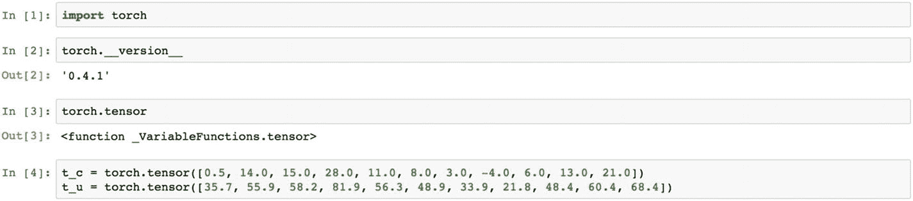

该样本模型只是一个线性方程，用于进行计算，而损失函数则定义为均方误差（MSE），如下所示。在本章后续内容中，我们将增加模型的复杂度。目前，这只是一个简单的线性方程计算。

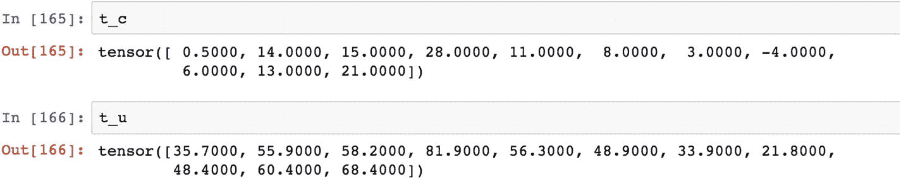

现在我们来定义模型。`w` 参数是权重张量，它与 `t_u` 张量相乘。结果加上一个常数张量 `b`，所选的损失函数是自定义的；该函数在 PyTorch 中也可用。在以下示例中，`t_u` 是使用的张量，`t_p` 是预测张量，`t_c` 是预先计算好的张量，需要将预测张量与 `t_c` 进行比较以计算损失函数。

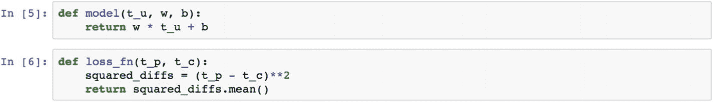

公式 `w * t_u + b` 是基于张量计算的线性方程表示。

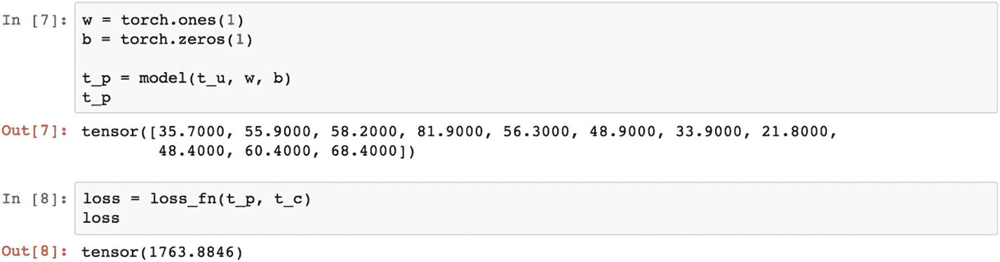

初始损失值为 1763.88，由于初始选择的权重，这个值过高。第一轮迭代中的误差会通过反向传播来减少第二轮迭代中的误差，因此需要更新初始权重集。因此，损失函数的变化率对于在估计过程中更新权重至关重要。

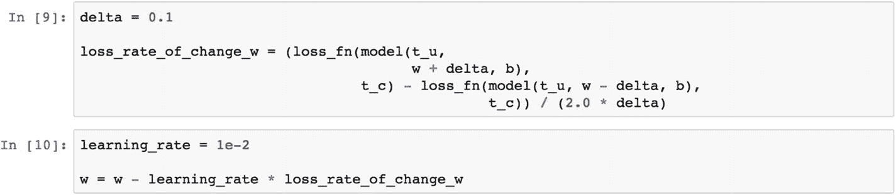

更新损失函数变化率有两个参数：当前迭代的学习率和前一次迭代的学习率。如果两次迭代之间的差值超过某个阈值，则需要更新权重张量，否则模型可能收敛。前面的脚本显示了差值和学习率的值。目前，这些是静态值，用户可以选择更改。

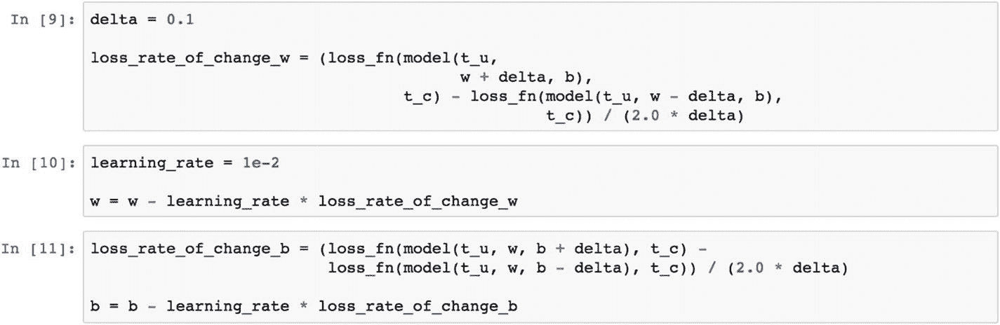

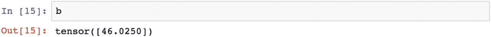

这就是一个简单的均方损失函数在二维张量示例（张量大小为 10,5）中的工作方式。

让我们看下面的例子。`MSELoss` 函数位于 PyTorch 的神经网络模块中。

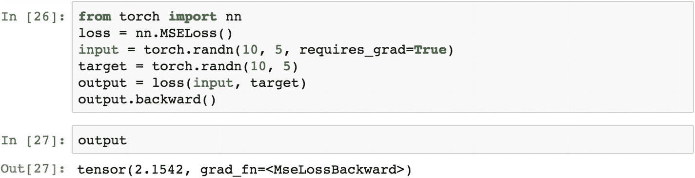

当我们查看用于反向传播的梯度计算时，它显示为 `MSELoss`。

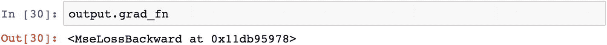

## 配方 3-2. 估计损失函数的导数

### 问题

如何估计损失函数的导数？

### 解决方案

使用以下示例，我们将损失函数改为输入张量与输出张量差值的两倍，而不是使用 `MSELoss` 函数。下面的 `grad_fn` 被定义为一个自定义函数，它向用户展示了最终输出如何获取损失函数的导数。

### 工作原理

让我们看下面的例子。在之前的秘籍中，脚本的最后一行显示`grad_fn`是嵌入在输出张量对象中的一个对象。在本秘籍中，我们将解释这是如何计算的。`grad_fn`是损失函数相对于模型参数的导数。这正是我们在下面的`grad_fn`中所做的。

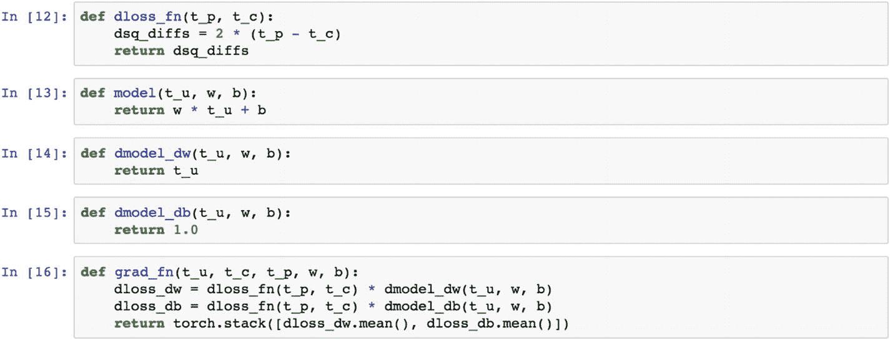

参数包括输入、偏置设置、学习率以及模型训练的轮数。对这些参数的估计为方程提供了数值。

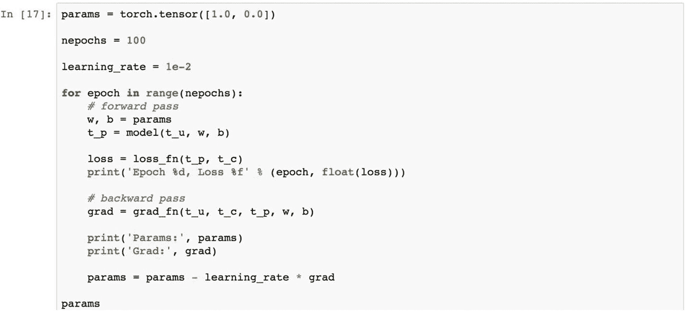

这是初始结果的样子。轮次（Epoch）是一次迭代，它根据之前定义的损失函数产生一个损失值。`params`向量是关于需要改变以最小化损失函数的系数和常量的。`grad`函数计算反馈值给下一个轮次。这只是一个例子。选择的轮次数是一个迭代任务，取决于输入数据、输出数据以及损失函数和优化函数的选择。

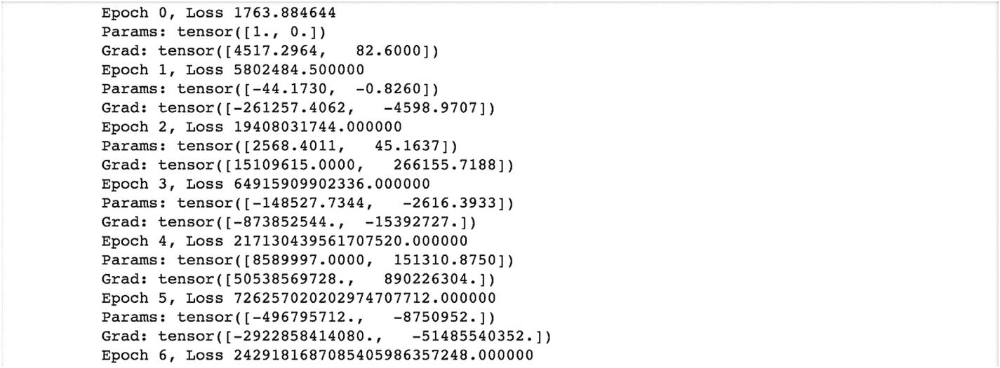

如果我们降低学习率，我们就能以更好的方式将相关值传递给梯度、进行参数更新，并且模型收敛会变得更快。

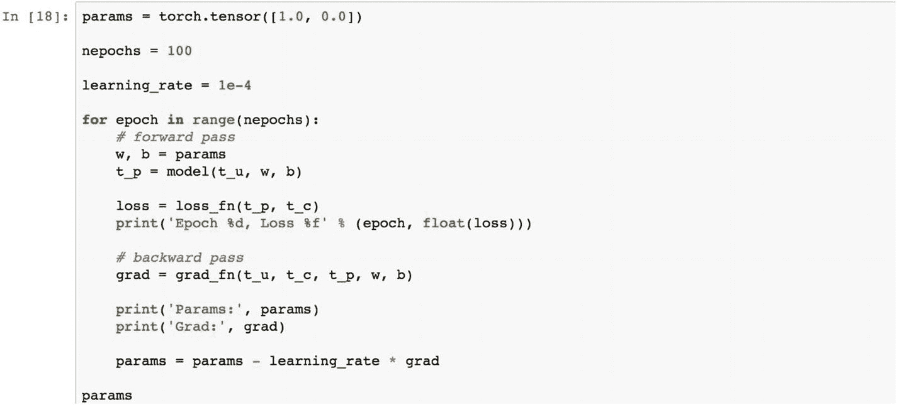

初始结果如下所示。结果是在第 5 轮时，损失值为 29.35，远低于第 0 轮时的 1763.88，并且对应于该轮次，在第 100 轮时估计的参数为 0.24 和-0.01。这些参数值是最优的。

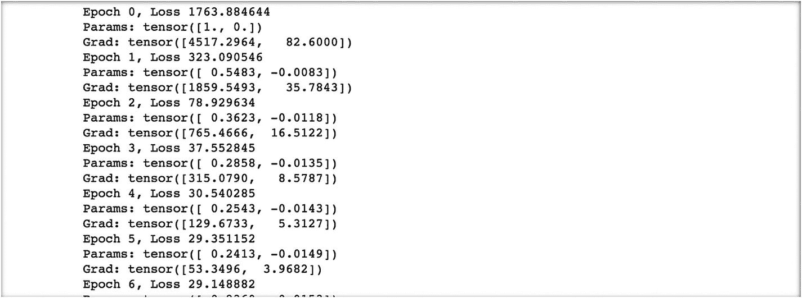

如果我们稍微降低学习率，那么权重更新的过程会慢一些，这意味着需要增加轮次数才能为模型找到稳定状态。

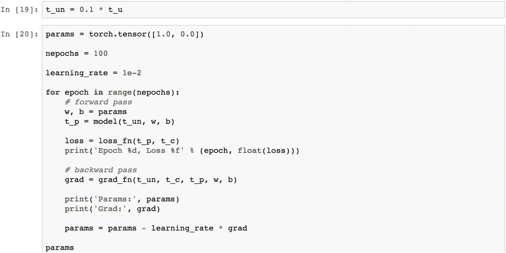

以下是我们观察到的结果。

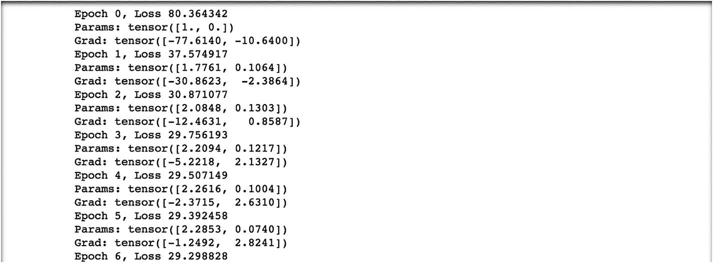

如果我们增加轮次数，那么损失函数和参数张量会发生什么变化，可以在下面的脚本中查看，我们在其中打印损失值以找到对应于轮次的最小损失。然后我们可以从模型中提取最佳参数。

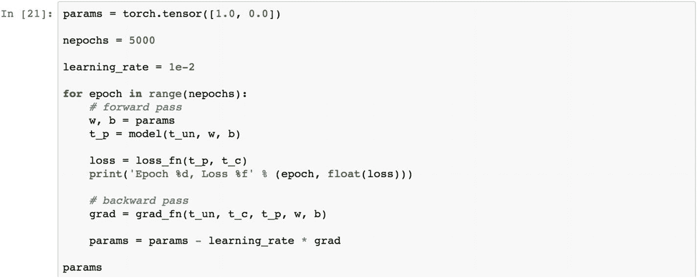

以下是结果。

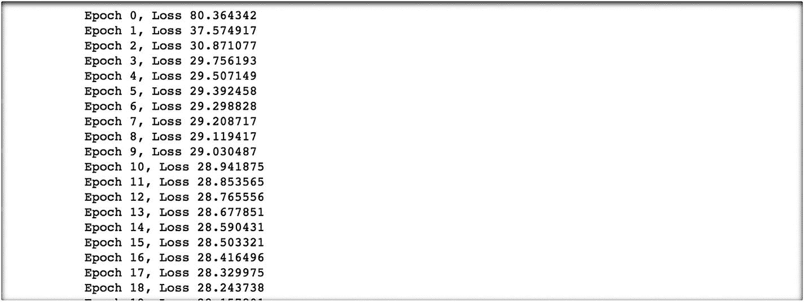

以下是最终轮次级别的最终损失值。

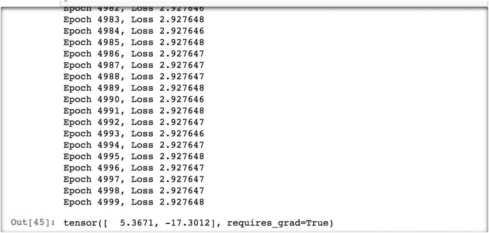

在第 5000 轮时，损失值为 2.92，并且不再下降；因此，在此迭代级别，张量输出显示最终权重为 5.36，最终偏置为-17.30。这些是来自模型的最终参数。

为了微调此模型以估计参数，我们可以重新定义模型和损失函数，并将其应用于同一个例子。

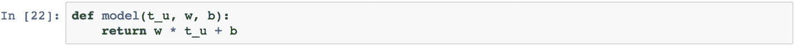

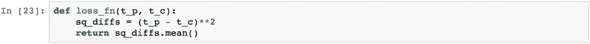

设置参数。完成训练过程后，我们应该将`grad`函数重置为`None`。

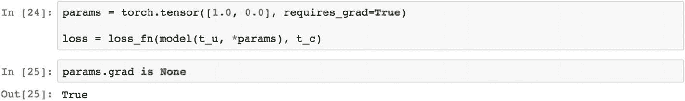

## 秘籍 3-3. 微调模型

### 问题

如何通过应用优化函数来优化损失函数，从而找到损失函数的梯度？

### 解决方案

我们将使用`backward()`函数。

### 工作原理

让我们看下面的例子。`backward()`函数计算函数相对于其参数的梯度。在本节中，我们使用一组新的超参数重新训练模型。

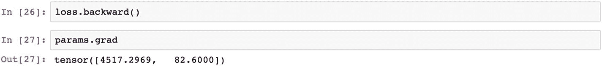

重置参数网格。如果我们不在现有会话中重置参数，来自任何其他会话累积的误差值就会混合在一起，因此重置参数网格非常重要。

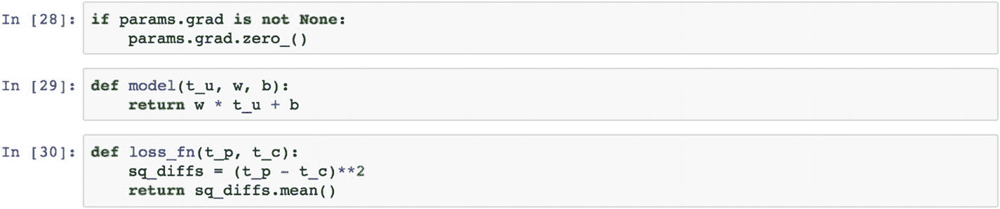

在重新定义模型和损失函数之后，让我们重新训练模型。

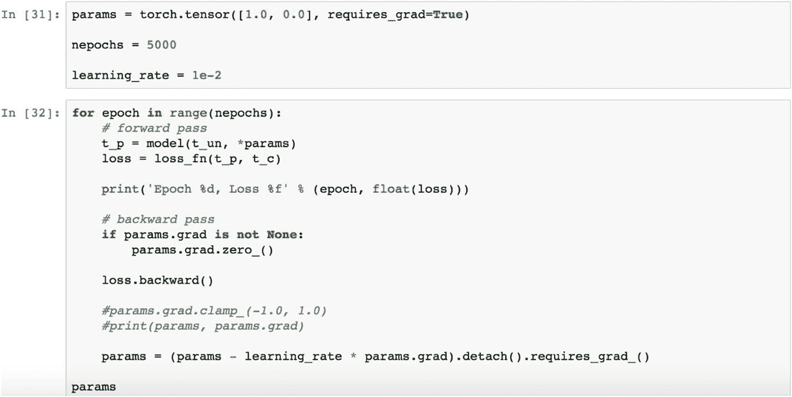

我们采用了 5000 轮。我们通过反向传播方法训练参数，并得到以下结果。在第 0 轮时，损失值为 80.36。我们尝试通过调整学习率，在进入下一次迭代时最小化损失值。在最后一轮，我们观察到损失值为 2.92，这与之前的结果相同，但使用了不同的损失函数和反向传播。

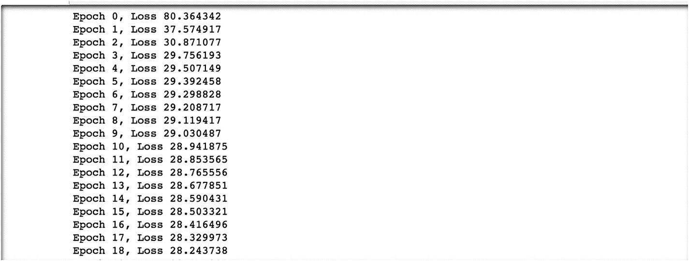

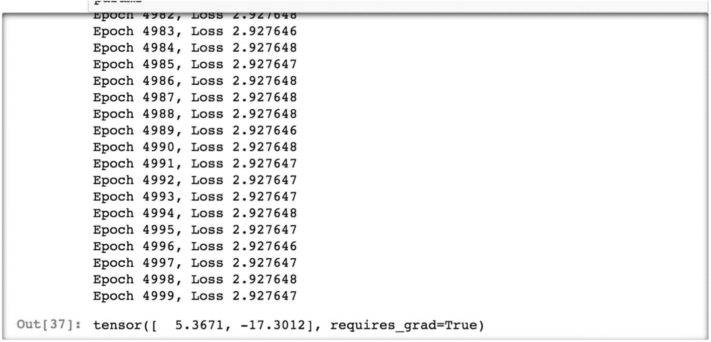

最终的模型参数为 5.3671，偏置为-17.3012。

## 秘籍 3-4. 选择优化函数

### 问题

如何使用秘籍 3-3 中的函数来优化梯度？

### 解决方案

PyTorch 中内置了一些函数，同时也有一些优化函数需要用户自行创建。

### 工作原理

让我们来看下面的示例。

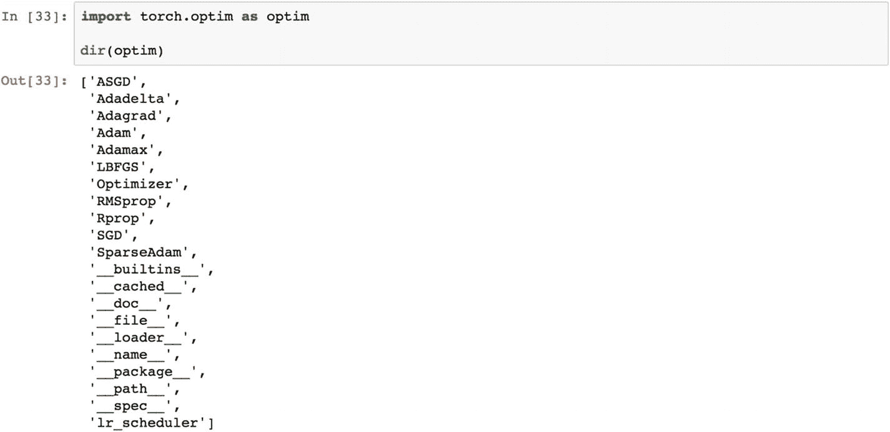

每种优化方法在解决问题时都独具特色。我们稍后将对此进行描述。

`Adam` 优化器是一种基于随机目标函数的一阶梯度优化方法。它基于低阶矩的自适应估计。其计算效率足以部署在大型数据集上。要使用 `torch.optim`，我们必须在代码中构建一个优化器对象，该对象将保存参数的当前状态，并根据计算出的梯度、矩和学习率来更新参数。要构建优化器，我们需要向其提供一个包含参数的可迭代对象，并确保所有参数都是待优化的变量。然后，我们可以指定优化器特定的选项，例如学习率、权重衰减、矩等。

`Adadelta` 是另一种优化器，其速度足以处理大型数据集。该方法无需手动微调学习率；算法会在内部自行处理。

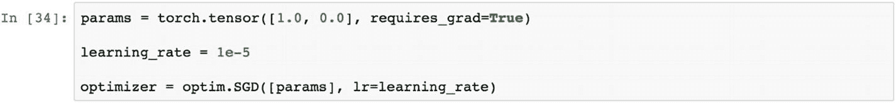

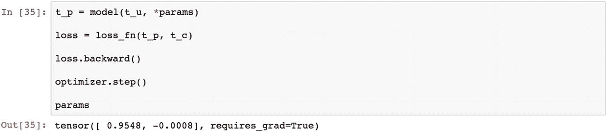

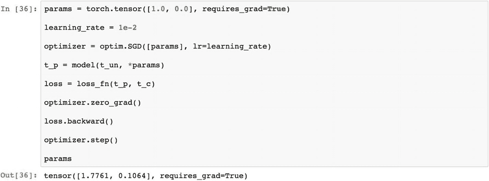

现在，让我们再次调用模型和损失函数，并将它们与优化函数一起应用。

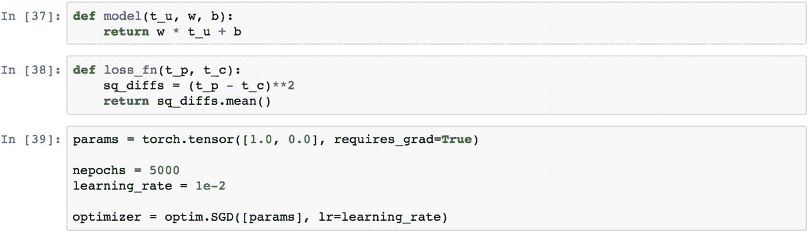

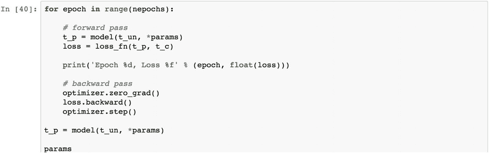

让我们观察损失函数中的梯度。利用优化库，我们可以尝试找到损失函数的最佳值。

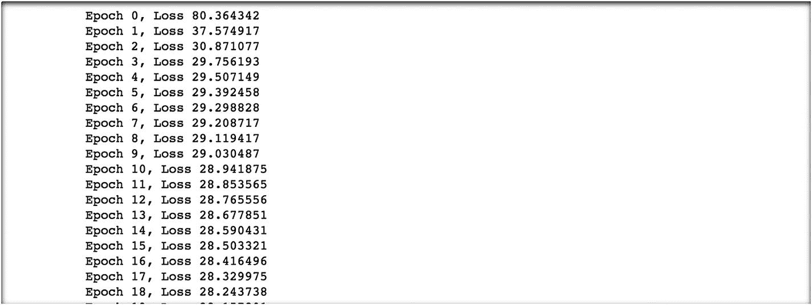

该示例包含两个自定义函数和一个损失函数。我们使用了两个小的张量值。新的变化在于，我们采用了优化器来寻找最小值。

在下面的示例中，我们选择了 `Adam` 作为优化器。

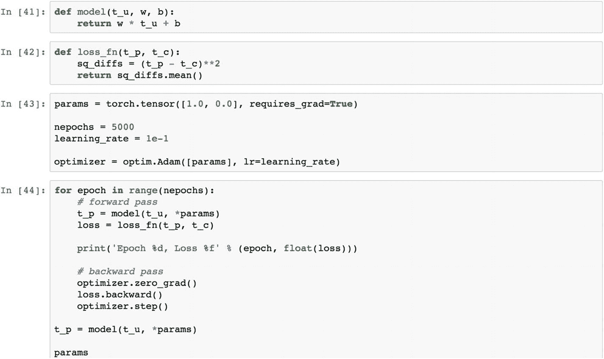

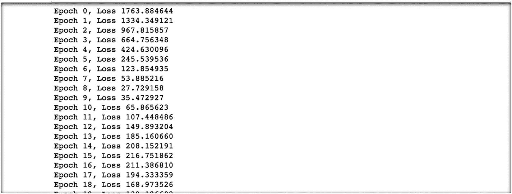

在上述代码中，我们计算了优化后的参数，并使用实际张量和预测张量计算了预测张量。我们可以显示一个包含回归线的图表。

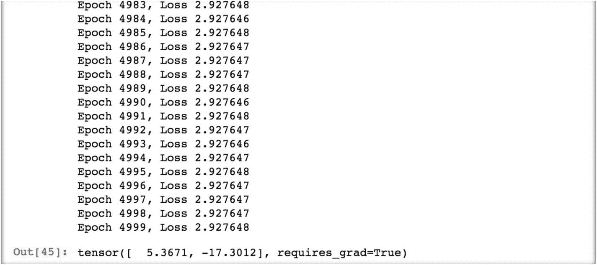

让我们使用实际张量和预测张量，以图形形式可视化样本数据。

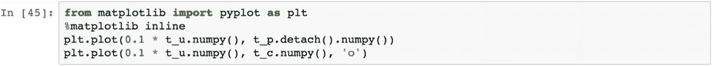

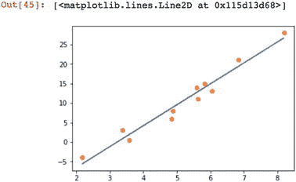

## 配方 3-5. 进一步优化函数

### 问题

如何使用随机样本优化训练集，并用验证集对其进行测试？

### 解决方案

我们将逐步介绍进一步优化的过程。

### 工作原理

让我们来看下面的示例。这里我们设置了样本数量，然后使用 `shuffled_indices` 将 20% 的数据作为验证样本。我们对所有记录进行了随机采样。训练集和验证集的目标是在训练集上构建模型，对验证集进行预测，并检查模型的准确性。

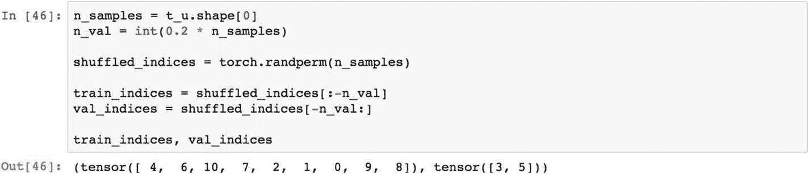

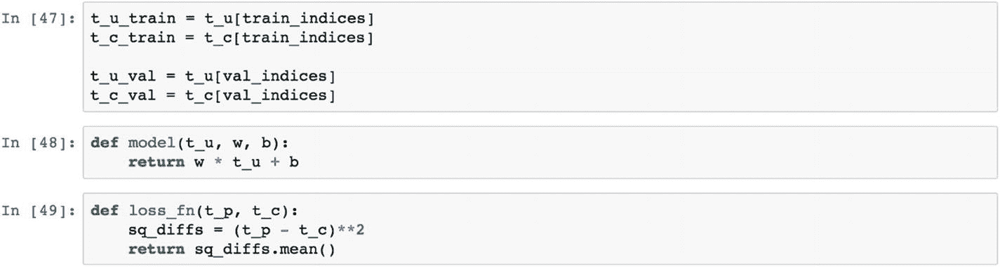

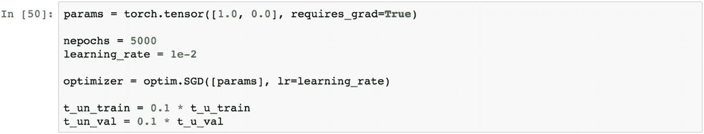

现在让我们运行训练和验证过程。我们首先获取训练输入数据，并将其与下一行的参数相乘。我们进行预测并计算损失函数。在第三行使用相同的模型，我们进行预测，然后评估验证数据集的损失函数。在反向传播过程中，我们计算训练集损失函数的梯度，并使用优化器更新参数。

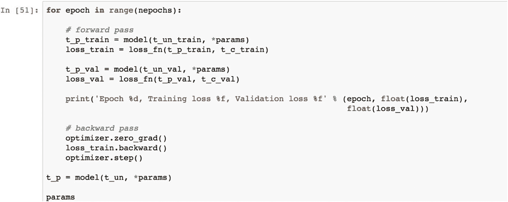

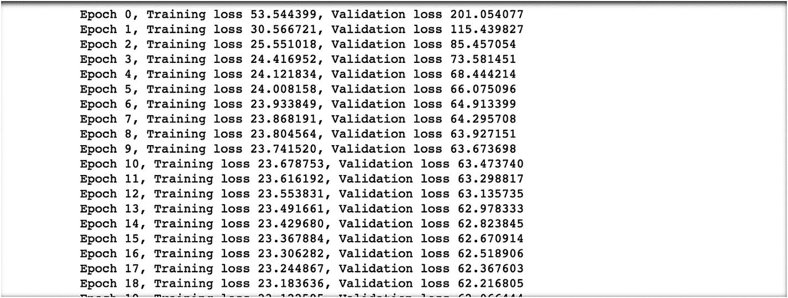

以下是最后 10 个周期及其结果。

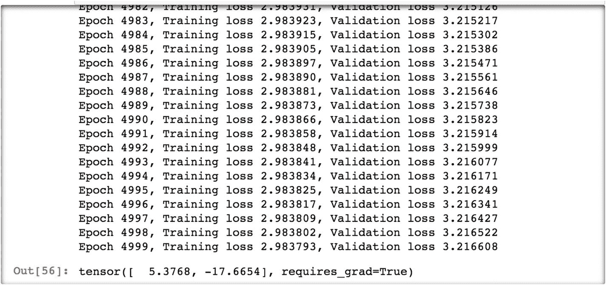

在上一步中，梯度被设置为 true。在接下来的步骤中，我们通过使用 `torch.no_grad()` 函数来禁用梯度计算。其余语法保持不变。当我们确定不会调用 `Tensor.backward()` 时，禁用梯度计算有助于进行推理。这可以减少那些原本 `requires_grad=True` 的计算的内存消耗。

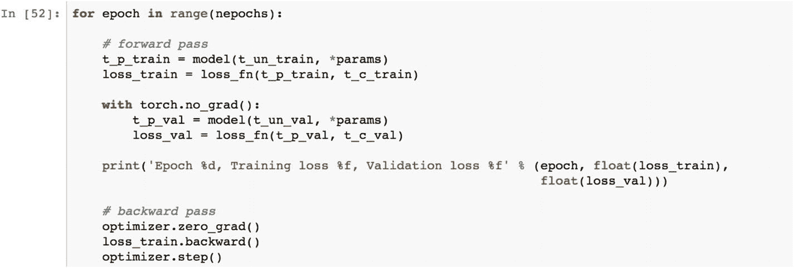

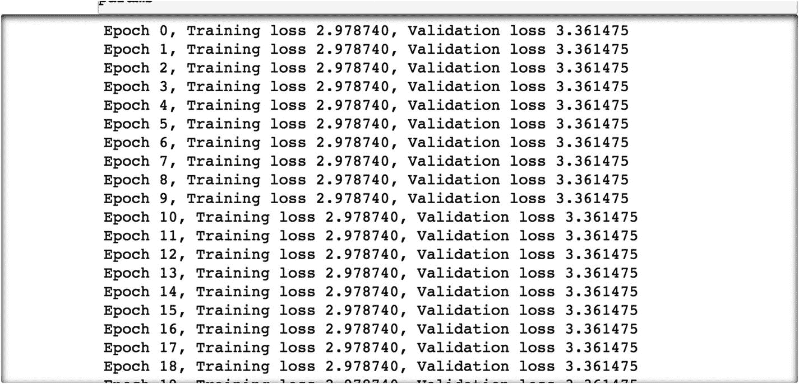

最后几轮周期的结果显示在以下其他代码行中。

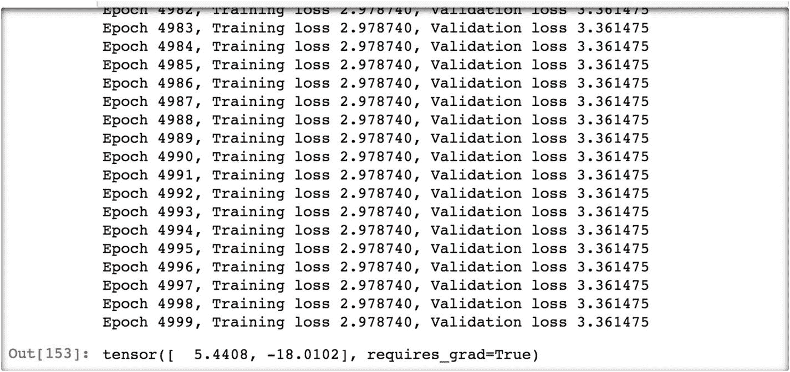

最终参数为 5.44 和 –18.012。

## 配方 3-6. 实现卷积神经网络 (CNN)

### 问题

如何使用 PyTorch 实现卷积神经网络？

### 解决方案

`torchvision` 上提供了多种内置数据集。我们考虑使用 MNIST 数据集，并尝试构建一个 CNN 模型。

### 工作原理

让我们来看下面的示例。第一步，我们设置超参数。第二步，建立网络架构。最后一步是训练模型并进行预测。

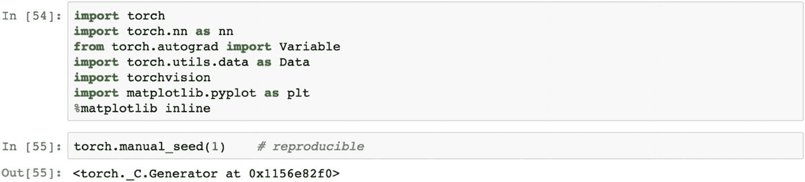

在上述代码中，我们导入了使用数字数据集部署卷积神经网络模型所需的库。`MNIST` 数字数据集是深度学习中用于计算机视觉和图像处理的最流行数据集。

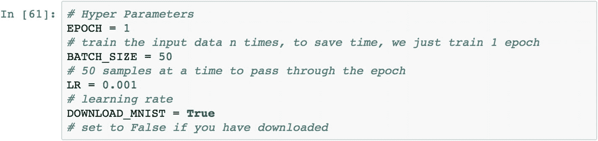


让我们使用加载器功能加载数据集。


在卷积神经网络架构中，输入图像会根据颜色乘以图像的高度和宽度被转换成一个特征集。由于数据集的维度，我们无法对其进行建模以预测输出。上图中的输出层包含诸如汽车、卡车、货车和自行车等类别。输入的自行车图像具有 CNN 模型应利用并正确预测的特征。卷积层总是伴随着池化层，池化层可以是最大池化或平均池化。不同的池化和卷积层会持续进行，直到维度降低到我们可以使用全连接的简单神经网络来预测正确类别的程度。


在上图中，如果我们观察数字 4，它分散在整个图中。理想情况下，所有的 4 应该彼此更接近。这是因为测试准确率非常低。


在此次迭代中，训练损失从 0.4369 降低到 0.1482，测试准确率从 16%提高到 94%。相同颜色的数字在图上紧密地放置在一起。


在下一个周期中，`MNIST` 数字数据集上的测试准确率提高到了 95%。


在最后一步/周期中，数字相似的样本被放置在一起。成功训练模型后，下一步是利用该模型进行预测。以下代码解释了预测过程。输出对象被编号为 0、1、2 等。下面显示了真实数字和预测数字。


## 配方 3-7. 重新加载模型

### 问题

如何存储并重新加载一个已经训练好的模型？鉴于深度学习模型通常需要较长的训练时间，这一计算过程会给公司带来巨大的成本。我们能否用新的输入重新训练模型并存储它？

### 解决方案

在生产环境中，我们通常无法同时进行训练和预测，因为训练过程耗时很长。在基于周期的训练过程完成之前，无法应用预测服务。因此，需要将训练过程与预测过程分离；我们需要存储应用程序训练好的模型，并持续到下一阶段的训练完成。

### 工作原理

让我们看下面的示例，我们创建了保存函数，该函数使用 `Torch` 神经网络模块来创建模型，并使用 `restore_net()` 函数来恢复之前训练好的神经网络模型。


上述脚本包含一个因变量 `Y` 和一个自变量 `X` 作为样本数据点，用于创建神经网络模型。下面的 `save` 函数用于存储模型。`net1` 对象是训练好的神经网络模型，可以通过两种不同的协议进行存储：(1) 保存包含所有权重和偏置的整个神经网络模型，(2) 仅使用权重保存模型。如果训练好的模型对象在大小上非常庞大，我们应该只保存权重参数；如果训练好的对象大小较小，则可以存储整个模型。


预构建的神经网络模型可以通过使用 `load` 函数重新加载到现有的 `PyTorch` 会话中。为了测试 `net1` 对象并进行预测，我们加载 `net1` 对象并将模型存储为 `net2`。通过使用 `net2` 对象，我们可以预测结果变量。以下脚本生成一个包含因变量和自变量的图。代码最后一行的 `prediction.data.numpy()` 显示了预测结果。


加载整个神经网络的 pickle 文件格式相对较慢；然而，如果我们只是对新数据集进行预测，我们可以仅以 pickle 格式加载模型的参数，而不是整个网络。


重用模型。`restore` 函数确保训练好的参数可以被模型重用。要恢复模型，我们可以使用 `load_state_dict()` 函数来加载模型的参数。如果我们在图中看到以下三个模型，它们是相同的，因为 `net2` 和 `net3` 是 `net1` 的副本。


## 配方 3-8. 实现循环神经网络 (RNN)

### 问题

如何使用 `MNIST` 数据集建立一个循环神经网络？

### 解决方案

循环神经网络被认为是一种记忆网络。我们将使用周期数设为 1，每次批量大小为 64 个样本，以建立输入和输出之间的连接。使用 RNN 模型，我们可以预测图像中存在的数字。

### 工作原理

让我们来看下面的例子。循环神经网络在输入层接收一个向量序列，并在输出层生成一个向量序列。信息序列通过循环层中的内部状态传递进行处理。有时，输出值对过去的历史值存在长期依赖关系。这是 RNN 模型的另一种变体：长短期记忆（LSTM）模型。这适用于任何以顺序方式消费信息的领域；例如，在时间序列中，当前股票价格由历史股票价格决定，其依赖关系可以是短期的或长期的。类似地，利用文本输入向量的长程和短程信息进行上下文预测。还有其他行业用例，例如噪声分类，其中噪声也是一个信息序列。

以下代码片段解释了如何使用 PyTorch 模块执行 RNN 模型。

有三组权重：`U`、`V` 和 `W`。由 `W` 表示的权重向量集用于在网络中的记忆单元之间传递信息，这些信息展示了隐藏状态之间的通信。RNN 使用基于 Word2vec 表示的嵌入层。嵌入矩阵的大小为词汇数量乘以隐藏层神经元数量。例如，如果你有 20,000 个单词和 1000 个隐藏单元，那么嵌入层的矩阵大小为 20,000×1000。新的表示被传递到 LSTM 单元，然后进入 sigmoid 输出层。


RNN 模型具有超参数，例如迭代次数（`EPOCH`）；取决于单台机器可用内存的批量大小；用于记住信息序列的时间步长；表示向量大小的输入大小；以及学习率。这些值的选择仅供参考；我们不能在其他用例中依赖它们。超参数调优的值选择是一个迭代过程；你可以选择多个参数并决定哪个有效，或者对模型进行并行训练并决定哪个运行良好。


使用 `dsets.MINIST()` 函数，我们可以将数据集加载到当前会话中。如果需要存储数据集，则将其下载到本地。


前面的脚本展示了样本图像数据集的样子。为了训练深度学习模型，我们需要将整个训练数据集转换为小批量，这有助于我们平均模型的最终准确率。通过使用数据加载器函数，我们可以加载训练数据并准备小批量。在小批量中进行随机选择的目的，是确保模型捕获到实际数据集中的所有变化。


前面的脚本准备了训练数据集。测试数据通过标志 `train=False` 捕获。它使用测试数据转换为张量，每次随机选取 2000 个样本用于测试模型。测试特征集被转换为变量格式，测试标签向量以 NumPy 数组格式表示。


在前面的 RNN 类中，我们正在训练一个 LSTM 网络，该网络被证明能有效长期保持记忆，从而有助于学习。如果我们使用 `nn.RNN()` 模型，它几乎无法学习参数，因为 RNN 的基本实现无法长时间保持或记住信息。在 LSTM 网络中，图像宽度被视为输入大小，隐藏大小由隐藏层中的神经元数量决定，`num_layers` 表示网络中 RNN 层的数量。

LSTM 模块内的 RNN 模块，输出一个大小为 64×10 的向量，因为输出层需要将数字分类为 0 到 9。最后的 forward 函数展示了如何在 RNN 网络中进行前向传播。

以下脚本展示了 LSTM 模型如何在 RNN 类下进行处理。在 LSTM 函数中，我们传递输入长度为 28，隐藏层神经元数量为 64，并从隐藏的 64 个神经元连接到输出的 10 个神经元。


为了优化所有 RNN 参数，我们使用 Adam 优化器。在函数内部，我们也使用了学习率。本例中使用的损失函数是交叉熵损失函数。我们需要提供多个周期来获得最佳参数。

在下面的脚本中，我们打印训练损失和测试准确率。一个周期后，测试准确率提高到 95%，训练损失降低到 0.24。


模型训练完成后，下一步是使用 RNN 模型进行预测。然后我们比较实际输出与真实输出，以评估模型的性能。


## 配方 3-9. 为回归问题实现 RNN

### 问题

如何为基于回归的问题设置循环神经网络？

### 解决方案

回归模型需要一个目标函数和一个特征集，然后需要一个函数来建立输入和输出之间的关系。在这个例子中，我们将使用循环神经网络（RNN）来完成回归任务。回归问题看起来非常简单；它们效果很好，但仅限于显示清晰线性关系的数据。在预测输入和输出之间的非线性关系时，它们相当复杂。

### 工作原理

让我们看下面的例子，它展示了输入和输出数据之间的非线性周期模式。在之前的配方中，我们看了一个 RNN 在分类相关问题上的通用例子，其中预测了输入图像的类别。然而，在回归中，RNN 的架构会发生变化，因为目标是预测实值输出。在回归相关问题中，输出层将只有一个神经元。


RNN 的时间步长意味着最后 10 个值预测当前值，然后滚动进行。

以下脚本展示了一些示例序列，其中目标 cos 函数由 sin 函数近似。


## 配方 3-10. 使用 PyTorch 内置函数

### 问题

如何使用 PyTorch 设置一个 RNN 模块并调用 RNN 函数？

### 解决方案

通过使用神经网络模块中可用的内置函数，我们可以实现一个 RNN 模型。

### 工作原理

让我们来看下面的例子。`PyTorch`库中的神经网络模块包含了`RNN`函数。在下面的脚本中，我们使用了输入矩阵的大小、隐藏层中的神经元数量以及网络中的隐藏层层数。


创建`RNN`类函数后，我们需要提供优化函数，即`Adam`，而这一次，损失函数是均方损失函数。由于目标是预测一个连续变量，我们在优化层中使用`MSELoss`函数。


现在，我们迭代 60 步来预测从样本空间生成的`cos`函数，并让它通过`sin`函数进行预测。迭代过程采用之前定义的学习率，并通过反向传播误差来减少均方误差（MSE），从而提高预测效果。


## 配方 3-11：使用自编码器

### 问题

如何使用自编码器函数进行聚类？

### 解决方案

无监督学习是机器学习的一个分支，它没有目标列，或者输出未定义。我们只需要理解数据中存在的独特模式。让我们看看图 3-1 中的自编码器架构。输入特征空间通过一个隐藏层被转换为一个更低维度的张量表示，然后再映射回相同的输入空间。位于正中间的层保存了自编码器的值。


图 3-1

自编码器架构

### 工作原理

让我们来看下面的例子。`torchvision`库包含了流行的数据集、模型架构和框架。自编码器是一个从数据集中识别潜在特征的过程；它用于分类、预测和聚类。如果我们将输入数据放入输入层，并将相同的数据集放入输出层，然后添加多个包含许多神经元的隐藏层，再经过一系列的训练周期（epochs），我们就能在最内层的隐藏层中获得一组潜在特征。中心隐藏层中的权重或参数被称为*自编码器层*。


我们再次使用 MNIST 数据集来试验自编码器的功能。这次我们采用 10 个训练周期，批量大小为 64 传入网络，学习率为 0.005，并使用 5 张图像进行测试。


下图展示了从`torchvision`库上传并以图像形式显示的数据集。


我们来讨论一下自编码器的架构。输入有 784 个特征，高度为 28，宽度为 28。我们将 784 个神经元从输入层传递到第一个隐藏层，该层有 128 个神经元。然后，我们应用双曲正切函数将信息传递到下一个隐藏层。第二个隐藏层包含 128 个输入神经元，并将其转换为 64 个神经元。在第三个隐藏层中，我们再次应用双曲正切函数将信息传递到下一个隐藏层。最内层包含三个神经元，被视为三个特征，这是编码器层的终点。然后，解码器函数将该层扩展回输出层的 784 个特征。


一旦我们设置好架构，就会开始正常的流程，即根据学习率和优化函数来最小化损失函数。整个架构会经过一系列的训练周期，以达到目标输出。

## 配方 3-12：使用自编码器微调结果

### 问题

如何设置迭代来微调结果？

### 解决方案

从概念上讲，自编码器的工作原理与聚类模型相同。在无监督学习中，机器从数据中学习模式，并将其泛化到新的数据集上。学习过程是通过获取一组输入特征来完成的。自编码器函数也用于特征工程。

### 工作原理

让我们来看下面的例子。我们仍然以相同的 MNIST 数据集为例，目标是理解训练周期在获得更好的自编码器层中的作用。我们增加训练周期的大小以将误差降至最低；然而，在实践中，增加训练周期会带来许多挑战，包括内存限制。


通过使用编码器函数，我们可以将输入特征表示为一组潜在特征。而通过使用解码器函数，我们可以重建图像。然后，我们可以对比使用自编码器函数进行图像重建的效果。从前面的一组图表中可以清楚地看出，随着训练周期的增加，图像识别变得清晰。

## 配方 3-13：在 3D 图中可视化编码数据

### 问题

如何在 3D 图中可视化 MNIST 数据？

### 解决方案

我们使用自编码器函数获取编码后的特征，然后使用数据集将其表示在 3D 平面上。

### 工作原理

让我们来看下面的例子。本配方是关于如何将前一个配方中推导出的自编码器函数表示在三维空间中，因为我们在最内层隐藏层中有三个神经元。下图展示了一个三维神经元。


## 配方 3-14：限制模型过拟合

### 问题

当我们拟合大量神经元和层来预测目标类别或输出变量时，函数通常会过拟合训练数据集。由于模型过拟合，我们无法在测试集上做出良好的预测。测试准确率与训练准确率不一致。训练和测试准确率之间会存在偏差。

### 解决方案

为了限制模型过拟合，我们有意引入了`dropout`比率，即随机删除（比方说）网络中 10%或 20%的权重，并同时检查模型准确率。如果我们在删除 10%或 20%的权重后，仍能达到相同的模型准确率，那么我们的模型就是好的。

### 工作原理

让我们看下面的例子。当训练好的模型无法泛化到其他测试场景时，就会发生模型过拟合。当训练准确率与测试准确率出现显著差异时，即可识别出过拟合。为了避免模型过拟合，我们可以在模型中引入`dropout`比率。


在隐藏层中引入`dropout`比率，可以确保将低于设定阈值的权重从网络架构中移除。应用程序`dropout`比率的典型阈值是 20%到 50%。20%的`dropout`比率意味着较小的惩罚力度；而 50%的阈值则意味着对模型权重的重度惩罚。

在下面的脚本中，我们应用了 50%的`dropout`比率来从模型中丢弃权重。我们应用了两次`dropout`比率。


选择合适的`dropout`比率需要对业务和领域有相当的了解。

## 方法 3-15. 可视化模型过拟合

### 问题

评估模型过拟合。

### 解决方案

我们改变模型超参数，并迭代地检查模型是否过拟合数据。

### 工作原理

让我们看下面的例子。上一个方法涵盖了两种类型的神经网络：过拟合和`dropout`比率。当从数据中估计出的模型参数对于训练数据集来说非常接近实际数据，而同样的模型在测试集上表现不同时，这就是模型过拟合的明显迹象。为了限制模型过拟合，我们可以引入`dropout`比率，它会删除一定比例的连接（即网络中的权重），以使训练后的模型更接近真实数据。

在下面的脚本中，迭代进行了 500 次。预测值分别由基础模型（显示过拟合）和`dropout`模型（显示删除了部分权重）生成。以同样的方式，我们创建了两个损失函数、反向传播以及优化器的实现。


初始的绘图轮次包括了过拟合损失和`dropout`损失，以及它们与上图中实际训练和测试数据点的差异。


经过多次迭代后，上图是通过使用实际模型和带有`dropout`比率的两个函数生成的。从这张图中可以得出的结论是，实际训练数据可能会更接近过拟合模型；然而，`dropout`模型对数据的拟合效果非常好。

## 方法 3-16. 在 Dropout 比率中初始化权重

### 问题

我们如何删除网络中的权重？是应该随机删除，还是使用某种分布来删除？

### 解决方案

我们应该基于概率分布来删除`dropout`层中的权重，而不是随机删除。

### 工作原理

让我们看下面的例子。在之前的方法中，引入了三个`dropout`比率层：一个在第一个隐藏层之后，两个在第二个隐藏层之后。概率百分比为 0.50，这意味着随机删除 50%的权重。有时，从网络中随机选择权重会删除相关的权重，因此一个替代方案是删除从统计分布中生成的网络权重。

下面的脚本展示了如何从均匀分布中生成权重，然后我们可以在网络架构中使用这组权重。


## 方法 3-17. 添加数学运算

### 问题

我们如何设置广播函数并优化卷积函数？

### 解决方案

下面的脚本片段展示了在设置卷积神经网络模型时如何引入批归一化，然后进一步设置池化层。

### 工作原理

让我们看下面的例子。为了在神经网络模型的卷积层中引入批归一化，我们需要执行基于张量的数学运算，这些运算在功能上与其他计算方法不同。


下面的脚本片段展示了在进入 2D 最大池化层之前，如何使用 2D 层解决批归一化问题。


## 方法 3-18. 在 RNN 中嵌入层

### 问题

循环神经网络主要用于文本处理。与原始特征相比，嵌入特征在标准 RNN 模型上能提供更高的准确率。我们如何在 RNN 中创建嵌入特征？

### 解决方案

第一步是创建一个嵌入层，它是一个固定的字典和固定大小的查找表，然后引入`dropout`比率，之后再创建门控循环单元。

### 工作原理

让我们看下面的例子。当文本数据以序列形式输入时，信息会以顺序方式被处理；例如，当我们描述某事物时，我们会按顺序使用一组词语来传达含义。如果我们使用单个词作为向量来表示数据，那么生成的数据集会非常稀疏。但是，如果我们使用基于短语的方法或词语组合来表示特征向量，那么这些向量就会变成一个密集层。密集向量层被称为*词嵌入*，因为嵌入层传达的是上下文或含义作为结果。这绝对比词袋方法要好。


## 结论

本章介绍了如何使用 PyTorch API 创建简单的神经网络模型，并通过调整超参数（即学习率、迭代次数、梯度下降）来优化参数。我们探讨了如何创建卷积神经网络和循环神经网络的方法，并介绍了在这些网络中引入 dropout 率以控制模型过拟合。

我们使用小型张量来追踪计算等过程背后的具体细节。我们只需定义问题陈述、创建特征并应用方法即可获得结果。在下一章中，我们将使用 PyTorch 实现更多示例。