# 4. 使用 PyTorch 的神经网络入门

基于深度神经网络的模型正逐渐成为人工智能和机器学习实现的支柱。未来数据挖掘的发展将由基于人工神经网络的先进建模技术所主导。一个显而易见的问题是，为什么神经网络直到现在才获得如此重要的地位，尽管它早在 20 世纪 50 年代就被发明了。

借鉴自计算机科学领域，神经网络可以被定义为一个并行信息处理系统，其中所有输入相互关联，就像人脑中的神经元一样，以传递信息，从而执行人脸识别、图像识别等活动。在本章中，你将学习如何将基于神经网络的方法应用于各种数据挖掘任务，例如分类、回归、预测和特征降维。*人工神经网络*（ANN）的功能方式与人脑功能相似，其中数十亿个神经元相互连接，用于信息处理和洞察生成。

## 方法 4-1. 使用激活函数

### 问题

什么是激活函数？它们在实际项目中如何工作？如何使用 PyTorch 实现激活函数？

### 解决方案

激活函数是一种数学公式，它根据数学变换函数的类型，将二进制、浮点或整数格式的向量转换为另一种格式。神经元存在于不同的层中——输入层、隐藏层和输出层，它们通过一种称为*激活函数*的数学函数相互连接。激活函数有不同的变体，接下来将进行解释。理解激活函数有助于准确实现神经网络模型。

### 工作原理

神经网络模型中所有激活函数可以大致分为线性函数和非线性函数。PyTorch 的 `torch.nn` 模块可以创建任何类型的神经网络模型。让我们看一些使用 PyTorch 和 `torch.nn` 模块部署激活函数的示例。

PyTorch 和 TensorFlow 之间的核心区别在于计算图的定义方式、两个框架执行计算的方式，以及我们在修改脚本和引入其他基于 Python 的库方面的灵活性。在 TensorFlow 中，我们需要在初始化模型之前定义变量和占位符。我们还需要跟踪稍后需要的对象，为此我们需要一个占位符。在 TensorFlow 中，我们需要先定义模型，然后编译并运行；然而，在 PyTorch 中，我们可以边定义模型边运行——我们不需要在代码中保留占位符。这就是 PyTorch 框架是动态的原因。

#### 线性函数

线性函数是一种简单的函数，通常用于将信息从解映射层传递到输出层。我们在数据变化较小的场景中使用线性函数。在深度学习模型中，实践者通常将线性函数用于从最后一个隐藏层到输出层。在线性函数中，输出始终限制在特定范围内；因此，它被用于深度学习模型的最后一个隐藏层，或基于线性回归的任务中，或用于需要从输入数据集预测结果的深度学习模型中。以下是其公式。

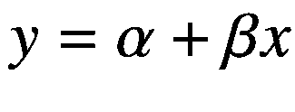

#### 双线性函数

双线性函数是一种简单的函数，通常用于传递信息。它对传入数据应用双线性变换。

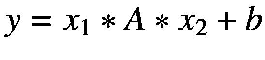

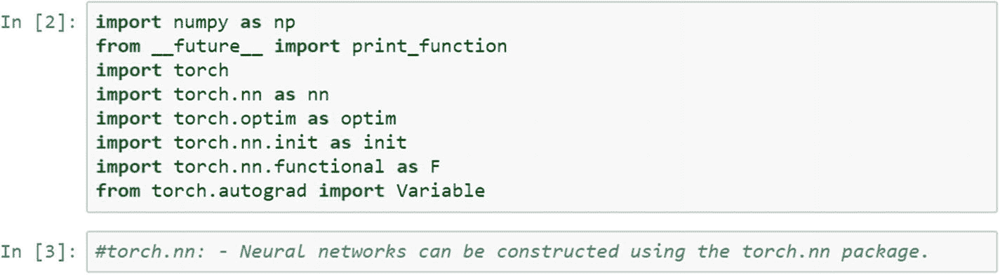

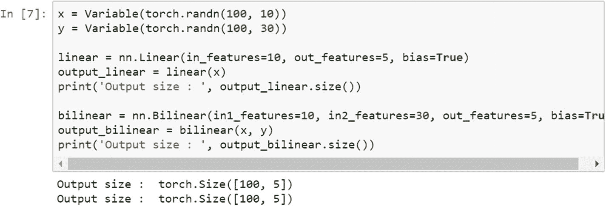

#### Sigmoid 函数

Sigmoid 函数经常被数据挖掘和分析领域的专业人士使用，因为它更容易解释和实现。它是一个非线性函数。当我们将权重从输入层传递到神经网络中的隐藏层时，我们希望模型能够捕获数据中存在的各种非线性；因此，建议在神经网络的隐藏层中使用 sigmoid 函数。非线性函数有助于对数据集进行泛化。使用非线性函数更容易计算函数的梯度。

Sigmoid 函数是一种特定的非线性激活函数。Sigmoid 函数的输出始终限制在 0 和 1 之间；因此，它主要用于执行基于分类的任务。Sigmoid 函数的局限性之一是它可能陷入局部最小值。其优点是它提供了属于某个类别的概率。以下是其方程。

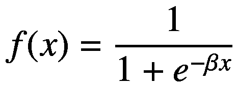

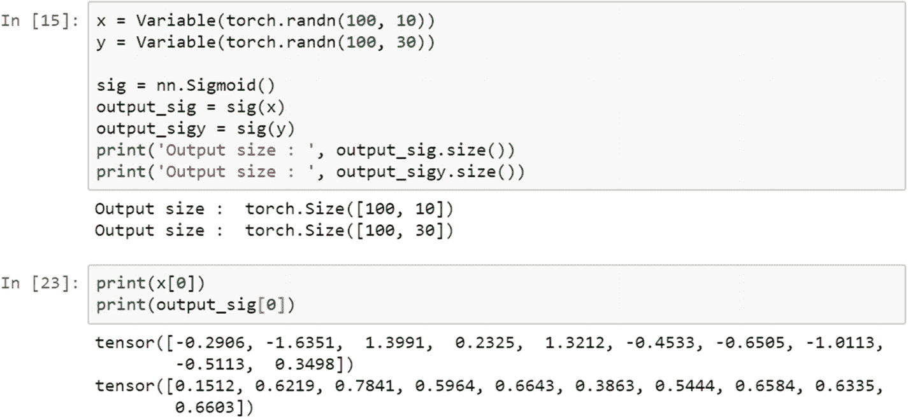

#### 双曲正切函数

双曲正切函数是变换函数的另一种变体。它用于将信息从映射层转换到隐藏层。它通常用于神经网络模型的隐藏层之间。`tanh` 函数的范围在 –1 到 +1 之间。

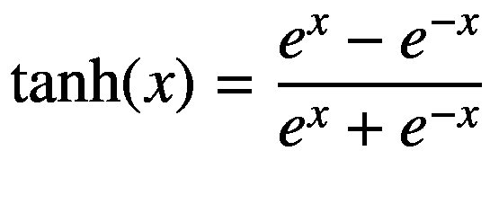

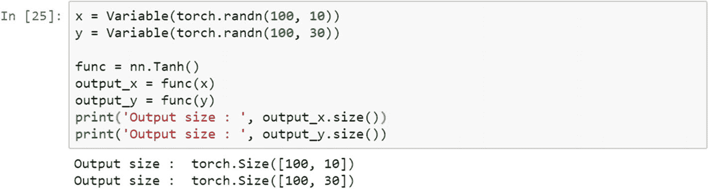

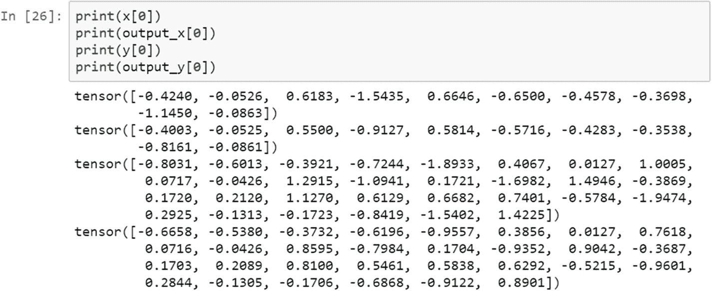

#### 对数 Sigmoid 传递函数

以下公式解释了对数 sigmoid 传递函数，它用于将输入层映射到隐藏层。如果数据不是二进制的，而是浮点类型且包含大量异常值（例如输入特征中存在较大的数值），那么我们应该使用对数 sigmoid 传递函数。

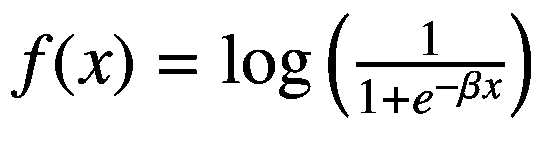

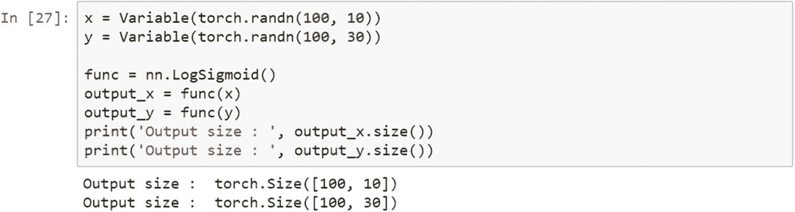

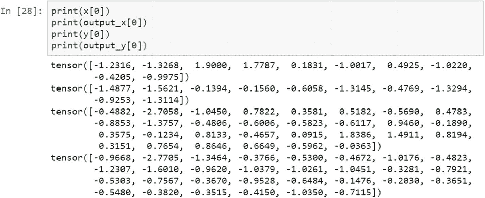

#### ReLU 函数

线性整流单元（`ReLU`）是另一种激活函数。它用于将信息从输入层传输到输出层。`ReLU` 主要应用于卷积神经网络模型中。该激活函数的取值范围是从 0 到无穷大。它通常用于神经网络模型中不同的隐藏层之间。

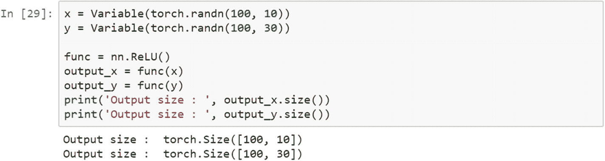

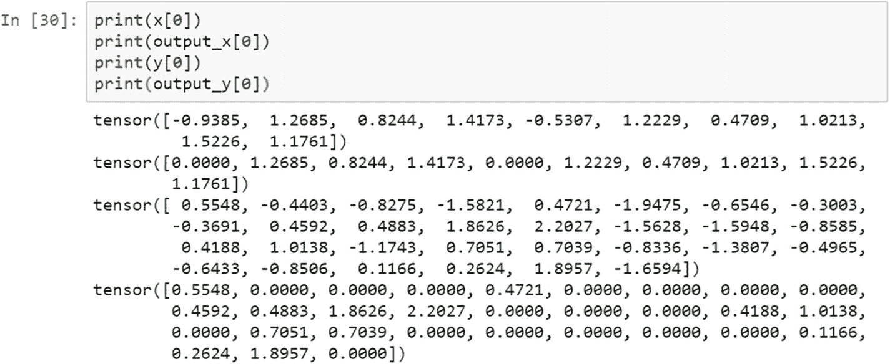

不同类型的传递函数在神经网络架构中可以互换使用。它们可以应用于不同阶段，例如从输入层到隐藏层、从隐藏层到输出层等，以提高模型的准确率。

#### 带泄露的 ReLU

在标准神经网络模型中，梯度消失问题很常见。为了避免这个问题，可以采用带泄露的 `ReLU`。当单元未激活时，带泄露的 `ReLU` 允许一个微小且非零的梯度。

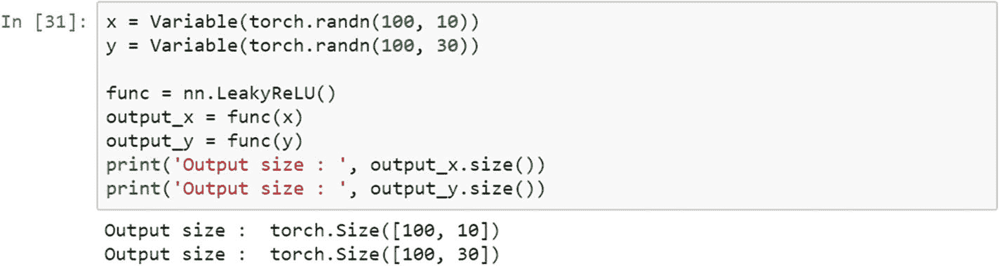

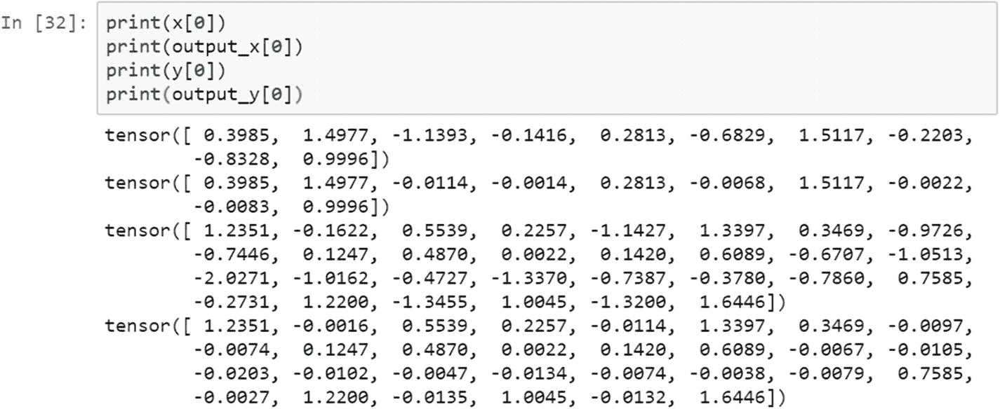

## 方法 4-2. 可视化激活函数的形状

### 问题

我们如何可视化激活函数？激活函数的可视化对于正确构建神经网络模型至关重要。

### 解决方案

激活函数将数据从一个层转换到另一个层。可以将转换后的数据与原始张量进行对比绘图，以实现函数的可视化。我们选取了一个样本张量，将其转换为 `PyTorch` 变量，应用该函数，并将其存储为另一个张量。使用 `matplotlib` 来表示原始张量和转换后的张量。

### 工作原理

正确选择激活函数不仅能提供更好的准确率，还有助于提取有意义的信息。

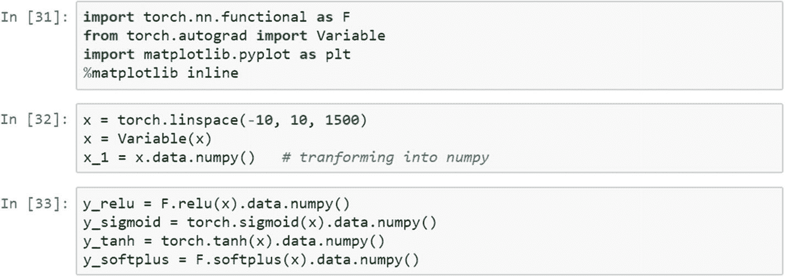

在此脚本中，我们有一个位于 -10 到 +10 线性空间内的数组，并且有 1500 个样本点。我们将该向量转换为 `Torch` 变量，然后复制一份作为 `NumPy` 变量用于绘制图形。接着，我们计算了激活函数。下图展示了这些激活函数。

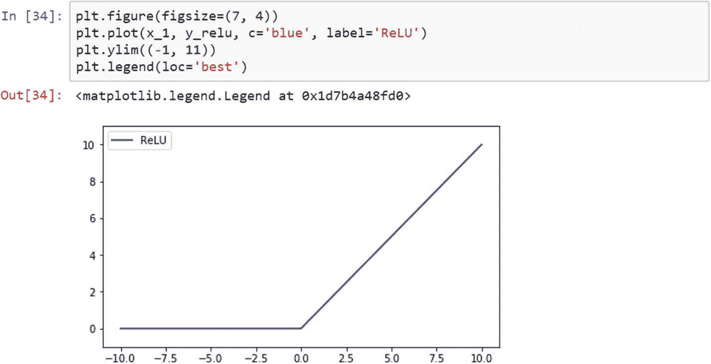

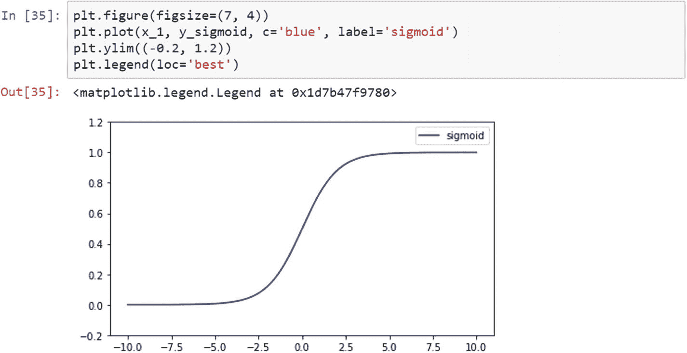

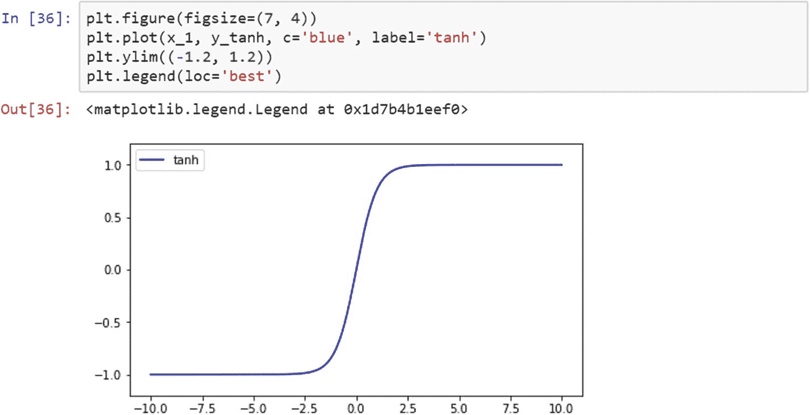

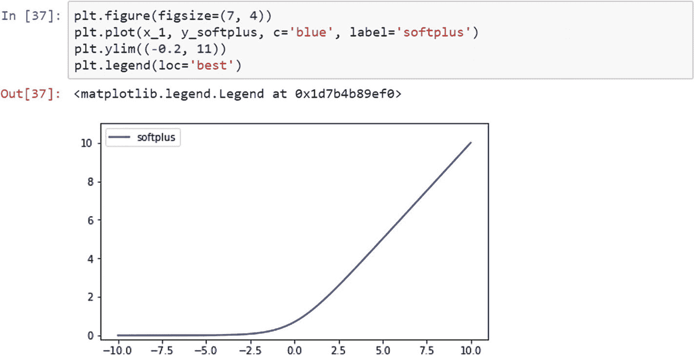

## 方法 4-3. 基础神经网络模型

### 问题

如何使用 `PyTorch` 构建一个基础神经网络模型？

### 解决方案

在 `PyTorch` 中构建基础神经网络模型需要六个步骤：准备训练数据、初始化权重、创建基础网络模型、计算损失函数、选择学习率，以及针对模型参数优化损失函数。

### 工作原理

让我们按照逐步的方法来创建一个基础神经网络模型。

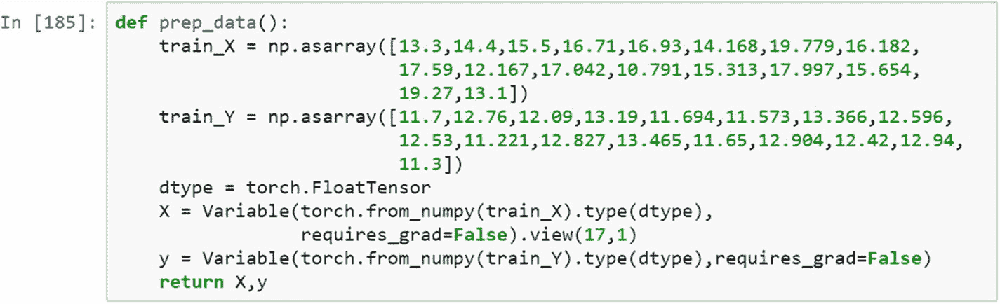

为了展示一个示例神经网络模型，我们准备数据集并将数据类型更改为浮点张量。当我们开展一个项目时，构建模型的数据准备是一项独立的活动。数据准备应以恰当的方式进行。在上一步中，`train_x` 和 `train_y` 是两个 `NumPy` 向量。接下来，我们将数据类型更改为浮点张量，因为这是矩阵乘法所必需的。下一步是将其转换为变量，因为变量具有三个有助于我们微调对象的属性。在该数据集中，我们在一个维度上有 17 个数据点。

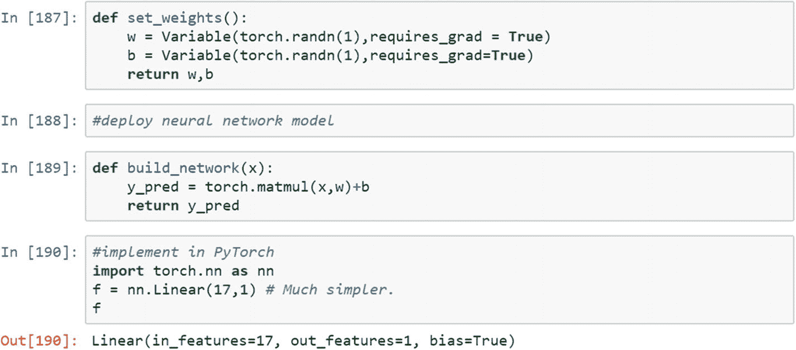

`set_weight()` 函数初始化神经网络模型在前向传播中将使用的随机权重。我们需要两个张量：权重和偏置。`build_network()` 函数简单地将权重与输入相乘，加上偏置，并生成预测值。这是我们构建的自定义函数。如果我们需要在 `PyTorch` 中实现同样的功能，那么当我们需要将其用于线性回归时，使用 `nn.Linear()` 会简单得多。

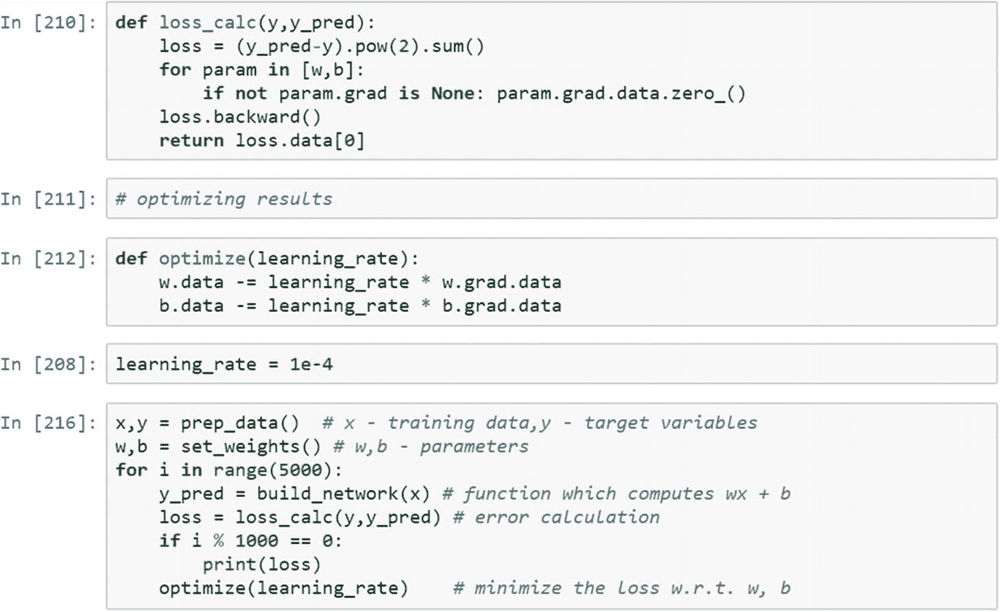

一旦我们定义了网络结构，就需要将结果与输出进行比较，以评估预测步骤。跟踪系统准确率的指标是损失函数，我们希望它尽可能小。损失函数可能有不同的形状。我们如何确切知道损失在何处最小，以及这对应哪一次迭代能提供最佳结果？要知道这一点，我们需要对损失函数应用优化函数；它会找到最小的损失值。然后我们可以提取与该迭代对应的参数。

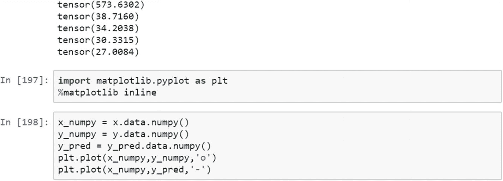

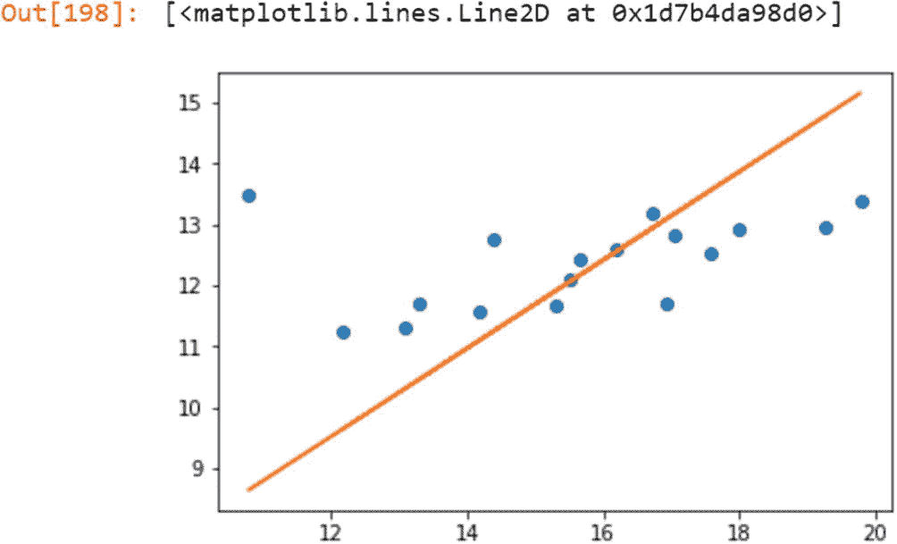

中位数、众数和标准差的计算可以用相同的方式编写。标准差显示了与集中趋势度量的偏差，这指示了数据/变量的一致性。它显示了数据中是否存在足够的波动。

## 方法 4-4. 张量微分

### 问题

什么是张量微分，以及它如何与使用 `PyTorch` 框架的计算图执行相关联？

### 解决方案

计算图网络由节点表示，并通过函数连接。有两种不同类型的节点：依赖节点和独立节点。*依赖节点*等待来自其他节点的结果来处理输入。*独立节点*是相互连接的，并且要么是常量，要么是结果。张量微分是在计算图环境中执行计算的一种高效方法。

### 工作原理

在计算图中，张量微分非常高效，因为张量可以作为并行节点、多进程节点或多线程节点进行计算。主流的深度学习与神经计算框架都包含了这种张量微分机制。

`Autograd` 是用于执行张量微分的函数，即计算误差函数的梯度或斜率，并通过神经网络反向传播误差，以微调权重和偏置。通过学习率和迭代，它试图降低误差值或损失函数。

要应用张量微分，需要使用 `nn.backward()` 方法。我们通过一个示例来看看误差梯度是如何反向传播的。为了更新损失函数的曲线，或者找到损失函数形状的最小值及其移动方向，需要进行导数计算。张量微分是一种在计算图中计算函数斜率的方法。

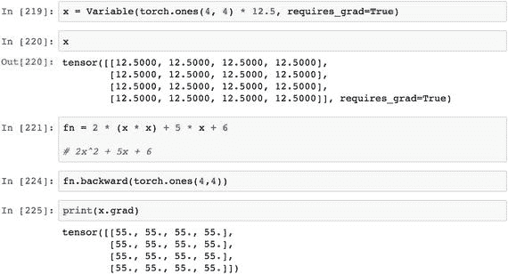

在此脚本中，`x` 是一个示例张量，需要对其执行自动梯度计算。`fn` 是一个使用 `x` 变量创建的线性函数。利用 `backward` 函数，我们可以执行反向传播计算。`.grad()` 函数则保存了张量微分的最终输出。

## 结论

本章讨论了各种激活函数及其在不同场景下的应用。选择最佳激活函数的方法或系统是以精度为导向的；在模型中应始终动态使用能给出最佳结果的激活函数。我们还使用小型示例张量创建了一个基础神经网络模型，通过优化更新权重，并生成了预测。下一章，我们将看到更多示例。

