# 5. 使用 PyTorch 进行监督学习

监督式机器学习是机器学习中最成熟的分支。它几乎应用于所有领域，包括人工智能、认知计算和语言处理。机器学习文献广泛讨论了三种学习类型：监督学习、无监督学习和强化学习。在监督学习中，机器学习识别输出；因此，它是任务驱动的，任务可以是分类或回归。

在无监督学习中，机器从数据中学习模式；因此，它能够泛化新的数据集，学习过程通过获取一组输入特征来完成。在强化学习中，学习是对系统响应情境的反应。

本章将结合机器学习方法详细讨论回归技术，并在业务场景的背景下解读回归方法的输出。算法分类如图 5-1 所示。

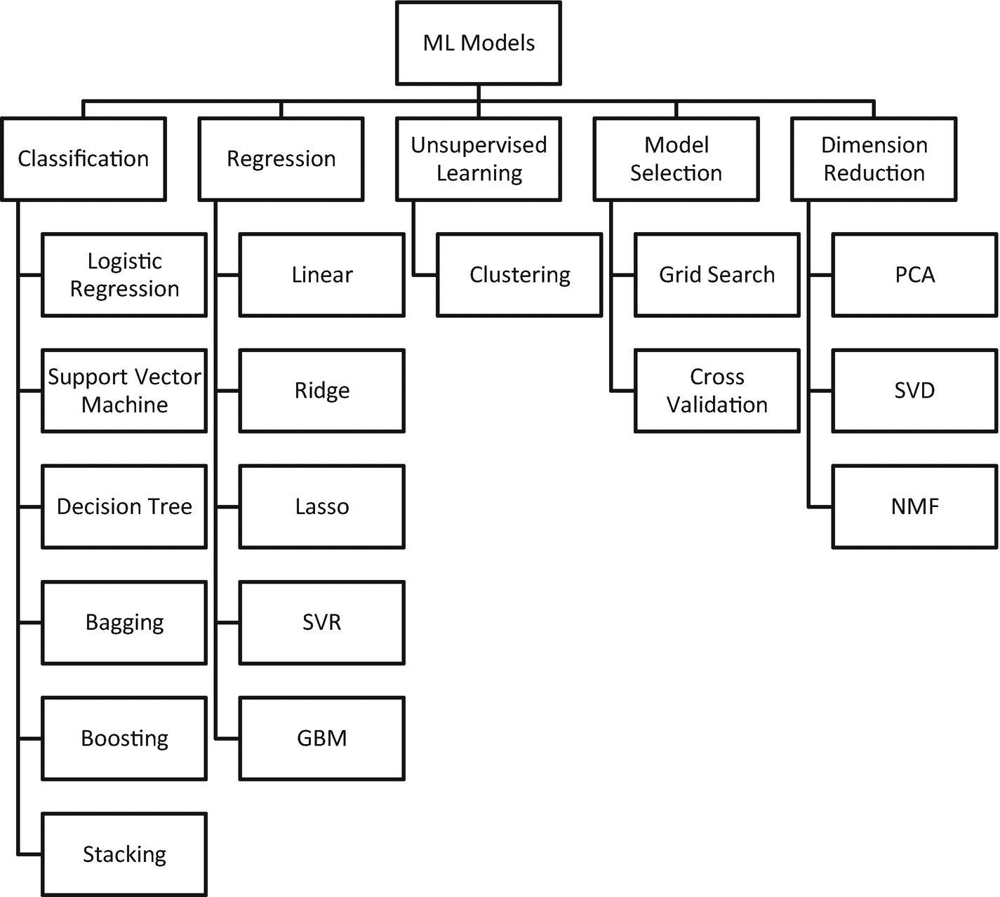

图 5-1

算法分类

每个对象或行代表一个事件，每个事件被归类到不同的组中。识别一条记录属于哪个层级组被称为*分类*，其中目标变量具有与事件相关联的特定标签或标记。例如，在银行数据库中，每个客户被标记为忠诚客户或非忠诚客户。在医疗记录数据库中，每位患者的疾病被标记。在电信行业，每个用户被标记为流失或非流失客户。这些都是监督算法执行分类的示例。“分类”一词来源于目标列中可用的类别。

在*回归学习*中，目标是预测一个连续变量的值；例如，给定房产的特征，如卧室数量、面积、周边区域、城镇等，从而确定房屋的售价。在这种情况下，可以使用回归模型。类似的例子还包括预测股票价格，或企业的销售额、收入和利润。

在无监督学习算法中，我们没有结果变量，也没有可用的标记或标签。我们感兴趣的是了解数据集中观测值、记录或行的自然分组。这种自然分组应满足：组内相似性最大，组间相似性最小。

在现实场景中，有时回归无法帮助预测目标变量。在监督回归技术中，输入数据也被称为*训练数据*。对于每条记录，都有一个具有连续数值的标签。模型通过训练过程来准备，该过程预测正确的输出，并持续进行直到达到所需的精度水平。我们可能需要更高级的回归方法来理解数据集中存在的模式。

## 线性回归简介

线性回归分析被誉为所有统计技术中最可靠、最易应用且应用最广泛的方法。它假设因变量与自变量之间存在线性、可加的关系。线性回归的目标是通过自变量来预测因变量或目标变量。线性回归模型的规范如下所示。

`Y = α + βX`

该公式具有一个特性：在保持其他所有变量固定的情况下，对`Y`的预测是每个`X`变量的线性函数，并且不同`X`变量对预测的贡献是可加的。它们各自与`Y`的线性关系的斜率即为变量的系数。系数和截距通过最小二乘法进行估计（即，将它们设置为能够使模型拟合数据样本内误差平方和最小化的唯一值）。

该模型的预测误差通常被假定为独立且服从相同的正态分布。当贝塔系数为零时，输入变量`X`对因变量没有影响。`OLS`方法试图最小化残差平方和。残差定义为散点图中回归线上的点与实际数据点之间的差值。该过程旨在估计多元线性回归模型中的贝塔系数。

让我们以一个包含 15 个人的样本数据集为例。我们记录每个人的身高和体重。仅凭他们的身高，我们能否使用线性回归技术预测一个人的体重？答案是肯定的。

| **人员** | 1 | 2 | 3 | 4 | 5 | 6 | 7 | 8 | 9 | 10 | 11 | 12 | 13 | 14 | 15 |
| --- | --- | --- | --- | --- | --- | --- | --- | --- | --- | --- | --- | --- | --- | --- | --- |
| **身高** | 58 | 59 | 60 | 61 | 62 | 63 | 64 | 65 | 66 | 67 | 68 | 69 | 70 | 71 | 72 |
| **体重** | 115 | 117 | 120 | 123 | 126 | 129 | 132 | 135 | 139 | 142 | 146 | 150 | 154 | 159 | 164 |

为了用图形表示，我们在 x 轴上测量身高，在 y 轴上测量体重。线性回归方程显示在图表上，其中截距为 87.517，系数为 3.45。数据点由圆点表示，连接线显示了线性关系（见图 5-2）。

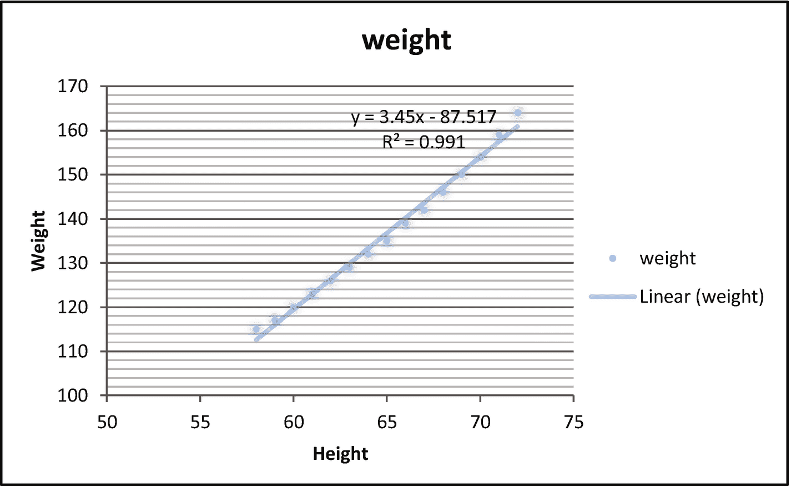

图 5-2

身高与体重的关系

当大多数现实场景反映的是线性关系以外的其他类型关系时，我们为何要假设因变量与一组自变量之间存在线性关系？我们坚持使用线性关系的原因如下所述。

它易于理解和解释。有多种方法可以将现有的非线性偏差转换为线性关系。生成预测也很简单。

预测建模领域主要关注于最小化预测模型中的误差，或做出尽可能准确的预测。线性回归是在统计学领域发展起来的。它被作为理解数值变量输入与输出之间关系的模型来研究，但已被机器学习领域借鉴。它既是一种统计算法，也是一种机器学习算法。线性回归模型依赖于以下一组假设。

-   因变量与自变量之间存在线性关系。
-   预测变量之间不应存在多重共线性。如果在输入特征空间中有两个以上的预测变量，则输入特征不应相关。
-   不应存在自相关。
-   不应存在异方差性。误差项的方差在另一个轴上的预测变量之间应保持恒定，这意味着误差方差应是恒定的。
-   误差项应服从正态分布。误差项基本上定义为实际变量与预测变量之间的差值。

在线性回归中，存在不同的变体，但在机器学习中，我们将其视为一种方法。例如，如果我们使用一个解释变量来预测因变量，则称为*简单线性回归模型*。如果我们使用多个解释变量，则该模型称为*多元线性回归模型*。普通最小二乘法是一种用于预测线性回归模型的统计技术；因此，线性回归模型有时也被称为*普通最小二乘模型*。

线性回归对缺失值和异常值非常敏感，因为计算线性回归的统计方法依赖于变量之间的均值、标准差和协方差。均值对异常值敏感；因此，在着手构建线性回归模型之前，我们需要清理掉异常值。

在机器学习文献中，获取能够最小化回归模型误差的最优贝塔系数的方法被称为*梯度下降算法*。梯度下降算法是如何工作的？它从一个初始值开始（最好从零开始），并通过一个学习率定期迭代地更新缩放因子，以最小化误差项。

基于机器学习方法理解线性回归需要特殊的数据准备，通过保持原始数据不变来避免假设。需要进行数据转换以使模型更加稳健。

## 配方 5-1. 监督模型的数据准备

### 问题

如何使用`PyTorch`为创建监督学习模型进行数据准备？

### 解决方案

我们采用一个开源数据集`mtcars.csv`，这是一个回归数据集，用于测试如何创建输入和输出张量。

### 工作原理

首先，需要导入必要的库。

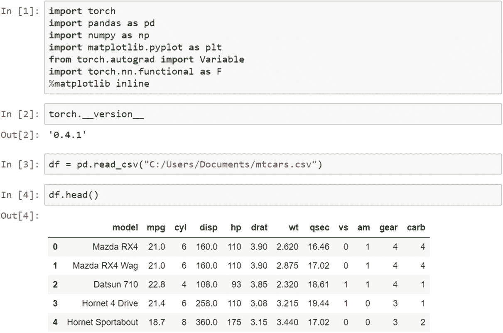

监督算法的预测变量是`qsec`，用于预测汽车每加仑的行驶里程。这里重要的是数据类型。首先，我们将`NumPy`格式的数据导入为`PyTorch`张量格式。默认的张量格式是浮点型。在执行优化函数时，使用浮点型张量格式会导致错误，因此更改张量数据类型非常重要。我们可以通过使用`unsqueeze`函数并指定维度等于 1 来重新格式化张量类型。

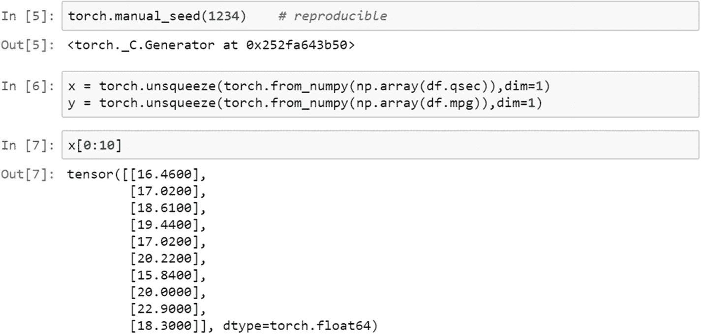

为了重现相同的结果，需要设置一个手动种子；因此使用了`torch.manual_seed(1234)`。尽管我们看到数据类型是张量，但如果检查`type`函数，它会显示为双精度型，因为优化函数需要双精度类型的张量。

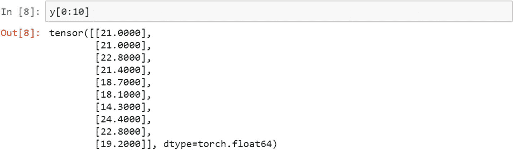

## 配方 5-2. 前向传播与反向传播

### 问题

如何构建一个神经网络 torch 类函数，以便构建前向传播方法？

### 解决方案

设计神经网络类函数，包括从输入层到隐藏层以及从隐藏层到输出层的结构。在神经网络架构中，还需要指定隐藏层中的神经元数量。

### 工作原理

在`Net()`类的函数中，我们首先初始化特征层、隐藏层和输出层。然后，我们引入反向传播函数，并在隐藏层中使用修正线性单元作为激活函数。

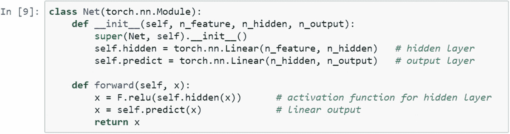

下图展示了`ReLU`激活函数。它被广泛用于各种神经网络模型；然而，激活函数的选择应基于准确率。如果`sigmoid`函数能获得更高的准确率，我们应该考虑使用它。

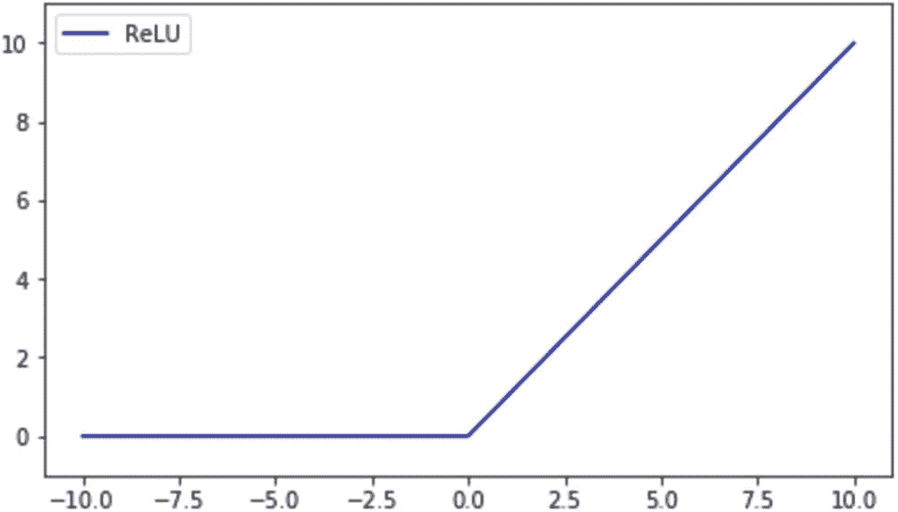

现在，网络架构在监督学习模型中提及。`n_feature`表示输入层中的神经元数量。由于我们有一个输入变量`qsec`，我们将使用 1。隐藏层中的神经元数量可以根据输入和学习模型所需的准确度来决定。我们将`n_hidden`设为 20，这意味着隐藏层 1 中有 20 个神经元，输出神经元为 1。

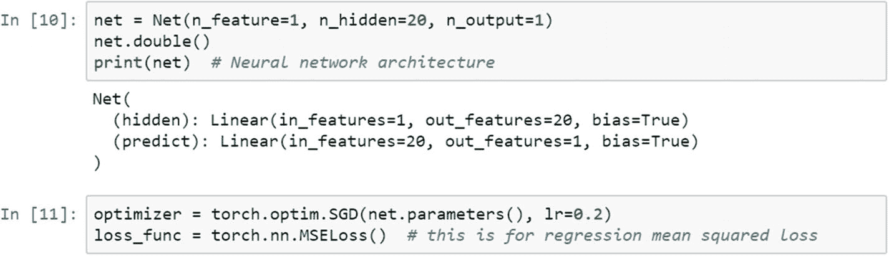

优化函数的作用是最小化相对于参数和学习率定义的损失函数。这里选择的学习率是 0.2。我们还将神经网络参数传递给优化器。有多种优化函数。

*   `SGD`：实现随机梯度下降（可选带动量）。参数可能包括动量、学习率和权重衰减。
*   `Adadelta`：自适应学习率。有五个不同的参数：网络的参数、用于计算梯度平方运行平均值的系数、为实现模型数值稳定性而添加的项、学习率以及用于应用正则化的权重衰减参数。
*   `Adagrad`：用于在线学习和随机优化的自适应次梯度方法。参数包括用于优化学习率的可迭代参数、学习率衰减以及权重衰减。
*   `Adam`：一种随机优化方法。该函数有六个不同的参数：用于优化的可迭代参数、学习率、`betas`（用于计算梯度及其平方运行平均值的系数）、用于改善数值稳定性的参数等。
*   `ASGD`：通过平均加速随机逼近。它有五个不同的参数：用于优化的可迭代参数、学习率、衰减项、权重衰减等。
*   `RMSprop`算法：使用计算出的梯度幅度来归一化梯度。
*   `SparseAdam`：实现适用于稀疏张量的`Adam`算法的惰性版本。在此变体中，仅更新梯度中出现的矩，并且仅将梯度的这些部分应用于参数。

除了优化函数之外，在运行监督学习模型之前还需要选择一个损失函数。同样，有多种损失函数；让我们看看误差函数。

*   `MSELoss`：创建一个标准，用于衡量输入变量和目标变量中元素之间的均方误差。对于回归相关问题，这是最佳的损失函数。

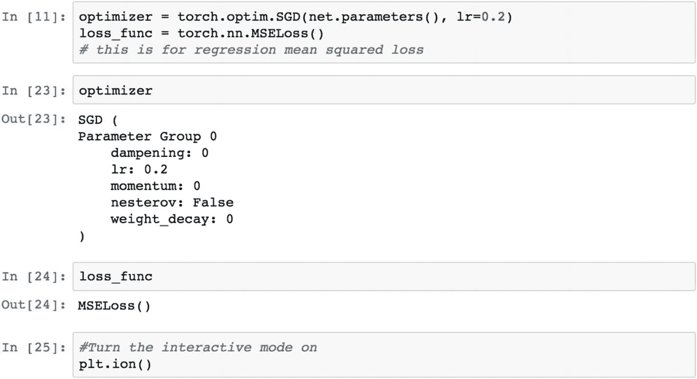

在运行监督学习模型（这是一个回归模型）之后，我们需要打印实际值与预测值，并以图形格式呈现它们；因此，我们需要开启模型的交互式功能。

## 配方 5-3\. 优化与梯度计算

### 问题

如何使用 PyTorch 通过不同的迭代构建一个基本的监督神经网络训练模型？

### 解决方案

PyTorch 中的基本神经网络模型需要六个不同的步骤：准备训练数据、初始化权重、创建基本网络模型、计算损失函数、选择学习率，以及相对于模型参数优化损失函数。

### 工作原理

让我们按照逐步的方法来创建一个基本的神经网络模型。

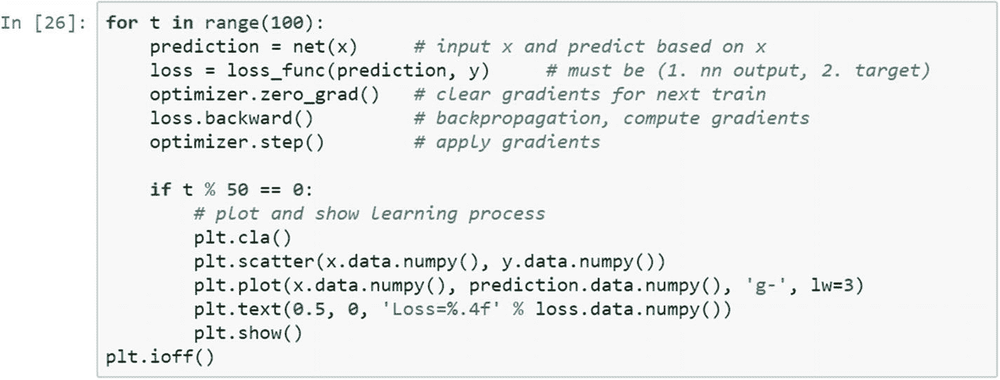

模型在第一次迭代和最后一次迭代的最终预测结果现在呈现在下图中。

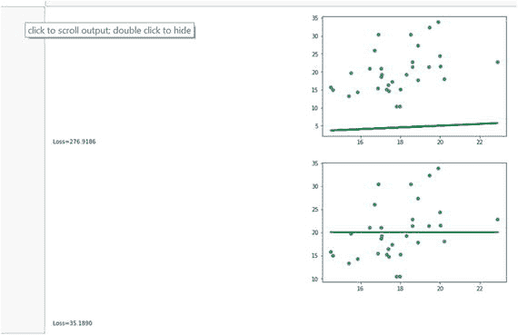

在初始步骤中，损失函数为 276.91。优化后，损失函数变为 35.1890。图中展示了拟合的回归线及其与数据集的拟合方式。

## 配方 5-4\. 查看预测结果

### 问题

如何从基于 PyTorch 的监督学习模型中提取最佳结果？

### 解决方案

计算图网络由节点表示，并通过函数连接。可以应用各种技术来最小化误差函数并获得最佳的预测模型。我们可以增加迭代次数、评估损失函数、优化函数、打印实际值和预测值，并将其显示在图表中。

### 工作原理

要应用张量微分，需要调用 `nn.backward()` 方法。我们通过一个示例来了解误差梯度是如何反向传播的。`grad()` 函数保存了张量微分的最终输出。

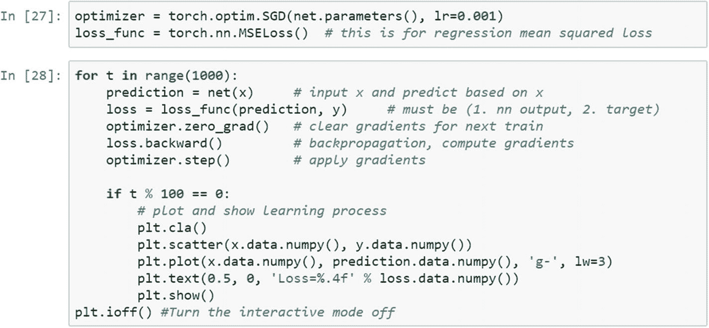

以下方法可以调整参数，从而提高监督学习模型（此处为回归用例）的准确性。

- 迭代次数
- 损失函数类型
- 优化方法的选择
- 损失函数的选择
- 学习率
- 学习率衰减
- 优化所需的动量

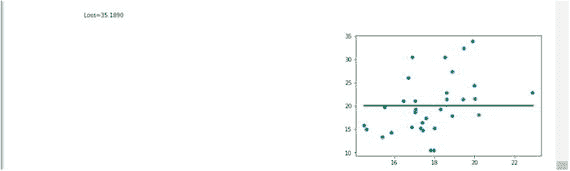

真实数据集如下所示。

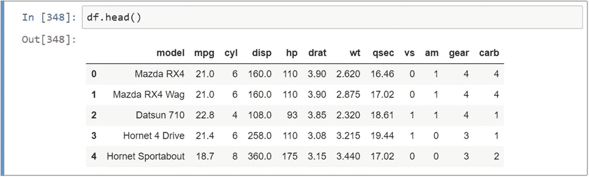

以下脚本说明了如何从 `mtcars.csv` 数据集中读取 `mpg` 和 `qsec` 列。它使用 `unsqueeze` 函数将这两个变量转换为张量，然后在神经网络模型中使用它们进行预测。

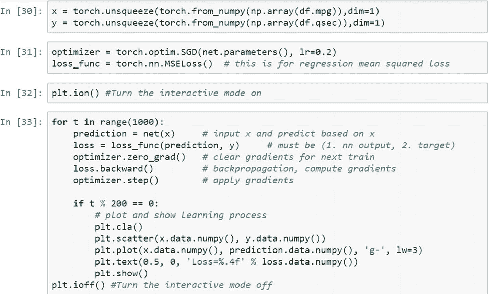

经过 1000 次迭代后，模型收敛。

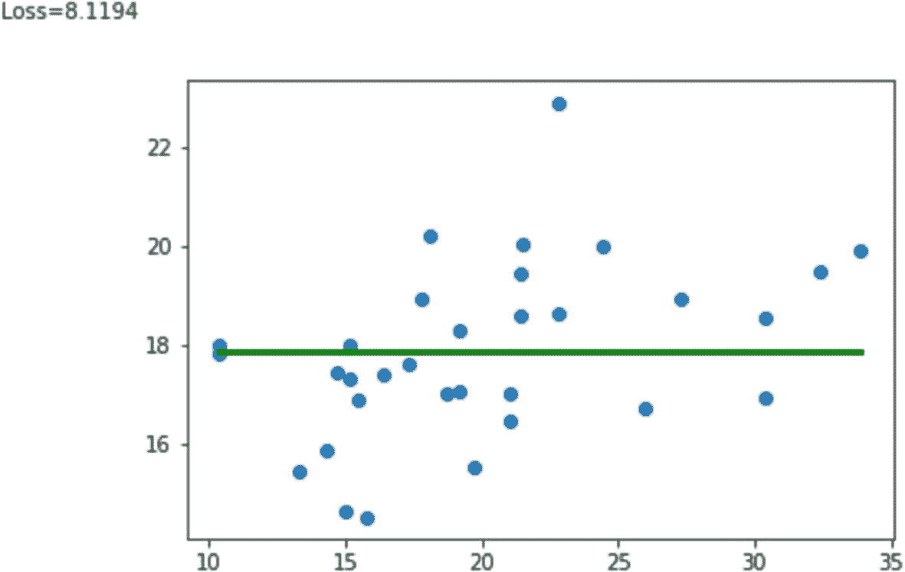

`torch` 库中的神经网络通常与 `nn` 模块一起使用。让我们来看一下。

神经网络可以使用 `torch.nn` 包构建，该包提供了几乎所有与神经网络相关的功能，包括以下内容。

- *线性层*：`nn.Linear`，`nn.Bilinear`
- *卷积层*：`nn.Conv1d`，`nn.Conv2d`，`nn.Conv3d`，`nn.ConvTranspose2d`
- *非线性激活函数*：`nn.Sigmoid`，`nn.Tanh`，`nn.ReLU`，`nn.LeakyReLU`
- *池化层*：`nn.MaxPool1d`，`nn.AveragePool2d`
- *循环网络*：`nn.LSTM`，`nn.GRU`
- *归一化*：`nn.BatchNorm2d`
- *Dropout*：`nn.Dropout`，`nn.Dropout2d`
- *嵌入*：`nn.Embedding`
- *损失函数*：`nn.MSELoss`，`nn.CrossEntropyLoss`，`nn.NLLLoss`

标准分类算法是监督学习算法的另一个版本，其中目标列是一个类别变量，特征可以是数值型或分类型。

## 配方 5-5\. 监督模型：逻辑回归

### 问题

如何使用 PyTorch 部署逻辑回归模型？

### 解决方案

计算图网络由节点表示，并通过函数连接。可以应用多种技术来最小化误差函数并获得最佳预测模型。我们可以增加迭代次数、估计损失函数、优化函数、打印实际值和预测值，并将其显示在图表中。

### 工作原理

要应用张量微分，需要调用 `nn.backward()` 方法。让我们看一个例子。

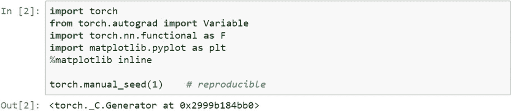

以下展示了逻辑回归模型的数据准备过程。

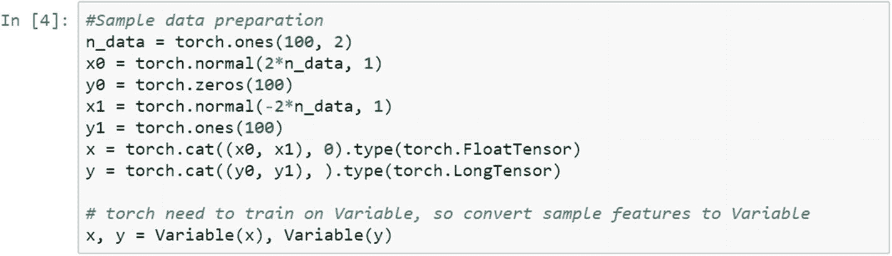

让我们看一下用于分类的示例数据集。

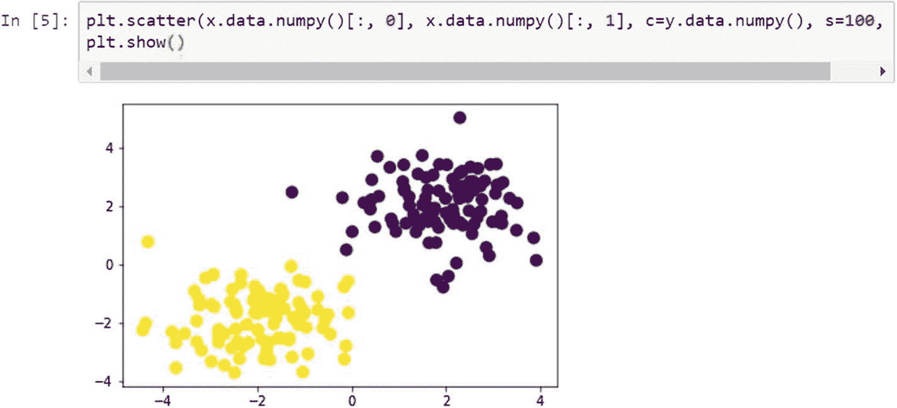

为逻辑回归模型设置神经网络模块。

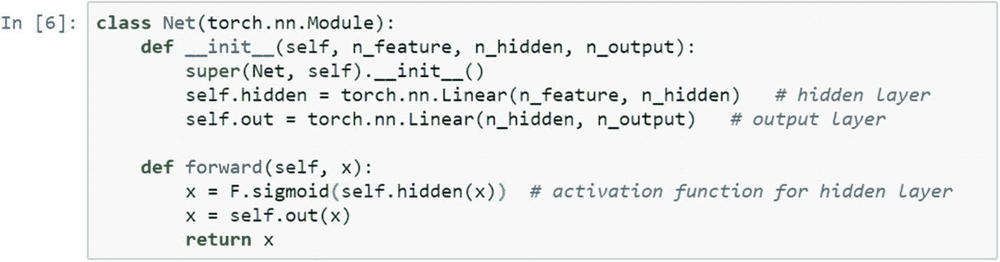

检查神经网络配置。

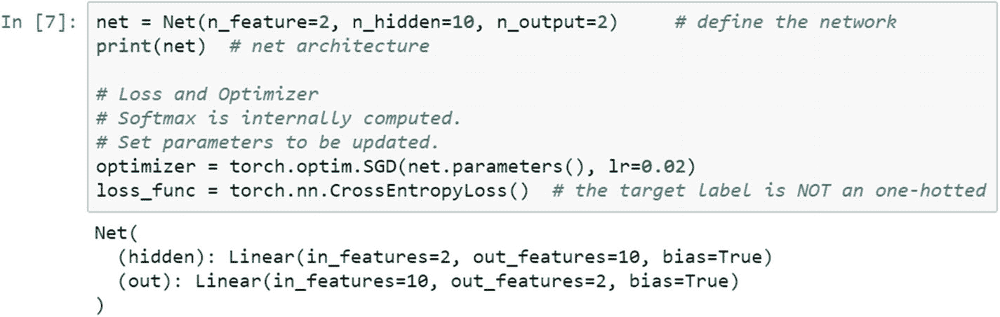

运行迭代并为样本图找到最佳解决方案。

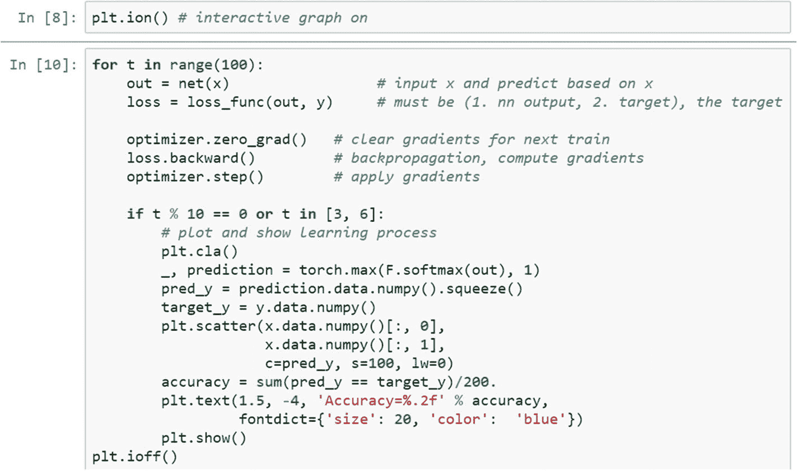

第一次迭代提供了近 99% 的准确率，随后模型在训练数据上达到了 100% 的准确率（见图 5-3 和 5-4）。

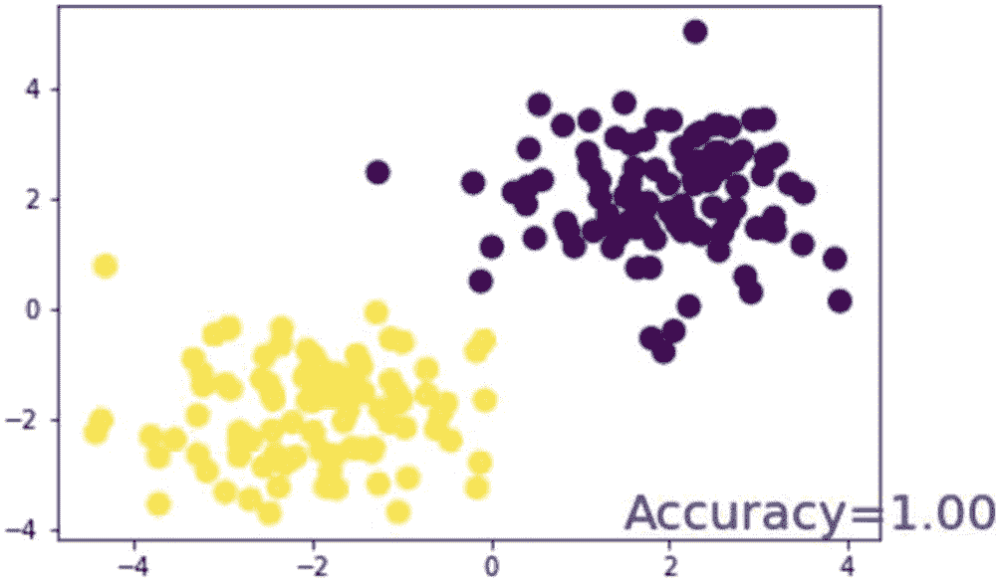

图 5-4：最终准确率

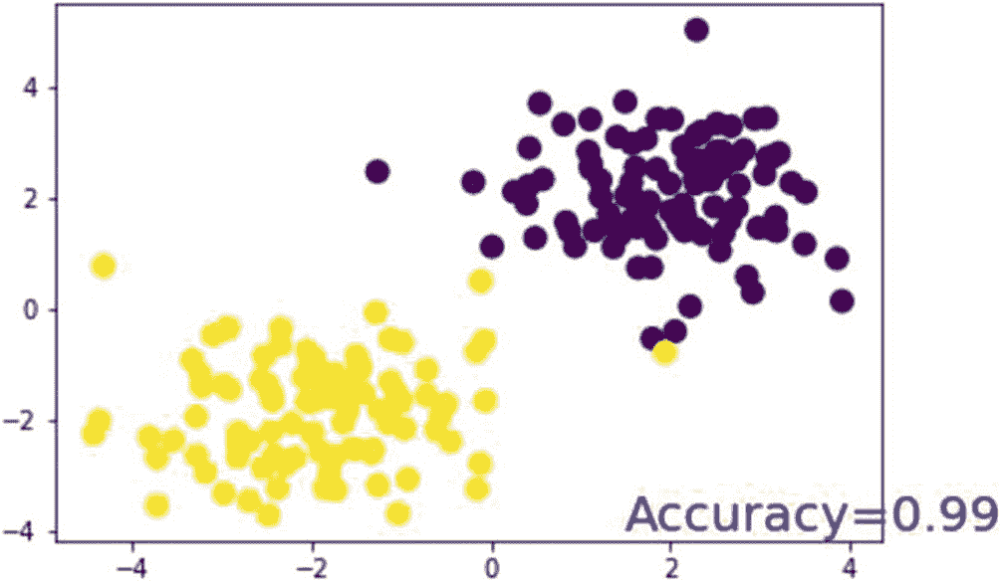

图 5-3：初始准确率

最终准确率显示为 100，这是一个明显的过拟合案例，但我们可以通过引入 dropout 率来控制这一点，这将在下一章中讨论。

## 结论

本章讨论了两种主要的监督学习算法——线性回归和逻辑回归——以及它们使用样本数据集和 PyTorch 程序的实现。这两种算法都是线性模型，一种用于预测实值输出，另一种用于将一个类别与另一个类别分开。尽管我们在逻辑回归示例中考虑了二分类，但它可以扩展到多分类模型。

