# 6. 使用 PyTorch 微调深度学习模型

深度学习模型正变得非常流行。它们在生物神经元连接方式以及信息在网络模型中从一个节点传输到另一个节点的方式上有着非常深厚的根基。

深度学习有非常特定的用途，特别是当基于单一函数的机器学习技术无法逼近现实生活中的挑战时。例如，当数据维度非常大（数千维）时，标准的机器学习算法无法预测或分类结果变量。这在计算上效率也不高。它会消耗大量资源，并且模型永远不会收敛。最突出的例子是目标检测、图像分类和图像分割。

最常用的深度学习算法可以分为三类。

- *卷积神经网络*。主要适用于高度稀疏数据集、图像分类、图像识别、目标检测等。
- *循环神经网络*。适用于处理序列信息，如果数据生成方式中存在任何内部序列结构。这包括音乐、自然语言、音频和视频，这些信息是按顺序消费的。
- *深度神经网络*。通常适用于单层机器学习算法无法正确分类或预测的情况。有三种变体。
  - *深度网络*，其中每个隐藏层中的神经元数量通常多于前一层。
  - *宽度网络*，其中隐藏层的数量多于通常的神经网络模型。
  - *深度和宽度网络*，其中网络中的神经元数量和层数都非常高。

本章讨论如何使用超参数微调深度学习模型。参数和超参数之间存在区别。通常在深度学习模型中，我们不对估计参数感兴趣，因为它们是权重，并且会根据初始值、学习率和迭代次数不断变化。重要的是决定用于微调模型的超参数，如第 3 章所述，以便获得最佳结果。

## 配方 6-1\. 构建序列神经网络

### 问题

有没有办法像在 Keras 中那样，在 PyTorch 中构建序列神经网络模型，而不是声明神经网络模型？

### 解决方案

如果我们逐行声明整个神经网络模型，包括神经元数量、隐藏层数量、迭代次数、损失函数的选择、优化函数以及权重分布的选择等，那么模型的扩展将变得极其繁琐。而且，这种方法并非万无一失——模型中可能会出现错误。为了避免逐行声明整个模型所带来的问题，我们可以使用一个高级函数，该函数在后台假定某些默认参数，并以最少的超参数向用户返回结果。是的，不声明神经网络模型是可行的。

### 工作原理

让我们来看看如何创建这样的模型。在 Torch 库中，神经网络模块包含一个函数式 API（应用程序编程接口），其中包含各种激活函数，正如前面章节所讨论的那样。

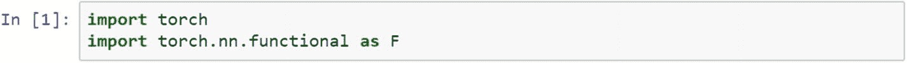

在下面的脚本中，我们创建了一个简单的神经网络模型，其中使用线性函数作为输入层到隐藏层的激活函数，以及隐藏层到输出层的激活函数。

以下函数需要声明 `class Net`，声明特征、隐藏神经元和激活函数，这些都可以被顺序模块轻松替代。

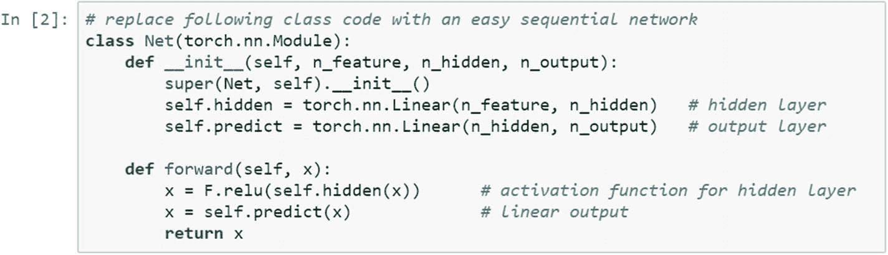

我们可以不使用这个脚本，而是修改类函数，并用顺序函数替换它。Keras 函数取代了 TensorFlow 函数，这意味着许多行 TensorFlow 代码可以被几行 Keras 脚本替代。在 PyTorch 中也可以实现同样的效果，而无需任何外部模块。例如，在下面的代码中，`net2` 解释了顺序模型，而 `net1` 解释了前面的脚本。从可读性的角度来看，`net2` 比 `net1` 好得多。

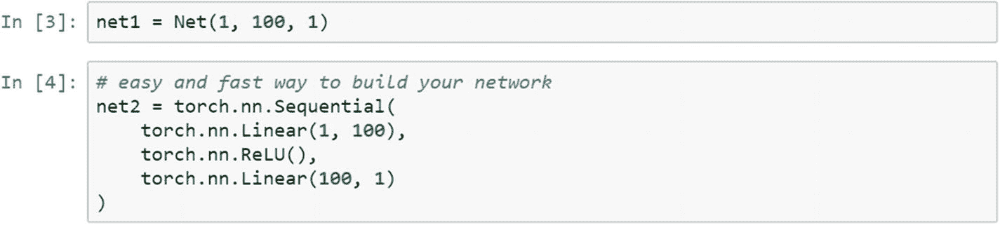

如果我们简单地打印 `net1` 和 `net2` 两个模型架构，它们会执行相同的操作。

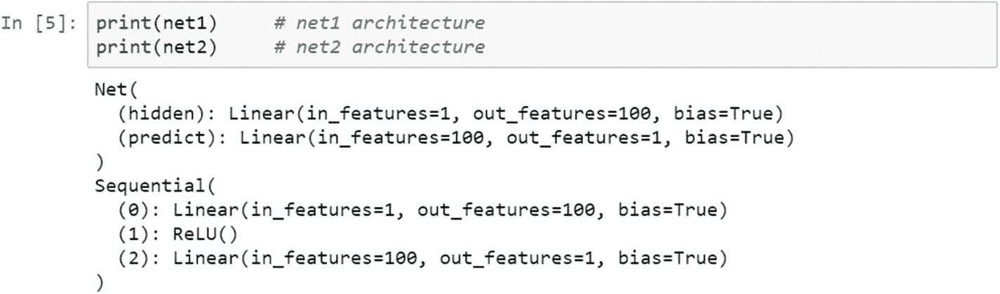

## 方法 6-2：决定批量大小

### 问题

如何使用 PyTorch 对深度学习模型执行批量数据训练？

### 解决方案

训练深度学习模型需要大量带标签的数据。通常，这是一个寻找一组权重和偏置的过程，使得损失函数在匹配目标标签方面达到最小。如果训练过程能够很好地逼近该函数，那么预测或分类就会变得稳健。

### 工作原理

训练深度学习网络有两种方法：批量训练和在线训练。训练算法的选择决定了学习的方法。如果算法是反向传播，那么在线学习更好。对于具有多层反向传播和前向传播的深层且宽泛的网络模型，批量训练则更好。

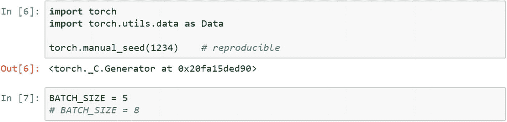

在训练过程中，批量大小为 5；我们可以将批量大小改为 8 并查看结果。在在线训练过程中，权重和偏置会根据每个训练样本的预测结果与实际结果之间的差异进行更新。然而，在批量训练过程中，实际值与预测值之间的差异（即误差）会被累积，并在批量大小上计算为一个单一数值，然后在最后一层报告。

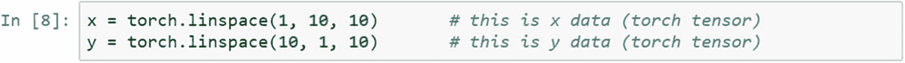

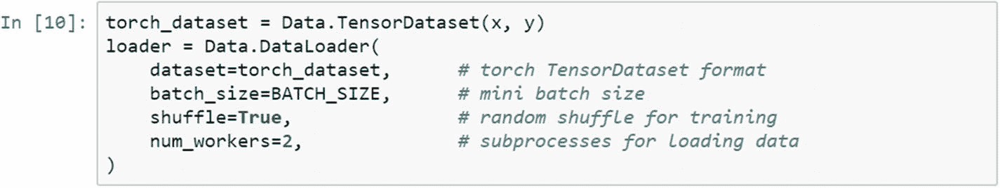

在对数据集进行五次迭代训练后，我们可以打印批次和步数。如果我们比较在线训练和批量训练，批量训练比在线训练有更多优势。当需要训练一个巨大的数据集时，会存在内存限制。当我们无法在 CPU 环境中处理巨大数据集时，批量训练就能派上用场。在 CPU 环境中，我们可以使用较小的批量大小来处理大量数据。

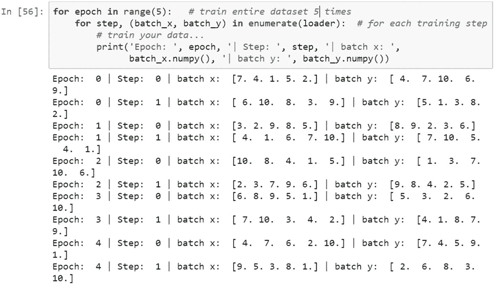

我们将批量大小设为 8 并重新训练模型。

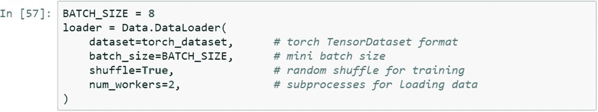

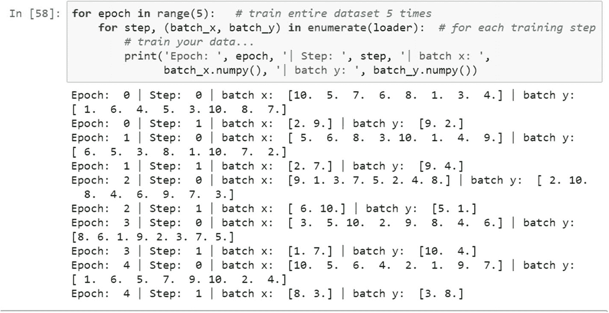

## 方法 6-3：决定学习率

### 问题

如何根据学习率和迭代次数来确定最佳解决方案？

### 解决方案

我们取一个样本张量，应用各种替代模型并打印模型参数。学习率和迭代次数与模型精度相关。为了达到损失函数的全局最小值状态，重要的是将学习率保持在最小值，并将迭代次数保持在最大值，这样迭代过程才能将损失函数带到最小值状态。

### 工作原理

首先，需要导入必要的库。为了找到最小损失函数，通常使用梯度下降作为优化算法，这是一个迭代过程。目标是找到损失函数相对于可训练参数的下降速率。

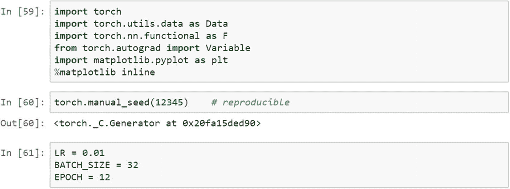

用于实验的样本数据集包括以下内容。

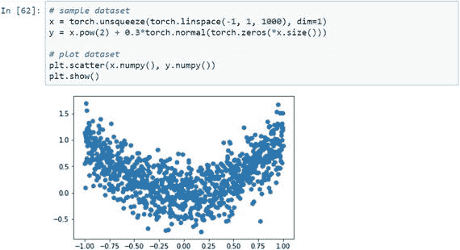

样本数据集和前五条记录如下所示。

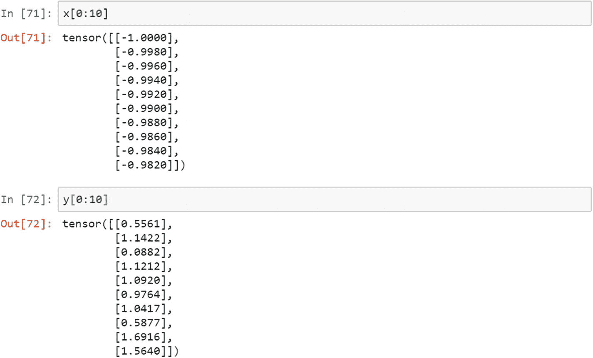

使用 PyTorch 的实用函数，让我们加载张量数据集，引入批量大小，并进行测试。

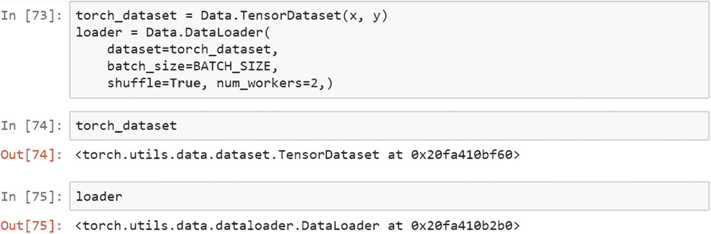

声明神经网络模块。

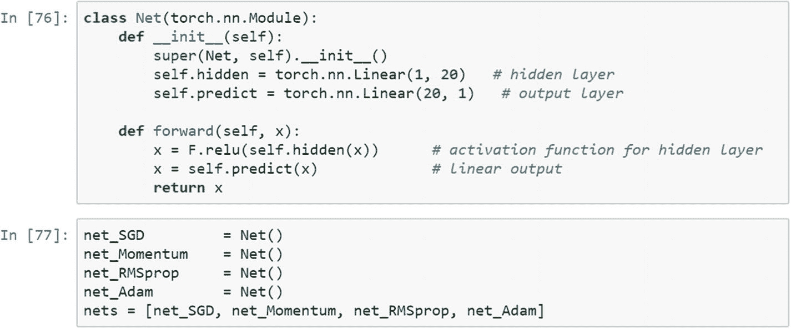

现在，让我们看看网络架构。

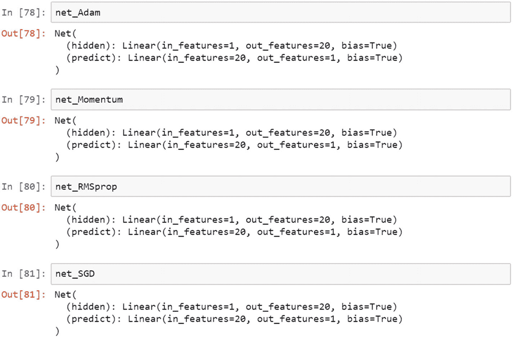

在执行优化时，我们可以包含许多选项；从最佳中选择最优的。

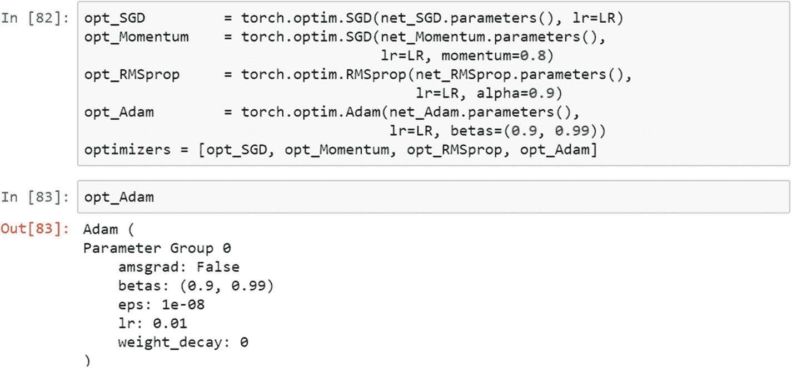

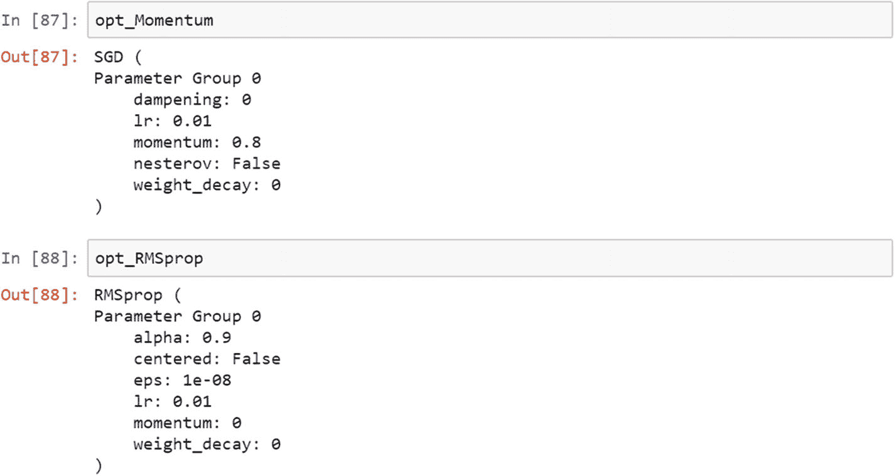

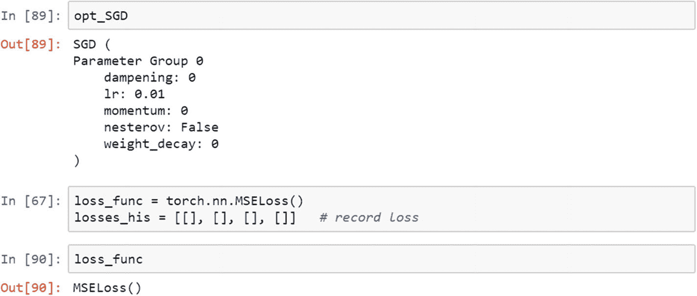

## 方法 6-4：执行并行训练

### 问题

如何使用 PyTorch 执行包含大量模型的并行数据训练？

### 解决方案

优化器实际上是增强张量的函数。寻找最佳模型的过程需要并行训练许多模型。学习率、批量大小和优化算法的选择使得模型独一无二，并与其他模型区分开来。选择最佳模型的过程需要进行超参数优化。

### 工作原理

首先，需要导入正确的库。三个超参数（**学习率**、**批量大小**和**优化算法**）使得并行训练多个模型成为可能，而最佳模型则由测试数据集的准确率决定。以下脚本使用`随机梯度下降`算法、`动量`、`RMSprop`和`Adam`作为优化方法。

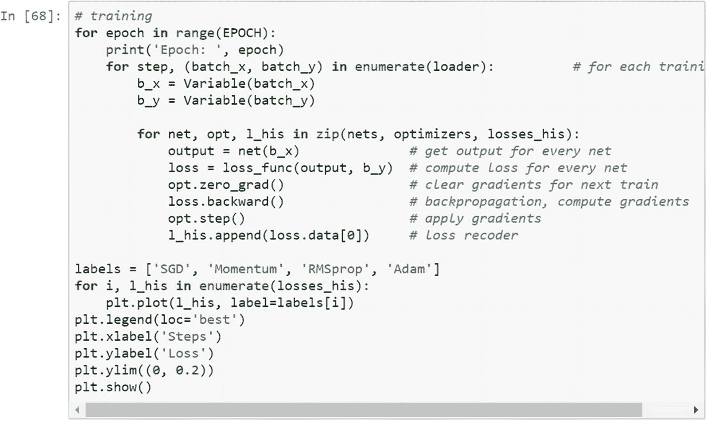

让我们来看一下图表和训练轮次。

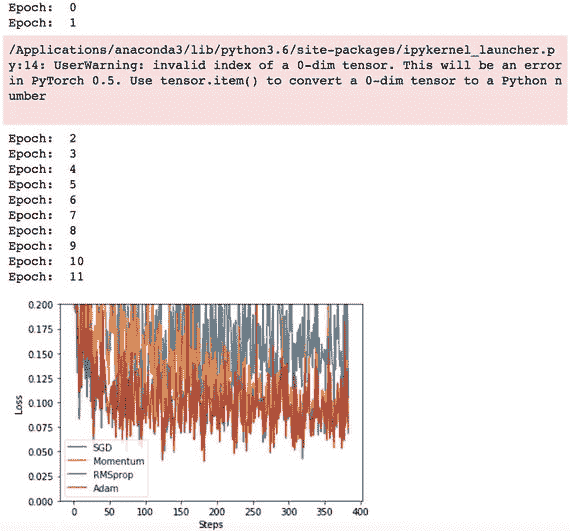

## 结论

在本章中，我们探讨了让深度学习模型从训练数据集中学习的多种方法。通过使用超参数，可以使训练过程更加高效。选择合适的超参数是关键。深度学习模型（卷积神经网络、循环神经网络和深度神经网络）在架构上有所不同，但训练过程和超参数是相同的。在`PyTorch`中，超参数的选择和筛选过程比其他任何框架都要简单得多。

