# 7. 使用 PyTorch 进行自然语言处理

自然语言处理是计算机科学的一个重要分支。它研究的是计算机通过执行各种任务来理解人类语言。自然语言研究也被称为*计算语言学*。自然语言处理包含两个不同的组成部分：自然语言理解和自然语言生成。*自然语言理解*涉及对输入语言的分析与理解，并对其做出响应。*自然语言生成*则是根据输入文本创建语言的过程。语言的使用方式多种多样。一个词可能有不同的含义，因此消除歧义是自然语言理解中的一个重要部分。

歧义级别可分为三种类型。

-   *词汇歧义*基于词性；判断一个词是名词、动词、副词等。

-   *句法歧义*指一个句子可能有多种解释；主语和谓语是中性的。

-   *指代歧义*与用词语表达的事件或场景相关。

文本分析是自然语言处理和理解的前置步骤。文本分析意味着创建语料库，即收集一组文档，然后去除空白、标点、停用词以及无文本意义的垃圾值（如符号、表情符号等）。清理之后，接下来的任务是将文本表示为向量形式。这可以通过标准的`Word2vec`模型来实现，或者以词频-逆文档频率格式（`tf-idf`）表示。在当今世界，我们看到许多应用都使用了自然语言处理技术；以下是一些例子。

-   拼写检查应用——在线应用和智能手机应用。用户输入一个特定的单词，系统会检查该单词的含义，并提示是否需要更正拼写。

-   关键词搜索在过去十年中已成为我们生活中不可或缺的一部分。每当我们去餐厅、购物或访问某个地方时，我们都会进行在线搜索。如果输入的关键词错误，则无法检索到匹配结果；然而，搜索引擎系统非常智能，它们能预测用户的意图，并推荐用户实际想要搜索的页面。

-   预测性文本用于各种聊天应用。用户输入一个单词后，系统会根据用户的写作模式，显示下一个单词的选项。系统会提示用户从列表中选择一个单词来构建句子。

-   问答系统，如`Google Home`、`Amazon Alexa`等，允许用户以自然语言与系统交互。系统处理这些信息，进行智能搜索，并为用户检索出最佳结果。

-   替代数据提取是指当用户无法获取实际数据时，用户可以利用互联网获取公开可用的数据，并搜索相关信息。例如，如果我想买一台笔记本电脑，我想比较它在各个在线平台上的价格。我可以让一个系统从不同网站抓取价格信息，并为我提供价格摘要。这个过程被称为使用网络爬虫、文本处理和自然语言处理的*替代数据收集*。

-   情感分析是一个从用户、客户或代理所表达的文本中分析其情绪的过程。例如客户评论、电影评论等。需要对呈现的文本进行分析，并将其标记为正面情绪或负面情绪。类似的应用都可以通过情感分析来构建。

-   主题建模是在语料库中找出不同主题的过程。例如，如果我们从科学、数学、英语和生物学中提取文本，并将所有文本混合在一起，然后让机器对文本进行分类，并告诉我们语料库中存在多少个主题，机器能正确地将英语文本与生物学文本分开，将生物学文本与科学文本分开，等等。这被称为一个完美的主题建模系统。

-   文本摘要是指将语料库中的文本以更短的格式进行总结的过程。如果我们有一份两页、共 1000 词的文档，需要将其总结为一段 200 词的段落，那么我们可以通过使用文本摘要算法来实现。

-   语言翻译是将一种语言翻译成另一种语言，例如英语翻译成法语，法语翻译成德语，等等。语言翻译有助于用户理解另一种语言，并使沟通过程更加有效。

对人类语言的研究是离散且非常复杂的。同一个句子可能有多种含义，但它通常是针对特定受众而构建的。要理解自然语言的复杂性，我们不仅需要工具和程序，还需要系统和方法。在自然语言处理中，通常采用以下五个步骤来理解用户的文本。

-   词法分析：识别单词的结构。

-   句法分析：研究英语语法和句法。

-   语义分析：理解单词在上下文中的含义。

-   `PoS`（词性标注）分析：理解并解析词性。

-   语用分析：理解单词在上下文中的真实含义。

在本章中，我们将使用`PyTorch`来实现自然语言处理任务中最常用的步骤。

## 配方 7-1. 词嵌入

### 问题

如何使用`PyTorch`创建一个词嵌入模型？

### 解决方案

词嵌入是将单词、短语和标记以有意义的方式表示为向量结构的过程。输入文本被映射到实数向量上；因此，特征向量可以用于机器学习或深度学习模型的进一步计算。

### 工作原理

单词和短语以实向量格式表示。段落或文档中含义相似的单词或短语具有相似的向量表示。这使得计算过程能够有效地找到相似的单词。有多种算法可以从文本中创建嵌入向量。`Word2vec` 和 `GloVe` 是执行词嵌入的知名框架。让我们看下面的例子。

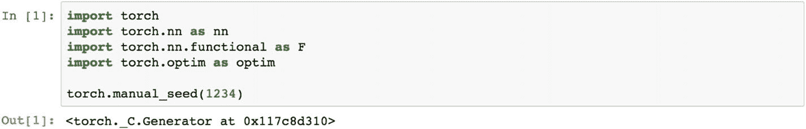

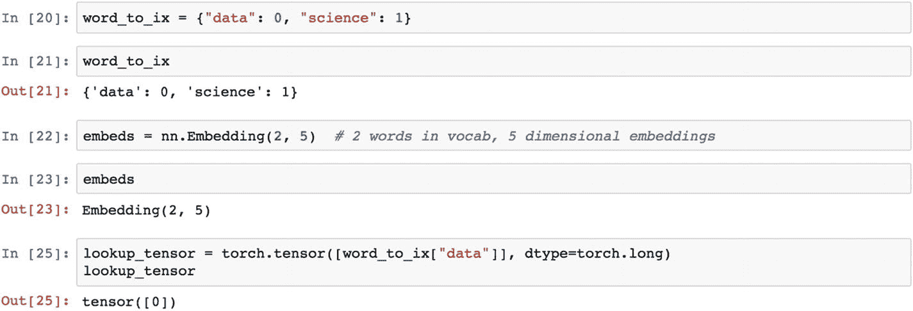

以下代码设置了一个嵌入层。

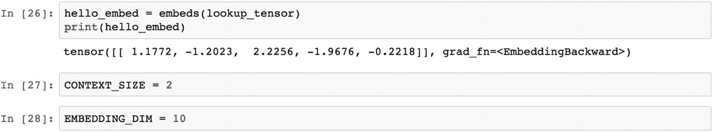

让我们看一个示例文本。下面的文本有两个段落，每个段落包含几个句子。如果我们对这两个段落应用词嵌入，那么我们将从文本中获得实向量作为特征。这些特征可用于进一步的计算。

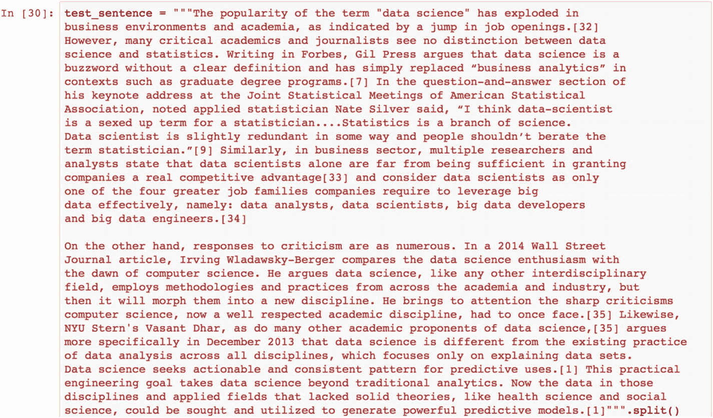

分词是将句子分割成小块标记的过程，这些标记被称为 *n-grams*。如果是一个单词，则称为 *unigram*；如果是两个单词，则称为 *bigram*；如果是三个单词，则称为 *trigram*，以此类推。

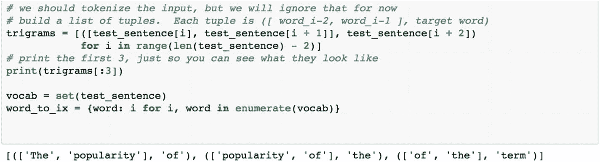

`PyTorch` n-gram 语言建模器可以提取相关的关键词。

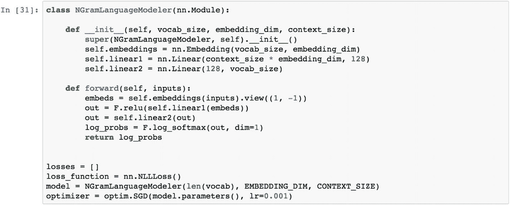

n-gram 提取器有三个参数：要提取的词汇表长度、嵌入向量的维度和上下文大小。让我们看一下损失函数和模型规范。

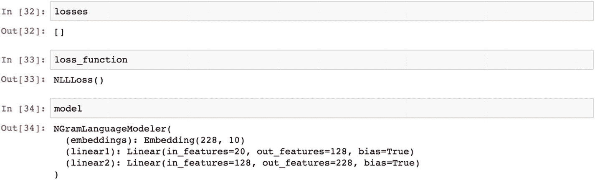

应用 `Adam` 优化器。

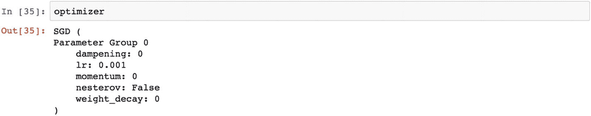

从句子中提取上下文也很重要。让我们看一下下面的函数。

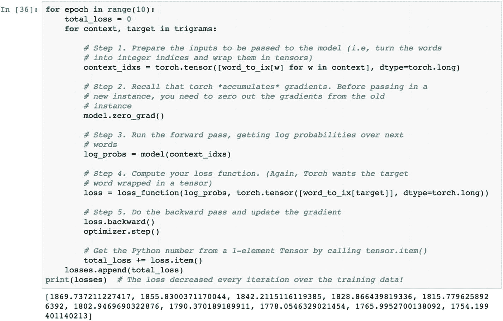

## 配方 7-2. PyTorch 中的 CBOW 模型

### 问题

如何使用 `PyTorch` 创建一个 CBOW 模型？

### 解决方案

有两种不同的方法可以将单词和短语表示为向量：*连续词袋*（CBOW）和 *跳字模型*。词袋方法通过预测上下文中的单词或短语来学习嵌入向量。上下文指的是当前单词前后的单词。如果我们取一个大小为 4 的上下文，这意味着当前单词左边的四个单词和右边的四个单词都被视为上下文。模型尝试在另一个句子中找到这八个单词来预测当前单词。

### 工作原理

让我们看下面的例子。

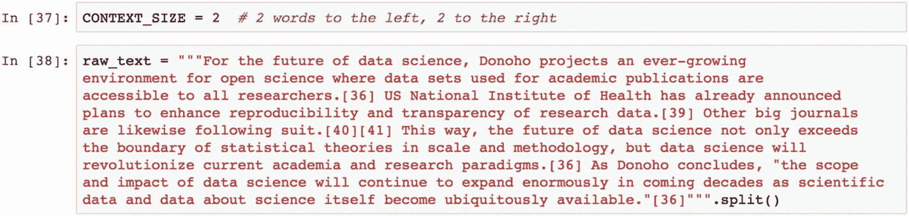

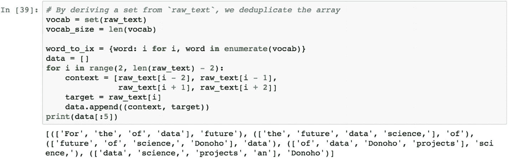

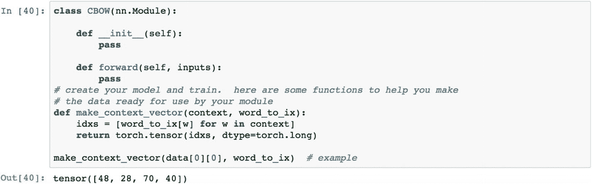

从图形上看，词袋模型如图 7-1 所示。它有三层：输入层，即考虑单词和短语的嵌入向量；输出向量，即模型预测的相关单词；以及投影层，这是神经网络模型提供的一个计算层。

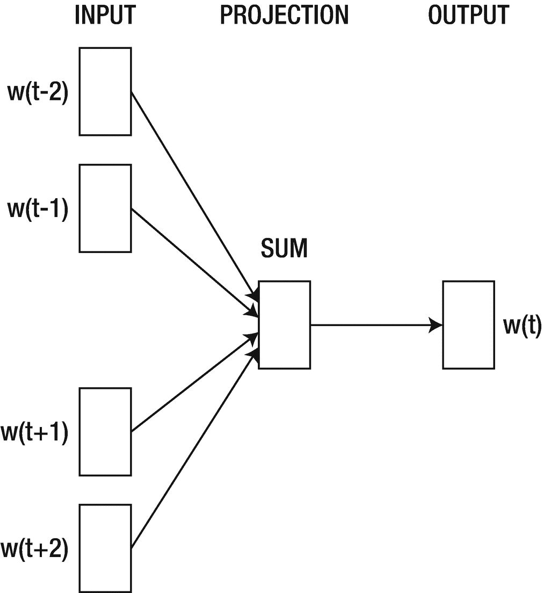

图 7-1

CBOW 模型表示

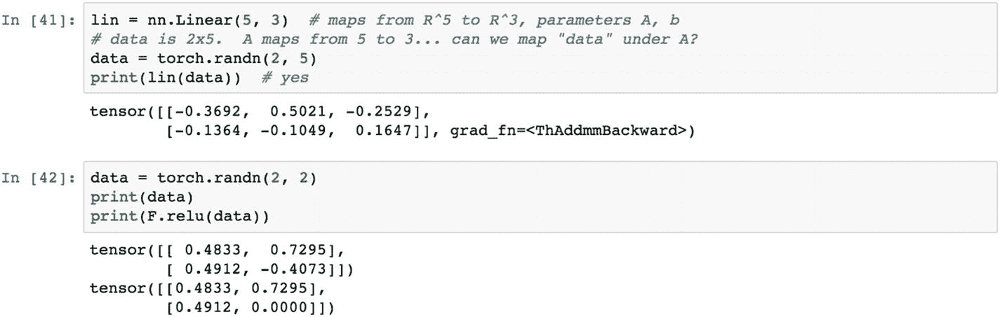

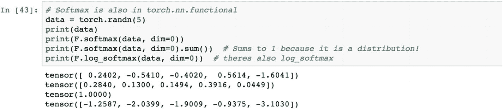

## 配方 7-3. LSTM 模型

### 问题

如何使用 `PyTorch` 创建一个 LSTM 模型？

### 解决方案

*长短期记忆*（LSTM）模型，也称为*循环神经网络的一种特定形式*，常用于自然语言处理领域。文本和句子以序列形式出现以构成有意义的句子，因此我们需要一个能够记住文本长短期序列的模型来预测单词或文本。

### 工作原理

让我们看下面的例子。

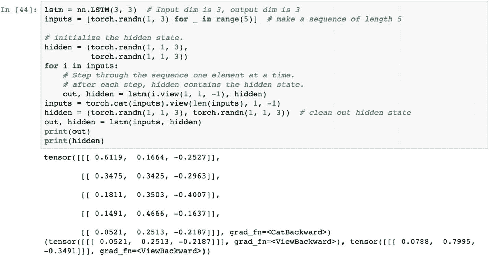

准备一个单词序列作为训练数据来形成 LSTM 网络。

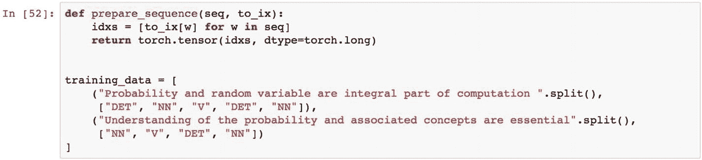

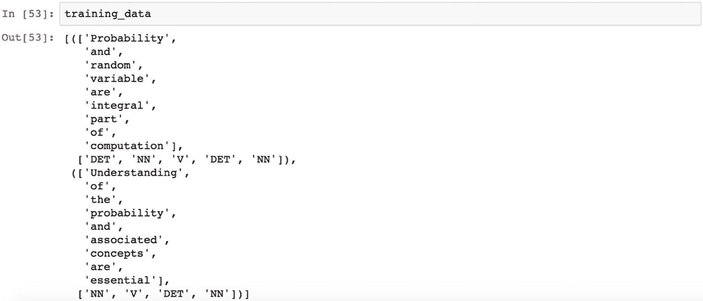

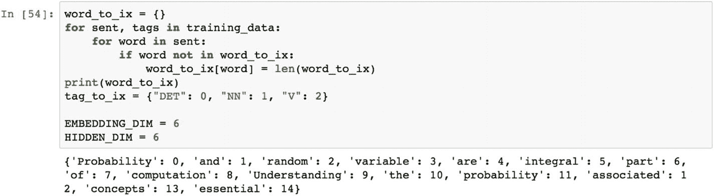

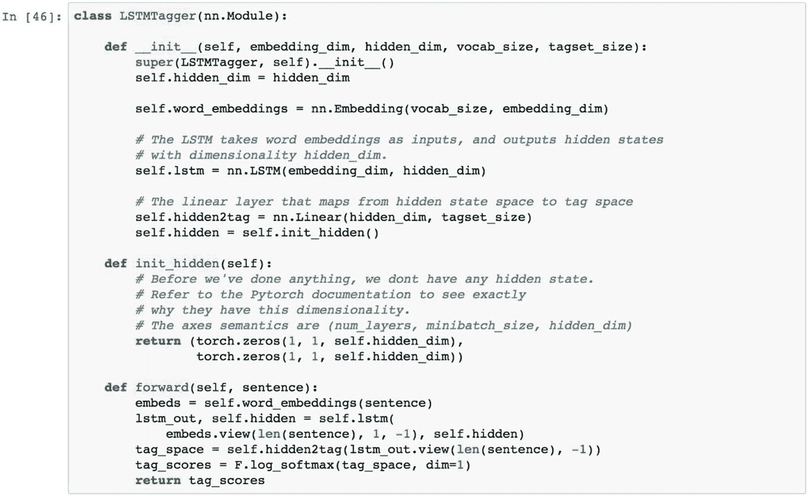

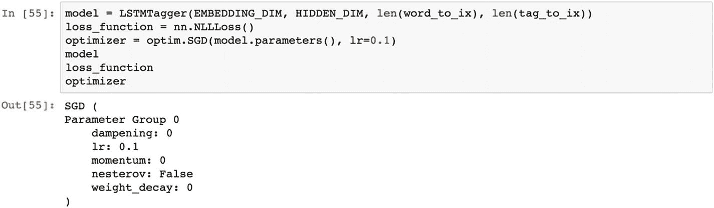

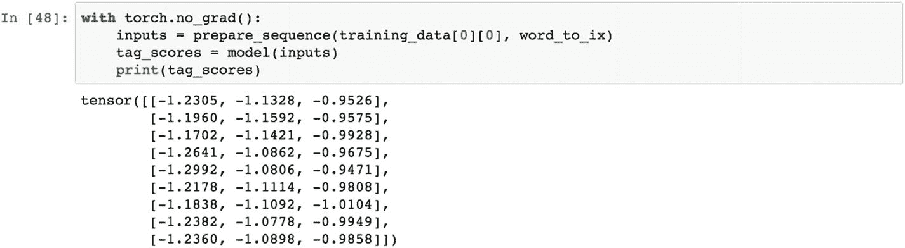

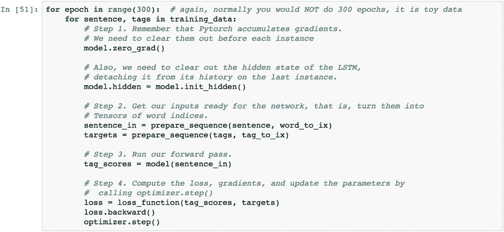

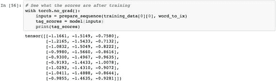