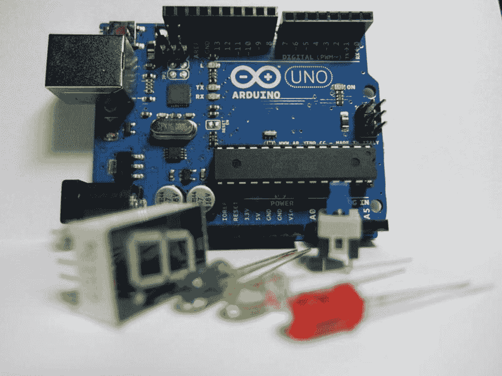
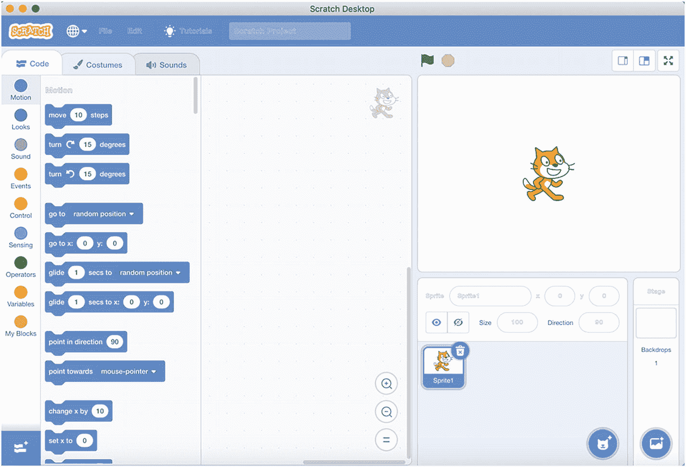

# 引言

我的祖父有波兰血统，他习惯亲手烹饪、制作、建造、种植、培育和创造一切。他也喜欢与大人和孩子们分享他是如何完成所有这些创造性工作的。小时候，我对他那种“如果我没有，我就自己试着做”的态度印象深刻。他总是投入时间和精力去创造一些原创的东西。

我最温馨的记忆之一，是我们在寒冷的冬天在花园里散步。我们看到一些鸟儿在寻找小块食物。我们试图给它们法式面包和谷物，但因为严寒，它们不愿意，或者可能无法吃到。于是，祖父提议我们为鸟儿建一个木屋，这样它们就可以在避风的地方来吃谷物了。我们照做了。我们花了一整天在附近的河边捡干木头，然后清洗、干燥、锯切、打磨和组装，最终它看起来就像图 I-1 中的那个小屋。

图 I-1 鸟屋

这本书实际上并不是关于建造鸟屋的，而是关于自己动手制作东西，或者更确切地说，是提出想法并将其塑造成对他人（而不是鸟儿）有用的东西。

借助物联网（IoT），你可以使用现有的开发套件，在短时间内就能创造出东西。事实上，大型科技公司提供了如此多的开发套件，以至于很难选择其中一个并开始使用。

这些套件虽然易于使用，但会造成对整个套件环境的依赖，以至于没有它工作起来就很困难。除非你从头开始重新设计和重建你创建的所有东西，否则几乎不可能摆脱它们。

说到“从头开始”，几年前，Arduino 问世了。这是一块意大利制造的小型嵌入式板，你可以轻松地将其连接到传感器、转子、电机和无线网络。你可以使用 Arduino 轻松编写所需的定制逻辑，以便与前面提到的所有开发套件进行交互（图 I-2）。

图 I-2 Arduino

Arduino 可以使用 C 语言、Scratch4Arduino 或 S4A（[`http://s4a.cat`](http://s4a.cat)）进行编程，后者是 Scratch 图形化环境的修改版本，可为 Arduino 编译代码，如图 I-3 所示。

图 I-3 用于 Arduino 的 Scratch

在业余爱好者的世界里，Arduino 带来了一股清新的空气。它创建了一个开源、免费、统一的库和连接器生态系统，用于将各种组件连接在一起。该平台的用户在大学新创建的实验室或改造后的工厂大楼里交流并竞争创意。

我记得很多年前，我去朋友在上海的开源、开放硬件实验室，那里的人们正在移动机器人，并用老式游戏重建街机游戏室。

虽然这对真正的极客来说很有趣，但其他人可能会觉得自己有点被冷落了。学习曲线有点高，而且 Arduino 的强大功能使得除了运行 C 代码之外，其他任何操作都不太实用。

然后，来自英国的树莓派出现了，这是一台可以握在手中的功能齐全的计算机。大约 40 美元的价格对学生来说是一笔昂贵的开销，但它提供了功能极其强大的硬件。爱好者们购买了大量的这种小设备。与 Arduino 相比，树莓派 2 在规格上有了相当大的飞跃。对最终用户来说，除了连接器之外，最大的区别在于你终于可以运行一个完整的操作系统，并在不同组件之间获得一些标准化。树莓派 3，尤其是 B 型，拥有 1Gb 内存，这意味着你可以很好地运行 Java 应用程序并获得良好的性能。不过，其底层的基于 ARM 的处理器在实时计算方面仍然相当有限。

时间快进到 2019 年：树莓派 4，一台尺寸和标价相同的小型计算机，却是一头猛兽。事实上，当时还不是欧盟成员国的日本，在 2019 年 9 月购买了许可证，使该设备在其境内正式可用。日本政府费此周折，主要是因为该设备中嵌入的 Wi-Fi 和蓝牙模块允许进行军事级别的间谍活动，需要仔细监控。开个玩笑。不过，对这些小设备进行一些额外的官方检查仍然是必要的。

那么，第 4 版有什么新功能呢？主要区别在于性能，无论是 CPU 还是内存方面；它还有各种视频渲染升级。但这不就是每个销售人员为了让你购买他们最新、最棒的版本而告诉你的吗？

嗯，既是也不是。虽然在以前的版本中，你可以运行 Java 进程并享受相当快的速度，但树莓派 4 足够快、足够强大，以至于你可以在实时视频流上运行实时物体检测。这是一个游戏规则的改变者，也正是本书的缘起：现在只需使用 OpenCV 的 Java 封装，就可以享受一些视频乐趣了。

OpenCV（[`https://opencv.org/`](https://opencv.org/)），无论你是否了解，都是最常用的开源图像处理库之一。它的许可证——伯克利软件发行版（BSD）足够宽松，你可以将 OpenCV 以源代码或二进制形式部署到任何地方。OpenCV 也广泛适用于 Android 操作系统，类似的 Java 绑定也在其中大量使用。OpenCV 的主要支持代码是 C 语言，并且支持通过简单地围绕 OpenCV 原生二进制文件创建绑定，让所有其他编程语言访问 OpenCV，因此理论上，Java 封装层引入的少量开销不会造成额外的速度问题。

所以，现在我们有了一个相当便宜的设备，可以使用 Java 语言进行编程，从而连接到大多数可用的库，并且仍然可以在视频上运行实时处理。

