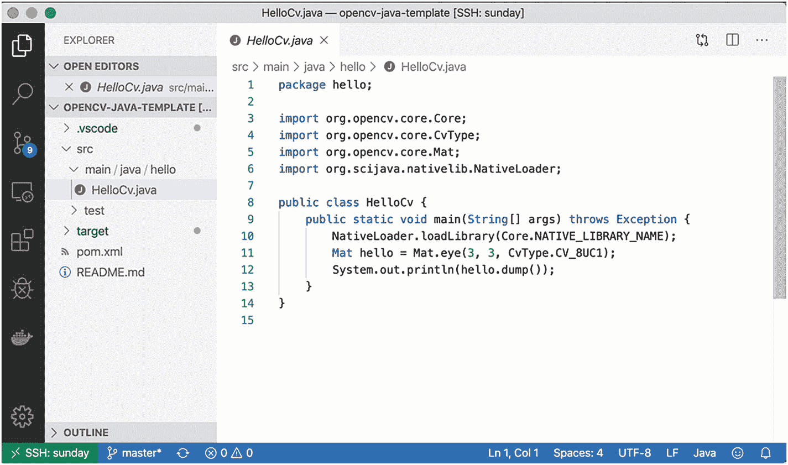

# 在本书中，我们将首先使用 Java 执行一些基础的 OpenCV 分析，然后继续分析实时视频。本书的目标是让你能够在小设备上开展工作，并将代码、语言、连接设置等不同部分整合起来。接着，我们将进入更有趣的部分。

本书的另一项创新在于，我们不会直接在树莓派上物理访问并运行程序，而是通过安全外壳（SSH）连接来进行编码。

这意味着什么？我们为什么要这样做？

这意味着我们希望编写 Java 代码的编辑器运行在树莓派之外的其他地方。我们这样做是为了尽可能多地保留树莓派的资源，用于设备上的图像和视频处理，同时只运行最少的软件。

同时，我们希望避免像 Java 中常见的那样需要重新编译所有内容，同时让一切看起来像是直接从我们的编辑器中执行。这部分得益于微软在 Visual Studio Code 编辑器及其最新插件——远程 SSH 插件（图 I-4）中的出色工作。

**图 I-4** Visual Studio Code 远程 SSH 插件

最后，我们将探讨如何连接到家庭自动化软件，尤其是通过语音。

Rhasspy（[`https://rhasspy.readthedocs.io`](https://rhasspy.readthedocs.io)）将是我们选择的开源软件。你将利用新获得的视频流知识，接入语音命令和物体检测。最终，你将能够通过识别猫咪何时进入厨房、在孩子早上醒来时为他们开灯，或者在你离开家时自动启动扫地机器人，来开始实现家庭自动化。

本书大致分为五个章节，挑战难度逐步递增。

第 1 章侧重于让各个部分在标准计算机上运行，编写 Java 代码以使用 OpenCV 进行基础图像处理，并理解不同软件组件如何协同工作。

第 2 章将带你从处理图像过渡到分析视频流，同时在图片和视频上运行基于特征和基于网络的物体检测。

第 3 章展示了如何在树莓派上运行代码，因此将重点放在使设置功能正常所需的最基本操作上。

第 4 章帮助你运行板载应用程序，主要关注实时视频流（包括录制的和实时的）中的物体检测。

最后，第 5 章将树莓派的设置扩展到家庭自动化应用，我们将语音命令接入视频流分析。

