# 1. 入门指南

本书的目标之一是让你能够快速进行实时物联网成像，避免冗长的安装过程。快速上手并不意味着我们会走任何捷径，而是意味着我们将扫清工具配置方面的障碍，以便专注于创作过程。

在本章中，你将运行第一个示例。

## Visual Studio Code 入门指南

> *机会来敲门时，你必须做好准备。*
>
> ——布鲁诺·马尔斯

本书介绍的开发环境搭建方法，对于习惯编写代码的人来说相当标准。不过它也有点“新潮”的感觉——只有酷孩子才会用。我们将使用的*技术栈*（即开发环境）包含以下组件：

*   `Visual Studio Code`，一款小巧但可扩展的文本编辑器
*   `Java` 开发工具包及其运行时，用于编写和运行 `Java` 代码
*   `Visual Studio Code` 的 `Java` 插件，使编辑器能够识别并运行 `Java` 代码

基本上，就这些了。

无论你使用的是 `Windows`、`Mac` 还是 `Linux` 系统，都没有关系。XX 的所有组件都设计为跨平台运行。要安装 `Visual Studio Code`，你需要访问 [`https://code.visualstudio.com/`](https://code.visualstudio.com/)。

点击页面右上角的下载按钮。点击后，你会看到针对不同平台的软件包选项，每个计算机平台对应一个，如图 1-1 所示。

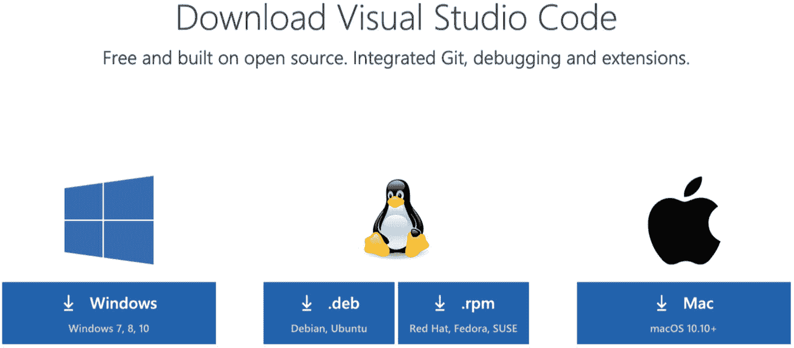

图 1-1 选择下载版本

在撰写本文时，当前版本是 1.40，但更新的版本只会更好。

运行安装程序并首次打开 `Visual Studio Code` 后，你会看到类似图 1-2 的界面。

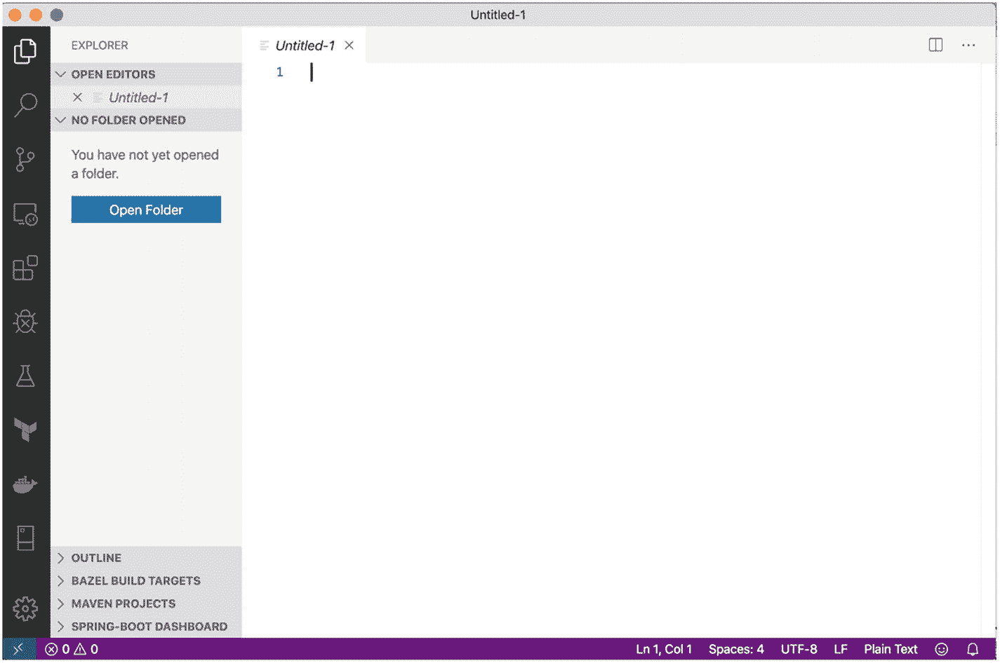

图 1-2 `Visual Studio Code`

第二步是安装 `Java`（如果尚未安装）。你可以访问 `OpenJDK` 网站 ([`https://jdk.java.net/`](https://jdk.java.net/)) 下载 `zip` 文件，或者前往 `Oracle` 网站下载适用于你机器的即用安装程序（见图 1-3 和图 1-4）。具体来说，你可以访问 [`https://www.oracle.com/technetwork/java/javase/downloads/index.html`](https://www.oracle.com/technetwork/java/javase/downloads/index.html)。

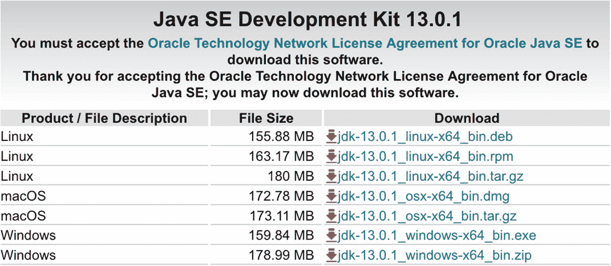

图 1-4 `Java` 下载链接

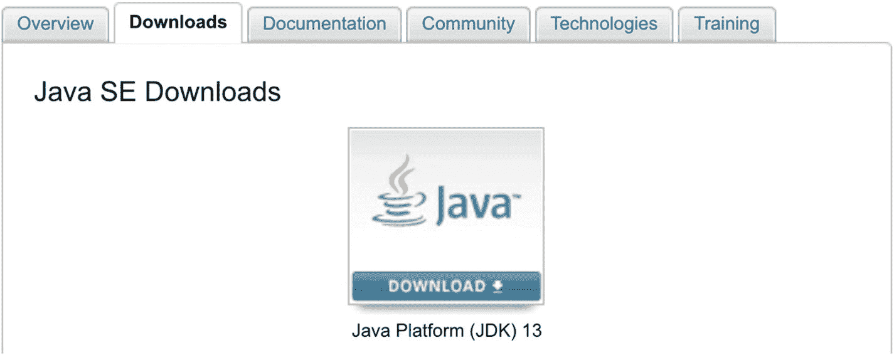

图 1-3 `Oracle Java` 下载页面

让安装程序运行至结束，即使它在运行过程中试图打开另一个安装程序，也不要停止。`Java` 作为一个开发工具包，并没有附带一个花哨的应用程序来检查它是否已正确安装，因此在 `Java` 安装完成后，快速检查一切就绪的方法是：在 `Visual Studio Code` 中打开一个终端，并检查 `Java` 版本。

你可以按 `Ctrl+Shift+@` 在 `Visual Studio Code` 中打开终端，或者从菜单中打开，如图 1-5 所示。

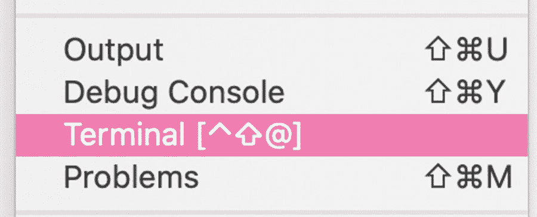

图 1-5 从 `Visual Studio Code` 内部打开终端窗口

这将会弹出一个小的选项卡，通常位于编辑器底部，如图 1-6 所示。

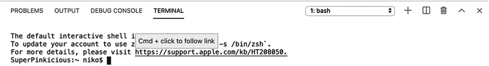

图 1-6 终端选项卡

然后在终端中输入以下命令：

```
java -version
```

图 1-7 显示了如果你安装了 `OpenJDK` 版本，预期的版本输出。

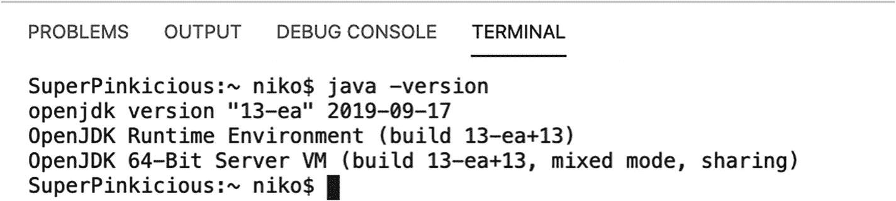

图 1-7 `Java` 版本

请注意，`Java` 版本本身并不重要；8 到 14 之间的任何版本都应该可以正常工作。嘿，让我们乐观一点——在可预见的未来，事情也应该能正常运行。

所有设置工作就快完成了，请再耐心等待几秒钟。在 `Visual Studio Code` 中，你编写的所有内容都将作为纯文本处理。基本上，如果你不告诉计算机如何处理文本，它就不会做任何事情。

让我们通过安装 `Java` 插件来告诉 `Visual Studio Code` 识别我们的 `Java` 文件。

编辑器左侧的侧边栏有一组相当可爱的图标，如果你点击图 1-8 底部的那个，就可以访问 `Visual Studio Code` 市场。

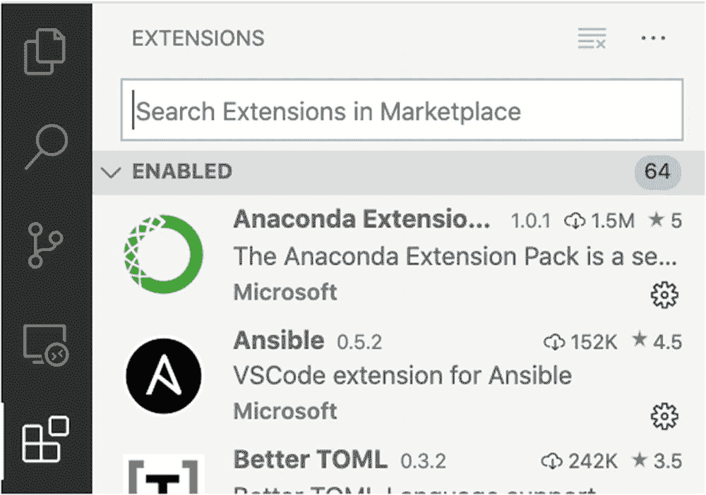

图 1-8 `Visual Studio Code` 市场

在这里，你可以安装编辑器插件，以多种方式扩展其功能。在本书中，我们将大量使用插件，并构建一个你可以重复使用并针对其他情况进行增强的开发环境。

现在，我们想要在编辑器中安装 `Java` 支持，这可以通过使用搜索栏搜索 `Java` 扩展来实现（见图 1-9）。

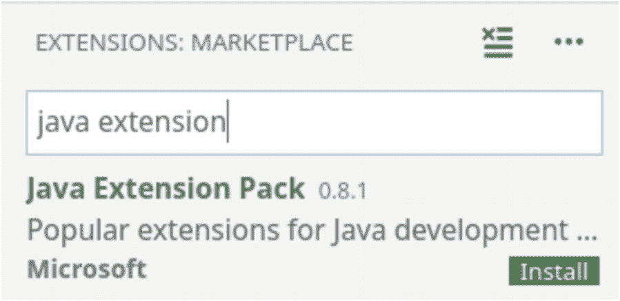

图 1-9 寻找完美的 `Java` 插件

在左侧选择该插件后，右侧选项卡会显示详细的描述，如图 1-10 所示。

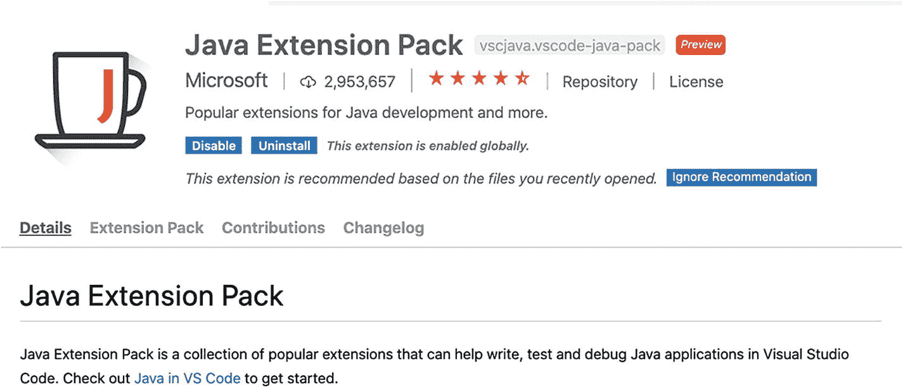

图 1-10 `Java` 插件描述

`Java` 扩展实际上是一个插件集合，`Visual Studio Code` 文档中提供了完整的条目和描述，可在此处访问：

```
https://code.visualstudio.com/docs/java/extensions
```

基本上，当你安装 `Java` 扩展包时，将安装以下插件：

*   `Red Hat` 提供的 `Java` 语言支持：[`https://marketplace.visualstudio.com/items?itemName=redhat.java`](https://marketplace.visualstudio.com/items%253FitemName%253Dredhat.java)
*   `Java` 调试器：[`https://marketplace.visualstudio.com/items?itemName=vscjava.vscode-java-debug`](https://marketplace.visualstudio.com/items%253FitemName%253Dvscjava.vscode-java-debug)
*   `Java` 测试运行器：[`https://marketplace.visualstudio.com/items?itemName=vscjava.vscode-java-test`](https://marketplace.visualstudio.com/items%253FitemName%253Dvscjava.vscode-java-test)
*   `Maven for Java`：[`https://marketplace.visualstudio.com/items?itemName=vscjava.vscode-maven`](https://marketplace.visualstudio.com/items%253FitemName%253Dvscjava.vscode-maven)
*   `Java` 依赖查看器：[`https://marketplace.visualstudio.com/items?itemName=vscjava.vscode-java-dependency`](https://marketplace.visualstudio.com/items%253FitemName%253Dvscjava.vscode-java-dependency)
*   `Visual Studio IntelliCode`：[`https://marketplace.visualstudio.com/items?itemName=VisualStudioExptTeam.vscodeintellicode`](https://marketplace.visualstudio.com/items%253FitemName%253DVisualStudioExptTeam.vscodeintellicode)

这些插件将允许你执行编写代码时所有有用的任务，例如自动补全、代码检查、调试等。

此时，重新加载编辑器后，安装步骤就基本完成了。有趣的开发环境已经准备就绪；它没有花费你一分钱，而且几乎没有泄露任何个人数据。

## 运行你的第一个 Java 应用程序

那么，打开编辑器后，我们来创建一个文件，在其中编写一些 `Java` 代码，并看看如何直接从编辑器内部运行这些代码。

在 `Java` 中运行代码通常涉及一个编译步骤，即将 `Java` 文本文件转换为计算机（此处指 `Java` 运行时环境）可以执行的形式。

在我们的设置中，所有这些步骤都由 `Visual Studio Code` 在后台处理。

我们的第一个示例将输出一条问候语，这通常是任何行为规范的计算机程序都会做的事情。

首先，让我们创建一个名为 `First.java` 的文件，并放入一些非常基础的 `Java` 代码。这段代码将输出一些基本的问候文本；这也有助于我们检查设置是否完全正常工作。

让我们在 `Java` 文件中写入清单 1-1 中的内容。

```
public class First {
    public static void main(String[] args) {
        System.out.println("Hello Java");
    }
}
```

清单 1-1 你的第一个 `Java` 程序

输入这段代码后（或者直接打开提供的示例），你会注意到编辑器本身会发生一些动态刷新。编辑器会为你高亮显示代码，并将不同的 `Java` 特性关联到你的输入，如图 1-11 所示。

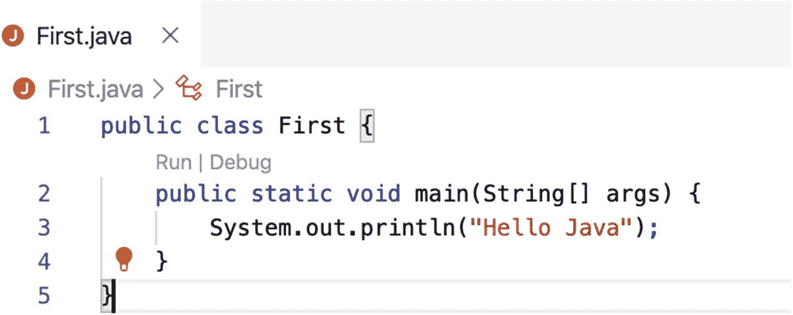

图 1-11 编辑器的魔法

代码的自动补全是免费提供的，可以通过使用 `Tab` 键触发，如图 1-12 所示。

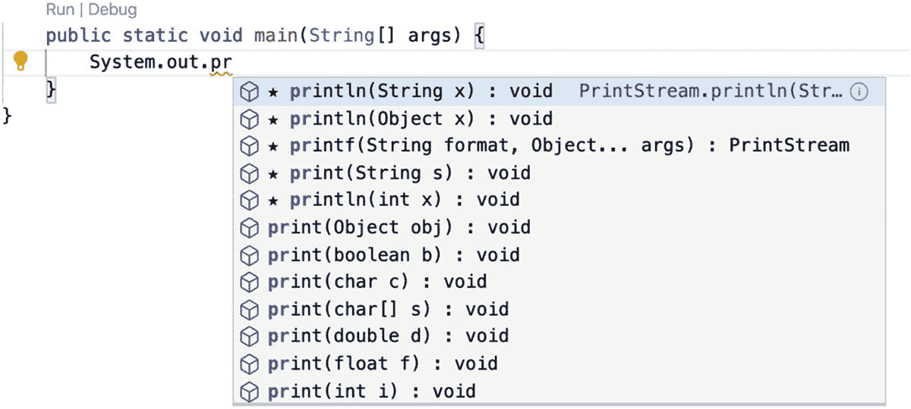

图 1-12 自动补全

当 `Java` 文档可用时，你也可以通过键盘组合键 `Ctrl+空格键` 来访问它，如图 1-13 所示。

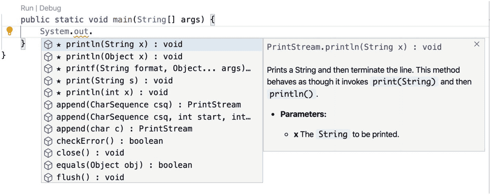

图 1-13 内联文档

你可能也已经注意到主 `Java` 方法顶部的 `Run` 和 `Debug` 链接，如图 1-14 所示。你可以点击这些链接，或者使用键盘快捷键来触发它们。按 `F5` 进行调试，按 `Ctrl+F5` 运行代码。

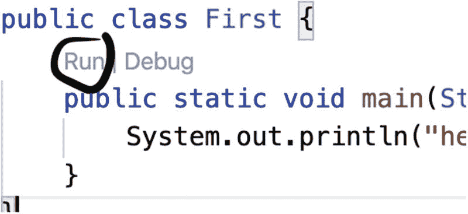

图 1-14 运行和调试链接

正如你所料，点击 `Run` 按钮将触发编辑器内代码的执行，并在我们之前打开的 `Terminal` 选项卡中显示一些文本（图 1-15）。

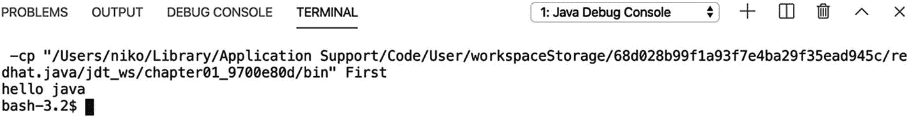

图 1-15 真正运行一些 `Java` 代码

## 导入核心 Java 包

你最终需要加载外部类，这可以通过使用编辑器的导入功能来完成。在这个阶段这看起来很简单，但在 `Java` 中使用 `OpenCV` 时，有些包很难弄清楚，尤其是当很多代码示例为了简洁而省略了导入语句时。

首先，让我们编写一段显示当前时间的代码。最简单的方法是直接使用一个 `Date` 对象，如清单 1-2 所示。

```
public class First {
    public static void main(String[] args) {
        Date d = new Date();
        System.out.println(String.format("hello java. it is %s", d));
    }
}
```

清单 1-2 导入之前

在本书的印刷版中，一切看起来都正常，但在 `Visual Studio` 中，编辑器会正确地高亮显示那些无法正常编译的代码部分。在图 1-16 中，请注意编译器无法理解代码的部分是如何被加下划线的。

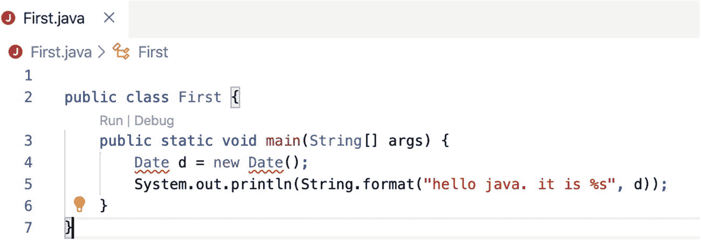

图 1-16 缺少 `Date` 类导入

要导入该类，你可以点击红色下划线 `Date` 单词旁边的小灯泡（图 1-17）。

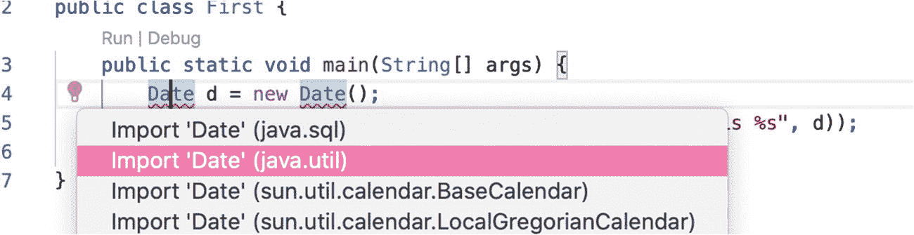

图 1-17 使用小灯泡导入

或者，你可以通过按 `Ctrl+Shift+P` 或 `Command+Shift+P` 来触发 `Visual Studio` 命令菜单，然后在搜索栏中开始输入 `Organize Imports`（见图 1-18）。

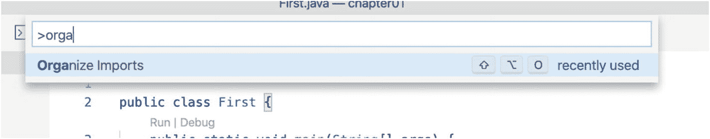

图 1-18 整理导入

你可以选择需要导入到当前文件中的确切 `Java` 类，这里就是 `java.util.Date`（见图 1-19）。

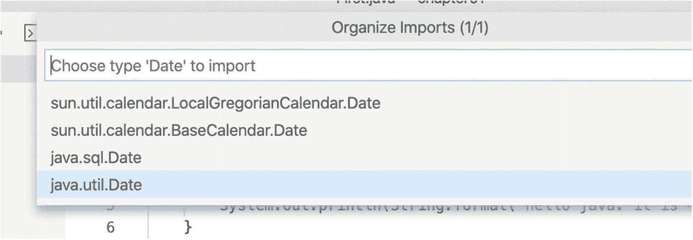

图 1-19 选择正确的类

现在代码已修复，可以再次执行了。让我们点击相同的 `Run` 链接或使用 `F5` 键盘快捷键来开始执行。

执行输出再次显示在终端中，如图 1-20 所示。

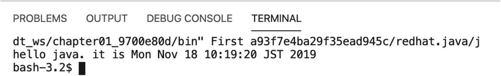

图 1-20 哇。这段代码是在 2019 年 11 月编写并执行的

## 调试课程

这是你的书，所以你可以跳过这一节关于调试的内容，稍后再回来看。我决定现在就在我们处理一些简单代码时加入这一节调试内容，因为提前完成这部分工作可以让你更好地掌握 `OpenCV` 代码，并以一种清晰易懂的方式逐步理解每个 `OpenCV` 计算步骤。

如果你决定继续阅读这部分，那太好了！我们将花一点时间看看如何在 `Visual Studio Code` 中调试 `Java` 代码。

正如你所看到的，在编辑器内执行代码非常简单。在 `Java` 中，通过这种设置，我们还免费获得了一个调试器。如今，在网页中运行 `JavaScript` 代码时，你甚至可以在浏览器中免费获得调试器。

为什么调试器如此重要？调试器允许你在代码的任何点停止执行，然后就地检查它，并从停止代码的位置开始操作。

这意味着你可以开始执行代码，但也可以要求运行时在你想要的任何地方停止。而且，你不必在开始之前就选择在哪里停止代码执行。假设你正在进行实时视频处理，在某个阶段，你想知道为什么分析摄像头画面的代码没有像你期望的那样找到物体。在这种情况下，你可以在帧捕获循环中立即停止代码执行，然后转储图片或逐步重新运行分析步骤，以便找出是模型错误，还是图片仍然处于意外的大小或颜色模式。

`Java` 本身没有一个真正有用的读取-求值-打印-循环（`REPL`）。`REPL` 允许你逐行执行代码，它在我最喜欢的语言 `Clojure` 中运行得很好，在 `Kotlin` 甚至 `Python` 中也是如此。`Java` 不容易做到逐行运行和添加内容，但现在由于 `Visual Studio Code` 使调试变得如此简单，这一点几乎可以被原谅。

说得够多了，让我们看看如何使用调试器执行基本的调试任务：

*   添加断点
*   逐步执行代码
*   监视变量
*   更改变量值

### 添加断点

顾名思义，断点就是一个暂停的时间点。当鼠标移动到行号左侧时，它会在编辑器中显示为一个红点（图 1-21）。

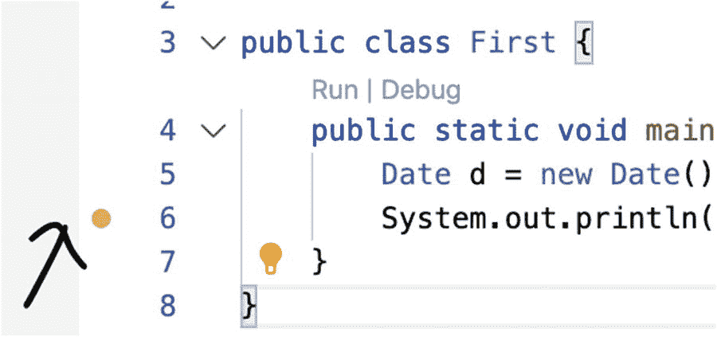

图 1-21 断点

要创建断点，只需单击你想要停止执行的那一行代码的行号。请注意，断点会在该行代码执行之前停止代码，因此，在第 5 行添加断点，当执行停止时不会显示 `Date` 对象，但在第 6 行添加一个点则会显示，如图 1-21 所示。

### 逐步执行代码

单击“调试”链接将以调试模式启动执行，并在第一个断点处（即你刚刚在第 6 行添加的那个）停止，此时编辑器将显示一个略有不同的布局，如图 1-22 所示。

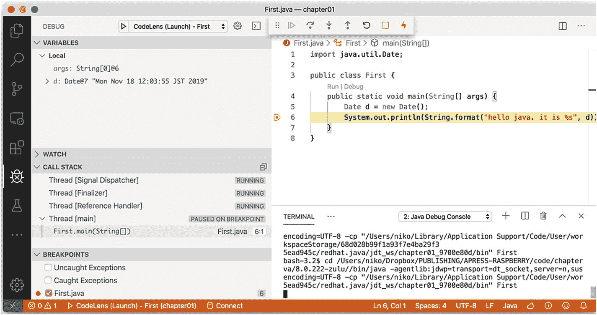

图 1-22 暂停

在左侧，你可以在小的“调用堆栈”选项卡上看到代码执行停止的位置；这里是在 `First` 类的 `main` 方法中的第 6 行（图 1-23）。

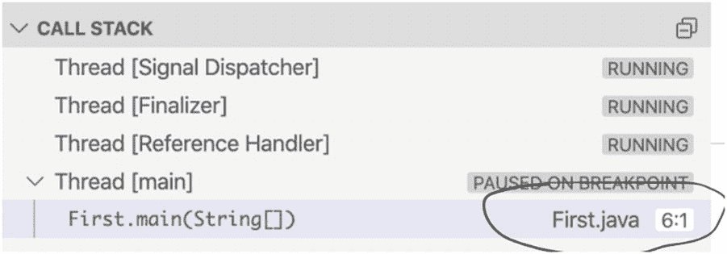

图 1-23 我在哪里？

你还可以看到变量 `d` 的值，它是一个 `Date` 对象；如果程序有输入参数，你也可以看到它们；这里你看到的是一个空数组（图 1-24）。

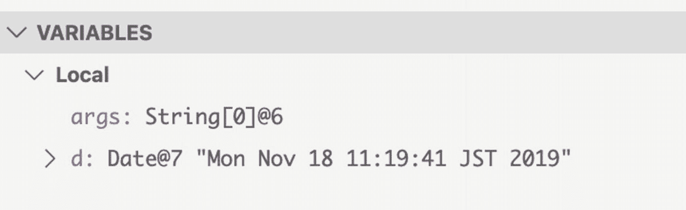

图 1-24 变量

当然，你可以使用不同的箭头来逐个递归地展开每个变量的内容及其字段，如图 1-25 所示。

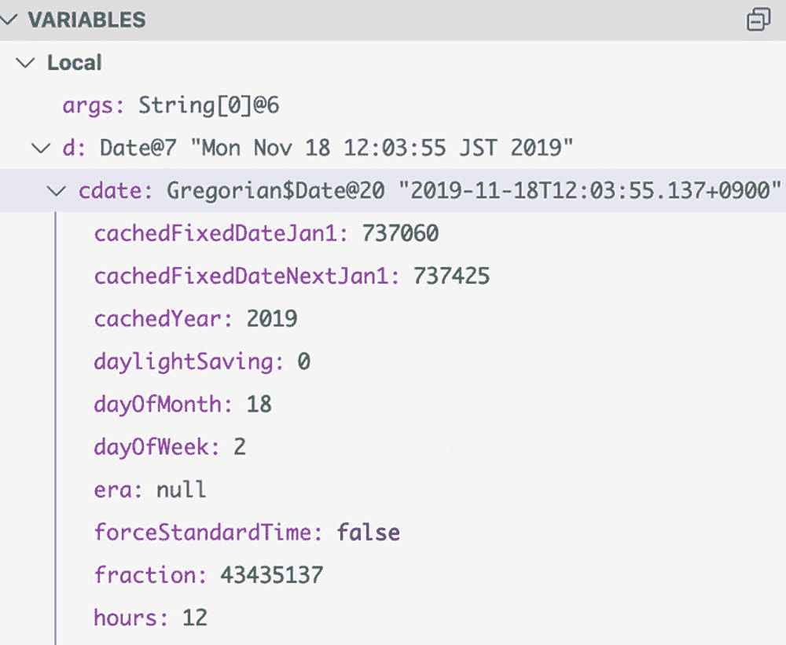

图 1-25 展开的变量

在图 1-25 中，你可以亲眼看到 `Date` 对象有一个名为 `cdate` 的字段，并且你可以递归地看到该字段的所有子字段。

### 恢复执行

要从断点处恢复或完成执行，你可以在调试会话期间编辑器顶部的运行时栏中找到几个可用选项（图 1-26）。


图 1-26 执行命令

从左到右，你可以执行表 1-1 中说明的操作。

表 1-1 调试操作

| 图标 | 操作 | 说明 |
| --- | --- | --- |
|  | 恢复 | 这将指示执行继续，直到程序结束或遇到下一个断点，中间不会停止。 |
|  | 单步跳过 | 这将执行当前行的所有代码，然后转到下一行代码并再次停止。 |
|  | 单步进入 | 这将进入每个执行块内部。因此，在前面的例子中，在第一次停止时，执行将进入 `format` 函数内部然后停止。 |
|  | 单步跳出 | 这将跳转到代码的外部部分。因此，如果你当前在 `format` 函数内部，那么这将返回到原始的 `main()` 函数。 |
|  | 重启 | 这将停止所有调试并从零开始重新启动。 |
|  | 停止 | 这将停止代码执行。 |
|  | 热代码替换 | 这将使用编辑器中的代码更新运行时的代码。实时编码！ |

你最常使用的操作是“单步跳过”，它只是逐行执行代码。这可以让你很好地概览哪些变量已被更改，以及新分配的变量及其值。见图 1-27。

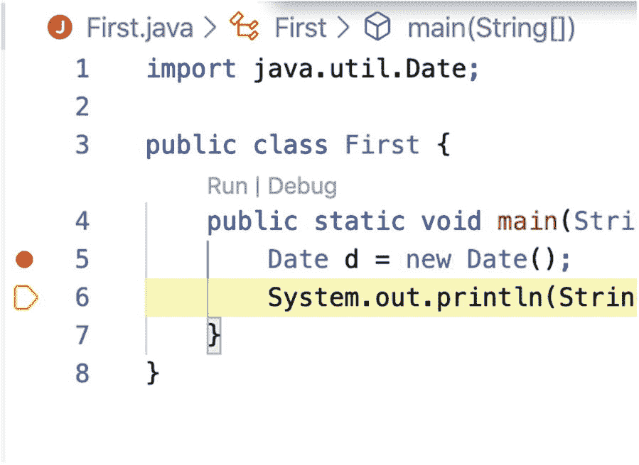

图 1-27 下一行

继续执行下一行，再下一行，最终将完成程序的执行，理想情况下，终端窗口中会打印出正确的消息。

### 监视表达式

你可能已经注意到编辑器左侧的 `Watch`（监视）选项卡，并且可能已经好奇它的用途。

在左上角的 `Variables`（变量）选项卡中，你可以看到对象和字段的直接值，但在 `Watch` 选项卡中，你可以对所有可用的对象添加函数调用，这被称为*监视表达式*。监视表达式可以在变量或对象被实例化之前定义。

在对象视图中，以及在进行直接渲染时，你可以使用监视表达式来产生一些副作用，创建函数，例如，将输入图片从彩色转换为黑白，或者快速创建图像的仅轮廓版本。当然，你可以实时完成所有这些操作，但在接下来的章节中，我们将使用较低的处理能力和内存，因此，短暂暂停代码执行并使用一次性调用监视表达式，绝对是保持额外内存和计算量最小化的更好方法。

在本章的第一部分，我们将在监视表达式中添加简单的计算——一个没有副作用，直接根据输入参数返回值的表达式；另一个有副作用，会将内容打印到日志文件中。

我们将从代码示例 1-3 开始，该示例只是在一个 `while` 循环中对一个递增的值进行循环。我们不想在这个过程中让计算机过载，所以我们在循环内部添加一个短暂的休眠调用，以便给执行循环一些时间。

```java
public class Second {
    public static void main(final String[] args) throws Exception {
        int i = 0;
        while (true) {
            i++;
            Thread.sleep(500);
        }
    }
}
```

代码清单 1-3 令人难以置信的整数循环

我们将在监视表达式中添加表达式 `i+2`，然后启动调试会话，但暂时不设置断点。

等待一段时间后，我们点击在第 6 行添加一个断点，然后观察编辑器停止，就好像我们在开始执行之前就已经设置了断点一样。

Visual Studio Code 的布局将如图 1-28 所示。

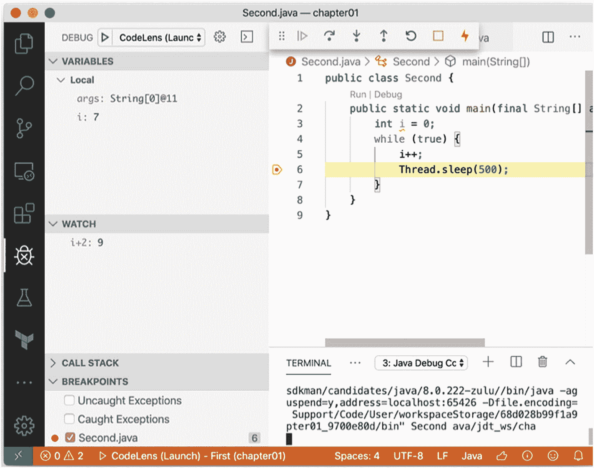

图 1-28 调试模式下的令人难以置信的循环

通过点击并创建一个断点，你刚刚停止了执行，调试布局出现了。如你所见，变量 `i` 的值已经是 7，而监视表达式 `i+2` 显示正确的值 9。

不错。

现在是一些你可以自己尝试的练习。尝试实现两个函数，并在两个监视表达式中使用它们。

*   一个函数将对变量 `i` 进行基本的计算并显示结果。

*   另一个函数不返回任何值，但会将一个值追加到外部文件中。

这应该会花费你大约 5-10 分钟的时间。祝你好运！完成后，你可以阅读并将你的代码与代码清单 1-4 进行比较。

```java
import java.io.BufferedWriter;
import java.io.FileWriter;
import java.io.Writer;

public class SecondFinal {
    static int myfunction1(final int i) {
        return 3 + i + 2;
    }

    final static String filePath = "my.log";

    static void myfunction2(final int i) {
        try (Writer writer = new BufferedWriter(new FileWriter(filePath))) {
            writer.write(String.format(">> %d\n", i));
        } catch (Exception e) {
        }
    }

    public static void main(final String[] args) throws Exception {
        int i = 0;
        while (true) {
            i++;
            Thread.sleep(500);
        }
    }
}
```

代码清单 1-4 有副作用和无副作用的监视表达式

不同的监视表达式按预期显示在 Visual Studio Code 调试布局的左侧（图 1-29）。

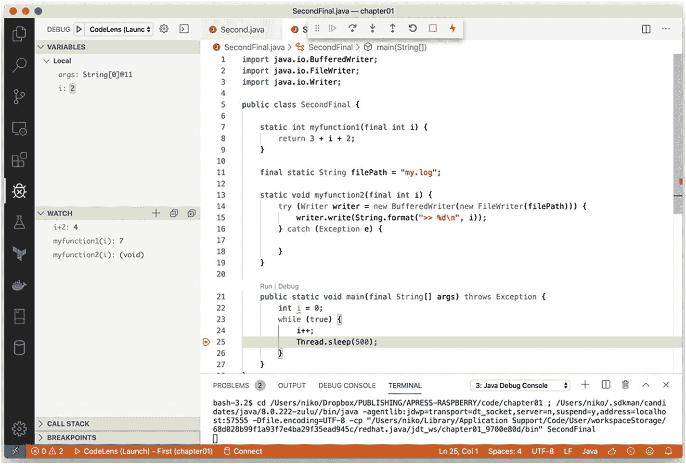

图 1-29 监视表达式

这并不难，对吧？好消息是，在处理图像库 OpenCV 时，你可以重用这些技术。例如，你可以执行以下操作：

*   输出图像的宽度、高度以及颜色通道数

*   将图像的霍夫线输出到外部文件

*   输出图像中检测到的人脸数量

请记住，你可以在调试模式下启动代码执行后添加监视表达式，因此可以在任何需要的时候添加它们。

### 更改变量值

在结束之前，关于 Visual Studio Code 调试的最后一点是，你可以直接从 `Variables` 选项卡实时更改变量的值。

这可是一项超能力！

你可以通过双击想要更改的变量值来实现，如图 1-30 所示。

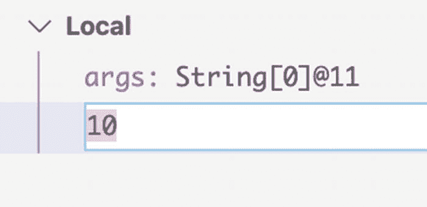

图 1-30 更新变量值

观察图 1-31 中相关的监视表达式是如何为你重新计算的。

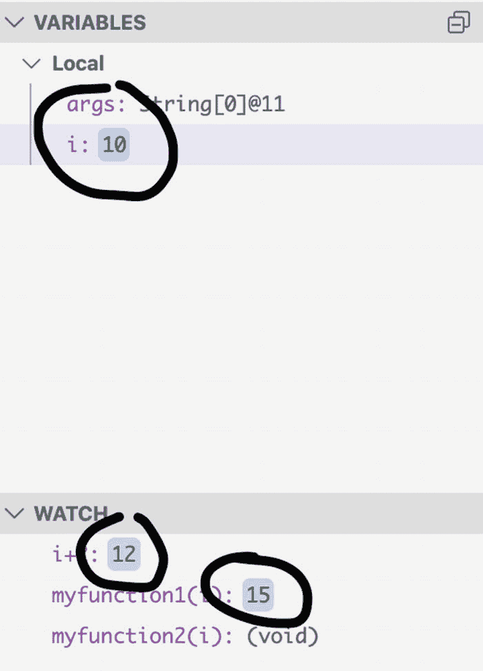

图 1-31 你可以看到相关的监视值正在被更新

太棒了。在图像处理和神经网络的背景下，你可以直接更新 `alpha`、`gamma`、对比度等参数，并实时获得重新计算的图像或检测结果。

### 总结

我们花了一些时间学习调试，所以想象一下，通过在你刚刚看到的图像处理和对象检测的背景下重用这些技术，可以完成多少工作。

例如，图 1-32 展示了如何将一个设计良好的调试布局用作完整的用户界面，来更新用于棕褐色转换的值。

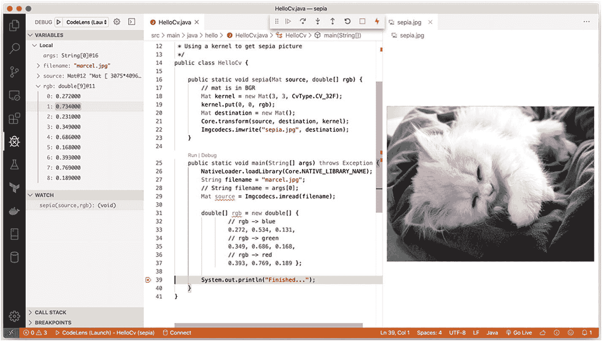

图 1-32 棕褐色调的马塞尔猫

在此布局中，你可以看到以下内容：

*   用于重新计算棕褐色调的值数组已在主代码中提取为一个双精度数组。

*   调试时，`rgb` 数组及其值在 `Variables` 选项卡中可用，并且可以随意更新。

*   这里的 `sepia` 函数仅用作调试函数，不在主代码中使用。

*   该 `sepia` 函数将图片输出到一个名为 `sepia.jpg` 的文件中。

*   添加了一个监视表达式，简单地调用之前定义的 `sepia` 函数。

*   `sepia.jpg` 图片在 Visual Studio Code 中打开，并且 `rgb` 数组中任何值的更新都会实时输出一张新图片。

现在你已经了解了如何在 Visual Studio Code 中进行操作，让我们继续探索一些 OpenCV 的乐趣吧。