# 2. 视频流中的对象检测

大多数关于在 Java 中使用 OpenCV 的可用指南都要求你在开始之前拥有大量的知识。对你来说，好消息是，凭借你到目前为止从本书中学到的知识，你可以在几秒钟内开始在 Java 中使用 OpenCV。

## 棕褐色调入门：OpenCV Java 基础

> *选择棕褐色调完全是为了让图像看起来浪漫和理想化。这有点像一种柔和的宣传形式。*
> 
> —马丁·帕尔^(¹)

在本节中，你将了解一些基本的 OpenCV 概念。你将学习如何添加在 Java 中使用 OpenCV 所需的文件，并将处理一些简单的 OpenCV 应用程序，例如平滑、模糊图像，或者实际上将它们转换为棕褐色图像。


### 几个让事情更简单的文件…

Visual Studio Code 很智能，但要理解与 OpenCV 库相关的代码，它需要一些指引。这些指引包含在项目的元数据文件中，该文件指定了运行代码需要包含哪个库及其版本。

我们已经为你准备了一个 OpenCV/Java 的模板，因此，要开始使用，你可以直接克隆此处的项目模板：

```
git clone git@github.com:hellonico/opencv-java-template.git
```

或者，你也可以使用此处的 zip 文件：

```
https://github.com/hellonico/opencv-java-template/archive/master.zip
```

这将为你提供所需的最小文件集，如下所示：

```
.
├── pom.xml
└── src
├── main
│   └── java
│       └── hello
│           └── HelloCv.java
└── test
└── java
└── hello
└── AppTest.java
```

共有七个目录和三个文件。由于此设置可以自动生成，让我们重点关注此处列出的模板内容：

*   `HelloCv.java`，包含主要的 Java 代码
*   `AppTest.java`，包含最基本的 Java 测试文件
*   `pom.xml`，这是一个项目描述文件，Visual Studio Code 可以用它来引入外部 Java 依赖

你可以在 Visual Studio Code 中打开项目模板的顶层文件夹，这会给你一个熟悉的视图，如图 2-1 所示。

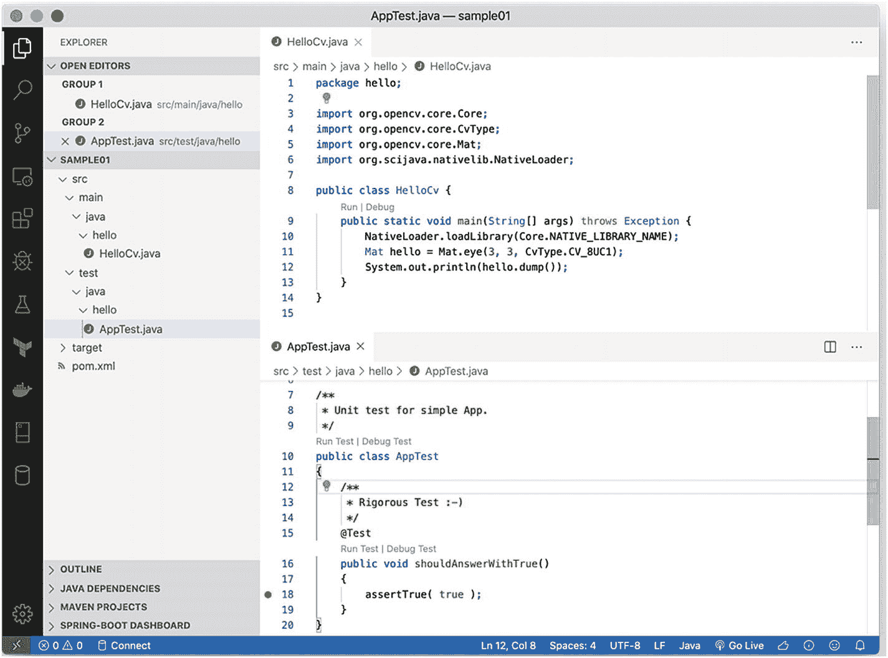

**图 2-1** 项目布局

图 2-1 显示了两个 Java 文件，因此你可以看到每个文件的内容；此外，项目布局已展开，以便在左侧列出所有文件。

这个视图应该让你觉得和前一章很相似，你可以立即尝试通过主函数顶部的“运行”或“调试”链接来运行 `HelloCv.java` 代码。

终端中的输出应该类似于以下代码，这是一个 OpenCV 的 `Mat` 对象。简单来说，它是一个 3×3 的矩阵，左上角到右下角的对角线上是 1。

```
[  1,   0,   0;
0,   1,   0;
0,   0,   1]
```

对于 OpenCV 的用户来说，清单 2-1 可能看起来很熟悉。

```
package hello;
import org.opencv.core.Core;
import org.opencv.core.CvType;
import org.opencv.core.Mat;
import org.scijava.nativelib.NativeLoader;
public class HelloCv {
public static void main(String[] args) throws Exception {
NativeLoader.loadLibrary(Core.NATIVE_LIBRARY_NAME);
Mat hello = Mat.eye(3, 3, CvType.CV_8UC1);
System.out.println(hello.dump());
}
}
```

**清单 2-1** 第一个 OpenCV Mat

让我们逐行分析代码，以理解幕后发生的事情。

首先，我们使用 `NativeLoader` 类来加载一个原生库，如下所示：

```
NativeLoader.loadLibrary(Core.NATIVE_LIBRARY_NAME);
```

这一步是必需的，因为 OpenCV 不是一个 Java 库；它是一个专门为你的环境编译的二进制文件。

通常在 Java 中，你使用 `System.loadLibrary` 来加载原生库，但这需要满足两个条件：

*   你有一个为你的机器编译好的库。
*   该库被放置在计算机上的 Java 运行时可以找到的位置。

在本书中，我们将依赖一些打包魔法，库会被自动下载并加载，并且在此过程中，库会被放置在 `NativeLoader` 为你处理的位置。因此，除了在每个 OpenCV 程序的开头添加这一行代码之外，你无需做任何其他事情；最好将其放在主函数的顶部。

现在，让我们继续看程序的第二行，如下所示：

```
Mat hello = Mat.eye(3, 3, CvType.CV_8UC1);
```

第二行创建了一个 `Mat` 对象。正如刚才解释的，`Mat` 对象就是一个矩阵。所有的图像处理、视频处理以及网络操作都是使用这个 `Mat` 对象完成的。可以毫不夸张地说，OpenCV 在编程层面主要做的事情就是提供一个优秀的编程接口来处理优化的矩阵，换句话说，就是这个 `Mat` 对象。

在 Visual Studio Code 中，你可以直接使用自动补全功能来访问操作，如图 2-2 所示。

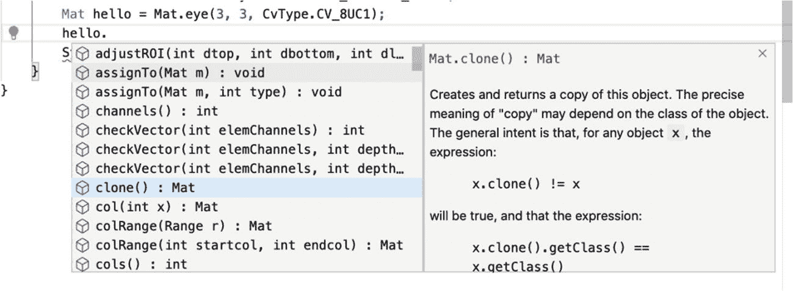

**图 2-2** OpenCV Mat 对象的内联文档

在这一行代码中，你创建了一个 3×3 的矩阵，矩阵中每个元素的内部类型是 `CV_8UC1`。你可以将 `8U` 理解为 8 位无符号整数，将 `C1` 理解为通道 1，这基本上意味着矩阵的每个单元格是一个整数。

类型的命名方案如下：

```
CV_{U|S|F}C
```

理解 `Mat` 中使用的类型很重要，所以请务必查看表 2-1 中显示的最常见类型。

**表 2-1** OpenCV Mat 对象的 OpenCV 类型

| 名称 | 类型 | 字节数 | 有符号 | 范围 |
| --- | --- | --- | --- | --- |
| `CV_8U` | 整数 | 1 | 否 | 0 到 255 |
| `CV_8S` | 整数 | 1 | 是 | −128 到 127 |
| `CV_16S` | 整数 | 2 | 是 | −32768 到 32767 |
| `CV_16U` | 整数 | 2 | 否 | 0 到 65535 |
| `CV_32S` | 整数 | 4 | 是 | −2147483648 到 2147483647 |
| `CV_16F` | 浮点数 | 2 | 是 | −6.10 × 10^(-5) 到 6.55 × 10⁴ |
| `CV_32F` | 浮点数 | 4 | 是 | −1.17 × 10^(-38) 到 3.40 × 10³⁸ |

`Mat` 中的通道数也很重要，因为图像中的每个像素都可以由多个值的组合来描述。例如，在 RGB（图像中最常见的通道组合）中，每个像素有三个介于 0 到 256 之间的整数值。一个值代表红色，一个值代表绿色，一个值代表蓝色。

在清单 2-2 中，我们展示了一个 50×50 的蓝色 `Mat`，你可以亲自验证。

```
public class HelloCv2 {
public static void main(String[] args) throws Exception {
NativeLoader.loadLibrary(Core.NATIVE_LIBRARY_NAME);
Mat hello = Mat.eye(50, 50, CvType.CV_8UC3);
hello.setTo(new Scalar(190, 119, 0));
HighGui.imshow("rgb", hello);
HighGui.waitKey();
System.exit(0);
}
}
```

**清单 2-2** 一点蓝色…

执行上述代码将得到一个 50×50 的 `Mat`，其中每个像素由三个通道组成，意味着三个值，但请注意，在 OpenCV 中，RGB 值在设计上是反转的（为什么，哦，为什么？），所以它实际上是 BGR。蓝色值在代码中排在第一位。

因此，在使用 `setTo` 函数设置所有像素的值之前，其值为 B:190, G:119, Red:0，这产生了图 2-3 中显示的漂亮的海蓝色。

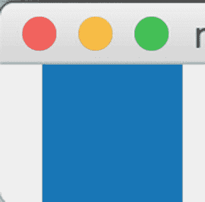

**图 2-3** 海蓝色

对 `Mat` 对象的操作通常使用 `org.opencv.core.Core` 类完成。例如，两个 `Mat` 对象的相加是使用 `Core.add` 函数完成的，该函数接收两个输入对象，两个 `Mat` 对象，以及一个用于接收加法结果的对象，该结果也是一个 `Mat`。

为了理解这一点，我们可以使用一个 1×1 的 `Mat` 对象。你可以看到，当两个 `Mat` 对象相加时，你会得到一个结果 `Mat`，其中每个单元格的值是第一个 `Mat` 和第二个 `Mat` 中相同位置相加的结果。最后，结果存储在 `dest Mat` 中，如清单 2-3 所示。

```
Mat hello = Mat.eye(1, 1, CvType.CV_8UC3);
hello.setTo(new Scalar(190, 119, 0));
Mat hello2 = Mat.eye(1, 1, CvType.CV_8UC3);
hello2.setTo(new Scalar(0, 0, 100));
Mat dest = new Mat();
Core.add(hello, hello2, dest);
System.out.println(dest.dump());
```

**清单 2-3** 将两个 Mat 对象相加


结果如下所示，这是一个 1×1 的 `dest Mat`。别搞混了，这只是一个像素，包含三个值，每个通道一个值。

```
[190, 119, 100]
```

现在，我们让你稍加练习，在一个 50×50 的 `Mat` 上执行相同的操作，并再次使用 HighGui 在窗口中显示结果。

结果应如图 2-4 所示。


图 2-4

两个彩色 Mat 相加

## OpenCV 入门 2：加载、调整大小和添加图片

你已经了解了如何将极小的 `Mat` 对象相加，现在让我们看看添加两张图片（具体来说，是两个大型 `Mat` 对象）时是如何工作的。

我姐姐有一只漂亮的猫，名叫马塞尔，她非常友好地同意提供几张马塞尔的照片供本书使用。图 2-5 展示了正在打盹的马塞尔。

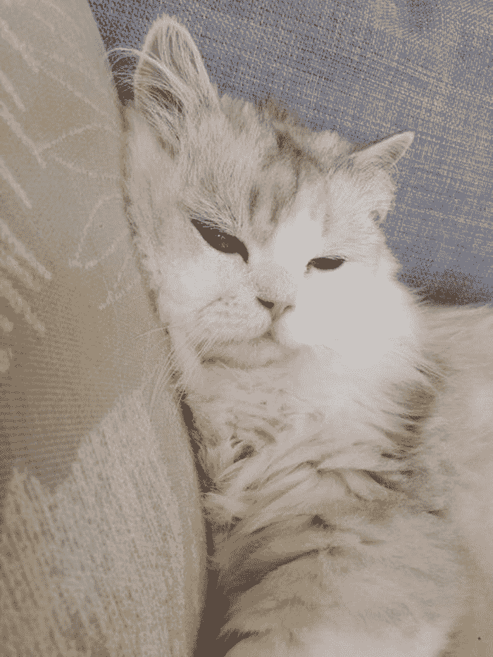

图 2-5

工作中的马塞尔

我从未见过马塞尔在海滩上，但我很想有一张他在海边的照片。

在 OpenCV 中，我们可以通过将马塞尔的照片与一张海滩照片（图 2-6）相加来实现这一点。

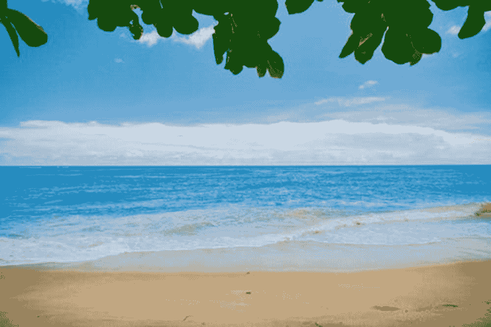

图 2-6

马塞尔即将前往的海滩

第一次尝试将这两张图片正确相加可能需要一些功夫，但这将有助于理解 OpenCV 的工作原理。

### 简单相加

加载图片使用的是 `Imgcodec` 类中的 `imread` 函数。用路径调用 `imread` 会返回一个 `Mat` 对象，与你之前一直在处理的对象类型相同。将两个 `Mat`（马塞尔 `Mat` 和海滩 `Mat`）相加，只需像之前一样使用 `Core.add` 函数即可，如代码清单 2-4 所示。

```
Mat marcel = Imgcodecs.imread("marcel.jpg");
Mat beach = Imgcodecs.imread("beach.jpeg");
Mat dest = new Mat();
Core.add(marcel, beach, dest);
代码清单 2-4
首次尝试相加两个 Mat
```

然而，首次运行这段代码会返回一条含义模糊的错误信息，如下所示：

```
Exception in thread "main" CvException [org.opencv.core.CvException: cv::Exception: OpenCV(4.1.1) /Users/niko/origami-land/opencv-build/opencv/modules/core/src/arithm.cpp:663: error: (-209:Sizes of input arguments do not match) The operation is neither 'array op array' (where arrays have the same size and the same number of channels), nor 'array op scalar', nor 'scalar op array' in function 'arithm_op']
at org.opencv.core.Core.add_2(Native Method)
at org.opencv.core.Core.add(Core.java:1926)
at hello.HelloCv4.simplyAdd(HelloCv4.java:16)
at hello.HelloCv4.main(HelloCv4.java:41)
```

别害怕；让我们快速用调试器检查一下发生了什么，并在合适的位置添加一个断点；查看“变量”选项卡上的 `Mat` 对象，如图 2-7 所示。

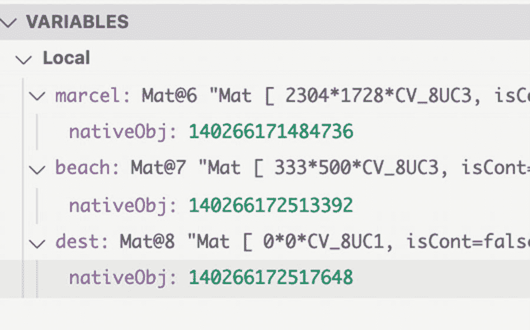

图 2-7

调试 Mat

在添加断点之前，我们可以看到马塞尔 `Mat` 的尺寸确实是 2304×1728，而海滩 `Mat` 较小，为 333×500，因此我们确实需要调整第二个 `Mat` 的大小以匹配马塞尔 `Mat`。如果不执行此调整步骤，OpenCV 就无法计算 `add` 函数的结果，并会显示之前看到的错误信息。

第二次尝试产生了代码清单 2-5 中的代码，我们使用 `Imgproc` 类的 `resize` 函数将海滩 `Mat` 更改为与马塞尔 `Mat` 相同的大小。

```
Mat marcel = Imgcodecs.imread("marcel.jpg");
Mat beach = Imgcodecs.imread("beach.jpeg");
Mat dest = new Mat();
Imgproc.resize(beach, dest, marcel.size());
Core.add(marcel, dest, dest);
Imgcodecs.imwrite("marcelOnTheBeach.jpg", dest);
代码清单 2-5
调整大小
```

运行这段代码，输出的图像看起来类似于图 2-8。

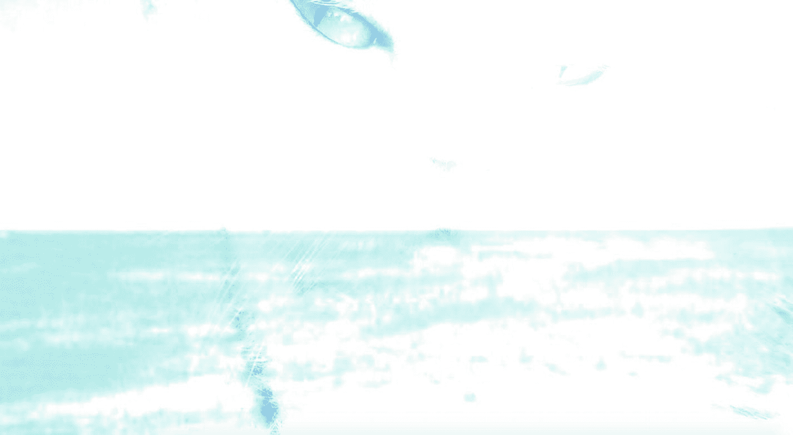

图 2-8

白色、白色、非常白的马塞尔在海滩

嗯。程序确实能运行到结束而不报错，这当然更好，但有些地方不太对劲。输出图片给人一种过度曝光的感觉，看起来太亮了。确实，如果你仔细看，输出图像中的大部分像素的 RGB 值都是最大值 255,255,255，也就是白色的 RGB 值。

我们应该以一种既能保留每个 `Mat` 的感觉，又不会超过最大值 255,255,255 的方式进行相加。

### 加权相加

保留 `Mat` 对象中有意义的值当然是 OpenCV 能做到的。`Core` 类提供了一个加权版本的 `add` 函数，恰当地命名为 `addWeighted`。`addWeighted` 所做的是将每个 `Mat` 对象的值分别乘以不同的缩放因子。甚至还可以通过一个名为 `gamma` 的参数来调整结果值。

`addWeighted` 函数至少需要六个参数；让我们逐一回顾一下。

*   输入 `image1`
*   `alpha`，应用于 `image1` 像素值的因子
*   输入 `image2`
*   `beta`，应用于 `image2` 像素值的因子
*   `gamma`，要加到总和上的值
*   目标 `Mat`

因此，为了计算结果 `Mat` 对象的每个像素，`addWeighted` 执行以下操作：

```
image1 x alpha + image2 x beta + gamma = dest
```

将 `Core.add` 替换为 `Core.addWeighted`，并使用一些有意义的参数值，现在我们得到代码清单 2-6 所示的代码。

```
Mat marcel = Imgcodecs.imread("marcel.jpg");
Mat beach = Imgcodecs.imread("beach.jpeg");
Mat dest = new Mat();
Imgproc.resize(beach, dest, marcel.size());
Core.addWeighted(marcel, 0.8, dest, 0.2, 0.5, dest);
代码清单 2-6
马塞尔去海滩
```

程序执行输出的结果实用得多，如图 2-9 所示。

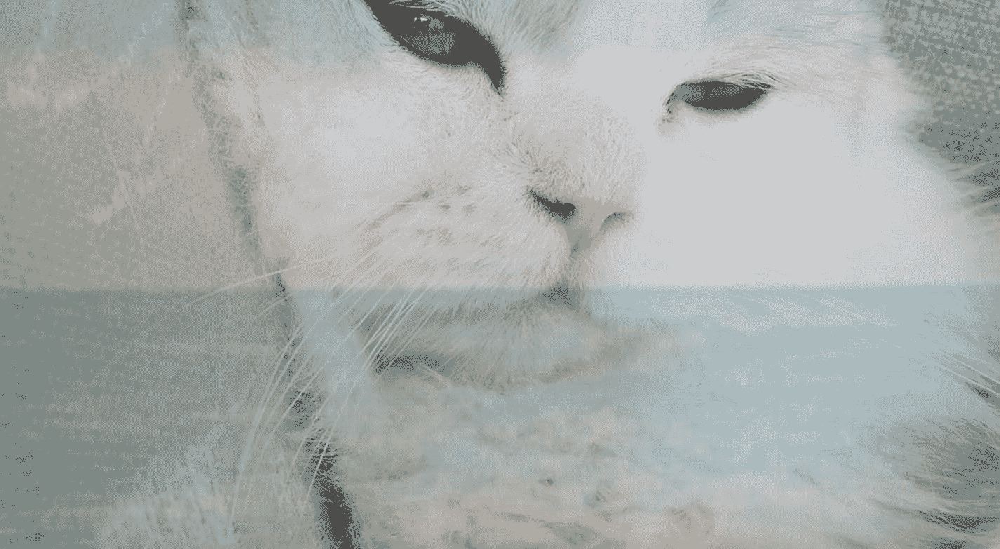

图 2-9

addWeighted。马塞尔终于可以在海滩上放松了


## 回到棕褐色效果

现在，你已经对 OpenCV 中的 `Mat` 计算有了足够了解，可以回到前面几页介绍的棕褐色示例了。

在棕褐色示例中，我们创建了一个核（另一个 `Mat` 对象），用于 `Core.transform` 函数。

`Core.transform` 对输入图像应用变换，其规则如下：

-   输出图像中每个像素的通道数等于核的行数。
-   核的列数必须等于输入的通道数，或者比通道数多 1。
-   每个像素的输出值是一个矩阵变换，该变换作用于数组 `src` 的每个元素，并将结果存储在 `dst` 中，其中 `dst[ I ] = m x src[ I ]`。

关于其工作原理的示例，请参见表 2-2。

**表 2-2** `Core.transform` 示例

| 源数据 | 核 | 输出 | 计算过程 |
| --- | --- | --- | --- |
| `[2 3]` | `[5]` | `[10 15]` | `10 = 2 × 5` `15 = 3 × 5` |
| `[2 3]` | `[5 1]` | `[11 16]` | `11 = 2 × 5 + 1` `16 = 3 × 5 + 1` |
| `[2 3]` | `[5 10]` | `[(10, 20) (15, 30)]` | `(10 = 2 × 5` `20 = 2 × 10)` `(15 = 3 × 5` `30 = 3 × 10)` |
| `[2]` | `[1 2; 3 4]` | `[(4 10)]` | `4 = 2 × 1 + 2` `10 = 3 × 2 + 4` |
| `[2 3]` | `[1 2; 3 4]` | `[(4 10) (5 13)]` | `4 = 2 × 1 + 2` `10 = 2 × 3 + 4` `5 = 3 × 1 + 2` `13 = 3 × 3 + 4` |
| `[2]` | `[1; 2; 3]` | `[(2 4 6)]` | `2 = 2 × 1` `4 = 2 × 2` `6 = 2 × 3` |
| `[2]` | `[1 2; 3 4; 5 6]` | `[(4 10 16)]` | `4 = 2 × 2 + 1` `10 = 2 × 3 + 4` `16 = 2 × 5 + 6` |
| `[(190 119 10)]` | `[0.5 0.2 0.3]` | `[122]` | `122 = 190 × 0.5 + 119 × 0.2 + 10 × 0.3` |

OpenCV 的 `Core.transform` 函数可用于多种场景，也是将彩色图像转换为棕褐色图像的基础。

让我们看看能否将马塞尔变成棕褐色。我们使用一个 3×3 的核进行直接变换，其中每个值的计算方式如上所述。

最简单且最著名的棕褐色变换使用具有以下值的核：

```
[     0.272 0.534 0.131
0.349 0.686 0.168
0.393 0.769 0.189]
```

因此，对于每个生成的像素，蓝色的值如下：

```
0.272 x 源蓝色 + 0.534 x 源绿色 + 0.131 x 源红色
```

绿色的目标值如下：

```
0.349 x 源蓝色 + 0.686 x 源绿色 + 0.168 x 源红色
```

最后，红色的值如下：

```
0.393 x 源蓝色 + 0.769 x 源绿色 + 0.189 x 源红色
```

如你所见，红色的值被大幅压低，每个乘数都在 0.1 左右，而绿色对生成的 `Mat` 对象的像素值影响最大。

这次马塞尔的输入图像如图 2-10 所示。

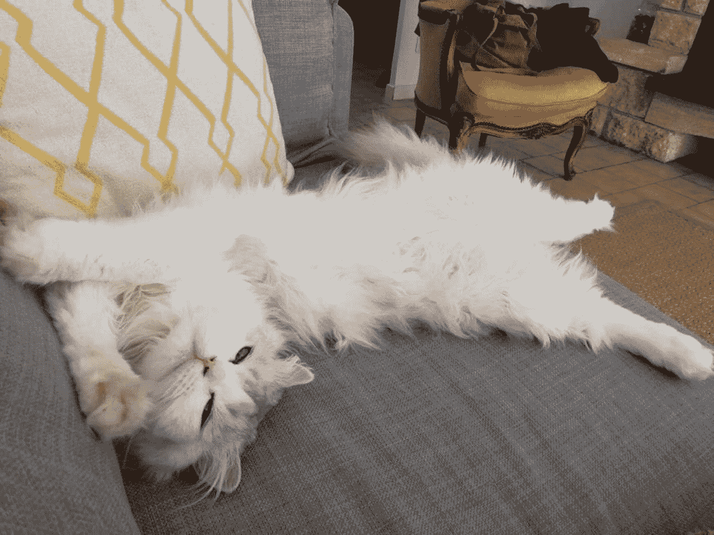

**图 2-10** 马塞尔还不知道自己即将变成棕褐色

要将马塞尔变成棕褐色，首先我们使用 `imread` 读取一张图片，然后应用棕褐色核，如代码清单 2-7 所示。

```
Mat marcel = Imgcodecs.imread("marcel.jpg");
Mat sepiaKernel = new Mat(3, 3, CvType.CV_32F);
sepiaKernel.put(0, 0,
// bgr -> 蓝色
0.272, 0.534, 0.131,
// bgr -> 绿色
0.349, 0.686, 0.168,
// bgr -> 红色
0.393, 0.769, 0.189);
Mat destination = new Mat();
Core.transform(marcel, destination, sepiaKernel);
Imgcodecs.imwrite("sepia.jpg", destination);
```

**代码清单 2-7** 棕褐色马塞尔

如你所见，每个像素的 BGR 输出是根据输入中同一像素的每个通道的值计算得出的。

运行代码后，Visual Studio Code 将图片输出到名为 `sepia.jpg` 的文件中，如图 2-11 所示。

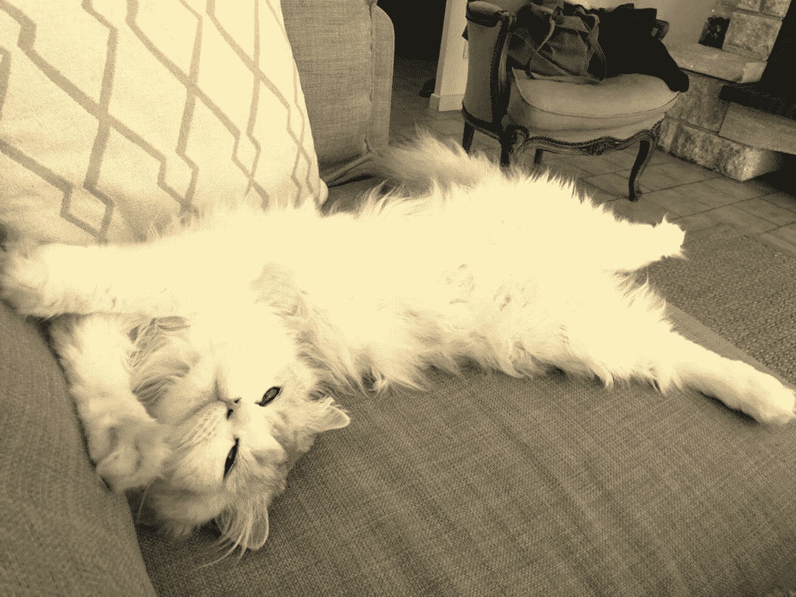

**图 2-11** 变成棕褐色的马塞尔

这有点偏黄的棕褐色。如果我们想要更多红色呢？请继续尝试。

增加红色意味着增加 R 通道的值，即核矩阵的第三行。

将 `kernel[3,3]` 的值从 0.189 提高到 0.589，会使得输入中的红色对输出中的红色产生更大影响。因此，使用以下核，马塞尔会变成更红的色调，如图 2-12 所示：

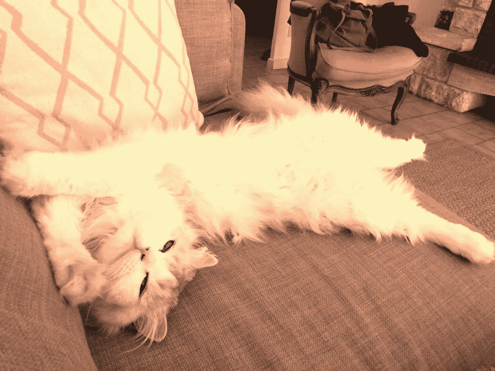

**图 2-12** 马塞尔的红色棕褐色版本

```
// bgr -> 蓝色
0.272, 0.534, 0.131,
// bgr -> 绿色
0.349, 0.686, 0.168,
// bgr -> 红色
0.393, 0.769, 0.589
```

你可以尝试为核设置其他一些值，使棕褐色变得更绿或更蓝……当然，如果你有猫的话，也可以用自己的猫试试。但是，你能比马塞尔更可爱吗？

## 寻找马塞尔：对象检测入门

让我们来谈谈如何使用猫咪马塞尔来检测对象。

### 使用分类器在图片中查找猫脸

在处理速度变得更快、神经网络登上所有 IT 杂志和书籍封面之前，OpenCV 就已经实现了一种使用分类器在图片中检测对象的方法。

分类器仅使用少量图片进行训练，其方法是在训练阶段向分类器提供训练图片以及你希望分类器在检测阶段检测的特征。

OpenCV 中三种主要的分类器类型（根据它们在训练阶段从输入图像中提取的特征类型命名）如下：

-   Haar 特征
-   Hog 特征
-   局部二值模式（LBP）特征

当你需要获取更多背景信息时，OpenCV 关于级联分类器的文档（`https://docs.opencv.org/4.1.1/db/d28/tutorial_cascade_classifier.html`）提供了大量详细说明。目前，我们的目标不是重复这些免费提供的文档。


#### 什么是特征？

特征是从一组用于训练的数字图像中提取的关键点，这些关键点可以复用于在全新的数字输入上进行匹配。

例如，一篇名为《使用 ORB 进行物体识别及其在 FPGA 上的实现》（`http://citeseerx.ist.psu.edu/viewdoc/download?doi=10.1.1.405.9932&rep=rep1&type=pdf`）的论文很好地解释了一种基于 BRIEF 的极快二进制描述符——ORB 分类器。其他著名的基于特征的算法包括尺度不变特征变换（SIFT）和加速稳健特征（SURF）；所有这些算法都旨在为已知图像集（即我们正在寻找的目标）在新输入上匹配特征。

清单 2-8 展示了一个非常简短的示例，说明如何进行特征提取。这里我们使用 ORB 检测器来查找图片的关键点。

```
Mat src = Imgcodecs.imread("marcel2.jpg", Imgcodecs.IMREAD_GRAYSCALE);
ORB detector = ORB.create();
MatOfKeyPoint keypoints = new MatOfKeyPoint();
detector.detect(src, keypoints);
Mat target = src.clone();
target.setTo(new Scalar(255, 255, 255));
Features2d.drawKeypoints(target, keypoints, target);
Imgcodecs.imwrite("orb.png", target);
清单 2-8
ORB 特征提取
```

基本上，特征被提取为一组点。我们通常不会这样做，但在这里绘制关键点会得到类似图 2-13 的结果。

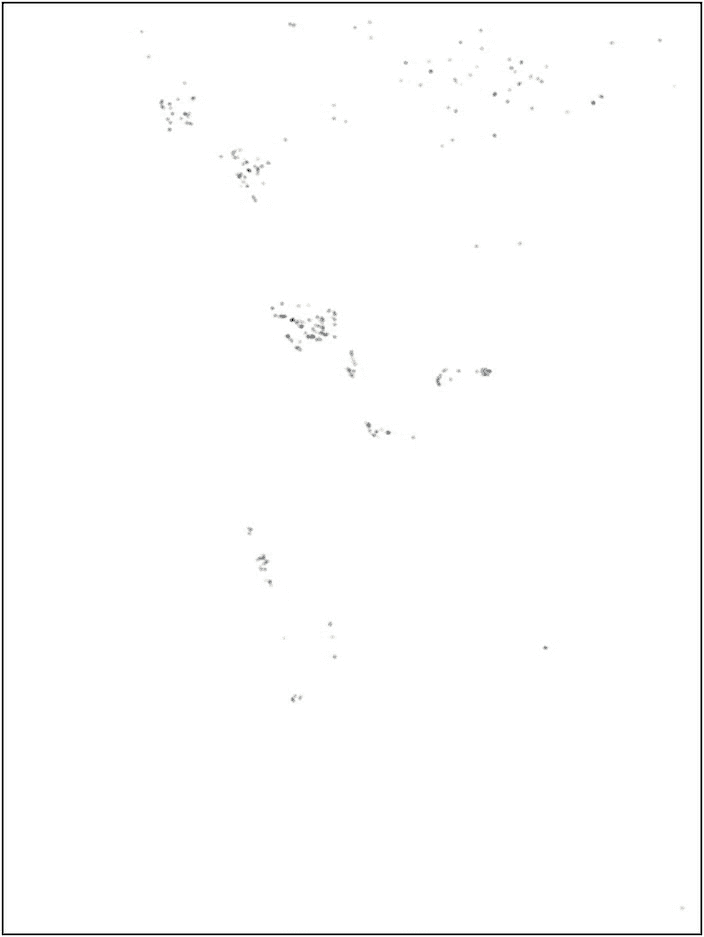

图 2-13

在 Marcel 上提取 ORB 特征

级联分类器之所以得名，是因为其内部包含一组不同的分类器，每个分类器都会以牺牲速度为代价，获得更深层次、更详细的匹配机会。因此，第一个分类器会非常快速地给出正或负的结果，如果为正，则将任务传递给下一个分类器进行更高级的处理，以此类推。

由 Paul Viola 和 Michael Jones 提出的基于 Haar 的分类器，其基础是分析四个主要特征，如图 2-14 所示。

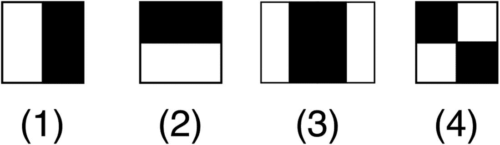

图 2-14

Haar 特征类型

由于这些特征易于计算，因此训练基于 Haar 的物体检测所需的图像数量相当少。最重要的是，直到最近，在嵌入式系统 CPU 速度较低的情况下，这些分类器仍具有速度极快的优势。

#### Marcel 在哪里？

好了，关于研究论文的讨论和阅读就到此为止。简而言之，基于 Haar 的级联分类器擅长识别人脸、人类或动物的特征，甚至可以专注于眼睛、鼻子和微笑，以及全身的特征。

这些分类器还可用于统计视频流中移动头部的数量，并发现是否有人在就寝时间后从冰箱里偷东西。

OpenCV 使得使用级联分类器并立即获得满足感变得轻而易举。将级联分类器付诸实践的方法如下：

1.  从一个 XML 定义文件中加载分类器，该文件包含描述要查找的特征的值。

2.  直接在输入的`Mat`对象上访问一个名为`detectMultiScale`的`Mat`对象，以及一个名为`MatOfRect`的`Mat`对象，后者是 OpenCV 专门设计用于优雅处理矩形列表的对象。

3.  前一步调用完成后，`MatOfRect`会被填充多个矩形，每个矩形描述了输入图像中检测到正样本的一个区域。

4.  在原始图片上进行一些艺术性的绘制，以突出显示分类器找到的内容。

5.  保存输出结果。

实现此功能的 Java 代码实际上相当简单，仅比等效的 Python 代码稍长一点。参见清单 2-9。

```
String classifier
= "haarcascade_frontalcatface.xml";
CascadeClassifier cascadeFaceClassifier
= new CascadeClassifier(classifier);
Mat cat = Imgcodecs.imread("marcel.jpg");
MatOfRect faces = new MatOfRect();
cascadeFaceClassifier.detectMultiScale(cat, faces);
for (Rect rect : faces.toArray()) {
Imgproc.putText(
cat,
"Chat",
new Point(rect.x, rect.y - 5),
Imgproc.FONT_HERSHEY_PLAIN, 10,
new Scalar(255, 0, 0), 5);
Imgproc.rectangle(
cat,
new Point(rect.x, rect.y),
new Point(rect.x + rect.width, rect.y + rect.height),
new Scalar(255, 0, 0),
5);
}
Imgcodecs.imwrite("marcel_blunt_haar.jpg", cat);
清单 2-9
在图像上调用级联分类器
```

运行清单 2-9 中的代码后，你会很快意识到这种略显天真的方法存在的问题。分类器找到了大量额外的正样本，如图 2-15 所示。

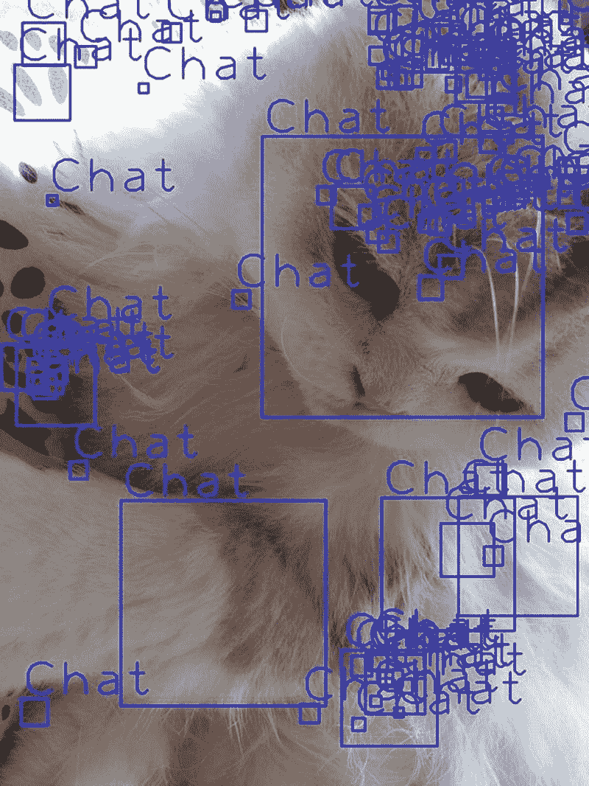

图 2-15

太多的 Marcel……

有两种技术可以减少检测到的物体数量。

*   在矩形循环中根据其大小过滤矩形。虽然这种方法因其简单性而经常被使用，但这增加了关注误报的可能性。

*   向`detectMultiScale`传递额外参数，特别指定获得正样本所需的邻居数量，或者返回矩形的最小尺寸。

完整版本包含了表 2-3 中所示的所有参数。

表 2-3

`detectMultiScale` 参数

| 参数 | 描述 |
| --- | --- |
| `image` | 类型为`CV_8U`的矩阵，包含要检测物体的图像。 |
| `objects` | 矩形向量，每个矩形包含检测到的物体；矩形可能部分位于原始图像之外。 |
| `scaleFactor` | 指定在每个图像尺度上图像尺寸缩小多少的参数。 |
| `minNeighbors` | 指定每个潜在候选矩形应拥有多少个邻居才能被保留的参数。 |
| `flags` | 新级联不使用此参数。 |
| `minSize` | 最小可能的物体尺寸。小于此值的物体将被忽略。 |
| `maxSize` | 最大可能的物体尺寸。如果`maxSize == minSize`模型在单一尺度上评估，则大于此值的物体将被忽略。 |

基于表 2-3 中的信息，让我们为`detectMultiScale`应用一些合理的参数，如下所示：

*   `scaleFactor=2`

*   `minNeighbors=3`

*   `flags=-1`（忽略）

*   `size=300x300`

在清单 2-9 代码的基础上，让我们将包含`detectMultiScale`的那一行替换为以下更新后的代码：

```
cascadeFaceClassifier.detectMultiScale(cat, faces, 2, 3, -1, new Size(300, 300));
```

应用新参数，并且（为什么不呢？）在新代码上运行调试会话，你将得到如图 2-16 所示的布局。

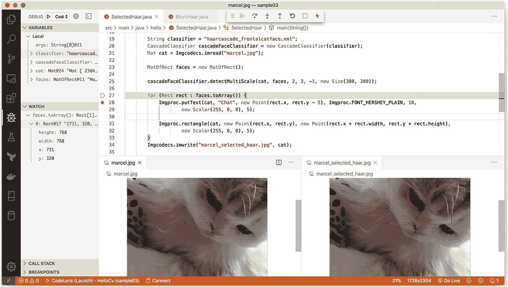

图 2-16

寻找 Marcel 时的调试会话

输出结果已包含在布局中，但你会注意到，找到的矩形现在仅限于一个矩形，并且输出只给出了一张图片（是的，Marcel 只能有一个）。


### 使用 Yolo 神经网络在图片中寻找猫脸

我们实际上还没有学习如何训练级联分类器来识别我们想要识别的物体（因为这超出了本书的范围）。问题是，大多数分类器往往更擅长识别某些物体，例如，识别人比识别汽车、乌龟或标志更准确。

基于这些分类器的检测系统会在多个位置和尺度上对图像应用模型。图像中得分高的区域被视为检测结果。

神经网络 Yolo 采用了一种完全不同的方法。它将一个神经网络应用于整张图像。该网络将图像划分为多个区域，并为每个区域预测边界框和概率。这些边界框会根据预测的概率进行加权。

Yolo 已被证明在实时物体检测中速度很快，它将成为我们在第 3 章中在树莓派上实时运行的首选神经网络。

稍后，你将看到如何训练一个基于 Yolo 的自定义模型来识别你正在寻找的新物体。但为了让本章有一个精彩而激动人心的结尾，让我们快速运行一个提供的默认 Yolo 网络，该网络在 COCO 图像集上训练过，可以检测包括猫、自行车、汽车等在内的 80 种物体。

对我们来说，让我们看看 Marcel 是否能够通过现代神经网络的眼睛被检测为一只猫。

最后一个示例介绍了围绕深度神经网络的一些 OpenCV 新概念，为本章画上了一个完美的句号。

你可能已经知道什么是神经网络；它模拟了大脑中连接的工作方式，模拟了由传入电信号触发的基于阈值的神经元。如果我那神经元密集的大脑是一幅画，它看起来会像图 2-17 那样。

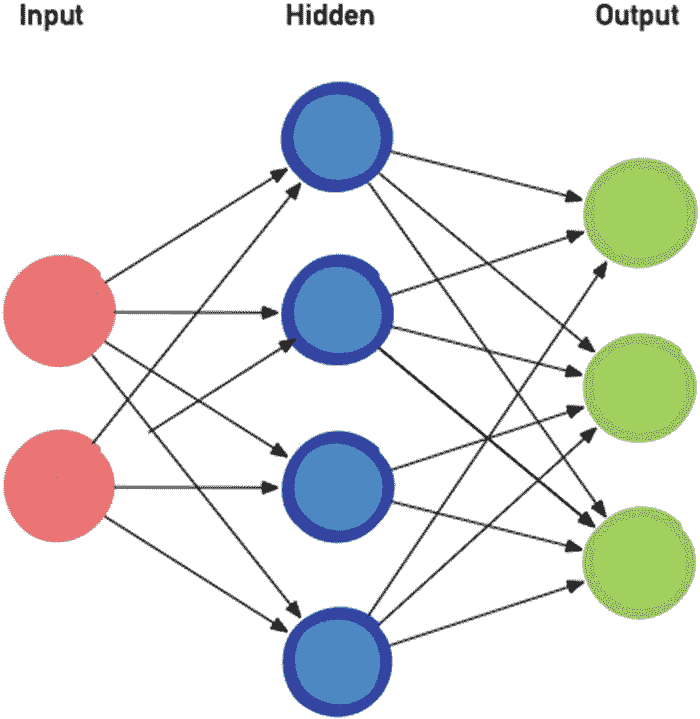

图 2-17

我的大脑

我真心希望现实情况略有不同，我的大脑色彩更加丰富。

你在图 2-17 中第一眼看到的是网络的配置。图 2-17 只显示了输入层和输出层之间的一个隐藏层，但标准的深度神经网络大约有 60 到 100 个隐藏层，当然输入和输出的节点也多得多。

在许多情况下，网络会将图像（使用该网络特定的硬编码尺寸）从一个像素映射到一个节点。输出实际上稍微复杂一些，包含概率和名称，或者至少是列表中名称的索引。

在训练阶段，图中的每个箭头，或者说网络中的每个神经元连接，都会逐渐获得一个权重，这会影响下一个隐藏层或输出层中下一个神经元（即圆圈）的值。

运行代码示例时，我们将需要一个用于网络图形表示的配置文件（包含隐藏层和输出层的数量），以及一个用于权重的文件（包含每个圆圈连接之间的数值）。

现在让我们从理论转向实践，进行一些 Java 编码。我们希望将某个文件作为输入提供给这个基于 Yolo 的网络，并识别出——你猜对了——我们最喜欢的猫。

Yolo 示例分为以下几个步骤，如下所示：

1.  使用两个文件将网络加载为 OpenCV 对象。如你所见，这需要一个权重文件和一个配置文件。

2.  在加载的网络中，找出未连接的层，即没有输出的层。这些层本身就是输出层。运行网络后，我们关心的是这些层中包含的值。

3.  将我们要检测物体的图像转换为网络可以理解的 blob。这是使用 OpenCV 函数 `blobFromImage` 完成的，该函数有许多参数，但很容易理解。

4.  将这个漂亮的 blob 输入到加载的网络中，并使用函数 `forward` 让 OpenCV 运行网络。同时，我们告诉它我们感兴趣检索值的节点，即我们之前计算出的输出层。

5.  Yolo 模型返回的每个输出都包含以下一组数据：
    *   位置的四个值（基本上是描述矩形的四个值）
    *   表示网络可以识别的每个可能物体（在我们的例子中是 80 个）的置信度的值

6.  我们进入后处理步骤，从网络返回的输出中提取并构建边界框和置信度的集合。

7.  Yolo 倾向于为相同的结果发送许多边界框；我们使用另一个 OpenCV 函数 `Dnn.NMSBoxes`，通过保留置信度得分最高的边界框来移除重叠的框。这被称为*非极大值抑制*（NMS）。

8.  我们使用带注释的矩形和文本在图片上显示所有这些信息，这与许多物体检测示例的情况相同。

完整代码见清单 2-10。Java 语言比较冗长，导致代码行数不少，但这不应该再让你感到害怕了，对吧？


```java
static final String OUTFOLDER = "out/";
static final Scalar BLACK = new Scalar(0, 0, 0);
static {
new File(OUTFOLDER).mkdirs();
}
public static void main(String[] args) throws Exception {
NativeLoader.loadLibrary(Core.NATIVE_LIBRARY_NAME);
runDarknet(new String[] { "marcel.jpg", "marcel2.jpg", "chats.jpg", });
}
private static void runDarknet(String[] sourceImageFile) throws IOException {
// 读取标签
List labels = Files.readAllLines(Paths.get("yolov3/coco.names"));
// 从配置文件和权重文件加载网络
Net net = Dnn.readNetFromDarknet("yolov3/yolov3.cfg", "yolov3/yolov3.weights");
// 查找输出层
// 这取决于网络配置
List layersNames = net.getLayerNames();
List outLayers = net.getUnconnectedOutLayers().toList().stream().map(i -> i - 1).map(layersNames::get)
.collect(Collectors.toList());
// 对每个输入执行推理
for (String image : sourceImageFile) {
runInference(net, outLayers, labels, image);
}
}
private static void runInference(Net net, List layers, List labels, String filename) {
final Size BLOB_SIZE = new Size(416, 416);
final double IN_SCALE_FACTOR = 0.00392157;
final int MAX_RESULTS = 20;
// 加载图像，将其转换为 blob，然后输入网络
Mat frame =
Imgcodecs.imread(filename, Imgcodecs.IMREAD_COLOR);
Mat blob = Dnn.blobFromImage(frame, IN_SCALE_FACTOR, BLOB_SIZE, new Scalar(0, 0, 0), false);
net.setInput(blob);
// 用于接收网络运行输出的胶水代码
List outputs = layers.stream().map(s -> {
return new Mat();
}).collect(Collectors.toList());
// 执行推理
net.forward(outputs, layers);
List labelIDs = new ArrayList();
List probabilities = new ArrayList();
List locations = new ArrayList();
postprocess(filename, frame, labels, outputs, labelIDs, probabilities, locations, MAX_RESULTS);
}
private static void postprocess(String filename, Mat frame, List labels, List outs,
List classIds, List confidences, List locations, int nResults) {
List tmpLocations = new ArrayList();
List tmpClasses = new ArrayList();
List tmpConfidences = new ArrayList();
int w = frame.width();
int h = frame.height();
for (Mat out : outs) {
final float[] data = new float[(int) out.total()];
out.get(0, 0, data);
int k = 0;
for (int j = 0; j  0) {
float center_x = data[k + 0] * w;
float center_y = data[k + 1] * h;
float width = data[k + 2] * w;
float height = data[k + 3] * h;
float left = center_x - width / 2;
float top = center_y - height / 2;
tmpClasses.add((int) result.maxLoc.x);
tmpConfidences.add((float) result.maxVal);
tmpLocations.add(
new Rect(
(int) left,
(int) top,
(int) width,
(int) height));
}
k += out.width();
}
}
annotateFrame(frame, labels, classIds, confidences, nResults, tmpLocations, tmpClasses, tmpConfidences);
Imgcodecs.imwrite(OUTFOLDER + new File(filename).getName(), frame);
}
private static void annotateFrame(Mat frame, List labels, List classIds, List confidences,
int nResults, List tmpLocations, List tmpClasses, List tmpConfidences) {
// 执行非极大值抑制，以消除置信度较低的重叠冗余框，并按置信度排序
// Yolo 会产生大量重叠结果，因此必须使用此方法
MatOfRect locMat = new MatOfRect();
locMat.fromList(tmpLocations);
MatOfFloat confidenceMat = new MatOfFloat();
confidenceMat.fromList(tmpConfidences);
MatOfInt indexMat = new MatOfInt();
Dnn.NMSBoxes(locMat, confidenceMat, 0.1f, 0.1f, indexMat);
// 此时我们只保留非重叠且置信度最高的框
// 因此将它们绘制在图片上
for (int i = 0; i < indexMat.total() && i < nResults; ++i) {
int idx = (int) indexMat.get(i, 0)[0];
classIds.add(tmpClasses.get(idx));
confidences.add(tmpConfidences.get(idx));
Rect box = tmpLocations.get(idx);
String label = String.format("%s [%.0f%%]", labels.get(classIds.get(i)), 100 * tmpConfidences.get(idx));
Imgproc.rectangle(frame, box, BLACK, 2);
Imgproc.putText(frame, label, new Point(box.x, box.y), Imgproc.FONT_HERSHEY_PLAIN, 5.0, BLACK, 3);
}
}
```
**清单 2-10** 在图像上运行 Yolo

在 Marcel 的图像上运行该示例，实际上会得到非常高的置信度分数，这些分数接近完美定位，如图 2-18 所示。

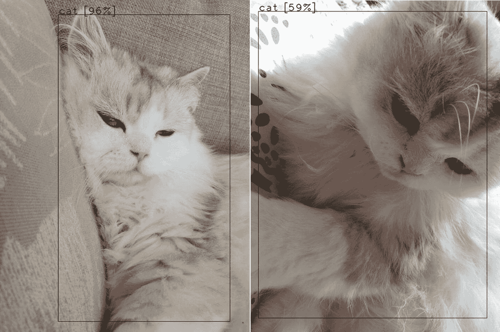

**图 2-18** 基于 Yolo 的检测确认 Marcel 是一只可爱的猫

对多只猫进行推理也能得到很好的结果，但在第二次运行时，我们遗漏了一只猫，因为它与另一只被检测到的猫位置过于接近，并且由于我们引入了后处理步骤，该步骤会移除重叠的匹配框。参见图 2-19。

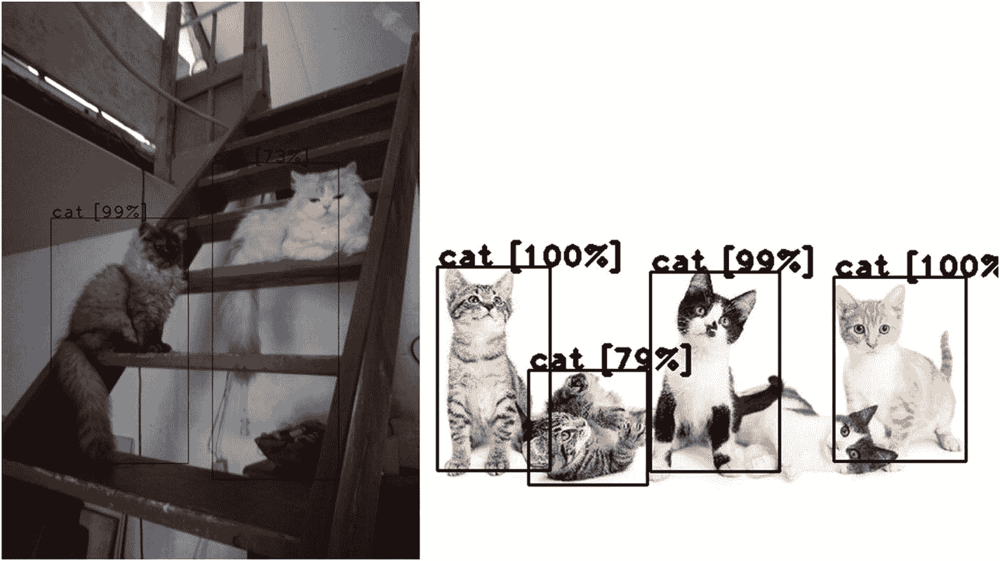

**图 2-19** 多只猫

现在，你可以尝试修改 `Dnn.NMSBoxes` 函数调用的参数，看看能否让两个框同时显示。

静态图像的问题在于，我们很难获得现实生活中存在的额外上下文信息。当处理来自实时视频流的输入图像集时，这个缺点就会消失。

因此，在完成第 2 章后，你现在可以对图片进行目标检测了。第 3 章将在此基础上，使用树莓派教你进行设备端检测。

脚注 1

