# 3. 树莓派 4 上的视觉处理

> *想象一个世界，你唯一的财产是一颗覆盆子，而你把它送给了朋友。*
> 
> ——格尔达·韦斯曼·克莱因，《除了我的生命》（Hill and Wang，1995）

在第 1 章和第 2 章中，你了解了如何在普通台式计算机上使用 Java 启动并运行计算机视觉。设置过程有些手动，但所有不同的构建模块都是免费提供的，因此只需将这些模块组合在一起即可。

在本章中，你将向组合中添加另一个模块——树莓派 4。本章的首要目标是执行与在计算机上相同的任务，但尽可能在物联网设备上运行，同时从本地桌面输入代码并控制代码执行。换句话说，你将在计算机上编写代码，但在树莓派上执行。

对于代码执行部分，你需要一些特定的硬件和线缆，因此你应该准备好去购物。我们将提供一份购物清单，然后继续设置。

具体来说，我们将介绍如何创建 SD 卡和设置树莓派，但假设这些步骤中的大部分已在其他书籍和博客中充分介绍过，因此如果你需要比此处介绍的基础知识更多的内容，可以阅读那些资料。

在本章结束时，你将很好地掌握树莓派在运行不同视觉操作和检测算法时的速度及能耗。你还将准备好将此功能大规模集成到你设计的语音控制家庭助手中，从而扩展你的个人家庭或工作办公室自动化。


## 让树莓派“活”起来

*“天哪，”我喊道，“你竟在智慧的骄傲中如此无知！”*

——玛丽·雪莱，《弗兰肯斯坦》（1818 年）

我们不是弗兰肯斯坦博士，但要让树莓派“活”起来，我们必须像设计一个生命体一样工作：插上电缆，组装，然后给这个小设备通电。需要采购一些物品，在开始做任何有用的事情之前，我们必须先收集好物理硬件。幸运的是，大部分要买的东西都很便宜，而且可以从别人的旧电脑或你奶奶的阁楼里找到可重复利用的。她不会发现的。

采购完毕，树莓派和所有必要部件都组装好后，我们将继续在 Visual Studio Code 上设置与第 1 章相同的视觉项目，并再次学习如何用 Java 编写 OpenCV 程序。

### 采购清单

虽然树莓派本身是一台功能强大的计算机，但大多数时候，如果没有一些额外的配件，你什么也做不了。在本章中，你需要一些附件。

表 3-1 提供了一份采购清单，但你可以自行决定购买的类型和地点。

**小心**

如今市面上的电缆和电源适配器种类繁多。如果你想进行超频，请务必购买输出电流在 4.8A 到 5A 左右的电源适配器。你选择的 USB 线缆也应能承载相应的电流，不过现在大多数线缆都能做到。

**表 3-1** 采购清单

| 名称 | 用途 | 预估价格（美元） | 必需？ | 始终需要？ |   |
| --- | --- | --- | --- | --- | --- |
| 树莓派 4 4GB | 主计算机 | $55 | 是 | 是 | □ |
| USB-C 转 USB-A 线缆 | 连接计算机与电源 | $6 | 是 | 是 | □ |
| 带 USB-A 接口的电源适配器（至少 4.8A，超频需 5A） | 电力供应 | $10 | 是 | 是 | □ |
| HDMI 线缆 | 连接屏幕 | $7 | 是 | 否 | □ |
| SD 卡 128GB | 硬盘 | $10 | 是 | 是 | □ |
| ReSpeaker 麦克风 | 推荐的语音助手麦克风（第 3 章） | $25 | 否 | 如果购买，则需要 | □ |
| 带 HDMI 接口的显示器 | 初始调试用显示器 | $25 | 是 | 否 | □ |
| USB 摄像头 | 录制视频 | $20 | 是 | 是 | □ |
| 键盘和鼠标 |   | $20 | 可能 | 否 | □ |
| 总计 |   | $180 |   |   |   |

一旦你收集齐所有部件（图 3-1），就该让软件在树莓派上运行了。

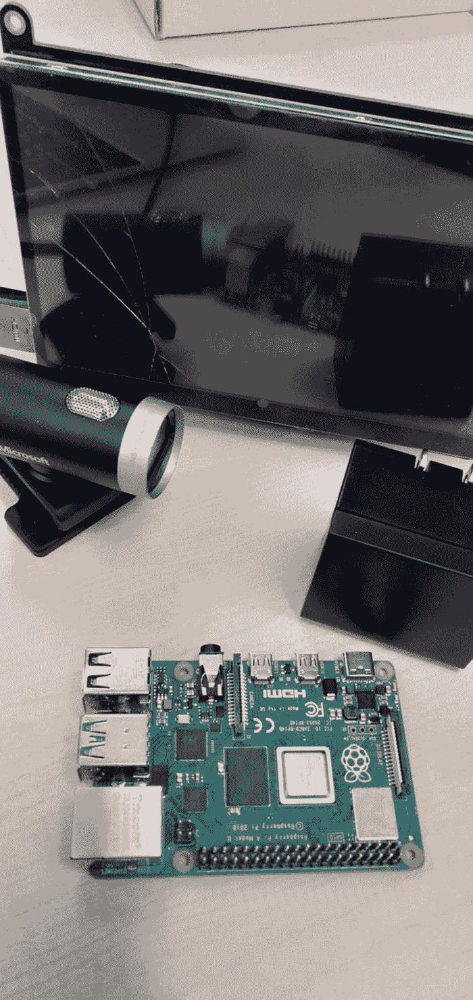

**图 3-1** 树莓派 4、电源适配器、摄像头、屏幕等

### 下载操作系统

没有操作系统，树莓派甚至不会看一眼像马塞尔这样漂亮的猫。树莓派官方网站上提供了几个现成的操作系统。

以下是主要操作系统的简短列表：

*   Ubuntu Mate
*   Ubuntu Core
*   Windows 10 IoT Core
*   Noobs
*   Raspbian（官方操作系统）

Ubuntu Mate 和 Ubuntu Core 是新的不错选择，但我们将专注于官方操作系统 Raspbian，因为大多数树莓派的文档都基于它。而且它上手也非常简单。

Raspbian 是一个基于 Debian 的操作系统，因此大多数 Linux 爱好者会对其感到熟悉，包括其内置的 `aptitude` 包管理器。尽管软件包必须专门为树莓派的 ARM 架构 CPU 编译，但软件包列表非常新，并且大部分与主线 Debian 保持同步。

为了能够将操作系统用作树莓派可启动的镜像，我们首先需要将镜像文件下载到本地计算机，并创建一个专门用于树莓派的可启动磁盘。

要下载这个非常大的操作系统文件（不要在用手机热点时尝试），请访问 [`https://www.raspberrypi.org/downloads/`](https://www.raspberrypi.org/downloads/) 并找到图 3-2 中所示的 Raspbian 图标。

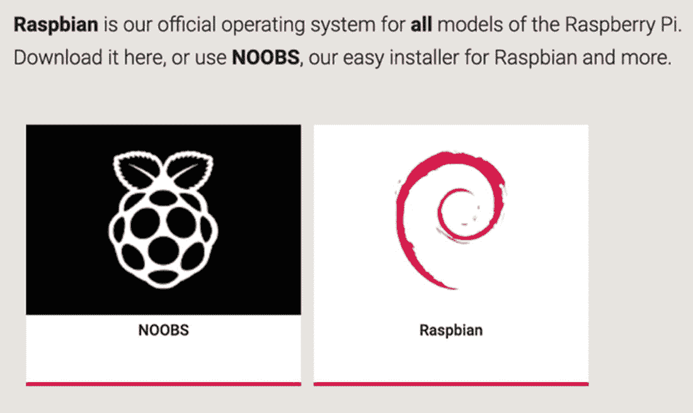

**图 3-2** Raspbian 图标

点击该图标。你将进入 Raspbian 专属的下载页面，如图 3-3 所示，你可以在其中找到要下载的 zip 文件链接。

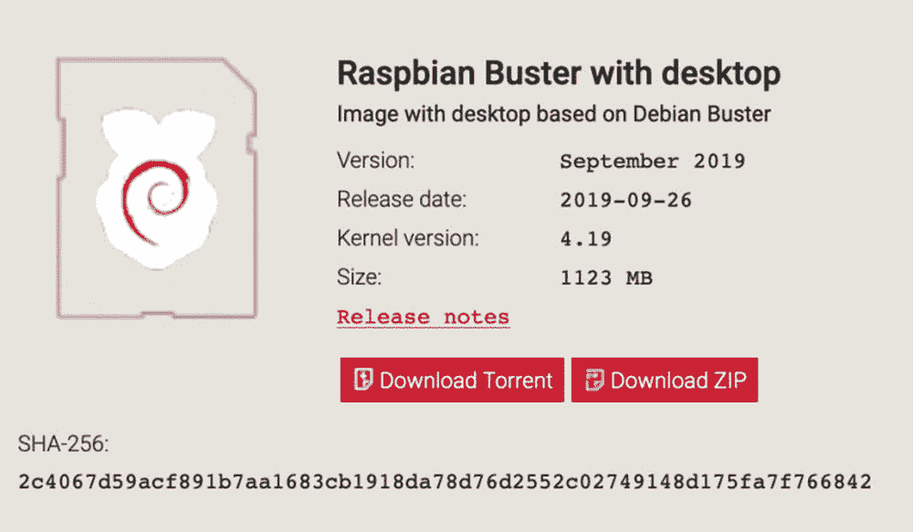

**图 3-3** Raspbian 的种子或 zip 文件

我们不需要完整的桌面安装和所有推荐的软件，但为了简化操作，“带桌面的 Raspbian Buster”版本目前对我们来说就足够了。

### 创建可启动 SD 卡

将操作系统文件下载到计算机后，你就可以创建可启动设备了。正如树莓派网站上所述，将操作系统安装到树莓派上最简单的方法是使用 Etcher，这是一款可以从 zip 文件或 `.img` 文件创建可启动 SD 卡的软件。

Etcher 可从 [`https://www.balena.io/etcher/`](https://www.balena.io/etcher/) 获取，它可以在任何平台上运行，例如 macOS、Windows 和 Linux。本书中的截图是在 Windows 上截取的。

启动应用程序后的第一步是选择下载的 zip 文件，如图 3-4 所示。

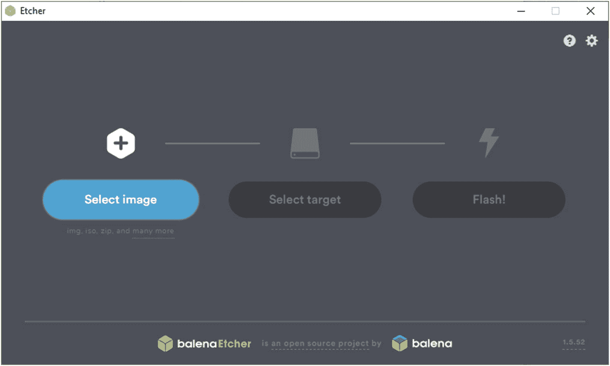

**图 3-4** 选择镜像文件

选择好镜像文件并将 SD 卡插入计算机的 SD 卡槽后，让我们选择要写入操作系统的 SD 卡，如图 3-5 所示。

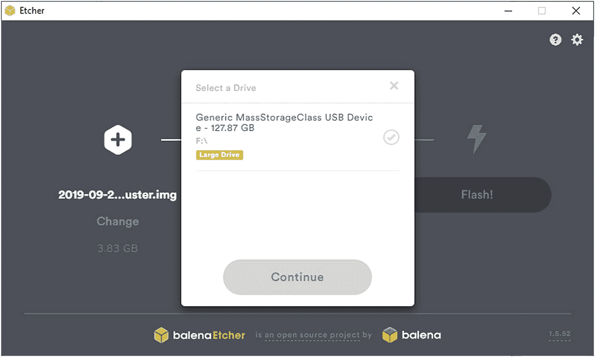

**图 3-5** 选择 micro SD 卡

这里特意选择了一张容量很大的卡，所以你可以忽略关于其大小的提示信息，如图 3-6 所示。

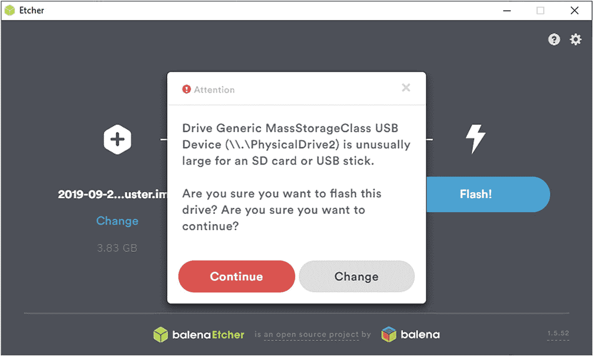

**图 3-6** SD 卡容量很大

最后，让我们继续“烧录”这张卡，换句话说，就是将文件写入卡中。进度会显示出来，通常不会超过两三分钟，如图 3-7 所示。


**图 3-7** 烧录中

在最后一步，Etcher 会检查已复制数据的完整性，如图 3-8 所示。


**图 3-8** 验证中

一旦烧录和验证完成，Windows 会像以前一样尝试使用该驱动器，但现在 SD 卡的格式在没有特定驱动程序的情况下无法读取，如图 3-9 所示。你可以安全地忽略此消息并单击“取消”。


**图 3-9** 别害怕……

卡已经准备好了，现在让我们插上树莓派的线缆吧。


#### 连接线缆

> *电是危险的。我的侄子曾试图把一枚硬币塞进插座。说“一分钱走不远”的人，真该看看他当时被弹飞出去的样子。我告诉他，他被“接地”了。*
> 
> ——蒂姆·艾伦

我发现把各种线缆插接在一起既有趣又放松，实际上，这甚至可以用于个人心理治疗，来应对我们所处的这个艰难世界。

表 3-2 列出了需要进行的连接（并非详尽清单）。

**表 3-2** 插接清单

| 从 | 到 | 原因 |   |
| --- | --- | --- | --- |
| 电源交流电 | 电源适配器 | 获取电力 | □ |
| USB-A | 电源适配器 | 为树莓派供电 | □ |
| 网络摄像头 | 树莓派 USB 端口 | 获取视频流 | □ |
| 鼠标 | 树莓派 USB 端口 | 使用指针 | □ |
| 键盘 | 树莓派 USB 端口 | 使用键盘 | □ |
| 屏幕 HDMI | 树莓派 Micro HDMI | 显示画面 | □ |
| USB-C | 树莓派 | 为树莓派供电 | □ |

**注意**

请务必最后再插入电源适配器或 USB-C 转树莓派适配器；否则，通电后主板将启动，但无事可做。

有图通常更容易理解，因此请务必参考图 3-10，了解各部件在实际主板上的连接位置。

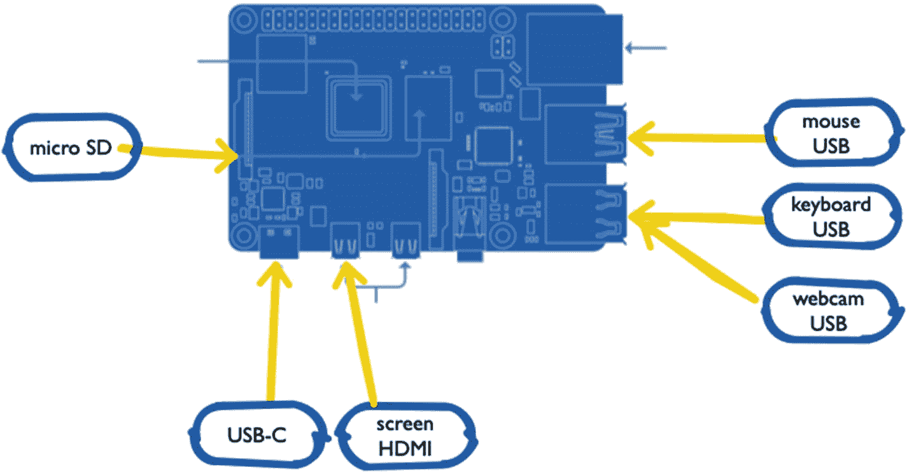

**图 3-10** 树莓派 4 的原始蓝图及连接示意图

最后，将 micro SD 卡插入树莓派 4 后，你就可以准备通电启动了（或者你已经启动了？）。

#### 首次启动

首次启动非常快。启动过程包括一个需要调整文件系统大小的步骤，现在 Raspbian 系统会在首次启动时自动处理。你应该会看到一个欢迎屏幕，如图 3-11 所示。

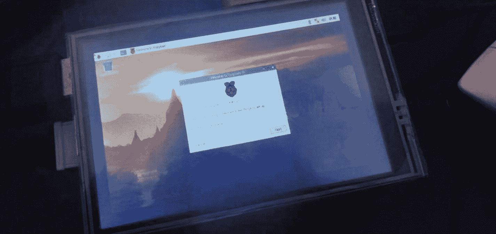

**图 3-11** 首次启动

连接好键盘、鼠标和屏幕后，你可以做很多事情，但对于本章要完成的大多数任务，我们需要通过 SSH 进行操作，这需要网络连接。

你可以将以太网线插入树莓派的以太网端口，但使用 WiFi 效果也很好。在右上角，点击 WiFi 图标，并在对话框中输入你的 WiFi 设置，如图 3-12 所示。

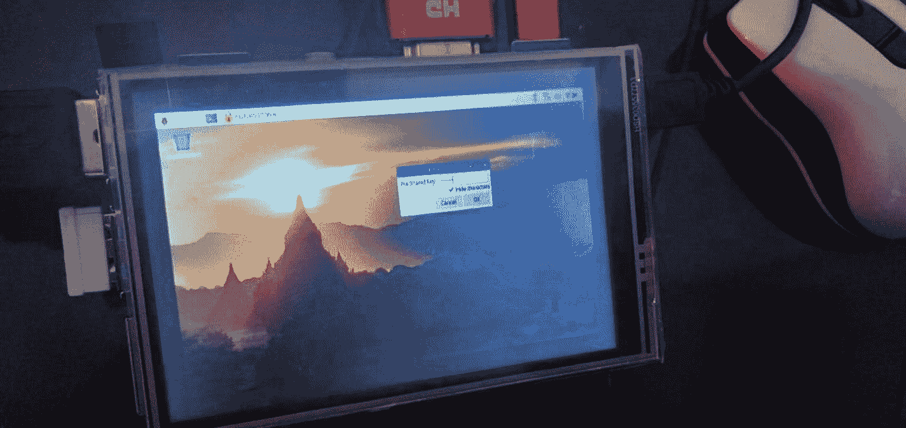

**图 3-12** 设置 WiFi

在通过 SSH 连接之前，还需要最后一步：启用树莓派内置的 OpenSSH 服务器。可以通过以下菜单启用：

```
首选项 ➤ 树莓派配置 ➤ 接口
```

点击启用 SSH 服务器，如图 3-13 所示。

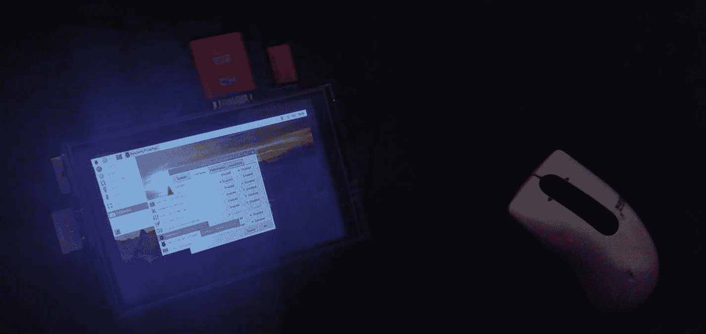

**图 3-13** 启用已安装的 SSH 服务器

现在，让我们通过 SSH 连接到树莓派。

#### 使用 `nmap` 查找你的树莓派

你可能知道，要远程连接到树莓派，你需要它的 IP 地址。你可以在树莓派上打开终端并输入以下命令来找到它：

```
ip addr
```

这将显示你需要用来连接树莓派的 IP 地址。

如果你运气不佳，没有键盘、屏幕、鼠标，或者这些都没有，你可以采用一些简单的命令行应对措施，使用 `nmap` 来查找网络上的所有树莓派（以及所有电脑和国产智能手机）。

这可以通过在主计算机上运行类似以下的命令来完成：

```
sudo nmap -O -p 22 192.168.1.*
```

这里，`192.168.1.*` 是你自己桌面 IP 地址的开头部分，也是树莓派可能所在的网段。请注意，要使此命令生效，我们假设你的计算机和树莓派在同一个网络上。

这个命令实际上是做什么的？简而言之，`nmap` 会扫描本地网络，查找可用的机器和开放的端口。

`-p` 参数用于扫描指定端口，`-O` 参数则表示尽可能多地收集每个找到的主机的信息。

在本地网络上运行上述 `nmap` 命令，会得到类似图 3-14 的结果。

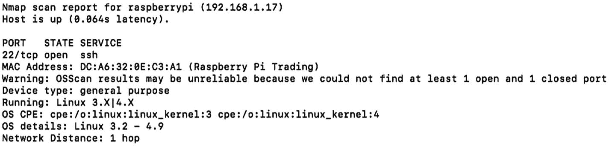

**图 3-14** 查找你的树莓派

已在网络上找到一台树莓派（希望是你的！）。现在，你可以使用默认用户名/密码（应该仍然是 `pi / raspberry`）通过 SSH 连接到它，命令如下：

```
ssh pi@192.16.1.17
```

然后即可连接成功，如图 3-15 所示。

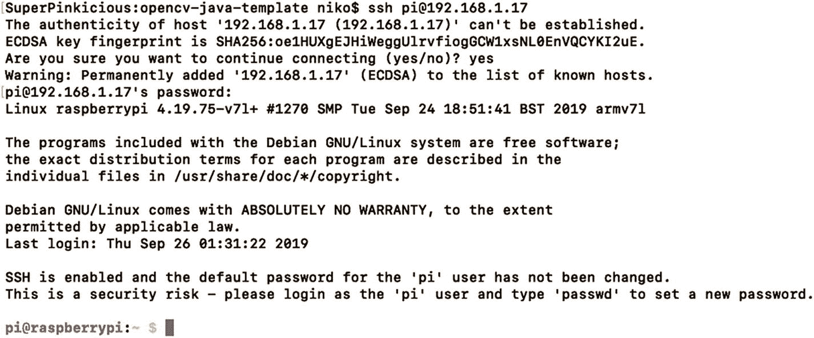

**图 3-15** 启动 SSH 连接

我们建立了一次连接，但后续需要反复执行这些连接步骤，因此，让我们通过修改本地和远程树莓派上的配置文件，来保存一些 SSH 设置以备后用。


#### 轻松设置 SSH

通常，在通过 SSH 连接时，你会禁用密码认证，尤其是树莓派的默认认证方式，然后从本地机器设置一个密钥来连接远程机器，再将该远程机器配置为只接受一个或有限数量的密钥，以防止随机的安全攻击。

其工作原理如下：

1.  创建你个人使用的 SSH 密钥对。一个私钥保留在你的电脑上，一个公钥作为已知实体添加到远程机器上。在量子计算到来之前，这种密钥对被认为是安全的，并且仅通过公钥几乎不可能猜出某人的私钥。有关更多信息，请阅读 Joshua Davies 在 [`https://commandlinefanatic.com/cgi-bin/showarticle.cgi?article=art054`](https://commandlinefanatic.com/cgi-bin/showarticle.cgi%253Farticle%253Dart054) 上发表的文章。

2.  将生成的公钥注册到远程设备（此处为树莓派）上。你可以随意将公钥提供给任意多的人；默认情况下，这是以 `.pub` 扩展名结尾的文件。

3.  添加一些 SSH 配置，以便在通过快捷方式连接到树莓派时使用生成的私钥。不过，那个私钥是属于你的，请确保不要将其提供给任何人！

在亚马逊云服务（AWS）上，你通常会得到一个 `.pem` 文件来连接新的运行实例。该 `.pem` 文件会自动为你注册到新的虚拟机上，因此只有你能访问这个新创建的虚拟机，从而确保对你云端机器的安全访问。

要在你自己的本地机器上创建密钥，请使用 `ssh-keygen` 命令，配合 `-t` 参数指定算法，以及 `-b` 参数指定位数（目前，4096 位被认为是相当安全的）。

```
% ssh-keygen -t rsa -b 4096
Generating public/private rsa key pair.
Enter file in which to save the key (~/.ssh/id_rsa):
```

命令成功运行后，会生成两个文件：`id_rsa.pub` 文件和 `id_rsa` 文件。`pub` 文件是你的公钥，可以提供给任何人；`id_rsa` 是你的私钥，必须极其小心地处理。

为了让树莓派知道你的公钥并识别你，你需要将其作为一行内容添加到 `/home/pi/.ssh/authorized_keys` 文件中，如果必要的话，还需创建该文件及其父文件夹 `.ssh`。

完成后，在你的电脑上，就该将 SSH 连接的详细信息添加到 `$HOME/.ssh/config` 文件中，同样，如果该文件不存在，则创建它。

```
Host pi4
User pi
IdentityFile ~/.ssh/id_rsa
HostName 192.168.1.17
ForwardX11 yes
ForwardX11Trusted yes
```

以下是这些连接设置的含义：

- `pi4` 是我们从现在开始用来连接树莓派的快捷方式。
- `User` 是树莓派上的默认用户，通常是 `pi`。
- `IdentifyFile` 是你电脑上用于验证你身份的私钥路径；这是你刚才创建的文件。
- `HostName` 是树莓派的 IP 地址。如果你忘记了，可以再次使用 `nmap` 查找。
- `ForwardX11` 和 `ForwardX11Trusted` 是必需的，因为我们稍后会将视频流重定向到主电脑。

有了所有这些设置，你可能会想这一切是否值得。让我们立即获得一点成就感来证明它是值得的。通过 SSH 连接，我们现在将打开一个带有用户界面的应用程序，例如内置的 Chromium 浏览器。

你可以通过更改 `DISPLAY` 变量的设置来切换树莓派屏幕上的窗口显示。

- 要显示树莓派屏幕，请使用 `export DISPLAY=:0`。
- 要显示本地电脑屏幕，请使用 `export DISPLAY=:10`。

以下是命令列表：

```
ssh pi4
export DISPLAY=:10
chromium-browser
```

图 3-16 展示了 Chromium 如何在树莓派上执行，但其窗口却打开在电脑上。

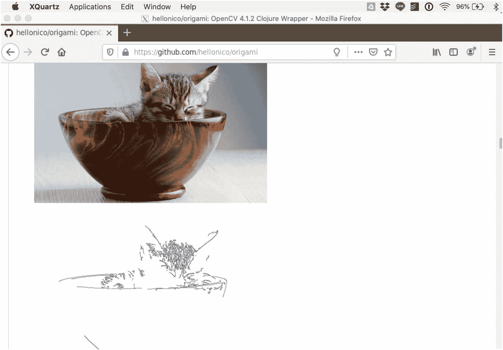

图 3-16

打开远程应用程序

### 为远程使用设置 Visual Studio Code

本书的主要概念之一是，你将能够在一台大屏幕的机器上编写代码，然后让其在远程设备上运行，并将视觉输出重定向到大屏幕上。

到目前为止，你一直在 Visual Studio Code 中编写代码并在本地运行。从现在开始，你将在本地编写代码，并在远程运行它。

本章前面所有的 SSH 设置工作都是因为 Visual Studio Code 有一个名为 Remote-SSH 的插件，一旦你完成了 SSH 设置，它就会为你完成所有其余工作，并与编辑器的生态系统完全集成。

让我们首先安装 Remote-SSH 插件，如图 3-17 所示。

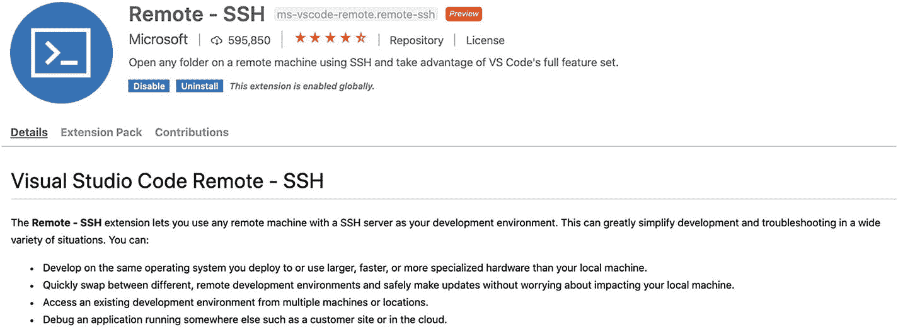

图 3-17

安装 Remote-SSH 插件

插件安装完毕并快速刷新编辑器后，你可以从命令启动器中启动“连接到主机”命令，如图 3-18 所示。

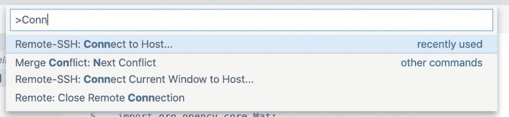

图 3-18

连接到主机

注意

如果当前项目文件过多，Remote-SSH 插件可能无法正常工作。如果出现这种情况，请确保在打开新的 Remote-SSH 会话之前，先在 Visual Studio Code 中打开一个空白的全新窗口。

图 3-19、图 3-20 和图 3-21 向你展示了连接到树莓派所需的步骤。请注意，`pi4` 这个快捷方式取自你刚才在 `$HOME/.ssh/config` 文件中设置的那个。如果你使用了其他快捷方式，这里会有所不同。

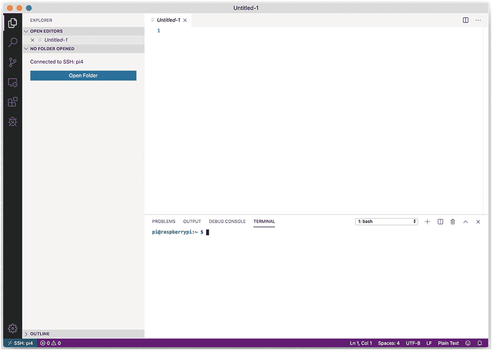

图 3-21

从 Visual Studio Code 连接到树莓派


图 3-20

设置 SSH 主机

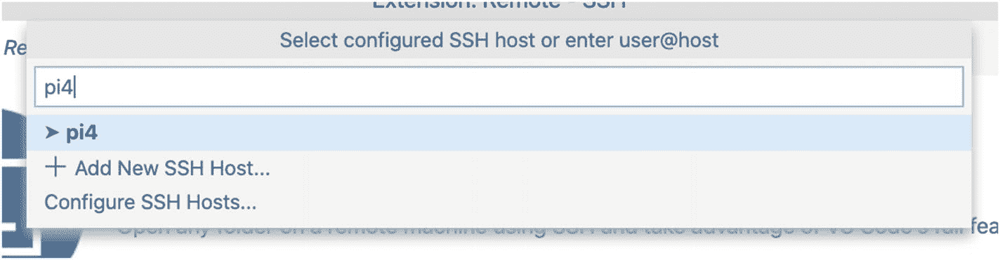

图 3-19

选择 pi4

此时，在 Visual Studio Code 内部，你拥有一个远程连接到树莓派的终端。这意味着你可以随意启动远程命令，而且你还可以拔掉树莓派上的键盘和鼠标；其余大部分工作都将在你的本地电脑上完成。

作为第一次检查，我们可以运行一个命令来检查树莓派的 IP 地址，如下所示：

```
ip addr
```

输出将显示在 Visual Studio Code 的“终端”选项卡中，如图 3-22 所示。

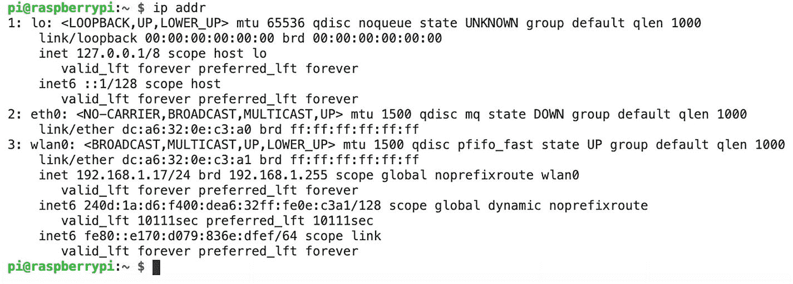

图 3-22

在“终端”选项卡上确认 IP 地址

输出 IP 地址显然不是我们能用那个终端做的主要事情，所以让我们继续，现在安装所需的 Java 开发工具包。


#### 安装 Java OpenJDK

本书中的所有代码均为 Java 代码，因此我们需要在树莓派上安装 Java 开发工具包和运行时环境。

作为可选依赖项，你还可以安装 Maven。本书中的大部分示例并不真正需要 Maven，但这可以阻止 Visual Studio Code 显示烦人的消息，提示它找不到（非必需的）Maven 可执行文件。

因此，在 Visual Studio Code 的终端标签页中，让我们使用软件包安装程序 `apt` 来为我们安装 Java。这通过下面显示的小代码片段完成：

```
sudo apt update
sudo apt install openjdk-11-jdk
```

可选地，也可以运行以下命令来安装 Maven：

```
sudo apt install maven
```

每个命令行开头的 `sudo` 用于获取所需的提升权限，以便使用 `apt` 安装新软件。

前面命令的输出应类似于图 3-23。

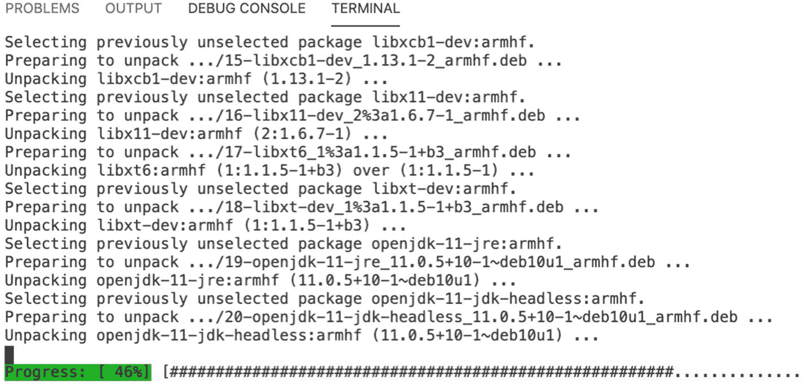

图 3-23

安装 Java

#### 安装 Java SDK 的替代方案

当前在运行 Buster（最新的 Raspbian 版本）的树莓派 4 上可选的 JDK 相当丰富。然而，有时，尤其是在较旧版本的 Raspbian 上，你可能会长时间困于过时的 JDK。

值得注意的是，像 Azul 和 Bellsoft 这样的公司已经发布了专门为 ARM CPU（树莓派上运行的处理器）编译的最新版本 JDK。

访问这两个网站以获取 JDK 软件包的直接链接：

```
https://bell-sw.com/pages/java-11.0.5%20for%20Embedded/
https://www.azul.com/downloads/zulu-community/
```

以下简短代码片段将从 Bellsoft 下载并安装 JDK 11：

```
sudo wget https://download.bell-sw.com/java/11.0.5+11/bellsoft-jdk11.0.5+11-linux-arm32-vfp-hflt.deb
sudo dpkg -i bellsoft-jdk11.0.5+11-linux-arm32-vfp-hflt.deb
```

可用的版本确实是 Java 11，如下面的输出所示：

```
pi@raspberrypi:~ $ java -version
openjdk version "11.0.5-BellSoft" 2019-10-15
OpenJDK Runtime Environment (build 11.0.5-BellSoft+11)
OpenJDK 32-Bit Server VM (build 11.0.5-BellSoft+11, mixed mode)
```

现在，Java 开发工具包已安装在你的树莓派上，让我们进入本章的核心内容：在 Java 和树莓派上运行 OpenCV 代码。

#### 检出 OpenCV/Java 模板

我们将从直接在树莓派上检出 OpenCV/Java 项目模板开始。有几种方法可以做到这一点；主要的三种如下：

- 直接对模板执行 Git 克隆
- 从 Git 项目模板下载 zip 文件
- 使用 Maven 生成模板项目

让我们逐一快速回顾这三种方法。

##### 执行 Git 克隆

直接从 Visual Studio Code 将代码检出到你的树莓派是可行且方便的。这通过命令面板并输入任何以 `git` 开头的内容来完成。

你将看到几个选项，其中之一是 Git: Clone，如图 3-24 所示。

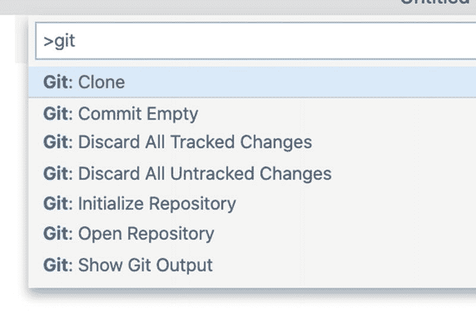

图 3-24

Visual Studio Code 中的 Git:Clone 选项

在此处，输入模板仓库的位置，如下所示，如图 3-25 所示：


图 3-25

输入模板 URL

```
https://github.com/hellonico/opencv-java-template.git
```

最后，在对话框中点击“打开”进行确认（图 3-26）。


图 3-26

当然，要打开克隆的仓库

现在项目已检出到树莓派上，可以执行了。

##### 下载 Zip 文件

或者，你可以从项目模板下载 zip 文件。如果你根本不想使用 Git，可以在终端中使用 `wget` 命令来完成此操作。

```
wget https://github.com/hellonico/opencv-java-template/archive/master.zip
unzip master.zip
```

图 3-27 显示了 Visual Code Studio 的终端标签页。

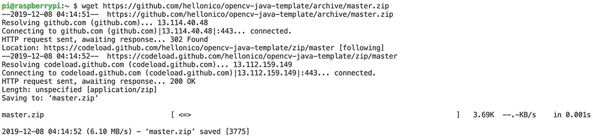

图 3-27

从树莓派下载 zip 文件

这样做的好处是不依赖 Git，但后果是在不同的树莓派之间共享更新比较困难。

##### 使用 Maven

设置项目的第三种方法与最初创建 Git 模板仓库所使用的技术相同：使用构建工具 Maven。在 Java 生态系统中，相当多的人对使用 Maven 的方式有些畏惧，但对于一组给定的任务来说，Maven 是一个相当可靠的选择。

Maven 一旦安装，就可以通过 Maven 原型为你创建一个包含所有必需文件的项目。

以下命令，一旦复制并粘贴到终端标签页，将为你生成项目结构，如下所示：

```
mvn org.apache.maven.plugins:maven-archetype-plugin:2.4:generate \
-DarchetypeArtifactId=maven-archetype \
-DarchetypeGroupId=origami \
-DarchetypeVersion=1.0 \
-DarchetypeCatalog=https://repository.hellonico.info/repository/hellonico/ \
-Dversion=1.0-SNAPSHOT \
-DgroupId=hello \
-DartifactId=opencv-java-template
```

命令的重要参数已在之前的代码片段中突出显示，并在此处进行说明：

- `archetypeVersion`：这是项目结构的版本，此处为 1.0。可能很快会有一些更新，但不要期望太多。最好创建你自己的版本。
- `version`：这是你项目的版本；通常以 `1.0-SNAPSHOT` 开头。
- `groupId`：这是你项目的 Maven 组，例如 `com.google` 等。
- `artifactId`：这是 `groupId` 内项目的名称。它必须是唯一的。

这里我们使用的是较旧版本的原型插件；使用此版本，更容易从 [`repository.hellonico.info`](http://repository.hellonico.info) 的自定义 Maven 仓库中检索工件。

较新版本的原型插件需要对 Maven 框架有更深入的了解，这超出了本书的范围。

无论你使用哪种技术，现在都可以打开远程文件夹。你应该会看到类似于图 3-28 中的树状结构。

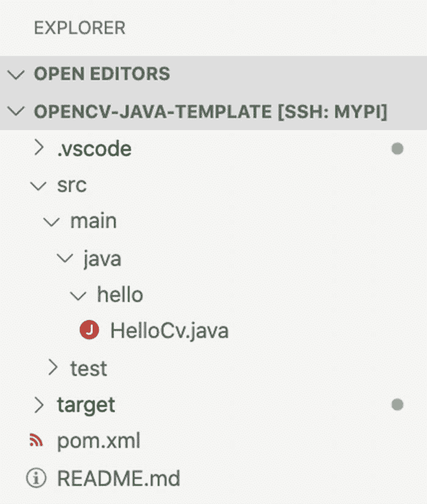

图 3-28

树莓派上的项目文件

再次强调，文件位于树莓派上，Java 代码将在树莓派上执行，但编辑器实际上是在你的本地计算机上运行。


#### 远程安装 Visual Code Java 扩展包

如果你还记得第 1 章的内容，我们曾安装插件让 Visual Studio Code 能够识别并运行 Java。这里我们将进行同样的操作，不过这次是在树莓派上。

图 3-29 展示了“市场”选项卡，你可以在其中搜索之前安装过的同一个插件，即 Java 扩展包。请注意图 3-30 中 Visual Studio Code 如何友好地询问你是否要在树莓派上安装该插件。

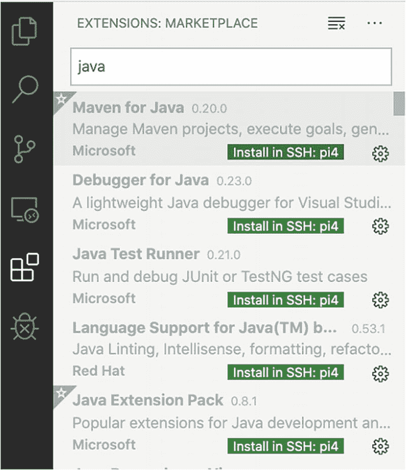

图 3-30

再次查找 Java 扩展包

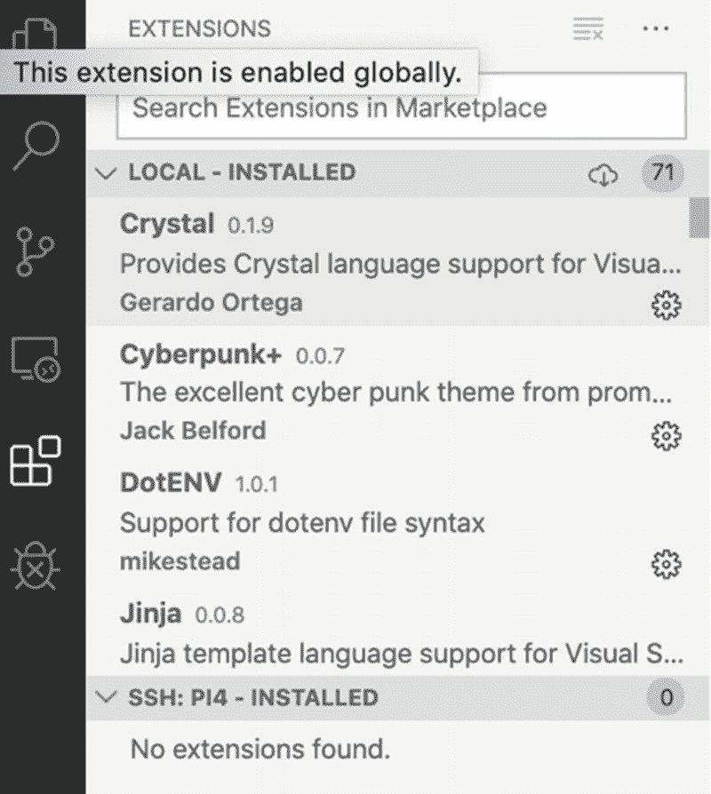

图 3-29

“SSH. PI4”尚未安装任何扩展

图 3-31 和图 3-32 展示了在树莓派上安装 Visual Code Java 插件的最后两个步骤。


图 3-32

需要再次重新加载编辑器


图 3-31

再次查找 Java 扩展包

现在，你的编辑器应该会直接显示熟悉的“运行”和“调试”链接，如图 3-33 所示。

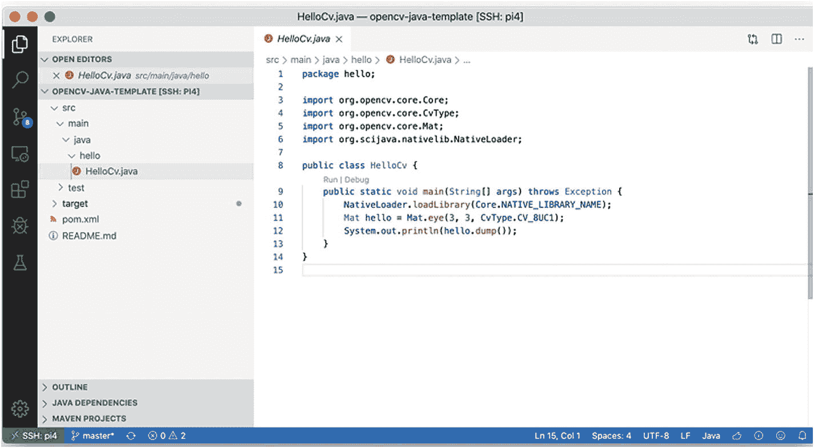

图 3-33

显示熟悉的“运行”和“调试”按钮

第一次执行所有这些步骤时可能会比较耗时，但现在你已经准备好迎接愉快的体验了。你已经完全配置好，可以在树莓派上运行 OpenCV/Java 程序了。

#### 运行第一个 OpenCV 示例

闲话少叙，让我们点击“运行”按钮来执行程序。

点击“运行”按钮会执行与第 1 章相同的程序，但这次程序是在树莓派上运行的。输出结果会显示熟悉的 3×3 矩阵，如图 3-34 所示。

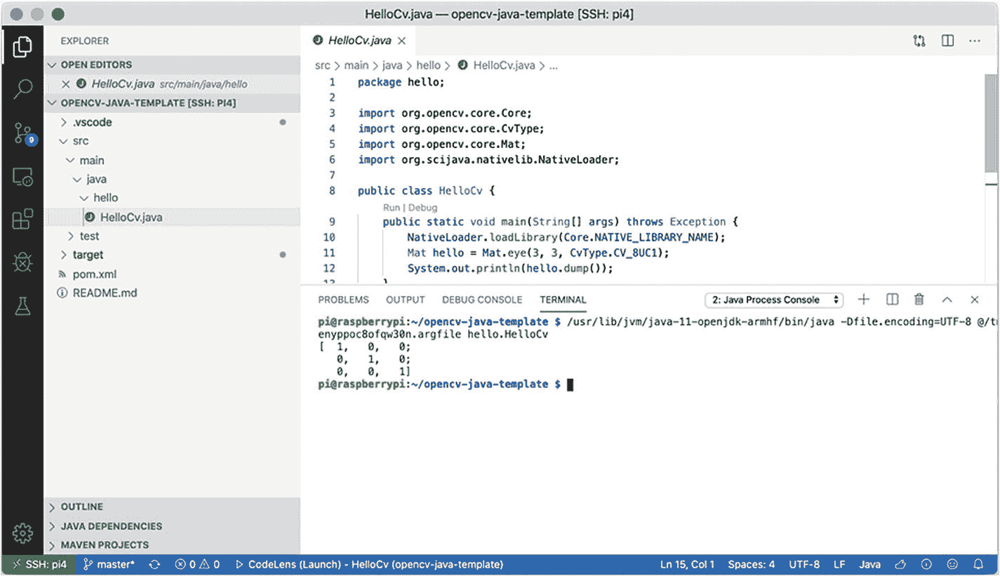

图 3-34

代码已在树莓派上执行

请注意，首次运行时后台会进行各种下载，因此命令会花费一些时间。第二次运行时，速度会快很多。

提醒一下，这里的调试方式与第 1 章相同。作为练习，尝试添加一个断点，在运行调试后暂停程序执行，然后为 `System.getProperty()` 添加一个监视表达式，以显示 `java.vm.vendor` 的值。由于我们现在是在树莓派上运行，该值应为 `Raspbian`，如图 3-35 所示。

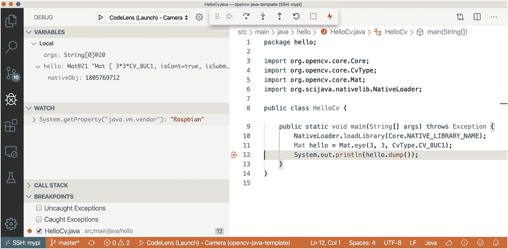

图 3-35

调试并显示 `java.vm.vendor`

## 改为在 Linux 或 AWS 虚拟机上运行

那么，如果你实际上不是在树莓派上运行，而是在远程 Linux 服务器或云虚拟机上运行呢？

到目前为止你所做的所有设置实际上都非常通用，因此只要你拥有 SSH 访问权限，就可以连接到任何运行 Linux 的标准机器。

例如，在图 3-36 中，你可以看到相同的设置连接到了一个远程 Linux 机器，并运行着我最喜欢的桌面发行版 Manjaro Linux。

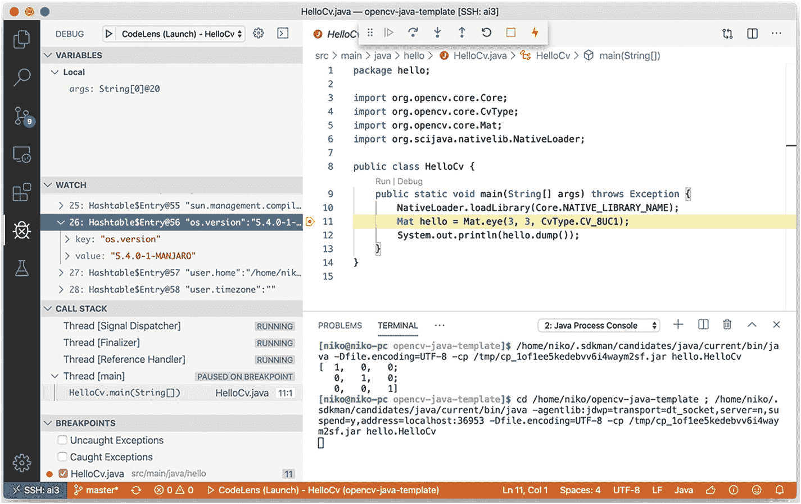

图 3-36

远程连接到正在运行的 Linux 机器

为了给你提供更多创意，我也使用相同的设置来连接 Amazon Web Services 上的远程机器。


## 捕获视频直播流

如果您的网络摄像头已通过 USB 端口正确连接，那么现在就可以编写代码，直接从您的物联网设备捕获视频流了。

我们使用两个基础组件来开始。

- OpenCV 的 `VideoCapture` Java 类，用于将硬件连接到软件（更准确地说，是从视频流连接到 OpenCV 的 `Mat` 对象）。在此示例中，`VideoCapture` 对象接受一个 `int` 值作为要使用的视频捕获设备的 ID。
- `ImShow` 类，它不属于 OpenCV Java 核心包。这是一个类似于 OpenCV 的 `HighGui` 类（[`https://docs.opencv.org/master/javadoc/org/opencv/highgui/HighGui.html`](https://docs.opencv.org/master/javadoc/org/opencv/highgui/HighGui.html)）的小型类，但它能更轻松地接入视频流并在屏幕上显示。

我们还使用一个名为 `Origami.init()` 的便捷方法来 `init` OpenCV，该方法会为我们搜索并加载正确的 OpenCV 二进制库。

清单 3-1 展示了这个首个流式示例的完整代码。

```
package hello;
import org.opencv.core.Mat;
import org.opencv.videoio.VideoCapture;
import origami.ImShow;
import origami.Origami;
public class Webcam {
public static void main(String[] args) {
Origami.init();
VideoCapture cap = new VideoCapture(0);
Mat matFrame = new Mat();
ImShow ims = new ImShow("Camera", 800, 600);
while (cap.grab()) {
cap.retrieve(matFrame);
ims.showImage(matFrame);
}
cap.release();
}
}
清单 3-1
访问并显示视频流
```

这段代码是非常标准的 OpenCV 代码。运行代码后，应该会得到如图 3-37 所示的画面（不显示帧率）。

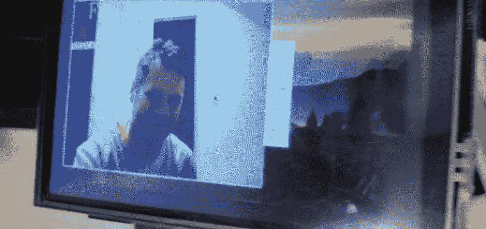

图 3-37

不带帧率的视频流

您会注意到速度非常接近实时。可以将清单 3-2 中的代码添加到帧循环中，以显示帧率，如图 3-38 所示。

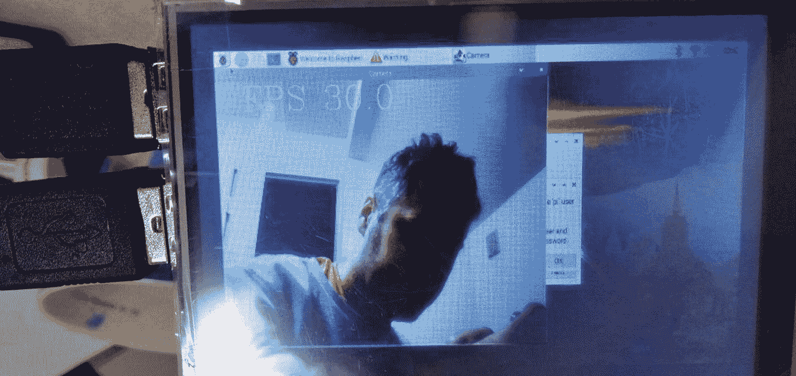

图 3-38

带帧率的视频流

```
long now = System.currentTimeMillis();
frame++;
Imgproc.putText(matFrame, "FPS " + (frame / (1 + (now - start) / 1000)), new Point(50, 50),
Imgproc.FONT_HERSHEY_COMPLEX, 2.0, new Scalar(255, 255, 255));
清单 3-2
在帧上添加每秒帧数
```

对于这个练习，通常期望的帧率在每秒 15 到 20 帧之间。

在运行前面的示例时，您可能遇到了问题。有时程序会崩溃，并显示清单 3-3 中的堆栈跟踪信息。

```
Exception in thread "main" java.awt.HeadlessException:
No X11 DISPLAY variable was set, but this program performed an operation which requires it.
at java.desktop/java.awt.GraphicsEnvironment.checkHeadless(GraphicsEnvironment.java:208)
at java.desktop/java.awt.Window.(Window.java:548)
at java.desktop/java.awt.Frame.(Frame.java:423)
at java.desktop/java.awt.Frame.(Frame.java:388)
at java.desktop/javax.swing.JFrame.(JFrame.java:180)
at origami.ImShow.(ImShow.java:52)
at hello.Webcam.main(Webcam.java:22)
清单 3-3
未设置 X11 DISPLAY
```

要通过 SSH 运行图形程序（就像您现在正在做的那样），Java 需要设置一个系统环境变量。正如您所见，这个变量的名称是 `DISPLAY`。您可以在终端标签页中使用以下命令检查其值：

```
echo $DISPLAY
```

根据此变量的值，您可能处于三种主要状态，如下所示：

- `<empty>`，这不太好。您需要自己设置该值。
- `:0` 或 `localhost:0`，这意味着任何视觉帧都将显示在树莓派的屏幕上。这对于调试设置是可以的，但通常不是您在电脑上工作时想要的状态。
- `:10` 或 `localhost:10`，这意味着帧将显示在您的电脑上。在 macOS 上，这是通过 XQuartz 应用程序完成的，它运行一个与树莓派兼容的图形环境。在 Windows 上，等效的软件是 Xming：[`https://sourceforge.net/projects/xming/`](https://sourceforge.net/projects/xming/)。

如果您正确设置了该变量，那么流将显示在您的电脑屏幕上，如图 3-39 所示。

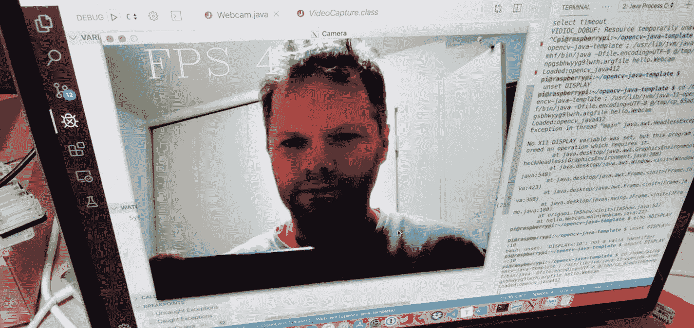

图 3-39

远程树莓派流直接传输到您的电脑

您已经了解了设置树莓派进行远程开发的所有知识。接下来，让我们看一些分析视频流内容的技巧。

### 播放视频

您可能并不总能访问视频流，有时需要回放录制的视频。使用 `VideoCapture` 类也可以实现这一点。您可以向其提供要播放的视频文件的路径，如下所示：

```
public class PlayVideo {
public static void main(String[] args) {
Origami.init();
VideoCapture cap = new VideoCapture("marcel_1.mp4");
Mat matFrame = new Mat();
ImShow ims = new ImShow("Camera", 400, 300);
long start = System.currentTimeMillis();
long frame = 0;
while (cap.grab()) {
cap.retrieve(matFrame);
long now = System.currentTimeMillis();
frame++;
Imgproc.putText(matFrame, "FPS " + (frame / (1 + (now - start) / 1000)), new Point(50, 50),
Imgproc.FONT_HERSHEY_COMPLEX, 2.0, new Scalar(255, 255, 255));
ims.showImage(matFrame);
}
cap.release();
}
}
```

这段代码与播放来自网络摄像头的流相同，只是文件名作为参数传递给 `VideoCapture` 构造函数。

请注意，您还可以在以下网站上找到一些免费的示例视频：

```
https://sample-videos.com/index.php
```

图 3-40 展示了 Marcel 早晨的一些活动。

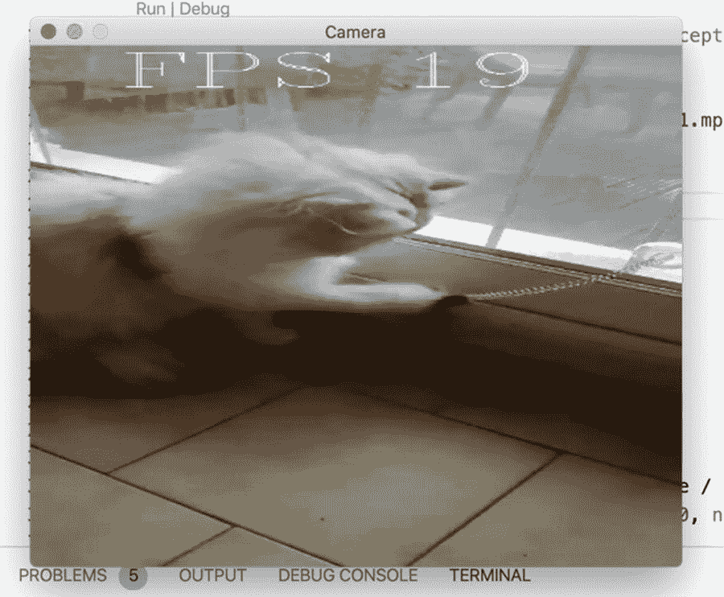

图 3-40

早晨的 Marcel

如果您尝试输入一个 `http://` URL 作为 `VideoCapture` 的路径，您会发现事情并不像预期的那样工作。您想要播放的远程视频将无法加载。

路径中的 URL 用于播放来自网络摄像头的流，而不是静态文件。如果您手头有网络摄像头，那么将网络摄像头的 Web URL 直接插入 `VideoCapture` 对象是一个很好的练习。

## 在树莓派上分析视频流

在本章中，您将学习如何使用函数式编程的概念来分析视频流。具体来说，您将使用 `Filter` 接口，并将其与 `Pipeline` 对象结合，然后将它们应用于视频流。

我们将从过滤器的概述开始。然后，我们将研究不同的基本、有趣的过滤器，并逐步过渡到使用不同视觉技术的对象检测。最后，我们将讨论神经网络。


## 应用滤镜概述

在 Clojure 语言中，你可以直接将一组变换应用于视频流的 `Mat` 对象，而无需使用任何额外的样板代码。我强烈建议你即使只看一下 origami 示例中最基础的部分，这些示例可在 README 中找到：

```
https://github.com/hellonico/origami/blob/master/README.md#support-for-opencv-412-is-in
```

清单 4-1 展示了如何在一个管道中加载图片、将其转换为灰度图并应用 `canny` 函数。这甚至可能让你想尝试 OpenCV 的 Clojure 版本。

```
(require
'[opencv4.utils :as u]
'[opencv4.core :refer :all])
(->
(imread "doc/cat_in_bowl.jpeg")
(cvt-color! COLOR_RGB2GRAY)
(canny! 300.0 100.0 3 true)
(bitwise-not!)
(u/resize-by 0.5)
(imwrite "doc/canny-cat.jpg"))
清单 4-1
读取、转灰度、Canny 边缘检测、调整大小并保存
```

不过，这是一本关于 Java 的书，所以让我们看看如何在 Java 中应用相同的概念。

这里我们引入了滤镜管道的概念，其中每个滤镜对 `Mat` 对象执行一项操作。

以下是滤镜可以执行的一些操作示例：

- 将 `Mat` 对象转换为灰度图
- 应用 Canny 效果
- 寻找边缘
- 铅笔素描
- Instagram 滤镜，如棕褐色或复古风格
- 进行背景减除
- 使用 Haar 目标检测或颜色检测来检测猫或人脸
- 运行神经网络并识别物体

以下是我们将引入的两种 Java 类型，用于实现这些概念：

- `Filter` 接口，仅包含一个函数 `apply(Mat in)`，并返回一个 `Mat` 对象，就像函数式编程中一样。
- `Pipeline` 类，它本身也是一个 `Filter`，接受一个类列表或已实例化的滤镜列表。当调用 `apply` 时，它会逐个应用这些类。

清单 4-2 展示了（简单的）`Filter` 接口。

```
import org.opencv.core.Mat;
public interface Filter {
public Mat apply(Mat in);
}
清单 4-2
Filter 接口
```

清单 4-3 展示了实现 `Pipeline` 类的示例，你只需通过逐个调用不同的滤镜来组合它们。

```
import java.util.Arrays;
import java.util.List;
import java.util.stream.Collectors;
import org.opencv.core.Mat;
public class Pipeline implements Filter {
List filters;
public Pipeline(Class... __filters) {
List> _filters = (List) Arrays.asList(__filters);
this.filters = _filters.stream().map(i -> {
try {
return (Filter) Class.forName(i.getName()).newInstance();
} catch (Exception e) {
return null;
}
}).collect(Collectors.toList());
}
public Pipeline(Filter... __filters) {
this.filters = (List) Arrays.asList(__filters);
}
@Override
public Mat apply(Mat in) {
Mat dst = in.clone();
for (Filter f : filters) {
dst = f.apply(dst);
}
return dst;
}
}
清单 4-3
多个滤镜
```

请注意，这里直接在类中使用了已弃用版本的 `newInstance` 函数。这可能不会调用你真正想要的构造函数，但对于本书中的示例来说，它已经足够好了。

当然，到目前为止，`Filter` 和 `Pipeline` 还没有做太多事情，所以让我们在接下来的部分中回顾一些基本示例。

### 应用基础滤镜

在本节中，我们将介绍几个基础滤镜的示例。

#### 灰度滤镜

滤镜最明显的用途是将 `Mat` 对象从彩色转换为灰度。在 OpenCV 中，这是通过使用 `Imgproc` 类中的 `cvtColor` 函数完成的。

省略包定义，我们将几页前的网络摄像头代码与标准的 `cvtColor` 包装器结合在一个类中，该类实现了前面介绍的 `Filter` 接口（清单 4-4）。

```
import org.opencv.core.Mat;
import org.opencv.imgproc.Imgproc;
import org.opencv.videoio.VideoCapture;
import origami.ImShow;
import origami.Origami;
清单 4-4
流上的灰度滤镜
```

```
public class WebcamWithFilters {
public static void main(final String[] args) {
Origami.init();
final VideoCapture cap = new VideoCapture(0);
final ImShow ims = new ImShow("Camera", 800, 600);
final Mat buffer = new Mat();
Filter gray = new Gray();
while (cap.read(buffer)) {
ims.showImage(gray.apply(buffer));
}
cap.release();
}
}
class Gray implements Filter {
public Mat apply(final Mat img) {
final Mat mat1 = new Mat();
Imgproc.cvtColor(img, mat1, Imgproc.COLOR_RGB2GRAY);
return mat1;
}
}
```

你可以直接在树莓派上运行此代码，如果你站在网络摄像头前，你会得到类似图 4-1 中我得到的结果。

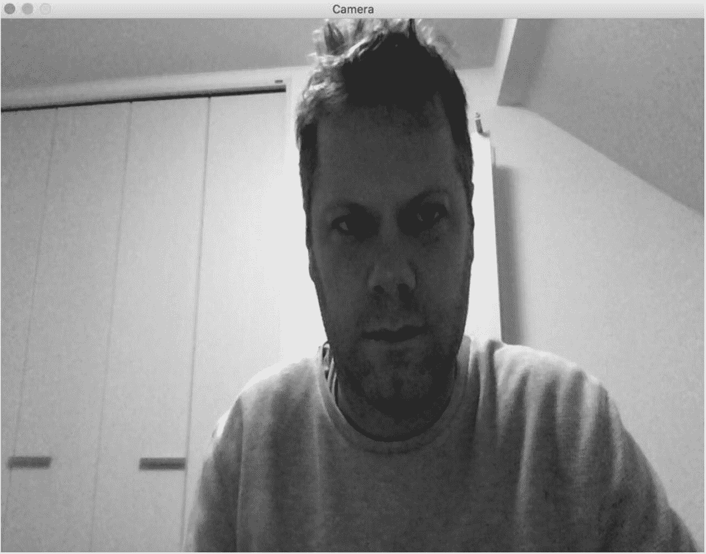

图 4-1

不仅我的头发，整张图片都变成了灰色

#### 边缘保留滤镜

以同样的方式，我们可以为 OpenCV 的 `Photo` 类中的 `EdgePreserving` 函数实现一个包装器。这在许多不同的应用中用于平滑和去除图片中不需要的线条。例如，清单 4-5 实际上只是对 `edgePreservingFilter` 函数的一个基本调用。

```
import org.opencv.photo.Photo;
class EdgePreserving implements Filter {
public int flags = Photo.RECURS_FILTER;
// int flags = NORMCONV_FILTER;
public float sigma_s = 60;
public float sigma_r = 0.4f;
public Mat apply(Mat in) {
Mat dst = new Mat();
Photo.edgePreservingFilter(in, dst, flags, sigma_s, sigma_r);
return dst;
}
}
清单 4-5
重新实现为 Filter 的 EdgePreservering 类
```

你可以通过修改 `WebcamWithFilters` 的 main 方法来使用这个新滤镜，如清单 4-6 所示。

```
Filter filter = new EdgePreserving();
while (cap.read(buffer)) {
ims.showImage(filter.apply(buffer));
}
清单 4-6
修改后的主函数以使用边缘保留滤镜
```

现在让我们继续执行新代码。同样，如果你正对着网络摄像头，你应该会得到类似于图 4-2 中我的样子。

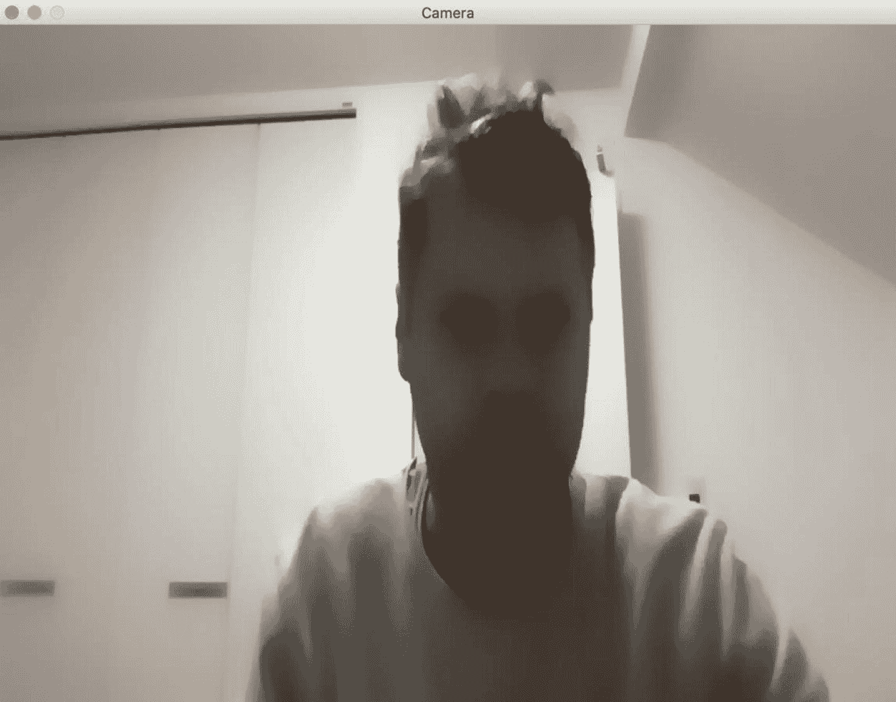

图 4-2

边缘保留滤镜

#### Canny 边缘检测

OpenCV 世界中另一个有用的滤镜是应用 Canny 效果，这是一种快速有效的方法，用于在 `Mat` 对象中查找轮廓和形状。将 `Canny` 作为滤镜的快速实现如清单 4-7 所示。

```
class Canny implements Filter {
public boolean inverted = true;
public int threshold1 = 100;
public int threshold2 = 200;
@Override
public Mat apply(Mat in) {
Mat dst = new Mat();
Imgproc.Canny(in, dst, threshold1, threshold2);
if (inverted) {
Core.bitwise_not(dst, dst, new Mat());
}
Imgproc.cvtColor(dst, dst, Imgproc.COLOR_GRAY2RGB);
return dst;
}
}
清单 4-7
Filter 中的 OpenCV Canny 边缘检测
```

图 4-3 显示了将 Canny 滤镜应用于主循环的结果。

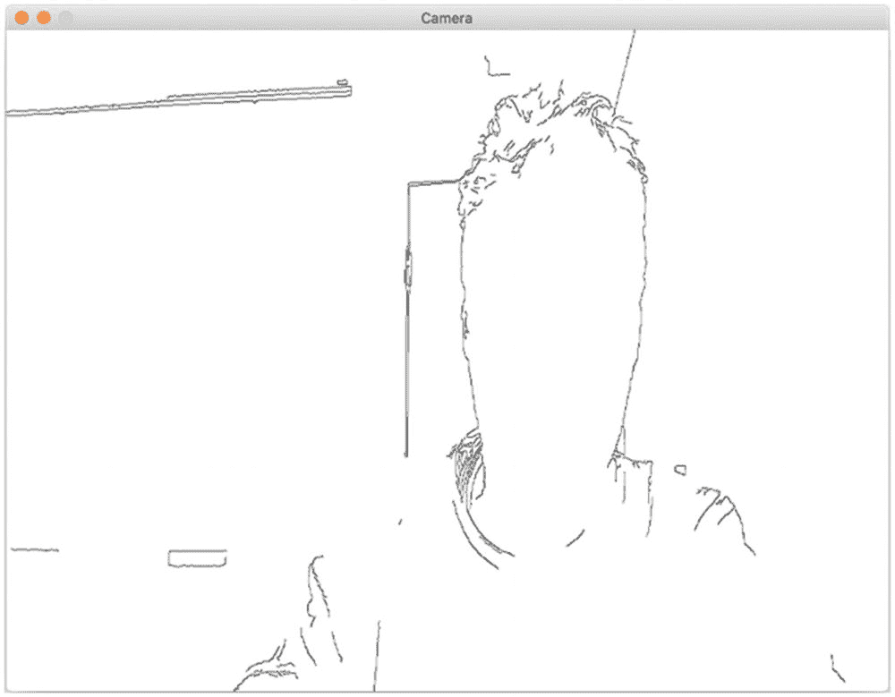

图 4-3

网络摄像头流上的 Canny 滤镜


#### 调试（再谈）

我们再次来谈谈调试的注意事项。如果在 `WebcamWithFilters` 的主捕获循环中添加断点，你将能够访问过滤器的所有不同字段。如图 4-4 所示，让我们将反转布尔值改为 `false`。

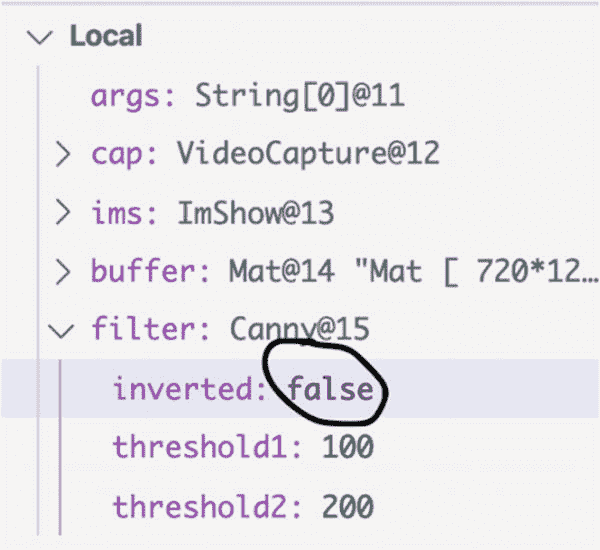

图 4-4：实时更新过滤器参数

然后，让我们移除断点并正常重新启动代码执行。图 4-5 展示了直接更改过滤器值如何立即改变正在运行的代码以及屏幕上显示的 `Mat` 对象的颜色。

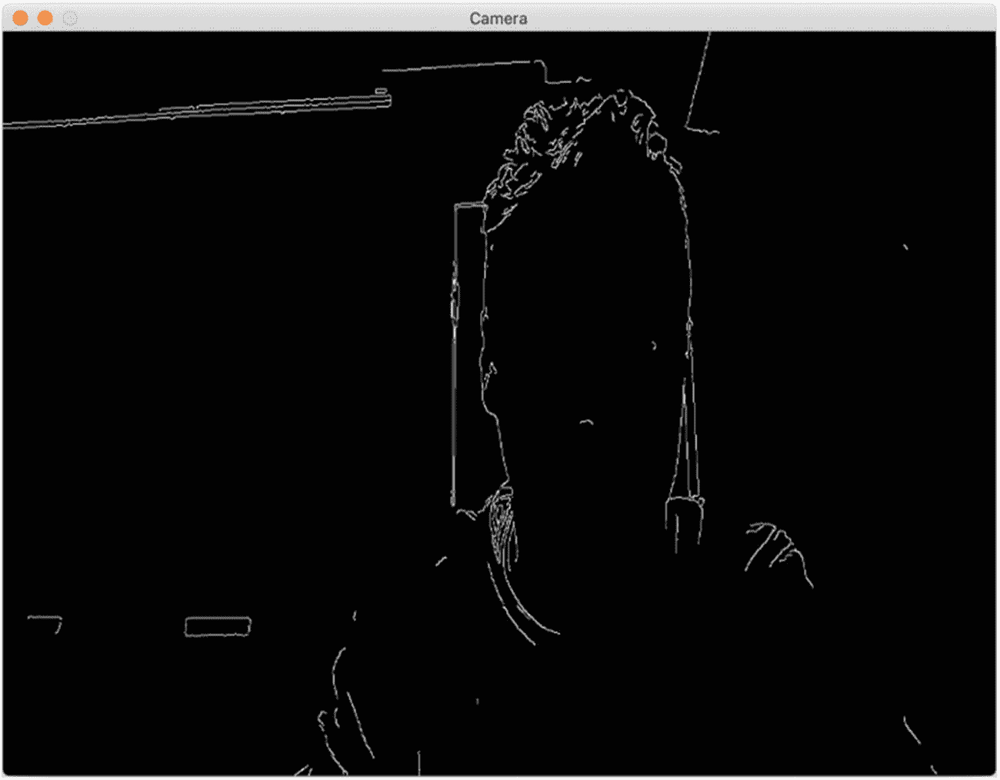

图 4-5：非反转的 Canny 过滤器

在实现你自己的过滤器时，最好将最有影响力的变量作为类的字段保留，这样你就不会被大量数值淹没，但仍能访问到重要的变量。

#### 组合过滤器

你可能在前面的章节中已经意识到，你会想要了解每个过滤器的性能。

性能实际上取决于从视频文件或直接从摄像头设备读取时，每秒能处理的帧数。

接下来我们将执行以下操作：

- 直接在图像上显示帧率
- 使用本章前面定义的 `Pipeline` 类，将灰度过滤器与帧率过滤器组合起来

我们已经有了灰度过滤器的代码，因此我们将直接进入显示每秒帧数（FPS）的代码。

我一直以为可以通过 OpenCV 的 `VideoCapture` 属性集来访问帧率值。不幸的是，我们几乎总是只能使用一个硬编码的值，而不是屏幕上实际显示的值。

因此，清单 4-8 中的 FPS 实现是一个小的变通方法，它基于自过滤器生命周期开始以来已显示的帧数进行简单的算术运算。

最后，它使用 `putText` 将文本直接应用到帧上。对于简单的用例来说，这已经足够好了。

```
class FPS implements Filter {
long start = System.currentTimeMillis();
int count = 0;
Point org = new Point(50, 50);
int fontFace = Imgproc.FONT_HERSHEY_PLAIN;
double fontScale = 4.0;
Scalar color = new Scalar(0, 0, 0);
int thickness = 3;
public Mat apply(Mat in) {
count++;
String text = "FPS: " + count / (1 + ((System.currentTimeMillis() - start) / 1000));
Imgproc.putText(in, text, org, fontFace, fontScale, color, thickness);
return in;
}
}
```

清单 4-8：FPS 过滤器

现在让我们回到将流上显示的 FPS 与灰度过滤器组合起来的问题。

你会很高兴地知道，在 `WebcamWithFilters` 的 `main()` 函数中，唯一需要更新的行是实例化过滤器的那一行，如下所示：

```
Filter filter = new Pipeline(Gray.class, FPS.class);
```

当你再次从树莓派上运行示例时，你将得到类似于图 4-6 所示的结果。将两个过滤器一起应用，我在树莓派上通常能得到大约每秒 15 帧。

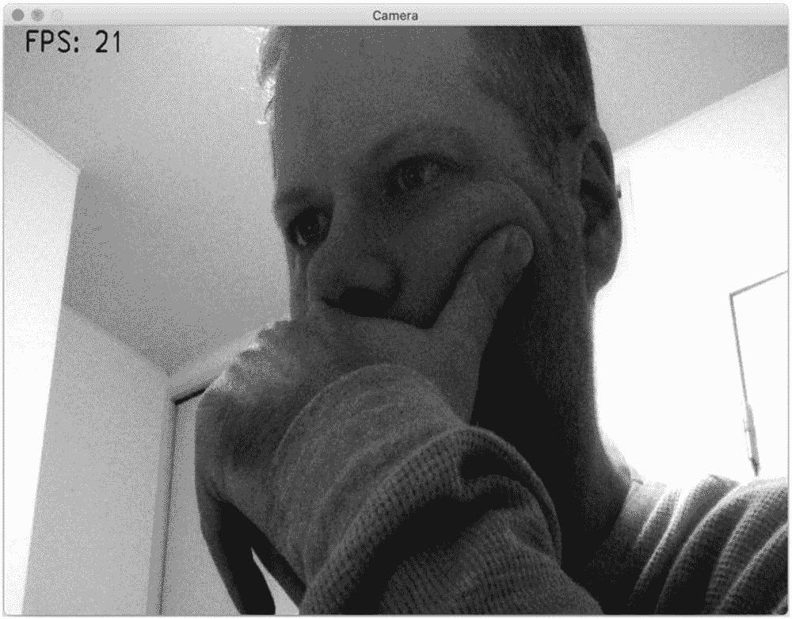

图 4-6：灰度过滤器与 FPS 的组合

### 应用类似 Instagram 的滤镜

严肃的工作到此为止。让我们稍作休息，用一些类似 Instagram 的滤镜来玩一玩。

#### 颜色映射

让我们从使用 `ImgProc` 中的 OpenCV `colormap` 函数开始这个有趣的章节。我们将 `colormap` 的参数移到构造函数中，如清单 4-9 所示，这样我们就可以通过调试屏幕来更新它。

```
class Color implements Filter {
int colormap = 0;
public Color(int colormap) {
this.colormap = colormap;
}
public Color() {
this.colormap = Imgproc.COLORMAP_INFERNO;
}
public Mat apply(Mat img) {
Mat threshed = new Mat();
Imgproc.applyColorMap(img, threshed, colormap);
return threshed;
}
}
```

清单 4-9：颜色映射

要实例化过滤器，我们需要传入想要使用的颜色映射，因此这直接在构造函数中完成。这里我们需要的是实例化后的过滤器，而不仅仅是它的类，因此我们使用 `Pipeline` 类的第二个构造函数，将实例化后的 `Filter` 对象传递给构造函数。

```
Filter filter = new Pipeline(new Color(Imgproc.COLORMAP_INFERNO), new FPS());
```

当你执行此代码时，你会得到类似于图 4-7 的结果。

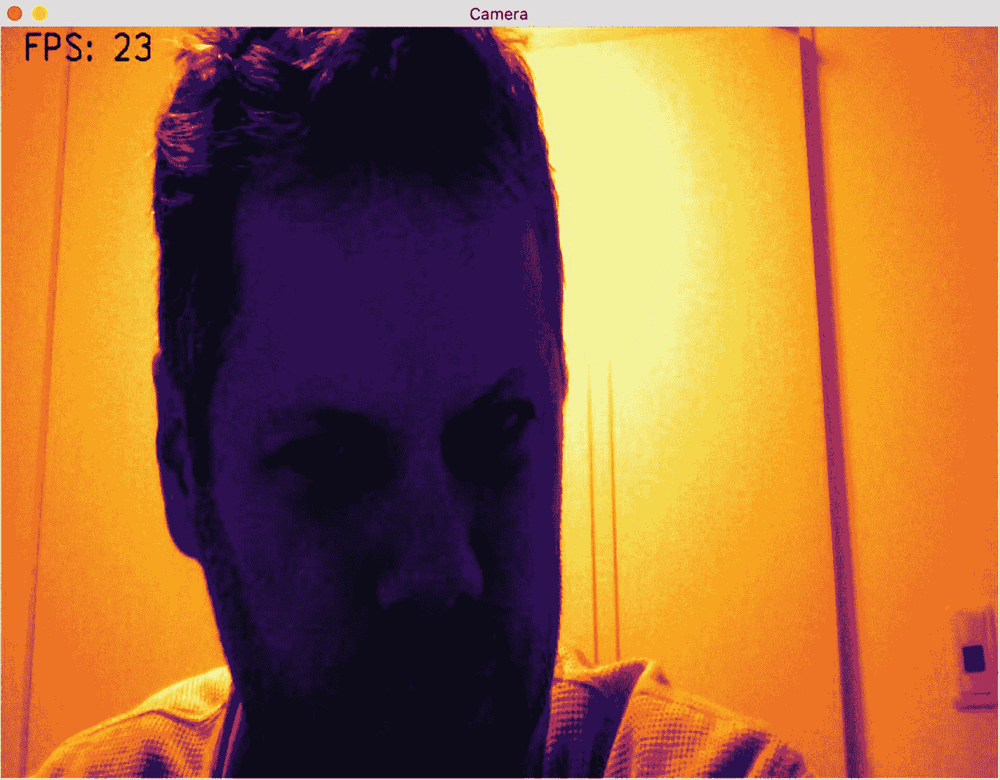

图 4-7：地狱火

#### 阈值

阈值是另一个有趣的滤镜，通过应用 `Imgproc` 的 `threshold` 函数实现。它对 `Mat` 对象的每个数组元素应用一个固定级别的阈值。

阈值滤镜最初的目的是分割图片中的元素，例如通过移除不需要的元素来去除图片的噪点。它通常不用于 Instagram 滤镜，但效果看起来不错，并且可以给你带来一些创意灵感。

清单 4-10 展示了如何实现阈值滤镜。

```
class Thresh implements Filter{
int sensitivity = 100;
int maxVal = 255;
public Thresh() {
}
public Thresh(int _sensitivity) {
this.sensitivity = _sensitivity;
}
public Mat apply(Mat img) {
Mat threshed = new Mat();
Imgproc.threshold(img, threshed, sensitivity, maxVal, Imgproc.THRESH_BINARY);
return threshed;
}
}
```

清单 4-10：应用阈值

图 4-8 显示了结果。

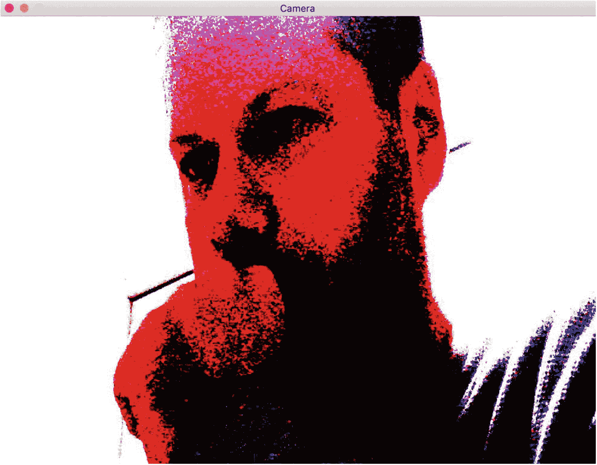

图 4-8：应用阈值产生燃烧效果

#### 棕褐色

让我们再次使用古老的（双关语）棕褐色效果，如清单 4-11 所示。

```
class Sepia implements Filter {
public Mat apply(Mat source) {
Mat kernel = new Mat(3, 3, CvType.CV_32F);
kernel.put(0, 0,
0.272, 0.534, 0.131,
0.349, 0.686, 0.168,
0.393, 0.769, 0.189);
Mat destination = new Mat();
Core.transform(source, destination, kernel);
return destination;
}
}
```

清单 4-11：棕褐色

当与视频流一起使用时，棕褐色效果会给你带来如图 4-9 所示的输出。

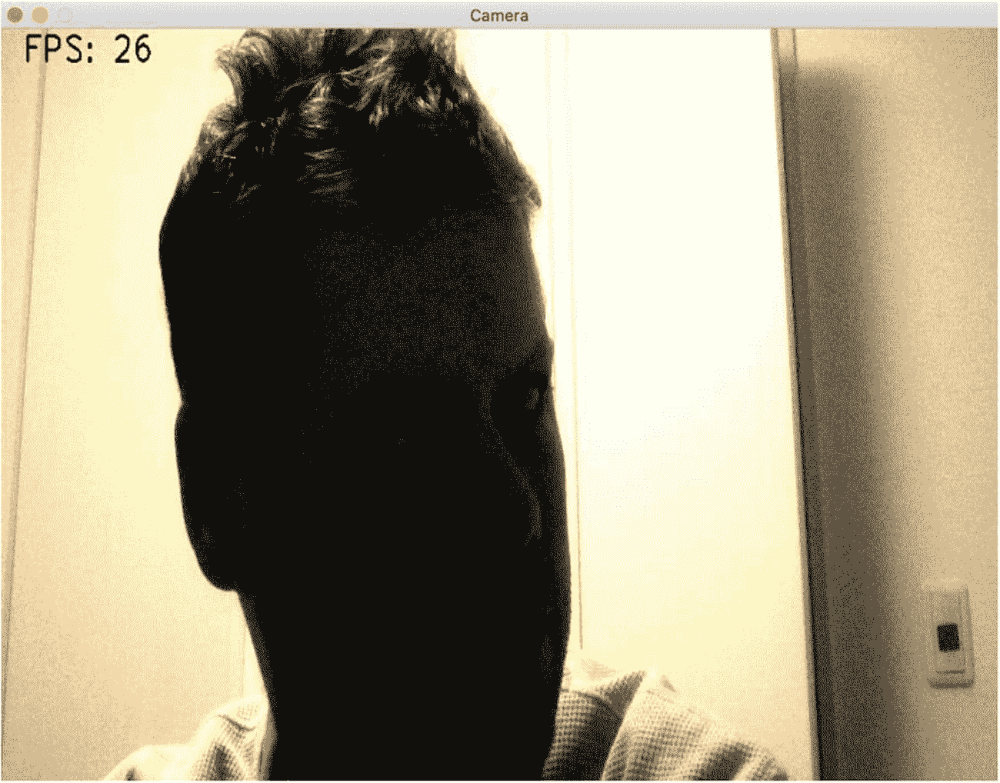

图 4-9：棕褐色效果


#### 卡通效果

这种卡通效果的简单实现会提取原始图像中定义特征的重要线条，在应用平滑和模糊效果后，对每个像素值进行阈值处理。然后将这些操作的结果进行组合，如代码清单 4-12 所示。

```
class Cartoon implements Filter {
public int d = 17;
public int sigmaColor = d;
public int sigmaSpace = 7;
public int ksize = 7;
public double maxValue = 255;
public int blockSize = 19;
public int C = 2;
public Mat apply(Mat inputFrame) {
Mat gray = new Mat();
Mat co = new Mat();
Mat m = new Mat();
Mat mOutputFrame = new Mat();
Imgproc.cvtColor(inputFrame, gray, Imgproc.COLOR_BGR2GRAY);
Imgproc.bilateralFilter(gray, co, d, sigmaColor, sigmaSpace);
Mat blurred = new Mat();
Imgproc.blur(co, blurred, new Size(ksize, ksize));
Imgproc.adaptiveThreshold(blurred, blurred, maxValue, Imgproc.ADAPTIVE_THRESH_MEAN_C, Imgproc.THRESH_BINARY,
blockSize, C);
Imgproc.cvtColor(blurred, m, Imgproc.COLOR_GRAY2BGR);
Core.bitwise_and(inputFrame, m, mOutputFrame);
return mOutputFrame;
}
}
代码清单 4-12
卡通滤镜
```

将卡通滤镜应用于视频流，会得到如图 4-10 所示的效果。

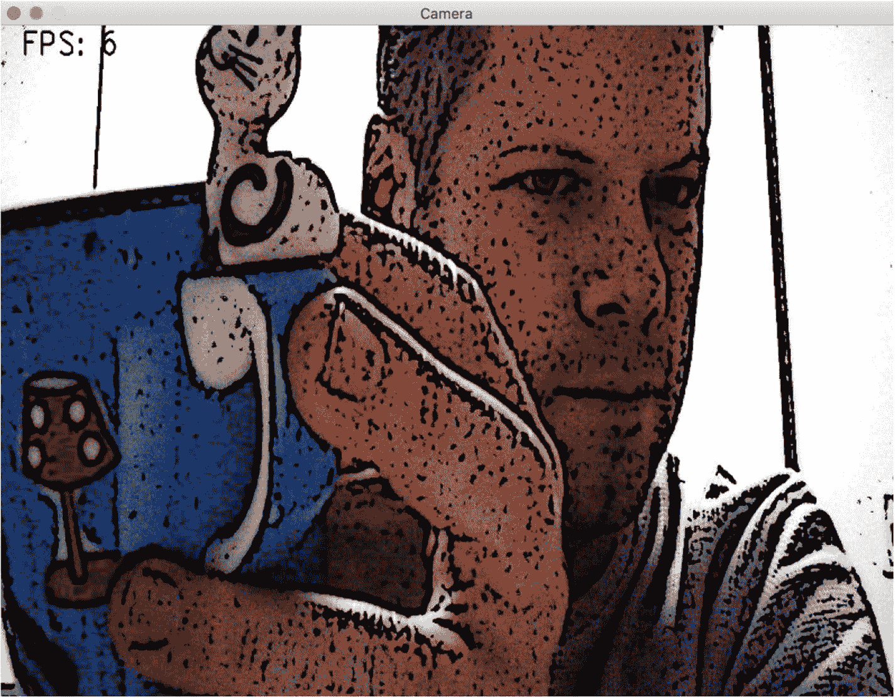

图 4-10

卡通效果

#### 铅笔效果

我非常喜欢铅笔效果，它是通过调用 OpenCV 核心 `Photo` 类中的 `pencilSketch` 方法实现的。不幸的是，在树莓派上实时应用这个效果速度太慢了。不过，它几乎不需要任何实现工作就能产生相当漂亮的效果。请参见代码清单 4-13。

```
class PencilSketch implements Filter {
float sigma_s = 60;
float sigma_r = 0.07f;
float shade_factor = 0.05f;
boolean gray = false;
@Override
public Mat apply(Mat in) {
Mat dst = new Mat();
Mat dst2 = new Mat();
pencilSketch(in, dst, dst2, sigma_s, sigma_r, shade_factor);
return gray ? dst : dst2;
}
}
代码清单 4-13
铅笔效果
```

应用此效果后，会得到如图 4-11 所示的结果。

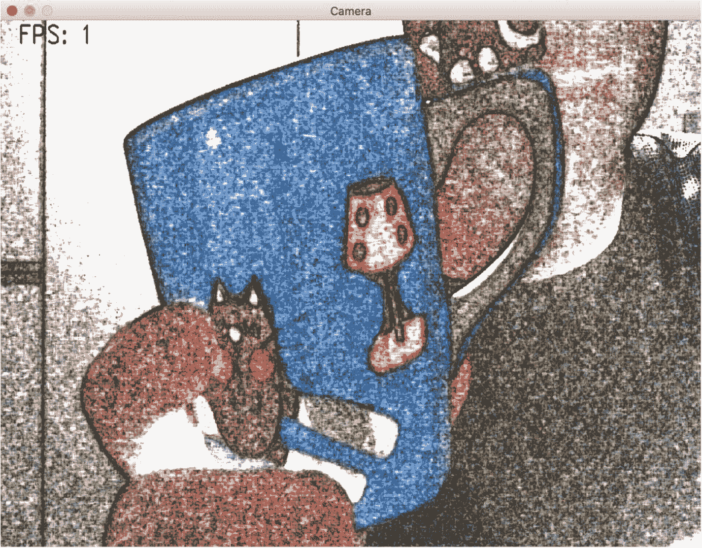

图 4-11

铅笔素描

哇哦。我们已经有了不少可以随时使用和娱乐的效果。在 origami 仓库中还有其他一些效果可用，当然你也可以贡献自己的效果，但现在，让我们继续学习更严肃的目标检测。

### 执行目标检测

*目标检测* 是指使用不同的编程算法在图片中查找物体的概念。这是一项长期以来由人类完成的任务，对于没有大脑的计算机来说相当困难。但随着技术的进步，这种情况最近已经发生了变化。

在本章的这部分内容中，我们将回顾不同的计算机视觉技术，以识别图像中的物体，而无需任何关于其内容的先验信息。具体来说，我们将回顾以下内容：

*   使用简单的轮廓绘制滤镜
*   通过颜色检测物体
*   使用 Haar 分类器
*   使用模板匹配
*   使用像 Yolo 这样的神经网络

这些示例的难度大致是递增的，因此最好按照列表顺序尝试。

#### 移除背景

移除背景是一种可以用来移除场景中不必要杂物的技术。你试图寻找的物体可能不是静止的，并且很可能在一组图片或视频流中移动。为了有效地移除杂物，算法需要能够区分两个 `Mat` 对象，并使用某种短期记忆来区分移动的物体（前景）和背景中的标准场景物体。

在 OpenCV 中，有两个易于使用的 `BackgroundSubtractor` 类可供使用。它们的介绍和完整解释可以在以下网站上找到：

```
https://docs.opencv.org/master/d1/dc5/tutorial_background_subtraction.html
```

基本上，你向背景减法器提供越来越多的帧，它就能检测出哪些是前景中移动的物体，哪些不是。

代码清单 4-14 非常容易理解；只需注意不要将 `subtractor` 类中的 `apply` 函数与我们 `Filter` 接口中的 `apply` 函数混淆。

```
class BackgroundSubtractor implements Filter {
boolean useMOG2 = true;
BackgroundSubtractor backSub;
double learningRate = 1.0;
boolean showMask = true;
public BackgroundSubtractor() {
if (useMOG2) {
backSub = Video.createBackgroundSubtractorMOG2();
} else {
backSub = Video.createBackgroundSubtractorKNN();
}
}
@Override
public Mat apply(Mat in) {
Mat mask = new Mat();
backSub.apply(in, mask);
Mat result = new Mat();
if (showMask) {
Imgproc.cvtColor(mask, result, Imgproc.COLOR_GRAY2RGB);
return result;
} else {
in.copyTo(result, mask);
return result;
}
}
}
代码清单 4-14
BackgroundSubtractor 类
```

通过调用构造函数加载滤镜，你应该会得到类似于图 4-12 的结果。

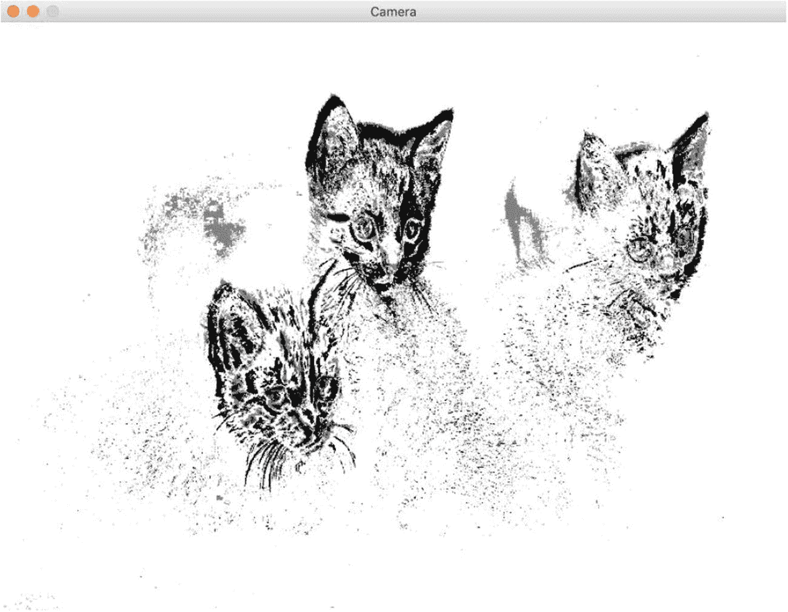

图 4-12

移除背景

使用 KNN 背景减法器

一旦这个滤镜运行起来，尝试切换到基于 KNN 的 `BackgroundSubtractor`，看看速度（观察帧率）和结果准确性的差异。

#### 通过轮廓检测

OpenCV 第二个最基本的功能是能够在图像中找到轮廓。轮廓滤镜使用了 `Imgproc` 类中的 `findContours` 函数。

`findContours` 通常在你先执行以下步骤时效果更好：

*   将输入的 `Mat` 对象转换为灰度图
*   应用 Canny 滤镜

这两个步骤已添加到代码清单 4-15 中；然后我们在一个使用 `zeros` 函数创建的黑色 `Mat` 对象上绘制轮廓。

```
class Contours implements Filter {
private int threshold = 100;
public Mat apply(Mat srcImage) {
Mat cannyOutput = new Mat();
Mat srcGray = new Mat();
Imgproc.cvtColor(srcImage, srcGray, Imgproc.COLOR_BGR2GRAY);
Imgproc.Canny(srcGray, cannyOutput, threshold, threshold * 2);
List contours = new ArrayList();
Mat hierarchy = new Mat();
Imgproc.findContours(cannyOutput, contours, hierarchy, Imgproc.RETR_TREE, Imgproc.CHAIN_APPROX_SIMPLE);
Mat drawing = Mat.zeros(cannyOutput.size(), CvType.CV_8UC3);
for (int i = 0; i < contours.size(); i++) {
Scalar color = new Scalar(256, 150, 0);
Imgproc.drawContours(drawing, contours, i, color, 2, 8, hierarchy, 0, new Point());
}
return drawing;
}
}
代码清单 4-15
检测轮廓
```

为轮廓使用管道

细心的读者会注意到，由于前面的代码使用了 `Pipeline` 类，实际上写成下面这样会更优雅：

```
Pipeline(new Canny(), new Gray(), new Contours())
```

其中 `Contours` 滤镜只负责提取轮廓。试试看！

将轮廓滤镜应用于 Marcel 的视频会得到一种艺术效果（图 4-13）。

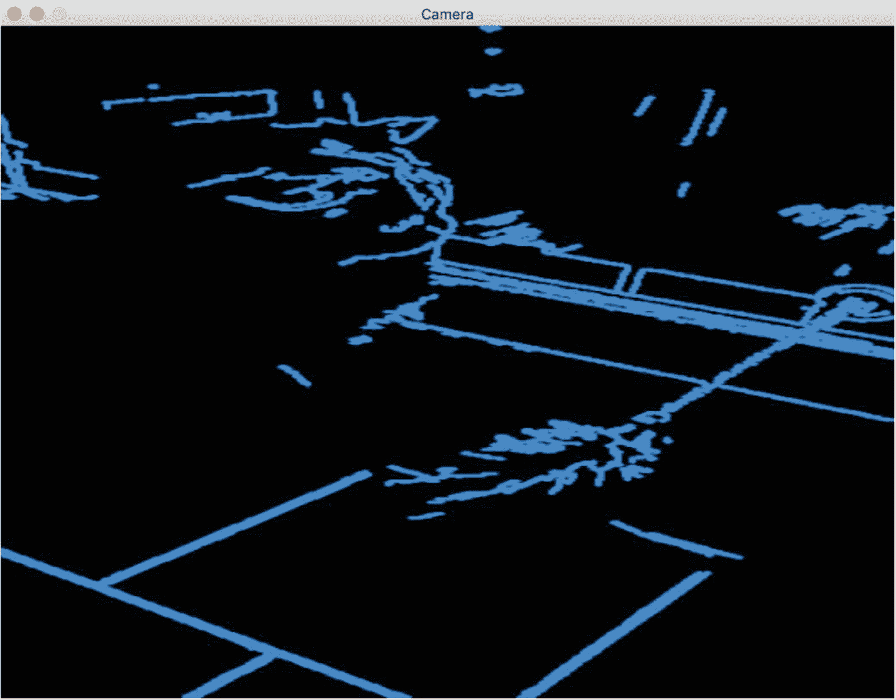

图 4-13

使用 OpenCV 的轮廓检测功能

移除第一个 Canny 滤镜并比较

这里有一个练习给你：尝试移除转换为灰度图和应用 Canny 滤镜这两个步骤，然后将结果与原始结果进行比较。


#### 通过颜色检测

在 OpenCV 中，一张图片或一个 `Mat` 对象通常采用红/绿/蓝（RGB）色彩空间（实际上在 OpenCV 中准确来说是蓝/绿/红）。如果你理解为每个像素的每个通道都被赋予了一个值，这就很容易理解了。要查看这些通道的可能值，你可以查阅以下网站：

```
https://www.rapidtables.com/web/color/RGB_Color.html
```

这种色彩空间的问题在于，亮度和对比度的信息与颜色本身的信息混杂在一起。

当在 `Mat` 对象中寻找特定颜色时，我们会切换到一个名为 HSV（色相、饱和度、明度）的色彩空间。在这个色彩空间中，颜色直接对应色相值。

色相值通常在 0 到 360 之间，类似于一个圆柱体上的度数。OpenCV 的方案略有不同，其范围被除以了 2（这样在内存中占用更少空间）。表 4-1 列出了色相值的范围。

**表 4-1** OpenCV 中的色相值

| 颜色 | 色相范围 |
| --- | --- |
| 红色 | 0 到 30 *以及* 150 到 180 |
| 绿色 | 30 到 90 |
| 蓝色 | 90 到 150 |

清单 4-16 转换了色彩空间，并使用 `inRange` 检查目标颜色范围内的色相值，并在示例末尾再次使用 `findContours` 添加了一些魔法来正确绘制形状。

```
class ColorDetector implements Filter {
Scalar minColor, maxColor;
public ColorDetector(Scalar minColor, Scalar maxColor) {
this.minColor = minColor;
this.maxColor = maxColor;
}
@Override
public Mat apply(Mat input) {
Mat array255 = new Mat(input.height(), input.width(), CvType.CV_8UC1);
array255.setTo(new Scalar(255));
Mat distance = new Mat(input.height(), input.width(), CvType.CV_8UC1);
List lhsv = new ArrayList(3);
Mat circles = new Mat();
Mat hsv_image = new Mat();
Mat thresholded = new Mat();
Mat thresholded2 = new Mat();
Imgproc.cvtColor(input, hsv_image, Imgproc.COLOR_BGR2HSV);
Core.inRange(hsv_image, minColor, maxColor, thresholded);
Imgproc.erode(thresholded, thresholded, Imgproc.getStructuringElement(Imgproc.MORPH_RECT, new Size(8, 8)));
Imgproc.dilate(thresholded, thresholded, Imgproc.getStructuringElement(Imgproc.MORPH_RECT, new Size(8, 8)));
Core.split(hsv_image, lhsv);
Mat S = lhsv.get(1);
Mat V = lhsv.get(2);
Core.subtract(array255, S, S);
Core.subtract(array255, V, V);
S.convertTo(S, CvType.CV_32F);
V.convertTo(V, CvType.CV_32F);
Core.magnitude(S, V, distance);
Core.inRange(distance, new Scalar(0.0), new Scalar(200.0), thresholded2);
Core.bitwise_and(thresholded, thresholded2, thresholded);
Imgproc.GaussianBlur(thresholded, thresholded, new Size(9, 9), 0, 0);
List contours = new ArrayList();
Imgproc.HoughCircles(thresholded, circles, Imgproc.CV_HOUGH_GRADIENT, 2, thresholded.height() / 8, 200, 100, 0, 0);
Imgproc.findContours(thresholded, contours, thresholded2, Imgproc.RETR_LIST, Imgproc.CHAIN_APPROX_SIMPLE);
Imgproc.drawContours(input, contours, -2, new Scalar(10, 0, 0), 4);
return input;
}
}
class RedDetector extends ColorDetector {
public RedDetector() {
super(new Scalar(0, 100, 100), new Scalar(10, 255, 255));
}
}
清单 4-16
检测红色
```

将此滤镜应用于玫瑰视频的结果如图 4-14 所示。

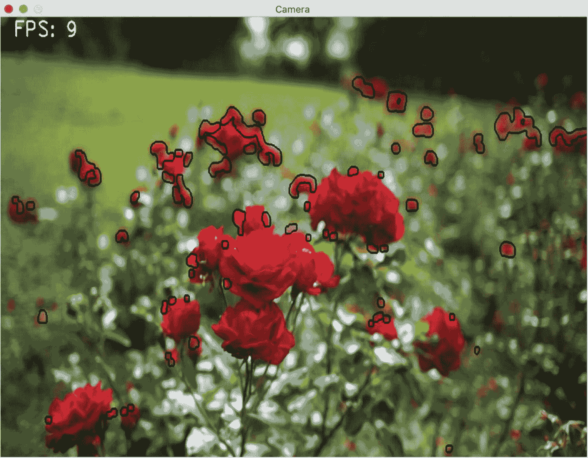

**图 4-14** 检测红玫瑰

**实现一个检测蓝色的滤镜**

查看表 4-1 中的色相值，你会发现实现一个搜索蓝色的滤镜并不困难。这留作练习供你完成。

#### 通过 Haar 检测

正如你在第 1 章中所见，你可以使用基于 Haar 的分类器来识别 `Mat` 对象中的物体和/或人物。代码与你之前看到的几乎相同，只是额外强调了我们要寻找的形状的数量和大小。

具体来说，以下代码展示了如何使用两个尺寸作为参数来指定我们寻找物体的最小尺寸和最大尺寸。

```
classifier.detectMultiScale(input, faces, 1.1, 2, -1, new Size(100, 100), new Size(500, 500));
```

因此，清单 4-17 附带了一个额外的 main 示例函数，展示了如何使用不同的 XML 文件作为 Haar 分类器检测的参数。

```
public class DetectWithHaar {
public static void main(String[] args) {
Origami.init();
VideoCapture cap = new VideoCapture(0);
Mat buffer = new Mat();
ImShow ims = new ImShow("Camera", 800, 600);
Filter filter = new Pipeline(new Haar("haarcascades/haarcascade_frontalface_default.xml"), new FPS());
while (cap.grab()) {
cap.retrieve(buffer);
ims.showImage(filter.apply(buffer));
}
cap.release();
}
}
class Haar implements Filter {
private CascadeClassifier classifier;
Scalar white = new Scalar(255, 255, 255);
public Haar(String path) {
classifier = new CascadeClassifier(path);
}
public Mat apply(Mat input) {
MatOfRect faces = new MatOfRect();
classifier.detectMultiScale(input, faces, 1.1, 2, -1, new Size(100, 100), new Size(500, 500));
for (Rect rect : faces.toArray()) {
Imgproc.putText(input, "Face", new Point(rect.x, rect.y - 5), 3, 5, white);
Imgproc.rectangle(input, new Point(rect.x, rect.y), new Point(rect.x + rect.width, rect.y + rect.height),
white, 5);
}
return input;
}
}
清单 4-17
基于 Haar 分类器的检测
```

如果你家里有猫，或者正在使用示例中的猫视频，当你将其应用于网络摄像头流时，应该会得到如图 4-15 所示的结果。

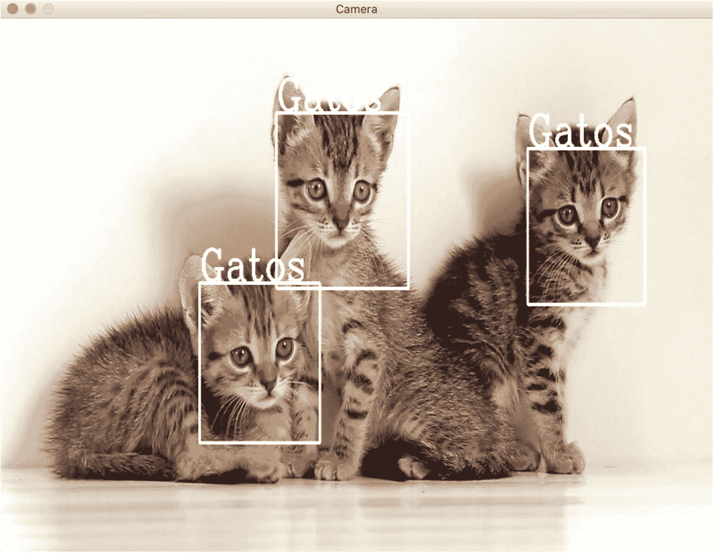

**图 4-15** 寻找猫

**使用其他 Haar 定义**

示例中还有其他用于 Haar 级联的 XML 文件。请随意使用其中一个来检测人物、眼睛或笑脸作为练习。


#### 检测上的透明叠加层

在前面的示例中绘制矩形时，您可能想知道是否可以在检测到的形状上绘制矩形以外的其他内容。

清单 4-18 展示了如何通过加载一个将叠加在检测到的形状位置上的遮罩来实现这一点。这基本上就是您在智能手机应用中一直使用的功能。

请注意，在 `drawTransparency` 函数中，关于透明度层有一个技巧。叠加层的遮罩是使用 `IMREAD_UNCHANGED` 作为加载标志加载的；您必须使用此标志，否则透明度层会丢失。

一旦您获得了透明度层，就可以在复制叠加层时将其用作遮罩，从而复制您想要的 `Mat` 对象的精确像素。

```
class FunWithHaar implements Filter {
CascadeClassifier classifier;
Mat mask;
Scalar white = new Scalar(255, 255, 255);
public FunWithHaar(String path) {
classifier = new CascadeClassifier(path);
mask = Imgcodecs.imread("masquerade_mask.png", Imgcodecs.IMREAD_UNCHANGED);
}
void drawTransparency(Mat frame, Mat transp, int xPos, int yPos) {
List layers = new ArrayList();
Core.split(transp, layers);
Mat mask = layers.remove(3);
Core.merge(layers, transp);
Mat submat = frame.submat(yPos, yPos + transp.rows(), xPos, xPos + transp.cols());
transp.copyTo(submat, mask);
}
public Mat apply(Mat input) {
MatOfRect faces = new MatOfRect();
classifier.detectMultiScale(input, faces);
Mat maskResized = new Mat();
for (Rect rect : faces.toArray()) {
Imgproc.resize(mask, maskResized, new Size(rect.width, rect.height));
int adjusty = (int) (rect.y - rect.width * 0.2);
try {
drawTransparency(input, maskResized, rect.x, adjusty);
} catch (Exception e) {
e.printStackTrace();
}
}
return input;
}
}
清单 4-18
添加叠加层
```

根据所使用的透明 `Mat` 对象，您可能需要调整位置，否则您应该会得到类似图 4-16 所示的结果。最后，您可以为您的视频流增添一些威尼斯狂欢节的感觉！

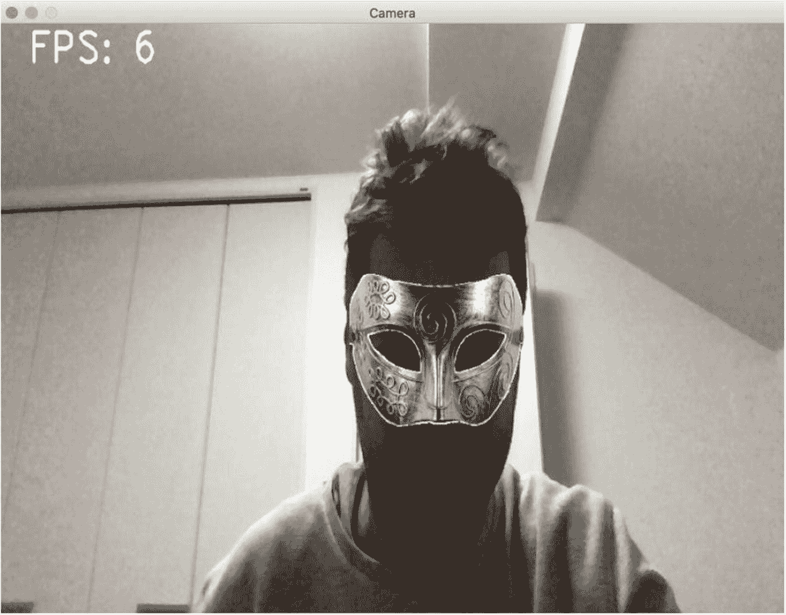

图 4-16

添加一个神秘面具作为叠加层

使用蝙蝠侠面具

我实际上尝试过，但没能找到一个合适的蝙蝠侠面具用作视频流的叠加层。也许您可以发送给我一个包含适当 `Mat` 叠加层的代码来帮助我！

#### 通过模板匹配进行检测

使用 OpenCV 进行模板匹配非常简单。它简单到可能应该更早地出现在检测方法的顺序中。模板匹配意味着在一个 `Mat` 中寻找另一个 `Mat`。OpenCV 有一个名为 `matchTemplate` 的超强函数可以做到这一点。

清单 4-19 主要围绕使用 `matchTemplate`。请注意在从 `matchTemplate` 返回的结果上使用 `Core.minMaxLoc`。它用于定位最佳得分的索引，并且在运行神经网络时会再次使用。

```
class Template implements Filter {
Mat template;
public Template(String path) {
this.template = Imgcodecs.imread(path);
}
@Override
public Mat apply(Mat in) {
Mat outputImage = new Mat();
Imgproc.matchTemplate(in, template, outputImage, Imgproc.TM_CCOEFF);
MinMaxLocResult mmr = Core.minMaxLoc(outputImage);
Point matchLoc = mmr.maxLoc;
Imgproc.rectangle(in, matchLoc, new Point(matchLoc.x + template.cols(), matchLoc.y + template.rows()),
new Scalar(255, 255, 255), 3);
return in;
}
}
清单 4-19
模式匹配
```

现在，让我们找一个装有 ReSpeaker 的盒子，就像图 4-17 中所示的那样，因为我们在下一章中会用到这个扬声器，而我现在找不到它了。让我们用 OpenCV 来帮我们找到它。

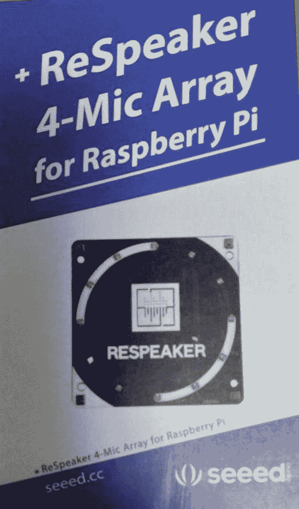

图 4-17

模板

通过 OpenCV 的模板匹配进行检测出奇地快速和准确，如图 4-18 所示。

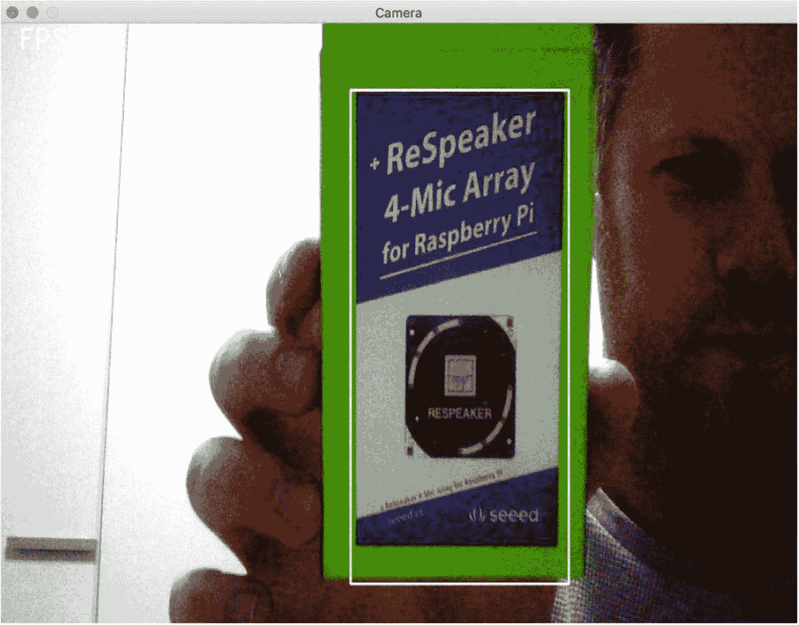

图 4-18

找到扬声器的盒子

在图 4-18 中很难看到帧率，但在 Raspberry Pi 4 上，它实际上大约在每秒 10 到 15 帧之间。

#### 通过 Yolo 进行检测

这是本章介绍的最后一个检测方法。假设我们想要应用一个训练好的神经网络来识别流中的物体。在经过一些计算能力有限的硬件测试后，我使用 Yolo/Darknet 以及在 Coco 数据集上训练的可免费获取的 Darknet 网络获得了相当快速的结果。

在随机输入上使用神经网络的优势在于，大多数训练好的网络都相当稳健，并且能给出良好的结果，在接近实时的流上准确率达到 80% 到 90%。

训练是使用神经网络最困难的部分。在本书中，我们将仅限于在 Raspberry Pi 上运行检测代码，而不是训练。您可以在 Darknet/Yolo 网站上找到如何组织图片以重新训练网络的步骤。

在 OpenCV 中使用 Darknet 实现物体检测的步骤如下：

1.  从配置文件和权重文件中加载网络。
2.  找到该网络的输出层/节点，因为结果将在这里产生。输出层是指那些没有连接到更多输出层的层。
3.  将 `Mat` 对象转换为网络所需的 blob。Blob 是一个图像或一组图像，经过调整以匹配网络在大小、通道顺序等方面期望的格式。
4.  然后我们运行网络，这意味着我们将 blob 输入网络，并检索标记为输出层的层的值。
5.  对于结果中的每一行，我们实际上会获得每个预期可识别特征的置信度值。在 Coco 中，网络被训练为能够识别 80 种不同的可能物体，例如人、自行车、汽车等。
6.  然后我们再次使用 `MinMaxLocResult` 来获取最可能被识别物体的索引，如果该索引的值大于 0，我们就保留它。
7.  每个结果行中的前四个值实际上是描述检测到物体所在框的四个值，因此我们提取这四个值，并保留矩形及其标签的索引。
8.  在绘制所有框之前，我们通常还会使用 `NMSBoxes`，它会移除重叠的框。大多数情况下，重叠的框是对同一物体多次阳性检测的多个版本。
9.  最后，我们绘制剩余的矩形，并添加识别出的物体的标签。

清单 4-20 展示了作为过滤器实现的基类 `YoloDetector` 的完整代码。


```java
class YoloDetector implements Filter {
    final static Size sz = new Size(416, 416);
    List outBlobNames;
    Net net;
    List layers;
    List labels;

    List getOutputsNames(Net net) {
        List layersNames = net.getLayerNames();
        return net.getUnconnectedOutLayers().toList().stream().map(i -> i - 1).map(layersNames::get)
                .collect(Collectors.toList());
    }

    public YoloDetector(String modelWeights, String modelConfiguration) {
        net = Dnn.readNetFromDarknet(modelConfiguration, modelWeights);
        layers = getOutputsNames(net);
        try {
            labels = Files.readAllLines(Paths.get(LABEL_FILE));
        } catch (Exception e) {
            throw new RuntimeException(e);
        }
    }

    @Override
    public Mat apply(Mat in) {
        findShapes(in);
        return in;
    }

    final int IN_WIDTH = 416;
    final int IN_HEIGHT = 416;
    final double IN_SCALE_FACTOR = 0.00392157;
    final int MAX_RESULTS = 20;
    final boolean SWAP_RGB = true;
    final String LABEL_FILE = "yolov3/coco.names";

    void findShapes(Mat frame) {
        Mat blob = Dnn.blobFromImage(frame, IN_SCALE_FACTOR, new Size(IN_WIDTH, IN_HEIGHT), new Scalar(0, 0, 0),
                SWAP_RGB);
        net.setInput(blob);
        List outputs = new ArrayList();
        for (int i = 0; i < layers.size(); i++) {
            outputs.add(new Mat());
        }
        net.forward(outputs, layers);
        postProcess(frame, outputs);
    }

    private void postProcess(Mat frame, List outs) {
        List tmpLocations = new ArrayList();
        List tmpClasses = new ArrayList();
        List tmpConfidences = new ArrayList();
        int w = frame.width();
        int h = frame.height();
        for (Mat out : outs) {
            final float[] data = new float[(int) out.total()];
            out.get(0, 0, data);
            int k = 0;
            for (int j = 0; j < out.height(); j++) {
                Mat result = out.row(j);
                Core.MinMaxLocResult mm = Core.minMaxLoc(result);
                if (mm.maxVal > 0) {
                    float center_x = data[k + 0] * w;
                    float center_y = data[k + 1] * h;
                    float width = data[k + 2] * w;
                    float height = data[k + 3] * h;
                    float left = center_x - width / 2;
                    float top = center_y - height / 2;
                    tmpClasses.add((int) mm.maxLoc.x);
                    tmpConfidences.add((float) mm.maxVal);
                    tmpLocations.add(new Rect((int) left, (int) top, (int) width, (int) height));
                }
                k += out.width();
            }
        }
        annotateFrame(frame, tmpLocations, tmpClasses, tmpConfidences);
    }

    private void annotateFrame(Mat frame, List tmpLocations, List tmpClasses,
                               List tmpConfidences) {
        MatOfRect locMat = new MatOfRect();
        MatOfFloat confidenceMat = new MatOfFloat();
        MatOfInt indexMat = new MatOfInt();
        locMat.fromList(tmpLocations);
        confidenceMat.fromList(tmpConfidences);
        Dnn.NMSBoxes(locMat, confidenceMat, 0.1f, 0.1f, indexMat);
        for (int i = 0; i < indexMat.total() && i < MAX_RESULTS; ++i) {
            int idx = (int) indexMat.get(i, 0)[0];
            int labelId = tmpClasses.get(idx);
            Rect box = tmpLocations.get(idx);
            String label = labels.get(labelId);
            annotateOne(frame, box, label);
        }
    }

    private void annotateOne(Mat frame, Rect box, String label) {
        Imgproc.rectangle(frame, box, new Scalar(0, 0, 0), 2);
        Imgproc.putText(frame, label, new Point(box.x, box.y), Imgproc.FONT_HERSHEY_PLAIN, 4.0, new Scalar(0, 0, 0), 3);
    }
}
```
*清单 4-20* 基于神经网络的检测

现在，你可以使用不同的可用网络运行自己的一组目标检测和实验。清单 4-21 展示了如何加载每个主要的基于 Yolo 的网络。

```java
class Yolov2 extends YoloDetector {
    public Yolov2() {
        super("yolov2/yolov2.weights", "yolov2/yolov2.cfg");
    }
}

class TinyYolov2 extends YoloDetector {
    public TinyYolov2() {
        super("yolov2-tiny/yolov2-tiny.weights", "yolov2-tiny/yolov2-tiny.cfg");
    }
}

class Yolov3 extends YoloDetector {
    public Yolov3() {
        super("yolov3/yolov3.weights", "yolov3/yolov3.cfg");
    }
}

class TinyYolov3 extends YoloDetector {
    public TinyYolov3() {
        super("yolov3-tiny/yolov3-tiny.weights", "yolov3-tiny/yolov3-tiny.cfg");
    }
}
```
*清单 4-21* 不同 Yolo 网络的 Java 类和构造函数

在树莓派上运行时，Yolo v3 可以检测里斯本繁忙街道上的汽车和行人（图 4-19），以及更多的猫（图 4-20）。

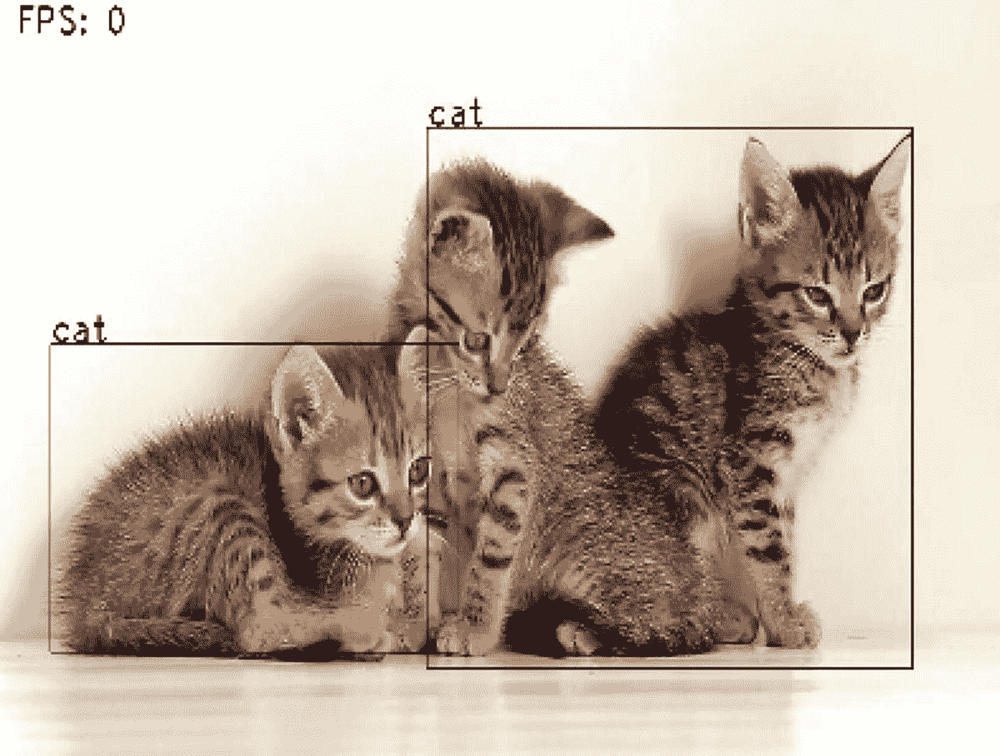

*图 4-20* Yolo v3 检测猫

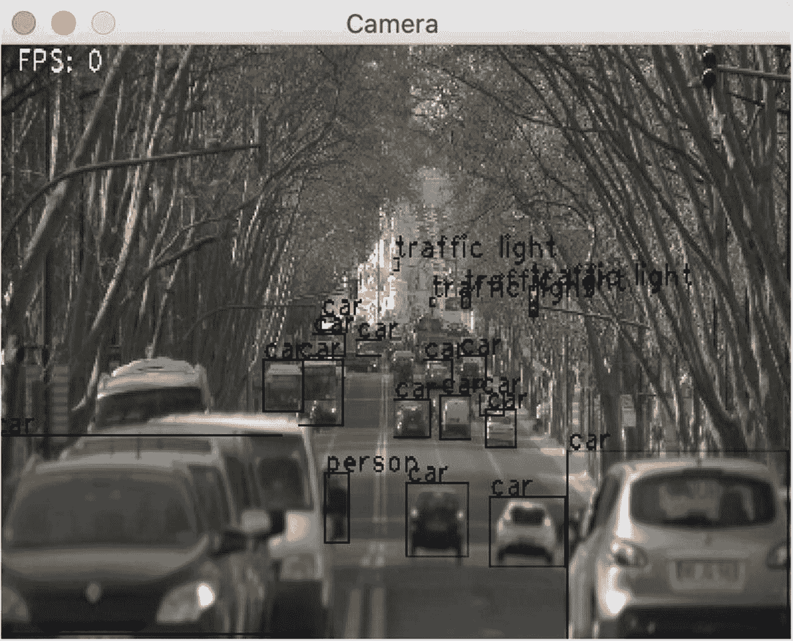

*图 4-19* Yolo v3 检测汽车和行人

如你所见，标准 Yolo v3 的帧率实际上非常低。

当使用 Yolo v3 Tiny 进行此实验时，你实际上可以达到接近每秒 5 到 6 帧，这仍然略低于实时要求，但结果仍然具有非常好的准确性。参见图 4-21。

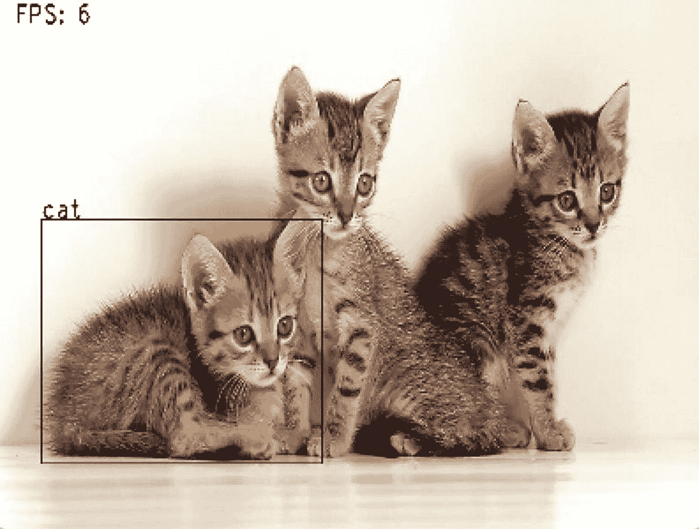

*图 4-21* TinyYoloV3 检测猫

> *你知道我的方法。它是建立在对琐事的观察之上的。*
> 
> ——阿瑟·柯南·道尔，《博斯科姆比溪谷秘案》（1891）

你已经读到了本章的最后几行，这是一段漫长的旅程，你了解了在树莓派上使用 Java 和 OpenCV 进行目标检测的大部分概念。

具体来说，你学习了以下内容：

- 如何设置树莓派以进行实时目标检测编程
- 如何使用过滤器和管道执行图像和实时视频处理
- 如何为 `Mat` 实现一些基本过滤器，直接用于来自外部设备和基于文件的视频的实时视频流
- 如何通过类似 Instagram 的过滤器增加一些趣味
- 如何使用过滤器和管道实现多种目标检测技术
- 如何运行一个在 Coco 数据集上训练、可在树莓派上实时使用的神经网络

在下一章中，你将了解 Rhasspy（一个语音识别系统），以连接本章介绍的概念，并将其应用于家庭、办公室或猫舍的自动化。


