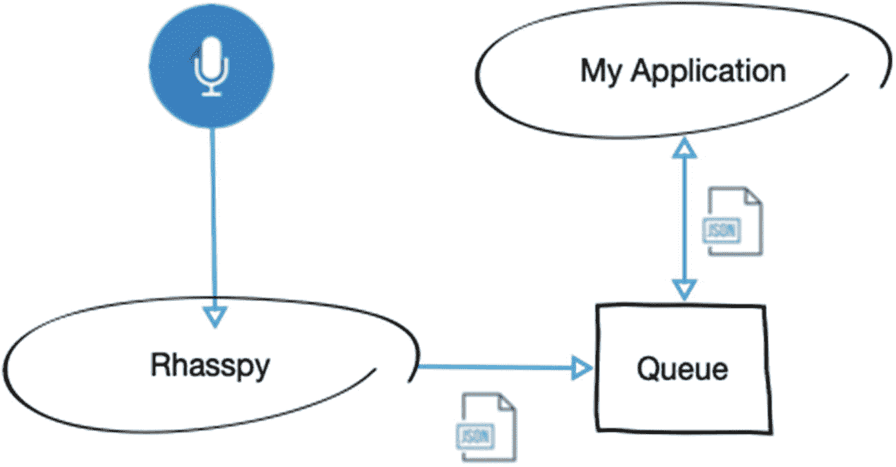
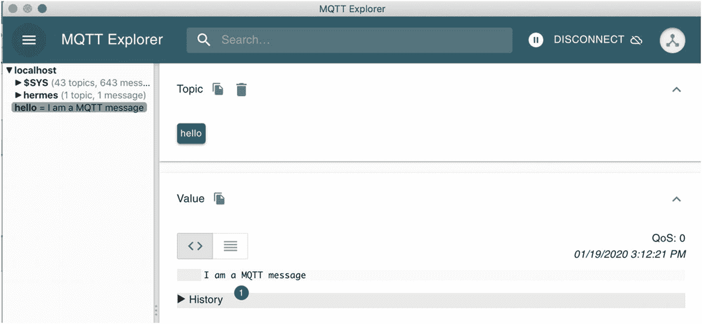
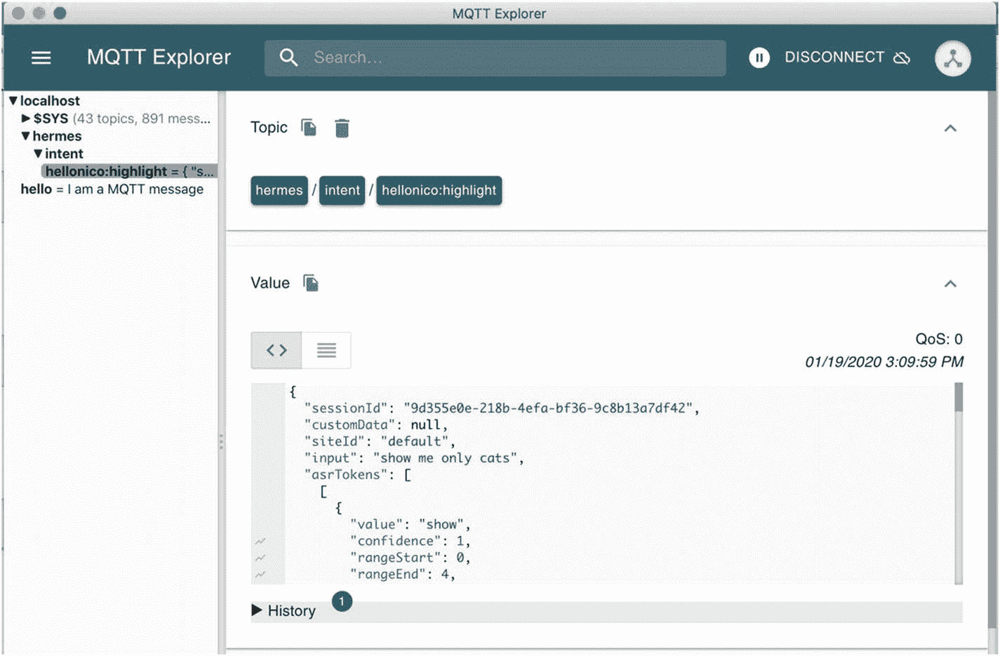
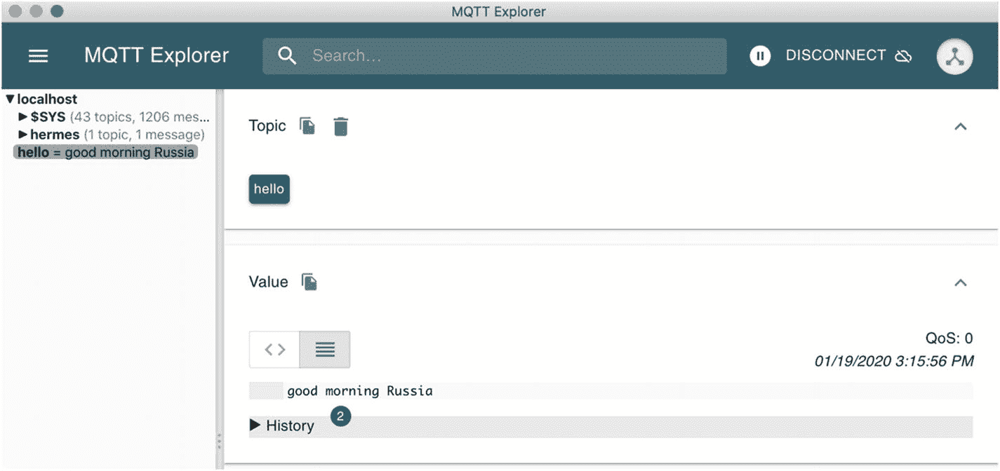
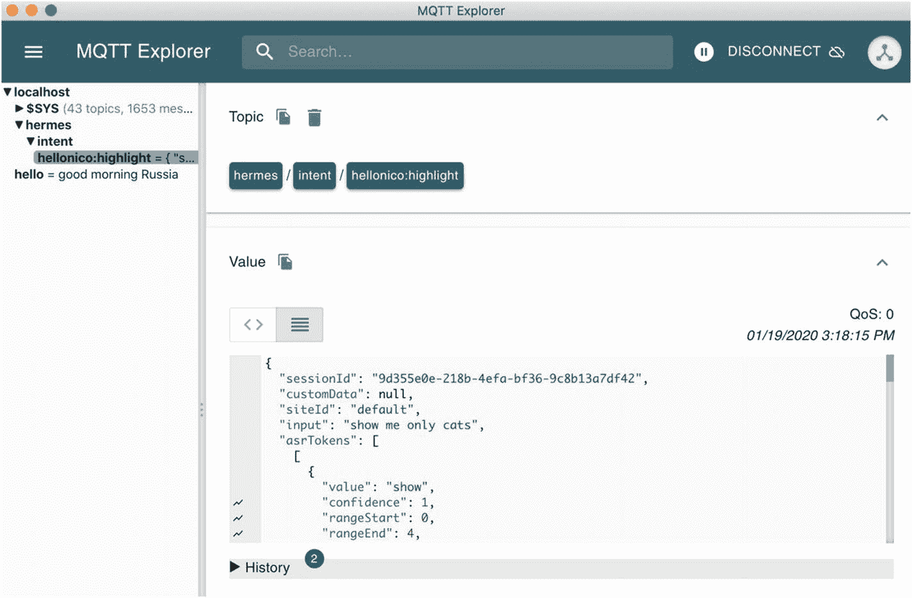
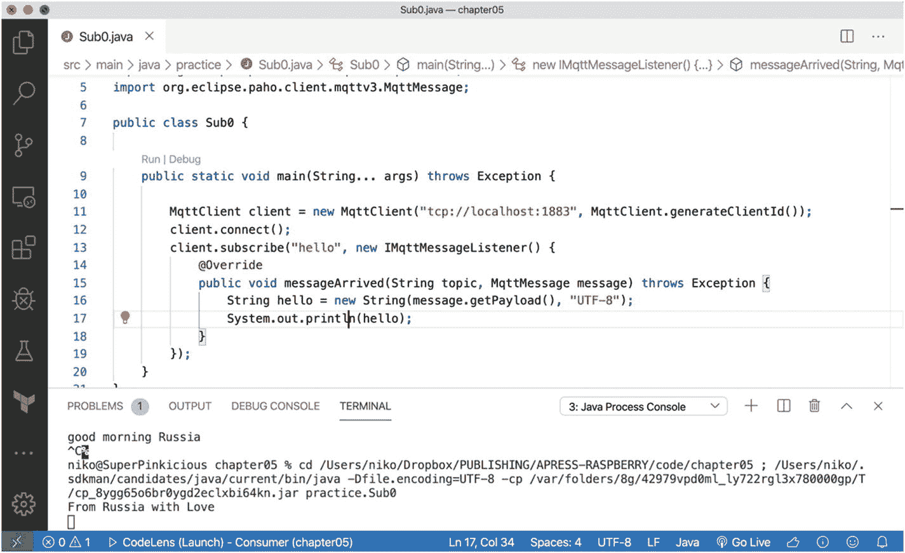
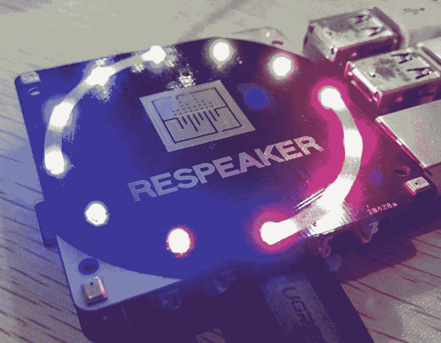

# 5. 视觉与家庭自动化

> *家，是你年轻时渴望离开，年老时渴望回归的地方。*
> 
> ——约翰·埃德·皮尔斯

本书前四章向你展示了如何接入各种视频流，并先在计算机上进行分析，随后在树莓派这一小型受限设备上进行分析。

最后一章通过将视频部分与语音部分连接起来，在开启各种可能性的同时，弥合了二者之间的差距。

随着苹果 Siri、谷歌助手、亚马逊 Alexa 和微软 Cortona 等语音平台的出现，语音辅助服务正遍地开花。人类是语言生物；我们需要表达自己。与设备交互的另一种方式是绘图，就像电影《少数派报告》中那样，但老实说，要做到那样，你需要相当大且昂贵的屏幕。语音则无处不在，而且我们不需要昂贵的工具就能使用它。使用语音直观且赋权。

我个人有很多关于语音助手如何在日常生活中应用的例子。比如，走进一家咖啡店，说“请来一杯双份浓缩肉桂卡布奇诺，送到前露台”，然后当你坐在外面晒太阳时，咖啡就自动做好并送到你面前。

另一个简单的例子：我希望能够走到自动取款机前说：“请从我的主账户取 100 美元，要 5 张 20 美元的钞票。”语音助手能识别你的声音，所以你无需滚动浏览无尽的确认屏幕；直接拿到钞票就行。（我知道，如今有了各种虚拟货币，你其实根本不需要再去自动取款机了，对吧？）

这些是一些日常例子，但你也可以看看科幻电影，里面既有声控的宇宙飞船，也有声控的咖啡机。这意义重大。

那么，我们为什么不使用现有的软件助手（如 Siri）来进行语音识别呢？嗯，所有的大公司基本上都控制着你所有的用户数据，并且可以随时访问通过其管道传输的任何数据。作为最终用户，这可能会很烦人——在创建和设计你自己的解决方案时也同样烦人。但是，你希望能够尽可能多地控制你的数据流向哪里，或者更确切地说，不流向哪里。

因此，在本章中，我们将介绍 Rhasspy（[`https://github.com/synesthesiam/rhasspy`](https://github.com/synesthesiam/rhasspy)）。

Rhasspy 是为那些希望拥有家庭助手的语音界面，但又重视隐私和自由的高级用户而创建的。Rhasspy 是免费/开源的，并且可以做到以下几点：

* 完全离线运行
* 与 Home Assistant、Hass.io 和 Node-RED 良好配合

在本章中，我们将执行以下操作：

* 我们将安装并学习如何与 MQTT 协议和 Mosquitto（一个可用于发送 Rhasspy 识别消息的代理）进行交互。
* 我们将设置 Rhasspy 界面来监听意图，并在 MQTT 队列中查看这些消息。
* 我们将把这些消息与前几章的内容集成，运行实时视频分析，更新对象检测参数，并使用从 Rhasspy 接收到的语音命令。

## Rhasspy 消息流

基本上，Rhasspy 会持续寻找“唤醒词”。当被这些词之一唤醒时，它会记录接下来的句子并将其转换为文字。然后，它会根据它能识别的模式来分析这个句子。最后，如果句子与已知句子匹配，它会返回一个带有概率的结果。

从应用的角度来看，在构建语音应用时，你需要与之交互的主要是消息队列，在大多数物联网场景中，这是一个 MQTT 服务器。MQTT 的开发侧重于遥测测量，因此必须轻量级且尽可能接近实时。Mosquitto 是 MQTT 协议的一个开源实现；它轻量、安全，并且专门为服务物联网应用和小型设备而设计。

要进行语音识别，你首先要创建 Rhasspy 命令，或称*意图*，并附带一组句子。每个句子当然是一组单词，并且可以包含一个或多个变量。变量是可以被其他词替换的词，一旦语音引擎完成语音检测，它们就会被赋予相应的值。

在一个简单的天气服务示例中，以下句子：

* 明天*的天气怎么样？

将被定义如下：

* `<when:=datetime>` 的天气怎么样？

这里，`when` 是 `datetime` 类型，可以是诸如*今天*、*明天*、*今天早上*或*下个月第一个星期二*之类的任何内容。

“的天气怎么样”在该命令的上下文中是固定的，永远不会改变。但 `<datetime>` 位置是一个变量，所以我们给引擎提供其类型的提示，以便更好地识别。

一旦一个意图被识别，Rhasspy 就会在与该意图关联的 Mosquitto 主题中发布一条 JSON 消息。

我们将在本章中构建的示例是，要求应用高亮显示视频流中检测到的某些对象。

例如，在以下句子中，*猫*是变量容器，我们指定要检测的对象：

* 只显示*猫*！

在这个例子中，当意图被识别后，发送的消息将是一条基于 JSON 的消息，包含以下主要部分：

* 一些消息头，特别是识别出的输入。
* 自动语音识别（ASR）令牌，或句子中每个单词的置信度。
* 整体 ASR 置信度。
* 被识别的意图及其置信度分数。
* 每个“槽位”（句子中定义的变量）的值及其相关的置信度分数。
* 还提供了备选意图，尽管我发现它们在大多数情况下不是很有用；因此，寻找次优选择并试图恢复流程通常不值得。

清单 5-1 展示了 JSON 消息的一个示例。

```
{
"sessionId": "9d355e0e-218b-4efa-bf36-9c8b13a7df42",
...
"input": "show me only cats",
"asrTokens": [
[
{
"value": "show",
"confidence": 1,
"rangeStart": 0,
"rangeEnd": 4,
"time": {
"start": 0,
"end": 0.98999995
}
},
...
]
],
"asrConfidence": 0.9476952,
"intent": {
"intentName": "hellonico:highlight",
"confidenceScore": 1
},
"slots": [
{
"rawValue": "cats",
"value": {
"kind": "Custom",
"value": "cats"
},
"alternatives": [],
"range": {
"start": 13,
"end": 17
},
"entity": "string",
"slotName": "object",
"confidenceScore": 0.80663073
}
],
"alternatives": [
{
"intentName": "hellonico:hello",
"confidenceScore": 0.28305322,
"slots": []
},
...
]
}
清单 5-1
JSON 消息
```

来自意图的 JSON 消息被发送到 MQTT 代理中一个指定的命名消息队列，每个意图对应一个队列。用于发送意图消息的队列名称遵循以下模式：

```
hermes/intent/:
```

所以，在我们的示例中，它看起来像这样：

```
hermes/intent/hellonico:highlight
```

总结一下，图 5-1 展示了一个简单的消息流。



图 5-1

Rhasspy 消息流

由于系统的主要交互点是系统队列，让我们先看看如何安装队列代理，然后与之交互。

## MQTT 消息队列

为了能够使用消息队列并接收来自 Rhasspy 的消息，我们将安装消息代理 Mosquitto，这是最广泛使用的 MQTT 代理之一。MQTT 是一种轻量级且节能的协议，可以在消息级别设置不同级别的服务质量。Mosquitto 是 MQTT 的一个非常轻量级的实现。


## 安装 Mosquitto

Mosquitto 的安装说明适用于所有平台，下载页面提供了安装程序的链接。

```
https://mosquitto.org/download/
```

在 Windows 上，你应该下载基于 `.exe` 的安装程序，但其他平台可以通过常规的包管理器获取软件，如下所示：

```
### 在 macOS 上
brew install mosquitto
### 在 Debian/Ubuntu 上
apt install mosquitto
### 使用 snap
snap install mosquitto
```

安装 Mosquitto 后，你应该检查 Mosquitto 服务是否已正确启动并准备好转发消息。例如，在 Mac 上，使用以下命令：

```
$ brew services list mosquitto
Name         Status    User   Plist
mosquitto    started   niko   /Users/niko/Library/LaunchAgents/homebrew.mxcl.mosquitto.plist
```

在命令行中，你已经可以使用两个命令：一个用于在指定主题上发布消息，另一个用于订阅指定主题的消息。

## 其他 MQTT 代理的比较

供你参考，你可以在此处找到其他几个 MQTT 代理的比较：[`https://github.com/mqtt/mqtt.github.io/wiki/server-support`](https://github.com/mqtt/mqtt.github.io/wiki/server-support)。

RabbitMQ 是一个强大的开源竞争者，但尽管其集群支持非常稳健，其设置却并不简单。

## 命令行中的 MQTT 消息

安装 Mosquitto 后，在命令行中使用 `mosquitto_pub` 命令向代理发送关于任何主题的消息相当容易。例如，以下命令在主题 `hello` 上向位于主机 `0.0.0.0` 的代理发送消息 "I am a MQTT message"：

```
mosquitto_pub -h 0.0.0.0 -t hello -m "I am a MQTT message"
```

当然，你也有对应的订阅者命令 `mosquitto_sub`，如下所示：

```
$ mosquitto_sub -h 0.0.0.0 -t hello
I am a MQTT message
```

### 发送消息到树莓派

最佳实践是在树莓派上启动队列并从计算机读取消息，反之亦然。

主要问题在于要知道目标机器、计算机或树莓派的 IP 地址或主机名，但发送消息的方式与使用 `mosquitto_pub` 和 `mosquitto_sub` 命令相同。

更进一步，你甚至可以在云端运行你的 Mosquitto MQTT 代理，例如，从 [`https://www.cloudmqtt.com/`](https://www.cloudmqtt.com/) 这样的服务创建并集成一个队列。

通常，我最喜欢的图形化查看消息方式是使用 MQTT Explorer，这是一个 MQTT 的图形化客户端，如图 5-2 所示。



图 5-2

MQTT Explorer，I am a MQTT message

你可以从以下位置下载 MQTT Explorer：

```
https://github.com/thomasnordquist/MQTT-Explorer/releases
```

它也应该可以通过你喜欢的包管理器获得。

让我们回到发送完整意图消息的等价操作。你可以使用命令行直接将 JSON 文件发送到目标意图队列，正如我们刚刚看到的：`hermes/intent/hellonico:highlight`。

因此，使用 `mosquitto_pub`，可以得到以下命令：

```
mosquitto_pub -f onlycats.json -h 0.0.0.0 -t hermes/intent/hellonico:highlight
```

其中 `onlycats.json` 是包含我们在清单 5-1 中刚刚看到的内容的 JSON 文件。

如果你仍在运行 MQTT Explorer，你将在相应的队列中看到该消息，如图 5-3 所示。



图 5-3

从命令行发送类似 Rhasspy 的意图消息

我们已经了解了如何从命令行使用 MQTT 进行交互、发布和订阅消息。现在让我们用 Java 来做同样的事情。

## Java 中的 MQTT 消息传递

在本节中，我们将向我们的 Java/Visual Studio Code 设置发送消息以及从中接收消息。这将帮助你更轻松地理解消息流。

### 依赖项设置

无论是使用前几章的项目，还是基于项目模板创建一个新项目，我们都将添加一些 Java 库来与 MQTT 消息队列交互并解析 JSON 内容。

`pom.xml` 文件中的依赖项部分应如清单 5-2 所示。

```
org.eclipse.paho
org.eclipse.paho.client.mqttv3
1.1.0

origami
origami
4.1.2-5

org.json
json

origami
filters
1.3

清单 5-2
Java 依赖项
```

基本上，我们将使用以下第三方库：

*   `origami` 和 `origami-filters` 用于实时视频处理
*   `org.json` 用于 JSON 内容解析
*   `mqttv3` 用于与 MQTT 代理交互并处理消息

### 发送基本 MQTT 消息

由于我是在飞越俄罗斯上空的飞机上撰写本书的这一部分，我们将使用 MQTT 协议向我们的俄罗斯间谍同行发送一条快速的 "hello" 消息。

为此，我们将执行以下步骤：

1.  创建一个 MQTT 客户端对象，连接到代理运行的主机。
2.  使用该对象通过 `connect` 方法连接到代理。
3.  创建一个 MQTT 消息，其有效负载由转换为字节的字符串组成。
4.  发布消息。
5.  最后，干净地断开连接。

清单 5-3 展示了相当简短的代码片段。

```
package practice;
import org.eclipse.paho.client.mqttv3.MqttClient;
import org.eclipse.paho.client.mqttv3.MqttMessage;
public class MqttZero {
public static void main(String... args) throws Exception {
MqttClient client = new MqttClient("tcp://localhost:1883", MqttClient.generateClientId());
client.connect();
MqttMessage message = new MqttMessage();
message.setPayload(new String("good morning Russia").getBytes());
client.publish("hello", message);
client.disconnect();
}
}
清单 5-3
你好，俄罗斯
```

要检查一切是否就绪，请验证消息是否显示在你正在运行的 MQTT Explorer 实例中，如图 5-4 所示。



图 5-4

俄罗斯的 MQTT Explorer

请注意，你当然应该首先监听 `hello` 主题。

### 模拟 Rhasspy 消息

发送等效的 Rhasspy 消息并不会困难太多；我们只需将 JSON 文件的内容读入一个字符串，然后像处理简单字符串一样发送它，如清单 5-4 所示。

```
package practice;
import java.nio.file.Files;
import java.nio.file.Paths;
import java.util.List;
import java.util.stream.Collectors;
import org.eclipse.paho.client.mqttv3.MqttClient;
import org.eclipse.paho.client.mqttv3.MqttMessage;
public class Client {
public static void main(String... args) throws Exception {
MqttClient client = new MqttClient("tcp://localhost:1883", MqttClient.generateClientId());
client.connect();
List nekos = Files.readAllLines(Paths.get("onlycats.json"));
String neko = nekos.stream().collect(Collectors.joining("\n"));
MqttMessage message = new MqttMessage();
message.setPayload(neko.getBytes());
client.publish("hermes/intent/hellonico:highlight", message);
client.disconnect();
}
}
清单 5-4
来自 Java 的意图消息处理

我们对猫咪永无止境的爱再次在图 5-5 的 MQTT Explorer 窗口中展现。



图 5-5

MQTT Explorer 窗口中显示的 JSON 文件


#### JSON 趣谈

在处理来自 MQTT 主题的 Rhasspy 消息之前，我们需要先掌握一些 JSON 解析技巧。

显然，在 Java 中有很多解析方法：我们可以手动解析（提示：别这么做），或者使用不同的库。这里我们将使用 `org.json` 库，因为它处理传入的 MQTT 消息速度相当快。

以下是使用 `org.json` 库解析字符串以获取所需值的步骤：

1.  使用 JSON 消息的字符串版本创建一个 `JSONObject`。
2.  使用以下函数之一来导航 JSON 文档：
    *   `get()`
    *   `getJSONObject()`
    *   `getJSONArray()`
3.  使用 `getInt`、`getBoolean`、`getString` 等方法获取所需的值。

##### 过度设计

大多数时候，Java 被认为很复杂，是因为在某个层级中引入了一个复杂的中件间。实际上，我觉得这门语言如今相当简洁，并且借助各种自动补全和重构工具，开发效率很高。

无论如何，这里我们只是提取消息中的一个值，但你也可以将整个 JSON 消息解组为 Java 对象……甚至为我们创建一个开源库。准备好后请告诉我！

就是这样。应用到我们之前用过的 `somecats.json` 文件上，如果我们想检索 Rhasspy 识别的值，可以按照清单 5-5 的思路操作。

```
package practice;
import java.nio.file.Files;
import java.nio.file.Paths;
import java.util.List;
import java.util.stream.Collectors;
import org.json.JSONObject;
public class JSONFun {
public static String whatObject(String json) {
JSONObject obj = new JSONObject(json);
JSONObject slot = ((JSONObject) obj.getJSONArray("slots").get(0)).getJSONObject("value");
String cats = slot.getString("value");
return cats;
}
public static void main(String... args) throws Exception {
List nekos = Files.readAllLines(Paths.get("onlycats.json"));
String json = nekos.stream().collect(Collectors.joining("\n"));
System.out.println(whatObject(json));
}
}
清单 5-5
解析 JSON 内容
```

### 监听基本 MQTT 消息

监听消息，或称*订阅*，通过以下步骤完成：

1.  订阅一个主题或父主题。
2.  添加一个实现 `IMqttMessageListener` 接口的监听器。

最简单的订阅代码如清单 5-6 所示。

```
package practice;
import org.eclipse.paho.client.mqttv3.IMqttMessageListener;
import org.eclipse.paho.client.mqttv3.MqttClient;
import org.eclipse.paho.client.mqttv3.MqttMessage;
public class Sub0 {
public static void main(String... args) throws Exception {
MqttClient client = new MqttClient("tcp://localhost:1883", MqttClient.generateClientId());
client.connect();
client.subscribe("hello", new IMqttMessageListener() {
@Override
public void messageArrived(String topic, MqttMessage message) throws Exception {
String hello = new String(message.getPayload(), "UTF-8");
System.out.println(hello);
}
});
}
}
清单 5-6
来自俄罗斯的爱
```

请注意，消息处理部分当然可以用 Java lambda 表达式替换，从而使其更具可读性，如清单 5-7 所示。

```
MqttClient client = new MqttClient("tcp://localhost:1883", MqttClient.generateClientId());
client.connect();
client.subscribe("hello", (topic, message) -> {
String hello = new String(message.getPayload(), "UTF-8");
System.out.println(hello);
});
清单 5-7
使用 Java Lambda 处理消息
```

如果你在树莓派上运行所有内容，那么以下 Visual Studio Code 设置将正确完成所有操作并显示俄语消息，如图 5-6 所示。



图 5-6  
来自俄罗斯的爱

#### 从 Java 向树莓派发送消息

显然，乐趣在于拥有一个分布式系统并处理来自不同地方的消息。这里，尝试在树莓派上运行代理。在发送方代码中设置好树莓派的 IP 地址后，从你的计算机用 Java 向树莓派发送一条消息。

或者，从树莓派用 Java 向远程代理（或云端）发送一条消息。

### 监听 MQTT JSON 消息

那么，现在是时候在 Java 中监听并解析 JSON 消息的内容了，这主要是监听基本消息和实现前面 JSON 趣谈部分的结合。代码片段见清单 5-8。

```
package practice;
import org.eclipse.paho.client.mqttv3.IMqttMessageListener;
import org.eclipse.paho.client.mqttv3.MqttClient;
import org.eclipse.paho.client.mqttv3.MqttMessage;
import org.json.JSONObject;
public class Sub {
public static void main(String... args) throws Exception {
MqttClient client = new MqttClient("tcp://localhost:1883", MqttClient.generateClientId());
client.connect();
client.subscribe("hermes/intent/#", new IMqttMessageListener() {
@Override
public void messageArrived(String topic, MqttMessage message) throws Exception {
String json = new String(message.getPayload(), "UTF-8");
JSONObject obj = new JSONObject(json);
JSONObject slot = ((JSONObject) obj.getJSONArray("slots").get(0)).getJSONObject("value");
String cats = slot.getString("value");
System.out.println(cats);
}
});
}
}
清单 5-8
猫咪来了
```

现在你已经了解了关于键和代理的一切，是时候获取并安装 Rhasspy 了。

## 语音与 Rhasspy 设置

Rhasspy 语音平台需要运行一组服务，才能部署带有意图的应用程序。在本节中，你将首先了解如何安装该平台，然后了解如何创建带有意图的应用程序。

安装 Rhasspy 最简单的方法是通过 Docker（[`https://www.docker.com/`](https://www.docker.com/)），这是一个容器引擎，你可以在其上运行镜像。Rhasspy 的维护者已经创建了一个现成的 Rhasspy Docker 镜像，因此我们将利用这一点。

### 准备扬声器

在执行任何语音命令之前，你需要一个可用的麦克风设置。

我们推荐使用 ReSpeaker。如果你有它，可以在这里找到安装说明：

```
http://wiki.seeedstudio.com/ReSpeaker_4_Mic_Array_for_Raspberry_Pi/
```

假设你已将扬声器插入树莓派，你可以通过以下简短的 shell 脚本执行必要的模块安装：

```
sudo apt-get update
sudo apt-get upgrade
git clone https://github.com/respeaker/seeed-voicecard.git
cd seeed-voicecard
sudo ./install.sh
reboot
```

标准的 USB 麦克风应该是即插即用的，我一直在使用会议室麦克风，效果相当不错。

所以，如果一切正常，麦克风应该会出现在这个 `arecord` 命令的输出列表中：

```
arecord -L
```

你的 ReSpeaker/树莓派设置应该类似于图 5-7 所示。



图 5-7  
ReSpeaker 指示灯


### 安装 Docker

Docker 官网最近发布了一篇关于如何在树莓派上设置 Docker 的文章；你可以在这里找到它：

```
https://www.docker.com/blog/happy-pi-day-docker-raspberry-pi/
```

所有步骤在以下代码中重复列出：

```
