#    i. 你现在应该能看到一些关于版本、运行时等信息。
```

### 使用 Docker 安装 Rhasspy

通过运行准备好的容器即可启动整个 Rhasspy 套件，只需在树莓派上执行以下命令（前提是你已正确安装 Docker）。

使用 `docker run` 来启动镜像本身；你可以将镜像想象成一个包含预打包软件和配置的小型操作系统，因此易于部署。

```
docker run -d -p 12101:12101 \
--restart unless-stopped \
-v "$HOME/.config/rhasspy/profiles:/profiles" \
--device /dev/snd:/dev/snd \
synesthesiam/rhasspy-server:latest \
--user-profiles /profiles \
--profile en
```

以下是代码的详细说明：

*   `docker`：这是一个命令行可执行文件，用于与 Docker 守护进程通信，并发送启动和停止容器的命令。

*   `-d`：这告诉 Docker 以守护进程模式运行镜像，即不等待镜像执行完毕，而是将容器作为后台进程启动。

*   `-p 12101:12101`：这执行 Docker 与主机之间的端口映射；没有这个映射，容器内开放的端口将无法从外部访问。这里我们告诉 Docker 将容器的 12101 端口映射到树莓派的 12101 端口。

*   `--restart unless-stopped`：顾名思义，即使容器因内部异常或错误而终止，Docker 守护进程也会自动重启该镜像。

*   `-v "$HOME/.config/rhasspy/profiles:/profiles"`：这里我们希望“挂载”树莓派的一个文件夹，使其对 Docker 容器可用，反之亦然。这类似于一个共享网络文件夹。它将用于存储 Rhasspy 为我们下载的文件。

*   `--device /dev/snd:/dev/snd`：这非常巧妙；它将传入树莓派音频系统的原始数据进行映射，并使其对 Docker 容器可用。

*   `synesthesiam/rhasspy-server:latest`：这是用于启动容器的镜像名称。可以将此镜像视为用于启动容器的文件系统的逐字副本。

*   接下来的两个是 Rhasspy 镜像能够识别的参数：
    *   `--user-profiles /profiles`：这是存储配置文件的位置，也是我们与树莓派共享的文件夹路径。

    *   `--profile en`：这是要使用的语言。

要检查容器是否已正确启动，让我们使用 `docker` 命令验证其状态，如下所示：

```
docker ps --format "table {{.Status}}\t{{.Ports}}\t{{.Image}}\t{{.ID}}"
```

这应该会显示类似以下内容；请务必检查我们放在最前面的状态字段：

```
STATUS           PORTS                       IMAGE                                CONTAINER ID
Up 22 minutes    0.0.0.0:12101->12101/tcp    synesthesiam/rhasspy-server:latest   af7c56961d5c
```

Rhasspy 服务器及其控制台已准备就绪，现在让我们回到主计算机，通过基于浏览器的 IDE 访问树莓派。

### 启动 Rhasspy 控制台

要访问控制台，请转到 [`http://192.168.1.104:12101/`](http://192.168.1.104:12101/)，其中 192.168.1.104 是树莓派的 IP 地址。

然后你会看到如图 5-8 所示的生动界面。

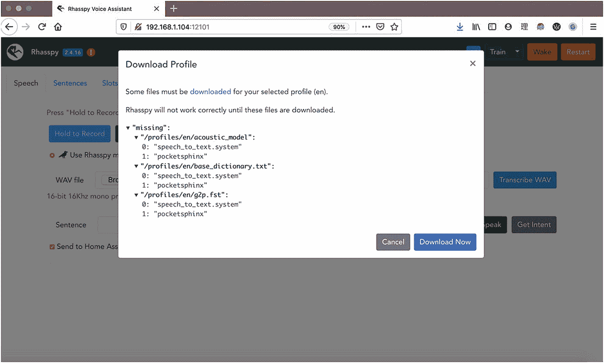

图 5-8

Rhasspy 控制台

首次启动时，控制台会非常明确地提示你应该去获取一些远程文件，因此，只要你的树莓派已连接到互联网，只需点击“立即下载”按钮即可。

该操作需要几分钟才能完成，所以请耐心等待。等待如图 5-9 所示的对话框出现。

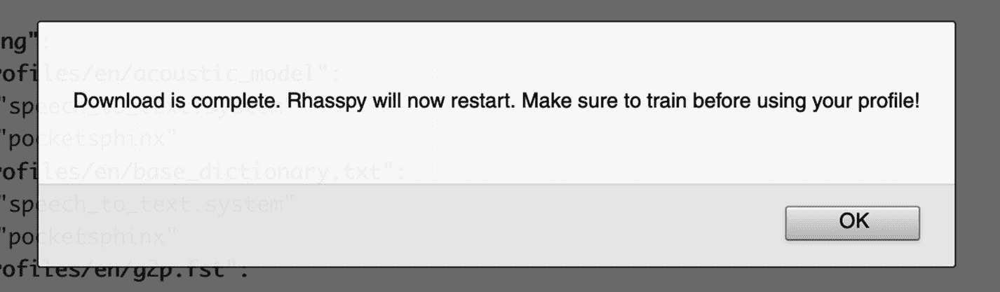

图 5-9

下载完成

控制台会自动刷新，现在我们看到的是图 5-10。

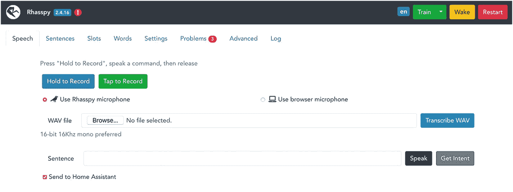

图 5-10

刷新后的 Rhasspy 控制台

但我们似乎仍然看到一些标记，提示我们缺少某些东西，如图 5-11 和图 5-12 所示。

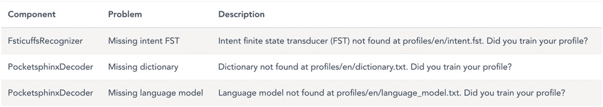

图 5-12

设置问题得到了很好的解释


图 5-11

红色标记

幸运的是，就目前而言，点击右上角的绿色“训练”按钮，我们的控制台就会变得闪亮且没有红色标记，如图 5-13 所示。我们现在可以开始使用 Rhasspy 控制台了。

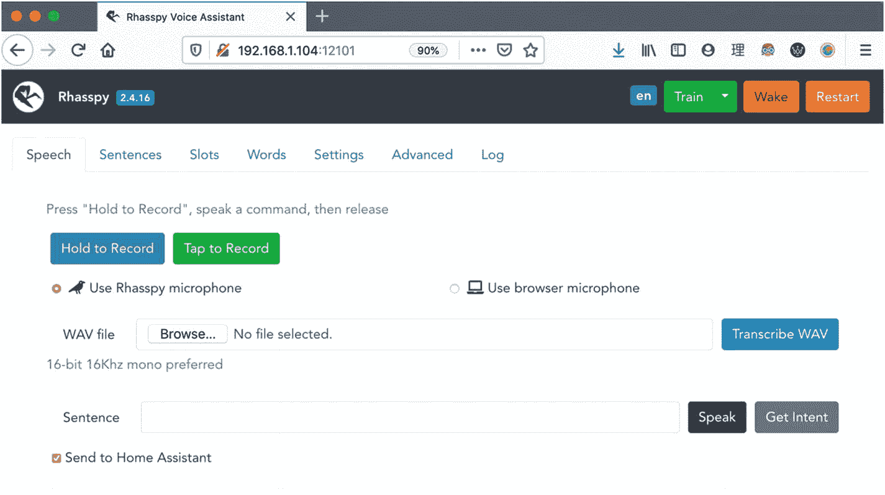

图 5-13

控制台已准备就绪！


### Rhasspy 控制台

让我们更详细地了解一下 Rhasspy 菜单。图 5-14 展示了用于配置家庭助手的各个部分。


**图 5-14** 更多配置选项

每个选项卡的用途在以下列表中说明：

- **语音：** 您可以在此处测试您的助手。
- **句子：** 您可以在此处定义您的语音助手能够检测和识别的内容。
- **槽位：** 句子中包含变量。每个变量的可能值可以在`句子`部分的一行中定义，或者您可以在`槽位`部分创建可能值的列表。
- **词汇：** 这是您定义单词发音的部分。这对于人名尤其有用，因为英语引擎有时对法语发音的准备不够充分！
- **设置：** 这是一个包罗万象的界面，您可以在此配置引擎的工作方式以及如何处理已识别的意图。
- **高级：** 这与`设置`相同，只是配置以文本文件形式呈现，可以直接在浏览器中编辑。
- **日志：** 这是可以实时查看引擎日志的地方。

几点说明……

浏览器 IDE（准确地说，是 Docker 容器内的进程）会在您每次更改配置设置时要求您重启 Rhasspy。

每当您对`句子`或`词汇`部分进行更改时，它还会要求您训练 Rhasspy。

除非您正在进行手术并需要立即向助手求助，否则没有理由不这样做。

我们现在知道如何操作控制台了，那么就让我们的语音助手为我们识别一些内容吧。

### 第一条语音命令

要创建一条能生成意图的语音命令，我们需要在`句子`部分进行一些编辑。正如刚才所解释的，`句子`部分是我们定义引擎可以识别的句子的地方。

#### 第一条命令，完整句子

这一次，用于定义意图的语法非常简单，并通过一个`.ini`文件（源自古老的 Windows 95 时代）插入。

模式如下：

```
[IntentName]
Sentence1
```

所以，如果是在周一早上，您真的需要咖啡，您可以这样写：

```
[Coffee]
I need coffee
```

让我们试试看。首先删除该`.ini`文件的内容，只添加上面那条咖啡意图，这样`句子`部分现在看起来就像图 5-15 所示。

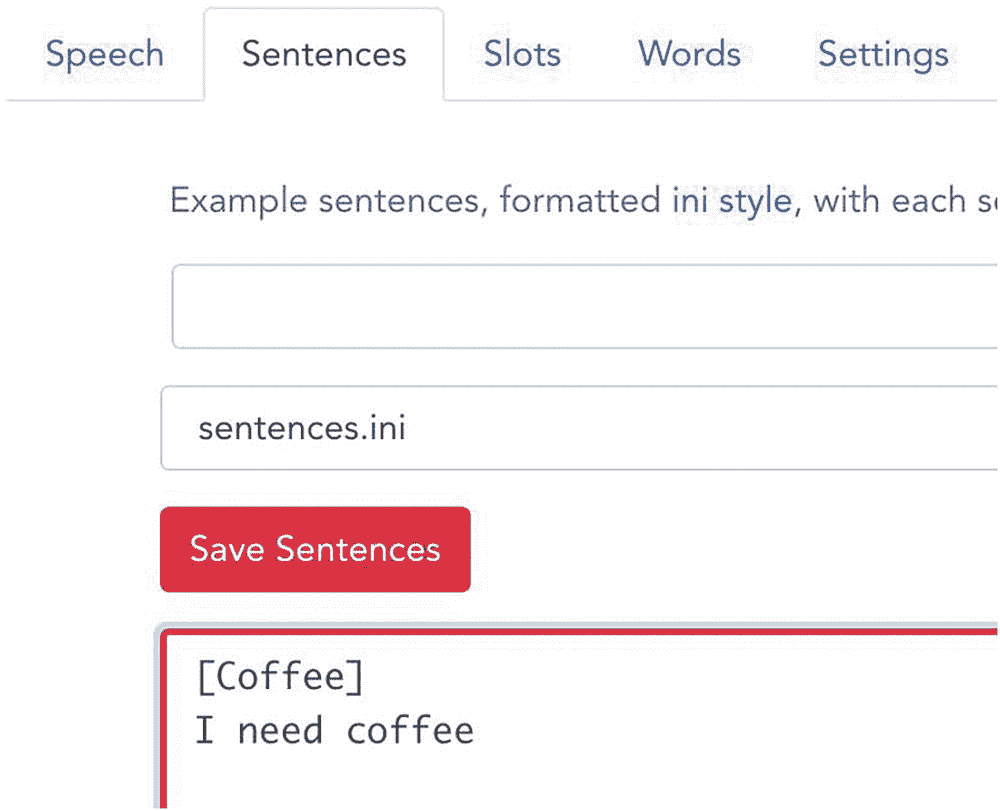

**图 5-15** 我真的需要咖啡

如果您点击醒目的`保存句子`按钮，您将看到图 5-16 所示的训练提醒。

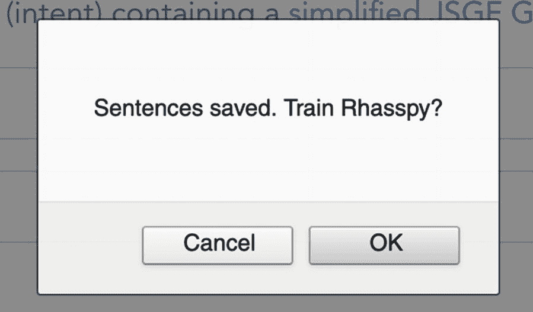

**图 5-16** 首次 Rhasspy 训练

#### 语音部分与测试您的意图

Rhasspy 引擎现已训练完毕，您可以前往`语音`部分进行测试，如图 5-17 所示。

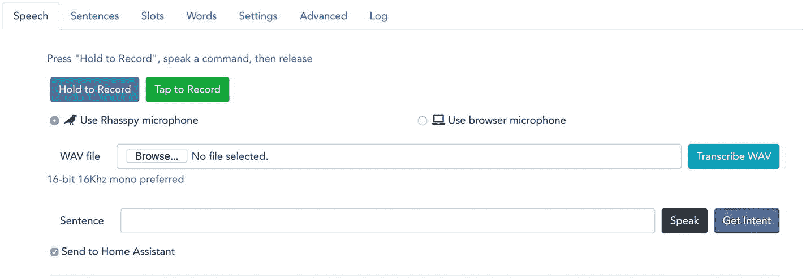

**图 5-17** 语音部分

`语音`部分是您可以说话或输入句子，并查看是否识别出意图以及识别出什么意图的地方。

假设我们在`句子`字段中输入“I need coffee”；引擎应该会识别并生成我们刚刚定义的“Coffee”响应，如图 5-18 所示。

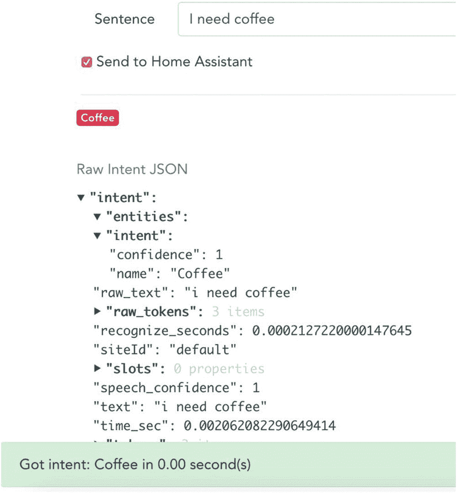

**图 5-18** 我……需要……咖啡

语音命令“Coffee”被识别，并附带一个生成的 JSON 文档，其中包含关于置信度和原始值的各种输入。

由于我们这里专注于语音命令，您也可以长按“按住录音”按钮，说“I need coffee”，然后观察所说的句子首先被转换为文本，显示在`句子`字段中，然后像刚才一样被分析。

现在可能是时候插入 ReSpeaker 或您的 USB 麦克风了。

如果您已经安装了 `eSpeak` ([`http://espeak.sourceforge.net/`](http://espeak.sourceforge.net/))（一个文本转语音的命令行工具），您也可以生成一个 WAV 文件并将其输入到 Rhasspy。

```
espeak "I need coffee" --stdout >> ineedcoffee.wav
```

上传该 `ineedcoffee.wav` 文件，然后点击`获取意图`按钮。

#### 微调意图

当然，也可以在`句子`部分定义的命令中轻松插入可选词、变量和占位符。让我们改进一下，为我们的意图添加细节，以创建更好的语音命令。

##### 可选词

当然，可以使句子中的单词成为可选项，以使命令对用户更自然。

在之前的咖啡示例中，您可以在意图中嵌入一个可选的紧迫性，比如您有时可能*真的*需要咖啡。这是通过将可选词放在方括号内来实现的，如下所示：

```
[Coffee]
I [really] need coffee
```

训练后，您可以在图 5-19 和图 5-20 中看到相同的 `Coffee` 意图是如何被 Rhasspy 正确识别的。

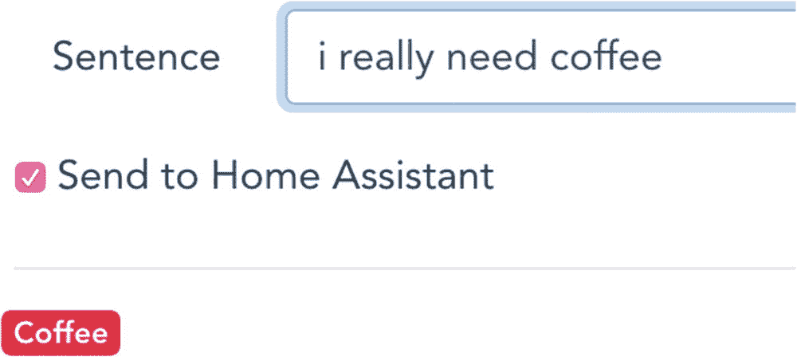

**图 5-20** 带有可选词（即 really）的咖啡意图

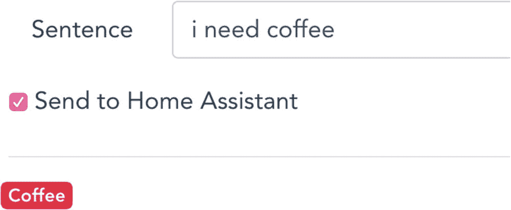

**图 5-19** 不带可选词的咖啡意图


### 添加备选方案

但当你某天自我感觉良好，并不需要那令人上瘾的黑色液体来唤醒自己时，又该如何处理呢？让我们重写咖啡意图，使其既能识别你需要咖啡的情况，也能识别你不需要咖啡的情况。

```
[Coffee]
I (need | don't need) coffee
```

训练并使用这个新意图后，你现在可以告诉你的咖啡助手你不需要咖啡了。回到“语音”选项卡，你会看到如图 5-21 所示的意图。

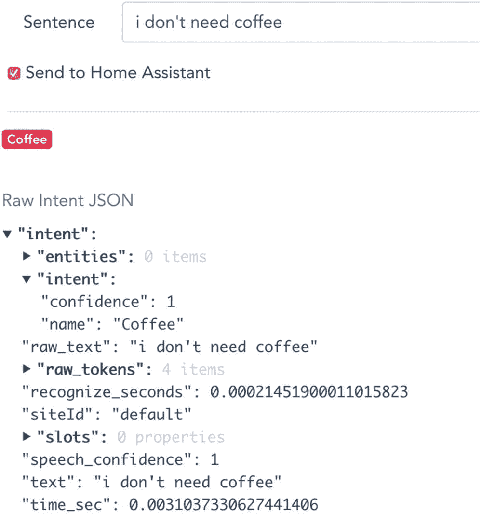

图 5-21

我不需要咖啡（不过，说实话，这不是真的）

你可能已经注意到这个生成的意图存在一个问题。是的，它目前用处不大，因为无论我们是否需要咖啡，生成的意图都是一样的。

我们当然可以解析接收到的字符串，或者编写两个不同的意图，但如果我们直接给这个可能性列表起个名字呢？这可以通过使用圆括号来实现，如下所示：

```
[Coffee]
I ((need | don't need) {need}) coffee
```

现在，我们的咖啡意图会在 JSON 文档中添加一个名为 `need` 的槽位，其值将是 `need` 或 `don't need`。

让我们再试一次；结果如图 5-22 所示。

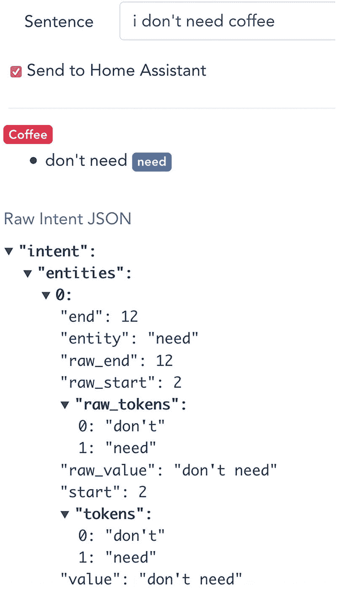

图 5-22

也许我不需要咖啡

你应该会注意到以下几点。首先，意图的摘要现在显示了更多细节，意图被标记为红色，每个槽位都清晰地列在一个列表中，并附有其关联值（此处为 `need = don't need`）。

其次，意图的完整 JSON 文档包含一个 `entities` 部分，每个实体都有一个实体名称和关联值。

顺便提一下，JSON 文档还包含一个 `slots` 部分，其中列出了该意图的所有槽位。

### 让带槽位的意图更具可读性

你可能已经注意到，如果添加了太多槽位，整个句子很快就会变得混乱不堪。

我们可以将槽位定义直接移到意图名称下方，并使用 `=` 来分配可能的值。

例如，同一个咖啡意图可以重写如下：

```
[Coffee]
need = ((need | don't need) {need})
I  coffee
```

没有任何改变，意图的行为与之前相同，但现在可读性大大提高了。

### 定义可复用的槽位

是的，内联定义槽位也给我们的句子定义带来了额外的复杂性，因此可以将它们移出，并在“槽位”选项卡上进行定义。

槽位在一个简单的 JSON 文件中定义，要将我们的咖啡需求移到“槽位”选项卡，你需要编写如下所示的 JSON 文件：

```
{
"need": [
"need",
"don't need"
]
}
```

这在浏览器中显示如图 5-23 所示。

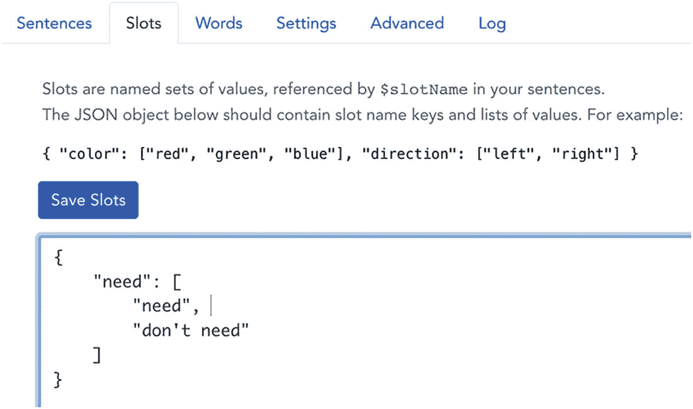

图 5-23

咖啡需求的槽位

要在句子文件中使用它，你现在需要编写意图，如下所示：

```
[Coffee]
myneed = $need {need}
I  coffee
```

以下是代码的分解说明：

- `myneed`：这是句子中的占位符，意味着其定义在训练时可以被视为内联的。
- `$need`：美元符号指定这来自槽位 JSON 文件。
- `{need}`：这是该意图中槽位的名称，意味着你可以在不同的意图中复用同一个列表，每次使用不同的槽位名称。

太好了。现在我们有了高度可配置的意图，手头有复杂的选项列表。

让我们进入下一节，了解当意图被识别时，外部系统如何利用生成的 JSON 文件。

## 设置：将意图放入队列

生成的 JSON 文件看起来很有用，但我们希望它位于 Rhasspy 外部，并放入 MQTT 队列中，以便进行更多处理。

让我们前往控制台的“设置”部分，如图 5-24 所示。

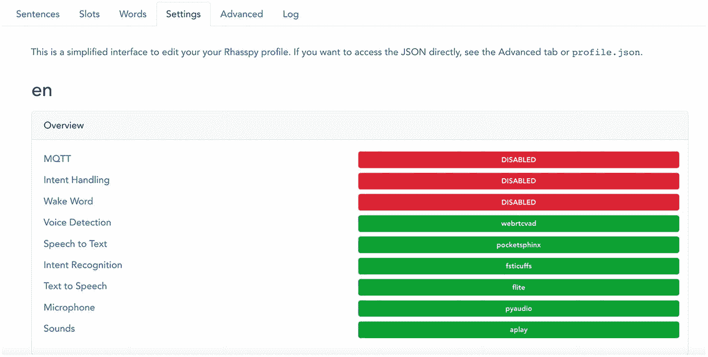

图 5-24

Rhasspy 设置部分

在这里，我们可以概览系统的配置方式。Rhasspy 有无数可配置的选项，但我们将重点关注以下内容：

- **MQTT**：将 JSON 发送到 MQTT 队列。
- **唤醒词**：后台进程始终在监听可能的“唤醒”关键词；这就是你的“嘿，Siri”或“嘿，Google”的监听器。

让我们先看看 MQTT 交互。如果你点击 MQTT 链接，将会跳转到相应的部分，你可以在其中输入正在运行的 MQTT 守护进程的详细信息，如图 5-25 所示。

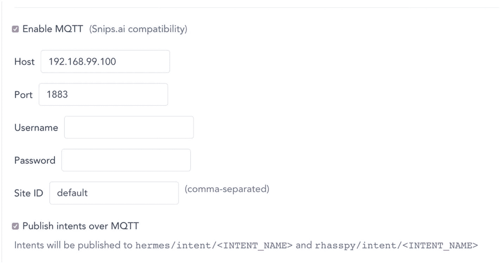

图 5-25

MQTT 设置

请确保在此处填写你的树莓派的主机名或 IP 地址。当系统提示时重启 Rhasspy，这样就完成了。现在让我们尝试在 MQTT 上获取一些咖啡。

回到“语音”选项卡，我们现在可以触发一个新的咖啡意图，如图 5-26 所示。

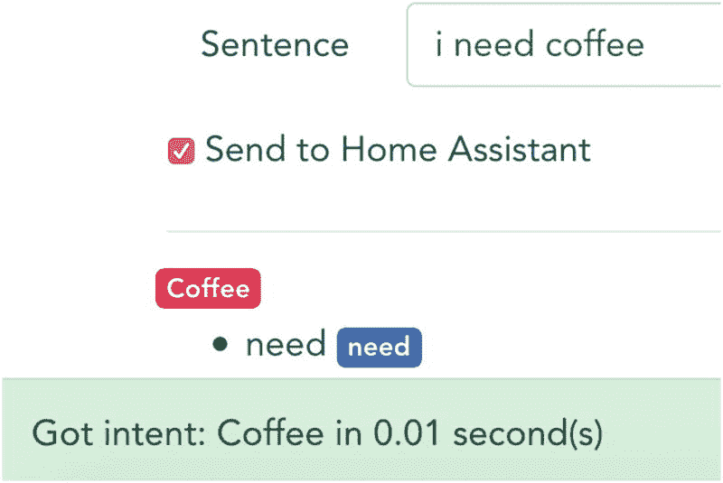

图 5-26

再来一杯咖啡？

现在让我们看看图 5-27 中的 MQTT Explorer 窗口。

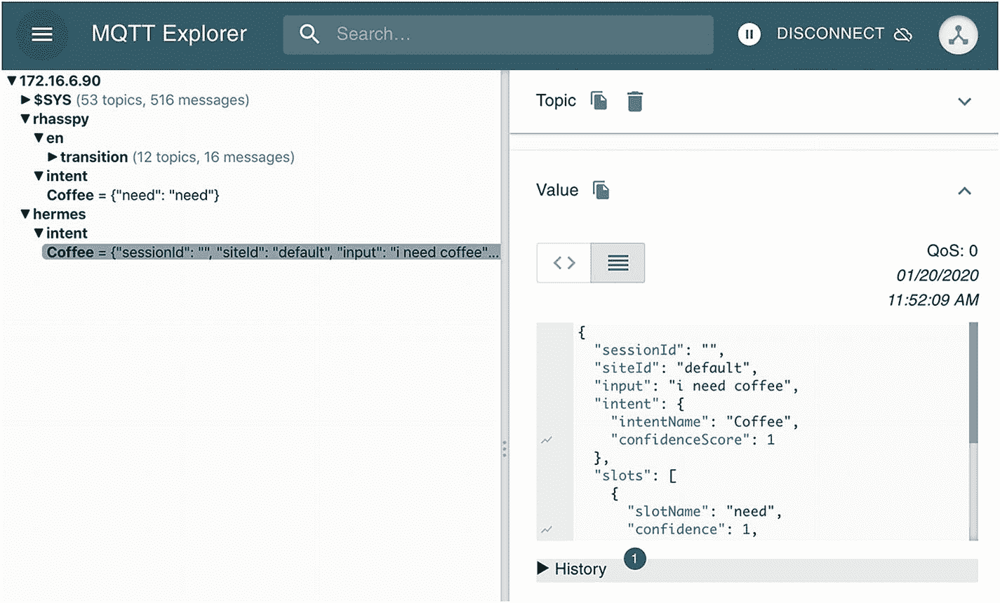

图 5-27

Rhasspy 和 MQTT

你看到了什么？我们看到一条消息被发送到 `hermes/intent/coffee` 主题，这与你在本章前面部分看到的内容类似。

是的，你也能感觉到——这将会奏效。

你还可以看到有一条简单的 MQTT 消息被发送到 `Rhasspy/intent/coffee`，消息体中只包含槽位的名称和值。如果你不需要处理置信度和其他细节，这是最佳选择。处理这条消息的任务留给你作为练习。

提示

这很简单。

你可以通过尝试发送几条指定你是否想要咖啡的消息来获得即时满足感；只要确保不要喝太多就行。

## 设置：唤醒词

时不时地回到语音交互是件好事，但如果能让树莓派独立运行，当说出某个或某组词语时，让 Rhasspy 开始监听意图，那就更好了。

这可以通过使用*唤醒词*来实现，唤醒词在“设置”部分定义。

我在配置中启用 Snowboy 工具包（[`https://snowboy.kitt.ai/`](https://snowboy.kitt.ai/)）时取得了一些成功，如图 5-28 所示。

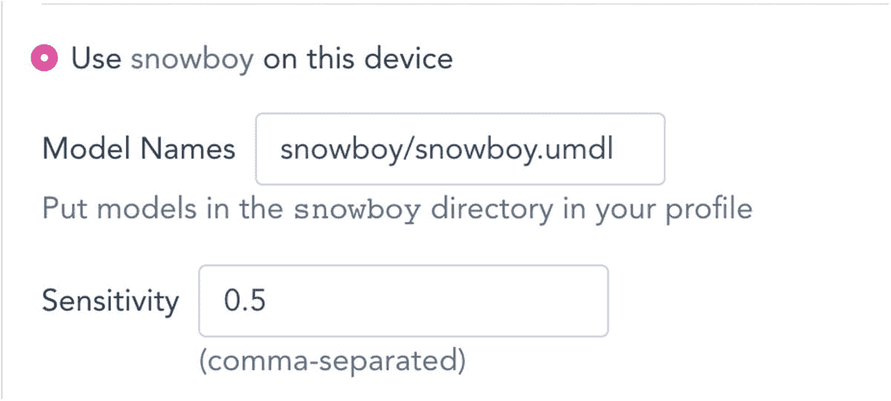

图 5-28

Snowboy 配置

当你启用 Snowboy 时，会有一个默认的 UMDL 文件下载到本地；它将在树莓派上的以下位置：

```
/home/pi/.config/rhasspy/profiles/en/snowboy/snowboy.umdl
```

你可以通过录制关键词并将音频文件上传到 Snowboy 网站来轻松创建自己的文件和关键词，详情如下：

```
http://docs.kitt.ai/snowboy/
```

现在，当你说“Snowboy”时，Rhasspy 就会唤醒，就像你按住了录音按钮一样。

所以，现在我们只需要说出以下内容：

- “Snowboy”
- “I need coffee”

我们快成功了，不是吗？


### 创建高亮意图

现在，我们需要创建一个小的意图，用于告诉主目标检测应用我们要关注哪个物体。

该意图将按照以下规则指定：

- **名称：** `highlight`
- **命令：** `show me only <something>`，其中 `<something>` 是 `cat` 或 `person`
- **槽位名称：** `only`

在继续阅读之前，你最好先自己尝试一下……

要放入句子文件中的意图代码如下：

```
[highlight]
object = (cats | person) {only}
show me only 
```

最好的测试方式当然是说出以下指令：

- “Snowboy”
- “Show me only cats”

这样意图 JSON 就会被发布到 `hermes/intent/highlight` 队列中，其内容如图 5-29 所示。

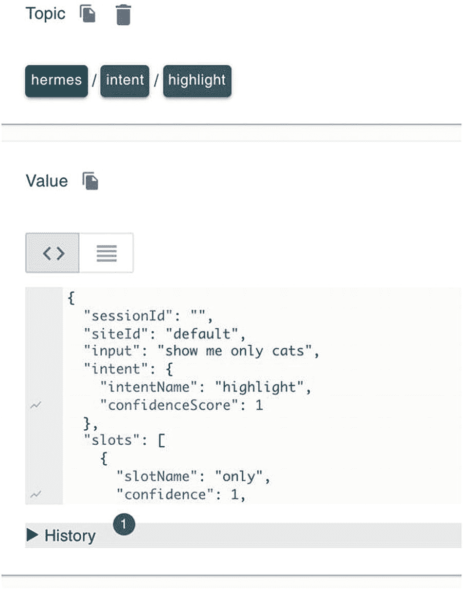

**图 5-29** 只显示猫，Snowboy

*好了*，Rhasspy 和语音命令部分基本完成，现在我们可以回到实时检测物体、猫和人的任务上了。

## 语音与实时目标检测

本章的这一部分将把前面章节的视频分析与使用 Rhasspy 的语音识别结合起来。

首先，让我们通过一个简单的 `origami` 项目设置做好准备，该项目会接收 Rhasspy 发送的消息。

### 简单设置：Origami + 语音

在本节中，我们将执行以下操作：

1.  在新线程中，以全屏模式启动主摄像头的视频流。
2.  视频流使用 `origami` 核心过滤器 `annotate`，你可以在画面上添加一些文字。
3.  在主线程上连接到 MQTT。
4.  收到新的意图消息时，更新 `annotate` 的文字。

这里使用的意图是之前定义的 `highlight` 意图，其槽位用于识别来自 COCO 数据集物体类别的名称。

清单 5-9 的其余部分应该很容易理解。

```
package practice;
import org.eclipse.paho.client.mqttv3.IMqttMessageListener;
import org.eclipse.paho.client.mqttv3.MqttClient;
import org.eclipse.paho.client.mqttv3.MqttMessage;
import org.json.JSONObject;
import origami.Camera;
import origami.Origami;
import origami.filters.Annotate;
public class Consumer {
public static void main(String... args) throws Exception {
Origami.init();
Annotate myText = new Annotate();
new Thread(() -> {
new Camera().device(0).filter(myText).fullscreen().run();
}).start();
MqttClient client = new MqttClient("tcp://localhost:1883", MqttClient.generateClientId());
client.connect();
client.subscribe("hermes/intent/#", new IMqttMessageListener() {
@Override
public void messageArrived(String topic, MqttMessage message) throws Exception {
String json = new String(message.getPayload(), "UTF-8");
JSONObject obj = new JSONObject(json);
JSONObject slot = ((JSONObject) obj.getJSONArray("slots").get(0)).getJSONObject("value");
String cats = slot.getString("value");
myText.setText(cats);
}
});
}
}
```

**清单 5-9** Origami + Rhasspy

如果一切正常，你说出“Show me only cats”，`annotate` 过滤器就会更新左上角的文字，如图 5-30 所示。


**图 5-30** 网络摄像头视频流

现在，让我们将这个设置与物体识别以及实时视频流部分连接起来。

### Origami 实时视频分析设置

从上一章你会记得，我们使用了一个名为 Yolo 的 `origami` 过滤器来执行目标检测。就像 `annotate` 过滤器一样，Yolo 过滤器包含在 `origami-filters` 库中，并且以非常 Java 的方式，你只需扩展基础过滤器即可高亮检测到的物体。

Yolo 过滤器可在 `origami-filter` 库中找到，它允许你使用网络规范按需下载和获取网络。例如，`networks.yolo:yolov3-tiny:1.0.0` 会根据你使用的设备下载 `yolov3-tiny` 并 `缓存` 以供后续使用。这是 `origami` 框架的一个特性。

对于 Yolo，以下网络规范可用于在 Coco 数据集上训练 Yolo 网络：

- `networks.yolo:yolov3-tiny:1.0.0`
- `networks.yolo:yolov3:1.0.0`
- `networks.yolo:yolov2:1.0.0`
- `networks.yolo:yolov2-tiny:1.0.0`

每个网络要么比前一个更快，要么更精确。

#### 创建 Yolo 过滤器

在清单 5-10 中，我们准备了基础工作，用于通过 `annotateWithTotal` 显示所有检测到的物体数量，或通过 `only` 开关仅显示特定物体。请注意，入口点在 `annotateAll` 函数中，该函数决定是显示所有边界框还是显示其中的子集。

清单 5-10 展示了 MyYolo 过滤器的代码。

```
package filters;
import org.opencv.core.Mat;
import org.opencv.core.Point;
import org.opencv.core.Rect;
import org.opencv.core.Scalar;
import org.opencv.imgproc.Imgproc;
import origami.filters.detect.Yolo;
import java.util.List;
public class MyYolo extends Yolo {
Scalar color = new Scalar(110.0D, 220.0D, 0.0D);
String only = null;
boolean annotateWithTotal = false;
public MyYolo(String spec) {
super(spec);
}
public MyYolo annotateWithTotal() {
this.annotateWithTotal = true;
return this;
}
public MyYolo annotateAll() {
this.annotateWithTotal = false;
return this;
}
public MyYolo only(String only) {
this.only = only;
return this;
}
public MyYolo color(Scalar color) {
this.color = color;
return this;
}
@Override
public void annotateAll(Mat frame, List results) {
if (only == null) {
if (annotateWithTotal)
annotateWithCount(frame, results.size());
else
super.annotateAll(frame, results);
} else {
if (!annotateWithTotal)
results.stream().filter(result -> result.get(1).equals(only)).forEach(r -> {
annotateOne(frame, (Rect) r.get(0), (String) r.get(1));
});
else
annotateWithCount(frame, (int) results.stream().filter(result -> result.get(1).equals(only)).count());
}
}
public void annotateWithCount(Mat frame, int count) {
Imgproc.putText(frame, (only == null ? "ALL" : only) + " (" + count + ")", new Point(50, 500), 1, 4.0D, color, 3);
}
public void annotateOne(Mat frame, Rect box, String label) {
if (only == null || only.equals(label)) {
Imgproc.putText(frame, label, new Point(box.x, box.y), 1, 3.0D, color, 3);
Imgproc.rectangle(frame, box, color, 2);
}
}
}
```

**清单 5-10** MyYolo 过滤器

过滤器准备就绪后，我们就可以再次开始进行分析了。


### 单独运行视频分析

在本节中，我们将通过在一个线程中启动摄像头，并在另一个线程中实时更新 `Yolo` 过滤器所显示对象的选择来播放视频。第二个主线程直接调用我们刚刚在上一节中定义的 `MyYolo` 过滤器的唯一函数。清单 5-11 展示了完整的代码。

```
package practice;
import origami.Camera;
import origami.Filter;
import origami.Filters;
import origami.Origami;
import origami.filters.FPS;
import filters.MyYolo;
public class YoloAgain {
public static void main(String[] args) {
Origami.init();
String video = "mei/597842788.852328.mp4";
//        Filter filter = new Filters(new MyYolo("networks.yolo:yolov3-tiny:1.0.0").only("car"), new FPS());
MyYolo yolo = new MyYolo("networks.yolo:yolov3-tiny:1.0.0"); //.only("person");
yolo.thresholds(0.4f, 1.0f);
yolo.annotateWithTotal();
Filter filter = new Filters(yolo, new FPS());
new Thread(() -> {
new Camera().device(video).filter(filter).run();
}).start();
new Thread(() -> {
try {
Thread.sleep(5000);
System.out.println("only cat");
yolo.only("cat");
Thread.sleep(5000);
System.out.println("only person");
yolo.only("person");
} catch (InterruptedException e) {
//e.printStackTrace();
}
}).start();
}
}
清单 5-11
在视频上运行 Yolo，实时更新参数
```

你现在大概能猜到我们接下来要做什么了：将来自 `Rhasspy` 的消息与 `Yolo` 分析的选择更新连接起来。

### 集成语音控制

在最后一节中，我们将根据从 `Rhasspy` 意图接收到的输入来高亮显示对象的子集。

要实现这一点，我们需要执行以下步骤：

1.  在一个新线程中，以全屏模式在主摄像头上启动视频流。
2.  视频流使用加载了 `Yolo` 网络的 `MyYolo` 过滤器。
3.  在主线程上连接到 `MQTT`。
4.  收到新消息时，更新注释文本。
5.  当消息到达高亮队列时，执行以下操作：
    *   解析 `JSON` 对象。
    *   提取 `only` 值。
    *   更新 `MyYolo` 过滤器的选择。

本书的最后一个代码片段展示了如何将所有内容整合在一起；请参见清单 5-12。

```
import filters.MyYolo;
import org.eclipse.paho.client.mqttv3.MqttClient;
import org.json.JSONObject;
import origami.Camera;
import origami.Origami;
import static java.nio.charset.StandardCharsets.*;
public class Chapter05 {
public static String whatObject(String json) {
JSONObject obj = new JSONObject(json);
JSONObject slot = ((JSONObject) obj.getJSONArray("slots").get(0)).getJSONObject("value");
String cats = slot.getString("value");
return cats;
}
public static void main(String... args) throws Exception {
Origami.init();
//        String video = "mei/597842788.852328.mp4";
String video = "mei/597842788.989592.mp4";
MyYolo yolo = new MyYolo("networks.yolo:yolov3-tiny:1.0.0");
yolo.thresholds(0.2f, 1.0f);
//        yolo.only("cat");
new Thread(() -> {
//            new Camera().device(0).filter(yolo).run();
new Camera().device(video).filter(yolo).run();
}).start();
MqttClient client = new MqttClient("tcp://localhost:1883", MqttClient.generateClientId());
client.connect();
client.subscribe("hermes/intent/hellonico:highlight", (topic, message) -> {
yolo.only(whatObject(new String(message.getPayload(), "UTF-8")));
});
}
}
清单 5-12
实时检测，与 Rhasspy 队列集成
```

在不同的示例视频中，或者直接在树莓派摄像头的视频流中，你可以直接更新要检测的对象。

在最后一个示例中，我们本可以寻找猫，但恰巧我的女儿 Mei 给我发来了她在学校以及晚上和朋友外出的视频。图 5-31 和图 5-32 展示了她在活动时被我们的 `YOLO` 设置高亮标记的情况。

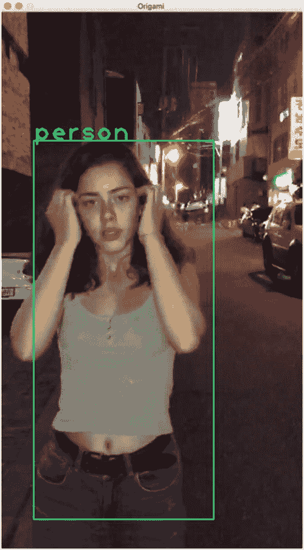

图 5-32：Mei 在夜晚


图 5-31：Mei 在学校

在本章中，你学习了以下内容：

- `Rhasspy` 消息流
- 如何从 Java 与 `MQTT` 交互以实现物联网消息传递
- 如何设置 `Rhasspy` 和意图
- 如何将 `Rhasspy` 发送的消息连接到我们的 Java 代码
- 如何通过解释带有自定义意图的 `Rhasspy` 语音，来更新树莓派上运行的实时视频分析

这本简短的书到此就结束了，现在轮到你去改变世界了。我们仅仅触及了可能性的表面，但我真心希望这能给你带来一些尝试实现的想法。


# 索引

## A, B

- 自动语音识别（ASR）

## C

- Canny 滤波器
- 卡通滤波器
- 级联分类器
  - 调试会话
  - `detectMultiScale` 参数
  - Python 代码步骤
  - 技术
- 核心 Java 应用程序
  - 日期对象代码
  - 类导入
  - 导入选项
  - Java（参见 Java 应用程序）
  - 灯泡输出
  - 执行
  - 正确的类选择

## D

- 调试
  - 断点
  - 代码执行
  - 调试模式
  - 展开的变量
  - main 方法变量
  - 定义布局选项
  - 恢复执行
  - 变量值的使用
  - 监视表达式定义
  - 函数
  - 不可思议的循环
  - 源代码
  - Visual Studio Code

## E

- 边缘保持滤波器

## F

- 滤波器
  - Canny 效果
  - Clojure 语言组合灰度滤波器
  - 调试
  - 边缘保持函数
  - 每秒帧率
  - 灰度
  - Instagram（参见 Instagram）
  - 接口
  - Java 类型
  - 非反转 Canny 滤波器
  - 管道概念
  - 源代码

## G

- 灰度滤波器

## H

- Haar 特征类型
- Thresh 滤波器

## I

- Instagram
  - 卡通效果
  - 颜色映射函数
  - 铅笔效果
  - 深褐色效果
  - Thresh

## J, K

- Java 应用程序
  - 自动补全
  - 代码调试链接
  - 编辑器菜单
  - `git clone`
  - 内联文档
  - JDK 代码
  - OpenCV（参见 OpenCV 概念）
  - OpenCV/Java 项目模板
  - OpenJDK 代码
  - 运行按钮
  - 源代码
  - zip 文件

## L

- Linux 服务器/云虚拟机

## M

- 消息队列遥测传输（MQTT）
  - 代理
  - 命令行浏览器
  - `mosquitto_pub` 命令
  - 树莓派 SNIPs 消息
  - Java/Visual Studio Code 设置
  - 依赖项部分
  - Hello 消息
  - JSON 解析
  - 消息/订阅代码
  - Rhasspy 消息源代码
  - Mosquitto

## N

- 神经网络（Yolo）检测系统
  - 输入图像
  - 神经元密集的大脑
  - 后处理步骤
  - 源代码
  - Yolo 步骤
- 非极大值抑制（NMS）

## O

- 目标检测
  - 轮廓
  - Haar
  - OpenCV（参见 OpenCV 概念）
  - 模式匹配
  - 红/绿/蓝（RGB）颜色
  - 移除背景
  - 审查选项
  - 模板匹配
  - 透明度层
  - 语音识别
  - Yolo/Darknet 优势
  - 类和构造函数
  - 概念
  - 图像检测
  - 神经网络代码
- OpenCV
  - OpenCV 概念
  - 添加图片
  - 常见类型
  - `Core.transform` 函数
  - 调试错误消息
  - 图像分类
  - 级联分类器特征
  - 神经网络 Yolo 训练阶段
  - `imread` 函数
  - 内联文档
  - 输入图像
  - 输出图像
  - 输出窗口
  - 项目布局
  - 海蓝色
  - 源代码
  - `System.loadLibrary`
  - 模板内容
  - 加权版本
  - zip 文件

## P, Q

- 铅笔滤波器

## R

- 树莓派 4
  - 可启动 SD 卡
  - 刷写镜像文件选择
  - 消息窗口
  - 微型 SD 卡验证
  - zip 文件
  - 启动过程
  - SSH 服务器
  - 欢迎屏幕
  - WiFi 设置
  - 线缆连接
  - 设计对象
  - Linux 服务器/云虚拟机
  - `nmap`
  - 操作系统
  - 购物清单
  - 电源适配器和网络摄像头
  - 屏幕
  - SSH 连接设置
  - `DISPLAY` 变量
  - 远程应用程序
  - 远程机器源代码
  - Torrent/zip 文件
  - 视频实时捕获
  - Visual Studio（参见 Visual Studio Code）
- 读取-求值-打印-循环（REPL）
- Rhasspy
  - 控制台按钮
  - 配置选项
  - 控制台选项
  - 操作问题
  - 设置红色标记
  - 刷新按钮
  - 截图使用
  - 标签页
  - 免费/开源消息流
  - MQTT（参见消息队列遥测传输（MQTT））
  - 队列选项
  - 可配置选项
  - 浏览器窗口
  - MQTT 交互设置部分
  - 语音标签页
  - 语音命令
  - 命令和句子意图创建
  - 意图变量
  - 可选词
  - 可复用槽位定义
  - Snowboy 配置
  - 语音部分
  - 语音标签页
  - 唤醒词
  - 语音平台 Docker
  - 网站安装过程
  - 扬声器
  - 天气服务

## S

- 安全外壳（SSH）
  - 连接设置
  - `DISPLAY` 变量
  - 远程应用程序
  - 远程机器源代码
- 深褐色效果滤波器

## T, U

- 透明度层

## V, W, X

- 视频流（参见目标检测）
  - 构建块
  - 播放视频文件
  - 远程模式源代码
  - 带帧循环的变量
  - 无帧率
- Visual Studio Code
  - 连接描述
  - 下载按钮
  - Java 调试选项
  - 编辑器窗口
  - 扩展包
  - `git clone`
  - Java/OpenCV 项目模板
  - JDK OpenJDK
  - 运行和调试按钮
  - zip 文件 Java 下载链接
  - 市场
  - Maven 代码菜单选项
  - OpenJDK 版本
  - Oracle Java 下载页面
  - 插件
  - 项目文件
  - 远程 SSH 设置
  - 运行按钮（OpenCV）
  - 搜索栏
  - SSH 主机设置
  - 堆栈选项
  - 终端标签页
  - 欢迎屏幕
- 语音助手服务
- 语音识别
  - 分析设置
  - Coco 数据集集成
  - 折纸+语音视频
  - 更新和参数
  - 网络摄像头流
  - Yolo 滤波器创建

## Y, Z

- Yolo/Darknet
  - 优势
  - 类和构造函数
  - 概念
  - 图像检测
  - 神经网络代码
  - OpenCV
