# 强化学习基础

Abhishek Nandy¹ 和 Manisha Biswas²  
(1) 印度西孟加拉邦加尔各答 Swaranika Co-Opt HSG 大楼 HIG L-2/4 室  
(2) 印度西孟加拉邦北 24 区

本章是对强化学习的简要介绍，并包含与之相关的一些关键概念。在本章中，我们将强化学习作为一个核心概念进行讨论，并对其进行进一步定义。我们展示了强化学习的完整工作流程，并精确阐述了强化学习在人工智能中的定位。之后，我们定义了与强化学习相关的关键术语。我们从智能体开始，然后涉及环境，最后讨论智能体与环境之间的联系。

## 什么是强化学习？

我们使用机器学习来持续提升机器或程序随时间推移的性能。实现随时间推移提升机器性能的简化方法就是使用强化学习。强化学习是一种方法，通过该方法，被称为智能体的智能程序能够在已知或未知的环境中，基于评分机制不断适应和学习。反馈可能是正向的（称为奖励），也可能是负向的（称为惩罚）。结合智能体与环境的交互，我们随后决定采取何种行动。简而言之，强化学习基于奖励和惩罚。

关于强化学习的一些要点：

-   它不同于普通的机器学习，因为我们不关注训练数据集。
-   交互并非与数据发生，而是与环境发生，通过环境我们模拟现实世界的场景。
-   由于强化学习基于环境，因此涉及许多参数。它需要大量信息来学习并做出相应行动。
-   强化学习中的环境是现实世界的场景，可能是 2D 或 3D 模拟世界，也可能是基于游戏的场景。
-   从某种意义上说，强化学习范围更广，因为环境规模可能很大，并且可能与之关联许多因素。
-   强化学习的目标是达成一个目标。
-   强化学习中的奖励来自环境。

图 1-1 借助一个机器人展示了强化学习的循环过程。

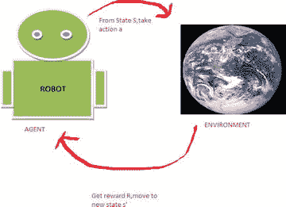

图 1-1. 强化学习循环

迷宫是一个可以使用强化学习来研究的绝佳示例，目的是确定完成迷宫所需的精确正确移动（见图 1-2）。

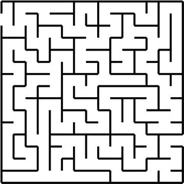

图 1-2. 强化学习可应用于迷宫

在图 1-3 中，我们正在应用强化学习，并将其称为强化学习盒子，因为在其范围内，强化学习的过程得以运作。强化学习始于一个被称为智能体的智能程序，当它们与环境交互时，会关联奖励和惩罚。环境对于智能体而言可以是已知的或未知的。智能体采取行动移动到下一个状态，以最大化奖励。

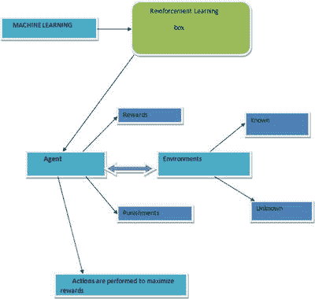

图 1-3. 强化学习流程

在迷宫中，核心概念是持续移动。目标是尽快走出迷宫并到达终点。以下关于强化学习的概念和工作场景将在本章后面讨论。

-   智能体是智能程序
-   环境是迷宫
-   状态是智能体在迷宫中所处的位置
-   行动是我们为了移动到下一个状态所采取的移动
-   奖励是与到达特定状态相关的分数。它可以是正的、负的或零

我们使用迷宫示例来应用强化学习的概念。我们将描述以下步骤：

1.  迷宫的概念被提供给智能体。
2.  有一个与智能体相关联的任务，并对其应用强化学习。
3.  智能体每从一个状态移动到另一个状态，就会收到一次强化。
4.  当智能体从一个状态移动到另一个状态时，存在一个奖励系统。

奖励预测是迭代进行的，我们根据最佳后续状态的值和获得的即时奖励来更新迷宫中每个状态的值。这被称为更新规则。强化学习过程的持续运动基于决策制定。强化学习基于试错原则运作，因为当处于某个状态时，很难预测应采取哪个行动。从迷宫问题本身可以看出，为了获得下一步的最优路径，必须权衡许多因素。它始终基于状态、行动和奖励。对于迷宫，我们必须计算并考虑采取步骤的概率。迷宫也不考虑前一步的奖励；它专门考虑移动到下一个状态。这个概念适用于所有强化学习过程。

以下是此过程的步骤：

1.  我们有一个问题。
2.  我们必须应用强化学习。
3.  我们将应用强化学习视为一个强化学习盒子。
4.  强化学习盒子包含应用强化学习过程所需的所有基本组件。
5.  强化学习盒子包含智能体、环境、奖励、惩罚和行动。

强化学习与智能程序智能体配合良好，这些智能体在与环境交互时给予奖励和惩罚。交互发生在智能体与环境之间，如图 1-4 所示。

图 1-4. 智能体与环境之间的交互

从图 1-4 可以看出，智能体与其环境之间存在直接交互。这种交互非常重要，因为通过这些交换，智能体适应了环境。当机器学习程序、机器人或强化学习程序开始工作时，智能体暴露于已知或未知的环境中，强化学习技术允许智能体根据环境的特征进行交互和适应。相应地，智能体工作，强化学习机器人进行学习。为了达到期望的位置，我们分配奖励和惩罚。现在，程序必须围绕最优路径工作，以在失败时（即受到惩罚或获得负分）获得最大奖励。为了到达一个新位置（也称为状态），它必须执行我们称之为行动的操作。为了执行行动，我们实现一个函数，也称为策略。因此，策略是一个执行某些工作的函数。

## 强化学习的多面性

正如你在图 1-5 的维恩图中看到的，强化学习处于许多不同科学领域的交叉点。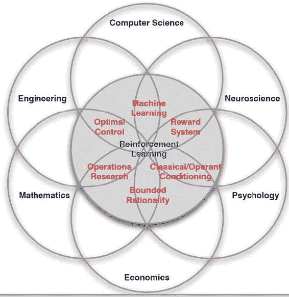 图 1-5. 强化学习的各个侧面 这些交叉点揭示了强化学习的一个非常强大的特性——它展示了决策的科学性。如果我们有两条路径，并且需要决定走哪条路径才能达到某个目标，那么就可以设计一个科学的决策过程。强化学习是最优决策的基础科学。如果我们关注图 1-5 中维恩图的计算机科学部分，我们会发现，如果我们想要学习，它就属于机器学习的范畴，而机器学习又具体映射到强化学习。强化学习可以应用于许多不同的科学领域。在工程学中，我们有主要关注最优控制的设备。在神经科学中，我们关心大脑作为决策刺激物是如何工作的，并研究作用于大脑的奖励系统（多巴胺系统）。心理学家可以应用强化学习来确定动物如何做出决策。在数学中，我们有大量将强化学习应用于运筹学的数据。

## 强化学习的流程

图 1-6 连接了智能体和环境。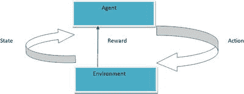 图 1-6. 强化学习结构 交互从一个状态到另一个状态发生。确切的连接始于智能体和环境之间。奖励是定期发生的。我们采取适当的行动从一个状态移动到另一个状态。在详细了解细节后，需要考虑的关键点如下：

- 强化学习循环以相互连接的方式工作。
- 智能体和环境之间存在明确的通信。
- 这种明确的通信是围绕奖励进行的。
- 对象或机器人从一个状态移动到另一个状态。
- 采取行动以从一个状态移动到另一个状态。

图 1-7 简化了交互过程。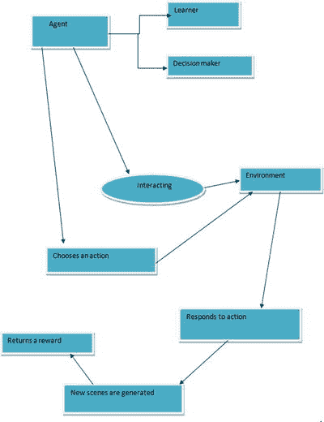 图 1-7. 整个交互过程 智能体总是在学习，并最终做出决策。智能体是一个学习者，这意味着可能存在不同的路径。当智能体开始训练时，它开始适应并智能地从其周围环境中学习。智能体也是一个决策者，因为它试图采取能够获得最大奖励的行动。当智能体开始与环境交互时，它可以选择一个行动并做出相应的响应。从那时起，新的场景就被创建出来。当智能体在环境中从一个地方移动到另一个地方时，每一次变化都会导致某种形式的修改。这些变化被描述为场景。每一步发生的状态转换有助于智能体更有效地解决强化学习问题。让我们看看状态转换的另一个场景，如图 1-8 和 1-9 所示。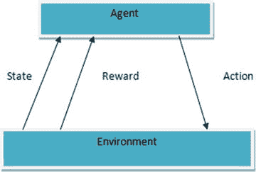 图 1-8. 状态变化场景 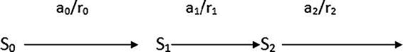 图 1-9. 状态转换过程 学会选择能够最大化以下值的行动：`r0 + γr1 + γ²r2 + ...`，其中 `0 < γ < 1`。在每次状态转换时，奖励都是一个不同的值，因此我们用每一步中变化的值来描述奖励，例如 `r0`、`r1`、`r2` 等。伽马（`γ`）被称为折扣因子，它决定了我们获得什么样的未来奖励类型：

- 伽马值为 0 意味着奖励仅与当前状态相关。
- 伽马值为 1 意味着奖励是长期的。

## 强化学习中的不同术语

现在我们介绍一些与强化学习相关的常见术语。在这种情况下，有两个常数很重要——伽马（`γ`）和兰布达（`λ`），如图 1-10 所示。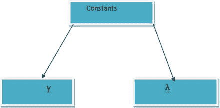 图 1-10. 显示常数值 伽马在强化学习问题中很常见，但兰布达通常用于时序差分问题。

### 伽马

伽马用于每次状态转换，并且在每次状态变化时是一个常数值。伽马允许你提供关于在每个状态下你将获得何种奖励的信息。通常，这些值决定了我们是只寻找每个状态下的奖励值（在这种情况下，值为 0），还是寻找长期奖励值（在这种情况下，值为 1）。

### 兰布达

兰布达通常在我们处理时序差分问题时使用。它更多地涉及连续状态下的预测。在每个状态下增加兰布达的值表明我们的算法学习速度很快。在使用强化学习技术时，更快的算法能产生更好的结果。正如你稍后将学到的，时序差分可以推广到我们称之为 `TD(Lambda)` 的方法。我们稍后会更深入地讨论它。

## 与强化学习的交互

现在让我们谈谈强化学习及其交互。如图 1-11 所示，智能体和环境之间的交互伴随着奖励发生。我们需要采取行动从一个状态移动到另一个状态。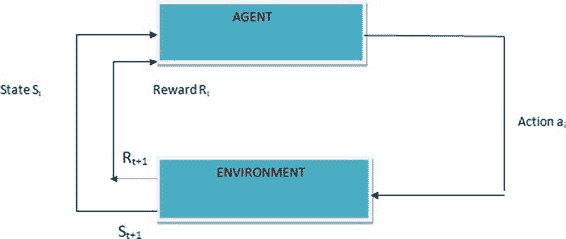 图 1-11. 强化学习交互 强化学习是一种实现如何将情境映射到行动，以便最大化并找到获得最高奖励的方法。与其他形式的机器学习不同，机器或机器人不会被告诉要采取哪些行动，而是必须通过尝试来发现哪些行动能产生最大奖励。在最有趣和最具挑战性的情况下，行动不仅影响即时奖励，还影响下一个情境以及所有后续奖励。

### 强化学习的特点

接下来我们讨论特点。这些特点通常是指智能体为了进入下一个状态所做的事情。智能体会考虑哪种方法最适合进行下一步行动。这两个特点是：

- 试错搜索。
- 延迟奖励。

你可能已经了解到，强化学习基于三个要素的组合：`(S, A, R)`，其中 `S` 代表状态，`A` 代表行动，`R` 代表奖励。如果你处于状态 `S`，你执行行动 `A`，以便在时间帧 `t+1` 获得奖励 `R`。现在，最重要的部分是你移动到下一个状态时。在这种情况下，我们不使用刚刚获得的奖励来决定下一步移动到哪里。每次转换都有一个独特的奖励，并且不使用任何先前状态的奖励来确定下一步行动。参见图 1-12。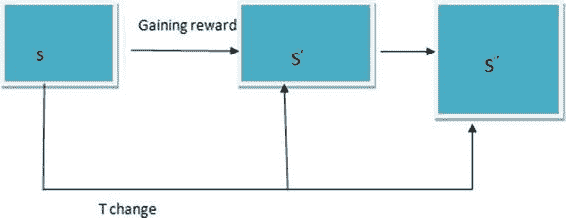 图 1-12. 随时间变化的状态 `T` 变化（时间帧）在强化学习方面很重要。我们所做的每一次发生，总是我们在状态、行动和奖励方面所执行内容的组合。参见图 1-13。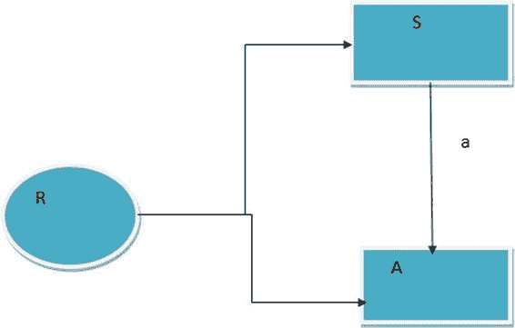 图 1-13. 表示状态转换的另一种方式

### 奖励如何运作

奖励是当我们从一个状态转换到另一个状态时收到的某种激励因素。它可以是分数，就像在视频游戏中一样。我们训练得越多，就越准确，获得的奖励也就越大。

#### 智能体

在强化学习中，智能体是做出智能决策的软件程序。智能体应能感知环境中正在发生的事情。以下是智能体的基本步骤：

1. 当智能体能够感知环境时，它可以做出更好的决策。
2. 智能体做出的决策会引发一个动作。
3. 智能体执行的动作必须是最优的、最佳的。

软件智能体可以是自主的，也可以与其他智能体或人类协作。图 1-14 展示了智能体的工作方式。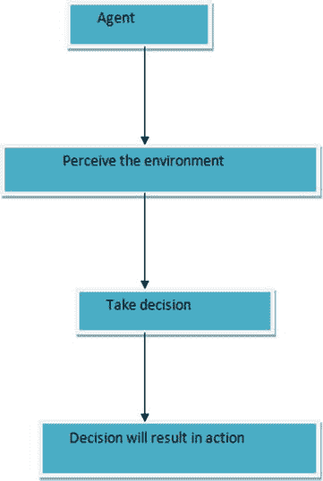 图 1-14. 环境流程

#### 强化学习环境

强化学习领域的环境由某些因素构成，这些因素决定了其对强化学习智能体的影响。智能体必须相应地适应环境。这些环境可以是二维世界、网格，甚至是三维世界。以下是环境的一些重要特征：

- 确定性
- 可观测性
- 离散或连续
- 单智能体或多智能体

##### 确定性

如果我们能够推断并预测未来某个场景会发生什么，我们就说该场景是确定性的。对于强化学习问题而言，确定性更容易处理，因为我们不依赖决策过程来改变状态。当我们从一个状态转移到另一个状态时，状态转换会产生即时效应。这使得强化学习问题变得更容易。在处理强化学习时，我们得到的状态模型要么是确定性的，要么是非确定性的。这意味着我们需要理解 DFA 和 NDFA 背后的工作机制。

###### DFA（确定性有限自动机）

DFA 经历有限数量的步骤。对于一个状态，它只能执行一个动作。见图 1-15。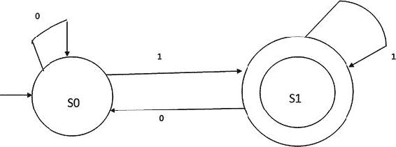 图 1-15. 展示 DFA 我们通过图表展示从起始状态到最终状态的状态转换。这是一个简单的描述，我们可以说，在假设输入值为 1 和 0 的情况下，状态转换发生。当接收到某个值并停留在同一状态时，就会产生自循环。

###### NDFA（非确定性有限自动机）

如果我们处于一个不知道机器会进入哪个确切状态的场景中，这就是 NDFA 的情况。见图 1-16。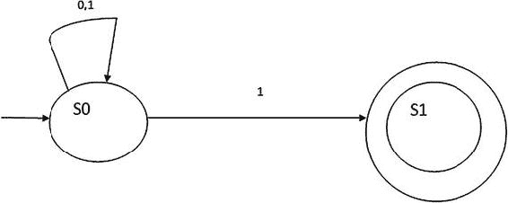 图 1-16. NDFA 图 1-16 中状态图的工作原理可以解释如下。在 NDFA 中，问题在于当我们从一个状态转换到另一个状态时，有多个选项可用，如图 1-16 所示。从状态 S0 开始，在接收到诸如 0 这样的输入后，它可以停留在状态 S0，也可以转移到状态 S1。这里涉及决策过程，因此很难知道该采取哪个动作。

##### 可观测性

如果我们能说周围的环境是完全可观测的，那么我们就拥有了实施强化学习的理想场景。完全可观测性的一个例子是国际象棋游戏。部分可观测性的一个例子是扑克游戏，其中某些牌对任何一位玩家都是未知的。

##### 离散或连续

如果转移到下一个状态有多个选择，那就是连续场景。当选择数量有限时，则称为离散场景。

##### 单智能体与多智能体环境

强化学习中的解决方案可以是单智能体类型或多智能体类型。首先，我们来看多智能体强化学习。在处理复杂问题时，我们使用多智能体强化学习。复杂问题可能涉及不同的环境，智能体在其中执行不同的任务以参与强化学习，并且智能体也想要进行交互。这给确定状态转换带来了不同的复杂性。多智能体解决方案基于非确定性方法。它们是非确定性的，因为当多智能体交互时，可能有不止一个选项来改变或转移到下一个状态，我们必须基于这种模糊性做出决策。在多智能体解决方案中，不同环境之间的智能体交互是巨大的。之所以巨大，是因为与环境相关的活动量非常大。这是因为环境可能是不同类型的，并且多智能体在每个状态转换中可能有不同的任务要执行。单智能体与多智能体解决方案的区别如下：

- 单智能体场景涉及智能软件，其交互仅在一个环境中发生。如果同时存在另一个环境，它无法与第一个环境交互。
- 当强化学习中存在一定程度的收敛时。收敛是指智能体需要在不同环境中更频繁地交互以做出决策。这种情况由多智能体处理，因为单智能体无法处理收敛。单智能体无法处理收敛，因为它连接到其他环境时，可能涉及需要同时决策的不同场景。
- 与单智能体相比，多智能体具有动态环境。动态环境可能涉及交互场所的环境变化。

图 1-17 展示了单智能体场景。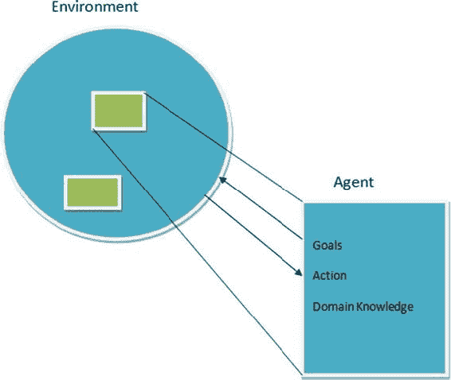 图 1-17. 单智能体 图 1-18 展示了多智能体的工作方式。两个智能体之间进行交互以做出决策。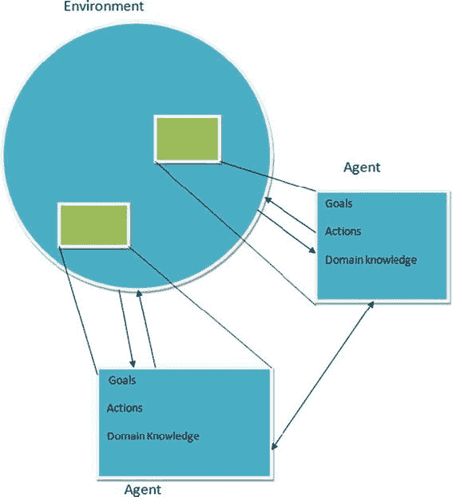 图 1-18. 多智能体场景

## 结论

本章涉及了强化学习的基础知识，并涵盖了一些关键概念。我们讨论了状态和环境，以及强化学习的结构是怎样的。我们还涉及了不同类型的交互，并了解了单智能体和多智能体解决方案。下一章将介绍算法，并讨论强化学习的构建模块。© Abhishek Nandy and Manisha Biswas 2018 Abhishek Nandy and Manisha Biswas《强化学习》`doi.org/10.1007/978-1-4842-3285-9_2`

