# 2. 强化学习理论与算法

Abhishek Nandy^(1 ) 和 Manisha Biswas² (1) 印度西孟加拉邦加尔各答 Swaranika Co-Opt HSG 大楼 HIG L-2/4 室 (2) 印度西孟加拉邦北 24 帕尔加纳区

本章介绍强化学习的工作原理，并解释其背后的概念，包括构成强化学习基础的不同算法。本章将解释这些算法，但首先，你将了解为什么强化学习可能很困难，并看到一些不同的场景。本章还涵盖了强化学习可以实施的不同方式。在此过程中，本章将阐述马尔可夫决策过程（MDP）并对其进行描述。本章还涵盖了 SARSA 并涉及时间差分。然后，本章涉及 Q 学习和动态规划。


## 强化学习的理论基础

本节将探讨强化学习的理论基础。图 2-1 展示了你将如何实现稍后描述的 `MDP`。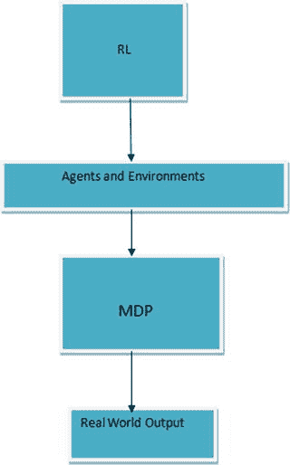 图 2-1. `MDP` 的理论基础 强化学习中的环境由马尔可夫决策过程（本章稍后讨论）表示。

- `SS` 是一个有限的状态集合。`AA` 是一个有限的动作集合。
- `T:S×A×S→[0,1]` 是一个转移模型，它将 `(状态, 动作, 状态)` 三元组映射为概率。
- `T(s,a,s')` 表示如果你处于状态 `s` 并执行了动作 `a`，那么你将进入状态 `s'` 的概率。

用条件概率来表示，即：`T(s,a,s') = P(s'|s,a)`。`R:S×S→R` 是一个奖励函数，它返回一个实数，表示环境因状态转移而给予的奖励（或惩罚）量。`R(s,s')` 是从状态 `s` 转移到状态 `s'` 后获得的奖励。如果转移模型对智能体是已知的，即智能体知道它从当前位置可能去往何处，那么智能体就很容易知道如何行动，才能在与环境交互的经验中最大化其期望效用。我们可以将智能体的期望效用定义为其在与环境交互的整个过程中获得的累积奖励。如果智能体经历了状态序列 `s0, s1, …, sn-1, sn`，那么可以将其期望效用正式定义为：`∑_{t=1}^{n} γ^t E[R(s_{t-1}, s_t)]`，其中 `γ` 是一个折扣因子，用于降低过去奖励的价值（从而降低其重要性），而 `E` 是[期望值](https://en.wikipedia.org/wiki/Expected_value#_blank)。当智能体对转移背后的概率模型一无所知时，问题就出现了，而这正是强化学习发挥作用的地方。现在可以将强化学习问题正式定义为：学习一组参数以最大化期望效用的问题。强化学习有两种类型：

- **基于模型**：智能体尝试采样并学习概率模型，然后利用该模型确定它可以采取的最佳动作。在这种类型中，前面模糊提及的参数集就是 `MDP` 模型。
- **无模型**：智能体不关心 `MDP` 模型，而是尝试开发一个控制函数，该函数观察状态并决定要采取的最佳动作。在这种情况下，需要学习的参数就是定义该控制函数的参数。

## 强化学习的应用领域

本节讨论强化学习的不同领域，如图 2-2 所示。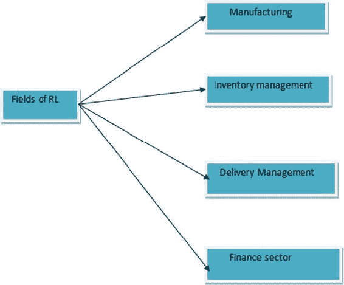 图 2-2. 强化学习的不同领域

### 制造业

在制造业中，工厂机器人使用强化学习将一个物体从一个箱子中取出，然后放入另一个容器中。如果它在递送时失败或成功，机器人会记住该物体并重新学习，最终目标是获得最佳结果并达到最高精度。

### 库存管理

在库存管理方面，强化学习可用于减少库存周转时间，并可应用于仓库中产品的摆放，以优化空间利用。

### 配送管理

强化学习被用于解决拆分配送的车辆路径问题。`Q Learning` 被用来用一辆车为合适的客户提供服务。

### 金融领域

强化学习被用于会计领域，采用交易策略。

## 为什么强化学习很困难？

强化学习最困难的部分之一在于必须映射环境并包含所有可能的移动。例如，考虑一个棋盘游戏。你必须将人工智能应用于所学到的知识。理论上，强化学习应该完美运行，因为棋盘游戏中存在大量的状态跳转和复杂移动。然而，单独应用强化学习会变得困难。为了获得最佳结果，我们将基于规则的引擎与强化学习结合使用。如果我们不应用基于规则的引擎，棋盘游戏中的选项太多，智能体将花费无穷无尽的时间来发现路径。首先，我们应用简单的规则，以便人工智能快速学习，然后随着复杂性的增加，我们再应用强化学习。图 2-3 展示了应用强化学习可能遇到的困难。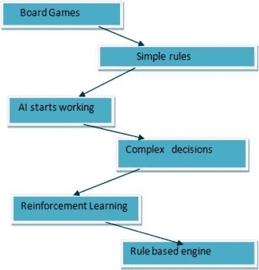 图 2-3. 结合规则的强化学习

## 准备机器


在运行示例之前，你需要执行一些步骤来安装软件。本书中的示例使用的是 Anaconda 版本的 Python，因此本节将介绍如何查找并下载它。

首先，你需要打开一个终端。启动终端的过程如图 2-4 所示。

 图 2-4. 打开终端

接下来，你需要更新软件包。在终端中输入以下命令即可完成此操作。参见图 2-5。

```
sudo apt-get update
```

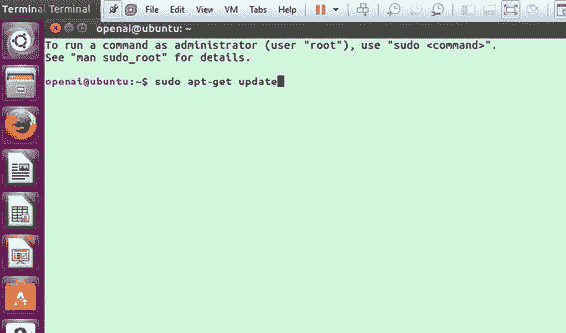 图 2-5. 更新软件包

运行更新命令后，所需的安装内容即被安装，如图 2-6 所示。

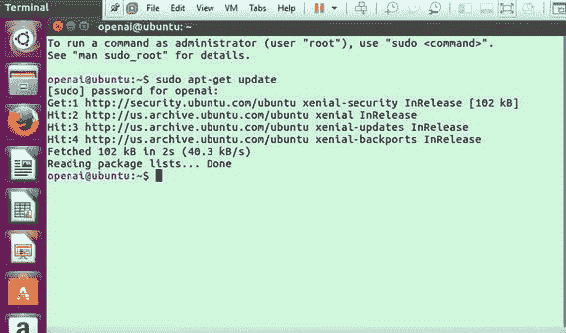 图 2-6. 所有内容已更新

现在你可以使用另一个命令来安装所需的软件包。图 2-7 展示了这一过程。

```
sudo apt-get install golang python3-dev python-dev libcupti-dev libjpeg-turbo8-dev make tmux htop chromium-browser git cmake zlib1g-dev libjpeg-dev xvfb libav-tools xorg-dev python-opengl libboost-all-dev libsdl2-dev swig
```

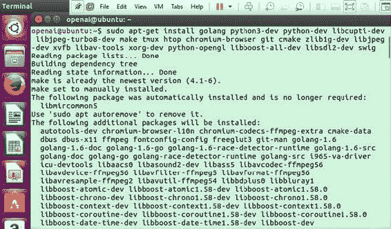 图 2-7. 获取更新

如图 2-8 所示，你需要输入 `y`，然后按回车键继续。

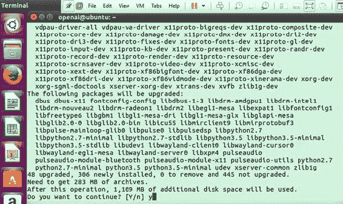 图 2-8. 继续安装

下一步，必要的软件包将被下载并相应更新，如图 2-9 所示。

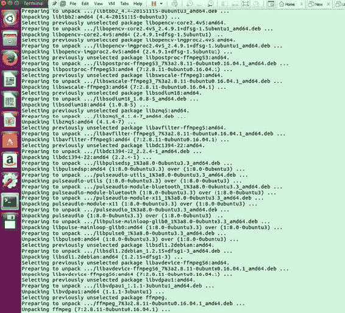 图 2-9. 下载并解压软件包

现在你已经安装了 Anaconda 发行版的 Python。接下来，你需要为 Ubuntu 打开一个浏览器窗口。本示例使用的是 Mozilla Firefox。搜索 Anaconda 安装程序，如图 2-10 所示。

 图 2-10. 下载 Anaconda

现在你需要找到适合你特定操作系统的下载版本。Anaconda 页面如图 2-11 所示。

 图 2-11. Anaconda 页面

选择合适的 Anaconda 发行版，如图 2-12 所示。

 图 2-12. 选择 Anaconda 版本

接下来保存文件，如图 2-13 所示。

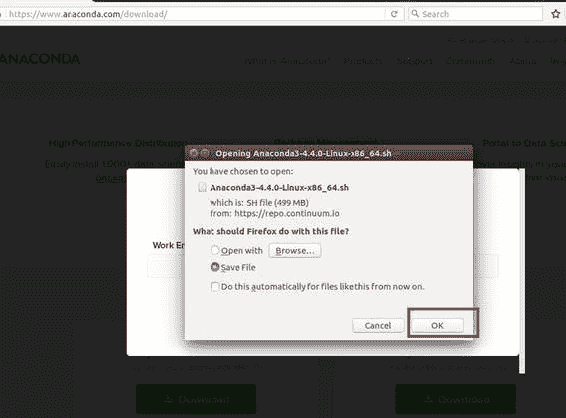 图 2-13. 保存文件

现在，你需要使用终端进入下载文件夹。你还应该检查正在保存的文件。参见图 2-14。

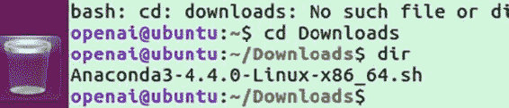 图 2-14. 进入下载文件夹

现在你需要使用 `bash` 命令来运行 shell 脚本（参见图 2-15）：

```
bash Anaconda3-4.4.0-Linux-x86_64.sh
```

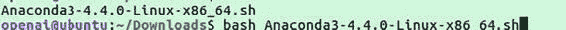 图 2-15. 运行 shell 脚本

要选择平台，请输入 `yes` 并按回车键。Anaconda 将被安装到主目录位置，如图 2-16 所示。

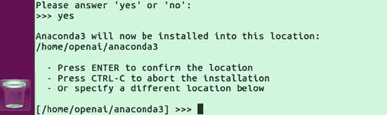 图 2-16. 设置 Anaconda 环境

下一步，如图 2-17 所示，将安装 Anaconda 的所有重要软件包，以便其正确配置。

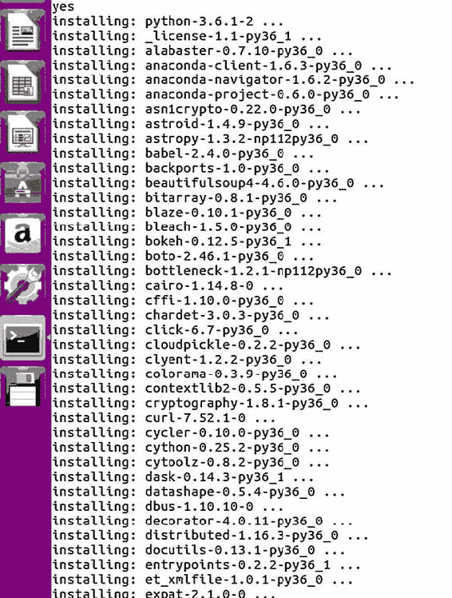 图 2-17. 安装 Anaconda 的关键软件包

Anaconda 安装完成后，你需要打开一个新的终端来设置你的 Anaconda 环境。你必须使用 `conda create` 命令为 Anaconda 创建一个新环境（参见图 2-18）。此命令将所有软件包保存在一个隔离的位置。

```
conda create --name universe python=3.6 anaconda
```

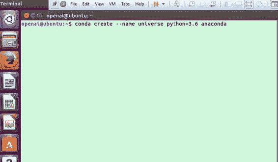 图 2-18. 创建环境

下一步，Anaconda 环境将安装必要的软件包。参见图 2-19。

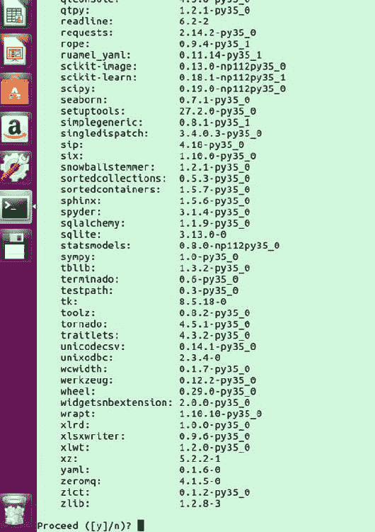 图 2-19. 用于安装或更新 Anaconda 的软件包

输入 `y`，然后按回车键继续。然后，在环境中的每个软件包都更新后，整个过程将完成。现在你可以激活该环境。参见图 2-20。

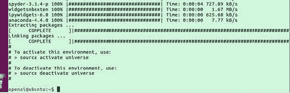 图 2-20. 用于安装或更新 Anaconda 的软件包

可能还需要安装一些额外的更新。你还需要安装 Swig，如图 2-21 所示。

```
conda install pip six libgcc swig
```

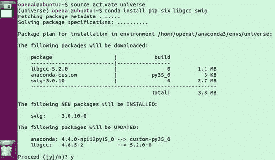 图 2-21. 也安装 Swig

你还需要安装 OpenCV 以更新某些软件包，如图 2-22 所示。

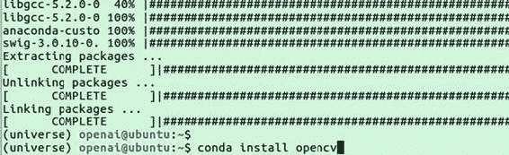 图 2-22. 安装 OpenCV

如果 OpenCV 有更新，请输入 `y` 也安装它们。参见图 2-23。

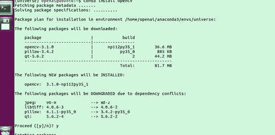 图 2-23. 安装 OpenCV

接下来，你需要安装 TensorFlow。本章介绍如何安装 CPU 版本。参见图 2-24。

```
pip install --upgrade tensorflow
```

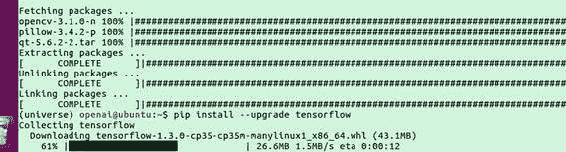 图 2-24. 安装 TensorFlow

图 2-25 显示了正在为 TensorFlow 安装的软件包。

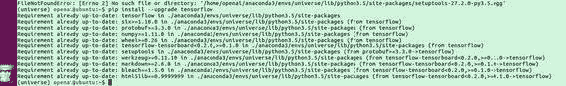 图 2-25. TensorFlow 安装软件包

下一步，如图 2-26 所示，请求安装其他软件包的权限。输入 `y` 继续。

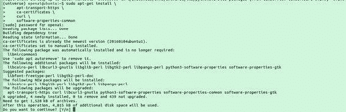 图 2-26. 软件包安装进行中

在下一节中，我们将安装 Docker。我们将首先了解什么是 Docker。


### 安装 Docker

若要将容器部署在云端，Docker 是最佳选择。开发者通常使用 Docker 来减轻单台机器的工作负载，因为整个架构都可以托管在开发环境中。企业则借助 Docker 维持敏捷的开发环境。运维人员通常使用 Docker 来监控应用，并高效地运行和管理它们。现在你将安装 Docker，因为它是 OpenAI Gym 和 Universe 正常运行的基础。之所以需要安装 Docker，是因为在训练环境时，Docker 能以较低的资源消耗运行，对模拟操作响应非常迅速。需要在终端中输入的命令如下所示：

```
$ sudo apt-get install \
    apt-transport-https \
    ca-certificates \
    curl \
    software-properties-common
```

接下来需要输入的命令是：

```
$ curl -fsSL https://download.docker.com/linux/ubuntu/gpg | sudo apt-key add -
```

你使用 `curl` 和该 http 链接，以便 Docker 能够访问这些受信任的密钥值。现在，使用以下命令下载 Docker 类型：

```
$ sudo add-apt-repository \
   "deb [arch=amd64] https://download.docker.com/linux/ubuntu \
   $(lsb_release -cs) \
   stable"
```

输入此命令以更新 Docker，如图 2-27 所示：

```
$ sudo apt-get update
```

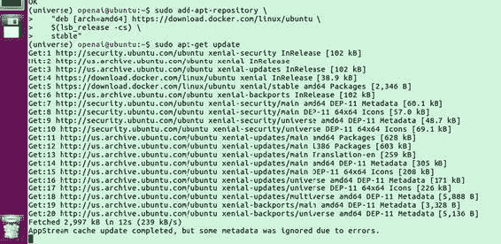

图 2-27. 更新软件包

输入此命令以安装 Docker，如图 2-28 所示：

```
$ sudo apt-get install docker-ce
```

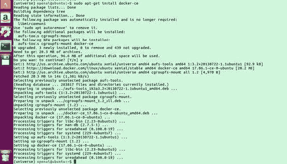

图 2-28. Docker 安装

要测试 Docker，请使用以下命令（见图 2-29）：

```
$ sudo service docker start
$ sudo docker run hello-world
```

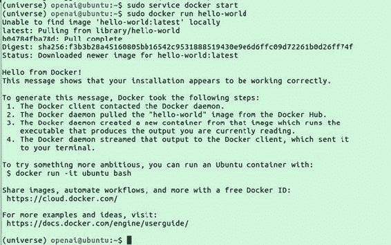

图 2-29. 测试 Docker

## 使用 Python 进行强化学习的示例

本节将介绍一个强化学习的示例，并解释算法的流程。你将看到强化学习是如何应用的。本节使用了一个开源的 GitHub 仓库，其中包含一个非常好的强化学习示例。你需要克隆该仓库才能使用它。该 GitHub 仓库链接为 [`github.com/MorvanZhou/Reinforcement-learning-with-tensorflow`](https://github.com/MorvanZhou/Reinforcement-learning-with-tensorflow)。在 Ubuntu 模块中，进入终端并开始克隆仓库，如图 2-30 所示。

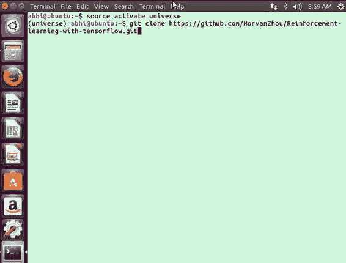

图 2-30. 克隆仓库

图 2-31 展示了仓库的复制过程。

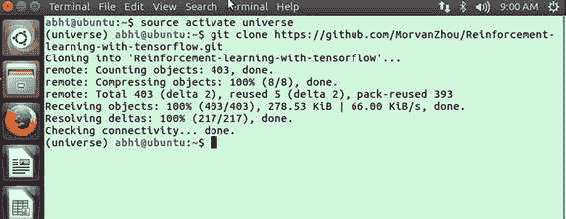

图 2-31. 仓库的复制

接下来，你需要进入所使用的文件夹，如图 2-32 所示。

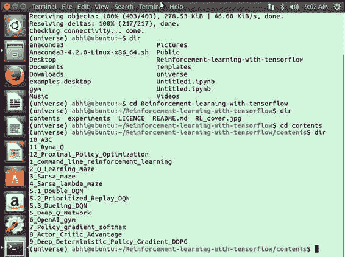

图 2-32. 进入文件夹

我们正在处理一个强化学习的场景，其中我们将字母 O 应用为一个漫游者。这个漫游者想要尽快获得宝藏 T。条件如下所示：

```
O-----T
```

漫游者试图找到到达宝藏的最快路径。在每一轮（episode）中，漫游者到达宝藏所走的步数都会被记录下来。随着每一轮的进行，条件会得到改善，步数也会减少。以下是强化学习中的一些基本步骤：

*   程序尝试处理动作，因为动作在强化学习中非常重要。
*   这个漫游者可用的动作是向左或向右移动：`ACTIONS = ['left','right']`
*   漫游者可以被视为智能体（agent）。
*   在这个例子中，状态数量（也称为步数）被限制为 6：`N_States = 6`

现在你需要为强化学习应用超参数。

### 什么是超参数？

超参数是在设置模型参数之前就已经设定好的变量。通常，它们与分析中的底层系统的模型参数不同。我们引入 epsilon、alpha 和 gamma。

*   Epsilon 是贪婪因子
*   Alpha 是学习率
*   Gamma 是折扣因子

本例中最大的轮数（episodes）是 13。刷新率是指场景被刷新的频率。

### 编写代码


为了构建计算机学习的过程，我们需要制定一个表格。这个过程被称为 Q 学习，该表格称为 Q 表（你将在下一章中了解更多关于 Q 学习的内容）。所有关键元素都存储在 Q 表中，所有决策都基于 Q 表做出。

```
def build_q_table(n_states, actions):
    table = pd.DataFrame(
        np.zeros((n_states, len(actions))),     # q_table initial values
        columns=actions,    # actions's name
    )
    # print(table)    # show table
    return table
```

现在我们需要采取行动。为此，我们使用以下代码：

```
def choose_action(state, q_table):
    # This is how to choose an action
    state_actions = q_table.iloc[state, :]
    if (np.random.uniform() > EPSILON) or (state_actions.all() == 0):  # act non-greedy or state-action have no value
        action_name = np.random.choice(ACTIONS)
    else:   # act greedy
        action_name = state_actions.argmax()
    return action_name
```

现在我们创建环境，并确定智能体将如何在环境中工作：

```
def get_env_feedback(S, A):
    # This is how the agent will interact with the environment
    if A == 'right':    # move right
        if S == N_STATES - 2:   # terminate
            S_ = 'terminal'
            R = 1
        else:
            S_ = S + 1
            R = 0
    else:   # move left
        R = 0
        if S == 0:
            S_ = S  # reach the wall
        else:
            S_ = S - 1
    return S_, R
```

此函数打印漫游者和寻宝条件：

```
def update_env(S, episode, step_counter):
    # This is how the environment be updated
    env_list = ['-']*(N_STATES-1) + ['T']   # '---------T' our environment
    if S == 'terminal':
        interaction = 'Episode %s: total_steps = %s' % (episode+1, step_counter)
        print('\r{}'.format(interaction), end='')
        time.sleep(2)
        print('\r                                ', end='')
    else:
        env_list[S] = 'o'
        interaction = ''.join(env_list)
        print('\r{}'.format(interaction), end='')
        time.sleep(FRESH_TIME)
```

`rl()` 方法调用 Q 学习场景，我们将在下一章中讨论：

```
def rl():
    # main part of RL loop
    q_table = build_q_table(N_STATES, ACTIONS)
    for episode in range(MAX_EPISODES):
        step_counter = 0
        S = 0
        is_terminated = False
        update_env(S, episode, step_counter)
        while not is_terminated:
            A = choose_action(S, q_table)
            S_, R = get_env_feedback(S, A)  # take action & get next state and reward
            q_predict = q_table.ix[S, A]
            if S_ != 'terminal':
                q_target = R + GAMMA * q_table.iloc[S_, :].max()   # next state is not terminal
            else:
                q_target = R     # next state is terminal
                is_terminated = True    # terminate this episode
            q_table.ix[S, A] += ALPHA * (q_target - q_predict)  # update
            S = S_  # move to next state
            update_env(S, episode, step_counter+1)
            step_counter += 1
    return q_table

if __name__ == "__main__":
    q_table = rl()
    print('\r\nQ-table:\n')
    print(q_table)
```

完整的代码如下所示：

```
import numpy as np
import pandas as pd
import time

np.random.seed(2)  # reproducible

N_STATES = 6   # the length of the 1 dimensional world
ACTIONS = ['left', 'right']     # available actions
EPSILON = 0.9   # greedy police
ALPHA = 0.1     # learning rate
GAMMA = 0.9    # discount factor
MAX_EPISODES = 13   # maximum episodes
FRESH_TIME = 0.3    # fresh time for one move

def build_q_table(n_states, actions):
    table = pd.DataFrame(
        np.zeros((n_states, len(actions))),     # q_table initial values
        columns=actions,    # actions's name
    )
    # print(table)    # show table
    return table

def choose_action(state, q_table):
    # This is how to choose an action
    state_actions = q_table.iloc[state, :]
    if (np.random.uniform() > EPSILON) or (state_actions.all() == 0):  # act non-greedy or state-action have no value
        action_name = np.random.choice(ACTIONS)
    else:   # act greedy
        action_name = state_actions.argmax()
    return action_name

def get_env_feedback(S, A):
    # This is how agent will interact with the environment
    if A == 'right':    # move right
        if S == N_STATES - 2:   # terminate
            S_ = 'terminal'
            R = 1
        else:
            S_ = S + 1
            R = 0
    else:   # move left
        R = 0
        if S == 0:
            S_ = S  # reach the wall
        else:
            S_ = S - 1
    return S_, R

def update_env(S, episode, step_counter):
    # This is how environment be updated
    env_list = ['-']*(N_STATES-1) + ['T']   # '---------T' our environment
    if S == 'terminal':
        interaction = 'Episode %s: total_steps = %s' % (episode+1, step_counter)
        print('\r{}'.format(interaction), end='')
        time.sleep(2)
        print('\r                                ', end='')
    else:
        env_list[S] = 'o'
        interaction = ''.join(env_list)
        print('\r{}'.format(interaction), end='')
        time.sleep(FRESH_TIME)

def rl():
    # main part of RL loop
    q_table = build_q_table(N_STATES, ACTIONS)
    for episode in range(MAX_EPISODES):
        step_counter = 0
        S = 0
        is_terminated = False
        update_env(S, episode, step_counter)
        while not is_terminated:
            A = choose_action(S, q_table)
            S_, R = get_env_feedback(S, A)  # take action & get next state and reward
            q_predict = q_table.ix[S, A]
            if S_ != 'terminal':
                q_target = R + GAMMA * q_table.iloc[S_, :].max()   # next state is not terminal
            else:
                q_target = R     # next state is terminal
                is_terminated = True    # terminate this episode
            q_table.ix[S, A] += ALPHA * (q_target - q_predict)  # update
            S = S_  # move to next state
            update_env(S, episode, step_counter+1)
            step_counter += 1
    return q_table

if __name__ == "__main__":
    q_table = rl()
    print('\r\nQ-table:\n')
    print(q_table)
```

现在让我们运行程序并分析输出。你需要进入克隆的 GitHub 仓库并进入所需的文件夹，如图 2-33 所示。

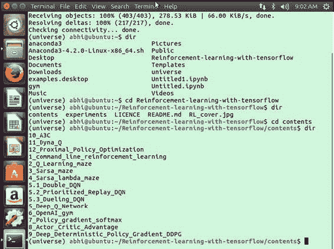

图 2-33. 进入克隆的仓库

现在你需要进入目录来运行程序，如图 2-34 所示。

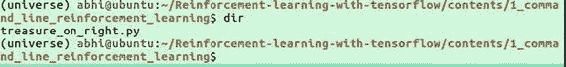

图 2-34. 检查目录

现在你必须运行名为 `treasure_on_right.py` 的程序，该程序将宝藏放置在智能体的右侧。见图 2-35。

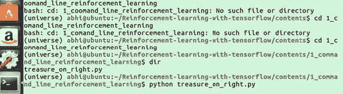

图 2-35. 运行 Python 文件

程序正在运行迭代，如图 2-36 所示。

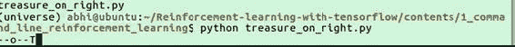

图 2-36. 迭代进行中

当程序和模拟完成后，最终结果被解释为一个 Q 表，在完成循环的每一步中，这些值反映了它在左右方向上花费的时间。图 2-37 显示了完成的 Q 表。

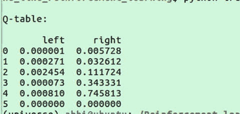

图 2-37. 作为结果创建的 Q 表


## 什么是 MDP？

`MDP`（马尔可夫决策过程）是一个框架，它涉及为决策过程创建数学模型和公式，其中一部分是随机的，另一部分则由决策者掌控。`MDP` 有许多不同的应用，如图 2-38 所示。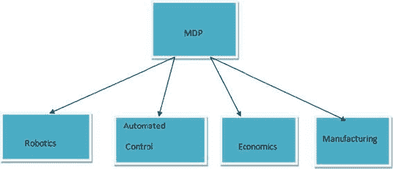 图 2-38. MDP 及其应用 `MDP` 中的每个状态都满足马尔可夫性质。

### 马尔可夫性质

在强化学习领域，马尔可夫性质指的是一种随机的无记忆性质。随机性是指一个由随机变量构成的通用数学对象。当我们不存储某个变量的值，因为它在每次迭代中都会发生变化时，我们称之为随机性。见图 2-39。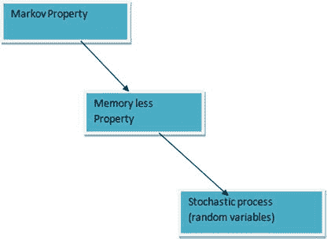 图 2-39. 马尔可夫性质过程 我们将在下一节讨论马尔可夫链。

### 马尔可夫链

如果一个数学性质具有离散的状态空间或离散的索引集，则称之为马尔可夫链。马尔可夫链以两种方式工作，如图 2-40 所示。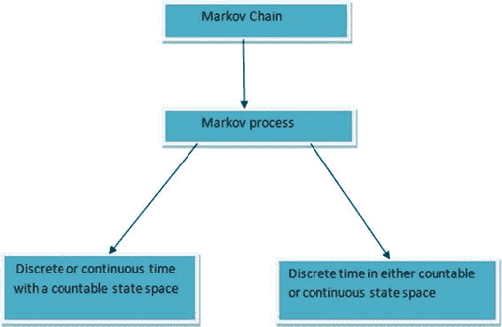 图 2-40. 马尔可夫链 让我们通过一个例子来了解马尔可夫链。这个例子比较了 Rin 洗衣液与市场上其他洗衣液的销售情况。假设 Rin 的销售额占洗衣液总销售额的 20%，这意味着其他品牌占 80%。使用 Rin 洗衣液的人定义为 `A`；其他人定义为 `A¢`。现在我们定义一个规则。在使用 Rin 洗衣液的人中，90% 的人在一周后会继续使用，而 10% 的人会转向其他品牌。同样，使用其他洗衣液的人中，70% 的人在一周后会转向 Rin，其余的人继续使用其他洗衣液。为了分析这些情况，我们需要一个状态图。见图 2-41。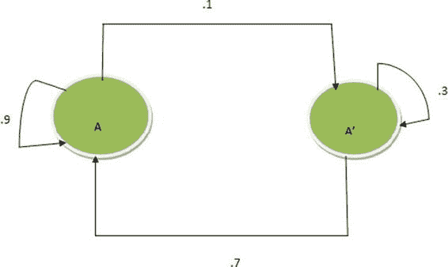 图 2-41. Rin 洗衣液状态图 在状态图中，我们创建了一个场景，其中圆形点代表状态。根据这个状态图，我们必须分配一个转移概率矩阵。从状态图中得到的转移概率矩阵如图 2-42 所示。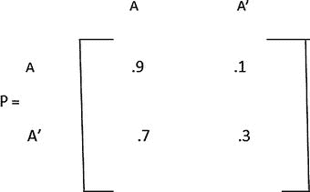 图 2-42. 转移概率矩阵 要确定两周后 Rin 的使用情况，我们必须应用一个原则。这个原则对于你尝试的每一个过程都是通用的。它可以表示为一条线连接，如图 2-43 所示。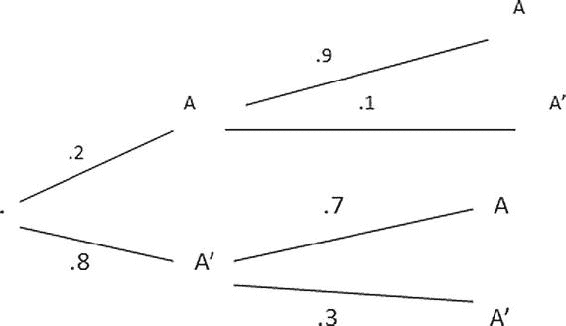 图 2-43. 一个连通图 从起点出发，我们有两条路径——一条用于 Rin 洗衣液（通过 `A`），另一条用于其他品牌（即 `A¢`）。路径的创建方式如下。

1. 从起点出发，我们为 `A` 创建一条路径，因此我们必须关注转移概率矩阵。
2. 我们追踪 `A` 的路径。
3. 从初始市场份额来看，Rin 洗衣液的市场价值为 20%。
4. 从起点 `A` 出发，我们关注转移概率矩阵。

停留在 `A` 的概率为 90%，因此另外 10% 会转向替代路径（到 `A¢`）。图 2-44 以图形方式展示了这条路径的计算。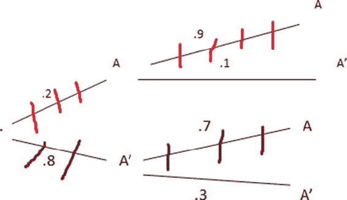 图 2-44. 路径计算 总路径概率计算如下：`P = .2 * .9 + .8 * .7 = .18 + .56 = .74`。这是一周后使用 Rin 的人数百分比。这个公式也可以理解为当前市场份额（`SO`）乘以转移概率（`P`）：`S0 * P = 一周后的市场份额` 见图 2-45。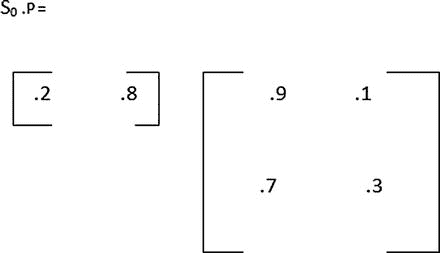 图 2-45. 为下一周创建的矩阵 计算过程为 `.2 * .9 + .8 * .7 = .74` `.2 * .1 + .8 * .3 = .26` `[ .74 .26 ] = S1` 让我们处理第一个状态矩阵。一周后，Rin 洗衣液的销售额占市场的 74%。其他品牌则占市场的 26%。现在尝试找出两周后使用 Rin 洗衣液的人数百分比。图 2-46 展示了两周后我们需要进行的计算。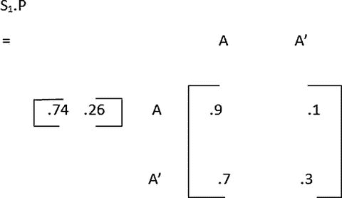 图 2-46. 下一个转移矩阵 所以结果是：`A   A’ = [ .848 .152 ]` 两周后，84.8% 的人会使用 Rin，15.2% 的人会使用其他洗衣液。你可能会问的一个问题是，Rin 的销售额是否会最大化到 100% 的市场份额。随着我们继续，矩阵在经过一定次数的迭代后会变得稳定，并最终稳定在：`A  A’ = [ .75 .25]` 在了解了马尔可夫状态和马尔可夫链的基础知识之后，是时候再次关注 `MDP` 了。

### MDP

几乎所有的强化学习问题都可以形式化为 `MDP`。`MDP` 创造了一种适用于应用强化学习的普遍条件。`MDP` 的本质是一个连续的马尔可夫过程。一个状态（`St`）是马尔可夫的，当且仅当它满足图 2-47 所示的条件。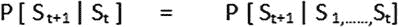 图 2-47. 马尔可夫状态性质 该状态从历史中捕获所有相关信息。我们不必保留历史中的所有信息，因为只有前一个状态决定了现在会发生什么。对于一个马尔可夫状态（`s`）和后继状态（`s’`），状态转移概率的定义如图 2-48 所示。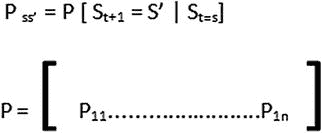 图 2-48. 转移概率 `MDP` 是一个包含决策因素的马尔可夫奖励过程。它是一种所有状态都是马尔可夫的环境类型。一个 `MDP` 是一个五元组 `< S, A, P, R, Gamma>`：

* `S` 代表状态
* `A` 代表动作
* `P` 是一个策略
* `R` 代表奖励

策略（`π`）是在给定状态下动作的分布。策略是一个函数或决策过程，允许从一个状态转移到另一个状态。

### SARSA

`SARSA` 代表状态-动作-奖励-下一状态-下一动作。它是一种不同类型的强化学习方法，通常源自时序差分学习。我们将首先讨论时序差分学习。

#### 时序差分学习

这种类型的学习基于其自身的邻近范围或自身范围。当我们处于一个状态并想知道后续状态中发生了什么时，我们通常会应用时序差分学习。总体思路是我们希望预测一段时间内的最佳路径。我们从状态 `S0` 到状态 `SF`。我们在每个状态中获得奖励。我们将尝试预测奖励的折扣总和。见图 2-49。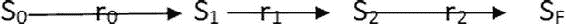 图 2-49. 状态转移 我们首先查看马尔可夫链，如图 2-50 所示。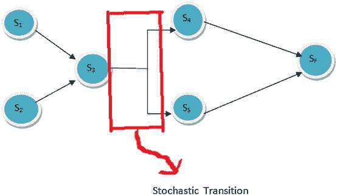 图 2-50. 马尔可夫链 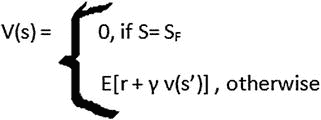 图 2-51. 价值函数 该方程表明，价值函数将状态映射到某个数值。如果处于最终状态，该数值设为 0（见图 2-51）。对于任何状态，其价值是奖励（`r`）的期望值与结束状态的折扣价值之和。


#### SARSA 的工作原理

现在我们进入 SARSA 部分。SARSA 被称为一种同策略强化学习。同策略意味着我们只能看到自身的经验。它通过一步或多步累积更新，并学习从自身经验中进行更新。从当前状态出发，我们选择一个动作，然后进入下一个状态。在下一个状态，我们选择另一个动作，并将当前状态和当前动作与下一个状态和下一个动作结合使用。然后，我们将所有这些值一起更新为 Q 值。算法如下：

1.  任意初始化 `Q(s, a)`。
2.  初始化 `s`。
3.  根据从 `Q` 派生的策略，从 `s` 中选择 `a`。对每个情节重复这两个步骤。
4.  执行动作 `a`，并观察 `r` 和 `s'`。
5.  根据从 `Q` 派生的策略（例如，ε-贪婪策略），从 `s'` 中选择 `a'`。`Q(s, a) ← Q(s, a) + α[r + γQ(s', a') - Q(s, a)]`；`s ← s'`；`a ← a'`。
6.  对每个情节重复这些步骤，直到 `s` 为终止状态。

### Q 学习

Q 学习是一种无模型的强化学习技术。图 2-52 展示了 Q 学习的一般流程。

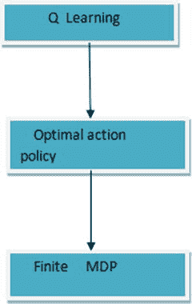  
图 2-52. Q 学习过程

#### 什么是 Q？

`Q` 可以表述为一个包含两个参数——`s` 和 `a`——的函数。参数 `a` 也可以被看作一张表格。`Q` 表示在状态 `s` 下执行动作 `a` 所获得的价值。`Q[s, a] = 即时奖励 + 折扣奖励`。即时奖励是智能体在执行动作时从一个状态转移到另一个状态所获得的分数。折扣奖励是为未来参考而给出的分数。

#### 如何使用 Q

我们通常会遇到需要找出在何处利用 Q 表格值或 Q 值的情况，因此 Q 在此过程中得以实现。我们关注的是，当处于状态 `s` 时，应该采取什么动作或实施哪种策略。我们使用 Q 表格来获得最佳结果。如果我们处于状态 `s`，需要确定哪个动作是最佳的。我们不改变 `s`，而是遍历 `a` 的所有值，并确定哪个值最大。那将是我们应该采取的动作。数学上，这个想法如图 2-53 和 2-54 所示。

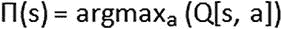  
图 2-53. 策略方程

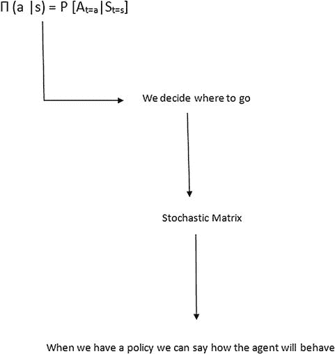  
图 2-54. 策略如何工作

对于 MDP，我们应实施的策略取决于当前状态。我们最大化奖励以获得最优解。

#### 在 Python 中实现 SARSA


回顾一下，`SARSA`是一种同策略强化学习方法。例如，`SARSA`可用于解决迷宫问题。使用`SARSA`方法时，我们无法比较两个不同的迷宫环境。必须坚持使用同一个迷宫，我们以前者为例。同样，我们也不能将这个迷宫与外部其他迷宫进行比较；必须专注于当前正在处理的迷宫。`SARSA`最大的优点在于，它可以从当前状态与下一个状态或后续状态的比较中进行学习。我们积累所有经验并从中学习。

让我们进一步分解这个想法。该场景表明，可以通过比较后续步骤中的变化，然后在`Q`表上进行更新并做出决策。图 2-55 展示了这一想法。 图 2-55. 使用 SARSA 表更新结果

`SARSA`在 Python 中的学习方法有所不同。它看起来像这样：`def learn(self, s, a, r, s_, a_)`。此方法依赖于状态、动作、奖励、下一个状态和下一个动作。如果我们比较该算法并将其转换为 Python，该方程式的构造如图 2-56 所示。 图 2-56. SARSA 方程

它被转换为以下代码：`q_target = r + self.gamma * self.q_table.ix [s_, a_]`。该方程与 Q 学习的区别在于此方程的变化：`q_target = r + self.gamma * self.q_table.ix [s_, :].max()`。`max()`值存在于 Q 学习中，但`SARSA`中没有。

使用`SARSA`实现策略的逻辑如下所示：

```python
##### on-policy
class SarsaTable(RL):
    def __init__(self, actions, learning_rate=0.01, reward_decay=0.9, e_greedy=0.9):
        super(SarsaTable, self).__init__(actions, learning_rate, reward_decay, e_greedy)

    def learn(self, s, a, r, s_, a_):
        self.check_state_exist(s_)
        q_predict = self.q_table.ix[s, a]
        if s_ != 'terminal':
            q_target = r + self.gamma * self.q_table.ix[s_, a_]  # next state is not terminal
        else:
            q_target = r  # next state is terminal
        self.q_table.ix[s, a] += self.lr * (q_target - q_predict)  # update
```

学习过程与 Q 学习有些不同。其逻辑遵循前面讨论的原则。我们将当前状态和动作与下一个状态和下一个动作结合起来。这反过来更新了`Q`表。这就是学习的工作方式。

```python
def update():
    for episode in range(100):
        # initial observation
        observation = env.reset()
        # RL choose action based on observation
        action = RL.choose_action(str(observation))
        while True:
            # fresh env
            env.render()
            # RL take action and get next observation and reward
            observation_, reward, done = env.step(action)
            # RL choose action based on next observation
            action_ = RL.choose_action(str(observation_))
            # RL learn from this transition (s, a, r, s, a) ==> Sarsa
            RL.learn(str(observation), action, reward, str(observation_), action_)
            # swap observation and action
            observation = observation_
            action = action_
            # break while loop when end of this episode
            if done:
                break
```

以下是创建迷宫的代码：

```python
import numpy as np
import time
import sys
if sys.version_info.major == 2:
    import Tkinter as tk
else:
    import tkinter as tk

UNIT = 40   # pixels
MAZE_H = 4  # grid height
MAZE_W = 4  # grid width

class Maze(tk.Tk, object):
    def __init__(self):
        super(Maze, self).__init__()
        self.action_space = ['u', 'd', 'l', 'r']
        self.n_actions = len(self.action_space)
        self.title('maze')
        self.geometry('{0}x{1}'.format(MAZE_H * UNIT, MAZE_H * UNIT))
        self._build_maze()

    def _build_maze(self):
        self.canvas = tk.Canvas(self, bg='white',
                           height=MAZE_H * UNIT,
                           width=MAZE_W * UNIT)
        # create grids
        for c in range(0, MAZE_W * UNIT, UNIT):
            x0, y0, x1, y1 = c, 0, c, MAZE_H * UNIT
            self.canvas.create_line(x0, y0, x1, y1)
        for r in range(0, MAZE_H * UNIT, UNIT):
            x0, y0, x1, y1 = 0, r, MAZE_H * UNIT, r
            self.canvas.create_line(x0, y0, x1, y1)
        # create origin
        origin = np.array([20, 20])
        # hell
        hell1_center = origin + np.array([UNIT * 2, UNIT])
        self.hell1 = self.canvas.create_rectangle(
            hell1_center[0] - 15, hell1_center[1] - 15,
            hell1_center[0] + 15, hell1_center[1] + 15,
            fill='black')
        # hell
        hell2_center = origin + np.array([UNIT, UNIT * 2])
        self.hell2 = self.canvas.create_rectangle(
            hell2_center[0] - 15, hell2_center[1] - 15,
            hell2_center[0] + 15, hell2_center[1] + 15,
            fill='black')
        # create oval
        oval_center = origin + UNIT * 2
        self.oval = self.canvas.create_oval(
            oval_center[0] - 15, oval_center[1] - 15,
            oval_center[0] + 15, oval_center[1] + 15,
            fill='yellow')
        # create red rect
        self.rect = self.canvas.create_rectangle(
            origin[0] - 15, origin[1] - 15,
            origin[0] + 15, origin[1] + 15,
            fill='red')
        # pack all
        self.canvas.pack()

    def reset(self):
        self.update()
        time.sleep(0.5)
        self.canvas.delete(self.rect)
        origin = np.array([20, 20])
        self.rect = self.canvas.create_rectangle(
            origin[0] - 15, origin[1] - 15,
            origin[0] + 15, origin[1] + 15,
            fill='red')
        # return observation
        return self.canvas.coords(self.rect)

    def step(self, action):
        s = self.canvas.coords(self.rect)
        base_action = np.array([0, 0])
        if action == 0:   # up
            if s[1] > UNIT:
                base_action[1] -= UNIT
        elif action == 1:   # down
            if s[1] < (MAZE_H - 1) * UNIT:
                base_action[1] += UNIT
        elif action == 2:   # right
            if s[0] < (MAZE_W - 1) * UNIT:
                base_action[0] += UNIT
        elif action == 3:   # left
            if s[0] > UNIT:
                base_action[0] -= UNIT
        self.canvas.move(self.rect, base_action[0], base_action[1])  # move agent
        s_ = self.canvas.coords(self.rect)  # next state
        # reward function
        if s_ == self.canvas.coords(self.oval):
            reward = 1
            done = True
        elif s_ in [self.canvas.coords(self.hell1), self.canvas.coords(self.hell2)]:
            reward = -1
            done = True
        else:
            reward = 0
            done = False
        return s_, reward, done

    def render(self):
        time.sleep(0.1)
        self.update()
```

#### Python 中的完整强化学习逻辑


当你在 Python 中实现该算法时，其结构如下所示。相关内容位于代码仓库中。

```python
import numpy as np
import pandas as pd

class RL(object):
    def __init__(self, action_space, learning_rate=0.01, reward_decay=0.9, e_greedy=0.9):
        self.actions = action_space  # a list
        self.lr = learning_rate
        self.gamma = reward_decay
        self.epsilon = e_greedy
        self.q_table = pd.DataFrame(columns=self.actions)

    def check_state_exist(self, state):
        if state not in self.q_table.index:
            # append new state to q table
            self.q_table = self.q_table.append(
                pd.Series(
                    [0]*len(self.actions),
                    index=self.q_table.columns,
                    name=state,
                )
            )

    def choose_action(self, observation):
        self.check_state_exist(observation)
        # action selection
        if np.random.rand() < self.epsilon:
            # choose best action
            state_action = self.q_table.ix[observation, :]
            state_action = state_action.reindex(np.random.permutation(state_action.index))     # some actions have the same value
            action = state_action.argmax()
        else:
            # choose random action
            action = np.random.choice(self.actions)
        return action

    def learn(self, *args):
        Pass

##### off-policy
class QLearningTable(RL):
    def __init__(self, actions, learning_rate=0.01, reward_decay=0.9, e_greedy=0.9):
        super(QLearningTable, self).__init__(actions, learning_rate, reward_decay, e_greedy)

    def learn(self, s, a, r, s_):
        self.check_state_exist(s_)
        q_predict = self.q_table.ix[s, a]
        if s_ != 'terminal':
            q_target = r + self.gamma * self.q_table.ix[s_, :].max()  # next state is not terminal
        else:
            q_target = r  # next state is terminal
        self.q_table.ix[s, a] += self.lr * (q_target - q_predict)  # update

##### on-policy
class SarsaTable(RL):
    def __init__(self, actions, learning_rate=0.01, reward_decay=0.9, e_greedy=0.9):
        super(SarsaTable, self).__init__(actions, learning_rate, reward_decay, e_greedy)

    def learn(self, s, a, r, s_, a_):
        self.check_state_exist(s_)
        q_predict = self.q_table.ix[s, a]
        if s_ != 'terminal':
            q_target = r + self.gamma * self.q_table.ix[s_, a_]  # next state is not terminal
        else:
            q_target = r  # next state is terminal
        self.q_table.ix[s, a] += self.lr * (q_target - q_predict)  # update
```

完整的训练过程在代码（`RL_brain.py`）中如下所示：

```python
from maze_env import Maze
from RL_brain import SarsaTable

def update():
    for episode in range(100):
        # initial observation
        observation = env.reset()
        # RL choose action based on observation
        action = RL.choose_action(str(observation))
        while True:
            # fresh env
            env.render()
            # RL take action and get next observation and reward
            observation_, reward, done = env.step(action)
            # RL choose action based on next observation
            action_ = RL.choose_action(str(observation_))
            # RL learn from this transition (s, a, r, s, a) ==> Sarsa
            RL.learn(str(observation), action, reward, str(observation_), action_)
            # swap observation and action
            observation = observation_
            action = action_
            # break while loop when end of this episode
            if done:
                break
    # end of game
    print('game over')
    env.destroy()

if __name__ == "__main__":
    env = Maze()
    RL = SarsaTable(actions=list(range(env.n_actions)))
    env.after(100, update)
    env.mainloop()
```

让我们运行程序并检查结果。你可以在 Anaconda 环境中执行此操作，如图 2-57 所示。


图 2-57. 激活环境

然后你需要考虑 SARSA 迷宫，如图 2-58 所示。


图 2-58. 考虑 SARSA 迷宫

现在你需要调用 `run_this.py` 文件来运行程序，如图 2-59 所示。


图 2-59. 运行 `run_this.py`

要从终端运行程序，请使用以下命令：`python run_this.py`

运行代码后，程序将开始玩迷宫游戏，如图 2-60 所示。


图 2-60. 程序正在玩迷宫游戏

### 强化学习中的动态规划

顺序性或时间性问题可以通过动态规划来解决。如果你遇到一个复杂问题，必须将其分解为子问题。动态规划就是将问题分解为子问题、求解这些子问题，最后将它们组合起来解决整体问题的过程。最优子结构和最优性原理在此适用。解决方案可以被缓存并重复使用。参见图 2-61。


图 2-61. 动态问题求解方法

## 结论

本章介绍了与强化学习相关的不同算法。你还看到了一个使用 Python 实现的简单强化学习示例。接着，你通过一个 Python 示例学习了 SARSA 算法。本章最后讨论了动态规划的基础知识。© Abhishek Nandy and Manisha Biswas 2018 Abhishek Nandy and Manisha Biswas Reinforcement Learning `doi.org/10.1007/978-1-4842-3285-9_3`

