# 3. OpenAI 基础

Abhishek Nandy^(1 ) and Manisha Biswas² (1) 印度西孟加拉邦加尔各答 Swaranika Co-Opt HSG 大楼 HIG L-2/4 室 (2) 印度西孟加拉邦北 24 帕尔加纳区

本章将介绍 OpenAI 的世界，并将其应用于强化学习。首先，我们探讨对强化学习至关重要的环境。我们讨论两个对强化学习有用的支持平台——Google DeepMind 和 OpenAI，后者由 Elon Musk 支持。本章将讨论完全开源的 OpenAI，而 Google DeepMind 将在第 6 章中讨论。本章首先介绍 OpenAI 的基础知识，然后进行详细描述，并讨论 OpenAI Gym 和 OpenAI Universe 环境。接着，我们介绍在 Ubuntu 和 Anaconda 发行版上安装 OpenAI Gym 和 OpenAI Universe。最后，我们讨论如何使用 OpenAI Gym 和 OpenAI Universe 进行强化学习。

## 认识 OpenAI

首先，你需要访问 OpenAI 网站 [`openai.com/`](https://openai.com/)。该网站如图 3-1 所示。

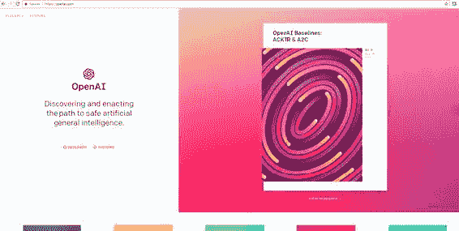 图 3-1. OpenAI 网站

OpenAI 网站内容丰富，资源众多。它提供了大量资源供你学习和研究。让我们概览一下 OpenAI Gym 和 OpenAI Universe 是如何连接的。见图 3-2。

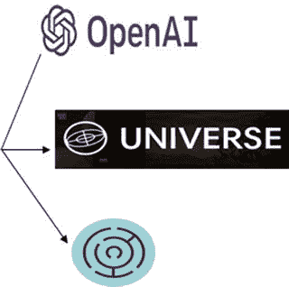 图 3-2. OpenAI Gym 和 OpenAI Universe

图 3-2 通过图标展示了 OpenAI Gym 和 OpenAI Universe 的连接方式。该网站的 OpenAI Gym 页面如图 3-3 所示。

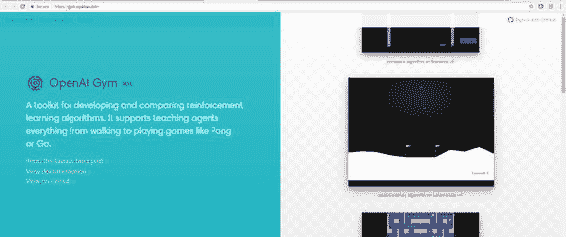 图 3-3. OpenAI Gym 网站

OpenAI Gym 是一个工具包，可帮助你运行模拟游戏和场景，以应用强化学习以及强化学习算法。它支持训练智能体执行多种活动，例如玩耍、行走等。

OpenAI Universe 网站如图 3-4 所示。

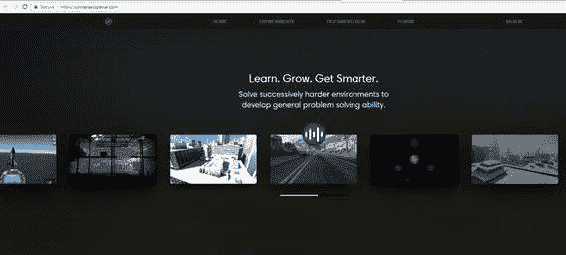 图 3-4. OpenAI Universe 网站

OpenAI Universe 是一个软件平台，用于衡量和训练 AI 在不同类型游戏和应用中的通用智能。

## 安装 OpenAI Gym 和 OpenAI Universe

在本节中，你将学习如何在运行 Ubuntu 16.04 版本的机器上安装 OpenAI Gym 和 OpenAI Universe。进入 Anaconda 环境，从 GitHub 安装 OpenAI Gym。见图 3-5。你可以使用以下命令从 GitHub 克隆并安装 OpenAI Gym：

```
$ source activate universe
(universe) $ cd ∼
(universe) $ git clone https://github.com/openai/gym.git
(universe) $ cd gym
(universe) $ pip install -e '.[all]'
```

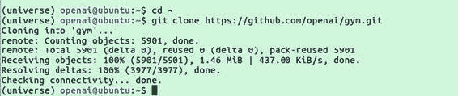 图 3-5. 克隆 OpenAI Gym

现在按如下方式安装 OpenAI Universe：

```
(universe) $ cd ∼
(universe) $ git clone https://github.com/openai/universe.git
(universe) $ cd universe
(universe) $ pip install -e
```

正在安装这些包。图 3-6 展示了 OpenAI Universe 的克隆过程。

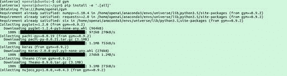 图 3-6. 克隆 OpenAI Universe

包含所有重要文件的整个流程已下载完成，如图 3-7 所示。

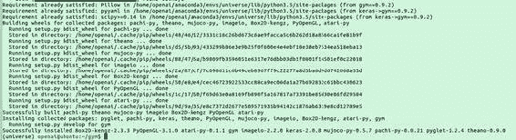 图 3-7. 安装过程的重要步骤

安装过程继续进行，如图 3-8 所示。

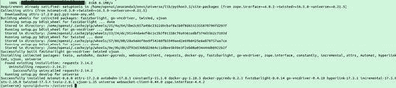 图 3-8. 安装过程的更多步骤

在下一节中，你将学习如何开始在 OpenAI Gym 和 OpenAI 环境中工作。

## 使用 OpenAI Gym 和 OpenAI

示例过程的 OpenAI 循环如图 3-9 所示。

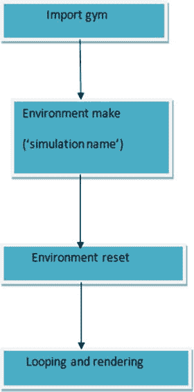 图 3-9. 基本的 OpenAI Gym 结构

该过程的工作方式如下。我们正在处理一个简单的 Gym 项目。这里选择的语言是 Python，但我们更关注环境如何被使用的逻辑。

1. 我们导入 Gym 库。
2. 我们使用 `make` 函数创建一个要执行的模拟实例。
3. 我们重置模拟，以便将要应用的条件得以实现。
4. 我们进行循环，然后渲染。

输出是使用 OpenAI 强化学习技术对环境进行模拟的结果。这里展示了使用 Python 编写的程序，我们使用了小车-杆模拟示例：

```
import gym
env = gym.make('CartPole-v0')
env.reset()
for _ in range(1000):
    env.render()
    env.step(env.action_space.sample()) # 执行一个随机动作
```

我们创建的程序在终端中运行；我们也可以在 jupyter notebook 上运行该程序。Jupyter notebook 是一个可以非常轻松运行 Python 代码的特殊环境。要使用 OpenAI 的属性或文件结构，你需要位于 `universe` 目录中，如图 3-10 所示。

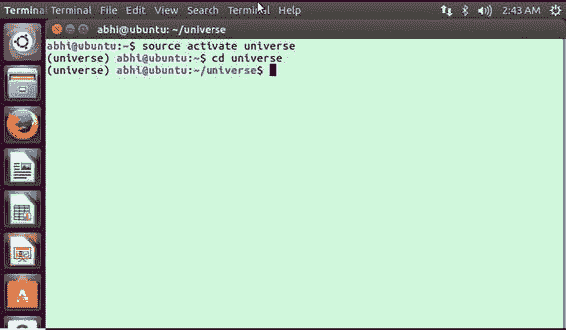 图 3-10. 在 `universe` 目录内部

要使用 Gym 组件，你需要进入 `gym` 目录，如图 3-11 所示。

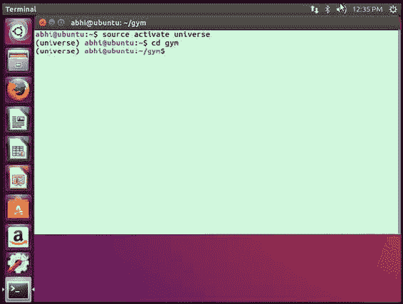 图 3-11. 在 `gym` 目录内部

然后你需要打开 jupyter notebook。在终端中输入以下命令以打开 jupyter notebook（见图 3-12）：

```
jupyter notebook
```

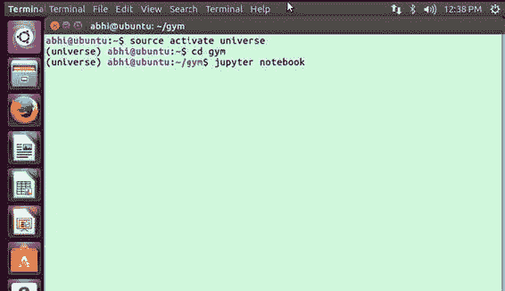 图 3-12. 使用 jupyter notebook

当你发出该命令时，jupyter notebook 引擎会侧加载基本组件，以便加载所有与 jupyter notebook 相关的内容，如图 3-13 所示。

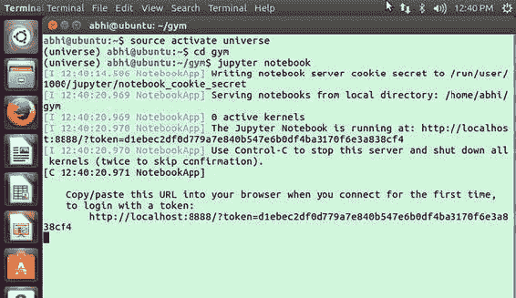 图 3-13. jupyter notebook 的基本组件

一旦 jupyter notebook 加载完成，你将看到界面中有一个用于处理 Python 文件的选项。界面中会显示你所拥有的 Python 发行版类型。图 3-14 显示在此情况下安装了 Python 3。

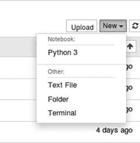 图 3-14. 打开一个新的 Python 文件

你现在可以开始使用 Gym 界面，并开始导入 Gym 库，如图 3-15 所示。

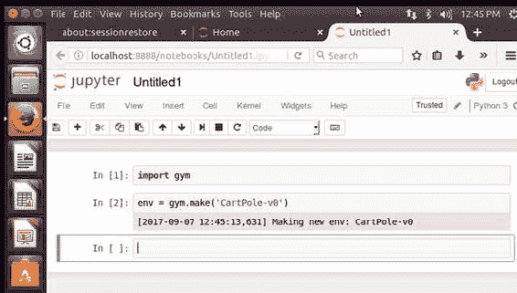 图 3-15. 在 jupyter notebook 中使用 Gym

该过程持续进行，直到程序流程完成。图 3-16 展示了流程。

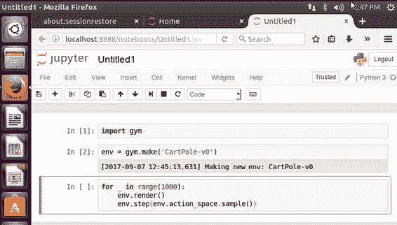 图 3-16. 程序的流程

重置后，环境会显示一个数组，如图 3-17 所示。

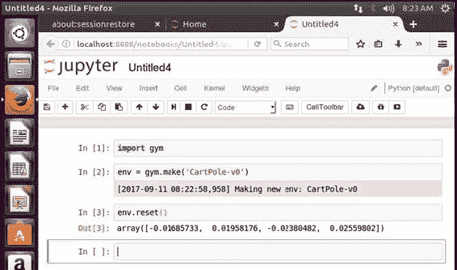 图 3-17. 正在创建一个数组

图 3-18 展示了模拟过程。小车-杆移动的幅度由数组的值反映出来。

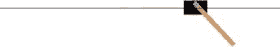 图 3-18. 模拟进行中

## 更多模拟

本节将展示如何尝试不同的模拟。OpenAI 中包含多种环境类型，其中一种是对数类型，接下来将对此进行讨论。算法涉及多种任务。运行以下代码即可在 Jupyter Notebook 中引入该环境（见图 3-19）：

```
import gym
env = gym.make('Copy-v0')
env.reset()
env.render()
```

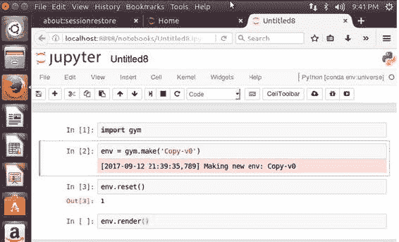 图 3-19. 在 Jupyter Notebook 中引入环境

输出结果如图 3-20 所示。此模拟的主要目的是从输入序列中复制符号。

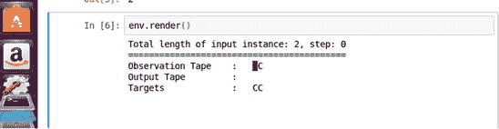 图 3-20. 运行渲染函数后的输出

本节将以经典街机游戏为例。首先，使用以下命令打开所需的 Anaconda 环境：

```
source activate universe
```

然后进入相应目录，例如 gym：

```
cd gym
```

在终端中，使用以下命令启动 Jupyter Notebook：

```
jupyter notebook
```

这样你就可以开始使用 Python 选项了。图 3-21 展示了使用经典街机游戏的过程。

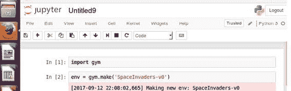 图 3-21. 使用经典街机游戏

使用 `env.reset()` 后，会生成一个数组，如图 3-22 所示。

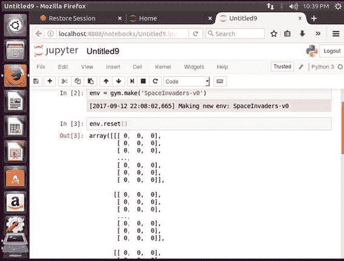 图 3-22. 正在创建数组

如果使用 `env.render()`，将生成如图 3-23 所示的输出。

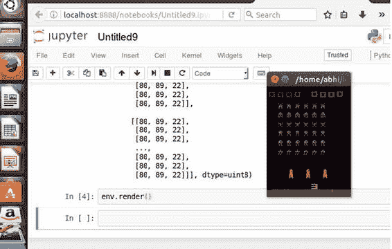 图 3-23. 渲染输出

此示例只是模拟不同类型的游戏环境，并将其设置为强化学习环境。以下是模拟《太空侵略者》游戏的代码：

```
import gym
env = gym.make('SpaceInvaders-v0')
env.reset()
env.render()
```

在下一节中，你将学习如何使用 OpenAI Universe。

### OpenAI Universe

在此示例中，你将使用 Jupyter Notebook 模拟一个游戏环境，然后对其应用强化学习。进入 universe 目录并启动 Jupyter Notebook。

```
import gym
import universe  # 注册 universe 环境
env = gym.make('flashgames.DuskDrive-v0')
env.configure(remotes=1)  # 自动创建一个本地 Docker 容器
observation_n = env.reset()
while True:
    action_n = [[('KeyEvent', 'ArrowUp', True)] for ob in observation_n]  # 你的智能体在此处
    observation_n, reward_n, done_n, info = env.step(action_n)
    env.render()
```

图 3-24 展示了为 DuskDrive 游戏设置环境所需的代码。

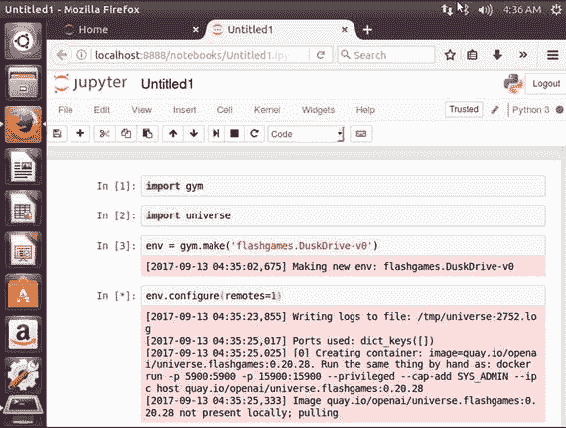 图 3-24. 为 DuskDrive 游戏设置环境

现在它将访问镜像并远程启动镜像。它将运行游戏，并在智能体的帮助下开始远程游戏。见图 3-25。

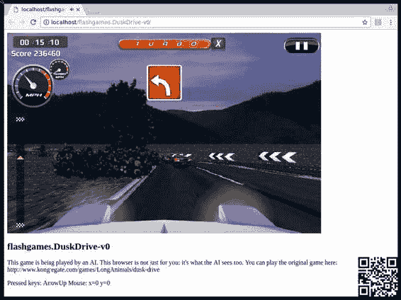 图 3-25. 智能体运行的游戏

首先，导入 `gym` 库，这是 OpenAI Universe 构建的基础。你还必须导入 `universe`，它会注册所有 Universe 环境。你导入 `gym` 库，因为你将在 OpenAI Gym 和 Universe 上进行模拟：

```
import gym
import universe  # 注册 universe 环境
```

之后，创建一个用于加载将要模拟的 Flash 游戏的环境（本例中为 DuskDrive 游戏）。

```
env = gym.make('flashgames.DuskDrive-v0')
```

调用 `configure`，它会创建一个 Docker 化环境，用于在本地运行模拟。

```
env.configure(remotes=1)
```

然后调用 `env.reset()` 来异步实例化适当的模拟环境：

```
observation_n = env.reset()
```

然后定义 `KeyEvent` 和 `ArrowUp` 动作，以在模拟环境中移动汽车：

```
action_n = [[('KeyEvent', 'ArrowUp', True)] for ob in observation_n]
```

为了获取奖励并检查回合状态，你使用以下代码并进行相应渲染：

```
observation_n, reward_n, done_n, info = env.step(action_n)
env.render()
```

## 结论

本章详细介绍了 OpenAI。首先，它从总体上描述了 OpenAI，然后描述了 OpenAI Gym 和 OpenAI Universe。我们涉及了安装 OpenAI Gym 和 OpenAI Universe，然后开始使用 Python 语言为它们编写代码。最后，我们看了一些 OpenAI Gym 和 OpenAI Universe 的示例。

© Abhishek Nandy and Manisha Biswas 2018  

Abhishek Nandy and Manisha Biswas  

《强化学习》  

`doi.org/10.1007/978-1-4842-3285-9_4`