# 4. 将 Python 应用于强化学习

Abhishek Nandy¹ 和 Manisha Biswas²

(1) 印度西孟加拉邦加尔各答 Swaranika Co-Opt HSG 大楼 HIG L-2/4 室  

(2) 印度西孟加拉邦北 24 帕尔加纳区

本章从 Python 的角度探索强化学习的世界。首先，我们通过 Python 学习 Q 学习，然后对强化学习进行更深入的分析。我们从 Python 中的 Q 学习开始。然后，我们描述 Python 中的群体智能，并介绍群体智能究竟是什么。本章还涵盖了马尔可夫决策过程（MDP）工具箱。最后，你将实现一个游戏 AI，并对其应用强化学习。本章将是一次很好的体验，让我们开始吧！

## 使用 Python 进行 Q 学习

让我们从一个迷宫问题开始。游戏的目标是避开黑色方块，到达黄色圆圈。图 4-1 展示了这个迷宫。在此示例中，我们使用 `numpy` 库。

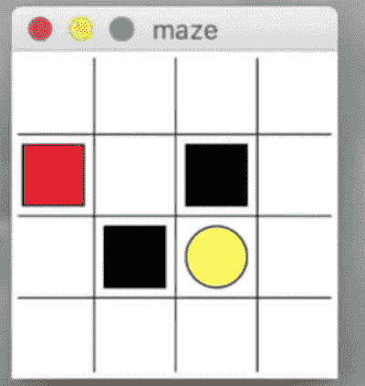

图 4-1. 演示 Q 学习的迷宫

我们必须根据 Q 表选择一个动作，这就是我们拥有名为 `choose_action` 的函数的原因。当我们想从一个状态移动到另一个状态时，我们将决策过程应用于 `choose_action` 方法，如下所示：

```python
def choose_action(self, observation):
```

学习过程函数接收从状态、奖励、奖赏的转换，并进入下一个状态：

```python
def check_State_exist(self, state):
```

`check_State_exist` 函数允许我们检查状态是否存在，如果存在则将其追加到 Q 表中。我们讨论的函数内容实际上属于 `RL_brain`，它是该项目的基础。Q 学习的规则已更新，如 `run_this.py` 文件所示。

### 迷宫环境 Python 文件

## 迷宫环境与强化学习

此处展示的迷宫环境 Python 文件列出了进行移动所需的所有概念。我们声明了奖励以及执行下一步的能力。

```python
"""
强化学习迷宫示例。

红色矩形：          探索者。
黑色矩形：          地狱       [奖励 = -1]。
黄色圆形：          天堂       [奖励 = +1]。
其他所有状态：      地面       [奖励 = 0]。

此脚本是该示例的环境部分。
强化学习部分在 RL_brain.py 中。

更多内容请访问我的教程页面：https://morvanzhou.github.io/tutorials/
"""

import numpy as np
import time
import sys

if sys.version_info.major == 2:
    import Tkinter as tk
else:
    import tkinter as tk

UNIT = 40   # 像素
MAZE_H = 4  # 网格高度
MAZE_W = 4  # 网格宽度


class Maze(tk.Tk, object):
    def __init__(self):
        super(Maze, self).__init__()
        self.action_space = ['u', 'd', 'l', 'r']
        self.n_actions = len(self.action_space)
        self.title('maze')
        self.geometry('{0}x{1}'.format(MAZE_H * UNIT, MAZE_H * UNIT))
        self._build_maze()

    def _build_maze(self):
        self.canvas = tk.Canvas(self, bg='white',
                           height=MAZE_H * UNIT,
                           width=MAZE_W * UNIT)

        # 创建网格
        for c in range(0, MAZE_W * UNIT, UNIT):
            x0, y0, x1, y1 = c, 0, c, MAZE_H * UNIT
            self.canvas.create_line(x0, y0, x1, y1)
        for r in range(0, MAZE_H * UNIT, UNIT):
            x0, y0, x1, y1 = 0, r, MAZE_H * UNIT, r
            self.canvas.create_line(x0, y0, x1, y1)

        # 创建原点
        origin = np.array([20, 20])

        # 地狱
        hell1_center = origin + np.array([UNIT * 2, UNIT])
        self.hell1 = self.canvas.create_rectangle(
            hell1_center[0] - 15, hell1_center[1] - 15,
            hell1_center[0] + 15, hell1_center[1] + 15,
            fill='black')

        # 地狱
        hell2_center = origin + np.array([UNIT, UNIT * 2])
        self.hell2 = self.canvas.create_rectangle(
            hell2_center[0] - 15, hell2_center[1] - 15,
            hell2_center[0] + 15, hell2_center[1] + 15,
            fill='black')

        # 创建椭圆
        oval_center = origin + UNIT * 2
        self.oval = self.canvas.create_oval(
            oval_center[0] - 15, oval_center[1] - 15,
            oval_center[0] + 15, oval_center[1] + 15,
            fill='yellow')

        # 创建红色矩形
        self.rect = self.canvas.create_rectangle(
            origin[0] - 15, origin[1] - 15,
            origin[0] + 15, origin[1] + 15,
            fill='red')

        # 打包所有
        self.canvas.pack()

    def reset(self):
        self.update()
        time.sleep(0.5)
        self.canvas.delete(self.rect)
        origin = np.array([20, 20])
        self.rect = self.canvas.create_rectangle(
            origin[0] - 15, origin[1] - 15,
            origin[0] + 15, origin[1] + 15,
            fill='red')
        # 返回观察值
        return self.canvas.coords(self.rect)

    def step(self, action):
        s = self.canvas.coords(self.rect)
        base_action = np.array([0, 0])
        if action == 0:   # 上
            if s[1] > UNIT:
                base_action[1] -= UNIT
        elif action == 1:   # 下
            if s[1] < (MAZE_H - 1) * UNIT:
                base_action[1] += UNIT
        elif action == 2:   # 右
            if s[0] < (MAZE_W - 1) * UNIT:
                base_action[0] += UNIT
        elif action == 3:   # 左
            if s[0] > UNIT:
                base_action[0] -= UNIT

        self.canvas.move(self.rect, base_action[0], base_action[1])  # 移动智能体
        s_ = self.canvas.coords(self.rect)  # 下一个状态

        # 奖励函数
        if s_ == self.canvas.coords(self.oval):
            reward = 1
            done = True
        elif s_ in [self.canvas.coords(self.hell1), self.canvas.coords(self.hell2)]:
            reward = -1
            done = True
        else:
            reward = 0
            done = False

        return s_, reward, done

    def render(self):
        time.sleep(0.1)
        self.update()


def update():
    for t in range(10):
        s = env.reset()
        while True:
            env.render()
            a = 1
            s, r, done = env.step(a)
            if done:
                break


if __name__ == '__main__':
    env = Maze()
    env.after(100, update)
    env.mainloop()
```

### RL_Brain Python 文件

接下来是 `RL_brain` Python 文件。我们定义了在从一个状态移动到另一个状态时生成的 Q 学习表格结构。在 `QLearningTable` 类中，我们构建了整个迷宫学习的方式。我们还在下一段代码中声明了学习超参数，并确定了程序的学习速率：

```python
import numpy as np
import pandas as pd


class QLearningTable:
    def __init__(self, actions, learning_rate=0.01, reward_decay=0.9, e_greedy=0.9):
        self.actions = actions  # 一个列表
        self.lr = learning_rate
        self.gamma = reward_decay
        self.epsilon = e_greedy
        self.q_table = pd.DataFrame(columns=self.actions)

    def choose_action(self, observation):
        self.check_state_exist(observation)
        # 动作选择
        if np.random.uniform() < self.epsilon:
            # 选择最佳动作
            state_action = self.q_table.ix[observation, :]
            state_action = state_action.reindex(np.random.permutation(state_action.index))     # 某些动作具有相同值
            action = state_action.argmax()
        else:
            # 选择随机动作
            action = np.random.choice(self.actions)
        return action

    def learn(self, s, a, r, s_):
        self.check_state_exist(s_)
        q_predict = self.q_table.ix[s, a]
        if s_ != 'terminal':
            q_target = r + self.gamma * self.q_table.ix[s_, :].max()  # 下一个状态不是终止状态
        else:
            q_target = r  # 下一个状态是终止状态
        self.q_table.ix[s, a] += self.lr * (q_target - q_predict)  # 更新

    def check_state_exist(self, state):
        if state not in self.q_table.index:
            # 向 q 表追加新状态
            self.q_table = self.q_table.append(
                pd.Series(
                    [0]*len(self.actions),
                    index=self.q_table.columns,
                    name=state,
                )
            )
```

### 更新函数

这段代码声明了一个函数，该函数接收迷宫内从一个状态到另一个状态的移动更新。当玩家从一个状态转换到另一个状态时，它也会给出奖励。

```python
from maze_env import Maze
from RL_brain import QLearningTable


def update():
    for episode in range(100):
        # 初始观察值
        observation = env.reset()

        while True:
            # 刷新环境
            env.render()

            # 强化学习基于观察值选择动作
            action = RL.choose_action(str(observation))

            # 强化学习执行动作并获取下一个观察值和奖励
            observation_, reward, done = env.step(action)

            # 强化学习从此次转换中学习
            RL.learn(str(observation), action, reward, str(observation_))

            # 交换观察值
            observation = observation_

            # 当本回合结束时跳出循环
            if done:
                break

    # 游戏结束
    print('game over')
    env.destroy()


if __name__ == "__main__":
    env = Maze()
    RL = QLearningTable(actions=list(range(env.n_actions)))
    env.after(100, update)
    env.mainloop()
```

如果你进入文件夹，会看到 `run_this.py` 文件，并可以获得输出，如图 4-2 所示。

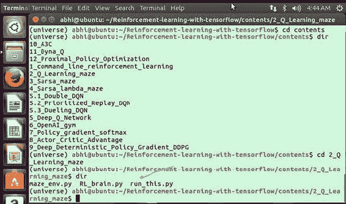

图 4-2. 运行文件

图 4-3 显示了代码的运行情况。

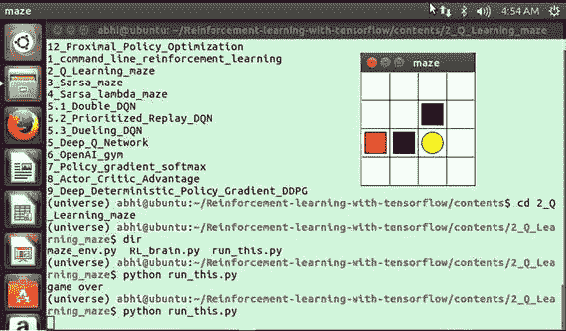

图 4-3. 正在运行的迷宫文件

## 在 Python 中使用 MDP 工具箱

MDP 工具箱提供了用于解决离散时间马尔可夫决策过程的类和函数。已实现的算法列表包括逆向归纳法、线性规划、策略迭代、Q 学习和值迭代，以及它们的几种变体。以下是 MDP 工具箱的特性（见图 4-4）：

- 八种 MDP 算法

- 使用 NumPy 进行快速数组操作

- 使用 Scipy 的稀疏包提供完整的稀疏矩阵支持
- 使用 `cvxopt` 提供可选的线性规划支持

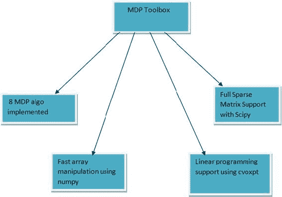 图 4-4. MDP 工具箱特性

接下来，你将看到如何为 Python 安装和配置 MDP 工具箱。首先，切换到 Anaconda 环境，如图 4-5 所示。

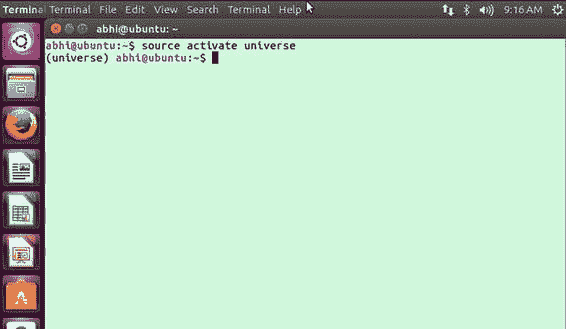 图 4-5. 激活 Anaconda 环境

现在使用以下命令安装依赖项（见图 4-6）：

```
sudo apt-get install python3-numpy python3-scipy liblapack-dev libatlas-base-dev libgsl0-dev fftw-dev libglpk-dev libdsdp-dev
```

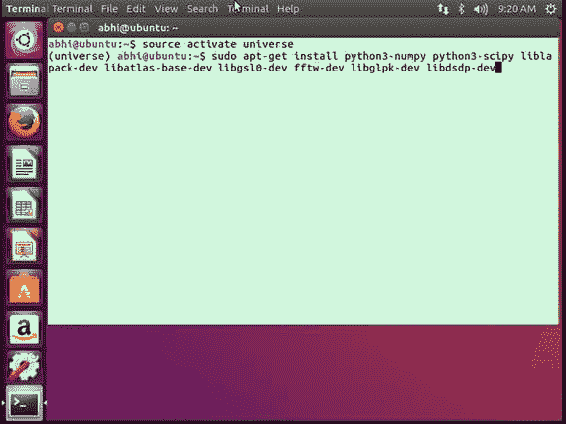 图 4-6. 安装依赖项

当询问是否安装依赖项时，选择“是”，如图 4-7 所示。

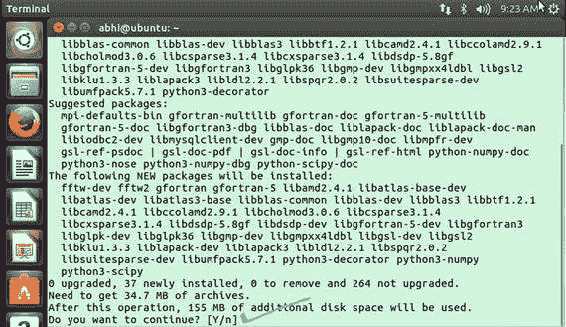 图 4-7. 选择“是”以继续

然后所有依赖项都会被安装，如图 4-8 所示。

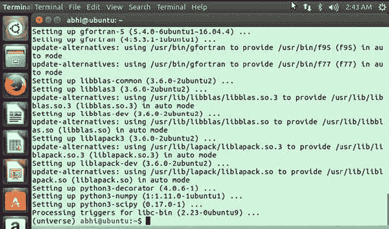 图 4-8. 依赖项已安装

现在你可以继续安装 MDP 工具箱，如图 4-9 所示。

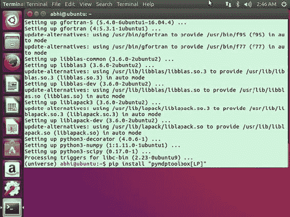 图 4-9. 安装 MDP 工具箱

重要的包正在安装中，如图 4-10 所示。

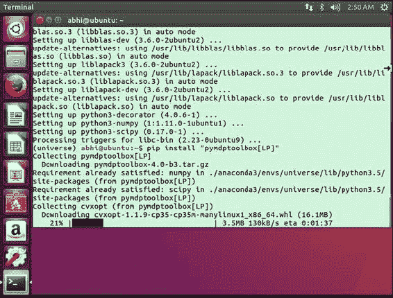 图 4-10. 安装重要包

如果一切顺利，你将获得所有已安装的包，如图 4-11 所示。

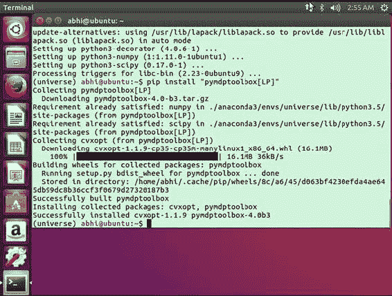 图 4-11. 所有包已安装

现在你需要从 GitHub 克隆仓库（见图 4-12）：

```
git clone https://github.com/sawcordwell/pymdptoolbox.git
```

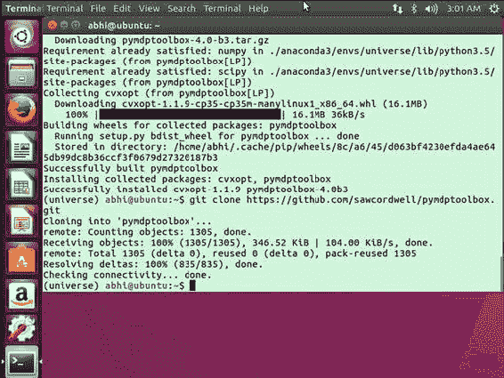 图 4-12. 克隆仓库

切换到 `mdptoolbox` 文件夹以查看详细信息，如图 4-13 所示。

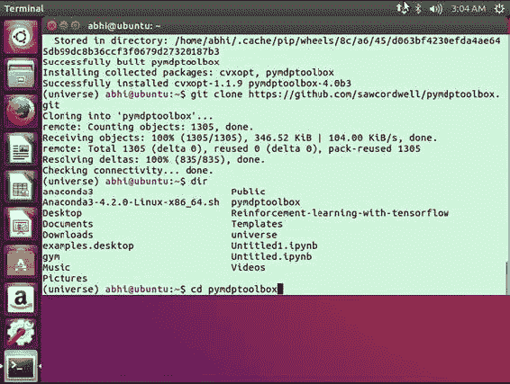 图 4-13. 进入文件夹

你现在需要切换到 Python 模式，如图 4-14 所示。

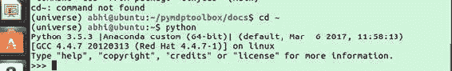 图 4-14. 进入 Python 模式

我们现在将用一个例子来演示 MDP 工具箱如何工作。首先，导入 MDP 示例，如图 4-15 所示。

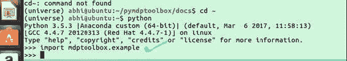 图 4-15. 导入模块

马尔可夫问题假设未来状态仅取决于当前状态，而不取决于之前发生的事件。我们将使用折扣值 0.8 来设置一个马尔可夫问题示例。要使用 MDP 工具箱中的内置示例，你需要导入 `mdptoolbox.example` 并使用值迭代算法求解。然后你需要检查最优策略。最优策略是一个函数，它允许状态以最大奖励转移到下一个状态。你可以使用 `vi.policy` 命令检查策略，如图 4-16 所示。

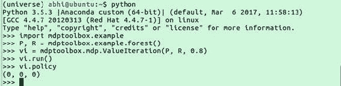 图 4-16. 执行操作

策略的输出是 `(0,0,0)`。结果显示已实施策略的折扣奖励。以下是完整程序：

```
import mdptoolbox.example
P, R = mdptoolbox.example.forest()
vi = mdptoolbox.mdp.ValueIteration(P, R, 0.8)
vi.run()
vi.policy # 结果是 (0, 0, 0)
```

让我们考虑另一个例子。首先你需要导入工具箱和工具箱示例。通过使用导入示例，你引入了 MDP 工具箱中的内置示例（见图 4-17）。

```
import mdptoolbox, mdptoolbox.example
```

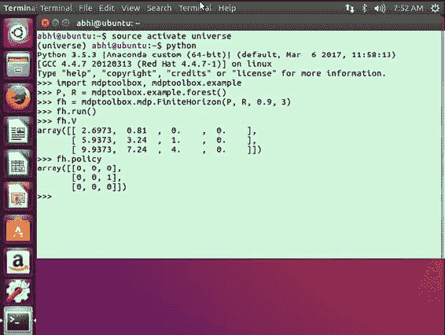 图 4-17. MDP 的另一个示例

我们在上一个示例中启用了详细模式，以便显示当前阶段和策略转置。

```
>>> import mdptoolbox, mdptoolbox.example
>>> P, R = mdptoolbox.example.forest()
>>> fh = mdptoolbox.mdp.FiniteHorizon(P, R, 0.9, 3)
>>> fh.run()
>>> fh.V
array([[ 2.6973, 0.81  , 0.    , 0.    ],
       [ 5.9373, 3.24  , 1.    , 0.    ],
       [ 9.9373, 7.24  , 4.    , 0.    ]])
>>> fh.policy
array([[0, 0, 0],
       [0, 0, 1],
       [0, 0, 0]])
```

下一个示例也处于详细模式，每次迭代都会显示策略 n-1 和 n 之间不同动作的数量（见图 4-18）。

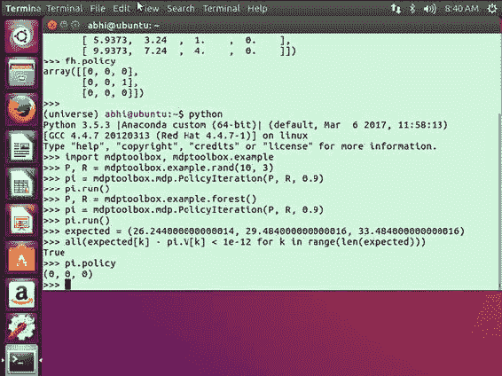 图 4-18. n-1 和 n 之间的策略

我们借助 MDP 的内置示例，尝试使用值迭代来求解折扣 MDP。与 MDP 的情况一样，一些值通过使用 `rand(10,3)` 随机生成，另一些值则由决策过程提供。在此示例中，我们尝试通过应用强化学习结合值迭代来求解 MDP：

```
>>> import mdptoolbox, mdptoolbox.example
>>> P, R = mdptoolbox.example.rand(10, 3)
>>> pi = mdptoolbox.mdp.PolicyIteration(P, R, 0.9)
>>> pi.run()
>>> P, R = mdptoolbox.example.forest()
>>> pi = mdptoolbox.mdp.PolicyIteration(P, R, 0.9)
>>> pi.run()
>>> expected = (26.244000000000014, 29.484000000000016, 33.484000000000016)
>>> all(expected[k] - pi.V[k] < 1e-12 for k in range(len(expected)))
    True
```

8.2. 马尔可夫决策过程 (MDP) 工具箱：`mdp` 模块 21 Python 马尔可夫决策过程工具箱文档，版本 4.0-b4

```
>>> pi.policy
(0, 0, 0)
```

## 理解群体智能

群体智能是人工智能的重要组成部分。它是一个去中心化、自组织系统的集体行为，无论是自然的还是人工的。群体智能通常由一群简单的智能体或人工生命程序组成，它们彼此之间以及与其环境进行局部交互，如图 4-19 所示。

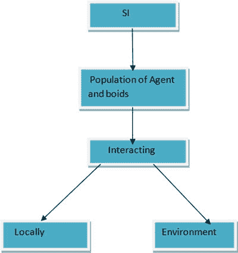 图 4-19. 群体智能交互

### 群体智能的应用

图 4-20 展示了群体智能的一些应用。

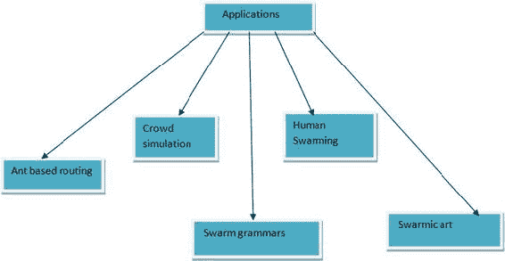 图 4-20. 群体智能的应用

#### 基于蚂蚁的路由

当你处理类似于电信网络的问题时，这被称为基于蚂蚁的路由。基于蚂蚁的路由的思想基于强化学习，因为沿着特定网络数据包（可称为蚂蚁）有大量的向前和向后移动。这会导致整个网络被淹没。

#### 人群模拟

在电影中，人群模拟是借助群体优化来完成的。

#### 人类群体智能

人类群体智能的概念基于利用不同个体的思维来共同预测答案。它指的是多个不同人类的大脑协同工作，试图为某个复杂问题找到特定解决方案。以人类群体智能的形式利用集体智慧，能够得出更精确的结果。

#### 群体语法

群体语法是特定的特征，它们如同不同的群体协同工作，以产生多样化的结果。这些结果可能与艺术或建筑类似。

##### 群体艺术

结合不同鸟类和鱼类群体行为的不同特征，可以创造出展现群体行为模式的群体艺术。在更详细地介绍群体智能之前，我们先简要提及 Rastrigin 函数。群体优化基于不同的函数，Rastrigin 函数就是其中之一，因此你需要了解它的工作原理。

### Rastrigin 函数

在数学优化问题中，Rastrigin 函数是一个非凸函数，用作优化算法的性能测试问题。其公式如图 4-21 所示，图 4-22 展示了其典型输出。

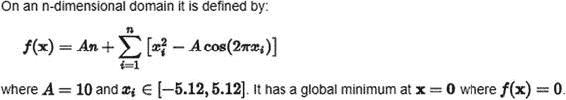 图 4-21. Rastrigin 函数示意图

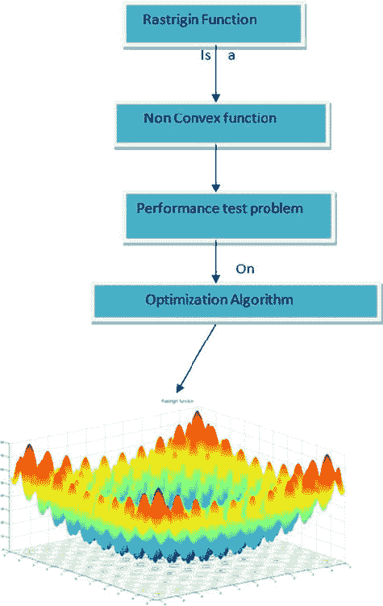 图 4-22. Rastrigin 函数输出

让我们开始用 Python 使用 Rastrigin 函数。首先需要激活 Anaconda 环境：

```
abhi@ubuntu:∼$ source activate universe
(universe) abhi@ubuntu:∼$
```

现在切换到 Python 模式：

```
(universe) abhi@ubuntu:∼$ python
Python 3.5.3 |Anaconda custom (64-bit)| (default, Mar  6 2017, 11:58:13) 
[GCC 4.4.7 20120313 (Red Hat 4.4.7-1)] on linux
Type "help", "copyright", "credits" or "license" for more information.
>>>
```

当我们开始构建重要的库时，如果这些库尚未创建，Python 会缓存它们，如图 4-23 所示。

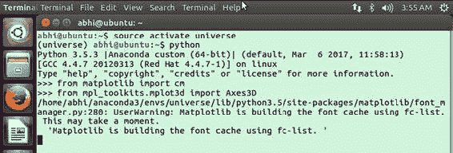 图 4-23. 正在创建缓存

Python 程序的完整流程如下：

```
python
Python 3.5.3 |Anaconda custom (64-bit)| (default, Mar  6 2017, 11:58:13) 
[GCC 4.4.7 20120313 (Red Hat 4.4.7-1)] on linux
Type "help", "copyright", "credits" or "license" for more information.
>>> from matplotlib import cm
>>> from mpl_toolkits.mplot3d import Axes3D
/home/abhi/anaconda3/envs/universe/lib/python3.5/site-packages/matplotlib/font_manager.py:280: UserWarning: Matplotlib is building the font cache using fc-list. This may take a moment.
  'Matplotlib is building the font cache using fc-list. '
>>> import math
>>> import matplotlib.pyplot as plt
>>> import numpy as np
>>> def rastrigin(*X, **kwargs):
...     A = kwargs.get('A', 10)
...     return A + sum([(x**2 - A * np.cos(2 * math.pi * x)) for x in X])
...
>>> if __name__ == '__main__':
...     X = np.linspace(-4, 4, 200)
...     Y = np.linspace(-4, 4, 200)
...
>>>     X, Y = np.meshgrid(X, Y)
  File "<stdin>", line 1
    X, Y = np.meshgrid(X, Y)
    ^
IndentationError: unexpected indent
>>>
>>>     Z = rastrigin(X, Y, A=10)
  File "<stdin>", line 1
    Z = rastrigin(X, Y, A=10)
    ^
IndentationError: unexpected indent
>>>
>>>     fig = plt.figure()
  File "<stdin>", line 1
    fig = plt.figure()
    ^
IndentationError: unexpected indent
>>>     ax = fig.gca(projection='3d')
  File "<stdin>", line 1
    ax = fig.gca(projection='3d')
    ^
IndentationError: unexpected indent
>>>
>>>     ax.plot_surface(X, Y, Z, rstride=1, cstride=1, cmap=cm.plasma, linewidth=0, antialiased=False)
  File "<stdin>", line 1
    ax.plot_surface(X, Y, Z, rstride=1, cstride=1, cmap=cm.plasma, linewidth=0, antialiased=False)
    ^
IndentationError: unexpected indent
>>>     plt.savefig('rastrigin.png')
  File "<stdin>", line 1
    plt.savefig('rastrigin.png')
    ^
IndentationError: unexpected indent
>>>
>>> if __name__ == '__main__':
...     X = np.linspace(-4, 4, 200)
...     Y = np.linspace(-4, 4, 200)
...
>>> X, Y = np.meshgrid(X, Y)
>>> Z = rastrigin(X, Y, A=10)
>>> fig = plt.figure()
>>> ax = fig.gca(projection='3d')
>>> ax.plot_surface(X, Y, Z, rstride=1, cstride=1, cmap=cm.plasma, linewidth=0, antialiased=False)
<mpl_toolkits.mplot3d.art3d.Poly3DCollection object at 0x7f79cfc73780>
>>> plt.savefig('rastrigin.png')
>>>
```

如果你回到文件夹，可以看到 `rastrigin.png` 文件已经创建，如图 4-24 所示。

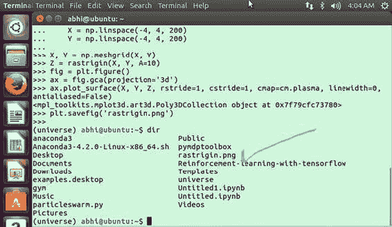 图 4-24. 正在保存 Rastrigin 函数 PNG 文件

该问题输出的 `rastrigin.png` 文件显示了极小值点，如图 4-25 所示。要找到全局最优解非常困难。

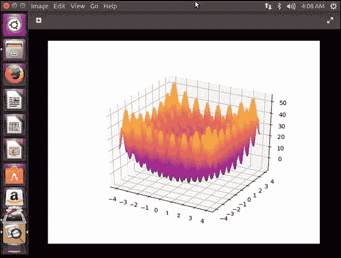 图 4-25. Rastrigin 函数 PNG 文件

### Python 中的群体智能

本节将介绍一个运用群体智能概念的 Python 程序。因此，你将了解如何在 Python 中实现粒子群优化（PSO）。你可以借助一个名为 `PySwarms` 的研究工具包来实现这一点。`PySwarms` 是一个很好的工具，可用于实现基于 PSO 方法的优化算法，例如：

*   星形拓扑
*   环形拓扑

首先，你需要安装 `PySwarms`。打开终端，并使用以下命令激活 Anaconda 环境。

```
abhi@ubuntu:∼$ source activate universe
(universe) abhi@ubuntu:∼$
```

安装 `PySwarms` 之前的依赖项如下：

*   `numpy >= 1.13.0`
*   `scipy >= 0.17.0`
*   `matplotlib >= 1.3.1`

现在按如下方式安装 `PySwarms`：

## PySwarms 安装与使用

现在安装过程已完成。图 4-26 显示 `PySwarms` 已完全安装。

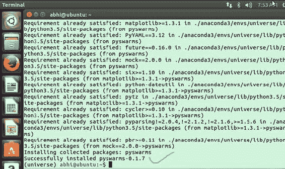

**图 4-26.** PySwarms 已安装

现在我们进入 Python 模式。

```
(universe) abhi@ubuntu:∼$ python
Python 3.5.3 |Anaconda custom (64-bit)| (default, Mar  6 2017, 11:58:13)
[GCC 4.4.7 20120313 (Red Hat 4.4.7-1)] on linux
Type "help", "copyright", "credits" or "license" for more information.
>>>
```

首先，你需要按如下方式导入 `PySwarms` 工具：

```
>>> import pyswarms as ps
```

`PySwarms` 中有多种函数可供使用，为此你需要导入：

```
>>> from pyswarms.utils.functions import single_obj as fx
```

接下来，你需要声明这些超参数：

```
>>> options = {'c1': 0.5, 'c2': 0.3, 'w':0.9}
```

在本例中，我们将群体配置为一个字典，因此称之为字典。下一步，通过传递包含必要参数的字典来创建优化器的实例。

```
>>> optimizer = ps.single.GlobalBestPSO(n_particles=10, dimensions=2, options=options)
```

之后，调用优化器方法，并存储优化后的最优成本和位置。图 4-27 显示了结果。

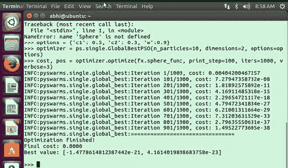

**图 4-27.** 显示结果

查看结果后，你可以看到优化器能够找到一个良好的最小值。现在你将使用局部最优 PSO 执行相同操作。你按如下方式配置并类似地声明一个字典：

```
>>> options = {'c1': 0.5, 'c2': 0.3, 'w':0.9, 'k': 2, 'p': 2}
```

创建优化器的实例：

```
>>> optimizer = ps.single.LocalBestPSO(n_particles=10, dimensions=2, options=options)
```

现在，像之前一样调用优化方法来存储值。通过使用 `verbose` 参数，你可以控制参数的详细程度，并使用 `print_step` 来设置在特定步数后进行计数。

```
>>> cost, pos = optimizer.optimize(fx.sphere_func, print_step=50, iters=1000, verbose=3)
```

输出结果如图 4-28 所示。

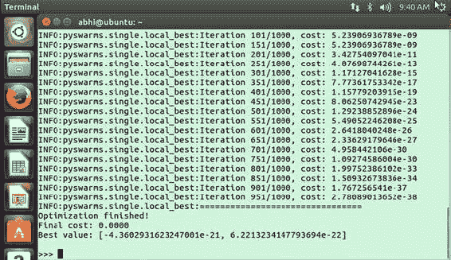

**图 4-28.** 群体优化的输出结果

## 构建游戏 AI

我们已经讨论过使用 `OpenAI Gym` 和环境模拟的游戏 AI，但本节我们将进一步深入。首先，我们将克隆游戏 AI 中最重要且最简单的示例之一，如图 4-29 所示。

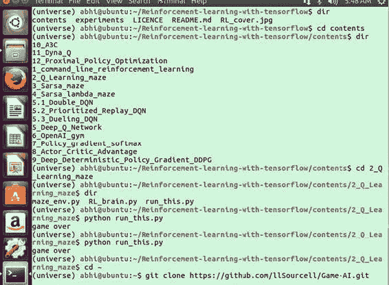

**图 4-29.** 克隆仓库

你首先需要设置环境。要求如下：

*   `TensorFlow`

*   `OpenAI Gym`

*   `virtualenv`

*   `TFLearn`

有一个依赖项需要安装——虚拟环境。你可以使用以下命令安装它：

```
conda install -c anaconda virtualenv
```

它会询问你是否要安装新的 `virtualenv` 包，如图 4-30 所示。选择是。

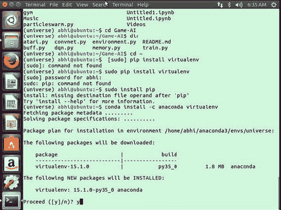

**图 4-30.** 获取 `virtualenv` 包

当包安装成功并完成后，你将看到图 4-31 所示的界面。

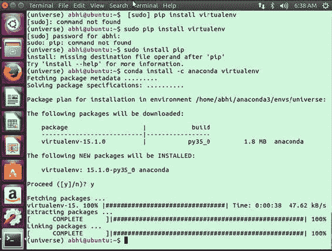

**图 4-31.** 包安装完成

现在你可以使用以下命令安装 `TFLearn`：

```
conda install -c derickl tflearn
```

当你尝试安装 `TFLearn` 时，可能会遇到关于操作系统版本不匹配的错误：

```
conda install -c derickl tflearn
Fetching package metadata .........
Solving package specifications: .
PackageNotFoundError: Package not found: ''
Package missing in current linux-64 channels:
  - tflearn

You can search for packages on anaconda.org with
    anaconda search -t conda tflearn

(universe) abhi@ubuntu:∼$ anaconda search -t conda tflearn
Using Anaconda API: https://api.anaconda.org
Run 'anaconda show <USER/PACKAGE>' to get more details:
Packages:
     Name                      |  Version | Package Types   | Platforms
     ------------------------- |   ------ | --------------- | ---------------
     asherp/tflearn            |    0.2.2 | conda           | osx-64
     contango/tflearn          |    0.3.2 | conda           | linux-64
     derickl/tflearn           |    0.2.2 | conda           | osx-64
Found 3 packages
```

如果发生这种情况，请确保安装适用于 `linux-64` 的版本：

```
(universe) abhi@ubuntu:∼$ anaconda show contango/tflearn
Using Anaconda API: https://api.anaconda.org
Name:    tflearn
Summary:
Access:  public
Package Types:  conda
Versions:
   + 0.3.2

To install this package with Anaconda, run the following command :
conda install --channel https://conda.anaconda.org/contango tflearn
```

它会要求安装其他包，如图 4-32 所示。

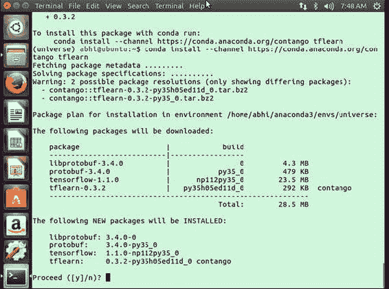

**图 4-32.** 安装其他包

现在使用以下命令导入相关库：

```
(universe) abhi@ubuntu:∼$ python
Python 3.5.3 |Anaconda custom (64-bit)| (default, Mar  6 2017, 11:58:13)
[GCC 4.4.7 20120313 (Red Hat 4.4.7-1)] on linux
Type "help", "copyright", "credits" or "license" for more information.
>>> import gym
>>> import random
>>> import numpy as np
>>> import tflearn
>>> from tflearn.layers.core import input_data, dropout, fully_connected
>>> from tflearn.layers.estimator import regression
>>> from statistics import median, mean
>>> from collections import Counter
>>> LR = 1e-3
>>> env = gym.make("CartPole-v0")
[2017-09-22 08:22:15,933] Making new env: CartPole-v0
>>> env.reset()
array([-0.03283849, -0.04877971,  0.0408221 , -0.01600674])
```

### 完整的 TFLearn 代码

## 使用 Keras、TensorFlow 和 ChainerRL 进行强化学习

首先，你需要导入重要的库。`TFLearn` 创建了原型，使程序能够非常快速地实现强化学习。添加一个学习率。通过初始化一个模拟环境，然后使用以下命令指示运动模式：`action = env.action_space.sample()`。此示例将观察结果与平衡车杆（向左或向右移动）的运动配对。在给定的问题中，强化学习的基础是我们所参考的分数。应用强化学习后，我们使用 `TFLearn` 训练模型，这是一个用于 `TensorFlow` 的模块，用于创建全连接神经网络并产生更快的训练过程。


# 强化学习示例

```python
import gym
import random
import numpy as np
import tflearn
from tflearn.layers.core import input_data, dropout, fully_connected
from tflearn.layers.estimator import regression
from statistics import median, mean
from collections import Counter

LR = 1e-3
env = gym.make("CartPole-v0")
env.reset()
goal_steps = 500
score_requirement = 50
initial_games = 10000

def some_random_games_first():
    # 每个循环都是一个独立的游戏。
    for episode in range(5):
        env.reset()
        # 这是每一帧，最多 200 帧...但我们不会跑那么远。
        for t in range(200):
            # 这将显示环境
            # 只有当你真的想看到它时才显示。
            # 显示它会花费更长的时间。
            env.render()
            # 这将在任何环境中创建一个样本动作。
            # 在这个环境中，动作可以是 0 或 1，分别代表左或右
            action = env.action_space.sample()
            # 这使用一个动作执行环境，
            # 并返回环境的观察结果、
            # 奖励、环境是否结束以及其他信息。
            observation, reward, done, info = env.step(action)
            if done:
                break

some_random_games_first()

def initial_population():
    # [观察结果, 动作]
    training_data = []
    # 所有分数：
    scores = []
    # 仅达到阈值的分数：
    accepted_scores = []
    # 遍历我们想要的任意数量的游戏：
    for _ in range(initial_games):
        score = 0
        # 专门针对此环境的动作：
        game_memory = []
        # 我们看到的先前观察结果
        prev_observation = []
        # 对于 200 帧中的每一帧
        for _ in range(goal_steps):
            # 选择随机动作（0 或 1）
            action = random.randrange(0,2)
            # 执行它！
            observation, reward, done, info = env.step(action)
            # 注意，观察结果是从动作返回的
            # 所以我们将在此处存储先前的观察结果，将
            # 先前的观察结果与我们将要采取的动作配对。
            if len(prev_observation) > 0 :
                game_memory.append([prev_observation, action])
            prev_observation = observation
            score+=reward
            if done: break
        # 如果我们的分数高于阈值，我们希望保存
        # 我们所做的每一步
        # 注意这里的强化学习方法。
        # 我们所做的只是强化分数，我们并不试图
        # 以任何方式影响机器如何达到该分数。
        if score >= score_requirement:
            accepted_scores.append(score)
            for data in game_memory:
                # 转换为独热编码（这是我们神经网络的输出层）
                if data[1] == 1:
                    output = [0,1]
                elif data[1] == 0:
                    output = [1,0]
                # 保存我们的训练数据
                training_data.append([data[0], output])
        # 重置环境以再次游戏
        env.reset()
        # 保存所有分数
        scores.append(score)
    # 以防你以后想参考
    training_data_save = np.array(training_data)
    np.save('saved.npy',training_data_save)
    # 一些统计数据，进一步说明神经网络的魔力！
    print('平均接受分数:',mean(accepted_scores))
    print('接受分数的中位数:',median(accepted_scores))
    print(Counter(accepted_scores))
    return training_data

def neural_network_model(input_size):
    network = input_data(shape=[None, input_size, 1], name='input')
    network = fully_connected(network, 128, activation='relu')
    network = dropout(network, 0.8)
    network = fully_connected(network, 256, activation='relu')
    network = dropout(network, 0.8)
    network = fully_connected(network, 512, activation='relu')
    network = dropout(network, 0.8)
    network = fully_connected(network, 256, activation='relu')
    network = dropout(network, 0.8)
    network = fully_connected(network, 128, activation='relu')
    network = dropout(network, 0.8)
    network = fully_connected(network, 2, activation='softmax')
    network = regression(network, optimizer='adam', learning_rate=LR, loss='categorical_crossentropy', name='targets')
    model = tflearn.DNN(network, tensorboard_dir='log')
    return model

def train_model(training_data, model=False):
    X = np.array([i[0] for i in training_data]).reshape(-1,len(training_data[0][0]),1)
    y = [i[1] for i in training_data]
    if not model:
        model = neural_network_model(input_size = len(X[0]))
        x = np.reshape(x, (-1, 30, 9))
    model.fit({'input': X}, {'targets': y}, n_epoch=5, snapshot_step=500, show_metric=True, run_id='openai_learning')
    return model

model = train_model(training_data)

scores = []
choices = []
for each_game in range(10):
    score = 0
    game_memory = []
    prev_obs = []
    env.reset()
    for _ in range(goal_steps):
        env.render()
        if len(prev_obs)==0:
            action = random.randrange(0,2)
        else:
            action = np.argmax(model.predict(prev_obs.reshape(-1,len(prev_obs),1))[0])
        choices.append(action)
        new_observation, reward, done, info = env.step(action)
        prev_obs = new_observation
        game_memory.append([new_observation, action])
        score+=reward
        if done: break
    scores.append(score)

print('平均分数:',sum(scores)/len(scores))
print('选择 1:{}  选择 0:{}'.format(choices.count(1)/len(choices),choices.count(0)/len(choices)))
print(score_requirement)
```

以下是输出结果：

```
平均分数: 195.9
选择 1:0.5074017355793773  选择 0:0.49259826442062277
50
已解决。
```

## 结论

本章涉及了 Q 学习，然后展示了一些示例。它还涵盖了 MDP 工具箱、群体智能和游戏 AI，并以一个完整的示例结束。第 5 章介绍了使用 Keras、TensorFlow 和 ChainerRL 进行强化学习。

© Abhishek Nandy and Manisha Biswas 2018  

Abhishek Nandy and Manisha Biswas  

强化学习  

`doi.org/10.1007/978-1-4842-3285-9_5`
