# 5. 使用 Keras、TensorFlow 和 ChainerRL 进行强化学习

Abhishek Nandy¹ and Manisha Biswas²  

(1) 印度西孟加拉邦加尔各答 Swaranika Co-Opt HSG 大楼 HIG L-2/4 室  

(2) 印度西孟加拉邦北 24 帕尔加纳区

本章介绍了如何将 Keras 与强化学习结合使用，并定义了如何将 Keras 用于深度 Q 学习。

## 什么是 Keras？

Keras 是一个用于神经网络的**开源**前端库。我们可以说它充当了神经网络的骨干，因为它具有非常强大的激活函数构建能力。Keras 可以将不同的深度学习框架作为后端运行。Keras 可与众多深度学习框架协同工作。从一个框架切换到另一个框架的方法是修改 `keras.json` 文件，该文件位于 Keras 的安装目录中。需要按如下方式修改 `backend` 参数：`{ "backend" : "tensorflow" }`。如果你愿意，可以将该参数从 TensorFlow 更改为其他框架。在 JSON 文件中，如果你想将其与 Theano 或 CNTK 一起使用，可以通过更改 `backend` 参数来实现。`keras.json` 文件的结构如下所示：

```
{
    "image_data_format": "channels_last",
    "epsilon": 1e-07,
    "floatx": "float32",
    "backend": "tensorflow"
}
```

所有 Keras 框架的流程如图 5-1 所示。

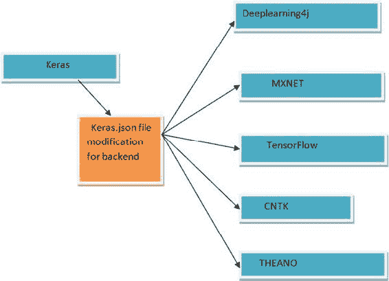

图 5-1. Keras 及其在不同框架下的修改

## 使用 Keras 进行强化学习

本节介绍如何安装 Keras，并展示一个强化学习的示例。首先需要安装依赖项。依赖项如下：

- Python

- Keras 1.0

- Pygame

- Scikit-image

让我们开始安装 Keras 1.0。以下示例展示了如何从 Anaconda 环境中安装 Keras：

```
conda install -c jaikumarm keras
```

系统会请求许可安装新包。选择“是”以继续，如图 5-2 所示。

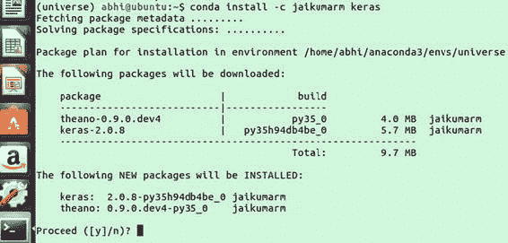

图 5-2. 待安装的更新

当包安装成功并完成后，你将看到如图 5-3 所示的信息。

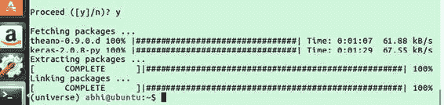

图 5-3. 包安装完成

你也可以通过其他方式安装 Keras。以下示例展示了如何使用 `pip3` 进行安装。首先，使用 `sudo apt update` 命令，如下所示：

```
(universe) abhi@ubuntu:∼$ sudo apt-get update
```

然后安装 `pip3`，如下所示：

```
sudo apt-get -y install python3-pip
```

图 5-4 展示了安装过程。

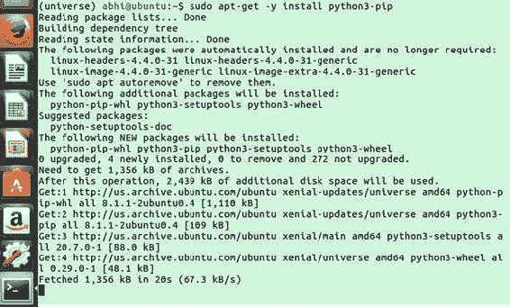

图 5-4. 安装 `pip3`

安装完依赖项后，你需要安装 Keras（见图 5-5）：

```
(universe) abhi@ubuntu:∼$ sudo pip3 install keras
```

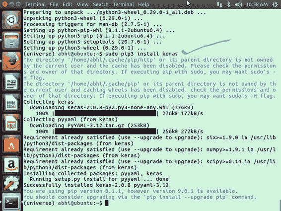

图 5-5. 安装 Keras

现在我们将检查 Keras 是否使用了 TensorFlow 后端。从你之前启用的终端 Anaconda 环境中，需要切换到 Python 模式。如果导入 Keras 时得到以下结果，则说明一切正常（见图 5-6）。

```
(universe) abhi@ubuntu:∼$ python
Python 3.5.3 |Anaconda custom (64-bit)| (default, Mar  6 2017, 11:58:13)
[GCC 4.4.7 20120313 (Red Hat 4.4.7-1)] on linux
Type "help", "copyright", "credits" or "license" for more information.
>>> import keras
Using TensorFlow backend.
```

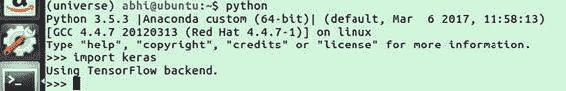

图 5-6. 使用 TensorFlow 后端的 Keras

## 使用 ChainerRL

本节介绍 ChainerRL，并解释如何使用它应用强化学习。ChainerRL 是一个深度强化学习库，特别借助 Chainer 框架构建。见图 5-7。

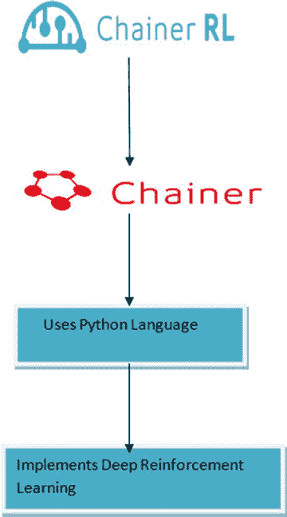

图 5-7. ChainerRL

### 安装 ChainerRL

我们将首先从终端窗口安装 ChainerRL。图 5-8 展示了 Anaconda 环境。

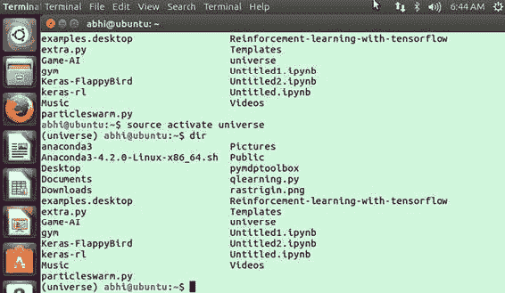

图 5-8. 激活 Anaconda 环境

现在你可以安装 ChainerRL。为此，在终端中输入以下命令：

```
pip install chainerrl
```

图 5-9 显示了安装结果。

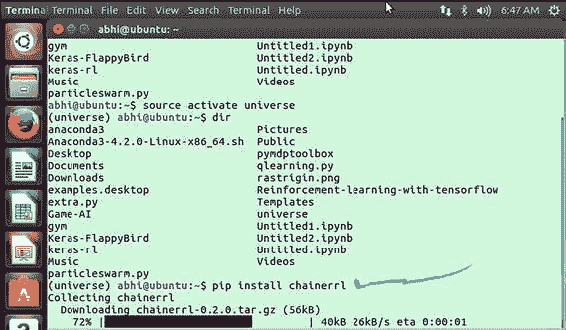

图 5-9. 安装 ChainerRL

现在你可以 `git clone` 该仓库。使用以下命令：

```
git clone https://github.com/chainer/chainerrl.git
```

图 5-10 显示了结果。

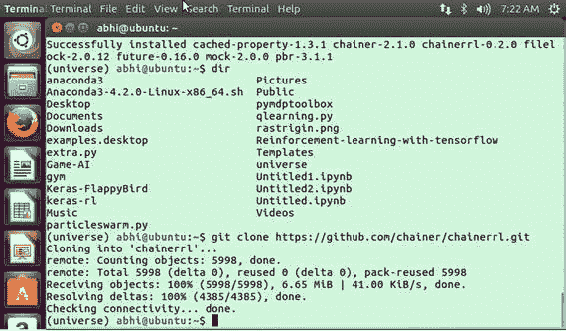

图 5-10. 克隆 ChainerRL

然后进入 `chainerrl` 文件夹，如图 5-11 所示。

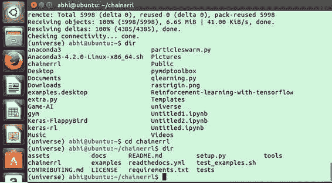

图 5-11. 进入 `chainerrl` 文件夹

#### 使用 ChainerRL 的流程

由于该库基于 Python，因此首选语言自然是 Python。请按照以下步骤设置 ChainerRL：

1.  导入 `gym`、`numpy` 和支持性的 `chainerrl` 库。

```python
import chainer
import chainer.functions as F
import chainer.links as L
import chainerrl
import gym
import numpy as np
```

你需要建模一个环境，以便使用 OpenAI Gym（见图 5-12）。该环境包含两个空间：

-   观测空间

-   动作空间

它们必须包含两个方法：`reset` 和 `step`。

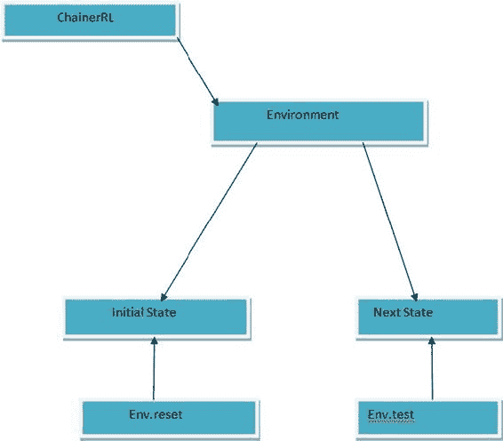  

图 5-12. ChainerRL 如何使用状态转换

2.  从 OpenAI 模拟环境中获取一个模拟环境，例如 `Cartpole-v0`。

```python
env = gym.make('CartPole-v0')
print('observation space:', env.observation_space)
print('action space:', env.action_space)
obs = env.reset()
env.render()
print('initial observation:', obs)
action = env.action_space.sample()
obs, r, done, info = env.step(action)
print('next observation:', obs)
print('reward:', r)
print('done:', done)
print('info:', info)
```

3.  现在定义一个智能体，它将通过与环境的交互来运行。这里使用的是 `QFunction`（`chainer.Chain`）类：

```python
def __init__(self, obs_size, n_actions, n_hidden_channels=50):
    super().__init__(
        l0=L.Linear(obs_size, n_hidden_channels),
        l1=L.Linear(n_hidden_channels, n_hidden_channels),
        l2=L.Linear(n_hidden_channels, n_actions))

def __call__(self, x, test=False):
    """
    Args:
        x (ndarray or chainer.Variable): An observation
        test (bool): a flag indicating whether it is in test mode
    """
    h = F.tanh(self.l0(x))
    h = F.tanh(self.l1(h))
    return chainerrl.action_value.DiscreteActionValue(self.l2(h))

obs_size = env.observation_space.shape[0]
n_actions = env.action_space.n
q_func = QFunction(obs_size, n_actions)
```

我们应用 Q 学习等。我们从智能体开始。

```python
gamma = 0.95

## 使用 epsilon-greedy 进行探索
explorer = chainerrl.explorers.ConstantEpsilonGreedy(
    epsilon=0.3, random_action_func=env.action_space.sample)

# DQN 使用经验回放。
# 指定一个回放缓冲区及其容量。
replay_buffer = chainerrl.replay_buffer.ReplayBuffer(capacity=10 ** 6)

# 由于 CartPole-v0 的观测值是 numpy.float64 类型，而
# Chainer 默认只接受 numpy.float32 类型，因此
# 指定一个转换器作为特征提取函数 phi。
phi = lambda x: x.astype(np.float32, copy=False)

# 现在创建一个将与环境交互的智能体。
agent = chainerrl.agents.DoubleDQN(
    q_func, optimizer, replay_buffer, gamma, explorer,
    replay_start_size=500, update_interval=1,
    target_update_interval=100, phi=phi)
```

4.  开始强化学习过程。你首先需要在 Universe 环境中打开 jupyter notebook，如图 5-13 所示。

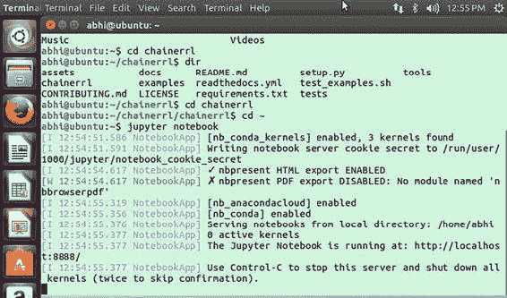  

图 5-13. 进入 jupyter notebook

```
abhi@ubuntu:∼$ source activate universe
(universe) abhi@ubuntu:∼$ jupyter notebook
```

图 5-14 展示了最终运行代码的情况。

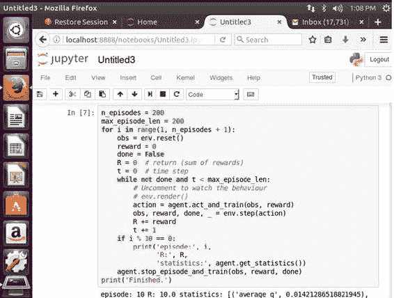  

图 5-14. 运行代码

5.  现在测试智能体，如图 5-15 所示。

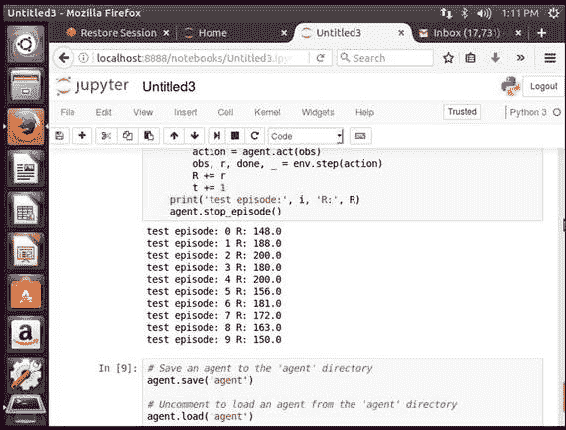  

图 5-15. 测试智能体

我们在 jupyter notebook 中完成了整个程序。现在我们将处理其中一个仓库，以理解使用 TensorFlow 的深度 Q 学习。见图 5-16。

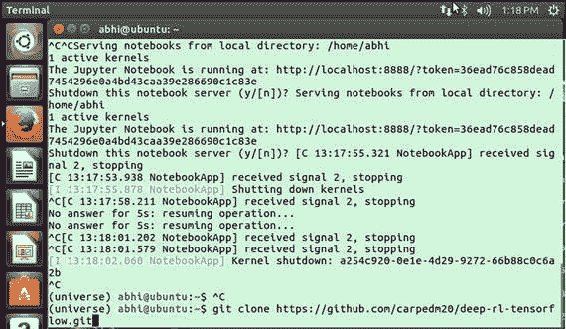  

图 5-16. 克隆 GitHub 仓库

首先，你需要按如下方式安装先决条件（见图 5-17）：

```
pip install -U 'gym[all]' tqdm scipy
```

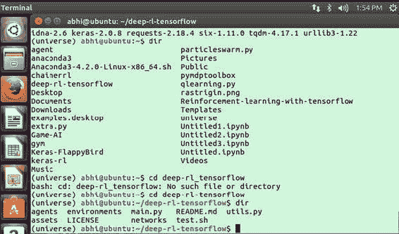  

图 5-17. 进入文件夹

然后运行程序并在不使用 GPU 支持的情况下进行训练，如图 5-18 所示。

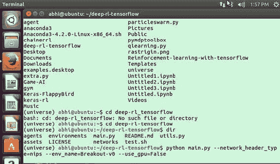  

图 5-18. 在不使用 GPU 支持的情况下训练程序

命令如下：

```
$ python main.py --network_header_type=nips --env_name=Breakout-v0 --use_gpu=False
```

该命令使用 `main.py` Python 文件，并仅在 CPU 模式下运行 Breakout 游戏模拟。

现在你可以打开终端进入 Anaconda 环境，如图 5-19 所示。

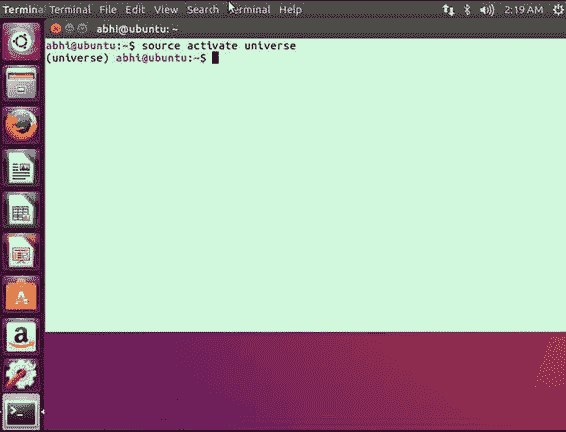  

图 5-19. 激活环境

现在切换到 Python 模式，如图 5-20 所示：

```
(universe) abhi@ubuntu:∼$ python
Python 3.5.3 |Anaconda custom (64-bit)| (default, Mar  6 2017, 11:58:13)
[GCC 4.4.7 20120313 (Red Hat 4.4.7-1)] on linux
Type "help", "copyright", "credits" or "license" for more information.
>>>
```

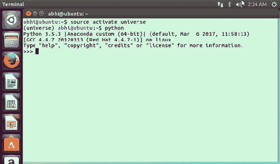  

图 5-20. 切换到 Python 模式

当你切换到 Python 模式时，首先导入工具：

```python
import gym
import numpy as np
```

为了在冰冻湖模拟中获取观测值，你需要按如下方式构建 Q 表：

```python
Q = np.zeros([env.observation_space.n, env.action_space.n])
```

之后，声明学习率并创建列表以包含每个状态的奖励。

```python
import gym
import numpy as np

env = gym.make('FrozenLake-v0')

## 用全零初始化表格
Q = np.zeros([env.observation_space.n, env.action_space.n])

## 设置学习参数
lr = .8
y = .95
num_episodes = 2000

## 创建列表以包含每幕的总奖励和步数
### jList = []
rList = []

for i in range(num_episodes):
    # 重置环境并获取第一个新观测值
    s = env.reset()
    rAll = 0
    d = False
    j = 0
    # Q-表学习算法
    while j < 99:
        j += 1
        # 通过贪婪（带噪声）从 Q 表中选择一个动作
        a = np.argmax(Q[s, :] + np.random.randn(1, env.action_space.n) * (1. / (i + 1)))
        # 从环境获取新状态和奖励
        s1, r, d, _ = env.step(a)
        # 用新知识更新 Q-表
        Q[s, a] = Q[s, a] + lr * (r + y * np.max(Q[s1, :]) - Q[s, a])
        rAll += r
        s = s1
        if d == True:
            break
    # jList.append(j)
    rList.append(rAll)

print("Score over time: " + str(sum(rList) / num_episodes))
print("Final Q-Table Values")
print(Q)
```

完成所有步骤后，你最终可以打印 Q 表。每一行都应放入 Python 模式。

## 深度 Q 学习：使用 Keras 和 TensorFlow

我们将涉及使用 Keras 的深度 Q 学习。我们将克隆一个重要的强化学习库，即 `Keras-rl`。它包含深度 Q 学习算法的多种状态。见图 5-21。

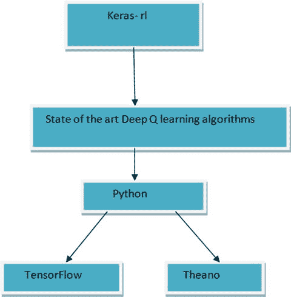

图 5-21. Keras-rl 表示

### 安装 Keras-rl

安装 `Keras-rl` 的命令如下（见图 5-22）：

```
pip install keras-rl
```

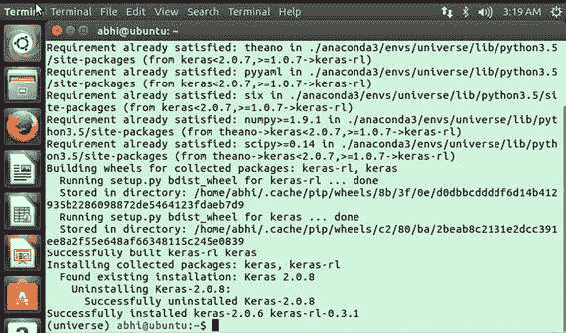

图 5-22. 安装 Keras-rl

如果尚未安装 `h5py`，你还需要安装它，然后克隆仓库，如图 5-23 所示。

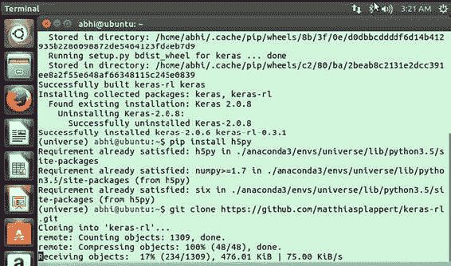

图 5-23. 克隆 git 仓库

### 使用 Keras-rl 进行训练

在本节中，你将了解如何运行程序。首先，进入 `rl` 文件夹，如图 5-24 所示。

```
abhi@ubuntu:∼$ cd keras-rl
abhi@ubuntu:∼/keras-rl$ dir
assets  examples           LICENSE     pytest.ini  rl         setup.py
docs    ISSUE_TEMPLATE.md  mkdocs.yml  README.md   setup.cfg  tests
abhi@ubuntu:∼/keras-rl$ cd examples
abhi@ubuntu:∼/keras-rl/examples$ dir
cem_cartpole.py   dqn_atari.py     duel_dqn_cartpole.py  sarsa_cartpole.py
ddpg_pendulum.py  dqn_cartpole.py  naf_pendulum.py      visualize_log.py
abhi@ubuntu:∼/keras-rl/examples$
```

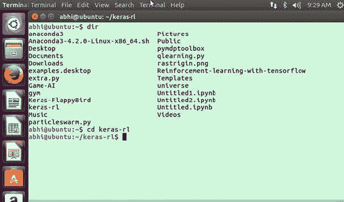 图 5-24. 进入 Keras-rl 目录

现在你可以运行其中一个示例：

```
abhi@ubuntu:∼/keras-rl/examples$ python dqn_cartpole.py
```

激活 anaconda 环境（universe）

```
abhi@ubuntu:∼/keras-rl/examples$ python dqn_cartpole.py
```

见图 5-25。

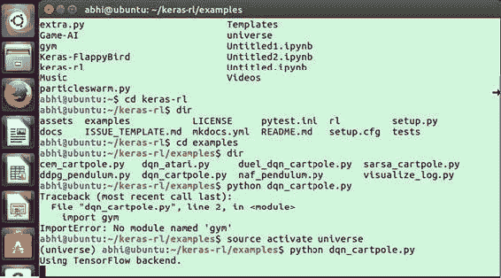 图 5-25. 使用 TensorFlow 后端

模拟现在将开始，如图 5-26 所示。

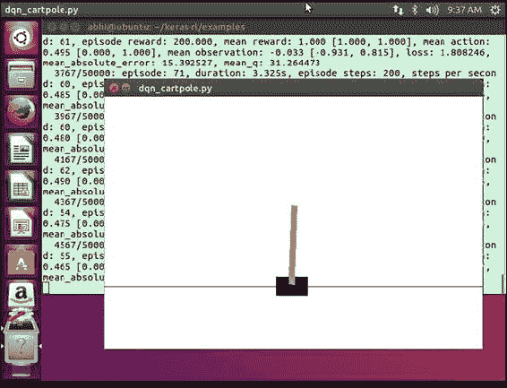 图 5-26. 模拟进行中

模拟运行并使用深度 Q 学习训练模型。通过练习，小车-杆将沿着绳索保持平衡；其稳定性随着学习而提高。整个过程会生成以下日志：

```
(universe) abhi@ubuntu:∼/keras-rl/examples$ python dqn_cartpole.py
Using TensorFlow backend.
[2017-09-24 09:36:27,476] Making new env: CartPole-v0
_________________________________________________________________
Layer (type)                 Output Shape              Param #
=================================================================
flatten_1 (Flatten)          (None, 4)                 0
_________________________________________________________________
dense_1 (Dense)              (None, 16)                80
_________________________________________________________________
activation_1 (Activation)    (None, 16)                0
_________________________________________________________________
dense_2 (Dense)              (None, 16)                272
_________________________________________________________________
activation_2 (Activation)    (None, 16)                0
_________________________________________________________________
dense_3 (Dense)              (None, 16)                272
_________________________________________________________________
activation_3 (Activation)    (None, 16)                0
_________________________________________________________________
dense_4 (Dense)              (None, 2)                 34
_________________________________________________________________
activation_4 (Activation)    (None, 2)                 0
=================================================================
Total params: 658
Trainable params: 658
Non-trainable params: 0
_________________________________________________________________
None
2017-09-24 09:36:27.932219: W tensorflow/core/platform/cpu_feature_guard.cc:45] The TensorFlow library wasn't compiled to use AVX instructions, but these are available on your machine and could speed up CPU computations.
...
    712/50000: episode: 38, duration: 0.243s, episode steps: 14, steps per second: 58, episode reward: 14.000, mean reward: 1.000 [1.000, 1.000], mean action: 0.500 [0.000, 1.000], mean observation: 0.105 [-0.568, 0.957], loss: 0.291389, mean_absolute_error: 3.054634, mean_q: 5.816398
```

这些 episode 是模拟的迭代过程。接下来讨论 `cartpole.py` 代码。首先需要导入工具包。包含的工具包非常有用，因为它们内置了用于应用深度 Q 学习的智能体。首先，按如下方式声明环境：

```python
ENV_NAME = 'CartPole-v0'
env = gym.make(ENV_NAME)
```

由于我们想要实现深度 Q 学习，我们使用参数来初始化卷积神经网络（CNN）。我们还使用激活函数来传播神经网络。我们保持其顺序结构。

```python
model = Sequential()
model.add(Flatten(input_shape=(1,) + env.observation_space.shape))
model.add(Dense(16))
model.add(Activation('relu'))
model.add(Dense(16))
model.add(Activation('relu'))
model.add(Dense(16))
model.add(Activation('relu'))
model.add(Dense(nb_actions))
model.add(Activation('linear'))
```

你也可以打印模型详情，如下所示：

```python
print(model.summary())
```

接下来，配置模型并借助一个函数使用所有强化学习选项。

```python
import numpy as np
import gym
from keras.models import Sequential
from keras.layers import Dense, Activation, Flatten
from keras.optimizers import Adam
from rl.agents.dqn import DQNAgent
from rl.policy import BoltzmannQPolicy
from rl.memory import SequentialMemory

ENV_NAME = 'CartPole-v0'
# 获取环境并提取动作数量。
env = gym.make(ENV_NAME)
np.random.seed(123)
env.seed(123)
nb_actions = env.action_space.n

# 接下来，我们构建一个非常简单的模型。
model = Sequential()
model.add(Flatten(input_shape=(1,) + env.observation_space.shape))
model.add(Dense(16))
model.add(Activation('relu'))
model.add(Dense(16))
model.add(Activation('relu'))
model.add(Dense(16))
model.add(Activation('relu'))
model.add(Dense(nb_actions))
model.add(Activation('linear'))
print(model.summary())

# 最后，我们配置并编译我们的智能体。你可以使用任何内置的 Keras 优化器，
# 甚至包括评估指标！
memory = SequentialMemory(limit=50000, window_length=1)
policy = BoltzmannQPolicy()
dqn = DQNAgent(model=model, nb_actions=nb_actions, memory=memory, nb_steps_warmup=10,
               target_model_update=1e-2, policy=policy)
dqn.compile(Adam(lr=1e-3), metrics=['mae'])

# 好了，现在是时候学习一些东西了！我们在此可视化训练过程以供展示，但这会
# 大大降低训练速度。你随时可以使用 Ctrl + C 安全地提前中止训练。
dqn.fit(env, nb_steps=50000, visualize=True, verbose=2)

# 训练完成后，我们保存最终的权重。
dqn.save_weights('dqn_{}_weights.h5f'.format(ENV_NAME), overwrite=True)

# 最后，在 5 个 episode 上评估我们的算法。
dqn.test(env, nb_episodes=5, visualize=True)
```

要获得 `Keras-rl` 的所有功能，你需要在 `Keras-rl` 文件夹内运行 `setup.py` 文件，如下所示：

```
(universe) abhi@ubuntu:∼/keras-rl$ python setup.py install
```

你会看到所有依赖项正在逐个安装：

```
running install
running bdist_egg
running egg_info
creating keras_rl.egg-info
writing requirements to keras_rl.egg-info/requires.txt
writing dependency_links to keras_rl.egg-info/dependency_links.txt
writing top-level names to keras_rl.egg-info/top_level.txt
writing keras_rl.egg-info/PKG-INFO
writing manifest file 'keras_rl.egg-info/SOURCES.txt'
reading manifest file 'keras_rl.egg-info/SOURCES.txt'
writing manifest file 'keras_rl.egg-info/SOURCES.txt'
installing library code to build/bdist.linux-x86_64/egg
running install_lib
running build_py
creating build
creating build/lib
creating build/lib/tests
copying tests/__init__.py -> build/lib/tests
creating build/lib/rl
copying rl/util.py -> build/lib/rl
copying rl/callbacks.py -> build/lib/rl
copying rl/keras_future.py -> build/lib/rl
copying rl/memory.py -> build/lib/rl
copying rl/random.py -> build/lib/rl
copying rl/core.py -> build/lib/rl
copying rl/__init__.py -> build/lib/rl
copying rl/policy.py -> build/lib/rl
creating build/lib/tests/rl
copying tests/rl/test_util.py -> build/lib/tests/rl
copying tests/rl/util.py -> build/lib/tests/rl
copying tests/rl/test_memory.py -> build/lib/tests/rl
copying tests/rl/test_core.py -> build/lib/tests/rl
copying tests/rl/__init__.py -> build/lib/tests/rl
creating build/lib/tests/rl/agents
copying tests/rl/agents/test_cem.py -> build/lib/tests/rl/agents
copying tests/rl/agents/__init__.py -> build/lib/tests/rl/agents
copying tests/rl/agents/test_ddpg.py -> build/lib/tests/rl/agents
copying tests/rl/agents/test_dqn.py -> build/lib/tests/rl/agents
creating build/lib/rl/agents
copying rl/agents/sarsa.py -> build/lib/rl/agents
copying rl/agents/ddpg.py -> build/lib/rl/agents
copying rl/agents/dqn.py -> build/lib/rl/agents
copying rl/agents/cem.py -> build/lib/rl/agents
copying rl/agents/__init__.py -> build/lib/rl/agents
```

`Keras-rl` 现已设置完成，你可以充分利用其内置函数。

## 结论

本章介绍并定义了 Keras，解释了如何将其与强化学习结合使用。本章还说明了如何将 TensorFlow 用于强化学习，并讨论了 ChainerRL 的使用。第 6 章将介绍 Google DeepMind 和强化学习的未来。© Abhishek Nandy and Manisha Biswas 2018 Abhishek Nandy and Manisha Biswas Reinforcement Learning `doi.org/10.1007/978-1-4842-3285-9_6`