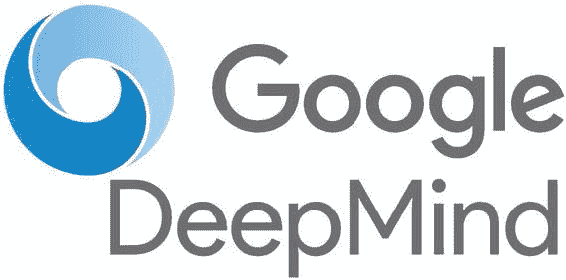
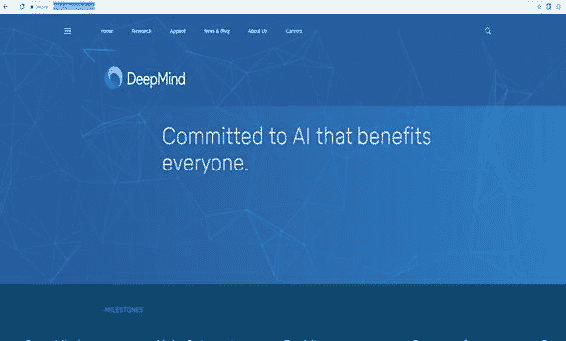
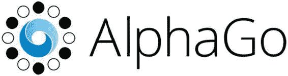
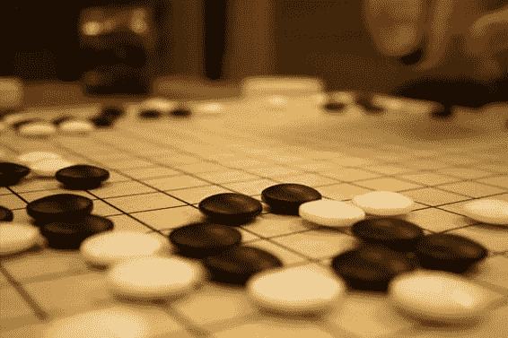
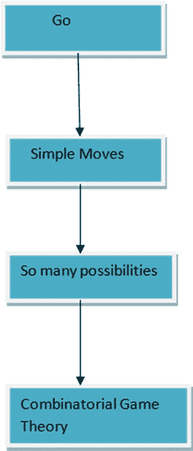
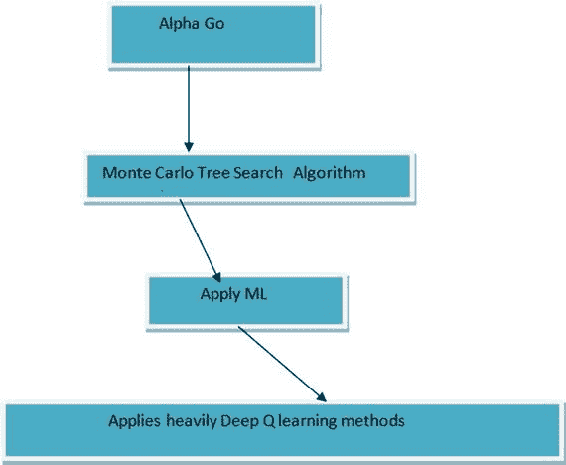
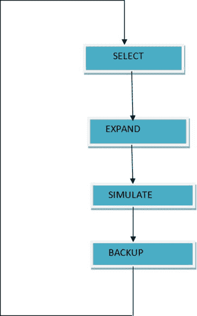
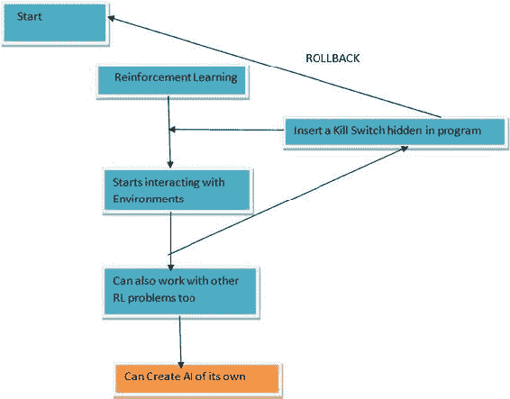

# 6. Google DeepMind 与强化学习的未来

Abhishek Nandy¹ 和 Manisha Biswas² (1) 印度西孟加拉邦加尔各答 Swaranika Co-Opt HSG 大楼 HIG L-2/4 号 (2) 印度西孟加拉邦北 24 帕尔加纳区

本章讨论 Google DeepMind 和 Google AlphaGo，然后探讨强化学习的未来，并比较人类与机器之间的现状。

## Google DeepMind

成立 Google DeepMind（见图 6-1）的目的是将人工智能提升到新高度。Google 在此方面的目标和动机是研究和开发能够解决复杂问题的程序，而无需教导其执行步骤。

 图 6-1. Google DeepMind 标志

访问 DeepMind 网站的链接是 [`deepmind.com/`](https://deepmind.com/)。该网站（见图 6-2）包含所有详细信息以及他们正在进行的未来工作。网站上提供出版物和研究选项。

 图 6-2. DeepMind 网站

你会看到该网站有许多可供搜索和探索的主题。

## Google AlphaGo

本节将介绍 AlphaGo（见图 6-3），它是 Google DeepMind 团队的最佳解决方案之一。

 图 6-3. Google AlphaGo 标志

### 什么是 AlphaGo？

AlphaGo 是 Google 开发的围棋程序，围棋是一种传统的双人抽象策略棋盘游戏。游戏的目标是占据比对手更多的领地。图 6-4 展示了围棋棋盘。尽管规则简单，但围棋的可能解法数量超过了可见宇宙中的原子数量！

 图 6-4. 围棋棋盘（图片由 Jaro Larnos 提供，[`www.flickr.com/photos/jlarnos/`](https://www.flickr.com/photos/jlarnos/)，基于 CC-BY 2.0 许可使用）

围棋游戏的概念及其包含的底层数学术语如图 6-5 所示。

 图 6-5. 围棋游戏的概念

AlphaGo 是第一个击败人类职业围棋选手的计算机程序，也是第一个击败围棋世界冠军的程序，并且可以说是历史上最优秀的围棋选手。图 6-6 展示了 AlphaGo 的方法。

 图 6-6. Deep Q 方法

### 蒙特卡洛搜索

蒙特卡洛搜索（MCS）基于人工智能树遍历方法。它使用一组独特的行为在树中移动。MCS 首先选择它可以遍历的每个状态，如声明的策略所述。达到一定深度后，策略不允许状态继续遍历。然后 MCS 从该状态扩展到可以随机采取的可能动作。通过这种方式，你使用基于 MCS 的模拟来遍历所有可能状态以获得奖励。当你进行随机模拟路径时，如果你从一个状态切换到另一个状态，你也会获得随机路径的 Q 状态值。从获得的 Q 状态中，你可以备份信息并移动到顶部。整个过程如图 6-7 所示。

 图 6-7. 蒙特卡洛搜索树过程

AlphaGo 依赖于两个组件：树搜索过程和引导树搜索过程的卷积网络。总共训练了三种不同种类的卷积网络：两种策略网络和一种价值网络。

## 人类 vs. 机器

随着强化学习的出现，更多的工作正在被自动化，许多低级工作由机器完成。现在的焦点是强化学习如何解决不同问题并改变地球的福祉。例如，强化学习可用于医疗保健领域。与其使用同样老旧的工具进行身体扫描，我们可以训练机器人和医疗设备，以更快的速度和更高的精度扫描身体部位用于不同的诊断目的。通过反复训练，执行更复杂测量和扫描的决策也可以交给机器。

### 人工智能的积极方面

当我们收集信息和资源时，系统通过学习，这就是认知建模的应用。这被称为认知方式。通过增强相互交互并实现更统一目标的认知建模设备，可以实现技术奇点。一个优秀的强人工智能解决方案是无私的，将他人利益置于一切之上。一个优秀的人工智能解决方案始终为团队服务。通过添加人类同理心（如脑电波所示），我们可以创造出看似富有同情心的优秀人工智能解决方案。将拓扑视图应用于人工智能世界有助于简化活动，并允许每个拓扑掌握特定的独特任务。

### 人工智能的消极方面

也可能存在消极方面。例如，如果机器学习速度如此之快，以至于开始与其他机器对话并创建自己的人工智能，那该怎么办？在这种情况下，人类将难以预测最终结果。我们需要考虑这些情况。也许每个人工智能解决方案都需要一个秘密的终止开关，如图 6-8 所示。

 图 6-8. 插入一个终止开关以防万一

以下是这个基本过程的步骤：

1. 我们启动一个程序。

2. 我们对其应用机器学习。

3. 程序学习得非常快。

4. 我们必须在此过程中加入一个终止开关，以便在必要时允许程序回滚。

5. 当我们发现异常或任何突然的行为时，我们调用终止开关将程序回滚到起点。

机器很有可能以这种方式学习，尤其是当它们协同工作时。在某个过渡点，它们可能会开始以一种创建自己人工智能的方式进行交互。我们必须能够在过渡阶段避免两个或多个强化学习程序发生冲突。

## 结论

我们在本书中涉及了许多概念，尤其是与强化学习相关的概念。本书概述了强化学习的工作原理以及入门所需理解的核心思想。

- 我们借助 Python 编程语言简化了强化学习的概念。

- 我们介绍了 `OpenAI Gym` 和 `OpenAI Universe`。

- 我们介绍了很多算法，并涉及了 `Keras` 和 `TensorFlow`。

希望您喜欢这本书。再次感谢！