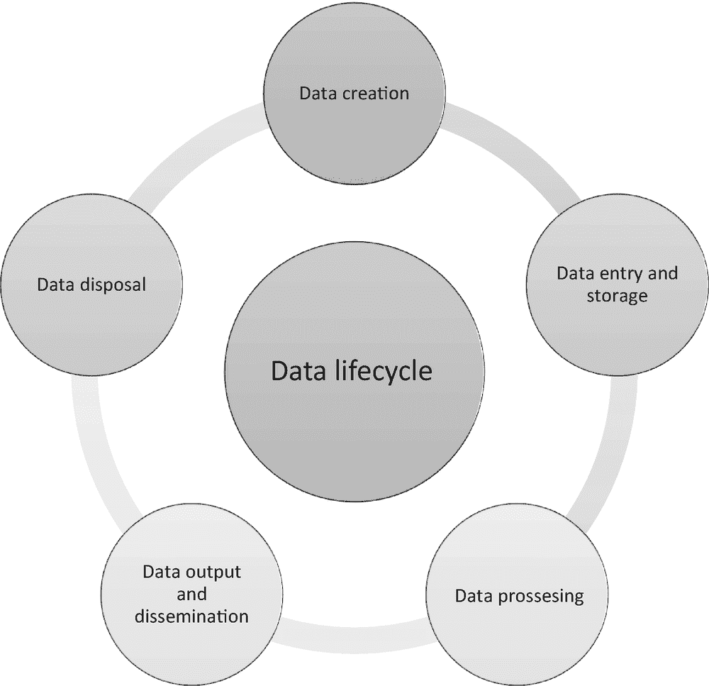
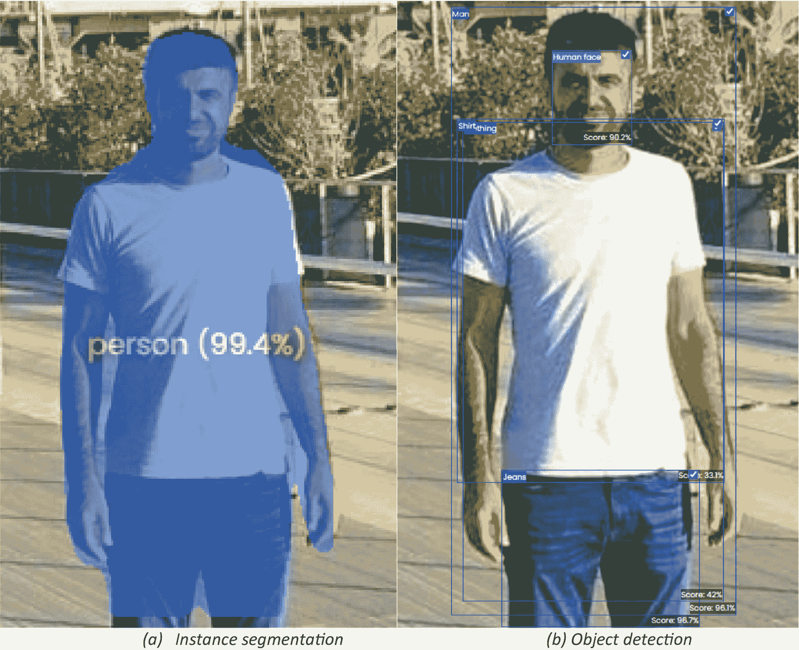
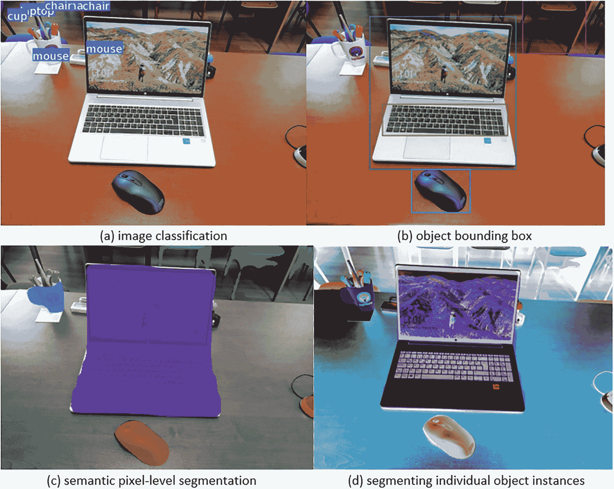

# 1. 合成数据简介

在本章中，我们将探讨数据的概念及其在当今世界的重要性。我们将讨论数据的生命周期，从收集到存储，以及合成数据如何用于提高数据科学和人工智能（AI）应用中的准确性。接下来，我们将探讨合成数据在金融服务、制造、医疗保健、汽车、机器人、安全、社交媒体和营销中的应用。最后，我们将从合成数据的角度来考察自然语言处理、计算机视觉、对视觉场景的理解以及分割问题。 

## 合成数据是什么？

尽管在 21 世纪数据收集和分析方面取得了进步，但人们仍然缺乏如何正确利用数据以最小化其代表信息的感知模糊性或主观性的理解。这是因为同样的意义可以用多种方式表达，而单一的表达方式可以有多个含义。因此，创建一个全面的数据解释框架，考虑所有潜在细微差别和信息的含义，是很困难的。克服这一挑战的一种方法是为数据收集和分析开发标准化的方法。这将确保数据收集的一致性，并且结果可以在不同的研究中进行比较，合成数据可以帮助我们做到这一点。

人们通常认为合成数据不如直接测量获得的数据可靠。简单来说，合成数据是指由计算机程序生成而非从现实世界来源收集的数据。虽然合成数据通常不如直接从现实世界收集的数据可靠，但它仍然是数据科学家的重要工具。这是因为合成数据可以在将其应用于现实世界数据之前用于测试假设和模型。这有助于数据科学家避免在现实世界中产生可能产生负面后果的错误。

通过计算机程序或模拟人工生成的合成数据，而不是从现实世界来源收集 [11]。当我们审视这个定义时，我们会看到以下概念包含在定义中：“标注信息、计算机模拟、算法，以及“未在现实世界中测量”。

合成数据的关键特征如下：

+   不是通过直接测量获得

+   通过算法生成

+   与数学或统计模型相关联

+   模仿真实数据

现在让我们解释一下为什么合成数据很重要。

### 为什么合成数据很重要？

人类有一种创建昂贵产品合成版本的习惯。丝绸是一种昂贵的商品，它开始被使用已有数千年历史，而人造丝是在 1880 年代被创造的。因此，人们对数据也做同样的事情，选择生产合成数据，因为它既经济又实惠。如前所述，合成数据允许科学家在受控环境中测试假设和模型，它还可以用于创建“如果”场景，帮助数据科学家更好地理解他们模型的结果。

同样，合成数据可以以多种方式用于改进机器学习模型并保护真实数据的隐私。首先，当没有真实数据可用时，可以使用合成数据来训练机器学习模型。这对于数据稀缺的发展中国家尤为重要。其次，可以在将机器学习模型部署到真实数据之前使用合成数据对其进行测试。这对于确保模型按预期工作且不会损害真实数据至关重要。最后，通过生成与真实数据相似但不包含任何个人信息的数据，合成数据可以用于保护真实数据的隐私。

合成数据也比真实数据提供了更多的控制。实际数据来自许多不同的来源，这可能导致数据集变得庞大且多样化，以至于难以处理。由于合成数据是使用为特定目的生成数据的模型创建的，因此它不会随机散布。在某些情况下，合成数据甚至可能比真实数据的质量更高。实际数据在必要时可能需要过度处理，而过多数据在必要时可能需要处理。这些操作可能会降低数据质量。另一方面，由于用于生成数据的模型，合成数据可以具有更高的质量。

总体而言，合成数据在真实数据之上具有许多优势。合成数据更易于控制，质量更高，并且可以生成所需数量的数据。这些因素使合成数据成为许多应用的宝贵工具。合成数据之所以重要还有一个原因，那就是它可以用于生成用于研究目的的数据，使研究人员能够研究那些没有偏见或不能代表真实数据的数据。

现在让我们解释合成数据对于数据科学和人工智能的重要性。

### 合成数据为数据科学和人工智能提供比真实数据更多的控制。实际数据来自许多不同的来源，这可能导致数据集变得庞大且多样化，以至于难以处理。由于合成数据是使用为特定目的生成数据的模型创建的，因此它不会随机散布。在某些情况下，合成数据甚至可能比真实数据的质量更高。实际数据在必要时可能需要过度处理，而过多数据在必要时可能需要处理。这些操作可能会降低数据质量。另一方面，由于用于生成数据的模型，合成数据可以具有更高的质量。

使用合成数据并不是一个新概念。在数据科学和人工智能的早期阶段，合成数据被用于训练机器学习模型。然而，过去的合成数据通常质量较低，不够真实，以至于无法用于训练今天的更复杂的 AI 模型。

数据生成技术（如*生成对抗网络*（GANs））的最近进展使得生成与真实世界数据几乎无法区分的合成数据成为可能。这种高质量的合成数据通常被称为“*现实合成数据*”。

现实合成数据的使用有可能改变数据科学和人工智能领域。可以使用现实合成数据来训练机器学习模型，而无需真实世界数据。这在真实世界数据稀缺、昂贵或难以获取的情况下特别有益。

此外，可以使用现实合成数据来创建“虚拟环境”进行测试和实验。这些虚拟环境可以用于以安全和可控的方式测试机器学习模型，无需真实世界数据。

例如，可以使用计算机算法生成看起来逼真的图像或物体。这可以用来训练机器学习系统，使其在真实世界图像中更好地识别这些物体。如果后者不可用或获取成本过高，可以使用合成数据代替真实世界数据。

总体而言，合成数据在数据科学和人工智能领域的应用是一个有希望的新趋势。生成高质量合成数据的能力为训练和实验开辟了新的可能性。例如，可以创建包含 6000 个单词的合成数据集，而不是通常的 2000 个单词。这将使人工智能系统能够从更大、更多样化的数据集中学习，从而提高其在真实世界数据上的性能。在未来，合成数据可能在数据科学和人工智能领域发挥越来越重要的作用。

现在让我们从合成数据的角度来考虑准确性问题。

## 准确性问题

监督学习算法使用标记数据进行训练。在此方法中，数据通常被称为“*地面真实数据*”，而测试数据被称为“*保留数据*”。我们有三种类型来比较算法之间的准确性 [2]：

+   估计量评分方法：估计量是一个用于估计或猜测某物价值的数字。评分方法是一种通过分析估计量的猜测与实际值之间的接近程度来决定估计量好坏的方法。

+   评分参数：交叉验证是一种依赖于内部评分策略的模型评估技术。

+   度量函数：sklearn.metrics 模块提供了用于评估特定目的预测错误的函数。

重要的是要承认，合成数据的准确性可能因几个原因而存在问题。首先，数据可能是由一个不代表数据旨在表示的真实世界过程的过程生成的。这可能导致合成数据中的不准确，而在真实世界数据中可能不存在。其次，数据可能是为了特定的目标而生成的，例如训练机器学习算法，这与合成数据用户的实际目标不匹配。这也会导致合成数据中的不准确。最后，合成数据可能是由一个随机过程生成的，这可能会在数据中引入随机性，而在真实世界数据中可能不存在。这种随机性也可能导致合成数据的准确性问题。

克服机器学习中潜在精度问题的方法之一是使用合成数据。这可以通过自动标记和准备数据以供机器学习算法使用来实现，从而减少了创建训练数据集所需的时间和资源。这还创建了一个更一致的、不太可能包含错误的数据集。提高机器学习精度的另一种方法是使用更大的训练数据集。这通常会导致机器学习算法的性能更好。

在卫星照片中从事飞机识别和分类工作的空中客车公司和 OneView 公司，在他们的机器学习数据研究中，与仅由真实数据组成的数据相比，使用 OneView 公司的模拟数据集实现了 88%的准确率，而真实数据集的准确率为 82%。当以混合方式使用真实数据和合成数据时，准确率达到了约 90%，这个数字比仅使用真实数据的准确率提高了 8% [3]。这种提高的准确率归因于当使用真实和模拟数据时，可用的数据种类增加。数据的多样性增加使得机器学习算法能够更好地学习数据的潜在模式。这种提高的准确率具有重要意义，并可能导致各种应用中的决策更加明智。

现在让我们从合成数据的角度来考察数据生命周期。

## 数据的生命周期

在利用合成数据的力量之前，了解数据生命周期非常重要。首先，它可以帮助组织更好地管理他们的数据；通过了解数据经历的各个阶段，组织可以更有效地控制数据的使用方式，并防止未经授权的访问。此外，数据生命周期可以帮助组织确保他们的数据质量高。最后，数据生命周期可以帮助组织规划数据的最终销毁；通过了解何时数据不再需要，组织可以确保他们不会保留数据超过必要的时间，这既可以节省空间，也可以降低成本。

数据生命周期是指从创建到最终销毁管理数据的过程。图 1-1 展示了数据生命周期的五个主要阶段。

数据生命周期的图示包括数据创建、数据录入和存储、数据处理、数据输出和数据销毁。

图 1-1

数据生命周期

在合成数据的情况下，数据生命周期指的是生成、存储、操作和输出合成数据的过程。这个过程通常由计算机执行，并涉及使用算法和规则生成类似于现实世界数据的资料。

以下是数据生命周期的五个阶段：

1.  **数据创建：** 数据生命周期的第一阶段是数据创建。这是合成数据首次生成阶段，无论是通过直接输入还是通过从外部来源捕获信息。

1.  **数据录入和存储：** 此阶段涉及将合成数据录入计算机系统并在数据库中存储。数据录入和存储通常涉及使用算法或规则生成类似于现实世界数据的资料。

1.  **数据处理：** 此阶段涉及在计算机系统中对合成数据进行操作，将其转换为对用户更有用的格式。这可能包括使用算法以及应用规则和过滤器。数据处理通常涉及使用算法或规则生成类似于现实世界数据的资料。

1.  **数据输出和传播：** 此阶段是生成计算机系统中的合成数据并将其提供给用户的过程。这可能包括生成报告、创建图表或以可导入到另一个系统的格式输出数据。

1.  **数据销毁：** 数据生命周期的最终阶段是数据销毁。此阶段涉及不再需要的合成数据的销毁。这可能包括从数据库中删除数据或物理销毁存储介质。数据销毁通常涉及使用算法或规则生成。

强化学习算法通过与环境交互来学习如何做事。然而，这些算法可能效率低下，这意味着它们需要大量的交互才能学好。为了解决这个问题，一些人正在使用外部知识来源，例如来自演示或观察的数据。这些数据可以来自专家、现实世界的演示、模拟或合成演示。

谷歌和 DeepMind 的研究人员认为数据集也有生命周期，他们将数据集的生命周期总结为三个阶段：产生数据、消耗数据和共享数据 [4]。

在生产数据阶段，用户记录他们与环境之间的交互并提供数据集。在这个阶段，用户会自动或手动地对数据进行标记或过滤，以添加额外的信息。

在数据消费阶段，研究人员分析并可视化数据集，或使用它们来训练机器学习的算法。

在数据共享阶段，研究人员经常与其他研究人员分享他们的数据，以帮助他们进行研究。当研究人员分享数据时，它使得其他研究人员运行和验证新算法变得更加容易。然而，生成数据的研究人员仍然拥有所有权，并且应该得到他们工作的认可。

现在让我们从合成数据的角度考虑数据收集和隐私问题。

## 数据收集与隐私

数据可以通过多种方式收集。例如，可以从雷达、激光雷达和自动驾驶汽车的摄像头系统中收集数据，并将其融合成可用于决策的格式。考虑到融合数据也是虚拟数据，有必要详细考虑真实数据和虚拟数据的重要性。因此，由于真实数据可以转换为虚拟数据，并且可用于或增强的数据可以与真实数据一起用于机器学习，这两种数据类型对我们来说都很重要。这有时被称为**集成方法**。

在集成方法中，可以将几个基本模型结合起来创建一个最佳的预测模型；为什么不能融合数据，从而获得更多合格的数据呢？

标记数据既繁琐又昂贵，因为机器学习模型需要大量且多样化的数据才能产生良好的结果。因此，通过使用数据增强技术将真实数据转换为合成数据，或者直接生成合成数据并将其作为真实数据的替代品，可以降低交易成本。根据 Gartner 的预测，到 2030 年，在 AI 模型中，合成数据将比真实数据更多。

另一个问题，合成数据可以帮助克服的是数据隐私问题。

### 数据隐私与合成数据

现在，许多机构和组织使用大量数据来预测、制定政策、规划和实现更高的利润率。通过使用这些数据，他们可以更好地理解他们周围的世界，并做出更明智的决策。然而，由于隐私限制和对个人数据的保证，只有机构的员工才能完全访问这些数据。匿名化技术被用来防止数据主体的身份被揭露。当然，数据收集者可以通过使用汇总、重新编码、记录交换、敏感值抑制和随机错误插入来维护数据隐私。然而，计算机和云计算技术的进步可能会使这些措施不足以维护数据隐私。我们将在下一节中探讨一些例子。

在今天这个信息技术不断进步的世界里，患者数据、驾驶员数据以及那些使用车辆的人的数据，以及研究公司从民意调查中获得的数据已经达到了巨大的数量。然而，大多数时候，当这些数据被用来寻找新的解决方案时，就会涉及到“个人隐私”的概念。通过匿名化数据来解决这个问题，这是一个修改数据以消除可能导致隐私侵犯的任何信息的过程。匿名化数据对于保护人们的隐私至关重要，因为即使没有个人标识符，数据中剩余的属性仍然可能被用来重新识别个人。在数据匿名化的最简单形式中，所有个人标识符都被移除。然而，已经证明这并不足以保护人们的隐私。因此，为了保护人们的隐私权，重要的是尽可能全面地匿名化数据。

大多数人认为隐私是通过匿名化来保护的。这意味着在数据库中没有姓名、姓氏或任何标识身份的标志。然而，这并不总是准确的。这意味着如果你同时在 Twitter 和 Flickr 上都有账户，有人有可能从匿名的 Twitter 图中识别出你。然而，错误率仅为 12%，所以你被识别的可能性仍然相当低 [14]。尽管被识别的可能性相对较低，但仍然重要的是要意识到在线分享个人信息可能存在的潜在风险。匿名性并不能保证隐私，而且在某些情况下，看似无害的信息也可能识别出个人。因此，在在线分享个人信息时，即使表面上看似匿名，也需要谨慎行事。

匿名化和标签化是人工智能应用中的两种主要技术。然而，这两种技术各自都存在一些问题。匿名化可能会导致关键信息的丢失，而标签化可能会引入偏差，并且实施成本高昂。此外，手工标注的数据可能质量不高，因为它们经常被错误标注。为了克服这些问题，研究人员提出了各种方法，例如半监督学习和主动学习。然而，这些方法仍然不完美，需要进一步的研究来改进它们。

#### 核心观点

随着数据来源的增加，收集更多数据使得企业有必要采取措施防范信息攻击。在某些情况下，企业需要比可用的数据更多的数据来在某些领域进行创新。在某些情况下，可能需要更多数据，这可能是由于缺乏实际研究或数据收集的高成本。许多企业在现实世界中通过编程生成数据，以获得其他方式无法获得的信息。随着企业试图收集更多数据并测试不同场景，合成数据的使用变得越来越流行。合成数据是由计算机程序创建的，旨在模仿真实世界数据。这使得企业能够更有效地收集数据，并测试各种场景，以了解在现实世界中可能发生什么。

世界正变得越来越以数据为中心，因此企业开始使用计算机程序创建类似于从真实世界收集的数据。这很有用，因为它促进了数据收集，并帮助企业测试不同的场景，以了解在真实世界中会发生什么。

现在让我们来探讨合成数据与数据质量。

## 合成数据与数据质量

在进行人工智能项目时，关注数据质量至关重要。一切从这里开始；如果数据质量差，人工智能系统将受到致命的影响。当人工智能从业者应用不重视数据质量的常规人工智能实践时，可能会发生数据级联。92%的大多数人工智能从业者报告称经历过一个或多个数据级联。这通常是因为他们应用了不重视数据质量的常规人工智能实践。因此，在训练深度学习网络时使用高质量数据非常重要 [5]。安德鲁·吴（Andrew Ng）曾说过，“数据是人工智能的食物”，并且数据质量问题应该比模型/算法更关注数据 [6]。在人工智能项目中使用合成数据可以帮助解决数据质量问题。这是因为可以生成高质量的合成数据，并且可以生成代表人工智能系统将要使用的真实世界数据的合成数据。这意味着在合成数据上训练的人工智能系统更有可能很好地推广到真实世界。

尤其是人工智能技术，对合成数据的依赖性很强。仅举几个例子，包括在医学领域，合成数据被广泛用于测试那些没有真实数据可用的特定条件和案例；自动驾驶汽车，如 Uber 和 Google 使用的汽车，就是用合成数据进行训练的；在金融行业，合成数据有助于促进欺诈检测和保护。合成数据使数据专业人员能够访问集中存储的数据，同时保持数据的隐私。此外，合成数据复制了真实数据的重要特征，而不透露其真实含义，并保护了机密性。另一方面，在研究部门，合成数据用于开发和交付可能无法获得必要数据的创新产品[7]。总的来说，合成数据的使用极为有益，因为它允许在保持原始数据隐私的同时测试新产品和服务。合成数据也非常灵活，可以用于各种不同的行业和应用。在未来，随着合成数据的好处被更多人了解，其使用可能会变得更加普遍。

现在我们来探讨一些合成数据的应用。

## 合成数据的应用

合成数据常用于金融服务、制造业、医疗保健、汽车、机器人、安全、社交媒体和营销等领域。

让我们先快速了解一下合成数据在金融领域的应用。

### 金融服务业

随着行业向更多数据驱动的决策转变，合成数据在金融服务中的使用变得越来越重要。合成数据可以用来补充或替代传统数据源，从而提供一个更全面的风险视图。

金融服务业是一个高度监管且不断变化的行业。新的规则和法规不断被引入，行业也在不断演变。因此，金融机构跟上变化并确保其数据合规可能会很困难。

合成数据可以生成符合最新规则和法规的数据。这有助于金融机构避免因不合规而产生的昂贵罚款和处罚。此外，合成数据可以在新产品和服务推出前进行测试。这有助于金融机构避免在推出新产品和服务时可能犯下的昂贵错误。

合成数据还可以通过提供对潜在风险的更全面了解来帮助提高风险模型的准确性。例如，考虑一个贷款组合。传统数据源可能只提供关于贷款金额、利率和期限的信息。然而，合成数据可以提供关于借款人信用评分、就业历史以及其他可能影响违约风险的额外信息。这些额外信息可以帮助提高风险模型的准确性。

另一个合成数据的关键好处是，它提供了一种在模型部署到实际环境中之前测试和验证模型的方法。这是因为合成数据可以生成具有已知输入和输出值的值。这允许在多种不同场景下测试模型，有助于在模型部署到实际环境中之前识别任何潜在问题。

合成数据在金融服务中的应用方式有很多。例如，它可以用来：

+   **生成用于压力测试和风险管理的真实场景：** 生成合成数据可以帮助金融机构识别潜在风险，并制定应对这些风险的计划。这可以用于生成用于压力测试和风险管理的真实场景。这样做可以帮助提高金融系统的弹性。

+   **训练机器学习模型：** 合成数据可以帮助训练机器学习模型，用于诸如欺诈检测和信用评分等任务。这可以自动化金融机构的流程，并使它们更加高效。

+   **生成合成交易：** 合成数据可以用来生成合成交易，这有助于金融机构测试新产品和服务，或模拟市场条件。

+   **生成合成客户数据：** 金融机构可以使用合成数据来生成合成客户数据。这可以帮助他们测试新的客户获取策略或评估客户服务水平。

+   **生成合成金融数据：** 合成数据可以用来生成合成金融数据。这有助于金融机构测试新的金融产品或评估新法规的影响。

最后，合成数据可以帮助降低数据获取和存储的成本。这是因为合成数据可以根据需要按需生成。这消除了存储大量数据的需要，从而可以节省数据获取和存储的成本。

现在，让我们看看合成数据在制造业中的应用。

### 制造业

在制造领域，数据用于帮助决策者了解制造过程的各个方面，从生产线效率到质量控制。在某些情况下，这些数据很容易获得——例如，通过传感器和其他监控设备可以收集到生产线输出的数据。然而，在其他情况下，数据可能更难获得，或者收集数据可能过于昂贵。在这些情况下，合成数据可以用来填补这些空白。

在许多制造环境中，很难或无法获得可用于训练模型的真实世界数据。这通常是由于制造过程的专有性质，这使得从工厂内部获取数据变得困难。此外，在制造环境中收集的数据可能太嘈杂或缺乏代表性，无法用于训练模型。

为了解决这些问题，合成数据可以用来为制造应用训练模型。然而，在决定是否为特定应用选择合成数据之前，考虑使用合成数据的优缺点是很重要的。

合成数据可以在制造中用于多种方式。首先，合成数据可以用来训练机器学习模型，这些模型可以用于自动化制造过程中的各种任务。这可以提高制造过程的效率并有助于降低成本。其次，合成数据可以用来测试和验证制造过程和设备。这有助于确保制造过程运行顺畅，设备操作正确。第三，合成数据可以用来监控制造过程并识别潜在问题。这有助于提高正在生产的产品质量并避免昂贵的制造缺陷。

合成数据可以用来提高数据驱动模型的效率。这是因为合成数据可以比真实世界数据生成得更快。这对于制造商来说很重要，因为它允许他们更快地训练数据驱动模型并将它们推向市场。

合成数据在制造业中的应用非常广泛。它帮助公司提高产品质量、降低制造成本并提高工艺效率。以下是一些在制造业中合成数据应用的例子：

+   **质量控制**：合成数据可以用来创建模型，预测产品缺陷的可能性。这些信息可用于改进质量控制程序。

+   **成本降低**：使用合成数据可以帮助识别导致成本增加的制造过程中的模式。这些信息可用于制定降低成本的战略，从而降低生产总成本。

+   **效率提升**：可以使用合成数据创建模型，预测制造过程的效率。这些信息可以用来提高流程效率。

+   **产品开发**：合成数据可以通过预测新产品的性能来帮助改进产品开发流程。这样，可以决定哪些产品需要监控以及如何开发它们。

+   **生产计划**：可以通过使用合成数据创建预测产品需求的模型来进行生产计划。这样，企业可以通过对未来需求的更好预测来改善其生产计划。

+   **维护**：可以使用合成数据创建模型，预测设备故障的概率。通过这种方式，可以采取预防措施，并通过预测设备何时会失效来改进维护流程。

现在，让我们快速探讨合成数据在医疗保健领域中的应用。

### 医疗保健

在医疗保健中利用合成数据的最明显好处是保护患者的隐私。通过使用合成数据，医疗保健机构可以创建基于真实数据但不含任何实际患者信息的模型和模拟。这在患者隐私至关重要的情况下非常有帮助，例如在开发新治疗方法或测试新医疗设备时。

合成数据的使用将随着医疗机构的需求和要求而发展。然而，以下是一些医疗机构可能使用合成数据的最常见原因：

+   机器学习模型：医疗保健机构使用合成数据最常见的原因之一是训练机器学习模型。这是因为合成数据可以在受控环境中生成，这允许获得更可靠的结果。

+   人工智能：合成数据可以用来识别患者数据中的模式，这些模式可能表明特定的状况或疾病。这可以用来帮助更准确地诊断患者，并预测他们可能对治疗的反应。这对确保患者获得最有效的护理至关重要。

+   保护隐私：医疗保健行业最大的挑战之一是数据的可靠共享。健康数据对医生快速诊断和治疗患者至关重要。因此，许多医院和医疗机构非常重视患者数据。合成数据有助于提供最佳的治疗。此外，合成数据是一种可以帮助医疗保健机构在保护个人隐私的同时共享信息的技术。

+   治疗：医疗保健机构使用合成数据的另一个常见原因是测试新的治疗方法。这是因为合成数据可以用来创建真实世界的条件模拟，这有助于在将新治疗方法用于真实患者之前识别潜在的副作用或问题。

+   帮助设计新药并测试其有效性。

+   提高患者护理：医疗保健机构还可以使用合成数据来提高患者护理。这是因为合成数据可以用来创建真实世界的条件模拟，这有助于医疗保健专业人员识别潜在问题，并就患者护理做出更明智的决定。

+   降低成本：医疗保健机构还可以使用合成数据来降低成本。这是因为合成数据可以相对便宜地生成，这有助于降低与真实世界数据收集和分析相关的整体成本。

+   几家医院现在正在使用合成数据在医疗领域提高护理质量。这以多种不同的方式实现，但最常见的一种是使用计算机模拟。这允许更真实地表示患者及其状况，然后可以用来测试新的治疗方法或程序。这可以在降低并发症风险和确保患者获得最佳护理方面极为有益。

总体而言，在医疗领域使用合成数据极为有益。它有助于提高所提供护理的质量，同时也有助于降低并发症的风险。此外，它还有助于加快诊断和治疗的过程。

现在让我们看看合成数据在汽车行业中的应用。

### 汽车

另一个合成数据在汽车行业中的应用是自动驾驶。训练自动驾驶系统需要大量的数据。这些数据可以用来训练一个机器学习模型，然后可以用来预测自动驾驶系统在不同情况下应该如何表现。然而，真实世界的数据通常稀缺、昂贵且难以获得。

另一个合成数据在汽车行业中的重要作用应用是在安全关键系统中。为了确保车辆的安全，能够在各种场景下测试系统是非常重要的。合成数据可以用来生成所有需要测试的不同场景的数据。这很重要，因为它允许进行更彻底的系统测试，并有助于确保车辆的安全。

总体而言，合成数据在汽车行业中具有成为宝贵工具的潜力。它可以用来加速开发过程并生成大量数据。然而，重要的是要意识到与合成数据相关的挑战，并确保以最大化其效益的方式使用它。

汽车公司需要合成数据有几个原因。第一个与新技术的发展有关，需要大量数据。为了创建和测试新的功能或技术，公司需要大量数据。这些数据用于训练最终将在产品中使用的算法。然而，收集这些数据可能很困难、耗时且昂贵。

另一个汽车公司需要合成数据的原因是用于测试目的。在推出新产品之前，它需要经过严格的测试。这种测试通常包括让产品经历一系列不同的场景。然而，在现实世界中测试每一个单独的场景可能很困难。这就是合成数据发挥作用的地方。它可以用来创建在现实世界中难以或无法重新创建的逼真的测试场景。

合成数据可以用于营销目的。汽车公司也经常使用数据来创建营销材料，如广告或网站内容。然而，这些数据可能难以获得。合成数据可以用来创建逼真的营销场景，这些场景可以用来测试不同的营销策略。

总之，合成数据在汽车行业中出于多种原因都是必需的。它可以用来创建逼真的测试场景、训练算法以及创建营销材料。

现在我们来看看合成数据在机器人领域的应用。

### 机器人

机器人是可以编程以执行特定任务的机器。有时这些任务非常简单，比如将一张纸从一处移动到另一处。有时，任务更复杂，比如在世界中移动并做人类能做的事情，比如解决魔方。创建能够执行复杂任务的机器人是一个挑战，因为机器人需要大量训练数据来像人类一样行为。这些数据可以通过模拟生成，这是一种创建机器人行为模型的方法。

在机器人领域需要合成数据有几个原因。首先，真实世界数据通常很稀缺。这尤其适用于训练机器学习模型所需的数据，而机器学习是机器人技术的一个关键组成部分。合成数据可以用来补充真实世界数据，在某些情况下甚至可以完全替代它们。其次，真实世界数据通常很嘈杂。这种噪声可能来自各种来源，如传感器、执行器和环境。合成数据可以用来生成无噪声数据，这有助于训练机器学习模型。第三个原因是收集真实世界数据通常成本高昂。这尤其适用于训练机器学习模型所需的数据。合成数据可以用来生成收集成本远低于真实世界数据的合成数据。第四个原因是真实世界数据通常存在偏差。这种偏差可能来自各种来源，如传感器、执行器和环境。合成数据可以用来生成无偏差数据，这有助于训练机器学习模型。第五个原因是在机器人领域需要合成数据是因为真实世界数据通常不具有代表性。这尤其适用于训练机器学习模型所需的数据。合成数据可以用来创建更好地代表真实世界的数据，这对于训练机器学习模型是有帮助的。

机器人可以通过使用合成数据来学习识别和响应不同类型的对象。通过从这些数据中学习，机器人可以学会如何更好地识别和响应不同类型的人类行为。例如，一个机器人可能会被给予一组包含各种不同类型的人类行为及其响应方法的合成数据集。

现在，让我们来看看合成数据在安全领域是如何被应用的。

### 安全

合成数据在增强安全方面可以发挥至关重要的作用，这不仅通过其训练机器学习模型以更好地检测安全威胁的能力，而且还通过提供测试安全系统及其有效性的手段。

在合成数据上训练的机器学习模型在检测安全威胁方面更为有效，因为它们不受可用真实世界数据的限制。合成数据可以生成以匹配任何所需分布，包括在真实世界中不存在的分布。这使得机器学习模型能够更好地了解数据的潜在分布，并更好地识别可能代表安全威胁的异常值。

使用合成数据测试安全系统很重要，因为它允许在受控环境中测量系统的性能。可以生成与任何期望的安全威胁分布相匹配的合成数据，这使得测试安全系统检测和响应各种威胁的能力成为可能。这很重要，因为现实世界的数据通常范围有限，可能无法代表系统可能遇到的所有安全威胁的全范围。

总的来说，使用合成数据对于训练机器学习模型以检测安全威胁以及测试安全系统的性能都是非常重要的。合成数据提供了对数据潜在分布的更完整了解，从而提高了对安全威胁的检测。此外，合成数据可以用来创建用于测试安全系统性能的受控环境，这使得更准确地衡量安全系统的有效性成为可能。

现在，让我们快速探讨一下合成数据如何在社交媒体领域得到应用。

### 社交媒体

社交媒体已经成为我们生活的一个不可或缺的部分。这是一个我们可以与我们的朋友和家人分享我们的想法、观点和感受的平台。然而，社交媒体也已经成为虚假新闻和错误信息的滋生地。这是因为任何人都可以创建一个虚假账户并传播错误信息。

为了解决这个问题，许多社交媒体平台现在正在使用 AI 来检测虚假账户并将它们标记出来。然而，AI 的有效性取决于其训练的数据。如果数据有偏见或不准确，AI 也会有偏见或不准确。这就是合成数据发挥作用的地方。合成数据可以用来训练 AI 算法，使其在检测虚假账户时更加准确。合成数据可以帮助减少社交媒体上虚假新闻和错误信息的传播。

生成合成数据的一种方法是通过使用生成模型。例如，一个生成模型可以在真实人物图像的数据集上进行训练。一旦训练完成，该模型就可以生成看起来真实但却是虚假的人物图像。这很重要，因为它允许我们创建代表现实世界的数据。

模拟是生成合成数据的另一种方法。例如，我们可以创建一个社交媒体平台的模拟。这个模拟将包括与真实社交媒体平台相同的所有功能。然而，它还允许我们控制生成哪些数据。这很重要，因为它使我们能够测试不同的场景。例如，我们可以测试如果一定比例的账户是假的会发生什么。这将使我们能够看到我们的 AI 算法在现实世界中的反应。

一些已知使用合成数据的社会媒体平台包括脸书、谷歌和推特；每个平台都以不同的方式和使用不同的目的使用合成数据。

脸书也一直被知道使用合成数据来训练其算法。例如，脸书使用合成数据来训练其面部识别算法。因为很难获得足够大的真实世界面部数据集来有效地训练这些算法。此外，脸书还使用合成数据来生成虚假用户资料。这是为了测试平台算法在检测虚假资料方面的有效性。

除了使用真实数据外，谷歌也一直被知道使用合成数据。合成数据是设计用来模仿真实数据的数据。例如，谷歌必须使用合成数据来训练其机器学习算法以更好地理解自然语言。谷歌还使用合成数据来生成虚假评论。这是为了测试平台算法在检测虚假评论方面的有效性。

推特也一直被知道使用合成数据。该平台使用合成数据来生成虚假推文和虚假用户资料，以测试其算法在检测这些虚假内容方面的有效性。

现在，让我们快速探讨合成数据如何在市场营销领域被应用。

### 市场营销

在市场营销中使用合成数据有许多好处。可能最明显的益处是它可以用来生成其他情况下无法获得的数据。这对于市场研究特别有用，因为它可以用来生成关于消费者行为的难以或无法通过传统手段获得的数据。

在市场营销中使用合成数据的重要性有多个原因。首先，它允许营销研究人员在受控环境中研究行为。这很重要，因为它允许隔离变量和以在真实世界数据中不可能的方式进行假设测试。其次，合成数据可以用来对消费者行为产生新的见解。通过分析消费者在模拟环境中的行为，营销研究人员可以开发出可以应用于真实世界数据的新理论和模型。最后，合成数据可以用来评估市场营销活动和策略。通过在模拟环境中测试活动和策略，营销人员可以确定哪些最有可能在真实世界中取得成功。

在市场营销中也需要合成数据，因为它可以用来保护真实客户的隐私。通过使用合成数据而不是真实客户数据，营销人员可以避免收集和存储有关客户敏感信息的需要。这对于受到严格隐私法约束的企业尤为重要，例如欧盟的企业。

几个营销组织使用合成数据来更好地理解客户行为并改进营销策略。这些组织中的每一个都以不同的方式使用合成数据，但它们都利用它来深入了解消费者的行为。

### 自然语言处理

语言模型是在大量文本语料库上训练的，可以用来生成与训练数据相似的新文本。语言模型可以用来生成代表不同人群的合成数据 [8] 或生成具有特定属性的数据。

自然语言处理（NLP）是人工智能的一个子领域，它涉及对人类语言的解释和操作。NLP 被应用于多种应用中，包括文本分类、聊天机器人和机器翻译。NLP 帮助计算机理解、解释和操作人类语言 [9]。

NLP 可能会产生重大影响的领域之一是在合成数据的生成。与从现实世界来源收集的数据相比，通过人工手段生成的合成数据。合成数据可以用来训练机器学习模型 [10]，NLP 可以用来生成真实且多样化的合成数据。这很重要，因为它允许机器学习模型在代表现实世界的数据上进行训练，从而可以提高模型的准确性。例如，合成数据可以用来生成现实中不存在的人或物体的逼真图像，或为训练自动驾驶车辆创建模拟环境。在代表现实世界的数据上训练的机器学习模型的准确性得到了提高。

此外，NLP 可以用来自动标记合成数据，这对于训练监督机器学习模型非常重要。例如，NLP 可以用来自动生成图像或视频的描述，这些描述随后可以用作训练图像识别或物体检测模型的标签。这对于训练监督机器学习模型非常重要，因为它可以帮助减少所需的手动标记量。

总体而言，NLP 是生成和操作合成数据的有力工具。它可以用来自动生成大量真实数据，这对于训练机器学习模型非常重要。此外，NLP 可以自动标记合成数据，这对于训练监督机器学习模型非常重要。

因此，在特征生成方面，NLP 将继续在合成数据的生成中扮演重要角色。使用 NLP 生成合成数据将允许创建更能够代表不同人群的数据，并允许创建具有特定属性的数据。

### 计算机视觉

计算机视觉是使用计算机解释和理解数字图像的过程。这可以通过使用能够识别图像中的模式和特征的算法来完成，然后根据这些图像代表的内容做出决策。

计算机可以通过识别人的轮廓或围绕人绘制边界框来检测人。在图 1-2 的照片中，计算机可以通过识别轮廓来计数，如图 1-2 (a) (实例分割) 或通过围绕人绘制边界框（目标检测），如图 1-2 (b)。

一张照片代表了两种计算机视觉。第一种是分割计算机视觉，第二种是目标检测计算机视觉。

图 1-2

计算机视觉： (a) 实例分割 (b) 目标检测

一辆自动驾驶汽车需要能够检测物体并理解它们是什么，以便在实时做出决策。这是通过目标检测来完成的，即在每个图像中的每个项目周围找到边界框。之后，语义分割会给图像中的每个像素分配一个标签，指示物体是什么。最后，实例分割显示了有多少个单独的物体 [11]。在计算机上执行视觉、阅读和听觉等功能的计算机，使用模仿人脑的人工神经网络。人脸识别、自动驾驶汽车的导航以及通过计算机扫描获得的医学图像来诊断患者都与计算机视觉有关，这些工作都是通过称为 *人工神经网络* 的算法完成的。

神经网络是一种用于模拟人脑工作原理的机器学习算法区域。它由一系列相互连接的节点组成，每个节点都有自己的权重和三个应该值。如果一个节点的输出高于指定的阈值，那么该节点就会被激活并向网络的下一层发送数据。如果一个节点的输出低于指定的阈值，那么该节点就不会被激活，并且不会发送任何数据 [12]。节点的输出与阈值进行比较。如果输出高于阈值，节点被激活并向下一层发送数据。

当一个模型从训练数据中学习过多细节和噪声时，我们称其为过拟合。这可能会对模型在新数据上的性能产生负面影响 [13]。这意味着如果我们使用合成数据来训练深度学习模型，它不太可能过拟合数据，因此，模型将更加准确，并能更好地泛化到新数据。

卷积神经网络（CNN）是专门设计来擅长图像识别任务的。它们通过接收图像作为输入，然后为图像中的各种方面或对象分配重要性来实现工作。这使得 CNN 能够区分图像中的不同对象。这种深度神经网络的结构比简单的神经网络要复杂得多。以下资源可以用于查看 CNN 在 R 和 Python 中的应用。

然而，无论计算机视觉中的算法多么复杂；正如我们之前提到的，数据的品质，在这种形式下仅被称为“*输入*”，对于结果的准确性非常重要。数据是文本、音频还是照片，数据的大小及其良好的标签对于结果的准确性至关重要。人工智能的原材料是大数据。隐私和数据隐私可以通过适当的法律和执法来防止公司访问大数据。此外，为了训练目的对数据进行标注也会在机器学习中产生显著的成本。

#### 对视觉场景的理解

视觉场景是在计算机屏幕上看到的图像。这些图像由像素组成，像素是微小的彩色点。像素排列成网格，每个像素都有一个特定的地址。计算机视觉场景是由计算机图形软件创建的，该软件负责创建屏幕上看到的图像。计算机图形软件可以通过使用像素的地址来创建图像。

计算机视觉最重要的目的之一是检查视觉场景并对其进行详细理解。这包括确定图像中的对象、它们在 2D 和 3D 中的位置、它们的属性，并对场景进行语义描述。

可以使用对象识别数据集执行的不同类型任务：（a）图像分类涉及为整个图像分配标签，（b）对象边界框定位涉及识别图像中对象的位置，（c）语义像素级分割涉及对图像中的每个像素进行分类，以及（d）分割单个对象实例。这涉及识别图像中的每个对象，然后将其从图像的其余部分分割出来，如图 1-3 所示。

对象识别的步骤包括图像分类、对象边界框、语义像素级分割以及分割单个对象实例。

图 1-3

对象识别

我们可以将图 1-3 中所示的四个面板所展示的内容解释如下：

1.  **图像分类：** 该任务通过给对象分配二进制标签来实现，以便它们可以在图像中识别出来，如图 1-3(a)所示。它在分类、图像处理和机器学习中得到了广泛应用。

1.  **对象边界框定位**：这是一种用于确定对象边界的方法，如图 1-3（b）所示。这种方法用于检测图像中对象的起始和结束位置。

1.  **语义像素级分割**：这是一种用于区分图像中对象的方法，如图 1-3（c）所示。这种方法用于检测每个像素是否属于对象。

1.  **分割单个对象实例**：这是一种逐个区分对象的方法，如图 1-3（d）所示。这种方法用于区分图像中的对象。

视觉场景用于创建和管理在线照片专辑。它可以用来在个人网站或博客上存储照片，或者与朋友和家人分享照片。视觉场景提供了一个简单的方法来将照片组织成专辑，添加标题和标签，并与他人分享照片。

视觉场景用于帮助自闭症谱系障碍的人改善他们的沟通和社会技能。这是一个使用视频帮助人们理解面部表情、肢体语言和社会情境的软件程序。该程序旨在帮助自闭症谱系障碍的人理解场景中发生的事情，并学习如何应对社交情境。

#### 分割问题

合成数据对机器学习非常重要，尤其是对计算机“视觉”。合成数据以小成本为我们提供了几乎无限量的完美标记数据。计算机科学家可以创建对象及其环境的 3-D 模型，以创建具有随机条件的合成数据。这有助于解决计算机视觉问题。

语义分割是将图像分割成具有语义意义的区域的任务。图像中的每个像素都被分配一个语义标签，以反映像素所代表的含义。语义分割可以使用具有编码器-解码器结构的深度神经网络来实现。

合成数据中的分割问题是将数据集准确分割成同质组或段的问题。这是一个困难的问题，因为通常很难确定什么构成同质组，并且可能有许多分割数据集的方法。

有几种不同的方法可以用来分割数据集。一种方法是用聚类算法，它将相似的数据点分组。另一种方法是使用分类算法，它将每个数据点分配到一个类别。最后，还可以使用基于规则的方法，它将定义一组规则来决定如何分割数据。

在合成数据中，分割问题尤其困难，因为数据通常是由一个不太为人所理解的流程生成的。因此，通常很难确定哪些数据特征对于分组数据点很重要。此外，合成数据通常包含大量的噪声，这可能会使其难以准确分割数据。

## 摘要

在本章中，你学习了合成数据及其在数据科学和人工智能中的益处。你还了解了数据生命周期以及合成数据如何在不同阶段提高数据质量。最后，你学习了合成数据在金融服务业、制造业、医疗保健、汽车、机器人、安全、社交媒体、营销、自然语言处理和计算机视觉等各个行业的应用。

接下来，我们将开始深入探讨不同类型的合成数据。

## 参考文献

[1]. G. Andrews，“什么是合成数据？” Carrushome.com，2022 年。[`https://www.carrushome.com/en/what-is-synthetic-data/`](https://www.carrushome.com/en/what-is-synthetic-data/)（访问日期：2022 年 4 月 13 日）。

[2]. Scikit, “3.3. 指标和评分：量化预测质量 — scikit-learn 1.0.2 文档。” Scikit Learn，2022 年。[`https://scikit-learn.org/stable/modules/model_evaluation.xhtml`](https://scikit-learn.org/stable/modules/model_evaluation.xhtml)（访问日期：2022 年 4 月 13 日）。

[3]. Airbus，“合成数据真的能提高算法精度吗？” 2021 年 5 月 20 日。[`https://www.intelligence-airbusds.com/newsroom/news/can-synthetic-data-really-improve-algorithm-accuracy/`](https://www.intelligence-airbusds.com/newsroom/news/can-synthetic-data-really-improve-algorithm-accuracy/)，（访问日期：2022 年 4 月 13 日）。spiepr Par10

[4]. S. Ramos 等人，“RLDS：一个用于生成、共享和使用强化学习数据集的生态系统”，2021 年 11 月，访问日期：2022 年 4 月 13 日。[在线]。可获得：[`https://github.com/deepmind/envlogger`](https://github.com/deepmind/envlogger)。

[5]. N. Sambasivan, S. Kapania, H. Highfill, D. Akrong, P. Paritosh, 和 L. M. Aroyo, “每个人都想做模型工作，而不是数据工作”：高风险人工智能中的数据级联，载于 2021 年 CHI 计算系统人类因素会议论文集，2021 年 5 月 6 日，第 1-15 页，doi: 10.1145/3411764.3445518.spiepr Par109

[6]. G. Press，“Andrew Ng 发起以数据为中心的人工智能运动”，Forbes，2021 年 6 月 16 日。[`https://www.forbes.com/sites/gilpress/2021/06/16/andrew-ng-launches-a-campaign-for-data-centric-ai/?sh=d556d9d74f57`](https://www.forbes.com/sites/gilpress/2021/06/16/andrew-ng-launches-a-campaign-for-data-centric-ai/%253Fsh%253Dd556d9d74f57)，（访问日期：2022 年 4 月 13 日）。

[7]. K. Singh，“合成数据——关键优势、类型、生成方法和挑战，” Towards Data Science，2021 年 5 月 12 日\[《https://towardsdatascience.com/synthetic-data-key-benefits-types-generation-methods-and-challenges-11b0ad304b55》\](https://towardsdatascience.com/synthetic-data-key-benefits-types-generation-methods-and-challenges-11b0ad304b55)（访问日期：2022 年 4 月 13 日）.

[8]. B. Ding 等人，“DAGA: 用于低资源标注任务的生成式数据增强方法，” 2020\. [在线]. 可用: [《https://ntunlpsg》](https://www.ntunlpsg.com).

[9]. MRP，“自然语言处理：为语言的复杂性提供结构。” 2018 年 7 月 30 日\[《https://www.mrpfd.com/resources/naturallanguageprocessing/》\](https://www.mrpfd.com/resources/naturallanguageprocessing/)（访问日期：2022 年 7 月 2 日）.

[10]. S. I. Nikolenko，《深度学习用合成数据》，第 174 卷\. 查姆：Springer 国际出版社，2021 年，doi: 10.1007/978-3-030-75178-4.

[11]. S. Colaner，“为什么 Unity 声称合成数据集可以改进计算机视觉模型，” VentureBeat，2022 年 7 月 17 日\[《https://venturebeat.com/2020/07/17/why-unity-claims-synthetic-data-sets-can-improve-computer-vision-models/》\](https://venturebeat.com/2020/07/17/why-unity-claims-synthetic-data-sets-can-improve-computer-vision-models/)（访问日期：2022 年 4 月 13 日）.

[12]. IBM，“什么是卷积神经网络？，” IBM，2020 年 10 月 20 日\[《https://www.ibm.com/cloud/learn/convolutional-neural-networks》\](https://www.ibm.com/cloud/learn/convolutional-neural-networks)（访问日期：2022 年 4 月 13 日）.

[13]. J. Brownlee，“使用机器学习算法的过拟合和欠拟合，” Machine Learning Algorithms，2019 年 8 月 12 日\[《https://machinelearningmastery.com/overfitting-and-underfitting-with-machine-learning-algorithms/》\](https://machinelearningmastery.com/overfitting-and-underfitting-with-machine-learning-algorithms/)（访问日期：2022 年 4 月 13 日）.

[14]. B. Marr，“人工智能：视频游戏如何巧妙地用于训练人工智能，” Forbes，2018 年 5 月 13 日\[《https://www.forbes.com/sites/bernardmarr/2018/06/13/artificial-intelligence-the-clever-ways-video-games-are-used-to-train-ais/?sh=5c45c30e9474》\](https://www.forbes.com/sites/bernardmarr/2018/06/13/artificial-intelligence-the-clever-ways-video-games-are-used-to-train-ais/%253Fsh%253D5c45c30e9474)（访问日期：2022 年 4 月 17 日）.
