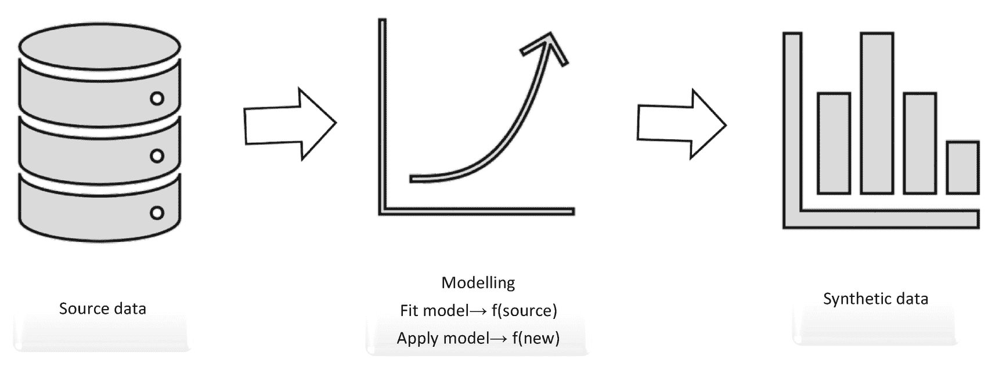
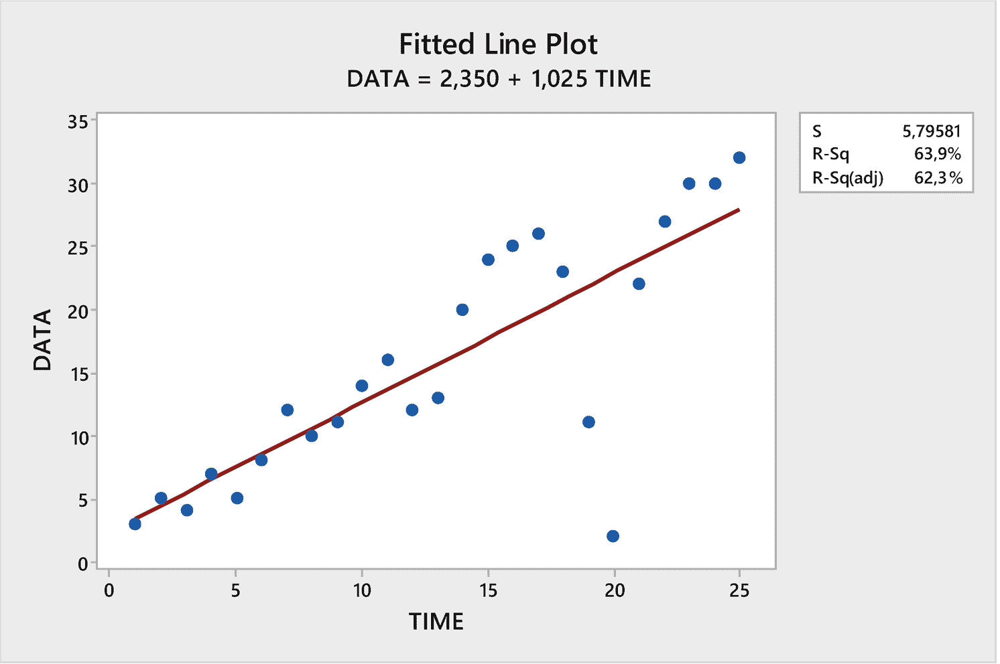
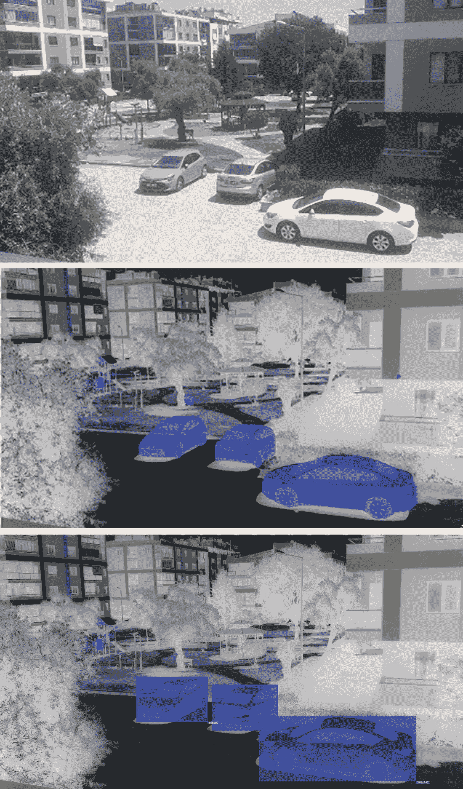

# 2. 合成数据的基础

本章探讨了合成数据的不同类型，如何生成公平的合成数据，以及合成数据带来的益处和挑战。它还探讨了合成-真实数据域的差距，以及如何通过领域迁移、适应和随机化来克服这一差距。我们讨论了模拟如何自动化自动驾驶公司的数据标注，以及现实世界经验是不可避免的。最后，我们讨论了数据如何通过预训练、强化学习和自监督学习来学习医学图像。

## 如何生成公平的合成数据？

*“公平的合成数据”*指的是使用因果感知生成网络生成的数据。这些网络被设计用来产生无偏见和歧视的数据。这些数据可以用来训练更加公平和准确的机器学习模型。此外，这些数据可以帮助减少机器学习中整体偏见和歧视的数量。

有几个原因可能使得使用公平的合成数据变得有吸引力。一方面，可能很难获得真正代表人群的现实世界数据。这通常是由于自我选择偏差等因素造成的，这可能导致某些群体在数据中代表性不足。此外，现实世界数据通常收集成本高昂，因此使用合成数据可能是一个更具成本效益的选择。

生成公平的合成数据有几种方法。一种方法是用因果感知生成网络。这些网络被设计用来学习数据集中不同变量之间的关系，然后可以用来生成与这些关系一致的新数据。这确保了生成数据在敏感属性方面没有偏见。这种方法在生成合成数据的方法中具有几个优点。首先，它更加高效，因为它只需要一个训练步骤。其次，它更加准确，因为生成数据将与变量之间已知的关系一致。最后，它更加公平，因为生成数据在敏感属性方面不会存在偏见。

生成模型是创建公平的合成数据的有力工具，但它们并不是唯一可用的工具。其他创建合成数据的方法包括数据增强，它可以用来增加数据集的多样性，以及重采样，它可以用来创建平衡的数据集。这些方法可以与生成模型结合使用，以创建更加逼真的合成数据。

生成公平合成数据的一种方法是用已经匿名化或去标识的数据。这些数据已经移除了所有可识别的个人身份信息，因此不能用来歧视个人。然而，这些数据可能不如使用因果感知生成网络生成的数据真实。另一种方法是使用使用因果感知生成网络生成的数据。这种数据更真实，但可能不如匿名化或去标识。最终，生成公平合成数据的方法选择将取决于用户的需求。

现在我们来看看如何简单地创建合成数据。

## 简单方式生成合成数据

如图 2-1 所示，合成数据生成过程是一个三步过程，它使用统计模型生成与真实数据在统计上相似的数据。第一步是创建真实数据的模型。第二步是使用该模型生成合成数据。第三步是将合成数据与真实数据进行比较，以确保它们在统计上相似。在生成合成数据时，首先将模型拟合到源数据，然后通过应用此模型生成合成数据 [2]。



合成数据生成过程从源数据开始，然后进行建模。它有一个拟合模型和一个应用模型。然后生成合成数据。

图 2-1

合成数据生成过程

使用表 2-1 中的数据，我们可以非常简单地生成合成数据。

表 2-1

回归数据

| 数据 | 时间 |
| --- | --- |
| 3 | 1 |
| 5 | 2 |
| 4 | 3 |
| 7 | 4 |
| 5 | 5 |
| 8 | 6 |
| 12 | 7 |
| 10 | 8 |
| 11 | 9 |
| 14 | 10 |
| 16 | 11 |
| 12 | 12 |
| 13 | 13 |
| 20 | 14 |
| 24 | 15 |
| 25 | 16 |
| 26 | 17 |
| 23 | 18 |
| 11 | 19 |
| 2 | 20 |
| 11 | 21 |
| 27 | 22 |
| 30 | 23 |
| 30 | 24 |
| 32 | 25 |

当进行计算时，得到以下结果：

```py
Regression Equation
DATA = 2,35 + 1,025 TIME
```

通过替换回归方程中的 TIME 变量，为所有观测值找到 FIT 值。从某种意义上说，我们可以认为 FIT 值是从 DATA 中产生的合成数据。当我们把获得的 FIT 数据视为“从数据产生的数据”时，这些被称为“*增强数据*”；当我们考虑这些数据只是从找到的回归方程产生的数据时，它们接近“*合成数据*”的概念。在这些结果中需要注意的另一点是，如果我们用这个回归方程产生数据，第 20 个观测值与真实数据将会有很大的偏差。这个 DATA 数据集第 20 个观测值的值是 2，它是一个异常值或黑天鹅事件。尽管异常值代表现实生活中非常重要的转折点，但这些数据很难作为合成数据产生。图 2-2 是回归分析的结果。

```py
Fits and Diagnostics for All Observations
Obs   DATA    Fit   Resid  Std Resid
1   3,00   3,38   -0,38      -0,07
2   5,00   4,40    0,60       0,11
3   4,00   5,43   -1,43      -0,26
4   7,00   6,45    0,55       0,10
5   5,00   7,48   -2,48      -0,45
6   8,00   8,50   -0,50      -0,09
7  12,00   9,53    2,47       0,44
8  10,00  10,55   -0,55      -0,10
9  11,00  11,58   -0,58      -0,10
10  14,00  12,60    1,40       0,25
11  16,00  13,63    2,37       0,42
12  12,00  14,65   -2,65      -0,47
13  13,00  15,68   -2,68      -0,47
14  20,00  16,71    3,29       0,58
15  24,00  17,73    6,27       1,11
16  25,00  18,76    6,24       1,10
17  26,00  19,78    6,22       1,10
18  23,00  20,81    2,19       0,39
19  11,00  21,83  -10,83      -1,94
20   2,00  22,86  -20,86      -3,75  R (Large residual)
21  22,00  23,88   -1,88      -0,34
22  27,00  24,91    2,09       0,38
23  30,00  25,93    4,07       0,75
24  30,00  26,96    3,04       0,56
25  32,00  27,98    4,02       0,75
```

回归分析：数据与时间

```py
Analysis of Variance
Source      DF  Adj SS   Adj MS  F-Value  P-Value
Regression   1  1366,8  1366,84    40,69    0,000
TIME       1  1366,8  1366,84    40,69    0,000
Error       23   772,6    33,59
Total       24  2139,4
Model Summary
S    R-sq  R-sq(adj)  R-sq(pred)
5,79581  63,89%     62,32%      57,89%
Coefficients
Term       Coef  SE Coef  T-Value  P-Value   VIF
Constant   2,35     2,39     0,98    0,336
TIME      1,025    0,161     6,38    0,000  1,00
Regression Equation
DATA = 2,35 + 1,025 TIME
Fits and Diagnostics for Unusual Observations
Obs  DATA    Fit   Resid  Std Resid
20  2,00  22,86  -20,86   -3,75  R
R  Large residual
```



数据与时间的关系图。x 轴代表时间，y 轴代表数据。该图呈现上升趋势。

图 2-2

表 2-1 中数据的回归线

在人工智能系统背景下，黑天鹅问题是一个主要问题。人工智能系统容易受到不可预测和无法预见的事件的影响，这些事件可能产生重大或不成比例的影响。人工智能系统背景下的黑天鹅事件的一些例子包括：

+   一个突然开始表现出异常行为的人工智能系统

+   一个变得自我意识并决定消灭人类的人工智能系统

+   一个黑客接管人工智能系统的控制权

+   自然灾害摧毁人工智能系统

+   软件漏洞导致人工智能系统出现故障

这个问题的答案无疑将是无监督学习，无论在黑天鹅事件背景下，监督学习还是无监督学习更适合机器学习模型。

让我们考察在视频游戏中合成数据的使用。

## 利用视频游戏创建合成数据

来自英特尔实验室和德国达姆施塔特大学的学者们开发了一种方法，可以从电脑游戏 *Grand Theft Auto* 中自动提取用于机器学习的训练数据。通过在游戏和计算机硬件之间使用软件层，他们能够对游戏中显示的路面图像中的对象，如行人、道路和汽车进行分类 [3]。

研究人员发现，商业视频游戏可以用来“创建用于训练语义分割系统的大规模像素级真实数据”[4]。这允许开发出更精确的系统，用于现代具有真实世界的开放世界游戏，如 *Grand Theft Auto*、*Watch Dogs* 和 *Hitman* [5]。语义分割数据集是数据集合，展示了不同计算机程序在识别不同对象并将它们分为不同部分时的准确性。它们可以帮助减少所需的手动标注真实世界数据量，因为它们展示了不同计算机程序在识别不同对象时的准确性。图 2-3 显示，该方法可以正确标注图像中的每个像素，包括背景、前景和对象类别。该方法还能够正确标注不同对象之间以及不同对象类别之间的边界。



社会中三辆车的照片、语义图和分割图。

图 2-3

语义分割

人工智能与游戏之间的关系长久以来一直在不断增长。人工智能研究人员长期以来一直将像国际象棋这样的游戏视为测试和展示他们工作的机会。游戏提供了一个有趣且复杂的环境，可以测试算法和人工智能。无论你的 AI 和机器学习算法多么神奇，如果你没有足够的高质量数据，所有的工作都是无用的。Donyaee Aram 发现，有两个因素挑战了他基于人工智能的计算机视觉解决方案的工作，该解决方案将允许视力受损者在没有障碍和伤害的情况下导航：收集数据集所需的时间长度以及标记如此大量数据集的成本。

由 Ros 等人使用 Unity 游戏引擎生成的包含 213,400 张图像和自动生成的类别注释的数据集名为 SYNTHIA，它有助于在使用手动标注的真实世界城市图像时提高语义分割任务的性能 [6]。当与真实世界城市图像一起使用时，SYNTHIA 有助于提高性能 [7]。在 2018 年的博士论文中，为了生成合成街道场景数据，CoSy 使用 3D 图形方法创建令人信服的合成图像，以替换或增强传统数据 [6]。此外，在 CoSy 系统中，可以在领域随机化的框架内使用 ColorModifier 进行随机颜色选择。

现在自动驾驶汽车正在通过视频游戏开发机器进行训练，以便自动驾驶汽车可以在道路上安全行驶，不会发生碰撞，就像我们给出的例子中的研究一样。我们谈论的这些发展让人们想到，虚拟数据集可以添加到用于机器学习的数据集中。简而言之，游戏制作者开始向计算机提供成千上万的数据集，以数字格式，这样他们就能区分人脸、产品、景观以及任何可以拍照的东西。后来，Aram 发现，当其他人面临相同的问题时，他们使用模拟而不是真实数据，在极短的时间内创造了大量的数据，而且成本为零。有许多自动驾驶汽车的模拟器，如下所示 [7]:

+   CARLA 模拟器

+   AirSim（由微软提供）

+   Udacity 汽车模拟器

+   Deepdrive

+   Unity SimViz

+   TORCS（开放式赛车模拟器）

+   CitySim

+   OpenAI Gym

+   GSim

+   DART

+   SUMO

+   ROS

+   ENSA

+   无人机模拟器

+   EVE-NG

+   MUSE

还有一些模拟器和数据集是为机器人的室内运动开发的 [8]。

+   Habitat AI（由 Facebook 提供）

+   MINOS

+   Gibson

+   Replica

+   MatterPort3D

继续她在该主题上的研究，Aram 后来确定 GitHub 上有开源软件，并且 GTA V 游戏的重要数据收集工具 [8]:

+   GameHook

+   DeepGTAV

+   DeepGTAV PreSIL [激光雷达]

+   GTAVisionExport

Xerox 研究中心的计算机科学家 Adrien Gaidon 对他看到的刺客信条视频游戏的预告片看起来多么逼真感到惊讶。由于它的逼真图形，他认为这是一部电影的预告片。但随后他意识到这完全是计算机生成的图像 (CGI)，并且他对 AI 算法能够以同样的方式被欺骗感到惊讶。接下来，Gaidon 和他的团队开始创建用于训练深度学习算法的场景，这些场景使用 Unity，一个 3D 视频游戏开发工具。他们不仅创建了一个合成环境，而且还开始将真实图像转移到虚拟环境中。这使得他们能够比较在真实图像上训练的算法与在虚拟环境中训练的算法的有效性 [9]。

*《侠盗猎车手》* 可以用来学习交通中的“停止”标志。Artur Filipowicz 和他在普林斯顿大学的团队使用他们为视频游戏编写的 AI 算法来学习停止标志的含义。他们使用各种时间段的半遮盖、泥泞、阴影、雪覆盖的停止标志的外观来训练 AI 算法。他们使用视频游戏 *《侠盗猎车手 V》* 作为算法的训练场。不是由人类玩游戏，而是通过让 AI 算法使用计算机程序来训练它 [9]。

*《侠盗猎车手 V》* 允许你在满足某些条件的情况下，将游戏中的视频用于非商业用途。从游戏中获取数据的一种方法是在游戏与其图形库之间使用一个中间件。这可以通过绕过库 [10] 来实现。Detours 是一个库，它允许你在 x86 机器上的任意 Win32 函数中注入代码。它可以通过用它们的代码替换目标函数图像来拦截 Win32 函数 [11]。

此后，该领域的这项技术发展到了详细标记也可以自动完成的地步。我们发现了一种使用来自视频游戏代码自动标记视频中的事物的方法。此代码来自微软 DirectX 渲染 API，我们使用它将专门的渲染代码注入到游戏运行时。此代码为分割对象、标记它们的语义含义、估计深度、跟踪对象以及将图像分解为其固有部分等事物生成地面真实标签 [12]。研究人员不再需要费力地标记图像；他们可以整天玩游戏。

合成数据现在已成为开发用于自动驾驶汽车软件的关键组成部分，Unity 在这一领域积累了专业知识。Unity 允许你在虚拟环境中测试自动驾驶汽车软件，这提供了几个好处。这是关于如何使用技术来创造在现实世界中不会发生的事情。例如，自动驾驶汽车每天可以测试数百万英里，以确保它们的安全性。

真实世界数据对于训练自动驾驶汽车、机器人以及其他基于计算机的系统的重要性不容忽视。然而，合成数据——由计算机生成的数据——也可以是有用的。这是因为它可以通过所谓的“*无限域随机化*”具有丰富的变化。这意味着你可以在模拟中改变颜色、材料和照明。你可以使用 Unity 创建一个特定的模拟，在其中你可以向交叉路口添加多个行人和汽车，并观察它们如何相互作用。这可以用来训练计算机视觉模型 [1]。例如，你可以模拟车祸或险些发生的事故。

现在让我们来探讨合成到真实域差距。

## 合成到真实域差距

“合成到真实域差距”是一个术语，用来描述用于训练机器学习模型的合成数据与模型将部署其上的真实世界数据之间的差异。这种差距可能导致机器学习模型在真实世界数据上的性能不佳，因为模型没有在代表真实世界的数据上进行训练。因此，弥合合成到真实域的差距是一个重要的任务，以确保机器学习模型可以成功部署到真实世界数据上。

合成到真实域差距可能由各种因素引起，例如两个域中数据的属性不同，两个域中数据的分布不同，或者两个域中数据的数量不同。这个差距对于机器学习模型来说可能是个问题，因为它可能导致合成数据的过度拟合和在真实数据上的性能不佳。为了解决这个问题，已经提出了一些方法，旨在通过将合成数据转换为真实域或通过在合成和真实数据上训练模型来弥合合成到真实域的差距 [13]。

有多种方法可以弥合这一差距，我们将在下面进行探讨。

### 弥合差距

有几种方法旨在弥合合成到真实域的差距，但每种方法都有其优缺点。一些方法将合成数据转换为真实域，而其他方法则在合成和真实数据上训练模型。每种方法都有其优点和缺点，因此选择适合特定问题的正确方法是重要的。

+   **数据增强**涉及通过人工生成与现有数据相似的新数据。这可以通过向数据添加噪声或使用不同的算法生成新的数据点来完成。数据增强可以通过增加合成域中的数据量以及使合成数据更接近真实数据来帮助缩小合成到真实域的差距。

+   **迁移学习**涉及在一个领域训练一个模型，然后将学到的知识迁移到另一个领域。这可以通过微调在合成领域上预训练的模型，或者同时在合成和真实领域上训练模型来实现。迁移学习可以通过使合成数据更像真实数据来帮助缩小合成数据与真实数据之间的领域差距。

+   **数据预处理**涉及将合成领域中的数据转换为更接近真实领域中的数据。这可以通过归一化数据或使用不同的算法转换数据来实现。数据预处理可以通过使合成数据更接近真实数据来帮助缩小合成数据与真实数据之间的领域差距。

+   **集成学习**涉及在相同数据上训练多个模型，然后结合这些模型的预测。这可以通过在数据的不同子集上训练模型或在不同类型的数据上训练模型来实现 [14]，[15]。集成学习可以通过使模型的预测更加鲁棒，并使合成数据更接近真实数据，来帮助缩小合成数据与真实数据之间的领域差距。

现在我们简要解释一下领域迁移的主题。

#### 领域迁移

在机器学习中，合成数据通常用于训练模型，使其能够从数据中泛化。在合成数据上训练的模型可以用于对真实数据进行预测。领域迁移是将训练在合成数据上的模型用于对真实数据进行预测的过程。这可以通过在真实数据上重新训练模型，或者使用模型生成与真实数据相似的数据来实现。领域迁移之所以重要，是因为它允许模型在真实世界中不可用的情况下进行训练。这对于训练需要对不具代表性的真实世界数据进行鲁棒性训练的模型来说可能很有用，例如，对于损坏或缺失的数据。

假设你打算将你打算在旧金山和东京销售的自动驾驶汽车投入市场。在这些条件下，你将生产的自动驾驶汽车的训练数据必须从旧金山和东京获取。如果训练数据仅从旧金山获取，而车辆也在东京销售，那么车辆在东京的表现将会更差。为了确保自动驾驶汽车在旧金山和东京都能良好表现，必须从这两个城市获取训练数据。通过从旧金山和东京获取训练数据，自动驾驶汽车将能够学习两座城市的不同驾驶条件，并能在两座城市中良好表现。

这次，让我们从机器人的角度来探讨这个主题。深度强化学习可以帮助我们学习大量数据，但在从模拟环境转移到现实世界时，我们经常看到性能的显著下降。因此，拥有高效的迁移方法来缩小两者之间的差距非常重要。基于模拟的训练比现实世界的训练成本低，但两者之间有一些差异。一个主要差异是模拟可能并不总是与现实世界的设置相匹配。这可能是一个问题，因为它可能很难弥合模拟与现实之间的差距。能够解释感知和执行不匹配的方法对于充分利用基于模拟的训练至关重要。强化学习算法通常使用大量的标记模拟数据。然而，模拟环境和现实世界之间的差距意味着需要方法将模拟中学习到的知识转移到现实世界 [16]。随机化算法在模拟到现实的迁移中很受欢迎，因为它在机器人和自动驾驶的各种任务中都很有效。然而，这个算法为什么如此有效的原因还没有完全理解。

领域迁移是将训练在合成数据上的机器学习模型应用于现实世界数据的过程。这通常是必要的，因为现实世界的数据通常很混乱且难以处理，而合成数据则更干净且更容易使用。通过使用领域迁移，我们可以提高机器学习模型的准确性，并在现实世界中取得更好的结果。在本节中，我们将处理诸如领域适应和领域随机化等两个领域迁移问题。

现在，让我们简要地解释一下领域适应的主题。

#### 领域适应

在机器学习环境中，如果我们想要进行疾病诊断，并且如果 *x* 是患者的属性，那么 *y=f(x)* 就是一种疾病。在人脸识别问题中，如果 *x* 是一个人的位图人脸图片；那么 *y=f(x)* 就是这个人的名字。对于自动驾驶汽车，如果 *x* 是汽车前方路面的位图图片，那么 *y=f(x)* 就是转向盘的转动程度。在这些所有问题中，我们知道 *x* 和 *y* 的配对，但我们不知道函数 *f*，我们试图找到这个函数。在机器学习问题的前沿，我们将数据集划分为训练集和测试集。此外，我们希望测试集足够大，以便产生具有统计意义的成果，并且它应该代表数据集，这样结果就不会偏斜 [17]。计算机视觉应用，如人脸识别，必须能够适应每个领域中的数据特定分布。例如，人群中的人脸分布将不同于家庭照片中的人脸分布。

经典机器学习的假设是训练集和测试集的分布是相同的。如果这个假设是正确的，那么使用标记的训练数据学习到的模型应该在测试数据上也表现良好。然而，在现实生活中，由于各种原因，训练集和测试集可能来自不同的来源，这个假设可能不正确。在这种情况下，学习到的模型可能在测试数据上表现不佳。

如果某些事件在数据中出现的频率更高，那么数据就会有偏差。例如，相对于总人口而言，从老年人收集的数据就会有偏差。我们发现的针对偏差数据的模型会认为某些结果发生的概率更大。如果我们必须给出一个例子，它可能会认为某些血压水平是正常的，而实际上这些水平对于年轻患者来说可能表明健康风险。

如果我们希望我们的分类函数对新样本做出准确的预测，我们必须使用一个代表样本来源分布的数据集。然而，如果我们的数据不是从总体中随机抽取的，我们的训练和测试数据将会有所不同。在这种情况下，标准分类器将不会表现良好。这是因为分类器将无法学习数据的真实潜在分布。

解决训练数据和测试数据分布差异问题主要有两种方法：领域自适应和迁移学习。领域自适应关注的是如何使训练数据更接近测试数据，而迁移学习关注的是如何将一个领域的知识应用到另一个领域。这两个概念都聚焦于如何解决训练和测试数据分布差异的问题。

领域自适应是一种技术，用于在数据是从不同于算法原始训练的源域收集时提高机器学习算法的性能。这通常是通过调整算法以更好地适应新的数据分布来实现的。迁移学习是一种技术，用于在数据是从不同于算法原始训练的目标域收集时提高机器学习算法的性能 [18]。这通常是通过调整算法以更好地适应新的目标数据分布来实现的。领域自适应是将在一个或多个源域上训练的算法应用于不同的目标域 [19] 的能力，以便从源数据和目标数据集中提取的特征相似。这对于图像识别等任务很有用，在这些任务中，源数据和目标数据集中的特征可能不同。

域适应是一个问题，当两个数据集的分布不同时，如何准确地将知识从训练数据集转移到测试数据集。针对此问题的一些解决方案包括使用真实和合成数据的混合，或者使用特定领域的语言模型。

机器学习中最具挑战性的任务之一是开发能够从新域数据中学习的方法，即调整学习到的模型以适应新域。这被称为*域适应*。域适应之所以重要，是因为不同域中的数据在结构、分布和噪声方面可能存在很大差异。它在许多实际应用中也同样重要，例如跨域学习，其任务是学习一个可以应用于新域的模型，或者迁移学习，其中模型在一个大型数据集上预训练，然后用于学习不同域中的新任务。

域适应已经以多种不同的方式进行了研究，包括：

+   数据增强，即通过人工生成额外的数据，使新域中的数据与源域中的数据更加相似。

+   算法适应，即适应算法专门设计用于新域。

+   特征适应，即适应算法使用的特征被调整为适应新域；

+   算法增强，即以某种方式增强适应算法以适应新域。

适应机器学习算法最常见的方法之一是使用数据增强。这涉及到人工生成额外的数据，使新域中的数据与源域中的数据更加相似。这可以通过几种方式实现，包括：

+   二值化，即将数据转换为二进制形式。

+   噪声添加，即在数据中添加随机噪声。

+   转换，即以某种方式转换数据，例如通过缩放、平移或旋转；以及

+   生成模型，即使用生成模型生成额外的数据。

算法适应是适应机器学习算法以适应新域的另一种方法。在此方法中，适应算法专门设计用于新域。这可以通过几种方式实现，包括：

+   算法修改，即修改适应算法以使其更适合新域。

+   算法组合，即将两个或多个适应算法组合成一个新的适应算法；以及

+   算法优化，即优化适应算法以使其更适合新域。

特征适应是适应机器学习算法以适应新域的另一种方法。在此方法中，适应算法使用的特征被调整为适应新域。这可以通过几种方式实现，包括：

+   特征选择，即根据其对新域的适用性选择适应算法使用的特征。

+   特征提取，即将适应算法使用的特征从新领域的数据中提取出来。

+   特征转换，即将适应算法使用的特征转换，使其更适合新领域；

+   特征组合，即将两个或更多特征组合成一个新的特征。

CNNs (卷积神经网络) 在自动驾驶和医学成像等工业业务中成功应用于语义分割。然而，CNNs 所需的大量数据一直是收集和标注数据的问题。然而，最近的技术发展使得 CNN 模型能够生成和标注类似照片的合成数据。CNNs 在城市场景的语义分割中非常有效，减少了真实图像和合成图像之间的领域不匹配。一种课程式学习方法已被提出，以进一步提高结果 [20]。

现在我们来探讨合成数据方面的领域随机化。

#### 领域随机化

领域随机化是一种训练神经网络的技术，可以通过使模型对领域变化更加鲁棒来提高分类性能。在此图中，输入数据被随机扰动，这使得模型对数据分布的变化更加抵抗。当训练数据和测试数据之间存在不匹配时，这可能是有帮助的。

训练人工神经网络时最大的问题之一是这些网络的大量数据需求。在 CNN 等应用中，尽管可能有成千上万张图像是手动或自动预标注的，但对于用于测试目的保留的数据获得的结果可能不具有普遍性。使用领域随机化生成的合成图像数据集，可以获得接近真实数据的准确率，例如 88%。领域随机化是一种技术，通过使用成千上万种对象及其环境的变化来帮助 AI 模型理解一般模式。这允许 AI 模型在应用时更好地理解真实数据。总的来说，领域随机化是通过在不同的光线、颜色、顺序下，简而言之，在不同的环境中观察对象来学习模型。

合成数据在多个方面可能与真实数据显著不同，例如光分布和模式。这通常在两种类型的数据之间产生“现实差距”。如果应用领域随机化并生成具有足够大量可变性的合成数据，现实差距将减小。在应用领域随机化时，尝试在广泛的各种条件下生成合成数据，考虑角度、光线、模式、结构、阴影和相机效果。在训练于足够广泛合成数据的人工神经网络中，学习到的模型可以推广到真实数据（真实对象）。因此，领域随机化的概念本质上是生成“足够广泛”的合成数据。领域随机化是一种用于减少现实差距的技术。通过随机选择不同的模拟环境来训练模型，模型将接触到更多样化的场景。这有助于确保模型在更广泛的情境中表现良好。

领域随机化是一个用于创建合成数据集的过程。这些数据集用于训练机器学习模型，例如猫与狗的分类任务。合成数据集的准确率可以达到高达 88% [21]。这对于机器学习研究人员来说是一个重要的工具，因为它允许他们使用更接近真实世界的数据来训练模型。此外，随机化可以用来创建更多样化的数据集，这有助于提高模型的泛化能力。

通过使用具有可变性的合成图像，可以改进用于目标检测的深度神经网络系统。这是通过使用领域随机化技术实现的。领域随机化是机器学习中用于迫使神经网络学习感兴趣对象的基本特征的技术。在此技术中，模拟器的照明、姿态、纹理等参数以非现实的方式进行随机化 [22]：

在领域随机化技术中，图像的领域可以通过多种方式随机化。一些常见的方法包括随机化调色板、图像内容或图像大小。另一种方法是随机改变图像压缩算法，这可能导致图像文件大小显著不同。另一种方法是随机选择不同的图像处理过滤器应用于图像。这可能导致图像外观完全不同。最后，可以通过改变图像文件中像素的顺序来随机化图像。

### 真实世界的经验是否不可避免？

根据 Lyft Level 5 自动驾驶部门工程总监乔尼·戴尔的说法[23]，模拟并不完美，它们永远不会完全取代现实世界的经验。然而，它们是帮助我们开发自动驾驶技术的宝贵工具。通过将模拟与现实进行校准和验证，我们在创造自动驾驶汽车的能力上取得了巨大进步。模拟可以帮助我们了解和测试自动驾驶技术的不同方面，包括控制汽车的算法如何对不同情况进行响应。它们还可以帮助我们识别在现实世界中可能出现的问题和问题。通过使用模拟，我们可以制造出更加安全和可靠的自动驾驶汽车。

现在，在机器学习应用中，人工数据和真实数据正一起被使用。大多数使用的数据是合成的，但也有一些是真实的。这有助于提高机器学习应用的准确性。Waymo 首席执行官约翰·克拉夫西克表示，现实世界的经验对于开发自动驾驶汽车是必要的[23]。雅虎也有类似的看法。根据雅虎的说法，该公司在莫斯科运营自动驾驶汽车，模拟有助于这些汽车的开发，但在公共领域进行测试是至关重要的。没有现实世界的测试，自动驾驶汽车公司无法获得真实的驾驶数据。在没有在真实道路上完全测试模拟程序的情况下进行这项工作，将阻碍自动驾驶汽车在短期内的发展。一些专家认为，开发自动驾驶汽车需要真实和模拟数据的结合。现实世界的经验对于测试汽车的能力是必要的，而模拟数据可以用来提高机器学习应用的准确性。没有这两者，短期内开发自动驾驶汽车将非常困难。

现在让我们简要地解释一下预训练的主题。

### 预训练

由于它需要大量数据和标记这些数据，我们知道监督学习是一个瓶颈。在自监督学习中，它可以用来克服这个瓶颈，数据的重要特征是通过使用在学习中使用的部分未标记数据，并借助模型来确定的。尽管这里的起点是未标记数据，但此类应用仍需要真实数据。“自监督学习是从输入的任何已观察或未隐藏的部分预测任何未观察或隐藏的部分（或属性）”，并且已知它可以加速像 Facebook 上主动检测仇恨言论这样的应用[24]。

预训练是一个过程，其中深度学习模型首先在一个大型数据集上训练，通常使用监督学习技术，然后在较小的数据集上进行微调。这个大型数据集通常是一个标记数据集，与模型将要微调的较小数据集相似。预训练的目的是为深度学习模型提供接近当前任务最优权重的初始权重。当在较小的数据集上训练模型时，这可以节省大量时间和计算资源，因为模型不需要从头开始学习。

预训练是深度学习中的一种流行方法，因为它可以在相对较少的数据上产生非常好的结果。当标记数据稀缺或获取成本高昂时，它尤其有用。在这些情况下，预训练可以用来在可轻松获得的大量数据集上训练模型，例如未标记的数据集。然后，模型可以在较小的标记数据集上进行微调。

预训练可以通过多种方法进行，包括自监督学习、无监督学习和迁移学习 [25]。自监督学习是一种技术，其中模型被训练来从未标记的数据中预测标签。例如，可以通过训练模型来预测视频中的下一帧或句子中的下一个单词来实现。无监督学习是一种技术，其中模型在未标记且不需要进行预测的数据上进行训练。迁移学习是一种技术，其中在一个任务上训练过的模型被用来初始化在另一个任务上训练的模型的权重。

预训练是深度学习中的一个重要技术，因为它可以为模型提供接近任务最优权重的良好初始权重。在较小数据集上训练模型时，这可以节省大量时间和计算资源。在针对自监督学习的合成数据预训练应用中，不再需要真实数据。例如，在用神经网络制作的信息检索（IR）应用中，观察到使用合成数据进行预训练可以提高检索性能。一些作者还使用通过图形引擎生成的合成图像进行有效的预训练，并将他们的结果解释为：“虽然当代表示学习研究的大部分重点放在了自监督上以避免使用标签，但我们希望通过 Task2Sim 的演示激发进一步研究使用图形引擎的模拟数据来达到这个目的” [26]。通过控制此类应用中使用的图形引擎的模拟参数（照明、姿态、材料等），创建了一个预训练数据集，可用于学习目的。Unity Perception 包提供了一个随机化框架，简化了将变化引入合成环境，并包含一组标签器。例如，一个用于船舶识别的合成航空图像数据集，称为 UnityShip，已经被提出。“这个数据集包含超过 100,000 张合成图像和 194,054 个船舶实例，包括十个类别中的 79 种不同船舶模型，以及六个不同时期、不同天气环境和不同高度的六个不同大型虚拟场景” [27]，并且发现“对于小型和中型真实世界数据集，合成数据集在模型预训练和数据增强方面提供了很大的改进” [27]。合成数据生成研究获得的一个结果是，通过计算机图形学达到高度的真实感。

现在让我们从合成数据的角度来考察强化学习。

### 强化学习

在机器学习中，我们知道监督学习需要标记数据，无监督学习需要不需要标记的数据集。当我们考虑强化学习时，这种技术与无监督学习相近，因为在训练机器时使用的数据没有标记。然而，由于强化学习是通过代理的奖励和惩罚机制进行训练的，它不适合于监督学习和无监督学习的分类。GAN 模型可以用来生成可用于训练医疗模型的合成数据 [28]。这些数据可以提高医疗模型的准确性，并有助于减少所需的训练时间。此外，合成数据可以用来选择更可能包含信息特征的图像。

在强化学习中，智能体通过试错来寻找实现目标的最佳方式。导致更好结果的行为会获得更高的奖励，而导致更差结果的行为则会获得较低的奖励，甚至惩罚（负奖励）。智能体的策略是它在每个状态下选择行为的策略。通过与环境的交互，强化学习系统通过寻找一个最大化累积奖励的动作选择策略来学习解决给定的任务。智能体在与环境的交互过程中持续学习和更新其策略，以找到实现目标的最佳策略。随着时间的推移，强化学习系统应该能够更高效、更有效地解决给定的任务。

强化学习在 NLP 中用于改进文本摘要、问答和翻译。这是通过向系统反馈它在任务中的表现来实现的。强化学习可以用来提高自动驾驶汽车在轨迹优化、运动规划、动态路径确定和控制优化等领域的性能。DeepRacer 是一辆设计用来在物理赛道上测试强化学习的自动驾驶汽车。

当自动驾驶汽车通过正确完成任务获得奖励来学习如何完成任务时，它正在使用强化学习。这种学习是通过在车辆正确完成任务时给予正强化（如奖励）和在车辆错误完成任务时给予负强化（如噪音）来进行的。这允许车辆学习哪些任务是正确的，哪些是错误的，并允许它在时间上提高其性能。

使用强化学习的一个优点是它可以用来优化事物，而不需要人为干预。这对于人类难以或无法完成的任务很有用，例如优化机器人的抓取行为。此外，强化学习可以用来从经验中学习，这使得它比其他方法更有效率。

有一种称为强化学习的技术，可以用于在模拟环境中优化事物。例如，Facebook 开发了一个名为 Horizon 的程序，该程序使用强化学习来帮助机器人更好地完成任务，如抓取。这种方法在许多不同的领域都有效，从视频游戏到工业机器人。

最后，让我们来考察一下自监督学习。

### 自监督学习

在许多医学应用中，一个常见的挑战是标记数据的稀缺。然而，在许多医学领域，未标记的数据很容易获得。在标记数据稀缺的应用中，自监督预训练可以非常有帮助。CNNs 在不同任务之间可以很好地迁移，这意味着它们可以在一个任务上预训练，然后使用少量标记数据应用于新任务 [29]。在这种方法中，第一步是在标记图像数据集（如 ImageNet）上训练深度学习模型。这调整了模型层的参数，使其适应所有各种图像中发现的通用模式。

接下来，我们有一个经过训练的深度学习模型，可以在目标任务的有限标记示例上进行微调。然而，应该接受的是，医学图像与 ImageNet 中的自然图像非常不同，因此当用于分类医学图像时，深度学习模型可能不会那么准确 [30]。

谷歌的研究团队使用了一种名为多实例对比学习的 SimCLR 框架变体，来创建比仅使用监督学习更强的图像表示 [31]。MICLe 是一个用于从同一患者的多张图像中学习的框架，即使这些图像没有用于监督学习的标注 [30]。这意味着谷歌团队使用了一个计算机程序从未标记的图像中学习。该程序能够学会如何识别图像中的模式，并创建比仅使用监督学习更强的图像表示。

在名为 MICLe 的 SimCLR 框架中，谷歌研究团队发现，数据增强（添加新数据以帮助改进预测）的组成在定义有效的预测任务中起着关键作用。他们还发现，在表示和对比损失（衡量预测与实际数据匹配程度）之间引入一个可学习的非线性变换（数据表示方式的变化）可以显著提高学习表示的质量。此外，与监督学习（学习如何在数据集中预测特定值）相比，对比学习（学习如何预测数据集之间的差异）从更大的批量大小和更多的训练步骤中受益。最后，他们发现，通过结合这些发现，他们可以在 ImageNet 数据集上优于先前的方法，这些方法用于自我监督和半监督学习 [32]（在没有完整数据集的情况下学习）。

在医学影像领域，医学影像的最大挑战之一是数据不足。因此，研究人员转向使用 GANs 来生成假医学图像。这使得数据集更大，从而有助于提高 CNN 在图像分类方面的准确性。这在真实数据难以获得或无法获得的情况下特别有用，例如在罕见疾病的诊断中。GANs 还被用于生成器官和组织的逼真图像，这些图像可以用于训练 CNN 进行医学图像分割。总的来说，GANs 在医学影像领域可以成为一个强大的工具，帮助提高 CNN 的准确性，并为训练和测试提供逼真的图像。

自监督学习是一种机器学习方法，其中模型使用未标记的数据进行训练。这可以通过几种方式实现，例如使用数据增强从原始数据中创建新的数据点，或者使用无监督学习算法从数据中学习 [33]。

自监督学习相对于传统监督学习有几个优点。首先，它更高效，因为它不需要标签。其次，它可以用于从不易标记的数据中学习，例如图像或视频。最后，自监督学习可以用于学习用监督学习难以学习的特征，例如图像或视频中的高级特征。

自监督学习是训练深度神经网络的有力工具。然而，重要的是要记住，自监督学习并不是监督学习的替代品。对于需要标签的任务，如分类，监督学习仍然是必要的。

## 摘要

在本章中，你学习了不同类型的合成数据以及如何使用它们来生成公平的合成数据。你还学习了如何利用电子游戏来创建合成数据，以及合成数据与真实数据之间的领域差距。此外，你学习了领域迁移、领域适应和领域随机化。最后，你学习了现实世界经验是否不可避免，以及预训练、强化学习和自监督学习。

接下来，我们将开始深入探讨《GANs 入门》。

## 参考文献

[1]. S. Colaner, “为什么 Unity 声称合成数据集可以提高计算机视觉模型，”VentureBeat，2022 年 7 月 17 日\[`venturebeat.com/2020/07/17/why-unity-claims-synthetic-data-sets-can-improve-computer-vision-models/\`](https://venturebeat.com/2020/07/17/why-unity-claims-synthetic-data-sets-can-improve-computer-vision-models/)（访问日期：2022 年 4 月 13 日）。

[2]. Y. Hilpisch, 《金融中的人工智能》。O’Reilly Media. 2020。

[3]. W. Knight, “自动驾驶汽车可以通过玩《侠盗猎车手》学到很多东西,” MIT Technology Review, Sep. 12, 2016\. [`www.technologyreview.com/2016/09/12/157605/self-driving-cars-can-learn-a-lot-by-playing-grand-theft-auto/`](https://www.technologyreview.com/2016/09/12/157605/self-driving-cars-can-learn-a-lot-by-playing-grand-theft-auto/) (accessed Apr. 17, 2022).

[4]. A. Kumar, “深度学习特征、图和场景理解,” 国际信息技术研究所，海得拉巴，2020\. Accessed: Apr. 17, 2022\. [Online]. Available: [`cdn.iiit.ac.in/cdn/cvit.iiit.ac.in/images/Thesis/MS/Abhijeet_kumar/Abhijeet_kumar_thesis.pdf`](http://cdn.iiit.ac.in/cdn/cvit.iiit.ac.in/images/Thesis/MS/Abhijeet_kumar/Abhijeet_kumar_thesis.pdf)

[5]. S. R. Richter, V. Vineet, S. Roth, V. Koltun, and T. U. Darmstadt, “为了数据而玩：计算机游戏中的真实数据,” 2016.

[6]. N. Bhandari, “使用 3D 图形为自动驾驶汽车生成程序化合成数据,” 麻省理工学院，2018.

[7]. G. Ros, L. Sellart, J. Materzynska, D. Vazquez, and A. M. Lopez, “SYNTHIA 数据集：用于城市场景语义分割的大量合成图像集合,” in Proceedings of the IEEE Conference on Computer Vision and Pattern Recognition (CVPR), 2016, pp. 3234–3243.

Accessed: Apr. 17, 2022\. [Online]. Available: [`www.cv-foundation.org/openaccess/content_cvpr_2016/papers/Ros_The_SYNTHIA_Dataset_CVPR_2016_paper.pdf`](https://www.cv-foundation.org/openaccess/content_cvpr_2016/papers/Ros_The_SYNTHIA_Dataset_CVPR_2016_paper.pdf)

[8]. A. Donyaee, “视频游戏如何为人工智能应用提供高质量数据,” Towards Data Science, May 20, 2020\. [`towardsdatascience.com/i-play-video-games-but-not-for-entertainment-c20d28d998bf`](https://towardsdatascience.com/i-play-video-games-but-not-for-entertainment-c20d28d998bf) (accessed Apr. 17, 2022).

[9]. B. Marr, “人工智能：视频游戏如何巧妙地用于训练人工智能,” Forbes, May 13, 2018\. [`www.forbes.com/sites/bernardmarr/2018/06/13/artificialintelligence-the-clever-ways-video-games-are-used-to-train-ais/?sh=5c45c30e9474`](https://www.forbes.com/sites/bernardmarr/2018/06/13/artificialintelligence-the-clever-ways-video-games-are-used-to-train-ais/%253Fsh%253D5c45c30e9474) (accessed Apr. 17, 2022).

[10]. S. R. Richter, T. U. Darmstadt, Z. Hayder, and V. Koltun, “为了基准而玩,” in Proceedings of the IEEE International Conference on Computer Vision., 2017, pp. 2213–2222.

[11]. G. Galen Hunt and D. Brubacher, “Detours: Win32 函数的二进制拦截,” in Proceedings of the 3rd USENIX Windows NT Symposium, 1999, pp. 135–144\. Accessed: Apr. 17, 2022\. [Online]. Available: [`www.usenix.org/legacy/events/usenixnt99/full_papers/hunt/hunt_html/`](https://www.usenix.org/legacy/events/usenixnt99/full_papers/hunt/hunt_html/).

[12]. 克雷恩布赫，"从视频游戏中获得自由监督"，IEEE 计算机视觉与模式识别会议论文集，2018 年，第 2955–2964 页.

[13]. 刘瑞，杨晨，孙伟，王翔，李辉，"StereoGAN：通过联合优化域转换和立体匹配来弥合合成到真实域的差距"，2020 年 5 月\[Online\]. 可用：[`http://arxiv.org/abs/2005.01927`\](http://arxiv.org/abs/2005.01927).

[14]. 金，张，杨，陶，"多分支对抗回归用于域自适应手部姿态估计"，IEEE 电路与系统视频技术汇刊，第 1 页–第 1 页，2022 年，doi: 10.1109/TCSVT.2022.3158676.

[15]. 赵思等，"单源深度无监督视觉域自适应综述"，IEEE 神经网络与学习系统汇刊，第 33 卷，第 2 期，第 473–493 页，2022 年 2 月，doi: 10.1109/TNNLS.2020.3028503.

[16]. 赵伟，奎拉尔塔，韦斯特伦德，"机器人深度强化学习中的模拟到真实迁移：综述"，2020 IEEE 计算智能系列研讨会（SSCI），2020 年 12 月，第 737–744 页，doi: 10.1109/SSCI47803.2020.9308468.

[17]. Google 开发者，"训练集和测试集：数据分割"，机器学习速成课程，2020 年\[`https://developers.google.com/machine-learning/crash-course/training-and-test-sets/splitting-data`\](https://developers.google.com/machine-learning/crash-course/training-and-test-sets/splitting-data)（访问日期：2022 年 4 月 17 日）.

[18]. 德斯卡尔斯，维赫，米亚亚德，加韦乌，皮德尔，桑托伊，"小农和工业封闭冠层油棕种植园的高分辨率全球地图"，地球系统科学数据，第 13 卷，第 3 期，第 1211–1231 页，2021 年 3 月，doi: 10.5194/essd-13-1211-2021.spiepr Par134

[19]. 莱恩代夫，"理解深度学习中的直接域自适应"，2021 年 8 月 28 日\[`https://analyticsindiamag.com/understanding-direct-domain-adaptation-in-deep-learning/`\](https://analyticsindiamag.com/understanding-direct-domain-adaptation-in-deep-learning/)（访问日期：2022 年 4 月 17 日）.

[20]. 张宇，大卫，龚博，"城市场景语义分割的课程域自适应"，2017 IEEE 国际计算机视觉会议（ICCV），2017 年 10 月，第 2039–2049 页，doi: 10.1109/ICCV.2017.223.

[21]. 瓦尔切夫，吴，"神经网络分类的域随机化"，大数据杂志，第 8 卷，第 1 期，第 94 页，2021 年 12 月，doi: 10.1186/s40537-021-00455-5.

[22]. 特伦布莱，托，伯奇菲尔德，"坠落物：用于 3D 目标检测和姿态估计的合成数据集"，IEEE 计算机视觉与模式识别会议工作坊论文集，2019 年，第 2151–2154 页\. 访问日期：2022 年 4 月 15 日\. [Online\]. 可用：[`http://research`\](https://www.research.com).

[23]. K. Wiggers, “在疫情期间开发自动驾驶汽车的挑战,” VentureBeat, 2020 年 4 月 28 日\. [`https://venturebeat.com/2020/04/28/challenges-of-developing-autonomous-vehicles-during-coronavirus-covid-19-pandemic/`](https://venturebeat.com/2020/04/28/challenges-of-developing-autonomous-vehicles-during-coronavirus-covid-19-pandemic/) (访问时间：2022 年 4 月 18 日).

[24]. Y. LeCun 和 I. Misra, “自监督学习：智能的暗物质,” 2021 年 3 月 4 日\. [`https://ai.facebook.com/blog/self-supervised-learning-the-dark-matter-of-intelligence/`](https://ai.facebook.com/blog/self-supervised-learning-the-dark-matter-of-intelligence/) (访问时间：2022 年 5 月 24 日).

[25]. J. Sun, D. Wei, K. Ma, L. Wang, 和 Y. Zheng, “视觉迁移学习的监督预训练提升：自监督对比表示学习的启示,” 2022 年\. 访问时间：2022 年 5 月 24 日\. [在线]. 可用：[`www.aaai.org`](http://www.aaai.org)

[26]. S. Mishra 等人， “Task2Sim：从合成数据中有效预训练和迁移的方法，” 2022 年\. [在线]. 可用：[`https://samarth4149.github.io/projects/task2sim.xhtml`](https://samarth4149.github.io/projects/task2sim.xhtml)

[27]. B. He, X. Li, B. Huang, E. Gu, W. Guo, 和 L. Wu, “UnityShip：用于空中图像船舶识别的大规模合成数据集,” 遥感，第 13 卷，第 24 期，第 4999 页，2021 年 12 月，doi: 10.3390/rs13244999.

[28]. J. Drechsler, 统计披露控制合成数据集：理论与实现. Springer, 2011\. 访问时间：2022 年 4 月 15 日\. [在线]. 可用：[`https://books.google.com/books/about/Synthetic_Datasets_for_Statistical_Discl.xhtml?hl=tr&id=RYisNAEACAAJ`](https://books.google.com/books/about/Synthetic_Datasets_for_Statistical_Discl.xhtml%253Fhl%253Dtr&id%253DRYisNAEACAAJ).

[29]. Y. M. Asano, C. Rupprecht, 和 A. Vedaldi, “自监督分析：我们能从单一图像中学到什么,” 2020 年\. [`https://arxiv.org/abs/1904.13132`](https://arxiv.org/abs/1904.13132).

[30]. B. Dickson, “Google Research: 自监督学习是医学影像的变革者,” TechTalks, 2021 年 11 月 8 日\. [`https://bdtechtalks.com/2021/11/08/google-research-self-supervised-learning-medical-imaging/`](https://bdtechtalks.com/2021/11/08/google-research-self-supervised-learning-medical-imaging/) (访问时间：2022 年 4 月 18 日).

[31]. C. Chen, X. Zhao, 和 M. C. Stamm, “针对基于深度学习的相机模型识别的生成对抗攻击,” IEEE 信息系统安全与隐私交易，第 1–1 页，2019 年，doi: 10.1109/TIFS.2019.2945198.

[32]. T. Chen, S. Kornblith, M. Norouzi, 和 G. Hinton, “视觉表示对比学习的简单框架,” 见第 37 届国际机器学习会议论文集，PMLR，2020 年，第 1597–1607 页\. 访问时间：2022 年 4 月 18 日\. [在线]. 可用：[`https://github.com/google-research/simclr`](https://github.com/google-research/simclr).

[33]. J. Arun Pandian, G. Geetharamani, 和 B. Annette, “利用图像处理和深度学习技术在植物叶片疾病图像数据集上进行数据增强，”载于 2019 年第 9 届 IEEE 国际高级计算会议（IACC），2019 年 12 月，第 199–204 页，doi: 10.1109/IACC48062.2019.8971580.
