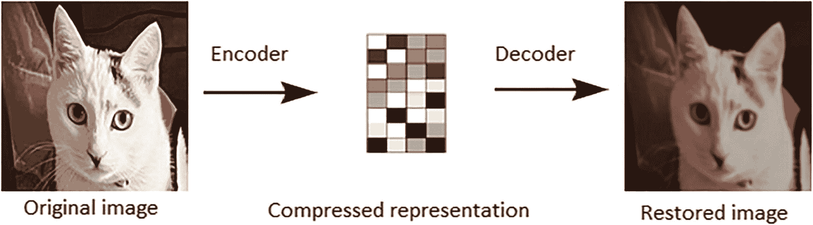

# 3. GANs 简介

本章介绍了**生成对抗网络**（GANs）的基本概念，这是一种可以用来生成合成数据的神经网络类型。后续章节将演示如何使用 R 和 Python 来使用 GANs 为特定应用生成合成数据；本章为 R 和 Python 章节中生成合成数据提供了关键背景。

在简要介绍 GANs 之后，我们将探讨 GANs 的不同类型，如 CTGAN、SurfelGAN、CycleGAN、SinGAN、MedGAN、DCGAN、WGAN 和 SeqGAN。接下来，我们将介绍条件 GANs 和 BigGAN。

## GANs

GANs 是一种由 Goodfellow 等人于 2014 年创建的神经网络类型 [1]。它们由两个独立的神经网络组成：生成器和判别器。这些网络被设计成相互竞争以欺骗对方。要构建 GAN 模型，你需要创建生成器和判别器网络，并将它们组合成 GAN 模型。GANs 用于生成高维数据。第一个网络，称为生成器，学习生成以某种方式分布的数据。第二个网络，称为判别器，试图将示例分类为真实或伪造。判别器被训练以擅长区分真实数据和伪造数据。

近年来，GANs 在图像生成等任务中取得了成功，它们可以创建出几乎与现实无法区分的逼真图像。GANs 是计算机程序，可以用来创建逼真的图像。它们擅长将夏季的照片转换为冬季或白天到夜晚，并生成逼真的物体、场景和人物照片 [2]。我们还应该指出，GANs 不太容易过拟合。GANs 已被用于生成不存在的人物的图像，以及创建将人脸叠加到他人身体上的**深度伪造**视频。

GANs 和变分自编码器是两种深度生成模型。变分自编码器是一种具有编码器、解码器和损失函数的深度生成模型，如图 3-1 所示。编码器接收输入并将其转换为表示。解码器接收表示并将其转换回原始输入。损失函数衡量输出与原始输入的接近程度。

原始图像经过编码形成压缩表示。随后它经过解码形成恢复的图像。

图 3-1 简单的自编码器结构

自编码器最重要的特性是它们能够在没有任何监督的情况下学习如何压缩数据。这种能力非常有价值，因为它意味着自编码器可以用来学习如何以更有效的方式表示数据，这可以导致在分类和预测等任务上表现更好。

自动编码器是一种用于学习数据压缩表示的神经网络。它们通常由一个编码器网络和一个解码器网络组成，这两个网络通过反馈循环连接。编码器网络接收一个输入向量并产生一个压缩表示，而解码器网络接收压缩表示并产生原始输入向量。

自动编码器就像主成分分析，但可以学习非线性流形。自动编码器可以通过端到端或层到层的方式进行训练。当它层到层地训练时，它会被“堆叠”在一起，这导致编码器更深。

VAE-GANs 是 GANs 和变分自编码器的混合体。它们通常优于深度生成模型，并且比变分自编码器更难处理。然而，它们需要大量的数据和调整才能达到良好的效果。编码器可以用来学习数据的“信息性”表示，这可以用于各种目的，例如聚类。VAE-GANs 被用于包括计算机视觉、自然语言处理和机器学习在内的多个领域。例如，文本识别、图像识别、人脸识别和语音识别也使用了 VAE-GANs。

GANs 可以生成比 VAEs 更逼真的数据，但需要更多的时间来完成。VAEs 平滑图像的边缘，而 GANs 生成更清晰的图像。GANs 与其他合成数据生成模型的主要区别在于，它是一种可以学习训练数据集真实数据分布的合成数据生成模型，并从这个分布中生成具有一些变化的新的数据点。

GANs 是一种用于生成人工数据的算法。GANs 有很多变体，每种都有其优势和劣势。例如，Wasserstein GAN 是一种使用 Wasserstein 距离来训练 GAN 的变体。这带来了许多好处，如提高学习的稳定性以及避免模式崩溃等问题。

现在让我们来了解一下 GANs 的类型。首先，让我们看看 CTGAN。

### CTGAN

CTGAN（卷积张量生成对抗网络）算法最初由陈等人于 2017 年提出[3]。原始的 CTGAN 算法在 2018 年由张等人进行了改进[4]。张等人提出的算法被称为 Dual-GAN（双 GAN）。DGAN 算法可以学习更广泛的图像变换，并生成更逼真的图像。

GANs 已被成功用于生成逼真的图像[5]。CTGAN 是 GANs 领域的一项最新发展，它使用 CNN 来学习数据的低级特征，并使用 GAN 来学习高级特征。CTGAN 的优势在于它可以生成比标准 GAN 具有更多细节的逼真图像。

CTGAN 算法是一种 GAN，可以用来生成与给定数据集相似的人工合成数据样本。该算法基于使用 GAN 来学习数据集的分布，然后使用学到的分布来生成新的数据样本。这使得 CTGAN 能够生成与原始数据集相似的新数据样本。

CTGAN 算法由两部分组成：生成器和判别器。生成器负责生成新的数据样本，而判别器负责确定给定数据样本是真实还是虚假[6]。生成器和判别器以对抗的方式联合训练。生成器通过生成虚假数据样本来欺骗判别器，而判别器试图识别虚假数据样本。随着训练的进行，生成器在生成接近真实数据样本的虚假数据样本方面变得越来越好，判别器在识别虚假数据方面也变得越来越好。一旦训练完成，生成器就可以用来生成新的数据样本。生成的数据样本将接近真实数据，但不会与之完全相同。

CTGAN 的应用领域非常广泛。它可以用于图像分割、目标检测、3D 打印等。在医疗领域，CTGAN 可用于图像重建、图像配准和图像分割。它还可以用于医疗图像的 3D 打印，以进行手术规划和培训。在零售行业，CTGAN 可用于产品识别和识别。它还可以用于定制产品的 3D 打印。在安全行业，CTGAN 可用于人脸识别和识别。它还可以用于与安全相关的物体的 3D 打印。

现在让我们来介绍一下 SurfelGAN。

### SurfelGAN

SurfelGAN 是一种 GAN，它结合了深度学习和强化学习来生成冲浪者的逼真图像[7]。该网络由两部分组成：生成器和判别器。生成器负责创建图像，而判别器负责区分生成的图像和真实图像[8]。这两部分在反馈循环中同时训练，生成器试图欺骗判别器，而判别器试图区分真实图像和生成图像。这个过程产生了一个能够生成冲浪者逼真图像的网络。

SurfelGAN 是一种专为生成真实 3D 浮点（表面 + 体积）模型设计的 GAN。SurfelGAN 不仅能够生成高质量的 3D 浮点模型，而且能够忠实再现输入数据的纹理。SurfelGAN 的一个关键优势是它能够以高精度生成逼真的 3D 模型。相比之下，传统的 3D 建模方法通常产生的模型细节水平较低。这一点在从远处观察模型时尤为明显。SurfelGAN 的另一个优势是它能够忠实再现输入数据的纹理。这对于 3D 打印和 VR 等应用尤为重要，在这些应用中，模型的纹理在整体体验中起着至关重要的作用。

SurfelGAN 是一种强大的生成对抗网络（GAN），可用于生成波浪、瀑布、河流、湖泊和海洋等真实图像。它还可以用于生成日落、云彩和夜空的逼真图像。此外，SurfelGAN 还可以生成星星、银河系和行星的真实图像。最后，SurfelGAN 还可以生成彗星、小行星、流星雨、北极光和南极光的真实图像。

现在，让我们简要介绍一下 Cycle GANs。

### Cycle GANs

Cycle GANs 是一种使用循环神经网络（RNN）在序列中生成连续图像的 GAN 类型。RNN 使用随机图像初始化，然后通过考虑当前图像和前一个图像来预测序列中的下一个图像。这允许生成器产生更连贯且彼此之间更一致的图像。在标准的 GAN 设置中，生成器和判别器交替训练，生成器试图产生能够欺骗判别器的样本，而判别器试图区分生成的样本和真实数据。然而，在 Cycle GAN 设置中，生成器和判别器一起训练，以便生成器能够学习生成与判别器期望更一致的图像。这可能导致生成图像的质量更高。

Cycle GAN 是一种机器学习模型，可用于从给定的一组图像中生成新的图像，或将给定图像转换为不同的风格。它由两部分组成：一个用于区分原始图像和生成图像的 *判别网络*，以及一个用于生成新图像的 *生成网络*。Cycle GAN 使用强化学习算法进行训练，这使得它能够学习如何生成与原始图像相似的新图像。

对于 CycleGAN，有许多潜在的应用。一个例子是使用 CycleGAN 生成人物的新图像。这可以用来创建人物的逼真 3D 图像，或者创建与目前可用的图像非常不同的人物新图像。另一个潜在的应用是使用 CycleGAN 生成新文本。这可以用来创建视频游戏或电影的真实对话，或生成新文章或故事。此外，CycleGAN 还可以用于提高机器学习算法的准确性。

现在，让我们简要介绍一下 SinGAN-Seg。

### SinGAN-Seg

SinGAN-Seg 是一种为医学图像分割生成合成训练数据的新方法。这种方法使用生成对抗网络（GAN）来学习给定图像中像素值的分布，然后生成与该分布相匹配的新图像。这允许创建大型、逼真的训练数据集，可用于训练用于分割任务的机器学习模型。以前生成合成训练数据的方法主要集中在创建与给定目标图像相似的图像。然而，这些方法往往无法捕捉目标图像中像素值的真实分布，导致训练数据不真实。SinGAN-Seg 通过从目标图像中学习像素值的分布，然后生成与该分布相匹配的新图像来克服这一局限性。这种方法在生成用于医学图像分割任务的逼真合成训练数据方面非常有效。在一个例子中，作者生成了一个脑部 MRI 图像的合成数据集，并使用它来训练一个分割模型。在合成数据上训练的模型能够达到与在真实数据集上训练的模型相似的性能。SinGAN-Seg 是生成医学图像分割合成训练数据的有希望的新方法。这种方法有可能创建大型、逼真的训练数据集，可用于训练用于分割任务的机器学习模型。

SinGAN 是由 Taesung Park 等人提出的 GAN，在论文“使用循环一致对抗网络进行无配对图像到图像翻译”[9]中提出。它用于无配对图像到图像翻译，这意味着它可以从一个领域学习翻译到另一个领域，而无需在两个领域都有对应图像的成对。例如，它可以学习将夏季的图片翻译成冬季的图片，或将狗的图片翻译成猫的图片，而无需任何夏季-冬季或狗-猫图像的成对。SinGAN 已被用于各种应用，如逼真图像生成、文本到图像合成和风格迁移。

现在，让我们简要介绍一下 MedGAN。

### MedGAN

MedGAN 是一种旨在生成合成医学图像的 GAN。该网络在真实医学图像数据集上训练，并学会生成足够逼真以欺骗判别器网络的新的图像。MedGAN 在数据增强、为机器学习算法创建新的训练数据或为研究目的生成新图像方面具有潜在应用。

MEdGAN 由两个网络组成：一个生成器和判别器。生成器网络负责创建新的图像，而判别器网络则评估生成图像的真实性。这两个网络在竞争中一起训练：生成器试图通过生成逼真的图像来欺骗判别器，而判别器则试图正确分类真实和生成的图像。

MedGAN 已被证明可以生成各种医学模态的逼真图像，包括 X 射线、MRI 扫描和病理切片。生成的图像可用于增强机器学习算法的训练数据或为研究目的生成新图像。MedGAN 是医学图像合成的关键工具，在医学的许多领域具有潜在应用。它可以用于生成疾病或损伤的图像，这些图像可用于培训医疗专业人员。它还可以用于生成健康组织的图像，这些图像可以帮助研究人员了解疾病的发展以及如何治疗疾病。

MedGAN 可用于多种目的，包括为计算机视觉中的训练数据生成逼真的图像、提高图像识别算法的性能、从头创建新图像、编辑图像以更改其内容、增强图像以获得更好的视觉质量、去除图像伪影和噪声、压缩图像以存储或传输、从二维图像生成三维图像、创建艺术图像以及为了娱乐或恶作剧而操纵图像。此外，MedGAN 还可以用于创建用传统图像生成方法难以或不可能创建的图像。例如，MedGAN 可以用于生成具有第三只手臂的人的图像或生成具有人类特征的动物的图像。

现在，让我们简要介绍一下 DCGAN。

### DCGAN

*深度卷积生成对抗网络*（DCGAN）是一种 GAN，用于从给定的训练数据集中生成新的图像。GAN 由两个网络组成，一个生成器网络和一个判别器网络，它们以游戏般的方式竞争。生成器创建新的图像，然后将其输入到判别器中，判别器试图将它们分类为真实或虚假。生成器的目标是生成欺骗判别器的图像，而判别器的目标是正确地将图像分类为真实或虚假。

DCGAN 是一种 GAN，它在生成器和判别器中都使用了深度卷积层。这使得它们非常适合生成图像，因为卷积层可以从图像中提取特征。DCGAN 已被用于生成人脸、动物和物体的图像，甚至可以从给定的训练数据集中创建新的图像。

要训练 DCGAN，首先将生成器和判别器用随机权重初始化。生成器创建新的图像，然后将其输入到判别器中。判别器试图将图像分类为真实或虚假，而生成器试图欺骗判别器。游戏继续进行，直到判别器无法再区分真实和虚假图像，此时 DCGAN 已经收敛。

训练完成后，DCGAN 可以用于生成新的图像。为此，生成器被赋予一个噪声向量，然后用于生成新的图像。噪声向量可以被视为一个种子，它将决定生成的图像的整体结构。通过改变噪声向量，可以生成不同的图像。

DCGAN 在生成高质量图像方面已证明是成功的。它们也易于训练，因为它们不需要大量的数据。然而，DCGAN 并非没有缺点。一个问题是有时生成器可以生成过于逼真的图像，这可能会让人不安。另一个问题是 DCGAN 可能难以控制，因为噪声向量有时会生成不是所期望的图像。

总体而言，DCGAN 是生成新图像的有力工具。它们易于训练，可以生成高质量的图像。然而，它们并非没有缺点，并且需要进一步的研究来改进它们。

现在让我们简要介绍一下 WGAN。

### WGAN

WGAN，缩写为“Wasserstein GAN”，是一种 GAN 模型。GAN 模型是人工神经网络模型，用于使用两个相互竞争的神经网络创建新的图像。WGAN 是 GAN 模型的一个子集，GAN 模型具有几个特性。其中之一是它使用一种称为“*Wasserstein 距离*”的距离，这是 GAN 模型使用的。这种距离允许 GAN 模型产生更精确的图像。此外，WGAN 模型比 GAN 模型需要更

# GANs: Generative Adversarial Networks

GANs are a powerful tool for generative modeling, but training them can be challenging. BigGAN is a new method for training GANs that promises to make training easier and more effective. BigGAN is based on a technique called *self-attention*, which allows the network to focus on important details in the data. This makes it possible to train a GAN to generate high-quality images with fewer data and less training time. BigGAN has been used to generate realistic images of faces, animals, and scenes. This could be used to create realistic images for computer vision applications. Self-attention is a technique that allows the network to focus on important details in the data. This makes it possible to train a GAN to generate high-quality images with fewer data and less training time.

BigGAN is an extension of the GAN model that can generate images with higher resolution than previous models. This is achieved through the use of a new technique called “*projection discriminator*”. The projection discriminator can learn more complex relationships between images and their labels than previous discriminator models. This allows BigGAN to generate more realistic and diverse images than previous models.

BigGAN uses several techniques to improve the quality of generated images, including hierarchical latent spaces, truncation tricks, and new GAN loss functions. Hierarchical latent spaces allow the network to generate images that are more diverse and realistic than those generated by previous GANs. Truncation tricks allow the network to generate images that are closer to the training data, while new GAN loss functions encourage the network to generate images that are both realistic and diverse.

## Summary

In this chapter, you learned about generative adversarial networks or GANs. You learned about different types of GANs, including CTGANs, SurfelGANs, Cycle GANs, SinGANs, medGANs, DCGANs, WGANs, seqGANs, and conditional GANs. You also learned about BigGAN and how to use it to generate realistic images.

Next, we will delve deeper into synthetic data generation using R.

## References

[1]. I. J. Goodfellow et al., "Generative Adversarial Nets," arXiv preprint arXiv:1406.2661, 2014. [Online]. Available: [http://www.github.com/goodfeli/adversarial](http://www.github.com/goodfeli/adversarial).

[2]. A. Rosolia and J. Osterrieder, "Analyzing Deep Generative Financial Time Series of Different Asset Categories," SSRN Electronic Journal, 2021, doi: 10.2139/ssrn.3898792.

[3]. X. Chen et al., "Spatial Charge Induced Interface Polarization Enhancement of Dielectric Properties in Multilayer Polymer Films," J. Mater. Chem. C, Vol. 5, Issue 39, pp. 10417–10426, 2017, doi: 10.1039/C7TC03653A.

[4]. M. Zhang, N. A. Deskins, G. Zhang, R. T. Cygan, and M. Tao, "Modeling the Polymerization Process of Gel Polymers through Reaction Molecular Dynamics Simulations," Progress in Physical Chemistry C, Vol. 122, Issue 12, pp. 6760–6773, March 2018, doi: 10.1021/acs.jpcc.8b00697.

[5]. D. Ravi, S. B. Blumberg, S. Ingala, F. Barkhof, D. C. Alexander, and N. P. Oxtoby, "Degradation-Aware Adversarial Neural Image Network for Brain Scan Simulation: Applications in Aging and Dementia," Medical Image Analysis, Vol. 75, pp. 102257, January 2022, doi: 10.1016/j.media.2021.102257.

[6]. E. Wang, L. Xue, Y. Li, Z. Zhang, and X. Hou, "3D Model Generation Network (3DMGNet) Based on Multimodal Data Constraint and Multilevel Feature Fusion," Sensors, Vol. 20, Issue 17, pp. 4875, August 2020, doi: 10.3390/s20174875.

[7]. Z. Yang et al., "SurfelGAN: Generating Realistic Sensor Data for Autonomous Driving," In 2020 IEEE/CVF Conference on Computer Vision and Pattern Recognition (CVPR), June 2020, pp. 11115–11124, doi: 10.1109/CVPR42600.2020.01113.

[8]. X. Dai, X. Yuan, and X. Wei, "Data Augmentation for Thermal Infrared Target Detection Using Cascaded Pyramid Generative Adversarial Networks," Applied Intelligence, Vol. 52, Issue 1, pp. 967–981, January 2022, doi: 10.1007/S10489-021-02445-9.

[9]. J.-Y. Zhu, T. Park, P. Isola, and A. A. Efros, "Unpaired Image to Image Translation using Cycle-Consistent Adversarial Networks," In IEEE International Conference on Computer Vision (ICCV) papers, 2018, pp. 2223–2232. [Online]. Available: [https://ieeexplore.ieee.org/stamp/stamp.jsp?tp=&arnumber=8237506](https://ieeexplore.ieee.org/stamp/stamp.jsp%253Ftp%253D&arnumber%253D8237506).

[10]. L. Yu, W. Zhang, J. Wang, and Y. Yu, "SeqGAN: Sequence Generation with Policy Gradient," 2017. [Online]. Available: [http://www.aaai.org](http://www.aaai.org).

[11]. P. J. Liu et al., "Summarizing Long Sequences to Generate Wikipedia," 2018. [Online]. Available: [https://en.wikipedia.org/wiki/Wikipedia:Manual_of_Style](https://en.wikipedia.org/wiki/Wikipedia:Manual_of_Style).

[12]. Y. Zhang et al., "Adversarial Feature Matching for Text Generation," In Proceedings of the 34th International Conference on Machine Learning, PMLR, 2017, pp. 4006–4015.

[13]. P. Salehi, A. Chalechale, and M. Taghizadeh, "Generative Adversarial Networks (GANs): A Theoretical Model, Evaluation Metrics, and an Overview of the Latest Advances," 2020.

[14]. S.-W. Park, J.-S. Ko, J.-H. Huh, and J.-C. Kim, "A Survey on Generative Adversarial Networks: Focusing on Computer Vision and Its Applications," Electronics (Basel), Vol. 10, Issue 10, pp. 1216, May 2021, doi: 10.3390/electronics10101216.

[15]. M. Castelli, L. Manzoni, T. Espindola, A. Popovič, and A. de Lorenzo, "Generative Adversarial Networks for Generating Wi-Fi Signal Quality Synthetic Features," PLOS ONE, Vol. 16, Issue 11, e0260308, November 2021, doi: 10.1371/journal.pone.0260308.
