# 4. 使用 R 进行合成数据生成

在本章中，我们将探讨如何使用 R 编程语言生成合成数据。我们将首先查看一些用于生成合成数据的基本函数。接下来，我们将探讨如何从已知单变量分布中构建值向量。然后，我们将探讨如何从多级分类变量中构建向量。我们将探讨如何使用 `nnet` 包在 R 中构建神经网络。我们将给出使用 `torch` 包进行图像增强的示例。接下来，我们将探索如何使用 `mice conjurer` 和 `synthpop` 包在 R 中生成合成数据。最后，我们将讨论 copulas 以及与 copula、正态 copula 和高斯 copula 相关的 R 实践。

## 生成合成数据时使用的常用函数

合成数据生成方法是一种创建新的人工数据的方法，这些数据在某些方面类似于真实数据。有许多生成合成数据的方法，但所有方法都有相同的目标：创建可以用于训练机器学习模型而无需真实数据的数据。

基本函数在合成数据生成中用于多种原因。首先，基本函数允许构建原始数据集中不存在的新变量。这很重要，因为它允许创建可能对分析很重要但最初未测量的变量。其次，基本函数可以用于转换原始数据集中的变量。这很重要，因为它允许创建更适合分析的新变量。最后，基本函数可以用于在数据集中创建缺失值。这很重要，因为它允许创建包含缺失值的更真实的数据集。

R 编程语言中有一些函数可以用于创建合成数据集。这些数据集可以用于测试 R 编程中使用的代码。

本例中使用的代码来自[projets.pasteur.fr/projects/rap-r/wiki/Synthetic_Data_Generation](https://projets.pasteur.fr/projects/rap-r/wiki/Synthetic_Data_Generation)。

```r
# Concatenate into a vector
> a <- c(3, 4, 6, 2, 1)
> b <- c(6, 3, 2, 8, 9, a)
> b
[1] 6 3 2 8 9 3 4 6 2 1

# Create an increasing array from 7 to 14 with an interval of 1.4
> seq(from = 7, to = 14, by = 1.4)
[1] 7.0 8.4 9.8 11.2 12.6 14.0

# Create a sequence that repeats 7 5 times
> rep(7, times = 5)
[1] 7 7 7 7 7

# Define a vector y that can take a value between 4 and 20.
> y <- seq(4, 20, length.out = 16)
> y
[1]  4  5  6  7  8  9 10 11 12 13 14 15 16 17 18 19 20

# A random permutation
> sample(y)
[1] 16 13 17 14 10  8  5 11 20  4  9 12 15 19 18  6  7

# Bootstrap resampling
> sample(y, replace = TRUE)
[1] 13 12 20 16 18  4 17  9 10 10 18  9 17 20 13 17 15

# Bernoulli trials
> sample(c(3, 7), 10, replace = TRUE)
[1] 7 3 7 3 3 7 3 3 3 7
```

### 从已知单变量分布创建值向量

要在随机操作中获得相同的结果，需要在命令前编写 `set.seed()` 函数。

```r
> set.seed(12)
# Select sample number as 15
> n <- 15
# Uniform distribution between 5 and 30
> runif(n, min = 5, max = 30)
[1] 15.983358 16.440179 18.517689 21.641996  7.817473 10.459179
[7] 24.695909  7.446326 22.745762 10.445576 11.698590 17.619199
[13]  9.714673 15.985733 21.745482

# A Gaussian distribution with a mean of 3 and a standard deviation of 1.5.
> rnorm(n, mean = 3, sd = 1.5)
[1] 4.0109717 6.1080537 2.1884570 1.3942618 2.4413149
[6] 2.2722880 3.4121763 2.2807312 4.1971580 1.4933232
[11] 3.1574763 1.2660107 3.8672019 0.6065615 2.5372445

# The parameter lambda is used to determine the shape of the Poisson distribution.
> rpois(n, lambda = 3)
[1] 4 5 5 6 4 4 3 4 4 3 4 2 7 1 0

# The proportional exponential distribution can be used to model the waiting time for an event occurring at a continuous rate.
> rexp(n, rate = 2)
[1] 0.2498384 0.5392200 0.4350614 0.8315090 0.7619429 0.2520267 0.5561264
[8] 0.2639337 0.4741497 0.2147715 0.1082590 0.6139462 0.4781476 0.2432179
[15] 0.8234695

# The binomial distribution with size and prob is a way of looking at data that is collected in a certain way. This distribution is used when there are a certain number of trials, and when each trial has two possible outcomes, which are either success or failure.
> rbinom(n, size = 5, prob = 0.5)
[1] 4 4 3 4 3 2 4 3 3 2 3 2 4 2 2

# lognormal distribution
> rlnorm(n, meanlog = 2, sdlog = 1.5)
[1]  2.855488  1.097922  4.154011 16.040772  5.657868  7.436401  1.092983
[8]  5.456647 42.380944  7.134419 28.381432  5.668436 39.274035  3.277781
[15]  1.741771
```

### 从多级分类变量生成向量

```r
# Generating a random sequence from a four-level categorical variable.
> sample(c("G-1", "G-2", "G-3", "G-4"), 8, replace = TRUE)
[1] "G-4" "G-3" "G-3" "G-3" "G-4" "G-3" "G-4" "G-1"

# A five-level categorical variable can be used to generate a random sequence.
> sample(c("G-1", "G-2", "G-3", "G-4", "G-5"), 10, replace = TRUE)
[1] "G-5" "G-1" "G-1" "G-5" "G-5" "G-4" "G-5" "G-3" "G-2" "G-5"
```

### 多变量

```r
# This exercise will generate a data.frame from 4 different samples, each with 5 different variables from the same distribution.
> data.frame(indv = factor(paste("S-", 1:4, sep = "")), matrix(rnorm(4 * 5, 4, 2), ncol = 5))
indv       X1       X2       X3       X4       X5
1  S-1 3.221146 2.000166 4.796590 3.033753 2.877777
2  S-2 5.373274 2.557023 3.372633 5.074982 4.614122
3  S-3 4.380217 4.593711 6.325639 4.058779 3.620474
4  S-4 1.317684 6.412876 3.259470 6.295884 5.125372

# This code will generate a data.frame with 3 independent variables from 4 different distributions.
> data.frame(indv = factor(paste("S-", 1:4, sep = "")), W1 = rnorm(4, mean = 3, sd = 2), W2 = rnorm(4, mean = 5, sd = 3), W3 = rpois(4, lambda = 5))
indv       W1       W2 W3
1  S-1 4.123975 2.045277  4
2  S-2 4.740534 6.300097  5
3  S-3 1.470572 6.263931  3
4  S-4 0.430045 2.160229  5

# This data.frame has 1 categorical variable (2 levels) and 3 independent continuous variables.
> data.frame(indv = factor(paste("S-", 1:8, sep = "")), W1 = rnorm(8, mean = 1, sd = 2), W2 = rnorm(8, mean = 10, sd = 4), W3 = rnorm(8, mean = 5, sd = 3), Animal = sample(c("Cat", "Dog"), 8, replace = TRUE))
indv         W1         W2       W3    Animal
1  S-1  1.8277723  4.5727621 5.261963    Dog
2  S-2 -1.3343894 14.9566491 4.743537    Dog
3  S-3  3.3592723 15.2376011 5.333706    Dog
4  S-4 -2.8445692 12.1955695 5.677764    Cat
5  S-5  1.8944436 18.6326683 3.860072    Dog
6  S-6  1.2227463  0.4451184 5.478651    Cat
7  S-7 -3.7531096  6.1432943 7.847106    Cat
8  S-8 -0.6455443  6.1451687 3.093108    Dog
```

### 多变量（含相关性）

MASS 包可用于从多元正态分布生成样本。这可以用于模拟研究或参数估计。例如，我们可以使用 MASS 包从多元正态分布中创建 3 个随机样本。这可以用于测试统计方法或探索数据。MASS 包还可以用于生成其他分布的样本，这可以用于不同的目的。

```r
# Load "MASS", "psych" and "rgl" packages.
> library(MASS)
> library(psych)
> library(rgl)
> set.seed(50)
> m <- n <- sigma <- X <- colnames(X) <- cor(X, method = 'spearman')
X1         X2        X3
X1  1.0000000 -0.3859910 0.2888176
X2 -0.3859910  1.0000000 0.5766619
X3  0.2888176  0.5766619 1.0000000

# Compare variables
> pairs.panels(X)

输出结果如图 4-1 所示。

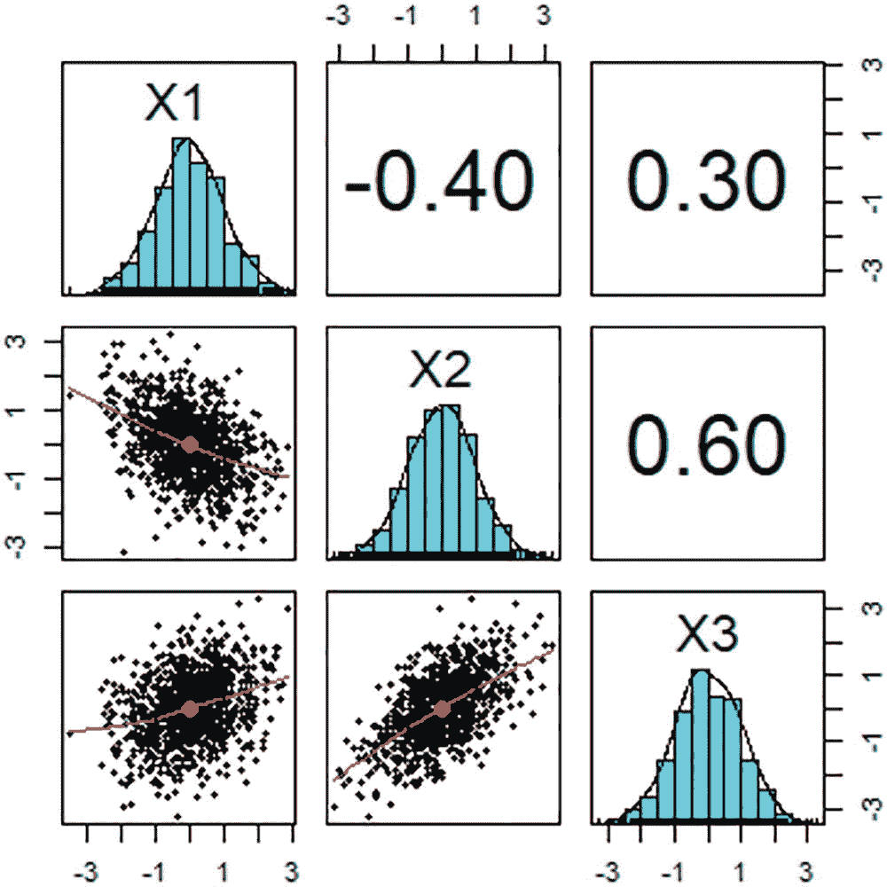

以 3x3 形式在九个块中变量边缘正态分布的输出。对角块有直方图，上方块有数值-0.40、0.30 和 0.60。

图 4-1

变量的边缘正态分布

```r
# Normalize the variables
> w <- pairs.panels(w)

输出结果如图 4-2 所示。

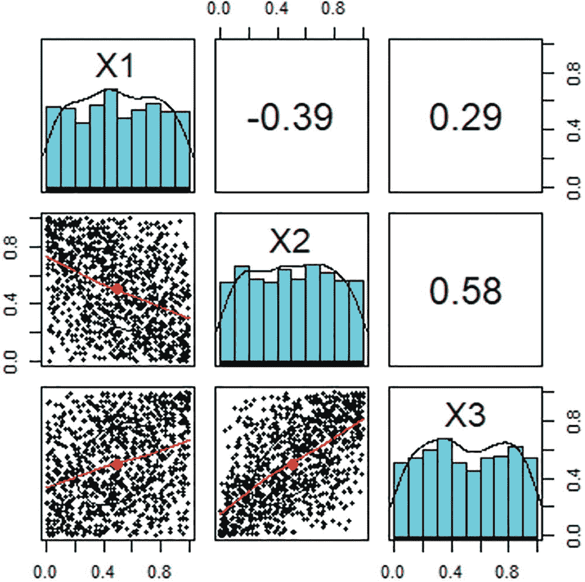

以 3x3 形式在九个块中标准化变量的输出。对角块有直方图，上方块有数值-0.39、0.39 和 0.58。

图 4-2

标准化变量的分布

在这里，将使用“rgl”包在三维空间中可视化数据。“rgl”包是 R 的一个图形设备系统。它为三维数据可视化提供了中到高层次的图形函数，包括点云、网格表面、体积表示和几何原语等函数。

```r
# Draw the representation of variables in 3D space using the "rgl" package.
> plot3d(w[,1], w[,2], w[,3], pch = 30, col = 'black')

输出结果如图 4-3 所示。

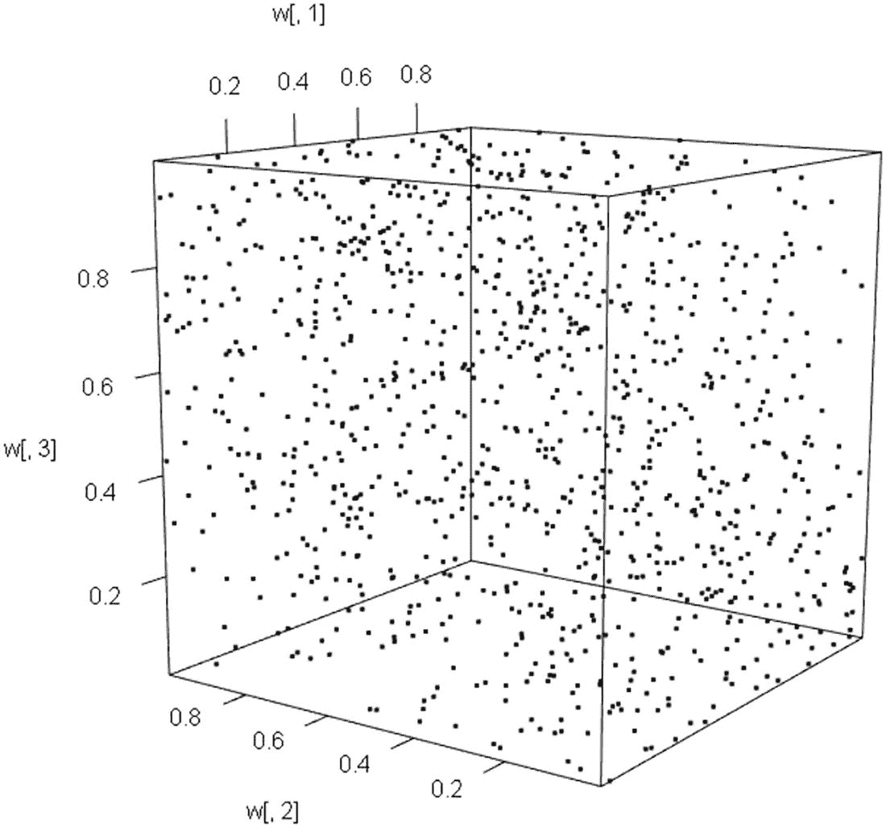

用于表示 3D 空间中变量的三维盒子，内部有许多点。

图 4-3

变量的 3D 空间表示

```r
# Create variables u1, u2 and u3
> u1 <- u2 <- u3 <- plot3d(u1, u2, u3, pch = 20, col = 'blue')

输出结果如图 4-4 所示。

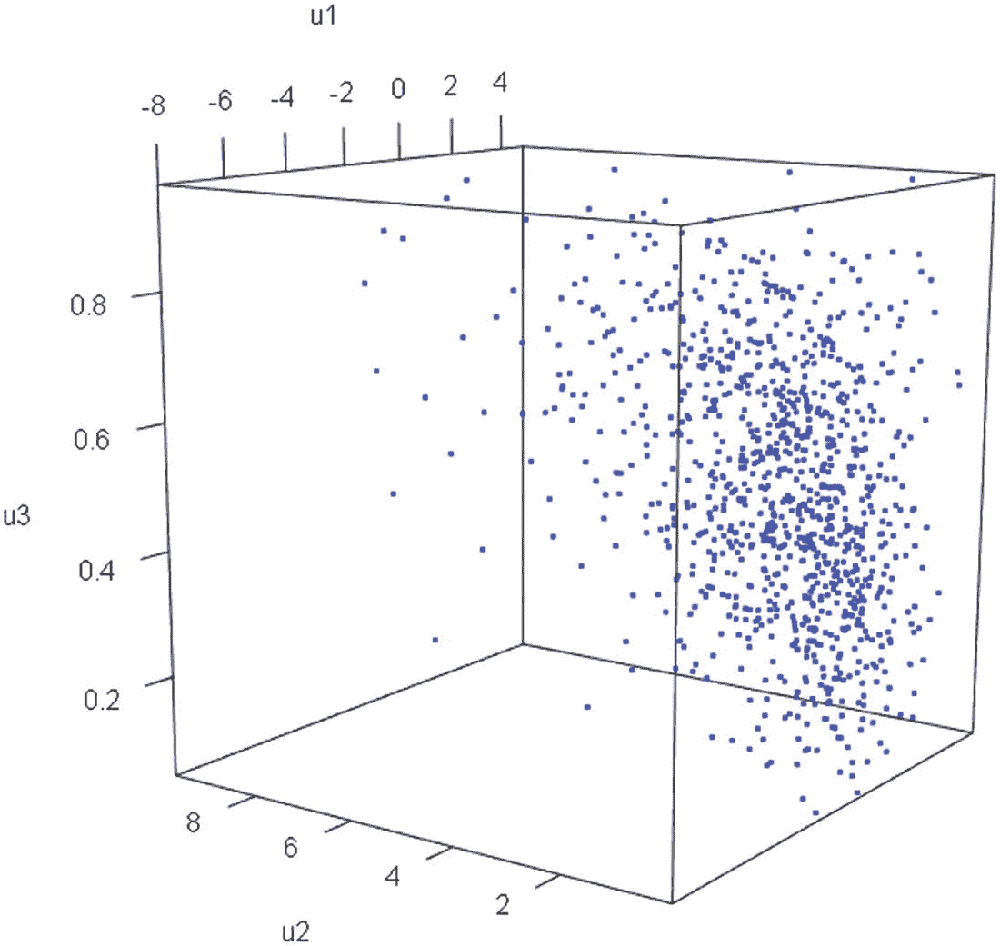

用于表示 3D 空间中刺激数据的内部有许多点的三维盒子。点更集中在右侧。

图 4-4

模拟数据的 3D 绘图

```r
# Creates a data frame using the simulated variables u1, u2, and u3.
> data.frame(cor(data.frame, meth = 'spearman'))
u1         u2        u3
u1  1.0000000 -0.

```markdown
```python
# Read the dataset from the file "C:/Users/........./glass.csv" and store it in a variable named "glass"
```python
glass = read.csv("C:/Users/........./glass.csv")
```

# Generate an ID number for each column in the dataset
```python
glass$id = as.character(seq(1, nrow(glass)))
```

# Print the first six rows in the dataset
```python
head(glass)
```
```
Id.number refractive.index Sodium Magnesium Aluminum Silicon Potassium
1             1.52   13.6      4.49     1.1     71.8      0.06
2             1.52   13.9      3.6      1.36    72.7      0.48
3             1.52   13.5      3.55     1.54    73.0      0.39
4             1.52   13.2      3.69     1.29    72.6      0.57
5             1.52   13.3      3.62     1.24    73.1      0.55
6             1.52   12.8      3.61     1.62    73.0      0.64
```

# … with 5 more variables: Calcium , Barium , Iron ,

# Modify the glass variable to create new variables for each level of the Type.of.glass variable. The new variables are called label1, label2, label3, label4, label5, label6, and label7\. The Type.of.glass variable is then converted into a factor.
```python
glass.label = mutate(glass,
                     label1 = Type.of.glass == '1',
                     label2 = Type.of.glass == '2',
                     label3 = Type.of.glass == '3',
                     label4 = Type.of.glass == '4',
                     label5 = Type.of.glass == '5',
                     label6 = Type.of.glass == '6',
                     label7 = Type.of.glass == '7',
                     Type.of.glass = factor(Type.of.glass))
```

# Convert "glass.label" to a class vector.
```python
sapply(glass.label, class)
```
```
Id.number refractive.index                  Sodium        Magnesium
"numeric"        "numeric"        "numeric"        "numeric"
Aluminum          Silicon        Potassium          Calcium
"numeric"        "numeric"        "numeric"        "numeric"
Barium             Iron    Type.of.glass               id
"numeric"        "numeric"         "factor"      "character"
label1           label2           label3           label4
"logical"        "logical"        "logical"        "logical"
label5           label6           label7
"logical"        "logical"        "logical"
```

# Test whether each variable in the dataset "glass.label" is a numeric value.
```python
numeric = sapply(glass.label, is.numeric)
numeric
```
```
Id.number refractive.index                  Sodium        Magnesium
TRUE             TRUE             TRUE             TRUE
Aluminum          Silicon        Potassium          Calcium
TRUE             TRUE             TRUE             TRUE
Barium             Iron    Type.of.glass               id
TRUE             TRUE            FALSE            FALSE
label1           label2           label3           label4
FALSE            FALSE            FALSE            FALSE
label5           label6           label7
FALSE            FALSE            FALSE
```

# Scale the dataset
```python
glass.scaled = glass.label
glass.scaled[, numeric] = sapply(glass.label[, numeric], scale)
```

# Print the first six lines of the scaled dataset.
```python
head(glass.scaled)
```
```
Id.number refractive.index     Sodium Magnesium   Aluminum     Silicon    Potassium
1 -1.719943        0.8708258  0.2842867 1.2517037 -0.6908222 -1.12444556  -0.67013422
2 -1.703794       -0.2487502  0.5904328 0.6346799 -0.1700615  0.10207972  -0.02615193
3 -1.687644       -0.7196308  0.1495824 0.6000157  0.1904651  0.43776033  -0.16414813
4 -1.671494       -0.2322859 -0.2422846 0.6970756 -0.3102663 -0.05284979  0.11184428
5 -1.655344       -0.3113148 -0.1688095 0.6485456 -0.4104126  0.55395746  0.08117845
6 -1.639195       -0.7920739 -0.7566101 0.6416128  0.3506992  0.41193874  0.21917466
Calcium     Barium       Iron Type.of.glass id label1 label2 label3 label4
1 -0.1454254 -0.3520514 -0.5850791            1  1   TRUE  FALSE  FALSE  FALSE
2 -0.7918771 -0.3520514 -0.5850791            1  2   TRUE  FALSE  FALSE  FALSE
3 -0.8270103 -0.3520514 -0.5850791            1  3   TRUE  FALSE  FALSE  FALSE
4 -0.5178378 -0.3520514 -0.5850791            1  4   TRUE  FALSE  FALSE  FALSE
5 -0.6232375 -0.3520514 -0.5850791            1  5   TRUE  FALSE  FALSE  FALSE
6 -0.6232375 -0.3520514  2.0832652            1  6   TRUE  FALSE  FALSE  FALSE
label5 label6 label7
1  FALSE  FALSE  FALSE
2  FALSE  FALSE  FALSE
3  FALSE  FALSE  FALSE
4  FALSE  FALSE  FALSE
5  FALSE  FALSE  FALSE
6  FALSE  FALSE  FALSE
```

# Generate a training dataset by randomly selecting 60 samples in the "id" variable
```python
train.sample = sample(glass$id, 60)
```

# Create a test sample based on the training sample
```python
test.sample = glass$id[!(glass$id %in% train.sample)]
```

# Scale the "train.sample" dataset
```python
glass.train = glass.scaled[train.sample, ]
```

# Scale the "test.sample" dataset
```python
glass.test = glass.scaled[test.sample, ]
```

# Create a regression model with a dependent variable "Type.of.glass"
```python
nnet.formula = as.formula(paste('Type.of.glass~', paste(feature.names, collapse = ' + ')))
```

# Print the generated regression model
```python
print(nnet.formula)
```
```
Type.of.glass ~ refractive.index + Sodium + Magnesium + Aluminum +
Silicon + Potassium + Calcium + Barium + Iron
```

# Upload the "nnet" and "neuralnet" libraries to the existing R session to train neural networks.
```python
library(nnet)
library(neuralnet)
```

# nnet.model = nnet(nnet.formula, data = glass.train, size =5)
# weights:  56
initial  value 61.056145
iter  10 value 0.375113
iter  20 value 0.002223
final  value 0.000070
converged

# Print nnet.model nnet
```python
nnet.model
```
```
a 9-5-1 network with 56 weights
inputs: refractive.index Sodium Magnesium Aluminum Silicon Potassium Calcium Barium Iron
output(s): Type.of.glass
options were - entropy fitting
```

# Print the first six lines of the predicted pattern
```python
head(predict(nnet.model))
```
```
[,1]
1 0.000000e+00
2 0.000000e+00
3 0.000000e+00
4 9.999581e-01
5 1.026017e-06
6 0.000000e+00
```

# Note that the left side of the formula is different for the two packages
```python
neuralnet_formula = paste('label1 + label2+label3 + label4+label5 + label6+label7~', paste(feature.names, collapse = ' + '))
```

# Print the formula used in modeling the neural network
```python
print(neuralnet_formula)
```
```
[1] "label1 + label2+label3 + label4+label5 + label6+label7~ refractive.index + Sodium + Magnesium + Aluminum + Silicon + Potassium + Calcium + Barium + Iron"
```

# neuralnet.model = neuralnet( neuralnet_formula, data = glass.train,   hidden = c(5), linear.output = FALSE)
```python
neuralnet.model = neuralnet(neuralnet_formula, data = glass.train, hidden = c(5), linear.output = FALSE)
```

# Print the output results of the neural network model
```python
print(head(neuralnet.model$net.result[[1]]))
```
```
[,1]        [,2]         [,3]         [,4]         [,5]
[1,] 0.99892017 0.003101246 3.197760e-06 5.021891e-07 9.660337e-07
[2,] 0.99775878 0.001284624 7.696107e-10 1.319792e-10 3.354974e-11
[3,] 0.99856318 0.004242630 4.243761e-05 2.904989e-06 1.066150e-05
[4,] 0.05082495 0.953484676 4.766107e-09 2.425787e-08 1.902702e-09
[5,] 0.97261516 0.010984899 2.072264e-10 5.220585e-11 7.683335e-12
[6,] 0.98710994 0.017597351 5.618931e-09 8.099489e-09 2.702098e-09
[,6]         [,7]
[1,] 5.453343e-07 2.137497e-07
[2,] 2.399037e-10 4.342645e-11
[3,] 7.368009e-06 2.196349e-06
[4,] 1.618680e-08 9.323684e-10
[5,] 1.312461e-10 1.206774e-11
[6,] 6.127981e-09 4.710287e-10
```

# Draw the model of the neural network
```python
plot(neuralnet.model)
```

```
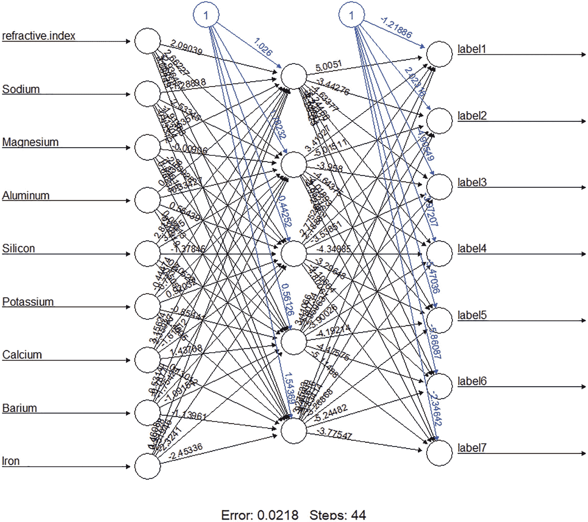

Neural network model output. The refractive index of the metal is associated with the labels from 1 to 7 in the grid.

Figure 4-6 Neural network model

### Enhanced Data

The general purpose of machine learning is to automatically classify and label data, or to discover patterns in a dataset. Using machine learning, we can classify datasets and use them for predictions. If we aim to classify a dataset, such as categorizing photos into cats and dogs, we need to provide some labeled data to the machine. The labeling process is the process of identifying the type of a set of raw data (such as images, text, and photos). From such labeled data, the computer learns whether a photo contains a cat or a tumor, and then can identify the category of unmarked data. The data labeling process is the necessary process for the computer to see and recognize images, text, and voice.

Data augmentation is a technique used in synthetic data, which is a technique for generating new data points from training datasets. The purpose of data augmentation is to improve the quality of the training dataset, which helps improve the quality of the model. Data augmentation can be used to add more data points to the dataset to improve the distribution of the data, increase the diversity of the data, or improve the quality of the data.

Computer vision and machine learning are methods to make images look better. Image enhancement is a technique used in these fields to make images look better. This may involve applying "geometric transformations, color space enhancement, kernel filtering, mixed images, random erasing, feature space enhancement, adversarial training, GANs, neural style transfer, and meta-learning" [1]. These algorithms can be applied in different ways to produce different results.

AlexNet is a deep learning network developed by Alex Krizhevsky. It is one of the first networks to use data augmentation, which helped it achieve better results. AlexNet used two types of augmentation: horizontal reflection and image translation.

In AlexNet, all inputs must be 256x256 in size. If the input image is not this size, it must be converted to this size before being used to train the network.
```


# 监督学习

监督学习是一种让计算机从数据中学习的方法。在这种方法中，数据首先被标记（或分类），然后计算机使用这些数据来学习如何自己做事。这意味着计算机通过展示想要的结果的例子来学习如何做某事。监督学习对于使用基于“真实情况”的标记数据训练模型非常重要。例如，当处理未标记数据时，人们可能会问：“这张照片里有没有鸟？”模型的准确性取决于数据的正确性。例如，面部识别模型的准确性取决于标记面部数据的正确性。

## 自然语言处理

在自然语言处理过程中，文本的重要部分是手动确定的，并为其分配标签以创建训练数据集。在这种类型的标记中，如果应用情感分析，则会对确定情感的文本部分、名称、地点和人物进行标记。此外，在这样一个过程中，可以使用边界框标记文本的某些部分。在音频数据中，首先将声音（如狗吠、鸣叫、鸟鸣、破碎声）转换为文本，这些文本作为结构化数据格式中的训练数据使用。

## R 中的“ggpubr”包

“ggpubr”包是 R 中流行的“ggplot2”包的附加包，它提供了创建和操作出版物质量图形的几个函数。这些函数包括创建自定义主题、添加注释和标签以及自定义图形的布局和外观。此外，“ggpubr”包还包括几个用于导入和导出不同格式的数据函数，这使得创建可用于报告或演示的图形变得容易。

## 使用 R 的“ggpubr”包创建文本图形对象的示例

```py
# Install ggpubr package
>install.packages("ggpubr")
# Load the "ggpubr" library
>library(ggpubr)
# Store the text to be used in the analysis in an array
>Text TextGrob  as_ggplot(TextGrob)
```

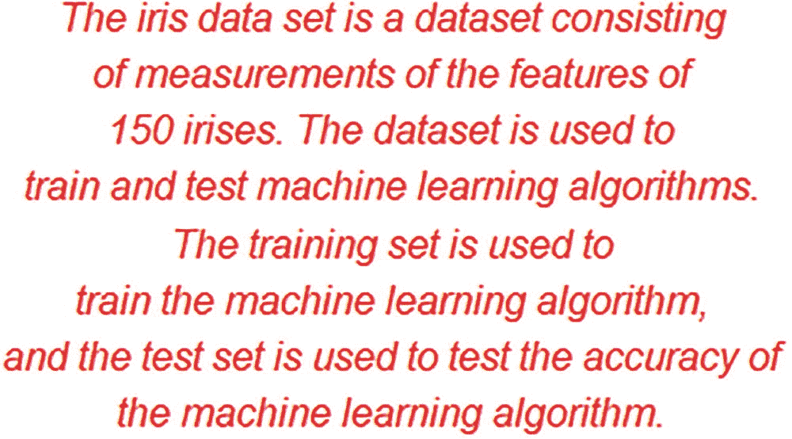

## 数据增强

定义鸢尾花数据集、训练测试及其用途的文本。

增强可以通过对现有数据进行更改或使用生成对抗网络（GANs）来实现。这些更改可以包括填充、旋转、缩放、翻转、平移、裁剪、缩放、变暗、变亮和颜色修改。此外，还可以添加噪声，并改变对比度。

TF-Transformation Functions 是由斯坦福 AI 实验室开发的一种数据增强方法。这种方法是一种图像处理技术，用于获取数据集。TF-Transformation Functions 通过改变图像和声音来获取数据集。这种方法允许通过从不同角度录制图像和不同频率的声音来获取数据集。

在以下图 4-7 中可以看到，数据是如何通过变换函数（列出对现有数据的更改）转换为增强数据的。我们可以标注图像、像素或关键点，以便计算机能够看到它们，或者我们可以在转换训练数据为标记形式的过程中创建一个“矩形框”，将数字图像框定在过程中。以这种方式标注数据将允许视觉模型对图像进行分类、定位对象、识别图像的关键点或识别图像的某部分。


一张男人举起右手的照片。男人的脸部在一个方形框内，一些点在他的手上形成线条。

图 4-7

矩形框

我们之前列出的变换操作，如填充、随机旋转和重新缩放，可以手动完成，也可以在它们被框定在“矩形框”中后执行自动变换操作，如图 4-7 所示。

矩形框标注有不同的格式。标记图像中人物的矩形边框的坐标称为“矩形框”。图 4-8 中给出了矩形框的示例。


一张照片被标记为男人和女人，用矩形框标注。男人的矩形框大小为 260 宽 x 684 高，女人的矩形框大小为 165 宽 x 532 高。

图 4-8

带有矩形框的示例图像

数据增强是一种提高图像分类器效率的合适技术。增强是通过向现有数据添加新数据来完成的。例如，我们可以通过旋转现有照片或通过增加或减少其亮度来生成新数据。一个好的测试者的两个特性是类内不变性和类间区分性。“类内不变性”意味着一个数据点可以被同一类中的另一个数据点替换，而不会影响测试者的结果。“类间区分性”意味着一个数据点可以被来自不同类别的数据点替换，而不会影响测试者的结果。

GANs 用于创建尽可能接近真实数据的新数据。这是通过让生成器创建与真实数据不可区分的数据，同时判别器试图区分真实数据和生成数据来实现的。这个过程有助于创建数据“真实分布”的更准确近似。

用于数据增强的 Python 包包括 Keras ImageDataGenerator、Skimage 和 OpenCV。匿名化数据意味着从数据集中删除个人信息。这是为了保护人们的隐私。这在金融和医疗保健等行业使用的结构化数据（如文本）中尤其受欢迎 [2]。

匿名增强数据与合成数据不同。匿名数据是经过修改的数据，使得涉及的个人或组织的身份被隐藏。增强数据是经过修改以包含额外信息的数据。合成数据是使用数据增强技术人工创建的数据。例如，我们可以使用汽车的照片创建一个合成汽车照片。

随机擦除是一种在训练卷积神经网络（CNN）时使用的技巧。这种技巧随机选择图像中的一个矩形区域，并用随机值删除其像素。这声称有助于纠正模型中的过拟合。

“掉落物”数据集是一个包含 61,500 张家庭环境拍摄图像的集合，可用于训练和评估目标检测和姿态估计算法。该数据集包括各种位置上的物体图像，使研究人员能够测试算法以准确检测和估计物体的位置。此外，该数据集还包括不同深度和不同传感器模态的物体图像，使研究人员能够测试算法以准确估计深度和在不同环境中检测物体。

当数据增强技术在计算机视觉中得到应用时，增强数据强化学习（RAD）技术也可以被应用。在这一技术中，一项研究表明，执行应用的人通过学习同一输入的不同视角，提高了数据效率和泛化能力。如果能够弥合数据效率和泛化之间的差距，强化学习就可以更广泛地应用于现实世界。这将使得从数据中学习更加准确，并提高强化学习算法的整体性能。

## 使用 Torch 包进行图像增强

Torch 是一个用于执行自然语言处理、计算机视觉和通用机器学习任务的机器学习库。Torch 是用 Lua 编写的，Lua 是一种易于学习和使用的脚本语言。Torch 拥有许多不同的统计和图形技术，可以用于各种任务，这使得它非常灵活。Torch 在数据科学家中很受欢迎，因为它提供了广泛的算法和庞大的用户社区。

Torch 提供了两种主要接口：命令式编程风格和函数式风格。在函数式风格中，你首先定义构成图的数学运算（或“节点”），然后“连接”它们。节点可以按任何顺序连接，生成的图也可以按任何顺序运行。这使得尝试新想法并看到什么效果最好变得容易。

Torch 还提供了大量内置节点，用于常见任务，如矩阵运算、卷积等。你还可以用 C/C++或 Lua 编写自己的节点。

Torch 的一个优点是它非常快。例如，流行的机器学习算法支持向量机在 Torch 中的训练速度比在其他语言中快得多。这是因为 Torch 使用一个名为 CUDA 的库，它提供了一种方法，可以在您的计算机上使用图形处理单元（GPU）来执行一些计算。这可以将训练速度提高 10 倍或更多。

Torch 也与其他科学计算库（如 NumPy 和 SciPy）很好地集成。这使得使用 Torch 在大型数据集上执行复杂计算变得容易。最后，Torch 是开源的，并且免费使用。

Torch 包是一个用于图像增强的库。它提供了一系列修改图像的函数，包括裁剪、旋转、缩放和翻转。它还包括一系列可以应用于图像的过滤器，如模糊和饱和度。

Torch 包是一个用于增加您的训练数据集多样性的有用工具。通过应用一系列图像修改，您可以创建一个更具多样性的图像集，更好地代表您的算法在实际中可能遇到的图像范围。这可以帮助您的算法更好地学习识别图像中的对象和模式。

Torch 包对于调试您的算法也非常有用。通过视觉检查 torch 包的输出，您可以快速识别算法中的任何问题，这有助于提高算法的准确性。

神经网络是一种可以用于模拟数据中复杂模式的机器学习算法。这意味着它们可以用来学习如何做诸如识别动物的面部或理解语音之类的事情。Torch 是一个提供用于处理神经网络的工具的库。在这个例子中，您将学习如何使用 R 编程语言创建神经网络。

本例中使用的代码来自地址[《如何在 R 中使用 Torch 创建神经网络》](https://anderfernandez.com/en/blog/how-to-create-neural-networks-with-torch-in-r/)。一旦安装了包，您就可以创建新的矩阵数据或更改现有数据的维度。

```py
# Install torch package
>install.packages("torch")
# Load the torch library
>library(torch)
# Create a 4x5 random array between 1 and 0.
>torch_rand(4,5)
>torch_tensor
0.1893  0.6674  0.5244  0.8086  0.4512
0.1095  0.8961  0.2942  0.9146  0.0603
0.2876  0.0084  0.3683  0.4768  0.3324
0.2110  0.5731  0.2986  0.7237  0.2847
[ CPUFloatType{4,5} ]
# We can convert any matrix to tensor
>x_mat= matrix(c(3,6,1,4,7,9,6,1,4), nrow=3, byrow=TRUE)
>tensor_1=torch_tensor(ex_mat)
>tensor_1
torch_tensor
3  6  1
4  7  9
6  1  4
[ CPUFloatType{3,3} ]
# Conver back to an R object
>my_array=as_array(tensor_1)
>my_array
[,1] [,2] [,3]
[1,]    3    6    1
[2,]    4    7    9
```

在我们的模型中，我们使用 Jauregui 2022 年创建的模型来生成不同维度的葡萄酒数据集。

```py
#Layer 1
>model = model = nn_sequential
nn_linear(13, 20),
nn_relu(),
# Layer 2
nn_linear(20, 35),
nn_relu(),
# Layer 3
nn_linear(35,10),
nn_softmax(2)
)
```

葡萄酒数据集来自[《葡萄酒质量二分类数据集》](https://www.kaggle.com/datasets/nareshbhat/wine-quality-binary-classification)。

```py
# Read CSV file
>wine = read.csv('https://archive.ics.uci.edu/ml/machine-learning-databases/wine/wine.data')
>train_split = 0.75
>sample_indices =sample(nrow(wine) * train_split)
# 2\. Convert our input data to matrices and labels to vectors.
>x_train = as.matrix(wine[sample_indices, -1])
>y_train = as.numeric(wine[sample_indices, 1])
>x_test = as.matrix(wine[-sample_indices, -1])
>y_test = as.numeric(wine[-sample_indices, 1])
# 3\. Convert our input data and labels into tensors.
>x_train = torch_tensor(x_train, dtype = torch_float())
>y_train = torch_tensor(y_train, dtype = torch_long())
>x_test = torch_tensor(x_test, dtype = torch_float())
>y_test = torch_tensor(y_test, dtype = torch_long())
>pred_temp = model(x_train)
>cat(" Dimensions Prediction: ", pred_temp$shape," - Object type Prediction: ", as.character(pred_temp$dtype), "\n","Dimensions Label: ", y_train$shape," - Object type Label: ", as.character(y_train$dtype))
>Dimensions Prediction:  132 10  - Object type Prediction:  Float
>Dimensions Label:  132  - Object type Label:  Long>
```

此外，您还可以使用“torchvision”包调整图像大小。

```py
# Load torchvision and magick library
>library(torchvision)
>library(magick)
```

本例中使用的图像来自[《宝可梦图像和类型数据集》](https://www.kaggle.com/datasets/vishalsubbiah/pokemon-images-and-types)。

```py
# Read CSV file
>url_imagen = "C:/Users/Esma/Desktop/sadullah kitap R kodu/archeops.png"
>imagen = image_read(url_imagen)
>plot(imagen)
>title(main = "Original image")
```

输出如图 4-9 所示。

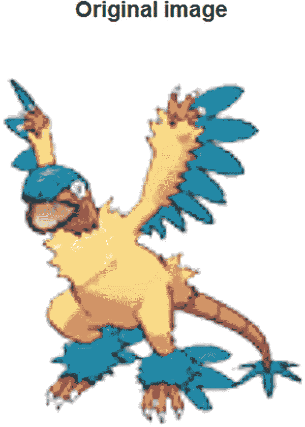

一幅彩色鹦鹉的插图被标记为原始图像。

图 4-9

原始图像

```py
# Draw a chart with 2 rows and 4 columns
>par (mfrow=c(2,2))
>img_width = image_info(imagen)$width
>img_height = image_info(imagen)$height
>imagen_crop = transform_crop(imagen,0,0, img_height/3, img_width/3)
>plot(imagen_crop)
>title(main = "Croped image")
>imagen_crop_center = transform_center_crop(imagen, c(img_height/2, img_width/2))
>plot(imagen_crop_center)
>title(main = "Croped center image")
>imagen_resize = transform_resize(imagen, c(img_height/5, img_width/5))
>plot(imagen_resize )
>title(main="Resized image")
>imagen_flip = transform_hflip(imagen)
>plot(imagen_flip)
>title(main="Flipped image")
```

输出如图 4-10 所示。

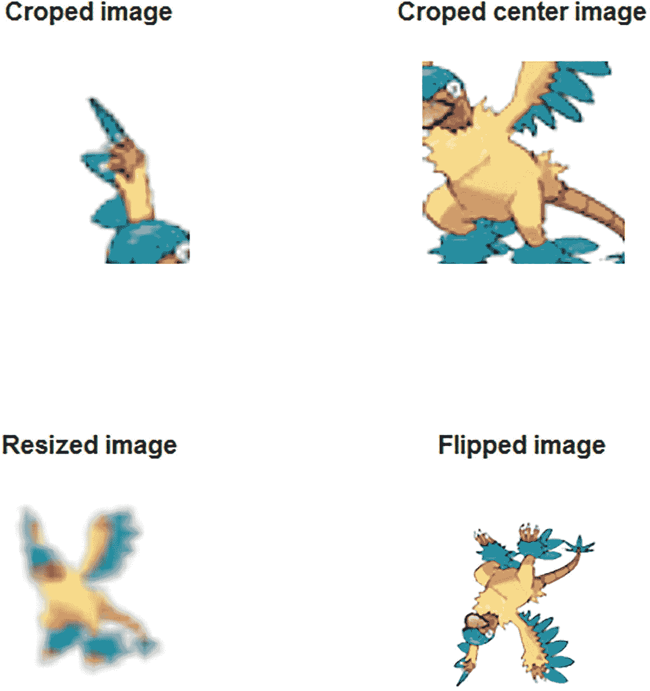

四张彩色鹦鹉的图像被标记为裁剪图像、裁剪中心图像、调整大小图像和翻转图像。在裁剪图像中只有一只翅膀可见，在调整大小图像中图像模糊。

图 4-10

裁剪后、裁剪中心、调整大小和翻转的图像

## R 中通过“mice”包进行多元插补

合成数据插补方法是一种通过创建基于已知值的新的人工数据点来插补缺失数据的技术。这可以通过多种方法完成，例如创建回归模型来预测缺失值或使用聚类算法生成与现有数据点相似的新数据点。

合成数据插补的优点在于它可以以不受现有数据偏倚的方式填充缺失数据。这是因为新数据点是从头开始生成的，而不是基于已知数据进行估计。

合成数据插补的缺点在于生成新的数据点可能耗时，并且总有可能人工数据不能准确反映真实数据。一般来说，合成数据插补是处理缺失数据的有用技术，但应谨慎使用。

Rubin（2004）提出的合成数据基础是基于缺失数据的多次插补。在统计预测建模中，缺失值会影响预测结果的可靠性。因此，一些常用方法被用来解决缺失值问题。一些机器学习算法声称可以本质上处理缺失数据。但这些算法有多好并不为人所知。

在不改变数据集中的缺失值的情况下，可以通过从非贝叶斯预测分布或后验预测分布中进行多次抽取来修改观察到的精度值。尽管没有使用真实数据集，但产生的多个合成数据集可以提供准确的统计推断。为了从综合结果中得出可靠的结论，必须将使用多个合成数据的分析合并成一个单一的推断。因此，插补过程引起的额外变异性需要得到反映。

用于分配缺失值的方法对预测模型的成功有很大影响。在大多数统计分析中，使用基于列表的删除方法来插补缺失值。然而，这种方法使用不多，因为它会导致信息丢失。另一方面，R 软件有包可以成功插补缺失值。“mice”、“Amelia”、“missForest”、“Hmisc”和“mi”包用于在 R 中插补缺失值 [4]。有几种插补缺失值的方法，每种方法都有其优缺点。最重要的是选择最适合数据集和分析类型的方法。

Mice 是一个用于插补缺失值的包。此包假设缺失数据是随机缺失的。一个值缺失的概率仅取决于观察到的


# 联合建模方法

在联合建模方法中，联合分布是间接指定的；通过分别指定每个变量 `x` 的分布。这种方法使用不同的合成模型来同时为 `x` 中的所有变量抽取合成数据。在顺序建模中，每个变量被分解成一组单变量模型。这里的每个模型集都是基于之前放置的变量进行条件化。例如，考虑数组 `x[j]` = (x[1], …, x[j-1])。如果这个数组指定了 `x[j]` 之前出现的变量，那么第 `m` 个合成数据集的计算如下 [5]。


在完全条件指定方法中，每个模型都是独立的，可以应用于数据集中的任何其他变量。这是通过条件化其他变量来实现的。例如，让 `x[j]` = (x[1], …, x[j-1], x[j+1], …, x[p])，具体参考 `x` 中除了 `x[j]` 之外的其他变量。在这种情况下，每个 `x[j]` 值的第 `m` 个合成数据集是使用以下公式抽取的 [5]。


在上述公式中，它可以取 `j` = 1, 2, …, `p` 的值。联合建模、顺序建模和完全条件指定 [6] 方法在确定联合分布 `P(x, z)` 时提供的灵活性有时可能不同。如果所有变量都具有正态分布和线性关系，那么三种方法表示的预测分布也是等效的。

现在我们使用“mice”包做一个示例应用。

```py
# Load the "mice", "lattice", "dplyr", and "VIM" packages.
> library(mice)
> library(lattice)
> library(dplyr)
> library(VIM)
> set.seed(271)
# Choose the sample size of 200.
>n data head(data)
sex      age      bmi      sbp      dbp    insulin smoke
1   F 13.74044 17.99169 41.50539 47.65656 0.04249654     1
2   M 17.56544 19.17274 40.23685 50.19870 1.77210095     2
3   F 15.48855 19.39617 42.67962 53.53512 2.29891097     1
4   M 18.90000 19.17086 42.46920 52.19573 4.21447491     2
5   F 17.97135 22.85069 44.79011 53.86757 7.50545309     1
6   M 17.06892 22.68086 44.57467 54.38725 7.60687887     2
# Manually add some missing values
> missing.data %mutate(age = "is.na75"), bmi = "is.na44 | bmi 45 | sbp 180 | dbp")
head(missing.data)
sex age      bmi      sbp dbp    insulin smoke
1   F  NA       NA 41.50539  NA 0.04249654     1
2   M  NA 19.17274 40.23685  NA 1.77210095     2
3   F  NA 19.39617 42.67962  NA 2.29891097     1
4   M  NA 19.17086 42.46920  NA 4.21447491     2
5   F  NA 22.85069 44.79011  NA 7.50545309     1
6   M  NA 22.68086 44.57467  NA 7.60687887     2
# Find the order of missing values in the dataset.
> md.pattern(missing.data)
sex insulin smoke age bmi dbp sbp
200   1       1     1   1   1   1   0   1
10    1       1     1   1   1   0   1   1
32    1       1     1   1   1   0   0   2
44    1       1     1   1   0   1   0   2
16    1       1     1   1   0   0   0   3
22    1       1     1   0   1   1   0   2
14    1       1     1   0   1   0   1   2
24    1       1     1   0   1   0   0   3
32    1       1     1   0   0   1   0   3
2     1       1     1   0   0   0   1   3
4     1       1     1   0   0   0   0   4
0       0     0  98  98 102 374 672
```

输出结果如图 4-11 所示。

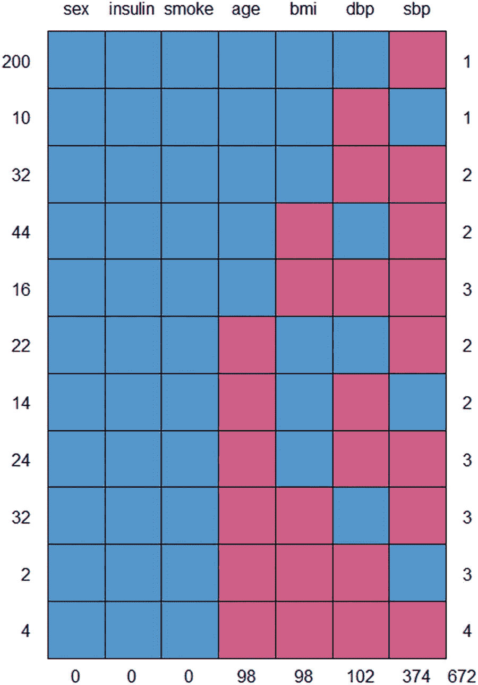

性别、吸烟、胰岛素、年龄、BMI、DBP 和 SBP 数据集的棋盘格表。数据集中的某些方框颜色不同，表示缺失值。

图 4-11

缺失数据模式

蓝色表示观测值，红色表示缺失值。分析数据集中有 672 个缺失值。在缺失值中，374 个“sbp”，102 个“dbp”，98 个“bmi”和“age”属于变量。缺失数据模型很重要，因为它显示了数据集中有多少缺失值以及它们的分布情况。

```py
# How many patterns are there where the "bmi" variable is missing.
>mpattern  sum(mpattern[, "bmi"] == 0)
[1] 5
There are 5 patterns and 98 cases for the "bmi" variable.
```

绘制聚集图。输出结果如图 4-12 所示。

```py
> aggr_plot <- aggr(missing.data, col=c('red','yellow'), numbers=TRUE, sortVars=TRUE, labels=names(data), cex.axis=.7, gap=3, ylab=c("Histogram of missing data","Pattern"))
Variables sorted by number of missings:
Variable Count
sbp 0.935
dbp 0.255
age 0.245
bmi 0.245
sex 0.000
insulin 0.000
smoke 0.000
```

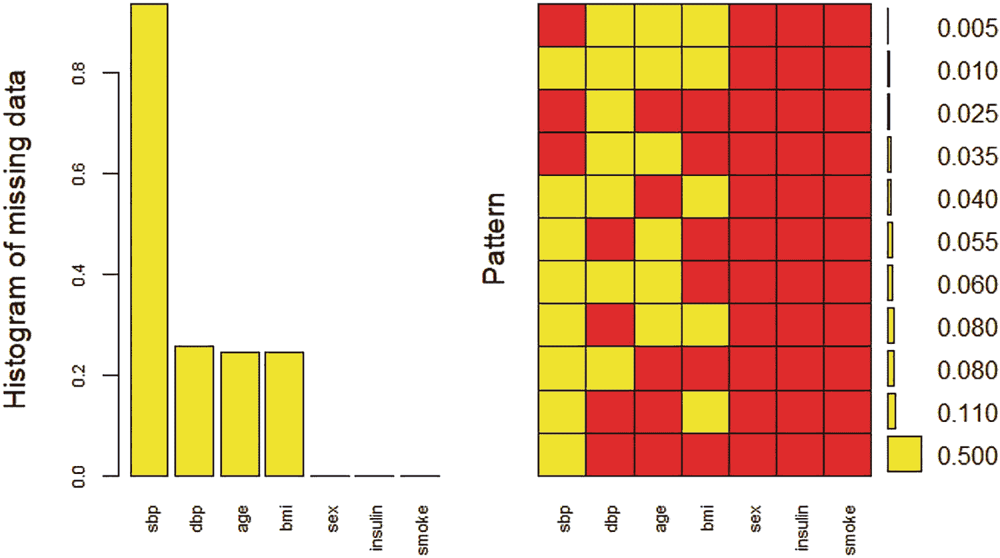

缺失数据的直方图和性别、吸烟、胰岛素、年龄、BMI、DBP 和 SBP 数据集的棋盘格表。数据集中的某些方框颜色不同，表示缺失值。

图 4-12

缺失数据的直方图和模式

绘制箱线图。输出结果如图 4-13 所示。

```py
> marginplot(missing.data[c(6,3)])
```

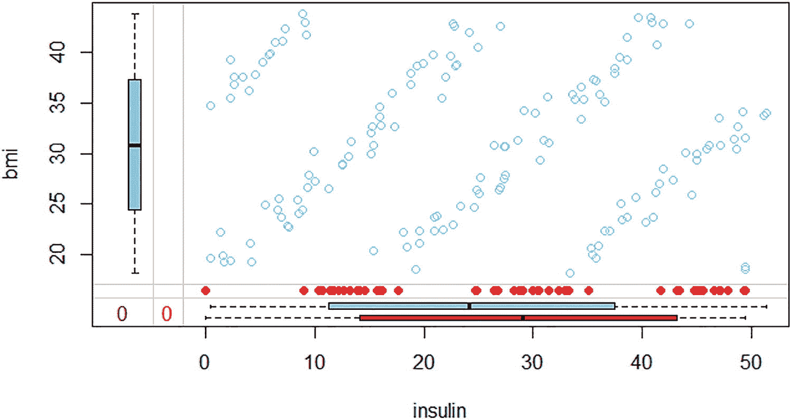

BMI 与胰岛素的散点图。数值分布在四个区域，形成一个斜角区域。

图 4-13

“bmi”和“insulin”变量的特殊箱线图

```py
# Impute missing values using the mice package
> imputation  head(complete(imputation))
sex      age      bmi      sbp      dbp    insulin smoke
1   F 50.27733 30.91625 41.50539 113.6025 0.04249654     1
2   M 50.27733 19.17274 40.23685 113.6025 1.77210095     2
3   F 50.27733 19.39617 42.67962 53.53512 2.29891097     1
4   M 50.27733 19.17086 42.46920 52.19573 4.21447491     2
5   F 50.27733 22.85069 44.79011 53.86757 7.50545309     1
6   M 50.27733 22.68086 44.57467 54.38725 7.60687887     2
# Pooling the results and fitting a linear model
>ModelFit  pool(ModelFit)
Class: mipo    m = 4
term m    estimate         ubar b            t
1 (Intercept) 4 26.77349366 7.008515e+03 0 7.008515e+03
2         bmi 4  0.07859746 1.301218e-02 0 1.301218e-02
3         age 4 -0.11191024 3.290485e-03 0 3.290485e-03
4         sbp 4  0.04649987 3.812104e+00 0 3.812104e+00
dfcom       df riv lambda         fmi
1   396 393.9751   0      0 0.005038099
2   396 393.9751   0      0 0.005038099
3   396 393.9751   0      0 0.005038099
4   396 393.9751   0      0 0.005038099
>summary(pool(ModelFit))
term    estimate   std.error   statistic       df    p.value
1 (Intercept) 26.77349366 83.71687609  0.31980999 393.9751 0.74928190
2         bmi  0.07859746  0.11407094  0.68902267 393.9751 0.49121457
3         age -0.11191024  0.05736275 -1.95092198 393.9751 0.05177486
4         sbp  0.04649987  1.95246109  0.02381603 393.9751 0.98101141
> densityplot(missing.data$bmi)
```

输出结果如图 4-14 所示。

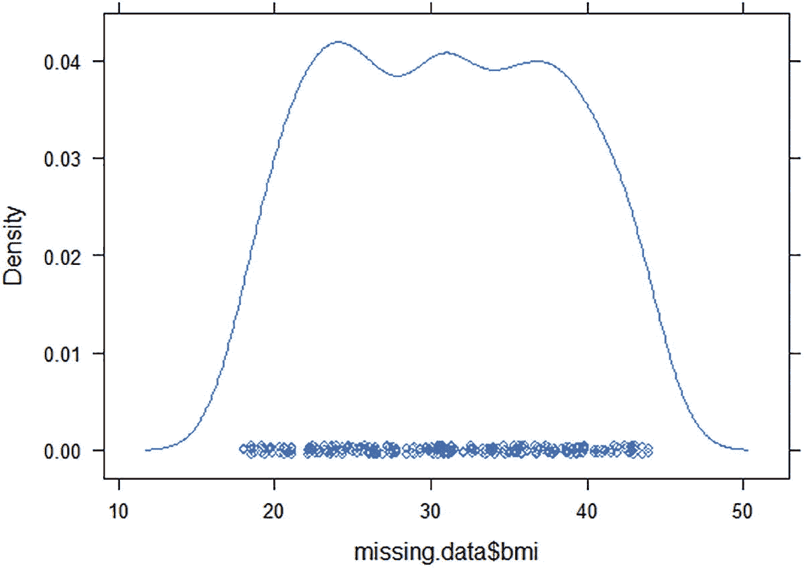

缺失数据 bmi 的密度分布线图。图形首先上升，形成三个上升和两个下降，然后迅速下降。

图 4-14

“bmi”变量的密度分布

“mice”包包含马尔可夫链蒙特卡洛算法。图像使用此算法创建。

绘制插值密度图。输出结果如图 4-15 所示。

```py
>densityplot(imputation)
```

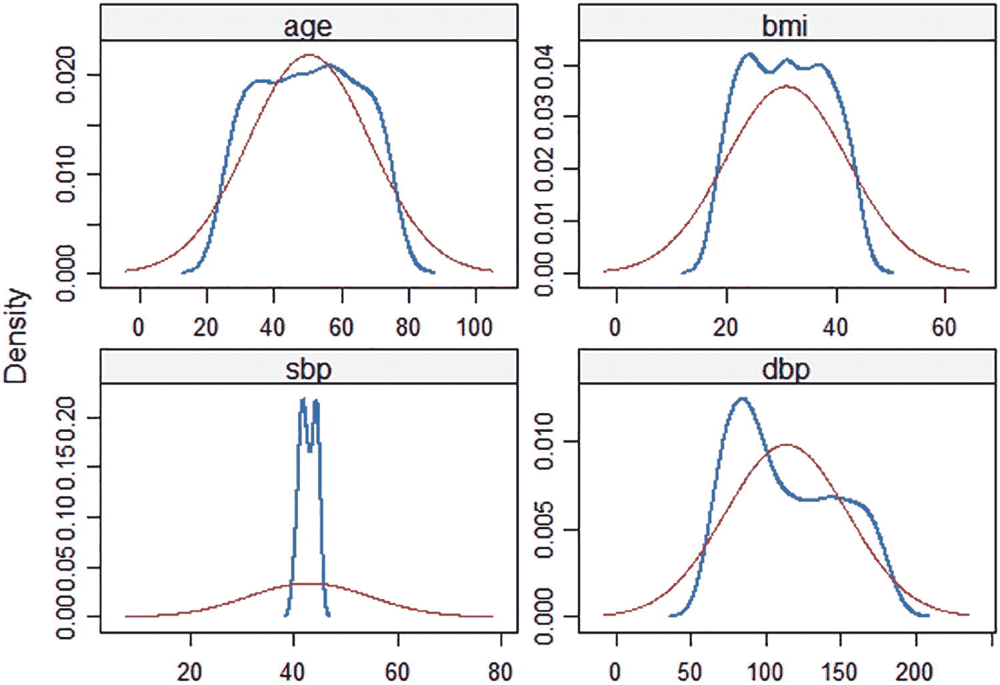

年龄、BMI、SBP 和 DBP 的密度分布的四张图。年龄、SBP 和 DBP 形成两个峰值，但 BMI 形成一个峰值。

图 4-15

变量的密度图

```py
# The Markov Chain Monte Carlo algorithm uses the random sampling method, which means that the results may be slightly different if the assignments are repeated using different seeds. The seed argument is used to achieve the same result.
>imp <- mice(missing.data, seed = 271, print = FALSE)
```

原始和插值数据集的密度图。输出结果如图 4-16 所示。

```py
>densityplot(imp)
```

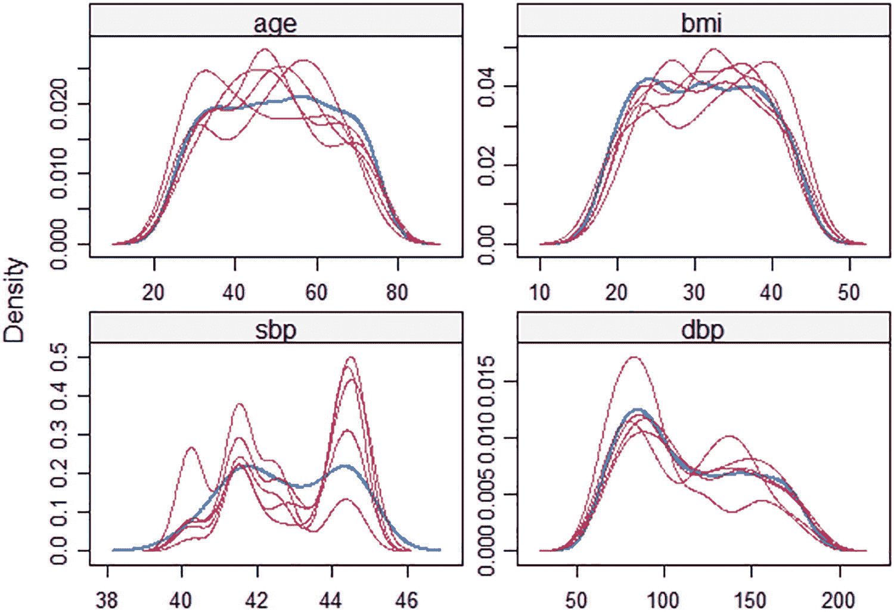

年龄、BMI、SBP 和 DBP 的密度分布图。年龄、SBP 和 DBP 形成两个峰值，但 BMI 形成一个峰值。原始数据也有一个插补数据集线。

图 4-16

原始和插补数据集的密度图

图中插补数据的密度以洋红色显示。观测数据的强度以蓝色显示。当检查图时，可以看到观测数据和插补数据的分布相当相似。

根据其他变量找到胰岛素变量的分布。输出显示在图 4-17 中。

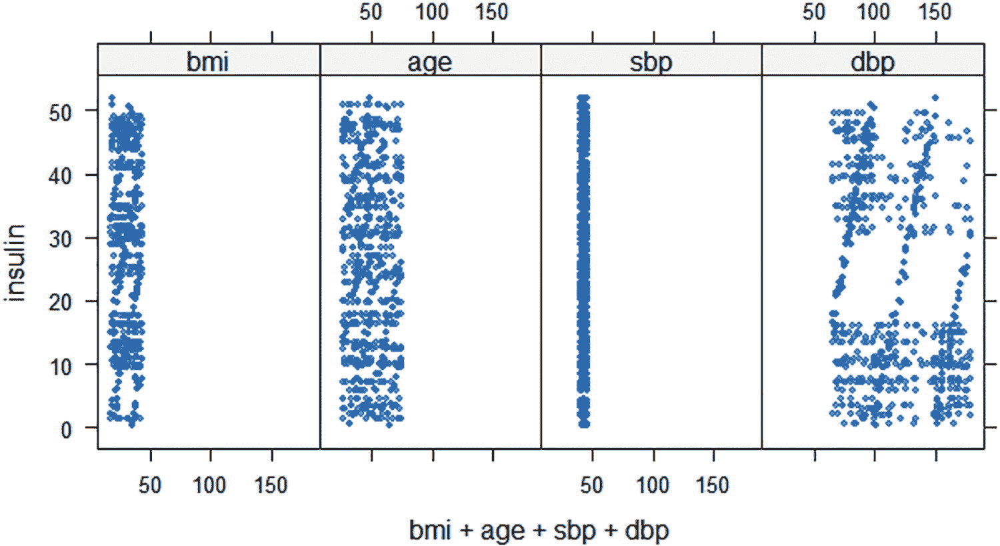

四张关于胰岛素的散点图，分别对应年龄、体重指数（BMI）、收缩压（SBP）和舒张压（DBP）。年龄、SBP 和 DBP 的图形位于下方，而 DBP 的分布在整个区域内。

图 4-17

根据“bmi”、“年龄”、“sbp”和“dbp”变量绘制“胰岛素”变量的散点图

```py
> stripplot(imp, insulin ~ bmi+age+sbp+dbp, pch = 3, cex = 0.5)
```

```py
# Filter the dataset.
> Orig.Df % dplyr::select(age, bmi, sbp, dbp)
>imp1 <- mice(Orig.Df, seed = 271, print = FALSE)
```

绘制观测和插补数据的散点图。输出显示在图 4-18 中。


[1] "cust0001" "cust0002" "cust0003" "cust0004" "cust0005" "cust0006"

# Build people names generate 6 person names with a minimum of 4 characters and a maximum of 9 characters.
> peopleNames peopleNames
[1] "rayle"     "alien"     "jert"      "manande"   "sharistel" "tarristal"

# Build customer names
> CustomersNames head(CustomersNames)
buildNames(numOfNames = 1000, minLength = 8, maxLength = 10)
1                                                   delarleema
2                                                     dalennie
3                                                    colaudiam
4                                                   kinannatre
5                                                    jonicelle
6                                                     jeneliam

# Assign customer name to customer ID
> Customer2Name head(Customer2Name)
Customers buildNames(numOfNames = 1000, minLength = 8, maxLength = 10)
1  cust0001                                                   delarleema
2  cust0002                                                     dalennie
3  cust0003                                                    colaudiam
4  cust0004                                                   kinannatre
5  cust0005                                                    jonicelle
6  cust0006                                                     jeneliam

# Build customer age
> CustomerAge colnames(CustomerAge) head(CustomerAge)
round(buildNum(n = 30, st = 20, en = 70, disp = 0.5, outliers = 1))
1                                                                  20
2                                                                  25
3                                                                  30
4                                                                  35
5                                                                  40
6                                                                  44

# Assign customer age to customer ID
# Create 30 customers.
> customers Customer2Age head(Customer2Age)
customers round(buildNum(n = 30, st = 20, en = 70, disp = 0.5, outliers = 1))
1    cust01                                                          20
2    cust02                                                          25
3    cust03                                                          30
4    cust04                                                          35
5    cust05                                                          40
6    cust06                                                          44

# Build customer phone number
> part prob CustomerPhoneNumbers head(CustomerPhoneNumbers)
buildPattern(n = 1000, parts = parts, probs = probs)
1                                         +45(216)8983
2                                         +90(216)8797
3                                         +45(216)9237
4                                         +45(216)8861
5                                         +45(321)9012
6                                         +90(216)9124

> colnames(CustomerPhoneNumbers) head(CustomerPhoneNumbers)
CustomerPhone
1  +45(216)8983
2  +90(216)8797
3  +45(216)9237
4  +45(216)8861
5  +45(321)9012
6  +90(216)9124
```

### 创建一个产品

在产品创建过程中，每个产品都会分配一个产品 ID。产品 ID 也与客户 ID 相似。每个产品的产品 ID 必须在 sku001 和 sku100 之间，并且每个产品的价格范围必须与产品 ID 一起指定。这是为产品创建唯一 ID 的一种方式。由产品的“sku”编号（或任何其他唯一标识符）和该产品的价格范围组成的 ID。这样，ID 的长度始终相同。例如，让我们使用“buildProb”函数找到 20 个介于 $30-80 之间的产品。这里要创建的产品 ID 数量显示为 “numOfProud”，最低价格显示为 “minPrice”，最高价格显示为 “maxPrice”。

```python
# Find 20 items priced between $30 and $80.
> products products
SKU Price
1  sku01 73.55
2  sku02 59.68
3  sku03 75.22
4  sku04 52.59
5  sku05 32.61
6  sku06 37.14
7  sku07 48.49
8  sku08 57.15
9  sku09 33.25
10 sku10 30.55
11 sku11 47.97
12 sku12 75.24
13 sku13 39.02
14 sku14 63.18
15 sku15 42.14
16 sku16 70.78
17 sku17 65.41
18 sku18 70.11
19 sku19 47.39
20 sku20 47.66
```

### 创建交易

在创建一组客户 ID 和产品之后创建交易。交易是通过 “genTrans” 函数创建的。

```python
# Create a transaction
> Trans Aggregated plot(Aggregated, type = "l", ann = FALSE)
```

输出如图 4-20 所示。

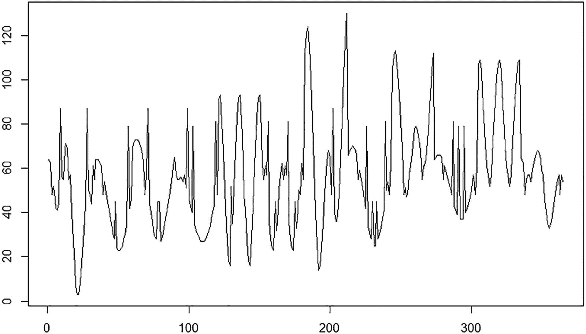

交易图。该图波动很大，最大值超过 120。

图 4-20

交易图

### 生成合成数据

在合成数据的最终阶段，客户、产品和交易被整合在一起。交易是通过 “buildPareto” 函数创建的。这个函数在其结构中包含 “factor1”、“factor2” 和 “Pareto” 参数。“factor1” 和 “factor2” 是相互匹配的变量。而 “Pareto” 变量基于帕累托原理。因此， *x* 和 *y* 值的总和数值上是 100，并以 *c*(x,y) 的形式表达。如果 Pareto 是 *c*(80,20)，则 80% 的 “factor1” 分配给 20% 的 “factor2”。

```python
# Transactions are allocated to customers using the code below.
> Customer2Transaction names(Customer2Transaction) print(head(Customer2Transaction))
transactionID Customer
1    txn-222-23 cust0753
2     txn-13-08 cust0523
3     txn-32-04 cust0900
4    txn-271-36 cust0196
5    txn-208-09 cust0993
6    txn-120-04 cust0909

# Now let's do similar operations to assign operations to products.
> Product2Transaction names(Product2Transaction) head(Product2Transaction)
transactionID   SKU
1    txn-114-26 sku20
2     txn-72-24 sku20
3    txn-184-26 sku20
4    txn-184-39 sku03
5    txn-116-05 sku03
6     txn-44-47 sku20

# Let's assign transactions to products using a similar step to the above operations.
> Df1 Now let's create the dataset about transactions, customers and products.
> DfFinal head(DfFinal)
transactionID Customer   SKU dayNum mthNum
1      txn-1-01   cust20 sku20      1      1
2      txn-1-02   cust20 sku03      1      1
3      txn-1-03   cust15 sku20      1      1
4      txn-1-04   cust01 sku20      1      1
5      txn-1-05   cust03 sku20      1      1
6      txn-1-06   cust20 sku20      1      1
```

通过记录 365 天内的业务交易，从而获得交易、客户和产品数据集。该数据集包含有关进行交易的客户、购买的产品以及交易发生的日期的信息。“transactionID” 是交易的另一个标识符。“SKU” 表示交易中购买的产品。“dayNum” 表示一年中的天数。“mthNum” 表示当前是哪个月。如果 “mthNum” 是 1，则代表一月，如果是 12，则代表十二月。

## 使用 R 中的 “Synthpop” 包生成合成数据

数据合成技术，如 synthpop 和 GANS，通常使用纯条件合成。这些技术使用模型中每个变量的所有可用信息来找到变量之间的所有有意义的关系。这些开发出的模型与旧方法大不相同，旧方法使用的是手工选择的变量小集。如果两个不同的数据子集在直接变量之间的分布模式非常不同，那么某些模型可能难以准确预测这两个数据集。在这种情况下，可以使用 NIST 的 k-marginal 度量来确定数据中的位置。

“synthpop” 包是一个用于合成真实人口数据的工具。它可以用来生成代表真实人口的合成数据集，或者生成具有真实人口中不存在特定特征的数据集。该包可以用来生成具有广泛特征的数据集，包括：

+   人口统计特征（年龄、性别、种族等）

+   社会经济特征（收入、教育、职业等）

+   行为特征（消费者行为、与健康相关的行为等）

+   空间特征（位置、移动模式等）

该包可以用来生成任何大小的数据集，从几百到几百万个个体。可以为任何地理区域生成数据集，从单个城市到整个国家。

“synthpop” 包是研究人员和分析人员需要真实合成数据集的有价值工具。它可以生成用于模拟或测试数据驱动模型和算法的数据集。该包还可以用于生成用于营销或社会科学研究的数据集。

现在让我们使用 “synthpop” 包做一个示例应用。

```python
# Load the "synthpop","tidyverse","sampling" and "partykit" packages.
> library(synthpop)
> library(tidyverse)
> library(sampling)
> library(partykit)
> cols options(xtable.floating = FALSE)
> options(xtable.timestamp = "")
> my.seed <- 235
```

在许多不同领域的数据集中，例如数据科学和机器学习，都存在缺失值。因此，通常很难有效地处理这些数据，并且往往没有最佳解决方案。另一方面，缺失数据对于模型和目标问题也是重要的。处理缺失数据没有完美的方法。在这里，将解释如何处理具有缺失值的数据集。

合成合成数据的目的是生成与原始数据集最相似的数据集。这里使用了两种方法来处理缺失数据：分析前的缺失值处理和使用填充方法。在这里，通常更喜欢填充方法，因为它给出了更好的结果。因为从分析中预先生成缺失值可能会影响缺失值的处理方式。

```python
# Select the number of samples to be used in the analysis.
>n data head(data)
sex      age      educ      bmi     chol      sbp
1 female 18.06006    doctor 19.89060 60.02898 39.10903
2   male 18.45238  bachelor 19.71671 60.03026 41.25491
3 female 21.17174    master 20.02189 62.33284 42.64906
4   male 24.37687   primary 22.96372 63.91154 42.46654
5 female 21.18826 secondary 24.04257 64.85323 44.13783
6   male 24.27277    doctor 26.65987 64.09472 41.55372
dbp   weight smoke martial   income
1 39.55985 45.91745   yes  singel 499.0535
2 40.51360 46.12215    no married 498.5034
3 42.10348 46.04940   yes  singel 503.3760
4 42.71555 47.86138    no married 502.4676
5 44.16469 49.34013   yes  singel 502.7911
6 45.65828 49.56517    no married 504.0946

# Use the "missForest" package to fill missing values.
> library(missForest)
```

模拟一个带有缺失值的随机数据框
```


```python
# Generate 5% missing values at random
> Data.mis head(Data.mis)
sex      age      educ      bmi     chol      sbp
1 female 18.06006    doctor 19.89060       NA 39.10903
2   male 18.45238  bachelor 19.71671 60.03026 41.25491
3 female 21.17174    master 20.02189 62.33284 42.64906
4   male 24.37687   primary 22.96372 63.91154 42.46654
5    21.18826 secondary 24.04257 64.85323 44.13783
6   male 24.27277    doctor 26.65987 64.09472 41.55372
dbp   weight smoke martial   income
1 39.55985 45.91745   yes  singel 499.0535
2 40.51360 46.12215    no married 498.5034
3 42.10348       NA   yes  singel 503.3760
4 42.71555 47.86138   married 502.4676
5 44.16469 49.34013   yes  singel 502.7911
6 45.65828       NA    no married 504.0946
# Synthesize data.
>Synthesis Synthesis
Call:
($call) syn(data = Data.mis, seed = my.seed)
Number of synthesised datasets:
($m)  1
First rows of synthesised dataset:
($syn)
sex      age     educ      bmi      chol       sbp       dbp
1   male 24.30063 bachelor 26.57773 222.36616  59.29010  62.15641
2   male 58.28933  primary 25.90100 102.19059  80.33966  80.84342
3 female 46.36684 bachelor       NA 194.18152 172.98788 167.30525
4   male 28.54694  primary 27.73193 229.53406  72.78681  69.58943
5 female 20.30850   doctor 18.70856  60.18121  48.16518  52.01056
6   male       NA      26.03880 220.49634  56.63966  55.12595
weight smoke martial   income
1  57.01487   yes  singel 660.7345
2  85.11660    singel 543.7991
3 108.41621    no married 631.4005
4  66.29327   yes     671.2441
5  57.52313    no married 502.5906
6        NA   yes  singel       NA
...
Synthesising methods:
($method)
sex      age     educ      bmi      chol       sbp       dbp
"sample"   "cart"   "cart"   "cart"   "cart"   "cart"   "cart"
weight    smoke  martial   income
"cart"   "cart"   "cart"   "cart"
Order of synthesis:
($visit.sequence)
sex     age    educ     bmi    chol     sbp     dbp  weight
1       2       3       4       5       6       7       8
smoke martial  income
9      10      11
Matrix of predictors:
($predictor.matrix)
sex age educ bmi chol sbp dbp weight smoke martial income
sex       0   0    0   0    0   0   0      0     0       0      0
age       1   0    0   0    0   0   0      0     0       0      0
educ      1   1    0   0    0   0   0      0     0       0      0
bmi       1   1    1   0    0   0   0      0     0       0      0
chol      1   1    1   1    0   0   0      0     0       0      0
sbp       1   1    1   1    1   0   0      0     0       0      0
dbp       1   1    1   1    1   1   0      0     0       0      0
weight    1   1    1   1    1   1   1      0     0       0      0
smoke     1   1    1   1    1   1   1      1     0       0      0
martial   1   1    1   1    1   1   1      1     1       0      0
income    1   1    1   1    1   1   1      1     1       1      0
# Compare the synthesized data using the "compare" function.
>compare(Synthesis, Data.mis, nrow = 3, ncol = 4, cols = cols)$plot
[1] TRUE
# Choose the variables.
> ods1  syn1 <- syn(ods1, cont.na = list(income=-6))
Synthesis
-----------
age bmi weight sbp income
```

使用直方图相似度方法比较数据分布。输出显示在图 4-21 中。

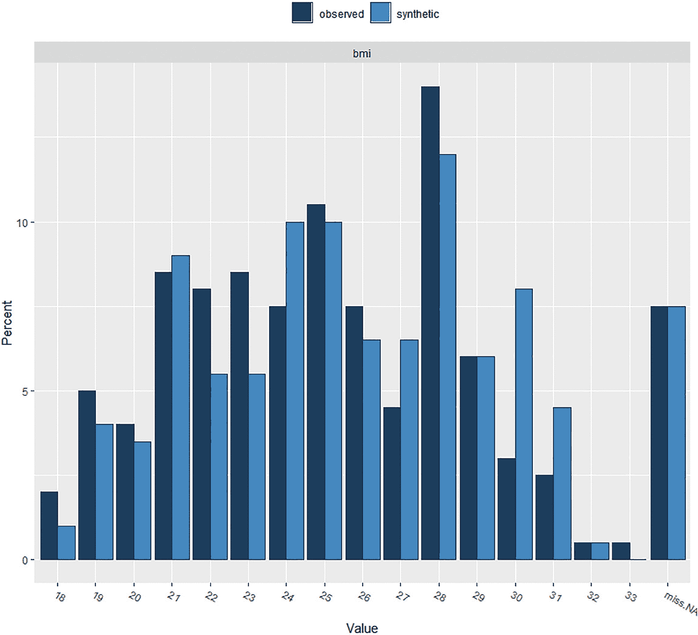

BMI 变量的观察值和合成数据的直方图。观察值和合成 BMI 的最大值是 28，最小值是 33。

图 4-21

BMI 变量的观察值和合成数据的直方图

```python
>compare(syn1$syn, ods1, vars = "bmi")
Comparing percentages observed with synthetic
Selected utility measures:
pMSE   S_pMSE df
bmi 0.001689 1.081081  5
```

考虑到上述直方图，每个列对应的观察值和合成数据分布大体上重叠。

```python
# Selecting variables.
> ods2 syn2 sds2  compare(sds2, ods2, vars = "weight", msel = 1:3)
Comparing percentages observed with synthetic
Selected utility measures:
pMSE   S_pMSE df
weight 0.00167 1.068513  5
```

根据图 4-22，与每个列对应的原始数据产生了 3 个不同合成数据分布的大重叠。

```python
# Compare the data distributions produced for the "income" variable with the Histogram Similarity method.
> compare(syn2$syn, ods2, vars = "income", cont.na = list(income = -6), stat = "counts", table = TRUE, breaks = 10)
```

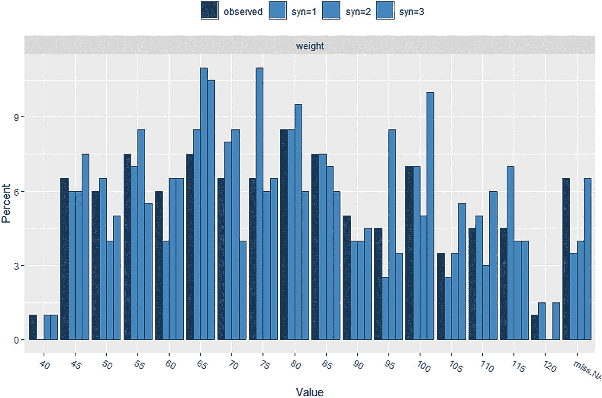

观测和三个合成数据集的重量直方图。观测重量在 80 值处达到最大。

图 4-22

重量变量的观测和合成数据的直方图

比较观测值与合成值。输出显示在图 4-23 中。

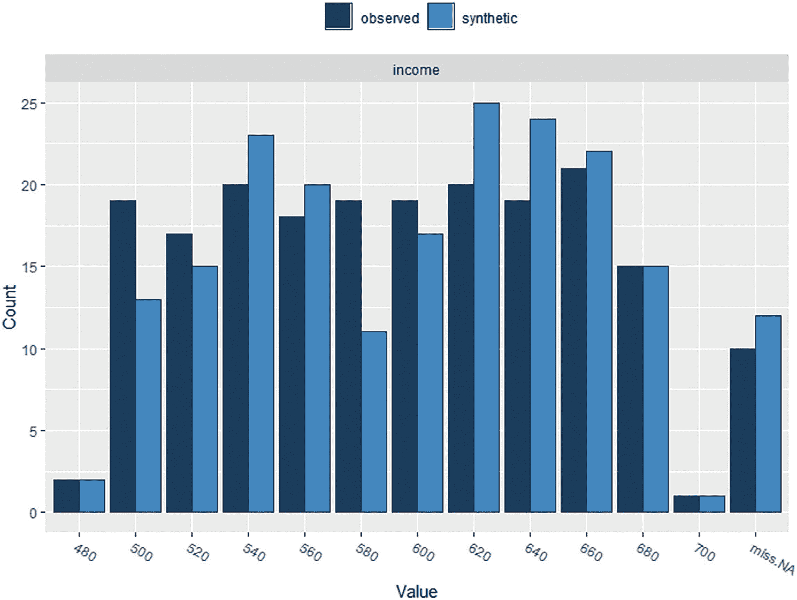

观测和合成数据的收入直方图。观测和合成的 BMI 在 620 处达到最大，在 700 处达到最小。

图 4-23

观测和合成数据中“收入”变量的频率分布

```python
$income
480 500 520 540 560 580 600 620 640 660 680 700 miss.NA
observed    2  19  17  20  18  19  19  20  19  21  15   1      10
synthetic   2  13  15  23  20  11  17  25  24  22  15   1      12
Selected utility measures:
pMSE   S_pMSE df
income 0.001549 0.991344  5
```

```python
# Selecting and synthesize the variables.
> vars3  ods3  syn3 <- syn(ods3)
Variable(s): sex, educ, smoke have been changed for synthesis from character to factor.
Variables sex, smoke are collinear. Variables later in 'visit.sequence'
are derived from sex.
Synthesis
-----------
sex age educ income smoke
```

使用未来重要性方法比较原始数据与合成数据。输出显示在图 4-24 中。

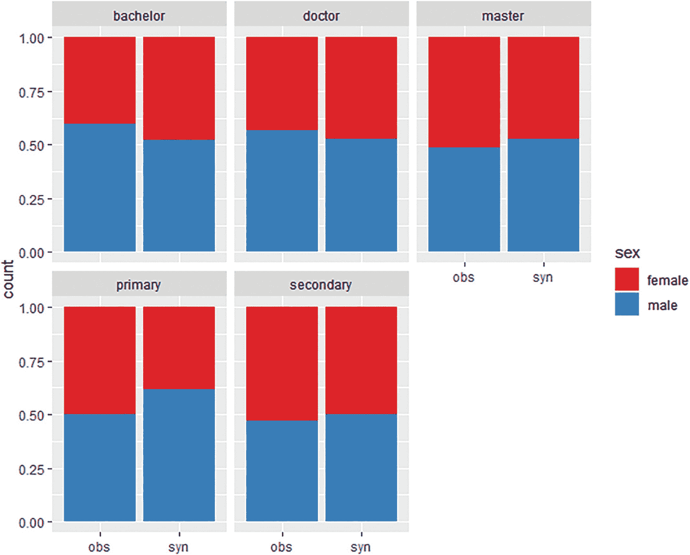

五个图比较原始和合成数据中性别、初等、中等、学士、博士和硕士学位的教育水平。

图 4-24

按性别比较教育水平

```python
> multi.compare(syn3, ods3, var = "sex", by = c("educ"))
Plots of sex  by  educ
Numbers in each plot (observed data):
educ
bachelor    doctor    master   primary secondary
30        30        33        30        34
```

```python
# Compare the original data with the synthetic data using the Future Importance method.
```

多重比较：输出显示在图 4-25 中。

```python
> multi.compare(syn3, ods3, var = "smoke", by = c("sex","educ"))
Plots of smoke  by  sex educ
Numbers in each plot (observed data):
educ
sex      bachelor doctor master primary secondary
female       12     13     17      15        18
male         18     17     16      15        16
```

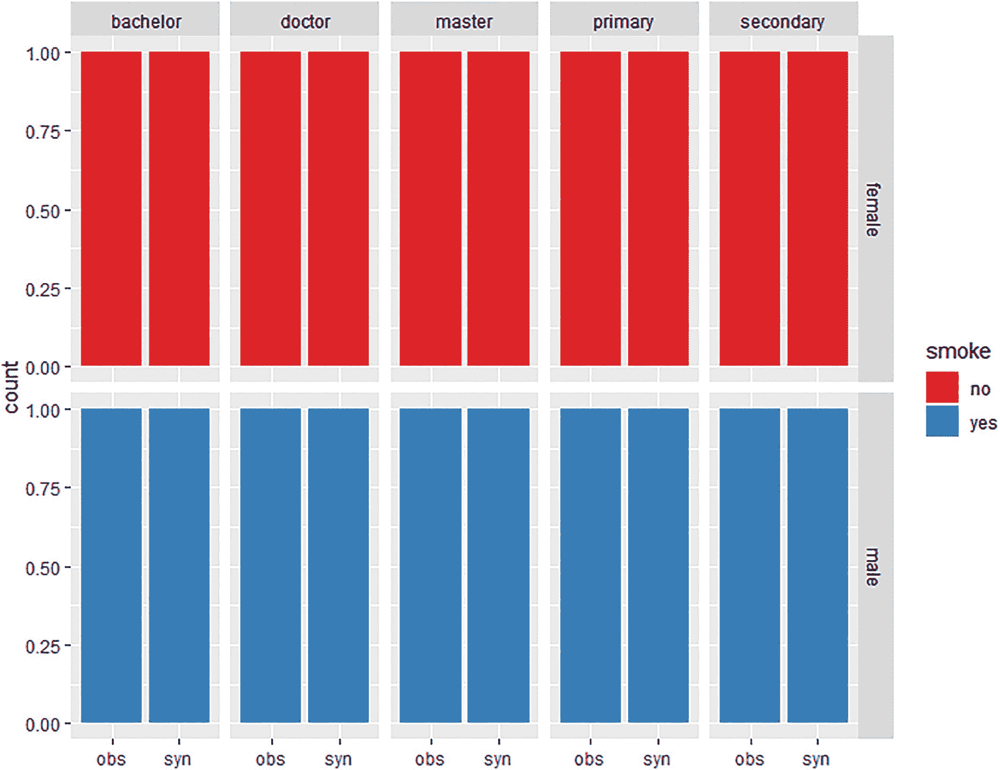

六个图比较原始和合成数据中性别和教育使用烟雾的初等、中等、学士、博士和硕士学位。

图 4-25

按性别和教育使用烟雾的比较

使用直方图相似性方法进行多重比较。输出显示在图 4-26 中。

```python
> multi.compare(syn3, ods3, var = "age", by = c("sex", "educ"), y.hist = "density", binwidth = 5)
Plots of age  by  sex educ
Numbers in each plot (observed data):
educ
sex      bachelor doctor master primary secondary
female       12     13     17      15        18
male         18     17     16      15        16
```

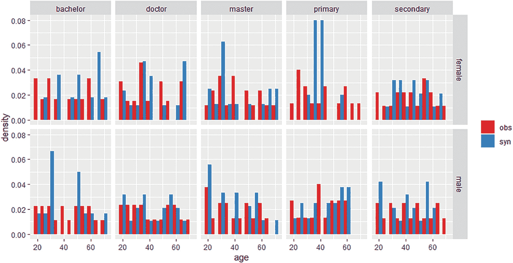

六个图比较原始和合成数据中性别、初等、中等、学士、博士和硕士学位的密度与年龄。

图 4-26

性别和教育变量合成和观测数据集的比较

使用箱线图进行多重比较。输出显示在图 4-27 中。

```python
>multi.compare(syn3, ods3, var = "age", by = c("sex", "educ"), cont.type = "boxplot")
Plots of age  by  sex educ
Numbers in each plot (observed data):
educ
sex      bachelor doctor master primary secondary
female       12     13     17      15        18
male         18     17     16      15        16
```

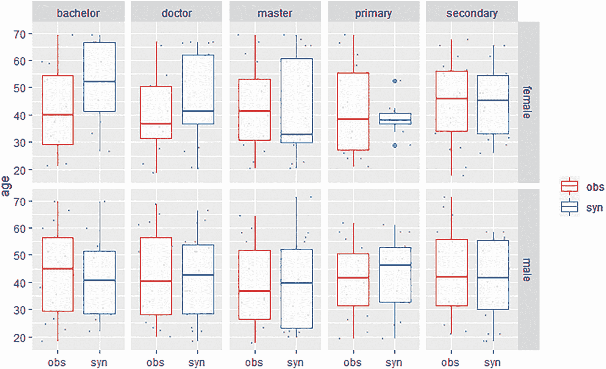

比较原始和合成数据中性别、初等、中等、学士、博士和硕士学位的年龄的六个箱线图。

图 4-27

使用箱线图进行多重比较

因此，分布相似，并获得了非常好的结果。

```python
>multi.compare(syn3, ods3, var = "income", by = c("smoke"), cont.type = "boxplot")
```

按烟雾绘制的收入图。输出显示在图 4-28 中。

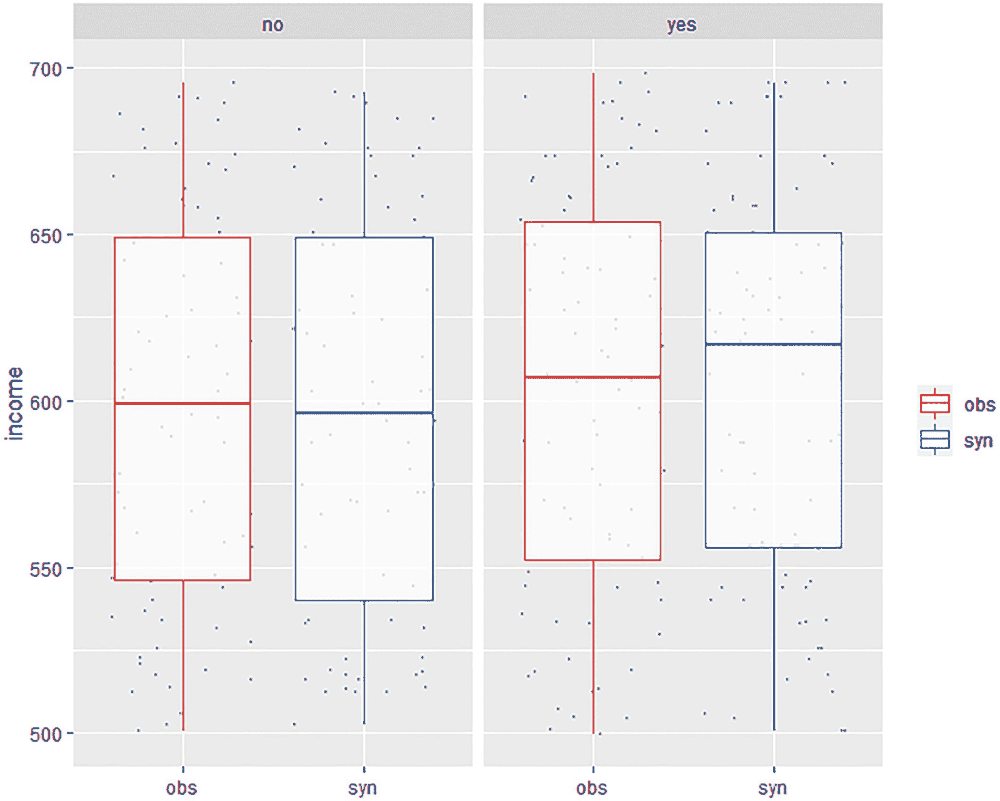

比较原始和合成数据的性别收入的两箱线图。

图 4-28

使用箱线图进行比较

```python
Numbers in each plot (observed data):
smoke
no yes
75  82
```

**Example: Linear Model**


```python
Compare model estimates based on synthesized and observed data
# Select variables
>ods4 ods4$income[ods4$income == -8] syn4 f1 f1
Call:
lm.synds(formula = income ~ age + bmi + sbp + dbp, data = syn4)
Average coefficient estimates from 3 syntheses:
(Intercept)          age          bmi          sbp          dbp
580.36549727   0.05420626  -0.15926752   0.30738785  -0.08043258
> print(f1, msel = 1:3)
Call:
lm.synds(formula = income ~ age + bmi + sbp + dbp, data = syn4)
Coefficient estimates for selected synthetic data set(s):
(Intercept)        age        bmi         sbp       dbp
syn=1    524.5111  0.6366150  1.2367056 -1.84179575 2.0765711
syn=2    510.2192  0.9555930  0.2355976 -0.96828566 1.3489566
syn=3    578.9077 -0.1032436 -0.3409441  0.02424215 0.2715823
> summary(f1)
Fit to synthetic data set with 3 syntheses. Inference to coefficients
and standard errors that would be obtained from the original data.
Call:
lm.synds(formula = income ~ age + bmi + sbp + dbp, data = syn4)
Combined estimates:
xpct(Beta) xpct(se.Beta) xpct(z) Pr(>|xpct(z)|)
(Intercept) 559.680987     39.987390 13.9964         compare(f1, ods4, lcol=cols)
Call used to fit models to the data:
lm.synds(formula = income ~ age + bmi + sbp + dbp, data = syn4)
Differences between results based on synthetic and observed data:
Synthetic    Observed       Diff Std. coef diff CI overlap
(Intercept) 559.68098675 555.8399827  3.8410041     0.09510782  0.9757374
age           0.09212785   0.3703575 -0.2782296    -0.88560583  0.7740760
bmi          -0.03365357   0.3783328 -0.4119863    -0.27807429  0.9290614
sbp          -0.17253127   2.1445340 -2.3170653    -0.64007112  0.8367136
dbp           0.52839349  -1.9439398  2.4723333     0.68386318  0.8255419
Measures for 3 syntheses and 5 coefficients
Mean confidence interval overlap:  0.868226
Mean absolute std. coef diff:  0.5165445
Mahalanobis distance ratio for lack-of-fit (target 1.0): 2
Lack-of-fit test: 10.0003; p-value 0.0752 for test that synthesis model is compatible
with a chi-squared test with 5 degrees of freedom.
```

Confidence interval plot: The output is shown in Figure 4-29.

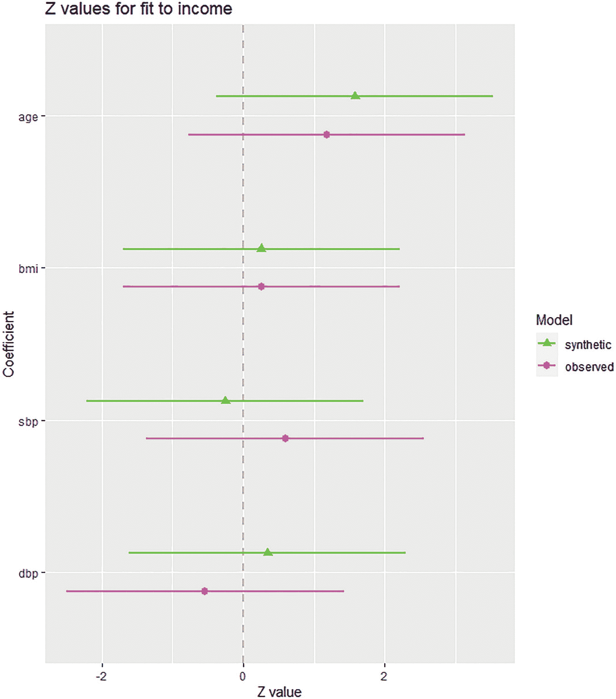

A plot of the z-values for age, BMI, sbp, and dbp fitting income in synthetic and observed values. In all cases, the synthetic values are higher than the observed values.

Figure 4-29

Estimated Z statistics and 95% confidence intervals from income regression

The analysis results suggest that the model should be refined. Sometimes there may be contradictory results in the observed data. This situation can be corrected by using different data synthesis methods.

The confidence interval plot in Figure 4-29 shows that the confidence intervals of the estimated coefficients using synthetic data are usually narrower than those using observed data. This may be due to the fact that the synthetic data are generated using the model fitted to the observed data, so the synthetic data are "more" like the data fitted by the model.

The Mahalanobis distance ratio for lack-of-fit is 2, indicating that the synthetic model is not well fitted to the observed data.

**Example:** **Multiple comparison models**

```python
# Select the variables to use in the model
>ods5 syn5 f2 summary(f2)
Fit to synthetic data set with 4 syntheses. Inference to coefficients
and standard errors that would be obtained from the original data.
Call:
multinom.synds(formula = educ ~ sex + age, data = syn5)
Combined estimates:
xpct(Beta) xpct(se.Beta) xpct(z) Pr(>|xpct(z)|)
doctor:(Intercept)     0.4551469     0.8637705  0.5269         0.5982
doctor:sexmale        -0.4650445     0.5351218 -0.8690         0.3848
doctor:age            -0.0039122     0.0188005 -0.2081         0.8352
master:(Intercept)     0.2536342     0.8431040  0.3008         0.7635
master:sexmale        -0.2116635     0.5131161 -0.4125         0.6800
master:age             0.0015296     0.0179901  0.0850         0.9322
primary:(Intercept)    0.0050908     0.8328898  0.0061         0.9951
primary:sexmale       -0.0447069     0.5032999 -0.0888         0.9292
primary:age            0.0073538     0.0175772  0.4184         0.6757
secondary:(Intercept) -0.0449791     0.8402186 -0.0535         0.9573
secondary:sexmale     -0.1789214     0.5080330 -0.3522         0.7247
secondary:age          0.0094189     0.0177082  0.5319         0.5948
>print(f2, msel = 1:3)
Note: To get more details of the fit see vignette on inference.
Call:
multinom.synds(formula = educ ~ sex + age, data = syn5)
Coefficient estimates for selected synthetic data set(s):
doctor:(Intercept) doctor:sexmale  doctor:age master:(Intercept)
syn=1          0.8784221     -0.4096250 -0.01832298          0.8062422
syn=2          0.9028755     -0.7222305 -0.01085432          0.6584914
syn=3         -0.3549103     -0.6354402  0.01608798         -1.3491940
master:sexmale   master:age primary:(Intercept) primary:sexmale
syn=1     -0.3531138 -0.005725565          0.35467122     -0.06550066
syn=2     -0.0276484 -0.010354886         -0.03452948      0.07195871
syn=3     -0.1513041  0.031673372         -0.20666485      0.08458827
primary:age secondary:(Intercept) secondary:sexmale secondary:age
syn=1 -0.002083643             0.3091911       0.008933527  0.0029018830
syn=2  0.010236153             0.6938888      -0.582058180 -0.0008996945
syn=3  0.008444159            -1.3145215      -0.293551212  0.0351327092
#Comparison of model predictions based on generated and observed data.
>compare(f2, ods5, lcol=cols)
# weights:  20 (12 variable)
initial  value 276.823321
iter  10 value 275.777763
final  value 275.769939
converged
Call used to fit models to the data:
multinom.synds(formula = educ ~ sex + age, data = syn5)
Differences between results based on synthetic and observed data:
Synthetic      Observed         Diff
doctor:(Intercept)     0.455146864 -1.420474e-01  0.597194311
doctor:sexmale        -0.465044513 -3.149206e-01 -0.150123952
doctor:age            -0.003912182  6.167936e-03 -0.010080118
master:(Intercept)     0.253634211  1.352540e-03  0.252281671
master:sexmale        -0.211663536  5.720359e-02 -0.268867122
master:age             0.001529574 -3.314822e-05  0.001562722
primary:(Intercept)    0.005090824 -2.955364e-01  0.300627258
primary:sexmale       -0.044706867 -1.769824e-01  0.132275538
primary:age            0.007353846  1.095656e-02 -0.003602717
secondary:(Intercept) -0.044979111  2.573445e-01 -0.302323600
secondary:sexmale     -0.178921424 -2.227352e-01  0.043813788
secondary:age          0.009418886 -8.268434e-04  0.010245730
Std. coef diff CI overlap
doctor:(Intercept)        0.75679589  0.8069363
doctor:sexmale           -0.30110724  0.9231855
doctor:age               -0.59778644  0.8475007
master:(Intercept)        0.32548186  0.9169674
master:sexmale           -0.54945873  0.8598294
master:age                0.09392280  0.9760397
primary:(Intercept)       0.38753996  0.9011359
primary:sexmale           0.27375950  0.9301621
primary:age              -0.22001958  0.9438715
secondary:(Intercept)    -0.40100137  0.8977019
secondary:sexmale         0.09131598  0.9767047
secondary:age             0.62787823  0.8398240
Measures for 4 syntheses and 12 coefficients
Mean confidence interval overlap:  0.9016549
Mean absolute std. coef diff:  0.3855056
Mahalanobis distance ratio for lack-of-fit (target 1.0): 1.14
Lack-of-fit test: 13.64079; p-value 0.3242 for test that synthesis model is compatible
with a chi-squared test with 12 degrees of freedom.
```

Confidence interval plot: You will see the chart in Figure 4-30.

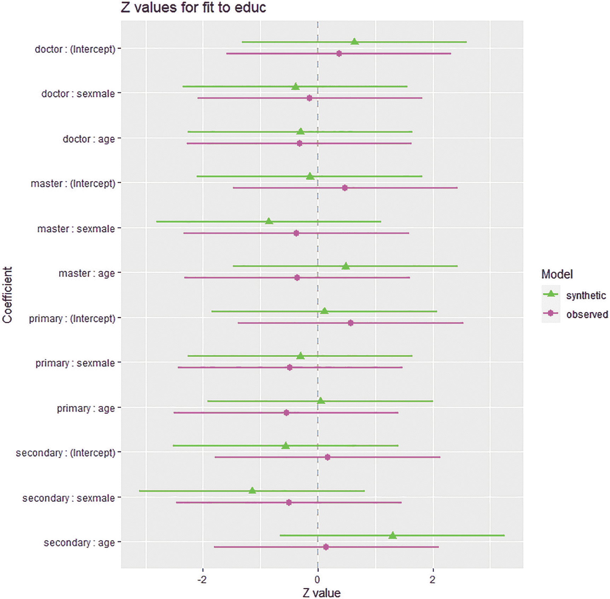

A chart showing the estimated z-values for fitting education levels, including primary, secondary, bachelor's, master's, and doctoral degrees, as well as the synthetic values and observed values. In all cases, the synthetic values are higher than the observed values.

Figure 4-30

Estimated Z statistics and 95% confidence intervals from educ regression

The Mahalanobis distance inequality test indicates that the agreement between synthetic data and observed data is tested through a chi-squared test. The above R analysis output shows that the mean of 4 syntheses and 12 coefficients is 0.9016549. This indicates that the synthetic model is consistent with the actual data.


```python
#Comparing synthetic and observed data
>compare(f2, ods5, print.coef = TRUE, plot = "coef", lcol=cols)
# weights:  20 (12 variable)
initial value 280.042197
iter  10 value 279.270244
final value 279.244345
converged
Call used to fit models to the data:
multinom.synds(formula = educ ~ sex + age, data = syn5)
Estimates for the observed dataset:
Beta   se(Beta)          Z
doctor : (Intercept)     0.287650834 0.78249484  0.3676073
doctor : sexmale        -0.066070707 0.48433999 -0.1364139
doctor : age            -0.005206560 0.01622890 -0.3208202
master : (Intercept)     0.373062189 0.77993658  0.4783237
master : sexmale        -0.180835533 0.48359055 -0.3739435
master : age            -0.005793053 0.01624404 -0.3566264
primary : (Intercept)    0.452962803 0.79288115  0.5712871
primary : sexmale       -0.238224469 0.49472054 -0.4815334
primary : age           -0.009166959 0.01667258 -0.5498224
secondary : (Intercept)  0.132380101 0.77409402  0.1710129
secondary : sexmale     -0.235881218 0.47392024 -0.4977234
secondary : age          0.002383676 0.01588194  0.1500872
Combined estimates for the synthesised dataset(s):
xpct(Beta) xpct(se.Beta)    xpct(z)
doctor:(Intercept)     0.167698852    0.78249484  0.2143130
doctor:sexmale         0.406756817    0.48433999  0.8398167
doctor:age            -0.008294055    0.01622890 -0.5110668
master:(Intercept)     0.925523568    0.77993658  1.1866652
master:sexmale        -0.103747550    0.48359055 -0.2145359
master:age            -0.018554636    0.01624404 -1.1422429
primary:(Intercept)    0.169180760    0.79288115  0.2133747
primary:sexmale        0.238603002    0.49472054  0.4822986
primary:age           -0.010755256    0.01667258 -0.6450864
secondary:(Intercept)  0.351341730    0.77409402  0.4538748
secondary:sexmale     -0.293401655    0.47392024 -0.6190950
secondary:age         -0.004788914    0.01588194 -0.3015322
Differences between results based on synthetic and observed data:
Synthetic     Observed         Diff Std. coef diff CI overlap
doctor:(Intercept)     0.167698852  0.287650834 -0.119951982     -0.1532943  0.9608936
doctor:sexmale         0.406756817 -0.066070707  0.472827523      0.9762306  0.7509570
doctor:age            -0.008294055 -0.005206560 -0.003087495     -0.1902467  0.9514668
master:(Intercept)     0.925523568  0.373062189  0.552461379      0.7083414  0.8192973
master:sexmale        -0.103747550 -0.180835533  0.077087983      0.1594075  0.9593341
master:age            -0.018554636 -0.005793053 -0.012761583     -0.7856165  0.7995840
primary:(Intercept)    0.169180760  0.452962803 -0.283782044     -0.3579125  0.9086941
primary:sexmale        0.238603002 -0.238224469  0.476827471      0.9638320  0.7541200
primary:age           -0.010755256 -0.009166959 -0.001588297     -0.0952640  0.9756975
secondary:(Intercept)  0.351341730  0.132380101  0.218961629      0.2828618  0.9278401
secondary:sexmale     -0.293401655 -0.235881218 -0.057520438     -0.1213716  0.9690373
secondary:age         -0.004788914  0.002383676 -0.007172590     -0.4516194  0.8847889
Measures for 4 syntheses and 12 coefficients
Mean confidence interval overlap:  0.8884759
Mean absolute std. coef diff:  0.4371665
Mahalanobis distance ratio for lack-of-fit (target 1.0): 1.31
Lack-of-fit test: 15.70039; p-value 0.2053 for test that synthesis model is compatible
with a chi-squared test with 12 degrees of freedom.
```

Confidence interval plot: You will see the chart shown in Figure 4-31.

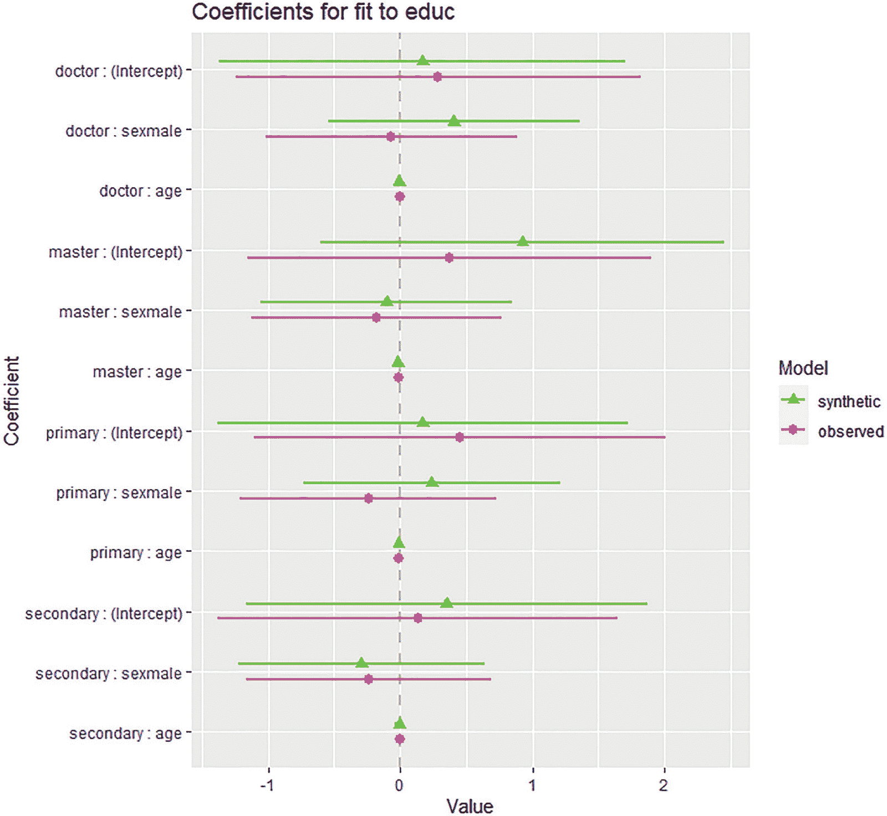

A chart showing the fitted coefficients for education level, including primary, secondary, bachelor, master, and doctoral degrees, with the synthesized values and observed values. In all cases, the synthesized values are higher than the observed values.

Figure 4-31

Confidence interval plot for the synthesized model of the educ variable

It can be seen that the nature of the beta, i.e., the variables given in the above output, is similar. According to the expression "mean confidence interval overlap: 0.8884759" at the end of the above output, no statistically significant differences were found in the confidence interval comparison. In addition, according to the expression "lack-of-fit test: 15.70039; p-value 0.2053 for the test that the synthesis model is compatible with a chi-squared test with 12 degrees of freedom" at the end of the above output, it can be said that the synthesis model is compatible with the actual data.

In other words, it can be said that there will be no statistically significant difference between the synthetic data and the actual data. Therefore, it can be said that the synthesis is successful.

### Copula

In statistics, it is necessary to examine the joint distribution of these variables to capture the true relationship between random variables. Methods such as Pearson correlation ρ, Spearman rank ρ, and Kendall's τ simply provide a numerical value to measure. This value is perceived by our mind, while the true relationship lies in the joint distribution.

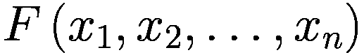

The copula function relates the joint distribution of a set of variables to the marginal distributions of these variables. Copulas are good at modeling and simulating correlated random variables. Using copulas, one can model the marginal structures of edge variables separately. These models are usually very useful. Because for some combinations of edge variables, there is no function that can generate the required multivariate distribution. It is not easy to generate random samples from a multivariate normal distribution with edges of Beta, Gamma, and Student. However, it is possible to generate random samples from a multivariate normal distribution using R simply.

The copula function is denoted by *C*. The *C* function is an application that maps a multivariate distribution to its univariate edge (marginal distribution). The two-dimensional copula function has the following two properties [7]:

![C: I² → I

The range of ***I*** used in the function above is [0, 1].

Let *c* represent the copula density. In this case, the calculation of the copula density *c* is as follows.

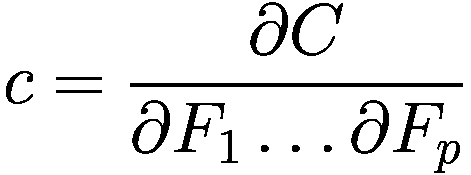

The joint density is calculated as follows.

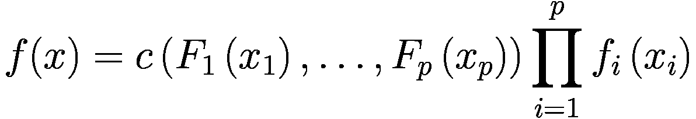

The copula generator phi function can be used to create Archimedean copula. The calculation of Archimedean copula is as follows.

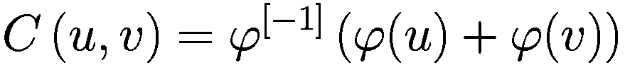

Gumbel Copula is a specific type of Copula used to model the distribution of system failure time. It is named after its creator Harry Gumbel. Gumbel Copula is created using the following generating function.

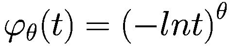

When performing mathematical transformations, the following equation is obtained.

![$$ {C}_{\theta}\left(u,v\right)=\mathit{\exp}\left[-{\left(\left(\mathit{\ln}(u)\right)\right)}^{\theta }+{\left({\left(\left(-\mathit{\ln}(v)\right)}^{\theta}\right)}^{1/\theta}\right],\theta \in \left[1,\infty \right] $$](img/534235_1_En_4_Chapter/534235_1_En_4_Chapter_TeX_Equi.png)

In finance, it is usually assumed that there is a strong or weak correlation between multiple assets. There is always correlation between human economic activities. These correlations are used to predict price and value changes. However, how to detect and measure these correlations is a big problem.

In the financial field, each asset can be assumed to have a return, such as a normal distribution *N*(*μ*, *σ*) or a student *t* distribution *t*(*n*). However, in investment, people prefer diversification to reduce risk and retain several different tools in their investment portfolios. Here, weighted average and variance can be used to estimate parameters. However, the joint distribution of the investment portfolio is unknown. A common distribution can be generated using the known marginal distributions of the assets. This is where Copula comes in. Gaussian Copula and *t* Copula are usually used. In the 2008 financial crisis, MBS collected most of its products. Gaussian Copula was used to estimate the distribution of MBS products and estimate risk values.

### t Copula

*t* Copula is a statistical tool used to measure the correlation between two variables. It is used to determine whether there is a relationship between two variables and to quantify this relationship. The calculation of *t* Copula is shown in the following equation.

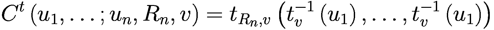

The density of *t* Copula is defined by the following equation [8]:

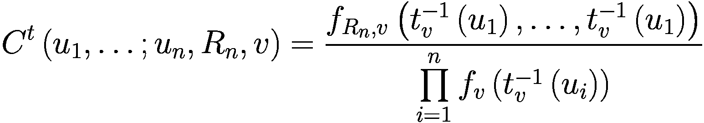

*t* copula is a special case of Gaussian Copula when the variables are not normally distributed and is


# 二维等高线图

二维分布的等高线密度图。您将看到图 4-38 所示的图形。

```py
>contourplot2(nCopula, FUN = dCopula, n.grid = 44, cuts = 35, lwd = 1/4)
```

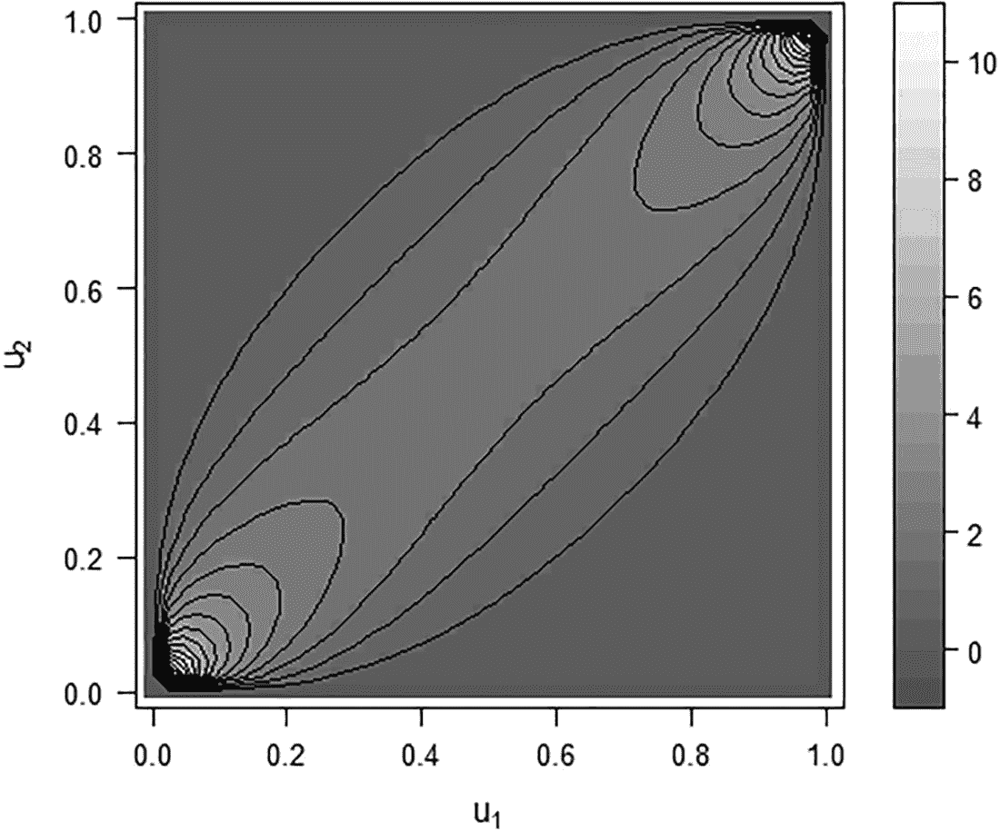

在 u 下标 2 和 u 下标 1 之间的二维密度分布的逆散点图。它在开始和结束时形成椭圆形。

图 4-38

二维等高线密度图

绘制散点图。您将看到图 4-39 所示的图形。

```py
>plot(X, xlab = quote(X[1]), ylab = quote(X[2]))
```

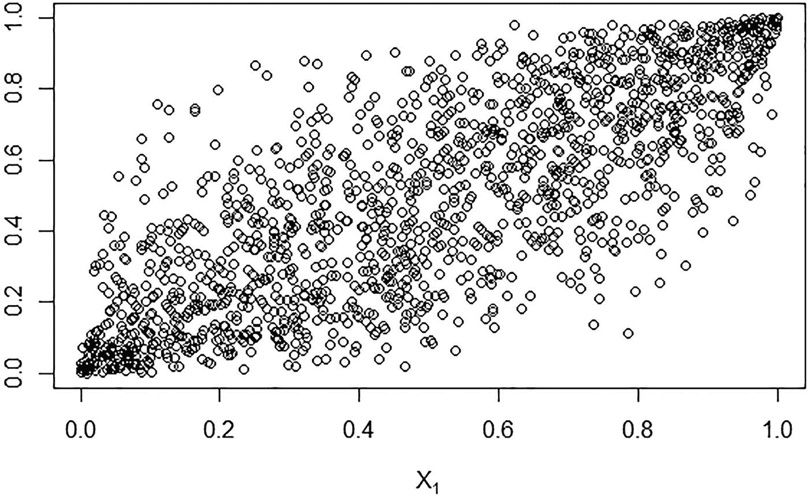

数据的散点图。它在对角线区域密度最大。

图 4-39

数据散点图

## 高斯 Copula

高斯 Copula 是一个描述两个随机变量之间依赖关系的函数。它通常用于模拟两个变量的联合分布，这两个变量可能是正态分布的，也可能不是。高斯（正态）Copula 的计算如下。


上面的方程中的 Φ^(−1)(.) 是标准正态分布 (Φ(.)) 的逆函数。*θ* 是 Φ^(−1)(*u*) 和 Φ^(−1)(*v*) 之间的线性相关系数。

高斯 Copula 密度函数是一个描述一组联合高斯随机变量分布的数学函数。此函数的计算如下。

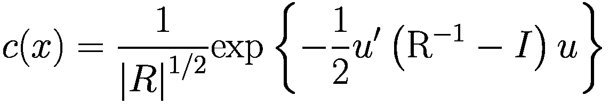

R 软件的“copula”包用于统计建模 Copula。这里创建了两个对象。其中一个是 copula 对象，另一个是多元正态对象。此示例中使用的代码取自此处[`https://rpubs.com/lance4869/copula`](https://rpubs.com/lance4869/copula)：

```py
# Load the "copula" and "scatterplot3d" libraries.
> library("copula")
> library("scatterplot3d")
# Two-dimensional (2-D) copula and two-variable normal object creation.
> mycop mymvd<-mvdc(copula=mycop,margins =c("norm","norm"),paramMargins=list(list(mean=0,sd=1),list(mean=1,2)))
```

两个变量之间的相关系数为 0.82。 “dispstr” 是相关矩阵的类型。“ex” 是 0.82 的幂，表示索引 *x*[*i*] 和 *x*[*j*] 的距离，即 |*i* − *j*| 表示。

```py
# Generating 1500 random numbers from a multivariate distribution.
> r density distance<-pMvdc(r,mymvd)
```

在三维空间中可视化密度图。您将看到图 4-40 所示的图形。

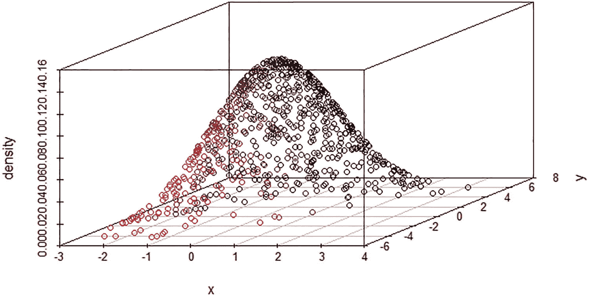

密度的三维散点图。它在中心附近形成一个峰值。

图 4-40

三维空间中的密度图

```py
> x y scatterplot3d(x,y,density,highlight.3d = T)
```

三维空间中距离图的可视化。您将看到图 4-41 中所示的图形。

```py
> scatterplot3d(x,y,distance,highlight.3d = T)
```

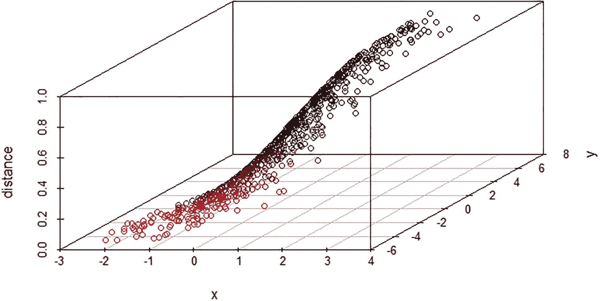

距离的三维散点图。它逐渐增加并达到最大值。

图 4-41

三维空间中的距离图

```py
# It is also possible to visualize the copula function. The copula function is visualized as follows.
> w x y copdensity copdistance<-pCopula(w,mycop)
```

三维空间中核密度图的可视化。您将看到图 4-42 中所示的图形。

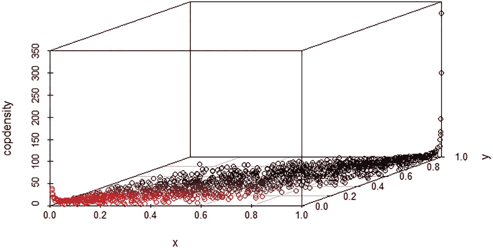

c o p 密度的三维散点图。它位于底部。

图 4-42

三维空间中的核密度图

```py
> scatterplot3d(x,y,copdensity,highlight.3d = T)
```

三维空间中核距离图的可视化。您将看到图 4-43 中所示的图形。

```py
> scatterplot3d(x,y,copdistance,highlight.3d = T)
```

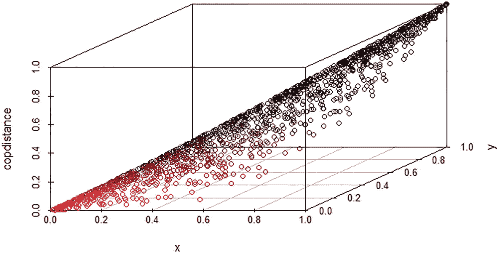

c o p 密度的三维散点图。它沿对角线分布。

图 4-43

三维空间中的核距离图

## 摘要

在本章中，您学习了如何使用不同的包和函数在 R 中生成合成数据。您学习了如何从一个已知的单变量分布中创建值向量。您还学习了如何从多元分类变量中生成合成数据。您学习了如何从具有相关性的多元分布中生成合成数据。您学习了如何使用 R 中的 nnet 包生成人工神经网络。您还了解了增强数据以及使用 torch 包进行图像增强。此外，您学习了如何使用 R 中的 mice、conjurer 和 synthpop 包生成合成数据。最后，您学习了如何使用 R 中的 copula 包生成合成数据。

接下来，我们将深入探讨使用 Python 生成合成数据。

## 参考文献

[1]. C. Shorten 和 T. M. Khoshgoftaar, “Image Data Augmentation for Deep Learning 的综述,” 《大数据杂志》, 第 6 卷，第 1 期，第 60 页，2019 年 12 月，doi: 10.1186/s40537-019-0197-0.spiepr Par165

[2]. G. Andrews, “什么是合成数据?”，《英伟达博客》, 2021 年 6 月 8 日。[`https://blogs.nvidia.com/blog/2021/06/08/what-is-synthetic-data/`](https://blogs.nvidia.com/blog/2021/06/08/what-is-synthetic-data/) (访问日期：2022 年 4 月 15 日)。

[3]. D. B. Rubin, “调查中的非响应多重插补,” 约翰·威利父子出版社，2004 年。[`https://books.google.com.tr/books?id=bQBtw6rx_mUC&printsec=frontcover&hl=tr&source=gbs_ge_summary_r&cad=0#v=onepage&q&f=false`](https://books.google.com.tr/books%253Fid%253DbQBtw6rx_mUC&printsec%253Dfrontcover&hl%253Dtr&source%253Dgbs_ge_summary_r&cad%253D0#v%253Donepage&q&f%253Dfalse) (访问日期：2022 年 4 月 15 日)。

[4]. AnalyticsVidhya, “关于用于插补缺失值的 5 个强大 R 包的教程”，2016 年 3 月 4 日\. [`www.analyticsvidhya.com/blog/2016/03/tutorial-powerful-packages-imputing-missing-values/`](https://www.analyticsvidhya.com/blog/2016/03/tutorial-powerful-packages-imputing-missing-values/) (访问日期：2022 年 4 月 15 日).

[5]. S. Grund, O. Lüdtke 和 A. Robitzsch, “使用合成数据提高心理学研究中统计结果的可重复性”，科学和数学教育，2021 年 6 月，doi: 10.31234/OSF.IO/D7ZWJ.

[6]. T. B. Volker 和 G. Vink, “匿名可共享数据：使用 mice 创建和分析多重插补合成数据集”，Psych, 第 3 卷，第 4 期，第 703–716 页，2021 年 11 月，doi: 10.3390/psych3040045.

[7]. R. B. Nelsen, 《Copulas 简介》，Springer. 纽约：Springer，2006.

[8]. F. Ielpo 和 C. Merhy, “工程投资过程：使价值创造可重复”，Elsevier, 2017.
