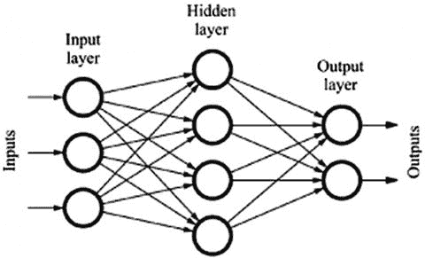

# 2. 使用 Google Colab 构建您的第一个神经网络

我们在 Google Colab 云服务中，使用 Python 的 TensorFlow 2.x 库，通过一个完整的深度学习示例进行操作。我们还演示了如何将您的 Google Drive 与 Colab 云服务链接起来。

章节的笔记本位于以下 URL：[`https://github.com/paperd/tensorflow`](https://github.com/paperd/tensorflow)。

使用 TensorFlow 2.x 构建一个有能力的神经网络相对容易。数据科学专业人士遵循以下步骤：

1.  获取原始数据。

1.  探索并预处理原始数据。

1.  将原始数据分割成训练-测试集。

1.  创建一个 tf.data.Dataset。

1.  准备输入管道。

1.  创建并训练一个神经网络模型。

数据科学家想要原始数据，因为它未经触碰。他们想要清理、整理和雕塑原始数据，以从他们的具体问题中提炼出意义。如果数据已经过处理，其中很大一部分意义可能已经丢失。在尝试预处理之前探索数据，以了解其外观总是一个好主意。一旦数据被清洗和整理，它就被分割成训练-测试集。

我们创建一个 tf.data.Dataset 以供 TensorFlow 使用。一旦数据处于适当的形式，我们就准备输入管道。在准备过程中，可能需要进行进一步的数据清洗和整理。然后，我们使用输入管道数据创建和训练一个神经网络模型。

虽然现实需要所有这些步骤，但我们专注于使用 TensorFlow 2.x 进行数据建模，因为它对于新手来说学习曲线很陡峭。因此，我们从简单的预处理数据集开始，以减轻学习者数据预处理和其他相关任务的负担。

## GPU 硬件加速器

为了大大加快处理速度，我们可以使用 Google *Colab GPU*。但是，我们必须在每个新创建的笔记本中启用 GPU：

1.  在左上角菜单中点击*运行时*。

1.  从下拉菜单中选择*更改运行时类型*。

1.  从**硬件加速器**下拉菜单中选择**GPU**。

1.  点击*保存*。

免费 GPU 有使用限制。请参考以下 URL 了解更多信息：[`https://research.google.com/colaboratory/faq.html#resource-limits`](https://research.google.com/colaboratory/faq.html%2523resource-limits)*.*

测试 GPU 是否激活：

```py
import tensorflow as tf
# display tf version and test if GPU is active
tf.__version__, tf.test.gpu_device_name()
```

导入*tensorflow*库。如果显示'/device:GPU:0'，则 GPU 已激活。如果显示'..'，则常规 CPU 已激活。

## load_digits 数据集

*load_digits*数据集是 scikit-learn 库的一部分，这是一个为*Python*编程语言提供的免费软件机器学习库。该库具有各种易于使用和操作的分类、回归和聚类算法。

`load_digits`数据集经过大量预处理，所以我们不必担心清理或整理。它由 1,797 个 8 `×` 8 像素图像组成。每个图像是一个 64 像素的矩阵，代表从 0 到 9 的手写数字。我们通过 8 乘以 8 得到 64 像素。**像素**是一个介于 0 到 255 之间的整数值，用于表示图像数据。`load_digits`数据集通常用于训练机器学习系统通过算法*分类*识别手写数字图像。

`load_digits`中的`images`容器包含手写数字的图像数据。`data`容器包含展平的特征向量。**特征向量**是一个 n 维数值特征向量，代表某个对象。在我们的情况下，64 像素的特征向量代表一个手写数字的图像。展平步骤是准备图像数据以输入到全连接神经网络层所需的。特征向量的长度为 64，因为每个 8 `×` 8 图像通过乘以 8 行和 8 列的像素进行展平。`target`容器包含目标值，而`target_names`容器包含目标名称。`DESCR`容器包含数据集的描述。

## 探索数据集

加载数据集：

```py
import tensorflow as tf
from sklearn.datasets import load_digits
# get data
digits = load_digits()
# get available containers (or keys) from dataset
print (digits.keys())
```

如果你还没有这样做，请导入*tensorflow*库。同时，从*sklearn*库中导入数据集。获取数据并显示其键。

创建变量来存储数据、图像、目标和目标名称：

```py
# create variables
data = digits.data
images = digits.images
targets = digits.target
target_names = digits.target_names
```

列表 2-1 显示了数据集的基本信息。

```py
br = '\n' # create a newline variable
# display tensor information
print ('data container:')
print (str(data.ndim) + 'D tensor')
print (data.shape)
print (data.dtype, br)
print ('image container:')
print (str(images.ndim) + 'D tensor')
print (images.shape)
print (images.dtype, br)
print ('targets container:')
print (str(targets.ndim) + 'D tensor')
print (targets.shape)
print (targets.dtype, br)
print ('target names container:')
print (target_names)
Listing 2-1
Information about the dataset
```

数据容器是一个包含 1,797 个 64 像素元素展平向量的二维张量。图像容器是一个包含 1,797 个 8 `×` 8 矩阵的三维张量。图像容器包含原始未展平的图像。目标容器是一个包含 1,797 个介于 0 到 9 之间的目标值的 1D 张量。目标名称容器包含分类标签 0–9。因此，分类基于由 0 到 9 之间的数字表示的 10 个类别。

让我们可视化第一个数据元素：

```py
# first image begins at index 0
image = images[0]
import matplotlib.pyplot as plt
plt.imshow(image, cmap="binary")
plt.show()
```

*我们*看到图像值为零，但计算机不能像我们一样“看到”。然而，我们可以训练它们理解这个数字是零。

显示第一个图像的目标值（或标签）和特征图像（8 `×` 8 矩阵）：

```py
# first digit begins at index 0
target = targets[0]
print ('digit is:', target, br)
# image matrix of first image
print ('image matrix:', br)
print (image)
```

计算机将第一个标签识别为 0。并且它将第一个图像矩阵与该标签关联。有了图像及其关联的标签，我们可以训练计算机区分数字图像。

## 图像矩阵

仔细检查图像矩阵对于训练至关重要：

1.  矩阵中的数字代表灰度强度。

1.  每个零代表*空白空间*。

1.  较大的数字代表从*灰色*到*黑色*的较深阴影。

灰度图像是一种每个像素的值都是一个单独的样本，仅表示光量的图像。也就是说，它只携带强度信息。灰度图像仅由灰色阴影组成。图像的对比度从最弱强度的黑色到最强强度的白色。

数字越低，灰色越浅（零为白色）。数字越高，灰色越深（高数值接近黑色）。因此，计算机能够通过灰度强度矩阵映射来理解数字的形状。

## 将数据分割成训练-测试集

我们将数据集分割开来，以找到适合的训练数据模型，并用测试数据将模型推广到新数据。对于 load_digits 数据集，我们可以直接使用图像数据或重塑展平后的数据。让我们来重塑展平数据。这是一个很好的练习，因为你可能在未来需要重塑数据集。

创建变量以保存输入维度：

```py
# Input image dimensions
img_rows, img_cols = 8, 8
```

重新塑形特征数据：

```py
# Reshape
X = data.reshape(data.shape[0], img_rows, img_cols)
print ('X reshaped:', X.shape)
print ('number of dimensions:', X.ndim)
```

新的特征数据集是 (1797, 8, 8)，这正是我们想要的。

建立目标数据集：

```py
y = targets
y.shape
```

目标数据集是 (1797,).

现在我们有了特征数据集和相关的目标，我们准备分割：

```py
from sklearn.model_selection import train_test_split
X_train, X_test, y_train, y_test = train_test_split(
X, y, test_size=0.33, random_state=0)
```

导入 *train_test_split* 方法。将数据分割成训练集和测试集。三分之二的数据集用于训练，三分之一用于测试。随机状态设置为结果的再现性。也就是说，结果是可重复的。我们使用这个分割作为建模示例。

或者，我们可以直接使用如图 2-2 所示的图像。

```py
X_alt = images
y_alt = targets
print ('X:', X_alt.shape)
print ('number of dimensions:', X_alt.ndim, br)
X_tra, X_tes, y_tra, y_tes = train_test_split(
X_alt, y_alt, test_size=0.33, random_state=0)
print ('X_train:', X_tra.shape)
print ('number of dimensions:', X_tra.ndim)
train_percent = X_tra.shape[0] / X_alt.shape[0]
print ('train data percent of X data:', train_percent, br)
print ('X_test:', X_tes.shape)
print ('number of dimensions:', X_tes.ndim)
test_percent = X_tes.shape[0] / X_alt.shape[0]
print ('test data percent of X data:', test_percent, br)
num_images = X_tra.shape[0] + X_tes.shape[0]
print ('total number of images:', num_images)
Listing 2-2
Alternative method to split image data
```

## 构建输入管道

TensorFlow 输入管道期望特征数据为 float32 或 float64，标签数据为 int32 或 int64：

```py
X_train.dtype, y_train.dtype
```

特征数据是 float64，标签数据是 int64。

具有广泛值范围的特征数据可能会在神经网络中引起错误，这会使学习过程不稳定。缩放可以减轻这个问题。缩放还可能加快算法中的计算速度。*特征缩放*是一种缩放特征数据范围的技术。

规模化训练和测试特征数据：

```py
# scale by dividing by the number of pixels in an image
s_train = X_train / 255.0
s_test = X_test / 255.0
```

我们通过除以 255 来缩放特征图像。图像像素以 0–255 范围内的整数形式存储，这是单个 8 位字节可以容纳的范围。这种除法确保输入像素的缩放在 0.0 和 1.0 之间。

创建 TensorFlow 消费的数据对象：

```py
train_dataset = tf.data.Dataset.from_tensor_slices((s_train,
y_train))
test_dataset = tf.data.Dataset.from_tensor_slices((s_test,
y_test))
```

让我们看看我们的张量看起来像什么：

```py
print ('train:', train_dataset)
print ('test: ', test_dataset)
```

我们可以看到，训练和测试张量都由 8 `×` 8 的 float64 图像和 int64 标量目标值组成。

## 探索 TensorFlow 数据

让我们探索我们刚刚创建的 TensorFlow 数据集中的实际内容。

显示训练集中的第一个特征图像的切片及其目标：

```py
for feature, label in train_dataset.take(1):
print (feature[0], br)
print (label)
```

为了简洁起见，我们显示第一张图像的第一部分。我们还显示了第一个目标。*take* 方法从 TensorFlow 数据集中抓取样本。在这种情况下，我们只抓取了第一个样本，但我们可以抓取 *n* 个元素。

让我们从测试集中抓取前两个标签：

```py
for _, label in test_dataset.take(2):
print (label)
```

现在，我们构建输入管道。

## 打乱数据

在我们讨论数据洗牌之前，我们需要了解一些概念。**epoch**是指一次遍历整个训练集。训练神经网络通常需要多个 epoch。**batch**是一组训练样本。深度学习模型不会一次性处理整个数据集。它们将数据分成小批次。

每个 epoch 后洗牌数据可以确保我们不会因为太多不良批次而陷入困境。这是怎么工作的呢？洗牌可以减少模型方差，从而产生更通用的结果并减少过拟合。**过拟合**是指模型训练数据过于完美。当模型学会了训练数据中的细节和噪声，以至于对新数据的模型性能产生负面影响时，就会发生过拟合。

洗牌确保每个数据点对模型产生独立的变化，而不会被先前数据点所偏倚。也就是说，它确保提供给模型训练的数据包含所有类型的数据。

一个很好的隐喻是**洗牌一副牌**。我们在玩牌游戏之前洗牌，是为了确保每个玩家有相同的机会得到一张特定的牌，就像洗牌一副牌可以消除偏见一样，在训练神经网络之前在每个 epoch 前洗牌数据也是如此。

## 继续构建流水线

我们需要对 TensorFlow 可消费的训练数据进行洗牌和分批处理。我们只对测试数据进行分批。因为它代表的是新数据，所以不需要洗牌。一旦我们设置了批量和缓冲区大小，我们就可以准备洗牌和分批了。

设置批量和缓冲区大小：

```py
BATCH_SIZE = 64
SHUFFLE_BUFFER_SIZE = 100
```

调整批量和缓冲区大小可以提高性能。我们**任意地**将批量大小设置为 64，将洗牌缓冲区大小设置为 100。你可以尝试不同的值，看看结果如何受到影响。我们建议缓冲区大小相对较大，否则洗牌将不会非常有效。

给新数据集起自己的名字是个好主意：

```py
train_ds = train_dataset\
.shuffle(SHUFFLE_BUFFER_SIZE)\
.batch(BATCH_SIZE)
test_ds = test_dataset.batch(BATCH_SIZE)
```

注意，我们只洗牌训练数据。原因是测试数据应该代表我们的模型尚未见过的数据。也就是说，测试数据应该代表新数据。一旦我们对训练数据运行洗牌方法，模型就会在每次 epoch 之前**自动**洗牌数据！

让我们探索我们的新数据集：

```py
train_ds, test_ds
```

形状是（None, 8, 8）。我们得到*None*作为额外的维度。发生了什么？这个额外维度是添加的，因为 TensorFlow 模型可以适应任何批量大小！

## 前馈神经网络

前馈模型是网络中最简单的类型。**前馈**神经网络是指信息只在网络中向前传播的网络。数据从输入节点通过（如果有）隐藏节点移动到输出节点。网络中没有循环或回路。

层是**全连接**的，这意味着每一层都与下一层完全连接。全连接层将前一层的每个节点（或神经元）与后续层的每个节点连接起来。也就是说，一个**层**中的每个神经元都会从**前一**层中的所有神经元接收输入。全连接层通常被称为**密集连接**。

## 层数数量

通常，**更多的层可以提高模型性能**。但更多的层需要更多的计算资源。当我们没有太多训练数据时，一个简单且层数较少的网络往往表现得和复杂的多层网络一样好，甚至更好。

在探索新的数据集时，从简单的网络开始是一个好主意。我们还建议在数据集上绘制一个小随机样本，并用简单的网络对其进行训练，以了解其潜在的性能。遵循这一建议可以节省前期的时间和计算资源。我们还熟悉了数据集。如果简单模型在小样本上训练不好，我们可以在转向更复杂的模型之前获取更多数据或尝试找出我们表现不佳的原因。

## 我们的模型

我们构建的第一个模型包含一个输入层、一个隐藏层和一个输出层。神经网络中的第一层**总是**是输入层，以告知模型输入数据的形状。

我们模型的第一层是一个**Flatten**层。**Flattening**是将数据转换为 1D 数组的进程。在训练全连接网络时，输入层数据应该是 1D 向量或 2D 矩阵。

**Flatten**层将每个张量重塑为与张量中包含的元素数量相等的形状，不包括批量维度。这个层没有参数。由于这是**输入层**，我们指定**input_shape**为**(8, 8**)来告知模型每个特征图像由一个 8 `×` 8 的矩阵表示。

第二层是一个密集连接的**隐藏层**。**Dense**层将全连接层添加到神经网络中。它包含 256 个神经元（或节点）并使用**relu**激活函数。

最后一层是**输出层**。它也是一个密集连接层，包含十个神经元并使用**softmax**激活函数。输出层必须始终包含与类别数量相同的神经元数量。由于我们正在对 0-9 的数字进行分类，我们有十个类别。

**激活函数**定义了给定输入或一组输入的节点的输出。它是一个激活神经网络中每个节点的算法。

**ReLu**（或修正线性单元）是一个分段线性函数，如果输入为正或零则直接输出输入值，如果输入为负则输出零。由于它便于训练并且通常比其他激活函数有更好的性能，因此它是许多网络的默认激活函数。

**Softmax** 输出值大如果分数高，小如果分数低。它常用于分类问题，其中类别是互斥的。在这种情况下，每个图像可以是一个且仅是一个数字。

让我们先定义输入形状：

```py
for item in train_ds.take(1):
s = item[0].shape
in_shape = s[1:]
in_shape
```

从训练数据集中取第一个样本并检索其形状。由于 Flatten 层需要每个图像的形状，我们切片这部分。

导入库以构建层：

```py
from tensorflow.keras.models import Sequential
from tensorflow.keras.layers import Dense, Flatten
```

构建模型：

```py
model = Sequential([
Flatten(input_shape=in_shape),
Dense(256, activation="relu"),
Dense(10, activation="softmax")
])
```

## 模型摘要

**summary** 方法显示模型的特征。它显示层、输出形状和参数。

让我们尝试这种方法：

```py
model.summary()
```

层、输出形状和参数被显示。模型从输出形状为 (None, 64) 且没有参数的 Flatten 层开始。批处理大小可以是任何数字，所以显示 *None*。第一层接受数据的输入形状，但以任何方式都不作用于数据。因此，每个输入张量是一个 64 元素的向量，并且有 0 个可训练参数。记住，每个层都接收前一层的输出。

第一个 Dense 隐藏层接收来自前一层的张量，并在这一层有 256 个神经元。输出形状是 (None, 256)，因为这一层有 256 个神经元。可训练参数是通过将这一层的神经元乘以前一层的神经元，并将这一层的神经元加到结果上来确定的。因此，这一层有 16,640 个参数，因为它从前一层的 64 个神经元输入，这些神经元被传递到 256 个神经元。将 64 乘以 256 得到 16,384。但我们仍然需要考虑这一层的 256 个神经元。所以将 16,384 加到 256 上得到 16,640 个参数！

输出层接收来自隐藏层的张量，并在这一层有十个神经元。输出形状是 (None, 10)，因为这一层有 10 个神经元。前一隐藏层有 256 个神经元。将 10 乘以 256 得到 2,560 个参数。但我们这一层有十个神经元。所以将 2,560 加到 10 上得到 2,570 个参数。

## 编译模型

**compile** 方法配置模型以进行训练。我们设置了优化器、损失函数和指标。**损失函数**（或目标函数）是在训练过程中最小化的量。它代表成功的度量。**优化器**找到最小化给定损失函数的参数。

我们使用 Adam 优化器。*Adam* 是一种自适应学习率方法，它为不同的参数计算学习率。Adam 很好，因为它可以*自动*调整学习率以实现最佳的训练性能。

我们使用 *sparse_categorical_crossentropy* 损失函数，因为我们的目标是互斥的整数。也就是说，一个数字只能是十个数字中的一个。

编译模型：

```py
model.compile(optimizer='adam',
loss='sparse_categorical_crossentropy',
metrics=['accuracy'])
```

我们使用 *Adam* 优化器，因为它表现良好。我们尝试了其他优化器选项，但这个在这个情况下工作得相当好，并且它可以自动调整学习率。

查看以下 URL 以查看可用的优化器：

[TensorFlow API 文档 - Keras 优化器](http://www.tensorflow.org/api_docs/python/tf/keras/optimizers)

## 训练模型

由于 train_ds 和 test_ds 由图像和标签组成，我们将它们作为 *fit* 方法的参数包括在内以进行训练。我们运行模型 60 个周期，这意味着我们将数据传递给模型 60 次。我们使用 train_ds 进行训练，使用 test_ds 进行验证。

训练模型：

```py
history = model.fit(train_ds, epochs=60, validation_data=(test_ds))
```

我们的训练准确率接近 97%。测试准确率接近 95%。我们的模型有点过拟合，因为测试准确率低于训练准确率。由于随机化效应，你的结果可能会有所不同。

总是评估模型以进行泛化是一个好主意：

```py
model.evaluate(test_ds)
```

因此，我们的模型在新数据上的泛化能力约为 95%。

## 模型历史

fit 方法在训练过程中自动记录损失和指标值。这就是为什么我们将训练分配给变量 *history*。*history.history* 对象是一个字典，其中包含训练记录。

将训练记录分配给一个变量：

```py
history_dict = history.history
```

显示字典中的键列表：

```py
keys = history_dict.keys()
print ('keys:', keys, br)
```

我们使用 loss、accuracy、val_loss 和 val_accuracy 键来引用训练指标。

获取字典的长度，以便我们可以引用最终的指标值：

```py
length = len(history_dict['loss']) - 1
```

减去 1 从长度，因为 Python 列表索引从 0 开始。

列表 2-3 显示了最终的指标值。

```py
final_loss = history_dict['loss'][length]
final_loss_val = history_dict['val_loss'][length]
final_acc = history_dict['accuracy'][length]
final_acc_val = history_dict['val_accuracy'][length]
print ('final loss (train/test):')
print (final_loss, final_loss_val, br)
print ('final accuracy (train/test):')
print (final_acc, final_acc_val)
Listing 2-3
Display the final training metrics
```

由于我们有训练指标，我们可以绘制训练和验证损失以及训练和验证准确率，如列表 2-4 所示。验证损失和准确率基于测试数据，因为它们对模型来说是新的。

```py
import matplotlib.pyplot as plt
acc = history_dict['accuracy']
val_acc = history_dict['val_accuracy']
loss = history_dict['loss']
val_loss = history_dict['val_loss']
epochs = range(1, len(acc) + 1)
plt.figure(figsize=(12,9))
plt.plot(epochs, loss, 'bo', label='Training loss')
plt.plot(epochs, val_loss, 'b', label='Validation loss')
plt.title('Training and validation loss')
plt.xlabel('Epochs')
plt.ylabel('Loss')
plt.legend()
plt.show()
# clear previous figure
plt.clf()
plt.figure(figsize=(12,9))
plt.plot(epochs, acc, 'bo', label='Training acc')
plt.plot(epochs, val_acc, 'b', label='Validation acc')
plt.title('Training and validation accuracy')
plt.xlabel('Epochs')
plt.ylabel('Accuracy')
plt.legend(loc='lower right')
plt.ylim((0.5,1))
plt.show()
Listing 2-4
Visualize train and test loss and accuracy
```

导入 matplotlib.pyplot 以启用绘图。准确性和损失指标保存在变量中。代码的其余部分使用绘图方法来显示结果。从可视化中，我们可以看到训练过程。我们建议在每个神经网络训练练习中绘制训练损失和准确率。

可视化验证我们的模型正在过拟合，因为训练准确率高于验证（或测试）准确率。当然，过拟合并不剧烈。可视化还显示了训练和验证指标何时收敛或发散。为了使模型能够处理新数据，训练和测试准确率应尽可能接近。

## 预测

深度学习利用算法自动对数据进行建模并找到数据中的模式，目标是预测目标输出或响应。如果我们能从新数据中预测，我们可以获得帮助决策的见解。

一种进行预测的方法是在测试数据上使用 *predict* 方法：

```py
predictions = model.predict(test_ds)
```

*predictions* 变量包含基于 *test_ds* 的所有预测。每个预测由一个值数组表示，该数组提供一组概率。数组中的值数基于目标类别的数量。因此，每个数组包含十个值。数组中概率最高的值是预测的数字。

让我们看看第一个预测（索引 0）：

```py
predictions[0]
```

从浮点数中识别最高概率很困难，所以让我们让它更容易看到：

```py
predictions[0].round(2)
```

数组中概率最高的值是预测值。每个数组位置代表一个介于 0 到 9 之间的数字。所以位置一代表数字 0，位置二代表数字 1，以此类推。

使用以下算法来获取第一个预测的置信度：

```py
import numpy as np
confidence = 100*np.max(predictions[0])
print (str(np.round(confidence, 2)) + '%')
```

因此，我们非常确信我们的预测是正确的。

使用此算法，我们根据测试数据集的第一张图片预测数字：

```py
first_pred = np.argmax(predictions[0])
print ('predicted:', first_pred)
```

显示的是基于测试数据集第一张图片的预测数字。预测正确吗？

显示测试数据集的第一个标签：

```py
print ('actual:', y_test[0])
```

如果预测的数字与实际标签相同，则预测正确！由于结果可能不同，我们无法确定预测了哪个数字。

让我们基于测试数据集中的前五张图片进行预测。

列表 2-5 显示了测试数据的前五个预测以及我们对每个预测的置信度。

```py
# first five predictions based on test data:
print ('first five predictions:', end=' ')
p5 = []
for i in range(5):
p = predictions[i]
v = np.max(p)
p5.append(p.tolist().index(v))
print (p5)
# confidence in first five predictions:
print ()
print ('Confidence in our predictions:', br)
c = []
for i in range(5):
conf = str(round(100*np.max(predictions[i]), 2))
c.append(conf)
print (conf + '% for prediction:', p5[i])
Listing 2-5
Five predictions and their confidences
```

我们还可以将我们的前五个预测与实际的目标值进行比较，以查看我们的模型表现如何。

列表 2-6 展示了测试数据集中前五个数据元素的预测数字、实际数字、预测的置信度和实际图像。

```py
# first five predictions from test data
prediction_5 = [np.argmax(predictions[i])\
for i, row in enumerate(p5)]
# display predicted digits, actual digits, confidences and images
for i, row in enumerate(prediction_5):
print ('predicted:', target_names[row])
print ('actual:', target_names[y_test[i]])
print (str(c[i]) + '%')
fig, ax = plt.subplots()
image = ax.imshow(X_test[i], cmap="bone")
plt.title(target_names[y_test[i]])
plt.show()
print (br)
Listing 2-6
First five predictions, actual labels, confidences, and images
```

## 获取图片

要获取本书的图片，只需遵循以下简单步骤：

1.  前往本书的 GitHub 网址：[`https://github.com/paperd/tensorflow`](https://github.com/paperd/tensorflow)*.*

1.  定位要下载的图片并点击它。

1.  点击 *下载* 按钮。

1.  在图片内部任意位置右键点击。

1.  点击 *另存为…*。

1.  在电脑上保存图片。

1.  将图片拖放到你的 Google Drive *Colab Notebooks* 文件夹。

对于本课，前往本书的 URL，点击 *chapter2*，点击 *figures*，点击 *Figure0201.png*，点击 *下载* 按钮，在图片内部右键点击，点击 *另存为…*，并在电脑上保存图片。将图片拖放到你的 Google Drive *Colab Notebooks* 文件夹。



## 挂载 Google Drive 以显示图片

我们知道 Colab 笔记本是保存在 Google Drive 上的。但我们也可以将图片和其他数据从 Google Drive 加载到 Colab 笔记本中。如果你没有 Google 邮箱账户，创建一个。只需遵循三个简单步骤：

1.  安装 *Pillow* 模块（如果需要）。

1.  挂载 Google Drive。

1.  指向图片并显示它。

Pillow 库应该已经安装，但你可以这样安装：

```py
!pip install Pillow
```

*!* 符号使我们能够在笔记本中调用 shell 命令，例如安装 Python 模块。

运行代码单元以开始挂载过程：

```py
from google.colab import drive
drive.mount('/content/gdrive')
```

要继续挂载，点击 URL 链接，选择你希望使用的 Google 账户，点击 *允许* 按钮，复制授权代码，将其粘贴到 *输入你的授权代码:* 文本框中，然后按下键盘上的 *Enter* 键。听起来像是一件很麻烦的事情，但实际上非常简单。驱动器挂载到 *gdrive/My Drive/Colab Notebooks*。

现在，请确保你在 *Google Drive* 上有这张图像。图像包含在我们的 GitHub 网站上的书中。你只需将其保存到你的电脑上，然后将其拖入 Google Drive 目录。当然，你也可以使用任何你想要的图像。

我们将图像保存到 *Colab Notebooks* 目录中。你可以保存到任何你希望的地方，但确保正确指向它。

列表 2-7 创建了图像的路径并显示了图像。

```py
# Be sure to copy the image to this directory on Google Drive
img_path = 'gdrive/My Drive/Colab Notebooks/Figure0201.png'
from PIL import Image
import matplotlib.pyplot as plt
img  = Image.open(img_path)
plt.imshow(img)
Listing 2-7
Display an image from Google Drive
```

图像名称为 *Figure0201.png*。我们从 *PIL* 库中导入 *Image*。当访问 Pillow 模块时，Python 期望 PIL。我们还导入了 *matplotlib.pyplot*，它是 Python 绘图库 *matplotlib* 中的一个模块。我们打开图像并在 Colab 笔记本中显示它。
