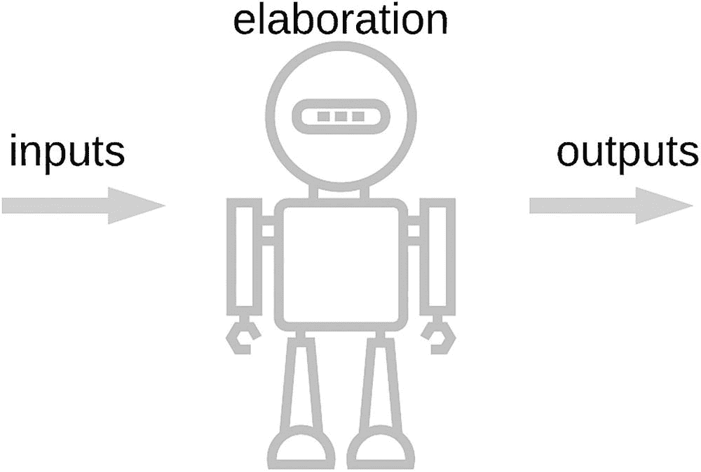

# 2. 什么是 AI？

人工智能（AI）以其难以定义而著称，这既是其优势也是其劣势。该术语的宽泛性使得一系列截然不同的技术得以共存于同一领域，从数据密集型机器学习技术（如神经网络）到基于模型的演绎逻辑，从融合统计学技术到运用心理学的思维模型。与此同时，所有这些试图模仿现有智能形式或创造新智能形式的尝试，也引发了关于什么是真正智能的激烈辩论。虽然在某些背景下这些辩论是有益的，但它们也可能令人分心和困惑。它们可能导致人们对 AI 设定不切实际的期望或表达担忧，这些期望或担忧并非基于该技术当前的能力或我们有信心预测其未来能达到的水平，而是更多基于信念和直觉的推断。

在本章中，我们将聚焦于对 AI 更实际的解读。为了铺垫背景，我们首先简要探讨定义 AI 时最大的陷阱之一，即常被提及的“消失的魔法”。接着，我们区分通用 AI 和特定领域 AI，然后提供一种思考特定领域 AI 的方式，这种方式关注于“做什么”而不纠结于“怎么做”。通过关注结果和可观察的行为，我们基本上可以避开甚至需要使用“智能”这样一个模糊术语的问题，当然我们也不会试图将其固定在一个定义上。相反，我们将思考立足于：当引入被委以部分决策权（并因此导致行动自动化）的软件时，我们的组织流程会受到怎样的影响。以上所有内容为下一章关于构建 AI 驱动应用提供了必要的基础。

## AI 的隐身术

根据我们在前一章中看到的 AI 历史，可以合理地说，人工智能中的“人工”指的是“智能”的起源是人类有目的努力的结果，而非自然进化或某种形式的神灵干预。它之所以是“人工的”，仅仅是因为我们通常认为智能源于自然，而通过 AI，我们以某种方式欺骗了自然，自己创造了它。

我喜欢把它比作元素周期表中的人造元素。如果你还记得化学课上的内容，人造元素就是那些被人工创造出来的元素，即由人类创造。你通常不会在周围发现锿或镄。然而，对于这些合成元素和 AI 来说，重要的是，一旦被创造出来，它们与自然界中存在的元素（或智能）相比，既不更不真实，也不更真实。换句话说，“人工”指的是达到智能的过程，*而非*最终结果。

那么，什么是智能呢？这几乎是一个你能想到的最开放的问题，而更糟糕的是，我们通过不断改变目标来让事情变得更复杂。每当我们构建出能够完成以前不可能完成的事情的东西时——从简单的计算器到击败国际象棋大师，从在《危险边缘！》中获胜到检测癌症——那个我们刚刚使其变得可处理的棘手问题就会被降级。与那些声称某物并非真正智能的人的典型对话大致如下：

- 它*看起来*需要智能才能解决，但我想其实不需要。

- 等等，什么？那如果不是 AI，现在是怎么解决的？

- 嗯，它用了大量的计算和大量的算法，不是吗？其中并没有什么真正聪明或神奇的东西。

- ……

一旦把戏被揭穿，魔法就失效了，它不再是魔法。这只是手法技巧，一个精心设计的把戏，一个更复杂的歌唱鸟自动机版本。

也许这是因为我们实际上并不知道自己的智能从何而来、如何产生，再加上对任何声称可能像我们一样智能的事物有一种与生俱来的威胁感。毕竟，我们早已习惯了在这个星球上称王称霸。我们自身对智能的探索，是唯一感觉可能威胁到它的东西。^(¹⁴) 当我们成功解决了那些我们“认为”需要智能的问题时，我们就去神秘化了它们，这使它们变得不那么有趣。直到我们完全去神秘化整个过程之前，我们总能退到更高的立场，宣称自己的优越性。

然而，对于解决实际问题的日常任务来说，这类讨论往往会分散注意力并令人沮丧。人们是否称其为智能，最终并不重要。最平凡的道理是，通往解决方案的旅程才是关键。这段旅程带领我们穿越 AI 提供的广阔工具集，让我们发现哪些技术适用于我们的情况。我们是否用“真正的”智能解决了问题，这是存在主义者争论的话题。现实情况是，我们现在拥有一个能做有用之事的工具。

正是这种对 AI 的实用观点，我们将在本章中进一步阐述。然而，在此之前，我们将区分对通用 AI（这无疑是一种存在主义的追求）与特定领域 AI 的探索。

## 通用 AI vs. 特定领域 AI

当我们走向对 AI 的实用理解，以便用它来思考如何最好地利用它时，首先区分人工通用智能（或称强 AI）和特定领域 AI（或称弱 AI）是很有用的。

强 AI 指的是努力创造能够通过运用其技能处理任何问题的机器。就像人类一样，它们可以审视情况，并充分利用手头的资源来实现目标。

花点时间想想这意味着什么。假设目标是准备一杯咖啡。想象一下在陌生人的家里做这件事。你被允许进入，然后你扫视各个房间，试图找出厨房可能在哪里。多年的先前经验告诉你，厨房可能在一楼，朝向房子的后面。无论如何，当你看到它时，你能认出来，对吧？然后你四处寻找咖啡机。它用研磨咖啡粉、咖啡豆还是速溶咖啡？是意式咖啡机，还是法式压滤壶？水在哪里？他们把杯子放在哪里？勺子呢？糖呢？奶油呢？牛奶呢？我们毫不费力地处理所有这些难题。

现在想象一下，必须建造一台能完成这些工作的机器。它将需要导航技能、机器视觉技能、处理不同类型物体的灵巧性，以及一个图书馆规模的关于如何煮咖啡和房屋如何布局的规则。你可能开始体会到强 AI 所面临的挑战了。

这个煮咖啡的场景是史蒂夫·沃兹尼亚克（是的，苹果公司的史蒂夫·沃兹尼亚克）为测试强 AI 机器而设计的一个挑战。就像我们在前一章提到的图灵测试一样，这是一种验证是否达到了接近人类水平的智能的方法。关键在于，即使你真的造出了一台能够进入任何房子并准备一杯咖啡的机器（顺便说一句，我们离实现这一点还差得很远），当你让它换一个灯泡时，它也会惨败。事实上，许多人认为即使这个测试也不是一个足够好的强 AI 测试。通用智能的一个关键技能是将知识从一个领域迁移到另一个领域的能力，这是人类似乎特别擅长的事情。来自《人工智能伦理学》的这段引文很好地捕捉了这一点。

> *蜜蜂表现出建造蜂巢的能力；河狸表现出建造水坝的能力；但蜜蜂不会建造*[*水*]*坝，河狸也学不会建造蜂巢。而人类，通过观察，可以学会做这两件事；但这是生物生命形式中独一无二的能力。*^(¹⁵)

强 AI 试图解决那些直指我们作为人类核心的问题。不用说，如果我们真的建造出如此强大的机器，我们将面临一系列非常有趣的后续问题需要回答。

因此，从哲学、政治和社会的角度来看，这场辩论是引人入胜的。从科学的角度来看，这种探索当然是有价值的。从“AI 如何能帮助我完成今天手头的工作？”的角度来看，强 AI 并不是我们需要关注的重点。

相反，我们将专注于弱 AI 或狭义 AI。这种 AI 试图构建能够解决明确定义领域内问题的机器。类似于 20 世纪 80 年代早期拥有“区区”数千条规则的专家系统，这些 AI 机器的目标是解决有限的问题，并尽早、清晰地展示其价值。与 20 世纪 80 年代不同的是，我们现在拥有计算能力、数据和技术来构建系统，这些系统无需我们明确阐述所有规则就能解决问题。

此外，我们不会直接深入技术并给出不同类型的机器学习或符号推理方法的分类，而是会走一条不同的路。由于智能是如此难以界定，我们将着眼于系统展现出的品质或行为，并用这些来理解它。我们将借鉴智能体导向计算的思想，这是 AI 的一个领域，致力于构建以智能体为核心抽象单元的软件。我们将探索我们的智能体（即我们的软件）可以拥有哪些行为，以及这些行为如何组合起来，从而产生越来越复杂的软件。

# 基于智能体的 AI 视角

视角具有强大的能力，能够定义你如何理解一个问题。从面向智能体的视角来探讨 AI，能让我们摆脱 AI 定义带来的诸多挑战，同时为我们提供一个坚实的概念框架来指引整个过程。

## 描述基于智能体的软件工程

描述基于智能体的软件工程的一个简单方式是：它是软件工程与 AI 的结合。它研究 AI 从业者如何构建软件，并试图识别出共同的特征和模式，从而为构建 AI 应用的实践提供指导。

它关注的是智能程序（智能体）如何被构建，并提供了对单个智能体行为以及智能体之间交互进行建模和推理的方法。尽管本书并非专门讨论软件工程，但这些概念和抽象方法能帮助我们理解任何 AI 技术，更重要的是，理解它可能对我们的流程产生的影响。

## 采用基于智能体视角的原因

采用基于智能体视角的一个关键原因是，我们可以考虑智能体*在做什么*，而无需考虑它*如何*做到。换句话说，我们不需要去探究智能体具体使用了哪种 AI 技术来完成其任务。很多时候，讨论会迷失在细节中，比如用了什么神经网络、什么统计技术、什么符号逻辑，更糟的是，用了什么编程语言，以及这算不算 AI。这会导致形成关于什么是“真正”AI、什么不是的阵营。在这些情况下，“真正”的 AI 往往就是声称者最喜欢或最熟悉的技术，而其他一切则相形见绌。

基于智能体的 AI 应用视角，让我们能够考虑应用***在做什么***，而无需关心它是***如何***实现的。

## 区分“做什么”和“如何做”

虽然我们会探讨这些方法的一些基础知识，但总的来说，我们不应该关心问题是*如何*解决的。技术在发展，解决问题的方式也在变化。如果你关注 AI 的发展，哪怕只是间接关注，你很快就会发现，每天、每周、每月都有新的公告和令人惊叹的新架构出现。除非你是该特定子领域的从业者，否则试图跟上这一切是一场必输的游戏。

我们应该始终区分*做什么*和*如何做*，并专注于对我们重要的方面。如果你在研究神经网络架构，那么用神经网络解决问题就是重要的方面。如果你只是想知道图片里有没有猫，最重要的方面是你能得到可靠的答案。如何得到答案是次要的。

## 智能体的定义

一本经典的 AI 教科书^(¹⁶)将智能体描述为“任何可以通过传感器感知其环境并通过执行器作用于环境的事物”。你可以把它想象成一个物理机器人（图 2-1），这有助于理解。机器人会使用传感器（摄像头、GPS 等）来确定自己的位置和周围环境，并据此驱动其电机（执行器）以某种方式行动，使其更接近目标位置。关键在于，机器人*如何*决定向左或向右在这一点上并不重要。描述机器人试图实现什么目标时，无需知道从感知到行动的内部过程。

图 2-1. 智能体如同一个接收输入并产生变化的机器人

一个**目标**是环境中一种理想的事态——一种我们可以使用该环境的属性来描述的状态。

目标对于定义智能体至关重要。它是驱动我们*做什么*的*原因*。机器人为什么向左转？嗯，它试图到达它左边的一个物体，等等。因此，就我们的目的而言，智能体的定义是：智能体是通过其能力来改变其所处环境，从而试图实现某个目标的事物。

一个**智能体**是通过其**能力**来改变其所处环境，从而试图实现某个**目标**的事物。

## 被动型智能体

被动智能体对目标没有内部表征。完全由用户来理解如何操作被动智能体的能力以实现目标。

## 主动型智能体

主动型智能体拥有目标的内部表征，并利用自身能力去实现该目标。

## 自我导向型智能体

自我导向是智能体改变其实现目标方式的能力。

## 自主智能体

自主智能体利用更高阶的动机来生成或在不同目标之间进行选择。

## 会学习的智能体

这种学习活动背后可能隐藏着任意数量的复杂层次。

## 智能体社区

这是自动化中一个不常被讨论但至关重要的方面。

## 超越智能

超越模糊的智能概念，有助于理清思路。

## 总结

你的业务目标几乎不可能是构建一个使用最新神经网络架构的应用。更有可能的是，它会根据你在工作中遇到的具体问题来定义，并与如何改进工作方式的明确目标相关联。这才是我们最关心的*是什么*。

脚注 1   2   3   4   5
