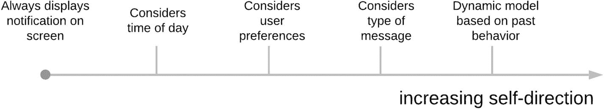

# 基于智能体的 AI 视角

视角具有强大的能力，能够定义你如何理解一个问题。从面向智能体的视角来探讨 AI，能让我们摆脱 AI 定义带来的诸多挑战，同时为我们提供一个坚实的概念框架来指引整个过程。

描述基于智能体的软件工程的一个简单方式是：它是软件工程与 AI 的结合。它研究 AI 从业者如何构建软件，并试图识别出共同的特征和模式，从而为构建 AI 应用的实践提供指导。

它关注的是智能程序（智能体）如何被构建，并提供了对单个智能体行为以及智能体之间交互进行建模和推理的方法。尽管本书并非专门讨论软件工程，但这些概念和抽象方法能帮助我们理解任何 AI 技术，更重要的是，理解它可能对我们的流程产生的影响。

采用基于智能体视角的一个关键原因是，我们可以考虑智能体*在做什么*，而无需考虑它*如何*做到。换句话说，我们不需要去探究智能体具体使用了哪种 AI 技术来完成其任务。很多时候，讨论会迷失在细节中，比如用了什么神经网络、什么统计技术、什么符号逻辑，更糟的是，用了什么编程语言，以及这算不算 AI。这会导致形成关于什么是“真正”AI、什么不是的阵营。在这些情况下，“真正”的 AI 往往就是声称者最喜欢或最熟悉的技术，而其他一切则相形见绌。

基于智能体的 AI 应用视角，让我们能够考虑应用***在做什么***，而无需关心它是***如何***实现的。

虽然我们会探讨这些方法的一些基础知识，但总的来说，我们不应该关心问题是*如何*解决的。技术在发展，解决问题的方式也在变化。如果你关注 AI 的发展，哪怕只是间接关注，你很快就会发现，每天、每周、每月都有新的公告和令人惊叹的新架构出现。除非你是该特定子领域的从业者，否则试图跟上这一切是一场必输的游戏。

我们应该始终区分*做什么*和*如何做*，并专注于对我们重要的方面。如果你在研究神经网络架构，那么用神经网络解决问题就是重要的方面。如果你只是想知道图片里有没有猫，最重要的方面是你能得到可靠的答案。如何得到答案是次要的。

采用基于智能体视角的另一个原因是，我们实际上不需要定义智能。正如我们多次提到的，这本身就不是一件容易的事。如果每次讨论系统行为时，我们都被关于它是否真正智能的讨论所分心，那么我们将永远无法取得进展。相反，我们将专注于智能体试图实现的目标，以及它们与环境中其他部分（包括其他智能体）的交互。

## 智能体

一本经典的 AI 教科书^(¹⁶)将智能体描述为“任何可以通过传感器感知其环境并通过执行器作用于环境的事物”。你可以把它想象成一个物理机器人（图 2-1），这有助于理解。机器人会使用传感器（摄像头、GPS 等）来确定自己的位置和周围环境，并据此驱动其电机（执行器）以某种方式行动，使其更接近目标位置。关键在于，机器人*如何*决定向左或向右在这一点上并不重要。描述机器人试图实现什么目标时，无需知道从感知到行动的内部过程。

图 2-1. 智能体如同一个接收输入并产生变化的机器人

当然，机器人以某种方式移动是因为它试图实现某个目标。它试图达成某种*理想的事态*，例如离开房间或搬运物体。我们将这种理想的事态称为它的*目标*。

一个**目标**是环境中一种理想的事态——一种我们可以使用该环境的属性来描述的状态。

目标对于定义智能体至关重要。它是驱动我们*做什么*的*原因*。机器人为什么向左转？嗯，它试图到达它左边的一个物体，等等。因此，就我们的目的而言，智能体的定义是：智能体是通过其能力来改变其所处环境，从而试图实现某个目标的事物。

一个**智能体**是通过其**能力**来改变其所处环境，从而试图实现某个**目标**的事物。

这种基于智能体视角的创始人，Michael Luck 教授和 Mark d'Inverno 教授，给出了一个概念性且有趣的例子来说明这一观点。在一篇题为“智能体与自主性的形式化框架”^(¹⁷)的论文中，他们用一个简单的咖啡杯作为可以成为智能体的例子。他们提出，在某些情况下，我们可以赋予杯子一个特定的目的（即一个目标），此时它可以被视为一个智能体。例如，当杯子被用来盛放液体时，它实现了我们想要一个地方放咖啡的目标。一旦它不再服务于这个目的，它就不再是我们的智能体了。

在我刚开始自己的博士研究时，我就被这种关于智能体的观点深深吸引，正是因为它提供了一个坚实的立足点，并避免了模糊的定义。因此，我进一步深入研究了他们最初的框架，试图构建一种方法论，不仅帮助我们描述智能体系统，还能帮助我们构建它们。

在我的工作中，我扩展了整体框架，增加了更多类别，使我们能够更容易地将软件描述为智能体。咖啡杯是我称之为*被动*智能体的一个例子。它是被动的，因为它对其试图实现的目标没有内部表征。事实上，是咖啡杯的*主人*认识到咖啡杯因其将液体保持在一个地方的能力而可以发挥有用的作用，也是咖啡杯的主人知道如何操作咖啡杯（倒入液体、保持直立、举起来喝一口）。

被动智能体对目标没有内部表征。完全由用户来理解如何操作被动智能体的能力以实现目标。

被动智能体是我们的基线。它是那种不采取任何主动行动的软件，除非我们明确开始操作它，否则它什么也不做。虽然这听起来像是一个几乎没有实际应用的理论概念，但它实际上描述了我们目前使用的大多数软件。大多数应用程序并不主动了解我们试图实现什么。它们向我们提供无数的菜单和子菜单、按钮和表单供我们填写，而我们需要自己去理解如何操作它们来实现我们的目标。设定这个基线，并将其作为描述当今大多数软件的起点，为我们描述由 AI 技术驱动的软件提供了基础。

### 主动型智能体

现在，让我们更进一步。既然存在被动型智能体，那必然也存在主动型智能体。主动型智能体是指那些对理想状态拥有内部表征的智能体。它们会*主动*尝试达成某个目标。最简单的此类智能体可以是恒温器。恒温器能感知房间温度（感知环境），并在达到目标温度时关闭暖气（对环境造成改变）。

主动型智能体拥有目标的内部表征，并利用自身能力去实现该目标。

主动型智能体让我们踏上了通往我们感兴趣的那类人工智能的道路，在这类人工智能中，我们将决策权委托给机器。在这种情况下，我们让恒温器决定何时开启或关闭暖气，以达到目标温度。

“等等，”我听到你说，“恒温器也算人工智能？我以为人工智能是解决难题的！？”这个说法很有道理。但请记住，我们正在尝试构建一个框架，这个框架能帮助我们处理各种情况，而不对“复杂性”做任何模糊的假设。不要纠结于“难题”或“复杂情况”。一切事物都处在一个连续谱上，我们迟早会到达那里。恒温器的关键在于它能感知环境，并通过开关暖气来对环境变化做出反应。帮助它决定何时做出反应的，可能是一个简单的开关（`如果室温高于 25 摄氏度则关闭暖气`），也可能是一个经过精细调校的神经网络模型，该模型学会了应该以何种百分比增加或减少热量输出，以便在优化舒适度的同时最大化能源利用效率。记住，我们关心的是“做什么”，而不是“怎么做”。

从业务流程的角度来看，最有价值的一点是，管理温度的任务已被委托给一个自动化流程。不再需要人类持续检查温度，并据此决定是否应该开启或关闭暖气，或者增加或减少热量输出。

从商业角度来看，主动型智能体或主动型软件，指的是我们可以将决策任务委托给它们的工具。

这或许是本章最重要的一课。决定在工作环境中使用人工智能，就是决定将一项决策任务委托给一个软件程序。其核心与大多数公司不假思索地将财务预测的关键方面委托给电子表格，或将资源规划的关键方面委托给 ERP（企业资源规划）软件并无不同。简而言之，人工智能是实现自动化的一种方式。人工智能与许多现有软件的不同之处在于，它拓宽了我们可以自动化的任务类型范围。之所以能做到这一点，是因为人工智能技术使我们能够构建出越来越擅长在以往不可能的场景中识别正确决策的软件程序。

在工作环境中引入人工智能，就是识别哪些决策可以委托给软件智能体的过程。

当我们在一个环境中引入人工智能时，我们也就引入了以自动化方式做出决策的软件智能体。在本节中，我们讨论了作为主动型智能体的恒温器，以及它既可以是一个非常简单的设备，也可以是一个更复杂的系统。该智能体都朝着同一个目标（调节温度）前进，但能力各不相同。我们将智能体为达成特定目标而灵活运用自身能力的能力称为*自我导向*。

### 自我导向型智能体

为了更好地理解自我导向，让我们考虑一下手机上的通知系统。你可以将其概念化为一个软件智能体，其任务是接收通知（来自环境的输入）并将该消息传递给你（对环境产生影响以实现其目标）。

这个通知智能体的一个简单版本是，每当有消息到达你的手机（针对你手机上的任何应用）时，它就直接显示在屏幕上。仅此而已。我相信大多数人都会同意，就人工智能而言，这绝对属于光谱的低端。

现在考虑一个智能体，当消息到达你的设备时，它会参考你的通知偏好，考虑你当前的上下文（例如，是否过了某个时间点，你是否在某个地点，这是什么类型的消息，谁在发送消息？）。基于所有这些信息，该智能体决定最合适的行动方案（例如，在屏幕上显示、播放声音、在手表等其他设备上显示消息）。希望你能同意，在这种情况下，存在大量“智能”行动的机会。这是对情境的主动考量，可以导致多种不同的结果。

这两个智能体服务于相同的目的，即通知用户消息。然而，有些智能体可能无论当前或过去的行为、用户偏好或上下文如何，都执行相同的操作。其他智能体则做出许多决策，并拥有多种选择来实现其目标。软件程序不再是一个被动的管道，而是变成了流程中的积极参与者。这就是为什么我们将这种基于内部决策来改变行动和输出的能力称为*自我导向*。

自我导向是智能体改变其实现目标方式的能力。

我们对智能体要求的自我导向程度越高，就需要运用越多的人工智能技术来实现它。我们需要具备推理世界、审查潜在大量数据，并基于所有这些信息决定执行哪个行动的能力。

即便如此，这也不是一个简单的开/关切换。现在你有人工智能了；现在你又没有了。一切事物都处在一个连续谱上，如图 2-2 所示。我们在这个决策过程中引入的复杂性越多，需要考虑的上下文和历史信息就越多，需要使用的 AI 技术也就越多。

图 2-2. 自我导向连续谱

此时，关键是要认识到，从某个高层流程的视角来看，这并非复杂程度不同的问题。从流程的角度来看，任务只是被委托给了软件智能体。有一段代码负责在消息到达时通知我们。我们已经将那个决策委托给了软件，无论是通过明确的规则和我们的偏好，还是通过基于上下文和过去行为的更概率性的推理。那么问题就变成了，为了高效且有益地为我们执行任务，这个软件需要具备何种程度的自我导向。

人工智能是将决策技能识别并编码到软件程序中的过程，以便它们能够有效地执行委托给它们的任务。

### 自主智能体

到目前为止，我们所描述的提醒智能体，无论其自主程度如何，都只能在非常具体的目标范围内运作：决定何时以及如何向用户显示消息。

还有另一种值得考虑的智能体层级：在这种层级中，智能体不仅为了实现明确界定的目标而运作，实际上还能自行生成目标。

想象一下，你的工作场所刚刚配备了最新的“智能”办公能源管理系统。该系统的目标是确保你每周的能源消耗不超过 100 “单位”，并让工作场所内的人员从这些能源单位中获得最大程度的舒适感。为了实现这一目标，它会参考所有关于高效能源使用和舒适度的可用数据、偏好和规则，然后开始采取行动。它开始制定自己想要实现的具体目标（理想的环境状态）。

例如，它可能决定关闭某些设备，因为它们似乎被遗忘了——处于开启状态但并未被积极使用。它也可能决定将办公室温度略微降低以节约能源。这些都是源于它试图达成更高层级目标的不同目标。这是一种拥有“自身”议程和目标的软件，它利用自身拥有的任何能力来实现该议程。

让我们再看一个例子。假设你有一个“健康”智能体，其目标是确保团队中的所有成员都有机会参与公司活动。这个健康智能体被赋予了某些能力，例如访问和推理人们日程的能力，或者根据电子邮件或聊天软件中的互动来绘制人际关系图的能力。利用这些信息，它可以根据自己的发现决定采取行动。它必须做出如下决策：

“我是应该推迟那个项目评审会议，影响五个人的日程安排，以便让亚历克西斯能参加瑜伽课，还是让亚历克西斯在办公室待到某个时间点之后再做瑜伽？”

这些是由更高层级目标驱动的不同目标。我们将这些更高层级的目标称为*动机*，而智能体为了满足其动机而选择目标的能力称为*自主性*。

自主智能体利用更高阶的动机来生成或在不同目标之间进行选择。

自主性描述了智能体在决定实现哪个目标时改变其决策的能力。与目前讨论的其他概念一样，自主性也是一个连续谱。以之前的健康智能体为例。我们说它可以监控日程，以确保每个人都充分参与社交活动。然而，如果有人没有参与社交活动，它应该怎么做？这将取决于该智能体的自主程度。例如，它可以简单地通知相关人员的直属经理以强调问题，然后就此作罢。或者，它可以决定更改某位员工的工作日程，以便该员工可以借此机会预约时间参加社交活动。它甚至可以更改工作日程*并*预订社交活动，而无需征求任何人的许可。

随着我们将人工智能引入工作流程，我们需要仔细考虑究竟赋予了多少自主性。更多的自主性意味着我们将更多的决策权委托给计算机软件，并且我们可能会从中获得更高的效率。这也意味着我们可能会遭受并不得不处理意想不到的后果。

一个具有启发性的例子是现在臭名昭著的、在推特上发布的微软 Tay 聊天机器人。Tay 在它可以生成什么消息方面被赋予了相当大的自主性，这导致了微软的尴尬。当网络喷子“教”Tay 种族主义和极端主义短语时，该聊天机器人在与其他人的互动中使用了这些短语。微软不得不召回该机器人，并将其归咎于一个“漏洞”——这个漏洞在于 Tay 对其能说什么没有约束，对其所学内容的质量也没有指导。

在继续之前，我想重申一下不同的层级。我们将在本书中通篇使用这些术语，因此确保我们把这些概念都梳理清楚是很有用的。

-   *智能体*是具有一定*能力*的软件程序，并能通过这些能力在其环境中实现改变。期望的改变称为*目标*。
-   *被动智能体*的目标由其用户赋予。是用户操纵被动智能体的能力。我们使用的大多数软件都像被动智能体一样运作。
-   *主动智能体*具有要达成的目标的显式表示，并能操纵自身能力来实现目标。
-   *自我导向*指的是智能体改变其实现目标方式的能力。
-   *自主性*指的是智能体在服务于更高阶目标或*动机*时，在不同目标之间进行选择的能力。

### 会学习的智能体

到目前为止，我们已经讨论了被动、主动甚至自主的智能体。另一个关键维度是智能体从过去经验中学习的能力。

回到健康智能体，我们可以设想，当它尝试不同的策略来让用户更积极地参与时，它会“学习”哪些策略对哪些用户最有效。这种基于先前行动和历史数据，使其行为适应不同情境的能力，就是我们所说的学习。

这种学习活动背后可能隐藏着任意数量的复杂层次。智能体为用户的不同反应和结果分配分数的方式可以变得越来越复杂。它可能不仅能够从单个人的反应中学习，还能从长期内成千上万用户的数据中学习。如果数据增长且需要考虑的变量众多，它将需要特殊的工具和日益复杂的人工智能技术来理解这些数据。

### 智能体社区

为了完整性起见，我们还需简要考虑多个相互交互的智能体。这是自动化中一个不常被讨论但至关重要的方面。没有任何问题能由单一软件独立解决。为了实现目标，我们始终需要与其他组件进行交互和集成。这一趋势只会持续加速。

在短期内，更可能出现的情况是，一个自主软件（例如，你手机中类似 Siri 的助手）将与被动服务进行交互（例如，使用时刻表 API 来了解下一班列车何时到达）。然而，我们有理由相信这种情况将会改变。我们终将迎来这样一个时代：多个自主软件程序将在我们的日常生活中定期交互，并为我们做出决策。到那时，我们不仅需要处理单个智能体如何做出决策，还需要关注多个智能体之间会产生怎样的*涌现*行为。

这可能是一群自动驾驶汽车在道路网络中自行分布，也可能是两个会议预约智能体根据其主人的日程进行协商。回到我们之前的健康管理示例，假设存在一个智能体社区，其共同目标是“让员工在公司内部增加互动”。然而，每个智能体都有不同的能力和动机。其中一个智能体是社交智能体，特别关注社交活动；而健康智能体则更关心帮助用户在工作和生活中保持健康的生活方式。社交智能体可能会建议用户少去一次健身房，将这段时间用于更具社交性的活动。健康智能体则必须权衡此建议的利弊。它们甚至可能进入协商，以决定如何解决这个问题。最终，它们可能会决定安排一场网球比赛，同时满足社交和健康需求！

基于智能体的计算领域的大量研究，都聚焦于如何让智能体协调合作以共同解决问题，以及我们如何推理一组智能体的行为。交互的智能体类型越多样化，问题就可能变得越复杂。

## 超越智能

在本章中，我们探讨了人工智能（AI）的概念本身，举例说明了将其局限于单一定义所面临的挑战，并区分了通用人工智能和特定领域人工智能。

随后，我们引入了基于智能体的计算，将其作为思考 AI 的概念基础，重点关注可观察的行为，而非用于创造这些行为的具体技术。这一基础使我们能够考虑手头的任务——将决策权委托给机器——而无需明确提及智能的概念。超越模糊的智能概念，有助于理清思路。

同时，我们在此介绍的基于智能体的视角需要一些时间来消化。请找一个你认为属于 AI 的应用示例，并尝试从智能体的角度对其进行分类。它试图实现什么目标？它使用了哪些信息？它能做出哪些决策？它在多大程度上能自主地促成改变？它是否与其他应用交互？它以何种方式交互？

我发现这类练习对于开始推理问题，以及评估我们在多大程度上真正下放了决策权和实现了自动化，极为有用。你越能熟练地通过这个视角分析问题，就越能与 AI 从业者有效沟通，说明你希望看到什么结果。

你的业务目标几乎不可能是构建一个使用最新神经网络架构的应用。^(¹⁸) 更有可能的是，它会根据你在工作中遇到的具体问题来定义，并与如何改进工作方式的明确目标相关联。这才是我们最关心的*是什么*。诸如主动与被动智能体、自我导向和自主性等概念，帮助我们跨越不同领域，清晰地把握这个“是什么”。接下来才是*怎么做*，这将是接下来几章的主题。

脚注 1   2   3   4   5

