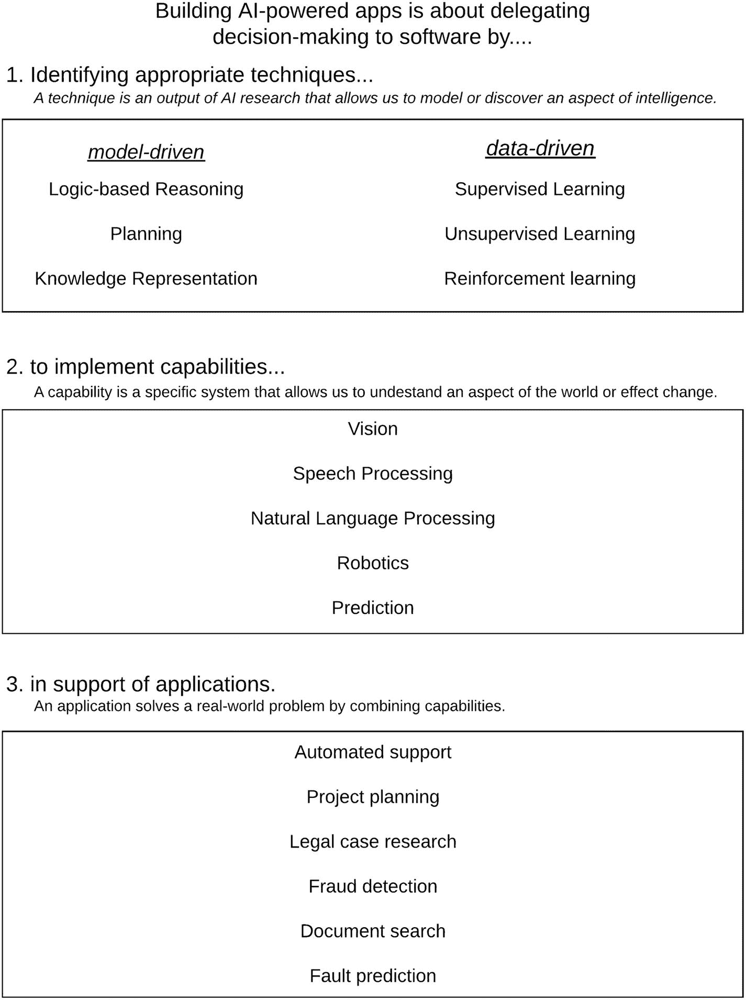

# 3. 构建 AI 驱动的应用

构建一个 AI 驱动的应用意味着什么？在上一章中，我们开始围绕 AI 软件可能表现出的行为类型来塑造我们的思维，例如主动达成目标和自主设定目标。然而，我们并未讨论这些行为是如何实现的。我们有意没有提及任何具体技术。技术当然很重要。但技术也在不断变化。这就是为什么能够在不依赖特定技术的情况下思考 AI 应用至关重要。同时，我们也需要能够考虑可能需要哪些技术，以便做出明智的选择。本章开始为此奠定基础。它将更深入地探讨 AI 驱动应用是如何构建的，并试图以一种希望任何人都能理解的方式来阐述。

AI 是一个发展极其迅速的领域；今天的流行语和趋势未必是明天的。我们可以深入探讨最时髦的机器学习技术，讨论最新自然语言处理发展的细节，或者花无数时间研究最热门的视觉发展成果。但这将是一场必败之战。当这本书到你手中时，这类讨论的内容可能已经过时了。因此，我们将聚焦于一些更有可能比任何特定技术、架构或工具都更持久的基础核心概念。

我们将采取一个广阔的视角，从任何 AI 技术都需要解决的基本问题出发，并呈现一个框架，将事物划分为技术、能力和应用。这个框架能让你在这三个不同领域之间导航并建立联系，从而帮助你做出更明智的选择。

## 人工智能需要什么

在上一章中，我们将人工智能定义为将决策权委托给机器的过程。在本节中，让我们通过一个示例来揭示实现这种委托可能需要什么。

你被指派为公司引入自动化流程。经过评估，公司决定值得将员工提交的费用报销审核流程自动化。现在将由软件来决定报销申请是应被批准还是被质疑。这是财务团队讨厌的任务，但对于确保费用得到控制且只有合理项目通过审核却是必要的。你不知道如何着手，于是决定去与财务团队中负责此项工作的两位同事交谈。

你交谈的第一个人，我们称她为玛丽，她说她们遵循着非常精确的流程。玛丽会查看每张收到的收据，并将其分类为差旅、招待、教育等。然后，玛丽会考虑总花费以及各个明细项目，并将这些信息与提交收据的人当时应该从事的工作，以及围绕其个人和团队在各类别上的最高消费限额的相关规定进行交叉核对。如果所有规定都符合，玛丽就会批准该笔费用。

第二个人，我们称他为多诺万，听完玛丽的描述后惊讶地退后一步说："哇！这真是太细致了，但我发现规定变化太快或太不明确，我根本跟不上。我的做法是评估提交费用的人，根据他们的整体可靠性和提交的总金额快速做出判断。我还会记录哪些人在年终审计时容易在费用方面出现问题。如果他们通常不惹麻烦，而且我认为他们可靠，我就假定他们做的是对的。如果他们经常惹麻烦，我就会驳回申请，让他们自己再仔细检查一遍，以防万一。"

"等等！"玛丽震惊地说。"但那样你最终可能会做重复工作或错误分类。" "是啊，我不否认，"多诺万回答。"这种情况可能发生，有些人会抱怨，但我节省了大量时间，不用纠结于每个小细节，最终整体效率反而更高。"

你离开后思考着听到的内容。玛丽有一套非常精确的规则，并且能准确解释每个决策是如何做出的。多诺万似乎依赖过往数据和历史行为来快速判断是否应该进一步调查。虽然多诺万可能会遗漏一些事情或导致一些重复工作，但整体结果非常高效。玛丽依赖于在任何给定时刻尽可能清晰地理解现行规则，而多诺万则认为规则永远不够清晰，因此他依赖输入（费用报销单）和输出（审计结果）的数据来做判断。

这对你如何构建自动化系统意味着什么？系统需要做出决策。这一点你非常确定。似乎你可以像玛丽那样明确列出所有规则，或者像多诺万那样，以某种方式教会系统查看历史数据并以此为基础做出决策。你的 AI 系统需要一种方法，基于某些输入来确定适当的输出是什么。它需要一种推理世界的方式，但事实证明，实现这一点有多种不同的方法。

好吧，你并不孤单。这正是 AI 研究人员几十年来一直苦苦思索的难题。第一种方法我们可以称之为模型驱动方法。它有一个关于世界如何运作的清晰模型，包含明确的规则和条例来支配它。我们收集所有数据输入点，通过我们的规则集进行处理，然后做出决定。第二种方法则更偏向数据驱动。它认识到我们往往无法明确列出所有规则。我们只知道输入系统的数据和系统输出的数据，然后尝试构建能够复制这种输入/输出关系的程序。我们将无法明确解释为什么某笔费用被批准或质疑，但我们相信数据会指引方向。

或许还有第三种解决费用报销问题的方法。我们可以结合这两种方法，试图在保留模型驱动方法的清晰性和可靠性的同时，受益于数据驱动方法的效率。不过，在我们探讨如何实现这一点之前，让我们先进一步探索模型驱动和数据驱动的 AI。

## 模型驱动与数据驱动的 AI

人们可以从无数个角度来划分 AI 工作。从形式逻辑到统计学、进化或涌现行为方法，再到疯狂而奇妙的深度神经网络世界，描述和组合 AI 技术的方式无穷无尽。然而，或许最重要且最持久的区分之一，就是数据驱动 AI 与模型驱动 AI 之间的区别。

### 模型驱动 AI

模型驱动 AI 描述的是那些依赖于对某个领域、该领域内实体之间的关系以及支配整体行为的规则进行明确描述的技术。

这种方法在需要能够用确定性规则表达的深度专业知识的领域中尤为适用。基于模型的系统的一个例子是使用牛顿经典力学来模拟现实世界中的运动。我们已经有一套清晰的方程，可以帮助我们预测在给定环境条件下，对物理物体施加力将如何导致该物体运动。没有必要寻找其他方式来学习将会发生什么。既然我们对世界上的现象有了足够好的模型，我们就可以直接使用它。

### 所以牛顿定律也是人工智能！？

我很清楚，我一直在挑战你可能通常认为的人工智能的定义。而这正是关键所在。

人工智能并非单一事物。就像数学一样，它是一系列技术的集合。其目标是让我们能够构建机器，帮助我们针对现实世界物体的行为做出有用的推断，并实现决策自动化。最好不要将可能的解决方案范围局限于任何单一技术或技术组。

想象一个世界，在那里牛顿定律不为人知，但令人惊讶的是，数据驱动的机器学习却被深刻理解。仅凭神经网络和数据分析工具，科学家们可以设想记录数十万次苹果从树上掉落的过程来收集数据，以便正确训练一个预测性神经网络模型，模拟苹果落地后如何弹起。而牛顿物理学却能用一组简单易懂的方程做到这一点。这正是模型驱动决策与数据驱动决策之间的区别。^(¹⁹)

在许多领域，我们需要专家来描述决策过程背后的推理。以许多疾病的诊断任务为例。尽管数据起着关键作用，但它需要从一个系统可以使用的医学知识库开始。像 Babylon Health 和 Ada 这样的公司，通过提供大规模自动化初级医疗保健服务来改变医疗格局，它们雇佣专家来构建其医学领域的模型。

当你需要从输入到人工智能系统所做决策之间有清晰的路径时，基于模型的人工智能也至关重要。正如我们将在后面进一步讨论的，重度数据驱动系统面临的最大挑战之一是缺乏从输入到输出过程的透明度。而借助模型驱动的人工智能，这个过程通常要明确得多。

然而，当我们不得不处理那些无法明确陈述我们自己用来得出结果的决策过程的情况时，模型驱动的人工智能就失效了。试试这个实验：你会用哪一套规则来构建一个能够识别猫的系统？

使用模型驱动技术，我们可能会从描述猫是一种四条腿的动物（描述动物的规则是什么？）、有两只眼睛（什么是眼睛？）、一个鼻子和一张嘴开始。猫有毛（除非没有毛），体型中等（除非不是，而且，与什么相比？）。一个基于模型的系统会查看图像，将其分解为线条、形状和颜色，然后与我们提供的关于线条、形状和颜色如何在世界中组合以呈现不同动物的规则集进行比较。

你可能已经猜到，这种方法很快就会崩溃。需要描述的规则太多，边缘情况也太多，以至于模型驱动的方法是不够的。这就是数据驱动的人工智能介入的地方。

### 数据驱动的人工智能

借助数据驱动的人工智能，我们不再描述规则或提供直接的数学公式，而是构建能够自行推导出适当规则的系统。我们基本上退后一步，不再试图对解决方案进行建模，而是构建一个能够自行发现解决方案的系统。它通过分析大量数据来实现这一点，这些数据（最常见的是）已经用我们试图学习的事物的“正确”和“错误”示例进行了标注。原理极其简单，但由此产生的系统却是我们创造过的最复杂的系统之一。

为了训练一个系统正确识别猫，我们向它“展示”大量图片（有猫的和没有猫的），并在它猜对时让它知道。在每一次迭代中，系统都会使用多种技术进行自我调整，以便更有可能再次猜对。这个过程不断重复，直到它能够可靠地正确猜测。

这就是神经网络所做的，经过数十年的研究，我们在架构上已经达到了相当复杂和精密的水平，这意味着在某些领域，我们可以获得令人印象深刻的可靠预测。

在这条道路上，有两个转折点体现了所谓的深度神经网络的成就以及它们运作所需的条件。

#### 站在数据的肩膀上

第一个转折点与数据有关。

2009 年，李飞飞教授和她的团队发布了一个名为 `ImageNet` 的数据集。^(²⁰) 这是一个包含超过 1400 万个对象的注释数据库。该数据集区分特定对象，并将它们归入大约 1000 个类别，例如动物（约 280 万个示例）、鸟类（约 80 万个示例）、食物（约 100 万个示例）和人物（约 100 万个示例）。

`ImageNet` 数据引发了一场年度竞赛，看谁能构建出在预测图像中物体方面表现最佳的算法。

直到 2011 年，表现最佳的算法错误率约为 25%。每四次就有一次出错。随后，一种新算法的引入彻底改变了局面。

#### 给我足够的数据和正确的算法，我就能撬动世界

杰弗里·辛顿和他的团队在 2012 年发表了一篇开创性论文，^(²¹) 其中他们介绍了对深度卷积神经网络的一系列改进。通过这些改变，他们实现了 17%的错误率，这是一个显著的进步。该神经网络拥有 6000 万个参数和 65 万个神经元。它利用了吴恩达等人的工作成果^(²²)（我们在第 1 章中提到过），借助 GPU 来高效处理所有这些复杂性。

这种新方法标志着质的飞跃。在接下来的几年里，错误率下降到了只有几个百分点。一些人欢呼神经网络已经超越了人类（因为人类大约有 5%的时间会出错）。更冷静的人提醒大家，竞赛只需要在 1000 个类别中保持准确，而人类可以识别更广泛的类别以及复杂的上下文。

然而，关键在于，深度神经网络最终让我们达到了一个点，即我们可以足够可靠地做一些有趣的事情，而这是基于模型的人工智能无法支持的。

但这种交易并非没有代价。在此过程中，我们牺牲了很多清晰度和可解释性。我们实际上并不知道那 65 万个神经元为何会以特定方式被激活（而如今的神经网络规模可能要大几个数量级）。没有可以指明的决策链。我们不知道输入数据中的哪些特征是决定特定选择的关键。这可能会带来重要的伦理和法律挑战，我们将在后续章节中探讨。

## 技术、能力与应用

我相信你已经开始意识到，将决策能力委托给软件这一问题的解决，涉及令人眼花缭乱的技术和方法。

为了在思考中建立秩序，并将各种不同的方法纳入一个简单的模型，我将构建人工智能驱动的应用这一任务分解为三个部分。

首先是**技术**，它使我们能够推理世界，要么通过允许我们显式地**建模**智能的某个方面，要么通过帮助我们**发现**它。这些技术分为模型驱动或数据驱动。

技术组合起来提供**能力**。能力是特定的系统，使我们能够理解世界的某个方面或实现改变。能力包括机器视觉、语音处理和自然语言处理等。无论是基于模型、基于数据，还是两者的混合，能力都是机器拥有的“超能力”，使其能够执行某些任务。

最后，能力组合起来形成完整的**应用**。应用是我们最终委托决策权的成品工具。它可以是我们的费用报销审核器、聊天机器人虚拟助手、金融市场预测器等。

技术、能力和应用之间的关系如图 3-1 所示。对我来说，这提供了一种清晰的方式来区分人工智能领域内不同层次的工作。显然，在商业环境中，我们最终关心的是所启用的应用。对于这些应用，我们需要特定的能力——理解和改变世界的特定方式。这些能力之所以成为可能，是因为在人工智能层面，研究人员正在研究从基于逻辑的推理到数据驱动的深度学习架构等各种各样的技术。在关注大局的同时确定重点至关重要。人们常常陷入单一技术（通常是神经网络，因为这是最常被讨论的）而忘记真正重要的是扎实的能力或完整的应用。反之亦然，企业可能要求构建一个应用，却没有意识到必要的能力根本不存在，因此他们需要投资于基础研究，以开发能够带来必要能力的技术。

图 3-1. 从技术到能力再到应用

### 专家与机器协同工作

在接下来的几章中，我们将更深入地探讨其中一些能力和技术，但在深入之前，让我们回到本章需要构建的应用：我们的费用报销审核器。

最终，我们需要的是多种方法的结合。我们需要模型驱动的知识表示，它封装了核心规则和法规。然后，我们可以用数据驱动的决策来支持它，通过参考过去的数据来发现我们的显式模型未能足够准确捕捉的模式。

现实世界的人工智能应用几乎总是模型驱动方法和数据驱动方法的结合。地图技术是我最喜欢的例子之一。想想你手机上的`Google Maps`应用。一方面，它有一个非常显式的道路、建筑以及基于道路信号、限速等从 A 到 B 的规则表示。另一方面，`Google Maps`严重依赖基于数据的预测来推理在一天中的特定时间、结合其他用户的输入等情况下，最佳路线是什么。

每个项目都需要确保理解问题和目标，考虑每天处理该主题的专家的知识，并制定如何最好地利用所有可用工具的计划。如果可以推导出显式模型，它就能提供从问题到答案的最有效路径。然而，有时特征太多、过程太不清晰，以至于只有以数据为中心的方法才能奏效。

在每一步，我们都必须对每种方法的可行性保持现实态度。试图为一个过于复杂而无法用规则描述的情况构建模型，是否是一项徒劳的任务？我们需要多少数据？我们当前数据的状况如何？最终结果有多可靠？我们如何向自己证明我们正朝着正确的方向前进？我们如何通过结合技术来构建解决方案中的故障安全机制？

在接下来的几章中，我们将深入探讨这些问题，同时探索更具体的技术，并讨论如何制定利用人工智能为你的工作场所服务的策略。

脚注 1 2 3 4

