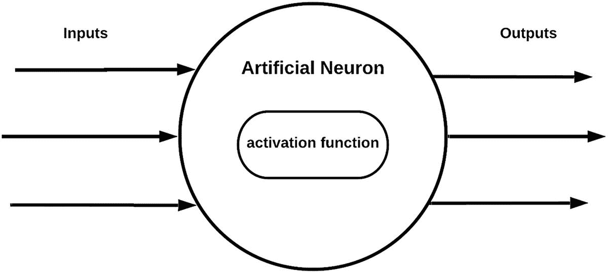
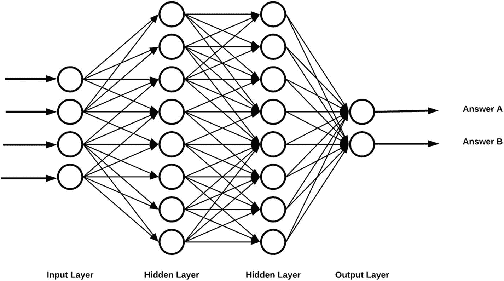

# 4. 核心人工智能技术

一个人究竟如何开始捕捉那些导致我们称之为“智能”行为的过程？更符合我们对人工智能的定义，一个人如何开始编程机器，以便*它们*能够代替我们做决策？

正如我们在第 3 章中已经讨论过的，有两种主要方法。我们可以开发控制系统行为的显式模型，或者我们可以尝试通过分析数据和寻找模式来发现这些模型。在本章中，我们提供了一个非常高层的主要技术概述。理解这些核心技术背后的思考，使你能够推理不同方法的优缺点，以及它们可能对你的产品和团队提出的需求。

人工智能是一个快速发展的领域，感觉每周都有“新”东西出现。这可能会让人认为试图“赶上”是徒劳的；最好把所有事情都交给专家。虽然该领域确实在不断发展，并且设定一个始终保持最新状态的目标是一场必败之战，但同样真实的是，核心概念已经存在了几十年。无论是语义知识建模还是人工神经网络，这些想法自 20 世纪 60 年代以来就已存在。演变的是具体的算法和方法。清晰理解总体概念将在长期内提供最大价值，并让你能够推理出合适的战略方向。

## 模型驱动技术

模型驱动技术是人类智慧的结晶。它让我们审视世界与自身思维，识别出关键核心要素，并以能够进行预测的方式将它们联系起来。由于这些模型是我们大脑精心构思概念的结果，我们能够完全理解它们并向他人解释，这具有极高的价值。当模型驱动技术正确时，它往往是解决问题最高效的路径，因为它精准捕捉所需内容，让我们得以在坚实的基础上构建。想想热力学的基本定律、化学元素周期表或生物学三大法则：这些极其强大的陈述支配着自然界大部分行为方式。

我们在下文回顾的模型驱动技术已在各类应用中活跃了数十年。正是这些技术让企业优化了运输车队的调度协调，带来了更好的网络搜索结果，改进了制造流程，帮助治愈了更多人，以及更多成就。它们并非人们谈论当前 AI 复兴浪潮时通常提及的技术，但在构建能够高效、稳健做出决策的复杂应用时，它们至关重要。

在审视模型驱动技术时，我们将探讨三个核心方面：如何表示信息、如何基于信息进行推理，以及最终如何制定规划。

### 知识表示

知识表示的目标是提供工具和技术，以更便于计算机处理的方式来描述数据。这既涉及单个项目（例如，如何描述一份独立文档），也涉及项目之间的关系（例如，某份特定文档与某个项目有何关联）。

无论你身处何种组织环境，你无疑都会生成会议记录、客户提案、项目报告等文档。通常，你会使用某种文档管理系统来存储所有这些数据。它可能简单到本地网络上的共享硬盘，或是共享的 Dropbox 或 Google Drive 环境。现在，想象一下所有文档都被丢进同一个名为“我们的资料”的文件夹，且命名方式毫无章法：

*   我们的资料
    *   sales-rep.doc
    *   client-abc-preso.pdf
    *   my-cool-thoughts-on-stuff.pdf
    *   projections.xls
    *   …

当文档数量增长到成百上千时，大量组织精力将耗费在从这个混乱的文件夹中搜索所需内容上。

幸运的是，在你的组织中，情况可能更像这样：

*   文档
    *   销售
        *   客户 ABC
            *   演示文稿
            *   报价单
            *   最终合同
    *   项目工作
        *   客户 ABC
            *   项目报告
            *   交付物

仅仅通过管理文件夹结构并制定文档存放规则，你就已经为团队引入了知识表示。这种简单的层级结构使人机和机器都能更轻松地找到信息。

总的来说，知识表示旨在确定一个合适的模型来捕捉我们对世界的认知，并配备操作该模型以推断新信息的手段。

让我们再考虑一个简单的例子。假设你是某大型组织的人力资源部门，每天都会收到数百份来自拥有各种技能求职者的简历。你希望能够根据人们提到的技能自动对这些简历进行分类，以便联系组织内需要评估这些简历的相应领域专家。你有五个高级别分组，名称包括：前端工程师（专门构建数字工具用户界面和视觉方面的人员）、后端工程师（专门从事数据管理、算法和系统集成的人员）、项目经理、质量保证与测试人员，以及站点可靠性工程师（确保所有系统平稳运行的人员）。

然而，你面临一个挑战。人们在简历中用来描述这些技能的术语不断变化，尤其是与这些技能相关的技术也在持续演进。新的编程语言、框架等层出不穷。你如何才能以恰当的方式自动化简历分类流程呢？

你与团队商议后决定构建一个工具，该工具将捕捉用于描述这些技能的术语，并将其与你的高级别分组关联起来。组织内的领域专家将能够使用该工具输入他们感兴趣的关键词，然后软件将参考这些“知识”对简历进行分类。以下是所捕获信息类型的一个示例：

*   前端工程师
    *   核心技能
        *   JavaScript
        *   HTML
        *   CSS
    *   框架
        *   React
        *   Vue.js
        *   Node.js
    *   通用技能
        *   版本控制
        *   测试/调试

恭喜，你刚刚构建了一个基础的知识图谱^(²³)或本体！本体是对构成特定领域的元素、连接这些元素的关系以及基于特定连接进行推理的方式，所进行的更结构化描述。

本体捕捉了我们对世界的理解，其形式多种多样，从简单的同义词词典，到像前述示例那样的层级分类法，再到更为复杂的互联实体网络。知识表示与知识推理技术专注于将我们构建和描述本体之类事物的方式形式化，从而能够以机器可进行推理的方式，捕捉日益复杂的信息类型。其目标是使我们能够根据一组已知事实推断出额外的知识。如果我知道某个东西毛茸茸的、有四条腿、还会发出咕噜声，我能假定它是一只猫吗？一个好的本体应该能告诉你，实际上有一系列动物（很可能都是猫科动物）符合这个描述，因此你不能简单地假定它就是一只猫。

如今，我们拥有丰富而精良的工具集可供使用；大规模的本体及其应用遍布从医学到电子商务的各个领域。本体可以由领域专家“手动”创建和填充，也可以使用数据驱动技术自动创建，以识别和提取相关实体与关系，然后由专家进一步整理。

最终，任何足够复杂的自动化系统——无论是通过正式手段还是非正式的临时实现——都会以机器可操作的方式来表示知识。因此，知识表示与管理成为大多数应用的核心技术。

#### 逻辑

逻辑是我们用计算机所做一切的核心。机器核心处理器的构建模块是逻辑门，它们以多种方式组合，从而产生我们所需的复杂行为。在编程时，我们通常使用谓词逻辑来定义应该发生什么。考虑下面这一行语句：

“如果温度读数超过 25 摄氏度，则关闭加热。”

这是一个使用谓词逻辑来确定在特定环境中如何处理加热的简单程序。现在，想象一下，为了关闭某个东西，比如核电站系统中的一个组件，你需要考虑数百条需要被满足的语句（或命题），而不仅仅是一条。此外，假设这些语句并非简单的“是/否”答案，它们本身可能触发其他进程，并且事情发生的顺序也很重要。你如何才能系统地逐步完成推理过程，并得出一个允许你采取行动的结论？这就是逻辑系统所要解决的问题。

从最广泛的意义上讲，逻辑关注的是提供适当的形式化结构，以推理世界中的不同情境。

存在不同形式的逻辑，它们处理关于世界推理的不同方面。例如，认知逻辑试图解决“已知什么”的问题，特别是共享陈述和信念的智能体群体中“已知什么”的问题。时态逻辑帮助我们推理时间事件和时间的本质。机器需要能够使用这种逻辑来推理诸如“我的闹钟会响 30 秒，除非我提前关掉它；如果我按下贪睡按钮，它会在 5 分钟后再次响起”之类的陈述。道义逻辑则处理什么是合适的、预期的和允许的问题。还有无数其他形式逻辑系统及其组合，它们试图捕捉并编码生活的所有不同方面，以及我们人类每天毫不费力就能处理的事情。

逻辑将在提供我们对更自主或自动化软件所期望的行为类型方面发挥重要作用。考虑以下示例。用户访问一家汽车制造商的网站，并与一个自动对话代理（聊天机器人）互动，以确定他们应该购买哪种汽车。在对话代理的提示下，用户可能会提供如下信息：他们喜欢户外活动，他们有一个大家庭，他们有一只宠物，等等。作为回应，对话代理开始提供一些可能的汽车选项。到目前为止，这并没有什么特别奇怪之处。然而，区别在于当潜在客户拒绝一个推荐选项时。我们基于逻辑的代理能够询问为什么拒绝该选项。例如，用户可能会说：“因为，我认为它装不下我们去山区旅行所需的所有装备。”一个简单的代理无法反驳这个论点，只会继续推荐下一个。然而，一个使用逻辑的代理或许能够提出一个反驳论点。比如：“嗯，您是否考虑过可以折叠后排座椅，或者加装一个车顶行李架，这样就能携带大型装备了？”为了让自动化代理实现这一点，它需要了解汽车的行为方式，并结合能够描述行动效果的逻辑。这样，它就能推断出折叠座椅创造了更多空间，这是一个可以向用户提出的有效反驳论点。能够提供事实和反驳论点的软件可以成为我们更积极的助手，不仅帮助我们完成任务，还能提供如何完成任务的选择。

逻辑还有另一个关键作用。随着自动化接管我们生活的更多方面，我们将必须能够提供更具体的保证，确保它们会以特定方式运行，并且我们可以信任其做出的决策。总的来说，逻辑和基于模型的推理将在帮助我们确保系统安全且值得信赖方面发挥重要作用。

#### 规划

通过知识表示，我们可以描述我们的世界；利用逻辑，我们可以对其进行推理。这很棒，但我们如何启动能够帮助我们实现目标的行动呢？这就是规划发挥作用的地方。

将规划概念化的一种简单方法是想象一个实际的机器人试图找出如何解决问题。想象一个拥有多种不同能力的机器人，例如前后移动（甚至侧向移动）、跳跃、上楼梯、拾取物品并移动它们等等。这些是它可以执行的*行动*，用以改变其在世界中的状态，同时使用*传感器*来理解世界所处的状态。

现在，想象一下，机器人被告知必须将一把椅子从建筑物中的一个点移动到另一个点。这代表了它的*目标*，即期望的事态。它不能只是漫无目的地做事情，直到椅子到达它应该在的位置（这虽然很有趣，但没什么用）。相反，机器人需要制定一个计划，可能包含中间目标以及实现这些中间目标的行动，直到它完成最终目标。一个计划看起来会像这样：

1.  定位椅子
2.  移动到椅子处
3.  拿起椅子
4.  将椅子移动到目标位置
5.  将椅子放置在目标位置

规划软件必须能够提出这个计划，监控其进展，并在情况发生变化时重新规划，例如有人将椅子从其原始位置移开，或者有东西挡住了到达目的地的路。

规划是一个过程，用于识别哪些行动以及行动序列，能够使自动化软件在其当前环境下实现特定目标。

任何曾经体验过“乐趣”——比如必须安排工作、规划活动或行动路线——的人，都痛苦地意识到，随着活动数量的增加、相互依赖关系的出现以及需要不断重新规划，这可能是一项多么艰巨的任务。规划技术使团队能够处理大型工作任务，并通过复杂的约束推理以及成百上千条规则，确保在数千个独立项目之间遵守约束。使用这些技术的商业软件在建造桥梁、发射航天器和生产飞机方面发挥着关键作用。

## 数据驱动技术

关于数据及其所能实现的功能的讨论，占据了人工智能技术领域绝大部分的思考空间。各种愿景声明层出不穷，宣称每一个行为都可以被测量、存储，然后用于预测我们的欲望、需求和意图，并影响我们的下一个行为。有时，数据的使用方式近乎天真幼稚。你点赞了一张朋友骑自行车的照片？那就给你推送广告，让你自己也买一辆自行车！访问了一个卖鞋的网站？我们会在接下来几周内对你进行“重定向”，用同一家网站的广告淹没你（即便你其实已经在那家网站买过那双鞋了，这种情况也屡见不鲜！）。你今天走了足够的步数吗？如果没有，我们明天可能就需要给你一些温和的“推动”，让你能赶上进度。

对数据时代持愤世嫉俗的态度很容易（尤其是如果你像我一样，对大多数事情都倾向于持怀疑态度的话！）。然而，重要的是不要低估数据驱动技术现在和未来对我们的重要性。虽然模型驱动技术能带给我们确定性和安全性，并展示人类直觉如何能穿透噪音，凭借基本规则专注于真正重要的事情，但数据驱动技术则将我们从自身心智所能发现的局限中解放出来，赋予我们一种超能力：能够在事先不知道如何创造的情况下创造出某些东西。我们建造机器，让它们为我们探索和创造。也许在其中的某台机器里，最终会包含我们迫切需要的、用于修复气候和治愈身体的大部分答案。

在思考数据驱动技术时，我决定避免罗列各种架构和方法的长篇清单，况且它们也在不断演变。网络上信息浩如烟海，如果有人想深入研究，很容易就能找到大量优秀的例子。相反，我想强调的是三种核心方法及其相对差异。我们将探讨如何通过机器学习，使用监督学习、无监督学习和强化学习来发现模型。唯一的例外是，我们会简要介绍一下人工神经网络和深度学习。严格来说，它们可以被归类到监督学习或无监督学习之下，但由于它们被频繁提及，因此值得直接讨论。

### 监督学习

目前，大部分应用机器学习都集中在监督学习技术上。监督学习试图使用已经标记好的数据来构建模型。这里的“监督”指的是参考这些标签，以向算法指示其预测是否正确。通过一个迭代过程，算法不断调整其决策方式，你希望最终能得出一个可作为可靠预测器的模型。

监督学习指的是算法使用已标注数据（即已提供“正确”期望答案的数据）的技术。在训练过程中，响应是*被监督的*，算法会被告知其答案是否正确。这些信息被用来调整模型。

让我们通过一个例子来突出监督学习过程的关键阶段。假设你面临更新公司文档库的任务。经过几次并购、软件升级和人员变动，你的文档库已经一团糟。你知道那里有宝贵的历史数据，但你无法恰当地整理这些文档。你决定，第一个有用的步骤是将这些文档按对每个人都有意义的宽泛类别进行分类（例如，销售文档、项目报告、团队评估）。

在监督学习过程中，你通常需要经历以下几个阶段：

*   收集并准备数据。
*   选择合适的机器学习算法并进行微调。
*   使用上一阶段得到的模型进行预测。

让我们逐一考虑每个阶段。

#### 收集和准备数据

你已经费了九牛二虎之力，求了很多人，才把所有文档集中到一个地方。永远不要低估仅仅获取数据这件事可能有多复杂。部门流程、内部政治、对监管的恐惧，以及许多其他因素，很容易在你开始之前就终结你的自动化梦想。在投入其他资源之前，仔细规划这个阶段总是值得的。没有什么比让一位高技能的机器学习专家或数据科学家干等着，而你却需要再开一个会议来确定该找谁去获取数据更没效率的了。不过，你是幸运儿之一。你的数据都在那里。所有文档都准备好被分类了。

在监督学习场景中，你需要选择一部分数据并进行适当的标注，以便用于训练。你需要识别出能够帮助确定文档类型的关键特征（标题、摘要、作者、部门、日期、词频^(²⁴)等），然后用正确的答案或目标变量对你的数据进行分类。请注意，这些决策中的每一个都伴随着一系列复杂的考量。你是否选择了具有适当代表性的数据子集？如果没有，那么你的模型将无法在整个数据集上正确运行。你可能引入了多种不同的偏差，因为你的模型会偏向于与训练数据相似的数据。假设数据具有代表性，你是否选择了合适的特征集来关注？选择错误的特征同样会导致不必要的偏差。整个机器学习社区正在制定最佳实践来防范其中一些问题，但不存在万无一失的方法。这需要耐心和经验，你需要真正拥抱失败并将其视为学习——你正在探索一个未知的世界，并使用软件来帮助你构建一个理解它的模型。像任何探索者和科学家一样，你需要接受随之而来的固有风险。当然，这个过程最终回报巨大。成功地将一项艰巨的任务自动化，会为你的组织带来显著的竞争优势。

#### 选择机器学习算法、训练与微调

手握数据后，你的下一个任务是确定应使用哪种机器学习算法来构建预测引擎。正如我们之前提到的，数学、统计学或计算机科学领域有众多选择，而新的方法和架构正以惊人的速度被发明出来。机器学习专家的任务就是，针对你的具体问题和数据类型，识别出最有效或最有前景的方法。再次强调，你需要牢记，不存在简单的答案或一套简单的步骤就能得出答案。选择和优化机器学习架构是一个不断实验的过程。对于我们的文本分类问题，解决方案可以从像`朴素贝叶斯`分类器这样“简单”的方法，到复杂的卷积神经网络架构，再到专门为你的数据集创造的全新方法。一个好的经验法则是先尝试简单的方法，只有当你确信额外的努力能带来合理的潜在收益时，才考虑增加复杂度。典型的问题是，为了获得假设中额外 2%的性能提升所付出的成本，是否值得。

训练是将数据输入算法的过程，允许算法在寻找能够提供正确预测的“组合”时，调整其各种“权重”。标注数据通常被分为训练集（即实际用于开发模型的数据）和测试集（用于验证模型）。即使在这里，你也能看到在训练集和验证集之间合理分配标注数据是多么重要，这样才能使它们都能很好地代表模型需要处理的数据混合情况。

微调模型（通常也称为参数调优）是调整影响机器学习算法行为的因素，以观察这些调整可能对结果产生什么影响的过程。你可能会改变训练数据通过的次数，或者改变在任意给定点上错误预测的重要性，以及它应该对参数变化产生多大影响。再次强调，我们需要接受这是一个实验过程，你需要不断重新评估在整个过程中值得投入多少精力。

#### 预测

最后，通过机器学习获得了可工作的模型后，我们就可以部署它，并对全新的数据进行预测。机器学习模型通常进行两种类型的预测。一方面，你有分类任务，例如我们对文档进行分类所需的任务。输入文档会根据模型认为其讨论的内容被分配一个类别。另一方面，你有所谓的回归任务。一个典型的回归任务是根据一些输入特征来预测特定项目的价值，例如根据房屋的位置、面积、户型、其他特征等来预测其价值。

### 无监督学习

如果你的数据没有任何标签，会发生什么？首先，有些事情你根本无法教会算法。不向它展示一只猫，你就无法教会它什么是猫。话虽如此，算法在发现数据中潜在的相关性或分组方面可以做很多事情，这能让我们学到一些东西。

无监督学习分析数据以发现可能的分组或关联，无需任何标注数据。

一个典型的应用是将其用于将数据集分割或聚类成紧密相关的组。例如，无监督学习可以应用于客户购买数据，以识别你的客户群是否可以分成若干组，从而为你提供关于该组的一些见解。类似于“购买产品 A 的客户也倾向于购买产品 C”或“购买产品 D 的客户往往都来自某个特定地理区域”。

无监督学习有时也与监督学习结合使用。在适当条件下，可以使用包含标记和未标记数据的混合训练数据来生成模型。简单来说，你可以认为无监督学习为我们完成了一些潜在的分类工作，然后与监督学习相结合。尽管总的来说，这应被视为一种相对有风险且不可靠的策略，但关于它的研究正在不断增长且前景广阔。在未来几年，无监督学习将开始扮演越来越重要的角色，因为机器学习工程师们始终面临着一个问题：通常拥有大量数据，但标记数据却不够。

### 强化学习

最后，我们来到强化学习，它是机器学习三兄弟中最有趣的一个。强化学习最接近人们直觉上对自然界中训练与学习的理解。

当我们训练宠物做某事，比如听到呼唤就过来，或听到指令就坐下时，我们并不会向它展示大量关于“过来”或“坐下”的正确与错误示例！相反，我们会尝试引导宠物做出我们期望的行为，一旦它做到了，就给予丰厚的奖励。这种奖励强化了“这是正确行为”的认知。我们不断重复这个过程，直到宠物明确地将“过来，麦克斯！”这样的特定指令与奖励，并最终与期望的行为联系起来。同样，并且希望是经过深思熟虑的，当发现错误行为时，我们会惩罚宠物（理想情况下，不过是用严厉的声音或锐利的眼神）。这教会了宠物哪些是不被期望的行为，因为它们会导致惩罚而非奖励。

这些正是强化学习带入数字世界的原则。通常的设置是：定义一个某种环境，智能体可以在其中行动，而环境设计者在达到期望状态时提供惩罚或奖励。研究人员在训练智能体时可以采取多种方法，例如持续提供反馈，或者仅仅在游戏结束时给予奖励（或惩罚）。例如，你可以让一个智能体下国际象棋，除了教它如何移动棋子之外，不教它任何关于国际象棋实际运作的知识，只在游戏结束时提供反馈。智能体可以运行数百万局游戏，这意味着即使它最初对游戏一无所知，最终也可能偶然发现一种有趣的、能导致胜利的棋局策略。

强化学习的重大时刻出现在谷歌成功构建了`AlphaGo`系统，该系统击败了围棋世界冠军。围棋被认为比国际象棋难解决得多，因为智能体可能处于的状态多得多，这使得持续计算和搜索下一步最优棋步几乎成为一个棘手的问题。因此，在 IBM 的`Deep Blue`征服国际象棋之后，许多人工智能研究者将目光投向了围棋。最终，谷歌 DeepMind 团队获胜了。他们结合了监督学习和强化学习来训练深度神经网络，并辅以新颖的搜索策略^(²⁵)，从而提出了获胜的方法。有趣的是，这种技术组合意味着`AlphaGo`能够比`Deep Blue`更具“战略性”，后者依赖于更暴力的技术，即评估从特定位置出发的所有可能对局结果。此外，`AlphaGo`通过监督学习和强化学习发现了正确的下法，而不是依赖提供给它的更明确的评估函数。

强化学习对于人工智能研究来说仍然是一片非常肥沃的土壤，还有许多东西等待我们去发现。虽然赢得围棋等游戏是为了追求人工智能研究的重大挑战，但它在从机器人技术到制造业、交通运输、交易等众多行业中都有着非常实际的应用。

### 深度学习与人工神经网络

深度学习（DL）和人工神经网络（ANN）是在人工智能语境中被频繁提及的术语，因此有必要在此澄清它们的确切定位和本质。首先，让我们明确，人工神经网络是实现监督学习或无监督学习的一种方式。还有其他几种方式可以实现这一点，但人工神经网络是近年来最令人兴奋的发展领域，也是取得诸多进步的源泉。

人工神经网络的基本前提是，做出决策的方式是将数据输入到一个由多层连接的“神经元”组成的网络中。^(²⁶) 每个神经元接收一个输入，通过与该输入相关的*激活*函数（一个给定若干输入后能给出输出的方程）进行处理，然后沿着一条加权路径，向下一层中与之相连的一个或多个神经元触发后续输入。见图 4-1。

图 4-1. 单个人工神经元

大体上，每一层都专门负责识别输入信息的某些特征，并将这些信息前馈给后续的层。内部可以有任意数量的神经元和层，但最终都会导向一个输出层，在该层中，最终被激活的一组神经元将为我们提供答案。见图 4-2。

图 4-2. 具有多个隐藏层的人工神经网络

当我们训练一个人工神经网络时，我们使用一个训练模型来操纵与每个神经元上各个激活函数相关的参数（或偏置），以及神经元之间连接的参数，直到最终层开始提供期望的结果。这些参数在每个训练周期后如何变化，以及这一切最终如何导向一个好的结果，正是深度学习专家们关注的焦点。

深度学习是一个总括性术语，用于描述使用人工神经网络的技术，通常采用高度多层化的架构，其中层可以向前和向后连接，并且多种架构可以组合成一个整体。

深度学习技术的主要优势在于，它们显著减少了确定需要向人工神经网络输入哪些特征以进行训练的需求。例如，如果你试图训练一个模型来正确识别人脸，你可能会先将图像中的物体分解为基本的几何形状，然后将这些信息输入到人工神经网络中。而使用深度学习，这项工作将由网络本身完成。我们只需输入所有原始数据：图像中每个像素的值。人工神经网络将根据其架构和训练数据自行提取特征，每一层“学习”一个特征，后续层则将这些特征聚合为更高层次的概念。

然而，这里有一个问题：我们需要*大量的数据*才能发现合适的特征。此外，最终得到的网络对我们来说非常不透明。我们并不确切知道它决定“关注”图像的哪些部分，从而将一张图像或图像的一部分归类为猫而不是狗。事实上，人工智能文献中充斥着有趣的例子，说明人工神经网络如何会出错，或者只关注极少数特征，从而导致非常脆弱的解决方案。这就是输入数据非常重要的原因。例如，假设你想区分不同的物体，比如汽车和自行车。如果你向人工神经网络展示的所有汽车图片都是城市中的汽车，而所有自行车图片都是乡村中的自行车，那么当你向它展示一辆乡村中的汽车时，你的网络很可能无法正常工作。它很可能将出现多棵树或大量绿色作为判断某物是自行车的指标，就像它会使用物体本身的特征一样。

