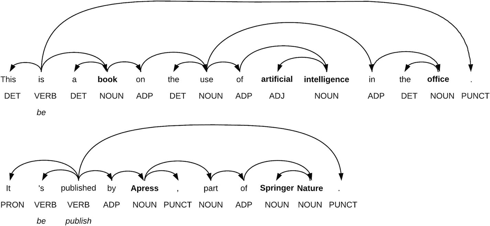

# 5. 核心人工智能能力

在上一章中，我们看到有许多不同的技术可以用来建模智能行为的各个方面，并且可以组合使用。然而，仅凭这些技术本身，我们无法走得很远。这些技术只有在能够让我们完成特定且明确可辨的任务时才有价值：例如将语音转录为文本、对文档进行分类，或识别图像中的物体。为了实现这些任务，我们通常需要将多种技术组合成能力。

人工智能能力代表了我们能够更好地理解世界并对其施加影响的具体事物。它们类似于人类的感官。人类能够看、听、闻、触摸和品尝。每一种感官都涉及多个子系统（技术），这些子系统组合起来提供最终的结果。

以视觉能力为例。光线穿过我们眼睛的角膜和晶状体，在感光细胞上形成图像。从那里，通过视神经到达我们大脑的初级视觉皮层。信息在那里被再次处理，并最终映射到特定的概念。我们运用不同的技术来收集光线、转换光线并处理结果，以支持单一的视觉能力。

在本章中，我们将重点关注三大类能力，它们代表了我们在工作环境中遇到的最常见类型。它们也是最有可能在任何工作环境中立即带来益处的：

- 理解和操作语言（包括语音和文本）以及生成语言的能力

- 操作图像、对图像进行分类以及识别图像中特定物体的能力

- 结合组织特定知识和数据，以创建组织特定能力——我们自己的*超能力*，这些能力对于其他人来说极难复制

本章旨在让你对这些能力如何运作有一个高层次的理解，并提供其应用示例，从而揭开这些过程的神秘面纱，让你能够更清晰地思考如何在自身工作环境中利用它们。

## 语言

语言是组织应尽可能利用的关键能力。作为知识工作者，从很多方面来说，我们的货币就是文字。无论任何办公室活动的最终结果是什么，与同事协作和分享想法的方式都是通过语言。

语言具有一些迷人的特质，从一开始就需要一种丰富且跨学科的方法。这里不可能涵盖所有挑战，但我认为考虑其中几点是有益的，以便更好地理解任务的规模，并认识到已经取得了多么惊人的进展。

首先，显然需要处理多种语言。幸运的是，不同的语言呈现出若干相似的特征，这意味着为处理一种语言而开发的技术通常可以应用于其他语言，主要限制在于我们想要分析的语言是否有足够大的可用数据集。然而，语言并非一成不变。今天英国所说的英语与过去几个世纪大不相同，而美国或澳大利亚所说的英语与英国英语也存在显著差异，以至于可能需要不同的语言模型和数据集。语言从一个领域转移到另一个领域时也会发生变化。如果两位土木工程专家旁听两位航空航天工程专家的对话，他们可能理解大部分单个词汇，但整体含义对他们来说将是缺失的。词汇被赋予新的含义，引入了缩写词，而且很多时候，尤其是在口语中，会使用只在非常特定的语境和时间段才有意义的俚语。我敢肯定，如果我让我父亲“给我发个 Slack”，他会一脸困惑，但如果我说“给我发个 Skype”，他会明白，并很可能回答：“我们干嘛不用 FaceTime 呢？”

此外，还有理解我们说话内容并将其转录为文本的问题。我们的口音、空间的声学效果、我们是否感冒、背景噪音，或者其他人同时说话，所有这些因素都会影响到达机器的声音，机器需要从中分离出它关心的特定数据并将其转换为文字。再次强调，这不仅仅是忠实地将声音转录为文字。我们说话时的*结构*方式也不同。我们会加入“嗯”和“啊”，并以奇怪的方式停顿和开始，这些方式在某种程度上对我们来说都很有意义，但与我们写作的方式不同。

正如你所见，挑战是巨大的，而我们现在拥有现成的人工智能工具，能够识别语音、将其转录为文本、理解其含义，甚至生成语言，这真是令人惊叹。我们还没有解决所有问题，但我们已经解决了足够多的问题，使得这些工具可用于开发基于人工智能的应用程序。

在下一节中，我们将简要探讨这一切在语音识别、自然语言处理（NLP）、翻译和自然语言生成方面的影响。

### 语音识别

语音识别涉及我们将说话时产生的声音转换为文本的能力。它通常也被称为`ASR`，即自动语音识别。这本身就是一个完整的研究领域，融合了一系列令人惊叹的技术。

一个`ASR`系统首先通过麦克风拾取我们的声音信号。该信号经过清理和处理，旨在仅分离出代表人类声音的频率。这些模拟连续声波随后被采样并转换为所谓的*语音帧*（几十毫秒的采样波形信息）。语音帧随后用于帮助我们理解用户发出了哪些*音素*。音素是组合成单词的声音单位，用于区分不同的单词——相当于语言学家所说的语法音节。语言学家定义了每种语言的具体音素及其组合成单词的方式；这些知识随后被`ASR`系统使用。这些信息再与发音模型和语言模型（如今主要基于深度学习）进一步结合，以生成最终的文本。

语音识别系统，尤其是在改进的神经网络算法带来巨大提升之后，提供了令人印象深刻的准确率（所有主要科技公司都报告达到人类水平或更优的准确率，错误率接近或低于 5%）。然而，这并不意味着我们可以假设它们能轻松应对任何情况。需要考虑具体的上下文，并对使用语音识别解决特定问题的可行性进行现实评估。你可能已经注意到，语音助手在挤满说话者的拥挤房间里效果不佳，而在隔绝外部噪音的汽车中则表现得更可靠。

话语领域也非常重要。这里有一个非常简单的实验，你可以自己尝试，以了解它如何影响语音识别。调用你智能手机上的任何语音助手，无论是 Siri、Cortana 还是 Google Assistant。首先，尝试告诉它们一些可能在工作场景中使用的、带有领域特定术语的句子，然后尝试一个关于处理更普遍生活任务的日常短语。查看文本转录结果，看看各自的准确度如何。

我使用了以下与工作相关的句子：

“*任务 1 的高层目标是创建一个聊天机器人，能够帮助用户搜索通过联合搜索服务访问的多个文档库。*”

这是一个相对友好的测试。其中有一些领域特定的关键词，但并非过于晦涩。我相信作为读者的你，对单个单词不会有困难，尽管你可能对整体含义有些疑问；例如，什么是联合搜索服务？

Google Assistant 返回的结果是：

“*任务 1 的高层目标是要产生一个聊天但表格以协助用户搜索通过联合搜索服务访问的多个文档库。*”

Siri 给我的结果是：

“*任务 1 的高层目标是制作一个黑板，能够协助用户搜索通过联合搜索服务访问的其他多个文档库。*”

这些努力值得赞赏，但不太实用。

然而，如果我尝试以下句子：

“*提醒我送孩子上学，然后去取杂货，路过药店，再和朱莉娅吃个晚早餐。*”

Siri 一字不差地正确识别，Google Assistant 也是如此。我甚至不需要像前一个例子那样刻意清晰地发音。

显然，它们恰好在其设计用途上表现出色：帮助我们处理日常生活，而不是转录领域特定信息。毫不奇怪，领先的转录软件公司之一 Nuance 为法律、专业和执法等不同行业提供了不同的软件解决方案。每个解决方案都宣传其已针对该行业的特定词汇进行了训练，这正是因为这是在该行业有效运作的必要前提。

总之，尽管语音识别已经取得了长足进步，但对其当前能提供帮助的领域保持现实看法仍然很重要，尤其是在办公环境中。如果我们想用语音向机器发出简单的命令或指示，它可以非常有效且训练起来不那么费力。在这些情况下，我们只说出带有特定意图的较短短语，例如“打开 Microsoft Word”或“呼叫我的 HR 联系人”。如果我们试图用它来转录带有领域特定（尤其是大量缩写）内容的复杂短语，则会更具挑战性。

### 自然语言处理

通过语音识别，我们从声音转换为文本。但一旦我们有了文本，我们如何理解可以用它做什么呢？这就是`NLP`发挥作用的地方。让我们看看一些关键阶段，以了解其可能性，并激发如何在自己的工作环境中使用它的灵感。

#### 分析与实体提取

第一阶段通常是对我们要理解的文本进行句法分析，以及所谓的实体提取。考虑一个简单的短语，例如：

“这是一本关于在办公室中使用人工智能的书。它由施普林格·自然旗下的 Apress 出版。”

首先，我们需要将文本分解成其各个组成部分；理解什么构成标点符号，什么不构成，以及这如何影响句子结构。

使用 Google 的`NLP`演示，我们得到了如图 5-1 所示的分析结果。

图 5-1. 使用 Google 的`NLP` API 对短语进行句法分析

你可以看到其中涉及不少内容。`NLP`系统已成功识别出所有不同的单词，包括我们使用撇号的地方，例如“it’s”。它还能识别名词、动词、标点符号、形容词等。

实体提取能够告诉我们，*书*、*Apress*、*施普林格·自然*和*人工智能*都是这段文本中的显著实体，并且对于某些实体，例如“施普林格·自然”和“Apress”，它能够指出它们是组织，并提供指向其网站的链接。

仅凭这些信息，我们就可以开始思考由`NLP`驱动的搜索，它可以比仅比较字符串而无任何上下文信息的“普通”搜索有效得多——例如，这种搜索能够区分何时提到特定组织（如苹果公司）与仅仅指水果苹果。想象一下，能够搜索你的文档库，然后像在 Amazon.com 上按不同品牌筛选一样，按特定公司、产品或同事姓名进行筛选，而无需事先费力地标注这些文档。`NLP`系统可以为我们完成繁重的工作。

#### 分类

这份文档是关于什么的？是销售报告、会议记录，还是争取新合同的提案？文档中表达的情绪是积极的、消极的还是中性的？内容是否敏感或可能具有冒犯性？

分类，特别是符合你特定需求的分类，是自然语言处理（NLP）最常见的应用之一。

NLP 工具在这方面已经变得尤为擅长，好消息是，即使只有极少的专业知识，也已经可以训练出针对你所在组织的专用分类器。之所以能做到这一点，是因为你可以基于现有的语言模型（这些模型是在更大的数据集上训练好的）来构建分类器，并通过基于规则的分类或作为现有模型上层的数据驱动方法，对其进行专门化处理。

#### 意图提取

当我们使用语言进行交流时，尤其是在请求别人为我们做某事时，我们的话语可以映射到特定的意图。例如，如果我说：

“你能把窗户打开吗？”

意图非常明确。我在请求别人为我打开窗户。

然而，我也可以说：

“太热了；你能让点风透进来吗？”

虽然我没有明确说“打开窗户”，但意图是一样的。

意图提取的任务是帮助我们理解话语中传达了什么行动。可以想象，它在驱动聊天机器人的对话引擎中尤其重要。它们需要能够将我们人类表达某事的无数种方式映射到特定的回应或行动上。此外，它们还需要在考虑上下文信息的同时做到这一点。思考以下对话。

*   人类：“我想要两个披萨、一杯可乐和一些蒜香面包。”

*   机器人：“谢谢，您想要什么口味的披萨？”

*   人类：“一个意式辣香肠披萨和一个玛格丽特披萨。哦，把可乐换成雪碧。”

对我们来说非常简单的对话，对机器人来说却是一个相当大的挑战。它询问了用户披萨的口味，但同时也获得了关于更改饮料订单的信息。它需要理解用户说出的这句话包含了两个意图，第二个意图是对之前关于饮料那句话的引用，并且是要把现有的可乐换成雪碧！

如今，有各种各样的工具可以帮助组织开发能够处理此类对话的应用程序，像前面这样的问题可以在定义明确的领域内得到解决。关键在于要清晰地权衡意图提取和对话在哪些方面最有效。这需要在待解决的 NLP 问题的复杂性与解决方案将产生的价值之间取得平衡。

#### 翻译

我们可能都见过人工智能驱动的翻译在工作。正是它让 Twitter、LinkedIn 和 Facebook 上的“查看翻译”链接成为可能。也正是它驱动了谷歌浏览器的翻译功能，可以翻译整个网页。

根据谷歌研究，自动翻译系统正在接近甚至超越你期望从人类翻译那里获得的翻译质量。不过，对这些说法保持审慎的怀疑态度很重要。那些“情况”很关键。如果我们处理的是单个单词、短句或内容简短、概念不太复杂的网页，自动翻译可以做得非常出色。然而，概念越复杂，文本层次越多，翻译的效果就越差。

最近在韩国举行的一场比赛中，自动翻译系统与专业翻译人员分别将韩语翻译成英语以及将英语翻译成韩语，比赛得出的结论是，大约 90% 的自动翻译文本“语法别扭”，无法与熟练翻译人员的产出相提并论。

因此，我们之前讨论过的相同局限性在这里也适用。通用的自动翻译能力令人印象深刻，但领域越具体，翻译模型的效率就越低。如果我们处理的是单个单词、简单命令或短文本，自动翻译提供了一条可行的途径。对于更复杂的场景，组织需要评估可用的工具，并考虑如果市面上的翻译工具不够用，他们可以在哪些方面投资开发自己的工具。

#### 自然语言生成

自然语言处理的镜像就是新文本的自动生成。

如果信息以适合我们的叙述方式呈现，我们更有可能消化信息并理解其含义。我们都经历过面对成片成片的表格数据时大脑一片空白的感觉。即使是更赏心悦目的图表，看久了也会觉得千篇一律。我们在乎的是那些表格和图表所讲述的故事。自然语言生成（NLG）允许我们输入结构化的、带标签的数据，并最终得到一个围绕这些数据提供恰当叙述的自然语言文档。

NLG 的一个特别优势是，它可以从单一数据集生成多种叙述，并根据特定情况进行调整或个性化。以金融数据为例。分析师需要根据某家公司的业绩报告或某个特定领域的数据发布，为其所有不同的客户提供报告。在这个例子中，输入可能是类似公司年度报告和特定客户的投资组合状况这样的内容。然后，NLG 系统可以生成一段叙述，描述发生了什么以及它如何影响特定的投资组合。

NLG 系统要生成最终的结构化文档，需要执行多个层次的分析。它需要确定在生成的文档中应该提及哪些相关的输入数据点。例如，公司是盈利还是亏损？最大的支出是什么？销售主要来自哪里？然后，NLG 系统会操作一个可以想象成非常复杂的模板，该模板提供了关于整个文档结构和单个短语结构的规则。最终结果是一份不仅语法正确，而且结构方式让我们读起来舒适自然的文档。

另一个例子是天气预报。从单一的天气数据集出发，新闻机构可以为其所有分支机构生成本地化的天气预报，而无需撰稿人逐一分析数据并构思合适的叙述。

在组织内部，NLG 正越来越多地被用来围绕公司的报告情况提供叙述，这种方式比图表和纯数字报告更高效、更有影响力。这对于那些没有能力自行进行必要数据分析的用户来说尤其有用。

## 视觉

视觉是指机器处理视觉数据并恰当解读的能力。其范围可从"简单"如扫描条形码，到识别照片中的物体。

正如我们在第 3 章中讨论的，图像解读方面的进步为人工智能更广泛的应用打开了大门。解锁正确解读图像的能力，催生了众多应用，从自动驾驶到更好地监测和管理大面积农作物的生长。

支持数据驱动模型（绝大多数是深度学习模型）训练的工具集，可能是人工智能各项能力中发展最为成熟的。这得益于机器视觉领域投入的巨量工作，以及深度学习架构在处理原始图像数据方面的适用性。

目前已有强大的工具可以对图像进行标记或注释，进而用于训练模型。毫不意外，在工作环境中存在多种应用可能。

- **身份验证与授权**：人脸识别可用于识别人员身份，并授予进入办公场所的权限。但这并非没有挑战。它可以提供更无缝的体验，并在适当条件下营造更

# 人工智能能力

人工智能能力是你理解和操控环境的方式。语言、视觉等核心能力为各类组织提供了广阔机遇。如今已有易于使用的工具，使得入门门槛很低。挑战在于如何识别最有效的应用方式，同时清醒认识到其局限性。最终，这些核心能力将成为每个人工具包中的一部分。关键在于现在就要培养有效运用这些能力的技能与经验，从而抢占先机。

## 定制化能力

此外，你可以开始思考能够开发哪些定制化能力。这些组织"超能力"可以专属于你，因为它们完全取决于你如何利用员工的创新能力，以及你对世界的理解（你的知识与数据）。随着人工智能驱动的应用日趋成熟，这些定制化能力将变得愈发重要，因为它们才是实现真正差异化的关键。

脚注 1 2 3 4 5 6 7 8 9 10
