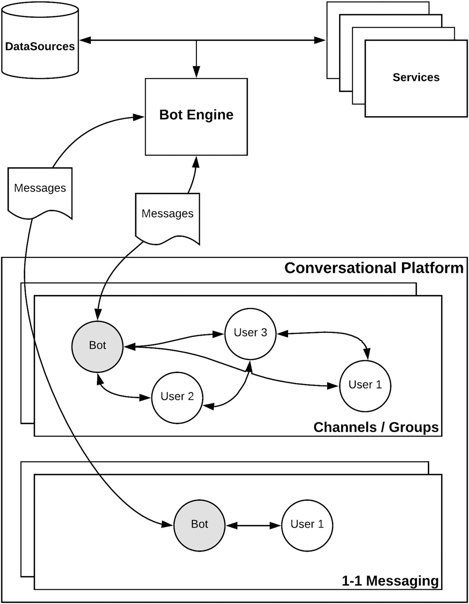
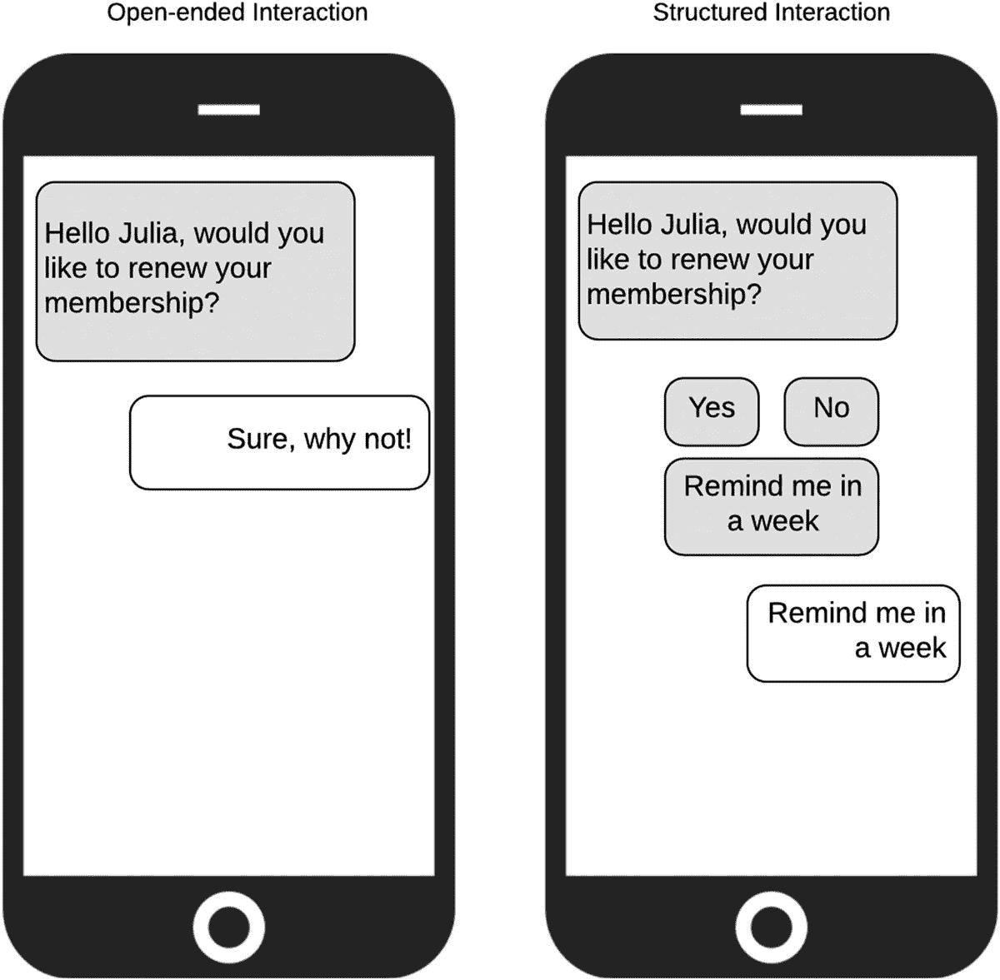
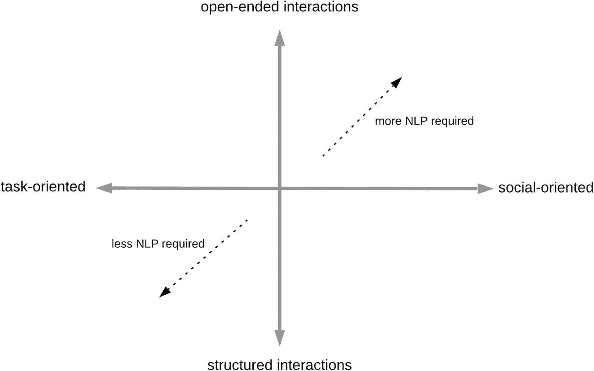

# 9. 对话式应用

2016 年，微软 CEO 萨提亚·纳德拉宣称“机器人就是新的应用程序”。^(⁴⁵) 当时，全世界正对聊天机器人所能实现的功能充满乐观。很明显，消息应用的增长速度超过了社交媒体，而用户正遭受应用疲劳。^(⁴⁶)

聊天机器人看起来是公司将自己定位在用户所在之处（即消息应用内）的理想方式。此外，由于添加聊天机器人就像在消息应用中添加任何其他联系人一样简单，这意味着你无需单独下载和安装其他东西。

其他人则更进一步，宣称*网站*也大势已去。当你可以直接在 Facebook Messenger 上与品牌对话时，为什么还要有网站？聊天机器人将接管世界，没有什么能阻止它们。

到了 2018 年，人们的态度发生了变化。聊天机器人即将接管世界的局面并未真正实现。网站依然运行良好，手机上的应用也是如此。人们与聊天机器人的互动足够多，以至于意识到它们其实并没有那么智能。实际上，相当多的聊天机器人效率低下，遇到最轻微的问题就会出错。发生了什么？

嗯，聊天机器人技术和其他任何技术一样，经历了一个自然的成熟周期。最初让任何事物获得发展动力的热情，遭遇了现实世界的严峻问题。由于还没有成熟的最佳实践，人们尝试了不同的方法。就像 20 世纪 90 年代末和 21 世纪初的网站一样，我们添加了相当于闪烁光标和旋转 GIF 的东西。每个人的做法都略有不同，用户则试图弄清楚到底发生了什么。不可避免地，人们感到失望，有些人退出了。

然而，与此同时，实践者从错误中吸取了教训。会议和聚会得以举办，经验得以分享。一些人挺过了艰难时期，过程重新开始。但这一次，经验和调整后的期望可以带来更实际的应用。

到 2019 年，聊天机器人不再被视为所有数字事物的救星。更明智的是，它们被视为另一种有用的工具，需要谨慎应用。我自己的聊天机器人经历也遵循了这一轨迹。我记得 2016 年与蒂姆·迪森（我现在在 GreenShoot Labs 的联合创始人）坐下来讨论哪些技术值得探索。聊天机器人和对话式 AI 在我的清单上名列前茅。到 2017 年，我们决定是时候做些实际的事情了。我们开始构建一些实验性的聊天机器人，看看这项技术能做什么，并与客户讨论各种可能性。

在接下来的一年里，我们了解到，尽管面向消费者的聊天机器人活动很多，但企业聊天机器人也存在一个非常有趣但探索较少的机会：专门为帮助组织内人员完成工作而构建的机器人。我们继续为 Slack 构建了一个产品，一个名为`TeamChecklist`的机器人，它允许用户存储有用的清单并作为团队进行管理。通过这个过程，我们发现了聊天机器人有多少种不同的应用，但也澄清了我们关于如何思考这个领域的想法。

最终，我们构建的更有趣的产品不是`TeamChecklist`，而是我们用来构建`TeamChecklist`的工具！`OpenDialog.ai`是一个开源对话管理平台。它表达了一种非常具体的设计和构建聊天机器人的方式。GreenShoot Labs 最终转型为一家对话式 AI 咨询公司，帮助客户找出适合其特定情况的解决方案，并在需要时使用`OpenDialog.ai`来实施这些解决方案。

在本章中，我们将介绍一些支撑我们对应用理解的观点，这些应用使用：

1. 对话作为其主要交互范式
2. 对话式 AI 为用户提供更自然的消息交换方式

与所有其他章节一样，我认为清晰理解概念及其之间的关系对于制定有效策略至关重要。

## 从聊天机器人到对话式应用

聊天机器人的问题之一是缺乏清晰的定义。这种“身份”问题的核心在于，将围绕人工智能使用的问题与人与机器之间的交互模式混为一谈。当人们尝试某种“像人一样”回应的事物时，几乎本能的反应就是测试其回应能力的极限。承认吧。我们都曾摆弄过`Siri`或`Google Assistant`：问它们一些本不该能回答的问题，然后对它们的回答咯咯笑。然而，这种对不同问题（它有多智能？我能用它做什么？它如何与我互动？）的叠加可能会分散注意力。正是出于这些原因，我更喜欢将我们正在构建的东西称为“对话式应用”。使用“应用”一词提醒人们，我们正试图解决一个特定的需求，而主要的交互模式恰好是通过对话进行。

对话式应用是指旨在对话式环境（如 Slack）中运行的应用，其主要交互模式是消息交换。

使用“对话式应用”这一术语更清楚地表明，我们正试图构建一个完成特定任务的工具，而不是一个可能同样用于通过闲聊来娱乐用户的面向消费者的聊天机器人。广义上讲，这与我在更通用的网站（例如新闻网站或社交媒体网站，其目标更开放）和更具体的网络应用（如用于会计的`Xero`或用于在线文档协作的`Google Docs`）之间所做的区分相同。

## 对话式应用的结构

对话式应用由哪些部分组成？虽然我们不想深入探讨应用实现的具体细节，但了解我们所处的运行环境是很有用的。这将帮助你设想如何将对话式应用（无论是现成的还是定制的）集成到你自己的对话协作平台中。

图 9-1 中的示意图概述了主要组件，我们将逐一进行介绍。

图 9-1. 对话式应用的要素

当然，这一切的核心是机器人本身。机器人是我们的应用为了在对话平台中与用户交互而采用的身份。就像其他所有用户一样，它有一个名字、一个代表它的头像，并且可以提供在线状态信息。从各方面来看，它都是我们平台上的另一个参与者。通过机器人引擎，机器人可以与数据源和服务进行交互，以提供相关信息并执行任务。

用户可以在群组中（多个用户可以交换消息和协作）或通过一对一的私聊（只有单个用户和机器人参与）与机器人进行交互。如果机器人是群组的一部分，根据平台内应用设置的精细程度，它可以像其他成员一样“监听”该频道中发生的所有对话。如果机器人旨在主动参与讨论，这会很有用；但如果机器人只应在被直接联系时提供信息并回复，那么最好寻找方法来限制流向机器人的信息量。

请记住，允许机器人参与可能共享敏感信息的频道会带来安全隐患。如果机器人可以监听一切，这意味着所有信息必然都会流回机器人引擎。如果该机器人引擎是你组织内部的组件，那可能没问题，或者至少更容易管理。但如果机器人引擎实际上是一个 SaaS 产品呢？提供商是谁，你有什么保证他们会妥善处理你的数据？你需要仔细考虑你可能会与他们共享哪些信息，以及管理这些信息的条款和条件是什么。

允许机器人进入你的对话协作平台并授予其监听所有对话的权限，就如同允许一个陌生人走进你的办公室并旁听一样。

在频道中放置一个机器人，对于一群人来说，看到与机器人交互的结果也很有用。例如，当有人向机器人询问最新的销售数据时，每个人都能看到那份报告。相反，你需要考虑这对团队来说是否噪音太大，或者根本不相关。通常，对话式应用采取的方式是：通知到达频道，而操作、行动的执行或进一步信息的请求则通过一对一消息进行。^(⁴⁷)

机器人接收到的消息会传回某种“机器人引擎”，在那里将进行推理，决定机器人应如何回复。根据消息的类型，我们将在此处运用自然语言处理，从用户的语句中提取特定含义，并将该特定含义映射到响应或操作。

然而，并非每条消息都需要作为自然语言语句来处理。机器人可以向用户呈现各种标准界面元素，例如按钮、下拉表单元素、复选框和链接。就像我们在任何应用中与表单交互一样，与这些元素的交互（例如，用户点击一个名为“批准”的按钮）为我们的机器人提供了明确无误的信息，它可以据此采取行动。以图 9-2 为例。在开放式交互场景中，用户被询问是否想要续订会员资格，应用期望用户像回复朋友一样输入回复。确实，用户决定回答“当然，为什么不呢！”帮助我们识别回复的 NLP 系统能否将其映射为“是”？它或许能做到，但想象一下人类可能回答的所有不同方式。他们可能会说：“不，不，好，去吧。”而在结构化交互中，用户看到的是系统能够理解的明确选项：“是”、“否”、“一周后提醒我”。这大大减少了出错的空间。

图 9-2. 开放式交互与结构化交互

我经常发现自己与人们争论聊天体验的*真实性*，其前提是结构化交互（人们可以按下按钮或从下拉菜单中选择选项）被认为是*不真实的*。“那不是真正的聊天机器人；那只是一个美化的表单体验，”争论者如是说。虽然我能理解这种想法的来源，但首要考虑必须是用户能够轻松地完成交互流程。如果你能用几个按钮为用户明确选项，那么这必须是正确的做法。虽然我们利用了交互的对话性质，但我们不应忽视这样一个事实：我们身处一个更丰富的数字环境中，并且可以使用多种多样的选项。

总的来说，将对话式应用的交互视为可能处于一个广泛的可能性范围内是有用的，如图 9-3 所示。

图 9-3. 与对话式应用的交互

交互越偏向社交化和开放式，我们就越需要“NLP”（广义上）来跟踪上下文并维持逼真的对话。此类机器人的一个很好的例子是微软的小冰机器人。^(⁴⁸) 它运行在中国的微信平台上，拥有超过 6.6 亿“朋友”。它被专门开发为能够充当伴侣，并展现同理心和社交技能。这个机器人有很强的个性，会就任何话题进行对话。它甚至有自己的电视节目！

或者，我们可能有允许开放式交互的机器人，但其目标是支持特定任务。Intercom 的 AnswerBot 就属于这一类。AnswerBot 允许用户输入任何开放式问题，它会尝试回答（通过查阅提供给它的常见问题解答和文章）。然而，如果它无法找到答案，或者用户想就同一主题提出后续问题，它会迅速转交给人工客服。它不会试图在那之后继续对话。其目标是确保交互要么明显有用，要么应该迅速结束，以便让人类接手。

你的对话式应用需要支持哪种类型的交互？它们需要在多大程度上是开放式的，而非结构化的？机器人总体上试图实现什么目标？在下一节中，我将介绍一组简单的考量因素，使你能够映射对话式应用的各个维度，然后我们将继续考虑一些具体的应用示例。

## 规划对话式应用

从不同维度考量对话式应用，能帮助我们界定问题范围。由此，我们才能更准确地判断需要哪些方法和工具来解决问题。接下来，我们将探讨五个不同维度及其对应用可能产生的影响。

### 能力范围

首先要考虑的是对话式应用需要实现什么功能。在能力范围的一端，是专注于单一任务的应用。例如，一个仅用于审批或拒绝休假申请的机器人。而在另一端，则是更像 Siri 那样的通用型助手。

专用机器人可以缩小可能的交互范围，从而提供更稳健的行为。由于可能性有限，它们能持续引导用户达成预期结果。相比之下，通用型助手仅是在理解用户试图完成的具体活动时就面临挑战（就像我们可能都经历过的那样：想用 Siri 或 Google Assistant 播放一首歌，结果它却以为我们要打电话给某个联系人）。当你发现提供单一入口能带来更多好处时，智能助手的方法就颇具吸引力——这也正是大型科技公司如此青睐它们的原因。

以 Alexa 为例，你可以看到它的混合模式。关键词 "Alexa" 唤醒通用助手，然后根据用户所说的话，激活特定的 *技能*。然而，一旦进入某个技能，你就在与一个单一的机器人交互，这个机器人可能来自在 Alexa 生态系统中发布其 *技能* 的提供商——就像应用开发者在 Google Play 商店或 iOS 商店发布应用一样。

### 交互风格

正如我们之前讨论的，对话式应用的交互风格可能非常重要。我们是否要支持完全开放式的交互？目的是什么？这能帮助用户完成特定任务吗？如果用户试图描述一个复杂问题，允许他们以开放式方式描述问题会非常强大。这正是对话式应用区别于那些被美化的交互式语音应答系统（IVR）的地方。人人都讨厌 IVR，因为它们只是强迫我们在无尽的选项树中导航。然而，当我们的应用需要特定答案，而用户实际上并没有太多选择时，假装他们可以进行开放式交互也同样令人厌烦。如果用户唯一能说的是"是"或"否"，那么让他们觉得可能的交互更开放是毫无意义的。

### 处理复杂问题描述

我们在 GreenShoot Labs 开发的一个对话式应用，其任务是帮助网络犯罪受害者从攻击中恢复。这个聊天机器人的目标是尝试理解用户经历了哪种类型的攻击，如果成功识别，则提供适当的补救措施。该对话式应用的初始设计围绕复杂的对话流程展开，我们向用户提出一系列不同的问题，试图收集识别攻击所需的所有信息片段。所有这些方法都让交互对用户来说过于复杂。最终，我们决定让他们做最简单的事："向我们描述发生了什么。"

这样，用户可以像对任何人讲述一样叙述他们的故事，然后应用利用自然语言处理和网络攻击信息知识图谱来识别攻击。如果攻击类型不明确，它还可以向用户提出澄清性问题。这样一来，繁重的工作就不会通过让用户回答大量不同问题而转嫁给他们。相反，是机器需要提升自身能力，处理更复杂的文本描述。

与应用的其他交互（引导用户找到处理攻击的适当指南并收集反馈）都是结构化的。通过在需要的地方结合开放式交互，并结构化其余对话，我们能够在应用中保持一条清晰的路径，并确保用户始终清楚自己处于流程的哪个阶段。

### 上下文

上下文对于自动化至关重要。从用户体验的角度来看，如果人们觉得应用"不理解"他们，他们会很快放弃。这里的"理解"涉及建立那些依赖于上下文信息的联系，并减少我们必须显式输入到应用中的信息量。

想象一下，使用一个共享汽车应用，你不能简单地输入目的地；你还需要说明你当前在哪里；而且你无法知道司机是否在路上。支付也不会自动进行。是的，我意识到这正是过去出租车的工作方式！我们喜欢现代共享汽车应用的所有功能，都是因为该应用利用上下文信息使任务对我们来说更简单。

如果仅仅因为应用无法访问那些被认为唾手可得的信息（例如日历空闲情况），就让用户费尽周折，那么他们理所当然不会看到使用对话式应用的好处。

在谈论新产品时，尤其是在初创公司的背景下，我们经常谈论 *最小可行产品*。产品需要具备哪些最小功能集才能为用户提供价值？当你处理流程自动化时，你可以将这个概念转化为 *最小可行自动化流程*。你自动化了流程的多少部分？这能为用户提供真正的价值吗？

例如，考虑一个旨在帮助用户找到共同会议时间的对话式应用。该应用在用户之间来回沟通以找到那个时间方面做得很好，但它没有与日历集成到可以实际创建会议的程度。应用发布了，令你失望的是，经过最初的一些使用后，你发现人们停止了与它的交互。进一步调查后，你意识到日历应用提供了一个功能较弱但仍然有用的方式来比较每个人的日历并找到合适的会议时间。由于人们无论如何都必须打开日历应用来插入会议，他们更倾向于在那里完成所有操作。

因此，考虑应用需要"知道"或"做"什么，以便它能够真正解决问题并提供价值，这一点至关重要。思考最小可行自动化流程以及你的应用为实现这一目标所需的上下文信息，可以避免后续出现严重的延误和失望。

#### 平台

对话应用需要在哪些对话平台上运行？是仅需单一平台（例如仅限`Slack`），还是需要一个能在多个平台（可能涵盖语音、`SMS`、`Slack`等）上使用的应用？

你可能需要多平台支持来触达更多用户，或者因为你正在弥合不同平台用户之间的鸿沟。例如，客户通过`SMS`发送的消息可以导入`Slack`，供客服人员处理，然后再通过`SMS`回复给用户。移动办公的团队与在办公室的团队相比，可能更适合使用不同的应用。

如果你正在考虑需要跨平台或整合平台的体验，就需要考虑对话如何在各平台间顺畅转换。如果你的部分团队成员使用`Slack`，但新并入的团队仍在使用`Skype for Business`，那么一个适用于双方的统一解决方案会是什么样？每个平台都支持不同类型的交互，设计者的任务就是找到适用于两者的最小公分母。

#### 分析与改进

没有哪个对话应用能在上线第一天就做到完美。虽然分析和持续改进对任何应用都具有战略意义，但对于对话应用而言，这一点尤为重要。

这里需要考虑两个维度。首先，应用在与用户交互时，可能会自动进行哪些类型的“改进”和“学习”。你是否确信其行为不会偏离正轨，并且有制衡机制来确保实时改进得以实现？其次，如果你计划进行离线审查和进一步训练（这是大多数对话应用的常见做法），你是否确保你的团队有时间和资源来完成这项工作？

我曾见过一些成功部署的聊天机器人被迫停止运行，原因就是缺乏维护和监控交互的能力。将决策权委托给机器可以释放资源，但最好将其视为对现有团队的增强，使其能够扩展规模，从而专注于处理更棘手的案例*并*维护自动化软件。

## 对话应用的使用场景

现在，让我们通过回顾一些对话应用的示例，以及将此类应用引入你自己的对话平台所带来的影响，来将我们目前讨论的所有内容串联起来。这些示例既展示了人们当前的做法，也说明了如何通过进一步自动化来增强这些做法。这些示例旨在启发你思考可以在自己的组织中开发和应用什么。

需要提醒一点：在我们审视这些有趣且酷炫的功能时，请记住，我们不应被技术能力所迷惑。在整个过程中，最困难的问题不是某件事是否可行。最困难的问题是，某件可行的事是否值得去做。最重要的是要确定哪些功能能为你的用户带来最大价值。

我们将从对话平台特别适合处理的三大领域来审视示例。

*   通知
*   关键数据监控
*   支持与协作

### 智能通知

是的，通知很可能是所有知识工作者最不喜欢的东西。通知太多了，我还没见过哪个会议上有人说希望收到更多通知。尽管如此，通知仍然是必要的。遗憾的是，我们的挑战不是消除通知，而是确定如何组织通知，以便我们能以干扰最小的方式获取最多有用的信息。

解决方案的第一部分是以一种能让我们更有效控制通知的方式来设置它们。这可以通过微调哪些应用有权打扰我们，以及通过简化设置调整来满足个人和团队需求来实现。第二部分则是将判断通知是否有用（以及何时最有用）的决策权越来越多地委托给软件，从而帮助我们提高效率。

挑战的第一部分正是对话协作平台可以大显身手的地方。它很可能是我们早上登录的第一个应用，也是我们可以在所有不同的工作设备（包括移动设备和电脑）上使用的应用。作为组织操作系统的角色，它们可以成为所有通知到达我们的渠道。

此外，这些环境为我们提供了多种管理通知的工具。我们可以设置一天中完全不应被打扰的时段，也可以基于每个频道或关键词设置特定规则。

挑战的第二部分是本书的核心：利用人工智能技术将决策权委托给软件。在这种情况下，我们希望委托的决策是何时以及如何就某事通知我们。此外，值得探讨的是，在通知的背景下，对话应用还能提供哪些其他有用的功能。通知的一个局限性在于很难“对其采取行动”。我们被告知了某事，但当时当地却没有提供处理它的工具。通过定制通知，我们也可以集成执行操作所需的功能。

#### 基础通知

本节中使用的示例基于`Slack`与`Google Calendar`的集成。在撰写本文时，它开箱即用地提供了一些关键的通知功能，这些功能已经证明了通过对话协作平台进行基础通知的价值。

对话应用能做的第一件事就是通知你，并允许你直接在对话环境中采取行动。通过`Slack`/`Google Calendar`集成，如果同事创建了新会议，你会收到通知，并可以通过通知选择接受或拒绝会议。当会议即将开始时，你也会在`Slack`中收到通知，并且相关的信息（例如加入在线视频通话的链接）会在同一上下文中提供。

此外，由于你的对话协作平台也是你向同事提供在线状态和整体状态信息的地方，日历集成会更新你的状态，从而间接地通知其他人你是否在会议中。这意味着同事可以快速了解你在做什么，这有助于他们决定是立即给你发消息还是稍后再发，或者是否值得起身走到你的办公桌前。

最后，该集成还会在每天开始时发送一份包含当天所有事件的每日摘要。这意味着你可以关闭其他执行相同功能的应用和邮件通知。

这些功能是基础性的，除了有效利用环境并暴露所需功能外，并没有太多复杂之处。尽管如此，它是一个极好的起点，可以在此基础上为系统构建更多的自主性。

### 主动通知

参加会议需要在会前从多个不同角度进行一定程度的准备。如何到达会场、谁将出席、议程是什么、会前需要准备什么？

日历应用可以充当一个主动助手，在通知的上下文中提供有用的信息来帮助你完成工作。它可以提供出行信息，突出显示是否需要预订房间或地点，并提供一份需要提前完成的任务清单。

为了实现这一功能，我们的应用需要能够推理和理解诸如会议地点、议程、查看交通报告等信息。它应该在用户设置会议时主动（通过对话）与用户协作，以确保收集到议程和会前任务等信息。像“您想为本次会议添加议程吗？”或“与会者需要提前准备什么吗？”这样简单的问题，可以帮助人们组织更好的会议，提高会议效率，并在团队内部建立文化规范（在此例中是关于更高效会议的规范），从而改善每个人的工作生活。我个人最喜欢的一个问题是：“您真的确定需要开这个会吗？！”

### 团队通知

最后，由于我们处于团队协作环境中，我们还可以考虑，如果通知是发送给团队而非个人，如何才能最好地发挥作用。如果我可以设置一个会议，但并非指定具体哪些人参加，而是请求某个特定角色（例如，来自用户体验团队、开发团队或财务部门的人来帮助我们解决特定问题）的人参加，那会怎样？然后，通知可以发送到相应的团队频道，由这些团队自行决定谁最适合参加会议。

当然，在整个过程中，你需要思考如何在特定组织及其文化和政策的背景下使用通知。那些拥有积极主动、尽职尽责文化的团队，更有可能集体做出反应；而那些更注重个人主义、专注于单一任务的团队，则不太适合这种功能。

## 监控关键数据

用于收集、整理、分析和比较数据的工具比比皆是。创建图表并将其展示在精美的仪表盘上从未如此简单。然而，正如一家大型跨国公司的首席营销官曾对我说的：“我们建好了，但没人来看。”没有人去看那些精美的仪表盘，或者即使有人看了，也无法确信各个营销团队是否以一致的方式解读数据。我们只是为自己建造了一个更复杂的跑步机，但依然在原地踏步。团队需要的是他们可以信赖的工具，这些工具能在有趣的事情发生时通知他们，并且理想情况下，能解释事情发生的原因。

报告通常提供更新的图表或一条直白的信息，例如“今天您网站的访问量比平均水平高出 20%”。对数据的解读则留给了通知的接收者。为什么网站访问量上升了？是网站的哪个部分？是因为新的付费广告活动开始了吗？是因为发送了新闻简报吗？我们的产品在媒体上被提及了吗？当营销活动启动时，20%的增幅是高于平均水平的常态吗？我是否应该期待更多？

有三个障碍阻碍了这些工具发挥更大的作用。我们需要连接数据、将数据置于上下文中，并解释数据。

### 连接数据

首先，处理数据和生成报告的工具根本无法获取所有必要的信息片段，以构建一个更完整的叙述。最好的情况是，有人注意到某个变化，然后开始跨不同小组和部门进行搜寻，试图理解变化发生的原因。这会产生问题，打断正在执行其他任务的人，并且常常毫无结果。

为了实现更丰富的叙述，需要更紧密地集成多个数据源，而且至关重要的是，生成数据*背后*的活动也需要被呈现出来。例如，如果你正在构建一个产品，你应该能够看到一个时间线，了解主要版本发布如何与关键绩效指标的变化相关联。

通往更有用的活动数据收集和集成的途径，是通过项目管理工具或技术代码部署工具。它们已经能够广播自己的活动。如果将这些消息视为*活动数据源*，你就可以通过更仔细的整体知识管理，开始连接关键信息片段。对话式应用也可以通过主动联系人们并询问这些信息，以及识别可能被关联的关键时刻来提供帮助。

现在，请不要误解我的意思。这些都不容易或简单。需要付出努力来调配所需资源（不仅仅是财务资源），才能将这样的应用部署到位。我们将在接下来的章节中讨论具体方法。现在，让我们先畅想一下可能的、光明的未来。

### 上下文数据

我们在上一节讨论了通知，以及控制它们是多么困难。关于关键数据和指标的通知，无疑是我们被信息淹没的原因之一。需要跟踪的指标太多，收到的报告也太多，以至于一切都变得模糊不清。具有讽刺意味的是，当我们真正需要某条数据时——无论是与同事讨论下一步行动，还是规划下个季度的活动，或是刚被老板问及某个报告——我们却找不到它。

对话式应用可以充当我们的助手，与商业智能工具交互，从而在我们需要的时候——即在对话的上下文中——提供我们所需的报告。

像“我们能看看产品 Y 过去 6 个月的销售情况吗？”这样的请求，会生成一份报告并发送到我们对话式协作平台内的一个群组中，供整个团队查看，这在技术上是可行的。然而，这需要组织进行投资，以确定他们能从这些机会中获得最大收益的地方。毫不意外，像微软这样的大型科技公司正在直接投入资金，为其商业智能工具添加对话功能。在我们需要的时候，直接用自然语言询问所需的数据，这是非常强大的，也更符合我们作为人类的工作和思考方式。

#### 可解释的数据

最后，即使所有数据都触手可及，通常只需点击几下或输入几个词就能获取，但作为人类，我们并不擅长在脑海中处理复杂且相互关联的数据。我们尤其不擅长查看不同的报告，并有效地找出它们之间的联系。

对话式应用可以发挥变革性的作用，作为一种更有帮助的界面，我们不仅可以通过它检索数据，还能对数据进行质询。与其必须分析图表来了解情况，或许我们只需提问：

“今天发生了什么异常情况？”

然后我们可以接着问：

“这种情况以前发生过吗？”

我们不必记住如何关联数据和制作图表，而是可以问：

“你能将这些数据与去年同期进行比较吗？”

那些现在投资于提供人性化解释工具的组织，正在为未来构建基础设施，并为自己奠定显著的竞争优势。利用自然语言生成技术围绕数据提供叙述，使用户无需解读复杂的图表和相关数字，这可以使整个组织内的信息获取变得更加民主化。

为了实现这些丰富的叙述，有必要以一致、连贯且低成本的方式整合数据源，并捕获影响数据结果的活动。在讨论 AI 策略的第 11 章中，我们将深入探讨开发类似上述解决方案所需的条件。此时，对您来说，进行一次思维练习可能会很有帮助。要在您自己的组织内将所有必要的信息集中在一个地方，需要做些什么？如果您能针对数据集（从营销数据到财务数据以及您需要衡量的任何其他数据）构建清晰的叙述，那么与需要费力挖掘信息相比，这能节省多少时间？

### 支持与协作

正如我们已经讨论过的，与对话式协作平台的集成可以让我们直接通过该平台完成活动，从而省去切换上下文的麻烦。一个简单但极其有效的例子是 Google Drive 与 Slack 的集成。当用户请求访问某个文档时，集成功能会通过一个专用机器人发送通知。在同一通知中，它允许您选择要授予的访问级别并批准请求。以前，这个操作涉及在一堆电子邮件中查找通知（前提是您及时查看了邮件），然后访问文档以授予访问权限。在大多数情况下，请求者必须明确发送消息，因为他们时间紧迫，急需信息。

从自动化的角度来看，我们的挑战是确定如何支持更多的活动，并简化和自动化这些活动中的特定环节。我们将看三个不同的例子，以了解可能的自动化程度。

#### 自动化服务台

在面向消费者的业务中，对话式 AI 最广泛地用于服务台支持自动化。这里有一个明确的需求：人们希望在任何时候都能尽快获得支持。同时，投资回报也很明确：降低了支持中心成本，并提高了服务用户数量的能力。

同样的原则可以应用于组织内各个层级的内部支持：从 IT 问题——“我们支持哪些浏览器？”、“Wi-Fi 密码是什么？”——到人力资源问题——“我们关于病假的政策是什么？”、“我遇到同事问题该联系谁？”等等。部署一个作为内部支持第一联系点的对话式应用，意味着各个团队可以减少直接向他们提出的问题，从而专注于更复杂的案例。

#### 捕获决策与完成任务

我们进行对话是为了探索问题、分享信息、做出决策，然后规划如何完成工作。对话式应用以及我们的对话平台与项目管理工具（`Trello`、`Jira`、`Asana`、内部解决方案等）之间的深度集成，意味着我们可以将这些信息直接输入到管理任务的工具中，反之亦然。

这可以简单到能够右键单击消息并将其转换为任务（Slack 已经支持此功能），也可以是一个更复杂的过程，其中对话式应用主动介入，创建讨论摘要，识别关键决策点，并捕获任务。

#### 捕获与分享流程知识

能够捕获单个任务并监控其进展是非常有益的。从组织的角度来看，更有价值的是能够捕获、分享并帮助执行多步骤的流程知识。任何组织都必然拥有一些流程，或者简单地说，“完成事情的方法”。能够创建和管理这些流程，即使只是像清单这样简单的东西，也具有很大的价值。^(⁴⁹)

对话式应用在帮助我们捕获流程、随时间管理流程以及更广泛地分享流程方面，可以非常有效。想象一个场景：一位新同事第一次需要组织与客户的会议，他能够通过简单的请求“我如何组织与客户的会议？”调出一份清单。然后，这位同事不仅获得了必要的信息（如何预订房间、告诉前台什么、如何订餐和咖啡），还会有一个自动化的*助手*与他一起联系相关人员（前台、房间预订、安保等）、发送提醒等等。

## 组织协作运营

对话式应用是我们连接外部世界、并根据自身特定需求扩展协作平台功能的手段。本章我们探讨了需要考虑的一系列问题，并举例说明了可以开发的应用类型。

每个组织现在都应更深入思考的问题是：他们将建立怎样的流程，以持续思考如何改进和扩展其数字环境。未能这样做的组织将效率低下、效果不佳，并因此更可能丧失竞争优势。

在任何公司内部开展几个试点项目来展示如何创造价值是相当容易的。但要长期以一致的方式做到这一点则困难得多。应对这一挑战至少有两种途径。

首先，要营造一种文化，支持持续反思工作方式，并赋能员工主动解决问题以改进工作方法。这是一种自下而上的方法，是其他一切举措的关键前提。人们必须对变革持开放和欢迎态度，并且有能力发起变革。

其次，组织整体需要确保投入必要的时间和财务资源，为员工提供实施变革的空间。

我们可以从技术领域汲取灵感，在该领域，投资于开发运维（`DevOps`）已成为一种成熟实践。`DevOps`描述了支持开发团队编写代码和发布新功能的流程。它专注于提供尽可能顺畅的体验，因为认识到这将带来更好的成果。组织需要协作运维，专注于确保人们在相互协作时获得最佳体验。投资于对话式协作平台和对话式应用，可能是这项努力中的一个重要方面。

脚注 1 2 3 4 5

