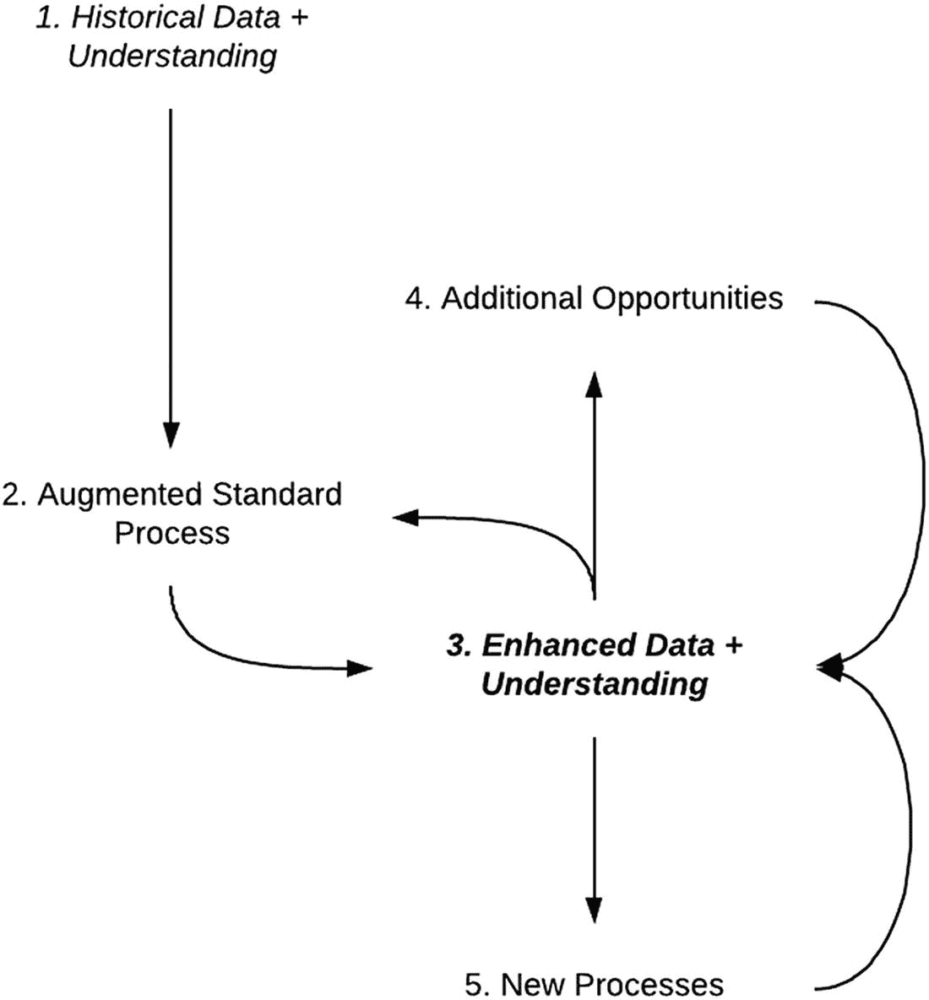

# 定义人工智能战略

2017年，在一年一度的Google I/O大会上，谷歌首席执行官桑达尔·皮查伊宣布，人工智能带来的机遇如此巨大，以至于谷歌正从“移动优先”战略转向“人工智能优先”战略。这一声明真正向许多人传达了人工智能的重要性以及制定人工智能战略的必要性。这家科技巨头谷歌，正在转型为一家全面的人工智能公司。他们过去曾暗示过这一点；每个人都知道谷歌在人工智能领域投入巨大并广泛使用，但这次不同。它不容置疑：人工智能优先。

## 从“移动优先”到“人工智能优先”

如果我们停下来稍作分析，从“移动优先”转向“人工智能优先”究竟意味着什么？嗯，“移动优先”战略认识到，人们访问数字服务的主要方式是通过移动设备。因此，谷歌生产的任何产品，首先且最重要的是必须在移动设备上运行良好。仅限桌面的产品根本不是一个选项。谷歌“移动优先”战略背后的假设是，如果它能提供最流畅、最快的移动体验，用户就会蜂拥而至使用其产品。当时的挑战在于，“移动优先”开发需要集中精力，并面临技术挑战。它需要高层的支持，因为它产生了额外的产品开发资源需求。谷歌的这一战略很快成为了科技公司的常态。如今，宣称自己是“移动优先”已不再是一项战略。“移动优先”仅仅是任何数字产品的一个合理基石，而非一项巨大成就。没有必要将其作为公司定义性的、面向外部的战略声明。这已是常规操作。

随着2017年“人工智能优先”的宣布，谷歌公开承认，新的机遇和挑战即将到来。这个机遇再次围绕着满足用户的期望和需求。用户现在是精明的数字公民。我们都期望我们的设备能达到一个全新的复杂水平，尤其是当我们瞥见事物可以如何更好地运作，并且不再对数字服务感到神秘时。仅仅能从任何设备访问服务，或者服务可靠，已经不够了。技术更先进的科技公司正在展示智能互联服务可以有多智能，这反过来又让我们希望所有服务都能以同样的方式运作。当你可以点任何餐食并在20分钟内送到家门口，或者购买任何商品并在当天送达时，这就会产生一套特定的期望。这反过来又形成了一个反馈循环，迫使公司升级他们所做的一切。为了在竞争中保持领先并满足用户，服务必须更加了解我们的环境和需求，并做出适当的反应，甚至主动预测它们。如果一个应用程序“不理解”我们，我们会很快称其无用，沮丧地抱怨，然后转向下一个。然而，通往更友好用户服务的道路是由人工智能技术铺就的。这就是“人工智能优先”战略的含义：认识到你的产品和服务下一次演进将在很大程度上取决于你通过使用人工智能技术来增强它们的能力。它也承认，整合人工智能技术需要集中精力和专注，以克服那些必然会出现的挑战。这并非常规操作。

“人工智能优先”战略承认，通往更智能、更优质服务的道路，取决于一个组织有效利用人工智能技术和能力的能力。

## 科技巨头的AI投入

当然，这不仅仅是谷歌。每一家主要的科技公司都在进行重大的人工智能投入，既在改变内部工作方式，也在改变其提供的产品。IBM自2010年以来一直在推广IBM Watson品牌，甚至在2011年因其在美国的电视游戏节目《危险边缘！》中获胜而一度使其家喻户晓。SAP拥有Leonardo平台，他们称之为一个以机器学习和其他人工智能技术为核心的全方位数字创新系统。Salesforce拥有Einstein，这是一个将人工智能融入其CRM产品的人工智能平台。可以说，亚马逊在考虑如何利用人工智能改变其业务的每一个方面方面，与谷歌一样先进。苹果的战略则是全方位的，通过人工智能增强服务，并且其硬件也在进化，通过专用芯片更好地支持人工智能，这些芯片能够加速设备上特定的人工智能计算。

面对这些科技巨头的努力，人们不禁感到有些不知所措。这种努力已经达到了白热化的程度，以至于大学抱怨他们无法为自己的AI研究团队配备足够的人员，因为公司正在以他们能找到的最快速度招聘人才。

## AI战略的实用方法

本章的主要目标之一，是为你提供一种制定自己人工智能战略的实用方法。这不是关于加入人工智能竞赛（除非有极其充分的理由这样做）。而是关于确定要遵循的原则，以及在你特定的旅程中，针对不同阶段和不同需求要应用的策略，从而确保你能够充分利用人工智能技术为你的业务带来的价值。

### 原则

战略的原则就像指路明灯，当基本事实没有明确指向某个选择时，帮助我们选择一条方向而非另一条。我在此提出的原则，是浓缩了与众多大小型组织的无数次对话，探讨了哪些方法对他们有效、哪些无效，以及哪些是值得关注的重点，哪些又是分散注意力的干扰项。

#### 大处着眼，现实起步，适度扩展

熟悉精益创业运动的人会在这个标题中看到该运动口号的影子。它通常是：“大处着眼，小处起步，快速扩展。”精益创业运动由埃里克·莱斯发起，他通过其著作《精益创业》描述了一种拥抱不确定性、通过执行精心管理且成本有效的实验来测试商业模式可行性，从而将风险降至最低的商业方法论。这些实验旨在测试新功能或新产品背后最关键的核心假设，然后再将该产品扩展到全面生产。对于精益创业者来说，拥有一个宏大的长远愿景很重要，但要从成本不高的小实验开始，然后再尽可能快地扩展以获取市场价值。将AI技术应用于工作场所的战略，可以从同样的思维方式中受益。同时，有几点需要牢记——这也是我为何将这句口号改为“大处着眼，现实起步，适度扩展”的原因。

##### 大处着眼

将AI技术应用于我们工作方式的潜力是变革性的。为了理解其真正的范围并赋予其适当的重要性，必须大处着眼。就像谷歌公开宣称其“AI优先”战略一样，关键在于赋予整个使命足够的重要性，以便人们能够重视并恰当地优先处理它。

大处着眼也意味着要认识到，自动化不仅仅是“以更低的成本或更快的速度做更多同样的事情”。不要将企业中引入自动化等同于工厂流水线，在那里部件A可以以更快、更不易出错的方式连接到部件B。通过AI实现的自动化还能开启全新的做事方式。它催生了新的商业模式。这是一个循环：自动化的需求导致信息和流程的数字化，而数字化又产生了更多可供进一步利用的信息，并最终带来全新的解决问题的方法。

例如，自动化支持处理不仅仅意味着你将需要更少的资源来处理相同数量的支持请求。它还意味着，随着每个支持请求被日益复杂的自然语言理解能力仔细分析，你可以更好地理解支持问题。由此产生的数据可以直接反馈到产品开发中，而产品改进的结果可以追溯到发布后通过支持渠道提出的问题类型。这意味着你可以将你的支持团队转变为客户成功团队，以完全不同的方式与客户互动。在支持处理中引入自动化，可以影响从产品设计和开发方式到客户关系管理的整个业务环节。然而，要充分发挥这项工作的全部效益，你需要一个宏大的愿景版本，以便在每个阶段设置正确的垫脚石，从而能够到达山顶。

图11-1展示了任何流程的这种流转。我们从拥有历史数据并理解自身流程的地方开始（1），然后通过自动化来增强我们的标准流程（2）。如果做得仔细并着眼于未来，这可以带来增强的数据和理解（3）。这种增强的理解开始形成一个良性的反馈循环，它不仅可以反馈到增强现有流程（2）中，还可以创造额外的机会（4），甚至催生新的流程（5）。

图11-1. AI良性流程增强循环

##### 现实起步（并逐步演进）

应用新技术总是伴随着高风险。这不是常规业务。你需要能够吸收并应对大量的学习成果，事情也不会像你预期的那样发展。精益创业方法使得人们倾向于从小实验（最小可行产品）开始，在投入额外资源之前测试一个关键假设。总的来说，这是一个非常明智的方法。当然，关键问题在于，一个最小可行产品究竟可以“最小”到什么程度。它必须足以提供信息，让你判断是否值得将整个努力扩展。如果产品过于简单和微小，它将毫无用处。

在使用AI技术时，我们处于非常相似的情况。如果你试图部署一个预测算法，你需要确保给予足够的空间，让人们准备足够的数据并尝试足够多的方法，以便对问题是否能够解决有一个坚实的理解。可以将其视为太空发射的逃逸速度。工程师们知道，除非发射导弹能够达到25,000公里/小时的速度，否则它将无法摆脱地球的引力。如果你知道你在工程上的投入不足以超过这个最低门槛，那么你最好将这笔钱花在别处。

现在，认识到这个门槛在哪里，需要结合经验以及接受一些失败尝试的意愿。因此，我认为一个计划必须通过两个关键测试。第一个是确保路线图中的各个步骤有足够的清晰度，以便能够对其可行性进行一些初步研究，并且没有任何一个步骤大到一旦失败就没有调整方向的空间。第二个是确保每个步骤都获得适当水平的输入，这是一种“就绪门”，确保你做得足够多使其有用，但又不会做得过多。如果完成一个步骤后，你未能达到进入下一个步骤的“就绪门”，那么你可以停下来重新考虑。

##### 适度扩展

我们当然希望快速扩展。自动化决策的一大吸引力在于，它能让组织运转得更快。

然而，恰恰是因为自动化能够快速扩展的特性，以及自动化本身的性质，我们才需要对扩展的速度保持谨慎。在这种情况下，自动化依赖于利用过往数据和知识，来编码工作场所中某个特定方面的运作规则。最终生成的软件程序，其优劣程度完全取决于我们对自身问题的理解以及所使用的数据。在将用户从一千扩展到一万，或者从一个地区扩展到另一个地区之前，我们需要确保其底层假设保持不变。如果急于将自动化模型扩展到测试环境之外，却没有设置检查机制来确保其按预期运行，就可能导致意想不到的后果，例如在决策中表现出偏见，或引入难以察觉的错误。

#### 切实成果至关重要

人工智能战略，如同任何其他计划一样，需要考虑其发展的更广泛环境。太多时候，任何新事物都会被隔离起来，放进创新实验室里研究和试验，但在现实业务中却难以见到天日。像人工智能这样的技术尤其如此。

创新实验室本身并非坏主意。有能力组建专门团队进行试验的组织是幸运的，他们应该充分利用这些可能性。然而，创新的经验教训需要接受现实情况的严酷考验。除非你处理了问题的全部现实，否则你并没有解决整个问题。这就好比你说想造一辆火星车去探索火星，却只在自家附近的道路上测试它。

一项人工智能战略，如果没有规划好技术如何从创新团队的“茧房”走向实际业务，就不是一个完整的战略。这包括说服那些背负日常运营优先事项、压力重重的业务部门采纳新技术；包括确保解决方案能带来可衡量的收益，从而对部门的预算产生实质性影响；还包括处理员工对于被自动化取代的担忧，并制定培训计划来应对工作方式的变革。如果这些要素都不具备，你就无法真正衡量这项努力的成败。

#### 人工智能战略无关人工智能

这个标题是故意反直觉的。

人工智能战略并非要不惜一切代价使用人工智能。我见过太多公司迷失在“无论如何都要让AI发挥作用”的尝试中，以至于我觉得这一点必须从一开始就讲清楚。

正如我们在本书中反复强调的，人工智能有助于我们将决策权委托给机器。同时，正如本章引言所述，人工智能帮助我们满足用户的需求和期望。然而，人工智能本身并不是目的。目标从来都不应该是，也绝不应该仅仅是“使用人工智能”。人工智能战略的目标是创造必要的先决条件和流程，使组织能够：

1.  确定人工智能技术是否适用，以及能否帮助以更好的方式解决问题。

2.  确保组织在人工智能技术适用的情况下，有能力抓住机遇。

如果流程的最终结果是，使用人工智能技术来解决某个特定问题根本不是一个好主意，那也完全没问题。

这正是某个对话式人工智能项目中所发生的情况。该组织希望实施一个聊天机器人，来处理那些在国外遇到旅行证件问题的客户的咨询。他们投入精力思考，应该采用什么样的语言理解方案来识别旅行证件发生了什么（丢失、损坏、被盗等）。然而，当需要理解针对每种问题类型应该给出什么恰当回应时，他们意识到回应总是相同的。无论问题原因是什么，处理方式始终是填写同一张表格，或者在紧急情况下通过电话联系。所有前期用于识别问题原因的努力都是不必要的。这是一个可以通过改进网站信息架构来解决的问题，根本不需要使用任何人工智能技术。

#### 不存在需要通过的“真正”人工智能测试

与上一条原则类似，这条原则也是源于另一个常见的陷阱。当人们开始人工智能项目时，主要担忧之一就是要做一些“真正”的人工智能。从很多方面来看，有这种担忧是很自然的。我们正在处理定义极其模糊的新技术。人们觉得，面对大量相互矛盾的信息，他们需要确保自己是在做“正确的事情”。无论是招聘还是寻求外部帮助，组织都希望确保自己不会被“假”人工智能“欺骗”。

结果往往是，问题的解决方案被过度设计，或者完全合适的解决方案被弃用，因为它们没有通过某个模糊的“人工智能”测试。在处理虚拟助手时，这通常涉及讨论什么样的对话才算足够复杂，感觉像人类。简单、直击要点的对话被开放式对话所取代，后者为了达到这种类人标准而模仿更自然的语言。对于预测算法和机器学习，则常常是抛弃那些建议使用标准、成熟的统计学技术的建议，转而采用直接使用深度学习的技术，因为深度学习感觉更像是真正的人工智能。

这些问题的挑战在于它们难以处理。最终的解决方案是有效的。问题得到了解决。但这是一个脆弱得多的解决方案，因为强加了比实际需求更多的人工智能技术。每个人都感到兴奋，因为它感觉更未来化，但实际上，随着解决方案的演进，他们只会给自己带来更多麻烦。

一个全面的人工智能战略需要包含一些检查点，在这些节点上，要诚实地讨论：该解决方案是否是解决当前问题的最佳方案，或者它是否仅仅是为了满足展示人工智能应用的需求，而不是为了真正收获这项技术的益处。

#### 确定你是否真的想要它

谈论事情应该如何是很容易的。没有人会反对那些精美的图表，它们将用户置于中心，周围环绕着同心圆，整齐地标注着协作、沟通和连接等词汇。然而，带来真正的改变却很难。现实很少能与这些理想化的方法相匹配。现实是混乱的，层层叠叠的流程、数据、工具和人员随着时间的推移不断演变和变化。现实也不会暂停。你无法按下暂停键，

# 数据的梳理

我们已经在上一章讨论过数据。不过，我们遗漏了一个问题：梳理当前存在哪些数据。为了提供一个描述数据的简单框架，我将借鉴开放数据运动提出的想法。蒂姆·伯纳斯-李（是的，就是那位蒂姆——万维网的发明者）提出了一个五星级方案，用于描述公开共享的开放数据^(⁵⁸)。然而，它也是描述组织内部数据的有用指南，尤其是当我们考虑数据在不同群体和部门之间共享时。

## 一星——数据以任何格式可供使用

第一步很简单，就是让数据以任何可能的格式可供使用，并且能够被更广泛的组织访问。组织内一星数据的检验标准是，人们能够实际找到它，并能追溯谁负责它，以及管理访问权限的规则是什么。这些数据很可能是 PDF 文档中的非结构化数据，但至少是可查找的。你需要部署更复杂的技术，如文本挖掘，来提取数据。

## 二星——数据以结构化格式可用

更进一步，是让这些可查找且可归属的数据以更机器友好的结构化格式存在。例如，它可以是 Excel 电子表格，而不是表格的扫描件。结构化数据意味着更容易获取，但你仍然可能处理的是当前没有任何软件使用的文件格式，或者其背后的模式未被充分理解或记录。

## 三星——数据以被充分理解的结构化格式可用

三星数据是指你可以以被充分理解的结构化格式访问的数据。我们可能处理的是 CSV（逗号分隔值）文件或数据库表。你仍然需要挖掘有关模式和数据访问的信息。

## 四星——通过有文档记录的 API 获取数据

在这种情况下，我们处理的是可通过有文档记录且维护良好的 API（应用程序编程接口）获取的结构化数据。这意味着另一端有一个团队负责管理数据访问，并且已经建立了更完善的数据治理流程。

## 五星——跨数据集链接数据以提供上下文

对于五星级数据，我们不仅能够通过文档完善的 API 进行访问，这些数据还与组织内的其他数据集相互关联，使我们能够对数据的上下文做出更有趣的推断。

#### 连接各项活动

AI 战略的制定和执行不应被视为与其他活动孤立进行的事情。至关重要的是，它要从一开始就为思考提供信息。你可以将 AI 能力视为一个工具箱，在问题出现时从中取出有用的工具来帮助解决。你可能会认为，既然 AI 是一种技术、一种解决问题的方式，那么在定义总体战略时就不需要它登场。只有当你需要构建解决方案时，才开始探索 AI 技术和能力的领域，看看哪些适用于你的问题。

我认为这种方法是存在缺陷的。它未能充分利用战略最重要的方面之一：协调各项活动，使整体大于部分之和。AI 战略不能也不应该与更广泛的数字战略孤立开来，而数字战略又应与你的总体战略相连接。三者相互支持，为整体的成功奠定基础。如果你将 AI 仅仅视为另一种可以使用的工具，你就会错过制定那些只有借助 AI 能力才能实现的战略。

将你的总体战略、数字战略和 AI 战略连接起来至关重要。三者相互启发，能够实现那些如果各方面孤立处理就无法达成的目标和行动方案。

在更具体的层面上，连接活动还意味着确定如何最佳地安排项目的时间和协调项目，以便整体上获得积极成果。一个典型的*未能*做到这一点的例子是：当组织内的一个团队正在开发自动预测能力时，而生成该预测所依赖数据的软件却已被计划替换——这无异于给第一个团队釜底抽薪。

你要避免出现下面这样的对话：

- “新的 CRM 项目进展顺利——新系统将在明年初上线运行。”

- “新 CRM 能否提供我们进行预测所需的关系数据和历史销售数据？”

- “我不知道。一年前向供应商发出招标书时，这并不在需求范围内。”

- *“……”*

牢牢掌握流程、数据流以及会影响这些的活动，对于协调成功的 AI 实施至关重要。这确实需要在规划阶段付出努力，并且表明需要更广泛的相关方参与，以便每个人都了解变化将如何影响整个团队的活动。

#### 构建你的路线图

一旦我们更好地掌握了当前所处的位置，就可以开始规划通往目标所需的步骤。在最高层面上，我发现考虑三种宽泛的可能性很有用。在某种程度上，这三种方法可以被视为 AI 能力演进过程中的阶段，但最终它们是三条可以同时推进的路径，有时你也可以决定从一条路径转向另一条。这三条路径是：

- **采购内置 AI 的工具。** 在这种情况下，我们寻找的是已经内置 AI 能力的工具。我们不需要从头开发任何东西。只需利用现有的工具即可。

- **使用预构建的 AI 组件构建解决方案。** 在这里，我们开发自己的定制解决方案，但在使用 AI 技术或能力时，我们并不训练或开发自己的模型。相反，我们使用经过预训练或以某种方式预先打包的 AI 服务，来提供我们所需的功能。

- **构建 AI 组件和基础设施。** 最后，我们可以考虑构建自己的 AI 模型，并将其纳入更广泛的解决方案中。这一步可以进一步细分为：使用现有技术构建 AI 模型，或开发新技术来帮助我们推导模型。

我们将在接下来的章节中更详细地讨论每个选项。

##### 雇佣内置 AI 的工具

一个非常直接的选择是“雇佣”那些内置了 AI 能力的服务。这能让你在 AI 进化阶梯上立即迈出一步，而无需投入大量资源进行内部开发。有成千上万的供应商竞相为企业提供智能能力，利用这种创新是观察 AI 能力如何增强你当前工作流程的绝佳方式。

从实际落地的角度来看，这意味着为你的采购决策增加一个新的维度，即明确评估某项服务在自动化方面创造的可能性，以及这些可能性如何满足你的需求。有两个关键问题需要考虑：

它是否解决了组织内的真实需求？它是否解决了我们面临的一个真正问题，并且这个问题能从自动化中受益？这看似是一个显而易见的问题，但它能防止“清单式采购”——即采购决策由组织内的某个独立部门完成，而该部门所做的只是勾选清单上的“AI 能力”选项。正如我们在本书中多次提到的，AI 技术千差万别。在很多方面，仅仅指定“AI 能力”几乎就像指定计算机程序应该使用某种编程语言一样笼统！相反，我们必须针对我们试图解决的问题，去寻找我们需要的特定能力或能力组合。

底层数据是如何处理的？你能否在不使用该产品的情况下使用这些数据？产生的数据能否反馈回我们在本章开头描述的那个良性循环中？我认为这一点至关重要。回到我们之前描述的数据评级方案，我们可以判断我们雇佣的系统将产生什么类型的数据，以及这会导致对特定供应商的何种锁定程度。通过自身活动所产生的理解是宝贵的知识产权，理想情况下应严格保护。当所有竞争对手都使用相同的工具时，正是该工具的数据和流程配置能为你带来竞争优势。

所有主要的供应商都提供了有趣的解决方案，让你能够“雇佣”内置 AI 的解决方案。例如，主要的 CRM 供应商（Salesforce、Oracle、SAP、Adobe、Microsoft）都已将 AI 能力捆绑到其 CRM 工具中。让我们简要看看 Salesforce 的做法，因为它正是我们在此讨论的策略类型的真实案例。第一步是认识到，在其 CRM 中提供 AI 能力将代表一个关键的竞争优势和潜在的差异化因素。然后，为了快速建立其 AI 能力，他们开始了收购狂潮，购买那些提供特定功能（如智能会议管理，即内置 AI 的工具）的 AI 初创公司。接着，他们收购了将底层技术融入其中的公司，以便能够创建机器学习平台——从而实现“用 AI 构建”。所有这些初创公司最终被整合成一个名为 Einstein 的综合解决方案，使 Salesforce 能够构建新的 AI 技术和能力。Einstein 提供了诸如账户洞察、潜在客户优先级排序和自动数据录入等功能。

##### 用 AI 构建

接下来的方法是利用易于获取的 AI 组件来构建解决方案。在这种情况下，你不是直接雇佣带有预定义用户界面和功能列表的最终功能。相反，你是在构建自己的工具（例如，一个能够查看潜在候选人排名的仪表板），并使用外部 AI 平台为你提供必要的能力（例如，自然语言处理）。

同样，所有主要技术提供商都提供了易于访问的 API。微软的认知服务包括支持决策、视觉、语音、搜索和语言的工具。亚马逊 AWS 将其命名为推荐、预测、图像和视频分析、高级文本分析、文档分析等。正如你从这些服务的名称中看到的，这些都是广泛的能力，可以用你自己的数据来喂养，并组合起来提供更全面的解决方案。

当然，这不仅仅关乎大供应商的云服务。还有大量开源工具，例如用于自然语言理解的`spaCy`，它们提供了令人难以置信的能力，并且几乎不需要什么努力就能上手。

这些现成能力的吸引力在于，你可以将它们接入你的解决方案，而无需内部专家来理解它们。你的差异化优势，再次体现在你如何组合解决方案，以及你所带来的数据质量和整体问题理解能力上。

##### 构建 AI

最后一步是真正投资于内部构建基础 AI。一旦你对自身流程和数据的状况有了更清晰的认识，并能够开始构建自己的模型，结合神经网络、推理等基础技术时，这一步就变得有意义了。这意味着要在内部培养 AI 技能，需要更大的投资，但这也是最有可能带来最有趣回报的领域，因为这是你能够真正实现差异化的地方。这里需要把握的平衡是，确保你正朝着正确的方向投资于构建自己的 AI，而不是简单地试图与技术巨头竞争。

## AI 无处不在

与任何高层战略工作一样，制定并定义你自己的 AI 策略是一项充满挑战但最终回报丰厚的活动。这意味着你需要深入挖掘自己的动机，以及同事和整个组织的动机。这意味着要审视你解决问题的方式，并尝试推导出明确的规则和清晰的思路。这个过程本身就极具价值。为了向其他人记录而审视流程是一回事，而审视同样的流程并试图向机器描述它则完全是另一回事。这会迫使你达到一种清晰度，有时甚至可能让人感到不适或别扭。然而，其结果无疑将非常有价值。

我们已经看到，在从雇佣 AI、用 AI 构建到构建 AI 的旅程中，有相当多的选择可以起步。每种选择都有其优缺点，虽然它们可能像是进化阶梯上的不同步骤，但它们并非相互排斥。它们可以共存，并且你可以为组织内的不同用例做出不同的选择。这也意味着你可以快速起步，并尽早展示 AI 策略带来的好处，这反过来会推动进一步的支持，并使后续步骤更容易向团队其他成员推广。

AI 技术和能力将影响工作场所的方方面面。我希望通过本书已经证明，我不是一个会被潮流和炒作所激动的人。鉴于当前 AI 技术被炒得如此火热，可能很难透过这些看清它们的真正影响。然而，正如我们在前几章中所论证的，AI 的影响将是深远的。将其与火和电相提并论（正如微软和谷歌等公司所做的那样）可能听起来有些牵强。但这些说法中确实有道理。就像火或电一样，AI 有能力改变我们做一切事情的方式。如果你从一个既务实看待挑战、又认识到机遇的立场出发，你就可以对你组织内的工作方式产生持久的影响。着手制定 AI 策略可能是关乎你组织未来的最重要决策之一。

脚注 1 2 3 4
