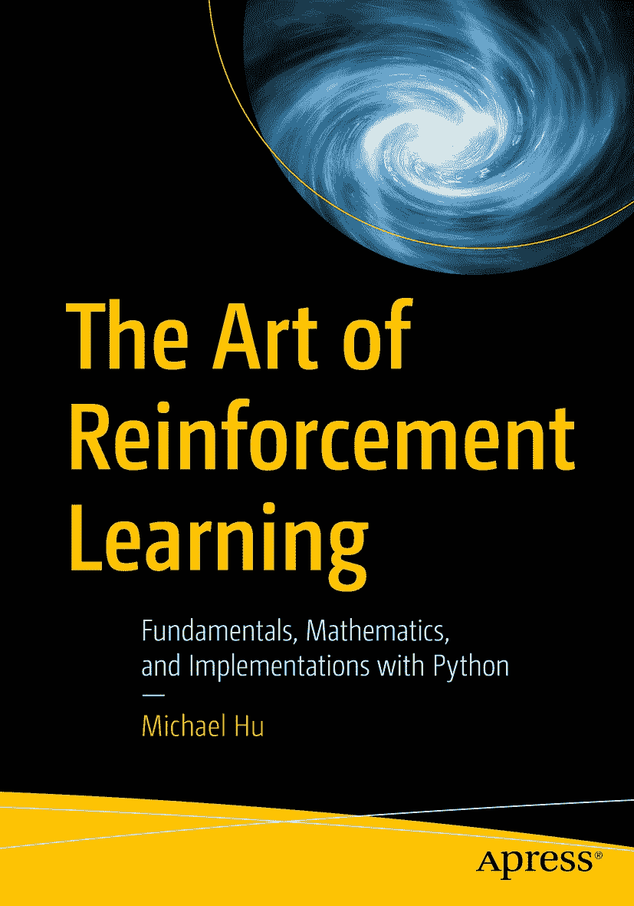

ISBN 978-1-4842-9605-9 e-ISBN 978-1-4842-9606-6 [`doi.org/10.1007/978-1-4842-9606-6`](https://doi.org/10.1007/978-1-4842-9606-6) © Michael Hu 2023 Apress 标准 本出版物中使用的通用描述性名称、注册商标名称、商标、服务标记等，即使未作明确声明，也不意味着这些名称不受相关保护性法律和法规的约束，因此可自由用于一般用途。出版商、作者和编辑可以假定，本书中的建议和信息在出版之日是真实准确的。出版商和作者或编辑均不对本文所含材料或可能存在的任何错误或遗漏提供明示或暗示的担保。出版商对已出版地图中的管辖权主张和机构归属保持中立。

本 Apress 印记由注册公司 APress Media, LLC（Springer Nature 的一部分）出版。

注册公司地址为：1 New York Plaza, New York, NY 10004, U.S.A.

*献给我挚爱的家人，*

*这本书献给你们每一位，在我写作的旅程中，你们一直是我爱与支持的源泉。*

*献给我辛勤工作的父母，你们养育我们的不懈努力令人赞叹。感谢你们滋养我的梦想，并在我心中播下对知识的热爱。你们坚定不移的奉献精神在我的成就中发挥了关键作用。*

*献给我的姐妹和她们的孩子，你们的陪伴和爱给我的生活带来了巨大的快乐和灵感。我感激那些激发我创造力的欢笑和共度的时光。*

*献给我亲爱的妻子，你一贯的支持和理解一直是我的指路明灯。感谢你陪伴我度过人生的起起落落，并成为我最坚定的支持者。*

*——Michael Hu*

