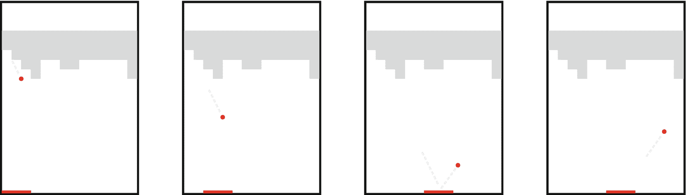
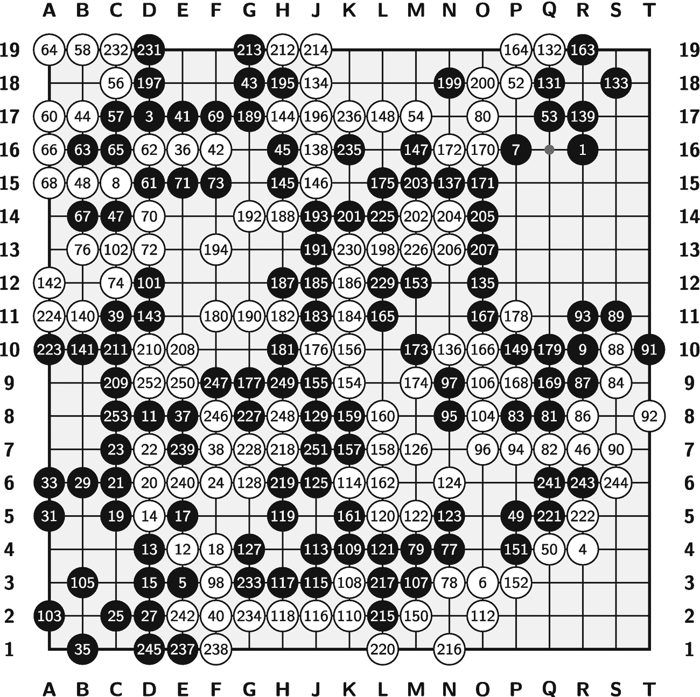

# 第一部分：基础

## 1. 引言

近年来，人工智能取得了令人瞩目的进展，在图像识别、自然语言处理和游戏博弈等领域均实现了突破。其中，强化学习作为一种通过与环境交互进行学习的机器学习方法，在该领域取得了卓越成就。

本书聚焦于强化学习与深度神经网络的结合，这一组合已成为智能体掌握复杂游戏（如棋盘游戏围棋和 Atari 视频游戏）的核心技术。

第一章概述了强化学习的基本概念，包括状态、奖励、策略等关键要素，以及强化学习中常用的术语，例如回合制与持续型强化学习问题的区别、无模型方法与基于模型方法的差异。

尽管该领域取得了显著进展，强化学习仍面临重大挑战。例如，从稀疏奖励中学习可能较为困难，且方法可能存在不稳定性问题。此外，扩展到大规模状态和动作空间也是一项挑战。

在本书中，我们将深入探讨这些概念，并讨论用于应对这些挑战的最新技术。通过阅读本书，您将全面理解强化学习的原理及其在现实问题中的应用。

我们希望这篇引言能激发您对强化学习潜力的好奇心，并邀请您加入我们的探索之旅。

一幅由四块面板组成的 Atari《打砖块》游戏示意图，展示了四个矩形面板，顶部水平平台上分布着不对称的障碍物，四个面板中分别有一个小球悬浮在半空中的不同位置。一条水平线状光标控制着球的运动。

**图 1.1** 一个 DQN 智能体正在学习玩 Atari《打砖块》游戏。游戏目标是用球拍将球弹起，击碎一堵砖墙。智能体仅从屏幕获取原始像素，并需自行判断应采取何种正确动作以最大化得分。创意改编自 Mnih 等人[1]。游戏版权归 Atari Interactive, Inc.所有。

### 1.1 游戏领域的人工智能突破

#### 雅达利

雅达利 2600 是雅达利互动公司在 20 世纪 70 年代开发的一款家用电子游戏机。它拥有一系列标志性的电子游戏。这些游戏，如`Pong`、`Breakout`、`Space Invaders`和`Pac-Man`，已成为早期电子游戏文化的经典范例。在这个平台上，玩家可以使用摇杆控制器与这些经典游戏进行互动。

雅达利游戏的突破性进展发生在 2015 年，当时 DeepMind 的 Mnih 等人[1]开发了一个名为`DQN`的人工智能代理，用于玩一系列雅达利电子游戏，其中一些游戏的表现甚至超越了人类。

`DQN`代理之所以影响深远，在于其训练玩游戏的方式。与人类玩家类似，该代理仅将屏幕的原始像素图像作为输入，如图 1.1 所示，它必须自行摸索游戏规则，并决定在游戏过程中如何行动以最大化得分。该代理没有获得任何人类专家知识，例如预定义的规则或人类玩家的游戏样本。

`DQN`代理是一种强化学习代理，它通过与环境的交互并接收奖励信号来学习。在雅达利游戏的案例中，`DQN`代理每执行一个动作都会获得一个分数。

Mnih 等人[1]在 57 款雅达利电子游戏上训练并测试了他们的`DQN`代理。他们为每款雅达利游戏训练一个`DQN`代理，每个代理只玩它被训练的那款游戏；训练过程涉及数百万帧画面。如 Mnih 等人[1]所示，`DQN`代理能够在一半的游戏（57 款中的 30 款）中达到或超越人类玩家的水平。这意味着该代理能够学习并制定出比人类玩家所能想到的更好的策略。

自那时起，各种组织和研究人员对`DQN`代理进行了改进，融入了多项新技术。雅达利电子游戏已成为评估强化学习代理和算法性能最常用的测试平台之一。街机学习环境（`ALE`）[2]提供了数百种雅达利 2600 游戏环境的接口，研究人员普遍使用它来训练和测试强化学习代理。

总而言之，雅达利电子游戏已成为早期电子游戏文化的经典范例，而雅达利 2600 平台为强化学习领域的代理训练提供了丰富的环境。DeepMind 的`DQN`代理在 57 款雅达利电子游戏上训练和测试所取得的突破，展示了人工智能代理通过与经典游戏的试错互动来学习和决策的能力。这一突破推动了强化学习领域的诸多改进和进步，雅达利游戏也已成为评估强化学习算法性能的热门测试平台。

#### 围棋

围棋是一种古老的中国策略棋盘游戏，由两名玩家轮流在 19x19 的棋盘上落子，目标是围出比对手更多的领地。每位玩家持有一组黑色或白色棋子，游戏开始时棋盘为空。玩家轮流在棋盘上放置棋子，执黑者先行。

围棋游戏示意图展示了一个 19x19 的网格，行从底部起标记为 1 到 19，列标记为 A 到 T。网格单元格中填充着深色和浅色的圆圈，上面标有 3 位、2 位或 1 位数字。深色圆圈代表一方，浅色圆圈代表另一方。

图 1.2

依田纪基（黑）对阵铁谷清成（白），2018 年第 66 届 NHK 杯围棋赛。白棋以 0.5 目获胜。棋谱来自 CWI [4]

棋子放置在棋盘上线条的交点上，而非方格内。一旦棋子落在棋盘上，就不能移动，但如果它被对手的棋子完全包围，则可以被吃掉。被包围并吃掉的棋子将从棋盘上移除。

游戏继续进行，直到双方都选择停手，此时计算棋盘上的领地。一方的领地是指被其棋子完全包围的空交叉点集合，加上任何被吃掉的棋子。领地较大的一方获胜。以图 1.2 所示的最终棋盘局面为例，白棋以 0.5 目获胜。

尽管游戏规则相对简单，但游戏本身极其复杂。例如，与国际象棋相比，围棋中合法的棋盘局面数量极其庞大。根据 Tromp 和 Farnebäck [3]的研究，围棋中合法棋盘局面的数量约为`2.1 × 10¹⁷⁰`，这远远超过了宇宙中原子的数量。

这种复杂性对试图下围棋的人工智能（AI）代理构成了重大挑战。2016 年 3 月，由 DeepMind 的 Silver 等人[5]开发的人工智能代理`AlphaGo`创造了历史，在围棋比赛中以 4 比 1 的比分击败了传奇韩国棋手李世石。李世石是 18 个世界冠军头衔的获得者，被认为是过去十年中最伟大的围棋选手之一。`AlphaGo`的胜利意义非凡，因为它结合了深度神经网络、树搜索算法以及强化学习技术。

`AlphaGo`的训练结合了基于人类专家棋局的监督学习和基于自我对弈棋局的强化学习。这种训练使该代理能够开发出创造性和创新性的着法，令李世石和围棋界都感到惊讶。

`AlphaGo`的成功重新激发了人们对强化学习领域的兴趣，并展示了人工智能解决曾被视作人类智能专属领域的复杂问题的潜力。一年后，DeepMind 的 Silver 等人[6]推出了一个更强大的新代理——`AlphaGo Zero`。`AlphaGo Zero`完全通过纯自我对弈进行训练，训练过程中未使用任何人类专家的着法，达到了比之前的`AlphaGo`代理更高的棋艺水平。他们还进行了其他改进，例如简化了训练流程。

为了评估新代理的性能，他们让其与 2016 年击败世界冠军李世石的同一个`AlphaGo`代理对弈，结果新的`AlphaGo Zero`以 100 比 0 的比分击败了`AlphaGo`。
