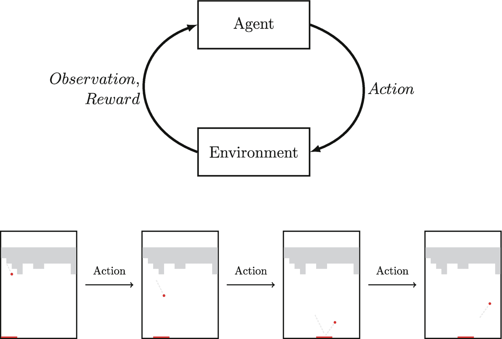

# 1.1 AlphaZero: A General Reinforcement Learning Algorithm

The following year, Schrittwieser and others from DeepMind generalized the `AlphaGo Zero` agent, enabling it not only to play Go but also other board games such as chess, shogi (Japanese chess), and others. This generalized agent was named `AlphaZero`. `AlphaZero` is a more general reinforcement learning algorithm that can be applied to various board games, not just Go, chess, and shogi.

Reinforcement learning is a machine learning method where an agent learns how to make decisions by receiving feedback from the environment. Agents like `DQN` and `AlphaGo` (and its subsequent versions) have used this technology and achieved remarkable results. Although these agents were designed for playing games, this does not mean that reinforcement learning can only be used for gaming. In fact, there are many more challenging problems in the real world, such as robot navigation, autonomous vehicles, and network advertising automation. Compared to other real-world problems, games are relatively easy to simulate and implement, but reinforcement learning has the potential to be applied to a wide range of complex challenges outside of gaming.

### 1.2 What is Reinforcement Learning

In computer science, reinforcement learning is a subfield of machine learning that focuses on learning how to act in a certain world or environment. The goal of reinforcement learning is to enable an agent to learn a series of decisions that can maximize cumulative rewards over time through interaction with the environment. This process is called *goal-oriented learning*.

Unlike other machine learning methods such as supervised learning, reinforcement learning does not rely on labeled data for learning. Instead, the agent must learn through trial and error without being directly told the rules of the environment or what action to take at any given moment. This makes reinforcement learning a powerful tool for modeling and solving real-world problems, especially in situations where the rules and optimal actions may be unknown or difficult to determine.

However, reinforcement learning is not limited to computer science. Similar ideas are studied under different names in other fields, such as optimal control in operations research and engineering. Although the specific methods and details may differ, the basic principles of goal-oriented learning and decision-making are the same.

There are numerous examples of reinforcement learning in the real world. For example, humans are naturally good at learning through interaction with the world around us. From learning to walk as an infant, to learning to speak our mother tongue, to learning to drive, we all learn through trial and error and receive feedback from the environment. Similarly, animals can also be trained to perform various tasks through a process similar to reinforcement learning. For example, service dogs can be trained to help people in wheelchairs, and police dogs can be trained to assist in searching for missing persons.

A vivid example of the idea of reinforcement learning is a video of a dog carrying a big stick trying to cross a narrow bridge.^(¹) In the video, the dog tries to cross the bridge but fails multiple times. However, after some trial and error, the dog eventually discovers that by tilting its head, it can carry its beloved stick across the bridge. This simple example demonstrates the ability of reinforcement learning to solve complex problems by learning from the environment through trial and error.

### 1.3 Agent-Environment Interaction in Reinforcement Learning

Reinforcement learning is a machine learning method that focuses on how an agent learns to make optimal decisions by interacting with the environment. The agent-environment loop is the core of reinforcement learning, as shown in Figure 1.3. In this loop, the agent observes the state and reward signals of the environment, takes an action, and then receives new state and reward signals from the environment. This process iterates, and the agent learns from the rewards it receives and adjusts its actions to maximize future rewards.

#### Environment

The environment is the world in which the agent operates. It can be a physical system, such as a robot navigating a maze, or a virtual environment, such as a game or simulation. The environment provides two types of information to the agent: the state of the environment and reward signals. The state describes the relevant information the agent needs to make decisions, such as the position of a robot or the card layout in a poker game. The reward signal is a scalar value indicating how well the agent is performing in its task. The goal of the agent is to maximize its cumulative reward over time.

A two-part flowchart. The top part is a loop diagram that sequentially passes through the agent, action, environment, observation, and reward. The bottom part shows four different scenes of the arcade game "Pong," each pointing to the next through action.

Figure 1.3

Top: The loop interaction between the agent and the environment in reinforcement learning. Bottom: The loop expanded over time

The environment has its own set of rules that determine how the state and reward signals change based on the agent's actions. These rules are usually referred to as the dynamics of the environment. In many cases, the agent cannot access the underlying dynamics of the environment and must learn them through trial and error. This is similar to how humans interact with the physical world every day—usually we have a good perception of what is happening around us, but it is difficult to fully understand the dynamic characteristics of the universe.

Game environments are a popular choice for reinforcement learning because they provide clear goals and well-defined rules. For example, a reinforcement learning agent can learn to play the arcade game "Pong" by observing the screen and receiving reward signals based on the game's win or loss.

In robot environments, the agent is a robot that must learn to navigate or perform tasks in the physical space. For example, a reinforcement learning agent can learn to navigate a maze by using sensors to detect the surrounding environment and receiving reward signals based on how quickly it reaches the end of the maze.

#### State

In reinforcement learning, the environment state, or simply state, is the statistical data provided by the environment to represent its current state. The state can be discrete or continuous. For example, when driving a manual transmission car, speed is a continuous variable, while the current gear is a discrete variable.

Ideally, the environment state should contain all the relevant information the agent needs to make decisions. For example, in a single-player video game like "Breakout," the pixels of the game frame contain all the information the agent needs to make decisions. Similarly, in an autonomous driving scenario, data from vehicle cameras, LiDAR, and other sensors provide relevant information about the surrounding environment.

However, in practice, the available information may depend on the task and domain. For example, in a two-player board game like Go, although we have perfect information about the position of the board, we do not completely understand the opponent, such as their thoughts or next move. This makes the state representation in this scenario more challenging.

Additionally, the environment state may also contain noise data. For example, a reinforcement learning agent driving an autonomous vehicle may use multiple cameras at different angles to capture images of the surrounding area. Suppose the car is driving near a park on a windy day. In this case, the vehicle camera may also capture images of some trees swaying in the wind. Since the movement of these trees should not affect the driving ability of the autonomous vehicle (because the trees are in the park, not on or near the road), we can consider the movement of these trees as noise for the autonomous vehicle. However, ignoring them from the captured images may be challenging. To solve this problem, researchers may use various techniques such as filtering and smoothing to eliminate noise data, thus obtaining a clearer representation of the environment state.

#### Reward

In reinforcement learning, the reward signal is a numerical value provided by the environment to the agent after it performs an action. The reward can be any numerical value, positive, negative, or zero. However, in practice, the reward function is usually task-specific, and we need to carefully design a reward function specific to our reinforcement learning problem.

The design of a suitable reward function is crucial for the success of the agent. The design of the reward function should encourage the agent to take actions that can ultimately achieve our desired goals. For example, in a Go game, the reward for each move before the game ends is 0, and the reward is +1 if the agent wins and -1 if it loses. This design motivates the agent to win the game without explicitly telling it how to win.

Similarly, in the "Breakout" game, if the agent destroys some bricks, the reward can be positive; if the agent fails to catch the ball, the reward is negative; otherwise, the reward is zero. This design motivates the agent to avoid dropping the ball while trying to destroy as many bricks as possible without explicitly telling it how to get a high score.

The reward function plays a crucial role in the reinforcement learning process. The goal of the agent is to maximize the cumulative reward over time. By optimizing the reward function, we can guide the agent to learn a strategy that can achieve our desired goals. Without reward signals, the agent will not know what the goal is and cannot effectively learn.

In summary, the reward signal is a key component of reinforcement learning, which motivates the agent to take actions that can ultimately achieve the desired goals. By carefully designing the reward function, we can guide the agent to learn an optimal strategy.

#### Agent

In reinforcement learning, an agent is an entity that interacts with the environment by making decisions based on the state and reward signals received from the environment. The goal of the agent is to maximize its cumulative reward over time. The agent must learn to make the best decisions through trial and error, which includes exploring different actions and observing the resulting rewards.

In addition to interacting with the external environment, the agent may also have its internal state, which represents its cognition of the world. This internal state can include things like past experiences and learned strategies.

It is important to distinguish between the internal state of the agent and the state of the environment. The state of the environment represents the current state of the world that the agent tries to influence through its actions. However, the agent does not have direct control over the state of the environment. It can only influence the environment state by taking actions and observing the corresponding changes in the environment. For example, if the agent is playing a game, the state of the environment may include the current position of the game pieces, while the internal state of the agent may include memories of past moves and the strategies it has learned.

In this book, we usually use the term "state" to refer to the state of the environment. However, it is important to remember the difference between the internal state of the agent and the state of the environment. By understanding the role of the agent and its interaction with the environment, we can better understand the principles behind reinforcement learning algorithms. Notably, in this book, especially in subsequent chapters, the terms "agent" and "algorithm" are often used interchangeably.

#### Action

In reinforcement learning, the agent interacts with the environment by choosing actions that affect the environment state. Actions are chosen from a predefined set of possible actions, which are specific to each problem. For example, in the arcade game "Breakout," the agent can choose to move the paddle to the left or right, or not take any action. It cannot perform actions like jumping or rolling. In contrast, in the game "Pong," the agent can choose to move the paddle up or down but cannot move it to the left or right.

The chosen action affects the future state of the environment. The current action of the agent may have long-term consequences, meaning it not only affects the next immediate stage of the process but also affects the environment state and reward in many future time steps.

Actions can be discrete or continuous. In discrete action problems, the set of possible actions is finite and well-defined. Examples of such problems include arcade games and board games like Go. In contrast, continuous action problems have an infinite set of possible actions, usually within a continuous range of numerical values. An example of a continuous action problem is robotic control, where the degree of movement of the robot arm is usually a continuous action.

Reinforcement learning problems with discrete actions are usually easier to solve than those with continuous actions. Therefore, this book focuses on solving reinforcement learning problems with discrete actions. However, many of the concepts and techniques discussed in this book can also be applied to problems with continuous actions.

#### Policy

Policy is a core concept in reinforcement learning, which defines the way an agent behaves. Specifically, it maps each possible state in the environment to the probability of choosing different actions. By specifying how the agent should act, the policy guides the agent's interaction with the environment and maximizes its cumulative reward. We will delve into the details of policies and their interaction with the Markov Decision Process framework in Chapter 2.

For example, suppose an agent is navigating a grid world environment. A simple policy might specify that the agent should always move to the right until it reaches the target location. Or, a more complex policy can specify that the agent should choose actions based on its current position and the probability of moving to different adjacent states.

#### Model

In reinforcement learning, a model refers to the mathematical description of the environment's dynamic function and reward function. The dynamic function describes how the environment evolves from one state to another, while the reward function specifies the reward the agent receives for taking a specific action in a particular state.

In many cases, the agent cannot obtain a perfect model of the environment. This makes learning a good strategy challenging because the agent must learn how to interact with the environment to maximize its reward from experience. However, in some cases, a perfect model is available. For example, if the agent is playing a game with fixed rules and known outcomes, it can use this knowledge to strategically choose actions. We will discuss this scenario in detail in Chapter 2.

The boundary between the agent and the environment in reinforcement learning may be blurred. Although a home cleaning robot may look like a single agent, the direct control of the agent defines its boundary, and the rest constitutes the environment. In this case, the robot's wheels and other hardware are considered part of the environment because they are not directly controlled by the agent. We can view the robot as a complex system composed of multiple parts, such as hardware, software, and the reinforcement learning agent, which can control the movement of the robot by sending signals to the software interface, and the software interface communicates with the microchip to manage the movement of the wheels.

### 1.4 Reinforcement Learning Examples

Reinforcement learning is a versatile technology that can be applied to various real-world problems. Although its success in the gaming field is well-known, it can also serve as an effective solution in many other fields. In this section, we will explore some examples of how reinforcement learning can be applied to real-world problems.

#### Autonomous Driving

Reinforcement learning can be used to train autonomous vehicles to navigate in complex and unpredictable environments. The goal of the agent is to safely and efficiently drive the vehicle to the desired location while adhering to traffic rules and regulations. The reward signal can be: a positive number if the vehicle successfully

# 强化学习概述

在无模型强化学习中，智能体基于其对环境的经验来学习采取行动，而无需显式模拟未来结果。无模型强化学习方法的示例包括 `Q-learning`、`SARSA`（状态-动作-奖励-状态-动作）以及深度强化学习算法（如 `DQN`），我们将在本书后面介绍这些内容。

## 基于模型的强化学习

另一方面，在基于模型的强化学习中，智能体使用环境模型来模拟未来结果并据此规划其行动。这可能涉及构建环境的完整模型，或使用仅捕捉环境动态特性中最关键方面的简化模型。在某些场景下，尤其是在环境相对简单且模型准确时，基于模型的强化学习可能比无模型方法更具样本效率。基于模型的强化学习方法的示例包括动态规划算法（如值迭代和策略迭代）以及概率规划方法（如 `AlphaZero` 智能体中的蒙特卡洛树搜索），我们将在本书后面介绍这些内容。

## 强化学习的两种方法

总之，无模型和基于模型的强化学习是解决同一问题（即在环境中最大化奖励）的两种不同方法。选择哪种方法取决于环境的特性、可用数据以及计算资源。

## 学习强化学习的原因

### 机器学习的多样性

机器学习是一个广阔且快速发展的领域，包含许多不同的方法和技术。因此，从业者可能难以确定针对特定问题应使用哪种机器学习方法。通过讨论机器学习不同分支的优势和局限性，我们可以更好地理解哪种方法最适合特定任务。这有助于我们在开发机器学习解决方案时做出更明智的决策，并最终构建更有效、更高效的系统。

### 机器学习的三个分支

机器学习有三个分支。在现实世界中最流行且应用最广泛的分支之一是监督学习，它被用于图像识别、语音识别和文本分类等领域。监督学习的思想非常简单：给定一组训练数据及其对应的标签，目标是让系统能够泛化，并为训练数据集中未出现的数据预测标签。这些训练标签通常由某些监督者（例如人类）提供。因此，我们称之为监督学习。

### 无监督学习

机器学习的另一个分支是无监督学习。在无监督学习中，目标是在不提供任何标签的情况下发现训练数据的隐藏结构或特征。这在图像聚类等领域非常有用，我们希望系统将相似的图像分组在一起，而无需事先知道哪些图像属于哪个组。无监督学习的另一个应用是降维，我们希望将高维数据表示到低维空间中，同时尽可能多地保留信息。

### 强化学习

强化学习是一种机器学习类型，其中智能体学习在环境中采取行动，以最大化奖励信号。它在那些没有明确“正确”输出概念的领域特别有用，例如机器人技术或游戏博弈。强化学习在机器人技术、医疗保健和金融等领域具有潜在应用。

### 监督学习的应用

监督学习已广泛应用于计算机视觉和自然语言处理。例如，ImageNet 分类挑战赛是一项年度计算机视觉竞赛，深度卷积神经网络（CNN）在其中占据主导地位。该挑战赛提供了一个包含 120 万张图像（涵盖 1000 个类别）并带有标签的训练数据集，目标是预测一个包含约 10 万张图像的独立评估数据集的标签。2012 年，Krizhevsky 等人 [8] 开发了 `AlexNet`，这是首个用于该挑战赛的深度 CNN 系统。与之前最先进的方法相比，`AlexNet` 的准确率提高了 18%，这标志着计算机视觉领域的一项重大突破。

### 无监督学习的应用

自 `AlexNet` 问世以来，几乎所有 ImageNet 挑战赛的领先解决方案都基于深度 CNN。另一个突破发生在 2015 年，当时微软的研究人员 He 等人 [9] 开发了 `ResNet`，这是一种旨在改进具有数百层的极深 CNN 训练的新架构。由于梯度消失问题，训练深度 CNN 颇具挑战性，这使得在反向传播过程中难以将梯度通过网络向后传播。`ResNet` 通过引入跳跃连接解决了这一挑战，该连接允许网络在前向传播过程中跳过一个或多个层，从而减少了梯度需要传播的网络深度。

### 监督学习的局限性

虽然监督学习能够从数据中发现隐藏的模式和特征，但它存在局限性，即它仅仅模仿训练中被告知要做的事情，无法与世界交互并从自身经验中学习。监督学习的一个局限性是需要标记过程的每一个可能阶段。例如，如果我们想使用监督学习来训练一个智能体下围棋，那么我们需要收集每一种可能棋盘位置的标签，但由于可能的组合数量巨大，这是不可能的。同样，在 Atari 视频游戏中，单个像素的变化就需要重新标记，这使得监督学习在这些情况下不适用。然而，监督学习在语言翻译和图像分类等许多其他应用中已经取得了成功。

### 无监督学习的局限性

无监督学习试图在没有标签的情况下发现隐藏的模式或特征，但其目标与强化学习完全不同，强化学习的目标是最大化累积的奖励信号。人类和动物通过与环境互动来学习，这正是强化学习的用武之地。在强化学习中，智能体不会被直接告知哪个动作好或坏，而是必须通过试错自行发现。这种试错搜索过程是强化学习独有的。然而，强化学习也面临其他独特的挑战，例如处理延迟后果以及平衡探索与利用。

### 强化学习与其他机器学习分支的关系

虽然强化学习是机器学习的一个独特分支，但它与其他分支（如监督学习和无监督学习）有一些共同点。例如，监督学习和深度卷积神经网络的改进已被应用于 DeepMind 的 `DQN`、`AlphaGo` 及其他强化学习智能体。同样，无监督学习可用于预训练强化学习智能体的权重，以提高其性能。此外，强化学习中使用的许多数学概念，如优化以及如何训练神经网络，与其他机器学习分支是共享的。因此，尽管强化学习有其独特的挑战和应用，但它也受益于并促进了其他机器学习分支的发展。

### 强化学习中的挑战

#### 探索与利用的困境

强化学习（`RL`）是一种机器学习方法，其中智能体通过与环境的交互来学习，以最大化某种累积奖励。尽管`RL`在多种应用中展现出巨大潜力，但它也伴随着一些常见挑战，如下文所述：

##### 探索与利用的困境

探索与利用的困境指的是强化学习中的一个基本挑战：如何平衡探索环境以获取更多信息的需求，与利用已有知识以最大化累积奖励的需求。智能体必须持续寻找可能带来更高回报的新动作，同时也要充分利用已被证明成功的动作。

#### 信用分配问题

##### 信用分配问题

在强化学习（`RL`）中，信用分配问题指的是确定智能体采取的哪些动作导致了特定奖励的挑战。这是`RL`中的一个基本问题，因为智能体必须从自身经验中学习，以提升其性能。

#### 奖励工程问题

##### 奖励工程问题

奖励工程问题指的是设计一个良好的奖励函数，以鼓励强化学习（`RL`）智能体表现出期望行为的过程。奖励函数决定了智能体试图优化的目标，因此确保它反映我们希望智能体达成的目标至关重要。

#### 泛化问题

##### 泛化问题

在强化学习中，泛化问题指的是智能体将其所学应用于新的、未曾见过的情况的能力。为了理解这一概念，可以以自动驾驶汽车为例。

#### 样本效率问题

##### 样本效率问题

强化学习中的样本效率问题指的是强化学习智能体在与环境进行有限次交互的情况下，学习到最优策略的能力。

### 总结

在本书的第一章中，读者了解了强化学习的概念及其应用。本章首先讨论了人工智能在游戏领域的突破，展示了强化学习在围棋等复杂游戏中的成功。接着，本章概述了构成强化学习基础的智能体-环境交互，包括环境、智能体、奖励、状态、动作和策略等关键概念。本章还介绍了几个强化学习的例子，包括雅达利视频游戏、棋盘游戏围棋以及机器人控制任务。

此外，本章介绍了强化学习中常用的术语，包括情节式任务与持续性任务、确定性任务与随机性任务，以及无模型强化学习与基于模型的强化学习。随后讨论了研究强化学习的重要性，包括其解决复杂问题的潜力及其与现实世界应用的相关性。本章还探讨了强化学习面临的挑战，例如探索-利用困境、信用分配问题和泛化问题。

本书的下一章将重点介绍马尔可夫决策过程，这是用于建模强化学习问题的正式框架。

脚注 1 2
