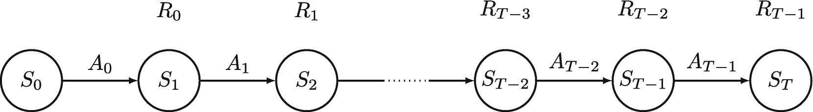
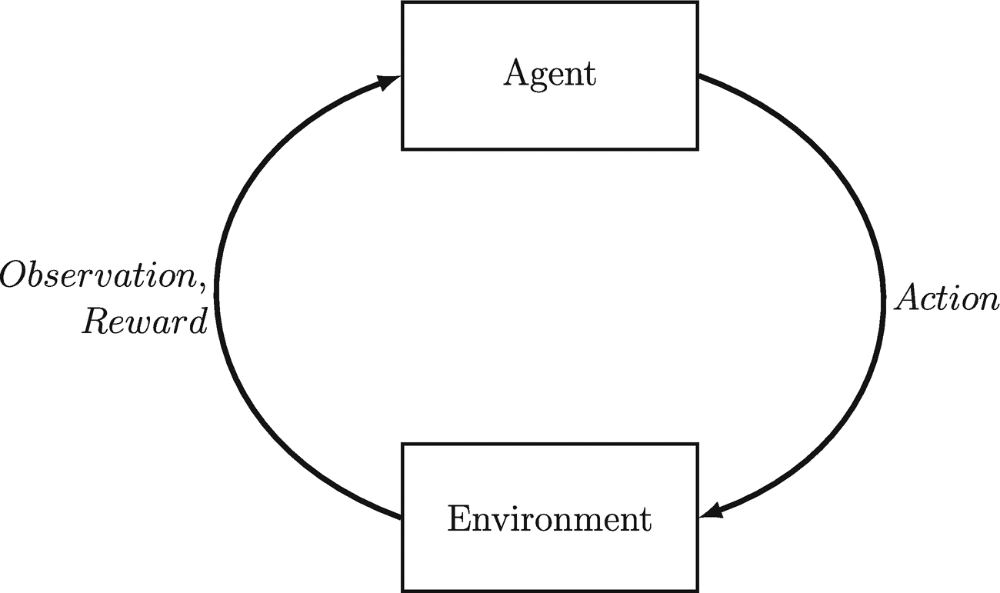
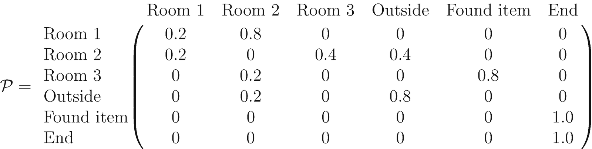
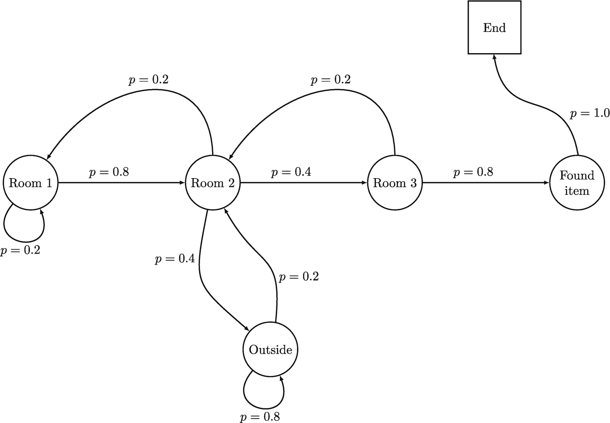
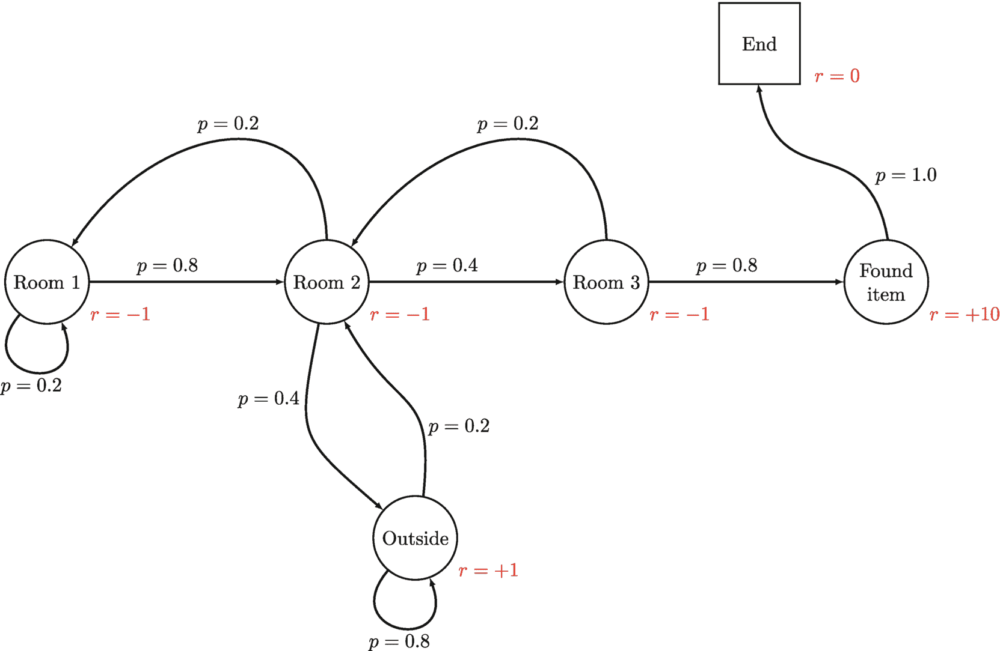
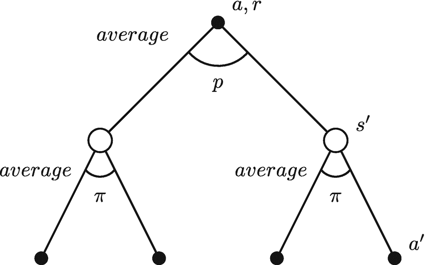

# 2. 马尔可夫决策过程

马尔可夫决策过程为处理强化学习中的序列决策问题提供了一个强大的框架。其应用涵盖机器人学、金融和最优控制等多个领域。

在本章中，我们概述了马尔可夫决策过程的关键组成部分，并演示了如何使用马尔可夫决策过程框架来表述一个基本的强化学习问题。我们深入探讨了策略和价值函数的概念，研究了贝尔曼方程，并说明了如何利用它们来更新状态或状态-动作对的价值。我们只关注有限马尔可夫决策过程，即状态空间和动作空间都是有限的情况。虽然我们主要假设一个确定性的问题设定，但我们也会讨论适用于随机问题的数学方面。

如果要选择整本书中最重要的一章，那么这一章无疑会排在我们列表的首位。其概念和数学方程至关重要，以至于在整本书中都会不断地被引用和使用。


### 2.1 马尔可夫决策过程概述

从高层次来看，马尔可夫决策过程（MDP）是一个用于在不确定性下对序贯决策问题进行建模的数学框架。其主要思想是用状态、动作、转移模型和奖励函数来表示问题，然后利用这种表示来寻找一个最优策略，该策略能最大化随时间累积的期望总奖励。

更具体地说，一个 MDP 包含以下组成部分：

- **状态**（`S`）：智能体可能处于的所有环境配置或观测结果的集合。例如，在国际象棋游戏中，状态可能是当前的棋盘布局；而在金融投资组合管理问题中，状态可能是各种股票的当前价格。状态的其他示例包括机器人的位置和速度、车辆的位置和方向，或供应链中的库存量。

- **动作**（`A`）：智能体可以采取的所有可能动作的集合。在国际象棋游戏中，这可能包括移动棋子；而在金融投资组合管理问题中，这可能包括买入或卖出某只特定股票。动作的其他示例包括加速或减速机器人、转动车辆，或补充供应链中的库存。

- **转移模型或动力学函数**（`P`）：一个函数，定义了在给定当前状态`s`和所采取的动作`a`的情况下，转移到新状态`s'`的概率。换句话说，它模拟了环境如何响应智能体的动作。例如，在国际象棋游戏中，转移模型可能由游戏规则和玩家的走法决定。在金融问题中，转移模型可能是股票价格波动的结果。转移模型的其他示例包括机器人运动的物理规律、车辆运动的动力学，或供应链中的供需动态。

- **奖励函数**（`R`）：一个函数，指定了在给定状态下采取某个动作所获得的奖励或付出的代价。换句话说，它模拟了智能体任务的目标。例如，在国际象棋游戏中，奖励函数可能为获胜赋予正值，为失败赋予负值；而在金融问题中，奖励函数可能基于最大化利润或最小化风险。奖励函数的其他示例包括机器人运动的能效、车辆运动的燃油效率，或供应链的利润率。

#### 为什么 MDP 有用？

MDP 为决策问题建模提供了一个强大的框架，因为它们允许我们使用数学概念来模拟现实世界的问题。例如，MDP 可用于：

- 对机器人导航问题进行建模，其中机器人必须决定采取哪些动作才能到达特定目标并避开障碍物。例如，状态可能包括其当前位置和环境中的障碍物，动作可能包括向不同方向移动。转移模型可由机器人运动的物理规律决定，奖励函数可基于尽快到达目标同时避免与障碍物碰撞。

- 优化投资组合管理策略，其中智能体必须决定买入或卖出哪些股票，以在最小化风险的同时最大化利润。例如，状态可能包括不同股票的当前价格和智能体的投资组合持有量，动作可能包括买入或卖出股票。转移模型可能是股票价格波动的结果，奖励函数可基于智能体的利润或风险调整后的收益。

- 设计个性化推荐系统，其中智能体必须根据用户过去的行为决定向特定用户推荐哪些物品。例如，状态可能包括用户过去的购买记录和智能体当前的推荐内容，动作可能包括推荐不同的物品。转移模型可能是用户对推荐的反应，奖励函数可基于用户对推荐物品的喜爱程度或是否进行了购买。

- 解决各个领域的许多其他决策问题，例如交通控制、资源分配和游戏博弈。在每种情况下，MDP 框架都提供了一种方法，用状态、动作、转移概率和奖励来对问题进行建模，然后通过寻找一个能最大化随时间累积的期望总奖励的策略来求解。

我们使用 MDP 对问题进行建模的目标，最终是为了求解 MDP 问题。要求解一个 MDP，我们必须找到一个策略`π`，该策略将状态映射到动作，从而最大化随时间累积的期望总奖励。换句话说，该策略告诉智能体在每个状态下应采取什么动作来实现其目标。寻找最优策略的一种方法是使用值迭代算法或策略迭代算法，这些算法基于贝尔曼方程迭代更新状态（或状态-动作对）的值，直到找到最优策略。这些基本概念将在本章及后续章节中探讨。

总之，MDP 为在各个领域对决策问题进行建模提供了一种灵活而强大的方式。通过将问题表述为 MDP，我们可以利用数学概念来分析问题，并找到一个能最大化随时间累积的期望总奖励的最优策略。MDP 的关键组成部分是状态、动作、动力学函数和奖励函数，它们可以根据具体问题进行定制。


### 2.2 使用 MDP 建模强化学习问题

马尔可夫决策过程（MDP）以对研究强化学习有用的方式，对状态、动作和奖励的序列进行建模。例如，一个在迷宫中导航的机器人可以被建模为一个 MDP，其中状态表示机器人在迷宫中的位置，动作表示机器人的移动选择，奖励表示机器人向目标前进的进度。

在此背景下，我们使用下标 `t` 来索引过程的不同阶段（即序列的时间步），其中 `t` 可以是任何离散值，例如 `t = 0, 1, 2, ...`。请注意，时间步并非像秒或分钟那样的常规时间间隔，而是指过程的不同阶段。例如，在本书中，`S_t`、`A_t` 和 `R_t` 通常表示当前时间步 `t`（或过程的当前阶段）的状态、动作和奖励。

值得注意的是，智能体在观察到环境状态 `S_t` 后，可能需要花费相当长的时间才能决定采取动作 `A_t`。只要智能体不违反环境规则，它就可以按照自己的节奏灵活地采取行动。因此，常规的时间间隔在这种情况下并不适用。

在本书中，我们采用了艾玛·布伦希尔教授在其出色的强化学习课程[1]中所使用的数学符号。我们通常假设奖励仅取决于状态 `S_t` 和智能体采取的动作 `A_t`。为简单起见，我们对奖励使用相同的索引 `t`，表示为 `R_t = R(S_t, A_t)`，而有些人可能更倾向于使用 `R_{t+1} = R(S_t, A_t, S_{t+1})` 而不是 `R_t`，以强调奖励也取决于后续状态 `S_{t+1}`，正如萨顿和巴托在他们的书中所讨论的那样。³ 然而，这种替代表达有时会导致混淆，尤其是在像本书中介绍的这种简单情况下，奖励并不依赖于后续状态。

重要的是要记住，在实际实现中，奖励通常会在一个时间步之后与后续状态一起被接收，如图 2.1 所示。

我们在 `S_t`、`A_t`、`R_t` 中使用大写字母，因为这些是随机变量，并且这些随机变量的实际结果可能会有所不同。当我们谈论这些随机变量的具体结果时，我们通常使用小写字母 `s`、`a`、`r`。

综上所述，状态空间、动作空间、转移模型和奖励函数共同提供了对环境以及智能体与其交互的完整描述。在接下来的章节中，我们将探讨这些元素如何相互作用，从而为解决强化学习问题奠定基础。

为了更好地理解智能体与环境之间的交互，我们可以将交互循环展开如下，如图 2.2 所示：

- 智能体从环境中观察状态 `S_0`。
- 智能体在环境中采取动作 `A_0`。
- 环境转移到一个新状态 `S_1`，并产生一个奖励信号 `R_0`，其中 `R_0` 以 `S_0` 和 `A_0` 为条件。
- 智能体从环境中接收奖励 `R_0` 以及后续状态 `S_1`。
- 智能体决定采取动作 `A_1`。
- 交互继续进入下一阶段，直到过程达到终止状态 `S_T`。一旦达到终止状态，不再采取进一步动作，并且可以从初始状态 `S_0` 开始一个新的回合。



展开的智能体-环境迭代循环的状态转移图。状态 S 0 通过动作 A 0 导致状态 S 1。状态 S 1 具有奖励 R 0，并进而导致后续状态，最终以状态 S T 和奖励 R T 减 1 结束。

图 2.2 针对回合制问题按时间展开的智能体-环境迭代循环示例



智能体-环境交互的循环图。标有“动作”的箭头从智能体指向环境。标有“观察和奖励”的箭头从环境指向智能体。

图 2.1 智能体-环境交互

当智能体观察到第一个环境状态 `S_0` 时没有奖励，这是因为智能体尚未与环境进行交互。如前所述，在本书中，我们假设奖励函数 `R_t = R(S_t, A_t)` 以环境的当前状态 `S_t` 和智能体采取的动作 `A_t` 为条件。由于在状态 `S_0` 中没有采取任何动作，因此没有与初始状态相关的奖励信号。然而，在实践中，有时为了方便，可以包含一个“虚假的”初始奖励，例如使用 0，以简化代码。

总之，MDP 为建模强化学习问题提供了一个框架，其中智能体通过基于当前状态采取动作与环境交互，并接收以当前状态和动作为条件的奖励。通过理解智能体与环境之间的交互，我们可以开发出能够学习做出良好决策并随时间推移最大化累积奖励的算法。


#### 马尔可夫性质

并非所有问题都能用 MDP 框架建模。**马尔可夫性质**是 MDP 框架适用必须满足的关键假设。该性质指出，系统的未来状态在给定当前状态的情况下与过去状态无关。更具体地说，后继状态`S_{t+1}`仅取决于当前状态`S_t`和动作`A_t`，而不取决于任何先前的状态或动作。

换句话说，马尔可夫性质是对环境状态的一种限制，该状态必须包含足够的历史信息以预测未来状态。具体而言，当前状态必须包含足够的信息来预测下一个状态，而无需了解过去状态和动作的完整历史。

```
P(S_{t+1} | S_t, A_t) = P(S_{t+1} | S_t, A_t, S_{t-1}, A_{t-1}, ..., S_1, A_1, S_0, A_0)
```

(2.1)

例如，一个试图在房间内导航的机器人，只有在满足马尔可夫性质时才能使用 MDP 框架建模。如果机器人的移动取决于其完整历史（包括其过去的位置和动作），那么马尔可夫性质将被违反，MDP 框架将不再适用。这是因为机器人的当前位置将不包含足够的信息来预测其下一个位置，从而难以对环境进行建模并基于该模型做出决策。

#### 服务犬示例

在此示例中，我们设想训练一只服务犬为主人取回物品。训练在一栋有三个房间的房屋内进行，其中一个房间内放有个人物品，狗必须取回该物品并交给主人或训练员。该任务属于**情节式强化学习**问题类别，因为一旦狗取回物品，任务即被视为完成。为简化任务，我们始终将物品放置在相同（或几乎相同）的位置，并随机初始化起始状态。此外，其中一个房间通向可以自由玩耍的前院。此场景如图 2.3 所示。

在本书中，我们将使用这个服务犬示例来演示如何将强化学习问题建模为 MDP（马尔可夫决策过程），解释环境的动态函数，并构建策略。随后，我们将介绍具体的算法，如动态规划、蒙特卡洛方法和时序差分方法，来解决服务犬的强化学习问题。

### 2.3 马尔可夫过程或马尔可夫链

在开始讨论马尔可夫决策过程（MDP）之前，我们首先定义什么是马尔可夫过程（马尔可夫链）。马尔可夫过程是一种无记忆的随机过程，其中转移到新状态的概率仅取决于当前状态，而不取决于任何过去的状态或动作。它是 MDP 中最简单的研究情况，因为它只涉及一系列状态，不包含任何奖励或动作。尽管看似基础，但研究马尔可夫链非常重要，因为它们提供了关于序列中状态如何相互影响的基本见解。这种理解在处理更复杂的 MDP 时会很有帮助。

一个房屋平面布局图，包含相邻的房间 1、2 和 3。目标位于房间 3 内。房间 2 有一扇门通向一个标有“室外”的阴影不规则区域。

**图 2.3** 用于说明服务犬示例的简单示意图

马尔可夫链可以定义为一个元组`(S, P)`，其中`S`是一个有限的状态集合，称为状态空间；`P`是环境的动态函数（或转移模型），它指定了从当前状态`s`转移到后继状态`s'`的概率。由于马尔可夫链中没有动作，我们在动态函数`P`中省略了动作。从状态`s`转移到状态`s'`的概率记为`P(s'|s)`。

例如，我们可以用图来建模一个马尔可夫链，其中每个节点代表一个状态，每条边代表从一个状态到另一个状态的可能转移，每条边都关联一个转移概率。这有助于我们理解序列中的状态如何相互影响。我们将服务犬示例建模为马尔可夫链，如图 2.4 所示。空心圆代表非终止状态，方框代表终止状态。直线和曲线代表从当前状态`s`到其后继状态`s'`的转移，每条可能的转移都关联一个转移概率`P(s'|s)`。例如，如果智能体当前处于*房间 1*状态，则环境有 0.8 的概率转移到后继状态*房间 2*，有 0.2 的概率停留在同一状态*房间 1*。请注意，这些概率是随机选择的，用以说明环境动态函数的概念。


#### 马尔可夫链的转移矩阵

转移矩阵 `P` 是表示马尔可夫链动力学函数（或转移模型）的一种便捷方式。它将所有可能的状态转移列在一个矩阵中，其中每一行代表当前状态 `s`，每一列代表后继状态 `s'`。从状态 `s` 转移到状态 `s'` 的转移概率记为 `P(s'|s)`。由于我们讨论的是概率，因此每一行的总和始终等于 1.0。下面，我们列出服务犬马尔可夫链的转移矩阵：



服务犬马尔可夫链的转移矩阵。房间 1、房间 2、房间 3、室外、找到物品和结束对应的列和行表示状态。



服务犬马尔可夫链的转移图。房间 1 通向房间 2，接着是房间 3 和找到物品，箭头分别对应 `p` 等于 0.8、`p` 等于 0.4 和 `p` 等于 0.8。室外通过 `p` 等于 0.4 和 0.2 连接到房间 2。找到物品通过 `p` 等于 1.0 通向结束。

**图 2.4** 服务犬马尔可夫链

有了环境的动力学函数，我们可以从环境中采样一些状态转移序列 `S0, S1, S2, ...`。例如：

- 片段 1：（房间 1，房间 2，房间 3，找到物品，结束）
- 片段 2：（房间 3，找到物品，结束）
- 片段 3：（房间 2，室外，房间 2，房间 3，找到物品，结束）
- 片段 4：（室外，室外，室外，……）

我们现在对环境中的状态转移有了基本了解；接下来，让我们在过程中加入奖励。

### 2.4 马尔可夫奖励过程

如前所述，强化学习智能体的目标是最大化奖励，因此下一步自然是在马尔可夫链过程中加入奖励。马尔可夫奖励过程（MRP）是马尔可夫链的扩展，其中在过程中加入了奖励。在马尔可夫奖励过程中，智能体不仅观察状态转移，还会在此过程中接收奖励信号。注意，MRP 中仍然不涉及动作。我们可以将马尔可夫奖励过程定义为一个元组 `(S, P, R)`，其中：

- `S` 是一个有限的状态集合，称为状态空间。
- `P` 是环境的动力学函数（或转移模型），其中 `P(s'|s) = P[S_{t+1}=s' | S_t=s]` 指定了在当前状态 `s` 下，环境转移到后继状态 `s'` 的概率。
- `R` 是环境的奖励函数。`R(s) = E[R_t | S_t=s]` 是当智能体处于状态 `s` 时，环境提供的奖励信号。

如图 2.5 所示，我们在服务犬示例中为每个状态添加了一个奖励信号。正如我们在第 1 章中简要讨论过的，我们希望奖励信号与我们的目标（即找到物品）一致，因此我们决定对*找到物品*状态使用最高的奖励信号。对于*室外*状态，奖励信号为 +1，因为与在不同房间之间徘徊相比，在室外玩耍可能对智能体来说更愉快。



带有奖励信号的服务犬 MRP 转移图。房间 1 通向房间 2，接着是房间 3（`r` 等于 -1）和找到物品（`r` 等于 +10），通过标记为 `p` 等于 0.8、`p` 等于 0.4 和 `p` 等于 0.8 的箭头。室外具有 `r` 等于 +1，结束具有 `r` 等于 0。

**图 2.5** 服务犬 MRP

有了奖励信号，我们可以计算智能体在这些不同样本序列中可能获得的总奖励，其中总奖励是针对整个序列计算的：

- 片段 1：（房间 1，房间 2，房间 3，找到物品，结束）
  - **总奖励** `= -1 - 1 - 1 + 10 + 0 = 7.0`
- 片段 2：（房间 3，找到物品，结束）
  - **总奖励** `= -1 + 10 = 9.0`
- 片段 3：（房间 2，室外，房间 2，房间 3，找到物品，结束）
  - **总奖励** `= -1 + 1 - 1 - 1 + 10 + 0 = 8.0`
- 片段 4：（室外，室外，室外，……）
  - **总奖励** `= 1 + 1 + ... = ∞`


#### 回报

为了量化智能体在一系列状态中能获得的总奖励，我们使用一个不同的术语——*回报*。回报 `G_t` 就是从时间步 `t` 到序列结束时的奖励总和，其数学定义如公式 (2.2) 所示，其中 `T` 是情节式强化学习问题的终止时间步。

```
G_t = R_t + R_{t+1} + R_{t+2} + ... + R_{T-1}
```

(2.2)

公式 (2.2) 的一个问题是，当过程中存在递归或循环时（例如我们示例序列中的情节 4），回报 `G_t` 可能会变成无穷大。对于持续式强化学习问题（任务没有自然终点），回报 `G_t` 也很容易变成无穷大。为了解决这个问题，我们引入了折扣因子。

折扣因子 `γ` 是一个参数，满足 `0 ≤ γ ≤ 1`，它帮助我们解决无限回报问题。通过对未来时间步收到的奖励进行折扣，我们可以避免回报变成无穷大。当我们将折扣因子加入公式 (2.2) 的常规回报中时，回报就变成了从时间步 `t` 到某个视界 `H` 的*折扣奖励总和*，其中 `H` 可以是情节的长度，对于持续式强化学习问题甚至可以是无穷大。在本书的剩余部分，我们将使用公式 (2.3) 作为回报的定义。请注意，我们省略了即时奖励 `R_t` 的折扣 `γ`，因为 `γ⁰ = 1`。

```
G_t = R_t + γ R_{t+1} + γ² R_{t+2} + ... + γ^{H-1-t} R_{H-1}
```

(2.3)

我们想强调的是，折扣因子 `γ` 不仅帮助我们解决无限回报问题，还能影响智能体的行为（当我们稍后讨论价值函数和策略时，这一点会更清楚）。例如，当 `γ = 0` 时，智能体只关心即时奖励；而当 `γ` 接近 1 时，未来奖励与即时奖励变得同等重要。虽然存在不使用折扣的方法，但这些方法的数学复杂性超出了本书的范围。

强化学习中回报 `G_t` 有一个有用的性质：回报 `G_t` 等于即时奖励 `R_t` 与下一时间步的折扣回报 `γ G_{t+1}` 之和。我们可以将其递归地重写，如公式 (2.4) 所示。这个递归性质在 MRP、MDP 和强化学习中非常重要，因为它构成了一系列关键数学方程和算法的基础，我们将在本章及后续几章中介绍这些内容。

```
G_t = R_t + γ R_{t+1} + γ² R_{t+2} + γ³ R_{t+3} + ...
    = R_t + γ (R_{t+1} + γ R_{t+2} + γ² R_{t+3} + ...)
    = R_t + γ G_{t+1}
```

(2.4)

我们可以计算特定 MRP 甚至 MDP 的示例序列的回报 `G_t`。以下展示了我们服务犬示例中一些样本情节的回报，其中我们使用折扣因子 `γ = 0.9`：

- 情节 1：（房间 1，房间 2，房间 3，找到物品，结束）
  - `G_0 = -1 -1 * 0.9 -1 * 0.9² + 10 * 0.9³ = 4.6`
- 情节 2：（房间 3，找到物品，结束）
  - `G_0 = -1 + 10 * 0.9 = 8.0`
- 情节 3：（房间 2，室外，房间 2，房间 3，找到物品，结束）
  - `G_0 = -1 + 1 * 0.9 -1 * 0.9² -1 * 0.9³ + 10 * 0.9⁴ = 4.9`
- 情节 4：（室外，室外，室外，……）
  - `G_0 = 1 + 1 * 0.9 + 1 * 0.9² + ... = 10.0`

只要折扣因子不为 1，即使 MRP 过程中存在循环，我们也不会遇到无限回报问题。比较这些不同样本序列的回报，我们可以看到情节 4 的回报值最高。然而，如果智能体陷入循环，一直停留在*室外*状态，它就无法实现目标（即在*房间 3* 中找到物品）。这并不一定意味着奖励函数有缺陷。要证明这一点，我们需要使用价值函数，我们将在接下来的章节中详细解释。


#### MRP 的价值函数

在马尔可夫奖励过程（MRP）中，回报 `G_t` 衡量的是从时间步 `t` 到回合结束所获得的总未来奖励。然而，仅比较不同样本序列的回报有其局限性，因为它只衡量从特定时间步开始的回报。这对于处于特定环境状态并需要做出决策的智能体来说帮助不大。价值函数可以帮助我们克服这个问题。

形式上，MRP 的状态价值函数 `V(s)` 衡量的是从状态 `s` 开始到时间范围 `H` 的*期望回报*。我们称之为期望回报，是因为从状态 `s` 到时间范围 `H` 的轨迹通常是一个随机变量。简单来说，`V(s)` 衡量的是从状态 `s` 开始到时间范围 `H` 的平均回报。对于回合制问题，时间范围就是终止时间步，即 `H=T`。

```
V(s) = E[G_t | S_t = s]
```

(2.5)

MRP 的状态价值函数 `V(s)` 也具有递归性质，如公式 (2.6) 所示。公式 (2.6) 也被称为 `V(s)`（针对 MRP）的贝尔曼期望方程。我们称之为贝尔曼期望方程，是因为它以递归方式书写，但仍然带有期望符号 `E`。

```
V(s) = E[G_t | S_t = s]
     = E[R_t + γ R_{t+1} + γ² R_{t+2} + ... | S_t = s]
     = E[R_t + γ (R_{t+1} + γ R_{t+2} + ...) | S_t = s]
     = E[R_t + γ G_{t+1} | S_t = s]
     = E[R_t + γ V(S_{t+1}) | S_t = s]
```

(2.6)

```
= R(s) + γ Σ_{s' ∈ S} P(s'|s) V(s'), 对于所有 s ∈ S
```

(2.7)

公式 (2.7) 被称为 `V(s)`（针对 MRP）的贝尔曼方程。我们可以看到，从公式 (2.6) 到公式 (2.7) 的步骤是如何通过考虑所有可能的后继状态 `s'` 的值，并根据 MRP 环境中状态转移概率 `P(s'|s)` 对每个值进行加权，从而去掉了方程中的期望符号 `E`。

#### 计算示例

作为示例，我们可以使用公式 (2.7) 来计算特定状态的期望回报。假设状态 *房间 2* 的初始值为 5.0，状态 *找到物品* 的初始值为 10.0，如图 2.6 所示（这些初始值是随机选择的），并且我们使用无折扣 `γ=1.0`。现在让我们计算状态 *房间 3* 的期望回报。由于我们已经知道马尔可夫奖励过程（MRP）的模型（动态函数和奖励函数），我们知道无论后继状态 `s'` 是什么，即时奖励都是 `-1`。环境有 0.8 的概率转移到后继状态 *找到物品*，该后继状态的价值为 `V(找到物品)=10.0`。还有 0.2 的概率环境会转移到后继状态 *房间 2*，该后继状态的价值为 `V(房间 2)=5.0`。因此，我们可以使用贝尔曼方程来计算状态 `V(房间 3)` 的估计值，如下所示：

```
V(房间 3) = -1 + 0.8 * 10.0 + 0.2 * 5.0 = 8.0
```

当然，这个状态 *房间 3* 的估计值并不准确，因为我们是从随机猜测的值开始的，并且没有包含其他状态。但是，如果我们包含状态空间中的所有状态，并重复该过程大量次数，最终估计值将非常接近真实值。

一个用于计算 `γ=1.0` 时房间 3 期望回报的状态转移图。从左到右，4 个状态的值分别为 0.0、5.0、8.0 和 10.0，通过箭头连接。房间 3 的值为 8.0，奖励为负 1，并通过 `p=0.2` 连接到房间 2，通过 `p=0.8` 连接到已找到状态。

**图 2.6** 如何为服务犬 MRP 计算状态值的示例，`γ=1.0`；数字是随机选择的

图 2.7 显示了服务犬 MRP 各状态的真实值。这些值是使用公式 (2.7) 和动态规划计算得出的，动态规划是一种迭代方法，可用于求解 MDP。我们将在下一章介绍动态规划方法。在本实验中，我们使用折扣因子 `γ=0.9`。我们可以看到，状态 *找到物品* 在所有状态中具有最高的价值。

我们为什么要估计状态价值？因为它可以帮助智能体做出更好的决策。如果智能体知道哪个状态更好（就期望回报而言），它就可以选择可能引导它进入这些更好状态的动作。例如，在图 2.7 中，如果当前状态是 *房间 2*，那么最佳后继状态是 *房间 3*，因为它在 *房间 2* 所有可能的后继状态中具有最高的状态价值 7.0。通过选择能导向高价值状态的动作，智能体可以最大化其长期期望回报。


### 2.5 马尔可夫决策过程

现在我们来讨论 MDP 的细节。与 MRP 扩展马尔可夫链的方式类似，马尔可夫决策过程（MDP）通过将动作和策略纳入过程来扩展 MRP。MDP 包含所有必要的组成部分，包括状态、奖励、动作和策略。我们可以将 MDP 定义为一个元组 `(S, A, P, R)`：

- `S` 是有限的状态集合，称为状态空间。
- `A` 是有限的动作集合，称为动作空间。
- `P` 是环境的动态函数（或转移模型），其中 `P(s' | s, a) = P[S_{t+1} = s' | S_t = s, A_t = a]` 指定了在当前状态 `s` 下采取动作 `a` 时，环境转移到后继状态 `s'` 的概率。
- `R` 是环境的奖励函数；`R(s, a) = E[R_t | S_t = s, A_t = a]` 是当智能体处于状态 `s` 并采取动作 `a` 时，环境提供的奖励信号。

服务犬 MRP 的状态转移图，其中 gamma 等于 0.9。房间 1、房间 2、房间 3 和已找到物品的状态值分别为 2.5、4.2、7.0 和 10.0，并通过带有奖励信号的加权箭头连接。结束的状态值为 0.0。外面的状态值为 6.3。

**图 2.7** 服务犬 MRP 的状态值，`γ = 0.9`

请注意，动态函数 `P` 和奖励函数 `R` 现在取决于智能体在时间步 `t` 选择的动作 `A_t`。

在图 2.8 中，我们使用 MDP 对服务犬示例进行了建模。在继续之前，我们想解释一下对图 2.8 所做的一些小改动。首先，我们将状态*已找到物品*和*结束*合并为一个终止状态*已找到物品*。这样做是合理的，因为奖励现在取决于 `(s, a)`，并且在智能体到达*已找到物品*状态后，没有其他有意义的状态。其次，图 2.8 中的直线和曲线表示智能体在某个状态下可以选择的有效动作，而不是状态转移概率。最后，奖励现在取决于智能体选择的动作，并且奖励值略有不同。

实际上，我们的服务犬示例现在被建模为一个确定性（平稳）的强化学习环境。这意味着，如果智能体在相同状态 `s` 下采取相同动作 `a`，那么后继状态 `s'` 和奖励 `r` 将始终相同，无论我们重复 100 次还是 100 万次。转移到后继状态 `s'` 的概率保证为 1.0。例如，如果智能体处于*房间 2* 状态并选择*去外面*，那么后继状态将始终是*外面*；后继状态是*房间 3* 或*房间 1* 的概率为零。

服务犬 MDP 的状态转移图。房间 1 和房间 2 有指向房间 1 的箭头（r 等于 -2）和指向房间 2 的箭头（r 等于 -1）。房间 2 和房间 3 有指向房间 3 和房间 2 的箭头。房间 2 和外面有指向外面和里面的箭头。房间 3 通过搜索指向已找到物品。

**图 2.8** 服务犬 MDP

我们可以列出服务犬 MDP 的 `S, A, R` 集合中的所有元素；请注意，并非所有动作在每个状态下都是可用（或合法）的：

- `S` = {房间 1, 房间 2, 房间 3, 外面, 已找到物品}
- `A` = {去房间 1, 去房间 2, 去房间 3, 去外面, 去里面, 搜索}
- `R` = {-1, -2, +1, 0, +10}

正如我们之前解释的，我们的服务犬 MDP 是一个确定性（平稳）的强化学习环境。动态函数与我们之前的示例略有不同。对于 MDP，从当前状态 `s` 到其后继状态 `s'` 的转移取决于当前状态 `s` 和智能体选择的动作 `a`。对于确定性环境，合法动作 `a ∈ A(s)` 的转移概率始终为 1.0，而非法动作 `a ∉ A(s)`（即环境中不允许的动作）的转移概率为 0。智能体绝不应选择非法动作，因为大多数环境在某种程度上都强制执行检查。例如，在围棋游戏中，如果玩家走出非法一步，他们将自动输掉比赛。

我们仍然可以为服务犬 MDP 的动态函数构建一个单一矩阵，但这次它需要是一个 3D 矩阵。由于绘制 3D 矩阵并不容易，我们选择使用 2D 平面来解释单个状态的概念。假设环境的当前状态是*房间 2*，平面的每一行代表一个动作，每一列代表一个后继状态 `s'`。为了保持一致性，我们将所有非法动作（*去房间 2*、*去里面*、*搜索*）转移到后继状态*房间 2* 的概率设置为 1.0。这仅仅意味着这些非法动作不会影响环境的状态。

服务犬 MDP 动态函数的转移矩阵。列是房间 1、房间 2、房间 3、外面和已找到物品。行是去房间 1、去房间 2、去房间 3、去外面、去里面和搜索。

为了说明起见，让我们假设我们的服务犬 MDP 不是确定性的，而是一个随机强化学习环境。例如，每个合法动作也可能随机导致后继状态*外面*。在这种情况下，随机环境的转移矩阵将如下所示：

随机环境下服务犬 MDP 的转移矩阵。列是房间 1、房间 2、房间 3、外面和已找到物品，行是去房间 1、去房间 2、去房间 3、去外面、去里面和搜索。


#### 策略

在强化学习和马尔可夫决策过程（MDP）中，智能体有能力决定如何在环境中行动，但在给定状态下如何选择动作或使用什么规则进行决策并不总是明确的。为了解决这个问题，我们引入了策略（`policy`）的概念。

形式上，策略`π`是一个函数，它将每个状态`s`映射到该状态`s`下所有可能动作集合上的概率分布。策略可以是确定性的，意味着对于给定状态总是选择相同的动作；也可以是随机性的，意味着根据概率分布选择动作。例如，如果某个特定状态有四个动作`a1`、`a2`、`a3`和`a4`，其中`a1`在奖励方面是最佳动作，`a4`是最差动作，`a2`优于`a3`，那么确定性策略会始终选择`a1`，而随机性策略可能以 60%的概率选择`a1`，20%的概率选择`a2`，15%的概率选择`a3`，5%的概率选择`a4`。

从数学上讲，我们可以将策略表示为一组函数的集合，每个函数将特定的环境状态`s`映射到所有动作`a ∈ A(s)`上的概率分布。这可以写成：

```
π(a|s) = P[A_t = a | S_t = s], 对于所有 s ∈ S, a ∈ A
```

(2.8)

对于任何状态`s`，所有可能动作的概率之和必须等于 1：

```
∑_{a ∈ A} π(a|s) = 1.0
```

有限 MDP 的可能确定性策略数量为`N(A)^(N(S))`，其中`N(S)`是状态空间的大小，`N(A)`是动作空间的大小。对于我们的服务犬 MDP，这个数字将是`6⁵ = 7776`。然而，这个估计包含了每个状态下的非法动作，因此仅包含合法动作的更准确估计是`3⁵ = 243`。

#### MDP 的价值函数

使用 MDP 建模强化学习问题的目标是找到最优策略，以便智能体在与环境交互时获得最大奖励。在 MDP 的框架内，我们可以通过使用价值函数来实现这一点。

价值函数衡量在遵循某个策略时的期望回报。MDP 有两种不同的价值函数：状态价值函数`Vπ`和状态-动作价值函数`Qπ`。

MDP 的状态价值函数`Vπ`衡量从状态`s`开始，然后遵循策略`π`直到某个时间范围`H`的期望回报，其中`H`可以是回合的长度，对于持续性问题也可以是无穷大；而策略`π`的状态-动作价值函数`Qπ`衡量从状态`s`开始，采取动作`a`，*然后*遵循策略`π`的期望回报。

公式(2.9)是状态价值函数`Vπ`的定义，它看起来与公式(2.5)几乎相同，只是现在附加了一个小下标`π`，这意味着这些值是针对特定策略衡量的。这应该是有道理的，因为智能体获得的奖励将取决于它在环境中的行为方式，而智能体依赖策略`π`在环境中行动。即使对于相同的状态`s`，不同的策略通常也会有不同的价值。

```
Vπ(s) = Eπ[G_t | S_t = s], 对于所有 s ∈ S
```

(2.9)

公式(2.10)是策略`π`的状态-动作价值函数`Qπ`的定义。

```
Qπ(s, a) = Eπ[G_t | S_t = s, A_t = a], 对于所有 s ∈ S, a ∈ A
```

(2.10)

`Vπ(s)`和`Qπ(s, a)`之间存在一个很好的关系。在策略`π`下，状态`s`的价值只是所有可能动作`a ∈ A`的状态-动作价值`Qπ(s, a)`的加权和，如公式(2.11)所示。

```
Vπ(s) = ∑_{a ∈ A} π(a|s) Qπ(s, a)
```

(2.11)


这里，`π(a|s)` 表示在遵循策略 `π` 时，在状态 `s` 下采取行动 `a` 的概率。

有了这个概念，我们可以定义 `V_π` 和 `Q_π` 的贝尔曼方程。方程 (2.12) 被称为 `V_π` 的贝尔曼期望方程；在该方程中，我们使用即时奖励 `R_t` 和后继状态的折现值 `γ V_π(S_{t+1})` 来计算在某个策略 `π` 下状态 `s` 的价值 `V_π(s)`。

```
V_π(s) = E_π[ G_t | S_t = s ]
       = E_π[ R_t + γ R_{t+1} + γ² R_{t+2} + ... | S_t = s ]
       = E_π[ R_t + γ ( R_{t+1} + γ R_{t+2} + ... ) | S_t = s ]
       = E_π[ R_t + γ G_{t+1} | S_t = s ]
       = E_π[ R_t + γ V_π(S_{t+1}) | S_t = s ]
```

(2.12)

```
     = Σ_{a ∈ A} π(a|s) [ R(s, a) + γ Σ_{s' ∈ S} P(s'|s, a) V_π(s') ], 对于所有 s ∈ S
```

(2.13)

方程 (2.13) 通过加权在策略 `π` 下处于状态 `s` 时采取行动 `a` 的概率，进一步扩展了 `V_π` 的贝尔曼期望方程；它还通过使用当智能体处于状态 `s` 并采取行动 `a` 时转移到特定后继状态的概率，来加权每个后继状态 `V_π(s')` 的价值。该方程也称为 `V_π` 的贝尔曼方程。

类似地，方程 (2.14) 是 `Q_π` 的贝尔曼期望方程，而方程 (2.16) 是 `Q_π` 的贝尔曼方程。请注意，方程 (2.16) 涉及对下一个状态-行动对价值的条件化，而其他方程则没有。这初看起来可能有些奇怪，但这是必要的，因为下一个状态和行动是随机变量，贝尔曼方程需要表达状态-行动对的期望值，并考虑所有可能的结果。具体来说，方程 (2.16) 涉及对后继状态-行动对 `(s', a')` 价值的一个新期望，因为该对依赖于智能体的策略。

```
Q_π(s, a) = E_π[ G_t | S_t = s, A_t = a ]
          = E_π[ R_t + γ R_{t+1} + γ² R_{t+2} + ... | S_t = s, A_t = a ]
          = E_π[ R_t + γ G_{t+1} | S_t = s, A_t = a ]
          = E_π[ R_t + γ Q_π(S_{t+1}, A_{t+1}) | S_t = s, A_t = a ]
```

(2.14)

```
     = R(s, a) + γ E_π[ Q_π(s', a') | S_{t+1} = s', A_{t+1} = a' ]
```

(2.15)

```
     = R(s, a) + γ Σ_{s' ∈ S} P(s'|s, a) Σ_{a' ∈ A} π(a'|s') Q_π(s', a'), 对于所有 s ∈ S, a ∈ A
```

(2.16)

由于 `V_π` 和 `Q_π` 之间存在如方程 (2.11) 所示的关系，我们也可以将 `Q_π` 的贝尔曼方程重写为

```
Q_π(s, a) = R(s, a) + γ Σ_{s' ∈ S} P(s'|s, a) V_π(s'), 对于所有 s ∈ S, a ∈ A
```

(2.17)

一个两层的 V pi 备份图。根节点是状态 s，其平均值分裂为两个行动，弧角为 pi。这两个行动具有弧角 p，并且每个都有两个状态转移。行动 a, r 导向状态 s'。

**图 2.9** `V_π` 的备份图

推导方程 (2.17) 所需的额外步骤是必要的，因为在某些情况下，我们没有对 `Q_π(s, a)` 的准确估计，正如我们稍后在书中介绍动态规划算法时会看到的那样。

贝尔曼方程是求解 `V_π` 和 `Q_π` 的核心。这意味着，如果我们使用价值函数方法（即估计状态或状态-行动对的价值），它们也是解决强化学习问题的核心。例如，`V_π` 的贝尔曼方程表明，一个状态的价值可以分解为两部分：即时奖励 `R(s, a)` 和后继状态的折现值 `γ Σ_{s' ∈ S} P(s'|s, a) V_π(s')`，这些后继状态是在策略 `π` 下可以从 `s` 到达的状态。在某些环境中，可能存在多个后继状态 `s'`，我们计算所有后继状态的期望值。类似的概念也适用于 `Q_π`，它估计在状态 `s` 下采取行动 `a` 并随后遵循策略 `π` 的价值。


贝尔曼方程构成了本书后续将介绍的一系列算法的基础，这些算法用于计算或近似`V_π`和`Q_π`，而这两者是所谓基于价值的强化学习方法的核心。贝尔曼方程帮助我们定义了将价值从后继状态传递回当前状态的规则，我们通常称之为更新或回溯操作。有时，我们也将其称为价值函数`V_π`和`Q_π`的更新（回溯）规则。价值函数方法是强化学习算法中的一类，本书后续还将讨论许多其他方法。

图 2.9 是一个回溯图，可以帮助我们更好地理解公式(2.13)。在该图中，空心圆代表状态，实心点代表动作。根节点是一个状态节点`s`，在状态`s`中，智能体可能有多个动作可供选择（我们只展示了两个动作）。具体选择哪个动作`a`将取决于智能体所遵循的策略`π`。对于每个动作`a`，环境可能会转移到多个后继状态`s'`之一（我们展示了两个这样的后继状态），其转移概率`p`取决于`(s, a)`。贝尔曼方程对所有可能的结果取期望（如根节点状态`s`和动作节点`a`下方的小弧线所示），并按结果发生的概率进行加权。项`∑_{a ∈ A} π(a|s)`表示对状态`s`下所有动作的期望，按策略`π`选择每个动作的概率进行加权。项`∑_{s' ∈ S} P(s'|s, a)`表示对所有可能的后继状态`s'`的期望，按环境的状态转移概率进行加权。

我们也可以为公式(2.16)绘制一个回溯图。在介绍`V_π`的贝尔曼方程时解释过的对所有可能结果取期望的思想，在此同样适用。从图 2.10 中可以看出，我们从第一个动作节点开始，该节点代表智能体采取的动作`a`。当智能体在状态`s`中采取动作`a`时（采取该动作时不一定遵循策略`π`），环境可能会转移到多个后继状态`s'`之一（我们展示了两个这样的后继状态），其转移概率`p`取决于`(s, a)`。在每个后继状态`s'`中，智能体可能有多个动作可供选择（我们只展示了两个动作）。具体选择哪个动作`a'`将取决于智能体所遵循的策略`π`。贝尔曼方程对所有可能的结果取期望（如后继状态`s'`下方的小弧线所示），并按结果发生的概率进行加权。



一个包含两层的`Q_π`回溯图。根节点有动作`a`和`r`，平均值分叉为两个状态，带有弧角`p`。这两个状态带有弧角`π`，每个状态有两个动作。动作`a`和`r`导向状态`s'`，状态`s'`又导向动作`a'`。

图 2.10
`Q_π`的回溯图


### `V_π` 的运算示例

为了更好地理解如何计算策略 `π` 下某个状态的价值，我们来看一个使用服务犬 MDP 的例子。我们选择了随机策略 `π`，这意味着选择每个动作的概率在所有（合法）动作之间均匀分布。在此例中，我们将重点计算状态 *房间 2* 的价值。在该状态下，智能体有三个合法动作可供选择：*前往房间 1*、*前往房间 3*、*前往室外*。我们对每个后续状态的初始猜测价值分别为 `V_π(房间 1) = 1.0`、`V_π(房间 3) = 10.0`、`V_π(室外) = 5.0`。假设我们已知环境模型，并使用折扣率 `γ = 0.9`，那么对于这个随机策略 `π`，我们该如何计算状态 *房间 2* 的价值呢？

根据环境模型，我们知道每个合法动作的即时奖励分别为 `-2`、`-1`、`0`，并且对于所有合法动作，从当前状态转移到后续状态的状态转移概率始终为 `1.0`。同时，我们也知道智能体选择每个合法动作的概率分别为 `0.33`、`0.33`、`0.33`。最后，我们已知（猜测）不同后续状态 `s'` 的价值。因此，我们只需将这些数值代入公式 (2.13)，即可计算出状态 *房间 2* 的价值：

```
V_π(房间 2) = 0.33 * (-2 + 0.9 * 1.0) + 0.33 * (-1 + 0.9 * 10.0) + 0.33 * (0 + 0.9 * 5.0)
            = 0.33 * -1.1 + 0.33 * 8 + 0.33 * 4.5
            = 3.76
```

上述结果如图 2.11 所示。当然，与 MRP 的运算示例类似，状态 *房间 2* 的估计价值并不精确。但如果我们将状态空间中的所有状态都纳入考虑，并重复该过程大量次数，最终估计值将非常接近真实值。这一思想本质上就是动态规划算法所做的事情，我们将在第 3 章中介绍。

一个用于计算房间 2 状态价值的状态转移图，其中 gamma 等于 0.9。房间 1、2、3 以及终点的状态价值分别为 1.0、3.8、10.0 和 0.0。价值为 3.8 的房间 2 具有以下动作：前往房间 1（r 等于 -2）、前往室外（r 等于 0）以及前往房间 3（r 等于 -1）。

**图 2.11** 针对服务犬 MDP，在随机策略 `π`、`γ = 0.9` 下，如何计算状态 *房间 2* 价值的示例；初始状态价值为随机选取。

### `Q_π` 的运算示例

让我们来看一个使用服务犬 MDP 计算状态-动作价值 `Q_π(s, a)` 的示例。条件与计算 `V_π(房间 2)` 的运算示例几乎相同。但在此例中，我们要计算状态 *房间 2* 下所有合法动作的状态-动作价值。

我们仍然使用随机策略 `π`，这意味着选择每个动作的概率在所有（合法）动作之间均匀分布。我们对每个状态的初始猜测价值分别为 `V_π(房间 1) = 1.0`、`V_π(房间 3) = 10.0`、`V_π(室外) = 5.0`。假设我们已知环境模型，并使用折扣率 `γ = 0.9`，那么对于这个随机策略，我们该如何计算状态 *房间 2* 下每个（合法）动作的状态-动作价值呢？

根据环境模型，我们知道每个合法动作的即时奖励分别为 `-2`、`-1`、`0`，并且对于每个状态-动作对 `(s, a)`，从当前状态转移到后续状态的状态转移概率始终为 `1.0`。同时，我们已知（猜测）不同后续状态 `s'` 的价值。因此，我们只需将这些数值代入公式 (2.17)，即可计算出每个动作的价值：

```
Q_π(房间 2, 前往房间 1) = -2 + 0.9 * 1.0 = -1.1
Q_π(房间 2, 前往房间 3) = -1 + 0.9 * 10.0 = 8.0
Q_π(房间 2, 前往室外)  = 0 + 0.9 * 5.0 = 4.5
```

一个用于计算状态-动作价值的示意图。价值为 3.8 的房间 2 具有以下动作：前往房间 1（r 等于 -2，q π 等于 -1.1）、前往室外（r 等于 0，q π 等于 4.5）以及前往房间 3（r 等于 -1，q π 等于 8.0）。

**图 2.12** 针对服务犬 MDP 的随机策略，如何计算状态 *房间 2* 下所有合法动作的状态-动作价值的示例。`γ = 0.9`；初始状态价值为随机选取。

我们可以使用公式 (2.11) 来计算在此随机策略 `π` 下状态 *房间 2* 的价值；其结果与我们之前使用公式 (2.13) 计算的结果完全相同：

```
V_π(房间 2) = 0.33 * -1.1 + 0.33 * 8 + 0.33 * 4.5 = 3.76
```

上述结果如图 2.12 所示。一旦我们获得了策略 `π` 下 `Q_π` 的准确估计，就可以很容易地利用它来帮助智能体做出更好的决策。智能体所需要做的就是在状态空间中的所有状态下，选择具有最高状态-动作价值的动作 `argmax_a Q_π(s, a)`。它不再需要进行单步前瞻了。


### 2.6 价值函数的替代贝尔曼方程

式(2.13)的一个局限性在于，我们假设环境产生的奖励信号仅取决于当前环境状态`s`和智能体采取的动作`a`。然而，在某些情况下，奖励函数还取决于后续状态`s'`，例如`R(s, a, s')`，此时`V_π`的贝尔曼方程需要重写以支持这种场景，如式(2.18)所示：

```
V_π(s) = E_π[ R_t + γ V_π(S_{t+1}) | S_t=s ]
       = Σ_{a∈A} π(a|s) [ Σ_{s'∈S} P(s'|s,a) R(s,a,s') + γ Σ_{s'∈S} P(s'|s,a) V_π(s') ]
       = Σ_{a∈A} π(a|s) Σ_{s'∈S} P(s'|s,a) [ R(s,a,s') + γ V_π(s') ], 对于所有 s∈S
```

(2.18)

类似地，对于奖励函数取决于后续状态`s'`的情况，我们可以重写`Q_π`的贝尔曼方程，如式(2.19)所示：

```
Q_π(s,a) = E_π[ R_t + γ Q_π(S_{t+1}, A_{t+1}) | S_t=s, A_t=a ]
         = Σ_{s'∈S} P(s'|s,a) R(s,a,s') + γ E_π[ Q_π(s',a') | S_{t+1}=s', A_{t+1}=a' ]
         = Σ_{s'∈S} P(s'|s,a) R(s,a,s') + γ Σ_{s'∈S} P(s'|s,a) Σ_{a'∈A} π(a'|s') Q_π(s',a')
         = Σ_{s'∈S} P(s'|s,a) [ R(s,a,s') + γ Σ_{a'∈A} π(a'|s') Q_π(s',a') ], 对于所有 s∈S, a∈A
```

(2.19)

然而，这两个方程都假设环境奖励是确定性的。这意味着相同的`(s, a)`或`(s, a, s')`总会产生相同的奖励信号。但在某些情况下，奖励也可能是随机的。此时，这些方程将无法捕捉这种随机性。

在他们著名的著作《*强化学习导论*》[2]中，Sutton 和 Barto 使用式(2.20)来涵盖这种场景。他们将动态函数`P`和奖励函数`R`合并为一个四参数函数`P(s', r|s, a)`，该函数同时解决了奖励可能取决于后续状态`s'`或奖励可能是随机的问题。

```
V_π(s) = E_π[ R_t + γ V_π(S_{t+1}) | S_t=s ]
       = Σ_{a∈A} π(a|s) Σ_{s'} Σ_{r} P(s', r|s, a) [ r + γ V_π(s') ]
       = Σ_{a∈A} π(a|s) Σ_{s', r} P(s', r|s, a) [ r + γ V_π(s') ], 对于所有 s∈S
```

(2.20)

同样在这种情况下，`Q_π`的贝尔曼方程变为

```
Q_π(s,a) = E_π[ R_t + γ Q_π(S_{t+1}, A_{t+1}) | S_t=s, A_t=a ]
         = Σ_{s'} Σ_{r} P(s', r|s, a) [ r + γ E_π[ Q_π(s',a') | S_{t+1}=s', A_{t+1}=a' ] ]
         = Σ_{s', r} P(s', r|s, a) [ r + γ Σ_{a'∈A} π(a'|s') Q_π(s',a') ], 对于所有 s∈S, a∈A
```

(2.21)

虽然式(2.20)和(2.21)更具通用性，但它们可能更难完全理解。为简单起见，本书将坚持使用贝尔曼方程(2.13)、(2.16)和(2.17)。


### 2.7 最优策略与最优价值函数

使用强化学习解决问题的目标是找到最优策略。如果能在整个状态空间中为每一个状态都找到能获得最高回报的策略，那么就可以认为该马尔可夫决策过程（MDP）已得到解决。这很合理，因为智能体获得这些最大回报的唯一方式就是在每个状态都选择最佳动作。正式地，最优策略 `π*` 被定义为：在状态空间的所有状态上，其状态价值 `Vπ` 均高于其他所有策略的策略（或策略集合），如公式 (2.22) 所示。

```
π*(s) = argmaxπ Vπ(s), 对所有 s ∈ S
```

(2.22)

理论上，每个 MDP 都存在一个优于或等于其他策略的最优策略 `π*`。MDP 可能存在多个最优策略。例如，在某个状态下，有两个或更多动作会导向相同的后继状态，并且这些不同动作的奖励相同。图 2.13 是一个小型 MDP 示例，用于说明这种情况。在这个小例子中，智能体需要驾驶一辆玩具车从状态 A 到达状态 C。但到达状态 C 的唯一途径是通过状态 B。在状态 A 中，智能体可以选择两个可能的动作（路线）；这两个动作都会导向状态 B。这两个动作的奖励相同，因此智能体可以选择其中任意一个动作。

我们不应将最优策略与确定性策略混淆。确定性策略在相同状态下总是选择相同的动作，但这并不意味着所选动作就是最佳动作。而最优策略则始终会选择最佳动作。

MDP 的最优策略（或策略集合）`π*` 共享相同的最优状态价值函数 `V*`：

```
V*(s) = maxπ Vπ(s), 对所有 s ∈ S
```

(2.23)

类似地，MDP 的最优策略（或策略集合）`π*` 共享相同的最优状态-动作价值函数 `Q*`：

```
Q*(s, a) = maxπ Qπ(s, a), 对所有 s ∈ S, a ∈ A
```

(2.24)

玩具车 MDP 的状态转移图。状态 A 通过向左箭头（r=0）和向右箭头（r=0）导向状态 B。状态 B 通过向前箭头（r=1）导向状态 C。

**图 2.13** 具有多个最优策略的玩具车 MDP 示例

最优状态价值函数 `V*` 与最优状态-动作价值函数 `Q*` 之间存在一个很好的关系。即，状态的最优价值 `V*(s)` 等于 `Q*(s, a)`，其中 `a` 是在该状态 `s` 下所有动作中具有最大状态-动作价值的动作。这很合理，因为如果智能体遵循最优策略，那么它选择最佳动作的概率为 1.0，选择非最佳动作的概率为 0（至少在确定性策略的情况下如此）。

```
V*(s) = maxa∈A Q*(s, a)
```

(2.25)

与常规价值函数类似，我们也可以将公式 (2.23) 以递归方式重写。这里，我们只关心具有最大即时奖励和后继状态折扣价值的动作。公式 (2.26) 是 `V*` 的贝尔曼最优方程：

```
V*(s) = maxa∈A Q*(s, a)
      = maxa E[Rt + γ Gt+1 | St = s, At = a]
      = maxa E[Rt + γ V*(St+1) | St = s, At = a]
      = maxa [R(s, a) + γ Σs'∈S P(s'|s, a) V*(s')], 对所有 s ∈ S
```

(2.26)

类似地，我们也可以推导出 `Q*` 的贝尔曼最优方程，如公式 (2.27) 所示：

```
Q*(s, a) = E[Rt + γ maxa' Q*(St+1, a') | St=s, At=a]
         = R(s, a) + γ Σs'∈S P(s'|s, a) maxa'∈A Q*(s', a'), 对所有 s ∈ S, a ∈ A(s)
```

(2.27)

由于 `V*(s) = maxa Q*(s, a)`，我们也可以使用 `V*` 重写 `Q*` 的贝尔曼最优方程：

```
Q*(s, a) = E[Rt + γ V*(St+1) | St=s, At=a]
         = R(s, a) + γ Σs'∈S P(s'|s, a) V*(s')
```

(2.28)

我们可以绘制贝尔曼最优方程的备份图。与对所有动作取平均不同，`V*` 的贝尔曼最优方程只考虑具有最高价值的动作，如图 2.14 所示。注意，它仍然对所有可能的后续状态 `s'` 取平均；然而，来自不同动作节点（此处显示了两个）的这些平均值并不会被加总在一起。


图 2.15 展示了公式 (2.27) 的备份图。类似地，这里只考虑能为后继状态 `s'` 产生最高价值的动作。

在实践中，我们更关心最优状态-动作价值函数 `Q*`。原因很简单：如果我们有了 `Q*`，就可以像公式 (2.29) 所示那样，基于 `Q*` 轻松构建一个最优策略。在这种情况下，我们总是（以概率 1.0）选择具有最大 `Q*(s, a)` 值的动作，那么 MDP 问题就解决了。

```
π*(a|s) = { 1, if a = argmax_{a∈A} Q*(s, a); 0, otherwise }
```

(2.29)

一个两层 `Q*` 的备份图。根节点包含动作 `a` 和奖励 `r`，其平均值分裂为两个状态，弧角为 `p`。这两个状态的弧角为 `π`，每个状态有两个动作，并取最大值。动作 `a` 和奖励 `r` 导向状态 `s'`，而状态 `s'` 又导向动作 `a'`。

**图 2.15** `Q*` 的备份图

一个两层 `V*` 的备份图。根节点包含状态 `s`，其最大值分裂为两个动作，弧角为 `π`。这两个动作的弧角为 `p`，每个动作有两个状态转移。动作 `a` 和奖励 `r` 导向状态 `s'`。

**图 2.14** `V*` 的备份图

如果我们只知道最优状态价值函数 `V*`，情况会变得稍微复杂一些。因为价值是对所有动作取平均，所以我们需要进行一步前瞻来确定哪个动作是最优的。为此，我们需要使用环境模型。

```
π*(a|s) = { 1, if a = argmax_{a∈A} Σ_{s'∈S} [R(s, a) + γ V*(s')]; 0, otherwise }
```

(2.30)

### 2.8 本章小结

本章全面介绍了马尔可夫决策过程（MDP），它是强化学习的基础。本章首先概述了 MDP，然后解释了如何利用 MDP 对强化学习问题进行建模。本章具有重要意义，因为它为本书后续内容奠定了基础。这里介绍的概念和数学公式至关重要，将在本书其余部分广泛使用，因此本章是一个值得高度关注的关键章节。

本章深入探讨了马尔可夫过程、马尔可夫奖励过程和马尔可夫决策过程的细节，清晰阐述了构成 MDP 的各个组成部分。我们研究了 MDP 的状态价值函数和状态-动作价值函数，以及如何利用强大的贝尔曼方程进行计算。此外，还探讨了价值函数的其他贝尔曼方程形式，从而更深入地理解这些关键函数在更复杂问题中的计算方法。

最后，本章涵盖了最优策略和最优价值函数，讨论了如何通过各种方法推导出它们。总体而言，本章为理解 MDP 及其在强化学习中的作用奠定了坚实基础。

本书下一章将重点介绍如何使用动态规划（DP）方法解决表格型强化学习问题。通过运用本章所学知识，读者将能更好地理解 DP 方法及其在强化学习中的应用。

脚注 1 2 3

