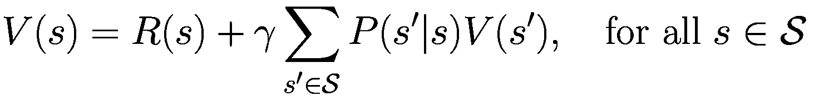
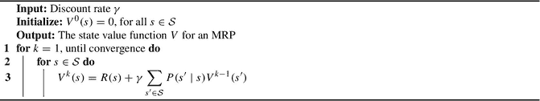
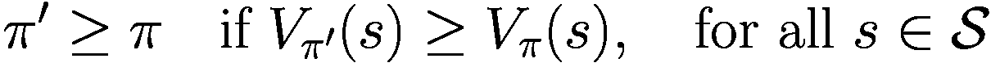
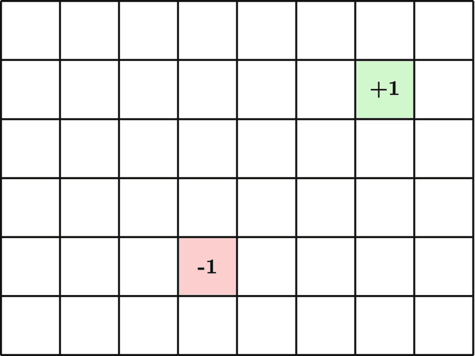
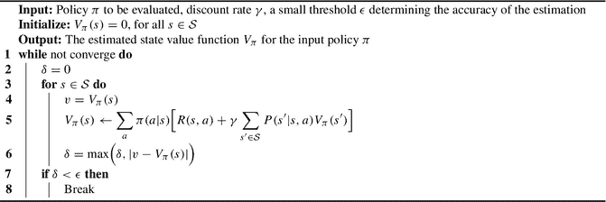
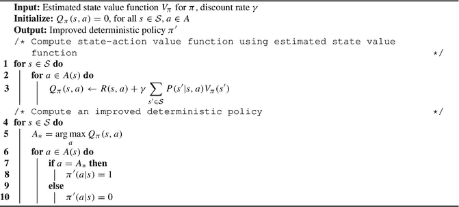
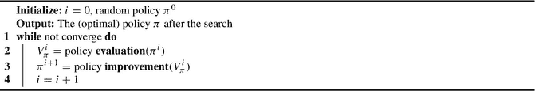
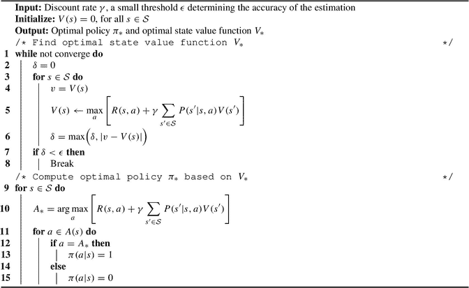

# 3. 动态规划

使用马尔可夫决策过程（MDP）对强化学习问题进行建模的最终目标是，我们可以利用贝尔曼方程找到最优策略 `π*`，从而最大化期望累积奖励。然而，找到这样的策略并非总是轻而易举。在本章中，我们将介绍动态规划（DP）算法，作为在拥有完美环境模型时寻找最优策略 `π*` 的一种方法。

动态规划（DP）是理查德·贝尔曼在 20 世纪 50 年代提出的一种数学优化方法 [1]。动态规划的核心思想是将复杂问题分解为更简单的子问题，并以递归方式求解。这种方法对于具有重叠子问题和最优子结构性质的问题特别有用，这意味着子问题的解可用于求解整体问题。

在强化学习的背景下，动态规划算法可以帮助智能体找到最优价值函数 `V*` 和 `Q*`。

我们在第 2 章中介绍的贝尔曼方程提供了一种递归计算价值函数 `Vπ` 和 `Qπ` 的方法。具体来说，贝尔曼方程将状态或状态-动作对的价值表示为在当前策略 `π` 下的期望即时奖励与下一状态或状态-动作对的期望价值之和。这种递归形式允许我们迭代地计算价值函数，从初始猜测开始，不断更新数值直至收敛到 `V*` 和 `Q*`。

然而，要使用 DP 算法找到真正的最优价值函数，智能体需要拥有完美的环境模型，这意味着 DP 算法是基于模型的强化学习方法。

此外，DP 算法的计算成本可能很高，尤其是在状态和动作空间较大的问题中。因此，本书后续将介绍的蒙特卡洛方法和时序差分学习等其他强化学习方法，已被开发出来以克服这些局限性。

总体而言，当拥有完美的环境模型时，DP 算法为解决强化学习问题提供了一个强大的框架。通过将问题分解为更简单的子问题，并利用贝尔曼方程计算价值函数，我们可以找到最大化期望累积奖励的最优策略 `π*`。


### 3.1 使用动态规划求解马尔可夫奖励过程问题

为了开始学习动态规划算法，我们首先关注马尔可夫奖励过程（MRP）的情况。它比马尔可夫决策过程（MDP）简单得多，因为过程中不涉及任何动作。我们仍然聚焦于在第 2 章中介绍的服务犬 MRP 问题。

在马尔可夫奖励过程（MRP）中，状态值函数的贝尔曼方程表示为：



这里，`γ` 是折扣率；`R(s)` 是从环境获得的奖励；`P(s' | s)` 是环境的动态函数，它指定了从状态 `s` 转移到 `s'` 的概率；`V(s')` 是后继状态的值。

如果我们能够访问 MRP 的真实模型，就可以使用动态规划方法来计算 MRP 不同状态的状态值。动态规划算法的工作原理是：在每次迭代中遍历 MRP 的整个状态空间，利用后继状态的奖励和折扣值来计算并更新每个状态的状态值。这个过程会重复大量迭代，直到获得真实的状态值。该算法的伪代码如算法 1 所示，这正是我们在第 2 章中用于计算服务犬 MRP 状态值的算法，如图 2.7 所示。

算法 1：动态规划计算 MRP 的状态值函数

 一段三行代码，标题为“DP compute state value function for MRP”，以折扣率 `gamma` 作为输入，输出 MRP 的状态值函数 `V`。

但强化学习主要关注的是求解马尔可夫决策过程（MDP），这涉及智能体在学习过程中做出决策。在本章的剩余部分，我们将重点讨论如何使用动态规划算法来求解 MDP。

### 3.2 策略评估

求解强化学习或 MDP 问题的目标是找到最优策略 `π*`。然而，在开始搜索最优策略之前，我们先考虑一个更简单的问题：给定两个不同的策略 `π` 和 `π'`，我们如何判断哪个更好？

为了回答这个问题，我们可以使用状态值函数 `Vπ`。值函数通过衡量从某个状态开始并遵循策略 `π` 所获得的期望回报，来评估智能体处于该状态的好坏程度。如果我们对策略 `π` 和 `π'` 各自的状态值函数有准确的估计，就可以衡量这两个策略之间的差异。当对于状态空间中的所有状态 `s`，期望回报 `Vπ'(s)` 大于或等于 `Vπ(s)` 时，我们就说策略 `π'` 与策略 `π` 一样好或更好：



我们可以利用 `Vπ` 的贝尔曼方程和环境模型来估计策略 `π` 下单个状态 `s` 的值。为了计算状态空间中每个状态的值，我们可以通过迭代地使用 `Vπ` 的贝尔曼方程和环境模型来计算状态空间中每个状态的值，从而推广这一过程。这个过程被称为*策略评估*。该算法估计任意策略 `π` 的状态值函数 `Vπ`。策略评估也被称为预测，因为它预测了策略 `π` 的状态值函数。

策略评估算法的核心是 `Vπ` 的贝尔曼方程：

![$$\displaystyle \begin{aligned} V_\pi(s) &amp; =\mathbb{E}_{\pi\!\!}\left[R_t + {\gamma} V_\pi(S_{t+1}) \;\Big|\;S_t=s\right] \\ &amp; =\sum_{a \in A} \pi(a|s) \Big[R(s, a) + {\gamma} \sum_{s' \in \mathcal{S}} P(s'|s, a) V_\pi(s') \Big], \quad \mbox{for all}\; s \in \mathcal{S} {} \end{aligned} $$](images/605748_1_En_3_Chapter/605748_1_En_3_Chapter_TeX_Equ1.png)

(3.1)


该算法使用贝尔曼方程作为更新规则，并在值更新过程中使用环境模型（动力学函数和奖励函数）。理论上，如果我们无限运行该算法，计算出的值将收敛到策略`π`的真实值。需要注意的是，只要算法满足特定条件（例如运行无限次迭代且折扣因子小于 1），就能保证收敛。收敛速度取决于策略和问题实例。

例如，考虑一个简单的网格世界，其中包含一个目标状态和一个陷阱状态，如图 3.1 所示。智能体到达目标状态获得+1 奖励，掉入陷阱状态获得-1 奖励。所有其他状态转移的奖励为 0。智能体在每个状态有四个可用动作：上、下、左、右。假设我们有一个任意策略，该策略始终向上移动，但在目标状态停止。我们可以使用策略评估来估计该策略的值函数，然后与其他策略进行比较。通过对网格世界中的每个状态重复贝尔曼更新方程，我们可以估计给定策略下每个状态的值。这个过程可以迭代重复，直到收敛。最终的状态值函数可以帮助我们衡量策略的质量，并识别可以改进策略的区域。例如，在网格世界问题中，如果发现陷阱正上方状态的值高于陷阱正下方状态的值，我们可以推断在该特定状态下向下移动比向上移动更好，以避免陷阱。

总体而言，策略评估是强化学习中的重要算法，因为它允许我们估计给定策略的值函数，这是解决强化学习问题的关键步骤。值得注意的是，还有其他方法（如蒙特卡洛和时间差分学习）可用于估计值函数，但策略评估是一种基础方法，构成了许多其他强化学习算法的基础。

该算法接受一个任意策略`π`、一个折扣因子`γ`和一个决定停止标准的小阈值`ε`。算法从所有状态的初始估计值为零开始，然后迭代，直到估计值收敛到输入策略`π`的真实状态值。具体来说，算法通过使用当前策略`π`选择下一个动作，对下一时间步获得的即时奖励和下一状态的估计值进行加权平均，来更新每个状态的估计值，这体现在公式(3.2)中。

```
V_π^{k+1}(s) ← Σ_{a ∈ A} π(a|s) [R(s, a) + γ Σ_{s' ∈ S} P(s'|s, a) V_π^k(s')]
```

(3.2) 其中`V_π^k(s)`是状态`s`在第`k`次迭代的估计值，`π(a|s)`是在策略`π`下在状态`s`中选择动作`a`的概率，`P(s'|s, a)`是转移到后继状态`s'`的概率，`R(s, a)`是智能体在状态`s`采取动作`a`时环境提供的奖励。算法对所有状态重复此更新，直到所有状态的更新值与先前估计值之间的差异小于`ε`。该阈值决定了停止标准，并确保算法在估计值收敛到真实值时终止。



图 3.1 网格世界示例

算法 2：策略评估，迭代算法



在策略评估算法的每次迭代中，智能体遍历状态空间中的所有状态。对于每个状态，智能体可以选择多个动作，每个动作根据策略`π`有不同的选择概率。从每个动作`a`开始，环境可能转移到多个后继状态`s'`之一，转移概率`p`取决于当前状态`s`和智能体采取的动作`a`。这是可能的，因为智能体可以访问环境的真实模型，即每个状态-动作对的奖励信号`R(s,a)`和转移概率`P(s'|s,a)`。该算法使用公式(3.1)作为备份规则，该规则对所有可能的结果进行平均，并按各自的概率加权。


一旦智能体为每个状态计算出了新的价值估计，它就会使用这些更新后的值开始新一轮迭代。虽然估计值最终会收敛到策略`π`的真实值，但在实践中，我们必须在此之前决定何时停止算法。为了判断算法何时收敛到价值函数的精确估计，我们比较每个状态`s`的更新值`V_π(s)`与先前估计值之间的绝对差值，并记录每次迭代中所有状态的最大绝对差值。在完成对所有状态的一轮完整迭代后，我们将最大绝对差值与一个小的阈值`ε`进行比较。如果这个最大绝对差值小于`ε`，我们就认为算法已经收敛并终止循环。

将所有状态的估计值存储在一个数组中，可以加速评估过程，因为它允许我们原地更新这些值。这意味着我们可以更新某个特定状态的价值函数估计，然后立即在后续计算中使用更新后的值，而无需将其复制到新的数据结构中。

相反，如果我们将每个状态的估计值存储在单独的数据结构中，那么每次更新都需要将更新后的值从一个数据结构复制到另一个。这种复制操作在计算上可能非常昂贵，尤其是在状态数量很多的情况下。

此外，将所有状态的值存储在一个数组中，还可以使代码更简单、更易读。遍历单个数组比跟踪每个状态的多个数据结构要容易得多。

总的来说，将所有状态的估计值存储在一个数组中，是一种实用的优化方法，既能提高代码速度，也能提升代码清晰度。

#### 工作示例

让我们使用策略评估算法，为服务犬 MDP 的一个（固定的）随机策略`π`估计状态价值函数`V_π`。图 3.2 中显示的值是使用折扣因子 0.9 和阈值`1e-5`计算得出的。

值得注意的是，无论输入策略是最优的还是随机的，终止状态的价值始终为零。这是因为状态价值函数衡量的是从状态`s`开始，遵循策略`π`的期望回报。由于环境到达终止状态后没有即时奖励或后续状态，其价值始终为零。

### 3.3 策略改进

强化学习的最终目标是找到最优策略`π*`，该策略能最大化整个状态空间中所有状态的期望回报。然而，对于具有大规模状态和动作空间的 MDP，逐一搜索整个策略空间以找到`π*`是不可行的。幸运的是，有一种更高效的方法来改进给定策略，这被称为策略改进。

策略改进背后的思想很简单。我们不是一次性寻找最优策略，而是通过修改当前策略，使其相对于当前策略的估计状态-动作价值函数`Q_π`变得更贪婪，从而迭代地对当前策略进行微小且渐进的改进。如果修改后的策略至少对一个状态有更高的期望回报，那么它一定优于原始策略。这是策略改进背后的关键概念，并基于以下定理：

图 3.2 服务犬 MDP 随机策略`π`的状态价值，`γ=0.9`且`ε=1e-5`

对于任意两个确定性策略`π`和`π'`，`π'`至少与`π`一样好，当且仅当对于所有状态`s ∈ S`，有`V_π'(s) ≥ V_π(s)`。

这里，`V_π(s)`是状态`s`在策略`π`下的估计值。换句话说，如果一个修改后的策略至少对一个状态增加了期望回报，那么它就优于原始策略。

这就是我们需要使用状态-动作价值函数`Q_π(s, a)`的地方，因为状态价值函数`V_π(s)`无法告诉我们，当智能体处于状态`s`并遵循策略`π`时，哪个动作更好。我们已经在第 2 章中介绍了`Q_π`的贝尔曼方程。以下是快速回顾。

```
Q_π(s, a) = R(s, a) + γ E_π[Q_π(s', a') | S_{t+1}=s', A_{t+1}=a']
          = R(s, a) + γ Σ_{s'∈S} P(s'|s, a) Σ_{a'∈A} π(a'|s') Q_π(s', a'), 对于所有 s∈S, a∈A
```
(3.3)


方程（3.3）告诉我们如何使用 `Q_π` 更新状态-动作对 `(s, a)` 的值，但我们目前还没有 `Q_π` 的精确估计。幸运的是，`Q_π` 与 `V_π` 之间存在关系，其中 `V_π(s) = Σ_{a ∈ A} π(a|s) Q_π(s, a)`。我们已经知道如何使用策略评估算法来计算策略 `π` 的状态价值函数 `V_π`。并且我们可以简单地将 `V_π` 代入方程（3.4），这将帮助我们完成估计的状态-动作价值函数 `Q_π` 的值更新规则。

```
Q_π(s, a) = R(s, a) + γ Σ_{s' ∈ S} P(s'|s, a) V_π(s'), 对于所有 s ∈ S, a ∈ A
```

(3.4)

这个方程告诉我们，在状态 `s` 下采取动作 `a` 并随后遵循策略 `π` 的价值，等于期望奖励 `R_t` 加上下一状态 `S_{t+1}` 的折扣价值，而下一状态的价值由状态价值函数 `V_π(S_{t+1})` 给出。我们可以使用策略评估算法计算所有状态-动作对的 `Q_π`。

一旦我们有了状态-动作价值函数 `Q_π` 的估计，就可以执行策略迭代，这包括通过使策略相对于 `Q_π` 变得更贪婪来改进策略。具体来说，我们可以通过在每个状态下选择最大化状态-动作价值函数的动作来构建一个新策略 `π'`。

我们现在介绍*策略改进*算法，如算法 3 所示。该算法接收任意策略 `π`（来自策略评估算法）的估计状态价值函数 `V_π` 作为输入。然后它遍历状态空间中的所有状态；对于每个状态，它遍历该状态下的所有（合法）动作，基于环境模型和 `V_π` 计算状态-动作价值函数 `Q_π`。遍历完成后，它使用 `Q_π` 计算一个更好、改进后的确定性策略 `π'`。具体做法是遍历状态空间中的所有状态；对于每个状态，它更新每个动作的策略概率分布，使得选择具有最高估计价值 `Q_π(s, a)` 的动作的概率为 1，而选择其他动作的概率为 0。

算法 3：策略改进，迭代算法

 一个名为“策略改进，迭代算法”的 10 行算法，接收以下输入，输出改进后的确定性策略 `π'`。输入包括：策略 `π` 的估计状态价值函数 `V_π` 和折扣率 `γ`。

策略改进算法包含两个步骤：第一步是使用方程（3.3）和环境模型，为当前策略 `π` 计算估计的状态-动作价值函数 `Q_π`；第二步是基于 `Q_π` 构建一个新的、更好的确定性策略 `π'`，从而改进策略 `π`。与策略评估算法不同，策略改进算法不会无限运行。它只执行这两个步骤一次。这是合理的，因为现在我们有了一个新的、更好的策略 `π'`；由于策略已经改变，旧的状态价值函数 `V_π` 不再代表这个新策略的价值。

为了实现算法 3，我们可以使用一个形状为（状态空间大小，动作空间大小）的二维矩阵来表示状态-动作价值函数 `Q_π`。需要注意的一点是，在构建改进策略的过程中，我们只应考虑特定状态下的合法动作；合法动作是指当前状态下可用的动作。排除非法动作很重要，因为这能确保动作选择过程正确执行，并且不会导致次优甚至危险的行为。

在强化学习中，当基于估计的状态-动作价值函数构建策略时，排除非法动作尤为重要。如果不排除非法动作，策略可能会选择次优甚至非法的动作，从而导致性能不佳或无法达到预期目标。通过在动作选择过程中仅考虑合法动作，策略可以确保在给定状态下选择可能的最佳动作，同时仍然满足任何约束或安全要求。

例如，考虑一个在工厂环境中运行的机器人，它受到某些安全约束，例如不能与其他机器人或物体碰撞。如果机器人的动作选择过程包含非法动作，例如向会导致碰撞的方向移动，则可能对自身、其他机器人或工厂环境造成损害。

另一个具体例子如下：假设对于某个状态 `s`，所有合法动作的价值都是负数 `Q_π(s, a) < 0`；如果我们不排除非法动作，那么标准的 `argmax` 将总是选择其中一个非法动作，因为零大于负数。


### 3.4 策略迭代

策略迭代是一种在马尔可夫决策过程（MDP）中寻找最优策略的算法。该算法包含两个主要步骤：策略评估和策略改进，通过迭代应用这两个步骤来优化策略，直至其收敛到最优策略。

策略迭代背后的核心思想是利用价值函数贪婪地选择更优的动作，然后根据新策略更新价值函数。算法从一个初始策略开始（通常随机选择），然后通过估计价值函数并选择更优的动作来迭代改进策略。

策略迭代算法在循环中迭代执行这两个步骤。在每次迭代中，我们首先使用策略评估算法，为当前策略 `π^i` 估计状态价值函数 `V_π^i`。该价值函数表示从给定状态出发，遵循该策略所能获得的期望累积奖励。

```
π⁰ → (评估) V_π⁰ → (改进) π¹ → (评估) V_π¹ → (改进) π² → ... → (改进) π_*
```

一旦我们估计出价值函数，就通过运行策略改进算法来利用它选择更优的动作。策略改进算法基于估计出的价值函数，贪婪地选择能使期望累积奖励最大化的动作。这个新策略记为 `π^(i+1)`，是对前一个策略 `π^i` 的改进。

我们重复这两个步骤——策略评估和策略改进——直到收敛。当旧策略 `π^i` 与 `π^(i+1)` 在状态空间中的每一个状态上都相同时，即表示无法再做出任何改进，此时达到收敛。

策略迭代算法总结于算法 4 中。请注意，该算法计算量可能很大，尤其对于大型 MDP 而言，但它保证能收敛到最优策略。

**算法 4：策略迭代，迭代算法**

一个名为“策略迭代，迭代算法”的 6 行算法，接收以下输入，输出最优策略 `π*` 以及最优价值函数 `V*`、`Q*` 作为结果。折扣率 `γ`，一个决定估计精度的小阈值 `ε`。

针对服务犬 MDP 的最优策略 `π` 的节点图突出了以下路径：从房间 1 到房间 2，`r = -1`。从房间 2 到房间 3，`r = -1`。房间 3 = 找到物品，`r = 10`。从室外到房间 2，`r = 0`。

**图 3.3** 服务犬 MDP 的最优策略 `π_*`

总的来说，策略迭代是在 MDP 中寻找最优策略的一种强大算法。通过迭代地改进策略并更新价值函数，我们可以收敛到最优策略。然而，务必注意，策略迭代算法可能不适用于大型 MDP，因为其计算量可能很大。在这种情况下，其他算法如值迭代（我们将在本章后面介绍）可能更为合适。

#### 工作示例

我们可以使用策略迭代算法来解决我们的服务犬 MDP 问题。计算出的该 MDP 的最优策略 `π_*` 如图 3.3 所示。与最优策略一起，我们还能得到最优价值函数 `V_*` 和 `Q_*`，分别如图 3.4 和图 3.5 所示。这些值是在折扣因子 `γ = 0.9` 下计算得出的。

**表 3.1** 不同折扣因子 `γ` 下服务犬 MDP 的最优状态价值

| 折扣因子 | 房间 1 | 房间 2 | 房间 3 | 室外 | 找到物品 |
|----------|--------|--------|--------|---------|------------|
| `γ = 0.0` | -1.0 | -1.0 | 10.0 | 0.0 | 0 |
| `γ = 0.3` | -0.4 | 2.0 | 10.0 | 0.6 | 0 |
| `γ = 0.5` | 1.0 | 4.0 | 10.0 | 2.0 | 0 |
| `γ = 0.7` | 3.2 | 6.0 | 10.0 | 4.2 | 0 |
| `γ = 0.9` | 6.2 | 8.0 | 10.0 | 7.2 | 0 |
| `γ = 1.0` | 8.0 | 9.0 | 10.0 | 9.0 | 0 |

针对服务犬 MDP 的最优状态-动作价值函数 `Q*` 的节点图运行如下：从 6.2 到 8.2，`Q* = 6.2`。从 8.2 到 10.0，`Q* = 8.0`。从 10.0 到 0.0，`Q* = 10`。从 8.2 到 7.2，`Q* = 6.5`。7.2 返回到 8.2，`Q* = 7.2`。7.2 自循环，`Q* = 4.8`。

**图 3.5** 服务犬 MDP 的最优状态-动作价值函数 `Q_*`，`γ = 0.9`

针对服务犬 MDP 的最优状态价值函数 `V*` 的节点图运行如下：从 6.2 到 8.2，`r = -1`。从 8.2 到 10.0，`r = -1`。从 10.0 到 0.0，`r = 10`。从 8.2 到 7.2，`r = 0`。7.2 返回到 8.2，`r = 0`。7.2 自循环，`r = -1`。

**图 3.4** 服务犬 MDP 的最优状态价值函数 `V_*`，`γ = 0.9`

通过使用不同的折扣因子 `γ` 运行策略迭代算法，我们可以观察到折扣因子如何影响状态价值，如表 3.1 所示。值得注意的是，终止状态的价值始终为零。


### 3.5 通用策略迭代

策略迭代算法是强化学习中一种广泛使用且有效的方法。其特点在于同时运行策略评估和策略改进过程。所有策略迭代算法都共享这一基本结构和概念，但我们可以灵活地修改策略评估和策略改进步骤的具体实现方式。

在策略迭代中，我们从一个初始策略开始，该策略是从状态到动作的映射。然后，我们执行策略评估来估计该策略的价值函数。这涉及遍历状态空间，计算每个状态在该策略下的期望价值，并相应地更新价值函数。策略评估之后，我们通过构建一个相对于价值函数比旧策略更贪婪的新策略来执行策略改进。这个新策略是通过选择能够最大化下一状态期望价值的动作获得的，从当前状态开始，并重复此过程直到回合结束。然后，新策略被用于下一轮策略评估，并重复此过程直至收敛。

算法 5：通用策略迭代

 一个 4 行算法，标题为通用策略迭代，接收以下输入，在搜索后输出最优策略 `pie`。`I = 0` 和随机策略 `pie` 的零次方。

尽管动态规划通常被认为是一种基于模型的强化学习方法，但策略迭代在实践中既可用于基于模型的方法，也可用于无模型的方法。对于基于模型的方法，策略评估步骤涉及从模型中计算状态转移概率和奖励；而对于无模型的方法，这些值则通过蒙特卡洛或时序差分方法从经验中估计得出，我们将在本书后面讨论这些方法。

### 3.6 价值迭代

价值迭代是一种在强化学习中寻找最优策略的强大算法。虽然策略迭代很有效，但其一个缺点是，要找到最优策略 `π*`，需要多次迭代策略评估和策略改进，这可能既耗时又计算成本高昂。价值迭代通过将策略评估和策略改进合并为一步来解决这个问题。

为了找到最优策略，价值迭代算法直接计算最优状态价值函数 `V*`，而不是针对任意策略 `π` 估计其状态价值函数 `Vπ`。最优状态价值函数 `V*` 是在整个策略空间中具有最高状态价值的函数。

价值迭代算法使用 `V*` 的贝尔曼最优方程作为更新规则来更新不同状态的价值。该方程计算在当前状态和动作下，奖励的期望值加上下一状态的折扣价值。在所有可能动作中，该表达式的最大值被用来更新当前状态的价值。重复此过程，直到所有状态的价值收敛到其最优值。

```
V*(s) = max_a E[R_t + γ V*(S_{t+1}) | S_t = s, A_t = a]
      = max_a [R(s, a) + γ Σ_{s' ∈ S} P(s'|s, a) V*(s')], 对于所有 s ∈ S
```

(3.5)

这里，`s` 表示当前状态，`a` 是一个动作，`R_t` 是时间 `t` 的奖励，`γ` 是折扣因子，`S_{t+1}` 是下一状态，`P(s'|s, a)` 是在动作 `a` 下从状态 `s` 转移到状态 `s'` 的概率，`V*(s')` 是下一状态的最优价值。

价值迭代算法扫描状态空间中的所有状态，对于每个状态，它使用公式 (3.5) 作为更新规则来计算该状态的估计最优价值。这是利用环境的模型（奖励函数和动态函数）完成的。一旦当前扫描完成，算法对所有状态重复此过程，直到收敛到真正的最优状态价值函数 `V*`。

一旦我们有了 `V*`，就可以轻松计算出最优策略 `π*`。对于状态空间中的每个状态，我们选择能使其后继状态价值最高的动作。然后，我们将选择此动作的概率设为 1，所有其他动作的概率设为 0。这个过程产生一个确定性策略，该策略将始终选择能带来最高期望奖励的动作。

总之，价值迭代是一种在强化学习中寻找最优策略的高效算法。它通过直接使用贝尔曼最优方程计算最优状态价值函数，将策略评估和策略改进合并为一步。一旦计算出最优状态价值函数，通过为状态空间中的每个状态选择能带来最高期望奖励的动作，就可以很容易地确定最优策略。

算法 6 展示了价值迭代算法的伪代码，该算法使用公式 (3.5) 作为价值更新规则。为了说明价值迭代算法的应用，我们可以使用服务犬 MDP 的例子。将价值迭代算法应用于服务犬 MDP，应该会得到与图 3.3 和图 3.4 相同的结果。然而，需要注意的是，对于这个简单的例子，价值迭代算法相对于策略迭代算法的加速效果可能并不明显。这可能是由于问题中的状态和动作数量相对较少，或者因为对于这个特定问题，两种算法的计算复杂度相似。

算法 6：价值迭代，迭代算法

 一个 15 行算法，标题为价值迭代，迭代算法，接收以下输入，输出最优策略 `π*` 和最优状态价值函数 `V*`。折扣率 `γ` 和决定估计精度的小阈值 `ε`。

当状态和动作空间足够小，可以显式计算价值函数或策略时，动态规划是解决 MDP 的有效方法。然而，对于更大的问题，其他方法如蒙特卡洛方法和时序差分学习则更为实用。


### 3.7 本章小结

本章概述了动态规划（DP），这是一类通过将复杂问题分解为可递归求解的较小子问题来解决马尔可夫决策过程（MDP）的算法。我们首先讨论了如何利用动态规划求解马尔可夫奖励过程（MRP），这涉及计算表示从给定状态出发的期望累积奖励的价值函数。

接着，我们重点讨论了如何利用动态规划求解 MDP，涵盖了策略评估和策略改进这两个基本步骤。策略评估计算给定策略下的价值函数，而策略改进则基于当前价值函数寻找更优的策略。策略迭代算法在这两个步骤之间交替进行直至收敛，但由于两个步骤都需要多次迭代，计算成本可能很高。通用策略迭代算法是一种更灵活的版本，允许在策略评估和策略改进之间投入不同程度的精力，因此更具实用性。

随后，我们介绍了价值迭代算法，它将策略评估和策略改进合并为单一步骤。价值迭代计算效率高，并且能在有限次迭代内收敛到最优策略。

在下一章中，我们将介绍蒙特卡洛方法，作为求解 MDP 的另一种方法，它不需要显式了解环境模型（奖励函数和动态函数）。

