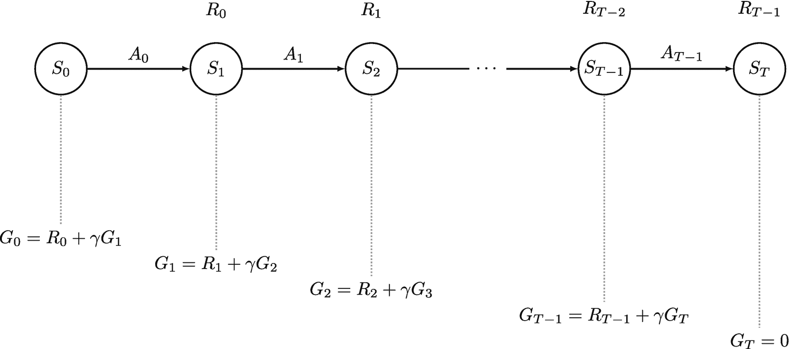
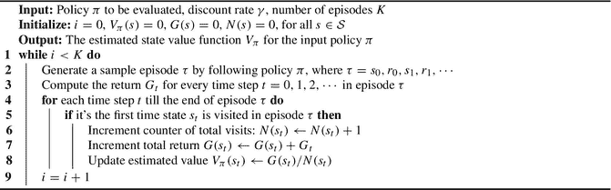
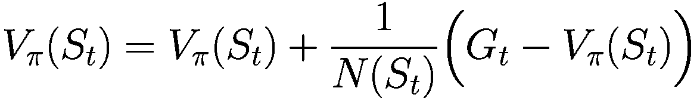
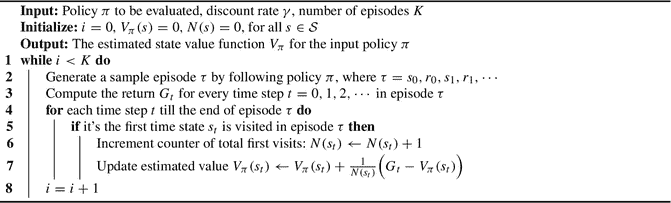
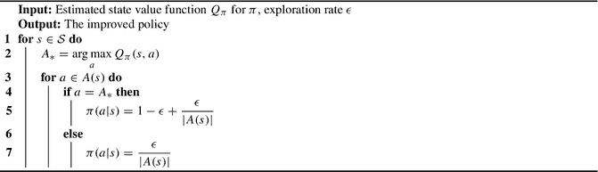
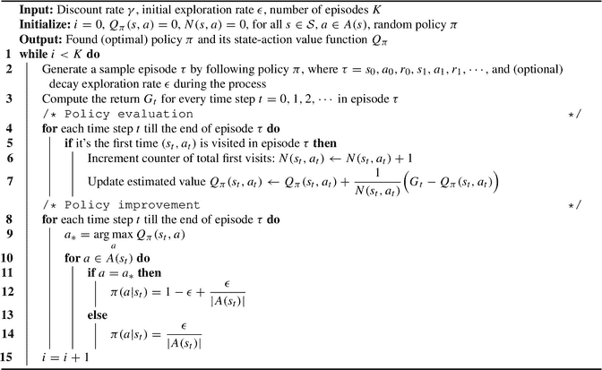

# 4. 蒙特卡洛方法

在第 3 章中，我们介绍了动态规划（DP）算法[1]，这些算法能帮助智能体为小型 MDP 找到最优价值函数`V_*`和`Q_*`；这适用于状态空间和动作空间足够小，可以显式计算价值函数或策略的情况。DP 算法假设智能体能够访问环境的完美模型（奖励函数和动态函数），因此它们属于基于模型的强化学习方法。然而，在大多数现实世界的强化学习问题中，环境的真实模型对智能体来说是未知的，并且状态或动作空间可能非常大。在本章中，我们将介绍蒙特卡洛方法[2]，这是一种无模型的强化学习算法，它利用智能体的经验来估计价值函数。

术语“蒙特卡洛”指的是通过平均样本回报来利用经验估计价值函数的方法。蒙特卡洛方法利用状态-动作-奖励样本序列，智能体通常通过与模拟环境交互来生成这些样本（也可以使用历史样本）。环境只需支持基本交互，例如当智能体在环境中执行动作时，生成后续状态和奖励信号。与 DP 方法不同，蒙特卡洛方法不要求环境提供所有可能的后续状态和状态转移概率。然而，蒙特卡洛方法只能用于解决回合制强化学习问题，因为它基于完整的回合序列来平均回报。我们在第 3 章中介绍的通用策略迭代算法同样适用于蒙特卡洛方法。

总之，本章将介绍用于无模型强化学习的蒙特卡洛方法。这些方法利用智能体的经验来估计价值函数，无需环境模型。虽然它们不假设马尔可夫性质，但蒙特卡洛方法只能用于解决回合制强化学习问题。



一个节点图流程如下：`S0`，`S1`通过`A0`，`S2`通过`A1`，`S_T-1`，以及`S_T`通过`A_T-1`。`S1`、`S2`、`S_T-1`和`S_T`节点分别标记为`R0`、`R1`、`R_T-2`和`R_T-1`。所有节点还标有其`G`值方程。

**图 4.1** 蒙特卡洛策略评估的思想，用于估计单个回合序列的状态价值

### 4.1 蒙特卡洛策略评估

提醒一下，策略评估的目标是估计给定策略`π`下的状态价值函数。与动态规划类似，我们从蒙特卡洛策略评估（预测）开始。然而，由于蒙特卡洛是一种无模型的强化学习方法，我们无法使用环境模型和贝尔曼方程作为更新规则来迭代计算价值。那么，在使用蒙特卡洛方法时，我们如何计算状态价值呢？

让我们重新审视状态价值函数`V_π`的定义，它衡量从状态`s`出发，然后遵循策略`π`的期望回报，如公式（4.1）所示。

```
V_π(s) = E_π[G_t | S_t = s]
       = E_π[R_t + γ R_{t+1} + γ² R_{t+2} + ... | S_t = s]
       = E_π[R_t + γ G_{t+1} | S_t = s]
```

(4.1)

给定一个由遵循策略`π`的智能体生成的状态-动作-奖励序列`S0, A0, R0, S1, A1, R1, ..., S_{T-1}, A_{T-1}, R_{T-1}, S_T`，我们可以使用公式`G_t = R_t + γ G_{t+1}`计算从任意时间步`t`到回合结束的折现累积奖励，如图 4.1 所示。从状态`s`开始的该序列的期望值可以通过蒙特卡洛策略评估来估计，这涉及对大量样本回合的回报进行平均。这便得到了状态价值函数`V_π`的估计值。

在蒙特卡洛策略评估中，智能体从自身的经验中学习。它在遵循策略`π`的同时收集大量样本回合，并对这些样本回合中相应环境状态的回报进行平均。随着样本数量的增加，平均后的价值将收敛到真实的状态价值`V_π`。然而，在遵循策略`π`时，智能体在单个回合中通常只访问少数几个状态。因此，我们通常需要运行算法大量回合，才能获得`V_π`的准确估计。根据大数定律，当对特定状态`s`的总访问次数趋于无穷时，遵循策略`π`下的估计状态价值`V_π(s)`也会收敛到真实值。但在实践中，我们通常需要在更短的时间内停止评估过程。


总之，蒙特卡洛策略评估是一种无模型方法，它通过收集大量样本回合并计算对应环境状态的平均回报，来估计给定策略的状态价值函数。智能体从自身经验中学习，无需环境模型或贝尔曼方程来估计状态价值。然而，该算法通常需要大量回合才能准确估计`V_π`，因为智能体在单个回合中可能只访问少数几个状态。蒙特卡洛策略评估通常用于解决回合制强化学习问题，即过程在有限步数后终止。

#### 首次访问蒙特卡洛策略评估

在上一节中，我们讨论了蒙特卡洛策略评估的基本思想：通过遵循策略`π`生成大量样本回合，并利用这些回合来估计状态价值函数`V_π(s)`。

首次访问蒙特卡洛策略评估算法（如算法 1 所示）是该思想的一种具体实现。对于每个回合，我们计算该回合中每个时间步`t = 0, 1, 2, ..., T-1`的回报`G_0, G_1, G_2, ..., G_{T-1}`，其中`T`是回合终止的时间步。然后，我们遍历该回合中的状态`S_0, S_1, S_2, ..., S_{T-1}`，并更新每个状态的状态价值函数估计值。

为了更新状态`S_t`的估计值，我们检查这是否是当前回合中首次访问该状态（因此得名“首次访问”蒙特卡洛）。如果是，我们更新两个量：总回报`G(S_t)`，即所有回合中访问`S_t`时的回报`G_t`之和；以及访问计数`N(S_t)`，即所有回合中访问`S_t`的次数。然后，我们可以计算状态`S_t`的平均回报为`Ḡ(S_t) = G(S_t) / N(S_t)`。

在每个回合结束时，我们通过计算所有访问过该状态的回合中观察到的回报的平均值，来更新每个状态的状态价值函数估计值。此过程持续固定数量的回合。该方法的一个缺点是，我们必须手动选择要运行的回合数，如果数量太少，估计值可能不准确。

算法 1：`V[π]`的首次访问蒙特卡洛策略评估

 一个 9 行算法，标题为`V_π`的首次访问蒙特卡洛策略评估，输入如下，输出为输入策略`π`的估计状态价值函数`V_π`。待评估的策略`π`，折扣率`γ`，以及回合数`K`。

总之，首次访问蒙特卡洛策略评估算法通过生成大量样本回合并利用它们计算每个状态的平均回报，提供了一种估计给定策略状态价值函数的方法。虽然该方法存在一些局限性，但它是理解强化学习算法行为的有用工具，并可应用于广泛的问题。

#### 首次访问与每次访问

蒙特卡洛策略评估是一种利用模拟经验估计给定策略状态价值函数的算法。实现该算法时必须做出的一个重要决定是采用首次访问还是每次访问方法。

在蒙特卡洛策略评估的背景下，“访问”一词指的是智能体在回合中进入某个状态的时刻。由于一个回合可能多次访问同一状态，因此在评估过程中如何处理这些重复访问至关重要。

在首次访问蒙特卡洛策略评估中，算法在计算状态价值时仅考虑回合中首次访问该状态的情况。当前回合中对该状态的所有后续访问均被忽略。例如，假设一个智能体在迷宫环境中导航，并在一个回合中多次访问状态`s`。首次访问方法只会考虑首次访问状态`s`后获得的回报，而忽略当前回合中对该状态`s`的所有后续访问。

另一方面，每次访问蒙特卡洛策略评估会在回合中每次访问某个状态时更新其价值。继续迷宫示例，如果智能体在一个回合中访问状态`s`十次，每次访问方法将使用每次访问后获得的回报来更新该状态的价值函数。

这两种方法之间存在一些重要差异。首次访问方法是无偏的，这意味着随着回合数趋近于无穷大，估计状态价值函数的期望值会收敛到真实值。然而，每次访问方法可能具有更低的方差，这意味着估计值不太可能远离真实值。

在实践中，选择首次访问还是每次访问方法将取决于所解决的具体问题以及偏差与方差之间的期望权衡。在某些情况下，可能需要采用结合两种方法的混合方法。

总体而言，首次访问与每次访问蒙特卡洛策略评估的选择取决于具体问题以及偏差与方差之间的期望权衡。首次访问方法无偏但方差可能更高，而每次访问方法方差可能更低但可能存在偏差。结合两种方法的混合方法可用于在偏差和方差之间取得平衡。


#### 工作示例

为了更好地理解首次访问蒙特卡洛策略评估与每次访问蒙特卡洛策略评估之间的区别，让我们看一个例子，该例子使用了我们在第 2 章中介绍的导盲犬 MDP。回顾图 4.2 中所示的导盲犬 MDP 示意图。

假设智能体遵循某个策略`π`，并生成了一个形式为`S0, R0, S1, R1, ..., S_{T-1}, R_{T-1}`的情节序列。例如，我们可能得到如下情节：

```
episode = {房间 1, -1, 房间 2, -1, 房间 3, -2, 房间 2, -1, 房间 3, 10}
```

为了评估该情节的策略，我们需要计算情节中每个时间步`t`的回报`Gt`。我们使用无折扣`γ = 1.0`。回报`Gt`计算为从时间步`t`到情节结束的奖励总和，不应用折扣。例如，对于上述情节，回报`Gt`为：

```
returns = {5.0, 6.0, 7.0, 9.0, 10.0}
```

导盲犬 MDP 的节点图流经房间 1、2 和 3，最终到达找到物品。房间 3 回到房间 2，房间 2 回到房间 1。房间 2 也通过`r = 0`指向室外，室外通过`r = 0`回到房间 2。室外通过`r = -1`自循环。

**图 4.2** 导盲犬 MDP

让我们关注状态*房间 2*。我们可以看到，它在单个情节中被访问了两次，一次在`t=1`，另一次在`t=3`。假设我们之前对状态*房间 2*的估计值是从状态*房间 2*观察到的回报的样本平均值，即`Vπ(房间 2) = 0.0`。此外，智能体在此策略下之前从未访问过状态*房间 2*，因此该状态的访问次数为`N(房间 2) = 0`。

如果我们使用首次访问蒙特卡洛策略评估，那么状态*房间 2*的新值应为`6/1 = 6`。这是因为算法会忽略该情节中第二次访问状态*房间 2*的情况，仅基于首次访问来更新该状态的值。相比之下，如果我们使用每次访问蒙特卡洛策略评估，那么状态*房间 2*的值将首先更新为`6/1 = 6`，然后更新为`(6+9)/2 = 7.5`。这是因为每次访问蒙特卡洛策略评估会在情节中每次访问状态时都更新其值。

总结来说，首次访问蒙特卡洛策略评估仅在情节中首次访问状态时更新其值，而每次访问蒙特卡洛策略评估则在情节中每次访问状态时都更新其值。这两种方法之间的差异对于准确估计 MDP 中状态的值可能很重要。

#### 每次访问蒙特卡洛策略评估

将首次访问蒙特卡洛策略评估扩展到每次访问的情况相当容易；我们只需移除`for`循环内的条件检查，其他所有内容保持不变，如算法 2 所示。

**算法 2：** 针对`V[π]`的每次访问蒙特卡洛策略评估

一个名为“针对`Vπ`的每次访问蒙特卡洛策略评估”的 8 行算法，接受以下输入，输出输入策略`π`的估计状态值函数`V`：待评估的策略`π`、折扣率`γ`以及情节数量`K`。

**表 4.1** 针对导盲犬 MDP 的相同随机策略，使用首次访问和每次访问蒙特卡洛策略评估计算的状态值。结果在 100 次独立运行中取平均值；每次运行包含 2000 个情节；最后一行包含使用动态规划策略评估计算的真实状态值。在此实验中，我们使用相同的折扣`γ = 0.9`。

| | 房间 1 | 房间 2 | 房间 3 | 室外 | 找到物品 |
|---|---|---|---|---|---|
| 首次访问 MC | −2.67 | −1.85 | 3.16 | −3.32 | 0 |
| 每次访问 MC | −2.63 | −1.81 | 3.2 | −3.3 | 0 |
| DP | −2.66 | −1.85 | 3.17 | −3.33 | 0 |

我们使用首次访问和每次访问蒙特卡洛策略评估算法来估计导盲犬 MDP 中随机策略`π`的状态值。表 4.1 显示了结果。由于蒙特卡洛方法涉及随机性，我们在 100 次独立运行中取平均值，每次运行包含 2000 个情节。对于所有运行，我们将折扣因子`γ`设置为 0.9。使用蒙特卡洛策略评估算法计算的值非常接近使用动态规划策略评估计算的真实值（如表 4.1 最后一行所示）。


### 4.2 增量更新

增量更新的概念是强化学习算法中广泛使用的一种技术，在蒙特卡洛策略评估中尤其有用。增量更新的核心思想是逐步更新估计值，而非一次性完成更新。这具有若干优势，包括更快的收敛速度、更好的内存效率，以及能够在新数据可用时实时更新估计值。

增量更新公式可表示如下：

![$$\displaystyle \begin{aligned} \mbox{新估计值}=\mbox{旧估计值} + \mbox{步长} \Big[\mbox{目标值} - \mbox{旧估计值} \Big] \end{aligned}$$](images/605748_1_En_4_Chapter/605748_1_En_4_Chapter_TeX_Equc.png)

其中 `OldEstimate` 是之前的估计值，`StepSize` 是一个决定更新幅度的小正数常量，`Target` 是一个新的样本值。`Target - OldEstimate` 这一项通常被称为估计误差，它代表了新样本值与先前估计值之间的差异。

在蒙特卡洛策略评估中，增量更新可用于估计某个状态的价值函数。具体来说，我们可以利用从特定幕中获得的样本回报 `G_t` 来更新状态 `S_t` 的估计价值函数：



(4.2)

其中 `V_π(S_t)` 是状态 `S_t` 的估计价值函数，`N(S_t)` 是状态 `S_t` 被访问的次数。公式 (4.2) 中的更新公式代表了一种增量更新，即根据样本回报与先前估计值之差成比例的小步长来更新估计价值函数。

首次访问情况下的增量蒙特卡洛策略评估算法如算法 3 所示。在每一幕中，对于该幕中的每个时间步 `t`，我们首先检查状态 `S_t` 是否为首次被访问，然后更新该幕的回报和 `S_t` 的访问次数，此过程持续进行直到达到终止状态。最后，我们使用公式 (4.2) 中的增量更新方程更新每个被访问状态的估计价值函数。每次访问情况只需移除 for 循环内的条件检查即可轻松实现。

算法 3：针对 `V[π]` 的首次访问蒙特卡洛策略评估（含增量更新）

 一个 8 行算法，标题为“针对 `V[π]` 的首次访问蒙特卡洛策略评估（含增量更新）”，该算法接收以下输入，并输出针对输入策略 `π` 的估计状态价值函数 `V[π]`。待评估的策略 `π`、折扣率 `γ` 以及幕数 `K`。

表 4.2 展示了分别使用首次访问蒙特卡洛策略评估和首次访问蒙特卡洛策略评估（含增量更新方法）计算出的状态价值，两者均针对服务犬 MDP 的同一随机策略。与表 4.1 所示的实验类似，结果是在 100 次独立运行中取平均值，每次运行包含 2000 幕；本实验中使用相同的折扣率 `γ = 0.9`。


### 针对 `Q_π` 的蒙特卡洛策略评估

我们可以使用蒙特卡洛策略评估来估计策略 `π` 的状态-动作价值函数 `Q_π`。状态-动作价值函数 `Q_π(s, a)` 衡量的是从状态 `s` 开始，采取动作 `a`，然后遵循策略 `π` 所能获得的期望回报。

蒙特卡洛策略评估通过生成许多在策略 `π` 下的马尔可夫决策过程（MDP）的幕（episode），然后计算每个状态-动作对的平均回报来估计 `Q_π`。具体来说，对于每一幕，智能体从一个初始状态 `s0` 开始，并根据策略 `π` 采取动作，直到到达一个终止状态。在每个时间步 `t`，智能体观察当前状态 `S_t`，根据策略 `π` 采取动作 `A_t`，并接收奖励 `R_t`。智能体持续采取动作并接收奖励，直到到达终止状态，此时该幕结束。

**表 4.2** 针对服务犬 MDP 的相同随机策略，使用首次访问蒙特卡洛策略评估和带增量更新的首次访问蒙特卡洛策略评估计算出的状态价值。结果在 100 次独立运行中取平均；每次运行包含 2000 幕；最后一行包含使用 DP 策略评估计算出的真实状态价值。本实验中使用相同的折扣率 `γ = 0.9`。

| | 房间 1 | 房间 2 | 房间 3 | 室外 | 找到物品 |
| --- | --- | --- | --- | --- | --- |
| 首次访问 MC | −2.67 | −1.85 | 3.17 | −3.33 | 0 |
| 增量首次访问 MC | −2.65 | −1.84 | 3.16 | −3.34 | 0 |
| DP | −2.66 | −1.85 | 3.17 | −3.33 | 0 |

在生成多幕之后，蒙特卡洛策略评估会计算在幕中被访问过的每个状态-动作对 `(s, a)` 的平均回报 `G_t`。这是通过平均每次访问该对 `(s, a)` 后获得的回报来实现的，其中回报是从该时间步到该幕结束时的折扣奖励之和：

```
G_t = R_t + γ R_{t+1} + γ² R_{t+2} + ... + γ^{T-1-t} R_{T-1}
```

(4.3)

这里，`T` 是该幕结束的时间步，`γ` 是折扣因子，它决定了未来奖励相对于即时奖励的重要性。

一旦我们计算出了每个状态-动作对 `(s, a)` 的平均回报 `G_t`，我们就可以使用增量更新规则来更新 `Q_π(s, a)` 的估计值：

```
Q_π(S_t, A_t) = Q_π(S_t, A_t) + (1 / N(S_t, A_t)) * (G_t - Q_π(S_t, A_t))
```

(4.4)

这里，`N(S_t, A_t)` 是状态-动作对 `(S_t, A_t)` 在幕中被访问的次数。

首次访问蒙特卡洛策略评估是实现蒙特卡洛策略评估以估计 `Q_π` 的一种方法，它通过对该状态-动作对首次访问后获得的回报取平均来估计每个状态-动作对的价值。算法如下：

**算法 4：** 针对 `Q[π]` 的带增量更新的首次访问蒙特卡洛策略评估

一个标题为“针对 `Q_π` 的带增量更新的首次访问蒙特卡洛策略评估”的 8 行算法，接收以下输入，并输出输入策略 `π` 的估计状态价值函数 `Q_π`。待评估的策略 `π`、折扣率 `γ` 以及幕数 `K`。

图 4.3 展示了我们使用算法 4 为服务犬 MDP 的随机策略 `π` 计算出的状态-动作价值。和往常一样，结果在 100 次独立运行中取平均；每次运行包含 2000 幕。请注意，状态价值是使用 DP 策略评估计算得出的。本实验中使用折扣率 `γ = 0.9`。

我们可以通过使用这些状态-动作价值来计算状态价值来验证结果。回想一下，状态价值就是该状态所有状态-动作价值的加权和。

```
V_π(s) = Σ_{a ∈ A} π(a|s) Q_π(s, a)
```

(4.5)

节点图运行如下。负 2.7，通过 `Q_π = -2.65` 得到负 1.8，通过 `Q_π = 1.86` 得到 3.0，通过 `Q_π = 10.0` 得到 0.0。3.0 通过 `Q_π = -3.65` 回到负 1.8。负 1.8 回到负 2.7，并通过 `Q_π = -4.38` 和 `-2.99` 指向负 3.4。

**图 4.3** 使用带增量更新的首次访问蒙特卡洛策略评估为服务犬 MDP 的随机策略计算出的状态-动作价值。结果在 100 次运行中取平均；每次运行包含 2000 幕。请注意，状态价值是使用 DP 策略评估计算得出的。本实验中使用相同的折扣率 `γ = 0.9`。

如果我们观察状态 *房间 2*，动作 *去房间 1*、*去房间 3*、*去室外* 的状态-动作价值分别为 `-4.38`、`1.86`、`-2.99`。如果我们用选择每个动作的概率（均为 `0.33`）进行加权，我们得到 `-4.38 * 0.33 + 1.86 * 0.33 - 2.99 * 0.33 = -1.82`，这非常接近使用 DP 计算出的真实值 `-1.85`。同样的过程可以应用于状态 *房间 3*，我们得到价值 `-3.65 * 0.5 + 10 * 0.5 = 3.175`，这非常接近真实值 `3.17`。


### 4.3 探索与利用

在强化学习中，当智能体必须在执行已知的有利动作（利用）与尝试未执行过的动作以期望发现更优动作（探索）之间做出决策时，便产生了探索与利用的权衡问题。其目标是在利用已知动作的收益与探索新选项的潜在回报之间取得平衡。

例如，考虑一局国际象棋。一个下棋智能体必须探索新走法以提高获胜几率。但同时，它也必须利用已学会的策略来最大化成功概率。这种平衡对智能体的整体性能至关重要，因为仅仅重复相同走法无法获胜，而完全随机走棋同样无法取胜。

另一个例子是基于用户过往行为推荐产品或服务的推荐系统。该系统必须在利用已知的用户偏好与探索用户可能喜欢的新产品之间取得平衡。如果系统只推荐用户已购买或浏览过的产品，就可能错失推荐用户可能感兴趣的新颖产品的机会。

在依赖价值函数的无模型强化学习方法（如蒙特卡洛方法）中，探索与利用的权衡尤为重要。智能体必须通过在不同状态下执行动作所获得的奖励来学习每个动作的价值。然而，它也需要探索新动作，以发现是否存在更优的动作。

相比之下，在动态规划中，智能体假设可以访问环境模型（即动力学函数和奖励函数），因此在更新价值函数时能够考虑所有可能的结果。这使得动态规划能够避免探索与利用的权衡问题。

为了更好地理解探索与利用的问题，我们来看一下价值函数 `V_π` 的贝尔曼方程，如公式 (4.6) 所示：

```
V_π(s) = E_π[ R_t + γ V_π(S_{t+1}) | S_t = s ]
       = Σ_{a ∈ A} π(a|s) [ R(s, a) + γ Σ_{s' ∈ S} P(s'|s, a) V_π(s') ], 对于所有 s ∈ S
```

(4.6)

贝尔曼方程展示了状态的价值如何与其后续状态的价值相关联，并通过转移到这些状态的概率以及在这些状态中获得的奖励进行加权。在动态规划中，假设智能体可以访问环境模型，该方程可用于计算每个状态的价值。

以下是一个通过动态规划策略改进，利用估计的状态价值函数计算状态-动作价值函数的三行代码。

相比之下，在无模型强化学习中，智能体必须通过对环境进行采样来估计价值函数，这在探索新动作时可能很困难。例如，想象一个试图学习走路的机器人。如果它总是选择相同的动作，可能无法发现最佳的走路方式，因为它没有充分探索状态空间。另一方面，如果它总是采取随机动作，可能永远无法取得进展，因为它没有利用已获得的知识。

为了解决这个问题，研究者提出了多种探索策略，例如 `ε`-贪心策略，智能体以概率 `ε` 采取随机动作，否则以概率 `1 - ε` 采取已知的最佳动作。其他策略包括上置信界算法、汤普森采样也可用于解决该问题。这些策略旨在通过鼓励智能体尝试新动作，同时利用已获得的知识，来平衡探索与利用。

总之，探索与利用是强化学习中的一个基本挑战，在依赖价值函数的无模型方法中尤为重要。动态规划可以通过假设能访问环境模型来避免这一挑战，但在实践中这并非总是可行。研究者已提出多种探索策略来解决该问题，但寻找探索与利用之间的最优平衡仍是强化学习中一个活跃的研究领域。


#### 使用 ε-贪心策略进行探索

强化学习中的一个基本挑战是找到探索与利用之间的平衡。探索是指尝试新动作以了解更多环境信息的过程，而利用则是利用当前知识在每个状态下采取最佳可能动作。ε-贪心策略是一种简单有效的方法，既能鼓励探索，又能同时利用当前知识。

ε-贪心策略的工作原理是：以概率 ε 选择一个随机动作，以概率 1 - ε 根据当前状态-动作价值函数选择已知的最佳动作。参数 ε 控制探索程度，取值范围为 0 ≤ ε ≤ 1。当 ε 较高时，智能体更倾向于通过随机动作探索环境。随着 ε 降低，智能体将更多地依赖当前知识，更频繁地选择已知的最佳动作。这种从探索到利用的渐进转变，通常是智能体在强化学习任务中取得良好性能的必要条件。

形式上，ε-贪心策略定义为

```
π(a|s) = 
  情况 1 - ε + ε/|A(s)|   如果 a = argmax_a Q_π(s, a)
  情况 ε/|A(s)|           如果 a ≠ argmax_a Q_π(s, a)
```

其中 `Q(s, a)` 是状态-动作价值函数，`|A(s)|` 是状态 s 下的合法动作数量。该策略以概率 1 - ε + ε/|A(s)| 选择已知最佳动作，以概率 ε/|A(s)| 选择随机动作。

例如，假设我们正在训练一个智能体玩一个简单的游戏，它需要穿越迷宫到达目标。训练开始时，智能体对环境一无所知，因此需要探索以了解迷宫布局和不同动作的效果。我们可以将 ε 设置为 0.9 这样的高值，以便智能体更频繁地探索。随着智能体对迷宫了解更多，对状态-动作价值的估计更加准确，我们可以逐渐降低 ε，以鼓励更多地利用当前知识。

安排 ε 衰减的常见方法是使用随时间递减的函数。例如，我们可以使用线性调度，从较高的 ε 值开始，每经过一定数量的回合或时间步，将其减少固定量，直到达到最小值。或者，我们也可以使用指数衰减调度，每经过一个回合或时间步，将 ε 乘以一个衰减因子。

总之，ε-贪心策略是一种简单而有效的方法，用于在强化学习中平衡探索与利用。参数 ε 使我们能够控制探索程度，并且随着智能体对环境知识的增加，我们可以随时间逐渐降低它。衰减调度和 ε 最小值的选择取决于具体应用，可能需要通过一些试错来找到最优值。


### 4.4 蒙特卡洛控制（策略改进）

现在，我们准备开始使用蒙特卡洛方法进行策略改进。在动态规划（DP）中，策略改进算法包含两个步骤。第一步是利用估计的状态价值函数 `V_π` 和环境模型来计算状态-动作价值函数 `Q_π`。第二步是基于 `Q_π` 计算出一个更优的确定性策略 `π'`。

在蒙特卡洛策略评估中，我们可以直接估计状态-动作价值函数 `Q_π`，而无需先估计状态价值函数。算法 4 展示了这一过程。该算法通过模拟与环境的完整情节交互来工作，其中情节是从初始状态开始到终止状态结束的一系列状态-动作-奖励转换序列。我们使用首次访问法来估计 `Q_π`，这意味着在计算平均回报时，我们只考虑每个情节中状态-动作对的首次出现。这确保了估计是无偏的。

利用 `Q_π` 的估计值，我们可以计算出一个更优的策略 `π'`。一种方法是使用 `ε`-贪心策略，这是一种在学习过程中平衡探索与利用的方法。`ε`-贪心策略以概率 `1-ε` 选择具有最高估计状态-动作价值的动作，并以概率 `ε` 随机选择一个动作。`ε` 的值决定了探索的程度；`ε` 值越大，探索越多。

蒙特卡洛策略改进的 `ε`-贪心策略工作方式如下：对于每个状态，我们以概率 `1-ε` 选择具有最高估计状态-动作价值的动作，并以概率 `ε/K` 随机选择一个动作，其中 `K` 是该状态下可用的动作数量。这确保了每个动作被选中的概率非零，这对于收敛到最优策略是必要的。然后，新策略 `π'` 被计算为相对于 `Q_π` 的贪心策略，即对于每个状态，我们选择具有最高估计状态-动作价值的动作。

**算法 5：蒙特卡洛策略改进示例，采用 `ε`-贪心探索**

 一个 7 行算法，标题为蒙特卡洛策略改进示例，接收以下输入，输出一个改进后的策略。针对策略 `π` 的估计状态-动作价值函数 `Q_π` 和探索率 `ε`。

总之，蒙特卡洛策略改进允许我们直接估计状态-动作价值函数 `Q_π`，并利用它来改进策略，而无需像动态规划那样先估计状态价值函数。通过使用 `ε`-贪心策略进行探索，我们可以在学习过程中平衡探索与利用，并收敛到最优策略。

我们将第 3 章中介绍的一般策略迭代模板应用于蒙特卡洛控制，即通过学习价值函数来找到最优策略。但我们需要做一些修改。第一个修改是，在蒙特卡洛策略评估期间，我们需要估计策略 `π` 的状态-动作价值函数 `Q_π`，而不是 `V_π`。第二个修改是何时停止运行算法。与动态规划一样，当上一轮迭代的策略与当前迭代的策略相同时，即表示无法再改进，我们就停止。但在蒙特卡洛中，整个策略评估过程基于样本情节的数量，因此我们通常根据希望智能体收集的样本情节数量来定义停止条件。最后一个可选的修改是，由于我们现在使用 `ε`-贪心策略进行探索，我们可能希望降低探索率 `ε`，例如在每次迭代之后。

我们现在介绍采用增量更新方法的首次访问蒙特卡洛控制算法，如算法 6 所示。我们只需在策略评估过程中移除条件检查，即可轻松将其扩展到每次访问的情况。

**算法 6：采用增量更新和 `ε`-贪心探索的首次访问蒙特卡洛控制**

 一个 14 行算法，采用增量更新和 `ε`-贪心探索的首次访问蒙特卡洛控制，接收以下输入，以找到最优策略 `π` 及其状态-动作价值函数 `Q_π`。折扣率 `γ`、初始探索率 `ε` 和情节数量 `K`。

我们可以运行算法 6 来为我们的服务犬 MDP 找到最优策略。令人惊讶的是，在十个情节之后，它找到了最优策略，尽管这些值并不十分接近真实的最优状态价值函数 `V_*`。

我们还可以从表 4.3 中看到，随着情节数量的增加，这些值越来越接近真实的最优状态价值 `V_*`。一个有趣的现象是，对于状态 `Outside`，其值从未接近真实值；这可能是因为智能体在学习过程中很少访问该状态。因此，该值没有频繁更新。

**表 4.3**


#### 最优状态值计算

针对服务犬 MDP，使用首次访问蒙特卡洛控制结合增量更新算法，在不同幕数下计算最优状态值。结果基于 100 次独立运行的平均值；最后一行包含使用 DP 策略迭代计算的真实状态值。本实验中，初始探索率设为`ε = 1.0`，折扣因子设为`γ = 0.9`。

| 幕数 | 房间 1 | 房间 2 | 房间 3 | 室外 | 找到物品 |
| --- | --- | --- | --- | --- | --- |
| 10 | 2.26 | 5.16 | 10.0 | −0.62 | 0 |
| 100 | 5.71 | 7.71 | 10.0 | 1.52 | 0 |
| 1000 | 6.14 | 7.96 | 10.0 | 2.54 | 0 |
| 10,000 | 6.19 | 8.0 | 10.0 | 2.99 | 0 |
| DP | 6.2 | 8.0 | 10.0 | 7.2 | 0 |

## 4.5 本章小结

本章介绍了蒙特卡洛方法，这是一种用于基于经验估计价值函数并改进策略的强化学习算法。与动态规划不同，蒙特卡洛方法无需模型，且不需要了解环境的奖励函数和动态函数。

本章清晰阐述了蒙特卡洛策略评估，这是一种通过平均访问状态后观测到的回报来估计状态价值的方法。本章通过具体示例说明了首次访问蒙特卡洛与每次访问蒙特卡洛之间的区别。此外，本章还介绍了增量更新技术，该技术允许在每一幕结束后高效更新价值函数。

本章还强调了强化学习中探索-利用困境的重要性，以及蒙特卡洛方法如何通过平衡探索新状态和动作与利用现有知识来解决这一问题。蒙特卡洛控制作为一种改进策略的方法被引入，其原理是在当前策略下估计每个状态的价值，并根据估计值更新策略使其趋于贪婪。

