# 5. 时序差分学习

在上一章（第 4 章）中，我们介绍了用于强化学习的蒙特卡洛（MC）方法，该方法使智能体无需依赖环境模型即可从自身经验中学习。然而，MC 方法仅限于情节式强化学习问题，即智能体以离散情节的形式与环境交互。在本章中，我们将介绍时序差分（TD）学习，这是一类将 MC 方法推广到支持情节式和连续式强化学习问题的算法。TD 学习基于这样一种思想：结合当前奖励和估计的未来奖励来更新价值估计，这使得它比 MC 方法对于许多类型的强化学习问题更加通用和高效。本章将探讨各种 TD 学习算法的理论和实现。

### 5.1 时序差分学习

在第 4 章中，我们介绍了用于解决情节式强化学习问题的蒙特卡洛方法，该方法使智能体无需访问环境模型即可从自身经验中学习。然而，蒙特卡洛方法有两个局限性，使其不适合解决连续式强化学习问题。第一个主要问题是，它们不支持没有自然任务结束点的连续式强化学习问题；在情节式问题中，存在一个终止状态标志着情节的结束，而在连续式问题中，智能体无限期地与环境交互。第二个次要问题是，智能体必须等到一幕结束才能计算和更新估计值，因为蒙特卡洛方法要求智能体在更新估计值之前经历完整的一幕。对于像我们的服务犬 MDP 示例这样情节非常短的小型强化学习问题，这可能不是问题。但对于情节较长（可能涉及数千或数百万个时间步）的问题，这种等待会减慢学习过程。

由 Sutton 提出的时序差分（TD）学习[1, 2]是一种克服了这些局限性的无模型强化学习方法。它被称为 TD 学习，是因为智能体根据其在每个状态中预测奖励与实际接收奖励之间的差异来更新其估计值。更准确地说，智能体在从环境中接收到即时奖励`r`和后续状态`s'`（即一个由`(s, a, r, s')`组成的元组，通常称为转移）后，立即更新特定状态`s`的估计值。这种*单步前瞻*使得智能体能够基于即时奖励和下一状态的估计值来更新其估计，而无需等待一幕结束。

理解 TD 学习的一种方式是，智能体根据新获得的信息持续调整其对每个状态价值的估计。这与蒙特卡洛方法形成对比，后者仅在每一幕结束时更新估计值。

TD 学习广泛应用于现实世界，并且是解决强化学习问题的核心。它是一种高效且灵活的算法，允许智能体以连续和增量的方式进行学习，使其适用于现实应用。其他无模型强化学习算法，如 Q 学习和 SARSA（我们将在本章后面介绍），都建立在这一概念之上。

总而言之，TD 学习是解决强化学习问题的一种强大方法，其“单步前瞻”方法使智能体能够快速且连续地更新其估计值。


### 5.2 时序差分策略评估

一如既往，我们遵循第 3 章介绍的一般策略迭代模板。第一步是进行策略评估，即针对给定的（固定）策略 `π`，估计其状态价值函数 `V_π`（或状态-动作价值函数 `Q_π`）。由于 TD 学习是一种无模型强化学习方法，智能体将利用遵循策略 `π` 时生成的经历来学习这些价值函数。

为了使用 TD 学习估计状态价值函数，我们从 `V_π(s)` 的方程入手，该方程表示从状态 `s` 出发并遵循策略 `π` 时的期望回报。蒙特卡洛方法使用折扣奖励的总和来估计整个回合序列的回报。或者，该方程可以用递归方式重写，如公式 (5.2) 所示，这为我们揭示了 TD 学习方法的工作原理。TD 学习方法使用一个 `(s, a, r, s')` 元组来更新特定状态的估计值，这正是完成公式 (5.2) 所需的。

```
V_π(s) = E_π[G_t | S_t = s]
       = E_π[R_t + γ R_{t+1} + γ² R_{t+2} + ... | S_t = s]
       = E_π[R_t + γ G_{t+1} | S_t = s]
```

(5.1)

```
       = E_π[R_t + γ V_π(S_{t+1}) | S_t = s]
```

(5.2)

正如本章前面所介绍的，TD 学习方法只需要一个 `(s, a, r, s')` 元组来更新状态 `s` 的价值。这正是完成公式 (5.2) 所需的。期望符号提醒我们，需要收集大量样本来计算从状态 `s` 出发并遵循策略 `π` 时的期望回报。

接下来，我们需要引入增量更新方法。增量更新方法的一般形式是：

```
新估计值 = 旧估计值 + 步长 [目标值 - 旧估计值]
```

这里，“步长”代表学习率，“目标值”代表 TD 目标。为了更新状态 `s` 的价值估计，我们使用增量更新方法，其中 TD 目标为 `R_t + γ V(S_{t+1})`，它代表从当前状态出发的估计回报。TD 目标与当前估计值 `V(S_t)` 之间的差值称为 TD 误差，它也用于更新价值函数估计。TD 学习的更新规则如公式 (5.3) 所示：

```
V_π(S_t) = V_π(S_t) + α (G_t - V_π(S_t))
         = V_π(S_t) + α ([R_t + γ V_π(S_{t+1})] - V_π(S_t))
```

(5.3)

这里，`α` 是 TD 学习的学习率。TD 误差为 `R_t + γ V_π(S_{t+1}) - V_π(S_t)`，其中 `R_t + γ V_π(S_{t+1})` 代表状态 `S_t` 的估计回报。通过使用这个更新规则，我们可以基于观察到的即时奖励和后续状态的折扣（估计）价值，迭代地改进对状态价值的估计。

在 TD 学习中，智能体不会记录状态的总访问次数，因此我们不能使用 `1/N(S_t)` 作为步长。相反，我们需要手动设置步长 `α` 的值。`α` 的选择会对学习性能和稳定性产生显著影响，并且有多种启发式方法和策略来适当地设置它。

现在我们有了更新规则的公式，可以介绍用于策略评估的 TD 学习算法，如算法 1 所示。有时人们也将其称为 TD(0) 策略评估算法，因为它使用即时奖励和后续状态的折扣价值来估计价值，而不需要向未来额外步进。其总体思路类似于蒙特卡洛策略评估，即智能体在遵循策略 `π` 的同时收集一个样本转移。然而，这里我们只需要一个 `(s, a, r, s')` 元组，而不是完整的回合序列。这就是 TD 方法也适用于持续强化学习问题的原因。

在蒙特卡洛方法中，我们根据智能体需要完成的样本回合数来运行算法。但 TD 学习也可以应用于无法衡量回合数的持续强化学习问题。一个简单的解决方案是统计运行的总时间步数（或环境步数）。通常，对于回合制环境，这个方案也比单纯统计回合数更好，因为每个回合的总步数可能不同。

**算法 1：针对 `V_π` 的时序差分 [TD(0)] 策略评估**

一个用于时序差分 TD(0) 和 `V_π` 策略评估的 9 行算法，接收以下输入，并输出针对输入策略 `π` 的估计状态价值函数 `V_π`：待评估的策略 `π`、折扣率 `γ`、步长 `α` 以及步数 `K`。

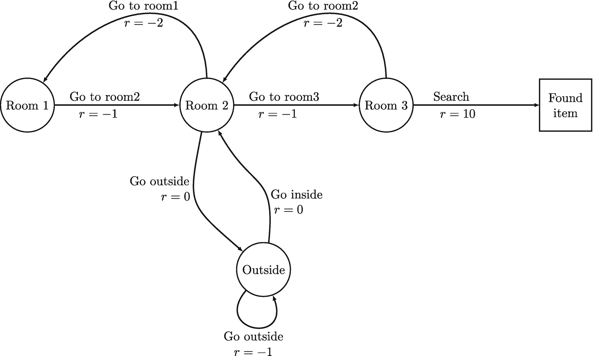

**图 5.1** 服务犬 MDP


#### 工作示例

为了更好地理解时序差分策略评估算法的工作原理，让我们通过一个示例来观察，该示例使用了我们在第 2 章中介绍的服务犬 MDP。回顾图 5.1 中所示的服务犬 MDP 示意图。

假设智能体遵循一个（固定的）随机策略`π`，在本实验中我们使用步长`α = 0.01`且无折扣（`γ = 1.0`）。我们从所有状态的初始估计值为 0 开始。由于 TD 是一种无模型强化学习方法，智能体事先既不知道执行任何动作时会收到何种奖励信号，也不知道后续状态。我们想观察算法如何更新不同状态的估计值。

假设我们正在观察第一个回合的第一个时间步`t = 0`，此时环境的当前状态为`S_t = 房间 2`，智能体根据策略`π`选择了动作`A_t = 前往房间 3`。它从环境中获得即时奖励`R_t = -1`和后续状态`S_{t+1} = 房间 3`。现在我们有了元组`(S_t, A_t, R_t, S_{t+1})`，这正是更新状态`S_t = 房间 2`的估计值所需的信息。更新过程如下：

```
Vπ(房间 2) = Vπ(房间 2) + α [ R_t + γ Vπ(房间 3) - Vπ(房间 2) ]
           = 0 + 0.01 * (-1 + 0 - 0)
           = -0.01
```

更新后，智能体继续按照策略`π`在环境中行动。环境的当前状态变为`S_t = 房间 3`，智能体根据策略`π`选择了动作`A_t = 搜索`，并获得即时奖励`R_t = 10`。后续状态`S_{t+1} = 找到物品`也是一个终止状态，因此当前回合结束。现在我们有了元组`(S_t, A_t, R_t, S_{t+1})`来更新状态`S_t = 房间 3`的估计值。更新过程如下：

```
Vπ(房间 3) = Vπ(房间 3) + α [ R_t + γ Vπ(找到物品) - Vπ(房间 3) ]
           = 0 + 0.01 * (10 + 0 - 0)
           = 0.1
```

在新的回合中，如果智能体再次处于环境状态`S_t = 房间 2`，并根据策略`π`选择了动作`A_t = 前往房间 3`，它会从环境中获得即时奖励`R_t`和后续状态`S_{t+1} = 房间 3`。我们可以如下更新`Vπ(房间 2)`的估计值：

```
Vπ(房间 2) = Vπ(房间 2) + α [ R_t + γ Vπ(房间 3) - Vπ(房间 2) ]
           = -0.01 + 0.01 * [ -1 + 0.1 - (-0.01) ]
           = -0.019
```

我们可以反复重复这个过程。表 5.1 展示了在运行不同更新次数的 TD(0)策略评估算法后，随机策略的状态值。结果是在 100 次独立运行中取平均值得到的，同时我们还列出了使用 DP 策略评估计算出的真实状态值（最后一行）。经过 10,000 次更新后，估计的状态值已非常接近真实状态值。

这些结果的关键启示是：TD(0)算法可以在不了解 MDP 转移概率和奖励函数的情况下，为某个策略学习到准确的状态值估计。然而，当状态数量较多时，其估计值的收敛速度比 DP 策略评估要慢。尽管如此，TD(0)仍是无模型强化学习中的一项重要算法，并且能够处理连续的状态和动作空间，这使得它在许多实际应用中非常有用。

**表 5.1** 服务犬 MDP 中相同随机策略的状态值，在运行不同更新次数的 TD(0)策略评估算法后得到。结果是在 100 次独立运行中取平均值；本实验中使用折扣`γ = 0.9`和步长`α = 0.01`。最后一行包含使用 DP 策略迭代计算出的真实状态值。


| 更新次数 | 房间 1 | 房间 2 | 房间 3 | 室外 | 找到的物品 |
| --- | --- | --- | --- | --- | --- |
| 0 | 0 | 0 | 0 | 0 | 0 |
| 100 |  0.22 |  0.32 | 0.5 |  0.26 | 0 |
| 1000 |  1.62 |  1.18 | 2.74 |  2.0 | 0 |
| 10,000 | 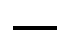 2.65 |  1.82 | 3.2 |  3.31 | 0 |
| 20,000 |  2.65 |  1.82 | 3.2 |  3.3 | 0 |
| 50,000 |  2.66 |  1.87 | 3.16 |  3.31 | 0 |
| DP |  2.66 |  1.85 | 3.17 |  3.33 | 0 |

#### 状态-动作价值函数的时序差分策略评估

在本节中，我们将描述如何扩展`TD(0)`算法来估计状态-动作价值函数`Q_π`。这一点很重要，因为我们需要`Q_π`来通过策略改进做出更好的决策，就像我们在蒙特卡洛方法中所做的那样。

回顾`Q_π`的贝尔曼期望方程：

```
Q_π(s, a) = E_π[G_t | S_t=s, A_t=a]
          = E_π[R_t + γ R_{t+1} + γ² R_{t+2} + ... | S_t=s, A_t=a]
          = E_π[R_t + γ G_{t+1} | S_t=s, A_t=a]
          = E_π[R_t + γ Q_π(S_{t+1}, A_{t+1}) | S_t=s, A_t=a]
```

这里，我们使用`R_t + γ Q_π(S_{t+1}, A_{t+1})`来替代回报`G_t`。为了估计`Q_π`，我们需要收集一个`(s, a, r, s', a')`元组，并基于状态-动作对`(s, a)`更新价值。更新估计值的公式为：

```
Q_π(S_t, A_t) = Q_π(S_t, A_t) + α( [R_t + γ Q_π(S_{t+1}, A_{t+1})] - Q_π(S_t, A_t) )
```

整个过程与`V_π`的`TD(0)`策略评估非常相似，但存在一些关键区别：

*   我们需要收集`(s, a, r, s', a')`元组，而不是`(s, a, r, s')`，来估计`Q_π`。
*   价值更新基于状态-动作对`(s, a)`。

通过估计状态-动作价值函数`Q_π`，我们可以利用策略改进做出更好的决策。`Q_π`告诉我们，在给定状态下采取特定动作的期望价值，这对于选择能带来更高回报的动作而言是重要的信息。此外，`Q_π`与价值函数`V_π`相关，后者告诉我们处于给定状态并根据给定策略`π`采取动作的期望价值。具体来说，`V_π`可以表示为`Q_π`在所有可能动作上的期望值，并按策略`π`下采取每个动作的概率进行加权。


##### TD(0)策略评估

`TD(0)`策略评估算法是一种用于估计固定策略`π`的状态-动作价值函数`Q_π`的方法。算法 2 展示了该算法的伪代码。

**算法 2：** 针对`Q[π]`的时序差分[TD(0)]策略评估

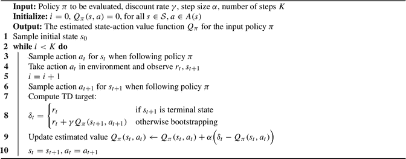

一个用于计算时序差分`TD(0)`及`Q_π`策略评估的 10 行算法，接收以下输入，输出针对输入策略`π`的估计状态-动作价值函数`Q_π`：待评估的策略`π`、折扣率`γ`、步长`α`以及步数`K`。

在该算法中，我们将所有状态-动作对的状态-动作价值函数`Q_π`初始化为 0。然后，我们使用策略`π`运行回合，并根据获得的奖励和预期的未来奖励更新状态-动作价值函数。我们重复此过程，直到算法收敛。

图 5.2 展示了针对服务犬 MDP 的随机策略计算出的状态-动作价值。结果基于 100 次独立运行的平均值；每次运行包含 20,000 次更新。我们使用折扣率`γ = 0.9`，步长`α = 0.01`。这些值与我们在第 4 章中使用蒙特卡洛策略评估计算出的值非常接近，如图 4.3 所示。

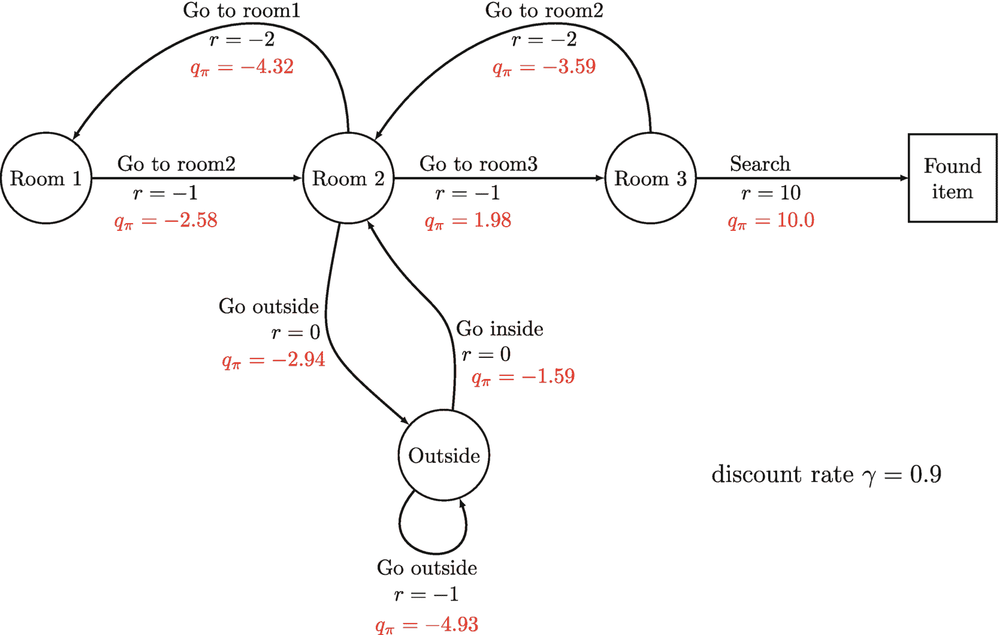

一个流程图计算了服务犬 MDP 的状态-动作价值。流程经过房间 1、2 和 3，最终到达已找到物品。房间 3 返回房间 2，房间 2 返回房间 1。房间 2 通过`r = 0`指向外部，外部通过`r = 0`返回房间 2。外部通过`r = -1`指向自身。折扣率`γ = 0.9`。

**图 5.2** 使用`TD(0)`策略评估针对服务犬 MDP 的随机策略计算出的状态-动作价值。结果基于 100 次运行的平均值；每次运行包含 2000 次更新。在此实验中，我们使用折扣率`γ = 0.9`和步长`α = 0.01`。

## 5.3 用于探索的简化`ε`-贪心策略

在执行 TD 策略评估之后，下一步是将算法扩展到 TD 控制（或策略改进）。与蒙特卡洛方法一样，TD 学习是一种无模型强化学习方法，面临着平衡探索与利用的挑战。在第 4 章中，我们引入了`ε`-贪心策略，以帮助智能体在使用蒙特卡洛方法时进行探索。我们也可以将相同的`ε`-贪心策略用于 TD 学习方法，通过使用公式(5.6)更新不同动作的策略概率分布。

```
π(a|s) = 
  case
    a = argmax_a Q_π(s, a):  1 - ε + ε / |A(s)|
    a ≠ argmax_a Q_π(s, a):  ε / |A(s)|
```

(5.6)

回顾一下，`ε`-贪心策略源自状态-动作价值函数`Q_π`，并使用公式(5.6)更新不同动作的策略概率分布。`ε`-贪心策略本质上是随机策略和确定性策略的组合。以概率`ε`，策略随机行动；而以概率`1 - ε`，策略根据`Q_π`贪心地行动。

值得注意的是，`Q_π`的值在 TD 策略评估中会不断更新，即每个时间步都会更新。因此，`ε`-贪心策略中的“确定性策略”部分也会不时更新。然而，在实践中，我们通常使用一种更简单、更高效的方法来创建`ε`-贪心策略，该方法无需更新`π`的策略概率分布。


相反，我们可以基于 `Q_π` 创建一个代理函数来构建 `ε`-贪婪策略。当智能体遵循此 `ε`-贪婪策略并需要在环境中做出决策时，该代理函数以概率 `ε` 返回一个针对特定状态均匀采样的动作，并以概率 `1-ε` 返回根据 `Q_π` 对该状态的最佳动作。这种简化版的 `ε`-贪婪策略更加稳健，尤其是在处理大规模 MDP 时，我们将在本书第二部分讨论这一点。

为此，我们基于 `Q_π` 创建一个代理函数来构建 `ε`-贪婪策略，如算法 3 所示。当智能体遵循此 `ε`-贪婪策略并需要在环境中做出决策时，该代理函数以概率 `ε` 返回一个针对特定状态均匀采样的动作，并以概率 `1-ε` 返回根据 `Q_π` 对该状态的最佳动作。

算法 3：基于 *Q*[*π*] 的简化 *ε*-贪婪策略

```
一个 8 行算法，用于计算基于 Q π 的简化 epsilon 减贪婪策略，使用 if else 语句并返回 a, P a。该算法接受以下输入：Q 状态-动作值函数，epsilon 探索率，S t 环境状态。
```

因此，无需额外步骤来专门改进策略，因为从示例代码可以看出，这种策略已不复存在。我们只需在智能体与环境交互需要选择动作时，使用这种简化版的 `ε`-贪婪策略即可。

总之，`ε`-贪婪策略是 TD 控制中平衡探索与利用的有用工具。虽然它最初源自状态-动作值函数 `Q_π`，并且由于在使用 TD 方法时 `Q_π` 会不断更新，我们可以使用一种简化版的 `ε`-贪婪策略，该策略无需更新 `π` 的策略概率分布。

### 5.4 TD 控制——SARSA

状态-动作-奖励-状态-动作（SARSA）是我们想介绍的第一个 TD 控制算法。它是一种基于 TD 学习的在线、同策略、无模型强化学习算法。SARSA 可以处理情节式和连续式强化学习问题，并使用通用策略迭代模板来寻找最优策略。然而，SARSA 通过使用 `ε`-贪婪策略简化了探索部分。`ε`-贪婪策略以概率 `1-ε` 选择使估计的状态-动作值函数 `Q_π` 最大化的动作（利用），并以概率 `ε` 选择一个随机动作（探索）。

在 SARSA 中，我们使用策略评估来估计状态-动作值函数 `Q_π`，而不是像蒙特卡洛策略评估那样估计 `V_π`。SARSA 算法使用贝尔曼方程更新估计的状态-动作值函数 `Q_π`：

```
Q_π(S_t, A_t) ← Q_π(S_t, A_t) + α (R_t + γ Q_π(S_{t+1}, A_{t+1}) - Q_π(S_t, A_t))
```

(5.7)

其中 `S_t` 和 `A_t` 表示当前状态和动作，`R_t` 是在状态 `S_t` 下执行动作 `A_t` 后获得的即时奖励，`S_{t+1}` 和 `A_{t+1}` 表示下一个状态和动作，`γ` 是折扣因子，`α` 是步长参数。

SARSA 算法使用估计的状态-动作值函数 `Q_π` 以在线方式更新策略。策略使用简化版的 `ε`-贪婪策略进行更新。具体来说，该策略以概率 `1-ε` 选择使估计的状态-动作值函数 `Q_π` 最大化的动作（利用），并以概率 `ε` 选择一个随机动作（探索）。由于策略是以在线方式更新的，我们无需执行单独的策略改进步骤。


SARSA 相比蒙特卡洛方法有一些优势。它可以进行在线学习，这意味着它可以在每个时间步之后更新状态-动作价值函数 `Q_pi` 的估计值和策略，使其更适合需要与环境实时交互的应用场景。SARSA 也是一种同策略方法，我们将在本章后面讨论什么是同策略。然而，SARSA 在估计的状态-动作价值函数中可能存在高方差和偏差，尤其是在探索率较低时。

#### 算法 4：SARSA

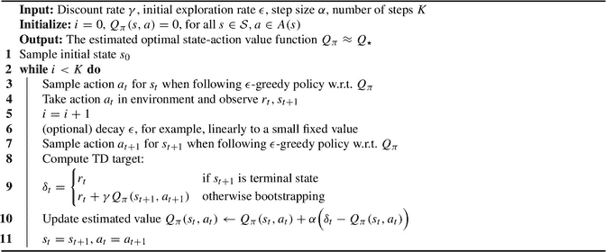 一个 11 行的算法，接收以下输入，以给出一个几乎等于 `Q_star` 的估计最优状态-动作价值函数 `Q_pi`。折扣率 `gamma`、初始探索率 `epsilon`、步长 `alpha` 和步数 `K`。

SARSA 算法有少数几个需要额外关注的参数（或者我们称之为，它对这几个参数很敏感）。第一个是步长 `alpha`。在蒙特卡洛方法中，我们使用 `1 / N(s, a)` 作为步长，但在 SARSA 中，我们根据当前估计值与下一个估计值之间的差异来更新状态-动作价值。因此，我们不会记录智能体访问特定状态-动作对 `(s, a)` 的次数。结果，我们通常需要手动设置步长。

第二个参数是用于 `epsilon`-贪婪策略的探索率 `epsilon`。我们可以选择为 `epsilon` 使用一个固定值，但在实践中，常见的做法是使用一个较大的初始 `epsilon` 值（如 1.0），并在学习过程的前半段将 `epsilon` 线性衰减到一个较小的固定值（如 0.01）。决定以多快的频率衰减 `epsilon` 值是一个没有明确答案的难题。衰减过快可能导致智能体在 `epsilon` 变得过小之前探索不足，从而完全停止探索。然而，衰减过慢可能导致智能体学习时间更长，因为它即使在不再需要时仍会继续随机行动。在实践中，这个参数需要多次试验才能找到合适的值。

#### 表 5.2

在服务犬 MDP 上运行 SARSA 算法不同更新次数后的最优状态价值。结果在 100 次独立运行中取平均值。我们使用折扣率 `gamma = 0.9` 和步长 `alpha = 0.01`，初始探索率 `epsilon = 1.0`，并将其从 1.0 衰减到 0.01。最后一行包含使用 DP 策略迭代计算出的真实最优状态价值 `V_*`。

| 更新次数 | 房间 1 | 房间 2 | 房间 3 | 室外 | 找到物品 |
| --- | --- | --- | --- | --- | --- |
| 100 | − 0.12 | 0.0 | 0.47 | 0.0 | 0 |
| 1000 | 0.28 | 3.49 | 8.17 | -0.01 | 0 |
| 10,000 | 5.83 | 7.85 | 10.0 | 4.25 | 0 |
| 20,000 | 6.02 | 7.93 | 10.0 | 5.53 | 0 |
| 50,000 | 6.12 | 7.97 | 10.0 | 6.38 | 0 |
| DP | 6.2 | 8.0 | 10.0 | 7.2 | 0 |

与蒙特卡洛策略迭代类似，SARSA 最终只会收敛到真正的最优状态-动作价值，但在实践中，我们通常在固定迭代次数后，或者当状态-动作价值的变化低于某个阈值时终止算法。因此，如果我们过早终止学习过程，SARSA 算法的结果可能并非真正的最优状态-动作价值。

我们在服务犬 MDP 上运行了 SARSA 算法，以找到最优策略和最优价值函数。最优策略是能在所有时间步上最大化期望总回报的策略，而最优价值函数是在最优策略下从每个状态出发的期望总回报。我们使用动态规划（DP）计算了真实的最优价值，该方法保证在有限次迭代内收敛到最优值。表 5.2 中显示的结果是在 100 次独立运行中取平均值得到的，使用了折扣因子 `gamma = 0.9` 和步长 `alpha = 0.01`。我们将初始探索率设为 `epsilon = 1.0`，并在学习过程的前半段将其线性衰减到 0.01。令人惊讶的是，算法在对状态-动作价值进行 500 次更新后就找到了最优策略，但估计的状态价值与使用 DP 计算出的真实 `V_*`（最后一行）并不十分接近。随着我们增加更新次数，状态估计价值变得非常接近真实价值。


### 5.5 同策略学习 vs. 异策略学习

强化学习是一种机器学习方法，智能体通过与环境交互学习如何采取行动，以最大化累积奖励信号。在本章及前几章中，我们介绍了几种同策略强化学习算法。但在深入探讨这些算法之前，我们先来定义什么是同策略算法。

在强化学习中，区分行为策略和目标策略非常重要。行为策略（用 `μ` 表示）是智能体在与环境交互生成样本经验时所遵循的策略，而目标策略（用 `π` 表示）是智能体试图学习的策略。同策略强化学习算法是指行为策略与目标策略相同的算法，即 `π = μ`。

另一方面，异策略强化学习算法是指行为策略与目标策略不同的算法，即 `π ≠ μ`。异策略算法的一个例子是 Q-learning，我们将在本章后面介绍，它能够学习最优动作价值函数 `Q*`，而无需依赖行为策略。

例如，蒙特卡洛和 TD(0) 学习算法（如 SARSA）通过遵循同一策略 `μ` 与环境交互生成的经验，来学习行为策略 `μ` 的状态-动作价值函数。这类同策略强化学习算法相对简单，但当行为策略的探索性低于目标策略时，其效率可能较低。

异策略强化学习算法通常更强大，因为它们可以利用不同行为策略生成的经验，而该行为策略可能比目标策略更具探索性。异策略强化学习中常用的一种技术是重要性采样。

重要性采样是一种利用不同分布下生成的样本来计算随机变量期望值的方法。例如，假设我们有一个行为策略 `μ` 和一个目标策略 `π`，其中 `μ ≠ π`，并且我们希望估计目标策略 `π` 的状态价值函数 `Vπ`。当智能体处于某个状态 `s` 并遵循行为策略 `μ` 时，它需要选择一个动作，而在状态 `s` 下选择某个动作 `a` 的概率定义为 `μ(a|s)`。智能体在环境中执行动作 `a` 后，环境可能转移到某个后续状态 `s'`，状态转移概率由环境动态特性决定，记为 `p(s'|s, a)`。当智能体当前处于状态 `s` 并遵循策略 `μ` 时，它最终到达后续状态 `s'` 的概率定义为 `μ(a|s) p(s'|s, a)`。

然而，如果智能体遵循目标策略 `π`，则它当前处于状态 `s` 并最终到达后续状态 `s'` 的概率定义为 `π(a|s) p(s'|s, a)`。由于 `μ ≠ π`，这两条轨迹很可能不同。为了纠正这种差异，我们使用重要性采样。

重要性采样通过将行为策略 `μ` 生成的每个样本的回报乘以 `μ` 和 `π` 所选动作概率的比值来进行加权。这样，我们就可以利用行为策略 `μ` 生成的样本来估计目标策略 `π` 的期望回报。

当使用异策略强化学习和 TD 策略评估来估计 `Vπ` 时，我们需要计算单个转移元组 `(St, At, Rt, St+1)` 的重要性采样比率。重要性采样比率是目标策略 `π` 下采取某个动作的概率与行为策略 `μ` 下该概率的比值。该比率用于纠正智能体的经验可能由与被评估策略不同的策略生成这一事实（图 5.3）。

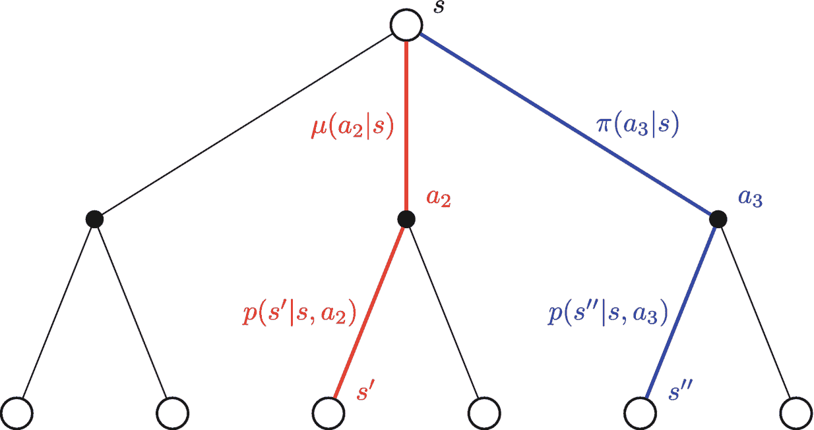


#### 离策略强化学习

离策略强化学习的树状图从节点 `s` 开始。`S` 分支为 3 个节点。第一个节点及其分支未标记。第二个节点标记为 `a2`，分支为 `s'` 和一个未标记节点。第三个节点标记为 `a3`，分支为 `s''` 和一个未标记节点。

**图 5.3** 离策略强化学习示例，用于在利用来自不同行为策略 `μ` 生成的数据时，估计目标策略 `π` 的状态价值函数 `V_π`。红色路径表示遵循 `μ` 时从状态 `s` 到 `s'` 的转移，蓝色路径表示遵循 `π` 时的转移。

重要性采样比率可使用以下公式计算：

```
ρ_t = π(A_t|S_t) p(S_{t+1}|S_t, A_t) / μ(A_t|S_t) p(S_{t+1}|S_t, A_t)
    = π(A_t|S_t) / μ(A_t|S_t)
```

(5.8)

其中 `π` 是目标策略，`μ` 是行为策略。

请注意，环境动态 `p(S_{t+1}|S_t, A_t)` 通常对智能体是未知的，但在此情况下无关紧要，因为它同时出现在比率的分子和分母中，可以相互抵消。

通常，离策略强化学习要求：如果 `π(a|s) > 0`，则 `μ(a|s) > 0`。这意味着，如果目标策略 `π` 要采取某些动作，我们要求行为策略 `μ` 至少有一个非负概率来采取这些相同的动作。在大多数情况下，行为策略会比目标策略更具探索性，例如 `ε > 0` 的 `ε`-贪心策略。这确保了每个动作被选中的概率始终大于零。

存在一种特殊情况，即当公式 (5.8) 中的分母为零时，这发生在行为策略 `μ` 选择了目标策略 `π` 本不会选择的动作时。在这种情况下，重要性采样比率变为零，这意味着在更新价值函数时会忽略此转移元组。

#### 离策略时序差分策略评估

在离策略强化学习算法中，智能体从由不同于目标策略的行为策略生成的经历中学习。为了解决这个问题，我们可以在价值更新期间使用重要性采样比率来调整时序差分误差。具体来说，时序差分目标通过目标策略和行为策略在给定状态下选择该动作的概率之比进行加权。

用于状态价值函数 `V_π` 的离策略 TD(0) 策略评估的价值更新规则如公式 (5.9) 所示：

```
V_π(S_t) = V_π(S_t) + α * π(A_t|S_t)/μ(A_t|S_t) * ( [R_t + γ V_π(S_{t+1})] - V_π(S_t) )
```

(5.9)

这里，`π(A_t|S_t)` 和 `μ(A_t|S_t)` 分别表示在目标策略和行为策略下，在状态 `S_t` 中选择动作 `A_t` 的概率。

离策略 TD(0) 学习是强化学习中一种流行的预测方法。TD(0) 是一种使用单步自举法更新价值函数的方法，其中时序差分目标是即时奖励加上下一状态的估计价值。离策略 TD(0) 的整体过程类似于常规的 TD(0) 策略评估，但我们使用不同的行为策略 `μ ≠ π` 来生成样本经历。在价值更新期间，时序差分目标通过重要性采样比率进行加权，该比率考虑了目标策略与行为策略之间的差异。这个比率有助于提高价值函数估计的准确性，确保智能体将更多权重分配给与目标策略相关的经历。例如，如果目标策略选择了在行为策略下不太可能出现的动作，那么重要性采样比率会很高，时序差分目标也会相应地获得更高的权重。

用于状态价值函数 `V_π` 的离策略 TD(0) 策略评估算法的伪代码如算法 5 所示。

**算法 5：** 用于 `V_π` 的离策略时序差分 [TD(0)] 策略评估

一个用于计算离策略时序差分 TD(0) 和 `V_π` 策略评估的 10 行算法，接收以下输入，并输出目标策略 `π` 的估计状态价值函数 `V_π`：待评估的目标策略 `π`、折扣率 `γ`、步长 `α` 和步数 `K`。


然而，要将离策略 TD(0) 策略评估算法扩展到估计针对 `π` 的状态-动作价值函数 `Q_π`，情况会稍有不同。由于我们是在估计状态-动作对 `(s, a)` 的价值，因此行为策略（或目标策略）在状态 `s` 下选择动作 `a` 的概率是多少并不重要，因为状态-动作价值函数衡量的是在状态 `s` 下采取动作 `a`，然后之后遵循策略 `π` 所获得的期望回报。我们只关心接下来会发生什么。所以，为了计算一个元组 `(S_t, A_t, R_t, S_{t+1}, A_{t+1})` 的重要性采样，我们会从第二步 `t+1` 开始，计算在后续状态 `S_{t+1}` 中选择动作 `A_{t+1}` 的概率，并跳过第一步 `t`，即在状态 `S_t` 中选择动作 `A_t` 的概率。

为了更好地理解这一点，让我们看一个离策略强化学习如何估计状态-动作价值函数 `Q_π` 的例子，如图 5.4 所示。请记住，我们是在估计一个状态-动作对的价值，而不仅仅是状态的价值。更具体地说，我们只关心状态 `s` 下动作 `a` 的价值。行为策略 `μ` 或目标策略 `π` 选择 `a` 的概率是多少并不重要，因为我们一定会更新这个特定动作 `a` 的价值。如果我们看这个图，路径的一部分（从 `s` 到 `a`）总是相同的，所以在计算重要性采样比率时无需包含它。真正重要的是，在环境转移到后续状态 `s'` 之后，行为策略和目标策略在状态 `s'` 下选择动作 `a'` 的概率。

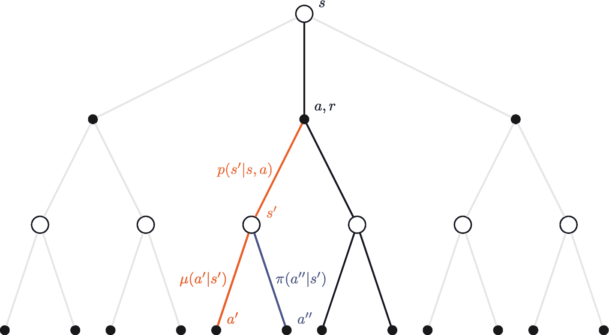

一个用于离策略强化学习的树状图，从一个 `s` 节点开始，分支到 3 个节点。左侧和右侧节点及其分支未标记。中间标记为 `a`、`r` 的节点分支到一个 `s'` 节点和一个未标记节点。`s'` 节点分支到一个 `a'` 节点和一个双撇节点。

**图 5.4** 离策略强化学习示例，用于在利用由不同行为策略 `μ` 生成的数据的同时，估计目标策略 `π` 的状态-动作价值函数 `Q_π`

当使用离策略强化学习和 TD 策略评估来计算 `Q_π` 时，我们可以使用以下公式来计算单个转移元组 `(S_t, A_t, R_t, S_{t+1}, A_{t+1})` 的重要性采样比率：

```
ρ_{t+1} = π(A_{t+1}|S_{t+1}) p(S_{t+1}|S_t, A_t) / μ(A_{t+1}|S_{t+1}) p(S_{t+1}|S_t, A_t)
        = π(A_{t+1}|S_{t+1}) / μ(A_{t+1}|S_{t+1})
```
(5.10)

这里，`ρ_{t+1}` 表示从时间步 `t+1` 开始的重要性采样比率，它用于修正行为策略与目标策略之间的概率差异。具体来说，`π` 代表目标策略，而 `μ` 代表行为策略。

公式 (5.11) 展示了在使用 TD(0) 和离策略强化学习时，针对 `Q_π` 调整后的价值更新规则：

```
Q_π(S_t, A_t) = Q_π(S_t, A_t) + α * π(A_{t+1}|S_{t+1}) / μ(A_{t+1}|S_{t+1}) * ( [R_t + γ Q_π(S_{t+1}, A_{t+1})] - Q_π(S_t, A_t) )
```
(5.11)

该公式利用由不同行为策略 `μ` 生成的转移数据，更新了针对目标策略 `π` 的状态-动作价值函数 `Q_π` 的估计值。重要性采样比率用于修正行为策略与目标策略之间的概率差异。具体来说，我们使用比率 `π(A_{t+1}|S_{t+1}) / μ(A_{t+1}|S_{t+1})` 来调整更新，以便将目标策略与行为策略之间的差异考虑在内。该更新基于时序差分误差，即当前状态-动作对的估计 Q 值与下一状态-动作对的估计 Q 值之间的差值，再加上在当前状态-动作对获得的奖励。学习率 `α` 控制着更新的大小。

现在，我们介绍针对给定策略 `π` 的 `Q_π` 的离策略 TD(0) 策略评估算法。

**算法 6：离策略时序差分 [TD(0)] 策略评估用于 `Q[π]`**

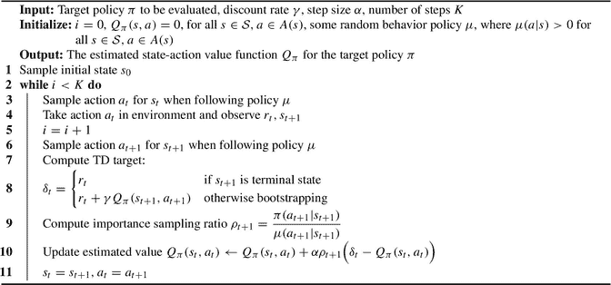 一个 11 行的算法，用于计算离策略时序差分 TD(0) 和 `Q_π` 的策略评估，它接收以下输入，为目标策略 `π` 给出估计的状态-动作价值函数 `Q_π`。待评估的目标策略 `π`、折扣率 `γ`、步长 `α` 以及步数 `K`。


在上一章中，我们介绍了用于学习动作价值的蒙特卡洛方法，并且可以将这些方法扩展到离策略学习。然而，重要性采样比率会变得更加复杂，因为我们需要包含直到情节结束的动作选择概率和状态转移概率。计算重要性采样比率`ρ_{t:T-1}`的公式包含了诸如`π(a|s)`和`μ(a|s)`这样的项，它们分别表示在目标策略和行为策略下，在状态`s`中选择动作`a`的概率。需要注意的是，如果在转移序列中的任何一点，这些概率中的任何一个变为零，那么重要性采样比率也会变为零。这意味着该序列的价值也将变为零并被丢弃。

```
ρ_{t:T-1} = (π(A_t|S_t) p(S_{t+1}|S_t, A_t) π(A_{t+1}|S_{t+1}) ... p(S_T|S_{T-1}, A_{T-1})) / (μ(A_t|S_t) p(S_{t+1}|S_t, A_t) μ(A_{t+1}|S_{t+1}) ... p(S_T|S_{T-1}, A_{T-1}))
          = (π(A_t|S_t) π(A_{t+1}|S_{t+1}) ... π(A_{T-1}|S_{T-1})) / (μ(A_t|S_t) μ(A_{t+1}|S_{t+1}) ... μ(A_{T-1}|S_{T-1}))
```

(5.12)

在实践中，经常使用带有离策略学习的时序差分学习，例如我们将在下一节介绍的`Q-learning`算法。然而，在以下情况下，使用蒙特卡洛方法的离策略学习可能比其他方法更受青睐：

*   生成数据的行为策略与智能体当前遵循的目标策略存在显著差异。在这种情况下，使用其他方法（如时序差分学习）在目标策略下学习时，由行为策略收集的数据可能用处不大。另一方面，蒙特卡洛方法仍然可以用于估计状态或动作的价值，因为它们依赖于完整的情节序列，而不是单个转移。
*   智能体需要学习罕见或不频繁动作的价值。在某些环境中，某些动作可能很少见，或者行为策略很少选择它们。时序差分学习可能无法提供这些动作价值的准确估计，因为它依赖于单个转移来更新估计。相比之下，蒙特卡洛方法可以提供对罕见或不频繁动作价值更准确的估计，因为它们依赖于完整的情节序列。
*   智能体需要学习一个既不同于行为策略也不同于目标策略的策略的价值。在这种情况下，可以使用蒙特卡洛方法来估计所需策略的价值，而无需智能体在数据收集期间实际遵循该策略。

### 5.6 Q-Learning

`Q-learning`是一种在线、离策略学习算法，由 Watkins 和 Peter 开发。它是一种无模型的强化学习方法，也使用时序差分学习，这意味着`Q-learning`支持情节式和持续式强化学习问题。它可能是现实世界中用于解决强化学习问题最常用的算法之一。由 DeepMind 构建的、能够以人类水平玩 Atari 视频游戏的著名`DQN`智能体，就是基于`Q-learning`（`DQN`智能体使用深度神经网络来近似状态-动作价值函数，我们将在本书第二部分介绍）。

我们之前介绍的`SARSA`算法被认为是通用策略迭代算法家族的一员。它估计策略`π`的状态-动作价值函数`Q_π`，并使用`ε`-贪婪策略来计算一个新的、更好的策略`π'`。尽管我们使用了一个更简单的`ε`-贪婪策略版本，跳过了计算更好确定性策略的步骤，但策略迭代的总体思想仍然适用于`SARSA`。

然而，如果我们还记得，我们在第 3 章中介绍了另一种动态规划算法，称为价值迭代。与通用策略迭代算法估计策略`π`的价值函数不同，价值迭代算法首先尝试基于`V_*`的贝尔曼最优方程来估计最优状态价值函数`V_*`：

```
V_*(s) = max_a E[R_t + γ V_*(S_{t+1}) | S_t = s, A_t = a]
       = max_a [R(s, a) + γ Σ_{s'∈S} P(s'|s, a) V_*(s')], 对于所有 s∈S
```

(5.13)

`Q-learning`采用了与价值迭代类似的思想，但它不是估计最优状态价值函数`V_*`，而是估计最优状态-动作价值函数`Q_*`。回顾`Q_*`的贝尔曼最优方程：

```
Q_*(s, a) = E[R_t + γ max_{a'} Q_*(S_{t+1}, a') | S_t=s, A_t=a]
```

(5.14)

`Q-learning`使用公式(5.14)和时序差分学习的增量更新方法思想作为价值更新规则，其更新规则如下：

```
Q(S_t, A_t) = Q(S_t, A_t) + α ( [R_t + γ max_{a'} Q(S_{t+1}, a')] - Q(S_t, A_t) )
```

(5.15)

`Q-learning`是一种离策略学习算法，它避免了其他离策略学习算法中通常使用的重要性采样。重要性采样可能在计算上代价高昂并引入偏差，这使得`Q-learning`成为估计最优状态-动作价值函数的一种更高效、更可靠的方法。


Q-learning 的一个优势是，它总是使用后继状态 `s'` 所有有效动作中的最大 Q 值 `max_a' Q(S_{t+1}, a')` 进行更新，无论行为策略选择了哪个动作。对于 Q-learning，由于目标策略总是为后继状态选择具有最大 Q 值的动作，因此重要性采样比率简化为：在行为策略下选择最大 Q 值动作的概率除以在目标策略下选择最大 Q 值动作的概率。该比率始终等于 1，与行为策略无关，因为在值更新过程中并未使用行为策略选择的动作。相比之下，其他离策略学习算法可能需要重要性采样来纠正行为策略与目标策略之间的差异。

图 5.5 展示了一个 Q-learning 为目标策略 `π` 估计最优状态-动作值函数 `Q*` 的示例。如图所示，无论智能体在遵循行为策略 `μ` 进入后继状态 `s'` 时选择了哪个动作，用于值更新的遍历路径始终相同。然而，在某些特殊情况下，例如使用依赖于行为策略选择动作的 N 步回报时，我们仍需使用重要性采样。

[图：一个离策略 Q-learning 的树状图，从节点 s 开始，分支到 3 个节点。左右节点及其分支未标记。中间节点标记为 a, r，分支到一个 s' 节点和一个未标记节点。s' 节点分支到一个 a' 节点和一个 a'' 节点。]

**图 5.5** 离策略 Q-learning 为目标策略 `π` 估计最优状态-动作值函数 `Q*` 的示例

为了更新 Q-learning 中的 Q 值，我们使用目标策略来评估动作 `a' = max_a' Q(S_{t+1}, a')`，同时使用评估值来学习同一个目标策略。这意味着 Q-learning 的重要性采样比率简化为 1，因为分子和分母相同。具体来说，重要性采样比率可以表示为：

```
ρ_{t+1} = (π(A_{t+1}|S_{t+1}) * p(S_{t+1}|S_t, A_t)) / (π(A_{t+1}|S_{t+1}) * p(S_{t+1}|S_t, A_t)) = 1
```

(5.16)

通过避免对重要性采样的需求，Q-learning 在计算上更高效，并且可以更准确地估计最优状态-动作值函数。例如，假设我们有一个使用 Q-learning 的智能体，它已经为某个状态 `s` 和动作 `a` 估计了状态-动作值 `Q(s, a) = 10`。现在，智能体执行动作 `a` 并转移到新状态 `s'`，其中最大 Q 值为 `Q(s', a') = 15`。然而，用于在状态 `s'` 中选择动作的行为策略与用于更新 Q 值的目标策略不同。在这种情况下，更新 `Q(s, a)` 的重要性采样比率涉及在行为策略和目标策略下选择 `a` 和 `a'` 的概率之比。但由于 Q-learning 总是使用下一个状态的最大 Q 值，我们无需考虑选择导致该最大值的动作的概率。这简化了更新过程，并使 Q-learning 比其他需要重要性采样的离策略学习算法更高效。

Q-learning 是一种无模型强化学习算法，与 SARSA 类似，它需要平衡探索和利用以学习最优策略。在强化学习中，探索指的是尝试新动作以发现潜在更优的策略，而利用指的是利用已知策略以最大化奖励。为此，我们可以采用 `ε`-贪心策略，该策略以概率 `1 - ε` 选择最佳动作，以概率 `ε` 选择随机动作。

Q-learning 和 SARSA 具有相似的结构和流程，都使用时序差分（TD）学习方法。然而，在 Q 值更新过程中，Q-learning 总是为后继状态 `S_{t+1}` 选择具有最高 Q 值的动作，记为 `max_a' Q(S_{t+1}, a')`，而 SARSA 则从策略中采样一个动作。这是因为 Q-learning 是一种离策略算法，它基于最佳可能动作更新 Q 值，而 SARSA 是一种在策略算法，它基于实际采取的动作更新 Q 值。

Q-learning 算法的伪代码如算法 7 所示。与 SARSA 一样，Q-learning 对超参数敏感，例如步长 `α` 和 `ε`-贪心策略的探索率 `ε`。步长决定了算法更新 Q 值的速度，而探索率决定了算法探索新动作（而非利用当前最佳动作）的频率。

**算法 7：** 带 `ε`-贪心探索的 Q-learning

[图：一个 10 行算法，标题为“带 epsilon 减贪心探索的 Q-learning”，输入为折扣率 gamma、初始探索率 epsilon、步长 alpha 和步数 K，输出为估计的最优状态-动作值函数 Q。]


#### 工作示例

让我们来看一个 Q-learning 如何更新状态-动作对 `(s, a)` 值的例子。我们仍将使用服务犬 MDP。但这次，我们采用图 5.2 中通过 TD(0)策略评估计算出的随机策略的状态-动作值。我们只关注算法如何计算状态*房间 1*和动作*前往房间 2*的值（图 5.6）。

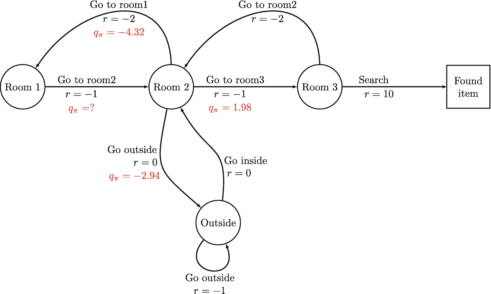

Q-learning 计算状态-动作值的流程图，流程经过房间 1、2、3，最终到达已找到物品。房间 3 返回房间 2，房间 2 返回房间 1。房间 2 通过 `r = 0`、`q pie = -2.94` 指向外部。外部通过 `r = 0` 返回房间 2。外部通过 `r = -1` 自循环。

**图 5.6** Q-learning 如何为服务犬 MDP 计算状态-动作值的示例。状态*房间 2*中各动作的值取自图 5.2。

假设智能体在状态*房间 1*时采取了动作*前往房间 2*，并从环境中获得了奖励信号 `-1` 和后续状态*房间 2*。我们使用以下变量和参数：

- `Q(s, a)`：状态-动作对 `(s, a)` 的值
- `α = 0.1`：步长
- `γ = 0.9`：折扣因子

状态*房间 2*中动作*前往房间 1*、*前往房间 3*、*前往外部*的估计状态-动作值分别为 `-4.32`、`1.98`、`-2.94`。状态-动作对*房间 1*和*前往房间 2*的初始估计值为 `0`。

Q-learning 算法将如何估计状态-动作对*房间 1*和*前往房间 2*的（最优）值？我们可以直接将这些数值代入公式(5.15)。唯一需要指定的是后续状态-动作对的值。在 Q-learning 中，我们寻找后续状态所有动作中的最大值。在本例中，动作*前往房间 3*的值为 `1.98`。我们可以按如下方式计算状态-动作对*房间 1*和*前往房间 2*的值：

```
Q(房间 1, 前往房间 2) = 0 + 0.1 * (-1 + 0.9 * 1.98 - 0) 
                       = 0.078
```

我们进行了实验，以评估 Q-learning 算法在服务犬 MDP 上的性能，实验设置与我们之前使用 SARSA 的实验相同。这些实验的目标是在这个特定的 MDP 上比较 Q-learning 和 SARSA 的性能。

我们在实验中使用了以下变量和参数：

- `α = 0.01`：Q-learning 算法中使用的步长
- `γ = 0.9`：应用于未来奖励的折扣因子
- `ε = 1.0`：决定选择随机动作概率的探索率

为了在学习过程中降低探索率，我们应用了一个线性衰减计划，将探索率从初始值 `1.0` 降低到最终值 `0.01`。

如表 5.3 所示，Q-learning 算法在对值函数进行 500 次更新后找到了最优策略。它还在大约 20,000 次更新后找到了最优值函数 `V*`，这比表 5.2 中 SARSA 的 50,000 次更新快得多。然而，值得注意的是，尽管运行了更多次更新，SARSA 找到的最优值函数仍然没有完美匹配真实的最优值函数。这表明 Q-learning 比 SARSA 收敛更快，并且能产生更好的结果。

### 5.7 双 Q 学习

双 Q 学习是一种解决 Q-learning 小问题的方法，即估计的最优状态-动作值 `Q*` 可能存在偏差。这是由于值更新过程的性质决定的，该过程总是使用能为后续状态 `s'` 产生最大值的动作。在某些随机环境中，这种方法可能会导致问题，Hado Hasselt [4] 对此进行了详细解释。

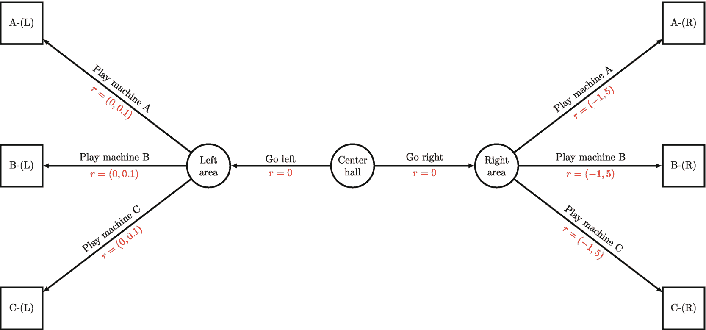

赌场老虎机 MDP 的流程图，从中央大厅开始，指向左侧和右侧区域。左侧区域通过 `r = 0, 0.1` 指向 A-L、B-L 和 C-L。右侧区域通过 `r = -1, 5` 指向 A-R、B-R 和 C-R。

**图 5.7** 赌场老虎机 MDP，仅显示每侧的三台老虎机

**表 5.3** 在运行 Q-learning 算法不同更新次数后，服务犬 MDP 的最优状态值，`γ = 0.9, α = 0.01`，`ε` 从 `1.0` 衰减到 `0.01`。最后一行包含使用 DP 策略迭代计算出的真实 `V*`。

| 更新次数 | 房间 1 | 房间 2 | 房间 3 | 外部 | 已找到物品 |
| --- | --- | --- | --- | --- | --- |
| 100 | −0.12 | 0.0 | 0.45 | 0.0 | 0 |
| 1000 | 0.95 | 4.09 | 8.25 | 0.22 | 0 |
| 10,000 | 6.2 | 8.0 | 10.0 | 7.05 | 0 |
| 20,000 | 6.2 | 8.0 | 10.0 | 7.2 | 0 |
| 50,000 | 6.2 | 8.0 | 10.0 | 7.2 | 0 |
| DP | 6.2 | 8.0 | 10.0 | 7.2 | 0 |


#### 赌场示例

为了说明最大化偏差的问题，我们来看一个源自萨顿和巴托的简单示例[2]。假设我们在赌场里，想玩几台老虎机娱乐一下。我们可以将这个示例建模为图 5.7 所示，其中赌场游乐区的中心是中央大厅，大厅周围有两个游乐区（左侧、右侧）。每侧都有十台老虎机可供选择，不过图中每侧只画了三台。

然而，这家赌场隐藏着一个秘密。左侧的所有老虎机共享相同的奖励分布，均值为 0，标准差为 0.1。这意味着如果我们选择玩左侧的任何一台老虎机，获得的奖励可能在[-0.1, 0.1]之间。如果玩 1000 轮，我们会收支平衡，因为平均奖励为 0。

右侧的老虎机则有着完全不同的奖励分布，均值为-1.0，标准差为 5.0。当我们玩右侧的任何一台老虎机时，获得的奖励可能在[-6.0, 4.0]之间。如果玩 1000 轮，我们肯定会输钱（平均每轮输 1 美元）。所以显而易见的选择是玩左侧的老虎机。

这个示例展示了在 Q 学习中仅依赖最大值估计的潜在陷阱，并凸显了使用双 Q 学习等替代方法的必要性。

我们将该问题建模为一个回合制强化学习问题，智能体通过与随机环境交互，学习随时间最大化其累积奖励。每次动作后，智能体都会获得一个奖励，该奖励是一个随机变量，其分布对智能体来说是未知的。每个回合总是从*中央大厅*状态开始，智能体可以选择*向左走*或*向右走*，从而转移到相应的后续状态*左侧区域*或*右侧区域*。在每个区域中，智能体可以选择玩多台老虎机中的一台，每台老虎机产生的奖励具有不同的概率分布。当智能体选择玩某台老虎机时，无论它位于哪个区域，该回合即告结束。下一个回合独立于上一个回合的结束方式开始，假设智能体拥有无限的资金可以继续玩。

如果我们使用无折扣因子的标准 Q 学习（`γ = 1`），当智能体处于*中央大厅*状态时，*向左走*和*向右走*这两个动作的估计值是多少？让我们按照公式(5.15)中的更新规则来找出答案。假设两个动作的初始 Q 值均为 0，步长为`α = 1`。更新规则可以简化为`Q(S_t, A_t) = R_t + max_{a'}Q(S_{t+1}, a')`，其中`R_t`是即时奖励，`max_{a'}Q(S_{t+1}, a')`是后续状态`S_{t+1}`的最大 Q 值。

在*左侧区域*状态中，我们从任何一台老虎机中能获得的最高奖励是 0.1（忽略异常值），因此*中央大厅*和*向左走*的估计 Q 值为`0 + 0.1 = 0.1`。然而，在*右侧区域*状态中，我们从任何一台老虎机中能获得的最高奖励是 4.0，这导致*中央大厅*和*向右走*的估计 Q 值为`0 + 4.0 = 4.0`。请注意，由于奖励的高方差，这高估了该动作的真实价值。在实践中，智能体需要多次尝试每个动作才能估计出其真实价值，在这个示例中代价很高。

双 Q 学习是标准 Q 学习算法的一种扩展，旨在缓解后者可能出现的过高估计问题。在 Q 学习中，智能体估计最优状态-动作值函数 Q，并用它来选择动作。然而，在某些情况下，例如赌场老虎机 MDP 示例，Q 学习可能会高估动作的价值，从而导致次优策略。

双 Q 学习背后的思想是学习两个独立的 Q 函数，`Q1`和`Q2`，并用它们来选择动作。在学习过程中，一半时间算法更新`Q1`的值，另一半时间更新`Q2`的值。双 Q 学习的关键贡献在于，在估计后续状态-动作对的价值时，如何选择使用哪个 Q 值。

在标准 Q 学习算法中，我们可以使用以下公式计算 TD 目标：

```
TD_target = R_t + γ max_{a'}Q(S_{t+1}, a')
          = R_t + γ Q( S_{t+1}, argmax_{a'}Q(S_{t+1}, a') )
```

使用双 Q 学习时，我们将上述用于更新`Q1`的公式修改为：

```
TD_target = R_t + γ max_{a'}Q(S_{t+1}, a')
          = R_t + γ Q2( S_{t+1}, argmax_{a'}Q1(S_{t+1}, a') )
```

假设智能体即将更新`Q1`，并且已经收集了一个元组`(S_t, A_t, R_t, S_{t+1})`。智能体使用`Q1`来选择最佳动作`a' = argmax_{a'}Q1(S_{t+1}, a')`，该动作在后续状态`S_{t+1}`中产生最大值。然而，智能体并不直接使用`Q1(S_{t+1}, a')`的值，而是使用这个最佳动作`a'`从`Q2`中选择值，即`Q2(S_{t+1}, a')`。这个过程有助于减少过高估计，并得到更准确的价值估计。


类似地，如果智能体要更新 `Q2`，它使用相同的逻辑，但将 `Q1` 和 `Q2` 互换：

```
Q2(S_t, A_t)=Q2(S_t, A_t) + α ( R_t + γ Q1(S_{t+1}, argmax_{a'}Q2(S_{t+1}, a') ) - Q2(S_t, A_t) )
```

举个例子，假设一个智能体正在学习玩一个需要穿越迷宫到达目标的游戏。在某些情况下，智能体可能会高估某些动作的价值，从而导致次优策略。使用双 Q 学习，智能体学习两个独立的 Q 函数，在学习过程中，它交替更新 `Q1` 和 `Q2` 的值。在选择动作时，智能体使用来自 `Q1` 的最佳动作来选择来自 `Q2` 的值，反之亦然。这个过程有助于减少高估，并能带来更准确的价值估计，从而产生更好的策略。

在赌场 MDP 示例的背景下，同一个动作在 `Q1` 和 `Q2` 中同时具有最大值的概率要低得多，这缓解了最大化偏差问题。

现在我们正式介绍使用 `ε`-贪心策略进行探索的双 Q 学习算法。整体流程与标准 Q 学习相同。我们需要做的一个小改动是，当智能体需要在环境中行动时，它使用合并后的状态-动作价值函数 `Q1` 和 `Q2` 作为单个状态-动作价值函数 `Q` 来执行 `ε`-贪心策略。`ε`-贪心策略以概率 `1-ε` 从 `Q` 中选择价值最高的动作，并以概率 `ε` 选择一个随机动作。

**算法 8：带 `ε`-贪心探索的双 Q 学习**

一个 15 行的算法，标题为“带 epsilon 减贪心探索的双 Q 学习”，接收以下输入，并输出最优状态-动作价值函数 `Q`：折扣率 `gamma`、初始探索率 `epsilon`、步长 `alpha` 和步数 `K`。

我们使用标准 Q 学习和双 Q 学习进行了一项实验，以找到我们赌场 MDP 的最优策略。在整个实验中，我们使用了固定的探索率 `ε=0.1`、相同的步长 `α=0.1`，并且没有折扣（`γ=1.0`）。实验的目标是衡量智能体在处于*中央大厅*状态时选择*向右走*动作的频率。

一张频率图显示了“在中央大厅选择向右走的百分比”与“回合数”的关系：Q 学习呈现一条向下凹的递减曲线，双 Q 学习呈现一条向上凸的递减曲线，以及一条从纵轴 5% 处开始的平行于横轴的直线。该值为估计值。

**图 5.8** 在赌场 MDP 中，处于*中央大厅*状态时选择*向右走*的百分比。结果在 1000 次独立运行中取平均值；每次运行包含 500 个回合。在整个实验中，我们使用步长 `α=0.02`，无折扣 `γ=1.0`，以及固定的探索率 `ε=0.1`。

结果如图 5.8 所示，在 1000 次独立运行中取平均值，每次运行包含 500 个回合。最优策略是以 5% 的概率选择*向右走*（因为我们使用了固定的 `ε=0.1`，智能体有 10% 的概率会随机行动，而在随机行动时，在*向左走*和*向右走*之间选择，智能体应以 0.5 * 10% 的概率选择*向右走*）。我们观察到，在前 200 个回合中，标准 Q 学习智能体选择*向右走*的频率高于最优策略。然而，双 Q 学习智能体在仅 50 个回合后就迅速发现了最优策略。


### 5.8 N 步自举法

在强化学习中，智能体的目标是学习一种策略，以最大化其随时间累积的期望奖励。学习此类策略的一种方法是估计每个状态的价值，即智能体从该状态开始遵循其策略所能获得的期望累积奖励。

在 TD(0)策略评估中，我们使用 TD 目标`R_t + γ V_π(S_{t+1})`来估计回报`G_t`，该目标由即时奖励`R_t`加上后续状态的折扣价值`γ V_π(S_{t+1})`组成。然而，这种方法的一个问题是，如果后续状态`S_{t+1}`的估计价值存在偏差，那么更新后的价值`V_π(S_t)`也会存在偏差。这可能导致次优性能，意味着智能体可能需要花费更多时间来学习状态价值。

蒙特卡洛方法不存在这个问题，因为智能体始终使用从完整回合中计算出的实际回报。然而，我们更倾向于使用 TD 方法而非蒙特卡洛方法，因为我们希望支持持续进行的强化学习问题，并且希望避免等到回合结束才更新价值。那么，有没有一种方法可以在仍使用 TD 方法的同时，更准确地估计回报呢？

为了回答这个问题，让我们来看价值函数的数学公式。状态价值函数`V_π`可以递归地写为：

```
V_π(s) = E_π[ G_t | S_t = s ]
       = E_π[ R_t + γ R_{t+1} + γ² R_{t+2} + γ³ R_{t+3} + ... | S_t = s ]
       = E_π[ R_t + γ ( R_{t+1} + γ R_{t+2} + γ² R_{t+2} + ... ) | S_t = s ]
       = E_π[ R_t + γ G_{t+1} | S_t = s ]
       = E_π[ R_t + γ V_π(S_{t+1}) | S_t = s ]
```

(5.17)

在 TD(0)策略评估中，我们使用`R_t + γ V_π(S_{t+1})`（来自公式 5.17）通过增量更新方法替换`G_t`：

```
V_π(S_t) = V_π(S_t) + α ( G_t - V_π(S_t) )
         = V_π(S_t) + α ( [ R_t + γ V_π(S_{t+1}) ] - V_π(S_t) )
```

(5.18)

为了更准确地估计回报，我们可以使用一种称为 N 步自举法的方法，该方法以不同的方式重新排列回报`G_t`，使用从当前时间步`t`开始未来多个时间步的奖励，加上最后一个奖励之后后续状态的折扣价值。这如公式(5.19)、(5.20)和(5.21)所示：

```
G_t = R_t + γ R_{t+1} + γ² R_{t+2} + γ³ R_{t+3} + γ⁴ R_{t+4} + ...
    = R_t + γ R_{t+1} + γ² ( R_{t+2} + γ R_{t+3} + γ² R_{t+4} + ... )
    = R_t + γ R_{t+1} + γ² G_{t+2}
```

(5.19)

```
G_t = R_t + γ R_{t+1} + γ² R_{t+2} + γ³ R_{t+3} + γ⁴ R_{t+4} + ...
    = R_t + γ R_{t+1} + γ² R_{t+2} + γ³ ( R_{t+3} + γ R_{t+4} + ... )
    = R_t + γ R_{t+1} + γ² R_{t+2} + γ³ G_{t+3}
```

(5.20)

```
G_t = R_t + γ R_{t+1} + γ² R_{t+2} + ... + γ^{n-1} R_{t+n-1} + γ^n G_{t+n}
```

(5.21)

受公式(5.17)启发，我们可以使用状态价值函数`V_π`递归地重写公式(5.21)，其中我们使用`γ^n V_π(S_{t+n})`作为对时间步`t+n+1, t+n+2, ...`缺失奖励的估计器（或自举）。这便得到了*N 步*回报或*N 步*自举法，如公式(5.22)所示：

```
G_t = R_t + γ R_{t+1} + γ² R_{t+2} + ... + γ^{n-1} R_{t+n-1} + γ^n V_π(S_{t+n})
```

(5.22)

我们可以将公式(5.22)作为增量价值更新规则的一部分，其中我们使用 N 步回报作为估计回报`G_t`：

```
V_π(S_t) = V_π(S_t) + α ( [ R_t + γ R_{t+1} + ... + γ^{n-1} R_{t+n-1}
           + γ^n V_π(S_{t+n}) ] - V_π(S_t) )
```

(5.23)

这里，`α`是步长参数，决定了更新的幅度。该更新规则是增量的，意味着每个状态的价值会在每个时间步后根据观察到的奖励和下一个状态的估计价值进行更新。

使用 N 步自举法是一种在仍使用 TD 方法的同时更准确估计回报的方式。通过将回报分解为多个奖励，我们可以利用价值函数来估计 N 个时间步之后发生的缺失奖励。这种方法有助于减轻因使用有偏的后续状态价值估计而引入的偏差。

与蒙特卡洛方法相比，N 步自举法的一个优势是它可以用于持续进行的强化学习问题，即回合没有固定长度的问题。蒙特卡洛方法虽然可以通过截断回合来使用，但 N 步自举法可以在 N 个时间步后更新价值函数，从而使其更加高效。


##### N 步自举法

N 步自举法将`TD(0)`与蒙特卡洛方法混合在一起（适用于情节式任务）。当`N=1`时，我们得到标准的`TD(0)`，例如`SARSA`。如果`N=T`，其中`T`是情节的长度，我们就得到蒙特卡洛方法。这种方法有时被称为“多步前瞻”，因为智能体利用未来多个时间步的信息来计算价值估计（图 5.9）。

`N`的选择是在偏差与方差之间进行权衡。如果`N`较小，估计值偏差更大，因为它依赖的未来奖励样本更少，但更新更频繁，这可以降低方差。如果`N`较大，估计值偏差更小，因为它使用了更多样本，但更新频率较低，且可能具有更高的方差。

对于情节式强化学习问题中接近终止时间步`T`的状态，例如`S_{T-3}`、`S_{T-2}`、`S_{T-1}`，该如何处理？为了计算这些时间步的 N 步回报，我们只需忽略缺失的时间步。有时，我们也可以在情节序列末尾添加抽象序列（奖励值和状态值均为 0），这样会得到与直接忽略缺失时间步相同的结果（图 5.10）。

```
一个流程图。流程通过 A_{T-2}、A_{T-1}和 0 链接，线性地经过 S_{T-2}、S_{T-1}、S_T、0、0 和 0 节点。每个节点通过 R_{T-2}、R_{T-1}和 0 链接指向其后继节点。下方是 V_π(S_T)、V_π(S_{T-1})和 V_π(S_{T-2})的公式。
```

**图 5.10** N 步自举法如何处理情节序列的末尾，其中`n=3`

```
N 步回报思想的示意图，其中 n 等于 3。一个线性节点图通过 A_1、A_1、A_2、A_3 和 A_4 变量，流经 S_0、S_1、S_2、S_3、S_4 和 S_5 节点。每个节点通过 R 变量指向其后继节点。下方是 V(S_2)、V(S_1)和 V(S_0)的公式。
```

**图 5.9** N 步回报的思想，其中`n=3`

N 步自举法是一种强大的技术，可应用于多种场景。以下是两个实际应用示例：

- 在游戏环境中，智能体通常需要基于随时间发生的一系列事件做出决策。例如，在第一人称射击游戏中，智能体可以使用 N 步自举法，通过考虑未来 N 个时间步将获得的奖励来估计给定状态的价值。这有助于智能体在游戏中做出更准确的行动决策。

- 在机器人控制中，智能体必须基于传感器和其他环境因素的反馈做出决策。例如，控制机械臂的智能体可以使用 N 步自举法，通过考虑未来 N 个时间步将获得的奖励来估计给定状态的价值。这有助于智能体更准确地决定如何移动机械臂以实现期望的结果。

要应用 N 步自举法，需要遵循几个具体步骤。首先，我们必须为当前问题选择一个合适的`N`值。这取决于时间跨度长度和环境变化速率等因素。接下来，智能体使用 N 步自举法，基于未来 N 个时间步将获得的奖励来估计每个状态的价值。这有助于智能体通过考虑每个行动的长期后果来做出更准确的决策。

然而，正如迪米特里·P·伯特塞卡斯教授[5]的研究所述，N 步自举法存在一些潜在问题。例如，在某些情况下，算法配置不当可能导致次优行为。为了说明这一点，请考虑以下玩具示例 MDP（见图 5.11）。在这个情节式任务中，新情节总是从最左侧节点（起点）开始，并在最右侧节点（终点）结束。除了初始起始状态外，智能体在所有状态下只能选择一个使其持续前进的动作；而在起始状态，有两个动作可将智能体引向上方或下方路径。每个状态-动作对关联的奖励信号由节点之间的边标出。最优路径是下方路径，因为接近终止状态时有一个高奖励信号（`r=10`）。

```
一个关于 N 步自举法陷阱的流程图，其中 n=3 设置错误。上方流程如下：起点，R=0，r=1，r=2，r=1，终点。下方流程如下：起点，R=0，r=2，r=0，r=10，终点。
```

**图 5.11** N 步自举法的陷阱，当`n=3`设置错误时，算法可能最初选择次优路径（上方路径）而非最优路径（下方路径）

然而，在配置错误的情况下，例如`N=3`，算法最初会选择上方路径，尤其是在价值估计不准确时。为避免此类问题，建议尽可能使用最大的`N`值，尽管这可能受到计算资源的限制。


#### N 步 SARSA

将 N 步自举法扩展到状态-动作价值函数 `Q_pi` 相当简单。在这种情况下，我们基于状态-动作对来更新值，并且对于最后一个后继状态 `S_{t+n}`，我们还需要动作 `A_{t+n}`：

```
Q_pi(S_t, A_t) = Q_pi(S_t, A_t) + alpha * ( [R_t + gamma * R_{t+1} + ... + gamma^{n-1} * R_{t+n-1} + gamma^n * Q_pi(S_{t+n}, A_{t+n})] - Q_pi(S_t, A_t) )
```

(5.24)

这里，`alpha` 是步长参数，`gamma` 是折扣因子，`t` 是当前时间步。

我们现在介绍 N 步 SARSA 同策略学习算法，它建立在 SARSA 的基本结构之上。然而，为了计算任意 N 步的回报，我们需要做一些改动。这意味着当智能体在环境中做出决策时，值不会立即更新。相反，它必须在环境中持续行动 `N` 步，才能收集到计算 N 步回报所需的样本转移。

为了存储必要的样本转移，我们选择使用一个列表 `tau`，它存储形式为 `(s, a, r, s', a')` 的元组，其中 `s` 和 `s'` 分别是当前状态和下一状态；`a` 和 `a'` 分别是当前动作和下一动作；`r` 是在状态 `s` 下采取动作 `a` 获得的奖励。`tau` 的最大长度为 `N`。我们使用 `(s, a, r, s', a')` 而不是 `(s, a, r, s')`，因为对于最后一个后继状态 `S_{t+n}`，我们还需要动作 `A_{t+n}` 来完成公式 (5.24)。

只有当 `tau` 的长度达到最大长度，或者智能体处于一个回合的末尾时（对于情节式强化学习问题而言），智能体才会更新 `tau` 中第一个状态-动作对的值。这是因为 `tau` 中后续的状态-动作对被用来计算第一个状态-动作对的 N 步回报，并且只有在计算出 N 步回报之后才会执行值更新。

**算法 9：使用 epsilon-贪婪策略进行探索的 N 步同策略 SARSA**

一个名为“使用 epsilon-贪婪进行探索的 N 步同策略 SARSA”的 7 行算法，接收以下输入，并输出最优状态-动作价值函数 `Q_pi`：折扣率 `gamma`，初始探索率 `epsilon`，步长 `alpha`，N 步 `n`（其中 `N >= 1`），以及步数 `K`。

我们将 N 步 SARSA 算法应用于我们的服务犬马尔可夫决策过程（MDP），并获得了在 100 次独立运行中平均的结果，每次运行包含 1000 次更新。该算法使用的步长为 `alpha = 0.01`，折扣率为 `gamma = 0.9`，以及一个衰减的探索率 `epsilon`，该值从 1.0 开始，在 1000 次更新过程中逐渐减小到 0.01。结果如表 5.4 所示。将 N 步值从 1 增加到 2 和 3，使得*房间 1*和*房间 2*的状态值更接近使用 DP 策略迭代计算出的真实状态值（如表 5.4 最后一行所示）。然而，状态*房间 3*和*室外*的值并没有显著改善。这是因为我们的服务犬 MDP 是一个非常简单的问题，在最优策略下，一个回合序列的长度仅为 3。因此，使用大于 3 的 N 步值并不会改善结果。

#### N 步 Q 学习

N 步 Q 学习是传统 Q 学习算法的一种变体，它基于在 N 个时间步序列上观察到的回报来更新 Q 值。通过整合更长的经验序列，N 步 Q 学习可以在某些环境中带来更高效的学习和更好的性能。例如，在奖励稀疏或延迟的环境中，使用更长的经验序列可以帮助智能体更快地学习并做出更好的决策。回报指的是智能体随时间累积的总折扣奖励。

**表 5.4** 针对不同 `N` 值运行 N 步 SARSA 算法后，服务犬 MDP 的最优状态值。结果是在 100 次独立运行中平均得到的；每次运行仅包含 1000 次更新。我们使用折扣率 `gamma = 0.9`，步长 `alpha = 0.01`，以及 `epsilon` 在 1000 次更新过程中从 1.0 衰减到 0.01。最后一行包含使用 DP 策略迭代计算出的真实 `V_*` 值。

| N 步 | 房间 1 | 房间 2 | 房间 3 | 室外 | 找到物品 |
| --- | --- | --- | --- | --- | --- |
| 1 | 0.28 | 3.49 | 8.17 | 0.0 | 0 |
| 2 | 2.07 | 6.26 | 8.58 | 0.16 | 0 |
| 3 | 3.86 | 6.25 | 8.6 | 1.06 | 0 |
| 4 | 3.8 | 6.45 | 8.59 | 0.94 | 0 |
| 5 | 4.14 | 6.41 | 8.59 | 1.25 | 0 |
| DP | 6.2 | 8.0 | 10.0 | 7.2 | 0 |

然而，N 步 Q 学习比标准 Q 学习更复杂，并且需要使用重要性采样来调整行为策略和目标策略之间的差异。


##### Q 学习的 N 步更新规则

在标准 Q 学习中，总是使用最优动作来评估后继状态。然而，当使用 N 步回报时，增量更新规则会变得更加复杂。该更新规则涉及计算接下来 N 步的奖励总和，然后从 N 步后的状态值进行自举。自举是指使用价值函数的估计值来更新价值函数的估计值。这使得智能体能够从更长的经验序列中学习，并做出更优决策。

以下是该更新规则的公式：

![$$\displaystyle \begin{aligned} Q_\pi(S_t, A_t) ={} &amp; Q_\pi(S_t, A_t) + \alpha \bigg( \Big[ R_t + {\gamma} R_{t+1} + \cdots + {\gamma}^{n-1}R_{t+n-1} \\ &amp; + {\gamma}^{n} \max_{a'}Q_\pi(S_{t+n}, a') \Big] - Q_\pi(S_t, A_t) \bigg) {} \end{aligned} $$](images/605748_1_En_5_Chapter/605748_1_En_5_Chapter_TeX_Equ25.png)

(5.25)

在此公式中，`Q(S_t, A_t)` 是在状态 `S_t` 下采取动作 `A_t` 的估计价值，`α` 是步长参数，`R_t` 是在状态 `S_t` 下采取动作 `A_t` 后获得的奖励，`γ` 是折扣因子，`n` 是用于计算回报的步数。公式中的每个变量都有特定含义，如公式后的注释所述。

##### N 步 Q 学习与重要性采样

在 Q 学习（一种离策略强化学习算法）中，它估计的是与当前遵循策略不同的另一个策略的价值。当使用 `N=1` 的标准 Q 学习时，无需使用重要性采样来加权 TD 目标。然而，当使用 `N ≥ 2` 的 N 步 Q 学习时，则需要重要性采样，因为 N 步奖励是由行为策略 `μ` 生成的，而该策略可能与目标策略 `π` 不同。

例如，如果我们使用如图 5.12 所示的 `N=2`，可以看到智能体在状态 `s` 下采取动作 `a` 后，在 N 步过程中的轨迹在行为策略和目标策略下可能完全不同。行为策略更具探索性，这意味着它可能不会选择目标策略会选出的最优动作。因此，路径可能会产生分歧。如果我们使用相对较小的 `N` 值，这可能不是大问题，但如果 `N` 值变得非常大，这个问题可能会变得更加显著。

为了计算 N 步 Q 学习的重要性采样比率，我们可以跳过第一步 `t` 和最后一步（`t+n`）；跳过第一步的原因是，我们正在估计状态-动作对 `(s, a)` 的价值，因此行为策略（或目标策略）在状态 `s` 下选择动作 `a` 的概率是多少并不重要，因为该动作已经发生。跳过最后一步（`t+n`）的原因是，Q 学习总是使用后继状态 `S_{t+n}` 下所有有效动作中的最大值 `Q(s', a')`，无论行为策略选择了哪个动作，这使得最后一步 `t+n` 的重要性采样比率始终等于 1。

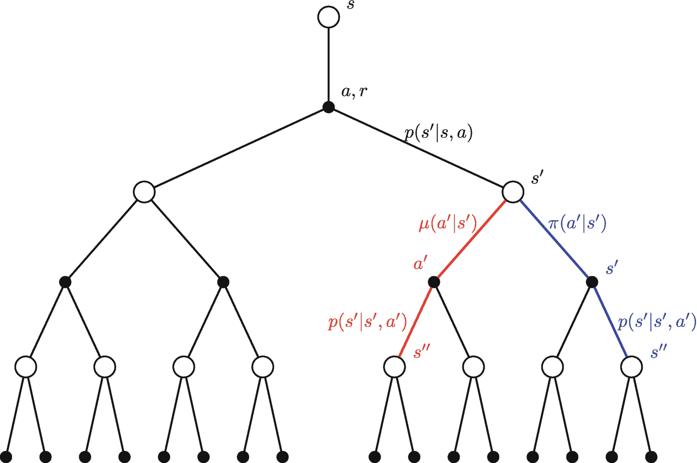

N 步 Q 学习采样的树状图从节点 S 开始，该节点衍生出一个标记为 a, r 的节点。节点 a, r 分支为两个节点。左侧节点及其分支未标记。右侧节点标记为 s'，并分支为 a'和 s'。a'和 s'各自衍生出一个 s''节点。

**图 5.12** 为什么我们应该对 N 步 Q 学习使用重要性采样（针对 `n=2` 的情况），其中 `π` 是目标策略，`μ` 是行为策略

换句话说，我们可以计算剩余步骤 `t+1, t+2, …, t+n-1` 的重要性采样比率。这简化了重要性采样比率的计算，并降低了估计值的方差。


(5.26)

为了计算目标策略的概率，我们注意到目标策略是一个确定性（或贪婪）策略，它总是为给定状态选择具有最高 Q 值的动作。因此，在状态`s`中选择动作`a`的概率为 1，当且仅当`a = argmax_a Q(s, a)`；否则为 0。这可以表示为

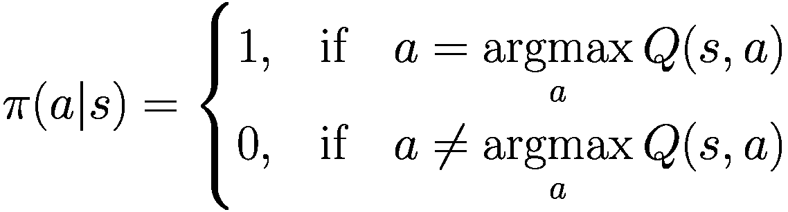

(5.27)

直观地说，重要性采样调整了更新规则，以考虑行为策略与目标策略之间的差异。这是必要的，因为行为策略可能会选择次优动作，从而导致价值函数估计出现偏差。重要性采样使智能体能够调整这种偏差，从而更高效、更准确地学习。

为了适配 N 步 Q 学习，智能体必须存储其在 N 步序列过程中选择的每个动作`mu(A_t|S_t)`的概率。在更新步骤中，我们使用公式(5.27)计算目标策略在相应状态下选择这些动作的概率。该公式计算了在当前状态下目标策略的期望回报，并用于更新每个状态-动作对的 Q 值。

重要性采样比率是目标策略与行为策略下选择动作的概率之比。它用于调整行为策略可能选择了目标策略认为次优的动作这一事实。通过使用这个比率，我们可以更新 Q 值，使其更好地反映最优策略。

N 步 Q 学习是 Q 学习的一种变体，它基于在 N 个时间步序列中观察到的回报来更新 Q 值。通过纳入更长的经验序列，N 步 Q 学习可以在某些环境中实现更高效的学习和更好的性能。通过使用重要性采样，我们可以调整行为策略与目标策略之间的差异，从而更高效、更准确地学习。伪代码如算法 10 所示。

**算法 10：带重要性采样的 N 步 Q 学习**

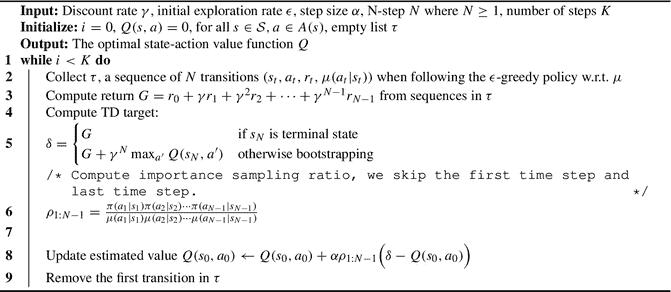 一个名为“带重要性采样的 N 步 Q 学习”的 9 行算法，接收以下输入，并输出最优状态-动作价值函数`Q`。折扣率`gamma`、初始探索率`epsilon`、步长`alpha`、N 步`N`（其中`N`大于等于 1）以及步数`K`。

适配 N 步 Q 学习可能比标准 Q 学习更具挑战性。它涉及存储更长的经验序列，这可能会带来更高的计算需求。此外，行为策略可能会选择目标策略不会选择的次优动作。这可能导致两个策略下的 N 步奖励不同，如果步数`N`很大，这可能成为一个重大问题。

当我们对离策略 N 步 Q 学习使用重要性采样时，需要记住，值可能不会频繁更新。在 N 步转移序列中，行为策略很可能会选择一些探索性动作，而这些动作并非目标策略下的最佳动作。这意味着重要性采样比率会趋近于零，在策略均为确定性的极端情况下，整个 TD 误差项也可能变为零。因此，学习过程中的值更新变为`Q(S_t, A_t) = Q(S_t, A_t)`，这可能导致离策略学习相比在策略学习收敛速度更慢。

在实践中，一些成功的 N 步 Q 学习算法，例如 Hessel 等人[6]提出的 Rainbow 智能体，通过使用相对较小的 N 步（`n=5`）并且完全不使用重要性采样来保持简单，从而避免了这个问题。然而，很难证明 N 步自举对 Rainbow 算法成功的贡献，因为它还涉及许多其他技术以及对标准 DQN 智能体的改进。

### 5.9 总结

在第一部分的最后一章中，我们深入探讨了时序差分（TD）学习这一强大框架。TD 学习建立在蒙特卡洛方法的思想之上，通过基于即时时间步的转移而非完整的情节序列来更新价值估计，为强化学习（RL）提供了一种更高效的方法。

本章首先探讨了 TD 学习，这构成了后续章节的基础。TD 使我们能够增量地更新价值估计，利用连续价值估计之间的差异作为学习的基础。接着，我们转向 TD 策略评估，这是一种能够估计给定策略价值函数的技术。通过使用 TD 更新迭代地更新价值估计，我们可以在不需要完整情节的情况下逼近真实的价值函数。

本章继续讨论了使用 SARSA 算法的 TD 控制。SARSA 将 TD 学习与在策略方法相结合，智能体在与环境交互的同时改进其策略。我们还探讨了在策略学习与离策略学习之间的差异，强调了每种方法相关的权衡和考量。

接下来，我们介绍了 Q 学习，这是一种离策略 TD 控制算法，也是著名的 DQN 智能体的核心，我们将在本书第二部分中介绍它。Q 学习通过基于最大估计未来奖励来更新动作价值估计，从而最大化期望回报。我们研究了 Q 学习如何克服在策略方法的局限性，以及它对 RL 性能的影响。

为了缓解价值估计过于乐观的问题，我们探讨了双 Q 学习。该技术使用两组动作价值函数来减少过高估计偏差，从而增强学习过程的稳定性和准确性。

最后，本章以对 N 步自举的讨论作为结尾，这是一种弥合 TD 学习与蒙特卡洛方法之间差距的方法。N 步自举使我们能够利用来自未来多个步骤的信息来更新价值估计。

随着本章的完成，我们结束了本书的第一部分，该部分聚焦于 RL 的基础知识以及使用表格方法解决小规模马尔可夫决策过程（MDP）。在第二部分中，我们将把重点转向价值函数近似，探索使 RL 算法能够扩展到更大、更复杂问题的技术。

