# 6. 线性价值函数近似

本书第一部分重点介绍使用表格法来表示马尔可夫决策过程（MDP）的价值函数。然而，这种方法仅限于小规模 MDP。在许多现实世界的问题中，状态空间过大，导致基于表格的方法不切实际。这主要有两个原因：首先，庞大的状态数量可能需要大量内存来存储价值；其次，学习到的价值函数可能无法很好地泛化到新状态。

为了克服这些限制，本书第二部分将重点转向使用价值函数近似（VFA）来估计 MDP 的价值函数。VFA 使用一个函数来估计状态或状态-动作对的价值，而不是直接将价值存储在表格中。在本章中，我们将重点介绍 VFA 的概念，特别是线性 VFA——一种使用特征的线性组合来近似价值函数的流行方法。我们将探讨如何应用线性 VFA 来估计 MDP 的价值函数。

### 6.1 大规模 MDP 的挑战

对于状态空间相对较小且可以完全枚举的小规模 MDP，使用表格来表示价值函数可能非常有效。然而，在更大、更复杂的 MDP 中使用表格来表示价值函数时，会面临一些挑战和限制：

- **内存需求**：随着 MDP 中状态数量的增加，价值函数表格的大小呈指数级增长，使得在内存中存储这些价值变得不切实际。
- **泛化能力**：即使状态数量较少，在学习过程中也常常难以访问每一个状态-动作对。这意味着我们可能无法对每个状态-动作对的价值函数都有准确的估计，从而使得泛化到新的、未见过的状态变得困难。
- **维度灾难**：随着状态变量（或维度）数量的增加，状态空间的大小呈指数级增长，这使得在合理时间内探索并学习到准确的价值函数变得困难。
- **离散化**：在某些情况下，连续的状态变量可能需要被离散化为有限数量的区间才能存储在表格中。然而，这可能导致信息丢失，并使得学习准确的价值函数变得困难。

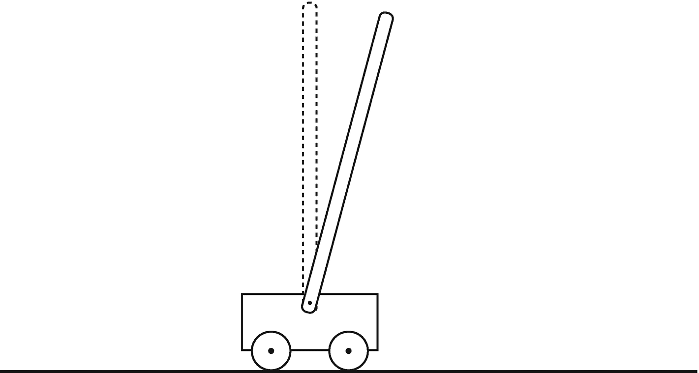

小车顶部有一根杆的小车-杆系统示意图。

**图 6.1** 小车-杆系统；该问题由 Richard S. Sutton 和 Andrew G. Barto 在《强化学习导论》一书中引入。

价值函数近似技术，如线性函数近似和神经网络，可以通过使用较少的参数来估计价值函数，同时提供更好的泛化能力到新状态，从而帮助克服这些挑战。

为了更好地理解这些挑战，让我们看一个经典的控制任务，称为小车-杆任务，该任务由 Richard S. Sutton 和 Andrew G. Barto 引入。

#### 小车-杆任务

小车-杆任务 [1] 的目标是通过对小车施加力，如图 6.1 所示，防止铰接在小车上的杆子倒下。如果杆子倾斜到一定角度或小车跑出轨道，则认为任务失败；如果任务失败，杆子会重置到垂直位置。智能体可以选择向左或向右推动小车。奖励信号是：只要杆子没有倒下，每一步都获得 `+1`。

这个任务与我们之前介绍的例子不同之处在于其状态空间的大小。小车-杆任务的状态是四维的，包含小车的位置和速度的数值，以及杆子的角度和角速度的数值。所有这些维度都是连续的数值，尽管有些维度有最小值和最大值等限制，例如位置在 `[-4.8, 4.8]` 范围内，杆子角度在 `[-0.418, 0.418]`（弧度）范围内，但状态的具体值可以是这些范围内的任何值。

小车-杆任务的大状态空间对强化学习提出了重大挑战。由于状态空间是连续的，传统的表格法表示价值函数不再适用。此外，智能体在训练过程中不太可能遇到所有可能的状态，这使得学习该任务的准确价值函数变得困难。

在我们之前的例子中，我们经常使用像 `0, 1, 2, ...` 这样的离散数字来表示不同的状态，这使我们能够使用单个向量来存储这些不同状态的价值。然而，在状态的可能组合非常多的情况下，这种表格法并不适用。例如，在小车-杆例子中，状态由四个连续值定义：小车的位置和速度，以及杆子的角度和角速度。这使得状态空间是无限且连续的，无法用单个向量来表示。

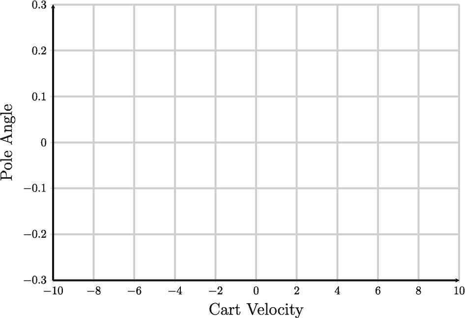

用于瓦片编码的图表，绘制了杆子角度与小车速度的关系。小车速度范围从负 10 到 10，杆子角度范围从负 0.3 到 0.3。

**图 6.2** 小车速度和杆子角度的瓦片化示例

解决这个问题的一种方法是尝试将无限状态变为有限。例如，如果我们只看小车速度，我们可以将这些值分箱到相应的子集中，这将使小车速度维度离散化。类似地，我们也可以扩展这种方法，考虑杆子角度，此时这些分箱就变成了瓦片。这种方法通常被称为瓦片编码，对于小问题效果很好。有一些开源库可以为我们完成这项工作（图 6.2）。

然而，这种方法的一个主要缺点是必须手动选择要使用的分箱或瓦片数量。例如，如果我们只对小车位置使用两个分箱，那将没什么用，因为范围太宽了。另一方面，如果我们使用太多分箱，可能会遇到过拟合的问题。选择最佳的分箱数量需要对当前问题有大量的人工知识。

这种方法的另一个主要问题是，对于环境状态具有非常大维度的情况，例如像 Atari 视频游戏这样基于图像的环境，它的扩展性不好。在这些情况下，状态空间可能包含大量维度，这使得使用瓦片编码变得不可行。在这种情况下，通常会使用其他方法，如神经网络，来解决可扩展性问题，我们将在下一章中介绍。


### 6.2 价值函数近似

函数近似是指寻找一个近似函数，使其能够紧密匹配未知目标函数行为的过程。在强化学习中，我们可以利用函数近似来估计状态价值函数或状态-动作价值函数，这些函数通常规模过大，无法以表格形式显式表示。取而代之，我们可以使用一个参数化函数，将状态或状态-动作作为输入，并输出其价值的估计值。

举例来说，考虑图 6.3，该图展示了函数近似的概念。我们有一组由未知目标函数 `g` 生成的样本数据。我们的目标是从一组可能的函数中找到一个近似函数 `H`，使其能够紧密逼近真实的目标函数，即 `H(x) ≈ g(x)`。在此示例中，绿色点代表目标函数生成的样本数据，红色线代表逼近真实目标函数的函数。

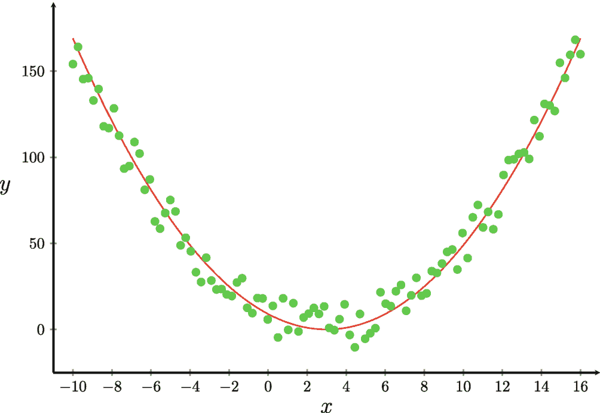

一张散点图绘制了 y 与 x 的关系。散点稀疏地分布在一个抛物线曲线周围。数值为估计值。曲线经过点 (-10, 170)、(3, 10) 和 (16, 170)。

图 6.3 用于说明函数近似概念的示例，其中绿色点是由目标函数 `g` 生成的样本点，红色线是用于逼近该目标函数的函数 `H`

在强化学习中使用价值函数近似（VFA）具有若干优势。首先，近似函数相关的参数数量远小于 MDP 中的状态或状态-动作对数量，这使得在大规模问题中表示价值函数成为可能。其次，当我们仅有有限的样本转移时，近似函数能够泛化到未见过的状态或状态-动作对，这有助于减少学习所需的数据量。最后，与表格方法相比，求解大规模 MDP 所需的空间和时间可以大幅减少。

然而，使用 VFA 也存在缺点。由于我们使用参数化函数来估计价值函数，可能永远无法学习到所有状态或状态-动作对的精确真实值。相反，我们必须满足于一个在实际应用中足够接近的近似值。这是因为对函数参数的任何更改都会影响所有状态或状态-动作对，并且不可能在不牺牲其他状态或状态-动作对准确性的情况下，针对某个特定状态或状态-动作对优化该函数。

为了表示近似的价值函数，我们使用 `V̂(s; w)` 来表示逼近任意策略 `π` 的真实状态价值函数 `Vπ` 的函数。这里，`w` 代表用于计算估计值的参数或权重。类似地，我们使用 `Q̂(s, a; w)` 来表示逼近任意策略 `π` 的真实状态-动作价值函数 `Qπ` 的函数，并且我们希望找到能够最小化近似价值函数与真实价值函数之间差异的权重 `w`。更新或调整参数 `w` 的过程称为训练。

总之，价值函数近似是在强化学习中表示和估计价值函数的一种强大技术。它使我们能够在有限的时间范围和计算预算内求解大规模 MDP。然而，务必牢记这种方法的局限性以及寻找良好近似所涉及的权衡。

图 6.4 展示了价值函数近似的基本思想，这是一种在强化学习问题中估计每个状态价值的方法。在价值函数近似中，我们分别使用 `V̂(s; w)` 和 `Q̂(s, a; w)` 来表示基于其权重 `w` 对状态或状态-动作对的估计值。这些函数接收环境状态或状态-动作对作为输入，并基于其权重 `w` 进行一些计算后，输出估计值。

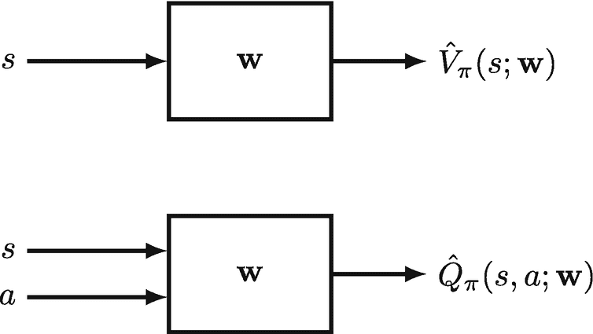

状态价值估计的示意图。上方的函数是 `V̂π(s, w)`。下方的函数是 `Q̂π(s, a, w)`。

图 6.4 价值函数近似的思想

我们将在本章后续部分更详细地讨论如何使用线性方法计算这些值，但目前，我们更关心如何更新近似函数的权重 `w`。为了改进近似函数，我们需要能够衡量其性能。然而，对于涉及参数的函数而言，如何做到这一点并不总是显而易见的。


让我们考虑一个策略评估的例子，其中我们希望针对一个固定策略 `π` 来估计状态价值。我们假设已知该策略 `π` 的真实状态价值函数 `Vπ`。由于已知真实状态价值，我们可以通过单个状态 `s` 的平方误差 `(Vπ(s) - V̂(s; w))²` 来衡量近似值与真实值之间的差异。这也意味着我们可以衡量权重 `w` 的性能，因为在这种情况下，状态 `s` 及其真实状态价值 `Vπ(s)` 是恒定的。唯一会影响近似函数估计值的因素就是权重 `w`。

```
(Vπ(s) - V̂(s; w))²
```

(6.1)

值得注意的是，智能体在遵循策略 `π` 与环境交互时，可能会遇到大量状态，而这些状态通常是随机的，尤其是在环境或策略具有随机性的情况下。因此，以一种独立于特定时间步的方式，来衡量近似函数相对于权重的准确性就显得非常重要。为了实现这一点，我们在公式 (6.2) 中使用了期望符号 `Eπ`。在公式 (6.2) 中，我们使用不带下标 `t` 的 `S` 来表示状态，以强调性能的衡量应独立于特定时间步。我们也可以将公式中的 `S` 视为整个状态空间。

```
Eπ[(Vπ(S) - V̂(S; w))²]
```

(6.2)

现在，我们可以为使用 `V̂` 来近似真实状态价值函数 `Vπ` 的情况定义一个精确的目标。这个目标是必要的，以便找到能够最小化平方误差 `(Vπ(S) - V̂(S; w))²` 的权重 `w`，该误差针对的是智能体在遵循策略 `π` 与环境交互时可能遇到的所有状态。这个想法与监督学习问题非常相似；在这种情况下，真实标签是 `Vπ(S)`，预测标签是 `V̂(S; w)`。在本书中，我们通常使用更简短的术语 `J(w)` 来表示这个目标。

```
J(w) = Eπ[(Vπ(S) - V̂(S; w))²]
```

(6.3)

类似地，如果我们知道策略 `π` 的真实状态-动作价值函数 `Qπ`，我们也可以为近似 `Q̂` 定义目标。在实践中，我们对状态-动作价值函数更感兴趣；毕竟，我们需要 `Qπ` 来进行控制（即寻找最优策略）。同样的概念在此仍然适用，我们希望找到能够最小化平方误差 `(Qπ(S, A) - Q̂(S, A; w))²` 的权重 `w`。

```
J(w) = Eπ[(Qπ(S, A) - Q̂(S, A; w))²]
```

(6.4)

现在我们已经为 `V̂` 和 `Q̂` 定义了目标函数；这意味着我们可以使用任何合适的优化方法来最小化公式 (6.3) 和 (6.4) 中相对于其权重 `w` 的项。在本书中，我们重点介绍一种在机器学习中被广泛采用的流行方法，称为随机梯度下降。


### 6.3 随机梯度下降

在优化问题中，目标是找到能够最小化或最大化给定数学函数的参数。术语*梯度下降*指的是使用一种迭代优化方法来寻找*可微*函数的*局部最小值*。可微函数是一种在其定义域内每一点都具有明确定义导数的数学函数。换句话说，该函数的导数存在，并且可以针对函数定义域内的任何输入值进行计算。从几何角度看，可微函数的导数表示函数图像在给定点处切线的斜率。

函数的局部最小值是函数定义域内的一个点，在该点的一个小邻域内，函数取得最小值，但不一定是整个函数定义域内的最小值。换句话说，这是一个函数值低于附近点的点，但可能在其他更远的点处存在更低的函数值。局部最小值在优化中很重要，因为它们代表了优化问题的候选解，但不能保证是全局最小值（即函数在整个定义域内的绝对最小值）。

可微性概念在优化中很重要，因为它允许我们计算函数相对于其输入的梯度，这对于许多优化算法（如梯度下降）至关重要。给定一个关于权重 `w` 的可微函数 `J(w)`，目标是找到使 `J(w)` 最小化的 `w`。

梯度下降算法首先计算 `J(w)` 关于 `w` 的梯度。然后，它沿着负梯度 `∇_w J(w)` 的方向更新权重 `w`。

```
w = w - α ∇_w J(w)
```

(6.5)

参数 `α` 是步长（通常称为学习率），它控制在更新权重 `w` 时每一步应该移动多远。该算法以迭代方式重复此过程，经过大量步骤，直到找到一个良好的局部最小值。

该更新规则背后的直觉是，通过沿着负梯度方向迈出一步，我们实际上是在朝着目标函数的最陡下降方向移动。这意味着在每一步，我们都朝着函数下降最快的方向移动。通过重复此过程大量步骤，我们希望最终能到达函数的一个最小值。为了理解这为何合理，想象一下站在山顶想要到达山底。最快的下降方式是沿着最陡峭的斜坡方向移动，也就是指向山底的方向。类似地，在优化中，负梯度指向目标函数的最陡下降方向，因此沿着负梯度方向移动将帮助我们比任何其他方向更快地达到最小值。

学习率 `α` 控制更新的步长，因此它决定了我们在每一步沿着负梯度方向移动多远。较小的学习率意味着我们采取较小的步长，这有助于避免越过最小值，而较大的学习率意味着我们采取较大的步长，这有助于更快地收敛。然而，如果学习率太小，我们可能收敛得非常慢；而如果学习率太大，我们可能会越过最小值并在其附近振荡，甚至发散。因此，为手头的优化问题选择合适的学习率非常重要。

`J(w)` 关于权重 `w` 的梯度是一个（列）向量，包含关于 `w` 中每个权重 `w_1, w_2, ..., w_n` 的偏导数，并且与权重向量 `w` 具有相同的维度。梯度 `∇_w J(w)` 通过计算函数关于每个权重的偏导数得到。在实践中，通常使用*随机梯度下降*（SGD），它在每次迭代中随机选择数据的一个子集（称为*小批量*）来估计梯度。

```
∇_w J(w) = ( ∂J(w)/∂w_1, ∂J(w)/∂w_2, ..., ∂J(w)/∂w_n )^T
```

(6.6)

总之，随机梯度下降是一种迭代优化算法，它利用可微函数的梯度，沿着最陡下降方向更新权重，目标是找到目标函数的局部最小值。学习率控制更新的步长，为手头的优化问题选择合适的学习率非常重要。随机梯度下降在实践中被广泛使用，并且通常通过使用小批量来估计梯度。


为了理解梯度下降的工作原理，我们首先来看最简单的情况：假设`w`只有一个标量分量`x`，如图 6.5 所示。我们有一些样本点以及每个样本点的梯度（斜率）。可以看到，点`x3`具有正斜率（梯度），如果按照公式(6.1)沿负梯度方向迈出一步，那么`x`的值将会减小。点`x2`的斜率比点`x3`的斜率更平缓，这意味着点`x2`的梯度小于点`x3`的梯度。这很合理，因为点`x2`更接近目标函数的最小值。对于样本点`x1`，斜率为负，这意味着如果应用公式(6.1)，`x`的值将会增加。如果重复这个过程很多步，理论上，它会找到一个局部最小值。

在实践中，权重向量`w`通常有多个标量分量，如图 6.6 所示。这意味着当梯度下降算法使用公式(6.1)更新权重时，它会根据每个分量的偏梯度更新`w`中的每一个分量。然而，在多个分量的情况下，`w`的更新规则稍微复杂一些，因为它们涉及多元微积分。

具体来说，更新规则中使用的偏导数必须针对`w`的每个分量进行计算。这些偏导数被组合成一个梯度向量，可以将其视为导数在多维情况下的推广。梯度向量指向被优化函数最陡峭增加的方向，而更新规则则沿着与梯度向量相反的方向修改`w`，以最小化目标函数。

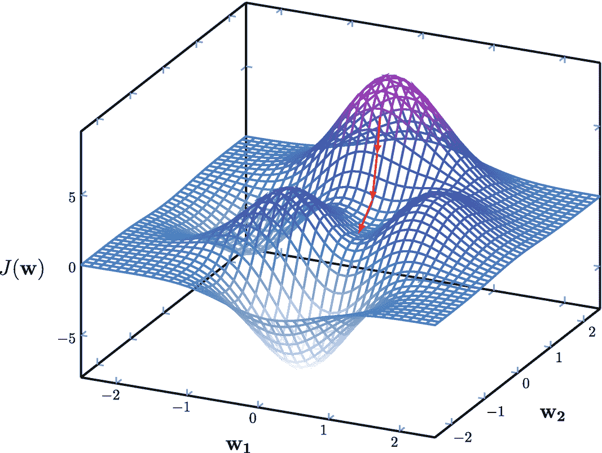

一个三维图绘制了`J`与`w1`和`w2`的关系。值为估计值。(0, 0)、(0.5, -1.5)和(2.5, 0)。

**图 6.6** 梯度下降的思想，其中`w`是一个具有两个标量分量`w1`和`w2`的向量

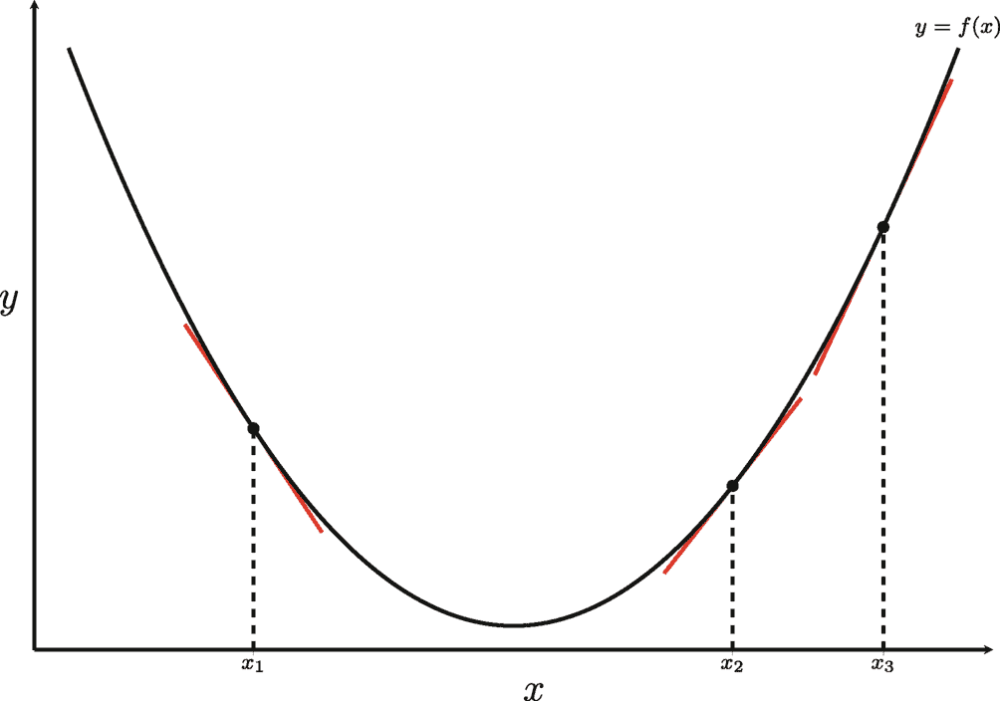

一条抛物线绘制了`y`与`x`的关系。曲线的端点标记为`y = f, x`。在`x`轴上有三条垂直线，一条在曲线左侧，两条在右侧，分别对应`x1`、`x2`和`x3`。

**图 6.5** 梯度下降的思想

总的来说，虽然多分量更新规则背后的数学涉及多元微积分，但梯度下降的基本直觉保持不变：迭代地沿最陡下降方向更新权重以最小化目标函数。

梯度下降中的步长（学习率）是一个关键参数。直观地说，小步长需要梯度下降算法采取更多步（就权重更新而言）才能找到能够最小化目标函数`J(w)`的权重`w`。而适当的大步长则需要更少的步数。然而，如果步长过大，可能会导致算法在局部最小值附近振荡但永远无法到达（如图 6.7 右侧所示）。在实践中，人们通常在学习过程开始时使用相对较大的步长，然后在整个学习过程中逐渐减小步长（如图 6.7 左侧所示）。步长的确切值通常是一门艺术而非科学，因为通常需要多次尝试才能为不同问题找到合适的值。

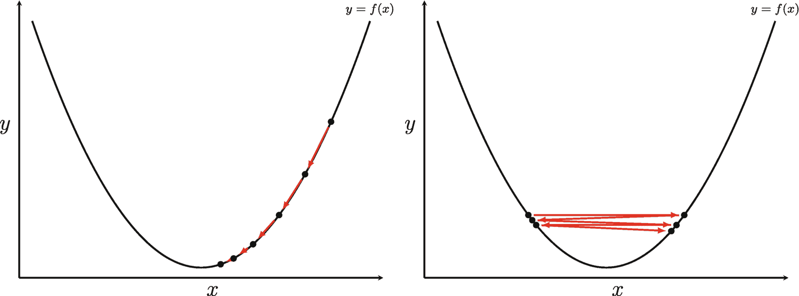

两组抛物线绘制了`y`与`x`的关系。曲线的端点标记为`y = f, x`。

**图 6.7** 步长在梯度下降中的影响。左侧展示了我们从相对较大的步长开始，然后随时间衰减步长的情况。右侧展示了步长过大可能导致算法在局部最小值附近振荡但永远无法到达的情况

在本章中，我们在 VFA 的情况下对梯度下降公式进行了轻微修改，在公式(6.7)中的步长`α`前面添加了`1/2`。引入这个修改是为了简化最终方程，如公式(6.8)所示。

```
w = w - 1/2 α ∇_w J(w) 
```
(6.7)

```
= w - 1/2 α ∇_w E_π[ (V_π(S) - V̂(S; w))² ]
= w - 1/2 α ( -2 E_π[ (V_π(S) - V̂(S; w)) ∇_w V̂(S; w) ] )
= w + α E_π[ (V_π(S) - V̂(S; w)) ∇_w V̂(S; w) ]
```
(6.8)

其中`w`是权重向量，即我们想要优化的状态值函数的可学习参数。`α`是步长，是一个超参数，决定了算法每次迭代中权重参数更新的幅度。`∇_w`表示函数关于权重`w`的偏导数向量。


为了应用梯度下降，我们使用公式（6.3）作为目标函数`J(w)`。然后，我们使用微积分中的链式法则来推导导数，从而得到公式（6.8）。之所以使用链式法则来推导导数，是因为目标函数`J(w)`依赖于价值函数的预测值`V̂(S; w)`，而该预测值又通过函数`V̂(S; w)`依赖于参数`w`。这使我们能够计算目标函数关于参数`w`的梯度。

该公式背后的直觉是，沿着真实价值`Vπ(S)`与当前预测价值`V̂(S; w)`之间平方误差的相反方向调整参数`w`，而调整的幅度由每个参数的偏梯度`∇w V̂(S; w)`和步长`α`决定。期望符号`Eπ`表示我们正在计算期望值上的梯度。这意味着我们需要对智能体在环境中遵循策略`π`时可能遇到的所有状态求偏导数。

当使用表格方法时，我们会运行算法收集大量转移样本并计算平均回报。然而，当使用梯度下降方法时，我们可以使用随机梯度下降（SGD）。SGD 是机器学习中广泛采用的方法，尤其适用于训练深度神经网络。SGD 背后的思想是使用一个（或一小批）样本转移来计算梯度，然后更新权重`w`。这种方法在计算上比使用所有转移样本更高效，原因在于计算效率，同时也因为智能体在与环境交互时，通常不可能遇到整个状态空间中的所有状态。

我们可以将公式（6.8）重写为公式（6.9），以展示如何使用 SGD 更新权重`w`。在该公式中，我们使用一个（或一小批）样本转移来计算梯度并更新权重。在机器学习中，小批量是训练数据的一个子集，用于在随机梯度下降（SGD）优化过程中计算梯度更新。当在大型数据集上训练模型时，在每次迭代中计算整个数据集的梯度通常在计算上不可行。相反，使用从数据集中随机选择的一小批样本来估计梯度，然后用该梯度更新模型的参数。

```
w = w + α [ ( Vπ(S) - V̂(S; w) ) ∇w V̂(S; w) ]
```

(6.9)

小批量的大小是一个超参数，通常根据数据集的大小和可用计算资源来选择。较大的小批量大小可以带来更准确的梯度估计，但需要更多的内存和计算资源。较小的批量大小可以减少内存使用，但可能导致收敛速度变慢，且梯度估计的方差通常更高。

在 SGD 中使用小批量可以在大型数据集上更高效地训练机器学习模型，因为它减少了计算整个数据集梯度的计算负担和内存需求。

现在，让我们将注意力转向用于近似状态（或状态-动作）价值相对于权重`w`的方法。通常，有线性方法和非线性方法来近似价值函数。在本章中，我们专注于更简单的线性方法。在下一章中，我们将讨论非线性方法，特别是使用神经网络来近似价值函数。线性方法有其优点和缺点，我们将在下一节中进一步探讨。


### 6.4 线性价值函数近似

到目前为止，我们还没有讨论近似函数 `V̂` 或 `Q̂` 具体如何接收原始环境状态（或状态-动作对）作为输入，并输出估计价值。现在我们重点讨论如何使用线性方法，根据权重向量 `w` 来计算这些价值。

首先，这涉及将原始环境状态 `s`（或状态-动作对 `(s, a)`）映射到特征向量 `x` 的过程；在传统机器学习中，这一过程通常被称为*特征工程*或*特征提取*。`x` 中标量分量的数量可以远大于（或远小于）环境状态的维度，具体取决于强化学习问题。我们可以将特征向量 `x` 视为一组函数 `x₁, x₂, …` 的集合，这些函数将原始环境状态（或状态-动作对 `(s, a)`）转换为相应的标量分量：

```
x(s) = ( x₁(s) )
       ( x₂(s) )
       (  ⋮   )
       ( xₙ(s) )
```

(6.10)

特征向量 `x` 背后的直觉是，通过精心设计这些特征，我们希望找到一个权重向量 `w`，使得特定状态（或状态-动作对）的价值就是所有这些特征的加权和；这就是为什么我们将 `w` 称为权重，因为它对 `x` 中相应的特征进行加权。从数学上讲，我们取 `x` 和 `w` 的内积（假设 `x` 和 `w` 都是列向量，且 `w` 和 `x` 的元素数量相同），可以表示为：

```
V̂(s; w) = x(s)ᵀ w = Σⱼ₌₁ⁿ xⱼ(s) wⱼ
```

(6.11)

其中 `V̂(s; w)` 是使用权重向量 `w` 对状态 `s` 的估计价值，`x(s)ᵀ` 是状态 `s` 特征向量的转置，`Σⱼ₌₁ⁿ xⱼ(s) wⱼ` 是特征的加权和。

特征向量 `x` 通常基于人类知识或对强化学习问题的过往经验进行手工设计。对于某些简单问题，这个过程可能简单到只需将原始环境状态编码为数值，但对于更复杂的问题，它通常涉及某种形式的变换，例如多项式函数。

构建特征向量最简单的方法之一是将状态空间划分为若干子集（类似于图 6.2 中所示的区间或瓦片情况），使得任意单个状态 `s` 仅属于一个子集。然后，我们可以使用独热编码方法构建特征向量 `x`，其中状态 `s` 所属的子集用值 1 表示，所有其他子集用值 0 表示。这也被称为状态聚合方法。有限 MDP 可以视为该方法的一个特例，其中我们有 `N` 个子集，这里的 `N` 是状态空间中的状态数量，且每个子集仅包含一个状态。

例如，在服务犬 MDP 中，我们可以使用索引值标记每个状态：`房间 1 = 0`，`房间 2 = 1`，`房间 3 = 2`，`室外 = 3`，`找到物品 = 4`。然后，我们可以为状态 `房间 2` 构建特征向量 `x`，作为独热编码向量 `x = [0, 1, 0, 0, 0]ᵀ`。也可以使用神经网络自动提取特征，这将是下一章讨论的主题。

现在，我们对线性近似函数如何计算状态价值有了基本了解，接下来让我们最终确定如何使用随机梯度下降来更新权重向量 `w`。我们可以先定义式 (6.11) 关于 `w` 的偏导数 `∇_w V̂(s; w)`。由于这是一个线性系统，且我们对 `w` 求导，`∇_w V̂(s; w)` 可以简化为 `x(s)`。由此得到式 (6.12)，用于在使用线性函数近似状态价值函数 `V_π` 时更新权重 `w`：


![$$\displaystyle \begin{aligned} \boldsymbol{w} &amp; = \boldsymbol{w} + \alpha \Biggl[ \Big( V_\pi(s) - \hat{V}(s; \boldsymbol{w}) \Big) \boldsymbol{x}(s) \Biggr] \\ &amp; = \boldsymbol{w} + \alpha \Biggl[ \Big( V_\pi(s) - \boldsymbol{x}(s)^T\boldsymbol{w} \Big) \boldsymbol{x}(s) \Biggr] {} \end{aligned} $$](images/605748_1_En_6_Chapter/605748_1_En_6_Chapter_TeX_Equ12.png)

(6.12)

这里，`w` 表示线性近似函数的权重；`α` 表示步长或学习率，决定了每一步调整权重的幅度；`x(s)` 是状态 `s` 的特征向量；`Vπ(s)` 是状态 `s` 的期望值。

现在我们确切知道了如何更新线性函数的权重 `w`。在公式 (6.12) 中，唯一未知的是真实状态价值函数 `Vπ`。接下来我们将开始探讨如何利用现有方法（如蒙特卡洛和时序差分学习）来估计真实状态价值 `Vπ`，进而用其更新上述公式中的权重。

#### 用于策略评估的线性价值函数近似

假设我们可以获取策略 `π` 的真实状态价值函数 `Vπ`，那么就可以使用公式 (6.12) 来更新线性近似函数的权重 `w`。线性近似函数是一种数学函数，它将状态的特征向量映射为该状态价值的估计值。

然而，在大多数现实世界的强化学习问题中，我们并不知道 `Vπ`。那么在这种情况下，我们该如何更新权重呢？

在蒙特卡洛策略评估中，智能体通过遵循策略 `π` 生成一个完整的样本回合，并计算序列中每个状态的回报 `G0, G1, G2, ...`。这里的回报是指从访问状态 `t` 开始到回合结束所获得的奖励总和。我们可以沿用这一思路，用蒙特卡洛样本回报 `Gt` 替换公式 (6.12) 中的 `Vπ(s)` 作为真实目标。因此，使用线性方法结合蒙特卡洛策略评估来近似状态价值函数的权重更新规则可以改写如下：

![$$\displaystyle \begin{aligned} \boldsymbol{w} &amp; = \boldsymbol{w} + \alpha \Biggl[ \Big( G_t - \hat{V}(S_t; \boldsymbol{w}) \Big) \boldsymbol{x}(S_t) \Biggr] \\ &amp; = \boldsymbol{w} + \alpha \Biggl[ \Big( G_t - \boldsymbol{x}(S_t)^T\boldsymbol{w} \Big) \boldsymbol{x}(S_t) \Biggr] {} \end{aligned} $$](images/605748_1_En_6_Chapter/605748_1_En_6_Chapter_TeX_Equ13.png)

(6.13)

这里，`w` 表示线性近似函数的权重，`α` 是学习率，`Gt` 是蒙特卡洛样本回报，`x(St)` 是状态 `St` 的特征向量，`V̂(St; w)` 是使用线性近似函数对状态 `St` 的预测价值。

现在我们介绍基于线性价值函数近似的每次访问蒙特卡洛策略评估算法，如算法 1 所示。在几乎所有状态都唯一的大规模 MDP 中，每次访问版本通常比首次访问版本更受青睐。这是因为由于缺乏状态或动作的冗余性，统计某个状态（或状态-动作对）被访问的次数可能无法提供有意义的信息。通过考虑回合中每个状态（或状态-动作对）的每次访问，每次访问算法确保了所有交互都对价值函数估计有所贡献。因此，它更适用于状态或动作冗余性极小、访问次数统计无信息量的场景。


该算法接收任意策略`π`以及其他参数（如折扣率和学习率）。为获得更佳性能，我们通常将权重`w`随机初始化为`[-1, 1]`范围内的值。随机初始化有助于防止权重陷入局部最小值，并允许学习算法探索不同的权重配置。

算法 1：每次访问蒙特卡洛线性 VFA 策略评估

```
（此处为算法 1 的图片描述：每次访问蒙特卡洛线性 VFA 策略评估算法）
```

该算法通过遵循输入策略生成一个样本片段，计算每个时间步的回报，并使用蒙特卡洛更新规则更新用于近似真实状态值函数的线性函数的权重。此过程重复固定数量的片段。

无论权重参数的初始值如何，蒙特卡洛更新规则都保证随着片段数量趋近于无穷大而收敛到真实值函数。

类似地，我们可以调整 TD 学习以使用线性值函数近似。在 TD(0)策略评估中，它将回报估计为即时奖励`R_t`与后继状态折扣值`γ V_π(S_{t+1})`之和。这里，我们可以使用相同的思路，用线性函数预测的后继状态值（即`x(S_{t+1})^T w`）替换`V_π(S_{t+1})`。因此，TD(0)策略评估的权重更新规则变为：

```
w = w + α [ ( R_t + γ V̂(S_{t+1}; w) - V̂(S_t; w) ) x(S_t) ]
  = w + α [ ( R_t + γ x(S_{t+1})^T w - x(S_t)^T w ) x(S_t) ]
```

(6.14)

使用线性值函数近似的 TD(0)策略评估的完整算法如算法 2 所示。与蒙特卡洛策略评估算法类似，这里我们也随机初始化权重`w`为`[-1, 1]`范围内的值，这允许算法探索不同的权重配置并避免陷入局部最小值。我们没有具体说明如何构造特征向量`x`，因为最优特征取决于具体的强化学习问题。

算法 2：TD(0)线性 VFA 策略评估

```
（此处为算法 2 的图片描述：TD(0)线性 VFA 策略评估算法）
```

到目前为止，我们仅使用线性函数来近似状态值函数`V_π`，但在实践中，为了进行控制（寻找最优策略），我们需要学习状态-动作值函数`Q_π`。使用`Q̂`近似`Q_π`的整体概念和过程与使用`V̂`近似`V_π`相同。主要区别在于，现在我们需要考虑具体动作`a`。这包括构造特征向量`x`时，需要针对状态-动作对`(s, a)`进行。

```
x(s, a) = [ x_1(s, a) ]
          [ x_2(s, a) ]
          [   ...     ]
          [ x_n(s, a) ]
```

(6.15)

对于状态空间和动作空间较小的有限 MDP 的最简单情况，我们可以先为状态`s`和动作`a`分别创建独热向量，然后将这两个独热向量拼接起来构造特征向量`x`。对于相同的服务犬 MDP 示例，如果我们使用索引值标记每个状态：`Room 1 = 0, Room 2 = 1, Room 3 = 2, Outside = 3, Found item = 4`，并使用索引值标记每个动作：`Go to room1 = 0, Go to room2 = 1, Go to room3 = 2, Search = 3, Go outside = 4, Go inside = 5`，我们可以将状态`Room 2`的独热编码向量构造为`[0, 1, 0, 0, 0]`，将动作`Go to room3`的独热编码向量构造为`[0, 0, 1, 0, 0, 0]`。然后，我们可以将这两个独热编码向量拼接在一起，得到特征向量`x = [0, 1, 0, 0, 0, 0, 0, 1, 0, 0, 0]^T`。

我们还需要对权重更新规则进行小幅修改，以纳入智能体选择的动作。公式(6.16)展示了使用线性函数`Q̂`近似状态-动作值函数`Q_π`时，蒙特卡洛策略评估的权重更新规则：

```
w = w + α [ ( G_t - Q̂(S_t, A_t; w) ) x(S_t, A_t) ]
  = w + α [ ( G_t - x(S_t, A_t)^T w ) x(S_t, A_t) ]
```

(6.16)


这里， 是基于智能体在状态 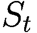 下执行动作 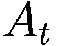 所构建的特征向量，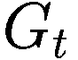 是蒙特卡洛样本回报，而 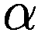 是步长。

类似地，当使用线性函数  来近似状态-动作值函数 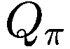 时，TD(0) 策略评估的权重更新规则变为

![$$\displaystyle \begin{aligned} \boldsymbol{w} &amp; = \boldsymbol{w} + \alpha \Biggl[ \Big( R_t + {\gamma} \hat{Q}(S_{t+1}, A_{t+1}; \boldsymbol{w}) - \hat{Q}(S_t, A_t; \boldsymbol{w}) \Big) \boldsymbol{x}(S_t) \Biggr] \\ &amp; = \boldsymbol{w} + \alpha \Biggl[ \Big( R_t + {\gamma} \boldsymbol{x}(S_{t+1}, A_{t+1})^T \boldsymbol{w} - \boldsymbol{x}(S_t, A_t)^T \boldsymbol{w} \Big) \boldsymbol{x}(S_t, A_t) \Biggr] {} \end{aligned} $$](images/605748_1_En_6_Chapter/605748_1_En_6_Chapter_TeX_Equ17.png)

(6.17)

在得到权重更新规则（公式 (6.16) 和 (6.17)）之后，我们可以扩展算法 1 和算法 2 来近似状态-动作值函数。这些扩展分别概述于算法 3 和算法 4 中。整体结构和流程保持不变；我们只需要替换相关的权重更新规则。

**算法 3：** 针对 *Q*[*π*] 的每次访问蒙特卡洛线性 VFA 策略评估

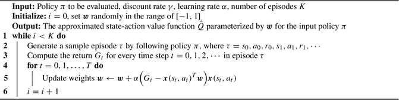 针对 Q pi 的每次访问蒙特卡洛线性 V F A 策略评估算法。

**算法 4：** 针对 *Q*[*π*] 的 TD(0) 线性 VFA 策略评估

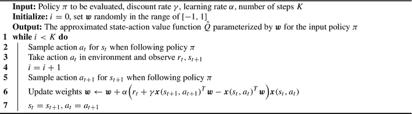 针对 Q pi 的 T D, 0 线性 V F A 策略评估算法。

#### 用于控制的线性值函数近似

一旦我们知道了如何使用前面介绍的线性函数近似策略评估算法来估计状态-动作值，我们就可以开始改进策略（进行控制）。为此，我们需要处理探索问题，可以使用第 5 章介绍的 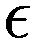-贪心策略。简而言之，-贪心策略以概率 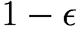 选择估计值最高的动作，并以概率  随机选择一个动作。这使得智能体能够以一定概率探索较少访问的状态，同时仍然利用其对值函数的当前知识。

我们可以使用蒙特卡洛策略迭代算法来改进策略，该算法使用线性函数 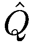 来近似真实的状态-动作值函数 。

算法 5 与算法 3 非常相似；两者的区别在于，智能体是根据基于线性函数  构建的 -贪心策略行动的，其中  由  参数化。

**算法 5：** 使用线性 VFA 的每次访问蒙特卡洛控制，采用 *𝜖*-贪心策略进行探索

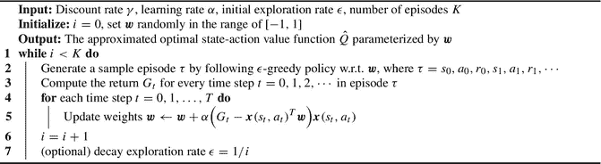 使用线性 V F A 的每次访问蒙特卡洛控制算法，该算法采用属于贪心策略的元素进行探索。

我们首先在服务犬 MDP 上运行带有线性值函数近似的每次访问蒙特卡洛策略迭代算法。我们通过将状态 *s* 和动作 *a* 的独热编码向量连接起来，构建特征向量 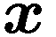，正如本章前面所讨论的。表 6.1 中显示的结果是 100 次独立运行的平均值。我们可以看到，经过 1000 个回合后，除了 *Outside* 状态外，线性近似函数估计的状态值非常接近使用 DP 策略迭代计算出的真实状态值（最后一行），我们猜测这是因为智能体没有频繁访问该状态。

**表 6.1** 使用线性值函数近似的每次访问蒙特卡洛策略迭代算法为服务犬 MDP 计算的最优状态值。结果取 100 次独立运行的平均值；最后一行包含使用 DP 策略迭代计算出的真实状态值。我们使用学习率 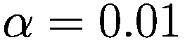、折扣因子 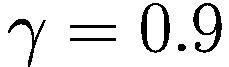 和初始探索率 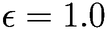，并在每个回合后对其进行衰减。

| 回合数 | 房间 1 | 房间 2 | 房间 3 | 室外 | 找到物品 |
| --- | --- | --- | --- | --- | --- |
| 100 | 5.23 | 6.85 | 8.68 | 0.08 | 1.56 |
| 1000 | 6.19 | 8.0 | 10.0 | 0.15 | 0 |
| 10,000 | 6.2 | 8.0 | 10.0 | 0.31 | 0 |
| DP | 6.2 | 8.0 | 10.0 | 7.2 | 0 |


##### 使用线性函数逼近的 SARSA 算法

到目前为止，将 TD 学习算法适配为使用线性函数 `\hat{Q}` 来逼近真实的状态-动作值函数 `Q_\pi` 是相当容易的。算法 6 展示了基于这种线性方法的 SARSA 算法。

**算法 6：使用 *ε*-贪心策略进行探索的 SARSA 线性 VFA**

```
（此处为算法流程图，内容为：一种使用 ε-贪心策略进行探索的 SARSA 线性 VFA 算法）
```

最后但同样重要的是，我们将介绍如何使用线性函数 `\hat{Q}` 来逼近 Q-learning 的真实最优状态-动作值函数 `Q_*`。回顾一下，Q-learning 直接学习最优状态-动作值函数；它通过使用即时奖励和最佳后继状态-动作对的折扣值作为 TD 目标来实现这一点：

```
TD_target = R_t + γ * max_{a'} Q(S_{t+1}, a')
```

(6.18)

然后，当使用线性值函数逼近进行 Q-learning 时，我们可以调整权重更新规则：

```
w = w + α * ( R_t + γ * max_{a'} x(S_{t+1}, a')^T * w - x(S_t, A_t)^T * w ) * x(S_t, A_t)
```

(6.19)

接着，我们正式介绍 Q-learning 算法，该算法使用线性函数 `\hat{Q}` 来逼近真实的最优状态-动作值函数 `Q_*`，并基于 `ε`-贪心策略进行探索，如算法 7 所示。

**算法 7：使用 *ε*-贪心策略进行探索的 Q-learning 线性 VFA**

```
（此处为算法流程图，内容为：一种使用 ε-贪心策略进行探索的 Q-learning 线性 VFA 算法）
```

##### N 步自举法

将我们在第 5 章介绍的 N 步自举法与值函数逼近相结合也是可行的。整体结构保持不变；我们只需要更改权重更新规则。以下展示了 N 步 Q-learning 权重更新规则（不使用重要性采样）的一个示例，其中 `N=3`：

```
w = w + α * ( R_t + γ * R_{t+1} + γ² * R_{t+2} + γ³ * max_{a'} x(S_{t+3}, a')^T * w - x(S_t, A_t)^T * w ) * x(S_t, A_t)
```

(6.20)

##### 评估学习进度

对于像 cart pole 这样的大规模 MDP，由于状态空间太大，无法测量所有状态的最优状态值。我们如何评估智能体的学习进度或性能？对于情节式问题，一种简单的方法是测量智能体与环境交互以生成样本转换时，一个情节的总奖励（通常不打折）。在实践中，我们经常使用一个独立的模拟环境来运行评估过程，通常使用不同的探索率 `ε` 和随机种子。另一种可以用来衡量学习进度的方法是目标函数 `J(w)` 或损失函数；这适用于情节式和持续性问题。

然而，重要的是不要仅仅依赖训练损失作为衡量 RL 智能体性能的指标。与训练样本固定的监督学习设置不同，RL 智能体通过与环境的交互生成自己的训练样本。因此，智能体的行为可能与训练损失所指示的显著不同。例如，损失函数可能在某个水平上发散，但 RL 智能体在其整体任务上可能仍然表现良好。因此，有必要考虑其他评估指标，如总奖励、成功率或特定的领域特定指标，以全面了解智能体的性能。

#### 实验结果

```
（此处为多线图，内容为：训练情节回报 vs 训练环境步数。使用线性 VFA 的蒙特卡洛和 Q-learning 是从原点上升的曲线。最大值是一条水平线。）
```

**图 6.8** 在 cart pole 任务上，使用线性值函数逼近的每次访问蒙特卡洛控制智能体和 Q-learning 智能体的平均情节回报及 95% 置信区间。结果在五次独立运行中取平均值，然后使用窗口大小为 5 的移动平均进行平滑处理。我们使用 tile coding 来构建特征向量 `x`（8 个 tilings，每个 tiling 16 个 tiles），折扣率 `γ = 0.99`，学习率 `α = 0.0025`，初始探索率 `ε = 1.0`，并在 100,000 个环境步数内衰减至 0.05。

为了解决 cart pole 强化学习问题，我们使用由 Sutton 和 Barto [1]^(⁶) 开发的开源 tile coding 库来构建特征向量 `x`。在实验中，我们对每次访问蒙特卡洛和 Q-learning 都使用线性值函数逼近。图 6.8 中显示的结果在五次独立运行中取平均值。我们在此实验中使用相同的学习率、折扣率和探索率。该图已使用窗口大小为 5 的移动平均进行平滑处理。我们可以看到，在此特定任务上，蒙特卡洛智能体往往比 Q-learning 智能体具有更高的方差。

我们使用来自 OpenAI Gym [2] 的预构建 cart pole 环境进行此实验。^(⁷)


### 6.5 本章小结

在本章中，我们深入探讨了价值函数逼近的概念，并研究了使用线性方法来逼近马尔可夫决策过程（MDP）的价值函数。我们首先解决了处理大规模 MDP 时面临的挑战，即使用表格法表示价值函数在计算上变得不可行。

为了克服这一挑战，我们引入了价值函数逼近的概念，它使我们能够基于一组特征来估计价值函数。通过将价值函数表示为这些特征的线性组合，我们可以有效地逼近价值函数，而无需为每个状态显式存储值。

本章接着讨论了随机梯度下降技术，该技术在更新线性价值函数逼近的权重中起着关键作用。随机梯度下降使我们能够根据观察到的奖励以及预测值与实际值之间的差异，迭代地调整权重。

此外，我们深入探讨了线性价值函数逼近的核心主题。通过使用特征的线性组合，我们构建了一个可以估计价值函数的线性函数。这种方法具有简单性和可解释性，使其成为各种简单强化学习应用中的热门选择。

虽然线性价值函数逼近是一种有价值的技术，但在准确逼近复杂价值函数方面存在固有的局限性。此外，它需要手动构建特征向量，这可能会给某些问题带来挑战。为了解决这个问题，下一章将探讨用于逼近价值函数的非线性方法，特别是神经网络。这些非线性方法可以捕捉更复杂的关系，并在复杂领域中实现更精确的价值函数逼近。

脚注 1 2

