# 7. 非线性价值函数逼近

在本章中，我们将探讨使用非线性方法来逼近强化学习中的价值函数。价值函数在强化学习中起着至关重要的作用，因为它们估计智能体在给定状态下并随后遵循策略所能获得的预期奖励。在上一章中，我们讨论了依赖于构建特征向量并计算特征加权组合作为状态值或状态-动作值的线性方法。然而，这些方法在应用于复杂且具有挑战性的领域时存在局限性。在这种情况下，简单的线性组合可能无法捕捉所有相关的特征和信息。此外，确定能够捕捉手头任务所需信息的适当特征需要大量的领域知识和经验。

为了克服这些局限性，我们可以利用非线性方法，特别是神经网络，来逼近强化学习中的价值函数。神经网络是一种机器学习模型，可以从数据中学习以进行预测或决策。在强化学习中，神经网络可以通过将环境状态作为输入数据，并预测在遵循某个策略时从该状态获得的预期回报，来学习逼近价值函数。

神经网络的力量在于它们能够自动学习输入和输出之间复杂的非线性关系。换句话说，我们无需手动指定一组特征来表示状态，而是可以直接将原始状态信息输入神经网络，然后网络将通过调整其各层神经元的权重和偏置来学习提取相关信息。这个过程被称为特征学习，它使神经网络能够学习到更适合手头任务的表示。

与线性方法相比，神经网络在逼近强化学习中的价值函数方面具有以下几个优点：

- **非线性**：神经网络是非线性函数逼近器，这意味着它们可以对输入和输出之间复杂的非线性关系进行建模。这一点很重要，因为许多现实世界的问题都涉及非线性，而线性方法可能无法捕捉这些复杂的关系。相比之下，神经网络可以学习以高精度逼近复杂的价值函数。

- **泛化能力**：神经网络可以很好地泛化到新的、未见过的数据。这意味着它们可以基于有限的数据学习逼近价值函数，然后将这种知识应用于新的情况。这在强化学习中很重要，因为智能体需要能够将其知识泛化到新的状态和动作，以便在环境中做出有效的决策。

- **特征学习**：神经网络可以学习从原始输入数据中提取相关特征，这可以提高它们逼近价值函数的准确性。相比之下，线性方法需要手工设计的特征，这可能很耗时，并且可能无法捕捉所有相关信息。

- **灵活性**：神经网络具有高度的灵活性，可以轻松适应不同类型的价值函数和强化学习问题。它们可用于逼近状态价值函数和动作价值函数，并可与各种强化学习算法一起使用。

总的来说，与线性方法相比，使用神经网络逼近强化学习中的价值函数的好处包括：它们能够捕捉非线性关系、泛化到新情况、从原始输入数据中学习相关特征，以及适应不同类型的强化学习问题。熟悉神经网络并有训练深度神经网络经验的读者可以跳过 7.1 和 7.2 节。

### 7.1 神经网络

神经网络是一种机器学习模型，其灵感来源于人脑中生物神经元的结构与功能。它由多层相互连接的节点（即人工神经元）构成，这些节点通过一系列数学运算来处理信息。

神经网络的基本构建模块是人工神经元（或称节点）。每个节点接收一个或多个输入，对这些输入执行简单计算，并产生一个输出。每个节点的输出随后作为输入传递给下一层节点。

用数学术语来说，神经网络是一种由一系列线性和非线性函数构成的数学结构。在抽象层面上，我们可以将其表示为一系列（参数化的）线性函数与（可微的）非线性函数的链式组合。例如，我们可以将简单神经网络表示为公式(7.1)所示，其中`f1`和`f2`是各自带有参数或权重的线性函数，而`σ1`和`σ2`则是可微的非线性函数。第一个线性函数`f1(x)`的输出成为第一个非线性函数`σ1`的输入，`σ1`的输出随后被送入第二个线性函数`f2`，以此类推。

```
H(x) = σ2( f2( σ1( f1(x) ) ) )
```

(7.1)

更精确地说，我们可以将线性函数`f`表示为输入数据`x`及其权重`W`的函数，如公式(7.2)所示。其中，`W`是一个维度为`m` x `n`的权重矩阵，`b`是一个包含`m`个分量的偏置向量。线性函数的输出是一个包含`m`个标量分量的向量。在对此输出向量应用非线性函数`σ`后，我们将其送入下一个线性函数，以此类推。

```
f(x) = x^T W + b
```

(7.2)

在强化学习领域，神经网络是近似价值函数甚至策略的强大工具，我们将在本书第三部分详细讨论。通过利用经验数据训练神经网络的权重，我们可以学会从已观测的状态和动作泛化到未观测的情况。将神经网络抽象表示为一系列线性和非线性函数，为近似那些关联状态、动作与价值的复杂函数提供了灵活的框架。

#### 前馈神经网络

前馈神经网络，也称为多层感知机（MLP），是一种信息单向流动的神经网络：从输入层开始，经过一个或多个隐藏层，最终到达输出层。在前馈神经网络中，一层的输出作为下一层的输入，层与层之间不存在循环。

前馈神经网络的典型架构包括一个输入层、一个或多个隐藏层以及一个输出层。输入层接收原始输入数据，数据随后经过隐藏层进行信息变换与处理，最后交由输出层处理。网络中的每一层都由一组神经元组成，这些神经元与相邻层的神经元相连接。每一层中的神经元会计算来自上一层输入的加权和，对结果应用激活函数，并将结果输出到下一层。

##### 全连接神经网络

全连接神经网络，也称为密集神经网络，是一种神经网络类型，其中一层的每个神经元都与下一层的每个神经元相连。这意味着每一层中的所有神经元都与相邻层中的所有神经元相连。全连接神经网络可以有任意数量的层，但通常在输入层和输出层之间有一个或多个隐藏层。

在实践中，全连接神经网络通常是前馈神经网络的一种特定实现，其中每一层都与相邻层全连接。术语“前馈神经网络”和“全连接神经网络”经常互换使用。然而，“前馈神经网络”这个术语通常更广泛地用于指代任何信息单向流动的神经网络，无论层之间的连接类型如何。

让我们用图形方式说明全连接神经网络的概念，如图 7.1 所示。此示例网络中的每一层都是线性变换和逐点非线性激活函数的组合。每层中的计算单元数量可以不同，如图 7.1 所示。输入层是一个抽象层，它将原始输入数据转换为后续层可以处理的格式。其单元数量与输入数据的维度相同，并且其单元没有关联的权重或激活函数。输出层的单元数量与期望输出相同，其计算单元负责生成网络的最终输出。

输入层和输出层之间的层称为隐藏层。在此示例中，显示了两个隐藏层，但在实践中，神经网络可以有大量的隐藏层，从而形成所谓的深度神经网络。术语“深度学习”通常指使用深度神经网络来解决特定任务，例如分类或预测。隐藏层背后的思想是，通过逐步组合前一层学习到的更简单特征，使网络能够学习输入数据的复杂表示。每个隐藏层由一组计算单元组成，这些计算单元对前一层的输出应用非线性变换，然后进行线性变换以生成下一层的输入。非线性变换通常是一个逐点函数，例如 `sigmoid`、`ReLU` 或 `tanh` 函数，它引入非线性，使网络能够建模更复杂的输入-输出关系。

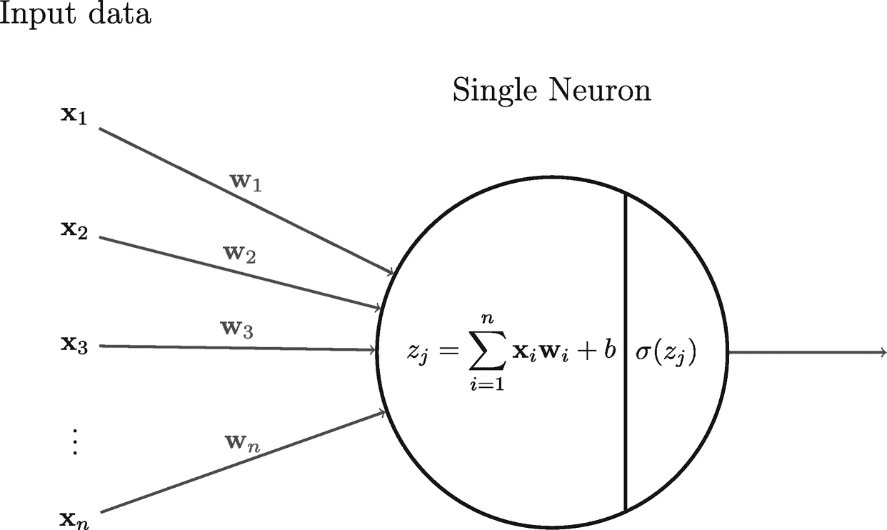

一个图示说明了单个神经元，标记为 X 1 到 X n 的输入，W 1 到 W n。一个圆圈标记为 z j = 求和 i = 1 到 n，x i w i + b 以及 sigma of z j。

图 7.2 单个神经元工作方式示例

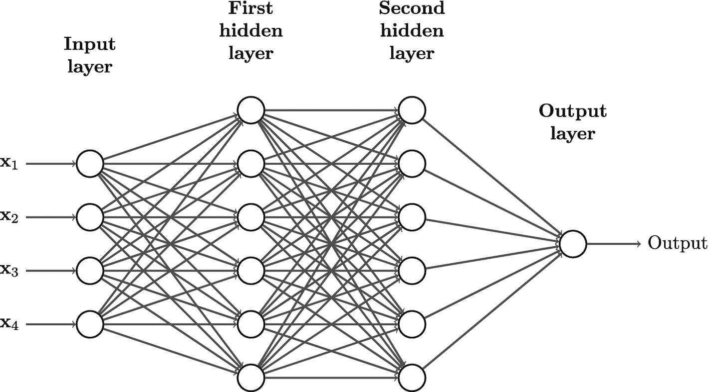

一个流程图说明了 X 1 到 X 4 输入层、第一隐藏层、第二隐藏层和输出层。

图 7.1 一个简单的全连接神经网络示例，包含两个隐藏层（每层由六个单元组成）和一个输出层（由一个单元组成）

我们可以在图 7.1 中看到，前一层中的每个单元都与后一层中的所有单元相连（输入层除外）。这种类型的架构称为全连接层，如果一个神经网络仅由全连接层组成，我们称之为全连接网络。每一层（没有激活函数的输入层除外）都可以有自己的可微非线性函数 `σ`，该函数通常被称为激活函数。

全连接层中的每个单元（或神经元）都有自己的参数集（输入层中的单元除外）。图 7.2 展示了全连接层中第 `j` 个神经元的计算过程。该神经元接收一个向量 `x` 作为输入数据，其中 `x` 可以是前一层的输出，或者如果该神经元位于第一个隐藏层，则 `x` 是输入数据。它首先计算输入向量 `x` 与权重向量 `w`（表示神经元之间连接的强度）的内积，记为 `z_j = x^T w`。然后，神经元向结果 `z_j` 添加一个标量参数 `b`，称为偏置。偏置是一个额外的参数，可以偏移结果 `z_j`。之后，神经元对 `z_j` 应用激活函数 `σ`，激活函数的输出作为输入传递到下一层（如果该神经元位于最后一层，则传递到输出层）。

值得注意的是，权重向量 `w` 是通过训练过程学习得到的。在训练期间，神经网络会调整 `w` 和 `b` 的值，以便网络能够更好地逼近期望的输出。

激活函数通过向系统添加非线性，在神经网络中发挥着关键作用。没有它们，神经网络将退化为一个具有许多参数的线性函数，无法捕捉输入和输出之间的复杂关系。

深度神经网络背后的思想是，通过应用一系列非线性变换，我们可以从输入数据中提取丰富的特征集。这些特征通常具有隐藏的层次结构，其中较低级别的特征被组合成较高级别的特征。激活函数通过使每一层能够从输入数据中提取不同的特征，有助于创建这种层次结构。

一些最常见的激活函数包括 `ReLU`（修正线性单元）、`sigmoid` 和 `tanh`，如图 7.3 所示。`ReLU` 可能是最流行的激活函数，因为它简单有效，但其他函数如 `LeakyReLU` 和 `ELU` 也值得考虑。激活函数的选择会对神经网络的性能产生重大影响，并且通常需要通过反复试验来确定最适合特定任务的函数。

例如，`ReLU` 已知在大多数应用中表现良好，但它可能导致“死亡 ReLU”问题，即某些神经元陷入零激活状态并停止学习。`LeakyReLU` 及其变体通过允许负输入有一个小的非零梯度，有助于缓解这个问题。`Sigmoid` 和 `tanh` 函数对于特定应用（如二分类或图像生成）也很有用。

总之，选择合适的激活函数是设计神经网络的重要一步。它需要理解不同函数的优缺点，并尝试不同的组合，以找到最适合特定任务的函数。

#### 卷积神经网络

卷积神经网络（CNN）是一种专门为处理和分析具有网格状结构的数据（如图像或视频）而设计的神经网络。CNN 的灵感来源于动物视觉皮层的组织方式和功能，视觉皮层中具有专门对视野中特定特征做出反应的神经元。

在 CNN 中，输入数据通常是一张图像，它被表示为一个像素网格。网络由多个层组成，每一层对输入数据执行不同类型的处理。第一层通常是卷积层，它对输入图像应用一组滤波器，每个滤波器在图像中寻找特定的模式或特征。这些滤波器在图像上移动，计算滤波器与图像之间的点积，从而生成一个特征图。

第一层的输出随后被传递到下一层，下一层可能是另一个卷积层、池化层或全连接层。池化层通过计算特征图中相邻区域的最大值或平均值来对上一层的输出进行下采样。全连接层接收上一层的扁平化输出，并对其应用一组权重，从而生成对输入图像的预测或分类。

全连接神经网络在处理数值数据时很有效，但并不适合处理图像数据，因为图像数据通常具有三个维度：宽度、高度和颜色通道。使用全连接神经网络时，我们需要将图像像素展平以创建一个向量；将图像像素展平为向量会导致我们丢失感兴趣区域以及像素之间的相关性，从而难以识别物体，如图 7.4 所示。此外，在处理图像时，全连接神经网络中的参数数量可能会变得非常庞大。

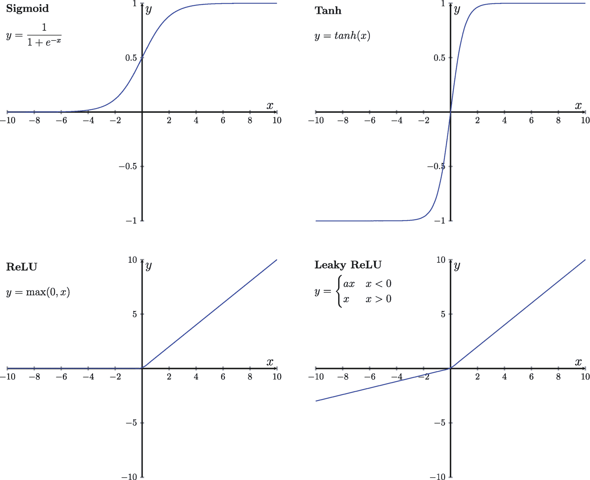

4 条折线图描绘了 Sigmoid、Tanh、ReLU 和 Leaky ReLU 激活函数在一定输入值范围内的特征行为及输出范围。给定 `y = 1 / (1 + e^(-x))`、`y = tanh(x)`、`y = max(0, x)` 以及当 `x < 0` 和 `x > 0` 时的 `y = a * x`。

图 7.3

不同的激活函数。左上角是 Sigmoid 激活函数的示例；右上角是 Tanh 激活函数的示例；左下角是 ReLU 激活函数的示例；右下角是 Leaky ReLU 激活函数的示例。

这种方法存在两个主要问题。首先，图像中的物体通常跨越多个像素，并且每个像素与其周围像素相关。将图像展平为向量会使识别物体变得更加困难；想象一下，我们正在训练一个强化学习智能体进行自动驾驶，未能成功识别行人可能意味着致命的错误和悲剧。其次，在处理图像时，全连接神经网络中的参数数量可能会变得非常庞大。例如，一张尺寸为 `600 × 400 × 3` 的中等大小图像会生成一个包含 `7.2 × 10⁵` 个元素的向量。当输入到全连接神经网络时，第一个隐藏层的输入数据就有 `7.2 × 10⁵` 个维度。即使第一层只有 10 个隐藏单元，该网络仅这一层就需要 `7.2 × 10⁶` 个参数。当我们有更多隐藏层或隐藏单元


关于卷积神经网络（CNN）的架构，有几个重要的细节值得注意，例如控制步长和填充，以及使用池化层来缩小图像尺寸。然而，本书主要关注强化学习的理论和数学原理。感兴趣的读者可以在其他地方找到其他资源来了解更多关于这些神经网络架构的信息。

在处理图像时，CNN 相比全连接神经网络具有显著优势。例如，考虑一个尺寸为`600 × 400 × 3`的输入图像。对于第一个隐藏层，使用 100 个核大小为`3 × 3`的滤波器，仅产生 2700 个参数（不包括偏置项）。这远小于全连接层中十个单元所需的`7.2 × 10⁶`个参数。此外，CNN 被设计为与输入图像尺寸无关，这使得它们在图像处理任务中更加通用。

### 7.2 训练神经网络

训练神经网络是指教导神经网络学习输入数据与输出数据之间映射关系的过程。在训练过程中，神经网络会接收一组输入-输出对，并通过调整其参数（如权重和偏置）来最小化预测输出与实际目标之间的差异，例如在监督学习中的情况。

使用随机梯度下降法通过样本梯度来更新神经网络参数的基本思路仍然适用。然而，挑战在于如何计算神经网络中不同权重和偏置对应的梯度。由于神经网络通常包含多个层，且每层可能使用不同的激活函数，因此各层权重和偏置的导数也会有所不同。这意味着我们不能像上一章介绍的线性方法那样，使用单一的更新规则来更新这些不同层的参数。

虽然仍然可以手动推导每一层的方程，但对于不熟悉微积分的人来说，这种方法颇具挑战性。此外，深度神经网络往往有数十层甚至数百层，使得手动推导变得不切实际。如果对神经网络架构进行更改（例如添加或删除层、更换激活函数），大部分工作都需要重新进行。

幸运的是，反向传播算法为神经网络中梯度计算的挑战提供了一种简单而优雅的解决方案。该算法利用计算图来表示复杂的可微函数，然后运用微积分中的链式法则来计算图中每个节点的梯度。计算图中的每个节点仅执行非常基本的运算，例如加法、乘法、除法，或像激活函数这样的组合运算。由于我们已经知道这些基本运算的导数，因此推导出这些节点中变量的导数相对容易。

图 7.9 展示了一个全连接层计算图的简化版本。在此图中，每个节点执行特定的计算，例如两个变量之间的点积、加法，或像激活函数 `σ` 这样的组合运算。请注意，节点 `z₁` 表示输入数据 `x` 与该线性层中所有单元的每个权重向量 `w` 之间的点积。节点 `z₂` 类似，但将来自所有单元的偏置项加到了 `z₁` 的结果上。

使用反向传播算法不仅简化了梯度的计算，还使神经网络更加灵活。如果对神经网络架构进行更改，该算法可以轻松调整以适应这些变化，而无需完全重做工作。

在我们使用目标函数计算神经网络预测结果 `y` 与真实目标 `y*` 之间的损失后，就可以利用反向传播算法计算网络参数的梯度，然后使用这些梯度来更新网络参数。反向传播算法在计算图中反向工作，计算每个节点处局部参数对应的梯度（有时也称为局部梯度），然后将这些梯度传播回上一个节点。它利用微积分中的链式法则来实现这一点，从而能够计算局部参数的梯度以及来自前一个节点的上游梯度。这不仅适用于全连接神经网络，也适用于任何其他类型的神经网络，包括卷积神经网络和循环神经网络。

```
if (condVar > someVal) {console.log("xxx")}
```

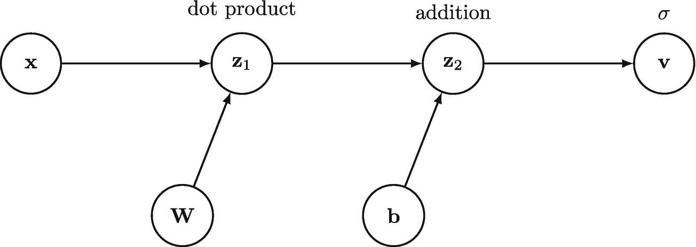

一个包含 6 个节点 `x`、点积 `z₁`、加法 `z₂`、`σ`、`w` 和 `b` 的示意图。

**图 7.9** 全连接层计算图的简化示例

让我们看一个非常简单的全连接神经网络，它包含一个隐藏层和一个输出层。我们对隐藏层使用 sigmoid 激活函数，对输出层不使用激活函数。我们使用平方误差损失作为目标函数，该函数衡量预测值与真实目标值之间的差异。图 7.10 展示了反向传播如何为每一层计算梯度。在通过神经网络前向传播计算出预测值 `y` 后，我们使用真实目标 `y*` 来计算损失。然后反向传播算法开始反向工作，从图中最后一个节点 `l`（即损失输出的位置）开始。对于每个节点，它利用上游梯度和局部梯度来计算该特定计算节点的梯度，直到到达第一个隐藏层。在实践中，我们只关心这些不同层的权重 `W` 和偏置 `b` 对应的梯度。

在知道神经网络不同层的权重和偏置对应的梯度后，我们就可以开始使用随机梯度下降算法来更新参数。

随着神经网络层数的增加，跟踪每一层的权重和偏置变得困难。因此，我们通常使用 `θ` 来表示神经网络的所有参数，其中 `θ` 是一个包含单个神经网络所有参数（权重和偏置）的向量。总而言之，训练神经网络通常包括以下主要步骤：

- 将输入数据 `x` 馈送到由 `θ` 参数化的神经网络中，得到预测值 `y`。

- 使用目标函数，根据上一步得到的 `y` 和真实目标 `y*` 计算损失。

- 使用反向传播算法，根据上一步的损失计算 `θ` 的梯度。

- 使用随机梯度下降算法，根据上一步的梯度更新 `θ`。

幸运的是，现代深度学习框架（如 `PyTorch` 和 `TensorFlow`）内置了自动微分功能，可以自动为我们执行反向传播。这些工具还内置了优化器，可以根据参数的梯度更新神经网络的参数。自动微分和反向传播帮助我们计算神经网络参数的梯度。优化器是使用梯度来更新网络参数的算法。因此，我们只需关注神经网络的架构并定义目标函数（损失函数），这些工具将自动为我们处理其余工作。

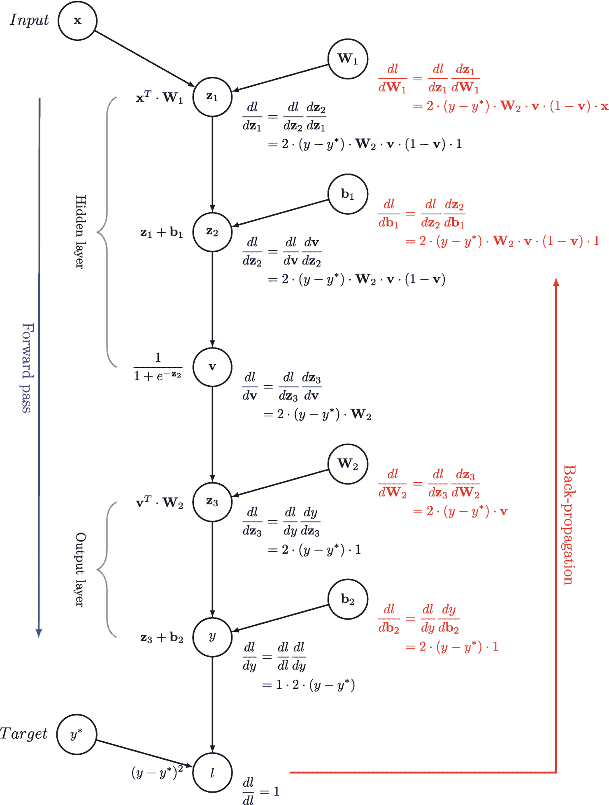

该图概述了神经网络中的前向和反向传播过程，包括训练期间梯度的计算和参数的更新。

**图 7.10** 反向传播如何为一个简单的全连接神经网络计算梯度的示例，该网络包含一个隐藏层和一个输出层，其中隐藏层使用 `sigmoid` 激活函数，输出层不使用激活函数。

在下面的示例中，我们演示如何使用 `PyTorch` 深度学习框架训练一个神经网络。首先，我们创建一个神经网络实例和一个优化器（本例中为随机梯度下降，即 `SGD`），用于在训练期间更新网络参数。我们将网络参数和学习率作为参数传递给优化器，以便它知道要更新哪些参数以及更新步长的大小。

在训练期间，我们将训练集中的输入数据输入网络，计算预测输出。然后，我们计算损失，这是衡量预测输出与训练集中真实目标值之间差距的指标。在本例中，我们使用均方误差（`MSE`）损失作为目标函数。

计算损失后，我们使用反向传播自动计算网络不同参数的梯度。这些梯度告诉我们每个参数对损失的贡献程度，我们可以利用它们执行随机梯度下降步骤来更新网络参数。我们对每一批训练数据重复此过程，直到网络学会准确预测目标值。

以下是带有额外注释的代码，解释了每一行的作用：

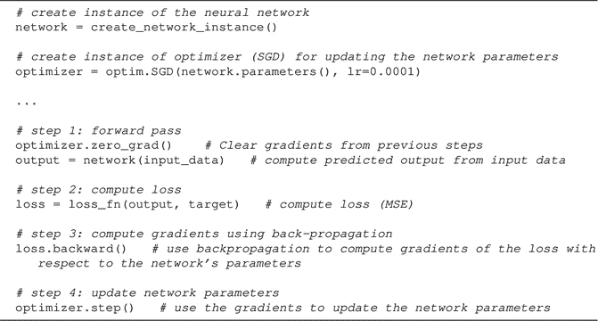 一种基于神经网络的 `Q` 学习算法，使用 ε-贪婪动作选择、更新 `Q` 网络，并在 `K` 步内衰减 ε，以逼近最优状态-动作值函数 `Q`。

值得注意的是，本示例中使用的一些术语和概念对于 `PyTorch` 或深度学习的初学者来说可能不熟悉。例如，神经网络是一系列相互连接的节点，可以学习将输入数据映射到输出数据；优化器是一种更新网络参数以最小化损失函数的算法。反向传播是一种计算损失函数相对于网络参数梯度的方法，梯度告诉我们每个参数对损失的贡献程度。通过理解这些概念，我们可以创建和训练神经网络来解决广泛的问题。

虽然框架和工具使训练深度神经网络变得更加容易，但在训练深度神经网络时也可能出现其他挑战。其中一个挑战是梯度消失或爆炸问题。当靠近输入层（如第一个隐藏层）的梯度变得过小或过大时，就会出现此问题。这个问题通常出现在非常深的神经网络中。为了解决这一挑战，研究人员提出了使用跳跃连接架构（如 `He` 等人提出的 `ResNet` 架构[[1]](#605748_1_En_7_Chapter.xhtml#CR1)）来构建神经网络。这些架构使我们能够训练具有数百层的深度神经网络，同时避免梯度消失问题。

另一个挑战是过拟合问题，当神经网络中的参数数量远大于训练数据数量时，就会发生这种情况。这可能导致神经网络过于复杂，并且过于紧密地拟合训练数据，从而导致在新数据上表现不佳。正则化方法，如 `L2` 和 `L1` 正则化，以及使用 `Dropout`，可用于解决过拟合问题。`L2` 和 `L1` 正则化向损失函数添加一个惩罚项，通过减小权重的幅度来帮助防止模型过拟合。而 `Dropout` 则在训练期间随机丢弃一定比例的神经元，有助于防止网络过度依赖任何一个或一组神经元。

在训练深度神经网络的背景下，权重初始化起着至关重要的作用。典型的初始化方法包括随机初始化、`Xavier` 初始化[[2]](#605748_1_En_7_Chapter.xhtml#CR2)和 `He` 初始化[[3]](#605748_1_En_7_Chapter.xhtml#CR3)。随机初始化缺乏指导，而 `Xavier` 初始化考虑了层连接，`He` 初始化则针对 `ReLU` 激活函数进行了调整。初始化方法的选择取决于网络架构和所使用的特定激活函数。不良的初始化会阻碍收敛并导致次优解，而适当的初始化则会加速学习并提高性能。

虽然深度学习框架使训练神经网络变得更加容易，但用户必须意识到使用这些模型时可能出现的挑战。通过理解这些问题，读者可以更好地评估其模型的性能，并就如何应对这些挑战做出更明智的决策。

要更详细地了解这些主题，读者可以探索许多在线资源，包括学术论文、教程和讨论论坛。通过将理论与实践相结合，我们可以更深入地理解如何训练神经网络及其背后的数学原理。

### 7.3 使用神经网络进行策略评估

在本节中，我们将探讨在强化学习中利用神经网络进行策略评估。其目标是使用参数为 `θ` 的神经网络来近似任意策略 `π` 的状态价值函数 `V_π`。我们假设已知该策略的真实状态价值函数 `V_π`，而我们的目标是找到能够最小化真实值与神经网络预测值之间平方误差的参数 `θ`。

我们从目标函数开始：

```
J(θ) = E_π[(V_π(S) - V̂(S; θ))²]
```

(7.3)

其中 `V̂(S; θ)` 是神经网络对状态 `S` 的预测值。我们可以使用随机梯度下降法，通过利用小批量经验数据计算出的样本梯度来更新参数 `θ`，从而得到针对给定小批量的简化目标函数：

```
J(θ) = (V_π(S) - V̂(S; θ))²
```

(7.4)

为了在实践中使用这种方法进行策略评估，我们放宽了已知真实状态价值函数 `V_π` 的假设，转而使用来自蒙特卡洛或时序差分学习的样本回报作为目标。对于蒙特卡洛策略评估，目标函数变为

```
J(θ) = (G_t - V̂(s_t; θ))²
```

(7.5) 其中 `G_t` 是从状态 `s_t` 获得的总回报。

对于 TD(0) 策略评估，我们使用即时奖励 `r_t` 和后续状态的折扣价值 `γ V̂(s_{t+1}; θ)` 作为目标，目标函数变为

```
J(θ) = (r_t + γ V̂(s_{t+1}; θ) - V̂(s_t; θ))²
```

(7.6)

通过使用这些目标函数，并应用带有反向传播的随机梯度下降法，我们可以更新神经网络参数 `θ`，以更好地近似状态价值函数，从而改进强化学习算法中的策略评估。

强化学习与监督学习的区别在于，它使用蒙特卡洛或时序差分学习来估计目标函数中的目标。蒙特卡洛和时序差分学习利用奖励信号和后续状态的价值来估计目标，该目标会随时间变化，这与监督学习中固定的目标不同，这也使得训练神经网络来近似价值函数更具挑战性。

我们还可以使用神经网络来近似某个策略 `π` 的状态-动作价值函数，记为 `Q̂`。针对参数 `θ` 的 `Q̂` 的 TD(0) 策略评估目标函数变为

```
J(θ) = (r_t + γ Q̂(s_{t+1}, a_{t+1}; θ) - Q̂(s_t, a_t; θ))²
```

(7.7) 其中 `r_t` 表示奖励信号，`γ` 是决定未来奖励相对重要性的折扣因子，`θ` 表示神经网络的参数。通过最小化这个目标函数，我们可以更新神经网络的参数，以更好地近似某个策略 `π` 的真实状态-动作价值函数 `Q_π`。

### 7.4 朴素深度 Q 学习

在强化学习中，Q 学习是一种离轨策略学习算法，它直接学习最优状态-动作值函数（`Q*`）。为了计算估计目标，Q 学习使用即时奖励和最佳后继状态-动作对的折扣值作为 TD 目标。当使用神经网络来近似最优状态-动作值函数时，我们的 Q 学习目标函数可以表示为

```
J(θ) = (r_t + γ max_{a'} Q̂(s_{t+1}, a'; θ) - Q̂(s_t, a_t; θ))²
```

(7.8)

 = (r_t + γ * max_{a'} Q̂(s_{t+1}, a'; θ^-) - Q̂(s_t, a_t; θ))²
```

这里，`θ` 代表标准 Q 网络的参数，`θ^-` 代表目标网络的参数。初始时，两个网络具有相同的参数。每当 `θ` 更新 *C* 次后，`θ^-` 就会被更新为 `θ`。

DQN 智能体是一种经过改进的深度 Q 学习算法，它结合了经验回放和目标网络。它首先用相同的参数初始化标准 Q 网络 `θ` 和目标网络 `θ^-`。同时，初始化一个容量为 *N* 的回放缓冲区 *D*，用于存储最近的 N 个转移。

在训练过程中，智能体使用相对于标准 Q 网络 `θ` 的 `ε`-贪心策略与环境交互。智能体不会立即计算损失并对转移数据执行随机梯度下降，而是将数据存储在回放缓冲区 *D* 中。当缓冲区 *D* 中的样本数量达到某个阈值 *m*（其中 `m ≥ b`）时，智能体从 *D* 中采样一个小批量的转移，并使用它们计算 TD 目标和平方误差损失。然后，通过随机梯度下降优化该损失，以更新标准 Q 网络的参数 `θ`。智能体继续使用更新后的 `θ` 与环境交互，生成更高质量的训练数据。接着，智能体从 *D* 中采样另一个小批量的转移以继续学习。每当 `θ` 更新 *C* 次后，`θ^-` 就会被更新为 `θ`。

尽管经验回放和目标网络都能提高 Q 学习的性能，但经验回放通常更为重要。然而，在实践中，训练深度 Q 学习模型时，这两种技术通常一起使用。

**算法 3：[DQN] 具有经验回放和目标网络的深度 Q 学习，使用 *ε*-贪心策略进行探索**

在情节式强化学习问题中，例如玩 Atari 游戏，终止状态代表一个情节序列的结束，之后环境会重置为初始状态。一个关键的考虑因素是如何处理可能包含一个或多个终止状态的小批量转移，因为终止状态的值始终为零。在训练期间从回放缓冲区随机采样时，有可能选到包含一个或多个终止状态的小批量。为了解决这个问题，可以采用不同的策略。

一张图表描绘了一条 U 形曲线，展示了公交车在驶向目的地的过程中的路径。

**图 7.13**

#### 山地车任务

山地车任务的目标是驾驶一辆动力不足的汽车到达预定的目标位置。该问题最初由萨顿和巴托提出 [4]。

一种可能的解决方案是在回放缓冲区中为每次转移存储一个折扣率 ，例如 。在这种情况下，当  是终止状态时， 被设置为零。在学习过程中，使用存储的折扣率来计算转移的时间差分（TD）目标。

另一种解决方案是在回放缓冲区中为每次转移包含一个布尔指示器，例如 ，当  表示终止状态时，该指示器被设置为 `true`。这样，在学习过程中，当 `done` 为 `true` 时，折扣可以设置为零，从而将后续状态的值设为零。

通过适当处理终止状态，智能体可以更高效、更有效地学习。例如，当终止状态的折扣率设置为零时，神经网络将不会尝试学习该状态的值。对终止状态进行适当处理对于确保强化学习算法的鲁棒性非常重要。

#### 山地车任务

我们现在使用另一个名为*山地车*的经典控制任务来演示使用经验回放和目标网络的性能提升。山地车任务的目标是驾驶一辆动力不足的汽车到达预定的目标位置，如图 7.13 所示。该任务的难点在于，对于动力不足的汽车来说，山太陡峭而无法攀爬。唯一的解决方案是先将汽车驶向与目标相反的方向，利用重力作为额外的力来积累足够的速度，最终到达目标。

环境状态仅包含两个连续变量：汽车的位置 ![$$x \in [-1.2, 0.5]$$](images/605748_1_En_7_Chapter/605748_1_En_7_Chapter_Tex_IEq119.png) 和速度 ![$$\dot {x} \in [-0.07, 0.07]$$](images/605748_1_En_7_Chapter/605748_1_En_7_Chapter_Tex_IEq120.png)。该任务的奖励是，在汽车到达目标位置之前，每一步都获得 。智能体可以选择三种动作：向前加速（向右）、向后加速（向左）和不加速。环境的动力学由简化的物理模型定义，其中汽车的位置通过以下方程更新：


其中， 是一个函数，如果 *x* 在边界 ![$$[-1.2, 0.5]$$](images/605748_1_En_7_Chapter/605748_1_En_7_Chapter_Tex_IEq123.png) 内，则返回 *x*；如果超出此范围，则返回最近的边界值。汽车的速度通过以下方程更新：


其中， 是在时间 *t* 选择的加速度。

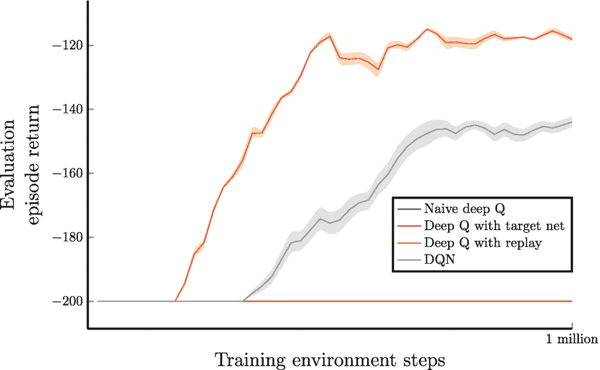

一张折线图绘制了评估回合回报与训练环境步数的关系。四条线分别是：朴素深度 Q、带目标网络的深度 Q、带经验回放的深度 Q 以及 DQN（其中目标网络和 DQN 的线在 200 处呈线性，而朴素深度 Q 和带经验回放的线呈上升趋势）。

**图 7.14** 不同 Q 学习智能体在山地车任务上的评估回合回报。结果基于五次独立运行的平均值，然后使用窗口大小为五的移动平均进行平滑处理。

如果汽车到达左侧山顶（位置左边界），汽车的速度将重置为零，这样它就不会冲出山谷。每个回合从随机位置 ![$$x_0 \in -0.6,-0.4)$$ 和零速度开始。为了避免任务陷入无限循环，我们可以限制每个回合的最大步数。

以下实验使用 OpenAI Gym [5] 中预构建的山地车环境^(⁸)，评估了不同 Q 学习智能体在山地车任务上的性能。实验设置如下：

*   最大回合步数：200

*   学习率 (  )：0.0005

*   折扣率 (  )：0.99

*   批量大小：32

*   回放容量：50,000

*   探索率 (  ) 衰减：在 100,000 次更新中从 1.0 衰减至 0.05

*   目标网络更新间隔 (*C*)：200

图 7.14 展示了朴素深度 Q 学习、仅使用目标网络的 DQN，以及同时使用经验回放和目标网络的 DQN 的性能表现。为了评估智能体的性能，我们在一个独立的评估环境中，每经过 20,000 步训练环境步数后，以 0.05 的探索率运行 20,000 步评估环境步数（约 40 个回合）。结果取五次独立运行的平均值，然后使用窗口大小为五的移动平均进行平滑处理。

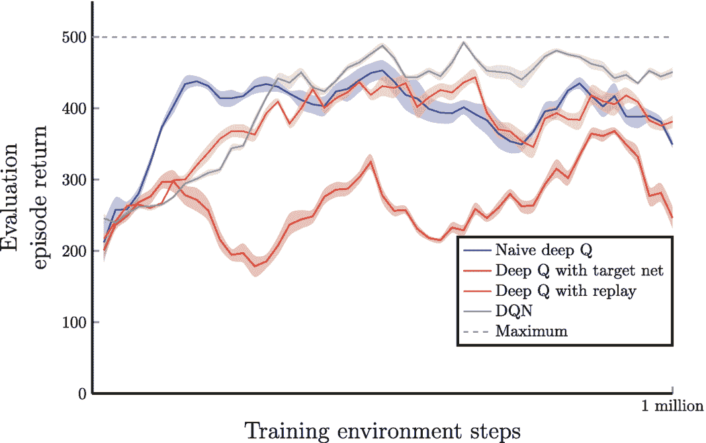

折线图绘制了评估回合回报与训练环境步数的关系。五条线分别代表朴素深度 Q 学习、带目标网络的深度 Q 学习、带经验回放的深度 Q 学习以及 DQN，其最大值在 200 到 500 之间波动。

**图 7.15** 不同 Q 学习智能体在推车杆任务上的评估回合回报。结果取五次独立运行的平均值，然后使用窗口大小为五的移动平均进行平滑处理

在本实验中，我们使用学习率 `(α) = 0.00025`，折扣率 `(γ) = 0.99`，批量大小 `= 32`，以及回放容量 `= 50,000`。我们在 100,000 步环境步数内将探索率（`ε`）从 1.0 衰减到 0.1，并每 200 次更新后更新目标网络（如果存在）。

本实验突显了经验回放在 Mnih 等人 [6] 开发的深度 Q 网络（DQN）算法成功中的关键作用。结果表明，朴素深度 Q 学习和带目标网络的深度 Q 学习表现与随机智能体相似。相比之下，带经验回放的深度 Q 学习展现出更平滑的学习曲线。虽然使用额外的目标网络可能会根据问题的复杂性和目标网络更新的频率而减慢学习速度，但总体上会带来更平滑的学习进程。

我们也可以从另一个评估不同 Q 学习智能体在推车杆任务上性能的实验中观察到类似的结果，如图 7.15 所示。

### 7.6 用于 Atari 游戏的 DQN

到目前为止，我们只考虑了像推车杆和爬山车这样的玩具问题，我们可以使用线性方法而非神经网络来近似价值函数。然而，对于更复杂和更具挑战性的强化学习问题，神经网络是必不可少的。一个例子是 Atari 视频游戏测试平台，这是一系列由 Atari Interactive, Inc. 拥有的游戏集合，需要先进的 AI 技术才能玩得好。

在本节中，我们将详细介绍如何训练一个 DQN 智能体来玩部分 Atari 游戏。正如我们在第 1 章中提到的，DQN 智能体是一种基于神经网络的方法，用于解决强化学习问题。为了将 DQN 算法应用于 Atari 游戏，我们需要对训练流程进行一些修改。具体来说，我们需要准备环境状态、定义神经网络架构，并修改训练细节。这些修改基于 Mnih 等人 [7] 和 [6] 的工作，我们将严格遵循这些工作。

#### 使用 Atari 游戏环境的局限性与挑战

尽管 Atari 游戏环境已被证明是测试和开发深度强化学习算法的宝贵工具，但它并非没有局限性和挑战。Atari 环境的主要局限性之一在于它是现实世界的简化模拟，这意味着智能体在 Atari 环境中学到的技能和策略不一定能迁移到现实世界的应用中。换句话说，Atari 环境可能过于人工化，无法捕捉现实世界环境的全部复杂性和多变性。

Atari 环境的第二个局限性在于它是一个相对低维且离散的环境，这意味着它可能不适合测试和开发需要高维且连续状态和动作空间的深度强化学习算法。一些现实世界的应用，如机器人技术和自动驾驶，其状态和动作空间比 Atari 环境中的要复杂和连续得多。

Atari 环境的另一个局限性在于它是一个静态环境，这意味着它不会随时间变化。另一方面，现实世界环境是动态且不断变化的，这给深度强化学习算法带来了额外的挑战。例如，自动驾驶智能体必须能够实时适应变化的交通状况和道路条件，这比玩《太空侵略者》游戏要困难得多。

尽管存在这些局限性，研究人员仍在积极开发更真实、更复杂的环境，用于测试和开发深度强化学习算法。其中一些环境包括模拟机器人任务、交通模拟，以及具有更真实物理和图形的视频游戏环境。这些环境可以为深度强化学习算法提供更具挑战性和更真实的测试平台，并有助于弥合模拟环境与现实世界应用之间的差距。

#### 环境预处理

雅达利游戏是一类确定性的、情节式的强化学习问题。屏幕图像（即帧）被用作环境状态，情节序列的时间步长由游戏的不同帧来衡量。然而，这种方法存在一个问题：单帧图像不具备马尔可夫性质。为了理解这个问题，我们来看一下《打砖块》视频游戏中的一帧，如图 7.16 所示。从这一帧中，很难判断球（屏幕左中部的小红块）的运动方向。它可能正在向上移动，因为智能体刚刚用球拍击中了球；也可能是在撞到右侧墙壁后，从右角落下落。问题在于，这一帧包含的信息不足以完整描述球的运动方向或轨迹。

马尔可夫性质（在第 2 章


# DQN 智能体架构

`DQN` 智能体使用一个非常简单的卷积神经网络。它由三个卷积层组成；神经网络的输入数据是一张 `84 × 84 × 4` 的图像。第一个隐藏卷积层有 32 个滤波器，内核大小为 `8 × 8`，步长为 4。这意味着第一个隐藏层的输出特征图将有 32 个通道。第二个隐藏卷积层有 64 个滤波器，内核大小为 `4 × 4`，步长为 2。第三个隐藏卷积层有 64 个滤波器，内核大小为 `3 × 3`，步长为 1。我们在每个卷积层之后应用 `ReLU` 激活函数。然后，最后一个卷积层的特征图被展平并输入到一个包含 512 个单元的全连接层；之后，我们应用 `ReLU` 激活函数。全连接层的输出随后被输入到输出层，该层有 `N` 个单元且没有激活函数。这里，`N` 是特定 Atari 游戏的有效动作数量，根据游戏不同，其值在 4 到 18 之间变化。图 7.20 展示了该网络架构。

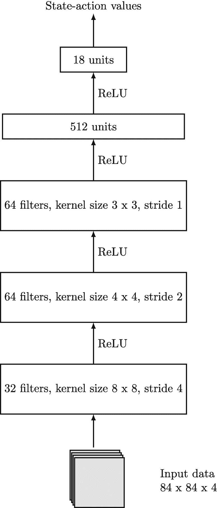

#### 最终输出层无激活函数的原因

为什么我们不在最终输出层使用激活函数？大多数激活函数会以某种形式转换数值。但任意状态-动作对的值可以是任何实数 `(s, a) ∈ ℝ`。而且，这些不同 Atari 游戏的最小值或最大值的限制并不相同。为了在这些游戏中复用同一个神经网络，最好不要对输出层的值进行转换。

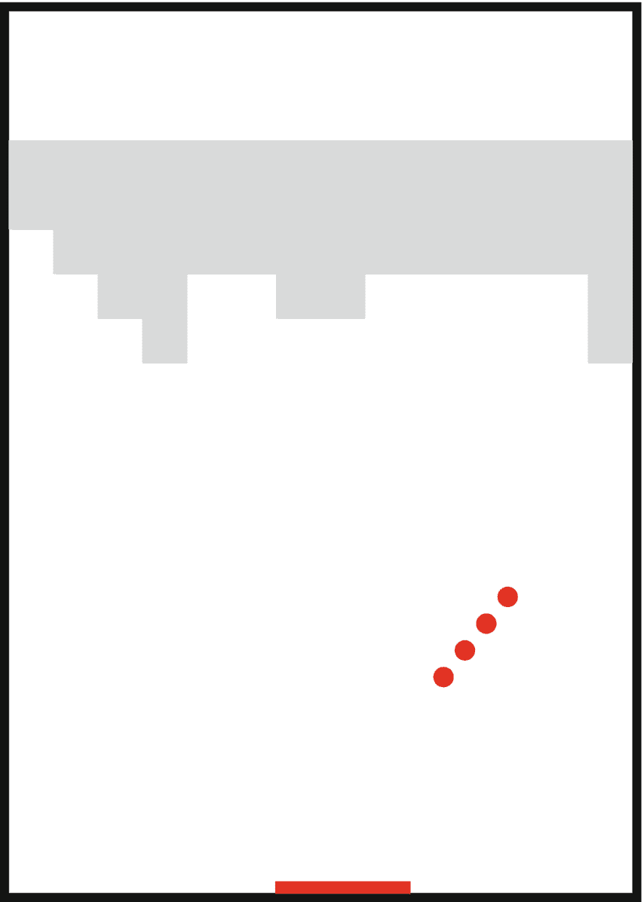

**图 7.19** Breakout 视频游戏中，在动作重复 `k=4` 后堆叠最后四帧的示例

### 训练流程的其他改动

在训练 DQN 智能体玩 Atari 游戏时，我们对训练流程进行了一些小的改动。其中一个特别的改动是，智能体从经验回放中采样小批量转换数据以执行学习步骤（我们将参数 `θ` 的一次更新计为一个学习步骤）的频率。在算法 3 中，只要缓冲区有足够的样本，智能体就会在每个时间步采样一个小批量。然而，由于 Atari 游戏可能持续数百万步（帧），从计算效率的角度来看，每一步都进行学习可能不是一个好主意；这也可能影响智能体的性能，因为它生成更多转换数据的时间更少了，这还可能导致神经网络对已有的经验数据过拟合。因此，DQN 智能体实际上采用了一种略有不同的学习计划：智能体每选择四个动作后，才执行一次学习步骤。这相当于每 16 帧学习一次，因为每个动作会重复执行四次。

图 7.21 展示了 DQN 智能体在 Atari 游戏 Pong 上的性能，这是 Atari 测试平台中最简单的游戏之一。结果显示了平均回合回报（总未折扣奖励）和 95% 的置信区间。为了评估智能体的性能，我们在一个独立的测试环境中运行了 200,000 个评估步骤，该环境使用 `ε`-贪婪策略，并在每次训练迭代（包含 250,000 个训练步骤或 100 万帧）结束时使用固定的探索 epsilon（`ε = 0.05`）。在评估环境中，不应用奖励裁剪或生命损失时的软终止。结果取五次独立运行的平均值，并使用窗口大小为 5 的移动平均进行平滑处理。

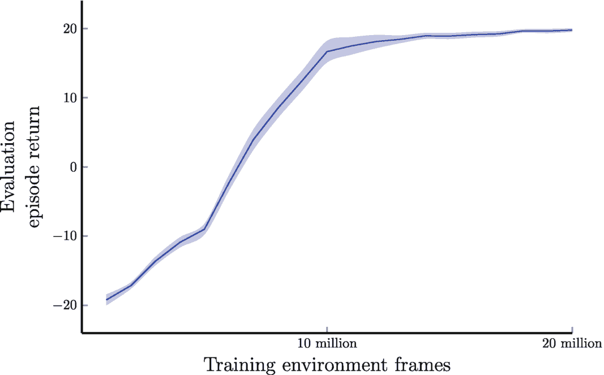

**图 7.21** DQN 智能体在 Atari Pong 上的表现。结果显示了平均回合回报（总未折扣奖励）和 95% 的置信区间。结果取五次独立运行的平均值，并使用窗口大小为 5 的移动平均进行平滑处理。

图 7.22 展示了 DQN 智能体在 Atari 游戏 Breakout 上的性能，这是一款比 Pong 稍具挑战性的游戏。我们使用了与 Pong 实验相同的设置和超参数。

图 7.23 展示了 DQN 智能体在 Atari 游戏 River Raid 上的性能，这是一款比 Pong 和 Breakout 更具挑战性的游戏。我们使用了与 Pong 实验相同的设置和超参数。我们可以看到，性能在前 2000 万帧内持续提升，然后在 2000 万到 3000 万帧之间趋于平稳。

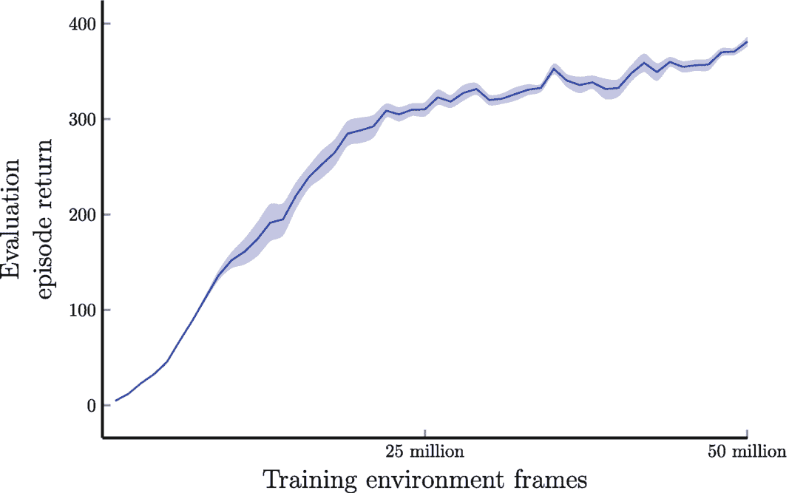

**图 7.22** DQN 智能体在 Atari Breakout 上的表现。结果显示了平均回合回报（总未折扣奖励）和 95% 的置信区间。结果取五次独立运行的平均值，并使用窗口大小为 5 的移动平均进行平滑处理。

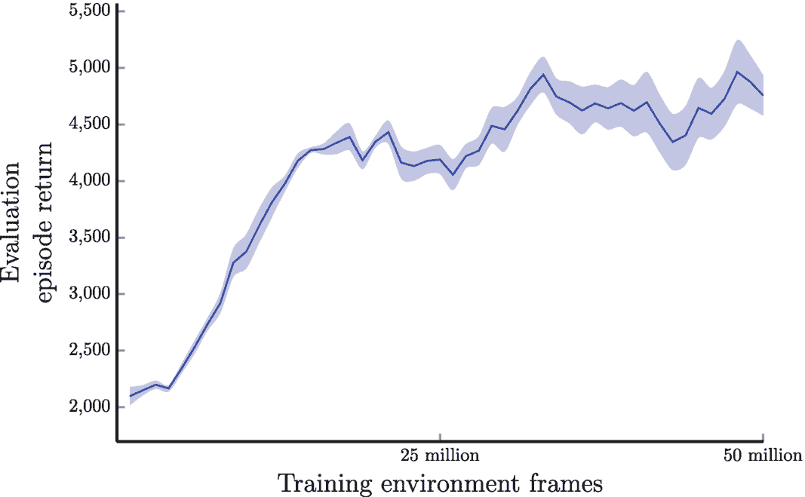

**图 7.23** 在 Atari 游戏《河内突袭》上的 DQN 智能体。结果显示了平均回合回报（总未折扣奖励）及 95% 置信区间。结果基于五次独立运行的平均值，并使用窗口大小为 5 的移动平均进行平滑处理。

### 7.7 本章小结

在本章中，我们基于上一章关于线性值函数逼近的讨论，深入探讨了神经网络作为强化学习（RL）中非线性值函数逼近器的应用。我们的重点是使用更具表达力的函数逼近器，这些逼近器能够有效捕捉复杂关系并处理高维状态空间。

**表 7.1** 训练 DQN 智能体的参数

| 超参数 | 值 | 描述 |
| --- | --- | --- |
| 帧宽度 | 84 | 游戏环境帧宽度 |
| 帧高度 | 84 | 游戏环境帧高度 |
| 灰度化 | 是 | 游戏环境帧使用灰度而非 RGB |
| 裁剪奖励 | 是 | 将环境奖励裁剪至 `[-1, 1]` 区间 |
| 失去生命即终止 | 是 | 将失去一条生命视为软终止状态；注意这并不会实际重置环境 |
| 最大无操作动作数 | 30 | 每个回合开始时执行的最大无操作（不做任何动作）次数 |
| 帧跳过 | 4 | 我们通过重复执行相同动作 k 次，确保智能体只看到游戏中的每第 k 帧 |
| 帧堆叠 | 4 | 堆叠最近的 k 帧 |
| 更新频率 | 4 | 从经验回放中采样并更新网络参数的频率，以智能体执行的动作选择次数衡量（如果不计算帧跳过，则为每 `4 × 4` 帧） |
| 目标网络更新频率 | 2500 | 更新目标网络参数的频率，以标准网络的参数更新次数衡量（算法中的参数 `C`） |
| 学习率 | 0.00025 | Adam 神经网络优化器的学习率 |
| 折扣率 | 0.99 | 折扣率 |
| 初始探索率 | 1 | 训练开始时的探索率 `ε` |
| 最小探索率 | 0.1 | 经过一定步数衰减后的最终（最小）探索率 `ε`；该最终值在训练过程中保持不变 |
| `ε` 衰减步数 | 1,000,000 | 探索率 `ε` 从初始值到最小值线性衰减所经历的步数或帧数 |
| 批量大小 | 32 | 训练期间从经验回放中采样用于更新网络参数的转换样本数量 |
| 回放缓冲区容量 | 1,000,000 | 将最近的 N 个转换样本存储到经验回放中 |

我们首先探讨了神经网络的架构和组成部分，强调了它们在建模非线性关系方面的卓越能力。神经网络凭借其从数据中学习的能力，为强化学习算法提供了一条令人兴奋的途径。接着，我们深入研究了神经网络的训练过程，涵盖了梯度下降和反向传播等主题。此外，我们还提供了一个使用 PyTorch 深度学习框架训练神经网络的最小示例。理解这些训练机制对于在强化学习环境中有效训练神经网络至关重要。

接下来，我们将重点转向使用神经网络进行策略评估。我们研究了在给定固定策略的情况下，如何利用神经网络来估计值函数。同时，我们引入了朴素深度 Q 学习的概念，讨论了如何将神经网络集成到 Q 学习算法中以逼近动作值函数。这种方法使强化学习智能体能够应对复杂环境并习得更复杂的策略。

此外，我们还介绍了对朴素深度 Q 学习算法的一项重要改进。我们研究了经验回放和目标网络的整合，这两者有助于稳定并改善学习过程。经验回放允许智能体从过去的经验中学习，减少了连续更新之间的相关性。另一方面，目标网络为 Q 值估计提供了一个固定目标，从而实现了更稳定、更可靠的学习。

最后，我们探讨了深度 Q 网络（DQN）在 Atari 游戏中的应用。我们展示了将神经网络与强化学习相结合，在解决视觉丰富且复杂的环境方面所取得的令人瞩目的成功。特别地，我们强调了 DQN 算法在众多 Atari 游戏中超越人类水平表现所取得的卓越成就。

总之，本章广泛探讨了神经网络作为强化学习中非线性值函数逼近器的强大能力。从理解其架构和训练过程，到其在值函数逼近中的应用，神经网络为推进强化学习算法提供了一条激动人心的路径。下一章将进一步深入探讨对标准 DQN 算法的改进，为构建更高效、更强大的强化学习智能体铺平道路。

脚注 1
