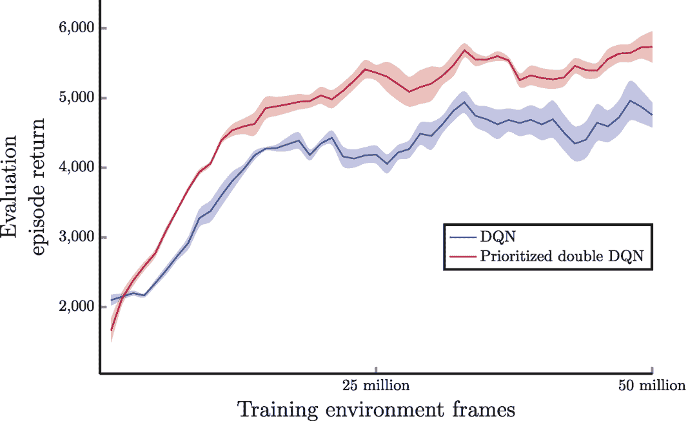
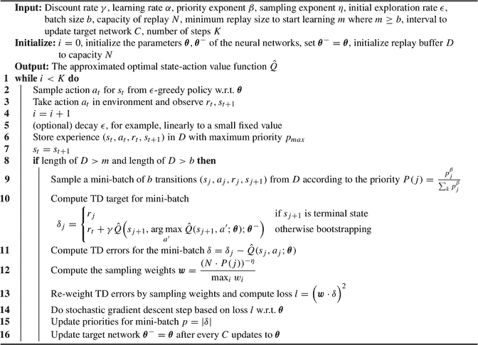
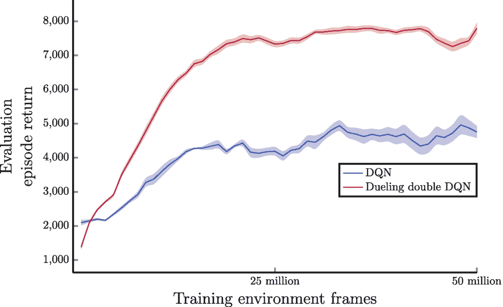

# 基于双 Q 学习的 DQN 算法

DQN（深度 Q 网络）是一种深度强化学习算法，在解决复杂决策问题方面取得了巨大成功。对标准 DQN 智能体的一种改进是采用双 Q 学习方法，该方法由 Hado Hasselt（2010）的研究证明是有效的[1]。

双 Q 学习是一种涉及学习两个状态-动作值函数`Q1`和`Q2`的方法，并使用略有不同的符号来计算 TD 目标。智能体随时间推移平等地学习这两个函数，并使用从一个 Q 网络（例如`Q1`）得出的最佳动作，从另一个 Q 网络（例如`Q2`）中选择后续状态-动作对的值。公式（8.1）展示了在表格情况下，当我们想要更新`Q1`时，双 Q 学习如何计算 TD 目标，其中它使用最佳动作`a'`作为选择器，从`Q2`中为后续状态`s_{t+1}`选取值。

```
TD_target = r_t + γ * Q2(s_{t+1}, argmax_{a'} Q1(s_{t+1}, a'))
```

(8.1)

然而，在 DQN 的情况下，我们已经有一个参数为`θ`的标准 Q 网络和一个参数为`θ^-`的目标网络。我们可以将这个目标网络`θ^-`用作第二个状态-动作值函数`Q2`，并对 TD 目标计算公式进行一些修改，以得到在 DQN 中使用双 Q 学习时的值更新规则。

然后，我们可以对公式（8.1）进行一些修改，得到在使用神经网络`θ, θ^-`作为`Q1, Q2`时如何计算 TD 目标的公式：

```
TD_target = r_t + γ * Q̂(s_{t+1}, argmax_{a'} Q̂(s_{t+1}, a'; θ); θ^-)
```

(8.2)

我们可以将使用神经网络`θ`和`θ^-`进行双 Q 学习的目标函数定义为 TD 目标与估计的状态-动作值之间的平方差。

```
J(θ) = (r_t + γ * Q̂(s_{t+1}, argmax_{a'} Q̂(s_{t+1}, a'; θ); θ^-) - Q̂(s_t, a_t; θ))²
```

(8.3)

由于标准 DQN 智能体会定期从标准 Q 网络更新目标网络的参数，使得`θ^- = θ`。我们实际上可以跳过像表格情况那样花费 50%的时间来学习第二个状态-动作值函数`Q2`的过程。现在我们可以介绍由 Hasselt 等人开发的基于双 Q 学习的 DQN 算法[2]。与标准 DQN 算法相比，整体流程相同；唯一的区别在于我们如何使用目标网络`θ^-`来计算 TD 目标。根据强化学习问题的不同，我们可能还需要增加`C`，即更新目标网络的间隔（例如，标准 DQN 设置的 2 到 3 倍）。

**算法 1：基于双 Q 学习、经验回放和ε-贪婪探索策略的 DQN 算法**

该算法初始化神经网络的`i`、`θ`、`θ^-`以及容量为`N`的回放缓冲区。然后采样动作、执行动作并存储经验。如果`D`的长度大于`m`和`b`，则采样大小为`b`的小批量转移样本，计算 TD 目标和损失以更新目标网络。

图 8.1 展示了基于双 Q 学习的 DQN 智能体与标准 DQN 智能体在 Atari River Raid 游戏上的性能。结果显示了平均回合回报（总未折扣奖励）和 95%置信区间。为了评估智能体的性能，我们在一个独立的测试环境中，使用ε-贪婪策略和固定的探索ε（`ε = 0.05`），在每个训练迭代（包含 250,000 个训练步或 100 万帧）结束时运行了 200,000 个评估步，其中评估环境未应用奖励裁剪或生命损失的软终止。结果取五次独立运行的平均值，并使用窗口大小为 5 的移动平均进行平滑处理。

**图 8.1** 基于双 Q 学习的 DQN 与标准 DQN 在 Atari 游戏 River Raid 上的对比。结果显示了平均回合回报（总未折扣奖励）和 95%置信区间。结果取五次独立运行的平均值，然后使用窗口大小为 5 的移动平均进一步平滑处理

本次实验我们使用学习率 0.00025、折扣率 0.99、批次大小 32 和回放容量 100,000。我们将`C`设置为 5000，即更新目标网络的间隔。图 8.1 展示了这两个智能体的回合回报（五次独立运行的平均值）。我们可以看到，使用基于双 Q 学习的 DQN 在收敛速度和训练稳定性方面获得了更好的性能。

### 8.2 优先经验回放

对标准 DQN 智能体的下一个改进来自如何从经验回放缓冲区中采样转换。当前的做法是，DQN 智能体从最近的 *N* 个转换中随机采样一个小批量的转换。然而，有理由认为回放缓冲区中的某些转换比其他转换更有价值。例如，一个转换可能包含智能体从未遇到过的状态，或者它可能具有更高的奖励信号。在这两种情况下，我们都希望智能体花更多时间学习这些有价值的转换，或者优先处理它们。但如何定义一个特定的转换比其他转换更有价值呢？

一种分配优先级的方法是使用转换的采样频率。采样次数较少的转换将比其他转换具有更高的优先级，而那些从未被采样过的转换将具有最高的优先级。这种方法背后的直觉是，我们应该更多地关注那些尚未用于更新网络参数的转换。然而，这种方法有其局限性，因为仅仅计算这些转换的使用次数并不总能反映它们的重要性或优先级。例如，智能体可能会过度使用新生成的转换，即使它已经学习了足够多的关于相似或相同情况的知识。我们希望智能体花更少的时间学习熟悉的转换，而将重点放在那些不熟悉且更有趣的转换上。

一种系统性地确定转换优先级的方法是使用 TD 误差 `δ`，如 Schaul 等人 [3] 所提出的。训练神经网络的目标是最小化这些误差，通常是平方误差。具有较大 TD 误差的转换应比具有较小 TD 误差的转换具有更高的优先级。提醒一下，如第 5 章所述，TD 误差定义为 TD 目标与当前估计值之间的差值。对于带有目标网络 `θ⁻` 的 DQN，我们可以为转换元组 `(s_t, a_t, r_t, s_{t+1})` 定义 `δ` 如下：

```
δ = TD_target - Q̂(s_t, a_t; θ)
  = r_t + γ * max_{a'} Q̂(s_{t+1}, a'; θ⁻) - Q̂(s_t, a_t; θ)
```

(8.4)

如果我们使用带有双重 Q 学习的 DQN，那么我们可以将 TD 误差 `δ` 定义为：

```
δ = TD_target - Q̂(s_t, a_t; θ)
  = r_t + γ * Q̂(s_{t+1}, argmax_{a'} Q̂(s_{t+1}, a'; θ); θ⁻) - Q̂(s_t, a_t; θ)
```

(8.5)

当智能体从回放缓冲区采样一个小批量转换来更新参数 `θ` 时，它会计算小批量中每个转换的 TD 误差，并相应地更新它们在回放缓冲区中的优先级。

然而，将这种方法与经验回放结合用于学习会引发一个重要问题。回放缓冲区中的某些转换可能很久以前由一个表现较差的智能体生成，因为 DQN 是离策略学习，并且我们在回放缓冲区中保存了大量历史转换，由于当时行为策略的影响，导致这些转换的 TD 误差较大。与此同时，随着智能体在预测不同状态-动作对的值方面变得更好，新生成的转换往往具有较小的 TD 误差。如果智能体仅根据优先级采样转换，它可能会倾向于使用具有较大 TD 误差的较旧转换，这可能导致过拟合。

为了解决这个问题，Schaul 等人 [3] 建议在采样过程中引入一些噪声。一种方法是使用比例优先级，其中采样第 *i* 个转换的概率基于该转换的优先级，记为 `p_i`，并乘以一个变量 `β` 的幂次。设置 `β = 0` 对应于均匀随机采样，所有转换被采样的机会均等。采样第 *i* 个转换的概率由下式给出：

```
P(i) = p_i^β / Σ_k p_k^β
```

(8.6)

然而，由于我们在采样过程中引入了噪声，在使用采样的小批量更新网络参数时，我们需要对此进行修正。一种方法是使用某种方法对 TD 误差项进行重新加权。对于优先回放，第 *i* 个转换的采样权重使用以下公式计算：

```
w_i = ( (1/N) * (1/P(i)) )^η
```

(8.7)

这里，*N* 是回放缓冲区中的总转换数，`η` 是一个控制我们想要修正 TD 误差项程度的变量。`η = 1` 表示我们希望完全修正它，而 `η = 0` 表示完全不修正。我们可以使用某种线性方法随着学习的进行来退火 `η`，例如原始论文中使用的从 0.4 到 1.0 的线性退火。

而采样权重向量 `w` 只是一个具有 *n* 个条目的列向量，其中 *n* 是小批量大小。

```
w = [ ( (1/N) * (1/P(0)) )^η ]
    [ ( (1/N) * (1/P(1)) )^η ]
    [         ...            ]
    [ ( (1/N) * (1/P(n)) )^η ]
```

(8.8)

在实践中，通常需要对采样权重 `w` 进行归一化，以实现稳定的训练过程。这是通过将权重除以所有样本中的最大权重值来实现的。这种归一化在公式 (8.9) 中表示：

```
w / max_i w_i
```

(8.9)

当生成新的转移时，我们需要确定其优先级。虽然我们可以使用与之前相同的方法计算优先级，但更常见的做法是为每个新转移分配一个预定义的优先级，例如 `1.0`。或者，我们也可以分配智能体在训练过程中迄今为止遇到的最大优先级。我们这样做是因为我们仍然偏向于新生成的转移，并希望智能体使用它们进行训练。然而，如果某个转移的优先级较低（即 TD 误差），它未来被采样的频率就会降低。此外，为所有新转移分配最大优先级可以节省计算资源，因为智能体通常会生成数百万个转移。

我们现在介绍针对双 Q 学习算法的 DQN 的比例优先级方法，该方法最初由 Schaul 等人提出 [3]。该算法基于我们本章前面介绍的双 Q 学习算法的 DQN。主要区别在于，当智能体在回放缓冲区中存储单个转移时，它会为其分配一个优先级值。默认情况下，此优先级值设置为迄今为止所见优先级中的最大值。

图 8.2 展示了优先级双 DQN 和标准 DQN 智能体在 Atari 游戏 River Raid 上的性能。结果显示了平均回合回报（总未折扣奖励）和 95% 置信区间。为了评估智能体的性能，我们在一个独立的测试环境中运行了 200,000 个评估步骤，该环境使用 `ε`-贪婪策略，并在每次训练迭代（包含 250,000 个训练步骤或 100 万帧）结束时使用固定的探索 epsilon（`ε = 0.05`），评估环境中不应用奖励裁剪或生命损失时的软终止。结果在五次独立运行中取平均值，并使用窗口大小为 5 的移动平均进行平滑处理。



一张图表绘制了评估回合回报与训练环境帧数的关系。图表呈现了两条上升趋势线，分别标注为 DQN 和优先级双 DQN。标注为优先级双 DQN 的线条呈现出更高的峰值。

**图 8.2** 在 Atari 游戏 River Raid 上，优先级双 DQN 与 DQN 的对比。结果显示了平均回合回报（总未折扣奖励）和 95% 置信区间。结果在五次独立运行中取平均值，然后使用窗口大小为 5 的移动平均进一步平滑。

**算法 2：** 使用优先级经验回放的双 DQN，采用 `ε`-贪婪策略进行探索

 一种算法，初始化神经网络的 `i`、`theta`、`theta minus` 以及容量为 `N` 的回放缓冲区。然后采样动作、执行动作并存储经验。如果 `D` 的长度大于 `m` 和 `b`，则采样包含 `b` 个转移的小批量，并计算 TD 目标、误差和采样权重以更新目标网络。

与双 DQN 实验类似，我们在本实验中使用学习率 `0.00025`、折扣率 `0.99`、批量大小 `32` 和回放容量 `100,000`。我们每 `5000` 次更新更新一次目标网络。

### 8.3 优势函数与决斗网络架构

由 Wang 等人 [4] 提出的优势函数和决斗网络架构是对标准 DQN 算法的另一项改进。

在强化学习中，对于给定策略 `π`，状态-动作值函数（记为 `Q_π`）用于确定在给定状态下应采取的最佳动作。最佳动作通过选择产生最高状态-动作值的动作来确定，即 `argmax_a Q_π(s, a)`。然而，这并不能提供某个动作相比其他动作好多少的信息。为了解决这个问题，Baird 于 1993 年引入了优势函数。优势函数衡量智能体在给定状态 `s` 下采取特定动作 `a` 所获得的增益或优势。优势函数通过从状态-动作值 `Q_π(s, a)` 中减去状态值 `V_π(s)` 来计算，如公式 (8.


# 决斗网络架构

决斗网络架构可以与标准 DQN 或双 DQN 算法结合使用，以在训练过程中采样小批量转换并更新网络参数。它也可以与优先经验回放结合使用，后者根据转换的估计时序差分误差对其进行优先级排序，以提高学习效率。

## 图 8.4

图 8.4 展示了决斗双 DQN 和 DQN 智能体在 Atari 游戏《河攻》上的性能。结果显示了平均回合回报（总未折扣奖励）和 95% 的置信区间。为了评估智能体的性能，我们在一个独立的测试环境中，使用 `\epsilon`-贪心策略和固定的探索 epsilon（`\epsilon = 0.05`），在每个训练迭代（包含 250,000 个训练步骤或 100 万帧）结束时运行了 200,000 个评估步骤。评估环境中未应用奖励裁剪或生命损失时的软终止。结果取五次独立运行的平均值，并使用窗口大小为 5 的移动平均进行平滑处理。



一张图表绘制了评估回合回报与训练环境帧数的关系。它呈现了两条上升趋势线，分别标注为 DQN 和决斗双 DQN。标注为决斗双 DQN 的线条峰值更高。

**图 8.4 决斗双 DQN 与 DQN 在 Atari 游戏《河攻》上的对比。结果显示了平均回合回报（总未折扣奖励）和 95% 的置信区间。结果取五次独立运行的平均值，然后使用窗口大小为 5 的移动平均进行进一步平滑处理**

### 8.4 小结

在本章中，我们探讨了对标准 `DQN` 智能体的若干改进，以解决其局限性。尽管 `DQN` 智能体在雅达利游戏中达到了人类水平的表现，但在面对更复杂、更困难的游戏时仍面临挑战。通过融入这些改进，研究人员证明了智能体整体性能的显著提升。

我们首先介绍了针对 `DQN` 的双 Q 学习，这是一种直接且简单的改进方法。双 Q 学习最初由 Hado Hasselt [1] 提出，后来被应用于 `DQN` [2]，有助于减轻与 Q 学习相关的最大化偏差。通过将双 Q 学习集成到 `DQN` 智能体中，我们观察到了显著的性能提升。

接下来，我们深入探讨了 Schaul 等人 [3] 提出的优先经验回放概念。该技术强调使用更重要的转换来训练智能体，而非均匀采样经验。这种方法优先处理紧急的转换，有助于改善学习效果。

此外，我们还讨论了优势函数及其在标准 `DQN` 智能体神经网络架构中的整合。这引出了对 `DQN` 智能体决斗网络架构的讨论，该架构展现出卓越的性能提升，这一想法最初由 Wang 等人 [4] 提出。

在实践中，本章讨论的所有改进方法被结合起来，以创建一个显著更强大的智能体。值得注意的是，除了这里提到的改进之外，还存在许多其他改进。例如，N 步回报（自举）方法 [5] 的改编，以及使用神经网络预测状态-动作值分布而非单一值 [6, 7] 的探索，也引起了人们的关注。

本章结束了本书的第二部分，该部分我们专注于值函数逼近，特别是使用神经网络进行非线性值函数逼近。虽然第一部分和[第二部分](https://doi.org/10.1007/978-1-4842-9606-6_II)都强调了基于值的方法（例如学习状态-动作值函数），但下一章将把我们的焦点转向基于策略的方法，这是解决强化学习问题的另一种同样强大的技术。
