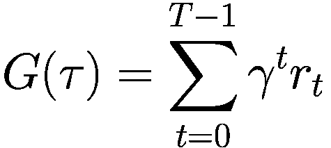
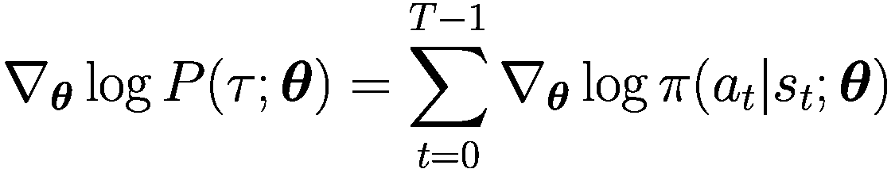
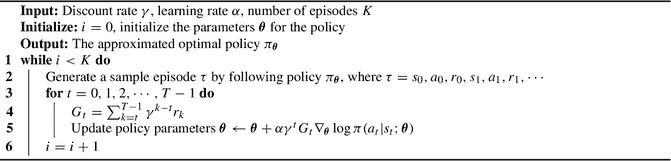
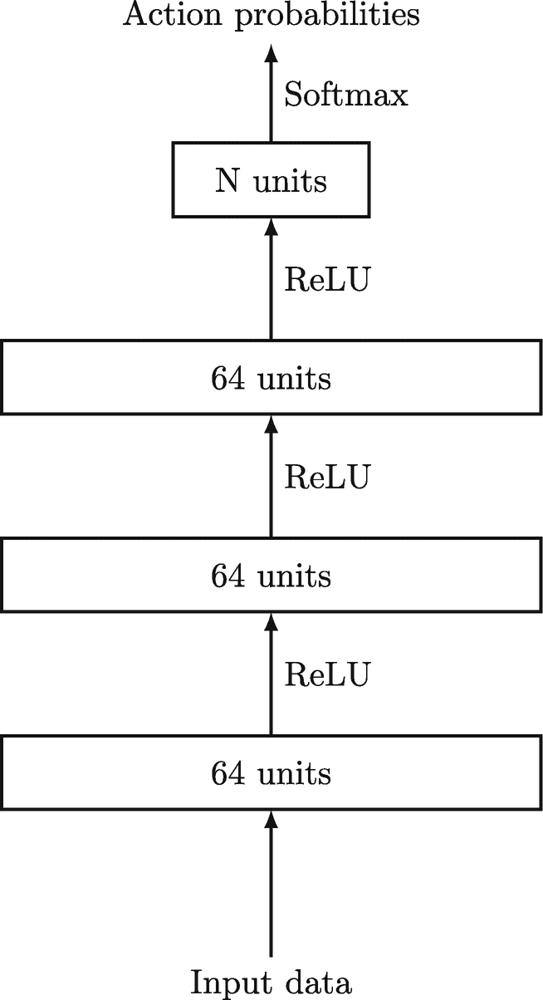
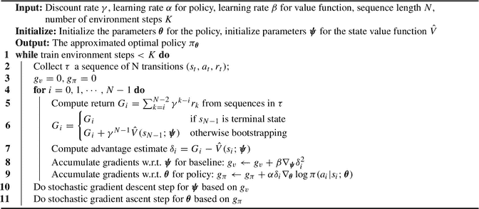
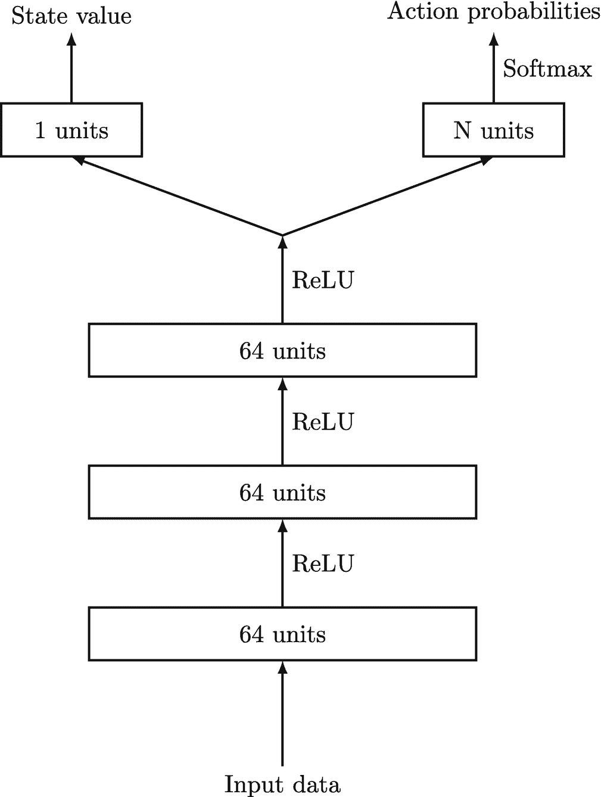
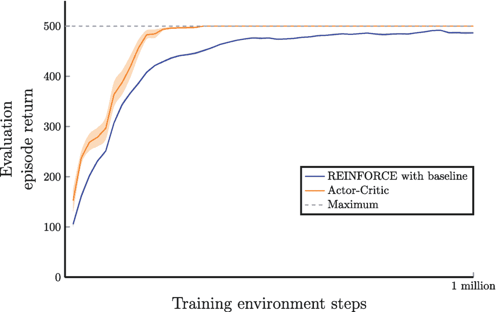

# 9. 策略梯度方法

在本章中，我们将探讨基于策略的方法，这是强化学习算法家族中的另一类。在前面的章节中，我们专注于基于值的方法，这些方法估计最优状态-动作值函数。对于大型状态或动作空间，基于值的方法在计算上可能变得昂贵，并且在环境动态具有随机性的环境中可能难以应对。

另一方面，基于策略的方法直接学习最优策略，而无需估计状态-动作值函数。我们通常使用近似技术来参数化策略，例如神经网络，并使用策略梯度来更新参数。策略梯度衡量期望回报随策略参数变化的变化程度。通过优化策略参数以增加期望回报，基于策略的方法学会采取能最大化奖励的动作。

基于策略的方法相比基于值的方法有几个优势。首先，它们可以处理连续且高维的动作空间，而基于值的方法可能难以应对。其次，它们可以学习随机策略，这在存在不确定性或多种良好动作的环境中非常有用。

总之，基于策略的方法为强化学习提供了一种替代途径，能够处理大型、连续的动作空间。像 `REINFORCE` 和 Actor-Critic 这样的策略梯度算法提供了直接从经验中学习最优策略的强大方法，并且可以与其他方法结合以进一步提高性能。

### 9.1 基于策略的方法

到目前为止，本书仅介绍了基于价值的强化学习算法。这些算法旨在通过蒙特卡洛方法或时序差分学习方法，学习最优策略 `π*` 的最优状态-动作价值函数 `Q*`。然后，我们可以基于学习到的最优状态-动作价值函数构建一个确定性或贪婪策略。然而，最终目标是学习最优策略 `π*`，这正是智能体在与环境交互时做出决策所需要的。智能体能否在不先学习价值函数的情况下，直接学习最优策略呢？

答案是肯定的。基于策略的方法允许我们学习一个参数化的策略，该策略由一组通过训练优化的参数表示，而非显式定义。在本节中，我们将探讨如何使用策略梯度方法来学习这样的策略。

在深入探讨策略近似和策略梯度方法之前，我们先来看看直接学习参数化策略，而非从学习到的价值函数中推导策略的一些优势：

- **更好的收敛性**：对于某些问题，基于价值的强化学习方法在训练过程中可能会发生振荡，而基于策略的方法通常具有更平滑的学习曲线，从而带来更好的收敛特性。

- **随机策略**：学习到的策略可以是随机的，这意味着它可以输出一个关于可用动作的概率分布。这与基于价值的方法不同，后者通常会产生一个总是选择最高价值动作的确定性策略。虽然可以通过使用 `ε`-贪婪策略等方法为确定性策略增加随机性，但这与学习一个具有动作比例分布的随机策略并不相同。学习到的随机策略在最优策略涉及以不同概率采取不同动作的情况下尤其有用，例如当智能体面对随机或部分可观测的环境时。

- **探索**：无需显式使用 `ε`-贪婪策略进行探索，因为随机策略的本质已经实现了这一点。学习到的随机策略可以引导智能体采取一系列动作，包括次优动作，并帮助智能体发现最优策略。

- **高效处理大型动作空间**：基于策略的方法更适合处理具有大型动作空间的问题，甚至是连续动作空间。基于价值的方法需要找到价值最高的动作，而在大量动作上计算这个最大值操作可能计算成本高昂。当动作空间无限时（例如连续动作空间的问题），这尤其麻烦。

在强化学习中，基于策略的方法相比基于价值的方法具有若干优势，例如能够学习一个为动作分配概率而非总是选择最高价值动作的随机策略。这在最优策略可能涉及以不同概率采取不同动作的情况下特别有用，例如当动作结果存在不确定性或最优策略随时间变化时。在存在多个最优策略或智能体需要考虑其他智能体行为的问题中，随机策略也很有价值。

例如，在存在隐藏信息或虚张声势的游戏中，如扑克或其他纸牌游戏，随机策略特别有用，因为智能体无法看到对手的牌。在这种情况下，最优策略可能涉及为不同动作分配不同概率，而不是始终遵循确定性策略。同样，在围棋等游戏中，最优策略可能取决于对手的策略或意图，而这些可能是不确定或随时间变化的，此时随机策略就具有优势。

此外，基于策略的方法更适合连续动作空间，因为它们可以学习输出一个关于动作空间的概率分布，而不是试图找到单个最高价值的动作。这在具有大型或无限动作空间的问题中更容易处理，因为智能体可以根据策略输出的概率分布来探索和选择动作。另一方面，基于价值的方法可能难以找到无限动作空间的最大值，或者难以高效地探索大型动作空间。此外，基于价值的方法通常依赖于对动作空间进行离散化，这可能导致信息丢失并降低算法的有效性。基于策略的方法可以通过直接参数化策略来避免这个问题，从而能够考虑智能体可用的全部动作范围。

然而，值得注意的是，基于策略的方法也有一些缺点。例如，它们可能比基于价值的方法计算成本更高，并且可能在处理高维状态空间时遇到困难。此外，基于策略的方法可能更难训练，并且可能需要更多数据才能收敛到最优策略。

总之，基于策略的方法相比基于价值的方法具有若干优势，包括能够学习随机策略，这在存在多个最优策略、随机或部分可观测环境、或连续或大型动作空间的问题中特别有用。尽管如此，基于策略和基于价值的方法各有优缺点，选择哪种方法将取决于具体问题。

#### 策略近似

在强化学习中，策略是一个将状态映射到整个动作空间上概率分布的函数。与价值函数近似类似，我们可以使用参数化函数来近似策略。通过这样做，我们可以在无需先显式学习最优价值函数的情况下，学习到一个在给定环境中表现良好的策略。

为了使用参数化函数表示策略，我们可以使用带有参数 `θ` 的线性或非线性函数。然而，由于策略的输出必须是一个概率分布，我们需要确保它满足概率分布的性质，即非负性。

确保策略输出为有效概率分布的一种常见解决方案是使用 softmax 函数。对于具有离散动作空间的强化学习问题，可以使用 softmax 函数来获得有效动作上的概率分布。softmax 函数的定义如下：

```
π(a|s; θ) = exp(φ(s,a)ᵀθ) / Σ_{a' ∈ A} exp(φ(s,a')ᵀθ)   (9.1)
```

这里，`φ(s,a)` 是一个特征向量或函数，它将状态和动作映射到实值特征。softmax 函数获取当前状态下每个动作的偏好值 `φ(s,a)ᵀθ`，并对其取指数以获得正值。然后，将得到的值除以所有有效动作的指数化偏好值之和进行归一化，从而确保 softmax 函数的输出是一个非负的概率分布。

例如，考虑一个试图在迷宫中导航的机器人。机器人的当前状态是它在迷宫中的当前位置，其可能的动作是向上、向下、向左或向右移动。机器人的策略是一个函数，将其当前位置映射到这四种动作上的概率分布。通过使用带有参数化特征函数 `φ(s,a)` 的 softmax 函数，我们可以学习到一个使机器人能够高效导航迷宫的策略。

对于具有连续动作空间的强化学习问题，可以使用高斯函数来获得动作空间上的概率分布。高斯函数的定义如下：

```
π(a|s; θ) = (1 / (√(2π)σ(s))) * exp(-(a - μ(s,θ))² / (2σ²(s)))   (9.2)
```

这里，`μ(s,θ)` 是高斯分布的均值，`σ(s)` 是标准差，`a` 是某个动作。高斯函数将分布的均值和标准差作为输入，并生成一个动作空间上的概率密度函数（PDF）。为了获得概率分布，我们可以对有效动作空间上的概率密度函数进行积分，使得总概率为 1。

例如，考虑一个试图在三维空间中飞到特定位置的无人机。无人机的当前状态是其当前位置和速度，其可能的动作是在三个维度上改变速度。无人机的策略是一个函数，将其当前状态映射到这些连续动作上的概率分布。通过使用带有参数化均值函数 `μ(s,θ)` 和标准差函数 `σ(s)` 的高斯函数，我们可以学习到一个使无人机能够平稳地在三维空间中导航并高效到达目的地的策略。

类似地，我们也可以使用神经网络来近似策略。如图 9.1 所示，网络接收环境状态作为输入，并为所有有效动作输出一个动作概率分布。

总之，策略近似是强化学习中的一项重要技术，它使我们能够在无需先显式学习最优价值函数的情况下，学习到一个在给定环境中表现良好的策略。通过使用参数化函数来表示策略，我们可以利用 softmax 或高斯函数来确保策略的输出是一个有效的概率分布。这些函数分别特别适用于离散或连续动作空间的问题，并且可以应用于从迷宫导航到无人机飞行的广泛现实世界问题。

### 9.2 策略梯度

在强化学习中，神经网络可用于近似值函数和策略。然而，基于值的方法使用贝尔曼方程来定义给定策略下值函数的更新规则，但对于由`θ`参数化的策略，并没有类似的等价方法。这意味着，为了使用梯度方法寻找策略的最优参数，我们首先需要定义一个衡量其性能的目标函数。本节受艾玛·布伦希尔教授在其全面的强化学习课程中的杰出工作启发，推导策略梯度的方程 [[1]](#605748_1_En_9_Chapter.xhtml#CR1)。

在情节式强化学习设定中，我们可以通过从初始状态`s0`开始的期望总回报来衡量策略`π_θ`的性能。我们可以将由`θ`参数化的策略值定义为`V_π_θ(s0)`。我们的目标是找到最大化该值的参数`θ`，因此可以将目标函数定义为

```
J(θ) = V_π_θ = V_π_θ(s0)
```

(9.3)

现在，我们的任务变成了一个标准的优化问题：我们需要找到使`J(θ)`最大化的`θ`。我们可以使用梯度上升法来实现这一点。与用于最小化某个目标函数的梯度下降不同，梯度上升是沿着函数最陡上升方向迈步。在这种情况下，我们沿着`J(θ)`的梯度方向迈出步长为`α`的一步：

```
θ = θ + α ∇_θ J(θ)
```

(9.4)

梯度`∇_θ J(θ)`告诉我们，为了增加目标函数的值，需要调整每个参数`θ_i`的程度。通过使用公式 (9.4) 反复更新参数，我们可以收敛到最大化期望总回报的最优策略参数。

为了比较不同策略的性能，我们可以使用状态值函数`V_π(s)`，它衡量的是从状态`s`开始并遵循策略`π`时的期望总回报。对于任意两个策略`π`和`π'`，如果对于所有状态`s`，都有`V_π'(s) ≥ V_π(s)`，我们就说`π'`与`π`一样好或更好。通过仅关注初始状态`s0`，这个概念可以扩展到情节设定中。

让我们展开策略`π_θ`的值函数。我们知道，状态值`s0`就是从初始状态`s0`开始并遵循策略`π_θ`直到达到终止状态`s_T`时的期望回报`G_t`（其中`t=0`）（我们只关注情节式情况）。因此，`π_θ`的值可以写为

```
V_π_θ = V_π_θ(s0) = E_π_θ[ G_t | s_t = s0 ]
```

(9.5)

我们知道，一个情节序列`τ`的回报是折扣奖励的总和`G(τ) = r0 + γ r1 + γ² r2 + ... + γ^(T-1) r_(T-1)`（针对情节式情况）。公式 (9.5) 中的期望符号提醒我们，智能体在环境中行动时的行为以及环境的动态特性将极大地影响智能体在一个情节序列过程中所能获得的总奖励。这意味着任意情节序列的回报`G(τ)`受两个因素影响：智能体遵循的策略`π_θ`以及环境的动态特性。为简单起见，我们用`τ`表示单个情节的状态、动作和奖励序列，其中

```
τ = s0, a0, r0, s1, a1, r1, ..., s_(T-1), a_(T-1), r_(T-1), s_T
```

然后我们用`G(τ)`表示整个情节序列`τ`的折扣奖励总和，其中



我们使用 `$P(\tau ; \boldsymbol {\theta })$` 来表示智能体在遵循策略 `$\pi _{\boldsymbol {\theta }}$` 时获得任意情节序列 `$\tau $` 的概率。具体来说，`$P(\tau ; \boldsymbol {\theta })$` 是序列中每个时间步 *t* 下，在策略下选择动作的概率 `$\pi (a_t|s_t; \boldsymbol {\theta })$` 与状态转移概率 `$P(s_{t+1}|s_t, a_t)$` 的乘积。该序列的概率是通过将所有时间步的这些概率相乘，并乘以特定初始状态 `$s_0$` 的起始概率（我们将其表示为 `$\mu (s_0)$`）得到的。因此，我们可以利用 `$P(\tau ; \boldsymbol {\theta })$` 和整个情节序列的折扣奖励总和 `$G(\tau )$`，将策略 `$\pi _{\boldsymbol {\theta }}$` 的价值方程重写为公式 (9.6) 所示：

![$\displaystyle \begin{aligned} V_{\pi_{\boldsymbol{\theta}}} = \mathbb{E}_{\pi_{\boldsymbol{\theta}}\!\!}\left[ G(\tau) \right] = \sum_{\tau} P(\tau; \boldsymbol{\theta}) G(\tau) {} \end{aligned} $](images/605748_1_En_9_Chapter/605748_1_En_9_Chapter_TeX_Equ6.png)

(9.6)

这里，`$G(\tau )$` 是整个情节序列的折扣奖励总和，如前所述，`$G(\tau ) = \sum _{t=0}^{T-1} {\gamma }^t r_t$`。这个公式很重要，因为它使我们能够计算策略的价值，这是强化学习中的一个关键概念。

然后，策略的目标函数 `$J(\boldsymbol {\theta })$` 可以使用公式 (9.6) 中的项来写出。具体来说，`$J(\boldsymbol {\theta })$` 表示策略 `$\pi _{\boldsymbol {\theta }}$` 的期望回报，我们希望通过最大化它来找到最佳策略。为了计算关于 `$\boldsymbol {\theta }$` 的梯度，我们使用了似然比技巧，这是概率论中一个著名的结果，在强化学习中经常被使用。具体来说，我们有

![$\displaystyle \begin{aligned} \nabla_{\boldsymbol{\theta}}J(\boldsymbol{\theta}) &amp; = \nabla_{\boldsymbol{\theta}} \mathbb{E}_{\pi_{\boldsymbol{\theta}}\!\!}\left[ G(\tau) \right]\notag \\ &amp; =\mathbb{E}_{\pi_{\boldsymbol{\theta}}\!\!}\left[ \nabla_{\boldsymbol{\theta}} G(\tau) \right]\notag \\ &amp; =\mathbb{E}_{\pi_{\boldsymbol{\theta}}\!\!}\left[ \frac{P(\tau; \boldsymbol{\theta})}{P(\tau; \boldsymbol{\theta})} \nabla_{\boldsymbol{\theta}} G(\tau) \right]\notag \\ &amp; =\mathbb{E}_{\pi_{\boldsymbol{\theta}}\!\!}\left[ G(\tau) \frac{\nabla_{\boldsymbol{\theta}}P(\tau; \boldsymbol{\theta})}{P(\tau; \boldsymbol{\theta})}


![$$\displaystyle \begin{aligned} \nabla_{\boldsymbol{\theta}} \log P(\tau; \boldsymbol{\theta}) &amp; = \nabla_{\boldsymbol{\theta}} \log \left[ \mu(s_0) \cdot \prod_{t=0}^{T-1} \pi (a_t|s_t; \boldsymbol{\theta}) \cdot \prod_{t=0}^{T-1} P(s_{t+1}|s_t, a_t)\right]\notag \\ &amp; = \nabla_{\boldsymbol{\theta}} \log \mu(s_0) + \nabla_{\boldsymbol{\theta}} \log \prod_{t=0}^{T-1} \pi (a_t|s_t; \boldsymbol{\theta}) + \nabla_{\boldsymbol{\theta}} \log \prod_{t=0}^{T-1} P(s_{t+1}|s_t, a_t) \notag \\ &amp; = \nabla_{\boldsymbol{\theta}} \log \mu(s_0) + \sum_{t=0}^{T-1} \nabla_{\boldsymbol{\theta}} \log \pi (a_t|s_t; \boldsymbol{\theta}) + \sum_{t=0}^{T-1} \nabla_{\boldsymbol{\theta}} \log P(s_{t+1}|s_t, a_t) {} \end{aligned} $$](images/605748_1_En_9_Chapter/605748_1_En_9_Chapter_TeX_Equ10.png)

(9.9)

在式(9.9)中，我们可以看到第一项`∇_θ log μ(s0)`不依赖于`θ`。这允许我们将其视为常数。因此，根据基础微积分，我们知道对常数的梯度为零。类似地，最后一项`∑_{t=0}^{T-1} ∇_θ log P(s_{t+1}|s_t, a_t)`也独立于`θ`，因为环境的动态不受`θ`变化的影响。因此，我们可以将`∇_θ log P(τ; θ)`关于`θ`的梯度简化为：



(9.10)

总之，我们可以通过将第一项和最后一项视为常数来简化式(9.9)中的梯度。这得到了式(9.10)中所示的简化梯度。

将上述结果代入式(9.7)，我们得到关于`θ`计算梯度（针对回合情况）的最终方程：

![$$\displaystyle \begin{aligned} \nabla_{\boldsymbol{\theta}}J(\boldsymbol{\theta}) &amp; = \mathbb{E}_{\pi_{\boldsymbol{\theta}}\!\!}\left[ G(\tau) \nabla_{\boldsymbol{\theta}} \log P(\tau; \boldsymbol{\theta}) \right]\notag \\ &amp; = \mathbb{E}_{\pi_{\boldsymbol{\theta}}\!\!}\left[ G(\tau) \sum_{t=0}^{T-1} \nabla_{\boldsymbol{\theta}} \log \pi (a_t|s_t; \boldsymbol{\theta}) \right] \notag \\ &amp; = \mathbb{E}_{\pi_{\boldsymbol{\theta}}\!\!}\left[ \sum_{t=0}^{T-1} G(\tau) \nabla_{\boldsymbol{\theta}} \log \pi (a_t|s_t; \boldsymbol{\theta}) \right] \notag \\ &amp; = \mathbb{E}_{\pi_{\boldsymbol{\theta}}\!\!}\left[ \sum_{t=0}^{T-1} \left( \sum_{k=0}^{T-1} {\gamma}^k r_k \right) \nabla_{\boldsymbol{\theta}} \log \pi (a_t|s_t; \boldsymbol{\theta}) \right] \notag \\ &amp; = \mathbb{E}_{\pi_{\boldsymbol{\theta}}\!\!}\left[ \sum_{t=0}^{T-1} {\gamma}^t G_t \nabla_{\boldsymbol{\theta}} \log \pi (a_t|s_t; \boldsymbol{\theta}) \right] {} \end{aligned} $$](images/605748_1_En_9_Chapter/605748_1_En_9_Chapter_TeX_Equ12.png)

(9.11)

式(9.11)中策略梯度背后的直觉是，我们希望增加`π(a_t|s_t; θ)`的概率（或对数似然），其增加比例与该动作的实际表现（即智能体在执行该动作后获得的奖励大小）成正比。

为了去掉式(9.11)中的期望符号，我们可以使用随机梯度上升方法，对通过蒙特卡洛方法生成的回合序列计算样本梯度。这样，式(9.11)就变成了我们可以解析计算的形式。

例如，如果我们使用线性方法来构建 softmax 策略分布（如式(9.1)所示）的动作偏好`φ(s, a)^T θ`，那么策略梯度`∇_θ log π(a|s; θ)`变为：

![$$\displaystyle \begin{aligned} \nabla_{\boldsymbol{\theta}} \log \pi (a|s; \boldsymbol{\theta}) &amp; = \nabla_{\boldsymbol{\theta}} \log e^{\phi(s, a)^T \boldsymbol{\theta}} - \nabla_{\boldsymbol{\theta}} \log \left( \sum_{b \in \mathcal{A}(s)} e^{\phi(s, b)^T \boldsymbol{\theta}} \right) \notag \\ &amp; = \nabla_{\boldsymbol{\theta}} \Bigl( \phi(s, a)^T \boldsymbol{\theta} \Bigr) - \frac{\nabla_{\boldsymbol{\theta}} \sum_b e^{\phi(s, b)^T \boldsymbol{\theta}}}{\sum_b e^{\phi(s, b)^T \boldsymbol{\theta}} }\notag \\ &amp; = \phi(s, a) - \frac{\sum_b \phi(s, b) e^{\phi(s, b)^T \boldsymbol{\theta}}}{\sum_b e^{\phi(s, b)^T \boldsymbol{\theta}} } \notag \\ &amp; = \phi(s, a) - \sum_b \pi(b|s; \boldsymbol{\theta}) \phi(s, b) {} \end{aligned} $$](img/605748_1_En_9_Chapter_TeX_Equ13.png)

(9.12)

#### 策略梯度定理

由 Sutton 等人提出的策略梯度定理[2]是强化学习中的一项基础性成果，它提供了一种计算性能目标相对于策略参数梯度的方法。该定理是优化强化学习问题中策略的关键工具，尤其在深度强化学习领域。

策略梯度定理指出：对于任意可微策略`π(a|s; θ)`，性能目标`J(θ)`关于`θ`的梯度（无折扣情况下）由下式给出：

```
∇_θ J(θ) = E_π_θ [ Q_π_θ (s_t, a_t) ∇_θ log π(a_t|s_t; θ) ]
```

(9.13) 其中`Q_π_θ(s, a)`是策略`π_θ`的状态-动作值函数，`∇_θ log π(a|s; θ)`是策略的得分函数。得分函数本质上是策略对数关于策略参数的导数：

```
∇_θ log π(a|s; θ) = ∇_θ π(a|s; θ) / π(a|s; θ)
```

(9.14)

公式(9.13)的正式证明比公式(9.11)的推导更为复杂（可参考 Sutton 和 Barto 所著《强化学习导论》第 13.2 章[3]）。不过，我们可以将策略梯度定理视为公式(9.11)的广义版本，其中我们将样本回报`G_t`替换为状态-动作值函数`Q_π_θ(s_t, a_t)`。这种替换之所以可行，是因为本质上`G_t`和`Q_π_θ(s_t, a_t)`衡量的是同一件事：期望回报。

对于情节式和连续式强化学习问题，我们可以将性能目标定义为：

```
∇_θ J(θ) = E_π_θ [ Σ_{t=0}^{∞} γ^t Q_π_θ (s_t, a_t) ∇_θ log π(a_t|s_t; θ) ]
```

(9.15)

请注意，公式(9.13)和(9.15)是非常强大的结果，因为它们允许我们直接使用基于梯度的优化方法来优化策略。在实践中，我们通过与环境交互收集样本，并利用蒙特卡洛方法等技术来估计策略梯度。

### 9.3 REINFORCE 算法

在本节中，我们将介绍 REINFORCE 算法，这是为解决强化学习问题而开发的最早的策略梯度算法之一。该算法最初由 Williams 于 1992 年提出[4]。

REINFORCE 是一种用于解决情节式问题的同策略、无模型、离线学习算法。该算法采用蒙特卡洛方法生成样本情节序列。在每个情节结束时，算法使用公式(9.16)给出的规则更新策略参数：

```
θ ← θ + α γ^t G_t ∇_θ log π(a_t|s_t; θ)
```

(9.16)

值得注意的是，与基于值的方法不同，在 REINFORCE 中我们不需要使用`ε`-贪婪策略来鼓励探索。在训练过程中，智能体根据动作空间中每个动作的概率，按照`a ~ π_θ`采样动作，而不是遵循`ε`-贪婪策略来做决策。这种随机采样方法作为一种探索形式，使智能体能够学习哪些动作最有效。随着训练的进行，智能体更频繁地采样最佳动作，而较少采样最差动作。训练完成后，可以通过始终选择概率最高的动作，让训练好的智能体以确定性方式行动。但这应取决于具体问题，因为真正的最优策略可能是随机的。

**算法 1：REINFORCE 算法**

 一个名为 REINFORCE 的 6 行算法，接收以下输入，输出近似最优策略`π_θ`。折扣率`γ`，学习率`α`，情节数`K`。

在实践中，如果我们使用神经网络来近似策略，并利用深度学习软件执行随机梯度上升步骤，那么我们需要做的就是计算策略梯度损失，即样本回报`G_t`与动作概率对数似然`log π(a_t|s_t; θ)`的乘积，然后将该损失输入到某个神经网络优化器（如 SGD 或 Adam）中以更新参数。值得一提的是，默认情况下，大多数优化器被设计为最小化某个目标函数（如最小化 MSE 或平方误差），因此在实际操作中，我们通常为策略梯度计算*负*对数似然`-log π(a_t|s_t; θ)`，这样当我们使用这些工具更新神经网络参数时，实际上执行的是梯度上升（因为`y = x - (-b) = x + b`），而非梯度下降。

图 9.2 展示了一个简单的策略网络神经网络架构。该架构由多个全连接层组成，每个层后接一个非线性激活函数。神经网络的最终输出是动作空间中所有动作的预测概率。

#### 注意

请注意，本示例针对非常简单的强化学习问题而设计。在实践中，架构可以更加复杂，包含多层结构、跳跃连接以及其他先进技术，以提升强化学习智能体的性能。因此，应根据问题的具体需求和可用资源，仔细考虑为策略网络选择合适的架构。



神经网络架构的流程图如下所示：输入数据，经过 64 个单元，再通过`ReLU`连接至 64 个单元，再通过`ReLU`连接至 64 个单元，再通过`ReLU`连接至`N`个单元，最后通过`Softmax`输出动作概率。

**图 9.2** 策略网络神经网络架构的简单示例

### 9.4 带基线的 REINFORCE 算法

我们在上一节介绍的 REINFORCE 算法在训练过程中可能存在高方差问题，这会导致算法运行缓慢且效率低下。方差产生的原因是算法使用蒙特卡洛方法来估计回报，而不同回合之间的回报可能差异显著。为了解决这个问题，我们可以引入一个基线值 `b(s)`，将其从估计回报中减去，以降低方差。

基线值 `b(s)` 可以是任何不依赖于动作的函数。例如，我们可以使用一个常数或状态 `s` 的函数。通过从估计回报中减去基线值，我们可以减少奖励信号中随机波动的影响。

带基线函数 `b(s)` 的 REINFORCE 算法的参数更新规则为：

```
θ = θ + α γ^t ( G_t - b(s_t) ) ∇_θ log π(a_t|s_t; θ)
```

(9.17)

该公式也被称为*原始策略梯度算法*的参数更新规则。我们可以用任何适合降低方差的函数来替换 `b(s_t)`。

基线函数的一个常见选择是状态价值函数 `V_{π_θ}(s_t)`，它衡量的是从状态 `s_t` 出发，遵循策略 `π_θ` 时的期望回报。在实践中，我们通常使用本书第二部分介绍的价值函数近似方法来学习 `V_{π_θ}(s_t)` 的估计值。这涉及使用函数逼近器（如神经网络）来最小化样本回报与估计值之间的平方误差损失。使用状态价值函数作为基线有助于降低方差，因为它捕捉了当前状态的期望回报。

需要注意的是，使用基线值并非万能之策，有时可能导致有偏估计。这是因为我们从估计回报中减去的是一个固定值，如果基线值选择不当，可能会引入系统性误差。因此，必须针对当前问题选择合适的基线函数，并仔细评估其有效性。

总之，在 REINFORCE 算法中引入基线值有助于降低训练过程中的噪声和方差，从而使算法更加高效和有效。通过选择合适的基线函数，我们可以进一步提升算法的性能。然而，使用基线值需要仔细斟酌和实验，以确保不会引入偏差或其他问题。

#### 算法 1：带基线的 REINFORCE 算法（线性值函数逼近）

算法 1 给出了以状态值函数为基线的 REINFORCE 算法的伪代码，其中我们使用线性值函数逼近来近似基线函数。在训练过程中，智能体同时学习参数化的策略函数和参数化的值函数。需要注意的是，为这两个任务使用不同的学习率是有益的，因为它们的本质截然不同。因此，我们为策略使用独立的学习率`α`，为基线函数使用独立的学习率`β`。

**算法 2：带基线的 REINFORCE


在本实验中，我们使用了一个非常简单的神经网络架构，由两个隐藏层的全连接神经网络组成。每个隐藏层有 64 个单元，并跟随一个 ReLU 激活函数。每个隐藏层的输出随后被送入最终输出层，其中策略网络使用 softmax 激活函数，基线网络不使用激活函数。选择这种简单架构是为了将重点放在强化学习算法上，并降低计算需求。

对于两个智能体，我们使用相同的折扣率 `γ = 0.99` 和策略神经网络学习率 `α = 0.0002`。我们还为基线网络使用了学习率 `β = 0.0005`。我们使用 Adam 优化器训练神经网络。

这些超参数的值是基于先前的实验选择的，可能并非针对特定任务的最佳值。

### 9.5 演员-评论家算法

`REINFORCE` 算法及其使用基线函数的变体有一个缺点：它是一种离线学习算法。这是因为智能体必须等待一个回合结束才能更新策略参数。因此，该算法只能解决回合制强化学习问题。在本节中，我们将介绍一类名为“演员-评论家”的新算法，该算法最初由萨顿和巴托提出。它是一种无模型、在线、同策略的学习算法。使用演员-评论家算法，智能体无需等待回合结束即可更新策略参数，这意味着我们可以用它来解决回合制和持续性强化学习问题。在演员-评论家算法中，我们将学习到的策略称为“演员”，将基线函数称为“评论家”。智能体仅根据学习到的策略行动，但在训练过程中，也会使用基线函数来帮助减少方差。在本章中，我们将重点介绍如何使用演员-评论家算法来解决具有离散动作空间的回合制强化学习问题。

首先，我们回顾一下 MDP 中状态价值函数 `V_π` 的贝尔曼方程。我们可以使用即时奖励 `r_t` 和后继状态的折扣价值 `γ V_π(s_{t+1})` 递归地写出该方程，如公式(9.18)所示：

```
V_π(s) = E_π[ G_t | s_t = s ]
       = E_π[ r_t + γ V_π(s_{t+1}) | s_t = s ]
```

(9.18)

这意味着我们可以用 `r_t + γ V_π(s_{t+1})` 来替换策略梯度方程中关于策略参数 `θ` 的回报 `G_t`。请注意，以下方程同时涵盖了回合制和持续性问题，因此我们使用时间步 `t = 0, 1, ..., ∞`，这就是公式(9.19)中求和上限为 `∞` 的原因。

```
∇_θ J(θ) = E_{π_θ}[ Σ_{t=0}^{∞} γ^t G_t ∇_θ log π(a_t | s_t; θ) ]
```

(9.19)

```
         = E_{π_θ}[ Σ_{t=0}^{∞} γ^t ( r_t + γ V_π(s_{t+1}) ) ∇_θ log π(a_t | s_t; θ) ]
```

(9.20)

通过公式(9.20)，该算法现在完全变为在线形式，因为我们只需要一个单步转移 `(s, a, r, s')` 即可更新策略参数。为了帮助减少方差，我们还可以像带基线的 `REINFORCE` 算法那样加入基线项。在这种情况下，基线函数正是我们用来计算回报 `G_t` 的同一个状态价值函数 `V_π`，因此公式(9.20)可以写成如下形式：

```
∇_θ J(θ) = E_{π_θ}[ Σ_{t=0}^{∞} γ^t ( G_t - V_π(s_t) ) ∇_θ log π(a_t | s_t; θ) ]
```

(9.21)

```
         = E_{π_θ}[ Σ_{t=0}^{∞} γ^t ( r_t + γ V_π(s_{t+1}) - V_π(s_t) ) ∇_θ log π(a_t | s_t; θ) ]
```

(9.22)

我们也可以使用优势函数来写出策略梯度，在这种情况下，使用状态价值函数 `V_π` 作为基线函数，并使用状态-动作价值函数 `Q_π` 来估计回报 `G_t`，如下所示：

```
∇_θ J(θ) ≈ E_{π_θ}[ Σ_{t=0}^{∞} γ^t ( Q_π(s_t, a_t) - V_π(s_t) ) ∇_θ log π(a_t | s_t) ]
         ≈ E_{π_θ}[ Σ_{t=0}^{∞} γ^t Â_π(s_t, a_t) ∇_θ log π(a_t | s_t) ]
```

(9.23)

其中 `Â_π` 是优势函数，且 `Â_π(s, a) = Q_π(s, a) - V_π(s)`。

这是可行的，因为

```
Q_π(s, a) = r_t + γ Σ_{s' ∈ S} P(s' | s, a) V_π(s')
          ≈ r_t + γ V_π(s')
```

(9.24)

总的来说，演员-评论家算法是解决强化学习问题的一个强大工具。它提供了一种在线学习策略的方法，无需等待回合结束，同时通过使用基线函数来减少方差。估计的优势函数有助于衡量在给定状态下采取动作的优势，这可以提高算法的性能。

当使用神经网络 `θ` 和 `ψ` 分别近似策略 `π` 和状态价值函数 `V_π` 时，我们可以将公式(9.20)表示如下：

![$$\displaystyle \begin{aligned} \nabla_{\boldsymbol{\theta}}J(\boldsymbol{\theta}) = \mathbb{E}_{\pi_{\boldsymbol{\theta}}\!\!}\left[ \sum_{t=0}^{\infty} {\gamma}^t \Bigl( r_t + {\gamma} \hat{V}(s_{t+1}; \boldsymbol{\psi}) - \hat{V}(s_t; \boldsymbol{\psi}) \Bigr) \nabla_{\boldsymbol{\theta}} \log \pi (a_t|s_t; \boldsymbol{\theta}) \right] {} \end{aligned} $$](images/605748_1_En_9_Chapter/605748_1_En_9_Chapter_TeX_Equ26.png)

(9.25)

在实际应用中，我们常通过移除求和符号来简化该方程，从而得到一个更简洁的方程：

![$$\displaystyle \begin{aligned} \nabla_{\boldsymbol{\theta}}J(\boldsymbol{\theta}) = \mathbb{E}_{\pi_{\boldsymbol{\theta}}\!\!}\left[ \Bigl( r_t + {\gamma} \hat{V}(s_{t+1}; \boldsymbol{\psi}) - \hat{V}(s_t; \boldsymbol{\psi}) \Bigr) \nabla_{\boldsymbol{\theta}} \log \pi (a_t|s_t; \boldsymbol{\theta}) \right] {} \end{aligned} $$](images/605748_1_En_9_Chapter/605748_1_En_9_Chapter_TeX_Equ27.png)

(9.26)

在强化学习中使用神经网络来近似策略时，逐步更新策略参数可能并非理想方案。一种解决方法是等待智能体收集到一段连续的转移序列后，再更新策略参数。实践中，我们通常遵循策略 `π_θ`，在时间步 `t, t+1, t+2, ..., t+N` 上收集固定长度为 `N` 的转移序列，其中 `t` 是当前序列的起始时间步。

该转移序列表示为：


当智能体收集到包含 `N` 个转移的序列后，我们利用序列中的奖励 `r_t, r_{t+1}, ..., r_{t+N-1}`，为序列中每个时间步 `t=0, 1, ..., N` 计算回报 `G_t`。例如，可采用 TD(0) 方法或 N 步方法，其中使用后继状态的折扣价值进行自举。

对于包含 `N` 个转移的序列，我们可以为序列中的每个转移计算回报 `G_t`，如公式 (9.27) 所示：


(9.27)

其中，`G_t` 是时间步 `t` 的有限视界回报，`r_t` 是时间步 `t` 的奖励，`γ` 是折扣因子，`N` 是转移数量，`V̂(s_{t+N}; ψ)` 是使用参数 `ψ` 对状态 `s_{t+N}` 的估计价值函数。

为了更新策略参数，我们遵循与带基线的 `REINFORCE` 算法类似的流程。我们在序列中的这 `N` 个转移上累积梯度，策略梯度可通过公式 (9.28) 计算，该公式由公式 (9.21) 推导而来。


(9.28)

价值网络的目标函数也与带基线的 `REINFORCE` 算法类似，即最小化估计回报与预测状态值之间的均方误差损失，即 。

现在，我们准备介绍 Actor-Critic 算法，该算法使用神经网络来近似策略和状态价值函数。策略网络（Actor）和价值网络（Critic）的训练方式与带基线的 `REINFORCE` 算法类似。具体来说，我们的目标是最小化来自价值网络的估计状态值的均方误差损失，并最大化由智能体采取特定动作的策略梯度的对数似然，该对数似然以采取该动作的优势函数为权重。然而，在 Actor-Critic 中，我们基于一个包含 `N` 个转移的序列来更新参数，而不是基于完整的回合序列。这使得算法能够更高效地学习，并更及时地更新其参数。

Actor-Critic 是一类流行的强化学习算法，它结合了基于价值和基于策略方法的优势。Critic 学习价值函数，用于估计在当前状态和动作下预期的累积奖励。然后，Actor 利用这些信息来选择更有可能获得更高奖励的动作。这两个组件的结合使得智能体能够同时学习价值函数和策略。

Actor-Critic 的神经网络架构选择取决于问题的复杂度。在实践中，我们可以为策略和价值函数使用独立的网络，也可以使用共享权重的架构。

使用两个独立的神经网络可以带来更大的灵活性，例如可以分别对策略和价值函数应用不同的优化技术或步长。它还可以针对每个函数采用更专门的架构，并且在状态空间维度不高的情况下可能表现更好。然而，使用两个独立的网络计算量较大，因为两个网络都必须接收相同的输入数据。同时，由于需要维护两个独立的网络，训练和调优的难度也更高。

使用一个具有两个独立输出头的单一神经网络计算效率更高，因为网络只需接收一次输入数据。由于只有一个网络需要处理，训练和维护也更容易，并且在状态空间视觉上复杂的情况下可能表现更好。然而，这种方法可能无法为每个函数提供足够的架构定制灵活性，并且在策略和价值函数需求差异很大的情况下，其性能可能不如使用独立网络。

#### 算法 4：Actor-Critic

 一个名为 actor-critic 的 11 行算法，接收以下输入，输出一个近似最优策略 `π_θ`。输入包括：折扣率 `γ`，策略学习率 `α`，价值函数学习率 `β`，序列长度 `N`，以及环境步数 `K`。

图 9.4 展示了一个共享权重架构的简单示例。这里，使用几个共享层来计算隐藏特征或嵌入，然后将这些特征分别输入到两个输出头中，用于计算价值和策略。请注意，这两个输出头不共享任何权重。



神经网络架构的流程图如下所示。输入数据，经过 64 个单元，再经过 64 个单元（通过 ReLU 连接），再经过 64 个单元（通过 ReLU 连接），最后分别连接到 1 个单元和 N 个单元（通过 ReLU 连接）。1 个单元最终输出状态价值。N 个单元进一步通过 Softmax 输出动作概率。

**图 9.4** 用于 Actor-Critic 算法的共享权重神经网络架构的简单示例

图 9.5 展示了在车杆经典控制任务上，Actor-Critic 与带基线的 REINFORCE 算法的性能对比。性能通过获得的平均奖励来衡量。为了评估智能体的性能，我们在每次训练迭代（包含 20,000 个训练步）结束时，在一个独立的测试环境中运行了 20,000 个评估步。结果取五次独立运行的平均值，并使用窗口大小为 5 的移动平均进行平滑处理。



评估回合回报与训练环境步数的折线图。图中绘制了带基线的 REINFORCE 和 Actor-Critic 的凹向下递增曲线


```
∇_θ J(θ) = Σ_{t=0}^{N} γ^t (G_t - V_π(s_t)) ∇_θ log π(a_t|s_t; θ) + w H(π(s_t; θ))
```

(9.30)

熵项中熵系数 `w` 的值取决于具体问题，需要通过实验来找到最优值。该系数决定了策略中探索与利用之间的平衡，较大的熵系数会鼓励更多的探索。

熵系数的一个良好起点大约在 0.01 到 0.1 之间，我们可以根据算法的性能逐渐增大或减小该值。如果熵系数太小，智能体可能探索不足；如果太大，智能体可能过度探索而无法收敛到最优策略。

在实践中，有时也可以对熵系数采用衰减计划，即熵系数初始值较高，然后随着智能体学习到更好的策略而逐渐降低。这种方法有助于智能体在学习初期进行更多探索，并在后期收敛到更优的策略。

使用熵损失来鼓励探索的 Actor-Critic 算法训练过程，与算法 4 中展示的标准 Actor-Critic 算法几乎相同。唯一的区别在于，计算策略梯度时，我们需要使用公式 (9.30) 添加熵损失。更准确地说，我们将使用以下更新规则来累积关于 `θ` 的策略梯度：

```
g_π ← g_π + α δ_j ∇_θ log π(a_j|s_j; θ) + w H(π(s_j; θ))
```

图 9.6 展示了 Actor-Critic 智能体在 Atari 视觉复杂游戏 Pong 上的性能。结果显示了平均回合回报（总未折扣奖励）和 95% 的置信区间。为了评估智能体的性能，我们在每次训练迭代结束时，在一个独立的测试环境中使用贪婪策略运行了 200,000 个评估步骤，每次训练迭代包含 250,000 个训练步骤或 100 万帧画面。评估环境中未应用奖励裁剪或生命损失时的软终止。结果取三次独立运行的平均值，并使用窗口大小为 5 的移动平均进行平滑处理。

一张评估回合回报相对于训练环境帧数的折线图。它绘制了一条水平延伸并呈下凹递增曲线的线。估计值分别为（1000 万，-20）、（2000 万，0）和（3000 万，15）。

**图 9.6** 在 Atari 视频游戏 Pong 上的 Actor-Critic 算法。结果显示了平均回合回报（总未折扣奖励）和 95% 的置信区间。结果取三次独立运行的平均值，然后使用窗口大小为 5 的移动平均进行平滑处理。

我们使用了与 DQN 类似的神经网络架构；不过，我们采用的是共享神经网络架构。该网络有两个输出头：一个用于动作概率，一个用于状态值。我们使用折扣率 `γ = 0.99`、学习率 `α = 0.00025`、熵权重 0.025 以及序列长度 128。

我们使用与 DQN 相同的环境处理方式，包括将帧调整为 `84 × 84` 并将其转换为灰度图。我们还应用了跳跃动作技术，即每四帧只处理一帧，并堆叠最后四帧以创建大小为 `84 × 84 × 4` 的最终状态图像。

此外，我们将奖励值裁剪到 `-1` 到 1 的范围内，并将失去一条命视为软终止状态。

##### 熵损失的优势

当环境复杂时，熵损失在提升强化学习智能体性能方面尤其有用。在此类场景中，智能体可能难以探索并发现最优策略，因为奖励信号不足以引导智能体走向目标。

在这种情况下，使用熵损失作为正则化项可以鼓励智能体进行更广泛的探索、采取更多样化的动作，并学习到更鲁棒的策略。这种探索对于发现对实现最终目标至关重要的状态空间区域特别有用。

此外，当最优策略是随机的或需要一定程度的随机性才能有效时，熵损失尤其有用。在这些情况下，强制高熵可以帮助智能体学习到更优的策略，该策略会考虑到环境固有的随机性。

### 9.7 小结

在本章中，我们深入探讨了用于解决强化学习问题的基于策略的方法。与本书前面介绍的基于价值的方法相比，基于策略的方法具有独特的优势。它们使我们能够学习随机策略，并有效处理具有大型动作空间的问题。

我们首先简要介绍了基于策略的方法，强调了它们相对于基于价值的方法的优势。接着，我们探讨了用于表示策略的近似方法的概念。随后，我们深入研究了策略梯度方法背后的理论，这为在策略表示中使用近似方法奠定了基础。具体来说，我们研究了 `REINFORCE` 算法，这是一种著名的策略梯度方法，它利用蒙特卡洛采样来更新所学策略。此外，我们还探讨了如何集成基线函数，以减轻与标准 `REINFORCE` 算法相关的偏差和方差问题。

此外，我们介绍了演员-评论家算法，这是一种将基于策略的方法与基于价值的方法相结合的强大技术。这种混合方法在解决现实世界的强化学习问题中已显示出其重要性。

在本章的最后，我们讨论了将熵作为一种机制纳入其中，以鼓励在诸如演员-评论家等基于策略的方法中进行探索。在下一章中，我们将深入探讨如何应用基于策略的方法来解决具有连续动作空间的强化学习问题，并特别关注涉及机器人控制的任务。
```
