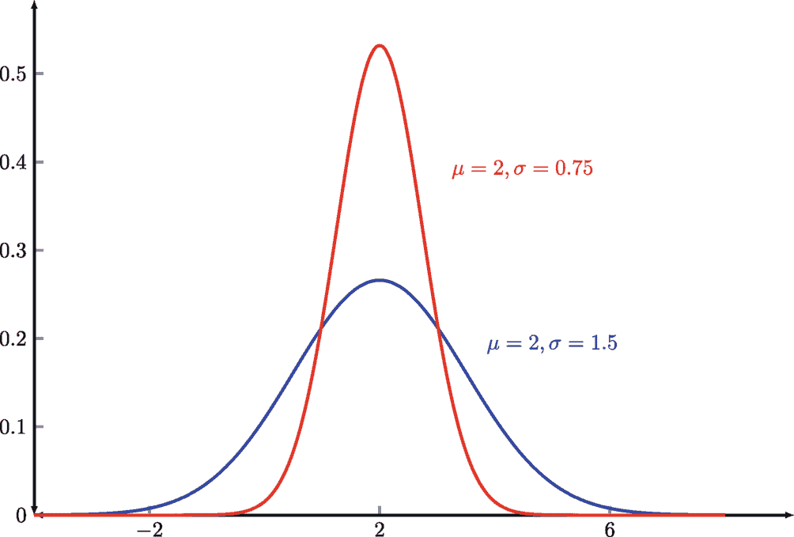
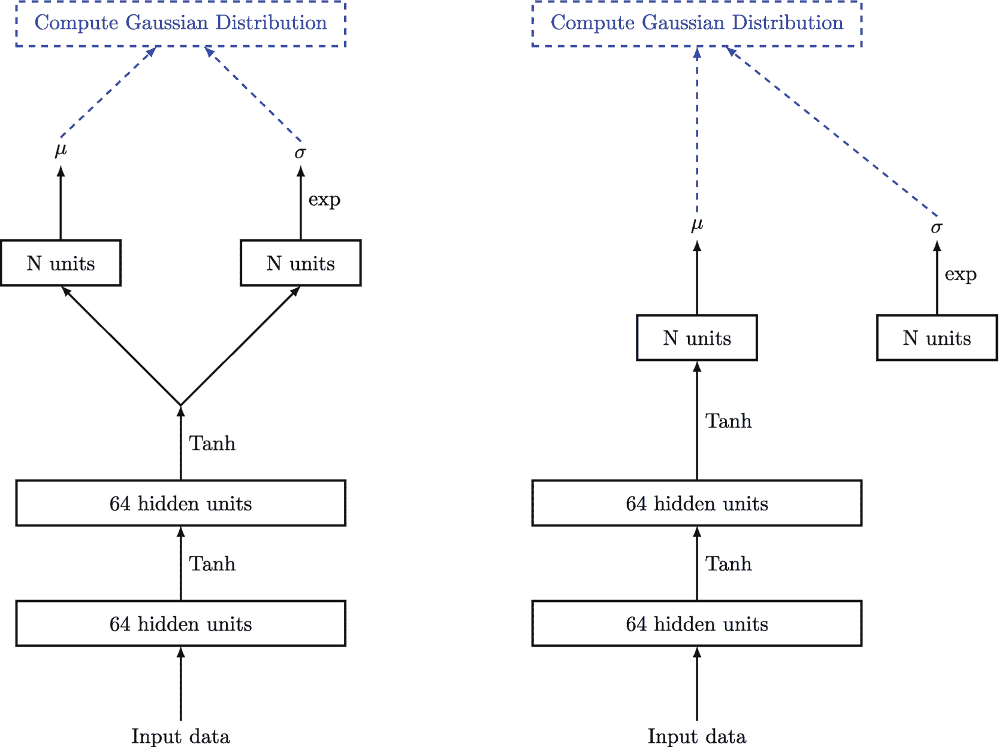
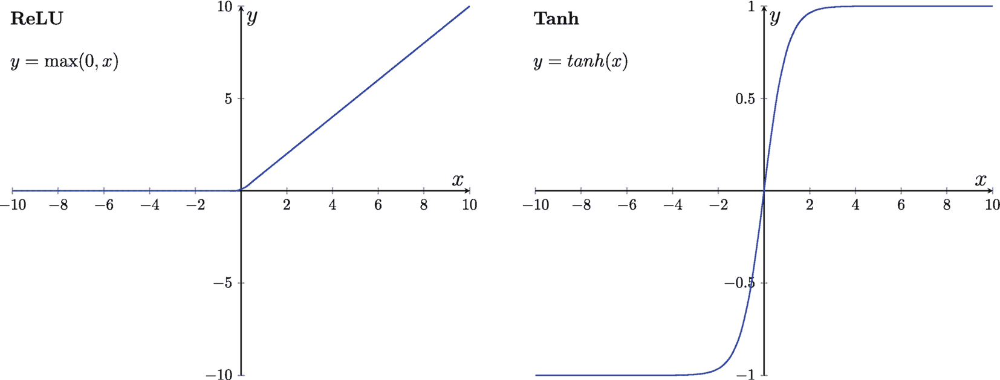
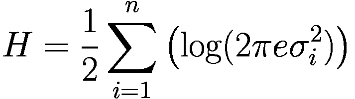
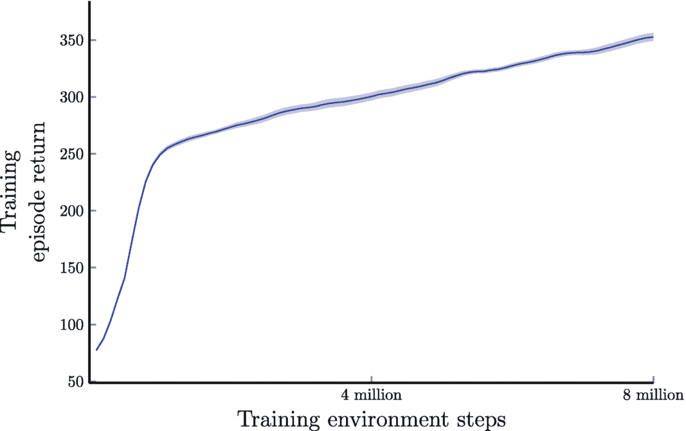
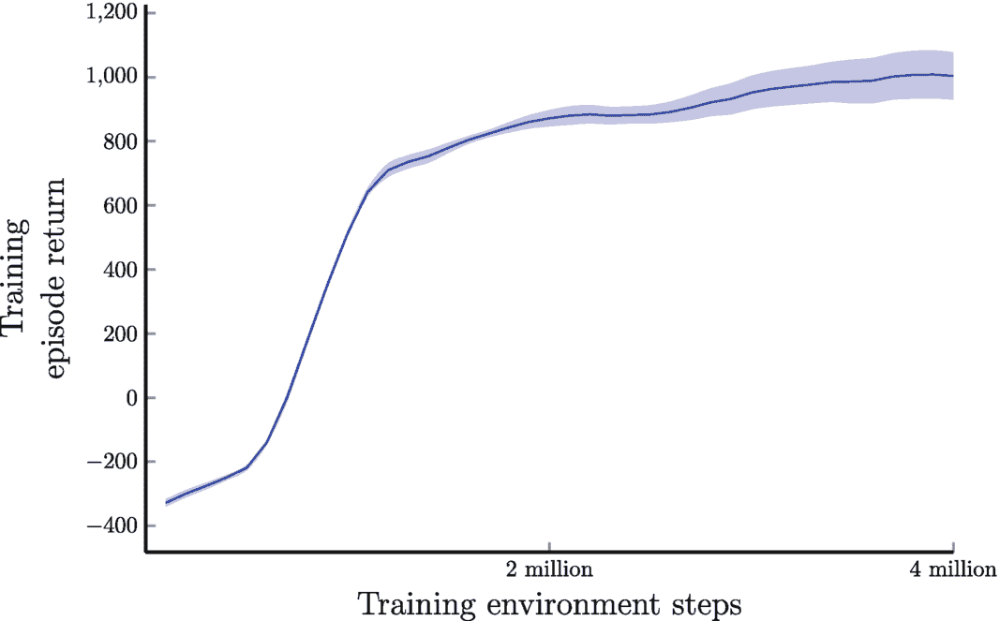

# 10. 连续动作空间的问题

在前面的章节中，我们介绍了具有离散动作空间的强化学习问题，其中动作通常使用离散数字（例如整数）来表示。然而，在现实世界中，许多问题需要连续的动作，这些动作无法用整数表示。连续动作空间在机器人技术等现实应用中很常见，在这些应用中，精确且连续的控制至关重要。

本章重点介绍如何使用基于策略的方法来解决具有连续动作空间的强化学习问题。我们将探索可以通过强化学习解决的经典机器人控制问题，例如控制机器蚂蚁的位置和方向，以及平衡一个简单的人形机器人。我们将看到如何使用基于策略的方法在这些系统中实现精确且连续的控制。

在本章结束时，你将很好地理解如何使用基于策略的方法来解决具有连续动作空间的强化学习问题。此外，你还将学习如何将这些方法应用于解决经典的机器人控制问题。

### 10.1 连续动作空间问题的挑战

在许多现实世界的强化学习问题中，动作空间是连续的，这意味着动作由连续值而非离散数字表示。例如，在控制机械臂角度移动的情况下，我们不能使用整数来表示动作，因为角度移动通常是一个连续值。这带来了独特的挑战，需要采用与离散动作空间问题不同的方法。

连续动作空间问题的主要挑战之一是动作空间通常是无限的，这使得应用诸如 Q-learning 之类的基于价值的方法变得困难，因为这些方法需要对动作空间进行离散化。动作空间的离散化可能导致大量信息丢失，并使学习最优策略变得困难。此外，连续动作空间的离散化通常会导致可能的动作数量极其庞大，这可能使学习过程在计算上不可行。

策略梯度方法是一类非常适合处理连续动作空间问题的强化学习算法。策略梯度方法不是学习一个显式的动作价值函数，而是学习一个参数化的策略，该策略将状态映射到动作。例如，这个策略可以是一个神经网络，其权重作为待学习的参数。

策略梯度方法能够学习一个可以直接输出连续动作的策略，而无需对动作空间进行离散化。这允许更精细的控制和更好的性能。然而，策略梯度方法可能比基于价值的方法更难训练，并且收敛到最优策略的速度可能更慢。此外，梯度估计的方差可能很高，这可能导致学习过程不稳定。为了应对这些挑战，人们开发了各种技术，例如基线和方差缩减。

为了更好地理解连续动作空间问题的挑战，让我们考虑一个简化的运动任务。在这个任务中，目标是让机械臂拾取放在桌子上的物体。机器人有多个活动部件或关节，每个关节都有自己的运动范围。所有关节通常需要同时控制，这要求对机器人的运动进行高度协调和精确控制。这类似于人类手臂的运动。为了成功完成拾取物体的任务，机器人必须在每个时间步精确地协调其关节的运动。

为连续动作空间问题设计合适的奖励函数也可能具有挑战性。在运动任务中，移动不同的关节通常会产生不同的结果，这使得定义合适的奖励函数更具挑战性。奖励函数需要精心设计，以鼓励机器人执行期望的动作，同时避免不期望的动作。例如，奖励函数可以奖励机器人拾取物体，同时惩罚它撞倒桌子上的其他物体。

总之，连续动作空间问题带来了独特的挑战，需要采用与离散动作空间问题不同的方法。策略梯度方法适用于连续动作空间，因为它们可以学习一个能够直接输出连续动作的策略。然而，设计合适的奖励函数和精确协调关节的运动仍然是一个挑战。通过理解这些挑战并使用适当的技术，我们可以为连续动作空间问题开发有效的强化学习解决方案。

### 10.2 MuJoCo 环境

从头开始构建机器人控制环境可能是一项具有挑战性且耗时的任务，需要广泛的物理学、力学和机器人学知识。幸运的是，基于开源软件的预构建仿真环境可以帮助研究人员和开发人员测试他们的强化学习算法，而无需广泛的领域知识或昂贵的硬件。

其中一个工具是由 Todorov 等人开发的带接触的多关节动力学（`MuJoCo`）物理引擎 [1]。`MuJoCo` 为各种机器人系统（包括机械臂和人形机器人）提供了快速且准确的仿真环境。`MuJoCo` 对于连续动作空间问题特别有用，因为使用传统物理引擎难以准确模拟这些问题。

通过使用诸如 `MuJoCo` 和 `OpenAI Gym` [2] 中提供的预构建仿真环境，研究人员和开发人员可以专注于开发和测试他们的算法，而无需广泛的领域知识或昂贵的硬件。这有助于加速强化学习研究的步伐，并使我们更接近于开发能够在复杂现实环境中运行的智能系统。


#### Humanoid

`Humanoid`环境^(⁹)来自 OpenAI Gym 和 MuJoCo，是一个用于评估强化学习算法的标准基准，这些算法旨在控制一个模拟人类的 3D 双足机器人。任务是协调机器人 17 个铰接关节的运动，使其能够尽可能快地向前行走而不摔倒。

智能体执行的每个动作代表施加在人体关节上的扭矩，观测值由人体不同部位的位置值和速度值组成。躯干有一对腿和手臂，每条腿和手臂由两个连杆组成。

`Humanoid`环境的奖励函数由四个部分组成。智能体在每个时间步，只要人体保持存活，就会获得一个固定值的奖励，称为“健康奖励”。它还会因向前行走而获得奖励，该奖励使用预定义规则衡量，称为“向前奖励”。然而，智能体会因使用过多扭矩控制关节而受到惩罚，称为“控制成本”，以及因承受过大的外部接触力而受到惩罚，称为“接触成本”。

智能体的总奖励计算为健康奖励、向前奖励之和减去控制成本和接触成本，由公式`reward = healthy reward + forward reward - control cost - contact cost`给出。通过最大化这个总奖励，智能体学会协调人体关节的运动，以实现向前行走而不摔倒的目标。

#### Ant

`Ant`^(¹⁰)是另一个用于 OpenAI Gym 和 MuJoCo 中简单运动任务的 3D 机器人。它由一个躯干（一个自由旋转体）和连接在其上的四条腿组成。每条腿有两个连杆，共有八个铰链将每条腿的两个连杆连接到躯干。`Ant`任务的目标是通过对这八个铰链施加扭矩，协调腿部使蚂蚁向前移动。

`Ant`任务的动作空间由施加在铰接关节上的扭矩组成。观测空间由蚂蚁不同部位的位置值和速度值组成。

`Ant`任务的最终奖励计算为四个部分的总和：健康奖励、向前奖励，减去控制成本和接触成本。健康奖励鼓励蚂蚁保持稳定，向前奖励鼓励蚂蚁向前移动，控制成本惩罚控制输入的大小，接触成本惩罚与环境发生的碰撞。

MuJoCo 提供了多种机器人控制环境，我们可以用来研究和测试解决持续强化学习问题的算法。除了本书将重点关注的这两个环境外，MuJoCo 环境的其他示例包括：

*   `Walker2d`：一个设计用于用两条腿行走和跑步的双足机器人
*   `Hopper`：一个设计用于跳跃和单腿跳的单腿机器人
*   `HalfCheetah`：一个设计用于快速奔跑和冲刺的四足机器人
*   `Swimmer`：一个设计用于游泳和在水中移动的机器人

这些环境为我们的强化学习算法提供了多样化的挑战，使我们能够在各种场景下测试其鲁棒性和有效性。

### 10.3 连续动作空间问题的策略梯度

现在我们将专注于能够解决之前介绍的经典机器人控制问题的算法。到目前为止，本书已经涵盖了两类算法：基于值的强化学习和基于策略的强化学习。虽然我们可以使用这两类算法来解决具有离散动作空间的强化学习问题，但对于具有连续动作空间的问题，我们通常使用基于策略的强化学习方法，因为正如本章前面所述，它们更有效。

本质上，对于连续动作空间的问题，我们需要学习一个正态（或高斯）分布，因为动作是实数，而不仅仅是整数。正态分布的概率密度函数（PDF）如公式（10.1）所示，其中`μ`和`σ`是正态分布的均值和标准差，`π ≈ 3.1415926`是一个常数。

```
p(x|μ, σ) = (1 / (σ * sqrt(2π))) * exp(- (x - μ)² / (2σ²))
```

(10.1)

正态分布的概率密度函数呈钟形曲线，如图 10.1 所示。正态分布是许多现实世界分布的良好近似，因为它描述了围绕单个均值聚集的实值随机变量。理论上，对于正态分布，68%的总体或样本将落在总体或样本均值`μ`加减一个标准差`σ`的范围内，95%的总体或样本将落在均值两侧加减两个标准差（精确为 1.96）的范围内。对于连续随机变量，获得任何特定值的概率始终为零，因为存在无限多个可能的值。

在强化学习的背景下，我们知道策略`π(a|s)`只是从状态`s`到采取动作`a`的概率的映射。为了基于公式（10.1）构建连续动作的策略，我们需要考虑状态`s`和动作`a`。我们可以将公式（10.1）中的`x`替换为动作`a`。接下来，我们使用参数化函数`σ(s, θ_σ)`和`μ(s, θ_μ)`来近似均值`μ`和标准差`σ`。参数`θ_σ`和`θ_μ`在训练过程中学习，它们代表了策略基于观测状态生成动作的能力。这样一个策略的完整公式如下所示：


(10.2)



高斯概率密度函数的折线图绘制了两个正态分布，参数分别为 `mu = 2`、`sigma a = 0.75` 和 `mu = 2`、`sigma = 1.5`。其峰值分别约在 0.55 和 0.25 处。

**图 10.1** 具有不同均值 `μ` 和标准差 `σ` 的高斯概率密度函数示例

方程 (10.2) 表示一个以均值 `μ(s, θ_μ)` 为中心、标准差为 `σ(s, θ_σ)` 的高斯分布。如果我们知道策略的均值和标准差，就可以从这个分布中采样动作。

我们可以使用本书第二部分介绍的任何近似方法（如线性或非线性方法）来构建正态分布的均值 `μ(s, θ_μ)` 和标准差 `σ(s, θ_σ)`。需要牢记的是，标准差必须始终为正，因此在实际操作中，我们通常在近似之后取指数。在本书中，我们专门关注使用神经网络来近似 `μ` 和 `σ`。

在实践中，也可以使用一个具有部分共享权重和两个独立输出头的单一神经网络来近似 `μ` 和 `σ`，如图 10.2 左侧所示。通过共享部分网络参数，我们可以减少网络中的总参数数量，从而节省计算量；同时，由于需要优化的参数更少，这也能提高某些任务的收敛速度。此处，`N` 表示任务中动作空间的维度，例如机械臂的关节数量。

在某些情况下，标准差并不直接与策略网络的任何隐藏层相连，如图 10.2 右侧所示。相反，它通常被当作一个独立的输出，其计算独立于网络隐藏层的输出。



用于近似高斯分布均值 μ 和标准差 σ 的神经网络架构的两个流程图。两个流程均从输入数据开始，通过 `Tanh` 链接流经 64 个隐藏单元，最后计算高斯分布。在右侧，指向 σ 的 `N` 个单元与流程没有连接。

**图 10.2** 用于近似高斯分布均值 `μ` 和标准差 `σ` 的神经网络架构示例

这种设计选择的一个原因是，标准差通常被建模为一个非负标量值，将其作为独立输出处理比将其融入隐藏层的激活函数更容易。此外，通过将标准差与隐藏层分离，策略网络可以学习调整输出动作的随机性程度，而不会影响网络隐藏层的底层结构。

这种方法的另一个优点是，它可以在训练和推理期间实现更高效的计算。通过将标准差与隐藏层解耦，网络可以生成不同水平的随机性，而无需为每个方差水平重新计算隐藏层。

对于许多运动控制任务，我们通常使用双曲正切（`Tanh`）作为激活函数，而不是修正线性单元（`ReLU`），因为 `Tanh` 具有更对称的范围，覆盖正负两个方向的值，如图 10.3 所示。



`ReLU` 和 `Tanh` 在 `y` 与 `x` 之间的两个四象限图。`ReLU` 的 `y = max(0, x)`，其线条在第二象限沿水平轴延伸，在第一象限线性上升。`Tanh` 的 `y = tanh(x)`，其逻辑增长曲线经过点 (0, 0)。

**图 10.3** `ReLU` 与 `Tanh` 激活函数示例

如前一章所述，使用熵作为正则化项可以鼓励智能体进行更多探索，这对于复杂问题（例如涉及连续动作空间的问题）尤其有益。

熵是衡量概率分布不确定性或随机性的指标。通过将熵添加到强化学习算法的目标函数中，我们可以鼓励智能体采取更不可预测的动作，并探索更多的状态空间。

对于连续动作空间，智能体从学习到的高斯分布中采样动作，其中学习到的网络输出每个连续动作对应的高斯分布的均值和标准差。高斯分布的熵使用以下公式计算：



(10.3) 其中 `n` 是连续动作空间的维度，`σ_i` 是第 `i` 维动作的标准差。该公式反映了高斯分布的熵随其方差增大而增加的事实，这有助于在策略中鼓励探索。

理论上，与使用基于策略的方法解决离散动作空间的强化学习问题相比，要使用基于策略的方法解决连续动作空间的强化学习问题，我们只需要做出这些改变。整体训练流程与离散动作空间的情况相同。然而，训练超参数（如学习率）可能需要针对连续情况进行微调。在实践中，我们可能还需要做一些额外的工作，例如在将环境状态输入神经网络之前对其进行归一化，以及对奖励信号进行归一化。


图 10.5 和图 10.4 分别展示了 `Actor-Critic` 智能体在 `Ant` 和 `Humanoid` 运动任务上的性能。结果显示了平均回合回报（总未折扣奖励）和 95% 置信区间。为了评估智能体的性能，我们汇总了每次训练迭代（包含 100,000 个训练步）结束时的平均回合回报。结果在五次独立运行中取平均值，并使用窗口大小为 5 的移动平均进行平滑处理。



训练回合回报相对于训练环境步数的折线图绘制了一条下凸递增曲线。估计值如下：(0, 75), (2 百万, 260), (4 百万, 300), (8 百万, 360)。

**图 10.5** `Actor-Critic` 在 `Humanoid` 运动任务上的表现。结果显示了平均回合回报（总未折扣奖励）和 95% 置信区间。结果在五次独立运行中取平均值，并使用窗口大小为 5 的移动平均进行平滑处理。



训练回合回报相对于训练环境步数的折线图绘制了一条下凸递增曲线。估计值如下：(0, -300), (1 百万, 400), (2 百万, 900), (4 百万, 1000)。

**图 10.4** `Actor-Critic` 在 `Ant` 运动任务上的表现。结果显示了平均回合回报（总未折扣奖励）和 95% 置信区间。结果在五次独立运行中取平均值，并使用窗口大小为 5 的移动平均进行平滑处理。

我们为策略（`Actor`）和价值函数（`Critic`）使用了独立的神经网络，没有共享权重。策略网络架构如图 10.2（左）所示，策略网络和价值函数网络均有两个隐藏层，并使用 `Tanh` 激活函数。

我们为 `Actor` 使用了 0.0002 的学习率，为 `Critic` 使用了 0.0003 的学习率，折扣因子为 0.99，在更新神经网络参数之前，序列长度为 2048。为了鼓励探索，我们在损失函数中使用了权重为 0.1 的熵。我们使用 `Adam` 优化器训练神经网络。

请注意，这些图表显示了在训练环境中收集的回合奖励总和，该环境与智能体收集训练转移数据的环境相同。在用于训练的环境上评估智能体的性能至关重要，因为由于运动任务的复杂性，两个环境之间的微小差异都可能对智能体的行为产生显著影响。

### 10.4 总结

在本章中，我们深入探讨了基于策略的方法在解决具有连续动作空间的强化学习问题中的应用。虽然之前的示例主要关注具有离散动作空间的强化学习问题，但某些任务（如机器人控制）需要特殊的考量。

我们首先简要探讨了连续动作空间带来的挑战，强调了为什么传统的基于价值的方法（如 `Q-learning`）不适合解决此类问题。随后，我们介绍了 `MuJoCo`，这是一个配备了预构建、简单机器人控制任务的测试平台，可作为测试各种强化学习算法的合适环境。

接下来，我们重点讨论了标准基于策略的方法（如 `Actor-Critic`）所需进行的必要修改，以便有效地训练用于机器人控制任务的强化学习智能体。关键的修改在于构建能够准确预测策略分布并允许从该策略中采样动作的神经网络。我们对策略梯度方法的探讨将在下一章继续，届时我们将介绍一种名为近端策略优化（`PPO`）的高效算法，该算法以其在现实场景中的最先进性能而闻名。

脚注 1 2

