# 11. 高级策略梯度方法

策略梯度方法面临的主要挑战之一是其不稳定性和对超参数（如学习率）的敏感性。这可能导致智能体性能的振荡，从而导致收敛缓慢甚至发散。此外，这些方法通常在梯度估计中具有高方差，这阻碍了收敛速度。而且，标准策略梯度方法表现出较差的样本效率，因为它们仅使用生成的样本转移一次来训练策略。

为了解决这些问题，本章探讨了高级策略梯度方法，特别关注替代目标函数的概念。我们将深入探讨近端策略优化（`PPO`）算法的基本原理，这是一种卓越的最先进方法，在解决广泛问题方面表现出非凡的效率。`PPO` 结合了信任区域的概念以确保稳定的更新，并使用替代目标函数来减少梯度估计的方差，从而实现更快的收敛和更高的样本效率。

### 11.1 标准策略梯度方法的问题


#### 不稳定的策略更新

策略梯度方法是一类强化学习算法，它直接优化参数化的策略，以最大化期望回报，即从环境中获得的折扣奖励总和。策略梯度方法的一个常见问题是它们可能不稳定且收敛缓慢，尤其是在高维或复杂环境中。在此背景下，“收敛缓慢”意味着策略梯度方法可能需要大量迭代或训练步骤才能找到好的策略，这可能导致训练时间过长，甚至无法收敛。

这个问题的主要原因在于，策略梯度方法使用随机梯度上升法来更新策略参数，其中使用步长 `α` 来调整参数：

```
θ = θ + α ∇_θ J(θ)
```

而为更新选择一个合适的步长并不容易。如果步长过大，可能导致性能崩溃，即策略变得比初始策略更差，优化过程无法收敛到好的解。这是因为策略可能偏离最优策略过远，导致期望回报降低。步长过大的一个典型例子是，策略可能在最优策略附近振荡，永远无法收敛到稳定的解。

这是因为在强化学习中，糟糕的策略意味着糟糕的训练样本。这对于标准策略梯度方法等在线策略学习方法尤其致命。因为一旦智能体开始遵循某个非常糟糕的策略在环境中行动，它可能无法从错误选择中恢复，从而导致性能崩溃。

在策略优化过程中使用较小的步长是解决稳定性问题的常见方法。然而，这种方法也有其缺点。使用较小的步长时，策略的更新速度较慢，需要更多迭代才能收敛到最优解。这会导致训练时间延长和计算资源增加。此外，使用小步长还可能减慢收敛速度，使找到最优策略变得更加困难。

而且，使用小步长还可能阻碍策略有效探索状态和动作空间。如果步长过小，策略可能会陷入局部最优，而无法找到全局最优。这可能导致策略次优，在给定环境中表现不佳。

简而言之，使用较小的步长可以降低性能发散的风险，但也会减慢学习过程，并可能导致次优策略。在策略优化过程中，必须在稳定性和效率之间做出权衡。

然而，问题并不仅仅在于选择合适的步长。原因在于，策略空间中两个策略之间的距离（由所有可能策略构成的空间定义）可能与参数空间中相应策略参数之间的距离不对应。或者简单地说，策略参数的微小变化可能导致动作概率发生巨大变化。

为了说明这个问题，考虑一个参数化策略 `π(a|θ)`，其中 `θ` 只是一个标量。该策略定义如下：

```
π(a=1|θ) = 1 / (1 + e^{-θ})
```

```
π(a=0|θ) = 1 - π(a=1|θ)
```

现在，让我们在两个不同的参数值 `θ_1 = 0` 和 `θ_2 = 1` 下评估该策略。在 `θ_1` 处，策略选择动作 `a=0` 的概率为 `π(a=0|θ_1) = 1/2`，选择动作 `a=1` 的概率为 `π(a=1|θ_1) = 1/2`。

在 `θ_2` 处，策略选择动作 `a=1` 的概率为 `π(a=1|θ_2) ≈ 0.73`，选择动作 `a=0` 的概率为 `π(a=0|θ_2) ≈ 0.27`。

我们可以看到，策略参数从 `θ_1` 到 `θ_2` 的微小变化导致了动作概率的巨大变化。事实上，选择动作 `a=1` 的概率从 `θ_1` 到 `θ_2` 增加了超过 45%。这凸显了策略对参数微小变化的敏感性，并强调了在策略梯度算法中谨慎选择优化方法和步长的重要性。


#### 数据效率低下

标准策略梯度方法的另一个问题是数据效率低下。这是因为像 Actor-Critic 这样的策略梯度方法属于**同策略**学习方法。同策略方法使用当前策略生成的轨迹来更新策略参数，这可能导致收敛缓慢和样本效率低下。

此外，策略梯度算法需要大量轨迹才能准确估计梯度。在数据获取成本高昂或耗时较长的环境中，这可能会成为问题，因为它会导致样本效率低下。例如，在机器人技术等实际应用中，由于机器人的物理限制，获取大量轨迹可能成本高昂或耗时较长。

一种可能的解决方案是使用**重要性采样比率**来解决这个问题。重要性采样权重是当前策略下采取某个动作的概率，与样本抽取时所依据的分布（旧策略）下采取相同动作的概率之比。

重要性采样比率可以通过以下公式计算：

```
\displaystyle \begin{aligned} \rho_t & = \frac{\pi'(a_t|s_t)}{\pi(a_t|s_t)} \end{aligned}
```

(11.1) 其中 `\pi '` 是新策略，`\pi` 是用于生成样本的旧策略。

尽管重要性采样看似有用，但它可能会引入其他问题，例如重要性采样权重的**爆炸**或**消失**。这是因为当样本抽取的分布对当前策略所采取的动作赋予较低概率时，重要性采样权重会变得非常大，导致策略梯度不稳定且收敛缓慢。同样，当该分布对当前策略所采取的动作赋予较高概率时，重要性采样权重会变得非常小，导致梯度消失。

例如，考虑一个简单的强化学习问题，其中智能体可以以相等的概率采取两个动作 `a_1` 和 `a_2`。采取动作 `a_1` 的奖励为 1，采取动作 `a_2` 的奖励为 `-1`。智能体的策略是以概率 *p* 采取动作 `a_1`，以概率 `1-p` 采取动作 `a_2`。假设我们想使用重要性采样来估计期望奖励相对于 *p* 的梯度。我们可以从一个均匀分布中采样，该分布对两个动作都赋予 0.5 的概率。

动作 `a_1` 的重要性采样权重为

```
\displaystyle \begin{aligned} w_1 = \frac{p}{0.5} = 2p\end{aligned}
```

动作 `a_2` 的重要性采样权重为

```
\displaystyle \begin{aligned} w_2 = \frac{1-p}{0.5} = 2(1-p)\end{aligned}
```

然而，如果智能体的策略对采取动作 `a_1` 赋予较低概率，例如 `p=0.1`，那么动作 `a_1` 的重要性采样权重会变得非常小：

```
\displaystyle \begin{aligned} w_1 = 2(0.1) = 0.2\end{aligned}
```

同样，如果智能体的策略对采取动作 `a_1` 赋予较高概率，例如 `p=0.9`，那么动作 `a_1` 的重要性采样权重会变得非常大：

```
\displaystyle \begin{aligned} w_{1} = 2(0.9) = 1.8\end{aligned}
```

在这两种情况下，重要性采样权重都不稳定，可能导致策略梯度收敛缓慢。这种不稳定性被称为**高方差问题**。如果我们使用较大的步长来更新策略参数，这个问题可能会变得更糟。


### 11.2 策略性能边界

我们希望找到一种方法，确保更新后的策略与当前策略不会相差太远，从而避免可能导致不稳定的巨大更新，同时又不影响训练速度，或避免像使用较小步长时可能陷入局部最优的情况。

我们首先引入相对策略性能方程，如式(11.2)所示。本质上，该方程表明，对于任意两个策略 `π'` 和 `π`，例如，`π'` 可以是新策略，`π` 是当前策略，那么这两个策略之间的性能差异可以表示为

```
J(π') - J(π) = 𝔼_{τ ~ π'}[∑_{t=0}^{∞} γ^t Â_π(s_t, a_t)]
```

(11.2)

式(11.2)被称为强化学习中的策略改进定理，由 Russell 和 Norvig [1] 首次提出。方程左侧 `J(π') - J(π)` 表示新策略 `π'` 与旧策略 `π` 之间期望累积奖励的差值。这是我们更新策略时希望最大化的量。

方程右侧 `𝔼_{τ ~ π'}[∑_{t=0}^{∞} γ^t Â_π(s_t, a_t)]` 是在新策略 `π'` 下优势函数之和的期望值，其中 `τ` 是按照新策略 `π'` 收集的状态、动作和奖励的轨迹，`Â_π(s_t, a_t)` 是时间步 `t` 的优势函数。优势函数衡量的是，在期望累积奖励方面，某个动作相对于当前策略 `π` 下的平均动作有多好。

优势函数定义为 `Â_π(s, a) = Q_π(s, a) - V_π(s)`，其中 `Q_π(s, a)` 是策略 `π` 下的状态-动作值函数，`V_π(s)` 是策略 `π` 下的状态值函数。状态-动作值函数表示在状态 `s` 下采取动作 `a` 并随后遵循策略 `π` 所能获得的期望累积奖励，而状态值函数表示从状态 `s` 开始并遵循策略 `π` 所能获得的期望累积奖励。

式(11.2)的证明如下：

```
J(π') - J(π) = 𝔼_{τ ~ π'}[∑_{t=0}^{∞} γ^t Â_π(s_t, a_t)]
             = 𝔼_{τ ~ π'}[∑_{t=0}^{∞} γ^t (R(s_t, a_t) + γ V_π(s_{t+1}) - V_π(s_t))]
             = J(π') + 𝔼_{τ ~ π'}[∑_{t=0}^{∞} γ^{t+1} V_π(s_{t+1}) - ∑_{t=0}^{∞} γ^t V_π(s)]
             = J(π') + 𝔼_{τ ~ π'}[∑_{t=1}^{∞} γ^t V_π(s) - ∑_{t=0}^{∞} γ^t V_π(s)]
             = J(π') - 𝔼_{τ ~ π'}[V_π(s_0)]
             = J(π') - J(π)
```

式(11.2)表明，我们可以相对于当前或旧策略 `π`，重写优化新策略 `π'` 的目标函数，如下所示：

```
max_{π'} J(π') = max_{π'} J(π') - J(π)
               = max_{π'} J(π') 𝔼_{τ ~ π'}[∑_{t=0}^{∞} γ^t Â_π(s_t, a_t)]
```

(11.3)

然而，在该方程中，我们仍然需要按照新策略 `π'` 采样得到的轨迹；这一要求使其无法计算。

但让我们用折扣未来状态分布 `d_π` 来重写式(11.2)，并利用公比为 `γ` 的无穷等比级数之和为 `1 / (1 - γ)` 的性质，例如：

```
J(π') - J(π) = 𝔼_{τ ~ π'}[∑_{t=0}^{∞} γ^t Â_π(s_t, a_t)]
             = 1/(1 - γ) 𝔼_{s ~ d_{π'}, a ~ π'}[Â_π(s, a)]
             = 1/(1 - γ) 𝔼_{s ~ d_{π'}, a ~ π}[π'(a|s)/π(a|s) Â_π(s, a)]
```

(11.4)

其中 `d_π` 是在策略 `π` 下访问状态 `s` 的期望折扣频率，`d_π` 定义为

```
d_π = (1 - γ) ∑_{t=0}^{∞} γ^t P(s_t = s|π)
```

如果折扣未来状态分布 `d_{π'}` 和 `d_π` 接近，即 `d_{π'} ≈ d_π`，那么我们可以使用 `d_π` 来近似式(11.4)，例如：


![$$\displaystyle \begin{aligned} J(\pi') - J(\pi) & \approx \frac{1}{1 - {\gamma}}\mathbb{E}_{\substack{s \sim d_{\pi} \\ a \sim \pi}\!\!}\left[\frac{\pi'(a|s)}{\pi(a|s)} \hat{A}_{\pi}(s, a)\right] \\ & \doteq \mathcal{L}_{\pi}(\pi') \notag \end{aligned} $$](images/605748_1_En_11_Chapter/605748_1_En_11_Chapter_TeX_Equ6.png)

(11.5)

事实证明，这种近似 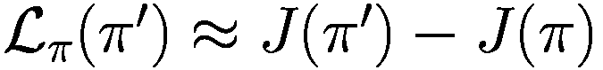 能产生非常好的结果。正如 Achiam 等人 [2] 所证明的，它存在一个性能边界，前提是新策略  和旧策略  在策略空间中足够接近。

![$$\displaystyle \begin{aligned} \lvert J(\pi') - \left( J(\pi) + \mathcal{L}_{\pi}(\pi') \right) \rvert \le C\sqrt{\mathbb{E}_{s \sim d_{\pi}\!\!}\left[D_{KL}(\pi'||\pi)[s]\right]} {} \end{aligned} $$](images/605748_1_En_11_Chapter/605748_1_En_11_Chapter_TeX_Equ7.png)

(11.6) 其中 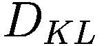 是 Kullback-Leibler (KL) 散度，用于衡量两个概率分布之间的距离。例如，给定某个随机变量上的两个概率分布 `P` 和 `Q`，KL 散度通过以下公式计算：

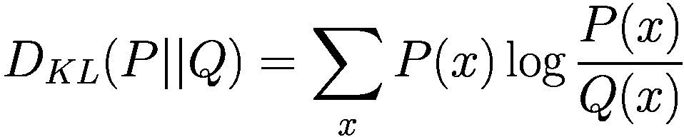

(11.7)

注意，如果两个概率分布相同，即当 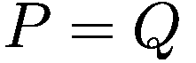 时，KL 散度距离为零，即 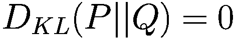。

具体来说，在强化学习的背景下，给定两个策略  和 ，对于给定状态 `s`，它们之间的 KL 散度可以通过以下公式计算：

![$$\displaystyle \begin{aligned} D_{KL}(\pi'||\pi)[s] = \sum_{a \in \mathcal{A}} \pi'(a|s) \log \frac{\pi'(a|s)}{\pi(a|s)} \end{aligned} $$](images/605748_1_En_11_Chapter/605748_1_En_11_Chapter_TeX_Equ9.png)

(11.8)

#### 单调提升理论

我们可以将公式 (11.6) 重新整理为

![$$\displaystyle \begin{aligned} J(\pi') - J(\pi) \ge \mathcal{L}_{\pi}(\pi') - C\sqrt{\mathbb{E}_{s \sim d_{\pi}\!\!}\left[D_{KL}(\pi'||\pi)[s]\right]} {} \end{aligned} $$](images/605748_1_En_11_Chapter/605748_1_En_11_Chapter_TeX_Equ10.png)

(11.9)

这个公式被称为强化学习中的性能提升边界。在公式的左侧，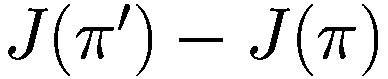 表示新策略  与旧策略 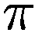 之间期望累积奖励的差值。这正是我们在更新策略时希望提升的量。

在公式的右侧，![$$\mathcal {L}_{\pi }(\pi ') - C\sqrt {\mathbb {E}_{s \sim d_{\pi }\!\!}\left [D_{KL}(\pi '||\pi )[s]\right ]}$$](images/605748_1_En_11_Chapter/605748_1_En_11_Chapter_TeX_IEq83.png) 是替代目标函数，其中  是策略 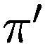 的优势函数，而 `C` 是一个超参数，用于平衡期望提升与 KL 散度惩罚之间的权衡。

第一项 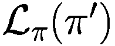 基于优势函数，衡量新策略  在期望奖励方面比旧策略  好多少。优势函数表示在当前策略下，每个动作相对于平均动作的优越程度，常用于估计策略梯度。

第二项 ![$$C\sqrt {\mathbb {E}_{s \sim d_{\pi }\!\!}\left [D_{KL}(\pi '||\pi )[s]\right ]}$$](images/605748_1_En_11_Chapter/605748_1_En_11_Chapter_TeX_IEq89.png) 对新策略  与旧策略  之间的 KL 散度进行惩罚，并由常数 `C` 加权。这一项确保新策略与旧策略不会差异过大，从而避免做出可能有害的大幅改动。

性能提升边界提供了一个理论保证：通过优化替代目标函数，我们可以提升策略的期望累积奖励。它还赋予我们一个优良特性：如果我们能够最大化右侧的各项，那么就能保证新策略  相对于旧策略  有所提升。


#### 替代目标函数

通过使用 `L_π(π') ≈ J(π') - J(π)` 这一近似，我们可以将初始的相对策略性能方程重新整理为：

```
L_π(π') = 1/(1-γ) * E_{s~d_π, a~π} [π'(a|s)/π(a|s) * Â_π(s, a)]
        = E_{τ~π} [Σ_{t=0}^∞ γ^t * π'(a|s)/π(a|s) * Â_π(s, a)]
```

(11.10)

方程 (11.10) 通常被称为策略梯度方法的**替代目标函数**。我们可以利用从旧策略 `π` 采样的轨迹来计算并优化该函数。方程中的概率比项是重要性采样，但由于它仅依赖于当前时间步，而非历史序列，因此不会出现本章开头讨论的权重消失或爆炸问题。

利用方程 (11.10)，我们的目标是找到新策略 `π'`，使其与旧策略 `π` 之间的相对性能差异最大化，即：

```
argmax_{π'} J(π') = argmax_{π'} J(π') - J(π)
                  = argmax_{π'} E_{τ~π} [Σ_{t=0}^∞ γ^t * π'(a|s)/π(a|s) * Â_π(s, a)]
```

(11.11)

然而，由于在方程 (11.10) 中我们使用了近似解 `L_π(π')`，即使用从旧策略 `π` 而非新策略 `π'` 生成的轨迹，这仅在**新策略与旧策略相近**时才有效，正如单调改进理论所示。

这使得替代目标函数成为一个**约束优化问题**：

```
argmax_{π'} L_π(π') = argmax_{π'} E_{τ~π} [Σ_{t=0}^∞ γ^t * π'(a|s)/π(a|s) * Â_π(s, a)]
subject to: max_{s∈S} D_KL(π' || π) ≤ δ
```

(11.12) 其中约束条件定义为新策略 `π'` 与旧策略 `π` 之间的最大 `D_KL` 散度距离，且 `D_KL(π' || π) ≤ δ`。

针对方程 (11.12) 所定义的约束优化问题，一种解决方案是采用**信任区域优化方法**。图 11.1 展示了信任区域方法的概念：当前（旧）策略 `π` 位于中心点。围绕当前策略定义一个信任区域，该区域可由 `D_KL` 散度来界定。信任区域方法会在该信任区域的约束内，寻找合适的步长和方向来更新策略。

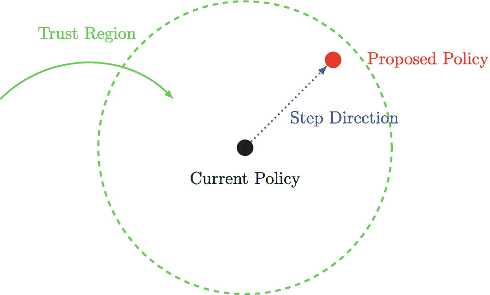

示意图包含一个带有弯曲箭头的虚线圆圈，箭头标记为“信任区域”。圆心处的一个点标记为“当前策略”。圆圈右上边缘附近的另一个点标记为“提议策略”。从当前策略指向提议策略的箭头标记为“步进方向”。

**图 11.1** 信任区域方法的概念

在强化学习的策略优化背景下，已经开发出多种算法来解决替代目标函数问题，例如 Kakade, Sham M [3] 提出的**自然策略梯度**，以及 Schulman 等人 [4] 提出的**信任区域策略优化**（TRPO）。然而，这些算法需要分别对 `L_π(π')` 和 `D_KL(π' || π)` 进行额外的近似。这引入了额外的复杂性，例如无法使用随机梯度上升来优化策略参数，而必须使用其他方法来计算更新参数所需的梯度。这也降低了计算效率，因为每次迭代更新策略需要更多的资源。

幸运的是，有一种更简单、更高效的算法可用：**近端策略优化**（PPO）。PPO 避免了其他算法的额外复杂性，并提供了一种直接的方法来优化替代目标函数。

### 11.3 近端策略优化

由 Schulman 等人 [5] 提出的**近端策略优化**（PPO）是一种先进的策略梯度算法，它在保持实现简单的同时，改进了先前策略梯度方法（如 Actor-Critic [6] 算法）的稳定性和数据效率。PPO 已成功应用于各种强化学习问题，并且可以扩展到处理需要更复杂神经网络架构的大型复杂环境。

PPO 的一个关键优势在于它使用随机梯度上升来优化策略，从而消除了其前身 TRPO 所需的复杂梯度计算过程和寻找合适优化方向的需求。这种方法在实践中能实现更快的收敛和更好的性能。

PPO 是一种强大且通用的算法，已被证明是许多强化学习任务中可靠且有效的选择。与先前的方法相比，它提供了更简单的实现，同时仍能达到最先进的性能。¹¹


#### 裁剪替代目标函数

PPO 建立在公式 (11.12) 所示的替代目标函数思想之上。然而，它不需要直接计算 KL 散度 `D_{KL}`。为了理解为何可行，让我们考察概率比与 KL 散度之间的关系。

回顾一下，给定两个策略 `π'` 和 `π`，它们在给定状态 `s` 下的 KL 散度可通过以下公式计算：

```
D_{KL}(π'||π)[s] = Σ_{a ∈ A} π'(a|s) log(π'(a|s) / π(a|s))
```

KL 散度衡量的是旧策略 `π` 与新策略 `π'` 概率分布之间的对数差异。如果新策略与旧策略相同，即 `π' = π`，那么概率比为 1.0。随着新策略偏离旧策略，这个比值会发生剧烈变化。然而，这个比值与 KL 散度之间是什么关系呢？

举个例子，考虑一个简单的马尔可夫决策过程（MDP），它只有一个状态 `s` 和两个动作 `a1` 和 `a2`。假设我们有一个新策略 `π'` 和一个旧策略 `π`，在旧策略下，状态 `s` 中选择动作 `a1` 和 `a2` 的概率均为 0.5，即 `π(a1|s) = 0.5` 且 `π(a2|s) = 0.5`。

我们可以计算在状态 `s` 下，对于每个动作 `a1, a2`，`π'` 和 `π` 的概率比 `π'(a|s) / π(a|s)`。表 11.1 展示了不同新策略对应的概率比和 KL 散度。

**表 11.1** 不同新策略 `π'` 与旧策略 `π` 之间的概率比和 KL 散度示例

| `π'(·|s)` | `π(·|s)` | `π'(a1|s) / π(a1|s)` | `π'(a2|s) / π(a2|s)` | `D_{KL}(π'||π)[s]` |
| --- | --- | --- | --- | --- |
| [0.1, 0.9] | [0.5, 0.5] | 0.2 | 1.8 | 0.37 |
| [0.2, 0.8] | [0.5, 0.5] | 0.4 | 1.6 | 0.19 |
| [0.3, 0.7] | [0.5, 0.5] | 0.6 | 1.4 | 0.08 |
| [0.4, 0.6] | [0.5, 0.5] | 0.8 | 1.2 | 0.02 |
| [0.5, 0.5] | [0.5, 0.5] | 1.0 | 1.0 | 0.0 |
| [0.6, 0.4] | [0.5, 0.5] | 1.2 | 0.8 | 0.02 |
| [0.7, 0.3] | [0.5, 0.5] | 1.4 | 0.6 | 0.08 |
| [0.8, 0.2] | [0.5, 0.5] | 1.6 | 0.4 | 0.19 |
| [0.9, 0.1] | [0.5, 0.5] | 1.8 | 0.2 | 0.37 |

结果展示了一个非常有趣的模式：随着两个策略 `π'` 和 `π` 偏离程度增大，即它们的概率比偏离 1.0 越远，KL 散度也随之增加。

这给了我们一个启示：也许我们可以不计算 KL 散度，而是直接对概率比施加约束，使其接近 1.0，如公式 (11.13) 所示，其中 `ε` 是一个小变量，用于控制我们希望对概率比施加的约束程度。

```
clip(π'(a|s) / π(a|s), 1 - ε, 1 + ε) * Â_t
```

(11.13)

然而，在某些情况下，使用裁剪后的概率比可能导致对优势函数的高估，从而产生过于保守的策略，无法探索可能比旧策略所选动作更优的新动作。为了理解原因，让我们考虑一个简单的例子。

假设旧策略在状态 `s` 下选择动作 `a` 的概率为 0.8，优势估计值为 0.5。新策略在状态 `s` 下选择动作 `a` 的概率为 0.3。我们使用 `ε = 0.2`，因此裁剪范围应为 [0.8, 1.2]。

使用裁剪后的比值会得到 `0.3 / 0.8 = 0.375`，这小于裁剪范围的下限。因此，裁剪后的比值将为 0.8，目标函数计算结果为 `0.8 * 0.5 = 0.4`。

然而，如果我们使用原始的未裁剪概率比，目标函数计算结果为 `0.375 * 0.5 = 0.1875`。在这种情况下，裁剪后的概率比导致对优势函数的估计远高于未裁剪的比值。这可能导致策略高估某些动作的价值，而实际上忽略了旧策略选择的、能产生更好期望回报的其他动作。


##### PPO 中的裁剪代理目标函数

为了解决这个问题，PPO 还对裁剪目标和非裁剪目标逐元素取最小值，以缓解高估问题。这有助于缓解高估问题，并允许更好地探索新动作。通过使用两个目标的最小值，在裁剪比率会导致高估的区域，更新将更加保守，但在未裁剪比率会导致策略发生显著变化的区域，仍允许进行探索。

PPO 的最终裁剪代理目标函数 `L_pi_CLIP(pi')` 如公式 (11.14) 所示。

```
\displaystyle \begin{aligned} \mathop{\text{argmax}}_{\pi'}\mathcal{L}_{\pi}^{CLIP}(\pi') & = \mathop{\text{argmax}}_{\pi'} \mathbb{E}_{\tau \sim \pi\!\!}\left[ \min \Biggl( \frac{\pi'(a|s)}{\pi(a|s)} \hat{A}_t, \; clip \left( \frac{\pi'(a|s)}{\pi(a|s)}, 1-\epsilon, 1+\epsilon \right)\hat{A}_t \Biggr)\right] {} \end{aligned}
```

(11.14)

有了这个裁剪代理目标函数，我们可以像使用标准策略梯度方法（如 Actor-Critic）一样，使用随机梯度上升方法来训练策略网络。无需像 TRPO 等其他算法那样手动计算梯度然后寻找优化方向。

#### 广义优势估计

PPO 使用 Schulman 等人提出的广义优势估计（GAE）方法来计算优势，该方法用于估计预期未来奖励以及在给定状态下采取特定动作的优势。GAE 通过将 N 步回报与价值函数的自举估计相结合，提供了更稳定、方差更低的优势函数估计。这种方法使 PPO 能够处理不同长度的任务，因为它可以在固定时间范围内估计优势函数，并且可以适应任务的长度。

优势函数衡量采取某个特定动作相对于其他动作有多好，是 PPO 等策略梯度方法中的关键量。优势函数通常使用观察到的奖励与当前策略下的预期奖励之间的差值来估计。

优势函数使用有限时间范围回报方法的截断版本进行计算，如公式 (11.15) 所示，其中 `lambda` 是一个参数，用于控制优势函数估计中偏差和方差之间的权衡。当 `lambda = 1` 时，GAE 退化为标准的 N 步 TD 方法。

```
\displaystyle \begin{aligned} \hat{A}_t = \delta_t + ({\gamma} \lambda) \delta_{t+1} + ({\gamma} \lambda)² \delta_{t+2} + \cdots + ({\gamma} \lambda)^{T-t-1} \delta_{T-1} {} \end{aligned}
```

(11.15)

这里，`delta_t` 是时序差分误差，即奖励总和与当前状态估计值及后继状态估计值之间的差值，如公式 (11.16) 所示。

```
\displaystyle \begin{aligned} \delta_t = r_t + {\gamma} V_\pi(s_{t+1}) - V_\pi(s_t) {} \end{aligned}
```

(11.16)

要恢复序列中特定状态的回报，我们可以使用 GAE 优势加上估计的状态价值，如公式 (11.17) 所示。

```
\displaystyle \begin{aligned} G_t = \hat{A}_t + V_\pi(s_t) {} \end{aligned}
```

(11.17)

GAE 方法已被证明可以提高 PPO 的稳定性和收敛性，同时在优势函数估计中保持偏差和方差之间的良好平衡。它是一个强大的工具，可用于在各种强化学习环境中估计回报和优势。

#### 对数概率比

在实践中，我们经常在裁剪代理目标函数中使用对数概率比而不是概率比 `pi'(a|s) / pi(a|s)`，这可以带来更稳定和高效的优化，尤其是在处理很小或很大的概率比时。原因之一是取概率比的对数有助于缩小可能值的范围。在实践中，概率比有时会取非常小或非常大的值，这可能导致数值不稳定或下溢/上溢错误。通过取对数，我们可以将这些值转换到更易于管理的范围。

对数概率比可以重写为：

```
\displaystyle \begin{aligned} \frac{\pi'(a|s)}{\pi(a|s)} = \exp(\log \pi'(a|s) - \log \pi(a|s)) \end{aligned}
```

(11.18)

然后，PPO 执行 `M` 个 epoch 的参数更新，每次更新重用相同的转移序列；因此，它实现了更好的数据效率。在每次更新期间，策略参数被优化以最大化裁剪代理目标函数，而状态价值函数的参数被优化以最小化平方误差。裁剪 epsilon `epsilon` 是一个超参数，用于控制概率比被裁剪的程度，以防止策略更新过大。`epsilon` 的常见值是 0.1 或 0.2。通过裁剪概率比，PPO 可以防止可能破坏训练过程稳定性的过大策略更新。

**算法 1：使用裁剪代理目标的近端策略优化算法**

一个方框列出了算法 1（使用裁剪代理目标的近端策略优化算法）的输入、初始化和输出细节。该算法的步骤 1 到 9 被提及。

在算法 1 中，更新是针对序列中的所有转移一次性完成的。然而，在实践中，一次使用一小批转移进行更新效率更高。这是因为计算资源限制，例如 GPU 内存有限，有时很难一次性处理所有转移。

此外，PPO 还可以在裁剪代理策略梯度目标函数中包含一个熵项。这可以通过鼓励策略选择具有更多不确定性的动作来促进探索。此外，PPO 可以在训练过程中衰减裁剪 epsilon `epsilon`。例如，一种常见的策略是使用 0.2 作为 `epsilon` 的初始值，然后将其衰减到某个固定的较小值，例如在训练过程中线性退火到 0.02。这是因为当智能体开始训练时，它可能会随机执行动作，因此使用更大的参数更新信任区域是必要的。然而，随着智能体进步并变得更加自信，较小的信任区域更可取，以防止可能破坏已学习策略的过大策略更新。


#### 自适应 KL 惩罚

自适应 KL 惩罚是近端策略优化（PPO）算法的一种变体，旨在防止可能导致不稳定的过大策略更新。在标准的裁剪版 PPO 中，新旧策略之间的概率比被裁剪在特定范围内。这种方法约束了替代目标函数，其效果与将 KL 散度作为约束条件相同。

相比之下，自适应 KL 散度惩罚方法提出将 KL 散度作为惩罚项添加到替代目标函数中，而不是将其用作约束条件。此外，自适应 KL 散度惩罚会根据策略更新的幅度来调整惩罚力度。

将 KL 散度作为惩罚项的替代目标函数可以写为：

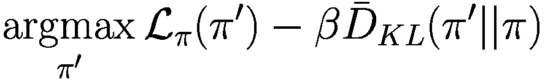

(11.19) 其中  控制惩罚的强度，而 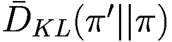 是新旧策略之间估计的平均 KL 散度。

与裁剪版本不同，KL 散度在此不作为替代目标函数的约束条件。相反，它被用作由参数  控制的惩罚项。如果 KL 散度很高，惩罚项也会很高。这里， 在学习过程中的每次迭代都会进行调整，使其成为一种自适应 KL 惩罚。此外，还可以使用目标 KL 散度  来调整 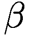。

为了估计新策略与旧策略之间的平均 KL 散度，我们使用了一种近似方法。这种近似是必要的，因为由于某些环境的状态空间很大，计算精确的 KL 散度通常是不可行的。目标 KL 散度 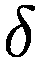 可用于调整  参数，使其成为自适应 KL 惩罚。

算法 2 展示了采用自适应 KL 散度惩罚的 PPO 算法的伪代码：

**算法 2：** 具有自适应 KL 惩罚的近端策略优化算法

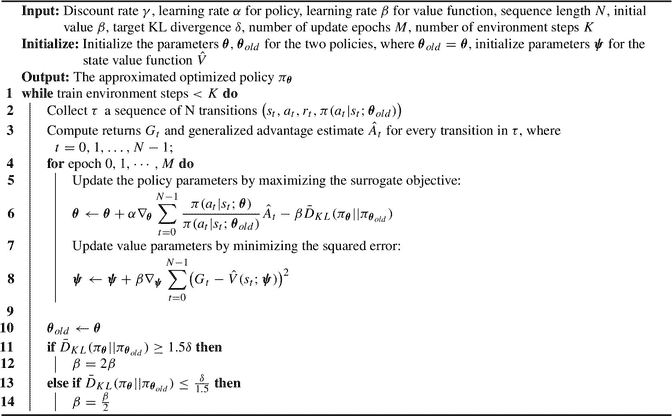 一个方框列出了算法 2，即具有自适应 KL 惩罚的近端策略优化算法。输入包括折扣率 `gamma`、学习率 `alpha` 和 `beta`、序列长度、散度 `delta`、更新轮数 `M`、环境步数 `K`。输出是近似最优策略 `Pi` 下标 `theta`。

虽然 PPO 的两种版本都能很好地工作，但在实践中，由于裁剪替代目标函数更简单、更稳定，因此通常更受青睐。

简单性指的是，与 KL 惩罚版本相比，裁剪替代目标函数更容易实现和调参。KL 惩罚版本需要为惩罚项调整一个额外的超参数，这可能既耗时又难以优化。

稳定性提升指的是，与 KL 惩罚版本相比，裁剪替代目标函数在训练过程中更不容易出现不稳定或发散的情况。KL 惩罚版本对惩罚系数的选择更为敏感，当系数设置不正确时，可能导致训练不稳定。裁剪替代目标函数直接限制了策略更新的幅度，防止了可能破坏训练稳定性的过大变化。

总之，虽然 PPO 替代目标函数的两种版本都可能有效，但在实践中，由于裁剪替代目标函数更简单、更稳定，因此通常更受青睐。

图 11.2 展示了在 Atari 视频游戏 Pong 上，使用裁剪替代目标函数的 PPO 智能体与 Actor-Critic 智能体之间的性能对比。性能通过获得的平均奖励来衡量。为了评估智能体的性能，我们在一个独立的测试环境中运行了 200,000 个评估步骤，该环境在每个训练迭代结束时使用贪婪策略，每个训练迭代包含 250,000 个训练步骤或 100 万帧，评估环境中未应用奖励裁剪或生命丢失的软终止。结果取三次独立运行的平均值，并使用窗口大小为 5 的移动平均进行平滑处理。

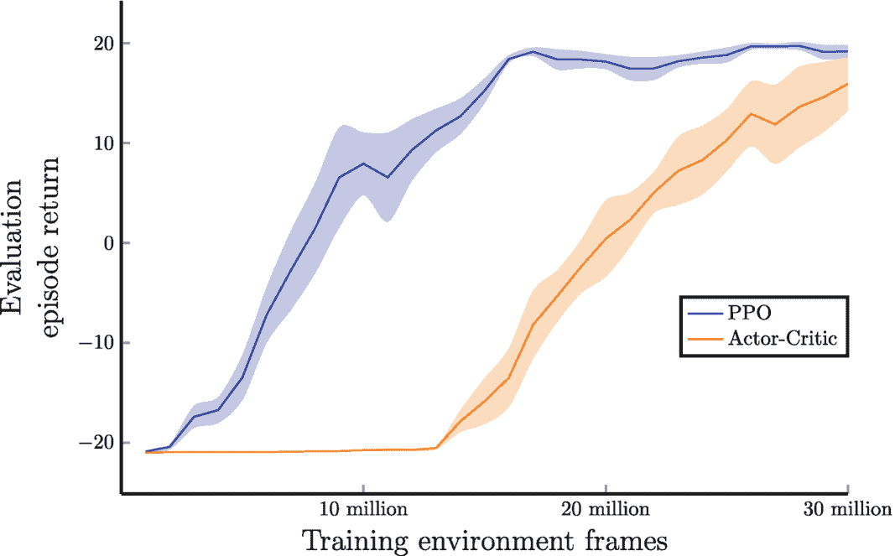

一个折线图绘制了 PPO 和 Actor-Critic 的每集回报与训练环境帧数的关系曲线。数据如下。PPO：(1000 万, 8), (2000 万, 18), (3000 万, 19)。Actor-Critic：(-21, 1000 万), (2000 万, 0), (3000 万, 15)。数值为估计值。

**图 11.2** PPO 与 Actor-Critic 在 Atari Pong 上的对比。结果显示了平均每集回报（总未折扣奖励）和 95% 置信区间。结果取三次独立运行的平均值，然后使用窗口大小为 5 的移动平均进行平滑处理

我们对 PPO 和 Actor-Critic 智能体使用相同的神经网络架构和超参数。具体来说，我们使用折扣率 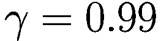、学习率 0.00025 和序列长度 128，对于 PPO，我们重复使用相同的转移序列在 4 个轮次上更新策略参数。我们还使用熵来鼓励探索，熵权重为 0.025。为了保持设置相似，我们对两个智能体都使用了如公式 (11.15) 中介绍的广义优势估计，并使用 GAE lambda 0.95。神经网络使用 Adam 优化器进行训练。

我们使用与 DQN 相同的环境处理方式，包括将帧大小调整为 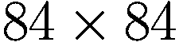 并将其转换为灰度图。我们还应用了“跳帧”技术，即每四帧只处理一帧，并堆叠最后四帧以创建大小为 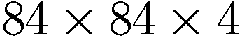 的最终状态图像。

此外，我们将奖励值裁剪到 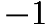 到 1 的范围内，并将失去一条命视为“软终止”状态。

我们可以看到，PPO 智能体显然具有其优势。


为了展示 PPO 算法的真正实力，我们让智能体执行机器人控制任务。图 11.3 展示了在 Ant 经典机器人控制任务上，使用裁剪替代目标函数的 PPO 智能体与 Actor-Critic 智能体的性能对比。结果显示了平均回合回报（总未折扣奖励）和 95%置信区间。为了评估智能体的性能，我们汇总了每次训练迭代（包含 100,000 个训练步）结束时的平均回合回报。结果取五次独立运行的平均值，并使用窗口大小为 5 的移动平均进行平滑处理。

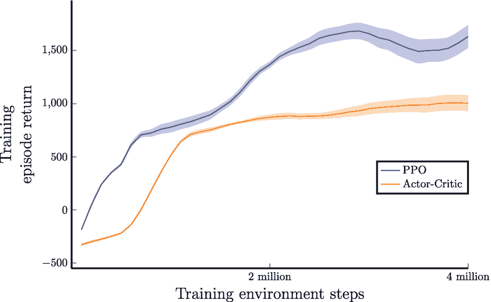

折线图绘制了 PPO 和 Actor-Critic 的训练回合回报与训练环境步数的关系曲线。数据如下：PPO：(1 百万, 800), (2 百万, 1250), (4 百万, 1600)。Actor-Critic：(1 百万, 700), (2 百万, 800), (4 百万, 900)。数值为估计值。

**图 11.3** PPO 与 Actor-Critic 在 Ant 经典机器人控制任务上的对比。结果显示了平均回合回报（总未折扣奖励）和 95%置信区间。结果取五次独立运行的平均值，然后使用窗口大小为 5 的移动平均进行平滑处理。

我们对 PPO 和 Actor-Critic 智能体使用相同的神经网络架构和超参数。具体来说，我们使用折扣率`γ = 0.99`，Actor 的学习率为 0.0002，Critic 的学习率为 0.0003，序列长度为 2048，对于 PPO 我们使用 4 次更新周期。我们还使用熵来鼓励探索，熵权重为 0.1。为了保持设置相似，我们对两个智能体都使用公式(11.15)中介绍的广义优势估计，并使用 GAE lambda 0.95。神经网络使用 Adam 优化器进行训练。

在更具挑战性的 Humanoid 机器人控制任务中也可以观察到类似的结果，如图 11.4 所示。训练和评估方法与之前的 Ant 任务相同。

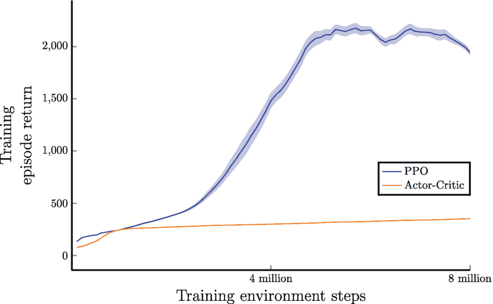

折线图绘制了 PPO 和 Actor-Critic 的训练回合回报与训练环境步数的关系曲线。数据如下：PPO：(2 百万, 300), (4 百万, 1250), (8 百万, 2000)。Actor-Critic：(2 百万, 250), (4 百万, 250), (8 百万, 300)。数值为估计值。

**图 11.4** PPO 与 Actor-Critic 在 Humanoid 经典机器人控制任务上的对比。结果显示了平均回合回报（总未折扣奖励）和 95%置信区间。结果取五次独立运行的平均值，然后使用窗口大小为 5 的移动平均进行平滑处理。

### 11.4 总结

在本章中，我们探索了作为标准技术增强的先进策略梯度方法，解决了它们的局限性以及在基于策略的方法中对更稳健方法的需求。

我们首先审视了使用标准策略梯度方法时遇到的挑战，例如策略更新期间的不稳定性和次优的数据效率。

接下来，我们介绍了策略性能界限的概念，这构成了本章的核心理论。然后，我们通过提出策略梯度方法的替代目标函数来奠定基础，该函数是一系列旨在改进标准策略梯度技术的算法的基础。

本章的主要焦点是近端策略优化（PPO）算法。PPO 代表了一种最先进的先进策略梯度方法，在解决包括离散和连续动作空间在内的广泛问题方面表现出卓越的效率。我们深入探讨了 PPO 背后的直觉，并解释了该算法如何利用裁剪的替代目标函数来避免显式计算 KL 散度。

本章最后简要讨论了 PPO 的自适应 KL 版本，这是裁剪版本的一种替代变体。此外，我们将 PPO 算法的性能与 Actor-Critic 等标准策略梯度方法进行了比较。

本章标志着我们对基于策略的方法探索的结束。我们已经讨论了策略梯度背后的理论以及在此基础上构建的各种算法。在接下来的章节中，我们将深入探讨强化学习中更高级的主题。

脚注 1

