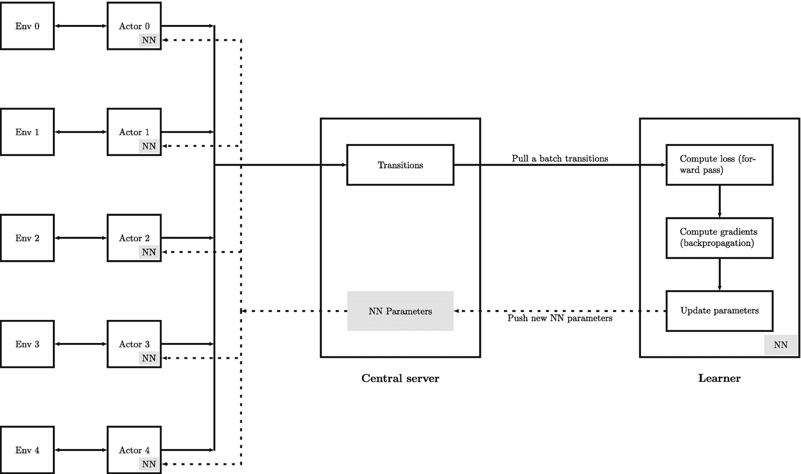
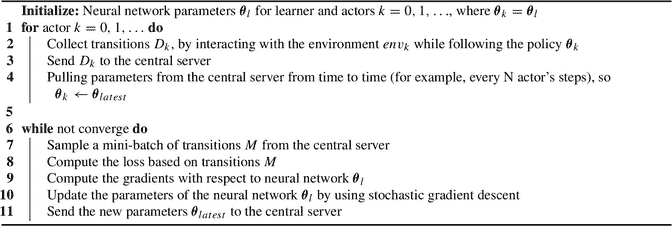

# 12. 分布式强化学习

本章探讨了分布式强化学习的使用，它涉及多个智能体并行运行，与环境交互以生成样本轨迹或转移，并使用样本来训练智能体（例如，学习最优策略或价值函数）。与单智能体架构相比，这种方法提供了几个优势，包括更快的收敛速度、更好的探索、更强的鲁棒性和更高的可扩展性。

通过并行运行多个智能体，这些智能体可以同时探索环境的不同部分，从而加快收敛速度并改善探索。这有助于克服单智能体架构的局限性，例如收敛缓慢和过拟合到环境的特定部分。

在本章的后续部分，我们将探讨分布式强化学习中使用的具体技术和算法。这些技术使智能体能够共享信息并从彼此的经验中学习，从而更高效、更有效地训练强化学习智能体。到本章结束时，你将更好地理解如何使用分布式强化学习来更高效、更有效地训练强化学习智能体。

### 12.1 为什么使用分布式强化学习

强化学习是一种机器学习，其中智能体通过与环境交互来学习做出决策。然而，在单智能体架构中，训练智能体可能很慢，并且可能导致智能体陷入局部最优或过拟合到环境的特定部分。这是因为，在单智能体架构中，智能体的学习能力通常受限于它在特定环境中获得的经验，如果智能体不断做出糟糕的决策，那么它可能永远无法从这些糟糕的情况（状态）中恢复过来。

为了克服这些挑战，可以使用分布式强化学习。在这种方法中，多个智能体并行工作以与环境交互。这些智能体可以同时探索环境的不同部分，并相互分享经验，从而加快收敛速度并提高整体性能。

当训练需要大量数据的深度神经网络用于强化学习任务时，分布式强化学习尤其有用。这种方法可以通过并行生成样本转移和更新神经网络参数来有效利用资源。

例如，如果我们有多个机器人学习在复杂环境中导航同时避开障碍物，它们可以使用分布式强化学习探索环境的不同区域。这可以导致比一次训练单个机器人更快、更高效的学习过程。此外，这种探索有助于找到问题的新颖解决方案。

总的来说，在训练用于强化学习任务的深度神经网络时，分布式强化学习可以显著提高性能和速度。它还具有额外的好处，例如避免局部最优和提高学习过程的稳定性。

### 12.2 通用分布式强化学习架构

分布式强化学习是一种强大的训练架构，能够高效利用机器学习中的资源。在此架构中，涉及两类智能体：环境智能体（或称执行者智能体），负责通过与环境的交互生成样本转换；以及学习智能体，负责学习，例如通过神经网络近似学习最优策略或价值函数。

通过分离这些智能体，该架构能够更高效地利用计算资源。学习智能体可以专注于更新神经网络，而无需与环境交互，从而减少计算负载并加速学习过程。这是因为，通常情况下，加速硬件无法显著提升与环境交互的速度，而使用加速硬件解决方案则有利于训练深度神经网络。此外，该架构可扩展至更复杂、更具挑战性的问题。我们可以按需增加智能体的数量，从而解决那些原本计算成本过高的问题。

通用分布式强化学习架构旨在加速训练样本的生成和训练过程。多个执行者（有时也称为观察者或工作者）与环境交互，并将其转换数据发送至中央服务器。然后，学习器从中央服务器采样一小批转换数据，基于这些转换计算损失，并使用随机梯度下降更新神经网络的参数。更新后的参数随后被发送回中央服务器，以便分发给各个执行者。

该架构既适用于同策略方法，也适用于异策略方法，但对同策略方法尤为有用。同策略方法是指在学习最优策略的同时遵循当前策略的强化学习算法。同策略方法的一个例子是近端策略优化（`PPO`）。相比之下，异策略方法在学习最优策略时遵循的是另一种策略。异策略方法的一个例子是深度 Q 网络（`DQN`），它使用经验回放来存储和重用最近的样本转换。

需要注意的是，分布式强化学习与多智能体强化学习并不相同。在多智能体强化学习中，所有智能体以同步方式同时作用于同一环境，而每个智能体可能拥有自己的策略和目标函数。相比之下，在分布式强化学习中，智能体各自作用于其独立的环境副本，这些副本通常不同步。

以下示例有助于更好地理解该架构的工作原理。假设我们有一个训练智能体玩电子游戏的任务。多个执行者与游戏环境交互并生成转换（`状态`、`动作`、`奖励`）。这些转换被发送至中央服务器。学习器从中央服务器采样一小批转换，基于这些转换计算损失，并更新神经网络的参数。更新后的参数随后被发送回中央服务器，以便分发给各个执行者。随着训练的进行，学习器的神经网络不断改进，执行者也能生成更好的转换。这一迭代过程持续进行，直到智能体学会有效玩游戏。

以下是图 12.1 所示通用分布式强化学习训练架构的简化说明。

一个框图展示了强化学习系统中的多个环境、执行者和神经网络。它描绘了转换、`N N` 参数、中央服务器以及学习过程步骤，例如拉取转换、计算损失、梯度和更新 `N N` 参数。

**图 12.1** 用于说明使用多个执行者和单个学习智能体进行分布式强化学习思想的简单示意图

在分布式强化学习中，我们有多个智能体（称为执行者），它们各自与自己的环境交互。每个智能体都拥有自己的一份神经网络副本，用于根据环境状态做出决策。我们还有一个学习智能体，它拥有一份神经网络副本，但没有与之关联的环境。中央服务器充当执行者和学习智能体之间的协调者，负责收集新生成的经历，并将最新的神经网络参数分发给执行者。

该架构旨在通过将工作负载分布到多个处理器或机器上，使训练更加高效。执行者可以在 CPU 等中等硬件上运行，而学习器则在 GPU 等更强大的硬件上运行。

在训练过程中，执行者的行为可能不同，尤其是在策略更具随机性的早期阶段。这种探索有助于为强化学习智能体发现新的、更好的策略。中央服务器还可以存储训练日志和统计数据，用于监控和分析。

例如，假设我们有一个需要学习如何玩视频游戏的强化学习智能体。与其让一个智能体玩游戏并从其经历中学习，我们可以使用多个智能体，每个智能体以略有不同的策略玩游戏。中央服务器收集这些经历，并将最新的策略分发给每个智能体。这样，智能体可以相互学习，并行探索不同的策略，从而实现更快、更好的学习。

例如，通用分布式强化学习的伪代码如算法 1 所示。

**算法 1：** 通用分布式强化学习

 一个算法初始化学习器和执行者的神经网络参数，收集转换并使用随机梯度下降更新参数直至收敛，并定期与中央服务器通信。

在强化学习中使用多个智能体时，需要解决一些挑战。其中一个挑战是确保智能体生成多样化且有用的训练样本。为了解决这个问题，一种技术是随机初始化执行者与之交互的环境。这种方法有助于鼓励探索状态-动作空间的不同区域，从而可能为智能体发现新的、更好的策略。

最后，还有其他挑战，例如如何处理跨不同机器或智能体的通信开销。尽管存在这些挑战，分布式强化学习训练架构仍然是训练强化学习智能体的一种强大方法。通过并行运行多个执行者，该架构加速了训练样本的生成过程，并鼓励探索状态-动作空间的不同区域，从而为智能体发现新的、更好的策略。

#### 分布式强化学习的应用

两种流行的分布式强化学习架构是 `Ape-X` 和 `IMPALA`。`Ape-X` 由 Horgan 等人提出 [1]，它基于类似 `DQN` 的价值方法。该架构使用多个执行者（actor）生成环境转换，而单个中央智能体（称为学习者）负责学习。中央智能体基于优先回放缓冲区更新神经网络参数，由于样本由执行者生成，因此无需与环境交互，从而可以专注于学习。`IMPALA` 由 Espeholt 等人提出 [2]，它是一种基于策略的方法。它也使用多个执行者生成环境转换，而单个学习者更新神经网络参数。`Ape-X` 和 `IMPALA` 都可以扩展到大量智能体，并可用于同策略和异策略强化学习。

分布式强化学习的另一个例子是由 Silver 等人开发的 `AlphaGo` [3]，它使用数百台服务器上的多个自我对弈执行者生成自我对弈棋局，同时多个智能体在多台服务器上运行以更新神经网络参数。这种方法能够高效探索博弈树并进行有效学习。

#### 同策略与异策略学习的分布式强化学习

在设计分布式强化学习算法时，区分它们使用的是同策略学习还是异策略学习非常重要。同策略学习智能体根据遵循自身策略生成的经历来学习最优策略或价值函数，而异策略学习智能体则使用从其他策略收集的数据进行学习。

对于异策略学习智能体（例如 `DQN`），可以使用大量历史数据进行学习。这使得执行者和学习者智能体能够并行工作，执行者生成样本时无需使用最新策略。例如，`DQN` 使用经验回放，从存储的转换缓冲区中学习，这些转换的存储和采样独立于当前策略。执行者可以使用比最新策略落后几个迭代的策略，每几百个环境步骤同步一次参数，以减少通信开销。

另一方面，对于同策略学习智能体（例如 `Actor-Critic` 或 `PPO`），所有执行者都必须使用最新策略做出决策，这一点至关重要。这在分布式计算架构中可能具有挑战性，需要在智能体之间建立适当的同步机制，以确保所有执行者都使用最新策略。一种常见的方法是使用参数服务器来存储和更新执行者与学习者智能体可以访问的策略参数。或者，可以使用消息传递方案来实时同步策略。然而，这些方法可能会引入额外的通信开销和计算成本。

总之，理解同策略与异策略学习智能体之间的差异对于设计有效的分布式强化学习算法至关重要。通过仔细考虑这些因素并设计合适的算法和架构，我们可以在广泛的应用中实现高效且可扩展的分布式强化学习。

#### 分布式强化学习中的探索

强化学习智能体需要探索环境以学习最优策略。对于基于策略的智能体（如 `Actor-Critic` 或 `PPO`），策略本身的性质已经鼓励了探索。但我们也可以利用熵的概念来鼓励智能体尝试新动作。这既适用于单智能体设置，也适用于分布式设置。

对于基于价值的智能体（如 `DQN`），一种常见的鼓励探索的策略是使用 `ε`-贪心策略。通过这种方法，智能体以概率 `1-ε` 选择最佳动作，以概率 `ε` 随机行动。通过随时间逐渐减小 `ε`，我们可以将智能体的重点从探索转向利用。

在分布式设置中，每个执行者都有自己的探索率 `ε_i`，该值通过一个依赖于执行者数量和调优参数的公式计算得出。这种解决方案也在 `Ape-X` 中实现。公式为 `ε_i = ε^(1 + (i/(N-1)) * a)`，其中 `ε` 是初始探索率，`N` 是执行者总数，`i` 是当前执行者的索引，`a` 控制探索率随 `i` 增加而衰减的速度。通过调整 `a` 的值，我们可以控制各执行者之间探索率的分布，并找到适合当前问题的探索与利用之间的平衡。

例如，如果我们有四个执行者，并设置 `ε = 0.4` 和 `a = 1`，那么每个执行者的探索率将为 `[0.4, 0.04716, 0.00556, 0.00066]`。这意味着第一个执行者的探索程度将远高于其他执行者，而最后一个执行者几乎不进行探索。

##### 分布式 PPO

以算法 2 中的伪代码为例，它展示了一个高级分布式 PPO 算法，其中多个执行者`k=0, 1, ...`并行运行以生成转移序列，并由一个学习智能体更新神经网络参数。对于每个执行者，一旦序列达到预定义长度`N`，我们就使用第 10 章描述的相同机制计算有限时域回报`G_t`和估计优势`A_t`，并将这些转移序列存储在中央服务器中。与此同时，学习器会持续运行若干轮次来更新神经网络参数。之后，最新的神经网络参数会被发送到中央服务器，执行者会定期更新其自身的神经网络副本，并使用更新后的网络进行决策。

**算法 2：分布式近端策略优化**

该算法为学习器和执行者初始化神经网络参数，与环境进行交互，计算回报和优势，并在与中央服务器通信的同时迭代更新策略和基线参数。

图 12.2 展示了在 Ant 机器人控制任务上，不同执行者数量的分布式 PPO 算法的性能对比。结果显示了平均回合回报（总未折扣奖励）及 95%置信区间。为了评估智能体的性能，我们汇总了每次训练迭代（包含 100,000 个训练步）结束时的平均回合回报。结果基于三次独立运行的平均值，并使用窗口大小为 5 的移动平均进行平滑处理。

折线图展示了训练回合回报随训练环境步数（以百万计）的变化趋势，分别对应 1 个、4 个、8 个和 16 个执行者的 PPO 配置，趋势线呈上升态势。

**图 12.2** 在 Ant 机器人控制任务上，不同执行者数量的分布式 PPO 算法性能对比。结果显示了平均回合回报（总未折扣奖励）及 95%置信区间。结果基于三次独立运行的平均值，并使用窗口大小为 5 的移动平均进行平滑处理。

我们在不同运行中使用相同的神经网络架构和超参数。具体而言，我们使用折扣率`γ = 0.99`，执行者学习率`0.0002`，评论家学习率`0.0003`，序列长度`2048`，GAE lambda`0.95`，以及`4`次更新轮次。我们还使用熵来鼓励探索，熵权重为`0.1`。神经网络使用 Adam 优化器进行训练。

从图表中可以看出，与执行者数量较少的情况相比，增加执行者数量带来的性能提升非常显著。并且智能体收敛到最优策略的速度也快得多。然而，我们不应将更快的收敛与更少的训练样本混淆，因为该图仅显示了每个执行者智能体的训练环境步数，而非所有执行者的步数总和。

图 12.3 展示了在更具挑战性的 Humanoid 机器人控制任务上的实验结果。

折线图展示了训练回合回报随训练环境步数（以百万计）的变化趋势，分别对应 1 个、4 个、8 个和 16 个执行者的 PPO 配置，趋势线呈上升态势。

**图 12.3** 在 Humanoid 机器人控制任务上，不同执行者数量的分布式 PPO 算法性能对比。结果显示了平均回合回报（总未折扣奖励）及 95%置信区间。结果基于三次独立运行的平均值，并使用窗口大小为 5 的移动平均进行平滑处理。

### 12.3 分布式强化学习的数据并行

图 12.1 所示的分布式强化学习架构是一个强大的工具，使我们能够解决大规模或更复杂的强化学习问题；它通过使用多个并行运行的执行者来提高智能体的训练速度。然而，如果一个问题需要成百上千个执行者全部并行运行，那么仅依赖一个学习智能体来更新神经网络就可能成为瓶颈。为了解决这个问题，我们可以使用一种在深度学习中常用的技术——数据并行。

数据并行涉及将大型数据集划分为较小的批次，并将这些批次分布到多个处理器或机器上。每个处理器或机器在其数据批次上训练模型，然后将得到的梯度合并，生成最终的梯度集。这些梯度随后用于更新模型参数（图 12.4）。

流程图展示了多处理器系统中的数据流，处理器 1 至 5 分别连接到各自的模型 1 至 5。梯度被聚合后用于更新参数 D。

**图 12.4** 用于说明深度学习中数据并行概念的简单示意图，其中多个处理器为其自身的模型副本计算梯度，并由一个最终处理器执行梯度聚合和参数更新。

例如，为了训练由 Devlin 等人[4]开发的 Google BERT 语言模型或由 Brown 等人[5]开发的 OpenAI GPT-3，数百个处理器被并行使用来划分数据并训练模型。

在分布式强化学习中，我们可以使用多个并行的学习智能体，每个智能体在本地计算损失和梯度，但不更新神经网络参数。相反，它们将本地梯度发送到一个中央参数服务器，该服务器收集并聚合梯度（例如，通过取平均值），然后执行参数更新。这确保了参数更新仅在一个中心位置发生。

一旦参数服务器更新了神经网络参数，它会将最新参数广播给所有执行者智能体，而不仅仅是学习智能体。这种架构对于大规模和复杂的强化学习问题特别有用，例如训练世界级的围棋选手[3, 6, 7]，其中多个并行学习器可以显著减少训练时间。

图 12.5 展示了一个简单的示意图来说明这一想法。

示意图展示了一个分布式学习系统，其中多个执行者与其环境交互，计算梯度，并通过中央服务器和学习器更新参数。

**图 12.5** 用于说明具有多个学习智能体计算梯度以及一个中央参数服务器进行梯度聚合和参数更新的分布式强化学习思想的简单示意图。

然而，这种方法也存在挑战。学习智能体之间的通信开销可能成为瓶颈，并且需要适当的梯度聚合技术才能使其有效工作。

#### 总结

数据并行是分布式强化学习中一种强大的技术，它允许多个处理器或机器并行处理不同的数据子集，并聚合结果以更新模型参数。通过使用多个并行学习器，我们可以显著提高强化学习的效率和效果，但需要仔细考虑并采用适当的技术来克服这种方法带来的挑战。

### 12.4 本章总结

在本章中，我们深入探讨了利用分布式强化学习（RL）更高效地解决复杂问题的优势。我们介绍了分布式 RL 训练的一般架构，该架构涉及同时运行多个执行器。每个执行器与其自身环境交互，生成训练样本。此外，一个学习器持续更新神经网络，例如价值网络或策略网络。这种分布式训练架构已被证明非常高效，因为执行器数量的增加促进了环境的广泛探索，从而提升了性能。

此外，我们简要概述了分布式 RL 训练架构中的数据并行方法。这种方法借鉴了更广泛的深度学习领域。多个学习器并行工作，为神经网络计算梯度，而一个中央参数服务器则聚合这些梯度并相应地更新参数。

在下一章中，我们将探讨如何将通用的分布式 RL 训练架构与其他技术相结合，以更有效地解决更具挑战性的 RL 问题。

