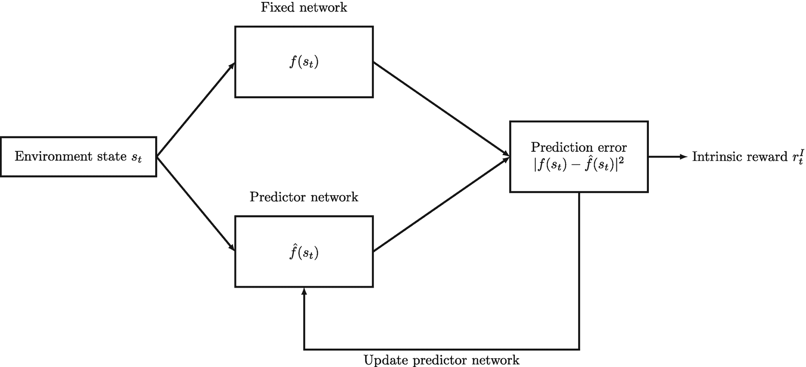
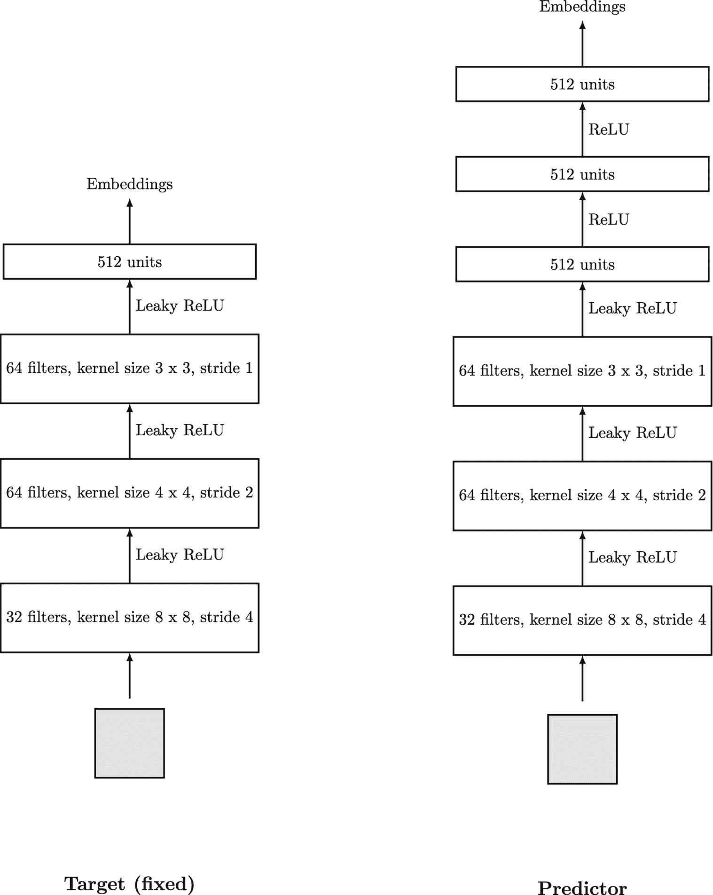
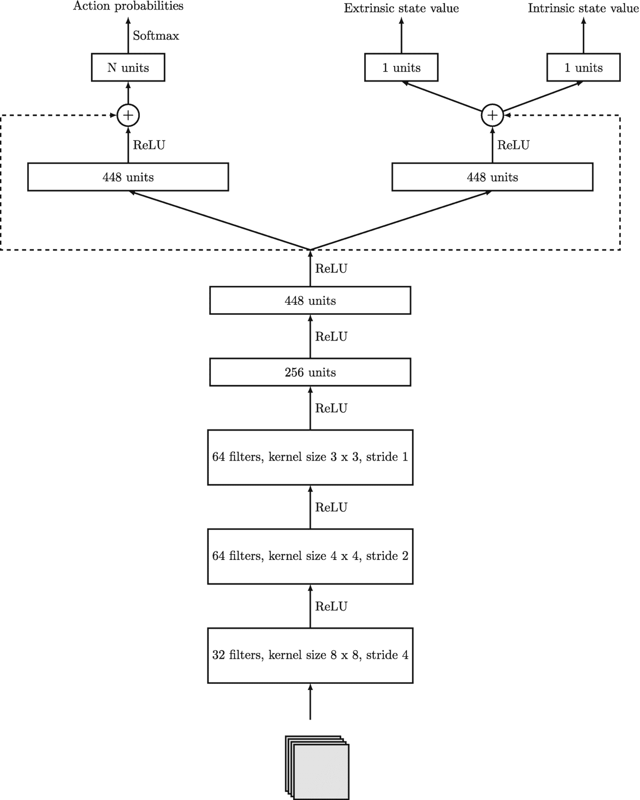
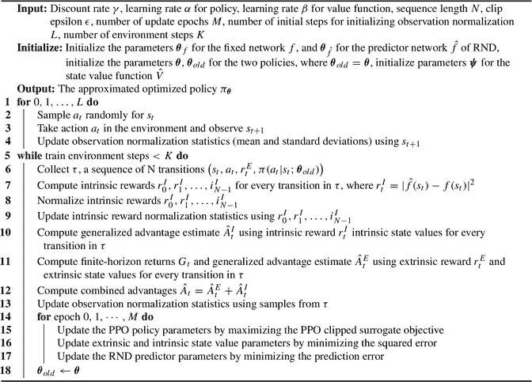
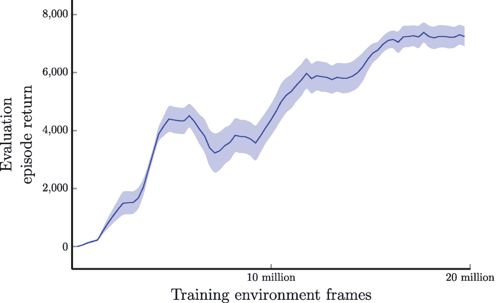
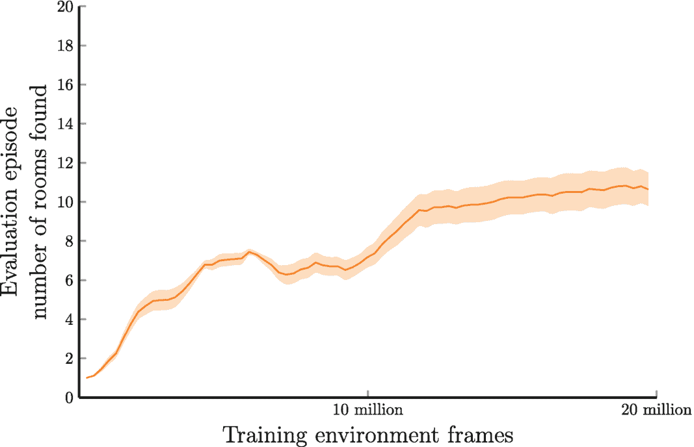

# 13. 好奇心驱动的探索

强化学习是一种机器学习类型，其中智能体通过在环境中采取行动并接收奖励信号形式的反馈来进行学习。智能体的目标是最大化随时间累积的奖励。然而，某些挑战可能会阻碍学习过程。这些挑战包括难以探索的环境、稀疏或不确定的奖励。

当环境难以探索且奖励稀缺或不确定时，我们在有效训练智能体方面面临障碍。这可能是由于状态空间过大，或者任务需要一系列动作才能达到奖励状态。此外，智能体可能无法从环境中接收到清晰或频繁的奖励信号，这使得智能体难以学习并做出适当的决策。

为了应对这些挑战，本章引入了好奇心驱动的探索概念作为潜在的解决方案，特别关注随机网络蒸馏（RND）。好奇心驱动的探索涉及激励智能体探索其环境并更深入地理解它，即使在没有明确奖励信号的情况下也是如此。通过促进探索并使智能体能够获取关于其周围环境的知识，我们可以增强其做出明智决策和取得更好结果的能力。

例如，想象一个智能体被分配了在迷宫中导航以到达目标的任务。如果智能体仅在到达目标时才获得奖励，那么当奖励信号稀疏或不确定时，它可能难以学习最优路径。然而，如果我们鼓励智能体探索迷宫并了解更多关于其结构和布局的信息，它可能能够更有效地导航，并最终更高效地到达目标。

在接下来的章节中，我们将探讨如何使用基于策略的方法结合好奇心驱动的探索，以在具有挑战性的环境中改进强化学习。

### 13.1 难以探索问题与稀疏奖励问题

#### 难以探索问题

在强化学习中，难以探索问题是指由于关于环境的信息有限，智能体难以找到最优策略的问题。当环境具有较大的状态或动作空间，或者某些动作很少被执行时，就可能出现这种情况。智能体可能难以充分探索状态-动作空间以学习有效的策略。

难以探索问题的一个具体例子是在迷宫中导航。智能体必须学习在迷宫中导航并到达目标，但迷宫可能有许多路径，其中一些路径通向死胡同或次优结果。另一个例子可以在电子游戏中找到，智能体需要学习如何在游戏世界中导航、击败敌人并完成任务。游戏世界可能广阔而复杂，智能体可能没有足够的信息来做出明智的决策。

为了克服这些挑战，智能体可能需要广泛探索环境以确定最优路径。然而，随机探索，例如`ε`-贪婪策略，可能不足以发现隐藏状态或环境中难以到达的部分，并且智能体在到达这些状态之前可能不会收到任何奖励。这可能会使智能体难以学习成功的策略。

#### 稀疏奖励问题

稀疏奖励问题是强化学习中另一个常见的挑战，其中奖励信号仅在特定状态下提供，这使得智能体难以理解哪些动作导致了这些奖励。这可能会使学习良好策略的过程变得缓慢且充满挑战，尤其是在复杂环境或奖励信号不频繁或延迟的任务中。

稀疏奖励问题的一个具体例子是国际象棋游戏，其中智能体仅在游戏结束时收到有意义的信号（`+1`、`0`、`-1`），否则奖励为零。这意味着智能体在游戏过程中没有关于哪些动作好或坏的直接反馈，并且需要探索巨大的状态空间以找到良好的策略。类似地，在机器人导航任务中，奖励信号可能仅在机器人到达目标时给出，这使得智能体难以学习哪些动作促成了成功的导航。

需要注意的是，稀疏奖励问题与难以探索问题不同，后者发生在智能体必须搜索巨大的状态空间以找到最优策略时。然而，通常情况下，稀疏奖励问题同时也是难以探索问题。

总之，稀疏奖励问题是强化学习中的一个重大挑战，它可能使学习良好策略的过程变得缓慢且困难，尤其是在复杂环境或奖励信号不频繁或延迟的任务中。


#### 蒙特祖玛的复仇

雅达利电子游戏`Montezuma’s Revenge`被认为既是一个难以探索的问题，也是一个稀疏奖励问题。

在这款游戏中，玩家必须穿越迷宫般的神庙，收集宝藏并击败敌人^(¹²)。游戏的最终目标是到达宝藏室，收集梦寐以求的“蒙特祖玛的宝藏”。

游戏的高难度源于众多必须避开或击败的障碍物、敌人和陷阱，例如尖刺坑和消失的地板。此外，游戏庞大的状态空间（例如，游戏有多个房间，每个房间布局不同）要求玩家按正确顺序执行特定动作才能进入不同区域或房间，这使其成为一个难以探索的问题。

此外，游戏仅在玩家发现秘密房间和隐藏宝藏时给予奖励，这使其成为一个稀疏奖励问题。例如，在第一个房间中，玩家必须先收集钥匙才能解锁下一个房间并获得奖励。

总体而言，`Montezuma’s Revenge`因其复杂的环境和稀疏的奖励，对强化学习智能体构成了一个具有挑战性的问题。它要求智能体保持好奇心，彻底探索环境，并规划长期策略以成功完成游戏。

### 13.2 好奇心驱动的探索

好奇心驱动的探索是强化学习中用于鼓励在复杂或稀疏奖励问题中进行探索和学习的一种强大技术。该想法最初由 Pathak 等人提出 [1]。在传统的强化学习方法中，智能体被激励采取能获得环境提供的最大奖励的动作。然而，这可能导致短视行为和缺乏探索，从而使智能体错失有价值的信息。

好奇心驱动的探索采取了不同的方法，它鼓励智能体基于内在动机而非外在奖励来探索环境。其理念是通过在奖励信号中添加好奇心奖励来促进内在动机。该奖励的计算基于智能体对动作结果的预测与实际结果之间的差异程度。因此，即使某些动作不会立即从环境中获得奖励，智能体也会被激励去探索那些能带来新奇和意外体验的动作。

这种方法不同于传统的外在奖励，后者由环境提供，并直接与实现特定目标或期望行为挂钩。而内在奖励则由智能体内部生成，激励其在环境中探索和发现新事物。

例如，考虑一个训练机器人以最短时间在房间内导航找到目标物体的任务。传统的强化学习算法会鼓励机器人走最短路径到达目标，即使存在其他可能包含有用信息的路径。然而，通过好奇心驱动的探索，机器人也会被激励去探索不同的路径，并更多地了解环境，以最大化其好奇心奖励。

内在奖励是给予智能体用于探索和发现环境中新事物的奖励，而非用于实现特定目标或执行期望行为。该奖励由智能体自身内部生成，并激励智能体尝试新的行为或访问其未曾见过的新状态。

先前的研究已证明了好奇心驱动的探索在各种强化学习任务中的有效性，例如玩雅达利游戏、穿越迷宫以及解魔方。OpenAI 甚至通过好奇心驱动的探索，仅凭探索环境和寻求新奇，就训练了一个人形机器人学习多种技能。

在本章中，我们将重点介绍一种创新且被广泛采用的解决方案，即 Burda 等人提出的“基于随机网络蒸馏的探索” [2]，该方法使用随机网络来生成好奇心奖励。这种方法可以在复杂任务中实现更高效的计算和有效的学习，使好奇心驱动的探索成为强化学习中一种前景广阔的技术。


### 13.3 随机网络蒸馏

随机网络蒸馏（RND）是一种旨在鼓励学习智能体进行探索的强化学习算法。该算法由 Burda 等人提出 [2]，其核心思想是基于智能体体验的新颖性来计算内在奖励。换句话说，该算法会奖励智能体遇到新的、未曾预料到的体验。

RND 使用两个神经网络：一个固定且随机初始化的目标网络，记为 `f`；以及一个预测器网络，记为 `\hat{f}`，该网络使用智能体收集的数据进行训练。在训练过程中，固定网络 `f` 的权重保持不变，而预测器网络 `\hat{f}` 的权重则通过基于预测误差的监督学习进行更新。

在时间步 `t` 时，状态 `s_t` 的内在奖励信号 `r_t^{I}` 计算如下：

```
\displaystyle \begin{aligned} r_t^{I} = \lvert f(s_t) - \hat{f}(s) \lvert² \end{aligned}
```

(13.1)

更精确地说，RND 算法可以通过以下步骤描述：

-   固定网络 `f` 将状态 `s_t` 作为输入，并输出一个嵌入特征向量 `\tau_t`。
-   预测器网络将相同的状态 `s_t` 作为输入，并输出其自身的嵌入特征向量 `\hat{\tau}_t`。
-   然后，预测器网络 `\hat{f}` 的预测与固定网络 `f` 之间的差异被用来计算内在奖励，即 `\lvert \hat{\tau}_t - \tau_t \rvert²`。
-   随后，预测器网络被训练以最小化预测误差 `\lvert \hat{\tau}_t - \tau_t \rvert²`，这是通过使用监督学习方法完成的。

图 13.1 展示了 RND 的工作原理。



RND 计算内在奖励和更新的流程图从环境状态 `s_t` 开始。它流经固定网络 `f(s_t)`、预测器网络 `\hat{f}(s_t)` 和预测误差。最终得到内在奖励 `r_t^{I}`。预测误差通过更新预测器网络反馈给预测器网络。

**图 13.1** RND 如何计算内在奖励并更新预测器网络。改编自 Burda 等人 [2]

内在奖励与环境提供的奖励信号相结合，得到总奖励 `r_t = r_t^{E} + r_t^{I}`，其中 `r_t^{E}` 是环境在时间步 `t` 提供的奖励，`r_t^{I}` 是与时间步 `t` 的转移相关的探索奖励（内在奖励）。这个总奖励可以接入任何现有的强化学习算法中，例如 DQN、Actor-Critic，甚至是 PPO。

为了理解 RND 背后的直觉，让我们看一个简单的例子。假设我们试图训练一个智能体在迷宫中导航，环境只在智能体成功到达目标位置时提供 +1 的正奖励，否则奖励为零。在这种情况下，智能体可能难以做出适当的决策并探索环境，因为在到达目标之前没有提供有意义的奖励。

为了鼓励智能体更多地探索，我们可以使用 RND。固定网络 `f` 是随机初始化的，并且在训练过程中保持不变。它接收智能体在迷宫中的当前状态，并输出一个代表该状态的唯一嵌入特征向量 `\tau_t`。同时，预测器网络 `\hat{f}` 接收相同的状态，并尝试预测来自固定网络的嵌入特征向量 `\tau_t`。

当智能体探索迷宫时，预测器网络 `\hat{f}` 为当前状态 `s_t` 预测嵌入特征向量 `\hat{\tau}_t`，固定网络 `f` 也为 `s_t` 生成其自身的嵌入特征向量 `\tau_t`。然后，基于这两个预测向量之间的平方欧几里得距离来计算内在奖励：`\lvert \hat{\tau}_t - \tau_t \rvert²`。如果智能体遇到一个与之前见过的任何状态都显著不同的新状态，那么预测向量之间的距离将会很大，从而产生较高的内在奖励。另一方面，如果智能体重复访问相同的状态，预测向量之间的距离将会很小，从而产生较低的内在奖励。

这个内在奖励随后与环境奖励相结合，总奖励用于更新智能体的策略。通过鼓励智能体探索新的状态和体验，RND 可以帮助智能体更有效地学习，并更高效地在迷宫中导航。

用于 Atari 游戏的 RND 模块的神经网络架构如图 13.2 所示。该模块包含左侧的目标网络，它是随机初始化的，其参数在训练过程中保持固定。右侧是预测器网络，它与目标网络相似，但包含两个额外的全连接层。两个网络都接收一个归一化的 `84 \times 84 \times 1` 单帧作为输入，并输出一个嵌入向量。预测器网络的目标是准确预测由固定目标网络生成的嵌入向量。



两个自下而上的流程图，分别标注为目标网络和预测器网络，展示了 RND 神经网络架构。目标网络和预测器网络都以 32 个滤波器、内核大小 8x8 和步长 4 开始，并以 512 个单元的嵌入层结束。目标网络和预测器网络分别有 4 个带有 leaky ReLU 连接的阶段和 6 个带有 ReLU 连接的阶段。

**图 13.2** Burda 等人 [2] 为 Atari 视频游戏提出的 RND 神经网络架构，其中左侧显示随机初始化的目标网络，右侧显示预测器网络


#### 原始 RND 论文中的探索机制

在原始 RND 论文中，Burda 等人[[2]](#605748_1_En_13_Chapter.xhtml#CR2)发现，强化学习中的预测误差可能由多种因素引起，包括训练数据量、随机性、模型错误设定以及学习动态。为了利用这些信息进行探索，RND 方法使用预测误差作为探索奖励。

然而，RND 中使用的固定目标网络使得训练预测器网络比学习最优策略容易得多。因此，随着预测器网络在预测结果方面变得更好，探索奖励的有效性可能会降低。为了解决这个问题，Burda 等人[[2]](#605748_1_En_13_Chapter.xhtml#CR2)提出，当参与者数量非常大时，有意限制用于训练预测器网络的训练数据量。具体来说，他们建议根据公式`min(1, 32/N)`使用可用样本的一部分，其中`N`是并行运行以生成训练样本的参与者数量。

使用预测误差作为探索奖励的一个主要挑战是，不同环境和时间步之间的奖励尺度可能变化很大。为了保持奖励尺度一致，内在奖励通常会被归一化，例如通过使用内在回报的标准差的运行估计进行除法。

RND 方法的另一个问题是如何处理两个 RND 神经网络的输入数据。当使用固定目标网络时，观测归一化至关重要，因为参数无法适应不同数据集的尺度。如果没有归一化，输入的方差可能会变得非常高。RND 方法通过使用一种观测归一化方案来解决这个问题，该方案类似于连续控制问题中使用的方案，即通过减去运行均值然后除以运行标准差来对每个维度进行白化处理。归一化后的观测值被裁剪到-5 到 5 之间。运行均值和标准差通过在开始优化之前让随机智能体在环境中执行少量步数来初始化。相同的观测归一化同时用于预测器网络和目标网络，但不用于策略网络。

通常，RND 模块仅在训练期间使用，而不在智能体与环境交互期间使用。然而，在某些情况下，它可以集成到智能体的决策过程中。例如，Badia 等人[[3]](#605748_1_En_13_Chapter.xhtml#CR3)开发的`Agent57`算法是`DQN`方法的进阶版本，它使用来自 RND 模块的内在奖励作为神经网络的输入数据，该神经网络近似最优状态-动作值函数，从而使智能体能够做出更明智的决策。

本章将重点介绍将 RND 模块与近端策略优化（PPO）算法结合使用，PPO 是一种流行的基于策略的方法。通过引入内在奖励，我们希望提高智能体的学习效率，并在复杂环境中实现更好的性能。

##### RND 与 PPO 结合

近端策略优化（PPO）是一种流行的强化学习算法，它使用替代目标函数来更新策略。该替代目标函数最大化采取能够改进策略的动作的概率，同时确保策略不会偏离之前的策略太远。

回顾一下，PPO 使用以下裁剪后的替代目标函数：

```
argmax_{π'} L_π^{CLIP}(π') = argmax_{π'} E_{τ ~ π}[ min( (π'(a|s)/π(a|s)) * Â_t, clip(π'(a|s)/π(a|s), 1-ε, 1+ε) * Â_t ) ]
```

(13.2)

优势函数使用广义优势估计（GAE）方法计算：

```
Â_t = δ_t + (γλ)δ_{t+1} + (γλ)²δ_{t+2} + ... + (γλ)^{T-t-1}δ_{T-1}
```

(13.3)

这里，`δ_t`是时序差分误差，即奖励总和与当前状态估计值及后继状态估计值之间的差值：

```
其中 δ_t = r_t + γV_π(s_{t+1}) - V_π(s_t)
```

(13.4)

为了在 PPO 算法中使用 RND 产生的内在奖励，我们需要对现有的 PPO 算法进行一些修改。更准确地说，我们希望将外在和内在的估计优势合并为单一的优势估计。这意味着我们还必须估计内在状态值和优势。

```
Â_t = Â_t^E + Â_t^I
```

为了估计内在优势`Â_t^I`，我们需要估计的内在状态值；这就是为什么我们还需要使用神经网络（评论家）来预测内在状态值。这个神经网络可以与预测策略和外在状态值的网络同时训练，其目标与外在状态值的情况类似，即我们希望最小化预测误差。

在实践中，我们可以将用于预测内在状态值的神经网络的权重与预测策略和外在状态值的网络共享。这有助于降低训练的计算成本，并使算法更高效。我们还使用了一个稍微复杂的神经网络架构，其中包含跳跃连接，这是从`ResNet`借鉴的概念，如图 13.3 所示。



*PPO 神经网络架构的自底向上流程图：从 32 个滤波器开始，内核大小为 8x8，步长为 4，通过 ReLU 连接分流到两组 448 个单元。左侧组通过 SoftMax 输出动作概率。右侧组输出外在和内在状态值。*

**图 13.3** Burda 等人[[2]](#605748_1_En_13_Chapter.xhtml#CR2)为 Atari 视频游戏提出的结合 RND 的 PPO 神经网络架构，该网络具有三个输出头：用于预测动作概率的策略头、用于预测外在状态值的外在状态值头以及用于预测内在状态值的内在状态值头。

作为示例，RND 与 PPO 算法结合的伪代码如算法 1 所示。


##### 算法 1：RND 与近端策略优化

 一个 18 行的`RND`与近端策略优化算法，输入以下参数，输出近似最优策略`pie_theta`。参数包括：`Gamma`、`alpha`、`beta`、`N`、`epsilon`、`M`、`L`和`K`。

图 13.4 展示了带有`RND`模块的`PPO`（裁剪版本）智能体在 Atari 游戏《蒙特祖玛的复仇》中的表现。



一张评估回合回报与训练环境帧数的折线图。图中呈现上升趋势，伴有小幅波动。部分估计值如下：(1000 万, 3800)、(1500 万, 6500)、(2000 万, 7000)。

**图 13.4** 带有`RND`模块的`PPO`在 Atari 游戏《蒙特祖玛的复仇》中的表现。结果展示了平均回合回报（未折扣总奖励）及 95%置信区间。结果基于三次独立运行的平均值，并使用窗口大小为 5 的移动平均进行平滑处理。

我们采用分布式强化学习架构，并行运行 32 个演员（actor）收集样本序列，并由一个学习者（learner）智能体执行参数更新。我们使用本章前面介绍的相同神经网络架构，同时用于`PPO`和`RND`。具体来说，我们对外部（环境）奖励和内部（好奇心奖励）奖励使用不同的折扣率，外部奖励为 0.999，内部奖励为 0.99。`PPO`策略网络和`RND`预测器网络的学习率均为 0.0001，优势函数的`GAE` lambda 值为 0.95，序列长度为 128，更新轮次为 4 轮。我们还使用熵来鼓励探索，熵权重为 0.001。神经网络使用`Adam`优化器进行训练。

我们采用与`DQN`类似的环境处理方式，包括将帧调整为`84 x 84`并转换为灰度图。我们还应用了跳跃动作技术，即每四帧只处理一帧，并将最后四帧堆叠起来，形成大小为`84 x 84 x 4`的最终状态图像。对于`RND`网络，我们只将最后一帧作为输入，即一张`84 x 84 x 1`的图像。

此外，我们将奖励值裁剪到`-1`到 1 的范围内，并将最大回合长度设置为 18,000，即在应用跳跃动作和帧跳过后的 4500 步。

性能通过获得的平均奖励来衡量。为了评估智能体的性能，我们在每次训练迭代结束时，在一个独立的测试环境中使用贪婪策略运行了 100,000 个评估步骤，该测试环境包含来自每个演员的`128 x 500 x 4`帧，评估环境中不应用奖励裁剪或生命损失时的软终止。结果基于三次独立运行的平均值，并使用窗口大小为 5 的移动平均进行平滑处理。

图 13.5 还展示了智能体每场评估游戏平均找到的房间数量。访问更多房间表明智能体探索了游戏中的更多状态，这通常会导致发现隐藏宝藏并获得大量奖励。



一张评估回合中找到的房间数量与训练环境帧数的折线图，呈现上升趋势，伴有小幅波动。部分估计值如下：(1000 万, 7)、(1500 万, 10)、(2000 万, 11.5)。

**图 13.5** 带有`RND`模块的`PPO`在 Atari 游戏《蒙特祖玛的复仇》中的表现。结果展示了智能体平均找到的房间数量及 95%置信区间。结果基于三次独立运行的平均值，并使用窗口大小为 5 的移动平均进行平滑处理。

需要注意的是，上述图表中的 x 轴仅代表每个演员的训练环境帧数。要获得总的训练环境帧数，我们需要将该值乘以训练过程中涉及的演员数量。在我们的案例中，总的训练环境帧数为 6.4 亿，这是通过将 2000 万乘以 32（训练过程中涉及的演员数量）得到的。

实验结果乍看之下令人鼓舞，但仔细审视录制的游戏过程后，很明显智能体并未真正掌握游戏。例如，在第一个房间中，拿到钥匙后，智能体未能利用梯子爬到房间顶部——这本应是它到达钥匙所用路径的逆序操作。相反，它选择从一堵高墙上跳下，导致损失一条命。

另一个例子是，在某些房间中，智能体错过了沿梯子下行进入下一个房间的机会，反而选择与一个恶魔角色战斗，而这是不可能获胜的，导致又损失一条命。

这些以及游戏过程中其他类似的次优行为表明，虽然好奇心驱动的探索可以鼓励智能体应对复杂且具有挑战性的问题，但它并不能保证学到的策略始终是最优的。这是因为好奇心驱动探索的目标与策略的目标根本不同。因此，这个问题激发了关于强化学习安全探索的积极研究[4, 5]。

### 13.4 总结

本章深入探讨了强化学习中难以探索问题和稀疏奖励问题所带来的挑战。我们探讨了强化学习智能体在应对这类问题时面临的基本困难，其中探索和奖励信号的稀缺阻碍了学习进程。

为了应对这些挑战，我们引入了好奇心驱动探索的概念。这种技术使智能体能够构建自己的内部奖励系统，从而帮助解决复杂的强化学习问题。我们介绍了一种特别有趣且实用的方法，称为随机网络蒸馏（`RND`）。我们深入探讨了`RND`的内部工作原理及其背后的直觉。通过将`RND`与近端策略优化（`PPO`）算法相结合，我们展示了智能体在《蒙特祖玛的复仇》（最具挑战性的 Atari 游戏之一）中取得的卓越表现。

重要的是，好奇心驱动的探索鼓励智能体寻找新颖有趣的体验，以增强其知识和技能，而策略则专注于优化智能体在完成特定任务或目标时的表现。值得注意的是，虽然好奇心驱动的探索可以极大地增强智能体的整体学习能力，但它并不一定能保证在所有场景下都达到最优性能。

展望未来，下一章将把重点转向基于模型的强化学习。具体来说，我们将探索著名的`AlphaZero`智能体，它在围棋、国际象棋和将棋等游戏中已经超越了人类大师的水平。

**脚注** 1


