# 14. 基于模型的规划：AlphaZero

在本书中，我们讨论了多种无模型强化学习算法，这些算法在解决经典控制任务和雅达利视频游戏等简单强化学习问题上已被证明是有效的。然而，对于更复杂的问题，即使应用了分布式训练和好奇心驱动探索等先进技术，这些算法的表现也可能不尽如人意。因此，在最后一章中，我们将探讨如何使用基于模型的强化学习来应对更具挑战性的任务。

我们将重点介绍如何利用游戏环境的精确模型以及诸如蒙特卡洛树搜索（`MCTS`）等高级搜索算法进行规划。具体来说，我们将研究 `AlphaZero` 算法如何应用于像国际象棋和围棋这样复杂的双人零和游戏。

本章将展示基于模型的强化学习作为解决复杂游戏工具的强大能力，以及如何使用像 `MCTS` 这样的高级搜索算法来增强规划过程。

### 14.1 为什么我们需要在强化学习中进行规划

强化学习在解决经典控制任务和雅达利视频游戏等简单问题上展现了令人印象深刻的表现。然而，它在解决实际且具有挑战性的现实世界任务方面的潜力更令人关注。其中一项具有挑战性的任务就是围棋，它被认为是最复杂的棋盘游戏之一。

围棋是一种在  网格上进行的策略棋盘游戏。两名玩家参与，分别使用黑色或白色棋子作为代表。游戏的主要目标是捕获对手的棋子或在棋盘上建立领地。当所有可能的落子都完成后，游戏结束，通常是在双方都同意没有进一步有利可图的落子时。最后，根据标准计分规则，得分最高的玩家被宣布为获胜者。此外，如果一名玩家认为自己没有获胜机会，可以选择认输，从而让对手获胜。

围棋是一种零和、完全信息、确定性的策略游戏，与国际象棋和跳棋等其他著名游戏类似。尽管规则简单，但围棋的实际策略极其复杂，强调了在多个层面上保持平衡的重要性。

围棋是一种极其复杂的游戏，可能的棋盘局面数量高达惊人的 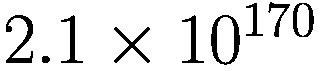 种 [2]，使其成为世界上最具挑战性的棋盘游戏。相比之下，国际象棋的合法局面数量估计在 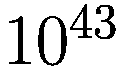 到 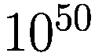 之间。

除了数量惊人的可能棋盘局面外，围棋和其他双人零和游戏还面临信用分配问题。在到达时间步 `T` 的终止状态之前，中间步骤的奖励为零，此时根据游戏结果给予 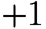 或  的奖励。在某些情况下，例如国际象棋，结果也可能是平局，即没有玩家获胜或失败，最终奖励为零。

与大多数基于吃子的游戏（如国际象棋或跳棋）不同，这些游戏的复杂性会随着棋子的移除而降低，而围棋则随着每一步在棋盘上放置一个新棋子而变得越来越复杂，如图 14.1 所示。

下围棋需要高度的战略思维和规划能力，这无法通过简单地随机探索游戏来实现。初学者往往会输给那些有能力创造有效阵型的有经验的玩家。职业棋手使用复杂的策略来模拟可能的落子并预测对手的下一步，评估潜在的结果以选择最佳落子。这种模拟和规划过程可能涉及思考很多步之后的局面，并且依赖于棋手的经验、专业知识和直觉。

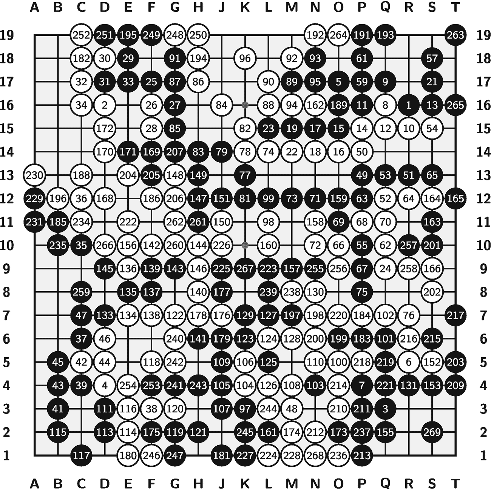

在 19x19 网格上进行的围棋策略棋盘游戏示意图。

图 14.1

围棋游戏随着每一步在棋盘上放置一个新棋子而变得越来越复杂。志田达哉（黑）对阵铃木伸二（白），2018 年第 66 届 NHK 杯围棋赛。白棋以 2.5 目获胜。棋谱来自 CWI [1]


尽管强化学习在较简单的任务中已展现出令人印象深刻的表现，但当前算法在应对围棋的复杂性和策略性方面仍面临重大挑战。赢得这项游戏需要高级规划和策略性思维，而随机探索无法提供这些能力。因此，有必要开发一种能够高水平下围棋的新算法。

为了让我们的强化学习智能体具备像人类专业棋手一样的规划和策略性思维能力，专门针对围棋定制的算法已被开发出来。这些算法依赖于一个能够辅助智能体进行规划和策略决策的模型。

环境模型由两个部分组成：动力学函数（也称为状态转移函数）和奖励函数。动力学函数描述了游戏状态如何根据智能体及其对手所采取的行动而变化。奖励函数则根据游戏状态和在该状态下采取的行动，为玩家分配一个数值。通过使用这些函数，智能体可以模拟可能的未来情景，评估潜在结果，并根据其策略和目标选择最佳落子。

在像围棋或国际象棋这样的两人零和游戏中，由于游戏是确定性的，我们可以创建一个精确的模型。如果玩家落子，我们确切知道后续状态会是什么，因此我们可以开发出一个近乎完美的动力学函数（尽管对于围棋这样的游戏，它实际上相当复杂）。由于除了最终状态外，奖励始终为零，并且游戏的计分规则众所周知，我们也可以为游戏创建一个精确的奖励函数。此外，由于棋盘配置是完全可观测的，每个游戏状态下可能的合法落子信息也是现成的。

假设我们拥有一个完美的游戏模型，我们如何利用该模型使强化学习智能体像人类专业棋手一样进行规划呢？对于两人零和游戏，一种传统方法是使用某种搜索算法来进行规划，例如由约翰·冯·诺依曼和奥斯卡·摩根斯特恩提出的`Minimax`算法[3]。该算法创建了一个由节点和边组成的树形数据结构，节点代表游戏的不同状态，连接各个节点的边代表导致后续节点或状态的合法落子或行动。搜索过程的目标是发现能在每个状态下最小化对手最大收益的落子，或者最小化潜在损失以迫使平局。

IBM 的`Deep Blue`[4]是利用`Minimax`搜索算法在国际象棋中达到大师级水平的例子。`Deep Blue`采用启发式评估函数和`alpha-beta`搜索算法（对标准`Minimax`搜索算法的改进），并结合并行计算，进行多步规划以确定每种棋盘配置下的最佳落子。启发式评估函数对`Deep Blue`的成功至关重要，它是基于国际象棋大师和计算机科学家定义的规则和模式创建的。

然而，由于围棋的动态特性和更大的分支因子，为其创建或学习一个精确的启发式评估函数要困难得多。人们曾尝试使用神经网络和监督学习来评估局势，例如，M. Enzenberger[5]提出使用神经网络和时间差分学习[6]来预测游戏过程中的领地。然而，这些工作仅达到了较弱或中等水平的棋力。因此，我们需要确定一种更适合围棋的更强大的搜索算法。

### 14.2 蒙特卡洛树搜索

蒙特卡洛树搜索（MCTS）是一种广泛使用的搜索算法，用于在游戏和其他决策领域寻找最优行动。它结合了树搜索与蒙特卡洛随机采样，以估计状态和行动的价值，并利用这些估计做出更好的决策。

MCTS 的工作原理是：从当前状态开始迭代构建一棵搜索树，选择有希望的节点进行探索，用新节点扩展树，从这些新节点出发使用蒙特卡洛采样模拟游戏结果，并用结果更新树结构。MCTS 的一个主要优点是，它进行搜索几乎不需要或完全不需要领域知识，这使其成为在复杂领域（如围棋）中进行规划的热门选择。

MCTS 的关键优势之一是其处理各种领域中复杂决策问题的能力。与其他搜索算法不同，MCTS 不需要特定领域的评估函数或启发式方法来指导搜索。相反，它依赖蒙特卡洛采样来探索搜索空间并评估潜在行动，使其成为一种灵活且通用的算法。

MCTS 的成功在围棋中最为显著，基于 MCTS 的 AI 程序已能在小棋盘上达到人类大师级水平。例如，2006 年，Sylvain Gelly 和 Yizao Wang[7]实现了首批使用 MCTS 的计算机程序。此后，MCTS 在计算机围棋领域迅速得到应用。2008 年，Sylvain Gelly 和 David Silver[8]提出了一个名为`MoGo`的计算机程序（它使用了 MCTS 和其他技术），该程序能在`9×9`棋盘上达到人类大师级水平。MCTS 也已成功应用于其他游戏，如扑克、国际象棋和将棋。

总之，蒙特卡洛树搜索是一种强大且通用的算法，适用于复杂领域的决策。随着持续的开发和完善，它很可能仍然是解决具有挑战性的决策问题的宝贵工具。


#### MCTS 的四个阶段

如图 14.2 所示，通用的 MCTS 过程可概括为以下四个阶段：

- **选择**：从根节点开始，递归地应用某种预定义的子节点选择规则或策略，沿着树向下遍历，以选出最有潜力的子节点（例如，具有最高值或最高置信上界（UCB）得分的子节点），直到过程到达一个可扩展节点。

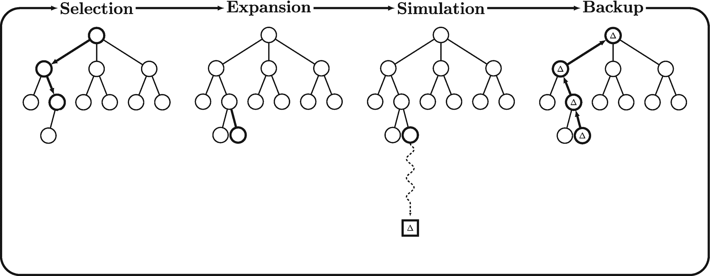

四个搜索树示意图，从左到右依次为选择、扩展、模拟和回传，包含不同层级的多个节点。

**图 14.2** 通用 MCTS 搜索算法的工作原理。该概念源自 Browne 等人的工作 [9]

- **扩展**：根据可用的移动（或动作），通过向搜索树中添加一个或多个子节点来扩展该树。

- **模拟**：从新添加的节点开始，根据某种回滚策略运行一次模拟，该策略决定了从当前状态到达到终止状态所采取的动作序列。

- **回传**：模拟的结果（例如，奖励信号）被回传到搜索树中遍历过的路径上，并更新相应的统计信息（例如，平均奖励和 UCB 得分）。

在此，我们讨论 MCTS 中的一些常见术语。根节点是代表搜索树根部的节点，对应于当前的游戏（非终止）状态。如果一个节点代表非终止状态，并且拥有未访问（或未探索）的子节点，即在该状态下仍有尚未尝试过的移动，则该节点是可扩展的。如果一个节点的所有子节点都至少被访问过一次，则该节点是完全扩展的。叶节点是代表非终止状态且没有任何子节点的节点，意味着尚未尝试任何移动。当 MCTS 过程刚开始时，叶节点可能是根节点，也可能是搜索树中某个完全未扩展的节点。

虽然图 14.2 选择阶段所示的树在不同层级有多个节点，但该树最初仅从一个根节点开始，并以增量且不对称的方式，通过一次次迭代逐步构建，每次迭代都从树的根节点开始。图 14.3 展示了一个简化示例来说明此过程。在这个简单案例中，我们展示了一个游戏，其中每个游戏状态都只有三种可能的移动。

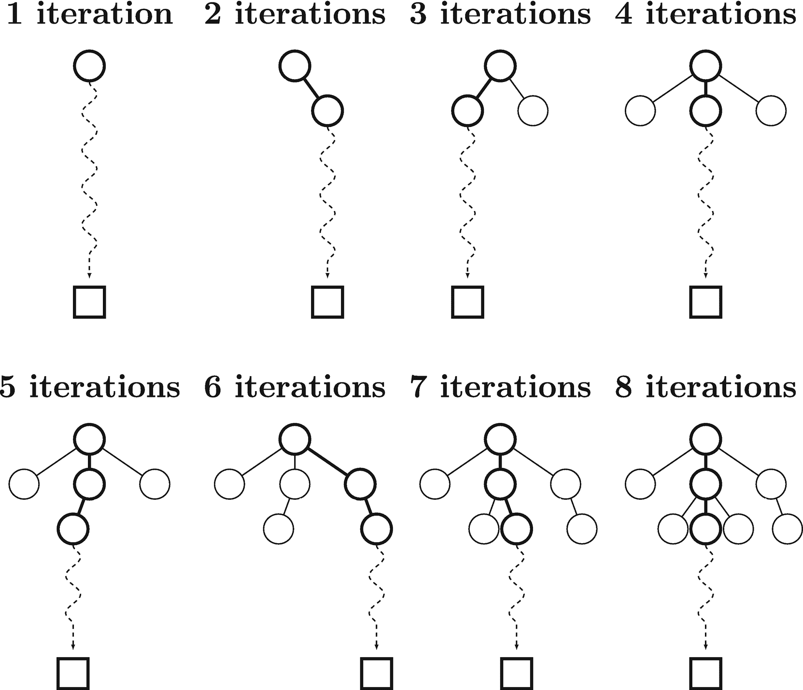

搜索树构建过程的示意图，标注了 1、2、3、4、5、6、7 和 8 多次迭代。树的密度随迭代次数增加而增加。

**图 14.3** 通用 MCTS 搜索算法如何通过多次迭代构建搜索树的示例

当搜索过程刚开始时（图中的第一次迭代），搜索树完全是空的。由于树完全是空的，因此没有适用的子节点选择阶段。创建一个根节点并将其添加到树中，这个新添加的根节点同时也是叶节点。从该叶节点开始，使用某种回滚策略（例如均匀随机策略）运行一次模拟，直到游戏结束，并在回传阶段使用奖励信号来更新遍历过的节点的统计信息。例如，如果模拟结果获胜，奖励信号为 `r=1`，那么根节点的统计信息将是 `N=1, W=1`，其中 `N` 代表总访问次数，`W` 代表总动作价值。

在第二次迭代时，根节点仍然是可扩展的，因为它有未探索的移动，所以没有选择阶段。根据标准的 MCTS 流程，通过创建一个新的子节点（对应于之前未探索的移动）并将其添加到根节点来扩展树。这个新添加的子节点成为当前节点，同时也是一个叶节点。再次，从该叶节点运行一次模拟直到游戏结束，并将模拟结果一路回传到根节点（如图中粗权重边和节点所示）。假设模拟结果失败，奖励信号为 `r=-1`，那么新添加的子节点的统计信息应为 `N=1, W=-1`，而根节点的统计信息变为 `N=2, W=0`。第三次和第四次迭代也发生类似的过程，但在回传阶段，只有遍历过的路径（由粗权重节点和边指示）会被更新。

从第五次迭代开始，MCTS 的所有四个阶段都会执行，因为此时根节点已经完全扩展（所有移动都已被尝试过）。搜索过程根据某种树策略，从根节点开始选择一个（最佳）子节点。假设树策略选择了图中所示的中间子节点，它成为当前节点。由于当前节点是可扩展的，因此创建一个新的子节点（叶节点）并将其添加到树中。从这个新添加的节点运行一次模拟直到游戏结束，一旦模拟达到终止状态，便根据模拟结果更新遍历路径上的统计信息。

随着搜索继续进行更多次迭代（通常成百上千次），越来越多的节点将被添加到搜索树中，这些节点的统计信息将根据模拟结果以及来自这些不同迭代的遍历路径进行更新。

在所有搜索迭代完成后，根据某些预定义的规则（例如选择访问次数最多的子节点）从树的根节点中选择一个子节点，并在实际游戏中执行与该选定子节点对应的移动。需要注意的是，可能存在其他预定义的规则用于选择要执行的移动，这些规则可以根据特定的游戏或应用进行定制。

MCTS 算法的关键优势之一在于它能够选择搜索树中最有潜力的节点，从而随着时间的推移形成一棵不对称的树。

在 MCTS 中，算法通过迭代地选择要扩展和评估的节点来构建搜索树。节点的选择由树选择策略引导，该策略平衡了对搜索空间中未探索区域的探索与对有潜力区域的利用。有了正确的树选择策略，MCTS 倾向于更青睐有潜力的节点，同时不让其他节点的选择概率收敛到零，这导致随着时间的推移形成一棵不对称的树。

这种不对称性是有益的，因为它允许算法将搜索重点放在搜索空间中最有潜力和最重要的区域，同时仍保持一定的探索（图 14.4）。这一特性使得 MCTS 即使在处理非常大的搜索空间（例如围棋游戏）时也极其高效。

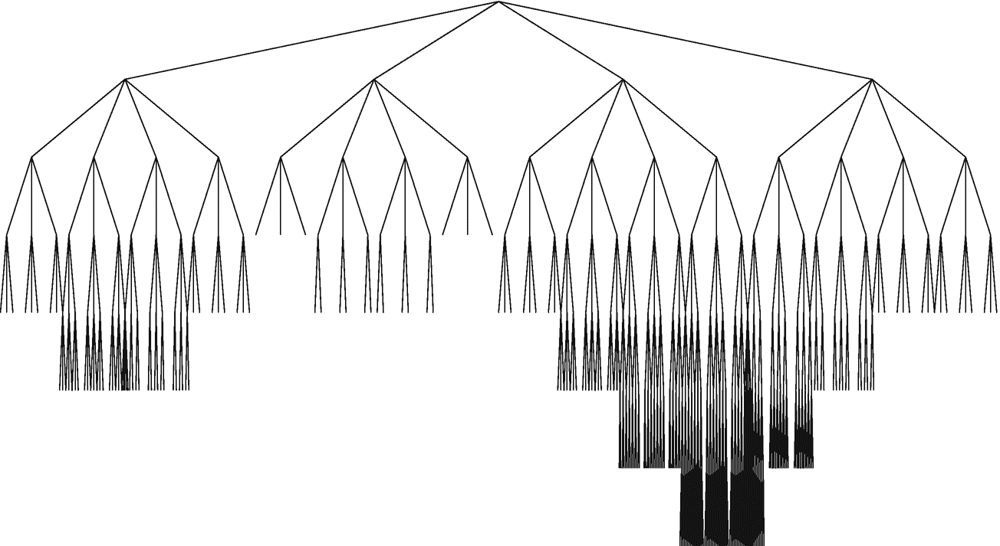

一棵不对称搜索树的示意图，包含不同层级的多个节点。

**图 14.4**


##### MCTS 非对称树生长示例

MCTS 非对称树生长示例，该算法优先探索最有希望的节点，而非穷举所有可能的节点和走法。这种选择性扩展策略使 MCTS 能够高效地探索庞大而复杂的博弈树。该概念源自 Browne 等人的研究 [9]。

通用 MCTS 的伪代码如算法 1 所示，改编自 Browne 等人的研究 [9]。搜索过程在固定的计算预算内持续进行，预算可以是时间或迭代次数。每次迭代从树的根节点开始，记为 `v0`。树策略被迭代应用以遍历树，直到找到最有希望的叶节点 `vl`。此时，叶节点被扩展并模拟，以获得结果 `Δ`。这些结果随后被反向传播回根节点。当计算预算耗尽后，从根节点中选择最佳子节点，并在实际游戏中执行相应的动作。请注意，伪代码中唯一未知的部分是 `BestChild` 函数，我们将在下一节讨论。

##### 算法 1：通用 MCTS

```
通用 MCTS 的搜索算法，包含函数：MCTS 搜索、树策略、扩展、最佳子节点、默认策略和反向传播。
```

其中，`ν` 是搜索树的一个节点，`s(ν)` 是节点 `ν` 对应的环境状态，`N(ν)` 是节点 `ν` 的访问次数，`W(ν)` 是总价值。

#### 树的置信上界

我们现在将讨论 MCTS 如何在搜索过程中选择最佳子节点，这是树策略的关键组成部分。在 MCTS 中，搜索树是基于节点在树中的选择方式构建的，因此选择最佳子节点对 MCTS 的成功至关重要。一种简单的实现是始终选择平均奖励最高的子节点，即估计的状态-动作价值。然而，这种方法有一个根本缺陷：它不会探索其他可能带来更好整体策略的动作。这本质上就是我们在本书第一部分介绍的探索-利用问题，这是强化学习中的一个重要主题。

在深入探讨 MCTS 如何选择最佳子节点之前，我们先来了解另一种称为置信上界（UCB）的算法。UCB 算法最初是为了解决赌博机问题而开发的，这是强化学习任务的一个特例，其中智能体只执行一个动作，环境立即进入终止状态，就像赌场里的老虎机一样。在这种情况下，单个回合中没有状态或动作的序列，只有一个状态和一个动作。顾名思义，该算法为每个可用动作计算一个置信上界，并尝试选择能够最大化 UCB 分数的动作。

UCB 算法是解决多臂赌博机问题的一种广泛使用的方法，该问题涉及选择动作以随时间最大化奖励。最简单的 UCB 版本称为 UCB1，由 Auer、Cesa-Bianchi 和 Fischer 在他们的论文《多臂赌博机问题的有限时间分析》[10] 中提出。

UCB1 算法选择能够最大化 UCB1 分数的动作，该分数使用公式 (14.1) 计算：

```
UCB1 = X̄_j + √(2 ln N / n_j)
```

(14.1) 其中 `X̄_j` 是动作 `j` 的平均价值（或平均状态-动作价值），`n_j` 是动作 `j` 被执行的次数。`N` 是到目前为止在赌博机问题背景下游戏（回合）的总执行次数。

UCB1 分数的第一项 `X̄_j` 鼓励智能体选择价值最高的动作，这被称为利用。第二项 `√(2 ln N / n_j)` 鼓励智能体探索其他可能具有更高潜在奖励的动作，因为它取决于动作被执行的次数。当 `n_j = 0` 时，UCB1 值变为 `∞`，因此未访问过的动作被赋予最大值。

我们可以调整 UCB1 算法，用于在蒙特卡洛树搜索（MCTS）中选择最佳子节点。这种修改后的算法通常被称为树的置信上界（UCT）。其基本思想是选择能够最大化 UCB 分数的子节点，该分数使用公式 (14.2) 计算：

```
UCB = X̄_j + 2C √(2 ln N / n_j)
```


(14.2) 其中 *N* 是当前节点的父节点被访问的次数，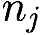 是子节点 *j* 被访问的次数。*C* 是一个常数，用于控制搜索过程中的探索程度。如果多个子节点具有相同的最大值，通常通过随机选择其中一个节点来打破平局。与`UCB1`一样，当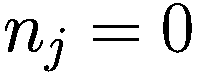时，`UCB`值变为。这确保了在进一步扩展之前，一个节点的所有子节点至少被访问一次。

为了理解`UCT`在实践中如何工作，让我们考虑一个游戏，其中玩家在棋盘上移动一个棋子。玩家每回合可以从几个可能的移动中选择，但不知道哪个移动是最好的。目标是找到导致最佳结果（例如，赢得游戏）的移动序列。

在搜索过程中，`UCT`算法维护一个游戏状态和可能移动的树，每个节点代表一个游戏状态，每条边代表一个可能的移动。搜索从根节点开始，根节点代表游戏的当前状态。在每一步，算法根据`UCB`分数选择一个子节点进行扩展，并持续进行直到到达叶节点。

一旦到达叶节点，就会执行一次模拟或推演，直到游戏达到终止状态。然后，模拟结果值会沿着所经过的路径反向传播回树中，更新路径上每个节点的`UCB`分数。这使得算法能够逐步改进对每个可能移动价值的估计，并更彻底地探索有希望的移动。

使用`UCT`算法选择最佳子节点的伪代码如算法 2 所示，其中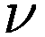是树中的一个节点，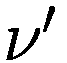是节点的一个子节点，*c* 是如公式(14.2)所示的一个常数。

**算法 2: UCT—最佳子节点**

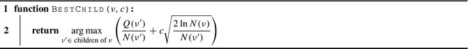 一个用于`UCT`最佳子节点的搜索算法，包含`bestChild`函数。`nu`和`c`是要传递的参数。

然后，我们可以将上述`UCT`算法插入到通用的`MCTS`算法中，这为我们提供了一个强大的框架，用于在强化学习问题中平衡探索和利用。通过使用这些算法，智能体可以通过探索新动作，同时利用已被证明有效的动作，逐步提高其性能。

#### 双人零和游戏的 MCTS

前面讨论的通用`MCTS`算法适用于智能体做出所有动作的单人游戏。然而，对于像国际象棋或围棋这样的双人零和游戏，情况变得更加复杂。这是因为在反向传播模拟结果时，我们需要考虑两个玩家的视角。

在双人零和游戏中，游戏的结果总是零和结果，这意味着一个玩家获胜，另一个玩家必须失败。因此，我们需要分别计算每个玩家的奖励。例如，在一盘国际象棋中，如果我们使用`MCTS`为黑方玩家规划下一步，并且模拟结果导致黑方获胜，那么我们应该为搜索树遍历路径中代表黑方回合的所有边分配+1 的奖励。然而，对于白方，奖励应为-1，因为这个结果代表白方失败。

一种解决方案是为对手玩家切换的符号，以准确反映游戏的性质。这是因为在双人零和游戏中，一个玩家的胜利总是另一个玩家的失败。因此，对两个玩家使用相同的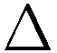无法准确表示游戏的结果。

图 14.5 展示了一个基于玩具游戏井字棋的`MCTS`如何反向传播模拟结果的示例。在这个游戏中，两个玩家轮流在一个三乘三的网格上落子。一个玩家下 X，另一个玩家下 O。第一个在水平、垂直或对角线上连成三子的玩家获胜。如果棋盘填满且没有玩家连成三子，则游戏为平局。

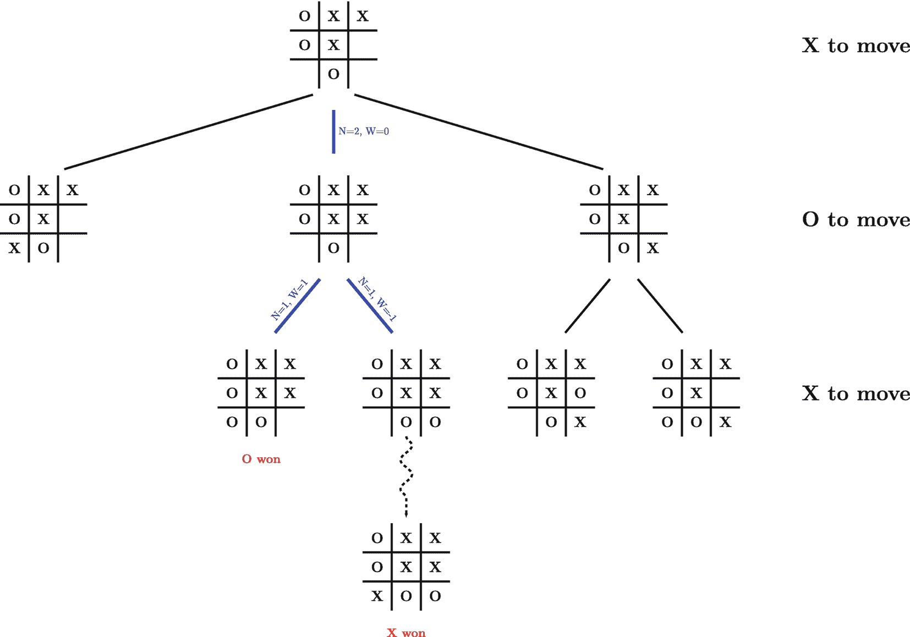

基于玩具游戏井字棋的双人零和游戏的十张图示，包含四个层级，分别是 X 移动、O 移动、X 移动和 O 移动。

**图 14.5** 基于玩具游戏井字棋的通用`MCTS`如何为双人零和游戏反向传播模拟结果的示例

为简单起见，我们只关注如何从导致终止状态的节点（即图 14.5 中标有游戏获胜者的节点）反向传播结果，并忽略搜索树中的所有中间节点。

用于双人零和游戏反向传播的一个简单伪代码如算法 3 所示，其中我们在每次使用模拟结果更新搜索树统计信息时，都会切换其符号。

**算法 3: 双人零和游戏的 MCTS 反向传播**

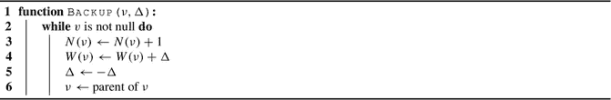 一个用于双人零和游戏的`MCTS`反向传播的搜索算法，包含`backup`函数。`nu`和`delta`是要传递的参数。

一旦我们计算了遍历路径中节点的值，考虑如何计算双人零和游戏的均值就很重要了。与单人游戏中搜索树中的所有节点都为同一玩家存储值不同，在双人游戏中，子节点的高值可能并不代表父节点的最佳利益。这是因为双人游戏中节点的值取决于轮到哪个玩家。

例如，考虑井字棋游戏。假设当前玩家是 X，搜索算法正在评估一个潜在的移动，该移动会导致 X 有两子连成一线而 O 有一子连成一线的位置。从 X 的角度来看，这是一个好位置，应该具有高值。然而，从 O 的角度来看，这个位置很糟糕，应该具有低值。因此，在计算该节点的均值时，我们需要考虑轮到谁，以及节点的值是如何基于该视角计算的。

总之，当使用`MCTS`进行双人零和游戏时，仔细考虑如何更新搜索树中节点的统计信息以及计算其子节点的均值至关重要。这是因为每个节点的值代表了玩家如果选择该节点并最优地玩下去所能获得的预期奖励。


### 14.3 AlphaZero

2015 年 10 月，DeepMind 的人工智能体`AlphaGo`在五局围棋比赛中击败欧洲冠军樊麾，创造了历史。`AlphaGo`赢得了全部五局比赛，成为首个在无让子的全尺寸棋盘上击败职业人类棋手的计算机围棋程序。2016 年 3 月，另一版本的`AlphaGo`（名为`AlphaGo Lee`）在五局围棋比赛中以 4 比 1 的比分击败了传奇韩国棋手李世石。

`AlphaGo`通过结合深度神经网络、监督学习、强化学习以及用于搜索和规划的蒙特卡洛树搜索（`MCTS`）进行训练。在实际对弈过程中，`AlphaGo`也使用`MCTS`进行在线规划。

`AlphaGo`的训练过程可分为两个阶段：

- **第一阶段**：使用来自 KGS 围棋服务器的 3000 万个棋局位置训练策略网络`P_s`和价值网络`V_s`。此阶段采用纯监督学习，通过分类任务训练`P_s`，通过回归任务训练`V_s`。策略网络`P_s`针对给定棋盘位置输出落子概率，价值网络`V_s`则从当前棋手视角输出对棋盘的评估。此外，还训练了一个更小但速度更快的策略网络`P_rollout`。该快速策略网络的准确率远低于`P_s`，仅在第二阶段的自对弈中用于`MCTS`模拟（作为走子策略）。第一阶段持续进行，直到网络`P_s`和`V_s`能在独立测试集中以特定阈值（例如 55%）正确预测人类专家棋手的落子。

- **第二阶段**：通过数百万局自对弈游戏，使用强化学习训练策略网络`P`和价值网络`V`。初始时`P = P_s`且`V = V_s`，多个智能体并行运行以生成自对弈棋局，生成这些棋局时，在`MCTS`搜索中使用策略网络`P`。此外，第一阶段训练的快速采样策略网络`P_rollout`也用于`MCTS`模拟阶段的动作采样。

2017 年，DeepMind 开发了名为`AlphaGo Zero`的新智能体，这是对`AlphaGo`的增强版本，实力远超其前身。`AlphaGo Zero`在围棋对弈中表现更强，且仅使用强化学习和纯自对弈棋局中的落子进行训练。它还通过消除监督学习简化了训练过程，并采用了更简单的神经网络架构（使用共享权重和多头的单一神经网络，而非多个独立网络）。

2017 年末，DeepMind 开发了名为`AlphaZero`的新智能体，这是一个从零开始自学掌握国际象棋、将棋和围棋的单一系统，并在每个领域击败了世界冠军级别的计算机程序。这个新的`AlphaZero`智能体是其前身`AlphaGo Zero`的泛化版本，后者仅能进行围棋对弈。

总结而言，`AlphaZero`被认为是挑战围棋、国际象棋和将棋等双人零和博弈的顶尖技术。它仅使用强化学习和纯自对弈棋局中的落子进行训练，除游戏基本规则外无需任何人类监督。在实际对弈过程中，`AlphaZero`也使用`MCTS`进行在线规划。训练过程涉及数百万局自对弈。策略网络针对给定棋盘位置输出落子概率，价值网络则从当前棋手视角输出对棋盘的评估。

在本章后续部分，我们将重点关注`AlphaZero`智能体及其对应论文的细节。但需要指出的是，某些特定组件（如神经网络结构和`MCTS`搜索算法）最初是在`AlphaGo Zero`论文中引入并得到深入研究的。


#### 神经网络架构与状态表示

AlphaZero 采用了一种基于卷积神经网络（CNN）的架构，用于识别围棋、国际象棋和将棋等游戏中棋盘布局的模式。`CNN` 在计算机视觉领域的分类和物体检测等任务中有着成熟的应用历史。这些模式对于在这些游戏中做出有效决策至关重要。职业人类玩家擅长在游戏过程中识别这些模式，而我们希望强化学习智能体也能做到这一点。对于围棋来说，棋盘是一个 `19 × 19` 的网格。我们可以将棋盘表示为一个 `19 × 19 × 1` 的二进制特征平面，其中 `1` 表示有棋子的交叉点，`0` 表示空交叉点。

然而，将围棋棋盘标准表示为 `19 × 19 × 1` 的二进制特征平面存在局限性。它无法区分黑子和白子，也无法为决策或马尔可夫性质提供足够的信息。为了克服这些限制，我们为黑子和白子分别使用独立的二进制特征平面，并堆叠 `N` 个历史棋盘位置。

最终状态 `s_t` 是一个 `19 × 19 × 17` 的图像，包含 17 个二进制特征平面。其中八个平面 `X_t` 表示当前玩家的棋子，如果存在棋子则二进制值为 `1`，如果交叉点为空或包含对手棋子则为 `0`。类似地，另外八个平面 `Y_t` 表示对手的棋子。额外的平面 `C` 称为“轮到谁下”，它指示当前轮到哪位玩家，并考虑到在相同棋盘位置上，两位玩家的最佳着法可能不同这一事实。此外，它还提供了谁先手的信息（默认黑棋先手），这通常具有一些优势。

为了确保马尔可夫性质成立，我们为每位玩家堆叠最多 `N=8` 个之前的棋盘位置（包括当前棋盘位置），从而创建一个三维棋盘图像。我们使用以下格式将这些平面连接成一个单一输入：

```
s_t = [ X_t, Y_t, X_{t-1}, Y_{t-1}, ..., X_{t-7}, Y_{t-7}, C ]
```

AlphaZero 使用一个由多个卷积层和整流非线性激活函数（ReLU）的残差块组成的单一神经网络。与 AlphaGo 不同，AlphaZero 不使用独立的 rollout 策略网络。我们稍后在描述 AlphaZero 的蒙特卡洛树搜索算法时会讨论其原因。输入特征 `s_t` 首先经过一个卷积层处理，该层有 256 个卷积核，大小为 `3 × 3`，步长为 `1`，然后是一个批归一化层和一个整流非线性（ReLU）激活函数。接着是 19 个（或 39 个）残差块，最后一个残差块的输出随后被送入两个独立的头部分别计算策略和价值。

每个残差块按顺序应用以下层：

-   一个卷积层，有 256 个卷积核，大小为 `3 × 3`，步长为 `1`
-   批归一化
-   一个整流非线性（ReLU）激活函数
-   一个卷积层，有 256 个卷积核，大小为 `3 × 3`，步长为 `1`
-   批归一化
-   一个跳跃连接，将块的输入相加
-   一个整流非线性（ReLU）激活函数

策略头按顺序应用以下层：

-   一个卷积层，有 2 个卷积核，大小为 `1 × 1`，步长为 `1`
-   批归一化
-   一个整流非线性（ReLU）激活函数
-   一个全连接线性层，输出大小为 `19 × 19 + 1 = 362` 的向量，对应于所有动作（包括“虚手”着法）的动作概率

价值头按顺序应用以下层：

-   一个卷积层，有 1 个卷积核，大小为 `1 × 1`，步长为 `1`
-   批归一化
-   一个整流非线性（ReLU）激活函数
-   一个具有 256 个隐藏单元的全连接线性层
-   一个整流非线性（ReLU）激活函数
-   一个输出标量值的全连接线性层
-   一个双曲正切非线性（Tanh）激活函数，将标量值变换到 `[-1, 1]` 范围内

图 14.6 展示了用于围棋游戏的 AlphaZero 神经网络架构，该架构使用了 19 个残差块。类似的架构也用于国际象棋或将棋等其他游戏。然而，每种游戏的神经网络输入数据略有不同。对于国际象棋，输入数据是一个 `8 × 8 × 73` 的平面堆叠，而对于将棋，则是一个 `9 × 9 × 139` 的平面堆叠。此外，DeepMind 在为国际象棋和将棋构建当前状态 `s_t` 而堆叠特征平面时，采用了略微不同的表示机制。

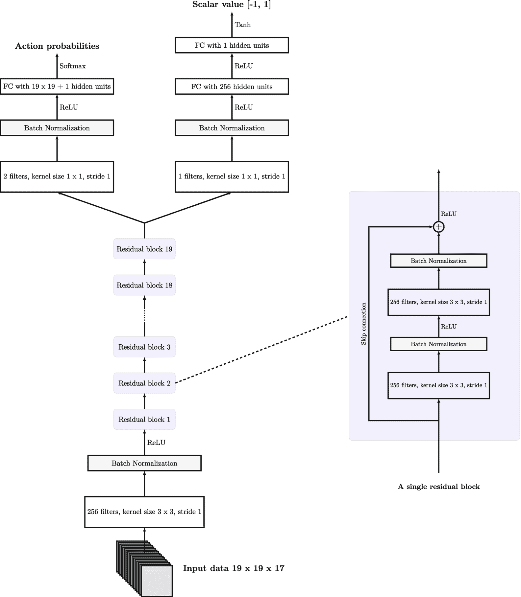

一个包含 19 个残差块的 AlphaZero 神经网络架构流程图。流程图从输入数据 19×19×17 开始，有三个输出，分别是动作概率、范围从 -1 到 1 的标量值以及 ReLU。

**图 14.6** 用于围棋游戏的 AlphaZero 智能体的神经网络架构

这种架构使 AlphaZero 能够将完整的棋盘位置作为单一输入进行处理，并识别出对有效游戏至关重要的复杂模式和特征。


#### MCTS 搜索算法

AlphaZero 使用了一种更为简洁的 MCTS 搜索算法。与传统 MCTS 不同，它在搜索过程中不进行模拟（rollout）。相反，神经网络直接评估局面，这使得更快的 rollout 策略网络变得不再必要。整体搜索过程如图 14.7 所示。

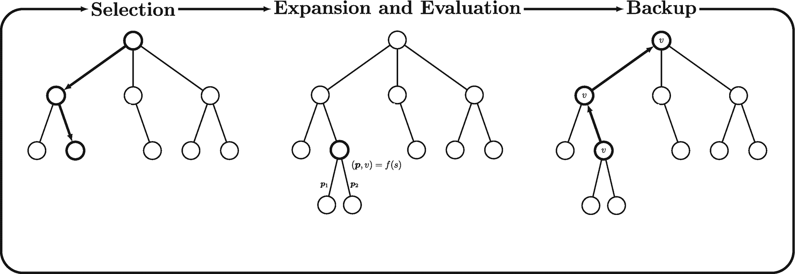

三个搜索树，在不同层级上有多个高亮节点，分别标记为选择、扩展与评估、以及回溯。扩展与评估以及回溯对应的树有 4 个层级。

**图 14.7** AlphaZero 的 MCTS 搜索算法

与通常情况一样，搜索树中的每个节点 `s` 代表一个特定的棋盘配置或状态。每个节点包含针对所有合法动作 `a ∈ A(s)` 的边 `(s, a)`，其中 `A(s)` 是状态 `s` 下所有合法动作的集合。每条边存储以下统计信息：

- `N(s, a)`：访问次数
- `W(s, a)`：总状态-动作价值
- `Q(s, a)`：平均状态-动作价值，其中 `Q(s, a) = W(s, a) / N(s, a)`
- `P(s, a)`：在状态 `s` 中选择动作 `a` 的先验概率，该概率从神经网络的输出向量 `p` 中获得

**算法 4：AlphaZero 的 MCTS 算法**

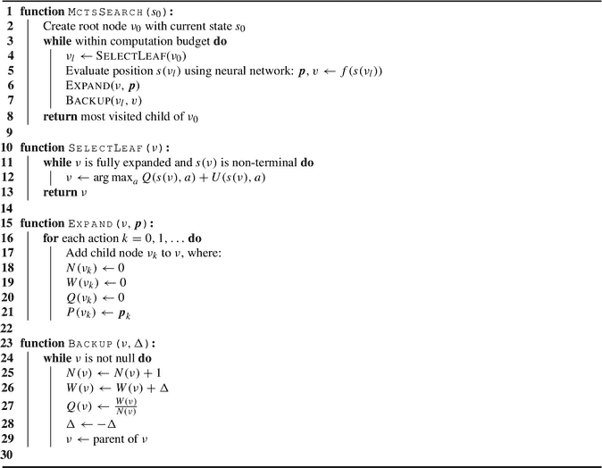 用于 AlphaZero 的 MCTS 搜索算法，包含函数 `MCTSSearch`、`SelectLeaf`、`Expand` 和 `Backup`。

原始的 AlphaZero 算法每次 MCTS 搜索执行 800 次迭代，这是 AlphaGo 算法所用迭代次数的一半。值得注意的是，在提及 AlphaZero 时，“模拟”一词有时会被误用，因为它并不像其他算法那样使用 rollout。然而，该术语在文献中仍被广泛使用。

##### 选择

在 AlphaZero 使用的 MCTS 算法中，搜索从选择阶段开始。在每次搜索迭代中，算法从搜索树的根节点开始，迭代地选择动作，直到在时间步 `L` 到达一个叶节点。对于时间步 `0 < t < L`，使用应用于树的置信上界（UCT）算法的一个变体，结合时间步 `t` 时的合法动作集，来选择动作 `a_t`，以防止违反游戏的基本规则。UCT 算法平衡了利用与探索。具体来说，算法选择使平均状态-动作价值 `Q(s_t, a)` 与探索项 `U(s_t, a)` 之和最大化的动作：

```
a_t = argmax_a { Q(s_t, a) + U(s_t, a) }
```

这里，`Q(s_t, a)` 是状态-动作对的平均值，而 `U(s_t, a)` 使用以下公式计算：

```
U(s, a) = C(s) * p(s, a) * sqrt( N(s) / (1 + N(s, a)) )
```

(14.3) 其中 `N(s)` 是父节点的访问次数，`N(s, a)` 是状态-动作对的访问次数，`p(s, a)` 是选择该动作的概率，`C(s)` 是一个随搜索时间缓慢增长的探索率。具体来说，`C(s)` 由以下公式给出：

```
C(s) = log( (1 + N(s) + c_base) / c_base ) + c_init
```

(14.4)

需要注意的是，此处描述的探索率 `C(s)` 的计算方法并未在原始的 AlphaGo Zero 或 AlphaZero 论文中提及。这种方法仅在随后的 MuZero 论文 [14] 中进行了专门讨论。

参数 `c_base` 和 `c_init` 的值通常分别设置为 19652 和 1.25。

##### 扩展与评估

当搜索过程到达搜索树中的一个叶节点时，该叶节点对应的游戏状态 `s_t` 被用作神经网络 `θ` 的输入，以获得相应的输出 `(p, v)`。回顾一下，网络输出一个包含所有动作概率的向量 `p`，以及一个从当前玩家视角评估的当前棋盘价值 `v`。由于我们拥有所有潜在动作的动作概率，叶节点的所有子节点随后会在一次操作中同时被扩展。通向该叶节点的边的统计信息被初始化为 `{N(s, a) = 0, W(s, a) = 0, Q(s, a) = 0, P(s, a) = p_a}`，其中 `p_a` 是从 `p` 中的动作概率推导出的、在状态 `s` 中选择动作 `a` 的概率。在 AlphaZero 中，评估值 `v` 取代了传统 MCTS 中使用的随机模拟（或 rollout）的结果，因此没有模拟阶段；这样，我们就不需要训练一个 rollout 策略网络。

在实践中，通常没有必要创建代表非法移动的节点，因为智能体永远不应该选择它们。这在游戏后期棋盘大部分非空，或某些移动被游戏规则禁止时尤其如此。将节点的创建限制为仅代表合法移动，可以显著减少内存使用并加快扩展过程，这在执行大量迭代时可能尤为重要。


##### 备份

在最终的备份阶段，来自神经网络的数值 `v` 会被备份到每个时间步 `t ≤ L`。在此阶段，状态-动作对 `(s_t, a_t)` 的访问计数 `N(s_t, a_t)` 会更新为 `N(s_t, a_t) = N(s_t, a_t) + 1`。总状态-动作价值 `W(s_t, a_t)` 也会更新为 `W(s_t, a_t) = W(s_t, a_t) + v`，其中 `v` 代表正在被备份的数值。此外，平均状态-动作价值 `Q(s_t, a_t)` 的计算方式为 `Q(s_t, a_t) = W(s_t, a_t) / N(s_t, a_t)`。

由于我们处理的是双人零和博弈，被备份的数值 `v` 有时会取反。例如，如果当前玩家是最大化玩家，那么备份的数值 `v` 将被取反，以表示对手的效用。

完成这三个阶段后，一次搜索迭代即视为完成。算法随后进入下一次迭代，此过程持续进行，直到达到某个限制条件，例如时间约束或最大迭代次数。

#### AlphaZero MCTS 如何构建搜索树

由于 AlphaZero 会展开所有子节点而非仅一个子节点，其搜索树的构建方式与通用 MCTS 略有不同。图 14.8 展示了一个简单示例。

该图展示了 AlphaZero 的 MCTS 搜索算法构建搜索树的过程。它呈现了从第 1 次到第 4 次迭代的节点图。每次迭代中，树的层级都会增加。

**图 14.8** 一个说明 AlphaZero 的 MCTS 搜索算法如何构建搜索树的简单示例

总结来说，AlphaZero 对标准 MCTS 算法进行了若干修改，我们在此重点说明：

-   搜索到达叶节点后，不再进行随机模拟（rollout）。相反，AlphaZero 使用神经网络评估棋盘局面，并将其作为估计的游戏结果来更新搜索树中的统计信息。
-   在展开叶节点时，所有子节点会在单次操作中一次性展开，而非像标准 MCTS 那样每次只展开一个子节点。这意味着节点展开后，该叶节点会立即变为完全展开状态。
-   AlphaZero 在选择阶段使用了一种略有不同的 UCT 算法来选择最佳子节点，该算法结合了神经网络输出的先验动作概率 `p`。

DeepMind 还采用了其他技术来进一步加速 MCTS 搜索过程，例如使用并行树搜索和重用子树。这些是锦上添花的高级特性，但实现起来要复杂得多，并且很大程度上取决于我们如何实现算法（例如，使用哪种编程语言）。然而，对于让 AlphaZero 智能体正常工作而言，这些特性并非必需。感兴趣的读者可以在原始的 AlphaGo Zero 和 AlphaZero 论文中找到关于这些主题的更多信息。

#### 自我对弈

为了生成高质量的训练数据来训练神经网络，AlphaZero 采用了一种结合蒙特卡洛树搜索（MCTS）的自我对弈方法。

在每局自我对弈游戏中，对于每个非终止时间步 `0 ≤ t ≤ T`，都会使用最新的神经网络参数执行一次 MCTS 搜索，该搜索通常包含数千次迭代。搜索完成后，会为当前游戏状态 `s_t` 计算出一个更强的搜索策略 `π_t`。该策略与根节点子节点的指数化访问计数成正比，并使用温度参数 `τ` 控制探索程度：

```
π(a|s_0) = N(s_0, a)^(1/τ) / Σ_b N(s_0, b)^(1/τ)
```

(14.5) 其中 `N(s_0, a)` 表示在状态 `s_0` 下采取动作 `a` 所得到的子节点的访问计数。策略 `π_t` 比神经网络输出的原始向量 `P_t` 更强，可被视为一个强大的策略改进算子。为了进行游戏，会根据策略 `π_t` 选择一个动作 `a`，游戏进入下一个状态，并开始一个新的 MCTS 搜索过程。该策略在训练神经网络时也会成为目标。

然后从 `π_t` 中采样一个动作 `a_t`，用于在游戏状态 `s_t` 下执行。在每局自我对弈游戏的前 30 步中，softmax 函数（定义为 `softmax(x_i) = exp(x_i / τ) / Σ_j exp(x_j / τ)`）的温度设置为 `τ = 1`。这会根据 MCTS 搜索树根节点中子节点的访问计数按比例选择动作。在游戏的剩余部分，则使用接近零的温度（`τ → 0`），这对应于始终选择 MCTS 搜索树根节点中访问次数最多的子节点。

##### 探索

为了鼓励进一步探索，会在根节点 `s_0` 的先验概率 `P(s, a)` 中添加少量狄利克雷噪声。具体来说，`P(s, a) = (1 - ε) P_a + ε η_a`，其中 `η ~ Dir(0.03)` 且 `ε = 0.25`。每次 MCTS 搜索都会执行此操作。


##### 在必败对局中认输

在自我对弈过程中，AlphaZero 使用一种认输机制，以避免在明显必败的对局中浪费计算资源。该算法通过检查评估后的对局结果，并在玩家明显处于劣势时选择认输来实现这一点。这一过程发生在运行 800 次蒙特卡洛树搜索（MCTS）迭代之后。如果 MCTS 搜索树根节点的平均状态-动作值低于某个阈值，例如 `-0.9`，玩家就会选择认输，而不是继续对局。

需要注意的是，自动认输机制仅在对局达到一定步数后才会触发，例如，每位玩家已下 10 或 20 步。在对局开始时主动认输是没有意义的。

然而，为了衡量认输对局的误报率，AlphaZero 有意在 10% 的自我对弈中禁用认输操作。在这种情况下，智能体将一直对弈直到终局。认输机制是 AlphaZero 算法的一个关键部分，因为它有助于算法将计算资源集中在更有机会获胜的对局上。这反过来又帮助算法更快地学习，并从长远来看取得更好的结果。

#### 用于训练的训练样本

生成这些自我对弈对局的目的是收集用于训练神经网络的样本。具体来说，对于每一场自我对弈，我们收集时间步 `0 ≤ t ≤ T` 的转换元组 `(s_t, π_t, z_t)`。其中，`s_t` 是时间步 `t` 时的游戏状态，对于围棋来说，它是一个维度为 `19 × 19 × 17` 的堆叠二进制特征平面。`π_t` 是来自时间步 `t` 的更强的 MCTS 搜索策略，而 `z_t` 是蒙特卡洛样本回报 `G_t = R_t + R_{t+1} + R_{t+2} + ... + R_{T-1}`，无折扣。由于非终局状态的所有奖励均为零，这简化为 `G_t = R_{T-1}`，即实际对局结果：输为 -1，平局为 0，赢为 +1。

这种将最终对局结果分配给每一步的机制有助于解决信用分配问题。因此，智能体做出的所有决策都根据自我对弈的最终结果获得等量的信用。

所有 `(s_t, π_t, z_t)` 都从时间步 `t` 时当前玩家的视角来表示。例如，如果自我对弈以黑棋获胜结束，那么对于每个时间步 `t = 0, 1, 2, ..., T`，如果在时间步 `t` 轮到黑棋走，我们设置 `z_t = +1`；相反，如果在时间步 `t` 轮到白棋走，则 `z_t = -1`。`s_t` 和 `π_t` 也同理。

然后，AlphaZero 将数百万个最近的自我对弈对局存储到一个经验回放缓冲区中，这与 DQN 算法的做法非常相似。这些自我对弈对局随后被用于训练神经网络。而自我对弈的参与者会定期切换到最新的神经网络，以生成更多的样本对局。


#### 训练

AlphaZero 的训练目标是学习一种策略，以最大化特定游戏（如围棋）的期望回报。具体来说，AlphaZero 旨在最大化从给定状态出发的游戏期望回报，该回报通过一个价值网络进行估计。

尽管 AlphaZero 使用神经网络来近似最优策略（这通常是基于策略的方法所做的），但它与我们书中讨论的任何基于策略的强化学习算法（如 `REINFORCE` 或 `Actor-Critic`）并不相同。对于 AlphaZero 而言，用于优化策略的目标函数与策略梯度方法不同。该神经网络通过一种称为交叉熵损失的监督学习形式进行训练，以最大化神经网络落子概率 `p_t` 与蒙特卡洛树搜索（MCTS）搜索概率 `π_t` 的相似度。这种方法常用于多分类问题。

AlphaZero 策略网络的训练目标可以写成：

```
L_policy = - Σ_a π(a|s) log p(a|s)
```

(14.6) 其中 `p(a|s)` 是策略网络在状态 `s` 下选择动作 `a` 的预测概率，而 `π(a|s)` 是从自我对弈游戏中获得的、在状态 `s` 下选择动作 `a` 的目标概率。

因此，AlphaZero 的策略目标函数可以看作是一种最大似然估计。在最大似然估计中，我们寻求找到统计模型的参数，以最大化观测数据的似然。在 AlphaZero 的情况下，策略网络是一个统计模型，用于预测给定状态下动作的概率分布。自我对弈游戏为我们提供了网络在每个状态下所采取的观测动作。

尽管交叉熵常用于监督学习，但我们不应将 AlphaZero 归类为监督学习，因为该智能体并未使用任何形式的监督者（例如人类）提供的数据。相反，神经网络是通过一种称为自我对弈的强化学习变体进行训练的，智能体通过与自己博弈并根据这些游戏的结果调整其权重，来学习提升自身表现。这个过程类似于人类通过试错学习，并以奖励或惩罚的形式接收反馈。

在训练过程中，AlphaZero 通过反复与自己博弈、评估每局游戏的结果，并调整其神经网络权重来提升表现。AlphaZero 的神经网络结合了自我对弈和蒙特卡洛树搜索（MCTS）进行训练，以提升其游戏能力。

MCTS 在 AlphaZero 中扮演着关键角色，它使智能体能够评估并选择每个游戏状态下的最佳落子。这个过程是迭代的，并随着系统从自身经验中学习并逐步提升游戏能力，从而带来策略改进。

AlphaZero 的神经网络还经过训练，以最小化预测状态值 `v_t` 与自我对弈游戏结果 `z_t` 之间的误差，这通常被称为均方误差（MSE），如下式所示：

```
L_value = (v - z)²
```

(14.7)

由于我们使用一个共享权重的单一神经网络来表示策略和价值函数，AlphaZero 的最终目标函数是策略目标 `L_policy` 和价值目标 `L_value` 的组合，可以使用矩阵形式表示，如下式所示：

```
l = (z - v)² - π^T log p + c ||θ||²
```

(14.8) 其中 `z` 是游戏的真实结果，`v` 是游戏的预测结果，`π` 是策略向量，`p` 是预测的策略向量，`θ` 是神经网络的参数向量，`(p, v) = f_θ(s)` 表示给定状态 `s` 时神经网络的输出，`c` 是一个超参数，用于控制 L2 权重正则化的程度，以防止网络过拟合。

请注意，在 AlphaZero 中，状态价值的 MSE 损失与策略的交叉熵损失被赋予了相同的权重，这与传统的 `Actor-Critic` 算法不同，后者在使用共享权重的单一神经网络近似策略和价值函数时，会使用一个系数来加权状态价值函数的损失。

为了训练智能体，会从最近 500,000 局自我对弈游戏中随机抽取一批 4096 个转移样本。然后使用随机梯度下降（SGD）方法对神经网络进行优化。初始学习率设置为 0.01，动量设置为 0.9，L2 正则化设置为 `10^-4`。此外，算法在训练步数达到 400,000 和 600,000 时，分别采用阶梯法衰减学习率，衰减权重为 0.1。训练通常持续超过 700,000 步，围棋总共进行了 2100 万局自我对弈游戏，国际象棋 4400 万局，日本将棋 2400 万局。

毫不意外，AlphaZero 是使用分布式强化学习架构进行训练的，其中数千个自我对弈角色生成了数百万局自我对弈游戏。多个学习器并行工作，以更新神经网络的参数。

在训练过程中，使用了 5000 个张量处理单元（TPU）来生成自我对弈游戏。TPU 是谷歌开发的专用加速硬件，用于加速数值计算，尤其是神经网络计算。这意味着训练期间有数百甚至数千台机器用于生成自我对弈游戏。此外，还使用了 16 个第二代 TPU 来训练神经网络。DeepMind 分别为国际象棋、日本将棋和围棋训练了独立的 AlphaZero 实例，训练时长分别约为国际象棋 9 小时、日本将棋 12 小时和围棋 13 天。


#### 评估智能体

要在训练期间或训练后评估 AlphaZero 智能体的性能，主要有两种选择。

第一种选择是让 AlphaZero 智能体与各种对手对弈，例如（职业）人类棋手或其他 AI 智能体，包括使用先前训练迭代中获得的神经网络权重的自身。我们将在这些评估对局中使用标准的 **Elo 等级分**来评定智能体的表现。AlphaZero 智能体使用 MCTS 搜索来为每个局面寻找最佳着法；这有时被称为在线规划，因为智能体在对弈过程中会主动使用模型来搜索最佳着法。整个过程类似于应用 MCTS 生成自我对弈棋局，但不同之处在于，它不使用狄利克雷噪声进行探索，并且始终在每个局面中选择最佳着法——即 MCTS 搜索树根节点访问次数最多的子节点；此外，我们通常可能会让 MCTS 搜索运行更多的模拟次数。然而，至关重要的一点是，如果我们在训练期间评估智能体的性能，必须确保这些评估对局不属于训练数据的一部分。

第二种选择是使用训练好的神经网络来预测历史（职业）人类对局中的着法和比赛结果。这涉及使用（职业）人类棋手的历史对局来构建一个评估数据集。然后，使用 AlphaZero 智能体的神经网络来预测着法和实际比赛结果。

在实践中，这两种方法会结合起来评估智能体，尤其是在训练期间，正如原始 AlphaZero 智能体所做的那样。这种双重评估机制能让我们对智能体的实际实力更有信心。这是因为，如果我们仅仅通过让智能体与某个对手（例如，某个在线玩家或之前的模型）对弈来评估它，很难断定对手的真实实力。这会成为一个问题，因为 Elo 等级分系统假设我们对两位棋手的等级分都有良好的估计，才能得出准确的等级分。例如，如果智能体与某个比它弱的业余玩家下了 100 局并全部获胜，那么它可能会获得一个非常高的等级分；这可能会给我们一种错误的印象，认为智能体表现相当出色，而事实并非如此。

另一方面，如果我们使用历史人类对局来评估智能体的表现，历史（职业）人类对局的质量也会影响评估结果。例如，如果我们只有业余人类玩家下的对局，那么预测准确率可能会非常高；这也可能给我们一种错误的印象，认为智能体已经达到了很强的水平。另一方面，如果（职业）人类对局是由高段位职业棋手下的，那么智能体可能无法准确预测人类棋手的着法和比赛结果，尤其是在训练初期。这可能会让我们对智能体的表现产生怀疑。重要的是，我们要使用来自不同水平和棋手的多样化对局来构建评估数据集，这样才能更准确地估计智能体的性能。

## 14.4 在 `9 x 9` 围棋棋盘上训练 AlphaZero

需要认识到，训练 AlphaZero 智能体是一项耗时的工作，即使在强大的 GPU 上，在 `19 x 19` 的围棋棋盘上也需要数周甚至数月的时间。DeepMind 的原始论文提到，他们使用数千台服务器和 TPU 来训练 AlphaZero 智能体。尽管拥有如此巨大的计算资源，训练 20 个残差块的 AlphaZero 版本仍然需要 72 小时，而 40 个残差块的版本则需要 40 天。不幸的是，我们无法获得同等水平的计算资源和预算来进行类似的实验。

考虑到我们的目标不是创造能够击败世界冠军的最强智能体，我们对方法进行了一些调整。这些调整包括使用缩小的设置，例如更小的神经网络、更少的自我对弈角色和更少的对局数，来训练 AlphaZero 智能体。具体来说，我们专注于 `9 x 9` 棋盘大小的围棋，这需要更少的计算资源，因此训练智能体的时间也更短。在中等硬件上经过 50 小时的训练后，我们的智能体已经达到了很强的水平。我们最好的模型有时可以击败业余 1 段水平的对手。^(¹⁴)

#### 分布式训练

我们在训练过程中采用了分布式强化学习架构，使用了大约 120 个角色（actor）、1 个学习器（learner）和 1 个负责评估智能体性能的额外进程。所有这些组件都在一台配备 128 个 CPU 和 8 个 GPU 的服务器上运行；每个 GPU 拥有 24 GB 的显存。该程序仅使用了 Python 的 `multiprocessing` 模块，没有依赖任何用于分布式计算的第三方工具或库。


#### 神经网络架构与状态表示

我们的神经网络架构和状态表示与 AlphaGo Zero 及 AlphaZero 论文中描述的方法高度一致。为了构建状态，我们利用了最近八次棋盘配置，最终状态被表示为一个 `9 × 9 × 17` 的图像。虽然我们大体上遵循了 AlphaZero 的神经网络架构，但由于 `9 × 9` 棋盘比 `19 × 19` 棋盘简单得多，我们进行了一些修改，使用了更少的模块和卷积滤波器。

在最初的实验中，我们从包含 20 个模块的版本开始，但卷积层仅使用 64 个卷积滤波器，价值网络（value head）仅使用 64 个隐藏单元。这个特定的神经网络包含 1,434,493 个参数。然而，经过 24 小时的训练后，我们观察到智能体（agent）频繁下出虚手（pass moves），导致对局在大约 20 步内就突然结束。这种行为在自我对弈（self-play）的棋手和评估过程中均有出现。我们推测，尽管我们尝试通过减少卷积滤波器和隐藏单元的数量来缩小规模，但 20 模块版本对于 `9 × 9` 的问题来说可能仍然过于强大。因此，我们决定停止该训练会话，并探索其他方法。

在首次实验失败后，我们尝试了不同变体的神经网络架构。这些包括一个 10 模块版本（64 个滤波器和隐藏单元），以及一个 15 模块版本（相同数量的滤波器和隐藏单元）。然而，在 24 小时的训练后，这些配置均未产生令人满意的结果。最终，我们确定了一个由 12 个模块组成的架构，其中包括 1 个初始卷积模块和 11 个残差模块，卷积滤波器为 64 个，价值网络隐藏单元为 64 个。我们决定对这个修订后的神经网络进行超过 40 小时的训练，以评估其进展。这个 12 模块版本共有 842,621 个参数，并且与我们之前的尝试相比，性能有所提升。然而，当与其他计算机引擎等强对手对战时，它未能持续获胜。

在我们的最终实验中，我们决定使用一个更强大的神经网络架构，它由 11 个模块组成（1 个初始卷积模块和 10 个残差模块）。在此配置中，我们增加了卷积滤波器的数量，每个模块的卷积层使用 128 个滤波器，价值网络使用 128 个隐藏单元。这个神经网络共有 2,998,461 个参数。我们最终实验的结果表明，这个更强大的神经网络架构实现了比 12 模块版本显著更强的棋力。因此，我们后续的讨论将集中在 11 模块版本的模型上。

#### 自我对弈

我们的方法紧密遵循 AlphaGo Zero 和 AlphaZero 论文中描述的方法论。然而，由于 `9 × 9` 问题相对简单且动作空间较小，我们在每局游戏中将每次蒙特卡洛树搜索（MCTS）的模拟次数限制为 200 次。为了在 MCTS 期间分配局面评估的工作负载，我们均匀地利用服务器上可用的 GPU。

为了优化计算资源，我们将最大对局长度设置为 162 步（`9 × 9 × 2`）。一旦对局达到此长度，将不允许再下子，我们会计算双方棋手的估算得分以确定胜者。与 AlphaGo Zero 论文类似，我们采用了一种认输机制。我们将认输阈值初始化为 `-0.85`，并动态调整它，以保持认输误报率低于 5%。为了测量误报率，我们在 10% 的自我对弈对局中禁用认输动作，让智能体一直下到自然终止（双方连续两步都下虚手或达到最大对局长度）。为了避免过早认输，我们只允许智能体在游戏进行到一定步数（例如 30 或 40 步）后才考虑认输。此外，我们在前 50,000 局自我对弈中禁用了认输功能，因为神经网络在早期阶段的预测不够准确。

对局结束后，我们使用简化版的 Tromp-Taylor 计分法进行计分，并为白棋设置了 7.5 目的贴目。需要注意的是，这些得分是估算值，因为 Tromp-Taylor 规则要求棋手在计算最终得分前，先提走他们认为已死的棋子。如果未能提走这些棋子，它们将被视为活棋计入得分。然而，对于计算机程序来说，在对局结束时准确检测此类死子是一项艰巨的任务。例如，在图 14.9 中，围棋对局中的死子用小方块标记，应在计算最终得分前从棋盘上移除。尽管如此，由于缺乏明确的逻辑，准确检测这些死子仍然很困难。这就是为什么通常采用模拟或神经网络预测等额外技术来估算得分的原因。

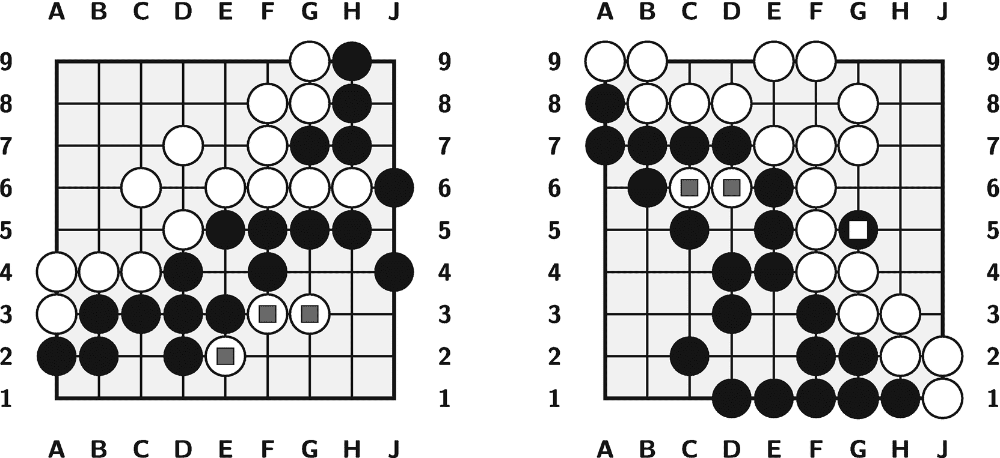

9x9 网格上的围棋战略棋盘游戏的两个示意图。

**图 14.9** `9 × 9` 围棋对局最终状态下的死子示例。在左侧图中，位于 E2、F3 和 G3 的白子被视为死子，因为它们已被对手的棋子完全包围，无论它们是否已被提走。右侧图展示了另一个双方都有死子的例子。位于 C6 和 D6 的白子是死子，位于 G5 的黑子也是死子。


#### MCTS 搜索

我们实现了 AlphaGo Zero 和 AlphaZero 论文中描述的 MCTS（蒙特卡洛树搜索）算法，使用了相同的配置和超参数。我们的实现每次搜索执行 200 次模拟，这对于 `9 x 9` 的棋盘来说已经足够。探索参数 `c_base` 和 `c_init` 分别设置为 19652 和 1.25。我们按照 AlphaZero 论文中的规定，在每一步向根节点添加狄利克雷噪声，其中 `epsilon = 0.25`，`eta = 0.03`。在自我对弈过程中，我们将公式 (14.5) 中的温度在前 16 步设置为 1.0，后续步骤设置为 0.1。为了提高搜索过程的效率，我们使用了具有八个并行叶节点的并行 MCTS 搜索，并引入了文献 [15] 中概述的虚拟损失。此外，在同一局游戏中，我们会在后续步骤中重用子树。

然而，需要注意的是，在评估对局中（当前模型与先前模型对弈），我们不会向根节点添加狄利克雷噪声，也不会重用子树。这一决定基于以下事实：两个玩家是不同的，因此他们在面对相同状态时可能会产生不同的预测。

#### 训练

我们严格遵循 AlphaGo Zero 和 AlphaZero 论文中概述的标准流程和机制来训练我们的智能体。我们的训练方法完全基于从专用自我对弈角色收集的纯自我对弈对局，不涉及人类生成的对局或其他计算引擎或 AI 程序来引导学习过程。

鉴于我们有 120 个角色，我们使用单个学习器智能体来更新神经网络，这是一个合理的选择。为了优化训练，我们使用了 `PyTorch` 中的 `SGD` 优化器，将初始学习率设置为 0.01，动量设置为 0.9，并应用 0.0001 的 L2 正则化。学习率遵循阶梯模式，分别在 200,000 和 400,000 训练步时逐步降低至 0.001 和 0.0001。

在每个训练步骤中，程序从最近的 250,000 局自我对弈对局中随机抽取一批 1024 个样本。为了增强训练过程，我们采用了数据增强技术，例如随机旋转和翻转，这是训练原始 AlphaGo 智能体时使用的方法。此外，我们每 1000 个训练步生成一个检查点。

由于 `9 x 9` 围棋相比 `19 x 19` 问题空间更小，我们相应地调整了方法。对于每个检查点，我们总共进行 5000 局自我对弈对局，而不是 25,000 局，并将训练数据限制为最近的 250,000 局自我对弈对局，而不是 500,000 局。我们在角色总共进行了 20,000 局对弈后创建初始检查点，以确保在开始学习过程（例如，更新神经网络）之前探索了多样化的游戏状态。在整个训练过程中，总共使用了一百万局自我对弈对局来训练神经网络。

#### 评估

在训练过程中，我们在每个新检查点评估智能体的性能。我们使用最新模型与先前检查点的模型对弈，类似于自我对弈。然而，存在一些区别：两个玩家并不相同（黑棋代表最新模型，白棋代表先前模型），并且我们不需要智能体进行额外的探索（搜索树的根节点不添加噪声）。在每次蒙特卡洛树搜索（MCTS）之后，我们总是选择最佳落子（访问次数最多的子节点）。Elo 评分使用简化的实现进行计算。具体来说，我们采用原始 AlphaGo Zero 论文中的公式来估计玩家 *a* 击败玩家 *b* 的概率。该公式表示为 `P(a 击败 b) = 1 / (1 + exp(c_elo * (e(b) - e(a))))`，其中标准常数 `c_elo` 等于 `1/400`。此外，我们根据玩家当前的评分使用 k 因子的变体。如果当前评分低于 2100，k 因子设置为 32。对于 2100 到 2400 之间的评分，k 因子为 24，对于 2400 以上的评分，k 因子为 16。

我们还使用一个包含总共 10,000 局对弈和 620,000 个棋位的评估数据集来评估模型预测人类对弈的准确性。在评估 `9 x 9` 围棋时，我们遇到的一个挑战是，职业人类棋手（职业段位）在这种小棋盘上的对局数量有限。事实上，我们的评估数据集包含的日本职业围棋棋手（从 1p 到 9p）对局不到 3%。因此，我们不得不从互联网上收集剩余的对局，主要来自 CGOS 服务器。值得一提的是，虽然我们将评估数据集称为人类对弈对局，但其中很大一部分对局很可能是由计算机引擎或 AI 程序而非真实人类进行的。

为了确保评估数据集的高质量，我们只包含双方棋手 Elo 评分均至少为 2100 的对局。这是因为 Elo 评分 2100 大约相当于业余 1 段的水平 [16]。此外，尽管我们根据 Elo 评分过滤了对局，但初始评分仍有可能不准确。另外，为了确保数据集的多样性，我们将来自同一棋手的对局数量限制在最多 200 局。此外，我们只将唯一的对局包含在评估数据集中。如果两局对弈由相同的两位棋手进行，持续相同的步数，并以相同的结果结束（即相同的胜者和相同的胜者点数），则视为重复对局。


#### 实验结果

我们现在展示在  围棋棋盘上进行的实验训练结果。如前所述，我们采用了包含 11 个模块的神经网络架构进行训练。训练过程在一台配备 128 个 CPU 和 8 个 GPU 的服务器上进行。智能体共训练了 200,000 步，耗时约 50 小时。

图 14.10 展示了神经网络的训练损失。随着训练的进行，策略的交叉熵损失和价值的均方误差（MSE）损失均呈现收敛趋势。这是符合预期的行为，因为对于 AlphaZero 算法而言，训练目标仅专注于最小化这些损失，而策略则通过 MCTS 搜索算子得到改进。值得注意的是，交叉熵损失的收敛速度要快得多，这表明准确预测对弈结果是一项更具挑战性的任务。

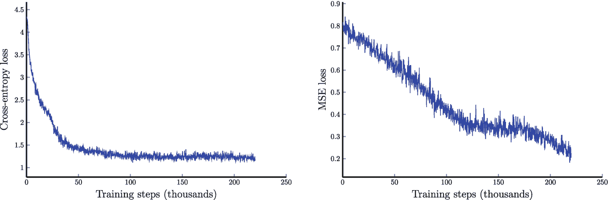

两张图分别绘制了交叉熵损失和均方误差损失随训练步数的变化。它们分别呈现从 (0, 4.3) 到 (220, 1.3) 和从 (0, 0.9) 到 (220, 0.19) 的下降趋势。趋势波动剧烈。数值为估计值。

**图 14.10** AlphaZero 智能体在  围棋棋盘上训练期间的策略交叉熵损失（左）和价值均方误差损失（右）

图 14.11 和 14.12 展示了模型基于一个包含 10,000 局对弈和 620,000 个棋局位置的评估数据集的预测准确率。该评估数据集的创建方法已在前面描述。值得注意的是，在训练 100,000 步后，模型对评估数据集中落子位置的预测率达到 40%。此外，我们观察到模型准确预测人类对弈结果的能力有所提升。

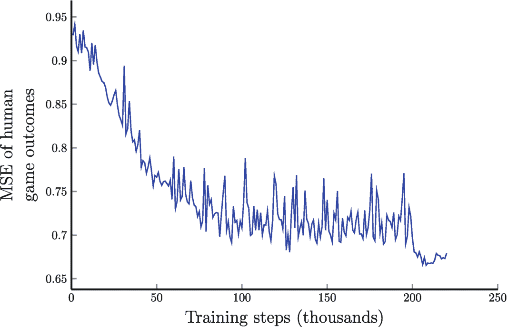

一张人类对弈结果均方误差随训练步数变化的图。绘制的趋势从 (0, 0.93) 到 (220, 0.67) 呈波动下降。数值为估计值。

**图 14.12** 神经网络对人类对弈结果预测的均方误差。它显示了神经网络预测的价值与实际对弈结果之间的未缩放误差。

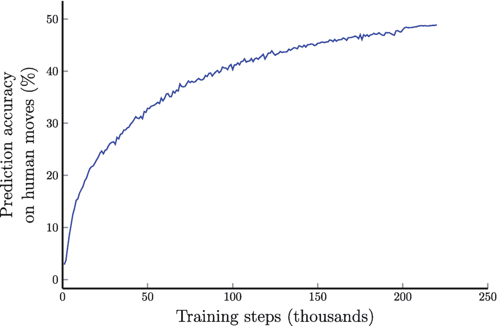

一张图绘制了人类落子预测准确率（百分比）随训练步数的变化。它呈现一条波动趋势，从 (0, 4) 到 (220, 48) 呈凹形上升。数值为估计值。

**图 14.11** 神经网络对人类落子预测的准确率。它衡量了 top-1 预测准确率的百分比，即概率最高的预测与实际人类落子相匹配的比例。

图 14.13 展示了训练过程中智能体的 Elo 等级分。这些等级分是根据评估对局计算得出的，其中最新模型执黑，与上一检查点的模型（执白）对弈。结果表明，智能体的性能在大约 150,000 训练步时达到峰值。随着训练的继续，性能开始出现分化且未能恢复。我们怀疑这个问题的主要原因是学习率过大。在我们的实验中，初始学习率设置为 0.01，并计划在训练步数达到 200,000 和 400,000 时，分别以阶梯方式降低至 0.001 和 0.0001。然而，由于智能体可能在 100,000 训练步后已达到一定水平，更合适的做法是更早地降低学习率，例如在训练步数达到 100,000 和 200,000 时，分别降低至 0.001 和 0.0001。

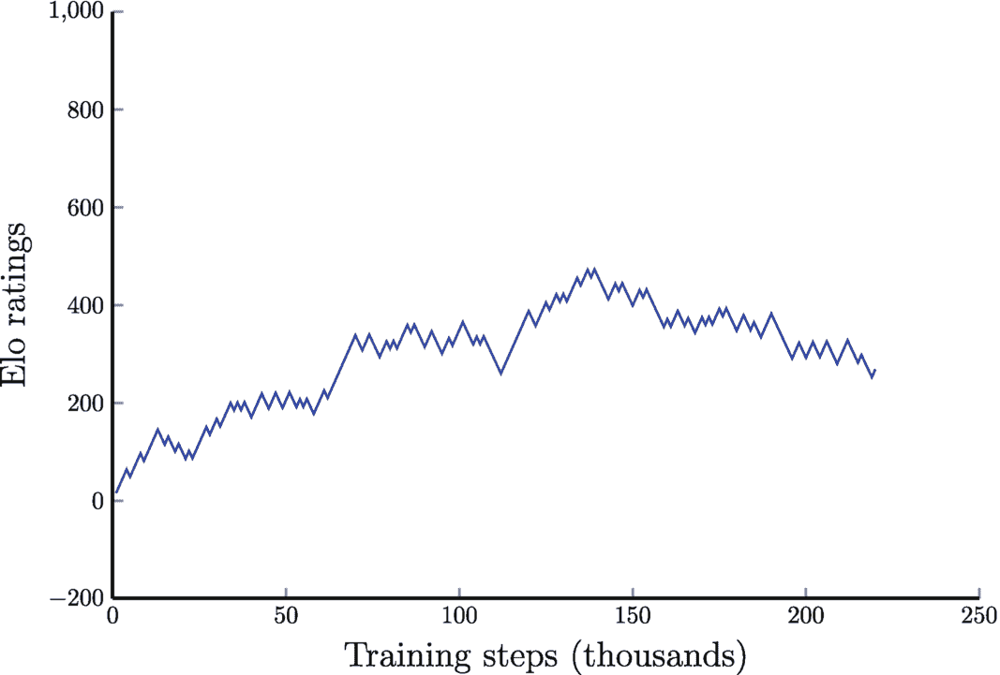

一张 Elo 等级分随训练步数变化的图。它绘制了一条从 (0, 10) 到 (220, 220) 呈波动上升的趋势。数值为估计值。

**图 14.13** AlphaZero 智能体在  围棋棋盘上的性能。Elo 等级分是根据当前（最新）模型与上一检查点模型之间的评估对局计算得出的。

为了评估我们智能体的真实实力，我们与一个名为 CrazyStone [17] 的计算机程序进行了一系列比赛。CrazyStone 利用深度神经网络进行落子预测，被证明是一个强大的对手。我们最先进的模型（来自训练步数 154,000 的 11 模块版本）表现出了卓越的性能，在与 CrazyStone 业余 1 段水平的对弈中，20 局赢了 16 局。这一结果无疑证明了我们的智能体达到了相当高的水平，尽管其在自我对弈评估对局中的 Elo 等级分相对较低。然而，需要注意的是，当我们的智能体与 CrazyStone 的 2 段水平对手对弈时，并未能持续获胜。考虑到智能体训练时间相对较短且接触的对局数量有限，我们认为这个结果是令人满意的。需要强调的是，我们并未对智能体的训练方法或超参数进行广泛的微调。

在图 14.14 中，我们展示了与 CrazyStone 业余 1 段水平对手进行的前 12 局对弈的终局状态。我们的智能体执白，CrazyStone 执黑。胜负判定采用中国规则，贴目为 7.5 目（白方）。

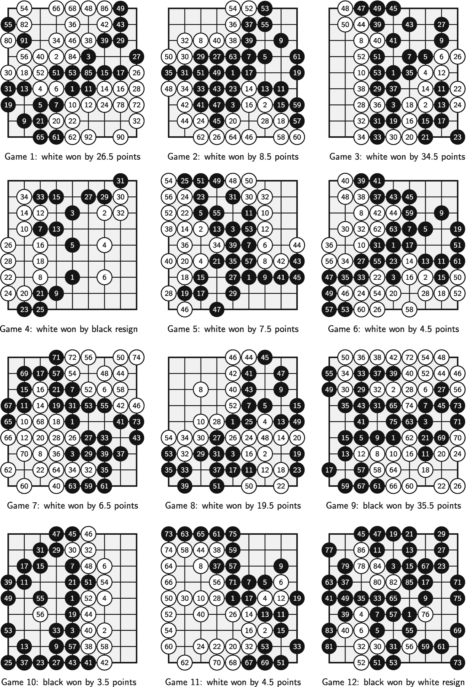

一组 12 张与 CrazyStone 业余 1 段水平对手对弈的围棋棋局图，展示了不同的对弈结果。

**图 14.14** 在这些对局中，我们的智能体（执白）对阵 CrazyStone（执黑）。我们使用了 11 模块模型版本，并精心挑选了在 154,000 训练步后产生的最佳模型。为了提供合适的挑战，CrazyStone 被设置为业余 1 段水平。对局采用中国规则计分，白方贴 7.5 目。


### 14.5 在 13×13 棋盘上训练 AlphaZero 玩五子棋

对于觉得围棋过于复杂的读者，无论是难以理解其规则（确实相当复杂），还是缺乏进行实验的计算资源，这里有一个替代方案：在像五子棋这样更简单的游戏中训练 AlphaZero。五子棋，也称为“连五子”，是一种简单的棋盘游戏，与围棋有一些相似之处。在五子棋中，玩家轮流在 15×15 的棋盘上落子，不像围棋那样对落子位置有严格限制。目标很简单：第一个在水平、垂直或对角线上将五颗同色棋子连成一条线的玩家获胜。如果棋盘被棋子填满，且没有玩家达成五子连线，则游戏为平局。与围棋不同，五子棋没有“虚手”或“认输”的走法。与围棋的相似性以及更简单的规则，使得五子棋成为测试和验证 AlphaZero 智能体的理想问题。简单来说，在强化学习的背景下，如果围棋相当于 Atari 游戏，那么五子棋就类似于“车杆”问题。

五子棋也可以在更小的棋盘上进行，例如 9×9 和 13×13。然而，在较小的棋盘上，比如 9×9，如果双方都持续做出最优走法，游戏往往会以平局告终。但在较大的棋盘上情况并非如此，先手方（黑棋）拥有优势，如果他们在整场游戏中都走出最佳着法，则总能获胜。因此，当黑棋玩家水平很高时，在较大的棋盘上游戏通常在 20-30 步左右结束，这并不奇怪，除非游戏采用了额外的特定规则。例如，某些变体规则规定，连成超过五颗棋子并不自动获胜，并且在开局阶段某些位置可能受到限制。

关于五子棋有一个有趣的事实：标准的 AlphaZero 智能体在正常情况下表现相当不错。然而，存在一种特殊情况，即对手试图通过在棋盘边缘连成五子来获胜，尤其是在开局阶段。令人惊讶的是，我们发现智能体在这种情况下无法阻挡对手，尽管其整体游戏能力很强，如图 14.15 所示。这种短视行为可归因于智能体在训练期间缺乏接触此类对局。毕竟，自我对弈的智能体极不可能走出这些特定的着法。

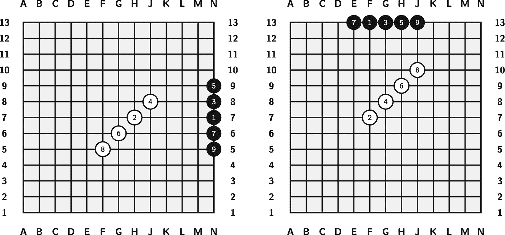

13×13 网格上五子棋策略棋盘游戏的两种表示。

**图 14.15** 标准 AlphaZero 智能体在 13×13 五子棋棋盘上出现边缘情况问题的示例，其中对手（黑棋）试图通过在棋盘边缘连成五子来快速获胜。在这种情况下，智能体（白棋）常常无法阻挡对手。即使智能体经过长时间训练并在训练中接触到更多自我对弈对局，这个问题仍然存在。

为了解决这个问题，如前所述，我们选择了一种针对五子棋游戏独特性质稍作修改的神经网络架构。在我们的实验中，我们发现对初始卷积块使用填充值 3（而非通常的 1）能有效解决五子棋中的这个边缘问题。

在我们的实验中，我们训练了一个 AlphaZero 智能体在 13×13 棋盘上玩自由式五子棋。自由式五子棋意味着没有额外的严格规则；同色棋子连成等于或大于五颗即算获胜。

我们遵循了上一节中概述的类似配置，其中我们讨论了在 9×9 围棋棋盘上训练 AlphaZero 智能体。但是，我们做了以下更改：

-   我们的神经网络由 14 个块组成，包括 1 个初始卷积块和 13 个残差块。我们对所有卷积层使用了 40 个卷积滤波器，对价值头使用了 80 个隐藏单元。
-   为了解决五子棋中的边缘情况问题，我们对神经网络中的初始卷积块使用了填充值 3，而不是 1。
-   由于 13×13 棋盘上的动作空间更大，我们将自我对弈和评估对局中每次蒙特卡洛树搜索（MCTS）的模拟次数增加到 400 次。
-   我们仅使用最近的 150,000 局自我对弈对局来训练神经网络，批量大小为 256。第一个检查点是在 5,000 局自我对弈对局后创建的。
-   由于五子棋没有认输走法，我们在自我对弈对局中没有包含认输机制。
-   我们没有使用人类对局来评估神经网络的预测准确率，而是完全依赖基于最新模型与上一检查点模型之间评估对局计算出的 Elo 评分。做出这个决定是因为高质量的五子棋对局记录有限。

除了提到的更改，其他设置保持不变。训练在一台拥有 128 个 CPU 和 8 个 GPU 的服务器上进行。我们每 5,000 局对局收集一个检查点，并每 1,000 个训练步骤生成一个检查点。训练过程涉及一百万局自我对弈对局，完成 200,000 个训练步骤耗时 16 小时。

图 14.16 显示了神经网络的训练损失。随着训练的进行，策略损失和价值损失都呈现出持续下降的趋势，这一点很明显。这种行为与在 9×9 围棋棋盘上训练时观察到的非常相似。

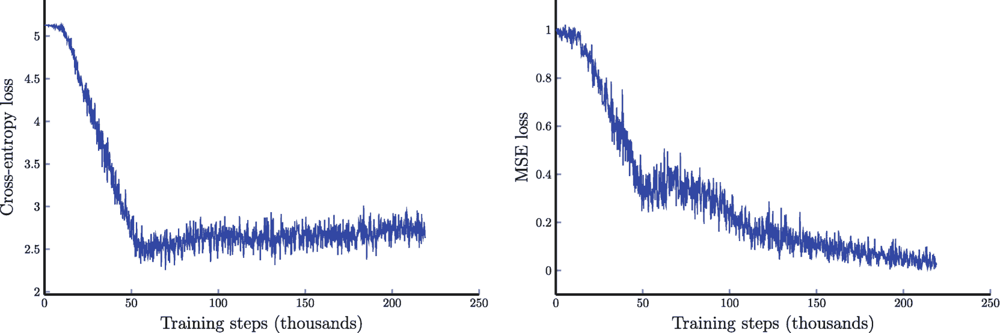

两张图分别展示了交叉熵损失和均方误差损失随训练步骤的变化。绘制的趋势线从 (0, 5.1) 下降到 (220, 2.7)，以及从 (0, 1) 下降到 (220, 1)，并伴有波动。数值为估计值。

**图 14.16** 在 13×13 五子棋棋盘上训练 AlphaZero 智能体期间的策略交叉熵损失（左）和价值均方误差损失（右）。


图 14.17 展示了在评估对局中计算出的智能体 Elo 等级分，其中最新模型与上一检查点的模型进行对弈。该智能体始终获得极高的 Elo 等级分，证实了我们之前的解释。在五子棋中，尤其是在较大的棋盘上，执黑方拥有显著优势，因为它可以通过持续走出最佳着法来确保胜利。除了 Elo 等级分，我们还提供了关于评估对局时长的宝贵见解，这作为评估智能体性能的另一个指标。对于五子棋而言，评估对局的持续时间成为一个关键考量因素。通常，如果智能体缺乏有效阻挡对手的能力，对局会在大约十步内结束，尤其是在初始训练阶段。然而，随着智能体学习的深入，它掌握了成功阻挡对手着法的技巧，这通常意味着更长且更具挑战性的对局。

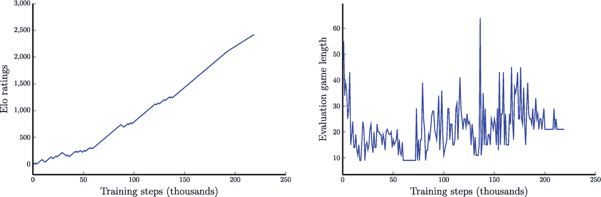

两张图分别展示了 Elo 等级分和评估对局时长随训练步数的变化。前者呈现从 (0, 0) 到 (220, 2450) 的上升趋势。后者趋势在 (0, 55) 到 (220, 23) 之间波动。数值为估算值。

**图 14.17** AlphaZero 智能体在 `13 x 13` 五子棋棋盘上的表现。左图：根据当前（最新）模型与上一检查点模型之间的评估对局计算出的 Elo 等级分。右图：评估对局的时长

然而，值得注意的是，在较小的棋盘（例如 `9 x 9`）上，结果会有显著差异。在这种情况下，经过一定时间的训练后，Elo 等级分往往会趋于平稳。此外，评估对局的时长通常会延长至 `9 x 9 = 81` 步。出现这种现象是因为在较小的棋盘上，先手方（黑方）受到空间限制，无法执行复杂的着法。因此，对局往往在任一方获胜之前就以棋盘完全占满而告终。

图 14.18 展示了智能体在 `13 x 13` 五子棋棋盘上的训练进程，并展示了其在评估对局中的表现。值得注意的是，智能体在短短 18,000 个训练步内就展现出显著的学习成果，成功通过水平连成五子取得胜利。大约在 28,000 个训练步时，智能体展现出在简单场景中阻挡对手着法的能力。大约在 68,000 个训练步时，出现了一个显著的突破，智能体发现了一种有效的获胜策略——通过斜向连子取胜。此外，它迅速学会了应对对手试图斜向获胜的尝试。智能体的能力持续提升，在大约 148,000 个训练步时尤为明显，它始终展现出强劲的棋力。事实上，智能体变得几乎不可战胜，其最优着法使得白方的最佳努力也徒劳无功。即使经过进一步训练，智能体也始终展现出这种卓越的表现。

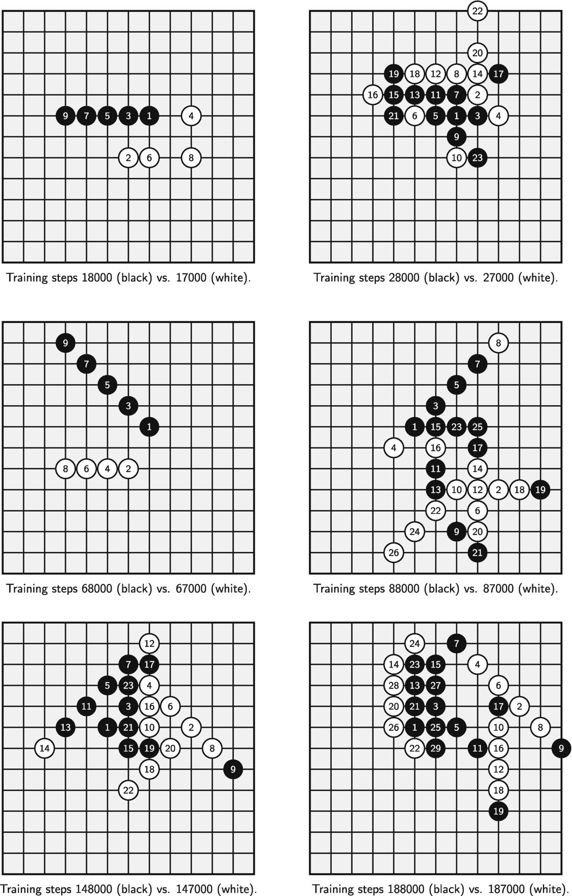

六幅在 13x13 网格上不同阶段五子棋策略棋盘游戏的示意图。

**图 14.18** 用于展示智能体在 `13 x 13` 五子棋棋盘上训练不同阶段的评估对局，我们使用最新模型（黑方）与上一检查点的模型（白方）对弈。这为智能体在训练过程中习得多种获胜策略提供了证据。最终，智能体达到了强大的棋力水平，其着法使得白方尽管尽力阻挡对手的进展，也无法获胜。


### 14.6 总结

在本书的最后一章中，我们深入探讨了著名的 AlphaZero 算法，该算法通过在复杂且极具挑战性的策略游戏中击败世界冠军，在强化学习领域取得了卓越成就。

我们首先解释了为何无模型强化学习在解决此类难题时力不从心，以及为何需要基于模型的方法来进行有效规划。随后，我们探讨了传统搜索算法在面对像围棋这样拥有巨大搜索树的游戏时所存在的局限性。

本章用大量篇幅阐述了蒙特卡洛树搜索（MCTS）算法，该算法是 AlphaZero 智能体的核心。我们概述了通用 MCTS 算法，并描述了其在一次搜索会话中的不同阶段。此外，我们还演示了如何将 MCTS 算法应用于双人零和博弈。

在扎实理解 MCTS 算法的基础上，我们接着解释了 AlphaZero 算法。我们之所以只专注于 AlphaZero，是因为与其后继者相比，它更具通用性、更强大，且实现相对简单。我们阐明了围棋游戏的状态表示，并概述了 AlphaZero 所采用的神经网络架构。

接下来，我们介绍了 AlphaZero 所使用的改进版 MCTS 算法。与通用 MCTS 算法不同，AlphaZero 在模拟展开阶段并不会一直模拟到游戏结束；相反，它利用神经网络的预测作为估计的游戏结果。与完整模拟相比，这种方法显著加快了处理速度。

最后，我们展示了在 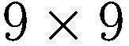 围棋棋盘上训练 AlphaZero 智能体的实验结果。与传统的 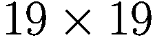 围棋棋盘相比，这需要更少的计算资源和更小的预算。值得注意的是，尽管仅经过 50 小时的训练、一百万局对弈，且未对训练过程或超参数进行任何微调，我们训练出的智能体仍达到了业余 1 段的水平。

对于那些可能没有所需资源或对围棋不感兴趣的读者，我们还额外进行了一项对比实验，使用了 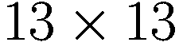 的五子棋棋盘。尽管五子棋比围棋简单，但这项实验揭示了智能体性能方面一些有趣的见解。它揭示了传统神经网络架构在处理五子棋边缘情况时遇到的困难，同时也展示了如何通过对神经网络架构进行简单修改来纠正这一问题。

通过进行大量的实验和分析，我们得出了最终结论。然而，我们谦逊地承认，我们的理解可能并不完整，可能还有一些我们尚未充分探索的领域。就像冰山一样，强化学习的深度是巨大的，而本书仅代表了冰山一角。

例如，就在本书即将完成之际，DeepMind 最近发表的一篇论文中涌现了一项激动人心的进展。他们公布了一个名为 AlphaDev [18] 的新强化学习智能体，它是本章讨论的 AlphaZero 智能体的一个改进版本。据他们声称，AlphaDev 智能体在发现更快的排序算法方面取得了重大突破。这一宣布引发了巨大的热情，因为它有望改变我们对计算和编码的理解。此外，它还提供了令人信服的证据，表明强化学习和 AlphaZero 方法可以成功应用于解决现实世界的挑战。

在本书的结尾，我们想对您始终如一的兴趣表示最深切的感谢，并希望这本对强化学习基础、数学和算法的全面探索，对您而言既富有启发性又充满乐趣。

在我们的旅程中，我们谦逊地承认，我们可能遇到过挑战，也犯过错误。我们致力于持续改进，并珍视您的反馈，以帮助我们完善和提升内容。如有任何疑问或更正，请随时联系我们。

我们鼓励您继续探索这个不断扩展的强化学习领域。愿您在深入这个激动人心的研究领域时，您的持续旅程能为您带来新的见解和突破性的发现。最重要的是，我们衷心希望本书能为您打下坚实的基础，并成为您未来努力的灵感源泉。


