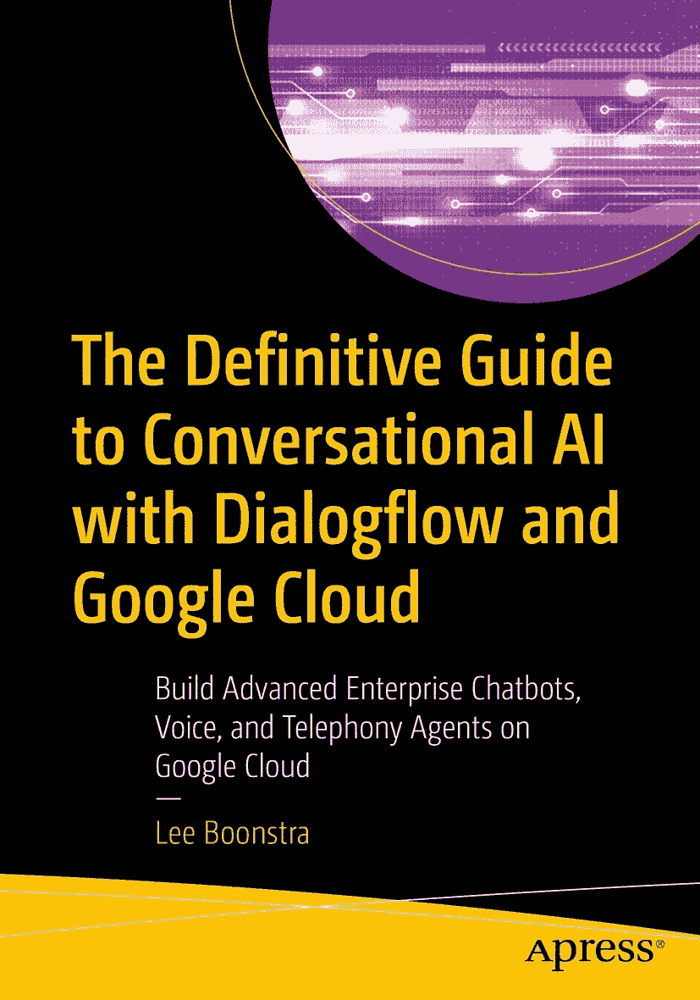

# 1. 对话式人工智能简介

聊天机器人是一种旨在与在线人类用户模拟对话的用户界面。这个词是**聊天**（对话）和**机器人**这两个词的组合。

像聊天机器人或语音激活对话式用户界面（如 Siri、Google Assistant 或 Alexa，也包括电话对话中的机器人）这样的对话式用户界面如今非常流行。十年前，每个人都想开发移动应用；而现在，大家都在或正在致力于构建对话式用户界面。

聊天机器人有什么独特之处，为什么它们现在如此流行？实际上，第一批聊天机器人早在个人电脑问世时就已出现。让我们回顾一些历史，追溯到 1950 年。

---

ISBN 978-1-4842-7013-4  
e-ISBN 978-1-4842-7014-1  
[`doi.org/10.1007/978-1-4842-7014-1`](https://doi.org/10.1007/978-1-4842-7014-1)  
© Lee Boonstra 2021  
Apress Standard

本出版物中使用通用描述性名称、注册商标名称、商标、服务标志等，即使没有明确声明，也不意味着这些名称不受相关保护法律和法规的约束，因此可自由使用。出版商、作者和编辑可以假定，本书中的建议和信息在出版之日是真实准确的。出版商、作者或编辑均不对本文所含材料或可能存在的任何错误或遗漏提供明示或暗示的保证。出版商对已出版地图中的管辖权主张和机构归属保持中立。

本 Apress 印记由注册公司 APress Media, LLC（Springer Nature 的一部分）出版。

注册公司地址为：1 New York Plaza, New York, NY 10004, U.S.A.

*献给我的妻子* Michele *和我的女儿 Rebel。我爱你们到地老天荒。*

---

## 引言

对一些人来说，写书的过程很像分娩。对另一些人而言，写成的书就像他们的孩子。我在怀第一个孩子 Rebel 六个月时写了这本书。由于 COVID-19，荷兰刚刚进入封锁状态，我不得不取消所有谷歌的工作旅行。有了这么多额外的时间，而且我闲不住，我必须与世界分享我的对话式人工智能知识，并将其付诸笔端。是的，这是一个过程，但我投入了很多爱！所以这本书的发布就是我的宣告！

> —Lee Boonstra（谷歌对话式人工智能高级开发者倡导者）

## 本书读者对象

本书面向所有对使用谷歌对话式人工智能/云技术为网页、社交媒体、语音助手或联络中心构建聊天机器人感兴趣的人（从业者）。无论你是用户体验设计师/语言学家、网页/对话机器人工程师、聊天机器人架构师、后端开发人员、项目经理，还是业务决策者，即首席技术官或首席创新官，本书都适合你。

有些主题针对工程师。我将分享一些代码并解释其作用。我的大部分代码示例都是用 JavaScript 为 Node.js 编写的。如果你更倾向于用其他语言编程，我的示例也会很容易理解（并重写）为你选择的语言。

在各章节中，我添加了高级技巧和窍门，比如我在与各种（企业级）Dialogflow 客户合作时听到的问题的答案。

我保证，即使你以前使用过 Dialogflow，你仍然可能会学到新东西！

## 你将学到什么

阅读本书时，读者将学到以下内容：

*   什么是 Dialogflow、Dialogflow Essentials、Dialogflow CX，以及机器学习是如何使用的
*   如何为个人和企业用途创建 Dialogflow 项目
*   Dialogflow Essentials 概念，如意图、实体、自定义实体、系统实体、复合实体，以及如何跟踪上下文
*   如何使用预构建代理、闲聊模块和常见问题知识库快速构建机器人
*   Dialogflow 如何提供开箱即用的代理审查
*   如何为网页和社交媒体渠道部署文本对话式用户界面
*   如何为语音助手和电话网关/联络中心构建语音代理
*   如何构建多语言聊天机器人
*   如何编排多个（子）聊天机器人以构建更大的对话平台
*   如何使用聊天机器人分析，以及如何测试你的 Dialogflow 代理的质量
*   Dialogflow CX 如何融入其中，Dialogflow CX 有何不同，以及新的 Dialogflow CX 概念

这些主题更针对开发者和工程师，并包含更高级的用例：

*   学习如何以多种方式创建 fulfillment 以连接到 Web 服务
*   学习如何从本地/开发机器运行后端代码
*   学习如何保护你的聊天机器人
*   学习如何通过创建自定义集成，将聊天机器人集成到网站或原生移动（Flutter）应用中
*   学习如何创建全渠道机器人平台架构
*   学习如何在自定义集成中创建富响应
*   学习如何在物联网语音应用中流式传输你的语音用户界面
*   学习使用你自己的数据仓库进行高级聊天机器人分析

> **注意**  
> 尝试更高级的示例可能需要按使用量付费使用谷歌云资源。如果你是谷歌云新手，可以创建一个免费的谷歌云账户，该账户附带 300 美元的赠金。这些赠金应该足够你尝试这些示例。许多谷歌云产品都有免费使用层级（[`https://cloud.google.com/free`](https://cloud.google.com/free)）。

## 下载代码

每章的示例代码以 zip 文件形式提供，可在本书网站 [`www.leeboonstra.dev`](http://www.leeboonstra.dev) 和 [`www.apress.com/ISBN`](https://www.apress.com/ISBN) 获取。它将指向 GitHub 上 Apress 书籍的源代码仓库，我的代码可以在那里持续更新。

## 致谢

没有一些杰出人士的帮助，这本书是不可能完成的。因此，我要感谢：

*   Apress 的 Celestin Suresh John（采编编辑）、Matthew Moodie（开发编辑）和 Aditee Mirashi（协调编辑），没有你们的帮助，这本书无法进入生产阶段。非常感谢你们的辛勤工作。

在谷歌内部，有很多人在我写这本书的过程中在幕后帮助了我。我非常感谢你们的支持、帮助和想法。

*   特别感谢联络中心 AI 专家 Akash Parmar 和工程总监 Antonio Gulli。感谢你们阅读本书并进行技术审阅！非常感谢！
*   感谢你们对本书的支持和想法：Dialogflow 产品经理 Shantanu Misra；对话式 AI 孵化器经理（兼 API.ai 联合创始人）Pavel Sirotin；开发者倡导经理 Dave Elliot；客户工程师 Wouter Roosenburg；产品营销经理 Surbhi Agarwal；AI 产品负责人 Antony Passemard；以及工程副总裁 Andrew Moore。
*   还要非常感谢内部联络中心 AI 和 Dialogflow 冠军社区！

最后，我要向以下人士表达我的感激之情：

*   荷兰皇家航空客户体验产品负责人 Lucienne de Boer，感谢她分享 Dialogflow 用例和企业经验
*   ING 银行全球 NLP 负责人 Pieter Goderis，感谢他分享 Dialogflow 用例和企业经验
*   Smartvoices 语音顾问 Carla Verwijmeren，感谢她校对本书各章节

## 关于作者  
## 关于技术审阅者

