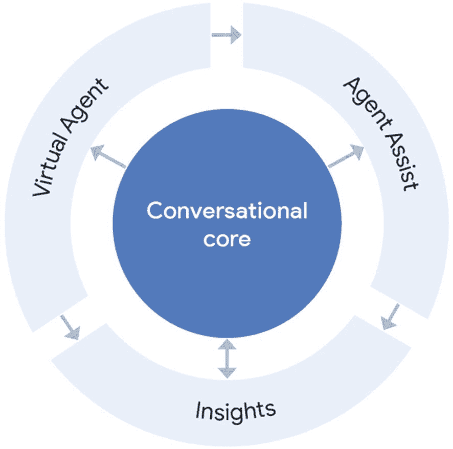
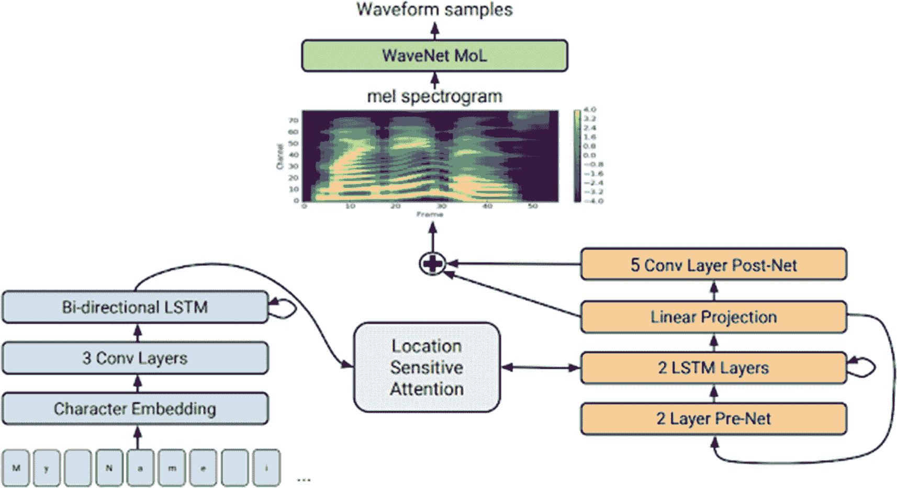

# Dialogflow Essentials 与 Dialogflow CX 对比

`Dialogflow CX` 是一个独立的产品，将与 `Dialogflow Essentials` 共存。如果你是企业客户，正在构建一个大型复杂的聊天机器人平台或联络中心客户体验，并且数据区域化对你至关重要（由于 `GDPR`），或者你的对话需要大量的话轮转换和对话分支，那么 `Dialogflow CX` 可能是适合你的工具。或者，当你希望选择一个更简单的工具，用于不太复杂的可视化代理，或者你确实想构建复杂的可视化代理，但又不介意亲自动手编写一些支持（后端）代码时，那么请使用 `Dialogflow Essentials`。

## 关于联络中心 AI

联络中心 AI (`CCAI`) 是谷歌云的一项解决方案，用于在联络中心中实现具有类人交互（和语音）的虚拟代理。`Dialogflow Essentials` 和 `Dialogflow CX` 是谷歌云的产品，而 `CCAI` 则是由电话服务提供商与谷歌云工程师共同构建的解决方案。因此，`CCAI` 的市场推广是通过电话合作伙伴进行的。

这些合作伙伴包括 `Genesys`、`Avaya`、`Mitel`、`Cisco`、`Twilio` 等。他们可以在现有的联络中心硬件上启用 `CCAI`。

成功使用 `CCAI` 的公司包括 `Verizon`、`GoDaddy` 和 `Marks & Spencer`。

**注意**

为什么让机器人接听电话会很有趣？

举个例子，想象一家健康保险公司。通过联络中心打来的大部分电话都是人们询问某些费用是否在承保范围内。例如，“看牙医的费用包含在我的套餐里吗？”这家健康保险公司有大量的呼入电话，例如在荷兰，尤其是在年底前后，因为那是合法更换健康保险公司的唯一时间段。

客服热线非常繁忙，许多人会被置于等待状态。与其处理漫长的排队和等待时间，如果有一个语音机器人能接听电话并为你回答最常见的问题，那岂不是很好？这可以解放联络中心的人工坐席，让他们去回答更复杂或更私人的问题。

我们在 2020 年也看到了类似的情况。谷歌帮助了许多受 COVID-19 影响的行业，如旅游业。旅行社和航空公司的联络中心无法处理电话负载，因为所有的旅行和航班都被取消了。人们被长时间等待，或者断线后被告知稍后再打。通过在联络中心启用 `CCAI` 来回答最常见的问题，企业能够释放线路压力，节省成本，并更好地帮助他们的客户。

### CCAI 架构

电话服务提供商构建的 CCAI 架构的基石是 `Dialogflow CX`。`Dialogflow` 提供与用户的自动化交互，并包含自动语音识别 (ASR) 和具有逼真人声模型的文本转语音功能。

它让客户能够全天候 24/7 获得即时对话式自助服务。

图 1-1

Google Cloud 的 Contact Center AI 架构概览

如图 1-1 所示，Contact Center AI 产品包含额外的 Google Cloud 组件：`Agent Assist` 和 `Contact Center AI Insights`。

`Agent Assist` 通过识别意图并提供实时的、逐步的协助，在通话过程中为人工客服提供持续支持。

现在想象一下，您有一个虚拟客服接听电话；然而，它不知道如何回答客户（例如，因为它没有针对该主题的训练短语进行训练）。CCAI 可以通过客服转接将您连接到在线人工客服，但在后台仍会监听，以便在屏幕上向人工客服提供建议（或填写表单），从而缩短通话时间。

`Contact Center AI Insights` 使用自然语言处理来识别通话驱动因素和情绪，帮助联络中心管理者了解客户互动情况，以改善通话结果。它使联络中心管理团队能够听到客户在说什么。基于此，他们可以做出数据驱动的业务决策并提高运营效率。

CCAI 架构构建在由电话合作伙伴提供的现有电话硬件之上。

## 关于 Google Cloud 语音技术

### Cloud Speech-to-Text API

`Speech-to-Text API` (STT) 是一个 Google Cloud 自动语音识别 (ASR) API，它能够通过 API（通过 REST 或 gRPC 调用以及客户端库）识别口语并将其转录为文本。

Google 在语音技术方面拥有超过 20 年的经验。第一项专利可追溯到 2003 年，当时 Google 为 Google 搜索引擎推出了超过 40 种语音语言，以便通过语音进行搜索。

2012 年，Google 开始使用深度神经网络，这也是用于 Google Assistant 的语音模型的起点。除了 Google Assistant 和搜索，Google 还在其他各种 Google 产品中使用语音识别：`Dialogflow`、`Google Meet` 中的字幕功能、`Android Speech`、`YouTube TV` 字幕和 `Video AI`，仅举几例。

`STT API` 始于 2017 年，是 Google Cloud 的一部分。它支持超过 73 种语言的 125 多种变体，可以转录语音，并且可以自动检测语言。它还添加了标点符号和说话人分离（区分不同的说话人），并且在撰写本文时，它甚至可以在本地运行。`STT` 是 Google 最受欢迎的云产品之一。您可能会认为 `Speech-to-Text` 最常用于语音机器人场景，但实际上，客户将 `STT` 用于各种用途，例如生成视频或实时会议的字幕、电话通话监控、从音频文件中获取转录文本，或在应用程序中构建语音命令。

通过 Google Cloud 的 `Cloud Speech-to-Text API` 实现的 ASR 是 Contact Center AI 解决方案中的关键部分，它将获取呼叫者的语音并将其转换为文本，以便通过 `Dialogflow` 检测意图或为 CCAI Insights 收集分析数据。

注意

`Cloud Speech-to-Text API` 受 Google Cloud 条款和条件约束。这意味着 Google 不能也不会使用您的语音数据来为其他人的使用训练语音模型。因此，您不必担心使用相同 `STT API` 的竞争对手会访问您的业务数据。

像 Chrome 这样的浏览器或像 Android 这样的操作系统可能也有内置的语音识别器；然而，企业更倾向于选择 `Cloud Speech-to-Text` 解决方案，因为其企业级条款和条件或额外的 `STT` 功能，例如在您自己的数据中心本地运行语音模型。除此之外，它还使用不同的数据集进行了训练。

### Cloud Text-to-Speech API

Google Cloud 的 `Text-to-Speech` (TTS) 从文本生成语音。它就像一个语音合成器。在撰写本文时，有超过 90 种不同的声音可供选择。

Google Cloud 的 `TTS` 允许开发者创建听起来自然的合成人类语音，作为可播放的音频；它就像一个语音合成器。您可以使用通过 `TTS` 创建的音频数据文件来驱动您的应用程序或增强媒体，例如视频或音频录制。

`TTS` 将文本或语音合成标记语言 (SSML) 输入转换为音频数据，例如 MP3 或 LINEAR16（WAV 文件中使用的编码）。

## WaveNet

过去，我们有用于生成语音的标准机器学习模型。它们听起来非常机械。主要是由于 Google Assistant，我们创建了更先进的模型：`WaveNet` 模型。

它合成语音时，在音节、音素和单词上具有更逼真的强调和语调变化。当虚拟客服的声音听起来像机器人时，用户会将虚拟客服视为机器人，因此会以“计算机”风格提出愚蠢的问题，例如“视频游戏发布 PS5”，而不是“这个月 PlayStation 5 上发布了哪些最新的视频游戏？”。

借助 `WaveNet` 机器学习 TTS 模型，Google 可以在短时间内捕捉一个人的声音，而无需让演员在录音室里待上数周或数月，并通过学习声波从中生成新的“声音”。

### 自定义语音

通过 `Google Cloud Text-to-Speech API` 和 `Dialogflow` 中内置的语音合成，有许多生成的声音可供选择。然而，在 Google Cloud，我们听到了许多企业用户的请求，他们希望在对话中使用自己独特的自定义声音。

例如，在 Google Assistant 或联络中心使用其品牌演员的声音。这个过程通常也很昂贵，因为您需要租用一名演员，并让他们在录音室里待上数周来录制每一个短语。

借助机器学习，Google 现在可以生成自定义语音。可以通过阅读特定的语音脚本，录制您自己的声音（或演员的声音）30 分钟。它将为您生成语音。

Google 在底层使用的技术称为 `Tacotron 2`。它利用了序列到序列学习 (Seq2Seq)。这使得将训练模型从一个领域转换到另一个领域的序列成为可能。（例如，通过 `Seq2Seq`，`Dialogflow` 能够支持多种语言的多语言支持，因为很容易推广到新语言。）

注意在图 1-2 中，Google 使用了一个针对 TTS 优化的序列到序列模型，将字母序列映射到一系列编码音频的特征。这些特征是一个 80 维的音频频谱图，其帧每 12.5 毫秒计算一次，捕捉了单词的发音以及人类语音的各种细微差别，包括音量、速度和语调。最后，这些特征使用类似 `WaveNet` 的架构转换为 24 kHz 的波形。

几乎不可能区分原始配音演员的声音与生成的声音。

图 1-2

`Tacotron 2` 模型架构的详细视图。图像的下半部分描述了将字母序列映射到频谱图的序列到序列模型
