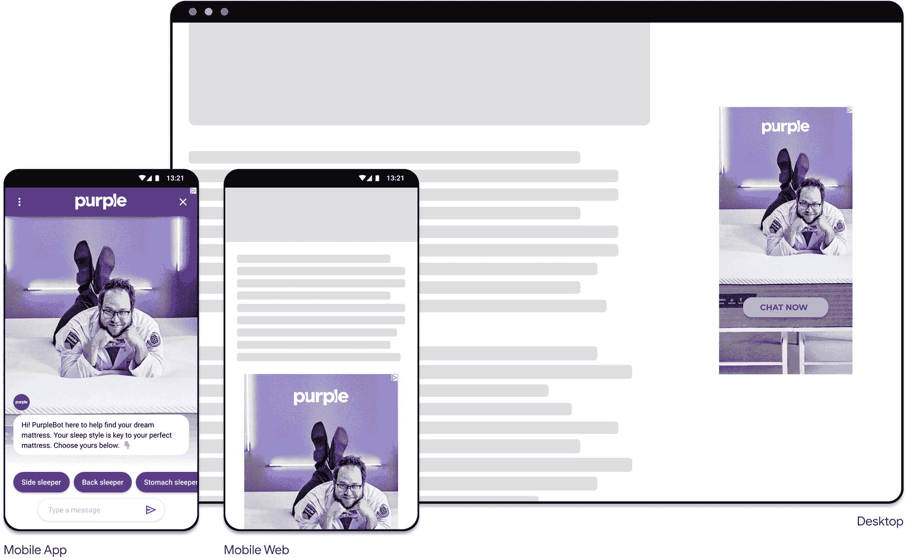

# 其他谷歌对话式 AI 产品

谷歌正在大力投资对话式 AI 技术。聊天机器人和对话式 AI 是谷歌以及谷歌云的首要任务。

上一节介绍了谷歌云中的对话式 AI 产品，以下是谷歌其他你可能听说过的对话式 AI 产品、研究和工具。

### Google Assistant

Google Assistant 是谷歌的 AI，就像 `Siri` 是苹果的 AI，`Alexa` 是亚马逊的 AI 一样。

Google Assistant 最初于 2016 年 5 月作为谷歌即时通讯应用 `Allo` 和语音激活音箱 `Google Home` 的一部分首次亮相。在谷歌 Pixel 智能手机上独占一段时间后，它于 2017 年 2 月开始部署到其他安卓设备上，包括第三方智能手机和 `Wear OS`（原名 `Android Wear`），并于 2017 年 5 月作为独立应用在 iOS 操作系统上发布。

截至 2020 年夏季，Google Assistant 已可在超过 10 亿台设备上使用，覆盖超过 80 个国家；它每月帮助超过 5 亿人通过智能音箱、智能显示屏、手机、电视、汽车等设备完成各种任务。

当你之前使用过 Google Assistant 时，你知道你可以向它询问任何事情。这可以是一个问题，例如“嘿 Google，荷兰国王是谁？”（它会告诉你答案是威廉-亚历山大。）还可以提出后续问题。“他的妻子是谁？”（它知道威廉-亚历山大的上下文；他的妻子是马克西玛。）如果你有支持 Assistant 的设备，例如智能灯泡、恒温器、安卓电视等，你可以将其与物联网、家庭自动化集成（“嘿 Google，打开电视”，“调高温度”，“在 Spotify 上播放歌曲 2”等）。你也可以询问与你品牌相关的特定问题，比如从特定商店购买产品（例如，“购买托尼·霍克职业滑板 2。”）；这时你将用到 Google Assistant 的应用生态系统。在前面的例子中，购买电子游戏并非 Google Assistant 的原生任务，因为它依赖于商店、位置和库存。这只能在第三方“应用”的上下文中实现（在 Google Assistant 生态系统中，这些被称为 `Actions`）。

这意味着你需要将你的 Actions 部署到 Google Assistant——类似于安卓、iOS、Windows 或 MacOS 通过打开应用程序来工作。但无需点击应用图标，你可以通过要求 Google Assistant 打开或与你的品牌对话来调用你的 Actions：“嘿 Google，与李·布恩斯特拉的电子游戏商店对话。”此时，你会听到声音的变化。它会从原生的 Google Assistant 体验切换到你的应用的语音和对话。

## Actions on Google

2016 年 12 月，谷歌推出了 `Actions on Google`，这是一个面向 Google Assistant 的开发者平台。`Actions on Google` 允许第三方开发者构建用于 Google Assistant 的 Actions（应用），在原生 Google Assistant 之上提供扩展功能。Actions 目录中有超过一百万个 Actions，它就像一个 `Actions on Google` 的应用商店，区别在于你无需下载 Actions。你只需通过语音与之对话即可调用它们。你可以使用唤醒词来做到这一点，例如“嘿 Google，与我的 `<应用名称>` 对话。”

> **提示**

>

> 有趣的事实是，由于谷歌的直接集成，90% 的 Actions 都是使用 Dialogflow 构建的。使用 Dialogflow，将你的对话带到 Google Assistant 非常容易；只需拨动一个开关。请参阅本书第 7 章。

### Actions Builder

`Actions on Google` 平台附带了一个 SDK、可视化组件、大量文档以及一个用于构建 Actions 的额外工具：`Actions Builder`。

使用 Dialogflow 和 `Actions Builder`，你都可以为 Google Assistant 构建对话。选择 Dialogflow Essentials 而非 `Actions Builder` 的主要原因是，Dialogflow ES 是谷歌云的一部分，并附带企业条款和条件、SLA 和支持。当你想要构建多渠道虚拟客服（支持 Google Assistant 和/或社交媒体聊天机器人的机器人）时，Dialogflow Essentials 是你应该选择的工具。Dialogflow ES 与 `Actions on Google` 框架有直接集成。Dialogflow 是一个成熟的工具，被社区广泛使用。

`Actions Builder` 最适合让用户快速完成任务的简单用例。它采用消费者条款和条件。

## AdLingo

`AdLingo` 是谷歌 Area 120（孵化器项目）的一部分，它允许品牌通过将广告转变为由 AI 驱动的个性化对话来大规模获取客户。如何实现？`AdLingo` 广告使品牌能够将其虚拟客服嵌入展示广告中，从而在潜在客户寻找信息的地方大规模触达他们。换句话说，借助 `AdLingo`，你可以将你的 Dialogflow 客服变成一个广告。无需让客户访问你的网站，你可以通过在其他（外部）网站上展示对话式广告来获得更大的覆盖范围！

**图 1-3** 借助 `AdLingo`，你可以将展示广告转变为聊天机器人，在潜在客户无需先访问你的网站的情况下与他们开始对话

## Chatbase

`Chatbase` 是一个跨平台的即插即用服务，通过提供关键的机器人指标和修复机器人的工作流程，帮助聊天机器人开发者加速找到产品市场契合点。它从数据中挖掘洞察，以创建适合客户服务的、由 AI 驱动的对话体验。你可以通过其门户网站使用 `Chatbase`，也可以通过 Dialogflow 使用它，因为它已部分集成。

## Duplex

你可能在 2018 年谷歌 I/O 大会上看到过 `Duplex` 视频（语音机器人与理发师预约）。该视频迅速走红。截至撰写本文时，它拥有超过 400 万次观看和超过 2.9 万个赞。这是谷歌的一个项目，允许特定用户通过电话预订餐厅。然而，并非用户直接与餐厅员工交谈，而是 Google Duplex 在 Google Assistant 的帮助下代表用户说话。它通过一种基于 AI 但听起来像人类的声音来实现这一点。

### Meena 与 LaMDA

`Meena` 是一个拥有 26 亿参数的端到端训练神经对话模型。它由谷歌创建，旨在更好地处理各种对话主题，以开发一个并非专精于某一领域、但仍能就用户想要的几乎任何话题进行聊天的聊天机器人。除了是一个引人入胜的研究问题外，这样的对话代理还能带来许多有趣的应用，例如进一步人性化计算机交互、改进外语练习，以及创造更具亲和力的互动电影和视频游戏角色。

然而，当前的开放域聊天机器人有一个关键缺陷——它们常常前言不搭后语。它们有时会说一些与之前对话内容不一致的话，或者缺乏常识和对世界的基本认知。此外，聊天机器人给出的回复往往不针对当前语境。例如，“我不知道”是对任何问题都合理的回答，但它并不具体。

`Meena` 能够进行比现有最先进的聊天机器人更合理、更具体的对话。

`Meena` 模型在 341GB 的文本上进行了训练，这些文本从公共领域的社交媒体对话中筛选而来。与现有的最先进生成模型相比，`Meena` 的模型容量是其 1.7 倍，并且训练数据量是其 8.5 倍。

在撰写本文时，除了合理性之外，谷歌还关注其他属性，如个性以及处理模型中的事实核查、安全性和偏见问题，这在向公众开放 `Meena` 之前是非常必要的。

`Meena` 为 `LaMDA`（对话应用语言模型）奠定了基础，该模型于 2021 年 5 月在 Google I/O 大会上推出。`LaMDA` 是开放域的，这意味着它被设计用于就任何话题进行对话。它通过对话进行训练，通过观察单个词语以及整个句子和段落，理清它们之间的关系，并把握全局，以尝试预测接下来会说什么以及它应该如何回应，从而模仿更自然的对话方式。这样，它就能以一种在整个对话语境中（而不仅仅是最后说出的短语）真正有意义的方式进行回应。

## 总结

本章为你提供了关于聊天机器人及其历史、谷歌云、人工智能、机器学习、自然语言处理、`Dialogflow Essentials`、`Dialogflow CX`、`语音转文本`、`文本转语音`和`联络中心 AI` 的所有背景信息。

在最后一节中，我们讨论了其他谷歌对话式 AI 项目和工具。其中包括 `Google Assistant`、`Actions on Google`（谷歌的虚拟助手和开发平台）、`AdLingo`（将广告转化为虚拟代理）、`Chatbase`（洞察分析）、`Duplex`（还记得那个给理发店打电话的机器人吧）和 `Meena`（合理的对话模型）。

既然你已经了解了一些背景信息，是时候开始构建我们自己的 `Dialogflow` 代理了！

## 延伸阅读

*   更多关于谷歌云的信息

    [https://cloud.google.com](https://cloud.google.com)

*   包含所有谷歌云产品和描述的速查表

    [http://4words.dev/](http://4words.dev/)

*   谷歌的开源项目

    [https://opensource.google/](https://opensource.google/)

*   更多关于 `Dialogflow` 的信息

    [https://cloud.google.com/dialogflow](https://cloud.google.com/dialogflow)

*   更多关于 `TensorFlow` 的信息

    [https://www.tensorflow.org/](https://www.tensorflow.org/)

*   更多关于 `BERT` 的信息

    [https://github.com/google-research/bert](https://github.com/google-research/bert)

*   更多关于 `联络中心 AI` 的信息

    [https://cloud.google.com/solutions/contact-center](https://cloud.google.com/solutions/contact-center)

*   了解更多关于 DeepMind 的 `WaveNet`

    [https://deepmind.com/blog/article/wavenet-generative-model-raw-audio](https://deepmind.com/blog/article/wavenet-generative-model-raw-audio)

*   了解更多关于 `Tacotron2` 的信息

    [https://ai.googleblog.com/2017/12/tacotron-2-generating-human-like-speech.html](https://ai.googleblog.com/2017/12/tacotron-2-generating-human-like-speech.html)

*   更多关于 `Chatbase` 的信息

    [https://chatbase.com/](https://chatbase.com/)

*   更多关于 `Meena` 的信息

    [https://ai.googleblog.com/2020/01/towards-conversational-agent-that-can.html](https://ai.googleblog.com/2020/01/towards-conversational-agent-that-can.html)

*   更多关于 `LaMDA` 的信息

    [https://blog.google/technology/ai/lamda/](https://blog.google/technology/ai/lamda/)

*   更多关于 `Actions on Google` 的信息

    [https://developers.google.com/assistant](https://developers.google.com/assistant)

*   更多关于 `Actions Builder` 的信息

    [https://developers.google.com/assistant/conversational](https://developers.google.com/assistant/conversational)

*   走红的 `Duplex` 视频

    [https://www.youtube.com/watch?v=D5VN56jQMWM](https://www.youtube.com/watch%253Fv%253DD5VN56jQMWM)

*   更多关于 `Tacotron2` 的信息

    [https://google.github.io/tacotron/publications/tacotron2/index.html](https://google.github.io/tacotron/publications/tacotron2/index.html)
