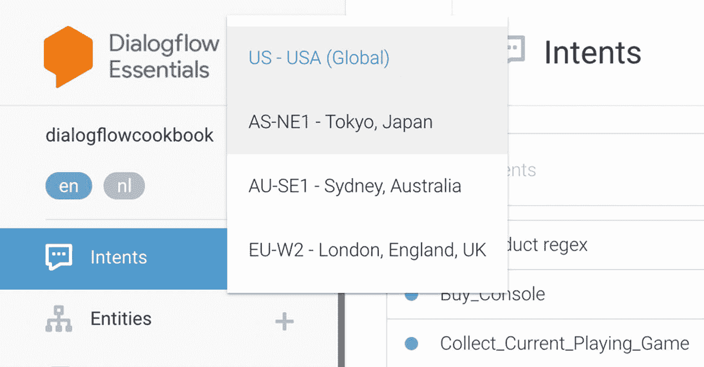
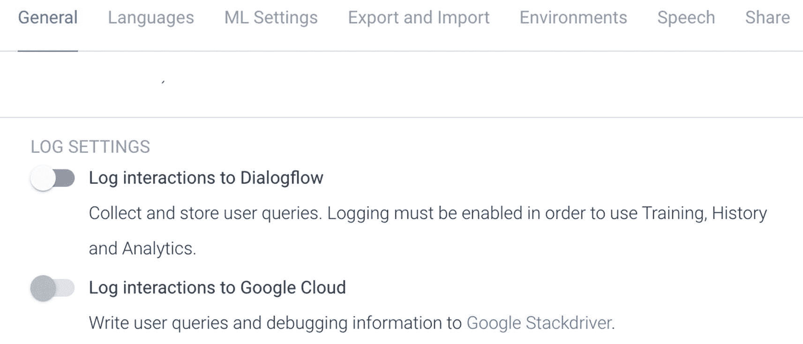
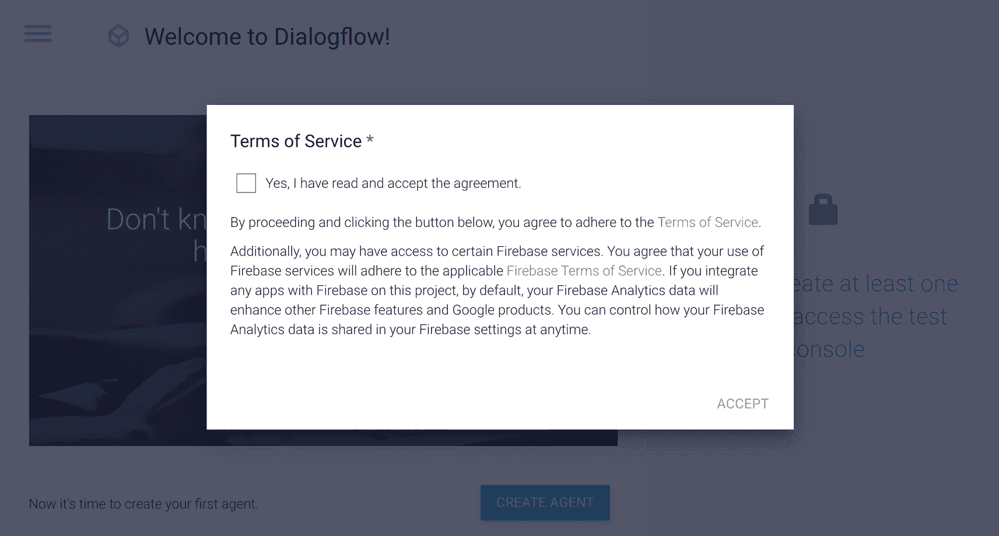
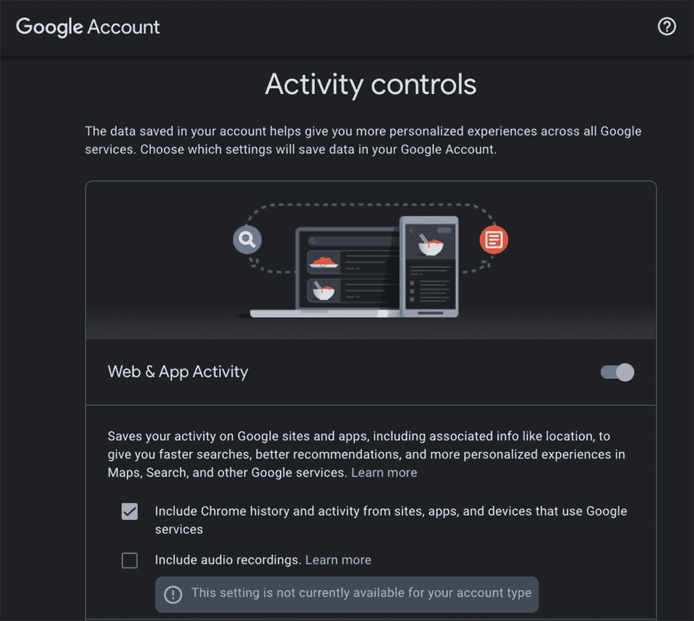
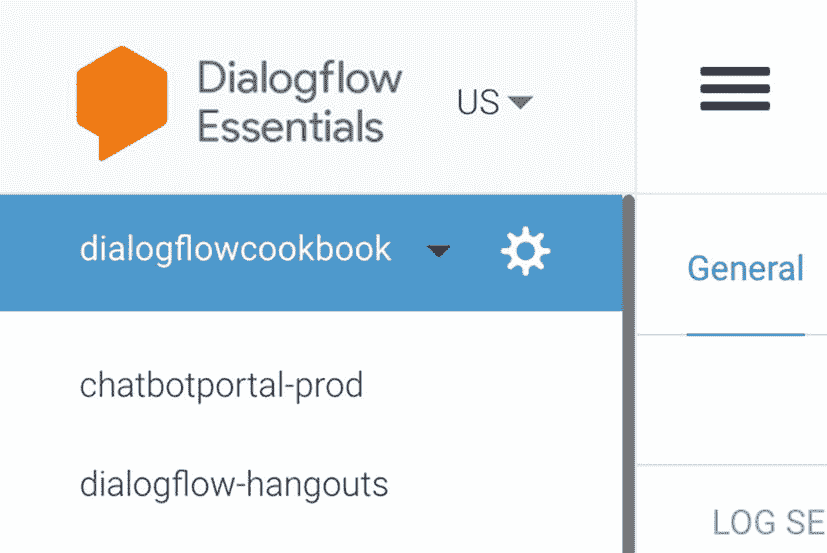
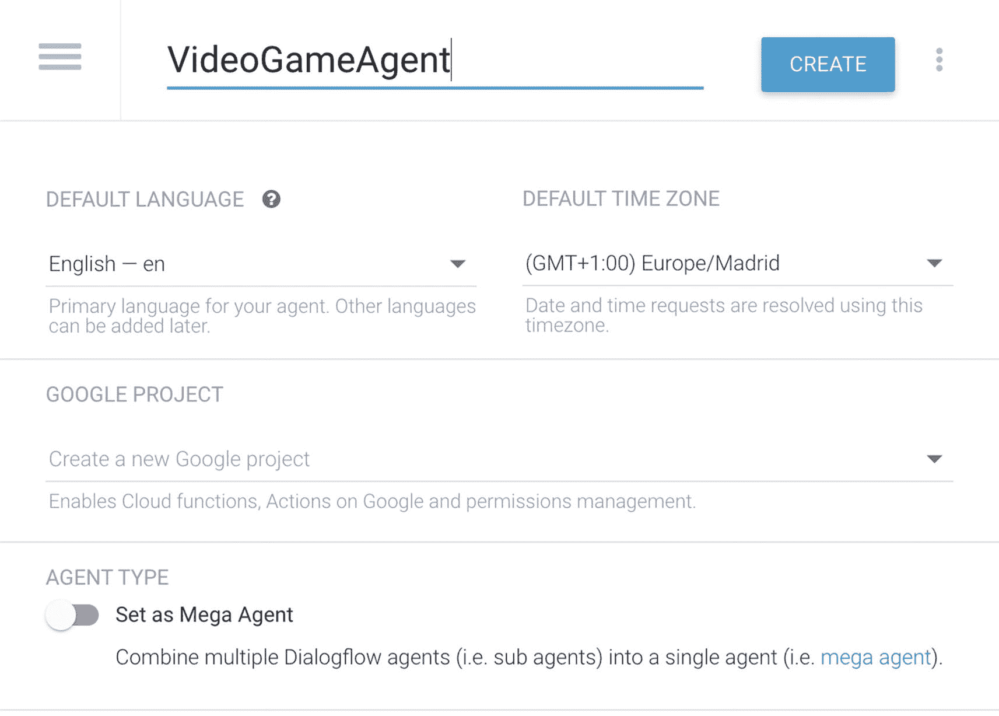

# Dialogflow Essentials 版本

`Dialogflow Essentials` 按量付费版是 `Dialogflow` 的企业级服务层级，属于 `Google Cloud` 的一部分。该按量付费版面向需要企业级服务的组织。`Dialogflow Essentials` 按量付费版覆盖了最重要的全球合规与监管标准（例如 `GDPR`），并提供 `SLA`、支持包以及 `Google Cloud` 服务条款。除此之外，它拥有更高的配额限制和语音交互功能，并与 `Google Cloud` 完全集成，便于使用其他云服务来构建完整的进阶解决方案。（例如，额外的机器学习 API，如 `Translation`、使用 `DLP API` 屏蔽敏感用户数据（`GDPR`）、使用 `NLP API` 进行情感检测、`Cloud Functions` 实现、用于分析的 `BigQuery` 数据仓库等。）

免费的 `Dialogflow` 试用版不属于 `Google Cloud`。

与其他免费的 Google 工具一样，`Dialogflow` 免费版属于免费 Google 消费者条款的一部分。这意味着，就像 `Gmail` 一样，您的数据可能被用于改进产品、训练机器学习模型或投放广告。

`Dialogflow` 数据在哪里处理？您可以在创建项目时进行选择。作为 `Google Cloud` 的一部分，也意味着最佳延迟。当您连接到 `Google Cloud` 时，您将使用海底的 `Google Cloud` 光缆。因此，您的连接将更快且更安全。

图 2-1

`Dialogflow` 位置下拉菜单

如图 2-1 所示，默认情况下，`PII` 数据（如聊天记录、分析数据和日志）存储在全局 `Dialogflow` 服务器中。在创建新的 `Dialogflow` 代理之前，您可以为 `Dialogflow` 项目选择一个位置。在撰写本文时，您可以选择美国、亚洲（日本）、澳大利亚（悉尼）和英国（伦敦），您可以在 `Dialogflow` 徽标旁边的下拉菜单中找到此设置。选择区域后，您将切换到一个新的 `Dialogflow` 环境，您可以在其中创建新代理。

**注意**

澳大利亚、亚洲和英国区域并非提供与美国（全球）相同的所有功能。例如，亚洲区域缺少测试版功能，如 `FAQ` 知识库，并且不附带预构建代理、闲聊和开箱即用的集成。最后一项看似必不可少，但您可以按照第 10 章所述手动构建集成。

此外，您可以在 `Dialogflow` 设置界面中关闭数据存储；参见图 2-2。点击 `Dialogflow` 徽标正下方的齿轮图标。一旦关闭数据存储，将不会存储任何 `PII` 数据。这对于需要处理 `GDPR` 的欧洲国家尤其有用。

**注意**

自英国脱欧以来，英国已不再是欧盟的一部分。这意味着，根据《通用数据保护条例（`GDPR`）》的合规要求，将日志和历史数据存储在英国区域是不合规的。最佳解决方案是在全局区域创建您的代理（以访问所有功能），但在 `Dialogflow` 中关闭所有日志。相反，您可以将聊天历史存储在 `Google Cloud BigQuery` 中，并选择欧洲作为区域。此方法在第 13 章中有详细说明。

图 2-2

设置面板中的日志设置

不过，我建议您仍然捕获聊天机器人的分析数据。您可以通过构建一个额外的层，将来自 `Dialogflow SDK` 的传入消息直接推送到 `Google Cloud BigQuery` 来轻松实现这一点。`BigQuery` 是 `Google Cloud` 的一部分，并且可以选择欧洲进行数据存储。其他 `Google Cloud` 资源允许您将数据存储在特定国家的数据中心。（例如，`Google Cloud Storage` 可以将数据存储在荷兰的数据中心。）

## 创建 Dialogflow 试用代理

`Dialogflow` 是一种软件即服务（`SaaS`）解决方案；它在浏览器中运行。

让我们创建一个示例代理。

打开 [`https://dialogflow.cloud.google.com/`](https://dialogflow.cloud.google.com/)。

使用 Google 身份登录。对于消费者，这可以是 `Gmail` 地址；对于组织，这可以是绑定到您自己域的 `Google Cloud Identity` 或 `Google Workspace` 实体。

如果您之前使用过 `Dialogflow`，您将自动登录到一个活跃的 `Dialogflow` 项目。

如果您是第一次登录 `Dialogflow`，可能会看到一个弹出窗口（参见图 2-3）。您需要同意 `Dialogflow` 试用条款和条件，以及额外的 `Firebase` 条款和条件。后者将在使用免费云服务时使用，例如内联实现编辑器，其底层使用免费的 `Firebase` 云函数。

图 2-3

首次使用的用户可以接受消费者服务条款

如果您计划在浏览器中或使用 `Google Assistant` 构建语音机器人，请确保已启用 **Web 和应用活动**。您可以从 [`http://myaccount.google.com/activitycontrols`](http://myaccount.google.com/activitycontrols) 访问此设置页面（参见图 2-4）。

图 2-4

Google 个人资料中的 Web 和应用活动

接下来，点击 **创建代理** 按钮。

要创建另一个新项目，请点击下拉菜单（位于 `Dialogflow` 徽标下方，参见图 2-5）。它将显示一个活跃的 `Dialogflow` 项目列表，在列表底部，会有菜单选项：**创建代理**。

图 2-5

您可以使用下拉菜单选择 `Dialogflow` 代理

在创建代理界面（参见图 2-6）中，您需要

图 2-6

在 `Dialogflow Essentials` 中创建新代理

*   设置一个 `Dialogflow` *项目名称*
*   设置一个*默认语言*（后续步骤可以添加其他语言）
*   设置一个*默认时区*（当对话映射到日期/时间对象时，将使用默认时区）

可选地，您可以指向一个现有的 `Google Cloud` 项目。如果留空，`Dialogflow` 将为您在 `Google Cloud` 中创建一个底层项目。

不要启用 **Mega Agent** 开关。我们将在第 9 章讨论如何使用此功能来编排多个子聊天机器人。现在，请保持其关闭状态。

点击 **创建**，`Dialogflow` 将为您创建一个新的 `Dialogflow` 标准（免费）项目。

